---
title: Victor Samaniego v. Her Majesty the Queen
published-title: Heard
date: 2021-11-05
sidebar: false
---

This transcript was made with automated artificial intelligence models and its accuracy has not been verified. Review the original webcast [here](https://scc-csc.ca/case-dossier/info/webcast-webdiffusion-eng.aspx?cas=['39440']).
---

**Justice Wagner** (00:00:01): Le corps, la corde!

::: {.column-margin}
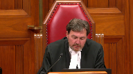
:::

Bonjour, veuillez vous asseoir.

Bonjour, Madame la Présidente.

En cas de Victor Samaniego contre Her Majesty the Queen, pour l'appellant Victor Samaniego, Chris Rudnicki et Karen Lau-Po Ong, pour l'intervenante de l'Association de l'Ontario, Louis P. et Michel B. pour l'intervenante

Her Majesty the Queen, Craig Harper et Jacob Milnes.

**Speaker 1** (00:01:08): Thank you Chief Justice and good morning Chief Justice and Justices.

::: {.column-margin}
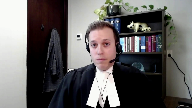
:::

When can the trial management power justifiably be exercised to exclude relevant and material defense evidence?

That is the central question on this appeal and it is a question this court has not yet answered.

We say this appeal presents that opportunity.

Trial judges need to know the limits of their case management power and appellate courts need to know when they are entitled to intervene in what is framed as a trial management decision.

On Mr. Samaniego's behalf we say that full answer and defense cannot be sacrificed on the altar of expediency.

We agree with Justice Pachaco that the trial management power is constrained by the rules of admissibility and the law of evidence.

**Justice Rowe** (00:01:58): Yes, now here's a key point that I want you to bear in mind, at least from my perspective in your submissions.

::: {.column-margin}
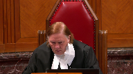
:::

The assumption embedded in this, which arises from what Justice Pachako says, is that this evidence was excluded by virtue of the trial management authority and that the exercise of that authority was not in accordance with the rules of evidence.

Another perspective is that applying the rules of evidence properly, this evidence was not admitted and therefore the judge did not have to rely upon the trial management power.

Now, I know it wasn't presented that way and the only reason I interrupt you at the beginning is because I think that's an alternative way of examining the issues here.

**Speaker 1** (00:02:53): Thank you, Justice Roe.

::: {.column-margin}
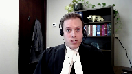
:::

And I'll note as well that the trial judge did not, for the most part, identify the locus of her exclusionary power in the trial management authority.

She simply said that these questions that were being asked by trial counsel were not relevant.

They were speculative or they were precluded by the preliminary inquiry judge's hearsay ruling.

And so that was the appeal below was litigated on the basis of her interventions in the cross-examination.

And so it was sort of framed as a question of trial fairness, of reasonable apprehension of bias.

But after the court heard submissions from the self-represented inmate, they appointed Mr. Perry on a 684 appointment and asked for submissions on this evidentiary issue, which is fundamentally the point at which Justice Pachocko departs from the majority.

So the point is well taken, Justice Roe, and we agree that these questions are best framed as questions of evidentiary questions.

By way of outline, Ms. Lau-Po Hong and I proposed to make three submissions on Mr. Semeniego's behalf today.

First, I will make submissions on why trial management concerns have no place in the analysis of whether a particular item of evidence is relevant, material, or subject to an exclusionary rule, allowing for the possibility that trial management concerns might be raised in the residual discretion, the balancing that happens between probative value and prejudicial effect.

Second, I will argue that the majority of the Court of Appeal failed to remain faithful to this framework, and as a result erred in finding that the trial judge was entitled to keep relevant and material defense evidence from the jury.

And third and finally, Ms. Lau-Po Hong will respond to the Crown's jurisdictional argument.

But at bottom, we say that when a provincial appellate court descends on the application of a legal standard, that triggers the right to appeal under Section 691 sub 1 sub a of the Criminal Code.

**Justice Brown** (00:04:58): There's another issue I'd like either you or your colleague to touch on is if the rulings were erroneous, and let me cut more to the chase, if the ruling regarding the gun, the second ruling, was erroneous, did that lead to a miscarriage of justice?

::: {.column-margin}
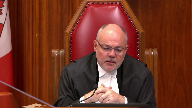
:::

Thank you for your attention.

**Overlapping speakers** (00:05:21): Thank you, Justice.

**Justice Brown** (00:05:22): good time in your own good time you don't have to address it right now whatever works for you thank you

justice Brown

I'll address it now because I think it's an appeal management thing not an admissibility ruling

**Speaker 1** (00:05:33): Justice below, Justice Pachocko, did address the question of the proviso and whether or not the exclusion of the evidence resulted in a miscarriage of justice and he said that the Crown did not invoke the proviso below and that for good reason because if this was a central component of the trial counsel's attack on the credibility of the central witness in the case against them and that an admissibility error that relates to such a central plank in an attack against the witness whose credibility is the central issue in the trial could only rarely be upheld under the proviso and that certainly not in this case.

::: {.column-margin}
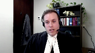
:::

So that would be my submission on the proviso and I would simply ask the court to adopt Justice Pachocko's analysis in that regard.

**Justice Brown** (00:06:24): Well, Justice Pacheco saw four errors.

If I were just to see one error, that one I pointed out to you.

Does that change your submission?

**Speaker 1** (00:06:39): it does not.

::: {.column-margin}
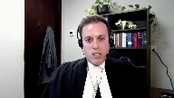
:::

I say that's the most serious of the four errors.

That error relates to specifically the capacity of trial counsel to advance the central component of their theory that this witness is prepared to lie under oath to protect his friend.

That's what he did at the preliminary inquiry and that's what we say he did at trial.

And the admissibility error with respect to ruling number two is specifically preventing trial counsel from advancing that theory by putting to that witness that this failure to recall who dropped the gun in front of him and who picked it up afterwards was in fact a feigned failure and was a concoction in order to protect his friend that co-accused Serrano is a very important piece of evidence and that keeping that from the jury was a significant impairment of the ability to cross-examine this critical witness.

So I say that's the most important of the four errors and even if that's the only error this court's prepared to find then the provisor shouldn't apply to save the conviction in light of that error.

And I'd invite Justice Brown, I'm sure you've read the transcripts carefully, but I'd invite you to read the way that that evidence unfolds at the preliminary inquiry closely because he's very careful not to identify his friend Mr. Matteo Ascencio.

He's very clearly saying at the preliminary inquiry to the Crown, my focus was on the person who was threatening me, the person I had a problem with who's alleged to be Mr. Seminiego and the Crown's almost cross-examining him and there's even one point where he almost slips and says that well who's around you at the time?

Well it was the two gentlemen Mr. Seminiego and Mr. Serrano and who picked up the gun?

Well I don't know who picked up the gun because my focus was on the guy who had a problem with and so the sort of like implication is that it's the other guy and then the Crown seizes on that and says well would that have been the guy in the baseball cap?

And he says oh I don't know, my focus was on the guy who I had the problem with.

So in my submission that certainly was open to the defense, it's an open inference on that record to have put to the security guard that he was lying to protect his friend and in preventing that I say it's a serious error.

So I'd like to draw a line in my submission between two components of the admissibility analysis and where the trial management power can fit in and the first is when is the threshold analysis of looking at whether or not evidence is relevant and material or subject to an exclusionary rule.

This court well knows that the law says that that evidence is admissible subject to the residual discretion and when we're in that first framework I say trial management concerns have no no have no place in the assessment either of the relevance of the evidence or its materiality or whether or not an exclusionary rule applies and further that on appellate review of those three questions the standard is correctness because either is evidence is relevant or it is not either it is material or it is not and either it is subject to an exclusionary rule or it is not and to and for a trial judge to say well this may be have some relevance

but I'm concerned about efficiency here

and so as a result I'm going to exclude it is to commit an error of law.

Now the residual discretion when we're moving into the second component of that framework and there's a balancing of probative value and prejudicial effect as we can see it in our factum that is a place where the trial management power could have some relevance in assessing the prejudice a question that's already been asked for example could diminish in probative value cumulative evidence that goes to the same issue might start to diminish in probative value and the prejudicial effect might start to mount in terms of distraction to the jury from their core task so in those circumstances we agree that the trial management power could have some impact on the balancing assessment that comes at the end but it would be an exceptional case when it's defense-led evidence because of course for defense-led evidence the right to make full answer in defense means that for it to be excluded under the residual discretion probative value has to be substantially outweighed by prejudicial effect but also the final point I'd like to make about that is simply that that's not what the trial judge relied on here the trial judge didn't say well I've assessed the probative value of this evidence against this prejudicial effect and I'm not satisfied that that it's substantially or I'm satisfied that prejudice substantially outweighs the probative value what happened here was the trial judge made a series of rulings really on relevance or the or the presence of an exclusionary rule and we say that justice pachocko was right that these are questions of correctness these are questions that engage the law of evidence and that the trial judge mistakenly applied that law.

**Justice Karakatsanis** (00:12:11): I guess I'm not sure that's entirely fair to the trial judge when you look at the cocaine issue number three.

::: {.column-margin}
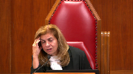
:::

Clearly the issue of prejudice to the co-accused was raised.

The issue of discredible conduct was looked at in the context of the agreement not to raise discredible conduct of the other co-accused.

And clearly, I mean, I'm not sure, I think that the transcript doesn't really bear out your comment that she wasn't relying on the prejudicial nature of the evidence in that ruling.

I'm giving you a chance to answer that.

**Speaker 1** (00:13:01): Thank you for raising that concern, Justice Karakatsanis.

::: {.column-margin}
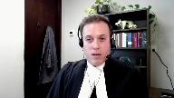
:::

I read the transcript differently.

Certainly, counsel for the co-accused raised a very vigorous objection when that question was put to Mr. Matteo Ascencio, and that part of that objection was the prejudice to her client, as one might expect.

I mean, it's her client's character that's being drawn into issue here.

But when one reads the transcript of the exchange between the parties and what the trial judge actually concluded about why this evidence wouldn't go in at the end of the day, the trial judge grounded her analysis in relevance.

She said this evidence isn't relevant to the charge that's on the indictment.

He's charged with a gun offense, and he's not charged with a drug offense, and also in speculation that this evidence had no basis in the brief exchange that we see in the video, nor in the fact that Mr. Serrano was arrested in possession of cocaine by police upon, shortly after he discarded the gun.

And I say when we read the record, we can see that what the trial judge is doing is saying, I'm not persuaded this evidence is relevant to any issue the jury has to decide.

Well, when I-

**Justice Brown** (00:14:20): When I read the record, I must say I'm unclear about the defence conduct's framing of that relevance.

::: {.column-margin}
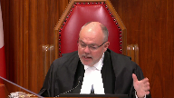
:::

I mean, justice Pachoko clearly sets out relevant and probative lines of inquiry that this could have been applied to, but there are arguments that defence council didn't in advance.

I mean, how far is a trial judge, if at all, supposed to probe with defence council matters of relevance and probative versus prejudicial value when defence council hasn't clearly laid that out in their submission?

Isn't that just sort of the end of it?

It's irrelevant.

**Speaker 1** (00:15:14): Justice Brown, the first thing I'll say is that a trial judge is obliged when undertaking the balancing analysis, this court has made clear, to identify specifically the probative value, to identify specifically the prejudicial effect, and then to engage in the balancing assessment.

::: {.column-margin}
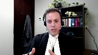
:::

Where are they supposed to identify?

**Justice Brown** (00:15:38): identify that.

Can they not take their cues from council on that and if council doesn't meet the standard then that's it.

The trial judge isn't there to make the case for defence counsel or for the crown for that matter.

**Speaker 1** (00:15:58): Correct.

The trial judges are entitled to rely on the assistance of counsel before them to help identify the probative value and the prejudicial effect of a given piece of evidence.

And certainly I will be the first one to concede that trial counsel could have been more helpful in this particular case.

**Justice Brown** (00:16:18): While I've got you, I'm really puzzled about what the trial judge was supposed to do on this inconsistency or supposed inconsistency about whether the security guard was scared at all times or just after the gun was dropped.

::: {.column-margin}
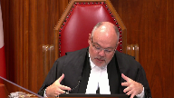
:::

So Defence Council appears to concede that the question was misleading because she says, oh, well, this can be addressed in re-exam.

But Serrano's counsel says, well, there's a problem.

Or rather she also says there's a problem.

There's a statement that contains other prejudicial information about a prior confrontation with the security guard.

So the trial judge issues a mid-trial instruction.

Now, the criticism at the dissent at the Court of Appeal is, aha, that prior statement was never proved, which of course is true, although arguably a moment later Defence Council puts effectively induces it by referring to one portion of a statement and another portion of a statement.

Putting that aside, what was the trial judge to do in that situation?

**Speaker 1** (00:17:40): Well, the point Justice Pachocko is making and the point with which we agree on appeal is simply that it's for the jury to make sense of whether or not a prior statement is in fact consistent or not.

::: {.column-margin}
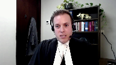
:::

And simply advising the jury that there is a consistency in a prior statement isn't the appropriate procedure.

And in particular, in this case, there's an internal inconsistency.

**Justice Brown** (00:18:02): This was a misleading exchange and as I say, even defense counsel concedes, oh, well,

::: {.column-margin}
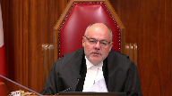
:::

yeah, I guess there's something to address and reexam, but we don't have to address it now.

Why wasn't the trial judge, I mean, this wasn't bolstering the security guard's credibility.

It was correcting a misleading exchange.

This is a jury trial.

**Speaker 1** (00:18:27): In my submission, when a trial judge is confronted with this kind of question, this is a question I should say that is distinct.

::: {.column-margin}
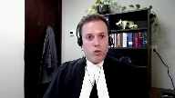
:::

The fourth of the rulings is distinct from the first three rulings.

The first three rulings very clearly engage questions of admissibility and are rulings that engage issues of relevance and issues of the presence or absence of exclusionary rules.

The fourth ruling is a procedural ruling, a ruling about how evidence is that everyone agrees is going to be presented, should be presented.

And so, it presents different.

**Overlapping speakers** (00:19:00): Sounds like Troy on the phone.

**Speaker 1** (00:19:00): management.

**Justice Karakatsanis** (00:19:01): Can I ask you this?

::: {.column-margin}
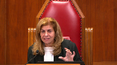
:::

What do you do with the trial judge's statement?

I'm looking at page 100 and 101 which says don't forget this is not evidence.

You were using that to test his credibility.

You were using it to test his evidence.

So essentially I just need to correct the impression that was left with the jury.

What do you say about that point?

**Speaker 1** (00:19:29): So I agree that the Justice Kerikatsanis, that the jury did need to have that impression corrected when trial counsel confronted the security guard on the specific statement that he told, and he specifically asked, did you tell, you know, when he was speaking to police officer, were you afraid at any part in this transaction?

::: {.column-margin}
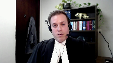
:::

He says, no, I wasn't.

I was calm.

I was focused.

And then later on, there's an inconsistency within the statement when he says, actually, yes, I was afraid because of the prior threat.

The point that's being made, I think, by Justice Pachocko in dissent is simply that that internal inconsistency might have been something that trial counsel could have confronted the security guard with.

Now, trial counsel didn't propose that.

This is a problem put to me by Justice Brown in another of the grounds of appeal.

And trial counsel didn't propose that.

But as Justice Pachocko says, everyone has the duty to ensure that the appropriate procedures are followed.

And in the facts of this case, it led to the jury being told that a prior statement was consistent when that is, in fact, their responsibility to decide.

And that's particularly aggravated by the second component of the fourth error that Justice Pachocko identifies, which is when in reexamination, the crown attorney says, well, sir, didn't, in fact, you identify at the preliminary inquiry that this person was your friend?

And he says, yes, I did.

And in fact, saying, isn't your testimony today consistent with that of the preliminary inquiry?

When that's not an accurate reflection of the record of the preliminary inquiry, when the witness, Mr. Matteo Ascencio, only identifies Mr. Serrano as his friend after two days of cross-examination where he says he can't remember anything, and then finally is told, listen, sir, identity is not an issue, okay?

You understand that?

And that's when suddenly some evidence about identification comes out from the witness.

So those two errors, when read together, we say represent the procedural error that Justice Pachocko was concerned with.

And in fact, we say we're a problem below.

But I do want to emphasize that it's a different character, different kind of problem than the problem in the first three rulings, which are straightforward problems of admissibility and relevance.

Justices, those are the submissions that I wanted to emphasize on the role of the trial management power in the admissibility analysis and on the particular errors in the court below.

Set it to any further questions.

I'd like to turn the matters over to my friend, my colleague, Ms. Lau Po Hung, to make submissions on the issue of jurisdiction.

Very well.

Thank you.

**Speaker 2** (00:22:18): Good morning Justices.

::: {.column-margin}
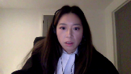
:::

In our submission, this court's decision in Benerius speaks directly to this court's jurisdiction to hear this appeal.

Writing for the court, Justice Arbuara held that a question of law under section 691A of the Criminal Code includes the application of a legal standard to a set of facts.

We submit to you in the case before you the disagreement between the majority and the dissent in this case was on the application of a legal standard.

Justice Bonato characterized the four impute rulings as trial management decisions within the discretion of the trial judge and Justice Pichalco wrote that the trial management power as important as it is is constrained by the rules of admissibility.

The inquiry for appellate access should avoid fine distinctions between pure and mixed questions of law or fact.

Rather, a broad purpose of approach is required.

As a threshold jurisdictional issue of appellate access, the application of a legal standard is enough to make the question a question of law.

It is of no import to suggest that it is not a pure question of law or that is not a question of law alone and that's from Benerius and and I think it's important to note that the the case that the Crown relies on, FanJoy, was not a jurisdictional threshold issue.

So in in our submission it doesn't really help this court determining appellate access under section 691-1 and I submit that ultimately in FanJoy this court held that there was a miscarriage of justice and

certainly I we submit that if FanJoy was decided today this court would have permitted appellate access based on the fact that the proviso was applied and there was miscarriage of justice ultimately as well.

And so our submission is that this court in Benerius, Yebez, Jolivy has rejected the view that mixed questions involving the question of a legal standard to a set of facts do not amount to a question of law.

And so our submission is that you should reject the Crown's narrow interpretation of appellate access and submit that there is appellate access under section 691-A. Subject to those any questions those are my submissions.

**Justice Wagner** (00:24:41): Thank you very much, Mr. Strasas.

**Speaker 3** (00:24:50): Yes, Chief Justice, justices, good morning.

::: {.column-margin}
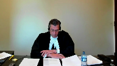
:::

I have one proposition that I respectfully ask this court to accept.

It is this, the trial management power ends where the rules of evidence begin.

And I ask you to accept this proposition because the rules of evidence and the trial management powers serve fundamentally different purposes and objectives in our criminal justice system.

First, the purpose of the trial management power is to control how the litigants act during the trial.

Its objective is to achieve efficiency in the trial of itself.

No case is an island.

Second, the purpose of the rules of evidence are to ensure fair, reliable fact finding.

Their objective is to the extent possible to protect the rectitude of the result.

And many rules, of course, have efficiency built into them in their operation and application, but efficiency, respectfully, in that situation is a byproduct.

It's my submission that by recognizing these fundamental differences in purpose and objective, both powers can be exercised within their proper bounds consistently and fairly.

The next point is that this approach that I suggest to the court by recognizing the differing purposes and objectives may assist the court in determining what divided the court below.

In a nutshell, the fundamental concern of the Criminal Lawyers Association is that the trial management power should not result in the misapplication or non-application of a rule of evidence, which seems to be at the root of the dispute below between the majority and the dissenting judge.

In short, I submit to you respectfully by recognizing the differing objectives and purposes between these two judicial powers.

The court will ensure that they are exercised fairly and consistently and that they can work together, and in the vast majority of cases they will and they must.

But it's my respectful submission to you that the trial management power is not a license to uphold wrong decisions on evidence law.

And finally, one way to think about this case as you approach it, and we set it out in our factum at paragraph 17, is that the trial management power is really not about outcomes.

That work is done by the application of the rules of evidence and substantive law.

Trial management no doubt complements the orderly and consistent application of the rules of evidence and substantive law by focusing on the issues that need evidentiary rulings, thereby enhancing, respectfully, the rectitude of the result in the first instance.

And that explains the differing standards of evidentiary appellate review.

On an evidentiary ruling, a court is assessing whether there was an error in principle that called into question the correctness or reliability or rectitude of the verdict, and that was Justice Pichaco's concern.

However, when an appellate court reviews a trial management ruling, the exercise is fundamentally different because of the different purpose and objective.

In that situation, the focus is on whether the exercise that discretionary power affected trial fairness and not necessarily the rectitude of the result.

In conclusion, it's my respectful submission to the extent this court presents an opportunity to stake out the differing purposes and objectives of the trial management power and the rules of evidence.

This framework that I respectfully urge upon the court may assist you in this area of law.

Those are my respectful submissions.

Thank you.

Thank you very much.

**Justice Wagner** (00:29:37): Mr. Craig Harper.

**Speaker 4** (00:29:41): Good morning, Chief Justice and Chief Justices.

::: {.column-margin}
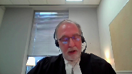
:::

In the Crown submission, this is a case about a trial judge's proper exercise of her discretion to intervene and prevent misleading or inaccurate cross-examination.

And in this case, in the Crown submission, that's what the trial judge did.

She properly intervened to prevent misleading and or inaccurate cross-examination of the witness that both the majority and the dissent found wanting.

And the exercise of her discretion in this area is a well-established authority that this court and other appellate courts have clearly delineated, although the power of...

**Justice Rowe** (00:30:23): If a trial judge, and it's been a heck of a long time since I've been a trial judge, but I think I can remember it, if a trial judge says, you know, this is irrelevant, or this is not sufficiently probative, but it's prejudicial, and it's really tangential, this whole thing, or you haven't laid the proper foundation to put a question of that nature, is that an exercise of trial management, or is that simply the application of the ordinary rules of evidence?

::: {.column-margin}
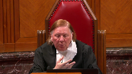
:::

**Speaker 4** (00:30:55): Well in the course of cross-examination justice role as it occurred in this case in my submission it often is an overlap in that exercise because what the trial judge is required to do in my submission is to ensure that there's an accurate record put to a witness in cross-examination and when there are issues with the accuracy of that it's up to the trial judge to ask council to delineate the basis of the relevance

::: {.column-margin}
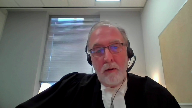
:::

and it's the obligation of council in this back and forth to ensure that the trial judge has the proper basis for determining relevance and as occurred in this case the trial judge did ask council council provided a basis that did not establish in the crown submission relevance and made a ruling on that basis.

**Justice Rowe** (00:31:47): trial management, or whether that's just the ordinary rules of evidence.

And I want to put this in a certain context.

Justice Rosenberg, you know, one of the most absolutely distinguished criminal jurists in Canada.

And I want to put this in a certain context.

Justice Rosenberg, you know, one of the most absolutely distinguished criminal jurists in Canada.

**Overlapping speakers** (00:32:03): and

**Justice Rowe** (00:32:03): in this history.

::: {.column-margin}
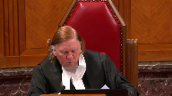
:::

In Felderhoff, when he described trial management, he listed several examples.

It wasn't an exhaustive list, but I'll just give it to you quickly.

Place reasonable limits on oral submissions.

Direct submissions be made in writing.

Require an offer of proof before embarking on a lengthy voir dire.

Defer rulings.

Direct the manner in which a voir dire is conducted.

And in exceptional cases, direct the order in which evidence is called.

All of those are intuitively trial management in the way that I think the Criminal Lawyers Association has addressed it.

The conduct of an efficient trial, as opposed to what seems to me to be a kind of a mislabeling here.

And I'll come to my point, forgive me for chewing into your time.

**Overlapping speakers** (00:32:54): none at all

**Justice Rowe** (00:32:55): labeling of the exercise of trial authority for what could more accurately be characterized as evidentiary rulings pursuant to the laws of evidence by the trial judge.

**Speaker 4** (00:33:12): I would agree with that.

::: {.column-margin}
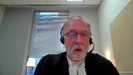
:::

Now first, I would just like to step back and say that Justice Rosenberg did delineate those powers.

However, in the case of Felderhoff, as I'm sure this court is aware, it was the result of a very lengthy, acrimonious trial where there were all sorts of procedural issues.

But pointedly, Justice Rosenberg said this list is not exhaustive.

But more to your point, Justice Roe.

Although we're talking about trial management, the power that is exercised by the trial judge in this case is a well-established power.

It is a power to ensure that counsel has put to the witness a proper record upon which they can cross-examine them on a material issue in the case.

So sometimes that will come down to ultimately making a ruling as to relevancy.

But part of this power also requires the trial judge, especially when there are valid objections, to sort out what the evidentiary record is.

And some of that is fact-finding, Justice Roe.

And this case is a good example.

Justice Brown raised the whole issue about the prior inconsistent statement allegation that the witness may have said he was not scared at one part of his statement, but was scared at another.

In order to determine that question, whether or not that was a fair or accurate precy of what he told the officer that he wasn't scared, trial judge has to see and look at the actual statement.

She has to satisfy herself that there is a factual basis to make that argument.

In this case, she found that there wasn't.

So it is partly a legal ruling, but it's also a fact-finding mission in a case where there's confusion, where there's misleading or inaccurate questioning on a record.

And keep in mind, Justice Roe, hearken back to your days as a trial judge.

You are sitting there without a full record before you.

You are reliant on counsel to provide you a proper record before you can make a ruling.

You cannot make a ruling about admissibility or even relevancy until you have a proper record.

**Justice Côté** (00:35:36): Mr. Harper, sorry to interrupt, how would you categorize ruling number two?

::: {.column-margin}
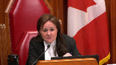
:::

Would you say that it is a ruling that the trial judge was entitled to make based on her management power?

Would you say that it is an evidentiary ruling?

**Speaker 4** (00:35:56): I would suggest I just want to be clear about this when we're talking about evidentiary ruling Justice Cote.

::: {.column-margin}
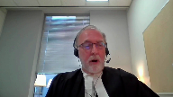
:::

It's an evidentiary ruling in this sense in that when trial council put to the witness a very broad statement which the trial judge ultimately found to be misleading she objections were made and she had to make a factual finding about what the actual record was about what the witness had testified to at the preliminary inquiry.

So she's making a factual finding and then she's making a ruling as to whether or not it's relevant or accurate and so this is a point that I made in response to my friend Mr. Strozos that this particular power although we're doing it under the modern day umbrella of of trial management is a very established power as VanJoy says it's mixed fact and law and in this case the trial judge first made a factual finding said it was inaccurate and asked her to reframe the question.

In fact trial council comes back to it as a memory issue this was not ultimately and this is part of the problem with records like this and the problem that trial judges face although we talk about it as trial management ultimately the trial judge is here to ensure that a fair record is put to the witness to ensure that when they're answering a question it's on a proper record because by definition that's the only way you ensure proper fact finding.

So in answer to your question it is a mixed question she has to make factual findings in the course of the cross-examination based upon submissions of council and then she determines whether or not the question itself can be put because it's not in this case it was not accurate it is a very broad question to say you didn't tell us at the prelim what you're telling us here today that's a factual finding that that's not what the record was she did not say that she he couldn't that she did not shut down trial council to challenge him on his memory or other in potential inconsistencies it was a factual finding she made that this was an inaccurate record place before the witness.

**Justice Côté** (00:38:25): As Justice Pacheco said, later evidence does not eradicate earlier evidence.

::: {.column-margin}
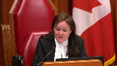
:::

It was clear at the beginning, the first testimony at the preliminary inquiry, there was an inconsistency with what the witness said after.

So – Sorry, I didn't mean to interrupt Justice Cote.

No, no, go ahead.

**Speaker 4** (00:38:46): As a base proposition, that's correct.

::: {.column-margin}
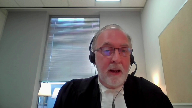
:::

But the question isn't what the general principles of evidence of relevancy are when it comes to prior inconsistent statements.

The question is what is council alleging to a witness at that point in time on the record?

So at that point in time, trial council puts before the witness lines from the preliminary inquiry about whether or not he saw the gun.

And the question that she asked was, so sir, my question is to you, why did you not tell what you're telling us today or yesterday?

And trial council at the preliminary inquiry gets knew that the witness had testified at the prelim that he had told the police the truth.

And there's a reference to that in the condensed book at tab 5G.

He is asked in chief whether or not what he told the police was true.

He said, yes, it was.

As you can see from the statement, he clearly identifies the roles of the two individuals, Mr. Samaniego and the co-accused Mr. Serrano.

And in this statement, he clearly told the police that the appellant had the gun and passed it to the co-accused who dropped it.

So that record was adopted for its truth at the preliminary inquiry.

So his evidence was also in its entirety that the appellant had the gun, passed it to his friend, the co-accused who ultimately dropped it.

The question that was asked was a very broad implication that he had somehow not said that.

That was a proper objection.

If the question had been different and had been differently phrased, then maybe there would be a point.

And this brings me back to a point that I probably made ad nauseam at this point.

There is an obligation on council to properly frame their questions and properly provide assistance to a trial judge.

**Justice Brown** (00:40:54): I agree with you, I agree with you, but let's, your time's limited, so I'm going to cut to the chase here.

::: {.column-margin}
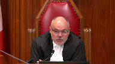
:::

I agree with you on that.

There's obviously that obligation.

But let's say that I think Council, let's just say for sake of argument that I think Council did frame the issue here, sort of lack of memory then, revival now, and so it's clearly suggestive of an inconsistency on this point that Justice Cote has raised with you.

So we have an error.

What do we do with it?

**Speaker 4** (00:41:27): If it is a legal error, I would submit that the proviso can be applied.

**Overlapping speakers** (00:41:33): And yet you haven't asked us to apply it, so what do we do with that?

**Speaker 4** (00:41:38): Well, on your finding, if you're just saying that there's the one error, I would submit that the provisor could be applied.

::: {.column-margin}
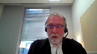
:::

As this court knows, your authority is only triggered if the request is made.

But if you are saying that it does, that is an error, I would submit that the provisor could be applied.

Yeah, so it is.

**Justice Brown** (00:42:02): It is just one error, assuming that it is just that, and maybe it's not, but your friend stresses not the quantity, but the quality of the error, that this really goes to the central point in the issue.

And that was the first time that I was able to do that.

**Speaker 4** (00:42:16): What do you say to that?

::: {.column-margin}

:::

I would submit Justice Brown that council was able to get to the issue, which was essentially a bias on the part of the witness towards the co-accused and that he was doing what he could to protect the co-accused.

She was able to ask questions in regards to his memory.

She was able to underline before the jury, the fact that the witness and the co-accused were friends, they were good friends, they socialized together and she was able to go to the jury with that theory that what has happened is that this witness who through his memory loss and through his friendship is somehow trying to provide a less inculpatory view of the co-accused.

So I would submit on the record before you that that was done effectively and that was before the jury and that ultimately if there was an error that it would not have affected the result.

**Justice Karakatsanis** (00:43:20): So can I ‑‑ I just want to make sure I understand your position clearly with respect to that second impugned ruling.

**Overlapping speakers** (00:43:32): Yes.

**Justice Karakatsanis** (00:43:32): Okay.

::: {.column-margin}
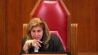
:::

Your position is that if the question had been did you say two different things at the preliminary inquiry, then that should have been allowed, but that in this case you're saying there was a factual determination or the nature of the question was did you say something different ultimately at the preliminary inquiry as opposed to today?

Is that did I understand your submission correctly?

**Speaker 4** (00:44:01): I think that the council could have raised any number of questions, Justice Carrick-Katsanis, but the issue is what the judge was dealing with, not what could have been asked.

**Overlapping speakers** (00:44:13): Yes.

**Speaker 4** (00:44:13): And what was put to her and her ruling is based upon what the question was against the record of the prelim.

**Justice Karakatsanis** (00:44:20): Right, but you're asking us to interpret that question or to interpret what the judge did with that question is as a matter of fact to see that question as trying to juxtapose consistent statement as between the prelim and trial and not different statements at the prelim.

::: {.column-margin}
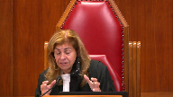
:::

**Speaker 4** (00:44:43): No, she made a factual finding as to what was implied in that question based upon what was provided to her, and that's the ruling that she...

**Justice Karakatsanis** (00:44:50): Okay, thank you.

**Justice Moldaver** (00:44:57): I think it would be hard to suggest that the jury would have been terribly misled by all this because the council for the appellant puts the problem to the juries through cross examination squarely.

::: {.column-margin}
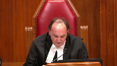
:::

And then volume 3 page 94 and 5, you get the question being put, the reason you put the gun to Mr. Samiego's possession is because your friend, your true friend, close friend dropped the gun in front of you and you want an explanation for that for yourself and for others as to how he got the gun.

Answer, I don't agree.

Weren't you shocked that your close friend took the gun into the club?

Maybe if he didn't grab it, I wouldn't be here talking to you or talking to anybody.

Again, you're trying to make Mr. Serrano look saintly.

The court, okay, you know part of this will be for your submissions, not for him right now.

The effect of that is save some stuff for argument, but the basic premise, the basic concern, the basic inconsistency and the basic motive for the inconsistency is there.

The jury has this and I can't imagine it would have been lost on them.

**Speaker 4** (00:46:18): I would agree with that Justice Muldaver that ultimately council wrapped up her cross examination with highlighting that point she put through her cross examination and she established at the as she tried to establish at the prelim that the witness was a friend of the co-accused that he was doing all of this on the basis of friendship.

::: {.column-margin}
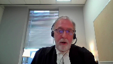
:::

I think she may have used the word savior at one point or angel.

This is all clearly before the jury.

**Justice Brown** (00:46:53): I agree with you.

::: {.column-margin}
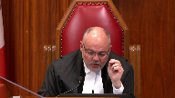
:::

I think the theory, the defence theory that the security guard is supporting his pal is clearly before the jury. Yes.

And I'm really struggling on this point.

So I'm sorry to interrupt.

Not at all.

The problem that I have is that the inconsistency itself which would have been supportive of that theory, supportive of that theory was not before the jury because let's just accept hypothetically of an error by the trial judge.

**Speaker 4** (00:47:26): I would submit that that was not put before the jury if it was to be put before the jury because council saw fit to conduct her cross-examination as she did and the question that you're referring to that council put to her embedded and a much more broadly worded assertion that he was lying at large

::: {.column-margin}

:::

and that's what the trial judge had to deal with and in fairness the trial judge justice brown it's what she

it's the record that she's working with at that point in time with the assistance of council it is not after the fact when all of the evidence has been put before the jury

and she has time for detached reflection so within the context of this case that was an appropriate ruling council was allowed to attack the whole issue of memory and how it had differed from the prelim and asking questions about whether or not his memory was he had specific memory problems related to the case or general memory problems

but she was able to uh address this issue in her continuing cross-examination the ruling that is an issue was appropriately made on the record before her on the submissions that were made and uh trial council was agreed that she uh that the prelim included his evidence that he had adopted as the truth the truth that he had seen uh mr samaniego with the gun and then passed it to mr saran

no and when she attempted to explain its relevance she referred to it as the witness's memory so that is the theory that was put to the judge in this case

and that's what she ruled upon and in fairness to trial judges they rule upon what's before them not what hypothetically could have been argued uh before them before them

i don't know if that assists you justice brown i am mindful of my time

**Justice Brown** (00:49:46): I'm mindful of your time, too, so, so, uh...

**Justice Rowe** (00:49:49): Although, although, you know, it ain't real complicated.

::: {.column-margin}
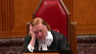
:::

Just to put the question, the relevance of the question, you said one thing then, you said another thing later.

How come you said two different things at different times?

You know, how can we rely on your other testimony, et cetera?

I mean, it's connecting the dots on that one seems to me to be not a big exercise on the trial judge's part.

**Speaker 4** (00:50:22): Well, again, Justice Roe, and I'm just going to be repeating my answer to Justice Brown, the trial judge was provided with a record of what he said at the prelim.

::: {.column-margin}

:::

The question was phrased in such a way.

And again, as a trial, former trial judge, you appreciate this.

The trial judge is in the midst of the trial.

She is aware of the issues.

She is aware of the to and fro.

And so when she hears that question, she interpreted as a general implication of lying, as she was entitled to do.

And counsel says memory.

And she's entitled to rely upon that.

And on the basis of what was put to her by counsel, she was entitled to make that ruling, I would submit.

And I can't, you know, provide a different answer, because ultimately, this is a fact specific situation that ultimately did not impede the defense in its attack on the witness.

**Justice Martin** (00:51:24): And so are you suggesting then that had Defence Council in that exchange said I'm putting this forward to challenge the witness in terms of either bias or credibility that the evidentiary ruling would have been different?

**Speaker 4** (00:51:40): It could have been, but again, it would have depended on any ruling can be different, Justice Martin, depending on how it is framed by counsel.

::: {.column-margin}
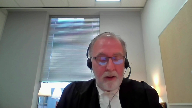
:::

And ultimately, the trial judge is required to make a ruling based upon how it's framed and how it's expressed and taking into account what other factual issues are at play in the trial.

If I can just briefly move to the issue raised by my friend, Mr. Strezos.

It's the Crown's position that the intervener and the Crown are at idem on the basic premise that evidence that tends to distort truth-seeking at a trial or to hinder reliable fact-finding should not be admitted.

And an inaccurately stated piece of evidence in a confusing cross-examination is not admissible because it distorts the truth-seeking function of the trial, and it hinders reliable fact-finding.

And I would, I appreciate that my friend had spent a great deal of thoughtful effort on the rationale governing the rules of evidence, but the intervener is not, in my submission, taking any issue with the long-established right recognized in this court and others, this court and little but Murray, Pennsylvania, and the rest of the country.

This court and little but Murray, Polanco, and others in this province's Court of Appeal that the trial judges have an undisputed right to exercise his or her discretion to ensure that cross-examination is done fairly and on a proper record.

And I don't take my friend as either contesting this or really addressing this consistent line of authority from this court and others, that trial judges have a discretion to intervene in cross-examination that is misleading, misrepresentative, confusing, abusive, or repetitive.

And only three decisions of this court need to be highlighted that are undisputed.

FanJoy, which is before you in the condensed book at tab 3B. Madui, this court actually said that even tangentially relevant evidence can be excluded in cross-examination by the defense.

And little of this court stated that a trial judge can even require counsel to enter into a voir dire on contested evidence on cross-examination.

And my friend states that there's a growing trend of merging trial management and evidentiary rulings, but I would submit that this has not been demonstrated, that this is simply an exercise of an age-old authority that is necessary to ensure accurate fact-finding.

And there is a growing tend, as demonstrated by this court's pronouncements in Jordan and Cody, to encourage judges to ensure the efficient use of time by eliminating wasteful efforts and issues that distort the basic function of a trial, the search for the truth.

And I would submit that ultimately the position is a false dichotomy.

The trial judge in this realm is not always exercising a purely evidentiary function or a trial management function.

In many cases, and this is one, it is a merging of factual findings and rulings as to what is permissible.

And the discretion to limit cross-examination to relevant issues serves exactly the same function as the evidentiary rules.

I would also note briefly that my friend relies upon the decision in Bordos.

I note that Bordos was decided on an issue not before the court.

The case management powers under 551.3 sub 1D, which is a scheduling power, and the court still reined in cross-examination.

And I also note that the case management powers in the code at sub G include a power to rule on admissibility.

Now, dealing with the issue of jurisdiction.

**Justice Moldaver** (00:55:36): I just want to be clear about this number two point, the gun. Yes.

::: {.column-margin}
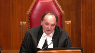
:::

Do I have it right that the question that the defence council put was why he was not telling the jury the same story at trial as he said at the preliminary? Yes.

That's the way it was put.

That's correct.

And of course, and that's the basis upon which, if I understand it, she wanted to be able to, I don't know, go further or whatever or use it.

And that is kind of misleading.

I mean, because we know that he did say what he's saying at trial at the preliminary, albeit after he has his memory refreshed.

So is that your point here that trial judges are not to be mind readers?

They react to submissions that are made to them.

And quite frankly, while there's no question that Justice Pachoko's readings are probably a model and a textbook for evidentiary rulings that could be made,

you can't just, in the calm and quiet of a court of appeal, sort of say, ah, trial judge, you should have known that the real reason behind this was to make an important credibility finding, because the question that was put was really quite misleading.

I think that's your point, but I just want to be clear about this.

**Speaker 4** (00:57:30): That's exactly my point and that was the point raised by Council at trial that the question was so broad that it did not accurately reflect what he said and that he's told the court that what he told the police was the truth at a statement was admitted for as past recollection recorded so it was his evidence and that was the factual matrix that the trial judge had to deal with and I note at the risk of being facetious that although trial judges are required to have many qualities many qualities, clairvoyance is not one of them, and the...

::: {.column-margin}
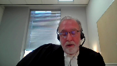
:::

**Justice Rowe** (00:58:07): Okay, but since we're down in the weeds here, since we've decided to be very granular, what's wrong with defense counsel saying, you said something different, didn't you, before? Yes.

::: {.column-margin}
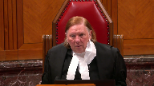
:::

No further questions, redirect.

Now, is it not also true witness on the redirect that you corrected your statement and you said the following?

That's true.

Matter cleared up.

I mean, as opposed to bringing down the ax and saying you can't even get into the prior inconsistency.

**Speaker 4** (00:58:44): But that's not the record and that's not the basis upon which it was argued.

::: {.column-margin}

:::

It wasn't that Council was suggesting that she was building up to the point that Justice Pichaco made in dissent.

She said it went to his memory.

And again, back to the original point, Justice Rowe, the issue is what a trial judge is dealing with before her at that point in time.

It is not what may have been stated after months of detached reflection.

It's not going to be where you have a chance to think through all the permutations of it against the record as a whole.

So in, that is what she was dealt, that is the question and the submissions that she dealt with.

That is the ruling upon which she made it and therefore in my submission it was correctly made.

I'm cognizant of my time.

I will simply rely upon my submissions in the factum for the jurisdictional question.

**Justice Wagner** (00:59:42): Very well, thank you very much.

Any reply Mr Rudnicki?

**Speaker 1** (00:59:52): Thank you, Chief Justice.

::: {.column-margin}
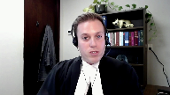
:::

Yes, I'd like to make three brief points in reply.

First, on the issue of what trial counsel said about ruling number two, it was not that she said this simply goes to his memory.

What she said specifically, and this is in the condensed book at page 47, my condensed book, is that surely I can challenge him on his lack of memory he had at that time and the revival of that memory now.

What she's saying is, surely I can challenge him on a prior inconsistency.

And the trial judge says, well, counsel, that's not an inconsistency.

And in our submission, that what the trial judge said was wrong.

The second point I'd like to make is that the right to full answer and defense does not entail the right to put one's position before the jury.

Surely it's true that trial counsel in this case had the opportunity to put her position before the jury.

The right to full answer and defense involves the right to marshal all relevant and material evidence not subject to an exclusionary rule and whose probative value is not substantially outweighed by its prejudicial effect.

That's the problem we say is involved in this case.

And finally, just on the application of the proviso when it comes to questions of credibility, I can do no better than point this court to its own decision in the Queen and Little from 2004 when the issue was the curtailing of cross-examination on the erroneous basis that it lacked a good faith basis.

And on the issue of the proviso, this court held as follows.

The Court of Appeal, this is at paragraph 69 to 71, the Ontario Court of Appeal recognized that the importance of cross-examination becomes even more critical when credibility is the central issue in the trial.

In a case where the guilt or the innocence of the accused largely turned on credibility, it was a serious matter to limit the accused of his substantial right to fully cross-examine the principal crown witness.

It would not be appropriate in the circumstances to invoke or apply the curative proviso.

The Manitoba Court of Appeal echoed these sentiments in the Queen and Wallach.

Cross-examination is a most powerful weapon of the defense, particularly when the entire case turns on the credibility of witnesses.

An accused in a criminal case has the right of cross-examination in the fullest and widest sense of the word as long as he does not abuse that right.

Any improper interference with the right is an error which will result in the conviction being quashed.

It follows that where, as here, a trial judge improperly interfered with an accused's right to cross-examination, infused a mistrial chill into the proceedings and placed conditions on a legitimate line of questioning that forfeited the accused's statutory right to address the jury last.

Those issues aren't at issue here, but 59 to 70 certainly are.

A substantial wrong has occurred and an unfair trial has resulted.

The bottom line here is that the accused has the right to challenge their accuser and to marshal relevant evidence in that regard.

And where, as here, that evidence was improperly limited, a new trial should follow.

Thank you.

Those are my submissions.

**Justice Brown** (01:03:03): Chief Justice, could I just ask a quick question?

Yes, go ahead please.

I'm just wondering, is Mr. Simoniego still in custody or has he reached statutory release at this point?

**Speaker 1** (01:03:12): He has been released justice brown. Thank you

**Justice Wagner** (01:03:15): All right, thank you.

Thank you to council for your submissions.

The court will take the case under advisement.

Thank you.