---
title: Her Majesty The Queen v. Richard Vallières
published-title: Heard
date: 2021-11-12
sidebar: false
---

This transcript was made with automated artificial intelligence models and its accuracy has not been verified. Review the original webcast [here](https://scc-csc.ca/case-dossier/info/webcast-webdiffusion-eng.aspx?cas=['39162']).
---

**Justice Wagner** (00:00:26): Bonjour à tous, veuillez vous asseoir, dans la cause de Sa Majesté la Reine contre Richard Salière, pour la Plante, Sa Majesté la Reine, Julien Beauchamp, La Liberté et

**Justice Wagner** (00:00:40): and Eric Bernier for the Intervener Attorney General of Ontario, Melissa Adams, and Valerie Bailey for the Intervener Attorney General of Ontario, Melissa Adams, and Valerie Bailey for the Intervener Attorney General of Ontario, Melissa Adams, and Valerie Bailey for the Intervener Attorney General of Ontario, Melissa Adams, and Valerie Bailey for the Intervener Attorney General of Ontario, Melissa Adams, and Valerie Bailey for the Intervener Attorney General of Ontario, Melissa Adams, and Valerie Bailey for

**Justice Wagner** (00:00:53): pour l'intervenant de l'association québécoise des avocats et avocates de la défense.

Alors, maître Beauchamp de la liberté ou maître

**Speaker 1** (00:01:05): Le juge en chef, mesdames, messieurs les juges, je prendrai la parole pour la plante tout d'abord.

::: {.column-margin}

:::

Premièrement, je tiens à remercier la Cour pour la permission que vous nous avez accordée de vous adresser à vous aujourd'hui, de vous soumettre les présentes questions à litige.

Comme je le disais, je m'adresserai à la Cour pour répondre à la première question à litige que nous vous soumettons, à savoir la détermination du montant de l'amende.

Et mon collègue, maître Éric Bernier, fera à son tour les représentations de la plante sur la seconde question relativement à la règle, ou dit alteram partem, alors qu'il en plaise à la Cour.

Je commencerai ainsi «

The words are crystal clear.»

Les mots sont cristal clairs, les mots sont limpides, les termes utilisés par le législateur sont limpides.

Le montant de l'amende compensatoire doit égaler la valeur du produit qui aurait été confisqué autrement si ce n'avait pas été, par exemple, du fait qu'il avait été dilapidé.

Mais adopter le raisonnement de la Cour d'appel, comme elle le propose à son arrêt, c'est lancer le message suivant, c'est lancer le message que le crime paie, bel et bien, et non que le crime ne paie pas.

Ce ne sont pas que les profits de la criminalité qui doivent être confisqués, mais ce sont la valeur totale des produits de la criminalité, tel que l'article 462.37 le libelle clairement, telles les définitions de produits de la criminalité et de biens au Code criminel, le libelle également clairement.

**Justice Côté** (00:02:41): de la liberté,

::: {.column-margin}
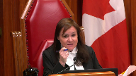
:::

justement,

à propos de ces définitions, j'ai besoin de votre éclairage.

Évidemment, 462.373, comme vous l'avez dit, parle d'une amende égale à la valeur du bien.

Et lorsqu'on regarde la définition de produit de la criminalité, on a bien, bénéfice ou avantage.

Et après ça, on a la définition de bien.

Alors ici, comment je dois considérer les mots bénéfice ou avantage qui se trouvent dans la définition de produit de la criminalité, en plus du mot bien?

**Speaker 1** (00:03:23): Tout à fait.

::: {.column-margin}

:::

En fait, Mme la juge, je vous réfèrerais principalement au paragraphe 1 de 462.37, lorsqu'on parle d'un bien faisant l'objet de la confiscation.

Alors, le paragraphe 3, l'amende égale à la valeur du bien, évidemment, on parle d'un bien pouvant être confisqué.

Et donc, le produit de la criminalité, le bien, le bénéfice ou l'avantage, évidemment, l'avantage immatériel ou le bénéfice immatériel ne pourrait pas faire l'objet d'une confiscation.

Alors, nous sommes le régime, évidemment, de la confiscation parce que c'est le régime de base, bien, ça applique à un bien tangible, à de l'argent, à un bien confiscable.

Et donc, le bien visé, et effectivement, comme vous l'avez mentionné, c'est là qu'on se rapporte à l'article 2 du Code, à la définition de bien.

Évidemment, on parle de choses de bien dans la possession ou sous le contrôle d'une personne.

Et donc, le bien étant toujours par le retour à l'article de la confiscation du produit de la criminalité, eh bien, dans ce cas-là et dans le cas factuel de M. Vallière, eh bien, le produit de la criminalité était le sirop d'érable volé, obtenu par le vol ou obtenu par la fraude.

Alors, dans le cas factuel…

C'est le bien qui pouvait être confisqué.

**Justice Côté** (00:04:52): C'est le bien qui pouvait être confisqué initialement, c'était le sirop d'érable, donc c'est pour ça que vous dites que c'est ça qu'on doit regarder.

**Speaker 1** (00:05:00): Tout à fait.

::: {.column-margin}

:::

Et également, sans rentrer dans un argument lexical ou un argument de traduction, mais le terme « bénéfice » en français ou le terme « benefit » en anglais n'a pas nécessairement non plus la même connotation.

Alors, l'intention du législateur, il est clair, c'est la confiscation des produits de la criminalité et dans le cas en l'espèce, dans le cas de M. Vallière, le produit de la criminalité, donc le bien obtenu au Canada, bon, ou à l'extérieur du Canada, directement ou indirectement, de la perpétration d'une infraction désignée, donc le bien obtenu par la commission de l'infraction, c'est quoi?

C'est le sirop d'érable, tangible comme tel, bien matériel, qui est obtenu par le vol de la fédération ou la fraude à l'égard de la fédération.

Alors, ça m'amène également à votre question.

**Justice Wagner** (00:05:52): Je vais vous interrompre, maître.

::: {.column-margin}

:::

Là-dessus, on parle de 10 millions.

Maintenant, à cause de l'admission de M. Valière ou parce que je vois des chiffres également de 17 millions, de 21 millions.

Alors, pour identifier la valeur du CIO d'Érable, donc le bien sur lequel vous prétendez, ou en tout cas l'État prétend pouvoir réclamer le montant, pourriez-vous m'expliquer comment on est arrivé à 10 millions par rapport à 17 et 21?

**Speaker 1** (00:06:22): Monsieur le juge en chef, merci pour la question.

::: {.column-margin}

:::

Les faits, évidemment, les faits sont très importants et je pourrais d'emblée faire un lien avec la seconde question qui vous est soumise, mais les valeurs comme telles sont les valeurs suivantes.

Alors, ça ressort des différents jugements antérieurs.

Le produit, le produit volé, la quantité de produits volés est en réalité plus ou moins 5,9 millions de livres de sirop d'érable.

Et la preuve qui a été administrée en première instance est d'une valeur marchande, d'une valeur nominale de plus de 21 millions de dollars, mais effectivement la Cour, à certains endroits, retient le chiffre de 17 millions de dollars.

Pour les fins de l'exercice, que la Cour ait retenu 17

ou que la preuve ait démontré 21, je vous dirais que l'effet n'est pas la différence entre les deux montants à ce stade-ci, n'est pas un enjeu, en ce que la valeur du sirop lui-même était de là, de toute façon, bien supérieure à 10 millions de dollars.

OK, mais, Monsieur…

**Justice Rowe** (00:07:26): Monsieur le maître, est-ce que le bien ici, est-ce que c'est le sirop d'érable volé ou est-ce que c'est l'argent provenant du trafic?

**Speaker 1** (00:07:40): Alors, le bien est le sirop d'érable.

::: {.column-margin}

:::

Le produit de la criminalité provenant directement de la commission d'infraction est le sirop d'érable.

Maintenant, la valeur obtenue de Richard Vallière, de l'accusé, de l'intimé, en fait, la conversion du bien et la valeur obtenue par la conversion de ce bien-là a été de 10 millions de dollars.

Alors, pour répondre également à votre question, M. le juge en chef, le 10 millions de dollars de l'appel, c'est ce que le juge a obtenu.

C'est-à-dire qu'il a obtenu 10 millions de dollars.

Et, évidemment, c'est ce que le juge d'instance, ce que la Cour d'appel retient.

Également, c'est un fait très important qui est le plus important, c'est le fait qu'il a obtenu 10 millions de dollars.

Et, évidemment, c'est ce que le juge en chef, le juge en chef, a obtenu.

C'est un fait très important qui est soumis à la Cour.

La Cour d'appel, notamment au paragraphe 223, 224, retient et je cite, en fait, que la totalité de ces montants, soit le 10 millions de dollars, sont des produits de la criminalité, considérant que Richard Vallière a reconnu que son seul revenu en 2011-2012 provenait de l'achat et la revente de sirop.

Et au paragraphe 224, vu la conclusion que la totalité du sirop vendu par Richard Vallière pendant la période infractionnelle provenait soit du vol ou de la fraude, le juge pouvait conclure que ces sommes sont des produits de la criminalité au sens de 462.37.

**Justice Kasirer** (00:09:14): Je suis d'accord avec vous sur le fait que c'est un détail.

::: {.column-margin}

:::

Je suis d'accord avec vous sur le fait que c'est un

**Speaker 1** (00:10:43): Tout à fait, monsieur le juge.

::: {.column-margin}

:::

En fait, tout d'abord, permettez-moi respectueusement, la pièce S2 telle qu'elle vous est présentée dans le dossier de la plante

est la pièce intégrale qui a été présentée au juge du procès et vous voyez par la pièce en elle-même, en fait, la pièce S2 se retrouve à notre volume 1 du dossier de la plante à la page 144, il s'agit en fait d'un aide à la décision pour le tribunal d'un résumé de la preuve qui a été présentée avec les différentes sources, les différentes références de pièces ou de témoignages pour guider le juge d'instance dans les différentes demandes.

Et je prends la, je vais prendre la pièce, pardon pas la pièce, mais la page, la deuxième page de 2 de 7 où les détails des valeurs du vol, de la fraude, du vol et de la fraude sont présentés à la Cour.

Les pertes également pour en arriver en fait aux présentations, notamment du 8 millions de dollars qui représentent les comptes bancaires.

Et vous avez raison, la pièce P46 était l'une des pièces qui a été déposée au procès qui étaient les comptes de banque, les journaux des opérations des comptes de banque de M. Vallière.

Elle n'a pas été reproduite ici en instance puisque tant le juge d'instance dans sa décision que la Cour d'appel à son arrêt est clair sur la preuve, il n'y a pas de dispute quant au témoignage de M. Vallière et à son admission de la somme de 10 millions de dollars.

En fait, dans et lorsqu'on prend le témoignage même de M. Vallière pour répondre directement à votre question, lorsqu'on prend son témoignage et pour référence je serai à notre volume 2 du dossier de la plante, à la page 97 du dossier de la plante.

Alors nous nous trouvons dans le compte interrogatoire de M. Vallière, préalablement à ce moment, lui a été présenté les comptes de banque, trois comptes de banque principalement, un compte personnel et des comptes d'entreprise.

Il a confirmé qu'il était le seul titulaire responsable des comptes de banque.

Il a confirmé au préalable également par des questions-réponses que les seuls entrants sortant, les seules transactions qui ont été faites par ces comptes sont pour acheter ou vendre du sirop d'érable volé ou fraudé.

Donc la question lui est posée, et je cite à la page 97, à la ligne 5, donc en entrant, en argent qui rentre dans votre compagnie, combien d'argent a rentré à l'été 2011-2012 et lui-même de répondre, et je cite sa réponse, peut-être 10 millions.

Question 10 millions, réponse environ oui, question supplémentaire là, et le seul revenu que vous aviez c'était d'acheter du sirop d'érable, réponse oui.

Et les questions se poursuivent, se détaillent par la suite.

Alors, et même plus loin, on fait page 98, ligne 2, je cite question le 10 millions, c'est du profit ou c'est, la question n'est pas complétée, mais lui-même de répondre c'est le brut, c'est ce que les compagnies m'ont payé pour acheter.

Et donc, rien de mieux qu'un aveu de l'accusé lui-même quant à la valeur, quant aux sommes d'argent qu'il reçoit en vendant le produit de la criminalité.

**Justice Wagner** (00:14:29): de toute façon j'ai compris que le juge d'instance et la cour d'appel s'entendent pour dire que la valeur des biens c'est 10 millions.

::: {.column-margin}

:::

Alors la vraie question je vous le soumets ici dans le litige c'est de savoir pourquoi et si la cour d'appel avait raison de décider d'utiliser la valeur des profits comme référence pour effectivement bien déterminer la peine imposée ici plutôt que la valeur des biens comme d'après ce que je comprends les autres cours à travers le pays ont conclu que c'était la bonne valeur pour imposer une telle pénalité.

Je pense que c'est ça l'enjeu ici et jusqu'à quel point effectivement pour éviter le dédoublement il y avait lieu à affecter un peu la proportionnalité du montant auprès des autres complices dans le dossier.

Le troisième enjeu c'est à quel point et pourquoi la cour d'appel a décidé d'elle-même sans demander des arguments au parti de changer ou en tout cas d'apporter une façon de voir le calcul d'une telle pénalité.

**Speaker 1** (00:15:42): Tout à fait, M. le juge en chef.

::: {.column-margin}

:::

Et en fait, vous, d'emblée, vous le ciblez très bien.

Non seulement les cours d'appel canadiennes reconnaissent, et l'état du droit était unanime, et même votre cours, respectueusement, mais avez également reconnu un état de droit unanime à la décision, à votre décision, Rafilovic, à 2019, à l'âge de 20 ans.

**Speaker 1** (00:16:03): que la distance de l'État était claire, l'amende doit égaler la valeur du produit.

::: {.column-margin}

:::

Maintenant, c'est ce qui amène une autre de vos questions, l'objectif ou l'intention que la Cour d'appel a eu en créant un nouveau pouvoir discrétionnaire, un troisième pouvoir discrétionnaire pour un juge d'instance de choisir entre le produit, la valeur du produit, ou le profit, eh bien, il est là l'erreur, évidemment, l'erreur centrale de la Cour.

Il n'y a pas de pouvoir discrétionnaire, de choisir entre la valeur du produit ou la valeur du profit.

Les termes du législateur sont clairs, tant l'article lui-même, tant les débats de l'époque, les débats parlementaires de l'époque, que l'interprétation législative, l'application jurisprudentiale, pardon, qui a été faite au courant des années, et jusqu'à, jusqu'à encore, permettez-moi, jusqu'au mois de septembre dernier, et même nous le, nous citons, en fait, la décision charrière dans notre recueil condensé, puisqu'il s'agit d'une décision de septembre 2021, donc septembre de décision tout récente, même la Cour d'appel elle-même à la décision, la reine contre, en fait, Olivier Charrière contre la reine du 9 septembre 2021, à l'onglet 7 de notre recueil condensé, même la Cour d'appel du Québec reconnaît encore l'état du droit comme il devrait être, et comme nous soumettons aujourd'hui à la Cour qu'il est, et je cite le paragraphe 223, «

L'amende de remplacement s'impose, quant à elle, dans le contexte du remplacement d'une ordonnance de confiscation.

Lorsqu'il est établi que les produits du crime ne peuvent être confisqués, le juge peut infliger une amende aux délinquants pour en tenir lieu, donc tenir lieu à la confiscation.

L'amende est versée dans les coffres de l'État et non à la victime.

» Et en particulier, l'extrait suivant, «

L'amende doit être égale à la valeur du bien qui aurait dû faire l'objet de la confiscation, car l'équivalent entre la valeur du bien et le montant de l'amende est inhérent à la notion de remplacement.»

**Overlapping speakers** (00:18:18): Alors, qu'est-ce qui s'est passé dans ce dossier-ci?

**Speaker 1** (00:18:22): Et enfin, sans rentrer dans les faits de M. Charrière, car je suis également le procureur qui est occupé dans le dossier de M. Charrière, mais à tout événement, et je crois que c'est ce que la Cour devrait retenir aujourd'hui, en mars 2020, lorsque la Cour d'appel du Québec rend la décision valière, elle émet une proposition quant à le troisième pouvoir discrétionnaire qui, de notre point de vue, est erroné.

::: {.column-margin}

:::

Cependant, en septembre 2021, à la décision Charrière, je crois qu'elle cerne très bien l'état du droit et c'est ce que nous vous demandons d'appliquer, de corriger aujourd'hui.

Si vous me permettez, M. le juge en chef, j'avais également attendu une seconde question.

**Justice Côté** (00:19:09): J'avais une question pour vous.

::: {.column-margin}
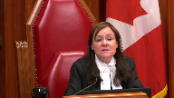
:::

Donc, si on vous suit sur cet argument, Mme Beauchamp, la liberté, puis ne tirez pas d'influence, mais si, dans l'hypothèse, on vous suivait là-dessus, dans ce dossier-ci, on n'a pas à se préoccuper est-ce que la valeur du bien serait de 21 millions, 17 millions ou 10 millions étant donné que la couronne est d'accord pour convenir que la valeur de remplacement du bien est de 10 millions.

**Speaker 1** (00:19:35): Tout à fait.

::: {.column-margin}

:::

Et je vous dirais, et c'est déjà un exercice que le poursuivant, que nous avons fait au moment du procès. By

the book, légalement, la valeur du produit aurait été une valeur marchande, donc celle qui était estimée à 17 ou à 21 millions.

Cependant, l'accusé lui-même a reconnu avoir vendu ce produit et avoir obtenu 10 millions de dollars.

Alors, demander une amende de 17 ou de 21 millions aurait été artificiel, aurait été, à ce moment-là, déraisonnable, bien que la raisonnabilité, respectueusement, n'ait pas sa place dans le calcul du montant, mais n'aurait pas été supportée par la preuve.

La preuve de l'accusé lui-même était qu'il avait obtenu 10 millions de dollars en convertissant, donc en vendant le produit de la criminalité.

C'est pour ça que la demande qui a été faite au juge d'instance, et c'est le chiffre qu'on retient aujourd'hui, évidemment, on en convient tous.

Il est parti, même l'intimé convient du chiffre de 10 millions.

C'est pour ça qu'on se limite à ce chiffre-là.

Et si vous me permettez, en fait…

**Justice Côté** (00:20:41): Je ne vise pas ce qu'on a ici, mais au niveau du principe, si, par exemple, quelqu'un vend le bien, mais à perte, volontairement, la personne décide de le vendre plus vite, donc va le vendre, disons, à 30 % de sa valeur, est-ce que c'est un élément qui doit être pris en compte?

::: {.column-margin}
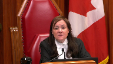
:::

**Speaker 1** (00:21:03): En fait, à ce moment-ci, je vous dirais oui, jusqu'à une certaine mesure puisque, et c'est inévitablement ce que M. Vallière a fait lorsqu'il vendait son sirop d'érable, il le vendait moins cher que le marché, et donc par rapport au marché, on peut considérer qu'il y avait une certaine perte.

::: {.column-margin}

:::

Mais le fait est l'obtention d'un produit, d'une somme d'argent par la vente du bien.

Et c'est, évidemment, comme je le dis, c'est une conversion

, c'est l'obtention indirecte d'un produit de la criminalité, et c'est cette somme-là qui est visée.

Là où il ne faut pas aller, et malheureusement, c'est ce que la Cour d'appel du Québec permettrait, c'est de faire des pertes.

Alors je donne l'exemple très imagé d'une organisation criminelle qui, à la fin de l'année, dans son année fiscale, arriverait à des pertes parce qu'elle doit payer ses fournisseurs de stupéfiants, parce qu'elle doit payer l'essence qu'elle met dans les véhicules pour transporter sa drogue, parce que, et on peut déduire, là, fiscalement parlant, une série de sommes.

Alors lorsque la Cour d'appel permet de cibler le profit de la criminalité, bien ça amène inévitablement à un exercice mathématique qui est complètement, en fait, très souvent, qui ne peut pas être fait par les cours d'instance, mais qui est en dichotomie avec l'intention du législateur, qui est de récupérer les produits de la criminalité ou, à défaut de pouvoir les récupérer, de récupérer leurs valeurs.

**Overlapping speakers** (00:22:37): Ça suffirait de légitimer les affaires criminelles.

**Speaker 1** (00:22:41): Tout à fait.

::: {.column-margin}

:::

Pour reprendre l'expression de la Cour en Rafilovitch, dans une dissidence, mais pas sur ce point-là, ça serait que le crime paierait bel et bien à ce moment-là, puisqu'on permettrait en fait d'avoir une année fiscale négative et donc de ne pas être sujet à quelconque confiscation ou à quelconque compensation.

Maître Beauchamp de la Liberté, j'ai une autre question pour vous.

**Justice Côté** (00:23:08): vous là-dessus.

::: {.column-margin}

:::

Après ça, je vous laisse seule avec le montant.

Supposons que quelqu'un obtient 10 millions, comme ici, mais réussit à placer l'argent.

Vous allez me dire comment faire pour placer de l'argent obtenu illégalement, mais en tout cas, fait de l'argent, il y a un retour sur son argent.

Est-ce que les bénéfices obtenus en plaçant ou en prêtant la somme seraient partis ou doivent être inclus dans la valeur du bien?

**Speaker 1** (00:23:36): Tout à fait, madame la juge, puisque, et encore là, je reviens, tout est une question de définition, mais lorsqu'elles sont claires et limpides, il est important de s'y référer.

::: {.column-margin}

:::

Alors, la définition de biens de l'article 2 du Code criminel, sous paragraphe B, bon, des biens originaux en possession ou sous le contrôle d'une personne, et tous les biens en lesquels ou contre lesquels ils ont été convertis ou échangés et tout ce qui a été acquis au moyen de cette conversion.

Alors, pour reprendre votre exemple, vous parlez d'un placement financier, je prendrai davantage l'exemple peut-être d'une maison, d'un immeuble.

Alors, un délinquant avec un produit de la criminalité, avec de l'argent, achète un immeuble, peu importe le coût, et cet immeuble-là prend de la valeur sur une spéculation de marché financier.

Au moment où on confisquera, où l'État confisquera cette résidence, et je refais le parallèle avec votre exemple, du placement, eh bien, c'est le bien et ses fruits.

Autrement, ça serait encore complètement déraisonnable que de dire, nous confisquons que le produit de la criminalité initiale, le 10 millions placés initialement ou la valeur de la maison au moment de son achat, et on vous laisse les intérêts, on vous donne les intérêts.

Alors, le bien, tant à la hausse qu'à la baisse, peut être converti, peut être transformé en une valeur monétaire, et c'est cette finalité-là qui fait l'objet de la confiscation, mais ce n'est surtout pas que le profit de la criminalité qui doit faire l'objet de la confiscation.

**Overlapping speakers** (00:25:10): Let me see.

**Speaker 1** (00:25:11): Je souhaite que ça puisse répondre à votre question.

::: {.column-margin}

:::

Monsieur le juge en chef, dans une de vos interventions, vous parliez de la possibilité d'avoir un double recouvrement.

Effectivement, c'est de notre point de vue une autre erreur que la Cour d'appel fait lorsqu'elle mentionne que considérant la méthodologie appliquée par le juge d'instance dans Valière, si on appliquait cette même méthodologie-là, il pourrait y avoir un double recouvrement ou il pourrait y avoir imposition d'amende supérieure à la perte de la fédération.

Particulièrement, nous nous trouvons au paragraphe 231-233 de la décision de la Cour d'appel.

Très respectueusement, il s'agit d'une incompréhension factuelle de la réalité, des faits, des différents dossiers et encore là, je fais le lien avec notre deuxième question en litige, l'importance qu'avait la Cour à demander l'intervention des parties sur la question qu'elle avait.

Donc, j'invite la Cour à prendre le volume 1 de notre dossier et à prendre la page 99 de notre volume 1, qui est un tableau synthèse des amendes compensatoires, puisqu'il est important de bien comprendre les faits et de bien comprendre les différentes amendes qui ont pu être imposées dans le cadre des différents dossiers.

Alors, à notre tableau synthèse, il s'agit, bon comme je le dis évidemment, il s'agit d'une synthèse, mais qui est supportée, qui est soutenue par des éléments de preuve, alors de façon marginale, de note en bas de page, nous mettons les références précises de chacune des allégations, des résumés que nous faisons.

Alors, il est très important de comprendre, première des choses, que seulement en fait… juste pour être sûr que j'ai…

**Justice Wagner** (00:27:13): bon tableau.

J'ai un tableau ici dans le volume 1.

Pour moi, c'est la page 101, avec 4...

ça commence par Valière, Caron, etc.

**Speaker 1** (00:27:27): En fait, il s'agit de l'annexe 1, excusez-moi, monsieur le juge, si vous mentionnez 101, c'est probablement mon erreur, mais oui, c'est un tableau qui se lit à l'horizontale, titré «

Tableau synthèse des amendes compensatoires imposées à l'ensemble des délinquants ».

**Justice Kasirer** (00:27:54): C'est le même qui est dans votre recueil qu'on en sait à l'onglet vent.

**Speaker 1** (00:27:58): Tout à fait, monsieur le juge. Peut

::: {.column-margin}

:::

-être que ça pourrait être plus évident.

Je vais aller regarder mon recueil condensé.

Tout à fait, monsieur le juge.

Vous avez effectivement recueil condensé onglet 20, le même tableau qui vous est reproduit, mais qui est attiré du dossier de la plante.

Et donc, en fait, comme je vous le mentionnais, il est important de bien, bien replacer les faits dans leur réalité, puisque Valière et Caron, avec Caron, un des principaux complices de monsieur Valière, n'ont pas fait l'objet des mêmes procédures judiciaires.

Et donc, nous soumettons malheureusement que la Cour d'appel confond certains éléments de preuve qui ont été faits dans le cadre des procédures de monsieur Valière et d'autres qui ont été faites dans le cadre des procédures de monsieur Caron.

Et la différence principale, elle est la suivante.

Dans le procès Valière, Caron ne témoigne pas et dans le procès de Caron, bien Valière ne témoigne pas, mais Caron témoigne.

Et les deux procédures se tiennent devant des juges d'instances différents.

Dans le procès de Valière, vous l'avez souligné, la Cour retient avec raison une valeur en fait du produit de la criminalité de 10 millions de dollars, tandis que pour monsieur Caron, la Cour retient une valeur de produit de la criminalité de 1,2 millions de dollars, à savoir une somme de 15 000 $ reçus pour sa participation à chacun des voyages, des transports de sirop d'érable qu'il a fait.

Et même monsieur Caron, de lui-même, va dire de ce 15 000 $-là que je reçois pour les plus ou moins 80 transports que j'ai fait, j'en donne 4 000 à un autre individu et donc ce qu'il me reste dans mes poches, c'est 11 000 $ par transport x 80 transports.

Cependant, la Cour retient dans l'appréciation de la preuve, dans son pouvoir discrétionnaire d'apprécier les éléments factuels pour déterminer la valeur du produit de la criminalité, la seule preuve matérielle qu'il va retenir, c'est un chiffre de 15 000 $ x 80 transports de 1,2 millions de dollars.

Et Hervé Caron va même dire que cette somme d'argent-là, parce qu'Hervé Caron, dans son témoignage,

**Overlapping speakers** (00:30:24): NEET

**Speaker 1** (00:30:25): est une tête dirigeante, il se place comme étant un joueur de bon niveau, un exécutant dans l'ensemble de ce vol et il dit«

::: {.column-margin}

:::

je reçois cette somme-là de deux frères italiens ».

Et donc, que le double recouvrement auquel la Cour d'appel fait référence, mais malheureusement, factuellement, elle n'est pas appuyée par la preuve.

Puisque le produit de la criminalité que reçoit Richard Vallière, donc le 10 millions de dollars, n'a pas la même source que le produit de la criminalité que reçoit avec Caron.

**Justice Côté** (00:31:01): C'est là où j'ai une question pour vous, vous dites que ce n'est pas la même source, mais on parle toujours du même sirop.

::: {.column-margin}
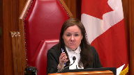
:::

Autrement dit, il y a du sirop d'érable qui a été volé, il y a différents acteurs dans l'opération, mais c'est toujours le même sirop d'érable.

Alors, si la valeur du bien volé est de 10 millions, est-ce que vous pouvez, est-ce que par exemple 1 million 200 000 de M. Havik Caron est inclus dans la valeur de 10 millions qui est la valeur du bien?

Vous dites ça vient d'une autre source, mais on parle toujours du même

, on a dit au début de l'audition que le bien c'était le sirop.

**Overlapping speakers** (00:31:37): Oui, tout à fait.

**Justice Côté** (00:31:39): 1,2 million attribués à M. Caron, est-ce que ça fait partie du 10 millions ou pas?

**Speaker 1** (00:31:46): de la preuve retenue et présentée, en fait retenue par le juge d'instance dans Caron,

::: {.column-margin}

:::

non, ça ne fait pas partie de ce 10 millions puisque, et encore là, c'est ce que le juge d'instance retient, et la Cour d'appel n'intervient pas sur cette conclusion factuelle du juge d'instance, c'est que l'argent reçu d'Avic Caron provient, et je cite là, de deux frères italiens.

**Overlapping speakers** (00:32:10): Il est toujours en relation avec le sirop d'érable, le même sirop d'érable.

**Speaker 1** (00:32:14): En fait, la preuve est au fait qu'avec Caron participe au vol du sirop d'érable, mais il n'y a pas de preuve retenue plutôt par le juge d'instance à l'effet que les deux frères italiens tiraient eux leurs sources de Richemvalière.

::: {.column-margin}

:::

Et donc, les procès ayant été tenus séparément, la preuve ayant été distingue de part et d'autre, deux juges d'instance arrivent avec des conclusions factuelles différentes et la Cour d'appel qui avait le privilège de le faire.

**Overlapping speakers** (00:32:49): de...

**Speaker 1** (00:32:50): revisiter, d'examiner les deux procès, l'ensemble de la preuve.

::: {.column-margin}

:::

Pour Vallière, elle vient dire la méthodologie appliquée est inexacte, on aurait dû retenir le profit.

Et lorsqu'elle examine celle, la procédure, la méthodologie retenue dans le procès de Caron, eh bien elle en arrive à la conclusion de dire l'exercice a été fait correctement et nous n'avons pas à intervenir.

Alors encore là, il y a une confrontation à l'intérieur même de la décision de la Cour d'appel.

**Justice Kasirer** (00:33:23): C'est-à-dire qu'il y a des problèmes de base.

::: {.column-margin}
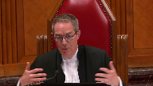
:::

Peut-être que c'est une autre façon de poser la question.

La bonne question de ma collègue, la juge Côté.

On a divers jugements, différents juges, différentes méthodes pour le calcul du produit de la criminalité dépendant du rôle que chacun des complices ont pu jouer dans l'opération.

La répartition devient une espèce de chimère.

Il va toujours y avoir un problème de les faire concorder ces jugements-là et toujours la couronne serait en position, c'est une question, ce n'est pas une affirmation, ce qui n'est pas vrai que dans tous les cas on va toujours pouvoir dire que la répartition exacte n'est pas possible parce qu'on est mieux de garder la position et le contrôle de tous et chacun.

Ce qui invite le problème du double recouvrement.

Comment est-ce qu'on peut faire?

**Speaker 1** (00:34:33): La réponse, M. le juge, à votre question.

**Overlapping speakers** (00:34:36): et je...

**Speaker 1** (00:34:36): la résume ainsi, ça dépend de la preuve.

::: {.column-margin}

:::

Et la preuve qui a été administrée dans les procédures de M. Vallière, décision qui est en appel devant vous aujourd'hui, eh bien, elle est à l'effet que M. Vallière n'a pas réparti ce 10 millions-là, à l'instar de Dyckman, par exemple, où c'est la source, c'est la décision que la Cour d'appel du Québec, dont la Cour d'appel du Québec s'inspire, pardon, et nous soumettons qu'elle va interpréter erronément la décision de Dyckman.

Dans Dyckman, il y avait une preuve que le produit de la criminalité avait été réparti, avait été alloué entre différents complices, mais que le même produit de la criminalité avait été alloué en différents complices.

Et donc, tout dépend de la preuve.

La preuve qui est retenue par la Cour d'appel est à l'effet que Richard Vallière a possédé et contrôlé 10 millions de dollars, produit de la criminalité.

Et pour faire un parallèle avec la décision de Dyckman, notamment des paragraphe 90 à 100, le principe qui est émis par la Cour d'appel de l'Ontario, et principe avec lequel nous sommes en accord, comporte deux prémisses.

La première prémisse, c'est que la preuve doit établir qu'il y a eu une répartition des bénéfices.

Et la deuxième prémisse est qu'en notant que le montant total des amendes équivale à la valeur totale du produit de la criminalité.

Alors, respectueusement, nous soumettons que la Cour d'appel du Québec a interprété erronément Dyckman lorsqu'elle dit qu'elle a un pouvoir de diminuer le montant de l'amende que pour retenir le profit de la criminalité.

Alors, ce n'est pas ça Dyckman.

Dyckman, c'est la possibilité, le pouvoir de répartir, d'allouer, de diviser l'amende, mais le montant total de l'amende entre différents complices qui auraient eu la possession du même produit de la criminalité.

Alors, factuellement, ce qui est retenu par les juges d'instance et par la Cour d'appel du Québec, ce n'est pas le cas entre Vallière et Caron, par exemple, parce qu'il ne s'agit pas du même produit de la criminalité.

**Overlapping speakers** (00:36:54): Ça vient quand même de la vente du sirop, le même sirop.

**Speaker 1** (00:36:57): Pour ce qui est de Vallière, la preuve, elle est hors de tout doute raisonnable et pourra prendre des propos du juge d'instance.

::: {.column-margin}

:::

Par contre, pour ce qui est de Caron, encore là, d'où vient l'argent des deux frères italiens, la preuve est muette à ce niveau-là.

M. Caron se place, lui, comme un exécutant et c'est ce qui est retenu par le juge d'instance dans Caron.

Alors, respectueusement, le dossier de Caron n'est pas en appel, n'est pas soumis à la Cour.

Nous revenons à M. Vallière.

Et dans le cas de M. Vallière, eh bien, il n'y a pas, si on reprend les principes de Dyckman, il n'y a pas lieu de procéder à une allocation des bénéfices, à une répartition de l'amende compensatoire, puisqu'un, il n'y a pas de preuve à l'effet qu'il y a une répartition des bénéfices, et deux, à tout événement, le montant total des amendes n'équivaut pas à la valeur totale du produit de la criminalité.

Et encore là, c'est une erreur d'interprétation factuelle que fait la Cour d'appel lorsqu'elle dit que si la même méthodologie que celle imposée à Vallière avait été imposée à l'ensemble des complices, eh bien on aurait eu des amendes bien supérieures à la perte de la Fédération, perte qui est de l'ordre de plus de 17 millions.

Cependant, lorsqu'on additionne l'ensemble des amendes imposées aux complices dans les procédures, on arrive à un chiffre de l'ordre de 12 millions.

Alors, oui, les chiffres sont imposants, c'est certain, et pour reprendre le terme de la Cour d'appel du Québec, et elle commence comme ça et ça marque le ton, oui, l'amende, elle est exorbitante, mais elle n'est pas exorbitante, elle n'est qu'à la hauteur de l'ampleur du crime commis.

Et la Cour d'appel le rappelle, le note, il s'agit du plus gros en termes de quantité vol enquêté par la Sûreté du Québec, le corps de police provinciale, dans son histoire.

L'amende n'est qu'à la hauteur que du crime commis.

Richard Vallière a lui-même déterminé le montant de son amendement.

**Justice Côté** (00:39:04): Mais le premier juge a quand même tiré des conclusions factuelles.

::: {.column-margin}

:::

Par exemple, quand il dit au paragraphe 42 lorsqu'on regarde l'organigramme, il est indéniable qu'avec Caron et Richard d'Alières étaient les deux têtes dirigeantes.

Est-ce qu'avec une conclusion de fait comme ça, on pourrait inférer par exemple qu'il contrôlait conjointement le bien?

Le produit de la criminalité?

**Speaker 1** (00:39:30): L'inférence, en fait, des têtes dirigeantes ne sont, les deux têtes dirigeantes ne sont pas nécessairement synonymes du même contrôle et de la même possession du produit de la criminalité,

::: {.column-margin}

:::

puisque Avic Caron dirigeait, en fait, si on se rapporte toujours aux faits du procès Vallière, Avic Caron dirigeait la cellule de voleurs, Richard Vallière dirigeait des cellules de russeleurs.

Alors, encore là, sur la preuve qui est administrée, on peut bien, oui, effectivement, tirer la conclusion que si on les place sur une forme d'organigramme, ils étaient à un même niveau hiérarchique, mais dans leur hiérarchie respective.

Et donc, leur produit de la criminalité, encore là, est différent d'un individu à l'autre.

Mais, et je reviens toujours, et évidemment, nous travaillons avec les conclusions factuelles des juges d'instance et de la Cour d'appel, eh bien, l'amende imposée à Richard Vallière est de 10 millions, puisqu'il n'y a pas eu de preuve de répartition de cet argent-là.

Est-ce qu'on peut imaginer, est-ce qu'on peut penser que Richard Vallière en a donné à d'autres personnes? Peut

-être qu'on peut bien le penser, mais malheureusement ou heureusement, ce n'est pas soutenu par la preuve qui a été administrée.

**Justice Côté** (00:40:54): c'est que le point que je fais, parce que toujours au même paragraphe 42, effectivement, le juge dit que M. Caron s'occupait du vol, puis M. Vallière de vendre le sirop, mais on parle toujours...

::: {.column-margin}
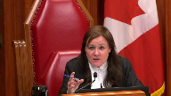
:::

Ça veut dire qu'à un moment donné, dans le temps, M. Caron contrôlait le sirop, puis à l'autre moment, M. Vallière contrôlait le sirop.

Est-ce que

... C'est pour ça que je vous dis, est-ce qu'on pourrait parler d'un contrôle conjoint ou partagé, qui ressort des conclusions de fait du premier juge?

**Speaker 1** (00:41:20): C'est un contrôle qui est successif.

::: {.column-margin}

:::

Et je reprends peut-être l'allusion, si je ne me trompe pas, j'irai de mémoire, d'art, peut-être que mon collègue dans sa plaidoirie dans quelques instants pourra compléter, mais le parallèle avec le vendeur de drogue, la destination finale du produit de la criminalité n'est pas à tenir en compte dans la détermination du montant de la vente compensatoire.

Autrement, dans un cas, par exemple, comme du recel, du vol, où le bien volé se transpose d'une personne à l'autre, bien autrement, on n'arriverait pas à récupérer le produit de la criminalité puisque cette responsabilité-là se passerait d'une personne à l'autre.

Dans le cas très, très factuel de M. Vallière, il admet avoir reçu, possédé et contrôlé 10 millions de dollars en vendant du sirop d'érable volé.

Si, et je soumets l'hypothèse suivante, s'il y avait un élément de preuve précis, prépondérant des probabilités ou même encore plus hors de toute raisonnable, à l'effet que M. Vallière avait dit, de ce 10 millions de dollars-là, j'en ai donné 5 millions avec 40.

Si la preuve avait été telle, là, évidemment que le principe de Dyckman de répartition aurait dû s'appliquer et que M. Vallière n'aurait pu être imputable que pour l'argent, par exemple, qu'il avait gardé puisqu'il y aurait eu un élément de preuve clair qu'avec Caron avait bénéficié d'une somme par exemple égale, ils se sont séparés les profits 50-50.

**Overlapping speakers** (00:42:50): par exemple.

Cependant ...

**Speaker 1** (00:42:51): Ce n'est pas le cas, factuellement ce n'est pas le cas et d'où là, et encore là je ferai le lien pour les minutes qui suivent, mais je ferai le lien avec la seconde question à litige.

::: {.column-margin}

:::

Les questions que vous posez Madame la juge sont extrêmement pertinentes et auraient pu être éclairées devant la Cour d'appel

si elle nous en avait posé la question.

**Justice Kasirer** (00:43:11): Mais avant d'arriver là, juste pour compléter votre, parce que j'avoue que je ne comprends pas, la cour d'appel n'aurait pas suivi Dyckman.

::: {.column-margin}

:::

L'intervenant de la cour de procureur général de l'Ontario tape là-dessus.

Mais dans Dyckman, je prends note que ce n'est pas une science exacte la répartition du produit.

En fait, si on s'attarde à faire un calcul exact en provenance de procès différents avec des juges différents, on va nécessairement tomber dans le panneau du double recouvrement ou des inexactitudes qui proviennent de cet effort d'être le plus exact possible.

N'est-il pas mieux?

Qu'est-ce que vous proposerez de faire un exercice de répartition?

Moi, j'ai trouvé, ce qui a été fait dans Dyckman où le juge d'instance a fait comme une règle de trois.

Il a regardé l'ensemble de l'opération.

Il s'était dit 50 % à l'âme directrice de l'opération.

Le menu frottant, il a un montant.

Vous approuvez un exercice comme ça.

**Speaker 1** (00:44:39): Évidemment, je ne pourrais pas parler spécifiquement pour l'exercice de Dyckman, puisque, comme vous le dites, ça a été fait, sans dire au prorata, mais avec un certain pourcentage selon les responsabilités.

::: {.column-margin}

:::

Ce que je peux, par contre, affirmer à la Cour, c'est que l'exercice discrétionnaire de détermination du montant, ou dans le cas de la répartition, l'exercice discrétionnaire de la répartition, doit être basé sur la preuve.

Et ça, la Cour d'appel du Québec, et évidemment, toutes les cours canadiennes le reconnaissent, la détermination du montant doit être basée sur la preuve.

**Justice Wagner** (00:45:18): Il y a des choses qui ont été annoncées, mais il y a des choses qui ont été annoncées.

::: {.column-margin}
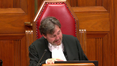
:::

Il y a des choses qui ont été annoncées.

**Speaker 1** (00:45:50): Tout à fait, M. le juge en chef, et également M. le juge Caserard, je suis en accord avec vous.

Si les cours tombent dans des exercices mathématiques, que ce soit pour calculer le profit, ou que ce soit pour tenir en compte de pots éthiques,

**Speaker 1** (00:46:06): de redistribution des sommes

::: {.column-margin}

:::

ou, comme vous le soulignez, M. le juge en chef, au paragraphe 82, si on tombe dans un exercice mathématique comme ça, ce ne sera plus la reine qui sera le poursuivant, mais ce sera l'Agence de revenus du Canada.

Et donc, que l'exercice que le tribunal d'instance, le juge chargé de la détermination de la peine doit faire, basé sur la preuve qui est présentée devant lui, je ne peux pas m'avancer, vous faisiez la référence à Dyckman, je ne peux pas m'avancer sur l'exercice qu'a fait le juge, est-ce qu'il s'agissait d'un exercice correct ou non, chose certaine, en fait basée sur des pourcentages comme ça, chose certaine, cette Cour a refusé d'entendre la permission d'en appeler dans Dyckman, et donc l'état du droit, pour moi, il est encore là, cristal clair.

La preuve relativement, M. Vallière, et qu'il était, pour ses opérations à lui, qu'il en était la tête dirigeante, qu'il a reçu 10 millions de dollars en vendant du sirop d'érable volé et en rosselant et en fraudant du sirop d'érable, d'une valeur de plus de 23 millions de dollars.

Les chiffres sont importants, oui, mais encore là, ils ne sont qu'à la hauteur du crime qui a été commis.

Mais vous le ciblez très bien et dans l'ensemble des questions de la Cour, je le perçois très bien, c'est une question qui est factuelle, qui, au-delà du droit, demeure factuelle et je céderai la parole à mon collègue Maître Bernier pour justement vous adresser certains arguments quant à la nécessité qu'aurait eu la Cour d'appel de soumettre la question au parti lorsqu'elle avait l'intention d'intervenir quant à la détermination du montant de l'amende.

**Justice Wagner** (00:47:44): Merci.

**Speaker 2** (00:47:48): Je vous remercie.

::: {.column-margin}

:::

Nous sommes d'avis que la Cour d'appel a erré en droit en omettant au parti la possibilité d'être entendue sur la modification du quantum.

On est dans un contexte où l'appelant n'avait pas soulevé cette question dans son appel.

La Cour d'appel du Québec le reconnaît explicitement au paragraphe 228 de sa décision.

De ce fait, le quantum de l'amende compensatoire n'a jamais été en litige relativement à M. Richard Valière.

Nous étions dans un contexte où, au surplus, les partis étaient représentés par avocat dans les présentes circonstances.

Selon le paragraphe 48 de la rémiane de cet honorable cours, cela faisait en sorte qu'il est extrêmement rare que des partis représentés ne soulèvent pas une question qui est pertinente aux fins de leur litige.

Or, dans les présentes circonstances, en aucun temps la Cour d'appel du Québec ne notifiait les partis, ni avant l'audience, ni à l'audience, qu'elle avait l'intention de toucher au quantum de l'amende compensatoire imposée en l'espèce.

Nous sommes d'avis que ce faisant, il y a eu un accroc à la règle d'équité procédurale dans les présentes circonstances.

Selon la rémiane, à ses paragraphe 54 à 59, lorsqu'une Cour d'appel soulève une nouvelle question, les partis doivent être notifiés et avoir l'occasion d'y répondre.

Or, tel ne fut pas le cas en l'espèce.

Nous sommes d'avis que cet accroc à la règle au dialtérane par thème a mené à un certain imbroglio qui a été notamment abordé par mon confrère au niveau factuel.

Nous sommes d'avis que la Cour d'appel s'est bien dirigée en reconnaissant qu'il y avait opportunité d'imposer en l'espèce une amende compensatoire.

Nous sommes d'avis que là où le bas blesse, c'est que nous sommes dans une circonstance où la Cour d'appel ne s'est pas limitée à déterminer la valeur du bien, tel que le prescrit, l'article 462.37.3, ainsi que les enseignements de cet honorable code dans les arrêts Lavigne à ses paragraphe 34 et 35, ainsi que réitérés dans l'arrêt Rafilovitch.

Dans les présentes circonstances, ce que l'on voit, c'est que le ministère public aurait pu faire certaines représentations pour éclairer la Cour dans la décision qu'elle devait prendre en l'espèce, à savoir qu'elle bénéficie d'une discrétion qui est somme toute limitée.

La discrétion repose sur deux principes fondamentaux.

Doit-il y avoir imposition d'une amende compensatoire, oui ou non, en l'espèce?

Si oui, quelle est la valeur du bien qui doit être remplacé?

Parce que l'état du droit était clair, pour qu'il s'agisse d'un véritable remplacement, la valeur de l'amende doit être équivalente.

Or en substance, et on le voit au paragraphe 244 de l'arrêt de la Cour d'appel, 246 et 250, la Cour décide de s'arroger une discrétion beaucoup plus grande que celle qui était permise par les enseignements jurisprudentiels.

Elle décide que, dans certaines circonstances, si la dénonciation combinée au montant du profit remplisse les objectifs du point de vue de la Cour d'appel, dans les présents circonstances, la confiscation du profit en soi serait suffisante.

Nous sommes d'avis que ce faisant, la Cour d'appel a erré.

Au surplus, une autre erreur que la Cour d'appel a commise, de notre humble point de vue, est à l'effet qu'il y ait une association somme toute assez directe à l'effet que l'amende compensatoire constituerait une peine dont elle doit tenir compte dans l'ensemble de sa détermination.

Et de notre humble point de vue, cela est erroné.

Bien que stricto sensu, une amende compensatoire est, selon l'article 673B du Code criminel, une peine, une sentence, nous sommes d'avis qu'il y a des particularités ici en l'espèce qui font en sorte que le montant de l'amende compensatoire ne peut être subordonné à la règle de proportionnalité en l'espèce.

De ce fait, dans les présents circonstances, nous sommes face à une incompréhension factuelle de notre humble point de vue de la part de la Cour d'appel, considérant l'ensemble des circonstances factuelles qui ont été mises en preuve.

Nous sommes d'avis que tout au long du processus, les juges d'instance se sont basés sur la preuve qui a valablement été administrée devant eux.

Ceux-ci n'ont commis aucune erreur de droit dans leur détermination juridique ou factuelle.

Et la Cour d'appel avalise

partiellement cet état de fait-là.

Cependant, elle dénote que l'honorable juge de la Cour d'appel est en train d'être annoncée par la Cour d'appel, et que la Cour d'appel est en train d'être annoncée par la Cour d'appel, et que la Cour d'appel

**Justice Kasirer** (00:52:49): de la cour suprême, est-ce que c'est le cas?

::: {.column-margin}

:::

Est-ce que c'est le cas?

**Speaker 2** (00:53:21): Ce qu'on recherche ici, comme remède, au niveau de la cause suprême, c'est d'obtenir une solution pérentoire à un problème à laquelle nous sommes confrontés actuellement, et nous souhaitons qu'il y ait une application uniforme des règles à travers le pays.

::: {.column-margin}

:::

Parce que la position de la Cour d'appel est en porte-à-faux avec celle de la Cour d'appel de l'Ontario ainsi que celle de la Cour d'appel du Manitoba.

**Justice Wagner** (00:53:45): est en porte-à-fou avec, il semble

en tout cas

, avec une de ses propres décisions.

**Speaker 2** (00:53:51): Effectivement.

::: {.column-margin}

:::

Et nous sommes d'avis que l'intervention de cette cour est requise pour rectifier cette situation-là qui, effectivement, s'inscrit en porte-à-faux avec le corpus jurisprudentiel qui est avancé.

Nous sommes d'avis que la règle au diap...

et on ne pouvait pas présumer dans les présentes circonstances que la question du quantum était inhérente parce que les enseignements de la relaving sont limpides.

Au paragraphe 34 et 35, c'est le Parlement, par le biais du code criminel, qui doit fixer la valeur de l'amende.

Rien ne permettait à la plante, devant cet honorable court, de présumer que le montant du quantum pouvait faire l'objet de quelque litige que ce soit.

Au surplus, dans la décision valiaire, lorsqu'on regarde les moyens d'appel développés par M. Caron, celui-ci demande à ce que son amende compensatoire soit réduite, eu égard à la preuve qui avait été administrée.

De ce fait-là, il y avait eu, d'une certaine manière, un avocat qui voulait attirer l'attention de la Cour d'appel sur un enjeu bien précis et ce basé sur son appréciation de la preuve qui avait été administrée.

Relativement, M. Vallière, cet argument-là n'avait pas été fait.

Au surplus, le seul argument qui est avancé, c'est devait-il y avoir imposition ou non de l'amende compensatoire dans les circonstances de la présente affaire.

Tant les juges d'instance que la Cour d'appel ont reconnu qu'il était opportun dans les circonstances de la présente affaire que d'imposer une amende compensatoire.

Nous sommes face à une situation où, de manière très claire,

**Justice Jamal** (00:55:30): est-ce qu'il y avait des prêts de prétention en première instance, pas en appel mais en première instance devant le juge du procès

pour la possibilité de la répartition de l'amende de la répartition de la répartition de la répartition de la répartition de la répartition de la répartition de la répartition de la répartition de la répartition de la répartition de la répartition de la répartition de la répartition de la répartition de la répartition de la répartition de la répartition de la répartition de la répartition de la répartition de la répartition de la répartition de la répartition de la répartition de la répartition de la répartition de la répartition de la répartition de la répartition de la répartition de la répartition de la répartition de la répartition de la répartition de la répartition de la répartition de la répartition de la répartition de la répartition de la répartition de la répartition de la répartition de la répartition de la répartition de la ré

**Speaker 2** (00:55:44): De ce que je comprends, non.

::: {.column-margin}

:::

Cependant, les preuves ont été administrées devant différents tribunaux.

Et la valeur minimale de ce produit de la criminalité était de 17,8 millions de dollars.

Et les juges étaient bien au fait de cette situation.

Et lorsqu'ils se sont livrés à l'exercice d'apprécier la preuve qui a été présentée devant eux, ce qui a été retenu par l'honorable juge de la Cour du Québec était qu'Avic Caron avait reçu 15 000 $ pour 80 livraisons, pour un total de 1,2 millions de dollars.

Pour ce qui est de Richard Vallière, la preuve qui était valablement retenue par le juge de première instance est à l'effet que celui-ci a possédé, contrôlé, 10 millions de dollars.

Je vous dirais que dans les présentes circonstances de l'affaire, la valeur de ces biens-là a été le sirop d'érable ainsi que le produit de sa conversion, qui a mené de manière claire, explicite aux différentes amendes compensatoires qui ont été imposées en l'espèce.

Nous sommes d'avis que dans les circonstances, la Cour d'appel a erré dans son appréciation factuelle des différentes preuves qui ont été administrées dans les présentes circonstances.

Comme mon collègue l'a souligné, les produits de la criminalité pouvaient provenir d'une source différente lorsqu'on s'attarde au volet conversion des dits produits de la criminalité.

En aucun temps, les amendes compensatoires ayant été imposées ont laissé croire qu'il pouvait y avoir possibilité de double recouvrement dans les présentes circonstances.

Et ça, il s'agit d'une crainte de la Cour d'appel qui dit que cette situation-là pouvait créer une situation de double recouvrement.

Or, avec égard, nous sommes d'avis que telle n'est pas les circonstances en l'espèce.

Les chiffres qui vous ont été présentés sont à l'effet que la valeur des amendes compensatoires ayant été imposées est aux alentours de 12,4 millions de dollars.

La valeur du sirop d'érable minimal était de 17,8 millions de dollars.

Ce qui fait en sorte que, de notre point de vue, on doit s'inscrire en faux relativement à l'exercice qu'a accompli la Cour d'appel dans les présentes circonstances.

Nous sommes d'avis que si cette Honorable Cour nous donnait tort sur la première question, à savoir est-ce que nous pouvons uniquement confisquer le profit dans les présentes circonstances, on considère qu'une telle situation, de notre humble point de vue, serait contraire à l'état du droit actuel.

Cependant, nous sommes face à une situation où, si le tout avait été valablement apprécié par la Cour d'appel, soit de déterminer la valeur du produit de la criminalité qui a été possédé et contrôlé par Richa Valia dans les présentes circonstances, il n'y aurait pas eu ces erreurs-là qui auraient été commises et, de notre point de vue, le résultat aurait été presque assuré dans les circonstances de la présente affaire.

De ce fait, nous considérons que la Cour d'appel n'avait aucun pouvoir d'intervention dans les circonstances de la présente affaire, considérant que les juges d'instance n'ont commis aucun impair factuel ou juridique dans leur appréciation et que, de ce fait, nous sommes d'avis que l'amende compensatoire ayant été imposée par Richa Valia en l'espèce n'était pas manifestement inéduquée.

Dans l'ensemble de ces représentations, nous sollicitons l'intervention de cette Honorable Cour afin d'imposer les conclusions qui sont sollicitées à notre mémoire, soit qui sont de réinstaurer les conclusions du juge d'instance prononcées dans le dossier de M. Richard Valia. Merci.

**Justice Wagner** (00:59:32): Thank you.

**Speaker 3** (00:59:39): Good morning Chief Justice, Justices.

::: {.column-margin}

:::

As you know Ontario intervenes on the first question only and I intend to make three points on this issue.

So the first point that I'd like to make is that the approach of the Quebec Court of Appeal threatens the existing and workable framework which begins with the very clear intent of part 12.2 of the Criminal Code, the wording of the forfeiture and fine and lieu provisions, the interpretation this court has granted in Levine and that also includes the substantial line of appellate decisions in Ontario.

Ontario's approach while remaining flexible to answer for varying factual circumstances includes cases involving multiple offenders who play differing roles in an offence or in relation to the proceeds of crime and that approach is consistent with the wording of the forfeiture provisions, the objectives of the provisions and this court's decision in Levine, excuse me.

The Ontario jurisprudence both before and after the Dykeman decision as detailed in our factum has consistently respected that the amount of the fine and lieu must be equal to the value of the property it is replacing and not the personal debt.

Okay, okay.

**Justice Rowe** (01:01:01): But I want to pose a question here, because there's something which seems so disproportionate in this.

::: {.column-margin}

:::

And I'm not asking you to comment on the facts of this particular case or an intervener, but I'll give you an example.

Yves LaPierre, $17,000.

I don't know, maybe he drove a truck.

Pretty good pay for driving a truck.

But is he subject to a fine of $10 million?

And if he isn't, why not?

**Speaker 3** (01:01:36): Well, thank you Justice Roe.

::: {.column-margin}

:::

I can't comment on the specific facts of this case, but as my friend said previously, when the court is looking at imposing the fine in lieu or apportioning it, then the court needs to look to the evidence of possession and control.

And so that evidence should determine how the court will apportion the fine in lieu.

**Justice Rowe** (01:02:05): And how does that fit with the scheme?

::: {.column-margin}
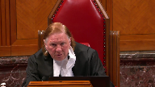
:::

Because what's been put to us is there's an almost an automaticity with the scheme, that there's very little discretion.

And now you're saying there's a great deal of discretion, but the discretion seems to be free-floating.

One has no idea how it's guided.

It's an unprincipled exercise of discretion, which is an extraordinary thing to contemplate.

**Speaker 3** (01:02:30): Well, I think my best answer to that, Justice Roe, is that the discretion obviously is limited by, you know, the purposes of the provision, the nature of the order, etc., and the goal of replacing the proceeds of crime.

::: {.column-margin}

:::

And the, yes, there is no specific formula for apportioning the fine amongst multiple offenders or notional co-conspirators.

But if you look at some of the cases from Ontario, you will see how it has been done.

And, yes, it's not perfect, but what's always kept in mind is the objective, the purposes, and to ensure that double recovery doesn't happen.

Some cases are going to be more clear-cut than others.

So, for example, in the Khachaturov decision, you'll see that there were checks issued to each of the co-accused.

And so, it was easily, on a mathematical basis, to apportion that fine.

In other cases, it's going to be less clear.

But as long as the court is working within the framework of the provisions and ensuring that they are staying within the confines of the total value of the property and not making orders that would violate the double recovery rule, if you will, then that position should be afforded deference on appeal.

**Justice Rowe** (01:04:04): The guy who drove the truck in a heist similar to this could be on the hook for ten million dollars conceivably which he can't pay and therefore he's subject to imprisonment for a period of five to ten years.

He's a heavy duty, heavy duty, heavy duty.

**Speaker 3** (01:04:23): Yes, agreed.

And I would say that the court would have to look at what exactly is the evidence establishing possession and control with respect to that offender.

**Justice Moldaver** (01:04:36): Don't you have to look at the role?

::: {.column-margin}
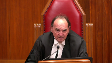
:::

Isn't that what they did in Dickman?

The trucker on my colleague's theory of course has possession at least of everything.

But that can't be the complete, you can't begin and end with that question it seems to me once you say we can look at the degree of participation of a particular person.

**Speaker 3** (01:05:04): Well that that's correct if Justice Moldaver that the relevant factors that the court is going to consider is going to include the role of respective offenders in the in the offense itself and how and in relation to the proceeds of crime that that has to be the case and and the court may go so far as to when there are multiple offenders to also consider how much each offender benefited financially from the proceeds of crime

::: {.column-margin}

:::

and I know I'm running out of time or I have run out of time

but I would commend you to also look at you know the Piccinini decision where where the court looked at the ringleader apportioned most of the fine to the ringleader but also looked at the the underlings in the operation and there were clear records of how much those people were paid for their services under the ring ringleader and the fine was apportioned in those amounts.

Thank you.

**Justice Wagner** (01:06:01): a question for you and I'll give you two more minutes given the nature of the questions.

**Justice Brown** (01:06:05): So I'll be so I'll be really quick um it's easy to avoid double recovery if it's the same judge deciding in respect of the of all the offenders but what do we do where that's not the case?

**Speaker 3** (01:06:16): Yeah uh thank you Justice Brown that is a uh that is a difficult question

::: {.column-margin}

:::

and I don't have a clear answer for you um what I can tell you

and I don't know that it's perfect um because you never know the outcome of the parallel cases but um in the Piccinini uh trial decision uh what happened there was the judge uh the two sort of main players were being tried separately uh the first one being Piccinini

and you'll and Justice Derneau the trial judge in that case apportioned uh you know 500,000 of the 900,000 which was the total value of the property to Piccinini um you know on the understanding and hope that the judge in the in the co-conspirators case would impose the balance um I don't have I mean that is a

it's a difficult question um of course um that is the and that's the only time where I've seen that happen um

and I don't know if it's a perfect answer

but that's how it was dealt with in Piccinini.

**Overlapping speakers** (01:07:26): So you can conclude.

**Speaker 3** (01:07:27): Okay, thank you, so I just in terms of Ontario's approach, I have outlined it in our factum for you, and I just want to reiterate that that approach does give discretion to deal with this issue of multiple offenders and apportioning the fine, but it is always within the confines of the purposes of the provision, the total value of the property, etc.

::: {.column-margin}

:::

The Ontario Court of Appeal has been consistent in its approach of never calculating the fine based on actual personal benefit of the offender.

That has been consistently rejected when brought before the Ontario Court of Appeal.

So I commend you to review our factum on this issue and respectfully urge this court to adopt Ontario's approach to quantifying the fines in lieu of forfeiture so that the Quebec Court of Appeal decision doesn't become a precedent that will allow courts to run afoul of those principles.

Thank you very much.

**Justice Wagner** (01:08:42): Thank you.

The court will take its morning break.

15 minutes.

**Justice Jamal** (01:08:50): You

**Justice Rowe** (01:09:24): Lacour, the court.

**Justice Wagner** (01:09:47): Merci.

Veuillez vous asseoir.

Maître Giroux.

**Speaker 4** (01:09:55): Bonjour à toutes et à tous.

::: {.column-margin}

:::

Nous vous remercions de nous entendre concernant cette question qui a été soulevée par la partie appellante.

Je vais débuter évidemment avec la première question, soit celle à l'effet que la Cour d'appel aurait érit en droit dans la détermination de la valeur de l'amende compensatoire.

Nous adoptons la position de celle de la Cour d'appel, à savoir qu'il n'y a pas eu d'erreur en l'occurrence.

Ils ont correctement appliqué le cadre législatif pour l'imposition.

**Overlapping speakers** (01:10:39): Excusez-moi maître, vous êtes d'accord avec la position de la Cour d'appel?

L'aviez-vous plaidé?

**Speaker 4** (01:10:44): En fait, moi, je n'étais pas là devant la Cour d'appel, alors ce n'est pas moi qui a plaidé le dossier.

Alors, est-ce que votre cas l'a plaidé par le biais d'autres procureurs, c'est ça, ma question?

Je m'excuse, j'ai mal compris votre question, M. le juge.

**Justice Wagner** (01:10:58): Je sais que si vous n'étiez pas là, vous ne pourriez pas répondre vous-même personnellement, mais est-ce que votre client, par le biais de ses procureurs de l'époque, ont plaidé ce point-là devant la Cour d'affaires?

**Speaker 4** (01:11:11): en fait, à notre compréhension, c'est que le moyen d'appel qui était visé, c'était la détermination s'il devait y avoir ou non une amende compensatoire qui devait être imposée.

::: {.column-margin}

:::

Manifestement, la position qu'on a adoptée suite à la deuxième question de la partie appelante en la présente instance, c'était à l'effet que manifestement le fait que la cour d'appel était saisie de la question de savoir, de déterminer s'il devait y avoir ou non une amende compensatoire qui devait être imposée à M. Vallière, manifestement, elle contestait intrinsèquement, c'est intrinsèquement lié à la détermination de la valeur de l'amende compensatoire.

Mais la question de…

**Justice Wagner** (01:12:00): La question de déterminer si une amende compensatoire est adéquate, donc peut l'être et la question de savoir comment la calculer, il me semble, c'est deux éléments différents, ça.

**Speaker 4** (01:12:10): En fait, bien humblement soumis, nous croyons que non, étant donné que dans la mesure où la Cour d'appel en serait venue à la conclusion qu'effectivement une amende compensatoire oui pouvait l'être, à ce moment-là, intrinsèquement, elle pouvait revoir la valeur de celle-ci, étant donné qu'elle avait devant elle l'ensemble des éléments factuels pour pouvoir en décider.

::: {.column-margin}

:::

Et pour pouvoir déterminer s'il doit y avoir une amende compensatoire ou pas, bien manifestement, ça doit être basé sur la preuve qui est présentée et cette preuve-là est la même.

Qu'on parle de déterminer s'il doit y avoir ou non une amende compensatoire versus la valeur de détermination du bien de remplacement, bien ce sont la même, c'est la même trame factuelle qui est derrière, qui fait en sorte qu'on peut déterminer l'une ou l'autre.

**Justice Wagner** (01:13:14): Devant le premier juge, est-ce que cette question-là, de savoir comment calculer l'amende qu'on pense asseoir a été plaudée et la répartition, c'est tenter qu'il veuille y avoir une répartition en différents cas plus complices?

**Speaker 4** (01:13:31): En fait, à ma connaissance, et encore là, j'y vais prudemment, à ma compréhension, c'est que dans, en première instance, pardon, l'ordre de la détermination de la peine, en fait, c'est que le ministère public avait d'ordre et déjà bien annoncé chacune de ces demandes, que ce soit en matière de restitution ou de non-contact avec d'autres personnes, etc., etc. Alors ça, le juge, dans son jugement de première instance, pardon, sur la détermination de la peine, les énumère, les énumère, énumère la position de chacune des parties, et quand il énumère la position de la défense, ça, c'est un paragraphe qui indique que la défense, elle, pense qu'une période, là, je vous dis ça de mémoire, là, je veux pas induire la cour en erreur, là, mais c'est que la défense, elle, proposait qu'une peine d'emprisonnement de trois à cinq ans était suffisante et largement pour ce qu'il en était de la détermination de la peine.

::: {.column-margin}

:::

Alors, comme je vous dis, à ma connaissance, il semble pas y avoir de détails, là, à savoir dans quelles mesures ça a pu être contesté en première instance.

Mais c'est sûr et certain qu'il y a eu un débat sur ce sujet-là, étant donné que c'était une demande du ministère public et manifestement la poursuite, pas la poursuite, pardonnez-moi, mais la défense a manifestement fait des représentations en ce sens-là, là.

Mais je sais pas dans quelles mesures ils l'ont fait.

**Justice Côté** (01:15:03): Alors, vous ne pouvez pas nous dire, Mme Giroux, si votre client, en première instance, a fait des représentations précises sur la façon dont l'amende, dans la mesure où le juge décidait d'en imposer une, devait être répartie entre les différents complices.

**Speaker 4** (01:15:18): En fait, c'est que je le présume étant donné que c'était soulevé par le ministère public et manifestement, la Défense considérait qu'il ne devait pas y avoir d'amende compensatoire.

::: {.column-margin}

:::

Par contre, là où est-ce que je ne peux pas aller plus loin, c'est à savoir, au-delà de dire qu'il ne devait pas y avoir d'amende compensatoire d'imposer à M. Vallière dans la mesure où, excusez-moi, je reprends, mais je ne peux pas aller plus loin à savoir qu'elles ont été les représentations quant à la valeur du bien qui devait être remplacée.

Ça, je ne peux pas aller plus loin que ça, là.

**Overlapping speakers** (01:15:58): Alors, concertement...

**Justice Kasirer** (01:15:59): Je pense que c'est la valeur qui est bien parce que je pense.

::: {.column-margin}

:::

Juste avant de vous laisser la parole et puis on vous assombe de questions, je m'en excuse.

Mais j'essaie de lire, Mme Giroux, dans votre mémoire où vous trouvez le mal pour ce qui est de M. Vallière.

Et vous évoquez au paragraphe 26, 27, 28 de votre mémoire le rôle principal de M. Caron comme celui qui a orchestré le vol.

Exactement.

Et pour qui la valeur du produit de la criminalité jugée par l'amende qu'il a reçue n'est qu'à 1,2 million.

Tandis que vous y voyez une injustice pour le 10 millions pour l'intimé en raison du fait que lui son rôle était la revente bien volée dans le cadre d'une opération de recel.

Et que donc son rôle était autre, moindre quand on parle de la répartition éventuelle.

Est-ce que c'est ça votre point?

Oui, c'est ça.

Inaudible.

**Justice Kasirer** (01:17:11): auquel cas l'amende de M. Caron, qui n'est pas devant nous, serait, à votre avis, complètement disproportionnée.

**Speaker 4** (01:17:23): En fait, pour répondre à votre question, concernant M. Vallière, on considère que l'amende qui lui a été imposée est nettement déraisonnable.

::: {.column-margin}

:::

Je reprends les termes de la Cour d'appel, elle est même exorbitante quand on regarde de quelle manière les différentes amendes qui ont été imposées dans le dossier, cette répartition-là a été faite.

Il est certain que si on compare la situation de M. Vallière versus celle de M. Caron, effectivement, nous sommes d'avis qu'il s'agit d'une situation complètement injuste pour M. Vallière.

On doit comprendre que la preuve, ce qu'elle a révélé, et je suis en désaccord avec la position du ministère public à cet égard-là par rapport à l'une des réponses qu'il a données à votre question, c'est qu'effectivement, je suis tout à fait d'accord qu'on doit toujours revenir à la preuve qui est faite devant nous pour pouvoir déterminer la valeur du bien.

Maintenant, autant dans le cas de M. Caron que dans le cas de M. Vallière, M. Vallière a témoigné dans le cadre de son procès et M. Caron a témoigné dans le cadre de la détermination de la peine, puisque lui avait plaidé coupable devant un juge seul à la Cour du Québec, alors que M. Vallière, lui, avait eu un procès devant un jury.

Bref, à tout événement, la preuve dans les deux cas, et vous l'avez également devant vous dans le dossier, dans les annexes de la plante, c'est que la détermination, si on regarde le témoignage qui a été rendu par M. Vallière, c'était à l'effet qu'il payait entre 75 000 et 100 000 $ par voyage qu'il achetait de M. Caron.

Et la poursuite indiquait également qu'il y avait eu, selon eux, 95 livraisons.

Donc, manifestement, 95 livraisons fois 100 000 $, parce qu'on retenait cette partie-là du témoignage de M. Vallière, on arrive à un chiffre de 9,5 millions.

Et c'est exactement la position qu'a adoptée le ministère public devant la Cour d'appel dans le dossier concernant M. Havik Caron, dans lequel vous avez la décision devant vous, parce que l'appel a été entendu pour plusieurs individus qui étaient impliqués dans cette affaire-là.

Donc, manifestement, M. Caron, si on y va par la logique, manifestement, il n'a pas reçu 1,2 millions $, comme lui l'a prétendu dans son témoignage lors de la détermination de la peine, mais il aurait plutôt reçu 9,5 millions.

Aussi, ce qui est particulier dans cette affaire-là, toujours dans le cas de M. Vallière, en fait, je vais juste terminer par rapport à M. Caron.

Merci M. Caron.

**Justice Wagner** (01:20:38): Ce que vous dites par rapport à M. Caron, c'est qu'il est chanceux.

Pour lui d'avoir eu une amende de 9 millions, il en a eu une de 1,2 million.

C'est long avec M. Vallière.

**Speaker 4** (01:20:46): Je m'excuse, monsieur le juge, je vous ai coupé.

::: {.column-margin}

:::

Je vous dirais que ce n'est pas de la chance, j'ai envie de vous dire, mais plutôt qu'il y a un considérant qui a été ignoré par le premier juge à notre avis, à savoir que M. Caron, c'est lui qui avait le contrôle du sirop d'érable.

C'était à l'entrepôt, je vais dire son entrepôt, mais je comprends que c'était, il était, ce n'est pas lui qui était propriétaire, mais bien sa conjointe par un prêtre, non, mais c'est lui qui était en contrôle du sirop d'érable.

Et M. Havik Caron, c'est lui qui l'a volé.

Lui, il se cherchait un resseleur, donc il avait besoin de quelqu'un pour acheter son sirop que lui volait et que le resseleur lui le vend ou fait ce qu'il veut avec.

Et c'était le rôle de M. Vallière.

M. Vallière avait beaucoup plus le rôle de resseleur que de celui du vol initial du sirop d'érable.

Donc, manifestement, si on y va de manière comptable, je sais que ce n'est pas nécessairement un calcul comme ça qui doit se faire, mais il n'en demeure pas moins que la jurisprudence dit bien que la preuve, on doit se baser sur la preuve et que les calculs ne doivent pas être théoriques.

Donc, si on y va dans l'absolu, manifestement, M. Caron lui a acquis un bien volé à zéro dollar.

Il n'a pas payé, mais il a reçu un entrant lui de 9,5 millions.

Et c'est ce qu'il vient faire en sorte aussi parce que le témoignage de M. Vallière, et ça correspond aux chiffres que donne M. Vallière quand il dit, bien écoutez, c'est autour de 10 millions de dollars comme chiffre d'affaires, donc c'est-à-dire que j'ai acheté de M. Caron et que j'ai revendu, donc il y a eu des entrants et des sortants, et en bout de piste, j'ai fait un million de dollars.

Alors, l'idée derrière ça, quand je mentionne que nous trouvons que la situation est injuste, c'est-à-dire qu'on dirait qu'il y a eu un inversement de rôle au niveau de l'amende compensatoire.

Et ceci étant dit, je trouve que c'est pertinent également d'attirer l'attention de la cause sur le fait suivant.

C'est-à-dire que dans le cas de M. Havik Caron, on a considéré les revenus qu'il aurait faits à partir du vol du sirop d'érable.

Donc, lui, selon son témoignage, l'indiquait qu'il avait vendu 80 livraisons de sirop d'érable à 15 000 $ chacun, donc on arrive à 1,2 million de dollars.

Alors, c'est le revenu, le profit qu'il a fait de son vol.

Alors, je peux vous donner un autre exemple également qu'on retrouve au dossier, qui est dans le cas de M. Bourassa, pour simplement reprendre celui-ci.

Lorsqu'on regarde les différents montants qui ont été considérés pour établir qu'on devait lui imposer une amende compensatoire de 145 000 $, à ce moment-là, tout ce qui a été considéré, c'est les revenus.

On se comprend bien, on est dans une activité criminelle, mais c'est l'argent qu'il a reçu.

Donc, pour lui, c'était comme un revenu pour sa participation dans le crime.

On a retenu ces montants-là, plus une moto et un autre bien qu'on pouvait considérer qui avait une certaine valeur pour arriver à 145 000 $.

Donc, lui aussi, ce qu'on a considéré, ce n'est pas le bien qui lui est passé entre les mains.

On a considéré le profit qu'il a fait de son avenir.

**Justice Wagner** (01:24:49): Je ne sais pas si c'est une erreur en ce qui concerne les autres mais qui ont bénéficié d'un passe-droit mais Monsieur Valère a dit qu'il a reçu des produits de criminalité, la valeur du produit a 10 millions.

::: {.column-margin}
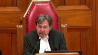
:::

La couronne dit que c'arrêtait à 17 millions, la fédération a perdu peut-être jusqu'à 21 millions mais pour les fins du procès, il y a 10 millions.

Alors, sur cette base-là, en regardant l'article, le juge conclut que l'amende est de tel montant.

Ce que vous êtes en train de nous dire, c'est que finalement, les autres complices sont bénéficiés d'un passe-droit parce que étant donné qu'on ne pouvait pas faire la preuve du même montant de sirop d'érable auquel ils auraient été liés, le juge a pris la preuve qui lui était présentée puis a accordé, a imposé une amende moindre.

Mais est-ce que c'est vraiment la bonne façon de le présenter, ça?

**Speaker 4** (01:25:42): En fait, je pense qu'il y a eu deux erreurs ici.

::: {.column-margin}

:::

C'est-à-dire que dans le cas de M. Havik-Caron, je comprends que ce n'est pas le cas auquel vous avez à décider, mais il n'en demeure pas moins que dans la répartition des montants, manifestement, il y a eu un amalgame à quelque part, une confusion certaine puisque la preuve qui a été présentée dans le cas de M. Havik

-Caron est somme toute la même en ce sens où on a retenu les témoignages de chacun des deux alors qu'ils sont contradictoires l'un par rapport à l'autre, ceci étant dit.

Et c'est quand même particulier parce que même dans le cas de M. Havik-Caron, le juge dit qu'il ne croit pas nécessairement à son témoignage, il trouve qu'il y a peu de crédibilité et qu'il est flou, mais il retient quand même les données que M. Havik-Caron lui donne pour établir le montant de la demande compensatoire.

Nous, notre prétention, c'est que oui, il y a eu cette confusion-là, oui, effectivement, ça nous paraît injuste qu'une fois qu'on dise que pour M. Havik-Caron, on n'a pas été en mesure d'aller chercher le 9,5 million, on va se tourner vers un complice et on va essayer d'aller prendre ça dans cette cour-là.

Je ne pense pas que ça doit fonctionner ainsi.

Les définitions dans le code criminel sont vraiment importantes ici.

Madjirou, j'ai une question pour vous. Madjirou,

**Justice Côté** (01:27:09): pour vous, tous ces arguments que vous faites et la preuve que vous nous décrivez de Monsieur Caron versus Monsieur Vallière et Monsieur Bourassa, n'est-ce pas là des arguments en plus qui ont trait à la répartition ou à l'évaluation du contrôle que chacun avait sur les produits de la criminalité?

::: {.column-margin}

:::

Mais moi j'aimerais vous entendre sur votre interprétation, à vous, des mots, une amende égale à la valeur du bien.

Alors pour vous là, ça veut dire quoi?

**Speaker 4** (01:27:38): Alors, merci beaucoup pour votre question.

::: {.column-margin}

:::

En fait, c'est que je vais partir de la disposition elle-même, donc 462.373, ou est-ce qu'on dit, pour moi, ça me semble utile de faire l'exercice, c'est de dire qu'une ordonnance de confiscation devrait être rendue à l'égard d'un bien, d'une partie d'un bien ou d'un droit d'un contrevenant, donc une partie d'un bien d'un contrevenant ou du bien d'un contrevenant peut, en remplacement de l'ordonnance, infliger au contrevenant une amende égale à la valeur du bien.

Donc, on comprend ici que valeur du bien inclut également une valeur qui pourrait être une partie du bien également.

Et voici ce que je voulais vous dire par rapport à cet aspect-là que la valeur du bien pourrait être une partie de la valeur du bien, d'où qu'il peut y avoir une répartition, selon nous, lorsqu'il y a plusieurs individus qui sont impliqués dans une activité criminelle.

Ensuite, le paragraphe 3, évidemment, il faut qu'on retourne au paragraphe 1 à la disposition 1 de la même disposition, ou est-ce que ça indique que le juge est tenu d'ordonner la confiscation des biens ou du bien ou une partie du bien, dont il est convaincu qu'il constitue des produits de la criminalité.

Donc, le bien, manifestement, il est rattaché au produit de la criminalité.

Le produit de la criminalité, vous l'avez très bien relevé tout à l'heure, la définition du produit de la criminalité, c'est un bien, un bénéfice ou un avantage obtenu qui provient notamment de la perpétration de l'infraction désignée.

Donc, ceci étant dit, nous croyons que la définition, on ne doit pas nécessairement simplement se cantonner dans la définition du mot « bien » de l'article 2, malgré qu'on ne doit pas le laisser de côté non plus, mais il n'en demeure pas moins qu'on doit toujours se rattacher à la définition de « produit de la criminalité »

parce que c'est ce qui est visé.

Madame la juge Deschamps l'a très bien mentionné dans l'arrêt-lavigne à l'effet que ce qui est visé par les dispositions de la partie 12.2, ce sont vraiment les produits de la criminalité.

Donc, quand on veut établir la valeur de remplacement du bien, c'est la valeur de remplacement du produit de la criminalité et qui lui peut être une partie de ce bien-là, d'où la répartition qu'il peut y avoir entre différents individus.

**Justice Kasirer** (01:30:34): Est-ce que quand vous soulignez ça dans votre plan d'argumentation, la partie du bien à trois, est-ce que ce n'est pas, regardez la version anglaise, est-ce que ce n'est pas la partie du bien qui n'est pas disponible à la confiscation?

::: {.column-margin}
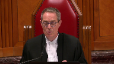
:::

Alors, mettons la moitié du sirop est trouvée, mais l'autre moitié est partie dans l'air.

Et pour l'autre partie qui n'est pas trouvable, là il va y avoir une amende, c'est peut-être pas le même sens que vous prêtez au texte.

**Speaker 4** (01:31:10): En fait, c'est comme ça que je l'interprète exactement de la même façon que vous venez de le mentionner, à savoir que lorsqu'on parle, par exemple, et c'est le cas en la présente espèce en dehors, parce qu'il y a une certaine partie du sirop d'érable qui a pu être saisie chez différents acheteurs, donc ce sirop-là a été récupéré et a été restitué à la fédération.

::: {.column-margin}

:::

Donc, manifestement, cette valeur de sirop d'érable doit être déduite de l'ensemble du voile pour établir la valeur du bien de remplacement.

C'est ça qui a été fait.

**Justice Wagner** (01:31:55): qui a été fait dans le calcul du premier juge.

**Overlapping speakers** (01:31:58): C'est rien.

**Justice Wagner** (01:31:59): un certain montant qui a pu effectivement être perçu.

**Speaker 4** (01:32:03): Vous voulez dire… Je veux juste être certaine de bien saisir votre question, M. le juge en chef.

Dans le raisonnement du premier juge, en imposant la peine de 10 millions, on enlève…

Vous êtes mignons.

**Justice Wagner** (01:32:13): 500, quelques mille dollars je pense, ou 600 000 qu'on a pu récupérer, non.

**Speaker 4** (01:32:19): En fait, ça constituait l'ordonnance de restitution et ce n'est pas une partie du bien du sirop d'érable qui a été saisie et qui a pu être restitué à la Fédération.

::: {.column-margin}

:::

Ce montant-là de 600 quelques mille dollars US qui a été par la suite rétabli en devise canadienne et ça le ministère public

était en accord avec ça au niveau de l'appel devant la Cour d'appel du Québec.

Il s'agissait d'un montant d'argent qui était dans un compte bancaire aux États-Unis et dans un compte je pense d'avocat également.

Il y avait une répartition différente des montants mais le total faisait 600-6000 quelque chose US et c'était de l'argent qui provenait de la vente de sirop d'érable et qui se retrouvait dans ces comptes-là.

À ce moment-là, il y a eu une ordonnance de restitution de ce montant-là à l'égard de la Fédération donc on est venu diminuer le montant de la vente compensatoire en raison du montant qu'on a pu aller saisir dans ces comptes bancaires-là qui était considéré comme un produit de la criminalité mais ce n'est pas comme ça qu'il a été traité par contre.

Ils l'ont vraiment fait au niveau d'une restitution.

Je reviens au niveau des différentes définitions qu'on retrouve non seulement à la disposition 462.37.3 ou 463.3 mais également, j'attire l'attention de la cause sur les termes qui sont utilisés directement dans l'arrêt de la vigne.

Dans l'arrêt de la vigne, on va utiliser vraiment les expressions « privation du gain » ou encore « les produits du crime ».

Donc, manifestement, et c'est l'un des objectifs des dispositions de la partie 12.2, c'est exactement ça qu'elle vise, donc à priver le délinquant du produit de sa criminalité ou encore la privation du gain qu'il a eu.

Le gain pour nous étant, voulant dire, profit, charge de profit ou gain ou bénéfice qui en a été retiré.

**Overlapping speakers** (01:35:00): J'attends les gars.

**Speaker 4** (01:35:01): votre attention dans l'arrêt à Rafilovic au paragraphe 27 et 28.

::: {.column-margin}

:::

Je comprends que dans cette affaire-là, on parle d'une ordonnance de restitution versus l'amende compensatoire.

Et là, on reprend les termes, en fait, les enseignements de la vigne et entre autres, on va dire que quatrièmement, au paragraphe 27, quatrièmement, le ministère public prouve que certains biens sont visés par la définition légale de produits de la criminalité au sens de 462.37 1 ou 2.

Seuls les biens dont on a jugé qu'ils constituent des produits de la criminalité à l'issue de l'instance, qu'il s'agisse d'une audience de détermination de la peine ou de confiscation, peuvent faire l'objet d'une confiscation ou d'une amende en remplacement de la confiscation.

On poursuit au paragraphe 28, et je vais couper des bouts là.

Je vais citer partiellement, on dit cinquièmement, une partie où la totalité des biens dont il est prouvé qu'il constitue des produits de la criminalité à l'étape de la détermination de la peine n'est plus confiscable au profit de sa majesté.

En pareil cas, le juge chargé de déterminer la peine peut infliger une amende en remplacement de confiscation en conformité de 462.37 3 et 4.

L'infection d'une amende participe d'une décision discrétionnaire et le paragraphe 462.37 3 dresse une liste non exhaustive des circonstances dans lesquelles il est possible d'infliger une amende en remplacement de la confiscation.

Et là, je vais aller à la fin du paragraphe, donc in fine, on va dire la amende est infligée.

**Justice Wagner** (01:37:10): La discrétion, maître, c'est de décider s'il y a lieu d'imposer une telle amende, mais ce n'est pas sur le calcul.

**Speaker 4** (01:37:18): En fait, on dit que ça doit être égal au montant des fonds dont il a été prouvé qu'il constitue des produits de la criminalité.

::: {.column-margin}

:::

Donc, manifestement, ici, le produit de la criminalité, comme je reviens à la définition initiale, qui peut être le bénéfice ou le gain qui a été engendré par l'activité criminelle.

Et je pense que c'est un bon moment pour faire, en fait, je n'ai pas de correction de ce que mon collègue a dit précédemment, mais je voulais apporter une nuance.

Il y a une question qui lui a été posée à l'effet de, et si je ne me trompe pas, c'est Mme la juge Côté qui lui a posé la question, à savoir si le sirop d'érable, bon, qu'on considérait que c'est le produit de la criminalité, qu'il s'agissait de… Attendez, je ne veux pas me tromper là.

Ah oui, c'est ça ici.

Est-ce que je ne me souviens pas, Mme la juge Côté, j'ai malheureusement pas noté quel jeu j'avais posé la question, mais on demandait si le 10 millions, s'il avait été placé par exemple…

Ah oui, ça me revient, c'est bien vous.

Alors, le 10 millions, s'il avait fait l'objet d'un placement, alors est-ce que les bénéfices qui requièrent, qui sont à même de ce compte-là, on pouvait également les confisquer?

Et on vous a dit, réponse oui, on vous a donné l'exemple d'un immeuble.

En fait, là où est-ce que je pense qu'il est important d'avoir une distinction, c'est que oui, un immeuble peut faire l'objet d'une confiscation totale, mais il peut également faire l'objet d'une confiscation partielle.

Et la confiscation, qu'elle soit totale ou qu'elle soit partielle, ou il pourrait même refuser de faire une confiscation sur l'immeuble une fois que la preuve a été entendue, mais dans la mesure où on décide de confisquer un immeuble, la preuve doit démontrer dans quelle proportion il y a un produit de la criminalité qui est rattaché à cet immeuble-là, et c'est la raison pour laquelle il va être confisqué en partie ou totalement.

**Justice Côté** (01:39:42): J'ai une question pour vous.

::: {.column-margin}

:::

Je vous ramène aux définitions.

Alors, vous nous avez amené à la définition de produit de la criminalité et c'est vrai, ça dit un bien, bénéfice ou avantage.

C'est pas contesté, c'est là.

Quand vous retournez à 462.373 et là vous nous faites l'argument qu'on parle à 462.373 d'un bien ou d'une partie d'un bien, mais allez voir un peu plus loin dans 462.373 à quoi le montant de l'amende doit être égal.

Une amende égale à la valeur du bien.

On ne répète pas ici ou d'une partie du bien.

On ne dit pas non plus une amende égale au bénéfice, qui est dans la définition de produit de la criminalité.

On ne dit pas non plus une amende égale à l'avantage.

On dit une amende égale à la valeur du bien.

Comment puis-je concilier ça avec ce que vous nous dites?

Je comprends que la définition parle des trois, du bien, du gain ou de l'avantage, du bien, du bénéfice ou de l'avantage, mais à 462.373 lorsqu'on dit voici l'amende doit être égale à, on limite seulement ça à la valeur du bien.

Comment puis-je concilier les deux?

**Speaker 4** (01:41:04): Alors, dans un premier temps, nous admettons respectueusement que dans l'expression, la valeur du bien, ça inclut une partie du bien ou d'un droit.

::: {.column-margin}

:::

Nous croyons que ces termes-là n'ont pas été répétés simplement parce qu'ils les incluaient, donc le législateur n'a pas tenu, n'a pas jugé nécessairement de répéter chacun de ceux-ci puisque, si on se réfère toujours aux quelques lignes précédentes, si le législateur a déterminé qu'on parlait d'un bien, d'une partie ou d'un droit, d'un contrevenant, manifestement quand il renvoie à la valeur du bien, selon nous, il renvoie au bien, une partie du bien ou d'un droit.

Quant à votre, si je peux m'exprimer ici, à la deuxième question, comment concilier valeur du bien avec produit de la criminalité, c'est toujours dans l'optique, et là je réfère à l'arrêt la vigne dans laquelle on indique clairement que le paragraphe 3 doit s'interpréter à la lumière du paragraphe 1 et également de la partie 12.2 dans laquelle ce paragraphe-là se retrouve à titre de disposition.

Donc, manifestement, il fait partie des produits de la criminalité, donc valeur du bien.

Je comprends tout à fait, le législateur aurait pu choisir d'utiliser l'expression à la valeur du produit de la criminalité.

Non, mais quand on met le bureau...

**Justice Wagner** (01:42:54): de la législation.

::: {.column-margin}
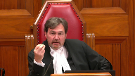
:::

Il me semble qu'il ne faut pas corrigé moi si j'ai tort.

On veut couvrir le cas où effectivement on ne peut plus confisquer le bien volé, le produit de la criminalité, le bien, le matériel.

Dans les cas où on peut le confisquer, on va le confisquer.

Mais dans les cas où on ne peut pas le confisquer, on utilise l'amende compensatoire.

C'est ma compréhension des choses.

Mais là, qui est liée donc à la valeur du bien.

Alors, on aurait pu avoir le sirop, on n'a plus de sirop, c'est quoi la valeur du sirop?

Ce n'est pas aussi simple que ça.

**Speaker 4** (01:43:32): En fait, je vais vous donner l'exemple suivant et je vais référer justement à Charrière pour lequel, manifestement, on n'a pas une interprétation qui est la même que celle de mes collègues, à savoir que les juges de la Cour d'appel, dans ce cas-là, sont en porte-à-faux avec la décision de M. Vallière.

::: {.column-margin}

:::

Dans le cas de M. Charrière, je vais juste prendre mon résumé pour m'assurer que je fais bien les choses.

Alors, dans le cas de M. Charrière, c'est un négociant de grain, voilà, et lui a été accusé de fraude et de vol au niveau du grain.

Dans un premier temps, c'est que dans son entreprise, il avait deux activités.

La première étant qu'il était négociant à titre de grain, donc il achetait du grain des producteurs pour le revendre à profit à d'autres producteurs.

L'autre activité de son entreprise étant qu'il offrait un service aux producteurs de grain, à savoir qu'il pouvait y avoir du séchage et de l'entreposage dans les silos du grain en question.

Donc, le grain ici, en fait, qu'est-ce qui est arrivé?

C'est que M. Charrière, pour des raisons excrèques Z, a eu des difficultés financières et ce qui s'est produit, là je vous fais vraiment une histoire courte, ce qui s'est produit, c'est qu'il a, par plusieurs moyens, plusieurs explications qu'il donnait aux producteurs de grain à qui il achetait le grain, il faisait des chèques et ces chèques-là se sont retrouvés à être NSF, donc sans fonds, à plusieurs reprises et M. Charrière leur donnait plusieurs explications évidemment mensongères pour tenter de les faire patienter, mais il savait très bien qu'il n'avait pas l'intention de payer ces producteurs-là.

Dans le deuxième cas, il a été accusé de vol et ça, c'est que tous ces clients qui entreposaient leurs grains dans ces silos, en fait, c'est que M. Charrière a vendu ce grain-là, donc les silos étaient vides et les producteurs se sont retrouvés le Bécalot étant donné qu'ils n'avaient plus leurs grains.

Et là, je trouve qu'il y a une distinction vraiment très importante à faire ici et qu'on ne trouve pas du tout que justement la Cour d'appel est en porte-à-faux par rapport au dossier de M. Vallière.

C'était l'effet que dans le cas de M. Charrière, c'était facile d'établir la valeur du bien.

Non seulement ça, parce que dans le cas de la fraude, c'était tous les comptes à payer qu'il n'a pas payé, donc ça déterminait la valeur du grain qui a été fraudé.

Et dans l'autre partie concernant le vol, c'était la valeur du grain qui était dans les silos que lui a vendus et qui a été volé.

Donc, c'était quand même relativement facile d'établir la valeur du grain.

Non seulement ça, mais en plus, donc la valeur du bien de remplacement, elle était simple à identifier.

D'autant plus que M. Charrière était seul dans son entreprise.

**Justice Wagner** (01:47:05): Ici, M. Verlier admet, c'est 10 millions.

**Speaker 4** (01:47:11): En fait, ce qu'il admet, c'est qu'il y a transigé pour 10 millions.

::: {.column-margin}

:::

Il n'y a pas eu 10 millions, et on le voit très bien d'ailleurs par rapport au compte bancaire, qu'on voit par exemple à la pièce S2.

Je vous dis bien candidement, je ne vais pas prendre beaucoup de temps sur cet aspect-là, entre guillemets, en ce sens où la pièce S2, je ne sais pas si c'est moi, mais j'ai beau la revisiter, revisiter, je n'arrive pas à bien saisir comment on peut parler de tant de dollars, puis qu'après ça, c'est enlevé, remis.

Donc, je vous épargne les détails, mais il n'en demeure pas moins que quand on regarde la pièce S2 et les comptes bancaires, on voit ce qui a été déposé et ce qui a été retiré, et c'est approximativement 8 millions qui est rentré et qui est sorti.

Donc, manifestement, ça semble, ça concorde, ça correspond avec le témoignage que M. Vallière a fait devant la Cour lors de la détermination de la pièce, durant le procès, pardon, manifestement, parce qu'effectivement, les entrants de la vente de sirop d'érable permettaient d'aller en acheter davantage.

Et c'est ce que retient d'ailleurs la Cour d'appel du Québec.

Donc, ce n'est pas le… et le 10 millions, ceci étant dit, il ne faut pas perdre de vue que ce n'est pas 10 millions qui étaient dans la poche de M. Vallière.

En ce sens où il y a eu un prédécesseur, pardon, qui est M. Havik Caron, qui lui l'a volé et qui a eu un gain, un bénéfice par rapport à ce vol-là, le bien était dans les mains par la suite, a transigé dans les mains de M. Vallière pour atterrir dans les mains de d'autres acheteurs, dont M. Saint-Pierre qui était un co-accusé de M. Vallière et de M. Caron au départ.

Alors, il y a une chaîne de possession ici.

On n'est pas seulement dans un cas d'espèces où est-ce que, comme dans le cas de M. Chariat par exemple, où est-ce que lui était seul dans son activité, dans ses activités criminelles.

Donc, c'est sûr et certain qu'on ne vous cachera pas que dans la mesure où on est en présence de plusieurs individus, lorsqu'on veut établir le montant de l'amende compensatoire, manifestement, il doit y avoir une répartition équitable entre les différents intervenants ou acteurs dans la chaîne.

**Justice Wagner** (01:49:58): l'objectif d'avoir une répartition entre les complices

::: {.column-margin}

:::

, c'est pour éviter le dépassement finalement de la valeur du bien volé.

On s'entend là-dessus?

Oui, absolument.

Dans ce cas-ci, êtes-vous d'accord avec moi, c'est ma compréhension du dossier, que justement parce que les complices ont eu des peines que vous estimez inégales par rapport à celles de M. Vallière, on dépasse pas le montant du produit volé.

Donc il n'y a pas de problème de dédoublement.

**Speaker 4** (01:50:29): En fait, il y en a un oui à quelque part, d'une certaine manière.

::: {.column-margin}

:::

Étant donné, je vous donne l'exemple de M. Bourassa ou d'autres personnes qui ont reçu des montants qui provenaient de la vente elle-même du sirop d'érable par Richard Vallière.

Donc, ils étaient payés par Richard Vallière à même les revenus de la vente du sirop d'érable.

Donc, là, il pouvait y avoir un double recouvrement.

Là où est-ce que, et la Cour d'appel le mentionne bien à cet égard-là, si par exemple on avait bel et bien imposé l'amende de 9,5 millions à M. Caron et qu'on arrive ensuite à M. Vallière et qu'on lui impose un 10 millions et que par la suite, quand on va du côté de M. Saint-Pierre qui, lui, la poursuite était plus autour de 5-6 millions, manifestement, là, on revient complètement de la valeur de la perte de M. Caron.

**Justice Wagner** (01:51:40): Les chiffres au dossier, c'est que pour Martin Vallière, Sylvain Bourassa, Yves Lapierre, la demande compensatoire est de 204 400 $.

**Speaker 4** (01:51:53): M. St-Pierre, il y a eu 1,2, je pense.

Attendez, je vais juste reprendre mon cahier.

**Justice Côté** (01:52:04): Monsieur le Président, nous avons fait un travail incroyable, nous avons fait un travail incroyable, nous avons fait un travail incroyable, nous avons fait un travail incroyable, nous avons fait un travail incroyable, nous avons fait un travail incroyable, nous avons fait un travail incroyable, nous avons fait un travail incroyable, nous avons fait un travail incroyable, nous avons fait un travail incroyable, nous avons fait un travail incroyable, nous avons fait un travail incroyable, nous avons fait un travail incroyable, nous avons fait un travail incroyable, nous avons fait un travail incroyable, nous avons fait un travail incroyable, nous

**Speaker 4** (01:52:15): oui exactement mais ce n'était pas ça qui au départ était demandé par le ministère public mais c'est la manque compensatoire qui lui a été imposée au final.

::: {.column-margin}

:::

Nous ce qu'on vous dit c'est que si la même méthodologie de calcul qui a été fait initialement par le juge de première instance dans le cas de monsieur Vallière, si cette même méthode de calcul là avait été suivi pour les autres individus impliqués dans cette activité criminelle là manifestement il y aurait eu un montant plus important d'amende compensatoire que la perte qui a été réellement subi par la fédération.

**Justice Côté** (01:52:59): Alors vous semblez plus vous plaindre Majiru pas du fait que le juge de première instance a dit que la valeur du bien c'était la valeur du sirop, mais plus de ce que le juge de première instance a fait en matière de répartition entre les différents acteurs de ce vol et recel de sirop d'érable.

::: {.column-margin}

:::

Vous semblez plus vous plaindre de ça, mais ce n'est pas là-dessus que vous êtes allé en cours d'appel.

Vous êtes allé en cours d'appel pour vous plaindre du fait qu'il y avait eu une amende compensatoire imposée.

**Speaker 4** (01:53:28): En fait, je pense que, peut-être que je ne l'ai pas bien exprimé, je m'en excuse si c'est le cas, nous croyons que non seulement il y a eu une erreur qui a été faite au départ dans la méthode de calcul et de la répartition de la valeur du bien entre les différents individus, mais également du fait de l'imposition de la détermination de l'amende compensatoire.

::: {.column-margin}

:::

Ça, c'était la position qui avait été adoptée précédemment en première instance, mais du moment où est-ce qu'on détermine qu'il doit y avoir une amende compensatoire, à ce moment-là, on doit vraiment venir déterminer quelle est la valeur qui est attribuable à l'activité criminelle qui a été perpétrée par l'individu qui doit être le délinquant qui est visé par la demande.

Donc, c'est en ce sens-là que nous croyons que la Cour d'appel a été bien fondée d'intervenir dans un cas comme celui-ci.

Nous croyons également que le fait de ne pas tenir en compte qu'une amende compensatoire soit déterminée en fonction du gain ou du bénéfice dont en a retiré le délinquant de son activité criminelle, il y a trois risques qu'on y voit.

Le premier, on en a discuté précédemment, le double recouvrement.

Ensuite, il y a un deuxième piège qui peut se présenter, c'est de se retrouver, encore là on a discuté précédemment, d'une valeur supérieure à la perte qui a été encourue par la victime.

Et le troisième, lui aussi, je l'ai abordé d'une autre manière, mais de causer une certaine injustice entre les différents acteurs dans le cas d'une activité continue comme celle-ci, parce qu'on n'est pas dans un cas, dans le cadre d'une infraction ponctuelle avec un seul individu, comme par exemple dans Monsieur Charrière, mais on est beaucoup plus dans une infraction continue et avec l'implication de plusieurs personnes.

On a au moins jusqu'ici 16 personnes qui ont été accusées dans le cadre de ce projet-là.

Et ces pièges dont je viens de vous énumérer, c'est la raison pour laquelle nous croyons que la Cour d'appel a privilégié l'approche de l'arrêt de Dekman, justement pour venir établir un barème qui est équitable et qui, non seulement ça, mais qui va se baser sur la preuve.

Donc, le bénéfice ou le gain qui a été retiré dans cette aventure-là de la part de M. Vallière, c'est 1 million.

D'où l'intervention de la Cour de dire, écoutez, c'est vraiment le produit de la criminalité, parce que de toute façon, le sirop d'érable n'est plus en ses mains.

Il est rendu dans les mains de quelqu'un d'autre et en plus, à quelqu'un d'autre.

Il l'a revendu à quelqu'un d'autre.

Donc, manifestement, lui, la façon d'aller récupérer le bien qui a transigé entre ses mains, parce que ce n'était pas un contrôle exclusif qu'il avait sur le sirop d'érable, et ni les deniers par la suite, parce qu'il y a eu des entrées et des sorties.

Mais il n'en demande pas moins qu'en bout de piste, quand on veut priver, c'est ça l'objectif, un des objectifs de la partie 12.2 du Code criminel, c'est de priver le délinquant des gains qu'il a eus de son activité criminelle.

Donc, nous nous mettons respectueusement que cette privation de gain-là devait être celle d'un milliard de dollars, c'est-à-dire le profit qu'il y a retiré de son activité.

**Justice Wagner** (01:58:21): S'il y avait eu des dépenses plus élevées, payer plus cher ces camionneurs, payer l'essence, évidemment ça, ça devrait être considéré aussi par le ministère public pour évaluer la perte réelle, la perte sèche de M. Vallière.

::: {.column-margin}
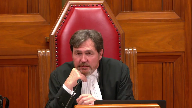
:::

On légitimise le crime, c'est ça?

**Speaker 4** (01:58:47): plus ou moins

::: {.column-margin}

:::

, si vous me permettez, c'est qu'ici, et c'est notre compréhension, c'est que pour établir, lorsque M. Vallière témoigne, il indique bien que le 10 millions et le million de profit, c'est vraiment considérant ce qu'il a transigé comme sirop d'érable.

Parce qu'on comprendra que, et même les juges de la Cour d'appel le relèvent également, et le juge de première instance de mémoire, c'est-à-dire qu'il a fait 1 million de profit et on aurait pu soustraire parce que ça ne comprenait pas ses dépenses de transport, etc. Tout ça.

Donc, manifestement, ici, on n'a pas soustrait des pertes ou qu'est-ce qu'il a pu avoir comme autres dépenses liées à notre compréhension.

Ce qui a été tenu en considération, c'est vraiment l'achat et la vente du sirop d'érable.

Et en bout de piste, voici, j'aurais fait 1 million sur la vente du sirop d'érable, mais sans considérer nécessairement les dépenses qui étaient attenantes à ça.

La Cour d'appel le dit bien, d'ailleurs, que c'étaient des entrants et des sortants.

Elle le dit bien au paragraphe 250 de sa décision.

Elle va bien indiquer qu'il s'agit plutôt d'entrants qui servaient à acheter davantage de sirop destiné à la revente afin d'engranger une marge de profit.

Et plus loin, on va dire également que…

**Overlapping speakers** (02:00:43): Grrrrrrrrrrrrrrrrrrrrrrrrrrrrrrrrrrrrrrrrrrrrrrrrrrrrrrrrrrrrrrrrrrrrrrrrrrrrrrrrrr

**Speaker 4** (02:00:44): Je vais trouver l'expression exacte parce qu'il disait « omis les dépenses de transport ».

::: {.column-margin}

:::

C'était vraiment le 1 million, mais sans les dépenses de transport ou les autres dépenses.

Donc, on peut considérer que, finalement, le gain ou le profit qu'il en a fait, qu'il en a tiré, c'est vraiment de son activité criminelle sans les autres dépenses.

Donc, c'est pour cette raison-là que nous croyons que, dans le cas de M. Vallière, ce qui devait être tenu en compte pour être conforme aux dispositions de la partie 12.2 du Code criminel, c'était de viser les gains et le profit qu'il en a fait dans le 1 million.

**Justice Kasirer** (02:01:50): de l'Ontario

::: {.column-margin}
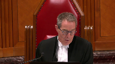
:::

soutiennent que Dickman a été mal compris par la Cour d'appel du Québec et l'insistance sur le bénéfice, au sens que vous l'employez, c'est-à-dire le profit

, ne sort pas de la lecture qu'on doit faire de Dickman, qui est le premier ministre du Canada, qui a été mal compris par la Cour d'appel du Québec, qui a été mal compris par la Cour d'appel du Québec, qui a été mal compris par la Cour d'appel du Québec, qui a été mal compris par la Cour d'appel du Québec, qui a été mal compris par la Cour d'appel du Québec, qui a été mal compris par la Cour d'appel du Québec, qui a été mal compris par la Cour d'appel du Québec, qui a été mal compris par la Cour d'appel du Québec, qui a été mal compris par la Cour d'appel du Québec, qui a été mal compris par la Cour d'appel du Québec, qui a été mal compris par la Cour d'appel du Québec, qui a été mal compris par la Cour d'appel du Québec, qui a été mal compris par la Cour d'appel du Québec, qui a été mal compris par la Cour d'appel du Québec, qui a été mal compris par la Cour d'appel du Québec, qui a été mal compris par la Cour d'app

**Speaker 4** (02:02:35): Alors, dans Dickman, effectivement, il y a eu des proportionnalités qui ont été établies, donc en pourcentage, selon, et c'est à notre compréhension, on vous le soumets respectueusement, que ces proportions-là ont été établies en fonction de, je cherche le bon terme, je m'excuse, en fonction du rôle, pardon, qui était joué par chacun d'entre eux.

::: {.column-margin}

:::

Donc, étant donné qu'il y en a une des personnes qui était considérée comme un peu plus le maître d'œuvre, on aurait considéré que cette personne-là aurait dû se voir imposer un 50 % de la demande compensatoire, à titre d'amende compensatoire, 50 % pardon de la valeur du bien, je m'excuse, donc de la valeur du bien.

Il n'en demeure pas moins, par contre, que dans Dickman, on dit bien que, et ça c'est, et c'est à notre compréhension, c'est que c'était pas seulement un partage qui était fait en relation avec le contrôle qu'ils avaient sur les biens, mais semble-t-il qu'effectivement ils avaient tous un contrôle à un moment donné ou à un autre en matière de contrôle du bien, mais c'est bel et bien une répartition en fonction du rôle qu'ils ont joué dans cette affaire-là.

Donc, nous considérons que la Cour d'appel a correctement interprété l'arrêt Dickman à ce niveau-là.

Je vais me permettre de revenir un petit peu en arrière, puisqu'il y a un aspect que je veux aborder avec vous, c'est à savoir le pouvoir discrétionnaire limité qui, c'est ce que Mme la juge Deschamps nous enseigne dans l'arrêt Lavigne.

Et je comprends très bien que dans l'arrêt Lavigne, la question, le facteur qui devait être déterminé, c'est à savoir si la capacité de payer du délinquant devait être tenue en compte lors de l'examen des deux premiers volets lorsqu'il y a lieu, de savoir d'abord si on doit imposer ou non une amende compensatoire et dans un deuxième temps, quel est le cas échéant, quelle est la valeur de cette amende compensatoire-là.

Et oui, effectivement, il y a un pouvoir limité du juge.

Par contre,

et j'attire l'attention de la Cour au paragraphe 29, ce qui nous semble être l'assise même du fait du fondement qu'un juge a un certain pouvoir qui n'est pas limité exclusivement à la valeur du bien ou encore qu'une répartition n'est pas possible.

Dans le cas de Lavigne au paragraphe 29, on dit «

J'ai dit précédemment être d'avis que le juge dispose d'un pouvoir en discrétionnaire limité lorsqu'il inflige une amende en remplacement de la confiscation.

J'ai également donné des exemples de limites à ce pouvoir et mentionné un cas d'exercice de celui-ci.

Les circonstances factuelles pouvant donner lieu à l'exercice du pouvoir discrétionnaire peuvent varier et il serait illusoire de prétendre les prévoir toutes.

Je ne traiterai donc que du seul facteur qui a occupé les débats, à savoir la capacité de payer.

Il nous semblait important de vous mentionner ce paragraphe étant donné qu'on considère qu'il s'agit vraiment du fondement de notre prétention, à savoir que là il s'agissait du facteur l'évaluation par la Cour, c'était vraiment le facteur relié à la capacité de payer.

Maintenant, il n'y a pas une fermeture sur d'autres facteurs comme par exemple celui de lorsqu'on se retrouve dans une infraction continue qui implique plusieurs individus et à divers niveaux d'implication dans l'activité criminelle et les possibilités de double recouvrement et également d'autres considérants.

Donc, manifestement, un juge de première instance doit connaître tous ces éléments-là pour bien venir évaluer quelle est la valeur de la manque compensatoire qu'il va imposer dans les circonstances.

Sur la deuxième question, je ne m'attarderai pas beaucoup à ce sujet.

Dans le mémoire, nous l'avons fait succinctement également.

Comme je vous ai mentionné au début de mes représentations, nous considérons que les juges de la Cour d'appel avaient l'ensemble de la disponibilité et l'ensemble des faits factuels pour pouvoir déterminer le montant de la demande compensatoire et qu'il n'y a pas eu d'erreur en ce sens-là et que la Cour était bienvenue pour entendre et plutôt statuer sur cet aspect-là.

Donc, dans l'ensemble, nous l'avons fait

**Justice Wagner** (02:08:29): Il n'y aurait pas été plus adéquat pour la cour d'appel en présumant, puis je comprends que vous n'étiez pas là depuis le début dans le dossier, mais en présumant qu'effectivement l'inscription en appel ne portait pas sur le calcul de l'amende, mais beaucoup plus sur l'opportunité d'en émettre une.

::: {.column-margin}
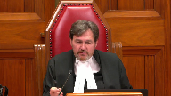
:::

Et la cour d'appel, dans sa décision, prend sur elle-même de décider d'une nouvelle façon, je dis nouvelle en ce qui est ma perception des choses, c'est-à-dire qu'il y a peut-être pas de nouvelles pour d'autres, mais en ce qui me concerne, les nouvelles, sans pour autant demander aux avocats leur opinion là-dessus.

Au niveau de la règle au diable Théramme-Perthème, au niveau de la transparence, au niveau de l'intégrité, la crédibilité des jugements, pensez-vous pas qu'il aurait fallu que la cour d'appel réouvre le dossier à tout le moins ou en tout cas?

Ça demande s'il n'y aurait pas lieu de demander aux avocats leurs prétentions.

**Speaker 4** (02:09:26): En fait, je vais vous répondre bien candidement et bien honnêtement, Monsieur le juge.

::: {.column-margin}

:::

Je n'ai pas lu les transcriptions des représentations qui ont été faites devant la Cour d'appel.

Alors, je ne peux que présumer que manifestement, cet aspect-là a été abordé d'une manière ou d'une autre, comme je l'ai indiqué précédemment, dans la mesure où on doit démontrer par une preuve, d'abord et avant tout, pour déterminer si oui ou non, il doit y avoir l'imposition d'une amende compensatoire versus la valeur de celle-ci.

C'est exactement la même preuve qui va être entendue.

Alors, je présume qu'effectivement, les représentations ont été faites autant dans un sens que dans l'autre.

Mais pour moi, je vous le dis encore là, bien humblement, nous considérons qu'il s'agit d'une seule et même question, malgré qu'elle a deux volets, si je peux m'exprimer ainsi.

Très bien.

Je vous remercie. Merci.

**Justice Wagner** (02:10:41): Maître Hérou.

**Speaker 5** (02:10:45): Monsieur le juge en chef, mesdames et messieurs les juges, je vais y aller en vrac.

::: {.column-margin}
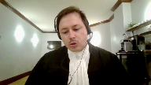
:::

Mon intention est d'adresser certaines des préoccupations qui ont été soulevées par la Cour au cours de l'audition.

D'abord, un premier élément.

Quand on lit la décision de la Cour d'appel, je ne crois pas que la décision de la Cour d'appel est à l'effet qu'il faut toujours choisir entre le bénéfice net ou le profit net qui a été fait par le contrevenant ou l'accusé et la valeur totale des produits de la criminalité.

Je pense que la décision de la Cour d'appel doit se lire à l'effet que dans ce cas particulier

-ci, en raison de la preuve et en raison des admissions qui avaient été faites, il était ouvert au juge de première instance d'exercer sa discrétion pour faire une allocation qui était équivalente aux 1 million de dollars dont avait bénéficié personnellement M. Vallière.

C'est toujours un peu difficile quand on prend les décisions des cours d'appel, que ce soit les différentes décisions de la Cour d'appel de l'Ontario ou encore ailleurs au pays, d'essayer d'en retirer une cohérence dans un contexte où ces décisions-là, il n'y en a aucune, je vous soumets, visaient à fournir un cadre clair, cohérent sur les balises qui doivent guider le juge d'instance quand vient le temps de déterminer la valeur de remplacement.

En fait, toutes les décisions portent sur des cas particuliers où un problème précis avait été soulevé et où la Cour, en fait, visaient à adresser ce problème particulier-là.

Pour revenir sur Dickman, dans Dickman, en fait, on parle d'enjeux de double recouvrement.

Revenons à l'idée de base.

En fait, dans Dickman, ce que la Cour fait, c'est qu'elle regarde l'effet du dossier et elle en vient à la conclusion, et c'est le sous-texte, je crois, que de ne pas procéder à une allocation ici, ça ferait en sorte qu'on ne respecte pas les objectifs qui sont poursuivis par le régime de la confiscation des produits de la criminalité.

C'est pour ça qu'on fait une allocation.

C'est aussi pour ça qu'on vient se poser la question du contrôle, qu'il soit exclusif ou non.

C'est parce qu'on veut éviter de se placer dans une situation où l'amende que l'on impose par sa valeur devient, et je crois que ça rejoint l'intervention du jury, devient une peine déguisée pour le contrevenant et qu'elle n'atteint plus les deux objectifs qui sont recherchés par le régime, c'est-à-dire d'une part, le priver de son gain et d'autre part, le dissuader.

Je vais juste prendre deux exemples qui me viennent en tête sur le continuum de la commission de l'infraction.

Si on prend l'exemple de la personne qui vole, qui vole un million de dollars de sirop d'érable.

Cette personne-là le vole et elle donne la charge ensuite à quelqu'un d'autre de transporter le sirop d'érable pendant une semaine jusqu'à une destination X. À la destination X, on a quelqu'un qui rachète le sirop d'érable pour le revendre par la suite à quelqu'un d'autre et ainsi de suite.

Chaque personne dans la chaîne que je vous décris a eu une forme de possession exclusive sur les produits de la criminalité.

Ça ne ferait aucun sens que d'imposer une amende de remplacement qui est équivalente à la valeur du sirop, dans cet exemple-là, à toutes et chacun des individus qui sont dans le continuum.

Évidemment, si la situation est qu'on a un groupe d'individus qui participent ensemble à un élément, il y a une allocation qui doit se faire et cette allocation, je fais un clin d'œil à ma consoeur pour le procureur général de l'Ontario, elle n'est pas simple à faire.

Quand on a posé comme question comment l'allocation devrait se faire, le juge Casirer je crois qu'il demandait est-ce que c'est bien d'utiliser un pourcentage selon le rôle ou l'implication de toutes et chacun.

La réponse à ça, en fait, elle est que ce n'est pas simple et c'est au juge d'instance de faire l'exercice.

C'est au juge d'instance de le faire dans chacun des dossiers sur la base de la preuve qu'il a devant lui, que ce soit quant au rôle des différentes personnes qui sont impliquées, quant aux difficultés qu'il y a ou qu'il n'y a pas à déterminer la valeur des produits de la criminalité.

Pour que le juge d'instance soit capable de faire cet exercice-là, c'est-à-dire d'en arriver à une grille de calcul qui est adéquate et appropriée pour les faits de l'espèce en raison de la nature d'une infraction allégée du rôle de chacun.

Il doit avoir une discrétion.

Il doit avoir une discrétion et cette discrétion-là, bien qu'elle soit balisée, elle l'est dans la mesure où le juge respecte les principes qui sont recherchés par le régime de la confiscation des biens.

**Justice Côté** (02:15:15): Je vous écoute et vous semblez être en accord avec le modèle proposé par le procureur général de l'Ontario.

Non, je ne le suis pas parce que en fait, le procureur, allez-y, madame la ministre de l'éducation.

J'ai tout et mal compris, alors.

**Speaker 5** (02:15:31): En fait, ce que le procureur général de l'Ontario semble indiquer ici, c'est qu'il faut éviter de s'en limiter à la notion de profit ou de bénéfices nets.

::: {.column-margin}
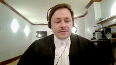
:::

En fait, on parle plutôt de l'idée d'allocation.

Notre position, en fait, la position de la CAID est qu'il y a des circonstances où tout ce que la preuve élève, c'est le bénéfice net ou le profit et où on n'est pas nécessairement en mesure de faire une allocation avec les autres joueurs et que là, le juge d'instance pris avec cette preuve que je vais qualifier d'incomplète là, il doit pouvoir se rabattre sur des éléments qui sont au dossier et le bénéfice net en est certainement un.

Très bien.

Je vous remercie, maître.

Merci beaucoup, monsieur le maire, merci beaucoup à vous tous, merci à vous tous, merci à vous tous.

Merci à vous tous.

**Justice Wagner** (02:16:17): réplique

**Speaker 1** (02:16:20): Si vous me permettez, M. le juge en chef, merci.

::: {.column-margin}

:::

En fait, très rapidement, pour répondre directement à des questions qui ont été soulevées par la Cour, mais tout d'abord, je serai en accord avec mon confrère, Maître Éroux, sur son intervention, et je le cite.

Il est au juge d'instance de calculer le montant de l'amende compensatoire.

Alors, c'est un pouvoir discrétionnaire qui appartient au juge d'instance et la Cour d'appel du Québec.

**Overlapping speakers** (02:16:45): Le-le-le-masse-

**Overlapping speakers** (02:16:48): le le

**Speaker 1** (02:16:49): raisonnement, la décision prise par le juge d'instance était raisonnable.

Et donc de ce point, elle ne devait pas intervenir.

**Justice Kasirer** (02:16:56): Mais quelle est la responsabilité de la couronne dans cette opération-là?

::: {.column-margin}

:::

Il me semble que, surtout dans le cas où il y a plusieurs accusés, enfin plusieurs délinquants, et que vous demandez dans des instances différentes pour des montants différents, avez-vous la responsabilité, vous, de faire en sorte que la preuve ne se gonfle pas?

C'est un peu la position de l'intimé ici que vous en avez demandé pour M. St-Pierre, vous en avez demandé pour M. Caron, vous en avez demandé pour M. Vallière.

Si on fait le total de l'ensemble, on dépasse même la perte sèche, on ne peut pas parler de perte sèche dans le cas qui nous occupe, mais on se comprend, de sirop d'érable.

Quelle est votre responsabilité avec Boucher contre l'Arène qui limite un peu votre marge de manœuvre?

**Speaker 1** (02:17:55): Tout à fait.

::: {.column-margin}

:::

La responsabilité de la poursuite est de limiter les demandes à la valeur du produit de la criminalité.

Et la valeur du produit de la criminalité, on revient à ça, ce sera ultimement une valeur maximale du bien.

Et vous avez tout à fait raison, et également pour faire le lien avec une question de M. le juge Jamal un peu plus tôt, l'exercice de répartition dans le dossier de Richard Vallière n'a pas été fait, puisque la preuve n'amenait pas à une répartition du bénéfice.

Et également, permettez-moi de souligner, on parle énormément de Dyckman.

Dyckman est une décision de la Cour d'appel de l'Ontario qui a été rendue en juillet 2017, tandis que la décision d'instance de la Cour supérieure de M. Richard Vallière a été rendue en avril 2017.

Alors évidemment que la Cour supérieure ne peut pas bénéficier des enseignements précis de la décision de Dyckman.

Mais M. le juge Casirard, oui, le poursuivant a la responsabilité de présenter des demandes dont le calcul maximal serait la valeur du produit de la criminalité.

Encore faut-il, et sans revenir à ce que j'ai mentionné plus tôt, mais encore faut-il que la source du produit de la criminalité soit la même pour chacun des délinquants.

Par exemple M. St-Pierre, ce qui n'est pas son cas, puisque encore là, l'argent obtenu de M. St-Pierre provient d'entreprises complètement légitimes, complètement autres.

Encore faut-il que la source soit la même, que ce soit le même produit de la criminalité qui a été réparti entre les accusés.

**Justice Côté** (02:19:28): de l'économie, de l'économie, de l'économie, de l'économie et de l'économie et de l'économie et de l'économie et de l'économie et de l'économie et de l'économie et de l'économie et de l'économie et de l'économie et de l'économie et de l'économie et de l'économie et de l'économie et de l'économie et de l'économie et de l'économie et de l'économie et de l'économie et de l'économie

::: {.column-margin}

:::

**Speaker 1** (02:19:53): La valeur du bien qui a été possédée et contrôlée par M. Vallière est de 17 à 21 millions de dollars, la valeur marchande du sirop d'érable.

La conversion du produit de la criminalité est une valeur de 10 millions de dollars.

La vente de l'économie est une valeur de 10 millions de dollars, la vente de l'économie est une valeur de 10 millions de dollars.

**Overlapping speakers** (02:20:09): Oui je comprends ça mais...

**Speaker 1** (02:20:11): qui valait plus de 17 millions de dollars, il l'a vendu pour 10 millions.

Mais je comprends ça, mais...

**Justice Côté** (02:20:16): Quand on est dans une situation de répartir entre des complices, il faut avoir la valeur totale du bien, selon la position que vous défendez, et ensuite il faut savoir de cette valeur totale-là combien a été possédée ou contrôlée par l'un ou l'autre des individus à un moment précis.

::: {.column-margin}
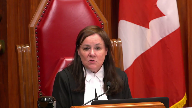
:::

Alors moi, je veux juste savoir dans les faits ici, le 10 millions, vous confirmer que c'est la valeur totale du bien.

**Speaker 1** (02:20:40): Le 10 millions, c'est la valeur totale du bien possédé et contrôlé par Richard Vallière dans ses faits à lui, dans sa trame factuelle à lui.

::: {.column-margin}

:::

Parce que dans la trame factuelle retenue par Avic Caron, ce qui n'est pas contesté par la Cour d'appel, ce qui est même avalisé par la Cour d'appel au paragraphe 284 de sa décision, le produit de la criminalité d'Avic Caron n'est pas le même que le produit de la criminalité de Richard Vallière, qui n'est pas le même que celui d'Étienne Saint-Pierre.

Et donc, la preuve, et tout n'est une question de preuve, la preuve, possédé et contrôlé, Richard Vallière, 10 millions de dollars.

Et, M. le juge Roe, vous faisiez également une question concernant Yves Lapierre, vous donniez l'exemple de son rôle évidemment plus minime à titre de truck driver, de conducteur de camion.

En fait, pour l'histoire, M. Lapierre était boiler, était un bouilleur de sirop d'érable, il va être payé pour ses activités.

Mais, à votre question hypothétique de dire le conducteur qui transporte le 10 millions de dollars de sirop, est-ce qu'on peut lui imposer l'amende de 10 millions de dollars à lui seul?

Non, puisqu'il va s'agir, une question encore là, de possession, de contrôle.

La possession, la connaissance, le contrôle, le consentement, et cette réponse-là en fait a été offerte par la Cour d'appel de l'Ontario, notamment dans Siddiqi, en 2015, et pour la référence qui est à notre onglet 33 du cahier des sources.

Et je cite rapidement le paragraphe 6.

**Speaker 6** (02:22:12): The loan proceeds were proceeds of crime.

::: {.column-margin}

:::

Mr. Siddiqi had possession and control of loan proceeds in excess of the amount which he was fined.

He put most of the funds beyond reach by transferring them out of the country to the third party.

The third party was not a co-conspirator before the court.

The trial judge did not need to find that Mr. Siddiqi personally benefit from the fund he transferred to the third party on a dollar for dollar basis to impose a fine in euro for future that include the amount of the transfer funds.

**Speaker 1** (02:22:46): On revient aux faits, Richand Vallière a possédé et contrôlé une valeur de 10 millions de dollars à un moment ou à un autre.

::: {.column-margin}

:::

Également en référence à la décision AS 2010, Cour d'appel de l'Ontario, à notre onglet 14 du recueil condensé.

Et donc, dans les circonstances, l'amende, et c'est ce qui est en appel devant vous, l'amende à l'égard de M. Vallière était de 10 millions de dollars.

La Cour d'appel du Québec a reconnu qu'il s'agissait du produit de la criminalité et c'est donc le montant qui doit lui être imposé.

Merci beaucoup.

**Justice Wagner** (02:23:25): Merci à tous les avocats, avocates, pour leurs arguments.

La Cour va prendre le dossier en délibérant.

Bonne fin de journée.