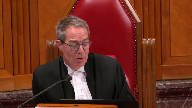

---
title: Her Majesty The Queen v.  J.F.
published-title: Heard
date: 2021-11-30
sidebar: false
---

This transcript was made with automated artificial intelligence models and its accuracy has not been verified. Review the original webcast [here](https://scc-csc.ca/case-dossier/info/webcast-webdiffusion-eng.aspx?cas=['39267']).
---

**Speaker 1** (00:00:01): la co-

**Overlapping speakers** (00:00:01): the court!

**Justice Wagner** (00:00:23): Bonjour

::: {.column-margin}

:::

, veuillez-vous asseoir.

Dans le dossier de Sa Majesté la Reine contre JF, pour l'appelant de Sa Majesté la Reine, maîtres Justin Tremblay et maître Nicolas Abrand, pour les intervenants adjoints de l'Ontario, Tracy Koslowski et Samuel Green, pour les intervenants adjoints de la Colombie-Britannique, Liliane Bantourakis et Leslie A. Erosika, pour les intervenants adjoints du Général de l'Alberta, Matthew W. Greener, pour l'intimé JF, maître Diego Gramaggio, pour les intervenants de l'Association Ontario, Christine Mainville et Andrew Burgess, pour l'intervenant de l'Association québécoise des avocats et avocates de la Défense, maître Jean-Sébastien Saint-Amand, guinois, pour l'intervenant de l'Association des avocats de la Défense de Montréal-Laval-Longueuil, maîtres Walid Hijazi et maître Julia Blais Quintal.

Soyez avisés qu'il y a une ordonnance de non-publication en vertu de l'article 486-4 du Code criminel dans cette affaire.

Maître Hamlet.

**Speaker 2** (00:01:41): Monsieur le juge en chef, mesdames et messieurs les juges, bonjour.

::: {.column-margin}

:::

Le présent dossier nous autorise, et c'est ce que nous entendons faire à l'occasion de nos représentations orales, nous autorise à examiner trois enjeux, trois questions.

La première, c'est le traitement de l'inaction d'un inculpé.

C'est-à-dire, est-ce que le ministère public peut, à l'occasion d'un deuxième procès, enclencher ou demander à ce que soit déclenché, un examen judiciaire du comportement antérieur d'un inculpé afin de déterminer si, par ses actions ou son inaction, il a accepté un délai antérieur, il a renoncé à invoquer une période qui est représentée par le premier procès à l'occasion d'un examen des délais sous l'alignée 11B. La deuxième question, et à l'instar de la Cour d'appel, nous croyons en fait que l'horloge Jordan, à l'occasion d'un deuxième procès, doit débuter au moment de l'ordonnance du nouveau procès prononcé par une Cour d'appel, et donc cet enjeu sera abordé par mon confrère Maître Abrant.

Et le troisième enjeu, ou la troisième question, sera également par mon confrère, elle est relative, cette question, au cadre applicable à l'examen des délais judiciaires d'un procès antérieur.

Notre position résumée sur la première question, c'est qu'à notre avis, même après Jordan, et même lorsque les délais d'un premier procès sont supérieurs au plafond qui aurait été applicable à cette instance-là, il est possible d'opposer à un inculpé son inaction.

Sur la question 2, et comme je le mentionnais, à notre avis, l'horloge doit débuter au moment de l'ordonnance du nouveau procès, ce qui nous paraît être l'instant ou le moment le plus compatible avec le début des poursuites.

Maitre Trampley.

**Justice Côté** (00:03:41): Maître Tremblay, je m'excuse de vous interrompre.

::: {.column-margin}

:::

À propos de cette inaction de l'accusé, qu'est-ce qu'un accusé devrait faire?

Est-ce que selon votre prétention, une fois que les plaidoiries sur le premier procès sont terminées, juste avant que le juge prenne l'affaire en délibéré, est-ce que, selon vous, un accusé devrait dire «

Au cas où, monsieur ou madame la juge, vous ne m'acquittiez pas, j'aimerais que vous ordonniez un arrêt de procédure », qu'est-ce qu'un accusé doit faire en pratique dans une situation comme celle qu'on a aujourd'hui?

**Speaker 2** (00:04:14): à notre avis, et non, nous, on ne fait pas comme condition préalable un examen des délais qu'un accusé lève la main et dise, bien écoutez, si il y a un acquittement ou quoi que ce soit, moi, j'ai invoqué cette question-là ultérieurement.

::: {.column-margin}

:::

Ce que l'on dit, c'est qu'en pratique et suivant l'appel à la proactivité qui est fait dans le Jordan, eh bien, si l'accusé n'agit pas lors du premier procès, si l'accusé n'agit pas formellement, c'est-à-dire par le dépôt d'une requête à l'occasion d'un appel.

Et on ne dit pas que ce serait facile de le faire, mais on dit que c'est possible de le faire.

Et s'il n'agit pas en temps opportun à l'occasion du début des deuxièmes procédures, il est permis d'inférer de son inaction, en fait de lui opposer son inaction.

Donc, ce qu'on lui demande de faire, c'est s'il s'estime lésé par l'écoulement du temps, c'est d'agir.

C'est tout ce qu'on lui demande de faire, d'agir formellement.

**Justice Côté** (00:05:11): Le moment, formellement, avant que le deuxième procès débute, c'est ce que j'essaie de comprendre.

::: {.column-margin}

:::

Parce qu'ici, on sait qu'il n'y a pas eu de requête en arrêt des procédures pendant, disons, la période de 62 mois.

Je ne parlerai pas de 72 mois, il n'y en a pas eu.

Alors, à quel moment, à votre avis, un accusé devrait agir pour ne pas être taxé d'inaction, si on veut?

**Speaker 2** (00:05:31): Si on prend le présent dossier, comme vous l'avez dit, il n'y a pas eu de requête en premier instant, il n'y en a pas eu en appel.

::: {.column-margin}

:::

Et je reviendrai plus tard dans mes observations sur les facteurs que nous suggérons à analyser pour évaluer cette inaction, mais minimalement, à notre avis, ça aurait dû être annoncé au moment de la reprise du deuxième procès.

**Speaker 2** (00:05:52): lors de sa comparution en août 2018, ou lorsque le procès est fixé, et non pas six mois plus tard.

::: {.column-margin}

:::

Mais tout ça, et nous on n'arrive pas avec un résultat télégraphié, ce qu'on proposera ou ce qu'on propose, c'est un examen des circonstances.

Et donc justement, le tribunal pourrait examiner le déroulement des procédures antérieures pour se demander est-ce que l'inaction ou le défaut de présenter une requête, c'était raisonnable dans les circonstances.

Est-ce que l'inaction ou le défaut de le faire lors de l'appel, c'était raisonnable dans les circonstances.

Et ultimement, est-ce que le moment de la présentation du GRIEF constitutionnel à l'occasion du deuxième procès, c'était raisonnable?

C'est raisonnable.

**Justice Kasirer** (00:06:30): M. Tremblay

::: {.column-margin}

:::

, vous parlez d'inaction.

En vous lisant, vous ne parlez pas de silence, vous ne parlez pas de renonciation, du moins pas systématiquement de renonciation.

Je cherche à comprendre si vous tirez des distinctions compte tenu du fait que la jurisprudence en matière de silence joue un peu contre votre thèse.

La jurisprudence par rapport à la renonciation claire et non équivoque pourrait jouer contre votre thèse.

Tiriez-vous une distinction entre l'inaction d'une part et ses autres concepts?

Et si oui, comment est-ce que ça s'inscrit dans l'éventuelle prise en compte du délai accumulé lors du premier procès?

**Speaker 2** (00:07:19): Vous avez raison, monsieur le juge, on ne parle pas de silence.

::: {.column-margin}

:::

Maintenant, nous, notre thèse est qu'on parle d'acceptation, de renonciation.

On est plus dans cette dynamique où, certes, ça doit être éclairé, ça doit être non équivoque.

Mais notre position, c'est qu'à un moment, un délai peut devenir si long.

C'est une arme à double tranchant, évidemment, mais il peut devenir si long.

Ça nous permet d'inférer une renonciation, une acceptation implicite des délais.

Et donc, pas une renonciation au droit constitutionnel lui-même qui est prévu à la lignée A11B, mais une renonciation à ce que cette période soit examinée sous la loupe de la lignée A11B. Et donc, comme je le mentionnais précédemment, notre objectif, ce n'est pas de dire une inaction ou un défaut d'agir ou une apparente acceptation d'un délai antérieur empêche un examen de ce délai-là.

Nous, ce qu'on vient demander, et notre thèse, et j'y reviendrai, c'est que la Cour d'appel, elle nous dit dès lors, en fait suivant Jordan, dès lors que le plafond applicable à l'instance antérieure est dépassé, vous ne pouvez même pas prétendre qu'il y ait une forme d'acceptation du délai.

Et donc, nous, c'est vrai que la jurisprudence relative à la renonciation au procès est peut-être moins favorable à notre thèse.

Je pense que l'inaction lors de l'appel, notamment le principe de l'arrêt-rabat, est plus favorable à notre thèse et s'inscrit mieux dans ce que nous proposons.

Parce que c'est, écoutez, notre révision, notre vue de la jurisprudence ne nous a pas permis d'examiner un cas ou d'identifier un cas de sept cours ou un arrêt de principe où s'est abordée cette question du « mais qu'est-ce qu'on fait quand les délais du premier procès sont soulevés pour la première fois six mois après le début d'un deuxième procès?

» Donc, à notre avis, on est un petit peu dans la suggestion d'un cadre nouveau sur lequel je reviendrai, mais qui est ce qui se veut une évolution des principes relatifs à la renonciation implicite lors du procès et qui se veut aussi une évolution, une construction sur les principes qui justifient qu'un moyen constitutionnel relatif à 11B n'est peut-être pas, en fait, c'est peut-être pas approprié de le soulever pour la première fois en appel.

**Justice Côté** (00:09:47): Est-ce qu'on doit faire une distinction dans l'analyse entre qui a provoqué le deuxième procès?

::: {.column-margin}

:::

Autrement dit, ici, l'accusé a été acquitté et c'est suite à un appel de la Couronne qu'il y a eu une ordonnance de nouveau procès.

Par contre, dans d'autres dossiers, c'est l'accusé qui est trouvé coupable et c'est l'accusé qui s'en va à la Cour d'appel et la Cour d'appel décide, par exemple, d'ordonner un nouveau procès.

Alors, est-ce qu'il y a une distinction qui s'impose selon que le résultat, c'est-à-dire aller à un deuxième procès, vient de la Couronne ou vient de l'accusé?

**Speaker 2** (00:10:26): Ça pourrait devenir intéressant de le regarder si, je reviendrai un petit peu plus tard, mais si on voit qu'il y a une certaine odeur d'instrumentalisation du droit, c'est-à-dire que dans tes raisons de croire, on peut inférer que lors d'un premier procès, c'est un choix légitime, ce n'est pas une critique ni un commentaire, mais si on peut inférer que l'accusé misait sur l'acquittement plutôt que l'arrêt des procédures, ce qu'il n'est pas obligé de rechercher, et qu'au deuxième procès, comme en l'espèce, l'allégation arrive tardivement alors que le procès est fixé, mais on peut regarder cette situation-là et se dire, est-ce qu'il y a une forme d'instrumentalisation du droit qui serait de nature à déconsidérer l'administration de la justice?

::: {.column-margin}

:::

Maintenant, un élément où ça ne devrait pas changer, c'est nous, que ce soit le ministère public ou la personne qui a été déclarée coupable qui porte le dossier en appel, on voit l'appel comme une opportunité, et on ne dit pas que c'est facile parce que ça ne l'est pas, mais c'est une opportunité supplémentaire de lever la main et dire, j'aimerais qu'il y ait un examen des délais dans ce dossier-là parce que ça a été long, et donc je comprends que j'ai été acquitté, je comprends que j'ai été déclaré coupable, mais je lève la main et je veux un examen judiciaire des délais.

Comme je le répète, ce n'est pas acquis, ce ne sera pas facile, tenant en compte la jurisprudence, mais c'est possible de le faire, et ça, c'est un élément qui pourrait jouer favorablement pour un inculpé à l'occasion d'un éventuel deuxième procès de dire, écoutez, j'ai levé la main lors de l'appel, on n'a même pas permis cet examen-là, mais c'est un ensemble, donc ce qu'on demande, c'est un examen judiciaire circonstancier qualitatif du dossier pour qu'un tribunal, tenant en compte des faits qu'il estimera pertinents, des facteurs que vous pourriez établir ou qu'il estimeraient pertinents, détermine le processus de procédure.

Donc, c'est un élément qui pourrait jouer un rôle, mais c'est un élément qui pourrait jouer un rôle, mais c'est un élément qui pourrait jouer un rôle, mais c'est un élément qui pourrait jouer un rôle, mais c'est un élément qui pourrait jouer un rôle, mais c'est un élément qui pourrait jouer un rôle, mais c'est un élément qui pourrait jouer un rôle, mais c'est un élément qui pourrait jouer un rôle, mais c'est un élément qui pourrait jouer un rôle, mais c'est un élément qui pourrait jouer un rôle, mais c'est un élément qui pourrait jouer un rôle, mais c'est un élément qui pourrait jouer un rôle, mais c'est un élément qui pourrait jouer un rôle, mais c'est un élément qui pourrait jouer un rôle, mais c'est un élément qui pourrait jouer un rôle, mais c'est un élément qui pourrait jouer un rôle, mais c'est un élément qui pourrait jouer un rôle, mais c'est un élément qui pourrait jouer un rôle, mais c'est un élément qui pourrait jouer un rôle, mais c'est un élément qui pourrait jouer un rôle, mais c'est un élément qui pourrait jouer un rôle, mais c'est un élément qui pourrait jouer un rôle, mais c'est un élément qui pourrait jouer un rôle, mais c'est un élément qui pourrait jouer un rôle, mais c'est un élément qui pourrait jouer un rôle, mais c'est un élément qui pourrait jouer un rôle, mais c'est un élément qui pourrait jouer un rôle, mais c'est un élément qui pourrait jouer un rôle, mais c'est un élément qui pourrait jouer un rôle, mais c'est un élément qui pourrait jouer un rôle, mais c'est un élément qui pourrait jouer un rôle, mais c'est un élément qui pourrait jouer un rôle, mais c'est un élément qui pourrait jouer un rôle, mais c'est un élément qui pourrait jouer un rôle, mais c'est un élément qui pourrait jouer un rôle, mais c'est un élément qui pourrait jouer un rôle, mais c'est un élément qui pourrait jouer un rôle, mais c'est un élément qui pourrait jouer un rôle, mais c'est un élément qui pourrait jouer un rôle, mais c'est un élément qui pourrait jouer un rôle, mais c'est un élément qui pourrait jouer un rôle, mais c'est un élément qui pourrait jouer un rôle, mais c'est un élément qui pourrait jouer un rôle, mais c'est un élément qui pourrait jouer un rôle, mais c'est un élément qui pourrait jouer un rôle, mais c'est un élément qui pourrait jouer un rôle, mais c'est un élément qui pourrait jouer un rôle, mais c'est un élément qui pourrait jouer un rôle, mais c'est un élément qui pourrait jouer un rôle, mais c'est un élément qui pourrait jouer un rôle, mais c'est un élément qui pourrait jouer un rôle, mais c'est un élément qui pourrait jouer un rôle, mais c'est un élément qui pourrait jouer un rôle, mais c'est un élément qui pourrait jouer un rôle, mais c'est un élément qui pourrait jouer un rôle, mais c'est un élément qui pourrait jouer un rôle, mais c'est un élément qui pourrait jouer un rôle, mais c'est un élément qui pourrait jouer un rôle, mais c'est un élément qui pourrait jouer un rôle, mais c'est un élément qui pourrait jouer un rôle, mais c'est un élément qui pourrait jouer un rôle, mais c'est un élément qui pourrait jouer un rôle, mais c'est un élément qui pourrait jouer un rôle, mais c'est un élément qui pourrait jouer un rôle, mais c'est un élément qui pourrait jouer un rôle, mais c'est un élément qui pourrait jouer un rôle, mais c'est un élément

**Justice Côté** (00:15:04): Le procès a été devancé mais tremblé suite au dépôt de la requête en arrêt des procédures, n'est-il pas exact que suite au dépôt de la requête en arrêt des procédures qui était fixé pour le format début janvier 2019, soudainement le procès a été devancé?

Des quelques jours, effectivement.

**Speaker 2** (00:15:21): Et il est important aussi, ou il est intéressant de noter qu'au moment de sa comportion des pro-formats, et ça, c'est la pièce R7 qui est à la page 93 de notre volume 2, l'intimé, dans le présent dossier, annonce n'avoir aucune requête préliminaire.

::: {.column-margin}

:::

Et donc ça, à notre avis, c'est une circonstance importante parce que maintenant, il associe des épithètes au délai, mais au moment où le procès est fixé, il ne semble pas y avoir de préoccupation comme de quoi le délai antérieur était exorbitant.

Il faut aussi dire au niveau des faits que le deuxième procès, donc de 10 jours à Montréal, un district judiciaire qui je crois on peut qualifier d'occupé, donc ce deuxième procès de 10 jours, pardon, devait, ou la fin anticipée des procédures était d'à peine un peu plus de 10 mois.

Je crois qu'on parle de 10 mois et 5 jours, et donc on est environ à la moitié du plafond de Jordan applicable à la seconde instance.

Et à notre avis, ça, c'est un élément qui doit être regardé lorsqu'on tentera de déterminer s'il y a une forme d'opportunisme ou s'il y a une forme de stratégie derrière le dépôt de la requête.

Maintenant, ce sont les faits sur lesquels je voulais attirer votre attention.

Comme je le mentionnais suivant des réponses aux questions, ce que l'on demande ou ce que l'on vient demander, c'est la possibilité pour le ministère public de demander ou de déclencher un examen judiciaire de l'inaction.

Et comme je le répète parce que je crois que c'est important, on ne prétend pas qu'il y a renonciation au droit.

On ne vient pas demander un renversement de fardeau de quoi que ce soit.

En fait, le ministère public aura à démontrer que les circonstances permettent d'inférer acceptation.

Et on ne vient pas demander à ce que ce soit une étape préalable systématique.

Si les circonstances ne le justifient pas, il n'est pas nécessaire de se demander si par son action antérieure, un inculpé a accepté un délai.

J'aimerais maintenant attirer votre attention à l'onglet 2 de mon cahier condensé.

J'aimerais vous identifier en fait le principe établi par la Cour d'appel avec lequel nous sommes en désaccord et en quelques mots sa construction.

J'ai repris les extraits de l'arrêt de la Cour d'appel, onglet 2.

Simplement en quelques mots, les paragraphes 60, 64 et 65 de l'arrêt.

La Cour d'appel nous parle du droit antérieur et particulièrement du traitement de la présentation tardive d'une requête.

Elle nous dit ce n'est pas, et l'emphase est la mienne, mais sous l'ancien cadre d'analyse, on pouvait examiner l'inaction et considérer que la présentation tardive équivalait une absence de préjudice.

Elle nous dit à 65, au paragraphe 65, en application de la mesure transitoire, à notre avis, il est toujours possible de le faire.

C'est-à-dire que pour les dossiers transitoires, l'inaction à agir peut être assimilée à une absence de préjudice, une acceptation des délais antérieurs.

Et là où il y a un changement de cap avec lequel on inscrit notre désaccord en tout respect, c'est à partir du paragraphe 67.

La Cour d'appel nous dit, pour les dossiers qui ne sont pas couverts par la mesure transitoire, eh bien, il n'est plus possible d'invoquer une inaction ou d'opposer une inaction à l'accusé.

Essentiellement, elle nous explique pourquoi au paragraphe 68 et 69.

Elle nous dit, c'est quelque chose qu'on ne peut plus faire, qu'on ne peut plus faire après Jordan parce qu'il n'y a plus cette notion d'examen de préjudice sous le cas de Jordan.

C'est une notion avec laquelle on est plus ou moins en accord parce que notre compréhension de Jordan, c'est que le plafond, lorsque le plafond est franchi, on peut en fait accepter qu'il y ait une atteinte aux droits garantis par la Constitution.

Donc, il n'y a pas d'examen de préjudice qui est fait, c'est vrai.

On ne peut pas repousser les délais ou le caractère raisonnable du délai en disant qu'il y a absence de préjudice, mais tout de même, cette notion de préjudice n'est pas complètement évacuée de l'analyse.

Et au paragraphe 69, il y a cette fameuse barrière que l'on estime absolue.

C'est-à-dire que si le plafond Jordan est dépassé lors du premier procès, c'est terminé.

Il est impossible d'opposer son inaction à l'inculpé.

On a des difficultés avec ces principes-là parce qu'il y a, comme je le mentionnais, une emphase induite sur le préjudice à notre avis.

D'autres considérations justifiaient et justifient qu'on examine la tardivité d'une demande.

Il y a aussi une désaccord avec la conséquence de cette interprétation-là.

On y voit en tout respect ce que la Cour d'appel nous indique au paragraphe 69 et 70 notamment de son arrêt, ce que l'on en a à faire, elle ne le dit pas explicitement, mais c'est que Jordan ou le franchissement du plafond lors d'un premier procès, ce serait l'équivalent fonctionnel d'une prescription acquisitive à l'arrêt des procédures ou une forme de déchéance du droit de poursuite.

C'est-à-dire que si le plafond est franchi lors du premier procès, l'appel, le deuxième procès, l'arrêt des procédures est peut-être acquis ou en certaines circonstances, il sera acquis s'il y a une demande qui est faite à l'occasion du deuxième procès.

**Justice Kasirer** (00:21:09): Donc, donc, maître Tremblay, ça voudrait dire, selon votre interprétation, que la Cour d'appel semble indiquer que le deuxième procès est morné en raison de l'accumulation des délais de 72, enfin, ou 62 mois et que...

::: {.column-margin}

:::

**Overlapping speakers** (00:21:28): you

**Justice Kasirer** (00:21:28): L'exercice d'appel ne servait à rien, tout était, les dés étaient pipettes d'avance, en quelque sorte.

C'est ça, quand vous évoquez la prescription acquisitive, qui est une analogie que, bien sûr, mais c'est bien ça.

**Speaker 2** (00:21:45): Oui, effectivement.

Et en fait, j'ai d'inspirer les passages qui sont dans mon cahier condensé à cet effet-là, mais c'est effectivement ce qu'on dit.

C'est parce que la Cour d'appel, si l'arrêt des procédures était acquis pour le premier procès, ben…

**Overlapping speakers** (00:22:01): Thank you.

**Speaker 2** (00:22:01): l'appel.

::: {.column-margin}

:::

Pourquoi aller en appel?

À quoi sert-il l'appel s'il n'a pas d'utilité effective?

Ici, il y a un appel, un arrêt qui était rendu en juin 2018.

On en redonne un nouveau procès, mais la Cour d'appel, dans le second arrêt, a dit non, le délai était déraisonnant de toute façon.

Et donc, il y a cette saveur effectivement pour nous juridictionnelle à la décision de la Cour d'appel qui vient dire, bien écoutez, oui, la Cour d'appel, on a rendu un arrêt, mais le délai était trop long.

Et même, le premier juge qui rend le verdict d'acquittement, écoutez, le délai était trop long.

Donc, il y a cette saveur à l'arrêt ou cette conséquence à l'arrêt qui amène une question juridictionnelle, c'est-à-dire, peu importe l'acquittement, le verdict rendu lors du premier procès, c'est un arrêt des procédures qui devait avoir lieu ici.

Et ça, on trouve ça particulier au niveau des conséquences d'application en droit.

Alors, pour éviter ça…

**Justice Kasirer** (00:22:51): pour éviter le le mornay si je puis dire.

::: {.column-margin}

:::

Est-ce qu'il faut faire table rase, donc il faut quand on remet l'horloge à zéro, il faut faire totalement abstraction de tout délai lors du premier procès.

Est-ce qu'il n'y a aucune distinction à faire par exemple entre un délai de 15 mois puis un délai de 60 mois.

Est-ce que c'est vraiment le compteur est à zéro et et on fait à partir de de la nouvelle inculpation provenant de l'ordonnance de la Cour d'appel, c'est zéro.

Il n'y a pas de marge.

Je pose la question parce que la jurisprudence et même les intervenants des procureurs généraux d'autres provinces disent ben tiens il y a de la place, il y a un peu de jeu là pour une prise en considération.

J'aimerais savoir qu'est ce qu'on en fait.

**Speaker 2** (00:23:53): Je vais répondre à votre question en deux temps.

::: {.column-margin}

:::

Au niveau de la renonciation, à mon avis, oui, la longueur du délai doit faire l'objet d'un examen, c'est-à-dire le délai du premier procès.

Quand on parle parce que je suggérais qu'il doit y avoir un examen qui s'intéressera à l'intérêt de la justice, l'intérêt supérieur de la justice ou le maintien de la confiance du public dans l'administration de la justice, il faut regarder effectivement la longueur de ce premier délai-là et quelles en sont les causes.

Maintenant, mon confrère aussi vous suggérera dans l'application du cadre que nous suggérons qu'il y a une certaine appréciation du délai pensé.

Ce n'est pas qu'on en fait systématiquement table râle, c'est que pour l'appréciation de l'acceptation du premier délai, on dit que c'est un facteur qui doit être examiné.

Donc peut-être qu'un tribunal pourrait dire écoutez, les délais dans le premier procès sont si longs qu'il ne m'apparaît pas correct ou conforme au droit d'opposer l'inaction à l'inculpé.

Mais en même temps, une longue inaction, ça peut en fait, un long délai devrait susciter une réaction chez un inculpé.

C'est-à-dire qu'il n'a pas d'obligation de revendiquer son droit et ça, c'est établi, mais à notre avis, c'est un fait.

**Justice Wagner** (00:25:13): Si vous me permettez, je m'excuse de vous interrompre, mais juste pour faire suite à la question de mon collègue, le juge Casier.

**Overlapping speakers** (00:25:20): I am

**Justice Wagner** (00:25:20): En présumant, en assumant que l'on accepte votre prétention à l'effet qu'un deuxième procès, on repart à zéro.

::: {.column-margin}

:::

On remet l'horloge à zéro et en présumant qu'effectivement, l'accusé est présumé avoir renoncé à exercer son droit à 11B, à l'arrêt des procédures, parce qu'il ne l'a pas exercé lors du premier procès.

La question de mon collègue, c'était d'accord, on repart avec zéro, mais plusieurs des intervenants disent, bien écoutez, il faut quand même garder à l'esprit la nature du premier procès.

Alors, si effectivement les délais ont dépassé ce qu'on pourrait appeler les plafonds présumés de Jordan, bien vous ne pouvez pas l'ignorer nécessairement, même si l'accusé ne l'a pas fait la requête en arrêt de procédure, vous ne pouvez pas l'ignorer.

Cet exercice-là de pondération entre d'une part remettre l'horloge à zéro, mais en même temps considérer en arrière pensée les délais du premier procès.

Comment on peut donner des directives claires ou à un juge d'instance de garder ça en tête lorsqu'il est saisi d'une requête en arrêt de procédure lors du deuxième procès?

Et c'est peut-être là où c'est plus difficile à cerner.

Est-ce que c'est parce que, par exemple, un deuxième procès, normalement, devrait être plus court?

Est-ce que, lors d'un deuxième procès, normalement, il n'y aurait pas d'enquête préliminaire, par exemple?

Là même, avec le nouveau projet de loi, il n'y a plus d'enquête préliminaire pour certaines infractions.

Est-ce qu'il y a plus d'admission, moins de voir-dire, etc.?

Mais comment ça s'intègre dans cette réflexion-là?

Et est-ce que ça s'intègre simplement lorsque le deuxième procès prend beaucoup de temps ou ça peut s'intégrer même au début du deuxième procès?

Vous voyez ce que je veux dire?

**Speaker 2** (00:27:12): Oui.

::: {.column-margin}

:::

En deux temps, encore une fois, monsieur le juge en chef, la première étape pour nous, c'est si le ministère public, admettons que dans l'hypothèse où vous vous accordez, vous acceptez notre prétention, si le ministère public dit il faut examiner la longue inaction, un des paramètres qui est suggéré, c'est de regarder la longueur de ce délai-là.

Et donc, non seulement la longueur, mais aussi les causes.

Si c'est le ministère public qui était responsable, en fait, qui a mal préparé une gestion déficiente de la poursuite, puis les délais, c'est de sa faute au ministère public, bien, à ce stade-là, le juge pourrait dire, là où la juge de première incidence pourrait dire non, moi je ne traite pas votre allégation de renonciation, ces délais-là feront l'objet d'un examen.

Et là, mon confrère vous en parlera plus en profondeur, mais en fait, ce qu'on dit...

**Justice Wagner** (00:28:02): rentre dans beaucoup d'imprévisibilité par exemple parce que lors du deuxième procès, admettons que le deuxième procès dure six mois, qui est un délai excessivement raisonnable, est-ce que si l'accusé présente, on est dans les hypothèses évidemment, si l'accusé présente une requête en arrêt des procédures après six mois alors que le procès, deuxième procès, arrive à sa fin en disant écoutez quand on constate le premier procès pour lequel je n'ai pas demandé l'arrêt des procédures, là moi je constate que c'est déraisonnant même six mois.

::: {.column-margin}

:::

Est-ce que c'est ça ou s'il faut absolument s'approcher du plafond du deuxième procès de 30 mois pour pouvoir justifier un arrêt des procédures?

**Speaker 2** (00:28:41): Non, non, non.

::: {.column-margin}

:::

Et là, c'est le deuxième volet de ma réponse.

C'est que nous, tout ce qu'on, d'abord, il peut y avoir un examen Jordan au deuxième procès.

Et à notre avis, notamment, c'est que l'examen de, disons qu'on est inférieur au plafond, comme dans votre exemple, et que la question à se poser, c'est est-ce que c'est nettement, est-ce que le délai était nettement plus long que ce qui aurait, aurait dû l'être?

Et bien là, on va pouvoir regarder qu'est-ce qui a lieu au premier procès.

Et bien, il y a eu une enquête préliminaire, on a réglé beaucoup de questions, il y a eu des admissions.

Donc, pourquoi ça a pris autant de temps le deuxième procès?

Donc, il n'y a pas cette notion d'évacuer complètement ce qui s'est fait au premier procès.

Au contraire, si l'allégation d'acceptation de renonciation est rejetée, que là, on regarde les délais, tous les délais.

Nous, ce qu'on dit, c'est que pour les délais vécus en ce moment où Jordan s'applique, on peut se demander est-ce que ça a été nettement plus long, tenant en compte ce qui a été fait la première fois.

Et incidemment, on peut même, et mon confrère va suggérer un cadre pour dire, est-ce que ce délai-là, en lui-même, commande un arrêt des procédures?

Tout ce qu'on dit pour le délai du premier procès, c'est que ce n'est pas Jordan qui doit s'appliquer, c'est autre chose.

Mais oui, on ne fait pas de table rase.

Ce n'est pas parce que l'horloge reprend que le droit constitutionnel commence à exister à ce moment-là.

Ce n'est pas ce qu'on dit.

Et au contraire, l'examen, s'il est autorisé par le tribunal dans le cadre du deuxième procès, doit s'intéresser à ce qui s'est fait avant.

Et donc, ça, c'est notre réponse.

Maintenant, je vais laisser un peu de temps à mon confrère, évidemment.

Notre proposition, et donc, j'ai un peu dévoilé ce qu'elle était suivant vos réponses, mais notre proposition, c'est donc que l'Universitaire public peut demander un examen judiciaire des délais.

C'est construit sur les principes existants, comme je le mentionnais un petit peu plus tôt, c'est-à-dire qu'au stade du procès, on accepte le concept de la renonciation implicite.

Il faut que ce soit clair, il faut que ce soit non équivoque, mais c'est accepter cette notion de renonciation implicite.

Et au stade de l'appel, il y a des considérations qui font en sorte qu'on n'accepte pas nécessairement que l'allégation soit soulevée pour la première fois.

On va parler de la suffisance du dossier, de la possibilité de présenter de la preuve, mais de manière peut-être plus importante, c'est-à-dire que lorsque l'allégation est présentée au stade de l'appel pour la première fois, il y a plus forte raison lors d'un second procès.

L'expertise ou l'expérience du juge ou de la juge qui a une proximité avec le délai vécu, avec les ressources, la disponibilité des ressources dans son district, ça, c'est perdu.

Parce que le même juge en 2016 n'a peut-être pas souvenir ou la connaissance ou n'a pas la même expérience pour apprécier, par exemple, l'impact d'un événement distinct.

En fait, comment les parties ont répondu à un événement distinct au niveau de la fixation du délai.

Donc ça, ça s'applique à plus forte raison.

Et il y a aussi cette notion de notre proposition pour l'examen à l'occasion d'un deuxième procès, de cette notion de finalité des décisions.

Pour nous, c'est la possibilité ou l'impossibilité de faire un changement de stratégie ou d'arriver avec de nouveaux arguments tardivement dans le processus.

Ça vient, aussi, de la finalité des décisions.

Et je fais écout ici à ce que je disais par rapport à la prescription ou d'échéance du droit de poursuite.

C'est-à-dire que la Cour d'appel, dans le présent arrêt, elle vient un peu mettre en doute la finalité du premier verdict d'acquittement.

Elle dit, ce n'est pas un verdict d'acquittement qu'il aurait dû avoir, c'est un arrêt des procédures.

Elle vient un peu mettre en doute la finalité ou le dispositif du premier appel en disant, peu importe, et là, je ne veux pas être péjoratif, mais peu importe ce qui a été dit dans ce premier dispositif-là, c'est un arrêt des procédures qui devait avoir lieu en application d'un cadre Jordan selon elle.

Et donc, nous, ce que l'on dit, c'est que le tribunal sur demande peut examiner la conduite d'un inculpé qui doit le faire d'une manière judiciaire, évidemment, circonstancielle et qualitative.

Donc, à notre avis, on devrait regarder la durée de l'inaction.

**Overlapping speakers** (00:32:46): pour nous.

**Speaker 2** (00:32:47): et comment l'espèce, c'est différent d'agir pour la première fois six mois après la comparution alors que le procès est fixé, alors qu'il est planifié en première vue pour se terminer dans un délai raisonnable sur Jordan, il y a une différence d'agir que d'agir lors de la comparution.

::: {.column-margin}

:::

À notre avis, ça c'est un premier indice.

**Justice Côté** (00:33:06): que ce soit clair, j'aimerais savoir quelle est, selon vous, la date la plus tôt à laquelle l'accusé aurait dû soulever son argument en vertu de l'article 11B?

::: {.column-margin}

:::

Parce qu'on sait qu'il a été acquitté en février 2017.

La Couronne a obtenu une ordonnance de nouveau procès en juin 2018.

Alors, à quel moment vous croyez que l'accusé aurait dû soulever, pour la première fois, l'argument sous 11B?

**Speaker 2** (00:33:39): En fait, c'est que s'il s'estimait lésé, c'est en quelque part avant le premier délibéré de 2016,

parce que déjà là...

**Justice Côté** (00:33:50): Oui, mais le premier délibéré de 2016, c'était avant que l'arrêt de Jordan soit rendu par notre cour.

**Speaker 2** (00:33:57): Effectivement, l'arrêt était rendu pendant le délibéré, mais il n'en demeure pas moins que mon confrère dit ce délai-là était exorbitant, mais il n'est pas devenu exorbitant en 2018 ou en 2019.

::: {.column-margin}

:::

Il était exorbitant, si on retient sa thèse, en 2016, avant le début du délibéré.

Et donc, pourquoi n'était-il pas exorbitant de manière à justifier la revendication?

En fait, pourquoi on ne s'estimait pas lésé à ce moment-là?

Il n'y a pas d'obligation de revendiquer le droit, mais il y a toujours eu l'obligation, notre position c'est celle-ci, de rechercher un remède à la violation de son droit.

Ce n'est pas automatique.

Les tribunaux ne commencent pas à examiner les délais et se disent est-ce que là vous allez demander un arrêt des procédures?

Mais non, la personne qui s'estime lésée ou non doit agir.

C'est un petit peu ça le fondement de notre position.

Donc à votre question Madame la juge Côté, il devait agir lorsqu'il estimait que le délai était exorbitant 2016.

À défaut, il devait invoquer cette question-là lors de l'appel.

**Justice Côté** (00:35:00): question que je vous ai posé au début, est-ce que c'est votre prétention

avant que le juge sorte de la salle d'audience pour prendre l'affaire en délibéré que l'accusé aurait dû dire au cas où vous ne la quittiez pas, s'il vous plaît, veuillez prononcer un arrêt des procédures.

**Speaker 2** (00:35:13): Non, ma prétention ce n'est pas ça.

::: {.column-margin}

:::

Ma prétention, c'est au moment où il s'estimait lésé par les droits et il estimait que son droit constitutionnel était en péril, il devait le faire valoir.

S'il ne le fait pas au procès, il devait le faire lors de l'appel.

Il n'avait pas à lever la main et à interpeller le tribunal.

Il pouvait le faire au 60e mois, il pouvait le faire au 55e mois.

Il devait le faire lorsqu'il s'estimait lésé et ça, c'est une décision qui lui appartient.

Il devait le faire lors de l'appel ou au moment de la comparution.

**Justice Kasirer** (00:35:42): Juste pour faire suite à la question de ma collègue la juge Côté, vous semble tenir pour acquis que c'est nécessairement stratégique ou vous avez dit tout à l'heure l'instrumentalisation de ses droits si l'accusé ne s'active pas.

::: {.column-margin}

:::

Au moins un des intervenants à l'appel semble tirer la distinction entre le bienfait d'un acquittement aux yeux de l'accusé par opposition au bienfait d'un arrêt des procédures, lui permettant de peut-être garder dans sa manche son argument sur les délais quand il pousse pour avoir un acquittement.

Qu'en dites-vous à cet égard?

**Speaker 2** (00:36:30): Ce que l'on dit, c'est que d'abord, c'est légitime, évidemment, de miser sur l'équipement.

::: {.column-margin}

:::

Les conséquences sont différentes que l'arrêt des procédures.

Notre prétention, c'est plus, elle est davantage de dire, un droit constitutionnel, ce n'est pas un argument.

Ce n'est pas une carte qu'on garde dans sa manche.

Il y a une dimension collective, il y a une dimension personnelle individuelle, mais ce n'est pas quelque chose que l'on utilise lorsqu'on n'obtient pas ou le résultat attendu n'est pas celui que l'on pensait.

C'est ça notre réponse à ça.

C'est plus important qu'un choix stratégique.

Et ce que l'on prétend, c'est que l'arrêt de la Cour d'appel, en tout respect, les principes qui s'en dégagent, c'est qu'elle vient nous dire, et c'est dans mon cours d'Ancien au paragraphe 73 et 74, la Cour d'appel vient nous dire, bien, vous auriez avantage comme inculpé à le dire que vous voulez un arrêt des procédures, à agir, à agir diligently.

Et vous auriez avantage à le dire au ministère public avant, ou s'il songe à aller en appel au terme d'un acquittement.

Et donc, pour nous, la Cour d'appel vient acquiescer à cette possibilité qu'il y ait une forme d'utilisation du droit concessionnel pour que le ministère public réévalue son appel.

Mais l'existence d'une question de droit, d'une erreur de droit, et puis la nécessité de la corriger, la compétence de la Cour d'une Cour d'appel ne devrait pas être affectée par une décision, un choix d'un inculpé, d'utiliser ou non un droit, ou d'invoquer ou non un droit.

Et c'est la réponse que j'aurais à vous suggérer.

Et donc, je veux juste passer en rafale les facteurs pour ensuite céder la parole à mon confrère.

Mais donc, la durée de l'inaction, le moment de la revendication et la longueur du délai sont des choses qui devraient être examinées.

Le déroulement de l'instance antérieure, c'est différent si le ministère public est responsable des délais.

La situation de l'inculpé, est-il représenté par avocat ou non?

Est-il lui-même responsable des délais?

Les ressources judiciaires, l'impact sur les ressources judiciaires, et ça, c'est important en pratique, parce que dans la présente affaire, à titre d'illustration, on a ministré, on a conservé 10 jours, 10 dates de procès dans le district judiciaire de Montréal.

Et ça, c'est perdu, ça a peut-être été perdu, ou en fait, ça n'a peut-être pas pu être attribué à des dossiers qui auraient pu procéder plus tôt.

Et finalement, l'intérêt supérieur de la justice, qui est peut-être une catégorie prépondérante justement, quel est l'impact, en fait, si l'on accepte que de par son comportement, l'accusé a accepté des délais ou renoncé, quel est l'impact sur la confiance du public envers l'administration de la justice en général?

Est-ce qu'on vient cautionner un délai exorbitant?

**Overlapping speakers** (00:39:05): o-

**Speaker 2** (00:39:05): est-ce qu'au contraire de lui permettre d'agir comme il le fait, c'est ce qui vient de nature à déconstérer l'administration de la justice.

::: {.column-margin}

:::

Et tenant compte de ces facteurs-là dans la présente affaire, nous vous suggérons que de un, la Cour d'appel a erré en empêchant que soit déclen, en empêchant, en n'examinant pas cette allégation-là du fait que le plafond était dépassé lors de la première instance.

Et donc, si on regarde le comportement de l'accusé, on peut inférer ou accepter qu'il ne s'estimait pas lésé par les délais du premier procès, qu'il les ait acceptés et que la protection constitutionnelle devrait, aurait dû mener à l'examen des seuls délais attribuables au second procès.

Et à moins qu'il y ait des questions, M. le jugeant-chef, avec votre permission, je céderai la parole à mon confrère.

**Justice Wagner** (00:39:51): Très bien

, merci bien.

**Speaker 3** (00:39:54): Alors, monsieur le juge en chef, mesdames et messieurs les juges, bonjour.

::: {.column-margin}

:::

Je vais vous exposer la position de la plante quant à la manière dont on voit Jordan s'appliquer lors d'une ordonnance de nouveau procès alors qu'il n'y a pas eu de demande dans un premier procès.

Donc, selon nous, la première étape devrait tout le temps être de déterminer si, selon Jordan, le délai du procès en cours est raisonnable.

S'il l'est et que l'accusé prétend que les délais passés ou globaux violent son droit, ce qu'on prétend alors c'est qu'on ne peut pas les examiner en vertu du cadre de Jordan lui-même, l'accusé n'ayant pas soulevé cette problématique lors de son premier procès.

Puis, on met le point de départ, l'ordonnance de nouveau procès d'une cour d'appel, l'horloge reprend à zéro pour reprendre la question du juge en chef de tantôt, à la date d'ordonnance de nouveau procès.

Pour nous, ça serait l'équivalent du dépôt des accusations dans un Jordan classique.

Selon nous aussi, les plafonds 18 et 30 mois, avec adaptation que je vous présenterai après, devraient être applicables.

En fait, à l'instar de l'arrêt de cette cour dans KGM, on n'a démontré aucun problème systémique au Canada quant à la longueur des deuxièmes procès.

On est également d'accord, tout comme dans KGM, qu'il est préférable d'avoir des plafonds qui sont uniformes.

Également, les circonstances d'un procès recommencé varient grandement.

Certains peuvent être fixés très rapidement, on en convient, alors que d'autres, il y a des changements de stratégie, changements d'avocat, on fait faire une expertise qui n'avait pas été faite en première instance, des admissions faites ne le sont pas, des nouveaux témoins sont entendus en raison de ça et ça peut jouer énormément.

Ensuite, les ressources ne sont pas inépuisables et fixer des plafonds trop bas pour permettre de fixer des procès qui sont parfois très longs, de plusieurs semaines voire plusieurs mois.

Si on impose un plafond trop bas, ça pourrait empêcher de fixer ces procès-là dans l'intérieur des plafonds.

Et surtout, le cadre actuel créé par cette cour en 2016 est suffisamment souple pour s'adapter et c'est là que je fais écho à la question du juge en chef précédente.

L'approche, tout comme dans KGM, doit être souple et le juge qui examine les délais d'un second procès doit prendre en compte que celui-ci doit être priorisé.

Et ça, c'est important de le mentionner, on est d'accord, il doit y avoir eu des efforts ou des démarches pour que celui-ci soit priorisé.

Et en plus de ça, dans la souplesse que le cadre permet, les délais du premier procès peuvent être considérés, que le premier procès se soit terminé sous le plafond, au plafond, au-dessus du plafond.

Ça peut agir à titre de circonstance pour déterminer lorsqu'un accusé veut faire valoir que le délai a été nettement plus long qu'il n'aurait dû l'être au deuxième procès.

Donc, ça peut être un élément qu'on prend en s'efforçant.

En appliquant un petit peu le raisonnement de cette cour dans KGM, au deuxième procès, on se retrouve à pouvoir garder les mêmes plafonds, mais à mettre l'emphase sur la priorisation et la rapidité que nécessitent les procès suivant une ordonnance de nouveau procès, tout emprunt en compte le fait que c'est pas vrai qu'il est possible, dans tous les cas, de fixer le procès dès l'ordonnance d'une cour d'Apple.

Nous, en l'instance, et je vais répéter deux, trois choses de mon confrère, on prétend que le procès de l'intimé, le deuxième procès, n'a pas été nettement plus long qu'il aurait dû l'être.

Pour donner quatre points importants, on considère que l'intimé n'a pas été nécessairement proactif, ce qui demeure, quand on est sous le plafond, une considération qui est pertinente.

Donc, le 14 août 2018, lors du retour de l'affaire devant la Cour du Québec, l'avocat de la défense et le procureur de la poursuite aussi sont en vacances.

L'avocat de la défense, malgré les délais qu'il qualifie d'exorbitant du premier procès, ne demande pas de fixer rapidement les dates du procès, on demande plutôt de discuter de la gestion du procès à venir.

Le 15 octobre 2018, l'affaire retourne devant la Cour, et le procès est fixé pour le 31 mai 2019.

Aucun incontentement quant à ces dates n'est manifesté, et on n'annonce pas de requête préliminale.

On attend au 28 décembre 2018 pour présenter une requête en délai, soit six mois après l'ordonnance du nouveau procès, et deux mois et demi après l'audience pour fixer les dates du procès.

Et lorsqu'on rencontre quelques jours plus tard la coordination de la Cour du Québec pour devancer les dates du procès, parce que ça a été ça, le système a réagi, même si on était à la base dans le procès d'à peine plus d'11 mois pour un plafond de 18, on décide quand même de prendre action pour devancer, et celui-ci n'est pas disponible aux premières dates offertes, et empêche par sa non disponibilité qu'on retranche un mois supplément tard.

Nous, dans cette vision globale-là, on considère que lorsqu'on évalue les délais du deuxième procès, il n'est pas nettement plus long qu'il aurait dû l'être, et on considère également que la flexibilité de KGM nous permet de bien appliquer le droit que vous avez créé en 2016 sans imposer de nouveaux plafonds pour un problème qui est inexistant en fait, parce qu'on n'a aucune démonstration qu'il y a un problème systémique sur ces procédés-là.

Et je veux juste faire un petit point subsidiaire.

Si cette Cour devait décider d'imposer des plafonds inférieurs à ceux imposés dans Jordan, ce dont on n'est pas d'accord, mais si vous décidiez de le faire, on considère que les suggestions de six mois en cours provincial et huit mois en cours supérieur sont substantiellement trop bas.

On s'appuie à ce moment-là sur les lignes de Ascov-Morin, qui comprenaient le délai institutionnel entre la date où on fixe et le début du procès.

Or, sur Jordan, il y a quand même un temps de préparation nécessaire et il faut aussi inclure le temps pour la tenue d'un procès, qui sont toujours de plus en plus longs.

Et donc, sans me prononcer sur des chiffres, parce que je considère qu'il n'y a pas de problématique qui nécessite d'altérer le cadre ou les plafonds pour les deuxièmes procès, je vous suggère que les six et huit mois proposés par certaines parties dans ce litige sont substantiellement trop bas.

Ceci étant dit, je vous ai présenté notre vision sur la façon dont on applique Jordan à un deuxième procès.

Selon nous, Jordan ne devrait pas s'appliquer à un procès précédent s'il n'y a pas eu une requête 11B ou une demande 11B lors de celui-ci.

Parce que, selon nous, et KGK est clair là-dessus, ce n'est pas tous les délais qui sont visés par Jordan.

C'est un cadre qui est, selon nous, prospectif avec un objectif d'endiguer la survenance des délais et la complaisance à l'égard de celle-ci.

Donc, le procès en cours est celui où il devrait s'appliquer.

Et dans Jordan, l'analyse rétrospective qui était préconisée dans Morin a été mise à mal.

Mais utiliser Jordan pour examiner des délais du passé qui n'ont pas fait l'objet d'une demande revient, selon nous, à appliquer Jordan de façon rétrospective.

Et ce n'est pas la manière dont on devrait appliquer le cadre pour favoriser que tous les participants du système de justice collaborent pour que la justice soit proprement rendue. Voilà.

**Justice Côté** (00:48:31): Maitre Abrant, comment fait-on donc?

::: {.column-margin}

:::

Alors là, je recommence à zéro au deuxième procès.

Il y a une requête qui est présentée dans le cadre du deuxième procès et vous nous avez indiqué comment ça doit être analysé, si le procès a été priorisé ou pas.

Et vous nous dites qu'on ne peut pas regarder le délai passé selon le cadre Jordan, mais comment un juge, est-ce qu'un juge peut regarder les délais passés sans nécessairement appliquer le cadre Jordan et quels sont les critères qui doivent guider son analyse?

**Speaker 3** (00:49:04): Ok.

::: {.column-margin}

:::

Donc, selon nous, il y a… en fait, je vais vous répondre en deux temps.

La première, c'est qu'il peut les regarder pour évaluer si le deuxième procès a été nettement plus long qu'il aurait dû l'être.

Ça devient une circonstance qui est pertinente.

La longueur du délai…

il peut faire une analyse, mais ce n'est pas les délais du premier procès qui sont déterminants, mais il contribue à l'analyse des délais sur le deuxième.

Si l'intimé ou l'accusé se plaint des délais passés ou globaux, il y a une requête qui ne porte pas juste sur le deuxième procès, mais sur la totalité des délais.

À ce moment-là, nous, on voit deux options pour ne pas contrecarrer le… jusqu'à un certain point, le bienfait que Jordan a eu sur les délais à travers le Canada et la façon d'agir dans les différents tribunaux du Canada.

La première, ce serait tout simplement de regarder le test un petit peu plus souple que cette cour a imposé dans le KGK pour le traitement d'un délibéré, donc à savoir, un petit peu comme pour le délai sous le plafond, est-ce que ça a été nettement plus long que ce qu'il aurait dû être.

Et là, on parle vraiment d'une approche qui sera beaucoup plus qualitative que quantitative où on ne regardera pas les circonstances exceptionnelles.

On va vraiment regarder pourquoi, attendez juste un instant, c'est quoi le crime, c'est quoi la situation, quelle est l'action ou l'inaction, et là je reviens à ce que mon collègue maître Amblé a plaidé de la cuisine en première instance, pourquoi il n'a pas présenté et est-ce que globalement, ces délais-là, lorsqu'on est rendu à la tenue du deuxième procès, sachant que la cuisine n'a pas fait valoir son droit 11B, malgré la protection et, pour reprendre les mots utilisés par cette cour dans le KGM, l'avantage que lui procure Jordan qu'il n'avait pas sous morin, est-ce que dans ces circonstances-là, est-ce qu'il n'a pas fait valoir son droit 11B, est-ce qu'il n'a pas fait valoir son droit 11B, est-ce qu'il n'a pas fait valoir son droit 11B, est-ce qu'il n'a pas fait valoir son droit 11B, est-ce qu'il n'a pas fait valoir son droit 11B, est-ce qu'il

**Justice Wagner** (00:51:09): Excusez-moi, maître.

::: {.column-margin}

:::

Essentiellement, on aurait donc pour cette deuxième étude l'utilisation du test dans Morin.

Morin qui était finalement une pondération entre différents critères, la sévérité du crime, la nature des délais, les causes, etc.

Donc, il y avait plus de flexibilité, mais d'imprévisibilité aussi, ce à quoi a répondu Jordan avec beaucoup plus de prévisibilité.

Est-ce qu'on vient pas défaire un peu ce qu'on voulait faire avec Jordan?

**Speaker 3** (00:51:45): En fait, notre prétention, ce n'est pas le cas parce que premièrement, cette proposition-là ne s'appliquera que dans les cas où un accusé, malgré Jordan, n'a pas fait valoir les délais de son premier procès, même s'il y avait un dépassement du plafond, et que sa requête concernant son deuxième procès est rejetée.

::: {.column-margin}

:::

On parle ici de très, très, très rarement utilisable comme approche.

Ce n'est vraiment pas une situation qui survient fréquemment devant les tribunaux.

D'une part, et d'autre part, c'est un petit peu, et inévitable selon nous, qu'on aille de façon rétrospective lorsque l'accusé se plaint de délais qui sont complètement consommés.

L'objectif de Jordan, c'est de nous rendre proactifs, que la couronne mette l'emphase sur un déroulement rapide des procédures, s'assurer qu'il n'y ait pas de perte de temps et que les délais soient les mêmes.

**Justice Wagner** (00:52:48): Oui, ça invitait aussi la défense à faire la même chose, entre autres mots, les petits jeux c'était terminé, la complaisance était terminée, il fallait jouer franc jeu, alors ça vaut pour les deux aussi, là.

**Overlapping speakers** (00:53:01): Imagine

**Justice Wagner** (00:53:02): S'il y a des moyens à faire valoir, on les fait valoir dans les meilleurs délais aussi.

**Speaker 3** (00:53:08): Ça invitait tous les intervenants du système de justice à prendre action pour faire progresser les choses.

::: {.column-margin}

:::

Ça mènera peut-être à ma deuxième suggestion qui est, je sais que certains procureurs généraux ne sont pas de notre avis, mais pour nous c'est une suggestion qui fonctionnerait bien pour regarder les délais passés lorsque la cuisine ne les a pas fait valoir en temps important, qui serait d'utiliser le cadre imposé par cette Cour sous l'article 7, mais en vertu de l'article 11B. Et je m'explique, 11B c'est une manifestation plus précise des droits qui sont garantis par l'article 7 de la Charte.

Et là, la question ne serait pas de revenir en arrière et d'ergotter sur les justifications du délai, du premier procès, alors que les avocats ne sont peut-être pas les mêmes, le juge est assuré que ce n'est pas le même, des fois le dossier, quand on parle de pro forma, les audios, les PV, ce n'est pas tout à fait aussi parlant que les parties ayant vécu du procès.

Et là, ce qu'on ferait, c'est qu'on se posait la question, est-ce que la tenue du deuxième procès, en raison du premier procès, est-ce qu'il y a un délai?

Est-ce qu'il y a un délai, est-ce qu'il y a un délai, est-ce qu'il y a un délai?

Et là, on peut dire que c'est un délai.

Et là, on peut dire que c'est un...

**Justice Kasirer** (00:56:22): Maitre Abram, je reviendrai sur la question du juge en chef ici pour votre deuxième option.

::: {.column-margin}

:::

Si la première option a été invité, une complexité que Jordan cherchait à mettre fin au problème.

**Overlapping speakers** (00:56:41): I'm lov-

**Justice Kasirer** (00:56:41): le deuxième invite un contentieux, n'est-ce pas, un nouveau contentieux qui arriverait peut-être au milieu d'un procès.

::: {.column-margin}

:::

Est-ce que vous êtes sûrs de vouloir inviter cette deuxième option là?

Est-ce qu'il n'est pas mieux de travailler à l'intérieur d'abord du cadre, un des bienfaits de Jordan dirait, dirait vos collègues des autres provinces, c'est sa simplicité et que dans un deuxième procès, on procède par priorité, on procède pour fixer les dates, on procède avec célérité pour la mise en oeuvre du procès.

Il va y avoir peut-être un peu de jeu mais pas beaucoup sur le qualificatif.

Pourquoi ouvrir cette deuxième, deuxième branche là?

**Speaker 3** (00:57:38): Lorsqu'on procède à une audition de Jordan dans un deuxième procès, alors qu'il n'y a pas eu d'adjudication judiciaire des délais lors d'un premier, ça aussi, on parle d'une masse de preuves et d'une audience qui est très volumineuse.

::: {.column-margin}

:::

En l'espèce, on ne contestait pas la qualification des délais, donc on a accepté la manière dont l'intimé a créé son tableau des délais, qui fait une trentaine de pages.

Dans le cas où les avocats ont changé, on n'est pas devant le même juge, cette preuve-là, il faut la faire.

Quand on ne s'entend pas sur l'ensemble des délais, ça arrive et il faut la faire.

Ce que je pense, et mon collègue Maitre Tremblay aussi, en invitant cette cour, c'est que c'est une solution alternative.

Soit qu'on trouve une renonciation et donc on n'a pas besoin de faire cet exercice-là, soit que le juge en prend compte lorsqu'il examine les délais du deuxième procès, alors que les délais sont plus longs, c'est une analyse qui est quand même connue, qui n'est pas nécessairement si complexe si on la compare à une analyse

Jordan rétrospective de l'ensemble des délais d'un premier procès.

Si on invite cette cour, c'est que ce sont des propositions que l'on fait pour cette cour afin de trouver une solution, parce que de notre avis, on ne peut pas accepter qu'un accusé, qui n'est pas plein du cas de Jordan, qui n'est pas plein de la violation en vertu de Jordan lors de son premier procès, s'assoit sur son droit et que lors du deuxième procès, lève le bras et que automatiquement, les procédures qu'on a faites en appel et les procédures qu'on a recommencé tombent mortenées.

Il faut que la défense ait une certaine incitation à agir, à faire valoir son droit.

Depuis Collins, de 1987, de cette cour, c'est clair, selon nous, un droit constitutionnel, il faut le demander, une réparation, il faut la demander, elle n'est pas automatique.

Selon nous, il faut amener à cette incitation-là et ça prend un sauf conduit, une manière d'analyser les délais lorsqu'ils sont présentés en deuxième instance et qu'ils doivent faire l'objet d'un examen judiciaire.

C'est sûr qu'on vous en propose deux, soit le test du KGK ou celui de 7, mais en vertu de 11B. Si cette cour n'est pas d'accord avec nous ou trouve une autre solution, c'est correct.

Nous, c'est les deux auquel on a pensé qu'il était faisable et qu'on était habitué d'administrer et on ne voyait pas ça de façon plus exorbitante que de faire une Jordan rétrospective, si vous me permettez l'expression.

Je vois qu'il me reste 50 secondes.

Je voulais simplement dire un mot sur un moyen de l'intimer, celui du KGK.

Celui-ci dit que le délibéré de 8 mois et 27 jours du juge de première instance a été nettement plus long qu'il aurait dû l'être.

On n'est pas d'avis que c'est le cas.

Et sur ça, je vais vous présenter quelques points.

Premièrement, le juge met l'affaire en délibéré avant Jordan.

L'affaire est instruite à Montréal dans un district où cette cour est reconnue dans Tanna-Balassiane qui avait à l'époque un fort problème de délai.

Les ressources au Québec étaient à ce moment limitées.

Quelques mois plus tard

, le gouvernement a nommé 20 nouveaux juges et plus de 50 procureurs en plus de nombreux employés étudiants.

Donc, la présente affaire n'était pas la seule qui nécessitait les ressources.

Finalement, l'intimer vous plaide que c'est 8 mois et 27 jours.

Nous, on vous plaide que c'est environ 7 mois parce que le juge est tombé malade à la dernière date où il devait rendre jugement.

Et cette cour a déjà mentionné dans KGK que 9 mois n'étaient pas en soi déraisonnables, donc 7 mois n'étaient pas en soi déraisonnables comme le prétend l'intimer.

Sur ce, si vous n'avez pas d'autres questions, je conclurai en vous demandant d'accueillir notre appel.

Merci beaucoup.

**Justice Wagner** (01:02:19): Merci, merci, merci, merci, merci, merci, merci, merci, merci, merci, merci, merci, merci, merci, merci, merci, merci, merci, merci, merci, merci, merci, merci, merci, merci, merci, merci, merci, merci, merci, merci, merci, merci, merci, merci, merci, merci, merci, merci, merci, merci, merci, merci, merci, merci, merci, merci, merci, merci, merci, merci, merci, merci, merci, merci, merci,

**Justice Kasirer** (01:02:19): Est-ce

::: {.column-margin}

:::

que vous me permettez juste une question technique, Maitre Abran.

Vous ne demandez pas juste d'accueillir l'appel dans vos conclusions.

Bien sûr, il faudrait casser l'arrêt de la Cour, annuler l'ordonnance de l'arrêt des procédures, mais ce qui m'intéresse, c'est renvoyer le dossier devant la Cour du Québec pour la continuation du procès.

C'est donc une continuation du procès que vous exigez.

**Speaker 3** (01:02:51): En fait, comme on était seulement aux étapes préliminaires, les parties jusqu'à preuve du contraire sont les mêmes, on considère pas que c'est nécessaire d'ordonner un nouveau procès.

::: {.column-margin}

:::

On repartirait dans l'état où on est avec une adjudication de cette cour quant à Jordan.

**Justice Kasirer** (01:03:11): mais avec les délais qui s'accumulent de toute manière.

C'est pour ça que je pose la question.

**Overlapping speakers** (01:03:19): Je vous demanderais juste de préciser, s'il vous plaît, M. le juge Casirat, s'il vous plaît.

**Justice Kasirer** (01:03:24): Les délais qui commencent, selon votre thèse,

::: {.column-margin}

:::

à partir de l'ordonnance du nouveau procès par la Cour d'appel, au départ, n'est-ce pas?

Donc, on continue un procès qui est en cours plutôt qu'ordonner la tenue d'un nouveau procès à partir de l'arrêt de notre cours, selon votre demande.

**Speaker 3** (01:03:46): En effet, c'est ce qu'on demande, on va le prioriser et il devra être tenu en compte que depuis l'arrêt des procédures prononcées par la juge voie, l'intimé n'était pas un inculpé.

::: {.column-margin}

:::

Et si une autre demande Jordan devait être faite, eh bien le juge devra prendre en considération les différentes procédures et soubresauts que ce dossier a vécu là.

Mais voilà, c'est pour ça qu'on a demandé la continuation de la vidéo, c'était pour simplifier.

**Justice Wagner** (01:04:21): Pour finaliser la réponse à la question de mon collègue, s'il y a une continuation des procédures devant le juge de première instance, ce ne serait pas devant la juge arouale, c'est devant un autre juge.

**Overlapping speakers** (01:04:30): Non.

Oui, devant un autre juge.

On aurait dû le préciser devant un autre juge en effet.

**Justice Wagner** (01:04:34): Merci.

Merci beaucoup.

**Speaker 4** (01:04:47): Good morning, Justices and Chief Justice.

::: {.column-margin}

:::

We're asking that a bright line rule be adopted by this Honourable Court and that rule should bar pursuit of a Section 11b application with respect to trial delay in our submission once that trial as it was defined in KGK has reached its end and that is by the end of the evidence and argument on the trial proper.

In Jordan and in Cody, this Court made clear that all criminal justice system participants are obliged to be proactive in preventing delay and to make responsible use of justice system resources.

Accordingly, it's submitted that delay in raising a claim which can paradoxically wind up unnecessarily consuming such resources ought not be permitted.

Firstly, to allow otherwise is to incentivize accused persons to hold back a claim, though it might have merit, only to raise it in the event of a conviction or as in the instant case where an acquittal has been overturned and a new trial ordered.

And this is problematic because where the delay issue is not raised at the time it crystallizes, which is generally when the trial date is set and the anticipated end of trial is known, the Crown and the Administration of Justice are now in no position to respond and try and mitigate the issue.

And so while it's accepted that the Crown is at all times obligated to avoid delay and that obligation is not solely triggered upon the application being brought, it should be kept in mind that it's often the case that the Crown and the accused will disagree about whether the Crown has failed in that obligation.

And so the Crown may well be of the view that much of the delay to that point is attributable, for example, to a discrete exceptional circumstance or to some defense cause delay or waiver, for example.

So that the matter is, so that the fact that the matter has reached the Jordan date is not necessarily indicative that the Crown has failed in its obligation to move the matter forward and now should be taking further steps in the absence of any complaint in that regard.

Furthermore, witnesses and complainants will have been put through a trial.

The judge will deliberate and upon conviction a sentencing hearing must take place, all of which could have been avoided right from the outset where the claim had some merit and was raised in a timely way.

It also does not serve an accused to hold back a claim as a sort of plan B.

And the reason for that is that she may never get another opportunity to raise it.

A leave to appeal may be denied or she may not be permitted to raise it post-trial.

There may be no second trial at all

and so there should be an incentive to raise it as soon as it is possible to do so for that reason lest the claim be lost.

**Justice Rowe** (01:08:06): Should it not be possible for an accused person to say, I want a disposition on the merits, I think I should be acquitted, and judge, I'm making my stay application?

::: {.column-margin}

:::

In other words, to ride both horses at the same time, but both within the first trial.

**Speaker 4** (01:08:29): Justice Roe, we agree with that completely.

::: {.column-margin}

:::

It may well be that there's a presumption, at least in Ontario, of 60 days to bring the application in advance of trial.

Having said that, that need not occur on the direction of the trial judge.

And it can be also kept in mind that in other instances, it may not have been possible to bring the claim prior to the start of trial.

For example, trials can sometimes be set as marked to occur with or without counsel and the time to raise the claim beforehand is passed, before counsel is retained and able to review that record.

Delays in receiving transcripts can occur as a practical matter.

And in other instances, the Section 11B issue only crystallizes when additional trial dates have to be added midway through the trial because it went over long, not withstanding best efforts of the parties.

And in these instances, so long as the application is brought and heard before the end of trial, as KGK defines it, there's nothing preventing the trial judge from then deliberating on both the motion and the trial evidence and then delivering both a verdict and then a ruling.

And this is preferable then in my submission because the accused now has both decisions and can pursue an appeal with respect to either or both and because the application will have been determined by the judge who was there to observe the conduct of the trial and is therefore best positioned to decide the application.

And so it's not so that an accused must necessarily make a start choice between pursuing an acquittal on the one hand and raising the claim for delay on the other.

**Justice Brown** (01:10:11): Can I just ask you something?

::: {.column-margin}

:::

I just want to make sure that I'm understanding the implication of your submission at paragraph 20.

When you say where the steps needed on a retrial are truncated, for example, where a little more than the trial itself is required, Defence has a powerful argument that the delay below the ceiling is nonetheless unreasonable.

So are you effectively saying that even though there's a bright line drawn after the first trial is over, we can still look retrospectively over that bright line back to the first trial and say, well, look, this and that occurred at the first trial and that should have accelerated matters?

It's open for the Defence to say that should have accelerated matters at the second trial.

**Speaker 4** (01:10:53): Yes, insofar as the fact of the matter being a retrial can be a relevant consideration on whether or not the matter took markedly longer than it ought to have.

::: {.column-margin}

:::

And what should not inform that consideration is the length of the delay on trial one per se.

But an accused, for example, has a powerful argument to make that where nothing's changed with respect to the content and the tenor of trial number two, there's no new lawyers, there's not a new set of pretrial applications, for example, then there should be room there to make the argument that the trial ought to have occurred sooner because there was no disclosure issue on the front end, there was no need for further judicial pretrials.

**Overlapping speakers** (01:11:42): and so forth.

**Justice Wagner** (01:11:43): Thank you very much.

So to that extent, it's relevant.

I'm sorry, your time is up.

Thank you very much.

Thank you.

Thank you very much, Ms. Bantourakis.

**Speaker 4** (01:11:43): Thank you very much.

So to that extent, it's relevant.

I'm sorry, your time is up.

Thank you very much.

Thank you.

**Speaker 5** (01:11:54): Chief Justice, Justices, with the time I have today what I hope to do is to address a question posed by Justice Cote earlier with regard to when Section 11B pretrial delay applications ought to be brought and that will be my focus subject to any questions and British Columbia's answer to that is that generally speaking these applications should be brought as a pretrial application in the original proceedings.

::: {.column-margin}

:::

Now I acknowledge and British Columbia acknowledges the comments made by my friend for Ontario with regard to circumstances which may arise in the trial process which prevent the bringing of these applications pretrial necessarily for example in the situation where there's continuation but generally speaking these applications should be brought before trial and the reason that we say that

and I will expand on it is that in our view such an approach gives full effect to the process related concerns identified in Jordan specifically the procedural impediments that can exist to a speedy trial.

It also gives effect to the animating spirit of Jordan in terms of incentivizing the efficient use of court resources and moving matters along.

The other point I would make and this relates also to my answer to Justice Cote's question is that the question of when or if first trial delay can be challenged on retrial and when Section 11B applications can be brought to be decided in this case may well have impact beyond the retrial context

and so I think here for example of Section 11B applications that are brought when trial is very imminent when trial is already underway or when trial is concluded including when a finding of guilt has been made and British Columbia would urge and encourage this court to take those broader impacts into account when deciding this case.

**Justice Moldaver** (01:13:58): Should we be bringing in a rule, excuse me, should we be bringing in a rule like we do in other situations, for example, where an abuse of process application is brought early or there's some evidence that's been lost?

::: {.column-margin}

:::

And I believe it was Justice Sepinca in one of the cases or several that said, unless it's the clearest of cases before the trial starts, we should let the trial continue, get the thing done so that at least we have a record, a ruling, and we don't have to start all over again if in fact the 11B application brought before the trial even starts should not have been granted.

**Speaker 5** (01:14:43): Well, I think the answer to that, Justice Moldaver, in my submission, would lie in Jordan's animating precepts.

::: {.column-margin}

:::

That is, Jordan now should provide us the means first to mitigate delay, but if that mitigation is not possible, to determine that in advance of trial.

And I acknowledge that there are circumstances where that won't occur.

But the reality is, is that Jordan aims, my understanding, to address the situation and avoid the situation where delay applications themselves compound delay.

And in my submission, there's a real concern here with regard to the impact of late-brought trial delay applications, not only with respect to retrials and the expenditure of resources in that context, but also, for example, applications that crystallized earlier, but that are brought only when trial is imminent or already underway.

We have situations where trial dates that have been set months in advance are scuttled, continuation dates are required where they otherwise might not be, or as in this case, significant and resource-intensive steps are taken that may ultimately prove academic.

We've cited several examples of cases in our factum at paragraphs 23 and 25 where trial courts grappled with how to deal with a situation where, for example, a jury trial is about to start in a week, and what do we do now that we have an 11B application?

Do we proceed with the trial?

Do we not?

What do we do?

So these are significant expenditures of resources, and they tax the system and ultimately affect its efficiency.

I would also add to that that they have an impact on the broader spectrum of interest that Section 11B protects.

So not only with respect to the accused interest in a speedy trial, but also the interests of victims and the public interest in the efficient functioning of our system.

**Justice Brown** (01:16:33): I wonder, though, if this is really the case to be looking at that, because that's not this case, and it's not a particularly easy concept to grapple with that you're speaking of, particularly in light of what we said in KGK about Jordan's ceilings applying until the actual or anticipated end of the evidence and argument.

::: {.column-margin}

:::

What you're saying isn't necessarily completely incompatible with it, but it's not, obviously, there's some tension, and I mean, if this is a public service announcement that you're making to us, that's one thing, and we can keep it in mind, but I'm really not sure that this is really the case where we're in a position to consider those, because there's so many contingencies floating around.

I just want to signal that to you.

**Speaker 5** (01:17:25): Chief Justice, may I have leave to respond?

**Overlapping speakers** (01:17:26): Sure. Go ahead.

**Speaker 5** (01:17:28): Thank you.

::: {.column-margin}

:::

Justice Brown, I appreciate your point.

The only thing that I would say and emphasize, as I said at the outset of my submissions, is that regardless of whether the court chooses to actively engage with these points in the context of deciding this case, the reality is that the comments this courts make with regard to the timing of 11B applications in the retrial context may very well subsequently be relied on and considered in deciding these other timing issues.

And I would encourage the court to consider those broader impacts in deciding this case.

Thank you very much.

**Justice Wagner** (01:18:06): Thank you, Mr. Matthew Greiner.

**Speaker 6** (01:18:12): Good morning, Chief Justices.

::: {.column-margin}

:::

Alberta has intervened only on the second question posed by the appellant.

That's the issue of how to assess delay for a retrial following appeal.

It's our position that the correct framework for that analysis was set out by the Alberta Court of Appeal in the JEV decision and applied by that court in JAL and TWS.

There's two points that time permitting I'd like to emphasize this morning.

The first is that the emphasis in the JEV analysis is on the retrial, the time to complete the retrial, and would not look except as a factor in that analysis to the time to complete the first trial.

And it's my submission that that's the appropriate approach to take.

It's consistent with, as my friends have already discussed, the obligations on all parties to make efficient use of judicial resources.

That would, in my submission, include a presumptive expectation that where there's concern about delay, that concern would be raised at the earliest reasonable opportunity.

I would highlight also the concern that Alberta has where delay is asserted for the first time only after the disposition of an appeal.

That obviously the concerns about the waste of judicial resources are heightened in that case where potentially the entire appellate proceedings are rendered moot by the existence of delay, which would have warranted a stay had it been raised in a timely manner.

And second, that what's contemplated where that delay is raised for the first time after appeal is essentially a litigation by instalment of sort of arguing an appeal on one set of grounds.

And if those are unsuccessful, then raising a new issue, that being the original delay in the trial court and potentially having to relitigate that on appeal a second round.

**Justice Kasirer** (01:20:13): Mr. Grenier, can I take all these points, and they're well made in your factum.

::: {.column-margin}

:::

I have one specific question about JEV, and it's the one that's been bandied about in the first portion of this hearing.

It has to do with, at paragraph 43, the last factor, E, that are to be taken into account for the assessment of the delay in the second trial.

And that is, at least some consideration should be given to how long it took to prepare for and complete the first trial, together with the amount it took to prepare for and complete the retrial.

Now, this is stated in JEV after it's been mentioned already that the trial's going to be set on a priority basis, that it's normally going to be a shorter trial.

It's going to be dealt with, the expectation is that it'll be dealt with, with due dispatch.

I'm wondering what exactly, what room is there for that consideration?

And in a case, without asking you to comment on the facts here, but in a case where, in the first trial, the delay was above the presumptive limit, how does that consideration get factored in?

And I ask it because the Court of Appeal in Alberta makes this comment after having cited Justice Pachaco in a case called Fitz, where he implores courts to be open to the suffering of an accused through a delay that would otherwise be unrecognized.

**Speaker 6** (01:21:57): I suppose to an extent it's my position that some of those factors in the Court of Appeals analysis are overlapping to some extent, and so in consideration of this sort of last look, you might call it at global delay, I would suggest it's important to look, and one of the examples the Court of Appeal gives in JEV is that where the first trial has taken, you know, near the ceiling or perhaps in excess of it, that the, in that sense, the suffering, the anxiety that the accused has been subjected to from the outstanding charges, which of course is the fundamental animating purpose of Section 11b is protection against that, it's appropriate to consider the retrial delay in that context, and so a longer delay to the first trial, even if it was at the time reasonable, may impose obligations where a matter comes back to retrial, that that second trial be completed in an even shorter time, but that assessment in my submission would also have to take account of all the circumstances relating to the second trial, so including issues like changes of strategy, changes in the evidence, changes in the issues.

::: {.column-margin}

:::

**Justice Wagner** (01:23:15): La cour va prendre sa pause du matin, alors on revient à 11h15.

**Speaker 3** (01:23:59): La cour de court!

**Justice Wagner** (01:24:23): Merci.

Veuillez-vous asseoir, maître Gramaglio.

**Speaker 7** (01:24:31): Alors, monsieur le juge en chef, mesdames, messieurs les juges, bonjour.

::: {.column-margin}

:::

Alors, je ne suis pas ici pour réinventer la roue.

Je crois que celle que vous avez conçue en juillet 2016, elle tient la route et elle va s'adapter avec élégance au terrain quelque peu caotteux des procès multiples.

Je crois également que la décision que vous allez rendre ici, elle est importante, pas seulement pour M. Gief, mais parce que si vous décidez que Soud Jordan, un inculpé ne peut plus soulever les délais d'un procès antérieur, ne serez-vous pas en train de donner à la couronne une licence d'auto-guérison?

Ne serez-vous pas en train de donner à la couronne des raisons de trouver une manière, par exemple, de faire avorter un procès lorsque les délais sont problématiques et de reprendre avec une belle horloge toute neuve, remontée à zéro?

L'inculpé, lui, devra-t-il déposer une requête en délai à chaque demande de remise pour ne pas se faire imputer une renonciation implicite?

Alors écoutez, c'est certaines des questions avec lesquelles peut-être vous devrez jongler.

Ce que moi j'aimerais faire ce matin pour commencer, c'est d'abord faire ma propre mise en contexte, peut-être pour trois minutes.

Vous donnez également ma position.

Et ensuite, avant d'embarquer sur mon plan, ça serait de répondre en bloc à certains arguments des procureurs généraux de la partie adverse, étant donné que c'est la seule opportunité que j'aurai de le faire.

Et également un argument de la couronne que j'aimerais soulever.

Et ensuite, je retournerai à mon plan, je commencerai avec mon plan.

Alors, après un premier procès qui a duré six ans, incluant le délibéré, M. J.F. a été acquitté.

Il ne s'agit pas ici d'un méga procès, mais bien d'une cause standard du quotidien des palais de justice de notre pays, en régie sous l'arrêt WD, et dont l'entièreté des procédures, jusqu'aux plaidoiries et même un peu les délibérés, s'est déroulée entièrement sous le morin.

Alors, suivant l'acquittement, la Cour d'appel ordonne un nouveau procès, non pas à cause d'une conduite illégitime ou légitime de la part de M. J.F., mais bien à cause d'une erreur commise par le juge du premier procès.

M. J.F. niait pour rien.

Cependant, lui, 16 mois après l'acquittement, il se retrouve en quelque sorte à continuer à bénéficier de la présomption d'innocence, et je mets bénéficiant, parce que M. J.F., lui, tel qu'il le dit dans son affidavit, il se sent pris dans un processus judiciaire qu'il qualifie d'interminable.

Mais quoi qu'il en soit, en octobre 2018, lorsqu'on lui annonce les dates de procès, bien, M. J.F., qui n'a jamais encombré le rôle de requête dilatoire, mais là, cette fois-ci, il en a assez et il en dépose une requête.

Il demande l'arrêt des procédures et il l'obtient.

La juge Roy qualifie le premier procès comme étant teinté par cette complaisance que Jordan est venu combattre, mais elle n'a rien à reprocher personnellement à la conduite de l'intimé.

La couronne, elle, ne conteste pas la qualification des délais, ce qui fait qu'elle et moi, on s'entend sur le fait que M. J.F. n'est responsable pour les deux procès que d'une seule journée de délai.

Cependant, selon la couronne, M. J.F. devrait, en fait, puisque M. J.F. a déposé sa requête au deuxième procès et non pas au premier, sous Jordan, cette violation chiffrée à 62 mois ne devrait pas être considérée.

Alors, moi, je m'inscris en faux vis-à-vis cette prémisse de la couronne.

Je vous soumets tout d'abord que Jordan s'applique aux procès antérieurs.

On n'a pas besoin de sortir de Jordan, que ce soit pour un procès, quatre procès, six procès.

**Justice Wagner** (01:28:01): À quoi ça sert d'en donner un nouveau procès, si de toute à l'évidence les délais seront expirés?

Peu importe, il n'y a plus lieu d'avoir un deuxième procès, comme disait mon collègue à Seraire, ces dossiers-là sont amorgnés.

**Speaker 7** (01:28:17): En fait, monsieur le juge, si vous me permettez, je ne suis pas d'accord avec ça.

::: {.column-margin}

:::

Je pense que d'abord, il y a une solution, c'est de ne pas permettre à un inculpé d'additionner les délais des deux procès et de les comparer à un seul plafond de Jordan.

Et je pense que si la couronne a fait son travail lors du premier procès, elle n'aura pas d'inquiétude qu'une violation sérieuse pourra lui être opposée.

Permettez-moi même de compléter de la manière suivante.

Lorsque la couronne décide, fait le choix d'aller en appel, elle est consciente des délais dont elle est responsable, mais plus que ça, lorsque la cour d'appel ordonne un nouveau procès, la couronne fait le choix ici, un choix en vertu de son pouvoir discrétionnaire de poursuivre et elle décide de reprendre les procédures.

Maintenant, si elle avait plutôt décidé de ne pas reprendre les procédures étant donné le long délai, est-ce qu'on aurait dit à ce moment-là qu'il s'agit d'une attaque collatérale vis-à-vis du jugement de la cour d'appel?

Certainement pas.

Et non seulement ça, on aurait même dans le contexte où la couronne admet 62 mois de délai, on l'aurait félicité peut-être de cette décision-là qui évite un procès inutile et justement le gaspillage des ressources.

Alors posez-vous la question dans ce dossier-ci, c'est qui qui gaspille les ressources?

Est-ce que c'est M. J. F. ou est-ce que c'est la couronne?

**Justice Côté** (01:29:31): La Couronne dit, votre confrère Maître Tremblay ce matin dit que la requête sous 11B aurait dû être déposée soit pendant le processus en appel ou encore tout de suite après l'ordonnance de nouveaux procès, au lieu d'attendre six mois à peu près après l'ordonnance de nouveaux procès.

::: {.column-margin}

:::

Qu'est-ce que vous répondez à ça?

**Speaker 7** (01:29:53): Mais premièrement, donc, votre question, si je comprends bien, il y a deux parties.

::: {.column-margin}

:::

Il y a la question de déposer à l'appel et ensuite, au moment opportun, au deuxième procès.

Donc, concernant l'appel, il faut comprendre ici, le préjudice, c'est subjectif.

Chaque inculpé le vit d'une manière différente et, comme le soulève la Cour d'appel lors de l'audience, bien, un inculpé peut avoir des avantages à vouloir se battre pour un acquittement.

Ça peut être le cas dans les cas de violences conjugales ou, par exemple, il y a également un recours parallèle en matière familiale où la garde est disputée et donc le procès criminel peut avoir un impact.

Alors, cette personne-là peut obtenir l'acquittement et lorsque la Couronne va en appel, donc elle est traînée en appel, cette personne-là, et donc elle peut encore vouloir se battre pour faire maintenir cet acquittement-là.

Mais lorsqu'on leur donne un nouveau procès et que la personne-là, elle réalise que tout est à recommencer, frais d'avocat, donc le stress que ça implique et tout le quitte, alors peut-être que cette personne-là, elle frappe son mur à ce moment.

Alors, un autre inculpé aurait peut-être frappé son mur lors du premier procès.

**Overlapping speakers** (01:30:58): Peace!

**Justice Wagner** (01:30:58): Je m'excuse de vous interrompre, soyons réalistes, elle frappe son mur, elle le frappait pas après six ans.

::: {.column-margin}

:::

Puis là maintenant que la Cour d'appel ordonne un nouveau procès, ben là elle en a assez.

Vous pensez pas qu'effectivement il aurait été préférable pour l'accusé de présenter son moyen, si tenté qu'il était convaincu que les délais étaient déraisonnables à ce moment-là, plutôt que d'attendre prendre sa chance.

Il a pris sa chance, il a été acquitté en première instance, il a salé les choses, la couronne s'en va en appel, prend sa chance, puis là la Cour d'appel dit non, nouveau procès.

Donc par exemple, on va la présenter la requête, c'est ça?

**Speaker 7** (01:31:35): Mais en fait, monsieur le juge, je répondrai à votre question de la manière suivante.

::: {.column-margin}

:::

Je ne pense pas que le dossier… peut-être qu'il y a certains dossiers où la preuve va aller dans ce sens-là.

Ici, le dossier ne vous permet pas de tirer la conclusion que monsieur voulait nécessairement se battre pour un acquittement.

On ne connaît pas les raisons.

Ce que je vous soumets, en fait, c'est que monsieur J.F., il a déposé sa requête et il a déposé un affidavit détaillé.

La renonciation ou la preuve de la renonciation, c'était à la couronne de l'affaire.

Elle a eu l'occasion de poser des questions à monsieur J.F. lors de l'audience de la requête.

Elle a choisi de ne pas le faire malgré l'affidavit qui a été déposé.

Donc, elle doit vivre avec le silence de monsieur J.F. Et donc, ce n'est pas le dossier dans lequel on peut dire qu'ici, on ne peut pas inférer aucunement une intention quelconque à part le silence.

**Justice Brown** (01:32:23): J'aurais pensé que si monsieur GF s'était inquiété de ce long délai, il n'aurait pas attendu aussi longtemps pour déposer sa raquette.

Pourquoi le résultat ne repose-t-il sur ce point-là?

**Speaker 7** (01:32:37): Mais en fait, je reviens un peu à ce que je disais, M. le juge, c'est que je crois que ce soit l'inculpé A qui, pour des raisons données, décide de déposer sa requête au premier procès parce que c'est trop, ou l'inculpé B, quel qu'il soit, qu'il dépose sa requête au deuxième procès, les deux déposent leur requête à un moment où ils bénéficient de la présomption d'innocence et les deux sont protégés vis-à-vis le préjudice depuis le début de l'inculpation.

::: {.column-margin}

:::

Alors, l'interruption, elle est causée par un appel ici, mais comme je vous l'ai dit plus tôt, je suis d'avis que si, à partir du moment où on n'additionne pas les délais des deux procès et qu'on ne les compare pas à un seul plafond de Jordan, si la Couronne a fait son travail, a accompli son devoir sous 11B au premier procès, dès à ce moment-là, écoutez, elle n'a pas à s'inquiéter qu'une telle situation se produise lors du deuxième.

Mais, à ce moment-là…

**Justice Wagner** (01:33:28): C'est un point important que vous soulevez.

::: {.column-margin}

:::

Vous parlez d'obligation, de responsabilité.

Puis quand on regarde Jordan, l'application de Jordan, dans Jordan on dit tout le monde a une responsabilité.

Alors le temps de la complaisance, là, c'est terminé.

La couronne a des choix à faire et la défense a des choix à faire.

Et dans ce contexte-là, quand on parle des choix de la couronne, je suis d'accord avec vous, ils ont des décisions à prendre, ils doivent mener le dossier rondement et ne pas en courir de délais indus.

Mais la défense aussi a des obligations.

Elle a l'obligation de faire valoir ses moyens dans les meilleurs délais.

Le temps des cachettes, c'est terminé.

On a dit ça dans Jordan.

**Speaker 7** (01:34:09): Vous avez un bon point, monsieur le juge, mais malheureusement, dans le dossier qui nous occupe, on ne peut pas exiger de monsieur J.F. de faire preuve de clairvoyance ou de s'imaginer le futur qui n'existe pas au moment où son procès se termine, au moment où les plaidoiries se terminent.

::: {.column-margin}

:::

Jordan n'existe pas.

On ne peut pas lui demander d'avoir une conduite vis-à-vis un cadre qui ne lui est pas encore soumis, qui n'existe pas encore, peut-être.

Qu'est-ce que c'est la couronne?

**Justice Wagner** (01:34:35): Le verdict n'a pas encore été prononcé.

C'est arrivé, Jordan, entre le premier procès et l'inscription d'appel.

**Speaker 7** (01:34:43): Ça, je suis d'accord

::: {.column-margin}

:::

, c'est sûr, mais au moment où Jordan est rendu, le procès au sens de Jordan, donc entre l'inculpation et les plaidoiries, c'est terminé.

Alors, ce que je vous soumets, M. le juge, c'est qu'on ne peut pas reprocher à l'inculpé.

Peut-être, si lui, il voulait se battre, par exemple, pour un acquittement, si c'était ça l'avantage qu'il essayait de tirer de ça et qu'il l'obtient, mais de dire qu'au procès suivant, il a renoncé à faire valoir son droit, mais ce n'est pas une renonciation claire et non équivoque.

C'est une renonciation qui dépend uniquement du fait qu'un juge de première instance commette une erreur de droit et qu'une cour d'appel tranche qu'il y a eu une erreur de droit, effectivement, et qu'un nouveau procès est ordonné.

Alors, on est loin.

Le fait qu'un juge ou qu'une cour d'appel tranche qu'il y a eu une erreur de droit, ce n'est pas la preuve du caractère éclairé d'une renonciation.

**Justice Kasirer** (01:35:35): La façon dont vous présentez la position de votre confrère au ministère public n'est pas tout à fait exacte.

::: {.column-margin}

:::

C'est vrai qu'il parle de l'inaction et le compteur est remis à zéro, mais il ne plaide pas pour une table rase.

Il admet qu'il y a une prise en considération des délais du premier procès.

Mais tout ce qu'il plaide, c'est que les délais associés au premier procès n'accablent pas l'analyse qu'on doit faire sous du ordre à partir de l'ordonnance de la Cour d'appel qui fait en sorte que l'accusé est inculpé à nouveau.

Alors, peut-être comme option du cumul qui donne lieu à des procédures mornées, justement comme l'a souligné mon collègue tout à l'heure, est-ce que vous ne voyez pas dans cette idée d'une prise en compte, une prise en considération des délais, une façon juste qui tient compte des obligations de part et d'autre pour aller de l'avant avec la requête par rapport justement aux délais se rapportant au deuxième procès?

**Speaker 7** (01:36:58): En fait, je pense, M. le juge, que si les délais tels qu'ils sont évoqués lors du second procès, les délais du second procès sont sous un plafond, si vous décidez qu'il y a un plafond, eh bien à ce moment-là, on devra tenir compte du délai depuis le commencement de l'affaire du point de vue du préjudice, parce que l'inculpé subit un préjudice depuis qu'il est inculpé.

::: {.column-margin}

:::

Sinon, moi, je suis d'avis, M. le juge, qu'un inculpé, il faut que la renonciation soit claire, non équivoque, éclairée et toujours à la couronne de faire cette preuve-là, et si ce n'est pas le cas, bien, l'inculpé est toujours protégé par la ligne 11B depuis le commencement, alors s'il soulève la violation au deuxième procès et que la couronne n'a pas respecté son obligation au premier procès, bien, comme, en fait, et ça me fait penser, M. le juge, à un arrêt de votre cour, l'arrêt Anderson, si je me rappelle bien, c'est là où j'ai noté tout à l'heure pendant que j'écrivais, pendant que j'écoutais mes confrères, on indique que le pouvoir discrétionnaire de poursuivre ne protège aucunement le procureur qui ne s'est pas acquitté de ses obligations constitutionnelles.

Alors, c'est évident que quand il y a eu violation ou 62 mois lors d'un premier procès, si la couronne décide de reprendre les procédures lors du second procès, elle peut décider de ne pas le faire, bien, il y a une violation qui peut revenir la hantée ici.

Moi, c'est comme ça que je comprends ce qui est écrit dans l'arrêt Anderson, c'est le paragraphe 45.

Alors, ici, à mon avis, s'il y a eu violation au premier procès, tout comme le dit l'arrêt JEV, M. le juge, au paragraphe 37 de l'arrêt JEV, la Cour d'appel d'Alberta indique, onglet 10 de mon recueil, c'est qu'à la base, alors là

, je dois reprendre à zéro, à moins que le délai du premier procès ait été déraisonnable.

**Justice Kasirer** (01:38:48): M. le Grand-Major, c'est tout le problème.

::: {.column-margin}

:::

Il n'y a pas eu de violation, vous dites quand il y a violation au premier procès, il n'y a pas eu de violation constatée au premier procès.

C'était parce que vous ne vous êtes pas activé.

Le problème est entier, le problème, et puis les procureurs généraux veulent, cherchent un moyen pour la prise en compte du premier délai, mais si je vous comprends bien, vous, c'est une fin de non recevoir.

Les 62 mois, c'est « game over ».

Est-ce que c'est vraiment votre position?

**Speaker 7** (01:39:27): Ma position, M. le juge, premièrement concernant le premier procès, évidemment, ce n'était pas moi qui ai procédé, mais je peux imaginer que mes consoeurs qui ont défendu M. J.F. en étant à l'époque de Morin, c'était une époque où les accusations étaient presque invariablement entendues, peu importe la longueur des délais et peu importe la considération du préjudice subi.

::: {.column-margin}

:::

Alors, ça, c'était jusqu'au délibéré, même au début du délibéré.

Mais ma position, M. le juge, c'est que si lors du deuxième procès, on arrive avec une requête qui touche les délais du premier procès, eh bien, et je vais en profiter ici pour répondre peut-être directement aux arguments également des procureurs généraux, c'est que le juge, vous lui avez donné, il faut continuer à faire confiance ici au juge de première instance, à qui vous avez donné un pouvoir inestimable dans l'arrêt CODI, soit celui de rejeter sommairement toute requête qui est frivole, même de leur propre chef.

Alors, une requête qui est frivole, c'est une requête qui a un seul effet, c'est de gaspiller les ressources, alors qu'une requête qui n'est pas frivole, bien, on appelle ça, sous Jordan, une requête ou une mesure légitime de la défense pour répondre aux accusations.

Alors, si on adopte quelque chose comme le Bright Line Rule, bien, on empêche en fait le juge de traiter de certaines requêtes qui pourraient être légitimes, alors que sous CODI, le juge peut regarder, hein, l'avocat de la défense, et c'est là, M. Casirard, M. le juge Casirard, je reviens à votre question, c'est qu'il peut regarder l'avocat et lui dire, maître, là, vous me soulevez des délais d'un procès antérieur sous le plafond, hein.

Alors, regardez, mesure utile et soutenue pour accélérer l'instance.

Résumez-moi la preuve que vous comptez faire, parce qu'à première vue, votre quête, elle est sur le point de passer au feu.

Alors, même chose avec l'incompétence de l'avocat ou avec le fait de demander à… Regardez, l'incompétence de l'avocat, c'est complexe.

Faut mettre l'avocat en cause, affidavit, faut faire des témoignages, alors que… Et puis, en définitive, le juge qui est appelé, ou le tribunal qui est appelé à statuer sur ces points-là d'incompétence doit de toute façon évaluer les délais du premier procès, parce qu'il doit se pencher, est-ce qu'il y a un préjudice ou pas ici.

Alors, comme on dit, pour aller à Ottawa, à partir de Montréal, on peut passer par Vancouver, mais ce n'est pas le chemin le plus court.

Et ici, le chemin le plus simple, c'est CODI, hein.

Vous donnez le pouvoir au juge de première instance, au cas par cas, de regarder et rejeter sommairement les requêtes.

Et j'ajoute, concernant le fait qu'une requête doit toujours être présentée avant le premier procès, cet argument-là, bien, il y a des fois des requêtes Jordan présentées avant le procès qui pourraient être frivoles, et des requêtes qui sont présentées après le début du procès, sous Jordan, qui sont très sérieuses.

Alors, laissons, faisons confiance au juge du procès à qui vous avez donné ce pouvoir-là, continuons à lui faire confiance.

La Cour défense couronne.

Alors, moi, je considère, M. le juge Casirer, pour répondre à votre question, c'est lorsque le délai dépasse le plafond, et surtout ici, regardez, c'est un dossier entièrement transitoire.

Alors, je considère qu'ici, si le juge, la juge Rouen, elle avait analysé la requête et avait conclu que les délais étaient imputables à M. Gief et qu'on se trouve vraiment en dessous du plafond, peut-être qu'ici, le résultat aurait été complètement différent, mais ce n'est pas ce qui était devant elle.

C'était un 62 mois net admis, un préjudice non contesté, une cause simple.

Alors, regardez, dans Morin, vous indiquez, en fait, qu'aucune partie ne peut invoquer ses propres délais à l'appui de sa position.

Mais je vous soumets que c'est exactement ce que la couronne fait dans ce dossier.

Elle vous dit, écoutez, le délai net de 62 mois, qui nous est imputable, couronne à nous, il est tellement long que le fait qu'il soit si long que ça, M. Gief ne devrait pas pouvoir l'invoquer.

Alors, la couronne ici, elle invoque ses propres délais à l'appui de sa position.

Le fait que ce 62 mois, c'est tellement long, bien, M. Gief ne devrait pas avoir le droit de le revendiquer, alors que c'était sa responsabilité à elle de mener l'accusé à procès dans un délai raisonnable.

**Justice Côté** (01:43:44): Madame la majeure, juste pour bien comprendre votre position, on a une ordonnance de nouveau procès, il y a une requête pour arrêt des procédures qui soulève le délai encouru lors du premier procès.

::: {.column-margin}

:::

Est-ce que je comprends que vous dites on peut regarder ces délais passés là et là vous insistez beaucoup sur la longueur du délai ici dans le premier procès, mais supposons par hypothèse que le délai lors du premier procès avait été de 30 mois et 15 jours.

Est-ce que c'est votre prétention qu'on devrait traiter ça de la même façon qu'un délai de 62 mois?

Comment on doit regarder ces délais passés là?

Est-ce qu'on doit les regarder en appliquant un plafond Jordan ou de façon plus souple?

**Speaker 7** (01:44:27): Écoutez, Madame la juge, moi je suis, disons, du point de vue de Jordan, j'essaye du moins d'être un puriste, si vous voulez.

::: {.column-margin}

:::

Moi écoutez, ce que je tire de l'arrêt de Jordan, c'est que lorsque le juge, l'inculpé est protégé depuis le début sous la ligne 11B, ce n'est plus Morin qui dicte, c'est Jordan, et Jordan dit que si une fois le délai net, c'est-à-dire les délais soustraits à l'étape du délai brut, on a un délai qui dépasse le plafond, bien c'est à la couronne de justifier pourquoi le délai est dépassé.

Maintenant, c'est évident Madame la juge que si après les déductions on se trouve sous le plafond, eh bien là, à ce moment-là, le dépôt tardif de la requête, la tardivité à avoir déposé le requêt, elle peut avoir un poids très sérieux parce que ça démontre que l'accusé n'était pas pressé de se faire juger, donc il n'a pas pris des mesures utiles et soutenues pour accélérer l'instance.

Alors à ce moment-là, ça devient pertinent, mais pour répondre à votre question

Madame la juge Côté, je considère que ce soit traité au premier procès ou au procès

antérieur, écoutez, ça n'a aucune différence.

Quant à moi, c'est là où il traînait en appel.

**Justice Wagner** (01:45:37): C'est là où le « Bob-less » peut-être, ce que je vous suggère, c'est que dans l'éventualité ou au premier procès, c'est un procès de…

::: {.column-margin}

:::

ça prend 20 mois.

Mais là, on arrive donc sous le plafond de Jordan, il n'y a pas de requête, on s'en va en appel, on revient.

Le deuxième procès, bien là, il prend 11 mois.

Selon votre théorie, on devrait additionner tous les délais du premier et du deuxième procès, alors que les deux sont dans les délais raisonnables selon Jordan.

**Speaker 7** (01:46:10): Absolument pas, M. le juge.

::: {.column-margin}

:::

Ce que je vous dis, c'est que lorsqu'on arrive au deuxième procès, en principe, si le délai du…

L'horloge reprend à zéro, mais avant de se demander est-ce que l'horloge reprend à zéro ou non, c'est, est-ce que le délai du premier procès est déraisonnable en soi?

Si le délai du premier procès est raisonnable, eh bien là, on va regarder les délais du deuxième procès selon une analyse qui lui est propre, un cadre qui lui est propre, comme le dit la Cour d'appel du Québec.

Maintenant, la Cour d'appel d'Alberta, elle a été obligée d'aller vers un cadre comme celui-là, parce que les délais dans JEV n'étaient pas déraisonnables au premier procès.

Et elle, ce qu'elle indique, son cadre, c'est un cadre sans plafond.

Alors, peut-être que vous allez aller dans cette direction-là, peut-être que vous irez dans une autre direction.

Mais mon point étant que les délais du procès antérieur, M. le juge en chef, ils doivent être considérés lors du deuxième procès, quand ils sont en soi raisonnables, seulement sous le test, sous le plafond, s'il y a des plafonds, ou s'il n'y a pas de plafond également pour tenir compte du préjudice depuis le début de l'histoire.

Mais par contre, s'il y a un plafond diminué au deuxième procès et que le délai du deuxième procès en soi dépasse ce plafond-là, le premier procès, on a déjà déterminé qu'il était raisonnable ce délai-là dans un cas comme celui-là, mais le délai du deuxième procès étant déraisonnable s'entraîne l'arrêt des procédures.

Si c'est sous le plafond, bien là, il faut regarder aussi le préjudice depuis le début de l'histoire.

C'est ce que je répondrai, M. le juge.

**Justice Kasirer** (01:47:48): Est-ce que j'ai bien compris, maître Grammajau,

que vous concédez que l'horloge reprend zéro?

Est-ce que j'ai compris ce que vous venez de dire?

**Speaker 7** (01:47:56): Oui, je l'ai dit, mais il faut bien comprendre ce que je dis ici, M. le juge.

::: {.column-margin}

:::

Je ne dis rien de différent de ce que dit la Cour d'appel du Québec dans le jugement qui est attaqué.

Et ce n'est pas différent non plus de ce que la Cour d'appel d'Alberta indique dans JEV au paragraphe 37.

Donc, lors de l'âge, on analyse d'abord les délais du premier procès, du procès antérieur.

C'est l'approche en deux étapes suggérées par la Cour d'appel.

Si le délai du procès antérieur est déraisonnable, M. le juge Casirer, l'analyse s'arrête à ce moment-là.

Mais si le délai du procès antérieur, lui, à ce moment-là, n'est pas déraisonnable, en fait, la Cour d'appel a décidé dans notre dossier que l'horloge reprenait à zéro.

**Overlapping speakers** (01:48:45): Maintenant!

**Speaker 7** (01:48:45): Est-ce que vous devriez aller avec cette approche-là?

Oui, monsieur le juge, je vous écoute.

**Justice Kasirer** (01:48:49): Je pense que je vous ai compris, mais mon point c'est que conceptuellement, si vous admettez que l'horloge reprend à zéro, la question devient pourquoi?

::: {.column-margin}

:::

Pourquoi l'horloge reprend à zéro?

Mais c'est parce que l'accusé est inculpé à nouveau à partir de l'ordonnance du nouveau procès de la Cour d'appel.

Pour donner du sens à l'action du Cour d'appel et du sens à la requête Jordan qui vise le deuxième procès, il faut que le deuxième procès soit le focus de l'analyse.

Et ceci devrait partir, comme vous le dites, à partir d'une horloge qui commence à zéro.

Et donc, il me semble que j'essaie de comprendre comment vous...

**Overlapping speakers** (01:49:43): C'est large.

**Justice Kasirer** (01:49:44): c'est le beurre et l'argent du beurre que vous demandez.

**Speaker 7** (01:49:48): Monsieur le juge, ce que je demande, je veux juste être clair, je suis désolé si j'ai été confus dans ma réponse peut-être.

::: {.column-margin}

:::

Premièrement, j'ai toujours plaidé en première instance en appel que c'était l'arrêt « call-ins » de votre cours qui s'appliquait.

C'est-à-dire dans « call-ins », qui est un arrêt qui est venu après pas de vin.

La Cour suprême, votre cour, avait décidé qu'on pouvait, lors d'un deuxième procès, invoquer les délais d'un procès antérieur.

Donc ici, la question pour laquelle, et je veux juste être très clair ici, Monsieur le juge, la question de l'horloge qui repart à zéro, pourquoi la Cour d'appel indique que ça doit reprendre à zéro, c'est à cause des plafonds Jordan.

C'est une question, quant à moi, qui est technique parce que c'est évident que si on permettait à un accusé d'additionner les délais des deux procès, par exemple 25 plus 6, et de là lever la main et comparer à un seul plafond Jordan de 30 mois, et bien là, il n'y a rien entrant au pouvoir décisionnel de la Couronne discrétionnaire de poursuivre une cause alors que la Cour d'appel a ordonné un nouveau procès.

Mais quant à moi, écoutez, moi je suis, sur cette question-là, je crois que l'arrêt « call-ins » vous permettait avant d'aller voir ce qui s'était passé lors d'un premier procès.

Et la seule raison pour laquelle ici les délais vont peut-être reprendre à zéro doit reprendre à zéro, c'est les plafonds.

C'est pour éviter que dans la seule circonstance que je vous ai mentionnée, c'est-à-dire celle où on additionne 25 plus 6 ou 27 plus 4, bien on se retrouve à ce moment-là avec 31 mois et là l'accusé tire avantage des plafonds Jordan.

Alors ça, ça ne peut pas être permis.

Mais je considère quant à moi que « call-ins » est toujours d'application aussi dans un certain sens.

C'est que lorsqu'on n'est pas dans cette situation-là, l'inculpé est inculpé depuis le début de l'histoire.

Et l'horloge qui reprend à zéro, bien quant à moi, votre Cour dans Pot-de-Vin n'a jamais statué que l'horloge reprenait à zéro.

En fait, deux ans plus tard, les mêmes juges qui siégeaient dans Pot-de-Vin ont siégé dans « call-ins » et si l'horloge reprenait à zéro, ils auraient rejeté l'appel de l'accusé.

Alors ici, on est en présence d'une nouveauté qui est…

il existe des plafonds, mais le droit, le droit constitutionnel

… Écoutez, j'écoutais mes confrères tout à l'heure plaider le fait que le juge du premier procès n'est pas aussi bien placé que celui du premier pour juger des délais du procès antérieur.

Écoutez, le droit constitutionnel qui sous-tend, qui est à la racine de Jordan, ce n'est pas celui d'être jugé dans un délai raisonnable par le premier juge qu'on rencontre.

C'est celui d'être jugé dans un délai raisonnable par le système.

Le fait qu'il y ait eu deux juges dans le parcours d'une poursuite, ça n'a pas pour effet de séparer mon droit constitutionnel en deux.

Le préjudice ne reprend pas à zéro à chaque fois que M. J.F. se retrouve devant un juge différent.

Alors, je suis ici d'avis qu'un inculpé, il l'est depuis l'inculpation. Peut

-être qu'il a une distinction si la personne est déclarée coupable et qu'elle dépose une requête après avoir été déclarée coupable.

Mais dans le cas où un accusé dépose sa requête au moment où il est présumé innocent et M. J.F. n'a jamais perdu la présomption d'innocence, eh bien, à ce moment-là, l'accusé devrait avoir le droit de soulever même… je veux dire, au moment où il croit qu'il en a assez, il le soulève avec sa requête.

Ce sera au juge de décider d'abord si c'est une requête frivole ou non en base à Cody et sinon bien de procéder, d'entendre cette requête.

Alors, c'est ce que j'avais à dire à ce niveau-là.

Maintenant, Mme la juge Cody, tout à l'heure, vous m'avez demandé également relativement au délai du second procès par rapport au moment du dépôt de la requête.

Lors du second procès, je n'ai pas eu l'occasion de répondre.

Écoutez, il faut comprendre que M. J.F., en fait, moi, je n'ai accepté le mandat qu'au mois de novembre.

Ça, c'est une chose.

Il faut comprendre, quand on veut faire un reproche à la conduite de M. J.F., il est sorti de la pré-retraite, M. J.F., essayer de trouver de l'argent pour pouvoir payer son avocat à la fin, donc au moment où la requête est déposée.

Et ce qu'on m'indique, j'ai entendu mon confrère me dire que le 15 octobre, j'avais indiqué qu'il n'y avait pas de requête préliminaire.

Mais je vous rappelle que ça ressort des courriels.

J'ai confirmé avec le procureur de la Couronne par courriel que je lui avais annoncé que la requête s'en venait et que les délais posaient problème en ce même 15 octobre, parce que suite, après avoir été devant la juge, d'avoir fixé les dates, mon client m'a fait savoir à ce moment-là, bien écoutez, ça ressort de la Fidavit que M. J.F. a indiqué, c'était trop long le processus, ça a assez duré.

Alors, dans les courriels, je confirme à mon confrère de la Couronne que le 15 octobre, je lui ai dit là, la requête s'en vient.

Et la Couronne, qu'est-ce qu'elle a fait à partir du 15 octobre jusqu'au moment où je dépose la requête?

Elle n'a jamais tenté de devancer les dates de procès, elle n'a jamais tenté non plus de devancer les dates de procès entre le moment où j'ai déposé la requête et le moment où on s'est retrouvé devant la Cour supérieure.

Il va de soi, on parle de deux semaines, mais c'est la coordination qui, au départ, était peut-être quelque peu sur le pilote automatique en octobre, mais là, on se retrouve avec une requête en délai et là, tout d'un coup, il y a des dates disponibles pour demain matin.

Alors, c'est un point que je voulais également rectifier.

Mais Mme la juge Côté, pour vous répondre, je pense que mon client n'a rien à se reprocher dans la manière dont il a exercé son droit, même lors du deuxième procès.

Il n'avait pas d'avocat au début des procédures et, en fait, la requête, ce qui le déclenche, ce qui ressort de la fidélité, c'est les dates pour le deuxième procès.

C'était trop pour M. Giev et on n'aurait pas pu déposer la requête avant. Pourquoi?

Parce que c'est le 15 octobre qu'on nous annonce ces dates-là.

Alors, c'est à ce moment-là vraiment qu'on se met en branle.

Écoutez, 15 octobre, décembre, j'ai déposé la requête dans le temps des Fêtes à Noël.

J'ai vraiment fait ce que j'ai pu à ce moment-là, je considère.

Donc, même sous le plafond, je pense qu'ici, il y aurait un sérieux argument à faire valoir.

Alors, écoutez, c'est ce que j'avais à dire sur ces points-là, mais concernant la question de savoir est-ce que le cadre Jordan s'applique au délai d'un procès antérieur, premièrement.

Je pense que vous répondez dans le cas GECA au paragraphe 38, alors que vous disiez que Jordan vit strictement le temps pour traduire les accusés en justice.

Et c'est là toute la portée de son application, donc la preuve et la plaidoirie.

Et aussi, la couronne, comme je vous disais, elle indique que Jordan ne s'appliquerait pas parce que le juge du premier procès n'est pas aussi bien placé que l'antérieur pour juger les délais antérieurs.

Alors que sous Babos, ce même juge du deuxième procès serait aussi bien placé.

Alors, c'est une position qui est illogique, mais qui, au-delà de ça, elle est contraire au droit en vigueur, notamment l'arrêt de pas de vin, dans lequel votre court indique que le tribunal le mieux placé pour entendre la requête, c'est celui devant lequel les délais sont survenus.

Alors, écoutez, je suis d'avis ici qu'à KSC, est-ce que le cadre Babos, par exemple, ou quelque chose semblable, soit appliqué dans un dossier où les délais du premier procès sont déraisonnables sous Jordan, et ça pourrait avoir pour effet de permettre à la couronne d'éluder sa responsabilité constitutionnelle devant son devoir de mener l'accusé à procès dans un délai raisonnable.

C'est la raison pour laquelle...

**Justice Wagner** (01:57:29): C'est la raison

::: {.column-margin}

:::

pour laquelle, maître, certains vous diront que, justement, c'est le juge du procès, donc le premier juge, qui est en meilleure position pour traiter d'une requête en arrêt de procédure sous Jordan.

C'est la raison pour laquelle la Couronne ou d'autres intervenants vont vous dire, c'est la raison pour laquelle il aurait dû agir avant, devant le premier procès, devant soixante-quelques mois de délai.

Et le fait qu'il n'ait pas agi, bien là, il a renoncé à son droit de faire valoir ce droit constitutionnel-là.

**Speaker 7** (01:58:00): Avec beaucoup de respect, je suis en désaccord avec ça, M. le juge, je pense que tout ce qui a rapport avec la renonciation au délai, ce qui est un concept différent quant à moi du dépôt tardif d'une requête, ça s'est réglé au moment où on est au brut et qu'on se rend honnête.

::: {.column-margin}

:::

Et ici, la couronne, dans notre dossier, elle n'a pas contesté que 62 mois lui étaient imputables.

Maintenant, concernant le dépôt tardif de la requête, eh bien, si je me fie à Jordan encore une fois, ça, ça devient pertinent seulement lorsque le délai, par exemple, il est sous le plafond.

Alors qu'ici, on a un délai net final qui dépasse dramatiquement le plafond, ce qui veut dire que le critère sous le plafond, non seulement ne s'applique pas, mais que même la mesure transitoire exceptionnelle ne s'appliquerait pas.

C'est les deux situations dans lesquelles, depuis Jordan, et je me fie au droit de votre cour, hein, depuis Jordan, c'est les deux situations dans lesquelles on peut venir dire que le dépôt tardif d'une requête joue contre l'accusé.

Alors qu'ici, écoutez, depuis 2016, les Canadiens ont appris à accepter que si la couronne n'est pas capable de mener l'accusé à procès en deux ans et demi dans une cause comme la nôtre, c'est à elle de justifier pourquoi.

Ce n'est pas à l'inculper.

Et donc, tout ça aussi nous mène au fait de savoir, est-ce que, justement, l'acquiescement à une date lointaine équivaut encore à une renonciation implicite sous Jordan?

Et c'est évident, on ne vit plus dans le même monde qu'on ne vivait alors que Morin existait.

La réponse ici, c'est non, ce n'est plus une renonciation implicite parce que maintenant, lorsque la couronne demande une date lointaine de procès et que la défense accepte cette date-là, lointaine, alors qu'il y avait d'autres dates disponibles, bien, la défense n'est pas la seule à causer ce délai-là.

C'est seulement lorsque le tribunal et la couronne sont prêtes à procéder et que la défense ne l'est pas que ce délai, ce fait de choisir une date plus lointaine, joue contre elle.

Mais, évidemment, si lors d'une requête subséquente, une requête en délai, sous le plafond, bien, là, tout d'un coup, peut-être que la couronne va se lever et dire, regardez, l'inculpé n'était pas pressé de se faire juger en la preuve.

Il y avait des dates en janvier, février, mars, avril.

C'est vrai, on a demandé nous couronne le mois d'avril, mais la défense a accepté.

Elle aurait pu protester, elle aurait pu demander des dates avant.

Donc, aujourd'hui, la renonciation est plus simple.

**Justice Wagner** (02:00:25): On n'est pas dans ce film-là, on n'est pas dans ce scénario-là présentement.

::: {.column-margin}

:::

Le scénario dans lequel on vit, c'est qu'il y a eu un premier procès, il y a eu un acquittement dans des délais, selon Jordan, qui dépassaient les plafonds de Jordan, et l'accusé ne fait rien.

Attends le jugement de la Cour d'appel, il ne fait rien.

Attends le début du deuxième procès, et là, il fait quelque chose au niveau du deuxième procès.

C'est ça qui est la problématique.

Comment on peut faire ça à la lumière des enseignements de Jordan?

**Speaker 7** (02:00:57): Monsieur le juge, je suis d'accord que l'accusé n'a pas déposé de requête en appel, ça ressort, mais de dire qu'il attend.

::: {.column-margin}

:::

Est-ce que c'était parce qu'il attend?

Est-ce que c'est parce qu'il n'avait pas vraiment connaissance de ses droits?

Tout ça fait partie du paragraphe 61 de Jordan où l'on exige que l'inculpé ait conscience de ses droits, qu'il soit pleinement conscient de ce à quoi il renonce.

Alors, il n'y a pas de preuve de ça ici.

C'est clair qu'il n'a pas déposé de requête.

C'est clair qu'il a attendu que la requête ait été déposée seulement au deuxième procès.

Mais les circonstances qui font en sorte que M. J.F. a tardé, on ne peut lui attribuer aucune intention.

Et je pense que la juge du procès a statué sur ce point-là, en se basant notamment sur les admissions de mes confrères à cet effet.

Alors, la seule chose que vous avez devant vous, le seul élément, c'est un long silence.

Et le silence, M. le juge, c'est ambigu, ce n'est pas clair et non équivoque.

Ça n'équivaut pas à une renonciation, M. le juge.

Alors, mais oui, je suis d'accord que la requête n'a pas été déposée en appel.

Elle n'a pas été déposée avant le deuxième procès.

Mais ce qu'on sait, selon le dossier, c'est qu'à un moment, M. J.F. dit « c'est assez », et il dépose cette requête-là, et il est présumé innocent à ce moment-là, et il est inculpé depuis le début de l'histoire.

**Justice Brown** (02:02:20): Qu'est-ce que la silence veut dire sinon que M. Gief ne s'était pas inquiété de ce long délai?

**Speaker 7** (02:02:32): Mais en fait, dans le dossier qui nous occupe, M. le juge, la Couronne a admis que M. J.F. se préoccupait des délais.

::: {.column-margin}

:::

Alors on n'a pas cette option-là ici non plus.

Alors, que veut dire le silence?

Le silence, c'est un silence, c'est une ambiguïté.

Le mutisme est une ambiguïté.

Ce n'est pas suffisant en soi, et je pense que vous l'avez dit clairement dans Haskov, ce n'est pas suffisant pour remettre en doute les intentions d'un inculpé vis-à-vis d'une renonciation à un droit constitutionnel.

**Justice Brown** (02:02:59): pas

::: {.column-margin}

:::

de rénonciation

parce que comme vous avez dit, il faut avoir plus pour établir une rénonciation.

Mais c'est votre propos que la silence ne veut rien dire.

**Overlapping speakers** (02:03:18): Eeeeeeeeeeeeeeeeeeeeeeeeeeeeeeeeeeeeeeeeeeeeeeeeeeeeeeeeeeeeeeeeeeeeeeeeeeeeeeeeeeeeeeeeeeeeeeeeeeeeeeeeeeeeeeeeeeeeeeeeeeeeeeeeeeeeeeeeeeeeeeeeeeeeeeeeeeeeeeeeeeeeeeeeeeeeeeeeeeeeeeeeeeeeeeeeeeeeeeeeeeeeeeeeeeeeeeeeeeeeeeeeeeeeeeeeeeeeeeeeeeeeeeeeeeeeeeeeeeeeeeeeeeeeeeeeeeeeeeeeeeeeeeeeeeeeeeeeeeeeeeeeeeeeeeeeeeeeeeeeeeeeeeeeeeeeeeeeeeeeeeeeeeeeeeeeeeeeeeeeeeeeeeeeeeeeeeeeeeeeeeeeeeeeeeeeeeeeeeeeeeeeeeeeeeeeeeeeeeeeeeeeeeeeeeeeeeeeeeeeeeeeeeeeeeeeeeeeeeeeeeeeeeeeeeeeeeeeeeeeeeeeeeeeeeeeeeeeeeeeeeeeeeeeeeeeeeeeeeeeeeeeeeeeeeeeeeeeeeeeeeeeeeeeeeeeeeeeeeeeeeeeeeeeeeeeeeeeeeeeeeeeeeeeeeeeeeeeeeeeeeeeeeeeeeeeeeeeeeeeeeeeeeeeeeeeeeeeeeeeeeeeeeeeeeeeeeeeeeeeeeeeeeeeeeeeeeeeeeeeeeeeeeeeeeeeeeeeeeeeeeeeeeeeeeeeeeeeeeeeeeeeeeeeeeeeeeeeeeeeeeeeeeeeeeeeeeeeeeeeeeeeeeeeeeeeeeeeeeeeeeeeeeeeeeeeeeeeeeeeeeeeeeeeeeeeeeeeeeeeeeeeeeeeeeeeeeeeeeeeeeeeeeeeeeeeeeeeeeeeeeeeeeeeeeeeeeeeeeeeeeeeeeeee

**Justice Brown** (02:03:18): et je ne suis pas tellement certain.

Je pense que le silence peut dire qu'un accusé est content de ce long délai.

**Speaker 7** (02:03:33): Peut-être dans un autre dossier, Monsieur le juge, mais ici vous avez la juge de première instance qui a conclu que Monsieur n'a pas renoncé à son ordre.

**Overlapping speakers** (02:03:39): C'est pour ça que j'ai dit un accusé, un accusé.

**Speaker 7** (02:03:42): Ah, ok, d'accord.

Alors, écoutez, monsieur le juge, peut-être.

Ma réponse c'est peut-être, mais si je me base sur Ascov, bien, si Ascov est encore en vigueur, bien ma réponse c'est non.

Un silence à lui seul ne peut pas suffire à remettre en doute les intentions de l'inclusion.

**Justice Wagner** (02:03:58): C'est important ce point-là, Maître, parce qu'on est presque en 2022, puis on a rendu Jordan il y a quelques années, puis on disait dans Jordan, ce n'est plus le cas maintenant de ne rien faire.

::: {.column-margin}

:::

Les partis doivent être proactifs, que ce soit la couronne ou que ce soit la défense.

Donc, ce que vous dites, vous, c'est qu'on retourne en arrière ou un accusé peut simplement, par son silence, empêcher le processus de fonctionner, mais on ne lui donnera pas, à ce moment-là, l'intention de provoquer des délais.

Le silence est ambigüe, ça ne veut rien dire.

C'est comme d'irresponsabiliser, finalement, la défense.

C'est comme de dire Jordan, on n'a finalement rien dit dans Jordan parce que ce qu'on disait, c'est justement que cette situation-là devait finir.

Alors que vous nous dites, là, écoutez, c'est un silence.

Il n'y a rien fait pendant des mois et des mois, mais il ne faut rien tirer de ce silence-là.

Vous ne trouvez pas ça un peu curieux?

**Speaker 7** (02:04:55): Mais en fait, comme je viens de répondre à votre confrère, le juge Brown, je pense qu'il peut y avoir des cas où un juge qui, devant qui se trouve la requête, qui peut arriver à cette conclusion-là.

::: {.column-margin}

:::

Un bon exemple, ça peut être la reine Nadege, par exemple, dans cet arrêt-là.

En fait, il y avait eu beaucoup, beaucoup de longs délais causés par la défense, par l'avocat de la défense.

C'était une situation où l'inculpé n'avait même pas déposé un dossier complet devant la Cour d'appel, ce qui fait que la Cour d'appel a été obligée de dire à un moment donné, regardez, on a un brut de trois ans et six mois, une requête qui arrive tardivement, même qui est soulevée par le juge du deuxième procès.

Et dans l'indige, en fait, ce que la Cour conclut, c'est que si la défense avait fait ce qu'elle avait à faire, bien, les délais se seraient retrouvés en dessous du plafond Jordan de 18 mois.

Alors, à ce moment-là, on peut croire que la Cour d'appel a traité de ce dossier-là comme un dossier sous le plafond et qu'à ce moment-là, justement, le fait qu'il ait tardé à déposer sa requête, comme Jordan le permet, mais ça joue contre l'inculpé sous le plafond.

Et ils ont tiré cette inférence-là, notamment du fait que lors du procès, bien, ils l'ont présenté une requête sous l'article 7, mais pas sur 11B. Alors, il y a des éléments sur lesquels on peut venir dire oui, le silence, le long silence, c'est-à-dire de déposer la requête tardivement, bien, ça peut jouer contre l'inculpé, notamment sous le plafond ou lorsque la mesure transitoire exceptionnelle s'applique.

Mais moi, M. le juge, je vais vous répondre encore et je sais que je me répète, mais M. J.F., hein, lorsque Jordan est rendu, le délibéré est commencé.

Une requête Jordan, c'est entre les accusations et les pédories, donc on ne peut pas lui reprocher de ne pas avoir déposé sa requête Jordan avant le deuxième procès, M. le juge.

C'est ma position, elle est peut-être erronée, peut-être que vous allez décider que j'ai tort et je peux vous garantir que je vais vous lire avec beaucoup d'intérêt, mais c'est ma position que j'ai en ce moment.

Mais M. Gramaggio, ne baissez pas les bras de cette façon-là.

**Justice Kasirer** (02:06:59): Je pense que vous n'avez pas saisi, je dis ça amicalement, les questions de mes collègues Brown et Wagner.

::: {.column-margin}

:::

On ne prend pas la position ferme que d'abord que le silence vaut renonciation, comme vous dites si bien Ascov règle ça.

On ne dit pas non plus qu'il y a ici une renonciation claire et non équivoque.

On n'est pas là-dedans, mais on dit que par son inaction, l'accusé semble avoir accepté un état de choses.

Il ne renonce pas à ses droits, il renonce peut-être même pas à ses délais formellement.

Il peut les évoquer ou les invoquer plutôt comme votre confrère ou vos confrères du ministère public l'admettent et le problème devient lors du second procès, comment les mesurer?

Comment les mesurer de telle sorte que le deuxième procès ne devient pas une fiction?

C'est ça la question que vous posent le juge Brown et le juge en chef Wagner et vous répondez pas.

Vous insistez depuis le début, il est inculpé, il a ses droits, il faut faire le cumul.

Alors on vous demande à passer au-delà de ça et vous penchez sur comment la prise en considération doit être faite.

**Speaker 7** (02:08:33): Alors, monsieur le juge, étant donné qu'on a les plafonds de Jordan, comme je l'ai expliqué plus tôt, il faut regarder d'abord les délais du premier procès, comme la Cour d'appel le fait.

::: {.column-margin}

:::

Alors, si ces délais-là sont déraisonnables en soi, l'analyse s'arrête là.

C'est un peu aussi ce que propose la Cour d'appel dans JEV au paragraphe 37.

Maintenant, si le délai du premier procès est raisonnable, eh bien là, il y aura un autre cadre d'analyse.

Alors, ça peut être qu'il y a des plafonds diminués, ça peut être que vous décidez de garder les plafonds comme ils sont, ça peut être également de dire qu'il n'y a pas de plafond, hein, comme le dit l'arrêt JEV.

Donc, c'est dans cet arrêt-là, la Cour d'appel de l'Alberta l'indique qu'elle ne veut pas de plafond parce que ça peut mener le juge qui va entendre la requête au deuxième procès à accorder une attention indue au délai du nouveau procès et pas assez à celui du délai du premier procès, du procès antérieur.

Alors, quelle que soit l'approche que vous décidez de prendre ici, honorable juge, je vous soumets que le délai de mon client, il est déraisonnable de toute manière.

Alors, si vous décidez, évidemment, que le délai du premier procès ne doit plus être considéré, eh bien à ce moment-là, écoutez, je vous soumets qu'il est de toute façon déraisonnable pour les motifs que j'ai soumis déjà dans mon mémoire sur lesquels je ne reviendrai pas.

Et donc, je serais vraiment à me répéter, monsieur le juge Casirer, et je pense que peut-être j'ai été moi-même incompris dans mes explications.

Je pense que j'avais bien compris la question, mais ce que je vous ai soumis, en fait, c'est que le problème, parce que vous me dites que ce que j'ai dit, c'est qu'il faut cumuler les délais des deux procès.

Je ne vous dis pas qu'il faut analyser les délais en les cumulant.

On regarde d'abord est-ce que la couronne s'est acquittée de son devoir constitutionnel au premier procès.

Si ce n'est pas le cas et qu'elle décide de continuer les procédures suite à un appel, bien Anderson dit que ça n'immunise pas le procureur de la couronne qui ne s'est pas acquitté de ses obligations constitutionnelles.

La requête pourra être déposée.

Ça, c'est une chose.

Et donc, par la suite, si le délai du premier procès est raisonnable, eh bien là, ce sera à vous de décider.

Est-ce qu'on va plus avec des plafonds?

Est-ce que ce sera plus JEV?

Alors, c'est ce que j'ai à répondre.

Et là, je vois que le temps finit…

**Justice Kasirer** (02:10:56): Je me permets de vous demander si vous nous citez GEV à tort.

::: {.column-margin}

:::

Vous nous citez le paragraphe 37 où la Cour dit « I agree with the Court of Appeal in MacIsaac that the constitutional clock should start running the moment a new trial is ordered and that it should start running from zero at that time i.e.

no credit for any unused

time prior to the presumptive limit for a charter compliant trial.

**Overlapping speakers** (02:11:26): Bonne nuit!

**Justice Kasirer** (02:11:27): Le fait de faire cela est logique dans l'absence de toute suggestion que le temps qu'il a pris pour conclure l'essai original était inéluctable.»

::: {.column-margin}

:::

Mais attendez donc, attendez, si Gack MacKay, je prononce peut-être mal, je m'en excuse, qui est une affaire du Québec, et si on regarde ce dossier de la Cour supérieure au Québec, on voit que la juge dans ce dossier-là dit «

We should not have to revisit the delay for the first trial when no one suggested at the time that they were unreasonable.

» Alors voici, je ne sais pas si ça vous aide la citation que vous nous faites.«

«

At the time » et dans votre dossier « at the time »

, vous n'avez pas suggéré, comme l'a dit mon collègue le juge Brown et le juge en chef, de sorte que ce n'est pas une renonciation peut-être, ce n'est pas un silence coupable, mais on en tient compte, l'accusé semble avoir fait son lit.

**Speaker 7** (02:12:34): Monsieur le juge, je pense en fait que l'arrêt Gacmage auquel vous référez, il faut d'abord aussi regarder le paragraphe 7 ou le paragraphe 4, et c'est le dernier dernier sous-paragraphe, et j'aimerais ça avoir cet arrêt-là devant moi, je ne l'ai pas, mais la juge en fait, Vanneville, elle fait un résumé à l'avance des points qu'elle compte résumer, qu'elle compte traiter dans cette résumé.

::: {.column-margin}

:::

**Justice Côté** (02:12:58): Je vais vous aider à aller au paragraphe 76 de votre mémoire et vous allez retrouver le dernier paragraphe du paragraphe 7 auquel vous, je crois, vous voulez référer.

Oui, absolument Madame la Présidente, oui absolument Madame la Présidente, oui absolument Madame la Présidente, oui absolument Madame la Présidente, oui absolument Madame la Présidente, oui absolument Madame la Présidente, oui absolument Madame la Présidente, oui absolument Madame la Présidente, oui absolument Madame la Présidente, oui absolument Madame la Présidente, oui absolument Madame la Présidente, oui absolument Madame la Présidente, oui absolument Madame la Présidente.

**Speaker 7** (02:13:10): la juge.

Alors, je crois que mon interprétation, M. le juge Casirer, tant du paragraphe 37 de GIEV que de GACMAJ, elle est correcte avec beaucoup d'égards.

Donc, au départ, ce que la juge Mandeville indique au paragraphe 7, c'est « more or less ».

**Speaker 1** (02:13:26): over.

::: {.column-margin}

:::

When called upon to decide a motion for a stay of proceeding in a second trial, the reasonableness of the delays and compliance to the Jordan framework should be based on the circumstances and delays elapsed once the second trial is ordered in as much as the rights of the accused were not infringed under Section 11b of the Charter if it was first tried within a reasonable time.

**Speaker 7** (02:13:52): dit, dans GAC-MAJ et dans JEV, on a tous les deux des situations où le délai du premier procès était sous le plafond de Jordan.

::: {.column-margin}

:::

Si il avait été au-dessus du plafond de Jordan, peut-être que la décision de Mme la juge Mandeville aurait été différente.

Et dans le reste du JEV, c'est la même chose.

La Cour d'appel, elle ne traite pas du dossier du premier procès parce que le délai, implicitement on comprend qu'il est raisonnable, ne se penche que sur le délai du deuxième procès.

Mais au paragraphe 37 que vous venez de me lire, M. le juge Casirard, c'est vraiment indiqué dans la parenthèse de JEV, paragraphe 37.

**Speaker 1** (02:14:26): said no credit for any unused time prior to the presentive limit for a charter compliant trial.

**Speaker 7** (02:14:34): si le premier procès ne respectait pas la charte, il y a un crédit.

::: {.column-margin}

:::

On doit tenir compte du délai du premier procès et ça suffit à régler l'analyse.

Ici, dans JEV, on n'a pas besoin, il faut passer au deuxième procès, c'est un délai qui est raisonnable.

Alors, j'ai peut-être tort, monsieur le juge, en définitive, vous allez me le dire, mais je considère que mon interprétation, tant de GACMACH que de JEV, elle est la correcte.

Et c'est celle de la Cour d'appel du Québec dans notre dossier qui nous occupe.

Alors, maintenant, comme il me reste neuf minutes, j'aimerais pouvoir adresser peut-être certains points parce qu'évidemment, je ne peux pas anticiper votre sagesse, je ne peux pas savoir quelle décision vous allez prendre dans cette cause, mais je peux vous soumettre aussi qu'avec beaucoup d'égards, le délai du délibéré qui mène au verdict d'acquittement, il est des raisonnables sous KG&K. Je n'ai pas l'intention de revenir sur tous les moyens que je soulève dans mon mémoire, mais je vais y aller rapidement ici en vous disant, comme je le dis dans mon premier point, que dans cette cause simple, le long délai de huit mois et vingt-sept jours, il n'a pas été utile à rendre une justice efficace, rapide et équitable, ce qui ressort de l'arrêt de la Cour d'appel dans laquelle la Cour dit, écoutez, on comprend mal comment un délai de plus de huit mois peut mener autant de confusions.

On a un arrêt qui est incompréhensible et c'est une cause WD.

Je vous rappelle, selon le recensement que je me suis permis de faire dans mon mémoire, en moyenne, un délai sous WD, c'est 3,2 mois.

Même si le délai était de sept mois, comme le soumet mon confrère de la Couronne, je vous soumets que c'est nettement plus long.

Mais ici, je vais vous dire que tout le délai devrait être considéré, honorable juge, et je vais le dire avec énormément de respect parce que, posez-vous la question, ce délai de deux mois qui nous mène aux huit mois et 27 jours, à quoi a-t-il servi en définitive?

On a quand même une décision qui est incompréhensible.

On n'a pas eu ici de justice de qualité et ce n'est pas tant ici le droit de M. J.F., mais aussi le respect pour tout le système qui est en jeu, pour tout le système de justice.

C'est un long délai, huit mois et 27 jours.

En fait, c'est un délai déraisonnable et dans le contexte ici, et je vous rappelle, la juge roi tire certaines conclusions.

Mon confrère vous a dit, vous a parlé du district judiciaire de Montréal, mais la juge roi a conclu que le long délibéré n'est pas causé ici par le manque de ressources.

Elle n'attribue pas au paragraphe 55 de sa décision.

Alors, toutes ces conclusions-là que la juge a tirées, elles sont pesantes, importantes, et je vous soumets qu'ici, dans le contexte du délibéré, la présomption d'intégrité est renversée.

Je suis d'avis, donc, avec le plus grand respect, que l'arrêt des procédures devrait être ordonné sur ce moyen-là si vous accordez l'appel de la Couronne.

Pour terminer, concernant la tenue d'un troisième procès, ça constituerait un abus de procédure.

Ce serait oppressif étant donné le long délai global depuis le dépôt de la plainte.

Je réfléchissais à ça ce matin.

Je me suis dit qu'une personne qui serait venue au monde à la date où la plaignante a porté plainte dans ce dossier, aujourd'hui, elle serait sur le point d'entrer à l'école secondaire.

C'est long, douze ans dans la vie de quelqu'un, mais surtout, et je ne sais pas si vous en avez vu beaucoup, mais douze ans pour un WD, c'est très long.

Évidemment, ce n'est pas seulement la longueur du délai qu'on regarde, mais aussi le contexte qui l'entoure.

Il faut également regarder s'il y a une atteinte ici à l'intégrité du système de justice.

Je vous parlais d'un délibéré tout à l'heure qui est problématique, mais il y en a eu deux délibérés problématiques.

On a 15 mois de délibéré, 20, deux délibérés, deux décisions dans le même dossier, le même procès, sur des questions simples.

Deux décisions qui sont incompréhensibles.

Alors, parlons-en du respect pour le système de justice.

C'est très pertinent.

Et concernant le 62 mois du premier procès, le fait qu'il soit admis par la Plante, c'est important aussi parce que, évidemment, si le délai de 62 mois, parce qu'on analyse le délai global, évidemment, on regarde l'impact des délais sur le caractère oppressif du procès suivant.

S'il avait été causé par M. J.F., on en tiendrait

compte aussi au moment de faire la mise en balance.

Alors, également, par exemple, relativement aux 13 mois préinculpatoires, c'est évident que je n'aurais pas eu un arrêt des procédures sur 13 mois préinculpatoires, mais lorsqu'on le cumule au reste, ça fait son poids dans la balance.

Alors, au paragraphe 73 de Babos, vous indiquez vraiment que lorsqu'une conduite, peut-être à l'isole, n'est pas suffisante et qu'elle est combinée à d'autres choses, bien, à un moment donné, on a un problème.

Et c'est ce que je vous soumets ici, c'est que de continuer les procédures ici, ce serait oppressif.

Il n'y a pas d'autre remède que l'arrêt des procédures qui permet de se dissocier du préjudice causé en intégrité du système de justice.

Et si vous devez faire une mise en balance, je vous rappelle premièrement que mon client, et c'est vrai que les accusations sont graves, mais il a été acquitté à une reprise.

Il a également fait l'objet d'un arrêt des procédures maintenu unanimement par la Cour d'appel.

Je comprends que c'est devant vous maintenant et je respecte ça, mais je le mentionne quand même, mon client, en 74 ans, il a décrit dans son affidavit à quel point les longs délais ont eu pour effet de vraiment aggraver ses problèmes de santé.

Il a également eu pendant six ans des conditions de remise en liberté stricte, donc pas juste garder la paix et avoir une bonne conduite.

Il était limité dans ses déplacements et il n'a pas d'antécédent judiciaire non plus.

Alors, pour tous ces motifs, honorable juge, je vous demande, si jamais vous accordez l'appel de la Couronne, c'est d'ordonner l'arrêt des procédures pour les motifs que je viens de mentionner.

Et juste avant, pour terminer, parce que j'ai oublié de mentionner cette décision-là, je vous ai envoyé un court arrêt qui s'appelle l'arrêt PM dans lequel le long délai inexpliqué et l'âge avancé de l'accusé ont suffi pour que la Cour d'appel, qui allait ordonner un nouveau procès, ordonne en définitive l'arrêt des procédures.

Donc, c'est quelque chose qui est pertinent au niveau de l'article 7 également.

Alors donc, pour tous ces motifs, je vous soumets que l'atteinte aux frangeux ici et à la décence est disproportionnée à l'intérêt de la société de tenir le procès.

Je vous demande premièrement de rejeter l'appel de la Couronne.

Je vous demande si vous décidez de l'accueillir et bien d'ordonner l'arrêt des procédures en base aux points que j'ai mentionnés également.

Et je vous remercie pour le temps que vous m'avez accordé.

**Justice Wagner** (02:21:23): Merci maître.

**Speaker 8** (02:21:28): Thank you, Mr. Chief Justice, Justices.

::: {.column-margin}

:::

I would like to directly address the concern raised by yourself, Chief Justice and Justices Brown and Kucirer.

It's important that we not lose sight that 11b rights are about getting to a trial on the merits without undue delay.

The goal is not a stay.

The goal is not the remedy.

And that is the fundamental flaw with the Crown's argument on waiver and the Attorney General of Ontario's argument about the bright line rule for bringing your application against bringing your application at the retrial.

In Jordan, this court at paragraph 60 cited Justice Sapinka from Moray as saying that the purpose of section 11b is to expedite trials and minimize prejudice.

It is not to avoid trials on the merit.

The problem with the Crown's position on waiver is that it presumes that the accused is indifferent towards delay when he seeks a trial on the merits, when in fact it is probably especially in those cases where the accused is eager to clear his name when he is seeking an acquittal that he is trying to proceed with dispatch.

The interest in an acquittal...

**Justice Rowe** (02:22:58): So is it realistic that when 11B was adopted that the framers of the Constitution contemplated that if there was a second trial, in most instances, the accused would walk free?

::: {.column-margin}

:::

I mean, the purpose of the thing is for people to have a trial within a reasonable period, but when there's a second trial, the reasonable period has to be assessed with respect to the commencement of those proceedings, does it not?

**Speaker 8** (02:23:28): Thank you Justice Robe and I think that brings us back to your earlier point about you know can you ask for both an acquittal and or a verdict and in the alternative ask for a stay at trial.

::: {.column-margin}

:::

It's an interesting proposition, it's one that you could countenance but I do want to make clear that sometimes an application is not brought it may be because it's close to the line right

and you're mid-trial and

but once you add retrial delay at that point in time it simply becomes too onerous, too lengthy for the accused and so there shouldn't be a bar in my submission for the judge at the second trial to look at the first trial delay in such a circumstance and why can we not just say you have to raise it on appeal because on appeal first of all we are allotted 30 pages for an appeal and our court does enforce that quite rigidly and so are you going to if let's say there's been fundamental errors about how the jury was instructed on the verdict are you going to use up your time to bring a constitutional challenge for the first time on appeal and it's also undermined by the the points made by the Attorney's General which is you know who's better placed to hear a delay application in respect of a first trial delay.

I say the first trial judge and the second trial judge the retrial judge are in the exact same position to adjudicate it but not the court of appeal and that's why the court of appeal is hesitant to hear to entertain these applications because there's no complete record and they are not in the jurisdiction but there is no difference between the second trial judge and the first trial why because in the most for the most part the delay is pre-trial so some and typically the the application is brought prior to trial and so typically the first time you ever encounter your trial judge is at the 11b motion and

so and the evidentiary record can can and will be created in the same way before the retrial judge as it would before the first trial judge.

**Justice Wagner** (02:25:46): But would you, I'm sorry, would you agree that it would be much more preferable to present it before the first judge?

I don't, I don't, because the...

**Speaker 8** (02:25:57): The parties typically don't give evidence.

::: {.column-margin}

:::

The parties, as it happened in this case, I actually often agree on the periods of the delay they produce the chart.

But what happens is we produce typically an assistant or law clerk affidavit sending out the timelines at the various stages in the process, supplemented by correspondence, communications, and the transcripts.

And that's what the record is.

And that is what the record would be before the second judge.

I see no advantage.

**Overlapping speakers** (02:26:28): So why can't a court of appeal do that then?

**Speaker 8** (02:26:30): Well, I suppose you could, but then you're into bringing fresh evidence on appeal and then you're going to have to go back to court

and then you're going to have to go back to

**Justice Brown** (02:26:35): Right, but one of the arguments against the Court of Appeal that you recounted doing it is that they're not well placed, right?

They aren't the person who dealt with it in lower court, so, I guess...

**Speaker 8** (02:26:45): And this court is open to, you know, courts of appeal have been hesitant to proceed, and I think rightfully so, but if the court was clear that that's the most appropriate form, then that will be the most appropriate form.

::: {.column-margin}

:::

Thank you very much.

I see my time is up, but thank you.

Thank you for your time, and thank you for your time.

**Justice Wagner** (02:27:03): Merci.

Maître Saint-Amand Guinois.

**Speaker 9** (02:27:10): Merci, monsieur le juge en chef, mesdames et messieurs les juges de la Cour.

::: {.column-margin}

:::

J'aimerais débuter en répondant à certaines questions qu'ont été soulevées auparavant par la Cour.

En lien avec le silence de l'accusé, je crois qu'il est un élément important pour plusieurs.

Je voudrais faire à l'arrêt morin, à la page 740, le réparagraphe de cette page, le silence d'un accusé, et parfois en fait qu'un simple consentement devant l'inévitable.

Je ne crois pas que la Cour devrait absolument mettre une ligne directrice en disant que tout silence équivaut automatiquement, ou presque automatiquement, à une admission qu'il n'y avait pas de problème de préjudice lors des délais passés.

Alors comment est-ce qu'on va là?

**Justice Wagner** (02:27:49): excusez-moi maître, comment à ce moment-là donner une force probante aux enseignements de Jordan dans lesquels on dit que tous les partis, incluant l'accusé et ses procurés évidemment, ont l'obligation d'être proactifs, de ne pas attendre.

**Speaker 9** (02:28:06): Justement, selon nous

::: {.column-margin}

:::

, à l'accadre, c'est le juge de première instance qui devrait analyser ça.

Bien entendu, c'est lui qui est le mieux placé, qui a la latitude suffisante pour garder ce que le silence en fait, il est utilisé comme une arme.

Et donc, rejeter les requêtes qui sont frivoles, qui sont basées simplement par complaisance du silence de la part de l'accusé.

Les parties, c'est toujours les juges de première instance qui doivent regarder lorsqu'une requête, bien entendu, est déposée dans eux.

Et même à chacune des dates de cours, ces parties font avancer le tout.

Donc, nous, pourquoi?

Pour nous, le silence peut être constatement devant l'invitable.

Et nous vous rappelons à l'accadre que c'est toujours, et jusqu'où ça a été dit précédemment, c'est toujours à la poursuite d'amener l'accusé à un procès.

L'accusé n'est pas responsable des dates de gestion de la cour, n'est pas responsable des dates de cours non plus.

Donc parfois, un simple silence, il y a certaines procédures bien entendues à faire, il y a certaines préparations à avoir.

Nous ne croyons pas que ça devrait être retenu automatiquement de façon défavorable à l'accusé.

C'est une question qui doit être analysée par contre.

Quel est l'impact?

**Justice Wagner** (02:29:13): de la formulation d'un changement de culture,

qu'est-ce que ça veut dire pour vous un changement de culture de la part des avocats impliqués en matière criminelle?

**Speaker 9** (02:29:26): C'est absolument donc nécessaire pour faire avancer les procédures.

::: {.column-margin}

:::

Et bien entendu, comme on le mentionnait dans notre mémoire, parfois, donc, les accusés peuvent nécessiter, peuvent préférer un acquittement plutôt qu'un arrêt de procédure relié à des délais.

C'est le choix de l'accusé.

C'est un droit de l'aller à procès.

Et en fait, je vous référais à la décision CODI.

Là, je vais reprendre le paragraphe.

La décision paragraphe 33 et 34, on ne peut pas évoquer une conduite légitime de l'accusé en lien avec l'exercice d'un droit, donc le droit à une défense plénitière.

On fait l'analyse, en fait l'analogie, comme quoi que le droit d'aller à procès, donc d'exercer ce droit-là à une défense libre plénitière, n'est pas hiérarchiquement supérieur ou ne doit pas, ne doit pas y avoir de choix déchirant qui doit être fait entre le droit prévu à 11B et ce droit à une défense plénitière.

Les deux droits peuvent coexister.

Donc oui, les accusés doivent porter les matières rapidement.

Et Jordan le dit très bien, comme tous les autres intervenants à l'âge judiciaire.

Mais en tant que tel, c'est le juge, à l'instant, lorsque une requête ou des dates de court sont demandées, qui doit analyser cette question-là.

On ne croit pas qu'il doit avoir, dans la présente cause, une règle directive et immuable qui doit être appliquée à cet égard-là sur le silence d'un accusé en première instance, en fait en cas du premier procès.

Pour la question de maman de la juge, c'est une différence entre l'acquittement et une condamnation.

La cadre vous soumet que le délai à considérer demeure le même, peu importe le verdict.

S'il y a eu un appel, c'est qu'une erreur a eu lieu, qu'elle a bénéficié à l'accusé ou à la poursuite.

Le verdict est entaché d'une erreur.

On peut donc considérer le verdict lorsque l'on analyse une requête sous 11B. En lien avec une autre question, celle du juge, de monsieur le juge Cazirère un peu plus tôt ce matin, quant à l'utilité de l'appel, donc pour savoir si celui-ci est mort-né, la cadre vous soumet que la question des délais est immatérielle.

En fait, lors de l'appel, quand c'est un juge de première instance, il doit analyser les délais.

La majorité des délais peut avoir été occasionnés par l'accusé, comme dans le cas de Noé, où il y a un délai de cinq ans.

Donc, il doit absolument avoir un jugement de première instance pour les partager.

Les portions du délai doivent être retranchées.

La peine n'est donc pas mort

-né en soi.

Même la Cour peut se pencher sur des questions très importantes pour l'État du droit.

Donc, et rapidement, un dernier aspect, sorti à la position des procureurs généraux, il faudrait absolument déposer une requête, par exemple, si un délai pour un délibéré dépasse six mois, par exemple un délai de 10 mois, contrairement à KGC, par ailleurs, 114 à 76, qu'on proposait une certaine méthode à faire, à suivre.

Donc, les accusés, pour éviter de se faire approcher un certain délai, devraient déposer, lors de ce délibéré-là, une requête, alors que c'est contraire à ce que la Cour, la présidente de Cour, avait décidé dans KGC.

Je vous mets.

**Justice Wagner** (02:32:35): Je remercie maître.

Maîtrise jazzy?

**Speaker 10** (02:32:39): Oui, bonjour, Place à la Cour.

::: {.column-margin}

:::

Merci de nous recevoir.

Alors, comment calculer le délai lorsqu'il y a ordonnance d'un nouveau procès?

C'est une question intéressante.

Regardez l'approche globale, on combinerait tous les délais, un souci d'équité envers l'accusé, parce qu'effectivement, on ne peut pas effacer le fait très réel qu'il y a eu un premier procès avec tout ce que ça implique.

Mais le concept d'un délai global est difficile à définir et à mettre en pratique.

Le délibérine ne fait généralement pas partie du calcul, l'appel ne fait pas partie du calcul.

On pourrait les soustraire, mais comment prévoir à l'avance un chiffre global qui inclut plusieurs instances?

Est-ce que du temps qui n'a pas été utilisé une première fois peut être crédité, se donner plus de temps lors du deuxième procès?

Ça devient difficile.

Il est plus logique de suivre un cas d'analyse analogue, celui prescrit dans Jordan.

Une juge de la Cour d'appel de l'Alberta, dans JAL, dit «

there's a compelling logic that a presumptive ceiling is also needed for the retrial ».

Alors, l'ADM est d'accord avec l'approche de redémarrer le compteur à zéro à partir de l'ordonnance de nouveau procès.

Mais, il y a deux mais, deux idées.

Premièrement, il faut un plafond plus court la deuxième fois, j'y arrive.

Et deuxièmement, on ne peut pas oublier qu'il y a eu un premier procès qui a pu durer plusieurs années où l'individu est en péril depuis la première fois, il vit avec les vexations et les vicissitudes du processus de justice pénale depuis la première fois, où les intérêts individuels et les intérêts collectifs sont en branle, sont en jeu depuis la première fois.

Alors, la Couronne prend le risque de se faire opposer à un arrêt des procédures si elle décide de procéder avec un deuxième procès, sachant que la première instance a duré plus de trente mois et qu'il y a une forte présomption que les délais étaient déraisonnables.

Quel plafond appliquer au deuxième procès?

Il y a un consensus.

Tout le monde ici est d'accord pour dire que la deuxième instance doit procéder plus rapidement et que les deuxièmes procès doivent être priorisés.

Sur le plafond, l'ADM propose des chiffres.

Six mois pour les affaires de cours provinciales, huit mois pour les affaires poursuivies par voie de mise en accusation ou de cours supérieur.

Les plafonds doivent nécessairement être plus bas pour un deuxième procès.

Le deuxième procès est un autre univers.

Il y a déjà une dévigation de la preuve qui a été étudiée, s'il y a eu une enquête plénar, elle a été faite.

Plusieurs des questions ont déjà été tranchées.

Les censés sont censés être prêts à procéder.

Les chiffres qu'on vous propose s'inspirent notamment de Morin.

Morin reprend un scope qui parle d'un délai de six à huit mois de délais institutionnel acceptable après le renvoi à procès.

Donc, une situation où la preuve a été étudiée, il y a eu enquête préliminaire ou renonciation à l'enquête.

Les parties connaissent le dossier, alors c'est comparable au phénomène d'un nouveau procès.

Il y a également un juge de l'Ontario, en 2018, une affaire Craig Leah, vous avez ça dans nos autorités, qui propose un délai de cinq à huit mois.

Il y a l'auteur Alan Gould aussi, qui précisément sur le sujet d'un retrial d'un deuxième procès parle de six mois en cours provincial et huit mois en cours supérieur.

Alors rapidement, c'est une proposition qui est raisonnable.

Sur le plan conceptuel, cette méthode cadre avec la logique de Jordan, ça donne la prévisibilité,

ça donne le temps de procéder et ça permet d'obtenir justice lors d'un deuxième procès dans un délai raisonnable.

Alors, appliquons cette mécanique concrètement.

Je vois trois scénarios, rapidement et ça va conclure.

Si le délai du premier procès était inférieur à 30 mois, il est présumé raisonnable.

Le deuxième procès doit s'instruire rapidement à l'intérieur d'un délai X, on soumet six ou huit mois.

Si le délai du premier procès est supérieur à 30 mois, l'individu peut faire une requête, il redevient culpé, il y aura un examen de ce délai et il y aura arrêt des procédures si le premier délai était raisonnable.

Il n'y a pas besoin d'examiner le deuxième délai.

Et si le premier délai est supérieur à 30 mois mais que la couronne repousse la présomption, on recommence le compteur à zéro à partir de l'ordonnance de nouveau procès et il y aura une analyse des délais du deuxième procès qui doit en principe se tenir dans les six ou huit mois.

Si l'accusé veut se plaindre des délais avant, le cas d'analyse de Jordan dit qu'il doit démontrer qu'il a été proactif et qu'il a fait le nécessaire pour faire avancer le dossier.

Comme l'explique très bien Jordan, alors c'est une mécanique qui est simple, c'est une mécanique qui est équitable et c'est la mécanique appropriée, le tout respectueusement sous l'eau.

**Justice Wagner** (02:37:35): Merci beaucoup, Maître.

Réplique, je pense, Maître Tremblay.

Non, c'est Maître Abrant.

Ce que je disais, Maître Abrant.

**Speaker 3** (02:37:44): Sauf si la cour des questions pour la plante, il n'y aurait pas de réplique aujourd'hui.

On vous remercierait pour votre écoute.

**Justice Wagner** (02:37:52): Merci, maître.

Alors, je remercie tous les avocats et avocates.

La Cour va prendre le dossier en délibéré.

Bonne fin de journée.