---
title: Ashley Suzanne Barendregt v. Geoff Bradley Grebliunas; Tiffany Jo Kreke v. Amro Abdullah M Alansari; B.J.T. v. J.D.
published-title: Heard
date: 2021-12-02
sidebar: false
---

This transcript was made with automated artificial intelligence models and its accuracy has not been verified. Review the original webcast [here](https://scc-csc.ca/case-dossier/info/webcast-webdiffusion-eng.aspx?cas=['39533', '39567', '39558']).
---

**Speaker 1** (00:00:00): The Court is adjourned.

::: {.column-margin}
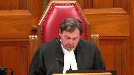
:::

Good morning.

Please be seated.

First of all, in the case of Baron Drette against Grebulnius, number 39533, the Court is ready to release a decision.

A majority of this Court would allow the appeal, set aside decision of the Court of Appeal, restore paragraph 1 to 6 of Justice Sanders' order regarding the primary residence of the children with costs in this Court and the courts below.

Reasons to follow.

Justice Cote, dissenting.

In the case of Tiffany Jo Crickey against Amiru Abdullah M. Alansari, number 39567, the Court is also ready to release a decision.

It reads as follows.

Even if the fresh evidence were admitted, a majority of this Court is of the view that there was no reviewable error made by the trial judge.

Therefore, the appeal is allowed, and the trial judge's orders dated July 4, 2019, and July 17, 2019, are restored with costs throughout.

Justice Cote, dissenting, would have dismissed the appeal on the ground that it is moot, since she would have admitted the fresh evidence, and in light of this, would remand the matter to the Queen's bench.

Thank you.

Now we will proceed in today's case.

In the case of BJT against JD, for the appellant BJT, Ryan Moss, Christina Twede, for the respondent JD, Jonathan Cody QC, Sophie P. MacDonald QC, for the intervener, Director of Child Protection for the province of Prince Edward Island, Mitchell M. O'Shea, for the intervener, LGBT Family Coalition, Laura Cardenas. Mr. Moss.

**Speaker 2** (00:03:05): Thank you.

::: {.column-margin}

:::

Good morning, Chief Justice and Justices of the Supreme Court of Canada.

When the appellant first came into my office in May of 2019 on a legal aid referral, the very first thing she did was take a picture of her grandson out of her purse and placed it on the table in front of me.

And then she told me that this little boy was the only reason she was here and that he needed our help.

Since then, as the record shows, a lot has changed in the child's life and in the appellant's.

But what hasn't changed is the appellant's purpose for being here.

She's still here for this little boy and for no other reason.

Now, it's certainly not lost on the appellant that the purpose of this court is to address issues that have a national importance and that the reason we're before you today is because there is an aspect of this case that the court would like to address for the country.

However, given this court will never have the opportunity, or really I would say the privilege, to meet the appellant and hear from her directly, it seemed important at the outset to reaffirm that despite the decision in this matter, we'll act as a binding authority for matters across the country.

It will have the immediate effect of setting the arc for this particular child's future, a future the trial judge found was best served living here on Prince Edward Island with the appellant.

In making that decision, it's the appellant's position that this court should reaffirm the deferential standard owed by appellate courts across the country when dealing with issues such as these.

And this court must, must correct the dangerous and discriminatory holding that biology knows best.

Given standard of review is where appellate courts start, that's where I'd like to start as well.

And certainly there doesn't appear to be any disagreement on the applicable law, but rather the disagreement lies in how that law should be applied.

And this court in Housen highlighted three primary policy reasons for the need of deference from our appellate courts.

And I do apologize in advance for failing to include that portion of Housen in my condensed book.

But starting at paragraph 16 of Housen, the court identified the desire to limit the number, length, and cost of appeals, the desire to promote the autonomy and integrity of trial proceedings, and a recognition of the expertise of the trial judge and her advantageous position in deciding the matter.

I'd say despite that direction from the court, appellate courts seem to continue to struggle, as they did in this case, with when and how to show deference or when to intervene.

As the majority pointed out in paragraph four of Housen, the theory of appellate deference is fairly widely accepted, but what's lacking is consistency in its application.

And the dilemma to show the dilemma of really how to ensure proper recognition of the trial judge's role while still allowing appellate courts to complete their function was very recently addressed by the Ontario Court of Appeal in the case of NNF 2021 ONCA, and that is at tab two of my condensed book.

It actually happened to be released the day after I filed my written materials.

But I'd like to start halfway through paragraph 38, where Justice Hurrigan writes for the court.

The analysis of those issues involves the application of evidence to a series of factors identified in the legislation.

Absent a legal error or a palpable and overriding error of fact or mixed fact in law, it is not the place of an appellate court to redo a lower court's analysis to achieve a result that it deems to be in the best interest of the child.

Proper adherence to the standard of review helps enforce a discipline in appellate courts that guards against the potential of rendering results-based decisions which do not adhere to the law and create uncertainty for other similarly situated parties.

Appellate danger is particularly pronounced in family cases where there may be sympathetic facts and the appellate court may have a different view of what it believes to be the fairest result.

And continuing at paragraph 41, in summary, the identification and faithful application of the correct standard of review are vital in ensuring that appellate courts do not stray from their proper role and enter the domain of trial judges.

If an appellate court moves beyond its function as an error-correcting institution and engages in the determination of factual issues and issues of mixed fact in law, the justice of the case is imperiled.

Justices, it would be my submission that the risks identified by the Ontario Court of Appeal are exactly the same, I guess, trap to use this court's language from REM, which the majority in our case fell into.

The majority here allowed the appeal after identifying two errors of law in the trial judge's reasons, and that's a paragraph 33 or tab three of the condensed book.

But the errors identified by the majority were that the trial judge erred by ignoring the respondent's primary argument, and secondly by allowing her distaste for the director's behavior to impact her assessment of the best interest of the child.

And on closer examination, and as pointed out in the dissent, classification of either of these errors as errors of law allowing for a complete review of the evidence was not an appropriate application of the standard of review.

And if we were to look at them, each one of those errors specifically, starting with what I've kind of called the error, the director error.

In holding that the trial judge's distaste for the director affected her decision, the majority explicitly acknowledges that the trial judge noted in her decision at paragraphs 90 and 91 that assigning blame is not the court's focus, but rather her focus was on the child's best interest.

It was really only the trial judge's comments regarding the expert witness offered by the respondent that the majority points to as proof the trial judge was let off track, and that's paragraph 61 and 62 of the majority decision.

However, what the majority doesn't do is support their contention that the trial judge's disdain for the director, let her best interest analysis astray with any connection to the final portions of her decision, where the trial judge actually completed her best interest analysis.

Nowhere in the trial judge's best interest analysis did the director's behavior arise, and I believe it was you Justice Martin that pointed out yesterday, appellate courts are meant to start from a presumption that the trial judge knows the law.

Here, I think we have a situation where the trial judge, not only articulated the proper law, but she explicitly stated that she was not committing the error of law that the majority ascribed to her.

So I'm really unsure I guess what more could be expected of a trial judge.

In looking to the dissent, I guess, Chief Justice Jenkins had this to say about the the error of law identified by the majority and a paragraphs 213 and 217, which appear at tab four of my condensed book.

He stated, I think this appellant's assertion calls upon the trial judge to wear blinkers in approaching the best interest of the child analysis, surely a judge can consider the surrounding context.

In this case, the director played a very significant role.

And then continuing at paragraph 217, I'm satisfied the hearing judge was not put off track by her perception of the director's activities and or by her concerns over the quality or credibility of the evidence of the director's witnesses.

In spite of her negative view of the role performed by the director, the hearing judge expressly acknowledged that her role was not to assign blame for the director's past actions, and that her sole focus must be and was the best interest of W. Chief Justices, quite simply, there is no error here.

It's the appellant submission that the trial judge, while acknowledging the director's shortcomings, did not allow them to distract the analysis away from the child's best interest, and that the dissenting reasons support a finding that it's not only safe, but I would say proper to defer to the trial judge's decision.

I would just note that it's certainly possible that the trial judge's purpose in drawing attention to the director's shortcomings was for the sole purpose of seeking to correct such problematic behavior for the future, but that, as she stated, her focus remains solely on this child.

In moving to the second error of law held by the majority, being that the trial judge didn't grapple with the respondent's key legal argument that his biological connection required his claim to be given preference.

This really starts to touch on the other, I guess what I consider the main issue for the hearing, being the biological parent factor as identified by the majority, and whether or not that's even a proper factor to be considered as part of a best interest analysis.

Again, it's the appellant's position that there is no error of law here.

In fact, I would submit that the trial judge did in fact address the biological parent factor as raised by the respondent, and she did it quite simply at paragraph 209 of her decision, which is at tab five of our condensed book, where she states, B may be W's grandmother, but for the purposes of this decision, she is a parent.

And before I get into biology as a whole, I did just want to note, before leaving standard of review, the fact that the majority refers to both these errors as errors of law, I would submit that this is problematic as well, as it's well established in van der Perre that a best interest analysis is by its very nature an issue of mixed fact and law.

However, by attempting to extract legal errors from the extremely complicated constellation of facts that we have here, the majority removed the need for any deference or further inquiry required by Housen and van der Perre.

Extracting errors of law from issues of mixed fact and law is a practice that's been specifically discouraged by this court in both Housen at paragraph 36, which is in the condensed book at tab six, and repeated again, albeit in a, you know, wholly different circumstance in Creston, Molycorp, and Sattva, which is at tab seven of the condensed book.

There's a reason why this court established errors of mixed fact and law as their own category, and the majority's precedent of pulling out a legal error and then completely reconsidering and reweighing the facts is not something that this court can affirm.

I can't say as a whole, this is the exact issue that the Ontario Court of Appeal was speaking about in NNF when they spoke of appellate courts conducting their own factual analysis as imperiling the justice of the case.

And Justice Kerikastanis, I believe it was you who stated yesterday morning during the first matter that the Court of Appeal reweighing factors was an issue, but worse still was when they reweigh factors and get them wrong.

It's the appellant's submission that the dissenting decision of Chief Justice Jenkins is correct here, and that there are no material errors or errors of law in the trial judge's decision warranting appellant intervention.

Quite simply, the trial judge heard the evidence, applied the proper law, and came to a decision that was supported by both the facts and the law.

Now, since the Court had specific questions on standard of review, I'm happy to move into a discussion on biology at this point.

May I ask this—

**Justice Martin** (00:15:37): Excuse me, I guess I just want to know your assessment of what the majority in the Court of Appeal did.

::: {.column-margin}
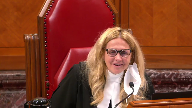
:::

Did they really show a preference for biological parentage?

It's hard sometimes to understand exactly what it is they're saying about that, and I'd just like your comments on whether they did in fact articulate a preference for the biological parentage.

**Speaker 2** (00:16:07): I would say yes, Justice Martin, and I think they tried to kind of skirt around that, but when you look at the decision and almost to me the purpose of their establishment or enshrinement of this biological parent factor, they seem to say at paragraph, I believe it's 112 where they say it's not a Trump card, but then they go on to say that when you have parents that are on roughly equal standing, the biological parent factor is in fact kind of decisive, but if you skip ahead through to the decision when the Court of Appeal, the majority, conducts their own best interest analysis, it doesn't seem as though they accepted all the trial judge's findings of fact, including the respondent's shortcomings when it came to facilitating parenting time with the other members of this child's family.

::: {.column-margin}

:::

So it seemed less like they were using the biological parent factor as a tiebreaker and more so as a counterweight or counterbalance to shift the scales back up.

It struck me as similar to the first matter where there was an admission of new evidence, albeit this, and I believe it was the respondent in that matter that claimed the new evidence shattered one of the pillars that the trial judge sort of hung her hat on in establishing what she found to be the child's best interest.

Here, I think the majority does something similar, but rather than calling it new evidence, they established this biological parent factor and then used that to balance out where the trial judge viewed the respondent as falling short in the analysis.

So I think it, despite the fact they call it a tiebreaker, I think it was really used to kind of course correct and give the respondent that lift up that he needed in the majority's analysis.

**Justice Côté** (00:18:07): So, Mr. Moss, can you tell me where we can find in the trial judge judgment a child-centered analysis?

::: {.column-margin}
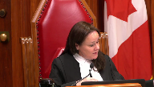
:::

We know that the trial judge focused a lot on the bound between the child and the grandmother.

But can you tell me where we can find in the trial judge decision the same child-centered analysis about the ties between the child and his dad?

Because the dissenting judge says in Paragraph 199, I acknowledge it would have been better if the reasons for judgment responded to the father's main submission.

So even the dissenting judge seems to say that the reasons do not respond.

It would have been better, but it seems to acknowledge that the reasons do not respond to the father's main submission.

And the father's main submission was precisely the bound or the ties he had developed with his child.

So where can I find in the trial judgment that analysis, a part of the fact of acknowledging that, of course, the dad was the dad of the child?

**Speaker 2** (00:19:20): Thank you, Justice Cote.

::: {.column-margin}

:::

I think in getting into that discussion, we've got to be really careful.

And I guess I kind of started out by saying I think the respondent has reframed what his argument was at this level compared to what it was below.

If we're looking at just a bond, I think you'll find just the bond analysis is throughout the trial judge's decision.

And in kind of going over all the, even just the statutory factors that you see in our Child Protection Act, I think all those factors really get to the essence of what actually is a bond here.

Just going down the list, and I do apologize again that that statutory factor list isn't in my condensed book, but it's certainly in the trial judge's decision.

But if you look at, I guess, the act is looking to get to exactly that.

What is the bond here?

And it looks to the capacity of a parent to discharge their obligations, the physical, mental, and emotional needs of the child, a secure place for the child to develop as a positive relationship as a member of a family, the love, affection, and ties between the child.

So I think in completing her analysis, the trial judge certainly gave the respondent credit for and acknowledged.

I mean, let's not forget at the time of trial, the respondent had known the child for a grand total of six months-ish and not attributing any blame for that, but that was just a fact.

So the fact that he was kind of present and able to make his submissions and he was heard, there was no denying there was a bond between the child.

And I think that's where the trial judge's main struggle in this matter came from because he do have a child who's got connections to both his parents that were present at the hearing, as well as a bond and a connection to his mother as well and the other members of his family.

I think what the dissenting judge is getting at is there's nothing in the trial decision that explicitly states, respondent, I've heard you on the point that biology matters, but I don't think that's relevant for A, B, and C points.

I guess as I said a bit earlier, I point to paragraph 209 of the trial judge's decision where she quite simply just acknowledges we've got two parents here and I think that's the main issue with that.

**Justice Brown** (00:21:58): But that's the issue the Court of Appeals seemed to miss, it seemed to me, is that the grandmother is by definition a parent and the grandmother is also a blood relative

::: {.column-margin}

:::

and I guess in that statutory sense a blood, a natural parent.

And so I'm kind of with Justice Martin, I'm wondering if it's a bit of a distraction here.

Well I don't want to put words in her mouth, she didn't say that, but I might go a little further and say it's a bit of a red herring.

The issue here is surely whether the Court of Appeal identified a reviewable error and if they did then we're done and if they didn't then we're also done but just with a different result.

**Speaker 2** (00:22:57): And I guess Justice Brannon, I'd certainly pick up on that point that I think the biological parent factor is identified by the majority is problematic, but I think it's even more problematic when you take into consideration that the appellant in this case was a statutory parent, and she was a statutory parent as held by the very same court of appeal just a few months earlier, because that decision was appealed by the Director of Child Protection and affirmed by a unanimous court that she met the definition of parent.

::: {.column-margin}

:::

And I'd say, despite that preliminary acknowledgement, which you see in paragraph nine of the majority's reasons, the majority doesn't make any reference at all to this parental status throughout the majority or the remainder of their decision, including the lengthy discussion of how and why natural parents should be preferred over others.

And it struck me again when I was preparing for today that throughout the majority's reasons, they even refer to the respondent as the father throughout, and the appellant is referred to as the grandmother, despite the fact both parties are parents.

And in digging deeper into that parental definition, I was trying to find sort of a reason or a place for this biological parent factor, and it struck me that the biological parent factor almost exists properly in the parental definition section of the act.

I think as in this case, we've got a father who, but for, I mean, he had a six-year-old child that he had absolutely no bond or no relationship with, and by virtue of his biology, he is, and I think quite properly given the right to assert that I should be a part of this child's life, and I have something positive to add.

I think biology absolutely fits well there because if you look at the other aspects of how the act defines a parent, they all require significant or pre-existing relationships and bonds with the child.

It's only biology that kind of gets your foot in the door, but then I think when you flip over to a best interest analysis, I mean, it's child protection legislation that we're dealing with here, the very purpose of which is to authorize the state to remove children from, I'd say, predominantly their biological parents when it's not in their best interest, and the fact that we have statutory factors here, I think, are evidence that it takes more than biology to make a good parent, because if it did, I don't think we would have this legislation, and in reviewing my friend's materials, actually, and going back in time a bit to Racine and Woods, which is at tab three of my friend's condensed book, about halfway through the quote that is provided there, actually, immediately after the section that my friend has highlighted at the top, the court states, but it's the parental tie is a meaningful and positive force in the life of a child and not in the life of a parent that the court has to be concerned about.

As has been emphasized many times in custody cases, a child is not chattel in which its parents have a proprietary interest, it's a human being to whom they owe serious obligations.

In giving the court power to dispense with the consent of the parent of a de facto adoption, the legislature has recognized an aspect of the human condition that our own self-interest sometimes cloud our perception of what is best for those for whom we are responsible.

It takes a very high degree of selflessness and maturity for most of us, probably an unattainable degree for a parent to acknowledge that it might be better for his or her child to be brought up by someone else.

The legislature in its wisdom has protected the child against this human frailty in a case where others have stepped into the breach and provided a happy and secure home for the child.

Now, again, slightly different circumstance, but I think this court was well ahead of its time when it wrote that, and I think our present understanding of what can and should go into a best interest analysis is codified to some degree in the Child Protection Act, and it doesn't leave any room to use biology as a tiebreaker and quite the opposite.

**Justice Côté** (00:27:46): In a question, in your response to my question before you refer to the fact that at the time of the trial, the trial had known, is that just for a few months.

::: {.column-margin}
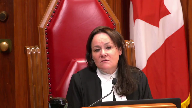
:::

So don't assume anything, but I'm just asking you a question.

Given the passage of time now, what do you think should, how this court should consider the situation, because to decide on the appeal, it's one thing, but in terms of remedies, given the fact that now, if we figure out the time that the child spent with his dad, it's not equivalent to the time the grandmother spent with the child, but it is close to.

So what should be the right remedy in the best interest of the child?

**Speaker 2** (00:28:40): And that's kind of bothered me some too, and I certainly see it in the respondent's submissions.

::: {.column-margin}

:::

I think firstly, I point you to the fact that we're kind of here on a narrow issue because the Court of Appeal, I think, wrongfully intervened and did what they did.

That's why kind of this status quo has kind of carried on.

And I don't think that's really relevant to this Court.

And if anything, given the findings of fact by the trial judge that, A, she held that there wasn't going to be any harm or risk of harm to the child moving.

I think if this Court was to decide the appeal but struggle with that remedy, I think you might be falling into the same error issue that the Court of Appeal had in sort of reassessing and reweighing those factors a little bit, because the facts are clear.

And if anything, at the time the trial judge's decision was rendered around June of last year, it had been almost an entire year since the child had been on Prince Edward Island.

Now I appreciate, I'm kind of, if we're talking about sort of present day, I appreciate there's no evidence before the Court, but you can see justice.

The majority's decision did require that the child was to come to Prince Edward Island this summer.

So it's actually been less time since the child has been on the island.

And I think you couple that with the trial judge's findings that there was no risk of harm.

I think this Court can feel safe and assured that the child's best interests are still served by fulfilling the trial judge's order, despite the fact we're now kind of a year down the road.

**Overlapping speakers** (00:30:42): Thank you very much.

**Justice Kasirer** (00:30:46): Thanks, Justice Côté.

::: {.column-margin}
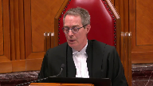
:::

Mr. Moss, I was going to ask you about King against Low, and Justice McIntyre's phrase that parental claims not be lightly set aside.

Now, of course, he acknowledges immediately that they can be set aside when the welfare of a child requires it, so in a sense it doesn't deflect from your argument.

But I'm wondering to what extent is that recognition not lightly set aside, something that might help us explain what separated the majority and the minority in this case, whether there is actually, maybe it's an imperfect connection between legal parentage and natural parentage.

In the old common law you could see it, even if it was imperfect.

The presumption of paternity obviously is not a biological test.

In modern law it's less plain with same-sex parentage and adoption, of course.

But what are we to make of that not be lightly set aside?

Does that have any bearing in the modern law?

**Speaker 2** (00:32:07): I guess I'd say a few things to that, Justice Kassir, first of which being like, please don't forget that we have two parents here, I guess, so I think that drawing this bright line distinction that the respondent falls into one and that the appellant, who is a biological blood relative, as pointed out by Justice Brown, like what we're talking about here is I guess if you get down to the science, there's a 25 percent difference in the amount of DNA shared between the two of them.

::: {.column-margin}

:::

But getting directly to that point, I think it almost struck me I guess as ironic, I would say, that King and Lowe has been used to support the implementation of a biological parent factor into the common law when I think this Court, again, I'd say was well ahead of its time in explicitly rejecting that position and highlighting the need for courts to adapt to their changing societal conditions and attitudes and establish, at that point, what they called the welfare of the child.

Now we have certainly the best interest is the vernacular, but King and Lowe, that's what that case stood for, was to establish that even though we have kind of natural parent connections, I think the Court was struggling with how does that look in modern society.

And in that case, they didn't return the child to, I can't remember if it was his or her natural parent.

I'd say since King and Lowe, we've continued to advance in our law and understanding on how to best action this idea that children's interests come first.

And in looking to the guidance from Article 3 of the UN Convention on the Rights of the Child and the corresponding general comment there, best interest has been defined as a threefold concept of a substantive right, a fundamental interpretive legal principle, and a rule of procedure.

And in assessing and determining the best interest of the child, the general comment directs that the very first step to be taken is to identify relevant elements to be considered in the assessment and give them concrete content.

And I think the question before you is whether biology of a child's parent should be one of those elements.

And I would certainly submit that the majority erred when they identified the biological parent factor as a matter of common law and common sense, as they put it.

And rather, I would say the biological parent factor is more appropriately defined in the dissenting words of Chief Justice Jenkins as a mistaken worldview, I believe he called it.

**Justice Kasirer** (00:34:57): In respect, imagine there was a dispute between not a natural parent, but a legal parent, and a third party.

::: {.column-margin}
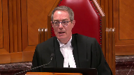
:::

Is that logic of King and Lowe of any use, that it should not be lightly set aside, the parental claims?

Because it's easy enough to say that it should be the best interest of the child, but when you start not lightly set aside, is he suggesting that it remains a factor, it remains an element of the analysis, at least as between a legal parent and a third party?

**Speaker 2** (00:35:44): And I guess it's kind of hit me hard.

::: {.column-margin}

:::

I'm a biological father to four children.

And in taking the position that I have, there's kind of that little bit of you that feels or wonders whether or not I'm giving up or advocating for some ability to lessen kind of my writer ability to care for my own children.

But I think if you really pare it down, I think when the majority refers to it as kind of common law and common sense, I think there's a bit of a conflation of the idea of what being a biological parent is.

And I think all the important pieces to a best interest analysis, they're all captured in the statutory factors here.

What kind of, I don't know, for lack of a better word, maybe the secret sauce to being a parent who serves your children's best interest.

You're looking to things like the safety of your child and your capacity to parent and the love and affection that you develop.

So I think I guess it does feel like a bit of a red herring to attribute biology to any of those factors, because I just don't I just don't think it's there.

And that's when I say I think biology's proper role is maybe a bit more of the gatekeeper role, like who do we consider as parents?

But not so much is this one, once you're in the door, it's not biology that makes you capable of kind of meeting any of any of the actual factors, like the substance of what a court is looking for in determining who's going to serve this child's needs best.

I think while I'm still on the statutory factors, I guess it's sub f, section two sub two sub f of the act.

One of the factors is a secure place for the child and the development of a positive relationship as a member of a family.

And that that a kind of jumped out at me as well to say it's not that it's not there's a need to to force the child into into a familial relation.

What the what the act is looking for is again in keeping the child's interests central.

It's a family would wherever that child's able to kind of get the best love and and the best care.

It's it's got nothing to do with biology.

**Justice Brown** (00:38:39): I mean, isn't it this simple?

::: {.column-margin}

:::

Grandmother was recognized as a parent under the statute.

There have been lots of cases where adoptive parents and non-natural parents went out over biological parents.

The determining consideration is always the best interest of the child, full stop.

I really do think this biological point is a bit of a red herring.

Can't speak for all my colleagues, but I've sure heard enough of it, so.

**Justice Martin** (00:39:17): Excuse me, may I just kind of follow up and ask a question about it seems to me that in many of the cases where there's dicta that are setting up preferences for biological parents, they arise in a child welfare context and this has been described as a custody dispute in disguise, sort of in child protection or the other way around.

::: {.column-margin}
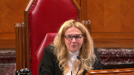
:::

Is it a proper distinction to say that when the state is acting against parents however defined there were certain comments about the role of biological parenting and that that may not play out the same way when the context is purely one of best interests of the child on on custody related matters.

**Speaker 2** (00:40:09): I certainly agree, Justice Martin and Justice Brown, I'd agree as well that it is a bit of a red herring to say all this focus on biology, because I think in all those other child protection matters, if you're comparing the state to a parent, certainly they're very different considerations than comparing one parent to another.

::: {.column-margin}

:::

That's not to say I think we're still safe.

I mean, even the majority points out that they would have viewed a kind of separate custody action under, I guess, what was then our Custody, Jurisdiction and Enforcement Act.

It's since been updated.

They viewed that as kind of a failure on the parties for not kind of instituting that, but I think regardless of which legislation you're under, the test is and always will be, I think, best interest of the child.

So the statutory factors in, I mean, they're not exclusive, but as enumerated, they're not too dissimilar to, I think, an analysis that would have been completed in kind of a stereotypical custody matter.

But I think that is a good point, Justice Martin, that a lot of the cases rising out of child protection circumstances, that's where I think the dicta of parent versus state becomes more important.

But I would say too, in any case that's been raised by the respondent, certainly if it touches on, we want to prioritize parents versus others, there's almost always kind of a follow-up that brings it back.

Even if you go back as far back as King and Lowell or Racine and Woods, there's comments that say, yep, no, we're like, natural parentages may be important, but what's really important is this child's best interest.

I did just want to address, I guess my friends made a comment in their factum at paragraph 58.

It did seem to attempt to shift the focus from the majority's, I'd say the problematic, one of the problematic portions of the majority's decision, and suggest that the appellant's parental designation is for the purpose of the statute, I believe were the words they used, and not for all purposes.

And I guess I'm unsure what other purposes they would be referring to as the act.

There's no kind of differentiation between different classes of parent.

The fact that child protection legislation, really nationwide, has defined parent far more expansively than those who contribute biological material, I'd say shows a societal shift and acceptance that the heteronormative definition of parent isn't acceptable anymore.

And if anything, the parental definition section, as I said, is what I view as kind of the proper place for a biological distinction.

So justices, I guess I would say in closing, we're still dealing with the same issue that this court faced when it decided housing.

The theory of appellate deference, that's easy to accept, but consistency in its application, that's still a work in progress.

**Overlapping speakers** (00:44:28): Thank you for watching.

**Speaker 2** (00:44:28): and I do think there's further guidance needed from this court and from the decisions rendered this morning it sounds it sounds like that that guidance is coming.

::: {.column-margin}

:::

In this case it's submitted that the dissenting opinion of Chief Justice Jenkins it's correct nothing about this trial decision justified appellate intervention the trial judge she knew the test to be applied she heard and understood all the evidence and she came to

and I'd say articulated a proper conclusion unlike unlike the second matter heard yesterday we're we're certainly not suffering from a lack of reasons I would say the trial judge completed a very thorough I would say decision and the errors identified by the majority when you look at them closer they're not errors at all and certainly not errors necessitating a wholesale reassessment of the child's best interest by this court and in reviewing the majority's decision as well like they they have the errors of law that they identified but it seemed to like they didn't kind of stop there with their identification of of errors and I I look to paragraph 121 of the majority decision where they specifically say they've accepted that there was no evidence that a further move would affect the child

but then they state immediately after that that there there's no need to flirt with danger I guess

and I think it just kind of goes to the entire theme of the majority's decision where there is and it came up yesterday quite a bit a lot of reweighing going on

and I'd say I guess Justice Brown as you raised this matter I think could be fully decided on the basis of standard of review

but it is our submission that there there is a need to correct the majority's establishment of the biological parent factor as evidenced by the nationwide statutory definitions of parent that includes far more than one biological mother and one biological father it's clear we live in a society that values the child's emotional and psychological connection to their parent far more than their biological and a failure to correct this would not only I'd say shift the best interest analysis away from the child but as pointed out by the intervener the LGBT family coalition it it would and could discriminate against a large cross-section of parents that have historically faced significant discrimination in the past so we would submit that this appeal should be allowed and the trial judge the trial judge's decision should be reinstated and barring any questions those would be my submissions

**Speaker 1** (00:47:20): Thank you, Mr. Maas.

::: {.column-margin}

:::

The Court will take its morning break.

**Speaker 1** (00:48:26): Thank you.

Be seated. Mr. Cody.

**Speaker 3** (00:48:35): Good morning Chief Justices and Justices.

::: {.column-margin}

:::

Thank you for the opportunity to address the court this morning.

At its core, the position of the respondent is this, it is in the best interest of this child to remain in the care of his father.

This morning, I hope to speak about, well, that's

**Justice Brown** (00:48:57): That's not the issue before us.

The issue is whether the Court of Appeal identified reviewable error.

We're not doing a best interest analysis here.

**Speaker 3** (00:49:08): No, I agree with you, Justice Brown, and that's what I hope to talk about this morning, is to focus on whether reviewable errors were present and to provide this Court with the support for those errors.

::: {.column-margin}

:::

And the second thing I'd hope to talk about this morning is the relationship between a child and a natural parent and how it fits within the best interests of the child framework.

So to start with the basis for intervention, it's well settled that an Appeal Court can intervene in a protection proceeding when a reversible error is present.

And in this case, the majority found two distinct errors.

One was the failure to consider a relevant factor.

And the majority said that this was the relationship between the child and his natural parent, the respondent.

And the second legal error characterized by the majority was the consideration of the conduct of the director, which the majority viewed as being not relevant to the best interests of the child.

The appellant contends that the majority was sidestepping the requirement for deference.

In our submission, there was no sidestepping.

There were two errors present.

And the first one I would like to speak about is the failure to consider a relevant factor, that is, the relationship between the child and the respondent.

There was an existing bond between the child and a natural parent at the time of trial.

And this was the essence of the majority's reasons when they made the conclusion at paragraph 33 of their reasons that an error in law was made.

And again, they reiterate that finding, again in their reasons, at paragraph 79.

And to justify that finding, I would draw the court's attention to, firstly, the decision in Gordon, which is in the condensation of the court's findings.

I would draw the court's attention to, firstly, the decision in Gordon, which is in the condensed book, at tab number 19.

At tab number 19, paragraph 52 of Gordon, there's a discussion about factors that were not mentioned in the analysis of the trial judge.

In a paragraph 52, the court says, no reference was made to the circumstances prevailing after the trial, the current needs and desires of the child, or the respective abilities of each parent to meet them.

One may speculate that the trial judge, having heard full argument, had such factors in his mind when he made his decision in favor of the mother.

But one may equally infer that the necessary fresh inquiry was not undertaken.

In either event, it seems clear that the trial judge failed to give sufficient weight to all relevant considerations, and it is therefore appropriate for this court to review the decision and should it find the conclusion unsupported on the evidence to vary the order accordingly.

Now the first question, I think, has to be whether this is a relevant factor to begin with, and in our submission, it's relevant for a number of reasons.

And the first is that this court in a number of custody cases generally has said that the relationship between a child and a natural parent is relevant to the best interest inquiry, and the court has also said that the relationship is entitled to serious consideration.

**Justice Kasirer** (00:53:23): Mr. Cody, shouldn't you be starting with the definition of a parent under the statute?

**Speaker 3** (00:53:32): I can start there Justice Kazir.

::: {.column-margin}

:::

There's no question that both parties meet the statutory definition of parent and that the factor that the majority identified was the failure of the trial judge to give consideration to the relationship that the child had with a natural parent, the respondent, and the cases such as Racine and King and Lowe say that it's deserving of consideration which to me suggests that it's at very least relevant.

Now the weight to be assigned to that is a different matter

but I think its relevance is present in those cases.

**Justice Kasirer** (00:54:11): under the statute, this idea of natural parent or biological parent that you speak to, is it the designated criterion for proceeding with the analysis?

::: {.column-margin}
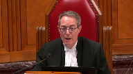
:::

I mean, you're moving us off of the statute onto sources of law that use parent sometime in a different sense.

I'm wondering why you're doing that.

Why shouldn't we best work within the statute and find out if best interest was properly measured on the statutory understanding of what a parent is, rather than doing a kind of a doctoral thesis on what parentage is in the law?

**Speaker 3** (00:55:01): That's a fair point Justice Kazir.

::: {.column-margin}

:::

What I was trying to focus on is that the definition of parent is not in dispute.

It was found that both parties were parents.

My point in placing emphasis on this factor is that in my submission there's nothing in this statute when it describes and defines the best interest of the child that displaces this factor.

That there has to be consideration given to the relationship and I rely on section 2 sub 2 of the Child Protection Act which has that open-ended definition of best interest which in my submission includes these cases that refer to the relationship between the child and the natural parent.

Now the weight given to that factor in my submission is variable and it's variable and driven by the content of the record.

The reason why I drew the court's attention to Gordon is because the failure to mention those considerations led the court to conclude that an error had been made and that the court was warranted in intervening and in my submission that's exactly what the majority did here.

**Justice Jamal** (00:56:14): Don't you need to establish that even if you're accepting you're correct that the factor of, the respondent being the biological father would have overwhelmed the analysis in paragraphs 199 to 215.

::: {.column-margin}
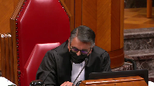
:::

The key consideration here was the who is going to maintain family links.

And you're saying that the addition of this factor you say that was ignored would have overwhelmed that factor and led to a different result.

So isn't that really what you have to establish as well?

No, it's not.

**Speaker 3** (00:56:44): Well I think Justice Jamal there was an additional consideration by the trial judge but in our submission there was no meaningful consideration given to this existing relationship between the child and his father.

::: {.column-margin}

:::

In my submission and the paragraphs you've identified are the the core of the analysis by the trial judge and in those 16 paragraphs in my submission the trial judge says at the very outset she is reviewing each of the prescribed factors and in my submission that was not enough.

The case law also established an additional relevant factor and that is the existing relationship between the child and the natural parent and when we review that core analysis from the trial judge at paragraphs 198 through to 215 and for convenience it's reproduced in the condensed book at tab number one.

It's on the third page.

At the top of the page it's it's page five of the condensed book and and these are the paragraphs that Justice Jamal has rightly pointed out as the core of the analysis of the trial judge.

I would place emphasis on the very first paragraph.

The trial judge acknowledges that it's not an exhaustive list that's true but the second sentence in paragraph 198 reveals I will speak to each interest as set out in section two.

The trial judge did not go on to consider anything outside of the prescribed factors and when one reviews the paragraphs that follow from the trial judge what we see is that the trial judge is undertaking an analysis of the ability or the capacity of these parents as opposed to a child-centered and focused inquiry about what was best for this child and my support for that submission is for example in paragraph 200 the trial judge in the second line speaks about the ability of the parties to care.

In paragraph 202 the trial judge talks about the ability of the parties to address needs.

Paragraph 203 in the very first line the trial judge refers to the capacity of the parents and this continues through the analysis of the trial judge including and I draw the court's attention to paragraphs 206 and 207 which are distinct inquiries.

Paragraph 206 is supposed to be an inquiry into the relationship between the child and persons that have custody.

The trial judge focused exclusively on the family in Prince Edward Island and in paragraph 207 it's a distinct inquiry to the relationship with other persons but again the trial judge just says simply well my comments above apply to this interest but they're two different considerations and in either paragraph we see no mention of the existing relationship with the respondent the natural parent and in my submission this analysis from 198 to 215 is a statutory measurement of the two parents as defined in the statute.

It is not a holistic and child-centered inquiry as to what was best for this child.

**Justice Brown** (01:00:49): the trial judge did in paragraphs 214 and 215 was consider, respectively, the fathers and the grandmothers' likelihood of allowing a relationship to flourish with the other and the child.

::: {.column-margin}
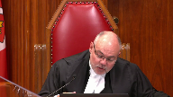
:::

Does that not, maybe not sufficiently to your degree, but does that not at least implicitly recognize that this child did have a meaningful relationship with the father in that it was one that was worthy of promoting and supporting and nurturing?

**Speaker 3** (01:01:38): Justice Brown, so thank you for your question.

::: {.column-margin}

:::

It is clear at the end of the analysis the trial judge goes on to consider which parent, and I place emphasis there, will facilitate contact with the other.

But as the court will know from the record, the respondent agreed to facilitate and encourage that relationship and to comply with any court order.

So when I read those paragraphs, Justice Brown, I don't see that as giving meaningful or serious consideration to the relationship between the child and the natural father.

The fact that the relationship existed, I think, is throughout the reasons, but the significance of that attachment and the consequence of her order in my submission is missing from these paragraphs.

We have a lengthy judgment from the trial judge, 226 paragraphs, I think.

But the analysis of best interest is confined only to prescribed factors.

She says expressly that she's only considering each of the prescribed factors, and she does that in the course of about 16 paragraphs.

And when one looks at that analysis, I think it's deficient in a number of respects.

One, it doesn't take account of what trial counsel put in front of the trial judge, and that is this court, through a number of decisions, has at least said that the relationship with the natural parent is relevant.

And a number of appellate courts in this country have said the same thing.

But what we don't see in this judgment at any point is any reference to or citation to Racine or King and Lowe or any of those appellate judgments.

**Justice Martin** (01:03:36): But can I stop you there?

::: {.column-margin}
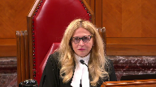
:::

I mean, it would, on one reading of this record, Mr. Cody, there's been a shift in the emphasis of the argument that you've been putting forward in the sense that both the majority and the dissent note that the failure to consider the biological natural parent principle was the main ground of appeal.

The focus there, if I can put this idea, was more on the biology point.

You are now coming before the court here focusing on bond and relationship.

That's a bit different.

And then you, I think, say and admit or submit that the parties here agree that there's no presumption in favour of natural or biological parents.

And it just seems to me that some of the confusion can be because there were different arguments that were being raised at different times.

And so I'd like you to address the apparent inconsistency about what was pled before the Court of Appeal, what is acknowledged now, and bond replacing biology.

**Speaker 3** (01:04:59): Thank you Justice Martin for your question.

::: {.column-margin}

:::

It may be helpful to capture the argument that was placed before the Court of Appeal because it's summarized by the Court of Appeal in its reasons and it's a paragraph 30 of the Court of Appeal judgment and in paragraph 30 the Court of Appeal sets out what the grounds of appeal were before that court

and I just draw the court's attention to grounds two and three.

Grounds two and three in paragraph 30 of the Court of Appeal judgment and Justice Martin that was really the essence of the submission on appeal.

I wasn't counsel there

but I went back and read the factum on appeal and it was a failure to consider that relationship with the natural parent that was the asserted legal error and the second submission which the court really treated as one was an error in principle in that no serious or meaningful consideration was given to that parental claim of the respondent.

**Justice Martin** (01:06:16): But Chief Justice Jenkins indicates that the main ground of appeal at his paragraph 179 and 80 was that the court failed to consider that J is W's natural parent.

::: {.column-margin}
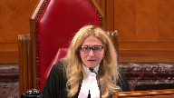
:::

So it just seems to me that if we're talking about relationship with a natural parent, that is at a level of abstraction that both takes into account biology and bond.

And it was approached differently.

Relationship with natural parent is a very, it's a much wider term.

But it's not the wider term that was before the Court of Appeal.

And then when I understand, or do I understand you correctly to say that there is no biological preference.

So that any argument based on biology is now not being relied upon in front of the Supreme Court.

**Speaker 3** (01:07:16): Well, I think, Justice Martin, what we're reacting to at this court was a suggestion by the appellant that the Court of Appeal had introduced a presumption in favor of a natural parent or a biological parent.

::: {.column-margin}

:::

And the submissions before this court were meant to emphasize that that is not the conclusion of the Court of Appeal.

When their reasons are read as a whole, they say the opposite.

And what we were trying to do was suggest that we're trying to explain to this court and to assist, how does this relationship work as part of the best interest of the child framework?

That's really what we're trying to assist with.

And in our submission, the work that gets done by that factor is the bond, the evidence of the bond that's in the record.

And in some cases, it can be significant and weighty or even decisive.

But in other cases, it could have no weight or not be present at all.

So the reference to the bond, I don't want to get lost sort of in the semantics, was really intended to try to assist this court in trying to figure out how this factor would work in practice and what would drive it from being a significant consideration in one case to being an insignificant or a less weighty factor in another case.

So that's really, I think, Justice Martin, what we were trying to do.

And if that wasn't articulated clearly, that's my fault.

But it's really, that was the essence of what we were trying to assist the court with was to move away from a presumption and really say the work, so the variability is driven by the bond, which we see as the evidence that's contained in the record.

And I hope that's helpful to you, Justice Martin.

Just on this related point, and it was a point that Justice Martin had raised earlier yesterday, this general principle that trial judges are presumed to know the law.

And although both the majority and the dissent say this factor does not appear to have been discussed, the material or the main submission, in fact, the only submission by trial counsel and was not addressed in the reasons, Justice Martin brought up the point yesterday, well, trial judges are presumed to know the law.

And that's, I agree with that principle.

But on this record, and in this decision from this trial judge, my suggestion is that has been rebutted.

And it's rebutted in my submission for a number of reasons.

As I mentioned earlier, there's no citation of any of the cases dealing with this relationship or factor.

So that's missing the citation.

But secondly, there's also no discussion of the legal principles from those cases.

So one doesn't look just merely at citations to see whether a trial judge has considered something, they can articulate it in their reasons.

Justice Kazir gave the example yesterday about the Moge decision, you know, although not cited, the principle seemed to be present in the reasons.

So that's the second thing that was missing here.

The third thing is that we have a very abrupt statutory analysis between paragraphs 198 and 215 against a very rich record of bonding between the respondent and the child.

That's a third consideration that would suggest that this presumption of the trial judge following the law has been rebutted.

And then the last one, of course, is the submissions from counsel.

And not one of those factors is going to be determinative.

You know, missing the citation is not going to say a trial judge didn't follow the law.

But when we put those four factors together in this case, and we looked against that very strict statutory measurement of the trial judge between paragraphs 198 and 215, in my submission, the trial judge missed this relevant factor.

Whether there was an implicit reference or an oblique reference, I don't see those present in the reasons.

I don't see any analysis explaining or giving serious consideration to this relationship with a natural parent.

The trial judge in my submission performed a strict statutory checklist and did nothing more, notwithstanding the case law and the jurisprudence that at least suggested that it was a relevant consideration that deserved serious consideration.

I don't see that serious consideration over the course of those 16 paragraphs.

I see those as very much a measurement of the two parents.

And as we know from Hickey, and we see and reiterated in Van de Peer, if there's an error of law, there's a basis for intervention by an appeal court.

Now, there was also a second error identified, and that was the that was the consideration of an irrelevant factor.

So this was the discussion around the conduct of the director.

And my friend today has drawn the court's attention to the paragraph where the trial judge says, my sole focus is the best interest of the child.

The challenge with that submission, and the majority points this out, is that the trial judge didn't stop there.

So the trial judge, a paragraph 91 says, assigning blame for what has taken place in the past, however, is not the role of this court.

Despite the actions of the director's workers, my sole focus must be the best interests of the child.

And that's an appropriate and correct statement.

But unfortunately, the trial judge doesn't stop there.

The trial judge goes on and considers the actions of the director, and the child's attention to the trial judge considers the actions of the director when she's considering the evidence of best interests.

And if I could ask the court just to turn to the condensed book at tab number one, and this is the trial judgment.

On page three of the condensed book, my hope is that you'll see my reference to paragraph 91.

So the trial judge gives herself a direction that the conduct of the director is not relevant to her inquiry.

And that's appropriate at paragraph 91.

But my concern is this.

If we turn to the next page in the condensed book, page four, and this is the consideration of the evidence of best interest, paragraph 109 and 110, the trial judge goes back to the conduct of the director in order to consider the evidence of best interests.

At paragraph 109, the trial judge speaks of a recommendation that was made by the expert psychologist and makes the comment that the director, quote, jumped on board the train, close quote.

So the evidence of best interests is somehow now tied up with the conduct of the director.

**Justice Martin** (01:15:27): I want to ask you this question.

::: {.column-margin}
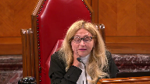
:::

Clearly, if the best interest standard is being met with evidence from somebody like Dr. Petrie, surely it's relevant that Dr. Petrie was hired by the director after Dr. Petrie had already been hired by the father.

That goes to the weight of the evidence that may be ascribed to a person who is in that situation, having first been hired by the father and then being dealt with by the director.

It would seem to me that if the trial judge didn't notice and take into account the conduct of the director or how Dr. Petrie came to be before the court as a supposed witness about the best interest of the child, how can we say that this is problematic?

Isn't this exactly what we expect when the trial judge is weighing best interest?

**Speaker 3** (01:16:32): So, Justice Martin, my comment just on that point is that there's no evidence and there's certainly no discussion by the trial judge around the timing of the retainer or any concerns expressed about the timing of the retainer.

::: {.column-margin}
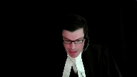
:::

So that's not the reason why the trial judge dealt with the evidence the way she did.

If on a different record that evidence was present, I would agree with you, you might be able to assign different weight to the expert.

But on this record, the reason why the evidence of best interest was minimized was because the director agreed with the recommendation of Dr. Petrie.

And in paragraph 110, we have the trial judge confirming in her own reasons that this affected her ultimate decision.

The ultimate decision in this case is the best interest of this child.

And this is not a proper foundation for the trial judge to touch on the ultimate conclusion that deals with the child.

And paragraph 110 is the exact opposite of what the trial judge said she had to do in paragraph 91.

So when we come to the evidence of the best interest of this child and the respondent, the trial judge minimizes that evidence and she does it on the basis of this relationship with the director.

**Justice Martin** (01:18:12): But at 109, there is a finding from the trial judge that this witness shows a bias and moved from being objective and nonpartisan to being an advocate.

::: {.column-margin}

:::

And she decided what was in the child's best interest and the director jumped on board the train.

Isn't that just her, the trial judge's assessment of how to approach evidence that was in fact before the trial judge?

**Speaker 3** (01:18:43): Well, Justice Martin, that's one reading of it, but if the Director's conduct and the conduct of her workers is not relevant, then it doesn't bear on how the trial judge treats the evidence related to best interests.

::: {.column-margin}

:::

Either the conduct of the Director is relevant or it's not relevant.

So if it's not relevant, well, what they had is the trial judge's duty to judge the evidence related to best interests of the Director and the Director's duty to judge the evidence related to best interests of the Director and the Director's duty to judge the evidence related to best interests of the Director and the Director's duty to judge the evidence related to best interests of the Director and the Director's duty to judge the evidence related to best interests of the Director and the Director's duty to judge the evidence related to best interests of the Director and the Director.

**Justice Brown** (01:19:07): The trial judge has to decide what weight to ascribe to the evidence of a witness.

::: {.column-margin}

:::

Why is it not relevant to that assessment of weight that the trial judge believes this witness to be biased?

**Speaker 3** (01:19:33): Justice Brown, my point is that you can, as a trial judge, weigh the evidence of the expert and, based on a variety of considerations, make a finding of bias.

::: {.column-margin}

:::

But there has to be a justification for that finding.

The justification in this case is the conduct of the director, and the conduct of the director is not relevant to the inquiry that she's undertaking.

If this was a separate justification, where, for example, she also goes on the trial judge to say her involvement with Jeremy and his family may have clouded her view that any other parenting arrangement for the child would have been equally beneficial.

But as the majority points out, this expert actually provided no evidence and no recommendation on that point.

So the trial judge used something that was not present in the record to minimize the evidence of the expert.

So, yes, different weight can be assigned to the evidence of an expert, but one surely cannot use the absence of evidence in the record to discount the evidence from the expert on best interests.

And it does touch on her ultimate conclusion.

In our submission, the conduct of the director, and you see this theme through the trial judge's reasons, she was not pleased with the conduct of the director.

And in our submission, it overwhelmed her assessment of the evidence of best interests.

And it did that in two ways.

**Justice Brown** (01:21:08): Court of Appeal says that.

::: {.column-margin}
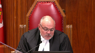
:::

The Court of Appeal does.

The Court of Appeal is clearly concerned with the trial judge not having hit or displeasure about the way the director handled the case, but not even the Court of Appeal says that completely overwhelmed the analysis.

**Speaker 3** (01:21:28): No, I agree with you, Justice Brown, that's my submission, but the the Court of Appeal does say that, that she allowed, the trial judge allowed her distaste for the conduct of the director to influence her treatment of the evidence of best interest.

And the example they give is the treatment of the expert.

**Justice Karakatsanis** (01:21:45): But you're not suggesting for a moment that the trial judge doesn't have the right to comment on the conduct of the director.

**Speaker 3** (01:21:57): No, Justice Karen Katsanis, I'm not saying that, that they can't comment on the conduct of the Director and maybe for future cases or other purposes, but it is not relevant to what's best for this child.

::: {.column-margin}

:::

So, to give the example used by the majority, the conduct of the Director in not giving notice to the father, not relevant from the perspective of the child.

Moving the child from Prince Edward Island to Alberta, again, not relevant from the perspective of the child.

What is being undertaken here, sure, the trial judge can comment on the Director and express some concerns about the conduct of the Director, but the focus of the inquiry and the treatment of the evidence has to be animated by what is the best arrangement for this child.

**Justice Brown** (01:22:49): Well, I'm sorry, I think you're gliding over a distinction.

::: {.column-margin}
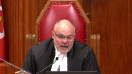
:::

I'll just make this point

and then I'll leave you alone.

But you're gliding over a distinction between making a decision in the best interest of the child and how you treat the evidence that is being reduced by the parties in support of their respective submissions.

One doesn't weigh evidence with a view of the best interests of the child.

One weighs evidence based on one's assessment of the evidence and then weighing it, you move ahead and then decide the best interests of the child.

I think you're gliding over those two distinctions when you say that the process of weighing evidence has to be animated by the best interests of the child.

**Speaker 3** (01:23:37): Well, Justice Brown, I think the point and essence of the submission is that the conduct of the director does not factor into what is best for the child.

That's the essence of the submission.

**Justice Brown** (01:23:51): I think we're ships passing on the night.

**Justice Martin** (01:23:53): But how can that be acceptable as a general proposition where it was the conduct of the director that, as you say, moved the child from PEI to Alberta?

::: {.column-margin}
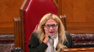
:::

It would seem to me through the eyes of the perspective of the child or whether or not that is in the best interests of the child is something that would be squarely in front of a trial judge.

**Speaker 3** (01:24:21): I think it's a fact that's in front of the trial judge, Justice Martin, but if the trial judge is concerned about the conduct of the director, what I'm struggling to see is how it's related to what is best for the child.

::: {.column-margin}

:::

I mean, the director has made a series of decisions, but if the inquiry is to focus on what this child sees and feels, and that is a relationship with the respondent, I'm not saying that they can't comment on the conduct of the director, but I don't see it as being relevant to what is best for this child when one looks at whether the statutory factors or the case law.

**Justice Brown** (01:25:02): Because it's totally irrelevant.

It's an assessment of evidence.

It has nothing to do with the ultimate decision.

Whether I admit hearsay has nothing to do with the best interests of the child.

That's the ultimate decision based on the evidence that I would admit or not admit.

Okay, I said I'd leave you alone.

I'll leave you alone.

**Speaker 3** (01:25:21): No, it's okay, Justice Brown.

::: {.column-margin}

:::

I'm not concerned or I enjoy the questions.

The question, but what I'm trying to convey is that, yes, this was a consideration of the evidence, but the trial judge minimized evidence of best interest on the basis of this finding related to Dr. Petrie.

And she did that by relying on the conduct of the director.

And in our submission, that's not a relevant factor.

And we say it's not a relevant factor, because when one looks at, for example, if I could ask the court to turn to tab 21 of the condensed book, tab 21 is the decision in MC.

And the decision in MC related to a relationship between a child and her foster family, and it also involved a claim from a natural parent.

But what happened in that case was there was a significant delay in the process.

So in other words, the conduct of the director or the Children's Aid Society was considered, it was part of the delay, but when that delay was considered, what happened was the bond between the child had, in the words of the court, cemented.

So, for example, at the bottom of page 205, this is page 61 of the condensed book, the court says the length of these proceedings may have been one of the factors which has contributed to the attachment of SM for her foster family, and thus increased the emotional harm that would result from her removal from them is a fact that's inescapable.

So the conduct of the director, the conduct of the proceeding was considered, it resulted in delay.

But at the end, the court says that the focus has to be, and the court continues on page 206, years go by that could crystallize situations that become irreversible.

That's exactly what happened here.

And the court concludes at the bottom of 206, that although the argument raised is well taken, what drives the analysis is the best interest of the child.

Can I ask you...

**Justice Karakatsanis** (01:27:47): Sorry, I think we understand your position on this point.

::: {.column-margin}
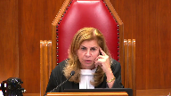
:::

I'm going to ask you a question relating to something different.

This was a custody case that began life as a protection hearing, is what the Court of Appeal called it.

My question is, what is the relationship between a permanent order of custody under the Protection Act and parenting orders under the Children's Law Act?

If there was a need, for example, to vary custody and access, would it be a straight application under the Children's Law Act?

**Speaker 3** (01:28:35): Thank you for the question.

::: {.column-margin}

:::

So the Child Protection Act provides for an award or an order related to permanent custody.

Although the language is the same, custody in that statute and the Children's Law Act, it's really an order related to the permanent care of that child under the Child Protection Act and that order, Justice Karakatsanis, is reviewable.

It can be reviewed under Section 45 of the Child Protection Act on terms that are just and the application can be made by a parent.

What has not been determined to date is the question you asked about the Children's Law Act in Prince Edward Island today.

And the Children's Law Act in Prince Edward Island today has not been considered, no application has been made.

In that statute, parent is defined differently.

It's defined to include obviously the mother and father of a child, but if a third party such as a maternal grandmother wished to have parenting time under the Children's Law Act, the application would require leave from the court.

So the starting position in the Children's Law Act in Prince Edward Island is different.

The starting position is that the mother and the father are presumed to have equal entitlement to parenting time and decision making.

A maternal grandparent would have to get leave of the court to join that proceeding and seek parenting time.

It's not unlike what's present in the Divorce Act in Section 16, Desma 1, where there's this leave requirement.

**Overlapping speakers** (01:30:13): So, Mr. Kudy...

**Speaker 3** (01:30:14): Prince Edward Island under the Children's Law Act, the starting entitlement is for the mother and the father.

But that proceeding has not started.

**Justice Côté** (01:30:22): Mr. Cody, I have a question for you.

::: {.column-margin}
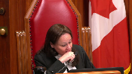
:::

It follows what my colleague, Justice Karakatsanis, asked you.

So don't assume anything from my question.

I'm in the order south at the end of your factor.

So of course, you are asking us to dismiss the appeal.

And you say that the order of the Court of Appeal, as it stands presently, if we dismiss the appeal, would continue to be reviewable pursuant to Section 45.2 of the Child Protection Act.

And you said that this section says when it is just to review the order.

**Overlapping speakers** (01:31:01): Yes, an application can be made by a parent, Justice Cote, including, for example.

**Justice Côté** (01:31:07): What are the factors which are considered to review an order if we decide to dismiss the appeal?

**Speaker 3** (01:31:14): Well, it's not clear, Justice Cote, it just says as is just in the statutory language.

::: {.column-margin}

:::

And the only other requirement in that section is that the applicant is a parent.

So, for example, the appellant would be able to make an application to review the order of the court of appeal.

And so, too, if circumstances changed, would the other natural parent of the child be able to make that application.

But there's no guidance beyond the as is just requirement.

**Justice Côté** (01:31:43): Okay, and the second order or subsidiary order you say if we decide to allow the appeal, then you seem to say that we cannot restore the trial judge order.

::: {.column-margin}
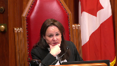
:::

You say a new trial is necessary.

**Speaker 3** (01:32:03): I'm, I hope I wasn't suggesting that you don't have that authority, I recognize that you do.

::: {.column-margin}

:::

My submission was that given the passage of time, we're now at about 27 months, this child has been in the care of his father, that the best course would be to place before the trial judge the newest and best and most current evidence about the child, how he settled in the location, you know, evidence about any sort of transition issues or challenges, evidence around potential relocation.

Unfortunately, the present record, Justice Cote, has become somewhat stale just given the passage of time in arriving to this court to have it considered.

So I'm not saying this court does not have the authority to restore the trial judgment, rather I'm submitting that the prudent course here given the passage of time is for there to be a new trial on the issue.

And I think in the director's intervening factum, they had made a similar suggestion.

**Justice Côté** (01:33:04): And is there an analysis, we know that the order of the trial judge was for the child to be relocated within two weeks of the order with no access to the dad.

::: {.column-margin}
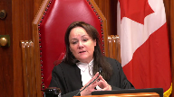
:::

There was no specific access right to the dad.

Was there an analysis by the trial judge of the impact of such an order, I mean implementing a transfer within two weeks with no precise access to the father.

**Speaker 3** (01:33:35): In my submission Justice Cote, there was not a meaningful analysis around relocation and the factors that we see in Gordon Goertz and I would also disagree with my friend around the trial judge's consideration of the effects of her order.

::: {.column-margin}

:::

In the trial judgment, she spoke about the child moving historically between the mother, the director, the maternal grandmother and then ultimately the father.

And those historical changes she spoke about Justice Cote, but in my submission there was no consideration given to the effect of her present order.

So the order she was going to make which said relocate within two weeks and no access to the father.

In her reasons I don't see any analysis to the effect of the present order.

She was speaking about some of the historical changes but that in my submission didn't tell her anything about the effect of her current order and in particular in this record there was evidence expressed by witnesses concerned about the effects of relocation and those are contained in the condensed book.

So just to summarize, in our submission there were two errors present that were reversible.

We've reviewed those at length this morning.

I would suggest that those errors were material.

They touched on the ultimate outcome reached by the trial judge and having found those errors following Hickey and following Van de Peer, the appellate court was entitled to intervene and did intervene and the basis for those in that intervention is found in the court of appeals judgment at paragraphs 33 and at 79.

I've canvassed with Justice Cote and shared with the court the perspective on the authority that this court obviously has to restore the trial judgment.

I've noted the passage of time and I think what the appropriate remedy would be in the circumstance of dismissal or allowance.

So subject to any additional concerns or questions that the court may have those are the submissions on behalf of the respondent.

Thank you Mr. Cote.

Thank you.

**Speaker 1** (01:36:13): Thank you.

Thank you, Mr. Speaker.

**Speaker 4** (01:36:21): Thank you and good morning.

::: {.column-margin}

:::

Chief Justices and Justices, I bring before this court the unique position of the Director of Child Protection for the Province of Prince Edward Island.

I hope to make two points in my submission today.

One, that biology must not be ignored in the child protection proceeding, and two, that the Court of Appeal was correct in factoring in the biological connection into the best interest analysis.

The Director of Child Protection is a statutory parent who is often given custody and guardianship rights pursuant to provincial child protection legislation.

The Director submits that in a child protection proceeding, biology will always be a relevant factor for the courts to consider, and also in a family court matter, biology will be a factor for consideration when the court determines that it is relevant given circumstances and when all things are otherwise equal between a biological and non-biological parent.

Biology is a relevant factor in a child protection proceeding because there will always be at least one parent or party, that party being the Director of Child Protection themselves, who does not have a biological connection with the child.

The court will need to determine if the child is better suited in the care of the state, in the care of a biological parent, or sometimes in the care of a non-biological parent.

The question then becomes what weight the biological connection should be given based on the circumstances of the case.

The Director agrees with the appellant that the biological factor must not be the presumptive factor in determining custody and guardianship, otherwise the Director of Child Protection would never be entitled to custody and guardianship rights with respect to a child.

However, biology cannot be ignored when it is relevant unless the welfare of the child demands that it be set aside.

Biology is just one of the many things that we need to be aware of in order to

**Justice Martin** (01:38:08): I'd like to interrupt your submissions here in the sense of we have read your factum, but I have some questions.

::: {.column-margin}
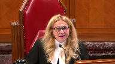
:::

It's kind of a different procedure for the director, having been so involved in this case, to come as an intervener and then to make actual submissions on the merits of the disposition of this appeal.

But I would like to focus your attention on a question that I cannot seem to get a solid answer for myself going through the record that is here.

And that is that on the day in which the director took this child, put it into foster care and then sent it, the child, to Alberta, what was the statutory authority that the director was under to take the child away from the grandmother as a parent?

I have not been able to cobble that together.

**Overlapping speakers** (01:39:08): So, uh...

**Speaker 4** (01:39:08): I will have to put my thinking hat on here as I wasn't counsel at that time for the director, but it's my understanding that at the time the child was removed from the grandmother, there were protection concerns with respect to her care of the child.

::: {.column-margin}

:::

And ultimately at the time, the director did have the child in their custody and guardianship and had decision-making authority with respect to the child.

And that's why the child was removed from the grandmother's care at that time.

**Justice Martin** (01:39:42): And are you familiar with the judgement of Justice Matheson on the contempt that says the child was being overheld and that where would, would there not be a requirement at the time after the day in which the grandmother was declared by a court to be a parent, would there not then need to be some other proceeding taken to say that this child who is now in the grandmother's care who is a parent, that there needs to be protection against this parent, isn't there a separate requirement for that rather than just going forward?

::: {.column-margin}
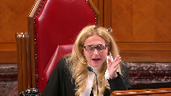
:::

**Speaker 4** (01:40:26): So, ultimately, the director would have apprehended the child from the grandmother and then an application would have been made.

::: {.column-margin}

:::

I'm not aware of whether that application was made or whether a motion was made to actually authorize that removal.

**Overlapping speakers** (01:40:46): It was not.

No application was made of it.

**Speaker 4** (01:40:50): Right, I wasn't aware of whether perhaps a motion was made before the court without a filing of an actual application for the removal.

::: {.column-margin}

:::

I didn't believe so.

However, that isn't an issue that was ultimately dealt with by either Justice Key or by the Court of Appeal in this matter.

And just recognizing the clock ticking down, I will rely on the condensed books and other materials filed by the Director to support our position.

**Speaker 1** (01:41:23): Thank you, sir.

Laura Cardenas?

**Speaker 5** (01:41:28): Chief Justice, Justices, the LGBT Family Coalition intervenes in today's appeal because Canadian family law cannot keep evolving with LGBTQ plus families in its blind spot.

::: {.column-margin}

:::

We're in 2021, and over the past 35 years, Canadian families have drastically changed.

But Canadian family law continues to be bound, as we've seen in this case, to an arbitrary notion that a biological parent is better than any other.

35 years after it last considered this matter in King versus Low, it's time for this court we submit to correct the record and eliminate any biological factor from custody law.

This is the only solution that protects both the best interests of the child and the right to equality of LGBTQ plus parents.

And with that in mind, we'll be making two submissions today.

First, we submit that the biological factor has a disproportionate and discriminatory impact on LGBTQ plus families.

Second, that the biological factor is arbitrary, and that focusing on biology detracts from other important factors, which is to the detriment of the child whose very interests the courts are trying to protect.

And I'm hoping to address some of the concerns spoken to by Justice Casirer this morning with that second submission.

But I'll turn first to our first submission.

The biological factor is a matter of common law.

And common law has to comply with charter value as this court has found in Hill versus Church of Scientology.

We submit to you that the biological factor breaches the charter value of substantive equality, and so needs to be eliminated.

To get there first, we must understand that the biological factor impacts LGBTQ plus parents disproportionately, because in most LGBTQ plus families, a child will be biologically related to only one of their parents.

And that's not nearly as common in families headed by heterosexual and cisgender parents.

From this, we understand easily that LGBTQ plus parents are more likely than other parents to see their custodial rights negatively impacted by the biological factor.

This is not an isolated incident.

Across Canada, for over 20 years, courts have been striking down legislation that has an adverse effect on LGBTQ plus families on the basis of genetics.

And I will give you two examples from just last year that are cited at footnote 11 of our factum.

The first from Manitoba is a case where the Court of Queen's Bench found that it was unconstitutional to force a lesbian mother to adopt her own child simply because she's not the biological mother.

Manitoba here is following the footsteps of most Canadian provinces, starting with British Columbia, where the Human Rights Tribunal found in the same direction in 2001.

The second case is from Quebec, where Justice Bachand, then at the Superior Court, found that it breached Section 15 of the Charter to interpret the Federal Citizenship Act as requiring a biological link between a child born abroad and their Canadian parent in order to give that child Canadian citizenship.

In both examples, because the law or its interpretation created a distinction on the basis of genetics, it had a disproportionately negative impact on same-sex families and therefore, conflicted with the right to equality guaranteed by Section 15 of the Charter.

So does the biological factor.

The biological factor makes non-biological LGBTQ plus parents less likely to obtain custody of their children and in doing so, it indirectly paints them as less capable of caring adequately for their children.

There's no justification for this exclusionary treatment to continue, especially since, as will be discussed in our second submission, this biological factor is arbitrary in nature.

And this takes me to our second submission, which is that the biological factor is based on an arbitrary and unfounded premise, and that is the presumption that children benefit more from growing in the care of a biological parent.

This premise is the result of our cultural and historical biases of our socialization.

This premise has been repeated for decades in the jurisprudence without a single reference to a supporting source.

This premise is completely arbitrary.

Extensive literature, on the contrary, demonstrates that children who are raised by non-biological parents have the same quality of overall well-being as those raised by biological parents.

What makes a difference to a child's well-being are things that are taken into account by other factors, such as how a parent takes care of their child's needs.

Our submission is that we shouldn't detract from those other factors by unduly focusing on something that the literature tells us does not benefit the child.

We should eliminate that factor.

And here I want to address a point that comes from questions asked by Justices Cazeret and Martin this morning, and say that this factor should be eliminated even where the custody dispute is between a parent and a third party, because as we gather from the Manitoba example I gave earlier, under the legislation of some provinces, a parent who has been present at every stage of a child's conception and by their side since they were born can still be treated like a third party in law.

And this is the case for same-sex parents in some provinces, and it's the case for third and fourth parents in provinces where multiple parentage is not yet recognized.

So to conclude, unless there's any questions, we humbly ask this Court to recognize that biology is an arbitrary factor that should no longer be considered in the best interest of the child's analysis, no matter who the parties to the dispute may be.

Thank you for your time.

**Speaker 1** (01:46:33): Thank you very much.

Any reply, Mr. Ross?

**Speaker 2** (01:46:37): Thank you Chief Justice.

::: {.column-margin}

:::

Just very, very briefly, I did just want to pick up on the last question asked by Justice Cote to my friend and there seemed to be an impression that if the trial judge's decision was reinstated what the respondent will receive is no parenting time at all

and I just wanted to point out the findings of fact that it was only the appellant who was held to be willing to facilitate that parenting time and if that didn't end up coming to pass that a procedure, an expedited procedure, was put in place to ensure the respondent would have parenting time.

So the trial decision in no way terminated the respondent's parenting time and that's the only thing I wanted to point out.

Thank you.

**Speaker 1** (01:47:26): Thank you very much.

So I would ask the attorneys to remain at our disposal.

**Speaker 2** (01:48:19): The court!

**Speaker 1** (01:48:42): Thank you.

::: {.column-margin}
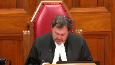
:::

Please be seated.

First of all, I'd like to thank Council for their submissions.

The Court is ready to release its decision.

We are all of the view to allow the appeal and set aside the decision of the Court of Appeal of Prince Edward Island.

We would affirm the decision of Justice Key to award custody to the appellant, subject to the following.

The child is to remain with the respondent until March 21, 2022, unless otherwise agreed by the parties, at which time the child is to be returned to the appellant at the expense of the Director of Child Protection of Prince Edward Island.

Paragraph 3 to 7 of the Order of November 27, 2020 of the PEI Court of Appeal will be given effect.

This Order is made without prejudice to any rights that either party may have to make an application at the Supreme Court of Prince Edward Island relating to custody and access, with costs throughout to the appellant, reasons to follow.

Thank you very much.