---
title: Her Majesty The Queen v. Nigel Vernon Lafrance
published-title: Heard
date: 2021-12-03
sidebar: false
---

This transcript was made with automated artificial intelligence models and its accuracy has not been verified. Review the original webcast [here](https://scc-csc.ca/case-dossier/info/webcast-webdiffusion-eng.aspx?cas=['39570']).
---

**Justice Wagner** (00:00:27): Thank you.

::: {.column-margin}
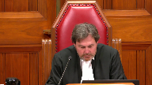
:::

Please be seated.

In the matter of Her Majesty the Queen against Nigel Vernon LaFrance, for the appellant, Her Majesty the Queen, Keith A. Joyce, for the intervener, Attorney General of Ontario, David Michael Garg, Natalia Odorico, for the respondent, Nigel Vernon LaFrance, Gregory Lazen, for the interveners, Canadian Civil Liberties Association, Frank Adario, and Samara Sector, for the intervener, Criminal Lawyers Association, Anil K. Kapoor, Victoria Chichalewska, Keith Joyce.

**Speaker 1** (00:01:13): Good afternoon Chief Justices and good morning to my friend who's still in British Columbia.

::: {.column-margin}
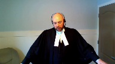
:::

We have here today essentially one issue covering two topics of conversation, detention and of course the scope of a second consultation, Per Sinclair.

I would suggest humbly though that the appeal can be disposed of quite quickly by adopting the decision of the dissenting justice in the court below and acknowledging that the trial judge quite simply committed no errors of fact and law.

In light of the arguments filed in advance, the argument heard during the voir dire of course, the trial judge was well aware of the task that faced him on all charter challenges at the time.

He of course cited the appropriate authorities particularly on the detention issue in full, not just in passing but in full, and made appropriate findings of credibility and fact which are untouched by error and indeed are eminently supported on the record.

He then of course applied the law or applied pardon me the facts to the law.

This entire task brings us into recognition of the presumption of competence the trial judge has held, the fact that he cited appropriate decisions and made findings of facts and made findings of fact bring us into O'Brien and this court's recognition that trial judges are to be accepted when they say they have or have not considered something irrelevant, pardon me of relevance, and then of course all the jurisprudence surrounding sufficiency of reasons.

It is therefore only if necessary that we have to look at the court of appeal decision below and if we do we can see quite clearly that it was they and not the trial judge who erred in this matter.

I would also suggest with great respect to the interveners on the other side given the well argued and reasoned decisions in Grant Sinclair and Willier, all of which have been cited with approval in the years since, there was and is no need to seize and clarify the law as encouraged.

**Justice Rowe** (00:03:31): I would say that the interveners aren't exactly, and they'll have a chance to speak later, of course, calling on us to clarify the law.

I think they're calling for us to change the law.

**Speaker 1** (00:03:45): Well, Justice Roe, I would agree with that interpretation.

::: {.column-margin}
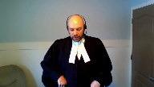
:::

I was trying to be discreet about it.

Now, in this matter, the court's well aware of the facts, so I'm not going to belabor them, as we sometimes see.

But I would like to just say three points, if I may, before we get into the specific argument.

And of course, if the court directs me to one topic over the other, I'm happy to follow.

But if anyone is interested in this case, I would encourage them to read the voir dire reported decision, because as this court undoubtedly has seen, it stands in very sharp contrast to the Alberta Court of Appeal decision, the latter of which I would suggest leaves a distorted impression of what was the relevant evidence, in particular on the detention issue, but certainly on both.

Second, and I don't wish to be accused of hyperbole or fear mongering here, but there is a risk that by endorsing the Alberta Court of Appeal decision, or that endorsing them would have to be done in light of, or perhaps more clearly in spite of, the facts that were here.

And that, in my view, would have repercussions that would inappropriately change or shift the law into overly broad areas.

And when I say overly broad, I am purposefully referencing Section 7 type thinking, because as this court noted in Grant, you can overshoot the right by giving overly broad interpretations.

So for example, on the detention issue, you will have seen when you have a reasonable person, which has its own definition of being informed and reasonable and not very sensitive or scrupulous, et cetera, combined with the particular intelligent characteristics of the respondent in this case, plus the repeated and timely warnings that ensured he understood, and it was found as a fact he understood, that he did not have to go, stay with, or give any statement to police, instructions about which he had no questions, instructions about which he never sought to invoke or test.

And if the efforts made by police in this case are not enough to change the law, then you will have to go back to the court and re-evaluate the law in order to change the law.

**Justice Brown** (00:05:58): Can I ask you about that?

::: {.column-margin}
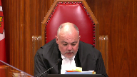
:::

Paragraph 91 of the dissenting reasons at the Court of Appeal state that the fact that the senior officer unequivocally informed the appellant on several occasions, he was under no obligation, could leave any time, in the absence of extraordinary circumstances, which there are none here, the dissenting judge says that this fact by itself is determinative.

Do you agree that that is determinative?

**Speaker 1** (00:06:36): I would suggest, Justice Brown, that the prior case law, those decided before Grant, found it was not determinative.

::: {.column-margin}
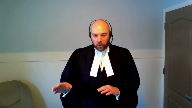
:::

It was just something to consider.

And as I have set out in my materials, I would suggest that it is not necessarily determinative on the whole, like the Brightline test that my friends from the Ontario Attorney General are suggesting.

But what it does mean is when you have those kinds of instructions set forth and put to the person, the courts must start from a presumption that that encounter is now prima facie voluntary.

In other words, there is no detention.

**Justice Brown** (00:07:10): so we can't adopt the dissent on that point i beg your pardon sir

so you you've you've you've urged us to adopt the dissenting reasons

but we can't do it on that point has to be more nuanced

**Speaker 1** (00:07:22): Oh, fair enough.

::: {.column-margin}
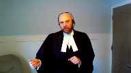
:::

That's why, again, as I say in my written materials, once you have a prima facie voluntary encounter, you need specific evidence to show that that situation has changed.

Subjective intent on behalf of the detainee, clear communication that they no longer wish to participate and that that communication is either ignored or overrun.

And only then might we be able to say, having been given those instructions, they are no longer valid.

But even a presumption...

**Justice Jamal** (00:07:53): You

**Overlapping speakers** (00:07:53): would change the law, wouldn't it?

**Justice Jamal** (00:07:56): Even a presumption would change the law, wouldn't it, from Grant and Lee?

**Speaker 1** (00:08:03): I don't believe so, sir. No.

::: {.column-margin}
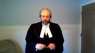
:::

Because in Grant at paragraphs 32 and 39, they make quite clear that if you're unsure about whether or not this is the police, of course, if you're unsure about whether you're detaining someone, you can tell them in clear and unambiguous terms, they don't have to cooperate in a free to leave.

And then at 39, they make clear on they literally say, unless, as we said before, you're telling them you're free to leave, you may end up with a detention.

And then again, at paragraph 44, when summarizing what the grant test is, they leave out those clear instructions, they talk about the language of police in more vague terms.

So I would suggest that no, Grant makes quite clear in its decision that giving those kinds of instructions do create a different situation where there's no ambiguity.

And that's why I suggest there's a presumption there.

My concern may

**Justice Martin** (00:08:59): Go ahead. Go ahead.

**Justice Moldaver** (00:09:04): My concern with this whole thing, frankly, is that if one reads the majority decision of the Court of Appeal of Alberta, I don't think there was any need to have a voir dire at all here.

::: {.column-margin}
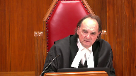
:::

It completely says the whole test or the whole thing you look at is objective.

It's an objective basis.

So all the findings of the trial judge who gives very detailed reasons for finding why he accepts the evidence of the police where it conflicts with the accused, he rejects the evidence of the accused across the board and gives reasons for this.

It's not just a bald statement.

He gives plenty of reasons for this.

He looks at the police conduct and he says essentially they did everything they could.

They made it clear that it was voluntary that he come.

They made it clear that he could leave at any time.

They made it clear that he didn't have to talk at all.

They explained to him why he was there and what they were looking at and that he was perhaps a suspect in the homicide and so on.

They do everything they can do and the trial judge says I accept that.

But then the Court of Appeal comes in, the majority says that doesn't matter.

It doesn't matter that the trial judge rejected the accused's statements that he really didn't understand what the police was telling him.

The trial judge says yes, I'm satisfied he did understand.

In fact, he was taking a proactive stance on the understanding that the best defence is an offence.

That's number one.

The Court of Appeal comes in and just ignores all this and says really this is just an objective test.

In these circumstances it doesn't matter what the police would have done because what the accused said or didn't say they had to give him his 10B rights because he's detained. Why?

Because he's a young, indiginous man who's been racialized.

If that's where we are, so be it

I suppose.

But I don't think even Lee went that far.

And if one looks at Lee, it seems to me that the police did as much as they could to do what they could to ensure that the accused knew he wasn't detained.

So I don't know where we are in light of the Alberta majority decision

but it just seems to me the whole voir dire is a waste of time because at the end of the day the judge says it's all objective and the police should have known in these circumstances that this young man would feel detained even though his evidence on that is rejected, even though the police do everything that they can to make him understand that he's not but it really doesn't matter because he must have felt detained even though he didn't necessarily know it but the police objectively should have known it and just given him his 10B rights right off the bat.

Now that's a very long comment

but I'm trying to get to the nub of this whole thing.

It just seems that the whole voir dire conducted by the trial judge is really quite irrelevant because when it comes to psychological detention, certain people will automatically be arrested according to the reasonable person standard detained which means 10B rights.

**Speaker 1** (00:13:04): Well, Justice Moldever, I don't disagree with your interpretation of things.

::: {.column-margin}
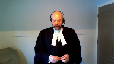
:::

I had some notes on that.

The next point I was literally going to make that if this is not enough, as you say, then a detention is basically a fait accompli anytime police desire to speak to someone, you know, in a that is specifically target them and desire to speak with them.

And I would agree with you that Lee doesn't go so far.

We all agree that it is an objective test but even in Lee, the court warned against placing too much emphasis on the subjective perceptions.

The focus must be on what the police are doing and how that could be interpreted by a reasonable person.

And I agree with you again, sir, that the court of...

**Overlapping speakers** (00:13:42): Reasonable person in his shoes, reasonable person in his shoes.

**Speaker 1** (00:13:48): No, no, no, no dispute there.

I would agree that the Court of Appeal overstepped their bounds.

**Overlapping speakers** (00:13:57): in this case.

**Speaker 1** (00:13:58): And as you were alluding to, Justice Moldaver, once it's established in common law, if this court were to endorse the court of appeal below, once it's established in common law that if you have a clearly intelligent person who is told and is found as a fact to have understand their choices, that they don't have to be there.

::: {.column-margin}
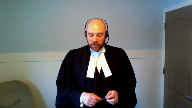
:::

Once that's deemed insufficient, where does one go in the realities of policing to avoid a detention?

There's nowhere to go.

May I stop you?

**Justice Martin** (00:14:25): and ask you a question because it appears to me that one of the jurisprudential issues that we're being asked to address in this case is on which there's a bit of a disagreement is what is the legal significance of the police saying you are not detained this is a voluntary statement you're free to go those kinds of statements we have the dissent of the Court of Appeal saying that such should be a bright line and a determinative you say that's not the case we it's now argued in front of us that it should be recognized as a presumption that there is no detention but I'd also like to to hear your comments on what about it being the minimum communication in a clear way for there to be no detention and falling back on the contextual analysis that's established in grant and this being a factor but a necessary precondition so that people are clearly informed about when the police believe they are not detained

::: {.column-margin}

:::

**Speaker 1** (00:15:33): Well, Madam Justice Martin, I don't know that it needs to be a precondition.

And I understand this court, if I'm not mistaken.

**Overlapping speakers** (00:15:40): I didn't...

**Speaker 1** (00:15:40): It was Omar that left this question to another day and I suppose this other day has arrived

::: {.column-margin}
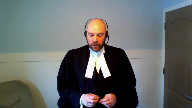
:::

but no I would not submit it is necessary precondition.

I can't advise the court that there was an effort made here in Alberta through native counselling services to hand out cards to that effect and say officer please tell me if I'm being detained or if I'm free to go.

But whether that's a precondition or not I would suggest no because even if it is.

**Justice Moldaver** (00:16:07): even if it is a precondition, and even if we accept the Attorney General of Ontario's guidelines that they're suggesting, the three steps that they suggest, the police did precisely.

::: {.column-margin}
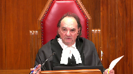
:::

They covered all of those according to the findings of the trial judge.

They explained why he was being taken down.

They told him he didn't have to stay.

They told him he didn't have to talk.

They did everything they could short of just saying, well, we may as well give you your 10b rights to try to ensure that he was not psychologically detained.

I don't know what else they could have done.

As I say, even in lee, I think in lee the concern was, well, maybe we should have a rule that when someone is stopped who is racialized on the street, the police have to do the very things that they did in this case, and the very things that the Attorney General of Ontario sets out.

Now, if that's not enough, then as I say, we go right to 10b.

**Speaker 1** (00:17:13): Again, I'm in complete agreement with that assessor, Justice Moldaver.

But again, I don't suggest that it is a precondition.

And as you just pointed out, if it is, it was clearly done in this case, and I suppose the power of the court to say it should be done.

**Overlapping speakers** (00:17:29): Do you have any opposition to the guidelines suggested by Ontario?

**Speaker 1** (00:17:32): Not specifically, sir.

::: {.column-margin}
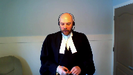
:::

I have to admit, as much as I'm a Crown, I'm a little weary about any time we start sending out complete bright-line tests.

I'll let my friend from Ontario advocate for that.

But I agree, once you start telling people why they're there, you're not detained, we'll remove all the physical barriers and all the like.

As you say, where else do you go?

There's nowhere else to go.

Very practical considerations by the interveners there.

**Justice Jamal** (00:18:03): Is it fair to say that there's a bit of a split here in terms of what the police said and what they did?

::: {.column-margin}
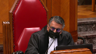
:::

And what they said is essentially, you're free to go, you don't have to come with us, but everything else, all the other factors on the other side of the ledger, really, in terms of what they did, would tend to weigh in favor of a detention, even quite apart from whether or not the individual was indigenous.

Would that be a fair characterization in terms of them arriving at night with a search warrant, armed, cars, following him when he gets his cat, taking to the station, and following when he goes to the washroom.

All the other circumstances are indicative of detention, but for the fact that they tried to very clearly, as best as they could, indicate to him that it was voluntary and he wasn't detained.

Is that a fair characterization?

**Speaker 1** (00:18:56): I would humbly suggest that that characterization is somewhat misplaced.

::: {.column-margin}
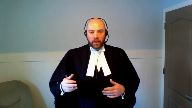
:::

I see exactly the point you're trying to make aside from the fact that they arrived in the morning and not at night.

You're quite right.

We look at what went on because that's exactly what Grant says.

Look at all the circumstances and so on and so forth.

But the point I make is that you cannot, as the Court of Appeal did and as I submit my friend does here again today, you cannot simply say, well on the one hand they told me you didn't have to be here, but on the other hand we have all these other things and these other things look bad.

The problem is once you're informed you don't have to be there, that bleeds into the interpretation of everything else.

Yes, police show up on mass to execute a search warrant, fair enough, but once you're told you can walk away from this situation and then the police ask him, you know, we'd be, are you willing to give us a statement?

I'd be asking you to give an actual statement, then asking him, I want to make sure you're not doing anything else today, so on and so forth.

Once you have that, that informs, like an intervening act, that should sever the interpretation of what came before.

And then you get to the police station.

Once you've agreed to go to the police station, a reasonable person in the shoes, I would say, would anticipate additional security.

And once you're in the room and told it's not locked, you might anticipate that you can't go anywhere in the police station without an escort, but everything informs it.

So it's not a simple matter of weighing it.

I agree with you on the ledger.

Yes, you have things that go to detention, but the instructions that are given have to inform how you interpret what came before and what happens after.

And that is why I suggest there's absolutely no detention here.

**Justice Moldaver** (00:20:43): You have to fold in the reasons of a trial judge who's heard the evidence because my initial question to you is What's the point of hearing any evidence and making findings of fact?

::: {.column-margin}
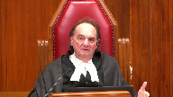
:::

If they're just going to be swept aside By an appellate court that sort of isn't prepared to live with them Or or maybe is prepared to live with them says it doesn't matter

**Speaker 1** (00:21:09): No, that's again fair enough, just as Brown of course led the majority in Lee and would remind us, and I agree that the standard of review is correctness, but you cannot discard the findings of fact.

::: {.column-margin}
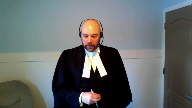
:::

I had just left off on how endorsing this decision would change the law in detention.

I also suggest that endorsing the decision would change the law in terms of the Sinclair issue, again having facts where the young man requests a lawyer of choice, in this case it was legal aid, reached the lawyer, spoke uninterrupted, understood his rights to silence and so on, absolutely no change in the investigative technique, no confusion about his right to silence, at best a confusion that he wants to have a lawyer with him in the room.

Endorsing the decision would lead to something beyond Sinclair, McCrimmon, and Willier and even Oichol, in the sense of simply changing tone.

**Justice Rowe** (00:22:08): I think one of the reasons why undoubtedly police officers find that the accused persons or people they're interviewing say, I want my lawyer in the room, is they watch American TV.

**Speaker 1** (00:22:24): I can't disagree with that and this court has already specifically another case that's talked about how American Miranda rights or other things don't translate

**Justice Brown** (00:22:32): You've got limited time, Mr. Joyce, but I would be grateful if, in whatever time you have left, you, and this is also a notice to Council for Mr. LaFrance as well, I'd like to hear from you on the significance, if any, of Mr. LaFrance's request regarding his father.

::: {.column-margin}
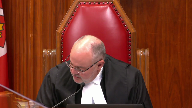
:::

**Speaker 1** (00:22:59): Yes, certainly Justice Brown.

::: {.column-margin}
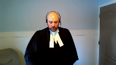
:::

We know from Sinclair, and indeed something I didn't point out in my factum but I point out in my contendence book, from Sinclair not only is it assumed that the initial consultation was sufficient and correct for how to deal with interrogation, there was a specific concession in this case that the advice received from Legal Aid was not in question.

No inadequacies there.

So you start with a, you start from a position of someone who has been particularly informed.

This case differs clearly from Dussault.

In fact in the Dussault the Quebec Court of Appeal said this isn't a Sinclair issue.

In this case the young man was well aware of his right to silence, which according to McCrimmon is what we should be worried about when we're talking about confusion.

The Court of Appeal below found, pardon me I just want to get my notes here, the Court of Appeal decided that there was an objective change in circumstance that showed he would not have understood his rights and the initial invites rights were no longer sufficient.

That is completely incorrect.

As I said he is properly informed.

This is clearly a case where he simply wanted more advice and not a case where it could be taken that he wanted, well in fact it's not even a case where it could be taken he wanted more advice because the voir dire evidence clearly showed when he was asked indirect mind you on the voir dire what was your intent when you were talking about your dad getting a lawyer for you

and he says five times lawyer in the room, lawyer in the room, lawyer in the room, lawyer in the room.

So this isn't even a case where we can say from the fact quite frankly that he was looking to get more legal advice as to how to deal with it.

He just wanted someone in the room with him and of course he wasn't asking to call a lawyer directly.

He was asking to call his father because legal aid had suggested he have a sit-down but at the same time there was no evidence whatsoever that he had a specific lawyer in mind that there was any hope of an actual lawyer coming down.

This was more of a general request to see if someone could be contacted to come to the station.

**Justice Karakatsanis** (00:25:07): I ask you...

**Justice Brown** (00:25:07): I'm just going to say it's not many 19-year-olds who would know specific lawyers.

**Justice Karakatsanis** (00:25:14): Well, I guess just to follow up on that, not so much looking at the facts of this case for just a moment, but to looking at the third category in Sinclair and whether there was objective reason to question the detainees understanding of their section 10b rights.

::: {.column-margin}
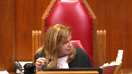
:::

To what extent is the vulnerabilities of the detainee relevant to that particular inquiry?

**Speaker 1** (00:25:45): Uh, pardon me, I'm not quite understanding the question, Justice Erekatensis.

You're saying vulnerabilities to being confused about advice you had received?

**Justice Karakatsanis** (00:25:54): I'm talking about the entire circumstances of the accused, age, prior conduct, prior events in the investigation, prior contacts with police, any other vulnerabilities that could impact on someone's understanding of their rights under 10B.

::: {.column-margin}

:::

**Speaker 1** (00:26:18): In this case, and in general, I would suggest that while it is possible for a court to look and say Mr. So-and-so was very sophisticated, had a lot of experience and so on, and thus that can be used to aid a Crown's argument to say he understood, notwithstanding some faultiness, I would acknowledge that a lack of those things, pardon me, let me rephrase that, you can use it one way to say sophisticated, therefore understood, but you cannot use it the other way, I would submit, and say well because he was young and vulnerable we must assume he did not understand the rights.

::: {.column-margin}
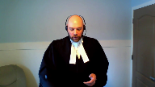
:::

Only Parliament can dictate that sort of thinking through a separate system of justice.

I lay out in my materials, because the Court of Appeal in this case brought it up, the fact that a person is young, fair enough, but at the same time intelligent, doesn't mean he did not understand the rights to silence.

In this case they clearly showed he did and sought to invoke, however incorrectly, the right to have a lawyer come down to see him.

The fact that he is Indigenous I would suggest has no relevance to whether he understood the proper advice he was receiving, certainly not on the facts of this case, nor the fact that he was in a statement for an hour and a half, which it was in several hours as the Court of Appeal noted by the way, it was about an hour and a half.

None of those things can really touch on whether or not he understood his rights, and to Justice Moldavio's questions earlier, if the trial judge found he understood those rights, it is not subject to reinterpretation unless it's palpably an error.

**Justice Martin** (00:28:09): But is that the correct question to focus almost exclusively on the right to silence and the understanding of that?

::: {.column-margin}
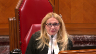
:::

We just heard a case in which we were talking about whether or not section 10b which would be triggered on detention is limited to a right of silence and heard that it is a much wider concept.

So is the singular focus on whether or not a person understands that they do not have to speak, is that the extent to which we're sort of measuring whether or not they've been detained and whether or not 10b ought to have been applicable?

**Speaker 1** (00:28:51): To that, Justice Martin, I would say, while the right to silence may not be the only factor, it is the overwhelming factor.

This was, I suggest, made clear in Sinclair at 24.

And later on, when they—

**Justice Karakatsanis** (00:29:07): Claire refers to in at least a dozen paragraphs that it's not just the right the underlying purpose is not just the right to understand your right to silence but also on whether to cooperate with the police and at least a dozen paragraphs.

**Speaker 1** (00:29:24): Absolutely, Justice Garrett-Santos, but it also tells us that it is assumed he has been informed of how to do that, because it's advice.

**Justice Moldaver** (00:29:31): assumed differently here.

::: {.column-margin}
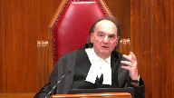
:::

There's no suggestion that the police just said, you know, you've got the right to remain silent.

He had a full conversation with his lawyer, sorry, that his lawyer just told him, you know, just you have the right to remain silent.

Why would we assume that the lawyer gave advice that was less than needed to fulfill the 10b obligations?

I mean, I don't know.

If we start going down that road, then I think we may as well.

Well, I won't go on.

**Speaker 1** (00:30:05): Well, to that point, Justice Moldaver, I would agree with you for two reasons.

::: {.column-margin}
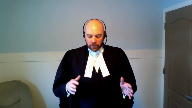
:::

One, there is a presumption of competence that follows counsel.

And in order to have meaning to the bridges system, we're going to allow people to be called in the morning.

They have to be competent.

So we have to assume that they are giving proper advice.

And again, in this case, it was specifically conceded.

And the second thing is, of course, there is a affirmative onus on applicants to prove charter violations, which means they do not get the benefit of gaps in the evidence as they would on a standard of reasonable doubt.

So if the accused person does not only weigh privilege, but then properly, as was in the other case, have admissible evidence, not hearsay, but admissible evidence as to what went on, then the court should not start assuming that the advice was faulty in any way.

And if I may just, I only have seconds left, but if I may just finish on Justice Martin's question about that and Justice Karakatsanis about the focus there.

Of course, in Sinclair itself, they spoke of how a simple request cannot in and of itself signal the type of confusion that would trigger a second consultation.

And in McCrimmon, which was released, of course, at the same time, the court, I suggest, elaborated or focused on this further when they noted that I'm quoting here from 23-24, where developments in the investigation suggest the detainee may have been confused about his choices and right to remain silent.

This may trigger a right to renew consultation under Section 10B. Arguably, Mr. McCrimmon's expression of vulnerability and ignorance of the law, excuse me, when considered in isolation, could indicate such confusion.

However, when the circumstances are viewed as a whole, it is clear Mr. McCrimmon understood his right to silence.

And that is why I suggest, humbly, that the right to silence, which is, as was said in the other case, which is the driving force behind Section 10, if it is clear and understood and found as a fact that the accused understood the A, evidence, or pardon me, the instructions he got from counsel, which include how to deal with it, and B, his right to silence, then that is an overwhelming factor.

It may not be the only one, but it is certainly the overwhelming factor.

I see I am out of time.

Subject to questions, of course.

**Justice Wagner** (00:32:35): So thank you very much, thank you sir.

Thank you.

**Speaker 2** (00:32:40): Thank you Chief Justice.

::: {.column-margin}
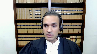
:::

Good afternoon Justices.

The Attorney General of Ontario intervenes on the detention issue and I'm going to start with your question Justice Martin on whether it should be a precondition to tell a person that they are free to go to avoid triggering a detention.

Respectfully, no it should not.

Detention requires significant physical or psychological restraint that constrains a person's liberty of choice and that was recently reiterated in Lee.

And so even in the absence of telling someone that they are free to leave, it may be clear in the circumstances that the police from the police conduct that they were free to go and that's why it shouldn't become a precondition to avoid a detention.

I will now turn to Ontario's proposal of a bright line rule on when police have not detained someone and this is an important issue as illustrated by the fact that whether there ought to be a bright line rule contributed to the split at the Alberta Court of Appeal.

Ontario's proposed bright line rule consists of three points that police would convey to someone.

Explain to the person their purpose for engaging them.

Secondly, convey that speaking or cooperating with them is optional.

And third, police must explain how they will remove any barriers that prevent the person from walking away.

I'll first explain why a bright line rule is necessary.

Justice Cote writing for this court in Fleming, you held that it is important for the courts to give officers the clearest possible guidance.

As things stand police and lower courts for that matter do not have sufficient guidance when it comes to when it comes to detention.

The law provides police with various bright lines on when they have detained someone but otherwise police are required to apply the contextual analysis.

This is a tall task for police who must make critical decisions in real time often in stressful situations where multiple interests are competing for their attention.

We see in the lead decisions from this court, Court of Appeal and the trial court how much analysis is required to conduct the contextual analysis.

And the stakes are high.

Police must know with confidence and precision whether a detention has crystallized because detention is a charter trigger notably for sections 9, 10a, 10b all of which place immediate obligations on police.

Furthermore, it is good policy to encourage police to seek someone's side of the story before deciding whether to pursue charges against them or to restrict their liberty in some way.

And so police need a method to take detailed statements from possible suspects who appear open to sharing their account.

That can only occur if police know how to take these statements with confidence without triggering a detention.

**Justice Brown** (00:35:44): These points would also support a bright line for a mandatory precondition or precaution.

::: {.column-margin}

:::

Would they not?

I mean bright lines are bright lines wherever they go and you're speaking of the virtue of bright lines so there's certainty.

Doesn't matter where the bright line goes then.

**Overlapping speakers** (00:36:05): just to...

**Justice Brown** (00:36:06): just to circle back to my co-author and Lee, Justice Martin's point, that perhaps all those purposes are still served by putting the bright line where she would put it.

**Speaker 2** (00:36:21): And I don't want to repeat my submission from earlier, but that would be a fundamental, unnecessary fundamental change to what we understand detention to be.

::: {.column-margin}
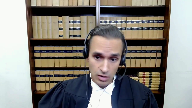
:::

It still remains an objective analysis, and if that one warning or instruction were missing, that there's nothing else to suggest that there is a detention, it ought not to be the case that a detention would have crystallized.

But just to return to my point to make sure that I've made it clearly, if a person is detained when they're giving a statement, the detention is most likely unlawful.

This is because a thorough interview is unlikely to satisfy the requirement for detention to be both reasonably necessary and brief.

Providing rights to counsel would not render the detention lawful.

10B is a separate issue from whether detention is lawful under Section 9.

And in my brief time left, I would just like to highlight that Ontario's rule, proposed rule on when police have not detained someone is tethered to the purpose of Section 9.

Section 9 isn't to protect someone against legal jeopardy or consequences.

The purpose is to protect their liberty of choice.

Section 9 protects the right to choose whether to stay or leave when interacting with state agents, and the proposed bright line rule protects this choice head on, as well as the other potentially coercive factors that are addressed in this court's decision in Lee.

Subject to any questions, those are our respectful submissions.

Thank you very much.

**Justice Wagner** (00:37:51): Mr. Leeson.

**Speaker 3** (00:38:00): Good afternoon, Chief Justice Wagner, justices.

::: {.column-margin}
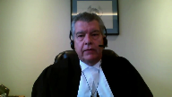
:::

I would like to commence my...

I'm sorry, I'm having a computer issue here.

I don't have a screen in front of me.

I'm sorry, I do not have a screen.

**Overlapping speakers** (00:38:43): Yeah.

Can you hear me?

Can you hear me now? Now I do.

Thank you. Okay.

We can, we can hear you and we can see you.

**Speaker 3** (00:38:48): Okay, I can now see the court.

::: {.column-margin}
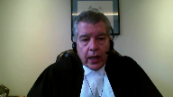
:::

Thank you.

To start off, we do not seek any change in the law as set out in Grant or Lee with respect to the first portion of my submissions, nor do we seek any change in the law with respect to Sinclair.

Our position is that this case, with respect to the March 19th, 2015 issues, clearly falls within Grant and Lee, and with respect to the April 7th, 2015 issues, clearly falls within Sinclair.

And I'd like to start off by going over a few of the facts that I think will inform both Justice Moldeber's as well as Justice Jamal's questions to my friend.

When the intervention by the police began in the early morning hours of March 19th, 2015, it very clearly was an exercise of and communicated exercise of police power.

The demonstration of the many police vehicles, the many officers, the tactical gear, the firearms, the complete context was designed to denote and connote an exercise of power to everyone within the vicinity.

That was acknowledged by the police.

It becomes obvious right from the very beginning that the police are taking control over Mr. La France.

He's in his underwear, he's told to get dressed, he's told to go.

As this court noted in Lee, yes, he was told he was free to leave the residence, but at seven o'clock in the morning, where is he free to go to?

He has no money, no car, it's minus 11 in Fort McMurray.

Where is he precisely to go to?

He is then obviously of the impression that he has to ask permission to retrieve his own cat that has escaped from the house and return it to the house.

While he is within the yard, he is chaperoned and accompanied by an armed police officer.

He returns the cat to the house and is then brought over to two other officers who very cordially say, yes, we'd like to talk to you.

As Justice Jamal indicated, this is a situation where the words and the actions do not jive.

And if you have a ledger, on one side you have every single action of the RCMP, on the other side you have their words.

You have two officers who each are virtually twice the physical size of Mr. LaFrance.

He is taken to a police vehicle.

The doors are open, there are tactical positions taken within the police vehicle with one officer driving the other officer sitting in the back seat with Mr. LaFrance.

He's taken to the police station.

He's taken through a set of locked doors down a hallway into another set of locked doors.

And I want the record to be clear on this.

He is then placed into a cell.

He is not told at that point that the door is unlocked.

He is in that room for 17 minutes and 48 seconds before the officer comes back and tells him that he doesn't have to talk to them and he is free to leave at any time.

That is after almost 18 minutes of being in this room.

When he asks to use the washroom, he is told that the use of the washroom is at the under the control of the RCMP.

He is then chaperoned while he is going to the washroom.

He is then brought back.

He then subsequently is questioned.

Again, this is a young man who has no money with him.

He is completely at the whim of the police officers who specifically tell him that they see him going home when he is done giving the statement.

It is not a situation where they say, oh, if you don't want to talk to us, we'll take you back right now.

He is not told at the scene that he does not have the ability to not go to the station.

He is given two choices at the scene.

He is told he can either make his way or he is told that they can give him a ride.

At the scene, Nigel LaFrance specifically tells the officers that he'll take the bus knowing full well that he doesn't have money for the bus.

Now, when he is in the room with the officers, he has already been detained by that point.

The issue here and with all due respect to the learned for a dear judge, the use of an objective test is different than an objective test from someone in the shoes of the accused.

And with due respect, that is the distinction that was noted by the majority of the Court of Appeal, and that is the correct distinction.

The learned for dear judge at no point did his analysis on detention from the perspective of from an objective test from someone in the shoes of the accused.

He used an objective test as that term might be used.

When I was in law school, it was called the man on the Clapham Omnibus.

That's the test he used.

It's the incorrect test that was set out by this court in Grant and Lee.

You can see from the interaction at the police station that this young man is totally overwhelmed.

He is asked to provide fingerprints.

He's asked to provide DNA.

He's asked to provide his clothing, but it's the words that are being spoken.

And I have set those words out in our factum specifically where he is told words are used that connote a difference in power.

**Justice Rowe** (00:47:00): Now, at some point, presumably, you're going to tell us why this matters, given that the March statement was not put into evidence, was it?

**Speaker 3** (00:47:10): No, it wasn't.

::: {.column-margin}
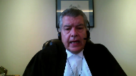
:::

However, evidence was seized on March, and I will absolutely, Justice Rowe, tie that into my submissions.

This becomes important because the interactions that Nigel LaFrance had with the RCMP on March 19th, 2015, directly tie into the interactions that he had on April 7th, 2015, including confusion.

During the interview on March 19th, there is an issue that arises with respect to the provision of DNA, and on that point, Sergeant Nason is brought in.

Sergeant Nason is the person who's going to take the DNA.

At that point, he starts reading a warning to a young offender to Mr. LaFrance.

He gets about halfway through that, realizes that Mr. LaFrance is not a young person, then says, oh, I shouldn't have read you that, forget that, and then he says, we've already talked about your lawyer aspect.

They haven't talked about any lawyer aspect at that point.

What has happened is he's been given some incorrect advice that has been stated and then withdrawn, and then Sergeant Nason ends up saying, you've been given, or we've gone over we've gone over your lawyer aspect.

What that does is it indicates that the ability to have counsel is solely at the discretion of the RCMP who can allow or not allow Nigel LaFrance to exercise that right.

We then go on to the end of the interview, and at the end of the interview on March 19th, the continued detention of Nigel LaFrance is further illustrated by the comments such as, we're just about done here in a little while and we'll have you out of here.

Then they ask if he has anybody to come and get him.

He doesn't, and there's a bit of a discussion about who's going to take him home.

This young man didn't have the ability to get up in the middle of the interview and go.

They had specifically told him that they see him going home after he has given the statement.

We then go to April 7th.

On April 7th, he is read an arrest script by Constable Atwood.

Constable Atwood elicits certain answers from him, gets incorrect regurgitations of what Constable Atwood has read to him, does nothing to correct those incorrect regurgitations, and he is then put into a telephone room.

He's in the telephone room for about 24 minutes, something like that, 26 minutes.

He seemed to be on the telephone for about 14 minutes.

He comes out of the telephone room, is not asked whether the advice that he has received was satisfactory, as was the case in a number of the cases that I've cited in my condensed book of authorities.

This is a young man who has had no experience with the legal system.

He has, he starts demonstrating the absolute confusion when he says, when he gets into the conversation about wanting to contact his father.

Now the RCMP know that he is completely dependent on his father.

They know by that point that he is unemployed.

They know that he has had no previous that he has had no previous communications.

They know that there is an issue with respect to this being a very immature young man because of the discussion that they had with them on the March 19th interview with respect to the provision of the search warrant.

On March 19th they specifically had a discussion where they gave him a copy of the search warrant.

It was well into the interview with Nigel on March 19th that he had been given a copy of the search warrant.

He didn't even know to ask for a copy of the search warrant.

And then there is a discussion, well, your father is going to have a copy of this

so if there's flak arising out of that discussion, you better be prepared for it.

So they know that he is completely dependent on his father at that point.

He's interviewed by the same officer in the same room.

The previous interview is referenced 22 times where he again was not given the right to counsel.

They know from their previous experience that this young man can be run roughshod over because they've already run roughshod over him on March 19th.

They then on April 7th with as much force as this young man can muster, he says, well, I'd like to talk to my father.

Well, why do you want to talk to your father?

Well, I was told that I had to have a lawyer come down and sit with me.

That is clear and unequivocal, I would submit, comment that the first provision of legal advice that he was given was not complete.

This is not- With respect, Mr. Leeson-

**Justice Moldaver** (00:53:51): This is a very interesting approach to this case.

::: {.column-margin}
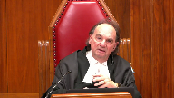
:::

But I haven't heard you once indicate that the trial judge erred in having viewed the people, viewed the parties, et cetera, concludes that your client was taking an offensive position to try and persuade the police that he had nothing to do with this, that he was an intelligent young man.

All these things that you're pointing out now have been reviewed carefully by the trial judge, and he made findings of fact.

So I guess, are we supposed to retry all this, or just ignore all the findings the trial judge makes?

And then I get back to why have a voir dire to begin with.

**Speaker 3** (00:54:39): Justice Moldaver, if I might respond, thank you.

::: {.column-margin}
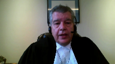
:::

The trial judge, when he was analyzing this, did not analyze this from the perspective of a reasonable person in the shoes of the accused.

Lee is very clear that even if you disbelieve the evidence of the accused, which is what happened here, you still have to analyze the findings of fact from the perspective of a reasonable person in the shoes of Mr. LaFrance.

That was clearly not done here.

The learned trial judge did not do that.

What he did is he applied an objective standard, but not an objective standard from the perspective of someone from Nigel LaFrance or someone in his position.

That's the fundamental error that the learned trial judge made.

That's my point.

**Justice Moldaver** (00:55:53): If you're going to not bother with what the accused says or does or anything else, what his position is, whether it's believed or not, why are we even having a hearing?

**Overlapping speakers** (00:56:03): if

**Justice Moldaver** (00:56:04): If this whole thing can be looked at objectively without anything, without the police talking about what they were doing and why they did it or what your client said and so on, and we just have to look at this totally from an objective person's standpoint, why bother having a voir dire?

::: {.column-margin}
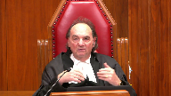
:::

**Speaker 3** (00:56:28): Mr. Justice Moldaver, the law is clear from Grant and Lee that the perspective of the reasonable person in the perspective, in the shoes of the accused is the perspective that the matter has to be analyzed in.

::: {.column-margin}
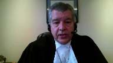
:::

I am not asking this court to change anything.

I am saying that is what the law is.

And the point of a voir dire is to elicit the evidence that demonstrates what the reasonable person in the shoes of the accused would have perceived.

Isn't it broader than that?

**Justice Jamal** (00:57:10): And even if the facts in the voir dire aren't challenged, and even if the legal test is correctly stated, the application of the facts to the legal standards to whether that amounts to detention in law is a question of law, and that's set out in paragraphs 18 and 19 of the Court of Appeals reasons.

::: {.column-margin}
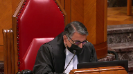
:::

So it's broader than what you've just stated.

It could be obviously an error if the wrong test is applied, but even if the right test is applied and the facts are taken as given, the appellate court still has the role to intervene on a question of law.

**Speaker 3** (00:57:44): Yes, absolutely.

I'd like to move on to the next argument I would like to submit.

**Justice Martin** (00:57:55): Before we go on to that, I'd like to follow up on Justice Rose's question.

::: {.column-margin}

:::

He referred to the March statements as not being admitted into evidence, but can you explain the clothing taken, the fingerprints taken, the DNA taken?

Do I understand that they formed part of the subsequent interview in April?

But my question is really, did they make their way into the trial proper?

**Speaker 3** (00:58:30): Justice Martin, no they did not.

::: {.column-margin}
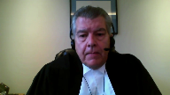
:::

And what the, there was no evidence that was tendered from the items that were seized on March 19th.

However, the conduct of the April 7th interview was informed and was subsequent to, by the March 19th seizure.

So when you have

**Justice Rowe** (00:59:03): So that's not what the trial judge said.

::: {.column-margin}
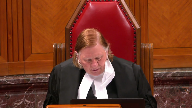
:::

The trial judge said, under the heading of proximity analysis, paragraphs 94 to 100.

And I'm just going to read 100.

Under the circumstances, I conclude the first statement that emerged was not a substantial contributing factor for the April 7 statement.

In doing so, I recognized the previous statement was adverted to, and the second statement involved the same police interview or the same location.

However, these similarities do not substantially contribute to or result in a derived confession on April the 7th.

Now, you can say that you can ask us to sort of take a different view, but that was the view that was expressed with some clarity by the trial judge.

**Speaker 3** (00:59:51): Justice Roe, thank you.

::: {.column-margin}
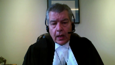
:::

Yes, that was the view that was taken by the trial judge.

The majority of the Court of Appeal reviewed that on the correct standard of review, made the determination that the trial judge was in error on that point.

There are 22 references that we have cited to the first interview in the second.

That is not simply averting to the previous interview.

You have the same interview or the same interviewer in the same room less than three weeks apart where the conduct of the same officer is and the approach that was being used is being used the second time.

The confusion that was apparent by Nigel LaFrance on April the 7th was totally discounted by the RCMP.

When he expressed confusion about what he had been told, that is steam-rollered over.

When Nigel LaFrance says, they told me I should have a lawyer sit down with me, the response from the RCMP is, Nigel, you are welcome to have a lawyer at any time.

And then, totally contradicting that, they say, but you have had some advice.

There is no way to reconcile those two statements.

It is obvious at that point that this young man is confused about what is going on.

At that point, the easy thing to do would have been to say, Mr. LaFrance, we are going to stick you back into the telephone room.

Talk to duty counsel again.

There is no way that you are going to have a lawyer sit down with you during the interview with us, but if you need to have a further consultation with duty counsel, here is the telephone.

That would have cleared up the matter.

But the comments about, yes, you can have a lawyer sit with you at any point and then say, but we are not going to let you have a lawyer sit with you, just demonstrates that this young man is a deer in the headlights.

Then, to compound it, with all due respect, the comment that is then made by the RCMP is subject, I would submit, to two different interpretations.

One of them is that the advice is being denigrated.

When the officer says, you know, Nigel, I am not saying it is bad advice, but that may be considered to be denigrating the legal advice he has received to that point.

However, the Court of Appeal did not look at that as being denigrating.

The next part of the phrase is that it is misinterrupted.

That makes no sense in the context of what was being said.

The officer during the voir dire indicated he believes he misspoke.

However, even in the face of a clear, nonsensical point by this young man, he doesn't say anything.

He doesn't object.

He doesn't say, what do you mean?

What does misinterrupted mean?

It's clear that at that point, this young man is exhibiting confusion.

At that point, it is clear that the implementation has not been effective.

He is not asking for a second kick at the cat.

He is asking for clarification and a continuation of the first bit of advice that he received.

The RCMP obviously can see that he is confused at that point.

They do nothing to clear it up.

Their obligation is to provide clear instructions.

How is it a clear instruction to say that you're welcome to have a lawyer at any time, but we're not going to let you have a lawyer, that the advice that you've received is bad advice, but you may have misunderstood, or you may have misinterpreted, or if that is in fact what was meant, or it's misinterrupted, but we're not going to let you go back in and either talk to duty counsel again, or alternately talk to your father, because your sole support system is probably the only person that's going to be able to help you find a lawyer.

Either of those alternatives would have been a very reasonable method by which to clear up this confusion that the RCMP caused.

Now, I would just like to take a moment to deal with the comments that, or the position being raised by the Intervener Ontario Attorney General with respect to their Bright Line Test.

As I read the submissions of the, and here are the submissions of the Ontario Attorney General, I see that as being a step backwards and that what they are proposing does not accord with what this court has adjudicated in Grant and Lee.

I see it being a big step backwards because you're not then looking at things from the perspective of someone in the shoes of the particular person being detained with all of their personal idiosyncrasies.

Subject to any questions, those are my submissions.

**Justice Moldaver** (01:07:21): He was aware.

::: {.column-margin}
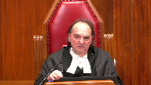
:::

He made findings of fact about your client, your, you know, his degree of sophistication, his knowledge, his, you know, feeling at ease during the thing.

I mean, we just, I keep coming back to this.

It seems to me like the whole exercise here was just a waste of time.

Because based on what you're saying, we should be taking a position that if a young person is charged with murder and he hasn't been involved with the police before, that, and the police come and they tell him things, but, you know, that doesn't mean anything.

He doesn't, they don't resonate.

They don't, he doesn't, you know, he just goes along because he feels compelled.

Then why are we having voir deers?

I just don't understand it.

**Speaker 3** (01:08:10): Justice Moldaver, this court has set out how it wishes the law to be interpreted in Grant and Lee.

::: {.column-margin}
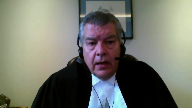
:::

I am not asking for anything different.

I am saying based on the principles this court has set out that this young man, irrespective of the findings of the voir dire justice that he disbelieved Nigel LaFrance, it is not determinative because he used the wrong test.

**Justice Wagner** (01:08:52): All right.

Thank you very much, Mr. Radario.

**Speaker 4** (01:08:58): Thank you.

::: {.column-margin}
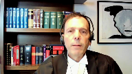
:::

I hope you could hear me.

I want to address two issues today for Canadian Civil Liberties and the first is how we got to where we are with respect to 10b on the Sinclair issue and the second is a possible solution by either renovating or overruling Sinclair.

So I'll start with the first which is the belief that the court needs to limit the right to counsel because a cynical or manipulative defendant could use the right to counsel to frustrate a police investigation and in my submission it's a red herring and it's a red herring that's holding back a full-throated purposive construction of section 10b.

The belief which I've just stated is not cogent for five reasons.

First of all the defendant can already delay under existing law the defendant can already delay or impede an investigation by exercising his right to counsel, calling his or her lawyer and talking to the lawyer for three hours.

There's currently no time limit in the law so creating an arbitrary a priority rule that you can't have a second call doesn't really change the the mix.

Second in the case of time-sensitive investigations the law in Canada already allows the police to put limits on the call with counsel.

The law of impaired driving is one such example and if the defendant refuses to cooperate when the law requires he can be charged with a separate criminal offense.

The law of obstruct police also imposes a limit on how the defendant can behave.

Third while the majority in Sinclair was worried about the possibility of a defendant stymieing the police investigation it didn't take into account in that analysis that the defendant has no obligation to help the state prosecute him he just has the right to silence.

So if you look at it from that point of view if you reframe the issue the consideration about interfering with a police investigation just falls away.

Fourth the objection to a full and purposive expression of section 10b is not cogent because the only person in the room of rights is the defendant.

The police have no rights they only have opportunity and investigative goals and that's important as a matter of constitutional interpretation.

And fifth and finally in paragraph 42 of Sinclair and this came up today the majority says well the detainee can insist on the lawyer coming in as a condition for talking but we're not going to mandate that.

Now I've tried that a hundred times the police never agree to that they like to keep the person isolated fair enough that's a good police goal but the flip side is this court where civil liberties are protected they ought to be protected with vigor and not with a helping hand to the police who already have enough advantages in the precinct house.

So that's my submission about the red herring that's holding back the court from a full and purposive interpretation of 10b.

The solution the solution to the dispute between the respondent and the appellant about whether this fit into one of the Sinclair categories for renewed access is really to scrap or renovate the categories and I'll explain that submission as follows.

The Sinclair majority was worried as I mentioned that the defendant could use his right to counsel to interfere with a police investigation so it created a limited right to counsel which more or less ends with that first information delivery and then there's those categories for change and change in circumstances and now the respondent and the appellant are at their third level of court fighting about whether Mr. LaFrance can be shoehorned into a category into one of the categories but on a purposive reading of of 10b the defendant who asked to get access to their counsel on request and and if you agree with that submission you're not doing anything radical

but you're putting Canadian criminal procedure as we point out in our factum in step with the rest of the common law world not out of step where we now sit.

The majority inserted what it viewed as a reasonable limit on the constitutional right

but it's not a it's not a legal right where there's a section one balancing and if you don't want to overrule Sinclair it means the residual category in Sinclair should be interpreted generously to allowed renewed access there shouldn't be a presumption against renewed access and finally I see my time is up if you accept that the purpose of 10b is about meaningful access to address the power imbalance in a custodial interview then the exercise of the right to counsel can't be an a priori one-time access because access is not meaningful unless it addresses the power imbalance and that's fact specific in each case a priori rules and categories are by definition not fact specific.

Thank you very much.

**Justice Wagner** (01:14:35): Anil Kapoor.

**Speaker 5** (01:14:37): Thank you Justices.

::: {.column-margin}

:::

I want to focus my submission about on the topic of an informed waiver of the right to silence and this gets back to some of the questions that were asked earlier about what's the information that Council must deliver?

How robust must the right to Council be?

That was discussed in the previous appeal but I want to focus on if the waiver is uninformed, what to do?

What to do in that circumstance?

And so to take the most extreme example it is quite possible that a detainee would not get adequate information and the police won't know.

And the police will ask this person questions and the person will answer the questions.

But the person hasn't told the police their solicitor client information.

The police can't ask about it.

So how does it get triaged?

We have in fact an uninformed waiver.

How does it get triaged?

And how does that comport with our understanding of state action or state nexus?

And my respectful submission is, and we know this from older cases like dolphin delivery, BCGEU versus British Columbia, that we're not talking about state causal action.

We talk about a state connection, a state nexus.

And in my respectful submission it will be triaged on a voir dire where the accused gets up and says I was not informed.

The accused may have to implicate his counsel and waive privilege to accomplish that if he so instructs his then counsel.

But the point of it is that the nexus exists when the prosecutor and the police seek to rely upon a statement.

The accused puts it in play and the apparatus of the state is engaged to triage whether or not section 7 has been respected.

Namely, is it an informed waiver?

The voluntariness side, oppression, et cetera, all of that is another analysis.

But the precondition or an essential condition is an informed waiver.

And in my respectful submission, this case and the preceding case allow this court the opportunity to draw the connection between a robust right to counsel and how it is, as I said earlier, in service of the right to silence so that we can understand that an accused or detained person's decision is informed and in those rare circumstances when it's not, it can be trialed.

**Justice Rowe** (01:17:28): Isn't all of this leading, inevitably, if we follow down your pathway, to having the lawyer sitting next to the person who's being interviewed?

**Speaker 5** (01:17:39): No, Justice Roe, that is not the submission on behalf of my client.

I am talking about the— No, that is not the—

**Justice Rowe** (01:17:45): not the only way to fulfill the requirement that you've sent out to do what I have said.

::: {.column-margin}
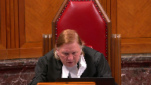
:::

You're not saying give us that, but the only way to get there, it seems to me, is to have the lawyer sitting next to him, which is, of course, what really is the hidden agenda here.

**Speaker 5** (01:18:07): uh well certainly it's not my hidden agenda but the the point i want to make is that is not the only way and indeed it's inconsistent with this court's jurisprudence you can accomplish what i urge by virtue of the initial advice the initial session where council advises the detainee that can be by phone you can accomplish it all by phone you can accomplish it in those rare circumstances where the person's vulnerable and you need to attend the station to give that advice

::: {.column-margin}
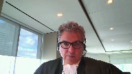
:::

but once it's concluded council has no role to sit in the room following this court's jurisprudence what this court has left open in saint claire is how and what will you learn as a detainee and then of course it follows if it's an uninformed waiver how will that get triaged down the line and for the reasons i've submitted or submissions i've made there is a state connection and nexus

but i don't accept respectfully that it must be or inexorably leads to council sitting in the interrogation respectfully that does not follow in my respectful submission those are the submissions i have for you today thank you so much thank you very much you've got any questions

**Justice Wagner** (01:19:26): Thank you.

Any reply?

**Speaker 1** (01:19:32): If I may, excuse me, briefly make a couple of three points in reply, one to my friends submissions and one in specifically to the submissions of the respondent or pardon me, the intervener.

::: {.column-margin}
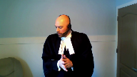
:::

Civil liberties.

And I'll start with that one, if I may, in those brief submissions, it was put forth that the residual category should be broadly interpreted, the residual category in Sinclair, of course, we broadly interpreted.

We know that from prior rulings of this court that you don't always get the broadest interpretation.

We also know that the broader interpretations can overshoot the right.

But more specifically, when we consider the structure of Sinclair as a judgment, you have the majority saying

**Overlapping speakers** (01:20:18): We

**Speaker 1** (01:20:19): start with a presumption of properly informed and these are the ways you may have to have a second consultation as compared to a very explicit dissent clearly rejected.

::: {.column-margin}
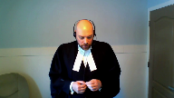
:::

And I point that out because if we are going to interpret the open category of Sinclair broadly we must be careful not to interpret it as Justice Binney's dissent.

If the intent of the majority was to have the open category essentially be Justice Binney's dissent they would have said so.

As to my friend for the respondent a couple of points.

First in his submissions he suggested in particular that the police among other things took a tactical position within the vehicle that is directly contrary to the evidence.

One Sergeant Zasilek said he believed Eros was in the backseat Zasilek was driving.

Sergeant Eros said by memory I was in the front seat and on page 128 of my condensed book materials the respondent himself confirms that he was in the rear and Corporal Eros now Sergeant Eros answer was in the front passenger seat.

And nothing much it's not the greatest thing

but it is an example respectfully of how the record is being interpreted in a particular way.

My friend also suggested of course that when we are dealing with Grant and this is a point Justice Brown raised we have to consider the reasonable steps or the reasonable person test from a person in his shoes.

Is that the test that Justice Ackerel applied?

I beg your pardon?

Is that the test that Justice Ackerel applied? In my

**Justice Brown** (01:22:06): view, yes it is.

Well in my reading it's not.

He cited the test in Singh and said the test is objective although with an eye to characteristics of the accused.

Is that the same thing?

**Speaker 1** (01:22:19): I would suggest, it's not worded in exactly the same way as you worded it in Lee, of course, sir, but I would suggest when you read his evidence or his decision as a whole, when he is incorporating the specifics, applying the objective test, but incorporating the specifics of that one offender, I would say yes, he is applying that test.

::: {.column-margin}
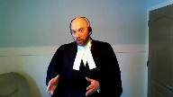
:::

**Justice Moldaver** (01:22:39): I just want to ask you one question.

The majority in the Court of Appeal says the only reasonable inference, objectively speaking, is that the appellant must have thought he was required to cooperate.

I'm talking about the detention matter.

**Overlapping speakers** (01:22:55): Yes, sir.

**Justice Moldaver** (01:22:55): legally detained, and it's been suggested here that the trial judge did not apply the right test.

::: {.column-margin}
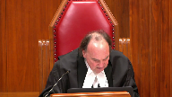
:::

But I want to ask your opinion, paragraph 73 of the trial judge's reasons, and he's dealing now with the whole issue of psychological detention.

He says, a person may feel compelled to cooperate because of an imbalance of power or authority or due to confusion.

However, the record simply does not support this as a basis for why La France, on an objective basis, would have felt he had no choice but to cooperate with the RCMP investigators, and then he goes through a whole series of things.

It seems to me that he has looked at this from an objective point of view, and the Court of Appeal majority just disagrees with his analysis.

And his analysis looks objectively at it and looks at the evidence before him and says, I'm not satisfied that on an objective basis a reasonable person would have felt compelled or that Mr. La France would have felt compelled.

So I don't know, what do you say about paragraph 73?

**Speaker 1** (01:24:11): Sir, I concur completely with your interpretation of it, which was in part and parcel as I was trying to convey to your colleague Justice Brown.

::: {.column-margin}
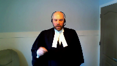
:::

When we read the decision as a whole, he's aware it's an objective test that isn't to be focused on the subjective intent of the police or the accused, but he's clearly applying the factors in this case and those factors that are particular to Mr. LaFrance to determine he was not detained.

And I give this answer knowing full well, of course, that the standard of view on a question of law does allow the appellate court to at the end of the day disagree.

But I would submit that the trial judge applied the correct test here.

I just want to finish up my point, if I may, about in his shoes, that sort of thing.

And I don't want to get too far into this, but I ran out of time on the facts.

We are, of course, dealing with a young man to be certain, but a young man who knew enough to lure a specific victim because he knew he could and he knew the victim would have money.

He knew enough to arm himself.

He knew enough to take fake money to perpetrate the fraud of the drug deal.

He killed a man who was larger than himself, disposed of the evidence, and then had post-event conduct of trying to get a material witness to change something she had said to police.

This is the young man we're dealing with here today.

So let us not be, I respectfully submit, swayed by his otherwise sympathetic characteristics.

And the final point I would like to make is my friend pointed out on the Sinclair matter that if there was some confusion, that it would have been the easy thing to do to put him back in the phone room and talk to a lawyer to clear up that confusion.

Two points.

One, that's not the test of what would be easier.

We always or often see arguments about wouldn't have been easier just to give me his 10B rights and that wouldn't have been easier.

No, the question is whether it was required.

And I submit it's not required.

And then of course the confusion seems to be what would the confusion be in this case and how would it affect, frankly, when you get to 24-2, the confusion would be no, you don't have a right to a lawyer in the room, but he already knew his right to silence.

And that's why I say that's the predominant consideration.

That's all I have to say in reply.

Thank you.

Thank you very much.

**Justice Wagner** (01:26:23): I'd like to thank all the Council for their submissions, but the Court will take the case under advisement.

Thank you very much.