---
title: Alan Teck Meng Lai v. Her Majesty the Queen
published-title: Heard
date: 2021-12-08
sidebar: false
---

This transcript was made with automated artificial intelligence models and its accuracy has not been verified. Review the original webcast [here](https://scc-csc.ca/case-dossier/info/webcast-webdiffusion-eng.aspx?cas=['39577']).
---

**Justice Martin** (00:00:04): Le court de la cour!

**Justice Wagner** (00:00:28): Good morning, please be seated.

::: {.column-margin}
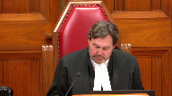
:::

In the case of Alan Teck Meng Lei against Her Majesty the Queen, for the appellant Alan Teck Meng Lei, Eric Persky, Michael Sopkin, for the respondent, Her Majesty the Queen, Lauren A. Chu, and Leslie A. Rosica, QC.

Please note that there is a publication ban in this file pursuant to section 486.42 of the Criminal Code.

Mr. Persky.

**Speaker 1** (00:01:03): Thank you Chief Justice.

::: {.column-margin}

:::

This appeal should be allowed for the reasons of Justice Butler dissenting in the court below in his finding that the trial judge erred in his transitional analysis specifically in how he dealt with the extent of the Moran delay in this case.

The Crown is incorrect in my submission on its primary submission that the unanimous court of appeal erred in finding that the re-election was a discrete was not a discrete exceptional circumstance.

In my submission the re-election was not a discrete exceptional circumstance.

I will first address the effect of the defense re-election and how that ought to be considered under the Jordan and Moran regimes and I will next address the errors that Justice Butler identified in the trial judge's transitional analysis and why the delay here was not in accordance with the Moran guidelines.

So to my first point then on the effect of the defense re-election in my submission the trial judge was wrong to find that the defense re-election was an exceptional circumstance.

The court of appeal was right to find that that given this was not an exceptional circumstance the total period of delay was 43 months.

Now I wanted to begin on this point with the trial judge's findings as to why the defense re-election in this case was an exceptional circumstance and that's at paragraph 190 of the trial judge's reasons which is in the volume one of the appellant's record.

Page 50 page 50 paragraph 190 at the bottom of that page 50 the trial judge is addressing the the effect of the defense re-election in September 30 2015 and he says leaving aside illegitimate defense conduct in relation to a re-election so it's separate and apart from defense delay the trial judge goes on to say at the latter part of that paragraph which is the important part of my submission the last three lines his finding I think that a re-election that causes the loss of a scheduled trial date is a discrete exceptional circumstance that must lead to the deduction of the time between then and when the trial is rescheduled.

So that is a matter of principle that the trial judge has laid down in this case and that was the principle that he applied that was the principle that the court of appeal said was wrong in law.

The effect of a re-election in my submission cannot be an exceptional circumstance for the reasons uh outlined by the court of appeal in particular because the effect of that re-election caused the ceiling to be increased by 12 months.

The Jordan ceilings that is 18 and 30 months are more than up to the task of accommodating re-elections made within the statutory timelines in the code.

So in this case it was two weeks defense re-elected six weeks before and so now the code provides that the re-election ought to be made as of right 60 days in advance of the appointed provincial court trial date.

So it's my submission that one Jordan ceilings are long enough to accommodate re-elections made within the statutory timelines.

There is no delay because the ceiling is increased by 12 months and of course the ceilings the Jordan ceilings are not aspirational targets.

Most cases as this court said can and should be dealt with and completed within the ceilings.

So ultimately in my submission the court of appeal is right in finding at paragraph 103 I don't need to take the court there but that's where Justice Wilcox for the unanimous court found that even if a re-election occurs on the latest possible time so now two months before the appointed trial provincial court trial date it is not an unrealistic expectation that the trial will complete within uh within 14 months.

**Justice Kasirer** (00:05:39): Mr. Pertsky, can I just ask you, you took us to 190, I'm wondering what importance you attribute to the first sentence in paragraph 191 where the trial judge says without challenging the general assertion that Mr. Lai was eager to get to trial, this particular strategic move was at least in the short term inconsistent with that desire.

::: {.column-margin}

:::

What importance do you attribute to that comment of the judge?

**Speaker 1** (00:06:15): Well, in my submission, if the trial judge was not finding, he was explicit in his reason he wasn't finding defensively.

::: {.column-margin}

:::

So that's the first point.

But in relation to that one passage of the particular strategic move, it's important to look that in the context of that comment in the context of what's at paragraph, the following paragraph at paragraph 192.

And the context here is that Mr. Lai's defense council at the time submitted to the trial judge.

Well, he was provided with a disclosure package called version five on September 24, six days before his re-election.

The trial judge did not challenge the defense council's position, which was a bunch of this disclosure was new.

And so at that point, defense says, well, that's why I re-elected because I had been given new disclosure where now six weeks out of the trial judge, I exercised my right of re-election.

And so the trial judge's comment for some sort of unexplained strategic reason.

Well, first, my position is one, defense council didn't have to explain himself.

And two, the position, the reason that defense council gave for re-electing was reasonable in the circumstances.

So he says at paragraph 192, the evidence was provided by Mr. Lai.

**Justice Moldaver** (00:07:39): is that your view or is that the trial judge's view?

The trial judge rejects that.

He says that wasn't a valid basis for, you know, sort of furthering the defense position in the trial.

**Speaker 1** (00:07:54): Well, if we look at what the Paroljo says at Paragraph 192 in my submission, it's not sustainable.

::: {.column-margin}
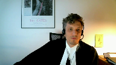
:::

So he says, I'm not satisfied that the absence of re-election was compelled by the state of disclosure.

In the next sentence he says, there is an absence of contemporaneous communication suggesting that this was the situation and the more logical response if that had been a pressing problem, an application for disclosure or to adjourn the provincial court trial were not attempted.

And so in this case, defense counsel's position was, I received this disclosure six days in advance.

I made my decision to re-elect at that point when I received that.

So in my submission, there wouldn't be any contemporaneous communication at that point.

It was a decision made six days before the re-election.

And in terms of what the trial judge has said is the more logical response.

In my submission, an application for disclosure at that point when you received late disclosure is not a remedy because you already have the disclosure at that point.

It's just late and new.

So an application for disclosure isn't going to help you.

And the application to adjourn the provincial court trial, well, in my submission, that would have been far more consequent in terms of delay because at this stage of the case, we're already, this case is already significantly long in the tooth.

It's a significant 11b problem at that point.

If defense counsel had applied to adjourn the trial in light of new disclosure, likely the trial would have been adjourned and it would have been more of a delay problem at that point and a potential 11b issue.

So in that sense, in my submission, not only was it a reasonable decision, it was the sort of least intrusive types of decisions that could be made in the circumstances.

And again, this is all in the context of a defense counsel making full answer in defense and exercising a statutory right, which is under the code.

Inaudible.

**Speaker 1** (00:10:01): Yes you do because it's not an exceptional circumstance either way.

::: {.column-margin}
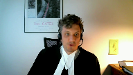
:::

A re-election made as of right is just not an exceptional circumstance in my submission.

But it's true that trial judge has done it in absolutist terms but in my submission the difficulty is that as the court of appeal found the Jordan framework is more than sufficient to accommodate re-elections.

And now that sort of brings me to the point the point here which the crown repeatedly talks about which is this context of late re-elections.

It's not late in my submission if it's made within the timeline specified in the code.

**Justice Moldaver** (00:10:39): moment before you go on the crown when he learned that that your client wanted or the defense was thinking of reelecting said please do this quickly please do it quickly we've got dates in the Supreme Court that we can that are available we can get this done we don't have to we can just switch the dates in the Provincial Court and get this done was there a reply in writing to the crown to say no I'm waiting I want to see if there's more things develop in terms of disclosure did that was there any response at all to the crown doing what it could do to move this case along in accordance with the dates that have been set in the Provincial Court

::: {.column-margin}
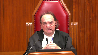
:::

**Overlapping speakers** (00:11:28): I don't think there, to my knowledge, there was no written reply to that.

Okay, so it doesn't...

**Justice Moldaver** (00:11:33): The defence doesn't even respond, as I understand it then, to this request until it's way too late.

::: {.column-margin}
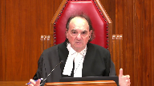
:::

They've already lost the Supreme Court dates, and then it's something that happens 10 days before, or whatever.

All of a sudden, out of the blue, it must have been more than 10 days, because the re-election occurred when, in September?

September 30, 2005.

September 30.

The trial was set for what, December? November.

What, November?

Early November.

It was six weeks before the trial date.

Six weeks before the trial date.

**Speaker 1** (00:12:07): Yeah.

::: {.column-margin}

:::

So in my submission, that doesn't matter because that was in the context there was the co-accused law was contemplating a reelection.

That's nothing to do with the appellant here.

But more importantly, the right to reelection is not contingent on when another date would be available.

So in February 2015, that's when you should have reelected.

My position is, if there's a statutory timeframe and there's a filing period, you gotta do your, you can reelect as of right within this period.

That's what's determinative in this case.

And in this case, even then we're way before the statutory period.

So it's not contingent on a particular moment when you can get Supreme Court trial dates at another occasion at the same time.

**Justice Moldaver** (00:12:55): This is an 11B situation, where you're complaining that there are delays here that entitled your client to a stay.

::: {.column-margin}
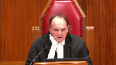
:::

The Crown comes to him and says, you're planning to reallact, great, but do it quickly because we can get the dates.

If you're really interested in moving this thing forward, do it quickly.

He doesn't hear from him until, what, you said six weeks before the trial is set.

And then the excuse he gives is one that the trial judge doesn't buy.

So let's keep the facts straight.

Unless you're saying that that was a palpable and overriding error on the trial judge, you're reconstructing this case.

**Speaker 1** (00:13:36): Well, no, I am saying that it was an error on the part of the trial judge to reject that, to reject that rationale put forward by the, by the, by the, by defense counsel at paragraph 192.

::: {.column-margin}

:::

That is my position I say that is wrong for the reasons that he's identified.

And we're well before the statutory period in this case.

And again, that the disclosure here on the facts of this case, defense counsel says was motivated by the new disclosure and it's a completely reasonable position in my, in my submission to say, Listen, I'm getting all this new disclosure.

This case isn't ready to go.

This case looks differently than I had than I had previously contemplated.

I'm exercising my as of right, right of reelection in this case

and so it's not contingent on a particular moment in February 2015.

When, oh, there's, there's, there's a Superior Court trial dates available.

So, in my submission, the ability to make.

And again, this is a statutory right it's a

it's an important right to make full answer and defense the right of reelection.

And in my submission to Jordan ceilings, and in particular the 12 month increase in the ceiling is more than sufficient to allow for reelections made within the statutory time range so keeping in mind, if you're over this if you're within the statutory timeframe so after 60 days, you need the consent of the prosecutor at that point to reelect, and the crown can reasonably say, Listen, I'm not going to consent to this, or I'm going to put a condition that you waive the the resulting delay.

And that happens all the time.

Thank you.

**Justice Martin** (00:15:16): In theory, in terms of the right of re-election that you're establishing, yes, the statutory right, can a trial judge on the kind of delay motion go behind the reasons for delay and do an assessment to assess whether or not it is attributable to defence delay?

::: {.column-margin}

:::

And if so, on what basis could that be attributed to the defence that's consistent with your view of a right to re-elect?

**Speaker 1** (00:15:45): Now, the Court of Appeal does accept that there could be some instances where it would be defence delay.

::: {.column-margin}
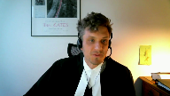
:::

And I've tried to think of some of those instances, and I can't think, I'll give them right now.

But keeping in mind, it is a statutory right, it is so fundamental.

But if there is evidence suggesting that Defence Council, as the Court of Appeal, found that this was part of a lengthy pattern of delay of illegitimate conduct, and there was evidence that Defence had no intention of proceeding with those Provincial Court trial dates.

It was just, they just set it up, and there was, but there's evidence to that effect.

A trial judge can then make that factual determination, bearing in mind the right, the statutory right, bearing in mind what this Court has said about not second-guessing defence decisions in terms of how to make full answer in defence, and bearing in mind all those circumstances, and factor in how much to apportion defence delay, and then accordingly do deductions on that basis.

So it is possible, and if it's part of a sustained pattern, but again, those factual findings have to be made.

Those factual findings were not made by the trial judge in this case, and nor could they be.

**Justice Moldaver** (00:17:00): Bearing in mind that if he really wanted to get to trial quickly, your client is saying, bearing in mind that if he had gone for the re-election earlier, taken the Supreme Court trial dates, none of that would have changed anything in terms of the disclosure.

::: {.column-margin}
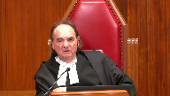
:::

And so you're using something that happens months and months later to say, to give your client an out, shall we say.

Had he gone along with what the Crown suggested, what's the harm at that point?

If he really wants to get this case on and he wants to re-elect, what's the harm?

He says, oh, disclosure was a problem.

You say, well, that doesn't arise until well after that.

And the trial judge makes a call.

It just seems to me that, you know, there was no hurry on your client's part at all to make this re-election, and it was being used in a way to hinder the process of the trial as opposed to get it on as quickly as you could.

**Speaker 1** (00:18:09): And I disagree, in my submission, defense had a right to re-elect in this case, and it was made in the context in which it was made.

::: {.column-margin}

:::

And he has a fundamental right to make his mode of election, whether it's provincial court trial, and he makes a call, the defense council makes a call in accordance with the statutory timeline set out in the code.

And keeping in mind that Cody says, this court in Cody has said, that defense delay, the legitimacy of defense conduct is judged in part by compliance with notice and filing requirements.

And so this is not a secret.

The right of re-election is not a secret, it's in the code.

And the court, the crown has ability to do a whole bunch of things in response, in particular, filing a direct indictment, which actually happened in the circumstances of this case.

So in my submission there, it's wrong to speak of this being an exceptional circumstance, it's not defense delay.

Now, the second point I wanted to raise is the trial judge's assessment, in this case, that we were actually in the pre-Jordan period, this is in a Moran period.

And in terms of the errors that Justice Butler identified correctly in my submission was the trial judge's finding that at paragraph 232 of the trial judge's reasons, that's at page 60 of the record.

So at the bottom of page 60, the trial judge says, while the re-election, and he's doing a good job of doing that, he's not doing a good job of finding the error.

So he's not doing a good job of finding the error.

While the re-election, and he's dealing with his Moran analysis, because it's a transitional case.

While the re-election certainly had the potential of being attributed as defense delay at that time, I would think it more likely that had, I would think it more likely have been regarded by the parties as treated as a neutral factor in the process or as part of the inherent time requirements of the case.

Regardless of its precise characterization, it would have been seen as separate from institutional delay.

So what we're talking about here is the 16 months between the defense re-election and September 23rd, September 2015 to January 2017, a total period of 16 months.

The trial judge says, well, that's all, that's all neutral inherent time.

And Justice Butler correctly finds, well, that doesn't square with what the trial judge has found at paragraph 240.

So the next page over at page 62, the trial judge finds, you know, he's balancing all the factors and now four lines up from the bottom of that paragraph, he said, the case proceeded, it proceeded with reasonable efficiency despite the prevailing amount of institutional delay in each court and the defense decision to re-elect.

So it amount of institutional delay in each court.

So there he's, we're talking about his moron analysis and the pre-Jordan period, institutional delay in both courts.

And so as Justice Butler found, well, he found at the previous paragraph 232, that it's all neutral and inherent time, all that 16 months, yet at the same time, giving due deference to his finding a fact that there was institutional delay, doesn't square with his finding to write the whole period off as neutral time.

Clearly some of that time had to be institutional delay.

And Justice Butler correctly held that, that in the circumstance of this case on a conservative estimate would be eight to 10 months.

And so using then the moron standards and applying them to the circumstances of this case as Justice Butler does, he arrives at, well, we're really at a period of eight to 10 months into institutional delay.

And so that sort of feeds into my sort of final part of my submission in terms of the other errors the trial judge committed in this case.

And that is, so if we have eight to 10 months of institutional delay, the trial judge found four to five months of crown delay at the outset of the case.

And he further found an 11 months of institutional delay in the second period of the case, resulting in Justice Butler correctly held 23 to 26 months of delay in this case.

So in terms of the trial judge's underlying factual findings, which Justice Butler gave deference, is only the legal conclusion that he disagreed with, was at paragraph 227 of his reasons.

So that's at page 59 of his reasons, 59 of the record, paragraph 227, rather.

He finds, this is not to excuse in any way the completely unsatisfactory pace at which crown disclosure proceeded.

And then further at paragraph, paragraph 228 on the next page, the last sentence, he says, perhaps four or five months of the 10 months of the total pretrial arraignment period would have expected to attribute to the crown for this reason.

So finding a fact, he attributes four to five months of delay due to a completely unsatisfactory disclosure process.

And we couple that with his finding at paragraph 231 as institutional delay.

So that's paragraph 231 at page 60, as institutional delay, 11 months to the first offer trial date when added to the excessive intake period.

So we're at a significant period of time now, we're at 15 to 16 months.

And what Justice Butler takes issue with is his finding from that, that clearly created a situation in which the case would have already been seen by the parties under the Moran guidelines to be at risk of a section 11B problem in the near future.

As Justice Butler correctly found, that's an understatement.

We're only in provincial court at this point, the Moran guideline is eight to 10, and it's an extra six to eight, so at 14 to 16 months, we're well above the Moran guideline for provincial court, and we're on the upper end of the superior court guideline at that point.

So in my submission, Justice Butler correctly gave deference to those underlying findings.

It was only the legal conclusion that he drew at paragraph 232.

Sorry, sorry, that's at paragraph 240 at page 62.

The last sentence of paragraph 240, page 62, the last sentence being, I think the parties were quite unlikely to have contemplated the possibility of a section 11B application being made in relation to it during the significant pre-Jordan period that it encompassed.

So that's the legal conclusion, unlikely to have contemplated the possibility.

As Justice Butler found, we're way over the Moran guidelines.

And of course, that's not the end of the story.

We're way over the Moran guidelines, and of course, that's not the end of the analysis.

Of course, the extent of the Moran delay is relevant, and my submission is a significant weighing factor in the exercise.

So if we're well over the Moran guidelines in this case, we're significantly on our way to a stay, but that's not it.

The trial judge found actual prejudice.

Justice Butler gone further and said he should have found inferred prejudice, but even finding some degree of actual prejudice.

He says nothing about the trial judge's further error in finding at paragraph 239, that's above the 240 where he reads his legal conclusions.

And this is in terms of the seriousness of the offense.

He says, while stays of proceedings for delay in sexual assault cases of this notable degree of serious were not unknown under Moran, I think the parties would have reasonably expected to be a rare occurrence, unlikely to arise in the absence of really appalling delay, a really appalling delay period, or some combination of significant crown negligence or blatant disregard for the usual urgency that attached to serious prosecutions.

And my submission, that is just plain wrong that this court and other courts of appeal have found that is not sexual assaults cases are justified where the circumstances warranted, weighing the circumstances and the seriousness of the offense.

That's what justice Butler did in this case correctly.

I say what courts have done in finding in staying sexual assault cases for less delay in this case.

And in my submission, that's a further error, which justified justice Butler in conducting a fresh analysis of this case and finding that the delay could not be justified under the previous regime and keeping in mind that this ultimately as a transitional case, it wouldn't be regarded by the, it was significantly offside of Moran.

And we're talking about 43 months of delay in this case.

So in my submission, the appeal should be allowed for the reasons given by justice Butler.

Thank you very much for your questions.

**Justice Wagner** (00:27:25): Those are my submissions.

Thank you.

Lauren Chu.

**Speaker 2** (00:27:39): Chief Justice, justices, the appellant argues that his trial took too long to complete and that the lower courts erred in dismissing his delay application in the context of his choice to delay commencement of his trial by over 14 months by re-electing from Provincial Court to Supreme Court and the explanation that he gave for the late timing of his re-election given it occurred 15 months after his original trial dates were scheduled was rejected by the trial judge.

::: {.column-margin}

:::

In light of the 12-month increase to the Jordan ceiling for two-stage proceedings, the BC Court of Appeal concluded that the trial judge erred in deducting 12 months of the delay occasioned by the appellant's untimely re-election because the Jordan framework can quote accommodate unquote late re-elections.

For the same reason, the appellant suggests that his late re-election did not actually cause any delay to his proceeding.

With respect, the appellant's position and the Court of Appeal's analysis on this issue represent a fundamental misapprehension of this Court's purpose in creating the presumptive ceilings and in fact does the very opposite of what this Court intended by treating the ceilings as aspirational targets and rewarding complacency rather than encouraging proactivity.

At paragraph 139 of Jordan, this Court observed that all Courts, including this one, must be mindful of the impact of their decisions on the conduct of trials and for this reason, the respondent urges the Court not only to uphold the majority's dismissal of the appellant's appeal but to clarify the application of the Jordan framework to inefficient, unexplained, untimely delay-causing defense re-elections.

I'm going to begin by addressing the concept of...

**Justice Brown** (00:29:28): We already, haven't we already done that effectively in Cody when we say the decision to take a step as well as the manner in which it's conducted may attract scrutiny.

Is that insufficient?

**Speaker 2** (00:29:42): I believe that in my submission, the notwithstanding this court's comments that legitimacy has a specific meaning within the Jordan framework, the lower courts in particular courts in BC have struggled with applying this to the Jordan, this aspect of the Jordan framework in particular with using the term illegitimate when considering defense re-elections as a right.

::: {.column-margin}

:::

And so for this reason, the respondent has referred to the appellant's re-election as untimely.

The respondent also observes that perhaps the analysis applied when the court considers delay caused by defense unavailability when the court and crown are ready to proceed but the defense is not may be helpful in assessing delay caused by defense re-elections.

For example, if the accused retains new counsel shortly before trial and the new counsel is not available on the current scheduled trial dates, it's clear that the ensuing delay for the trial until it's rescheduled would be attributable to the accused and it's not necessary to make a corresponding finding that the retention of new counsel was illegitimate to make that deduction.

And so perhaps alternatively, this is a similar situation where the crown and court are ready to proceed, but the defense is not.

The respondent also wishes to address the notion of timeliness in the context of a defense re-election as a right.

The appellant takes issue with this characterization that his re-election was untimely.

Given it occurred, it was exercised as a right more than 14 days as was then required before the first scheduled day of his provincial court trial.

Now timeliness in this context is relative to the Jordan principles, namely the duty on all litigants to be proactive in moving cases forward and to eliminate inefficient delay causing practices.

Furthermore, what is at issue here is the timeliness of the appellant's conduct in the context of his proceeding.

Six weeks of court time were tied up for the 15 months that elapsed between the arraignment and his re-election.

And the appellant was completely silent in response to the crown's proactive advice in February of 2015, that the same trial days could be secured in Supreme Court if a re-election was made soon.

He inexplicably waited for eight more months before exercising his right to re-elect.

And then his counsel wasn't available for the first trial dates offered by the court in September of 2016.

And the trial couldn't be scheduled until January of 2017, four months later.

Further to paragraph 32 of COTI, the appellant's compliance with the criminal code notice requirements is just one of many factors that may be considered in scrutinizing the manner in which defense action is conducted for the purpose of ascertaining defense delay.

And lastly, the untimeliness of the appellant's re-election flows from the absence of an explanation for that late timing.

In some circumstances, a re-election made even four days before a scheduled trial might be reasonable, as occurred, for example, in Gauden, as a result of a late crown disclosure.

The analysis of what is or is not timely in the context of the Jordan framework is highly contextual and may look different from case to case, depending on all the circumstances.

**Justice Moldaver** (00:33:02): It seems to me, just like your opinion on this, that the defence is using that part of Jordan that it likes and ignoring the parts of Jordan that say, for example, that both sides must be very proactive, trying to move the thing along, raising concerns at the first available opportunity, etc.

::: {.column-margin}

:::

And it seems to me that if, in fact, the re-election itself, which is obviously provided for by the code and would normally be perfectly proper, is effectively used to delay the trial and not just delay it, but delay it for over a year, because once you miss that Supreme Court date, they offer you an earlier date, council wasn't ready, so you end up going into September, I think, or sometime in 17, I'm not sure exactly when, I think it was March 17, was it?

**Overlapping speakers** (00:34:07): sorry go ahead January 2017

**Justice Moldaver** (00:34:10): December 2017.

::: {.column-margin}
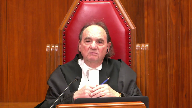
:::

So we lose a year, and as you say, the courts are tied up during this period of time.

The time in the provincial court was tied up unnecessarily.

How does this kind of comport with those aspects of Jordan that say that the defense seemed to be ignoring, i.e. you gotta move things along.

And the defense in this case said, well, we had an excuse for not doing it, but the excuse isn't accepted by the judge.

So if you don't get up to the 30-month ceiling at all in Jordan, if you're under it, you don't even get into a transitional exercise.

But the defense takes the position, you know, that it went way over Jordan, the delay here.

They want the best of Jordan.

They don't want to comply with what Jordan says they're supposed to do.

You see what I'm saying?

I mean, they want to take the benefits without the other aspects of Jordan that says everybody's gotta be proactive.

**Speaker 2** (00:35:27): Yes, Justice Moldaver, in the Respondent's submission, the late re-election reflects complacent behavior.

::: {.column-margin}

:::

So not just the absence of proactive conduct, but actually complacent conduct, which was, of course, the exact issue that Jordan sought to redress.

And in my submission, in Cody, in setting out that it's not just the fact of the procedural step, but the manner in which it is exercised that bears scrutiny.

And that's something that the appellant does not address.

And in my submission, neither did the trial judge nor the Court of Appeal.

And in particular, where the conduct exhibits market inefficiency or market indifference to delay, then in those circumstances, it is properly characterized as defense conduct or defense delay.

Now, in the Respondent's submission, the Court of Appeal erred by concluding that the trial judge expressly found the appellant's untimely re-election was not defense delay.

The Respondent says there was no such finding by the trial judge, nor is there any analysis or reasons for this Court to pay deference to.

In particular, there's no application, as I've said, of this Court's comments at paragraphs 32 to 34 of Cody, where it clarified that defense delay under the Jordan framework includes inaction that causes delay and conduct that exhibits market inefficiency or market indifference to delay.

Now, the trial judge's references to defense delay in the analysis section of his reasons are limited to noting at paragraph 188 that the fact of the re-election in itself is a legitimate procedural step available to an accused.

And then at paragraph 190, in the context of setting out his finding that the re-election constituted an exceptional circumstance, he says only leaving aside illegitimate defense conduct in relation to a re-election.

Now, there are two possibilities here.

Either those very brief and indirect references to defense delay constitute the trial judge's entire analysis and conclusion on this critical issue, or the Respondent says the trial judge bypassed consideration of defense delay and proceeded straight to consideration of exceptional circumstances.

Particularly so, given the trial judge expressly rejected the defense explanation for the late timing of the defense re-election, which went to the heart of the issue in this case, was that delay solely and directly caused by the defense and did the manner in which the appellant exercised his right to re-elect exhibit market indifference to delay or market inefficiency?

Now, the Respondent says in this case, the defense re-election exhibited both.

It was markedly inefficient because he did not re-elect until 15 months after his initial trial dates were set, less than six weeks, 40 days before his six-week trial was scheduled to begin.

This is precisely the kind of situation that the court in Jordan envisioned at paragraph 43 when it observed that criminal proceedings do not occur in a vacuum and to paraphrase, that each procedural step that is improperly taken or takes longer than it should deprives other worthy litigants of timely access to the courts.

**Justice Jamal** (00:38:41): Mr. Chu, what do you say about the finding in paragraph 214 then, where it's summarizing defense delay, none.

It's not an agnosticism about defense delay, as you've suggested.

It seems to me to be perhaps read as a finding rather than an agnosticism.

**Speaker 2** (00:38:59): In my submission, it's equally consistent with the respondent's position that the trial judge considered it first as an exceptional circumstance, as necessarily it was one or the other in this case, it wouldn't be both.

::: {.column-margin}

:::

So after he concluded that it was an exceptional circumstance and of course that necessarily meant that there wasn't a finding of defense delay.

**Overlapping speakers** (00:39:24): But that doesn't mean that he's...

**Speaker 2** (00:39:25): first found, it's different, I say, than first finding that it in fact was not legally defense delay.

**Justice Kasirer** (00:39:32): Would, would this explain when the, the trial judge said at 190, your colleague raised this in support of his position, leaving aside illegitimate defense conduct in relation to a re-election.

::: {.column-margin}
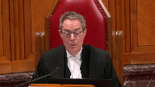
:::

Your sense is that's the trial judge signaling that he's bypassing that, going to exceptional circumstance, and thus obviating the need to, to explore defense delay?

Is that, that's, is that what I understand you to mean by bypass?

**Speaker 2** (00:40:04): Yes, that's, that's correct.

::: {.column-margin}

:::

So in the respondent submission, the respondent, the appellant's untimely re-election also exhibited marked a difference to delay.

We know that had he re-elected in February instead of September, there would have been no delay to his trial and he could have secured the provincial court trial dates, the same dates in Supreme Court.

Instead he waited and he voluntarily chose to forego imminent trial dates in favour of proceeding in Supreme Court 14 months later.

Alternatively, the untimely re-election could also be characterized as inaction that amounted to defense delay, as set out at paragraph 33 of COTI.

This is analogous to Dixon where the court's, the accused's lack of diligence in pursuing disclosure was cited by this court as an example of an omission that may amount to defense delay.

The defendant's failure to provide an explanation for this significant period of inaction before he re-elected and caused significant delay to his trial amounts to inaction giving rise to defense delay under the Jordan framework.

Alternatively, the respondent, if it's not defense delay, the respondent submits that the trial judge's conclusion that the appellant's re-election was a discrete event giving rise to an exceptional circumstance was correct.

According to paragraphs 189 to 191 of his reasons, the trial judge found that the two prerequisites to establishing exceptional circumstances had been established by the Crown in this case.

One, the re-election was outside of the Crown's control and two, the Crown did everything possible to mitigate the delay as soon as it had notice of defense counsel's intention to re-elect by seeking to replace the lost trial dates with the same dates in Supreme Court and preferring a direct indictment..

**Justice Moldaver** (00:41:59): It seems to me when we put our head on yesterday's shoulders and when we realized that what happened here was that there's delay in making the re-election at a time when the defence and everybody knows, you know, that the courts are jammed.

::: {.column-margin}
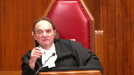
:::

They are, their delay is just kind of, it's a disease within the criminal justice system across the country

and I don't believe that Alberta would have been a different, or sorry, BC is this, I don't know what it is, BC I guess, but there's no reason to think that they wouldn't have realized that by not taking the date that was offered to them in the Supreme Court when it was offered to replace the provincial court, but delaying seven months before they make the call, then saying we're going to the Supreme Court, they know they're going to be in huge trouble in the Supreme Court trying to get a 10-day trial scheduled back in those days.

I mean, and it looks to me like a very strategic move on the part of the defence.

When we put, when you look back at what was going on at that time, and in fact, a move designed to further delay.

**Speaker 2** (00:43:30): Yes, Justice Maltdeber, and in fact, this was a seven-week trial, and so it just goes to show that the appellant would have been well aware that the delay in re-electing would cause significant delay in terms of his ability to secure new trial dates in the Supreme Court.

::: {.column-margin}

:::

Now, with respect to the B.C. Court of Appeals' analysis on the exceptional circumstances framework, I note that at the outset of the appellant's—at the outset of the trial judge's treatment of the appellant's re-election under the Jordan framework, the trial judge concluded at paragraph 189 that it would be inconsistent with the values expressed in Jordan to attribute to the ceiling the effects of an accused decision not to take advantage of an imminent scheduled trial in the court in which he is elected to be tried, as that would place the Crown in a situation in which it becomes responsible for delaying which it cannot prevent.

The Court of Appeal, however, unanimously came to the opposite conclusion, finding that this delay was not attributable to the appellant and that it counted towards the presumptive ceiling.

Although the Court of Appeal majority ultimately came to the correct conclusion in dismissing the appeal, the Court's analysis on the attribution of delay caused by the appellant's re-election is inconsistent with the objectives and values set out in Jordan.

First, the Court of Appeal reasoned at paragraph 103 of its reasons of its decision that the system can quote accommodate unquote late re-elections, observing that generally cases will still finish under the presumptive ceiling, even in the case of a last-minute re-election due to the 12-month increase to the Jordan ceiling.

And as I've already stated, that reasoning is antithetical to the very issue, complacency, that Jordan sought to redress.

As the majority observed at paragraph 56 of Jordan, the presumptive ceilings are non-aspirational targets.

Those additional 12 months are not a benefit to the Crown, the justice system, or the victims.

Those 12 months are not time that either party, due to inefficiency or complacency, is entitled to take up.

Second, the Court of Appeal's analysis does not have sufficient regard for this Court's observation at paragraph 43 of Jordan that criminal proceedings do not occur in a vacuum.

Again, the appellant tied up six weeks of court time in provincial court for 15 months, depriving other litigants of timelier access to the courts.

Now, in this case, the Crown proceeded to prefer direct indictment to mitigate the delay, but that does not change the fact that each month the appellant waited to re-elect meant further delay before the trial would commence.

And of course, paragraphs 19 to 28 of Jordan reiterate that the interests protected by Section 11b include the interests of the victim society at large and that timely trials are important to maintaining public confidence in the justice system.

Lastly, the Court of Appeal's analysis is also problematic in that it suggests that paragraphs 104 and 105 that to be deducted as a discrete event, the defense conduct must be illegitimate.

In other words, it imports components of the defense delay framework into the exceptional circumstances test.

Now, the appellant in his reply suggests that, reply factum, suggested that these comments were in reference to defense delay, but his position is difficult to reconcile with the court's explicit reference twice to the application of the exceptional circumstances test in those paragraphs.

Now, with respect to the length of the deduction and the application of KGK, the trial judge's clear intention was to deduct the period between the anticipated ending of the appellant's provincial court trial and the scheduled beginning of his supreme court trial.

The trial judge delivered a Section 11b ruling prior to this court's decision in KGK.

Accordingly, he erroneously calculated the anticipated ending of the appellant's provincial court trial based on the anticipated verdict rather than the end of evidence in closing submissions, which led him to attribute an extra month to the ceiling that, based on his intentions, ought to have been deducted.

And so, properly calculated to accord with KGK, the delay in this case caused by the appellant's untimely re-election is 13 months rather than 12 months, and the delay accordingly does not exceed the 30-month presumptive ceiling.

Now, with respect to the length of the deduction itself, the 12 months that the trial judge found attributed to the, or the 13 months, properly calculated that the trial judge attributed to the appellant, the trial judge did not commit any error in his calculation of the delay, and second, his assessment of the extent to which it was the appellant's delay in re-electing and causing the scheduling delay for a supreme court trial, his assessment was reasonable and it's entitled to deference on appeal.

Furthermore, the trial judge's assessment of delay, of the delay, was consistent with the message from this court that all justice system participants have a duty to be proactive in bringing accused persons to trial and Gordon's goal of ensuring, Jordan's goal of ensuring discouraging complacency by deducting inefficient delay causing defense conduct.

Lastly, the trial judge's approach to calculating delay also promotes the goal of providing clarity to the 11b framework.

An accused who makes an unexplained late re-election will do so with full knowledge that the entire period between the original trial dates and the new trial dates may count as defense delay.

Just returning to your point, Justice Moldaver, about whether this was a strategic move by the appellant or directly aimed at causing delay, that's the very issue with the notion of a defense re-election as a right.

The accused or the appellant does not need to provide any explanation for his or her conduct and the reasoning behind and the timing behind a defense re-election is exclusively within the knowledge and control of the accused.

In this case, it was somewhat fortuitous that the Crown had learned through the appellant's co-accused counsel that of the possibility of re-election.

I note that the Court of Appeal was noted in its reasons with apparent criticism that there wasn't any evidence of what trial dates were available in the intervening time between February and September and that the trial just didn't make any specific finding that the appellant had to re-elect in February.

But again, how could the Crown ever produce that evidence?

You know, it's going to be rare that the Crown would have such evidence that the re-election was specifically designed to delay.

And so in the absence of reasoning for, in particular, a late timing, the late timing of a re-election, in those circumstances, it is open to the Court to infer that there isn't a response in terms of the Jordan framework, that there isn't a reason that justifies that delay.

**Justice Martin** (00:51:14): May I ask you, in terms of arguing that it's sort of an exceptional circumstance or discrete event, how can we say that the right to elect contained in the statute could ever qualify as something unforeseen by the Crown?

**Speaker 2** (00:51:32): Well, Justice Fraser, Justice Martin, sorry, the exceptional circumstances only requires that it's either reasonably foreseen or reasonably unavoidable from the Crown's perspective.

::: {.column-margin}

:::

So, well, perhaps it doesn't meet the test in terms of being reasonably unforeseen.

It does often, and in this case, does meet the other alternative aspect in terms of it being reasonably unavoidable.

**Justice Karakatsanis** (00:52:01): Where does it say from the crown's perspective?

The second branch certainly deals with whether the crown could take steps to deal with it, but the examples in Jordan are illness, recanting witnesses, they're things that are unforeseeable.

**Speaker 2** (00:52:23): Well in the in the context of the timing of the the re-election in particular

::: {.column-margin}

:::

and it's it's not that the re-election itself is is necessarily unforeseen or unavoidable but to the it's the timing that the crown has no control over.

**Justice Karakatsanis** (00:52:43): I think you can't conflate the two aspects to just to the discrete exceptional event.

::: {.column-margin}
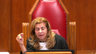
:::

The first prong talks about unforeseen or unavoidable.

It doesn't say only from the Crown's perspective and that's what I'm asking you.

How can it be unforeseen when the right is exercised within the statutory timeline?

**Speaker 2** (00:53:11): Well and of course the the respondent's primary position is that ordinarily the defense the defense exercise of a re-election as a right an untimely exercise of that right ought to be addressed under the defense delay framework and so

::: {.column-margin}

:::

**Justice Moldaver** (00:53:33): that's probably true, but just it seems to me the only way it's reasonably avoidable or unavoidable for the Crown to deal with a re-election is just to directly indict everybody.

::: {.column-margin}

:::

I don't think the Defence Bar would like that very much.

But, I mean, if they want to avoid this thing, they just directly indict everybody and we'd hear screaming and moaning and groaning from high quarters.

**Speaker 2** (00:54:11): Yes, that's that's true, Justice Moldaver.

::: {.column-margin}

:::

And my submission, Justice Karakasdanis, well, it doesn't specifically express in the first prong of the exceptional circumstances framework that it must be from the Crown's perspective.

It's from the context of the proceeding as a whole.

So from the perspective of obviously, the it wouldn't be from the perspective of the accused, as the the timing and reasoning behind the reelection is, of course, within the accused knowledge and control, but alternatively, it must be from the perspective of the justice system and the Crown would be the the only reasonable alternative explanation in my submission.

Turning to the application of the transitional exceptional circumstance, the respondent relies on the majority's decision upholding the trial judge's application of the transitional exception, with one caveat that the majority as well as the dissenting justice overlooked six months of delay that should have been deducted, including four months of the delay caused by Defence Council's unavailability for trial until January of 2017, following the appellant's reelection.

On that basis, the net delay was 37 rather than 43 months, and the Court of Appeal majority was otherwise correct in concluding that the transitional exceptional circumstance applied.

As the majority observed, the trial judge was intimately familiar with the delay in this case.

He considered the relevant factors and his findings are entitled to deference.

Relying on the dissent, the appellant says the trial judge aired in his transitional exceptional circumstance in three respects.

With respect to the first issue, the respondent says the trial judge did not err in applying the Moran framework, nor did he under attribute the amount of institutional delay.

Properly calculated in accordance with the jurisprudence dealing with co-accused delay as neutral in pre-Jordan jurisprudence and the late defence re-elections as defence delay, the total institutional delay was 15-16 months, well within the Moran guidelines for two-stage proceedings.

Furthermore, the trial judge did not overlook inferred prejudice.

He expressly noted that the delay, the prejudice experienced by the appellant would have accumulated as the case grew older.

And finally, the trial judge did not err with respect to his characterisation or application of the seriousness of the offence.

The offences were unquestionably serious.

The appellant drugged and effectively helped himself to the victim's body while she lay there helpless and unconscious.

And his offences were planned and premeditated.

There's no question that the trial judge understood the issue before him.

What would the parties have reasonably expected in light of the seriousness and the circumstances of this case?

This case is far removed from what this court envisioned at paragraph 98 of Jordan when it spoke of the kind of transitional case that would warrant a stay of proceedings for unreasonable delay, namely a simple case that vastly exceeds the ceiling because of repeated mistakes or missteps by the Crown.

The interests protected by Section 11B, the right to timely justice, belong not only to the accused but to society, and in particular to the victims, their families, the witnesses and the police investigators involved in the case.

**Justice Wagner** (00:57:41): Thank you, Ms. Chu.

Thank you very much.

Any reply, Mr. Persky?

**Overlapping speakers** (00:57:47): No reply, thank you.

**Justice Wagner** (00:57:48): Thank you very much.

::: {.column-margin}
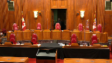
:::

I will ask the attorneys to remain at our disposal.

The court is now adjourned.

The court is adjourned.

Thank you.

Please be seated.

Once again, I would like to thank council for their submissions.

The court is ready to release its decision, and I will ask Justice Moldaver to read the reasons.

**Justice Moldaver** (00:59:24): Cody at paragraph 32 states as follows, quotes, defense conduct encompasses both substance and procedure.

::: {.column-margin}
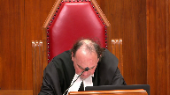
:::

The decision to take a step, as well as the manner in which it is conducted, may attract scrutiny.

To determine whether defense action is legitimately taken, to respond to the charges, the circumstances surrounding the action or conduct may therefore be considered.

End of quote.

In this case, the appellant, Mr. Lai, had the statutory right to re-elect when he did.

But he waited 15 months to re-elect after his trial dates were set in provincial court.

This was despite being informed by Crown Council that he could preserve his trial dates by re-electing earlier.

Nonetheless, he waited seven months after that warning to exercise his right to re-elect.

This conduct had the direct result of losing the trial date that was set in provincial court and causing an additional delay of 13 months.

The trial judge rejected Mr. Lai's explanation regarding the re-election.

Based on the trial judge's own findings and conclusions, the re-election was not done legitimately to respond to the charges.

To that extent, the trial judge erred in not characterizing the delay as defense delay and deducting it as such.

For these reasons, the majority of the court would dismiss the appeal.

Justice Cote is dissenting.

She would have allowed the appeal substantially for the reasons of Butler, J.A.

Thank you.

**Justice Wagner** (01:01:43): Thank you very much.