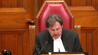
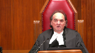
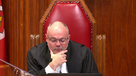
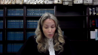
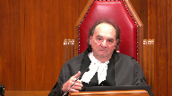
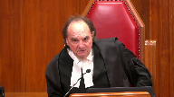
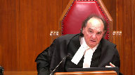

---
title: Darren Caley Daniel Sundman v. Her Majesty The Queen
published-title: Heard
date: 2021-12-09
sidebar: false
---

This transcript was made with automated artificial intelligence models and its accuracy has not been verified. Review the original webcast [here](https://scc-csc.ca/case-dossier/info/webcast-webdiffusion-eng.aspx?cas=['39569']).
---

**Justice Wagner** (00:00:26): Please be seated.

::: {.column-margin}

:::

Good morning.

In the case of Darren Caley, Danielle Sundman against Her Majesty the Queen, for the appellant, Darren Caley, Danielle Sundman, Danielle J. Song, Elliot Olsman, for the respondent, Her Majesty the Queen, Megan A. Street. Mr. Song.

**Speaker 1** (00:00:55): Thank you Chief Justices.

::: {.column-margin}

:::

I acknowledge that we didn't get invited this morning by this court to present the case.

In effect, we pushed our way through the courthouse doors as of right.

But Elliot Holzman and I say that it's still of public importance to ensure that the Crown's limited and asymmetrical right of appeal is tightly circumscribed.

Indeed, it's not uncommon in appellate courts for the Crown to test the boundaries of its limited right and essentially allege an unreasonable acquittal.

And in this case, we must ask ourselves, where is the strictable error of law?

Has the Crown surgically removed that error so that we can examine it?

And in my submission, it hasn't.

And so our position on appeal is that number one, there was no requirement of law for the trial judge to consider an exploitation of a position of power in the unlawful confinement analysis.

Number two, the temporal and causal nexus is a question of fact, which the Crown cannot appeal.

And three, the trial judge did not implicitly import a requirement that a confinement must occur in an enclosed space.

So with respect to the exploitation of a position of power, the Court of Appeal said that the trial judge was required as a matter of law to consider whether that murder and the murder represented an exploitation of that position.

And firstly, I'd submit that the trial judge did in fact consider the exploitation of a position of power.

And you'll find that in paragraphs 186 and 288 of his reasons.

And you'll also find it in those excerpts in our condensed book at tab three, page eight.

But secondly, and more importantly, appellate courts have affirmed that this exploitation of a position of power is the organizing principle of constructive first degree murder, but not a legal element.

And the Ontario Court of Appeal in McGregor set that out, as it did again in Imono Russell.

And it's consistent in my submission with the fact that jury instructions on this point are relatively simple.

You don't find the requirement to instruct juries that they have to consider this exploitation of a position of power.

And the courts in my submission say that the organizing principle here is achieved through the temporal causal nexus.

So when the trier of fact turns its mind to that nexus, the organizing principle is achieved.

Nothing more is required.

And the continued the idea of a continuing illegal domination is inherent in the concept of a series of events and a single transaction.

And so the temporal causal inquiry on its own without more in my submission answers the question of whether there was an exploitation of a position of power.

The Court of Appeal also said that the trial judge failed to give legal effect to the facts found, holding that the question of whether the temporal or causal nexus existed was a question of mixed fact and law.

But the appellate authorities say otherwise.

They confirm that a temporal causal nexus in the context of unlawful confinement and murder is a question of fact.

The Newfoundland Court of Appeal in Squires said the same.

The Manitoba Court of Appeal has said the same.

We've cited the case of Hong in the Ontario Superior Court of Justice.

And indeed, this court in Goldheart, as an analogy, said that the bridge between a charter breach and the exclusion of evidence or the discovery of evidence and the temporal causal or contextual connection, that too is a question of fact.

So it's, in my submission, entirely consistent to find that the temporal causal requirement in the context of constructive first degree murder is a question of fact.

That's it.

That's very-

**Justice Rowe** (00:05:18): It's very, very complicated and I'm listening attentively.

::: {.column-margin}

:::

But to put it in very simple terms, my understanding of it is, what happened is a question of fact.

The legal significance of it in the criminal context is a question of law.

Isn't it as simple as that?

**Speaker 1** (00:05:42): It is.

::: {.column-margin}

:::

And so my submission, Justice Rho, is that the legal significance, once there is a finding that there is a temporal connection and a causal connection, the legal significance is that the confinement and murder were committed – sorry, the murder was committed while committing the offense of unlawful confinement, while committing is the legal standard.

But in order to get there, the courts have said that the Trial of Fact has to make a finding that connects the temporal and causal connection beyond a reasonable doubt in order for that legal standard to be met.

**Justice Rowe** (00:06:29): So it's really easy when things are contemporaneous, when one thing happens simultaneously with the other.

::: {.column-margin}

:::

But if you go back to Pare, and there was a very short gap, and after the sexual assault, the indecent assault, and then the murder to cover up the assault, and the court bridged that gap by saying it was a single transaction if there was a sufficient temporal connection.

And the fact that the victim here, what, made it 20 feet, 30 feet before the first bullet hit him?

You know, maybe that's a very short gap indeed, and perhaps it's like the two minutes before the child was killed in Pare.

There was a sufficient temporal connection.

**Speaker 1** (00:07:22): But the question on a Crown Appeal is insufficiency, respectfully, Justice Roe.

::: {.column-margin}

:::

The question is whether there was a pure error of law.

And in my submission, PARI is quite correct.

I think in PARI, the issue was whether there was that break in time and whether a conviction for constructive first-degree murder could lie.

But here, if the trial judge had found that there is no temporal connection, then in terms of a Crown Appeal, in my submission, the Crown does not have the ability to appeal that finding, subject to, of course, isolating an error of law.

But the Crown has not produced any reported cases in which the Crown was allowed to appeal a trial judge's reasonable doubt about a temporal nexus, temporal causal nexus.

It's produced no cases that held that the temporal causal nexus is a legal standard for which the standard of review would be correctness.

And so that's for those reasons.

**Justice Martin** (00:08:25): there was an error in terms of how the trial judge approached the legal concept of confinement.

**Speaker 1** (00:08:33): Yes, Justice Martin.

::: {.column-margin}

:::

So if the trial judge had approached the elements of confinement and the legal elements were misapprehended or applied incorrectly, of course, by virtue of Cheng, the court may find a legal error.

But in my submission, that didn't occur here.

And I think your question goes to what I'll address in a moment with respect to the other ground on which the Court of Appeal had indicated there was an error, that is, that the trial judge had unduly restricted the issue of confinement to an enclosed space.

But in my submission, the trial judge did not err in so doing.

And we have to remember that in Cheng, in Cheng, the source of the error was that the momentary speeding was, the trial judge had fixated on the momentary speeding and did not turn his mind to the legal element of mens rea, which involves the assessment of a marked departure from the perspective of a reasonable person.

And when we deal with a standard involving a reasonable person, that is a legal standard.

And indeed, this Court has said many times that reasonableness would be assessed on a standard of correctness.

But here, that's not what occurs.

Here, the trier of fact is asked whether there's a temporal nexus, a causal nexus, and if so, then you can bridge the gap between a confinement and a murder.

**Justice Moldaver** (00:10:14): It isn't the question, the proper question here, was he free to go where he wanted to and when he wanted to and how he wanted to, after he jumped out of the car?

::: {.column-margin}

:::

I mean, that would... you can't just say because he's out of the car, he's free to do what he wants. Okay?

I mean, you know, he wasn't.

He wasn't free.

He wasn't in control of his physical movements at that time.

You couldn't just say, okay, I'm out now.

I'm going to sit beside the road.

I'm a free man.

I'm no longer confined.

So I think with great respect that the wrong question is being asked when you say, was he no longer legally confined when he jumped out of a moving car?

**Speaker 1** (00:11:03): But well, I'll address your question, Justice Mulder, in this way.

::: {.column-margin}

:::

Firstly, I do assert that the Crown, the trial Crown, did not present a theory that what happened outside the truck was a confinement.

The language, the overall tenor of the Crown's submission at trial was that the deceased was confined in the truck and after he escaped temporarily, he was chased down and shot.

And so the trial judge's reasons are focused in on that.

And what I find disconcerting about the Court of Appeals reasons is that the Court of Appeal denied the Crown from appealing on the question of whether the chase and shooting amounted to a confinement.

But it then turned around and said that nevertheless, the chase outside still amounted to a confinement.

In my submission, the Crown on appeal wasn't parsing out the point at which the trigger was pulled by Mr. Sunman, the time at which he was he was chasing the deceased and the time and events that occurred inside the truck.

The Crown on appeal in my submission was arguing that the context of the entire events outside the truck amounted to a confinement.

And so I appreciate that it may very well have been open to the Crown at trial to say look at the chase, look at the fact that his deceased liberty was limited from point A to B. That should have been an offense under 279 of the code.

And if the Court is satisfied beyond a reasonable doubt that it's an unlawful confinement that is connected to the murder in such a way that it amounts to constructive first degree.

But that was not the submission of the trial crown.

And in my submission, in effect, by finding that there is an actual confinement that was occurring during the chase would be offending the principle of double jeopardy.

**Justice Côté** (00:13:12): in the Crown's Factum in Paragraph 99 and 100, some extracts of the trial crown submissions.

::: {.column-margin}

:::

It seems to me that they are saying that what it means, those extracts, is that they were of the view that the confinement began in the truck.

Those extracts are not to the effect that the confinement ended when the deceased jumped off the truck.

So what do you have to say?

**Justice Côté** (00:13:41): that because they reproduce those extracts and it seems to support their theory that they also said during the trial that the confinement did not end when this is junk.

**Speaker 1** (00:13:55): So I'll just say, and I don't want to belabor this point, but I will say this, that the trial crown's submissions were not a model of clarity.

::: {.column-margin}

:::

The Court of Appeal acknowledged that, and indeed the concept of and the phrasing that the Crown and other parties used that talked about a continuing confinement in my submission was really the parties discussing whether the confinement of a truck was connected sufficiently to the murder.

And if you look at the response of Mr. Sundman's trial counsel, at no time was he dealing with the question of whether the chase outside constituted a confinement.

And so the understanding at trial, when you look at it as a whole and not really parsing the individual words that the counsel were saying, there was no real question an issue about whether the chase outside constituted a confinement.

But more importantly, if there was a confinement there during the chase, then how then would the shooting have been a distinct act?

The question about whether the shooting and the confinement being a distinct act wasn't dealt with by the Court of Appeal, and it's not straightforward.

I'm not saying that a trier of fact could not find that they would be distinct and amount to constructive first, but it is not straightforward that as one is chasing someone and shooting them down, that the murder and confinement are not subsumed within one another.

And if that were the case, then the conviction under 231 sub 5 wouldn't be available.

**Justice Brown** (00:15:45): Mr. Song, can I pull you back to the emphasis that you gave earlier on temporal and causal connection here as something that had to be found.

::: {.column-margin}

:::

In Magoon, we didn't talk about that.

In Magoon, the first-degree murder convictions were based on the unlawful confinement and the murder being two distinct criminal acts that form part of a single transaction.

No analysis of temporality, no analysis of causation.

What legal significance should we draw from that?

**Speaker 1** (00:16:29): I'll say that when one talks about a single transaction, it's tantamount to that temporal and causal nexus.

::: {.column-margin}

:::

It's just that the authorities have indicated for clarity that a connection in time and a causality element together allows the court to find that the two offences were committed as a single transaction.

How are we to understand?

**Justice Brown** (00:16:58): And how are we to understand the causal relationship between one and the other?

::: {.column-margin}

:::

I mean, the fact of a sexual assault does not cause a murder, unless in the circumstances of Paré, it was done to cover it up.

There's not gonna be a causal relationship in the sense of but-for causation in very many of these cases at all.

Is it but-for causation?

Is it more of a remoteness consideration or approximate cause kind of consideration?

What do you think is meant?

**Speaker 1** (00:17:32): I can't say Justice Brown that the authorities are clear about whether the causation element as it's described in this context is tantamount to how we assess it in the torts context or other areas but what I will say is that it would meet it would it's simply if we look at the model jury instructions and the type of jury instructions or get that are given it asks these the jury to assess the continuing series of events from a logical perspective after they assess the facts so how you assess whether in an unlawful confinement causes ultimately causes the murder is one that the jury assesses by looking at the facts and asking itself if one event eventually led to the other and so that's the best answer I can give on that point to Justice Brown I have to say that the authorities are not clear about the content if there's legal content to the idea of causation that hasn't been fully spelled out and that in my submission is because ultimately the question is as you noted whether there's a continuous series of events that amount to a single transaction that's what while committing means in the context of 231 sub 5

::: {.column-margin}

:::

and I do want to tonight

**Justice Kasirer** (00:18:59): Can I ask you that, on the heels of Justice Brown's question and bringing you back to the question of Justice Roe, which I think you might need to address again, at least for me anyway, because it wasn't plain to me why the two minutes in Parry didn't matter and on a temporal basis.

::: {.column-margin}

:::

And while the brief period that the judge describes here, but accepting for the purposes of argument that confinement did end in some way when Mr. McLeod got out of the car, that brief period wasn't enough to establish to break the singleness of the transaction.

**Overlapping speakers** (00:19:50): I'll try to address this later.

**Justice Kasirer** (00:19:52): The reason I'm asking, I think the same fragility around the idea of causation may infect the idea of temporality when you think of the predicate offenses being as disparate as hostage-taking, which is protracted in time very often, and sexual assault or in the case of Paris, as Justice Roe notes, indecent assault at the time, which can be fleeting.

::: {.column-margin}

:::

So is it not a bit of a bad thing to fix upon temporality on its own as a measure for the single transaction in the same way that causation can be?

**Speaker 1** (00:20:40): I can't say that it's a good or bad thing, but I can just say this about Pari first.

::: {.column-margin}

:::

Pari, the issue there was whether while committing meant that the predicate offense and the murder had to occur simultaneously.

And so this court said that the organizing principle is about the committing of a murder during an exploitation of a position of power, and they need not be contemporaneous.

It need not be simultaneous.

There is a legal question there that had to be answered, but it cannot be that this court can take the facts of Pari and use it as a comparator in this case, because the fact of whether there is a sufficient temporal connection in my submission is within the province of the Trier of Fath.

So I don't think

**Justice Brown** (00:21:29): I don't think that's the suggestion, Mr. Song.

::: {.column-margin}

:::

I'm just trying to stop you from going down that rabbit, Warren, because I don't think it's gonna help you.

I think the suggestion, to be plain about it, is that single transactions can take different forms, depending on the circumstances of the case, let alone on the predicate offenses.

And sometimes the transaction is a single transaction because of temporal connection.

Sometimes it may be a single transaction because of causality.

One can maybe imagine other qualities that might inform that.

So I think where all these suggestions are kind of going is an overarching suggestion that really, single transaction is what we ought to be looking for, and that temporality and causality may in certain instances explain it as it did in Pare.

**Speaker 1** (00:22:27): I can accept that, Justice Brown, but I would say that a single transaction itself is still a question of fact.

::: {.column-margin}

:::

It has to be a single transaction in order for you to satisfy the while committing element of constructive first degree murder.

But the single transaction, whether two things are a single transaction, in my submission, is not a legal standard.

Not in the sense of where there's a standard or review of correctness.

And I also want to emphasize that the trial judge didn't simply say or simply find that there was some two minutes that passed or the deceased was shot 20 feet from the scene.

Remember, we were dealing with a very troublesome vetrovic witness, and he makes some significant findings as to what had occurred.

You look at paragraphs 93 onward and into 268, and the trial judge finds that the vehicle came to a complete stop.

The three defendants got out.

Some of them yelled, get him, get him.

There's bear spray that's accidentally sprayed.

Ms. Stevenson then moves to the front seat.

The deceased goes through a shallow ditch and then across a fence.

In the short time after the three men left to chase him, shots rang out.

There's a brief pause, and Sebastian Martin says, I've got it, boss, and fires the two lethal shots.

There's a significant amount of blood that's found at that tree east of the offense, and the body is near the foot of that tree.

So the trial judge stated the law correctly on the while committing element, and then in my submission, considered all of the relevant circumstances and was not satisfied beyond a reasonable doubt that there was a single transaction.

**Justice Kasirer** (00:24:21): Look at paragraph 289, Mr. Song.

::: {.column-margin}

:::

In 289, he says, I recognize that the time between the end of the confinement and the firing of shots was brief.

Certainly, Mr. McLeod was still in a situation of vulnerability.

I'm gonna ask you at the end of this if this fits Pare on the law.

Still in a situation of vulnerability, and that vulnerability was the consequence of the manner in which he had been dealt within the truck.

There was nevertheless a gap in time. So what?

The onus of proving a continuous confinement is of course on the Crown, and I'm not satisfied that it was done so in this case.

Accordingly, I conclude that the Crown has not established first-degree murder under 231.

You think that fits Pare?

Well, I, the.

**Speaker 1** (00:25:14): the trial judge instructed himself on the law and said that there had to be a temporal and causal connection.

::: {.column-margin}

:::

And subsequent to Perry, the appellate courts have said that there has to be both a temporal and causal connection.

So in terms of the law, if he was instructing himself correctly there, then he was entitled as a trier of fact to find that if there was an insufficient temporal connection, not withstanding a causal connection or that suggests a situation of vulnerability, that he could find that there was insufficient nexus to found and ground a conviction for first degree murder.

And so if this court is of a view that a temporal connection is not required, it's not required that you need both the temporal and causal connection, then those other appellate authorities would be incorrect.

**Justice Martin** (00:26:12): But Mr. Song in your factual uh recitation there you you stopped when the vehicle stopped to let out the people that were doing the chasing and eventually the shooting but in the overall scheme the deceased was taunted to jump out of the truck and did in fact jump out of a moving truck doesn't that doesn't isn't that all part of the continuing transaction?

::: {.column-margin}

:::

**Speaker 1** (00:26:41): It very well may be the facts as to how the deceased came about to having to jump out of a moving truck, of course, is what the trial judge was alive to, very alive to.

::: {.column-margin}

:::

But it boils down to the question of, it kind of circles back, Justice Martin, to the question of whether there was a confinement as the deceased was being chased.

That's the messy part of the record.

I mean, despite parsing of words, it was just not clear that that point during the chase, that that was a confinement under 279 of the code that then triggered 231.05 with respect to constructive first degree murder.

**Justice Karakatsanis** (00:27:39): Mr. Song, can I ask you, going back to the trial judge's reasons in Paragraph 288 and 289, he discusses, and this was in the context of whether the confinement was continuing, and 289, nonetheless, there was a gap in time, the onus of proving a continuing confinement is on the Crown.

::: {.column-margin}

:::

I'm not satisfied that it is done so.

Does the trial judge ever go on to consider whether it was, nonetheless, part of a single transaction?

And if so, can you point me to where he does that?

**Speaker 1** (00:28:18): I'll say this and I said this in our factum is that the words continuing confinement in this context was not the trial judge assessing whether the chase was a confinement.

::: {.column-margin}

:::

It was whether the confinement in the truck and the shooting was a single transaction.

And if you look at the reasoning there in those paragraphs, he focuses in on that gap in time.

A gap in time is irrelevant to whether a confinement is occurring, but it's relevant to whether there's a nexus between the confinement in the truck and the ultimate murder.

So, despite the words that he uses and that that's why I was saying justice care Kazanis that those words are being used throughout the submissions, the final submissions that the confinement is continuing.

But if you look at it as a whole what the parties were talking about was that continuous series of events that amounts to a single transaction, not that the chase itself amounted to a, a confinement in law.

So, that's why I'm saying that there's a gap in time.

**Justice Karakatsanis** (00:29:21): Okay, I understand those submissions, but I just want to pick up on one thing you said, you said that a gap in time would mean that it couldn't possibly be a confinement?

I'm sorry, did I just hear you?

**Speaker 1** (00:29:34): I'm saying that the trial judge found the gap in time to be of significance.

::: {.column-margin}

:::

How much of that he, as a trier of fact in my submission, was entitled to put weight on that and make a finding that there wasn't sufficient temporal connection.

But the gap in time I was submitting is not relevant to whether an unlawful confinement is occurring.

In my submission, what the trial judge was doing there was assessing whether there was a sufficient connection so that the two events, whether the Crown has proven that the two events are a continuing series of events that amount to a single transaction.

And it's telling in my submission that the BC Court of Appeal found that the difference between an unreasonable finding and a failure to apply the correct legal test was difficult to resolve.

It preferred not to rest the disposition of the Crown Appeal on this very issue that the court has a concern today.

It does not inspire confidence in the foundation of the Crown Appeal on that ground in my submission.

So I respectfully submit that under 686 sub 3 that the court dismiss the appeal, the conviction appeal, but substitute the verdict of second degree murder and restore the sentence passed by the trial court.

**Justice Wagner** (00:30:56): Thank you very much, Mr. Street.

**Speaker 2** (00:31:06): Thank you Chief Justice and Justices.

::: {.column-margin}

:::

This morning I will begin my submissions with a brief overview of the respondent's position.

The key issue on this appeal is whether the Court of Appeal had jurisdiction to find that the trial judge erred by failing to find there was a temporal and causal connection between Mr. McLeod's confinement in the Silverado truck and his murder outside moments after he jumped from that truck.

In other words, was there an error of law upon which the Crown could appeal?

The respondent's position is yes.

The Court of Appeal did have proper jurisdiction.

The question of whether a temporal and causal connection between a confinement and a murder for the purpose of Section 231-5 sub e of the Criminal Code is a question of mixed law and fact because it requires the application of legal principles to facts found.

And where, as in a case like this, a wrong legal principle is applied leading to a failure to apply proper legal effect to facts found or the erroneous assessment of evidence, the answer will give rise to a question of law upon which an appellate court may adjudicate.

The respondent's position with respect to the other issues is as follows.

First, the Court of Appeal did not add an essential element to the well-established elements of constructive first degree murder.

In finding that the trial judge failed to consider whether Mr. McLeod's murder, and I'm quoting here now from paragraph 169 of the Court of Appeal decision, represented the exploitation of a position of power sourced in his unlawful confinement such as to make the entire course of conduct a single transaction.

The Court was simply paraphrasing the language used by this court in Regina and Perry, and more recently in 2018 in Regina and Magoon.

Secondly, the Court of Appeal did not err in finding that the trial crown had not restricted his theory of confinement to the time that Mr. McLeod was in the truck.

As Madam Justice Pote has already identified today at paragraphs 99 to 100 in the Crown's Factum, the Crown has set out various excerpts from the trial crown's written and oral submissions which expose the fact that the trial crown advanced two theories at trial.

The first being that Mr. McLeod's murder was committed during the offense of an unlawful confinement and in the alternative.

Even if it could be said that Mr. McLeod's confinement came to an end when he jumped from the truck, his confinement in the truck was temporally and causally connected to the shooting such that the two events formed a single transaction for the purpose of Section 231-5E. The Crown only argued that the confinement began inside the truck.

He never limited it to that period of time.

Thirdly, none of Mr. McLeod's conduct outside the truck as found by the trial judge can possibly be viewed as him moving about according to his own inclination and desire, which I believe is what Mr. Justice Moldaver stated earlier during my friend's submissions.

If Mr. McLeod was free to move about according to his own inclination and desire, the respondent would hazard to guess that instead of running through deep snow, cutting across fences, poorly dressed in the dead of night in rural Prince George, he would have instead sought out the nearest house, sought some shelter and tried to arrange transport back to his rental car in Vanderhoof.

Yet the trial judge failed to find that Mr. McLeod was confined outside the truck, and the only explanation for not making this finding is that he mistakenly believed unlawful confinement requires the victim be enclosed or be physically restrained in an enclosed space.

And finally, it is of no consequence that the Court of Appeal did not opine on whether the unlawful confinement and Mr. McLeod's shooting were separate and distinct acts because they decided the appeal on the temporal causal nexus ground.

But in any event, the legal effect of the facts found is that the confinement and murder were indeed separate but related and distinct criminal acts.

I will turn now to the first issue, which is that my friend alleges the Crown of Appeal erred by adding an essential element to the elements for constructive first-degree murder.

The Court need not go there, but the respondent submissions on this point are at paragraph 73 to 81 in the respondent's factum.

The impugned sentence is at paragraph 169 in the British Columbia Court of Appeal's reasons, and that is where the Court of Appeal concluded the trial judge erred because he had considered, because he had not considered whether the murder, Mr. McLeod's murder, represented the exploitation of power sourced in his unlawful confinement, such as to make the entire course of conduct a single transaction.

The Court of Appeal regarded this language as the Perry Test.

The respondent's position as the Court was correct in doing so.

In Regina and Perry, which can be found at tab four in the respondent's condensed book of authorities, and you don't need to necessarily go there right now, but at page 633, this Court set out both the organizing principle of section 231-5 offenses, as well as the meaning of the single transaction element of such offenses.

It is in the second paragraph on page 263 that this Court refined the interpretation of the single transaction requirement that had been set out in Regina and Stevens, and settled the language of the test in the way that this Court thought best gives effect to the organizing principle.

And that language, if you now would like to turn to tab four of the respondent's condensed book, where you will find the relevant passages sidebarred, you will see there, beginning with the the word refining, the Court stated, refining then on the concept of the single transaction referred to by Justice Martin and Stevens, it is the continuing illegal domination of the victim which gives continuity to the sequence of events culminating in the murder.

The murder represents an exploitation of the position of power created by the underlying crime and makes the entire course of conduct a single transaction.

This approach, in my view, best gives effect to the philosophy underlying section 214-5, which we now know as section 231-5.

It is this language, not the organizing principle stated in the paragraph above, that the Court of Appeal echoed in paragraph 169.

And, however, the single transaction...

**Justice Kasirer** (00:38:33): If you go to the trial judge, when he says at 289 that notwithstanding the gap in time that he describes, that Mr. McLeod was still in a situation of vulnerability, what importance do you attribute to that comment?

::: {.column-margin}

:::

**Speaker 2** (00:38:56): Thank you for that question, Mr. Justice Cazier.

::: {.column-margin}

:::

It was something I did want to speak to because it ties into Justice Brown's earlier question about what the causal part of the temporal causal connection means.

And what I think that that part of paragraph 288 means is precisely what was stated in paragraph 172 of the Court of Appeals decision, which you can find at tab 43 of the Respondent's Condensed Book of Authority.

And I'm looking here, particularly at paragraph 172.

And here, Mr. Justice Fitch for the Court wrote, the judge found that when the shooting occurred, Mr. McCloud was still in a situation of vulnerability.

This finding, in my view, is tantamount to finding there was a close causal connection between the confinement and the shooting.

And I think that's a very important point between the confinement and the shooting.

But you cite to...

**Justice Jamal** (00:40:11): You've included Alexis, Justice Miller's decision, in Alexis, which talks about causation as being facilitation.

::: {.column-margin}

:::

In Pritchard, Justice Binney talked, interpreting Pare, talked about causation as being the motive.

So what do we mean by causation in this particular context?

I don't think that's entirely clear to me.

**Speaker 2** (00:40:35): Thank you for your question Justice Jamal. I think

::: {.column-margin}

:::

and I don't mean to speak for Mr. Justice Brown

but I think that was the tenor of his question as well

and it is not necessarily in all cases going to be a but for causation.

The causation that the Temporal-Causal Connection is looking at is whether the situation of vulnerability that has been created by the abuse of power caused by the predicate offense creates or facilitates or allows for the murder to happen.

So it's not necessarily always going to be a but for situation.

It is more looking at

**Justice Brown** (00:41:26): Well, I mean, I'm not sure.

::: {.column-margin}

:::

I mean, I think that's maybe the best shot that, and I think that's kind of along the lines of what Mr. Song said too, but I'm not sure if I find that particularly helpful.

I mean, creation or facilitates or allows,

but to what standard?

But for material contribution, you know, I'm just wondering if causality, as used in Paré, was simply, as Justice Roe puts it, to fill in a gap, and whether it was really intended to be taken as a generally applicable requirement, or whether it's just an instance of how a single transaction can be demonstrated.

I just want to signal to you, I'm not even sure what's meant by causation, I'm not sure if it's helpful, and I'm not sure if it's a requirement.

**Speaker 2** (00:42:36): Thank you for your question, Mr Justice Brown.

::: {.column-margin}

:::

A few comments in response.

First with respect to Perry if I'm recalling the case correctly.

The causation component there was found by, by, by this court, because the murder was affected to cover up the indecent assault.

So, the causation was very evident in that case but I do take your point that it might not necessarily be helpful in all cases, and I believe that is why when you look at model jury instructions, you will see that the words temporal causal often do not feature in those instructions and again, it's focused on a continuing series of events, a single transaction, or any other phrase, meant to convey the fact that we're looking at a series of events.

**Justice Rowe** (00:43:35): Now, when I look at the provision itself, which is always very helpful in interpreting a provision, when the death is caused by that person while committing or attempting to commit an offence under one of the following sections, on my simple reading of it, it doesn't refer to one giving rise to the other, one causing the other, and I'm wondering whether picking up a little bit on Justice Brown's point, what Madame Justice Wilson wrote in Pare, which had meaning and significance in the circumstances of that case, in other words, the murder to cover up the indecent assault, has been elevated into a general principle of causation, which doesn't really attach to the proper meaning to be given to the provision.

::: {.column-margin}

:::

In other words, sometimes there's a causal element and sometimes there isn't.

It's simply they're simultaneous.

And so I'm wondering whether causation is just, if I can use this phrase, a magic word that used once by the Supreme Court of Canada gets repeated because it was used in an earlier decision.

**Speaker 2** (00:45:03): Thank you for your question, Mr. Justice Rowe.

::: {.column-margin}

:::

When I look back at Perry and the excerpts there are at tab four of the respondent's condensed book where the paragraphs on page 633 are sidebarred, Madam Justice Wilson there in the second paragraph, which I've already read to you, she herself does not use the language temporal and causal in that paragraph.

Again, the focus is on continuity to a sequence of events culminating in the murder.

And so it may very well be, as Mr. Jess Brown stated, that when you're examining whether there is a sequence of events and a continuing illegal domination of the victim, that looking for a temporal and causal connection, it might be evident in some cases and that may be in fact how one comes to decide that there was a continuing series of events or a single transaction.

And you are correct, Mr. Justice Rowe, that that phrase has been repeated, but also when you look at Regina and Harbottle, which is the seminal case which sets out the five essential elements.

Unfortunately, I have not included Regina and Harbottle in the respondent's condensed book, but you will find it in the authorities.

When you look at Regina and Harbottle, which sets out the five essential elements for constructive first-degree murder, you would again see that actually the fifth element, the way that it is defined, states the offences of unlawful confinement or attempted unlawful confinement and murder were part of the same transaction.

And so Regina and Harbottle was a Supreme Court of Canada case that took place, if I can do my math correctly, about six years following the murder of Ms. Harbottle.

And here we don't have the Supreme Court of Canada identifying the single transaction rule as defined as a temporal and causal connection.

So it may be, as Mr. Justice Rowe stated, that said once by the Supreme Court of Canada, everybody grabbed onto it and started using it and it sort of became a magical phrase or magical word, but yet we do see here in Regina and Harbottle that that in fact wasn't the case.

The Supreme Court of Canada didn't repeat that in Regina and Harbottle.

**Justice Moldaver** (00:47:51): And we didn't repeat it in Magoon either.

::: {.column-margin}

:::

In fact, we set out the five factors, and that was one of them, I think, that you're referring to.

We didn't bother with causal, temporal.

This is all part of one continuous unlawful confinement over several days, during which time, it's all part of one transaction, the assault of behavior occurs, which was intended to cause death or bodily harm, which they knew was likely to cause death.

So that's first degree.

**Overlapping speakers** (00:48:33): Yes, the respondent agrees.

**Justice Moldaver** (00:48:35): And I would just say this, Justice Fitch was very careful in his reasoning, but at page 109, I guess it is, around 157, we've been jumping around in terms of whether this is a finding of fact that can't be interfered with or not.

::: {.column-margin}

:::

At 157, Justice Fitch says, accepted the judge's factual findings and applying them to the elements, leads inexorably to the conclusion, the unlawful confinement of McLeod did not end with his desperate act of self-preservation by jumping from the Silverado.

And then he gives an analogy, and at the top of page 110, or right at the bottom of 109, as was confined, sorry, A was confined to a place against his will, in no sense was A free to move about according to his own wishes, including when he made a desperate run for it.

B is, as a matter of law, guilty of the underlying offensive unlawful confinement on these factual findings.

And then he keeps going and he explains why he says this, and then he says, okay, but I'm not going to go that way because I recognize there may be cases where we're in the mixed fact and law, although he clearly says this isn't one of them.

And speaking for myself, I find that analysis that he gave here perfect.

He then goes on, however, because he hasn't talked about causal and temporal and so on, and he wants to be careful about it, so he says on that version as well, we could find the necessary elements of first-degree murder in the context of unlawful confinement.

But do you see anything wrong with his first analysis?

Is there anything wrong in law on that?

**Speaker 2** (00:50:40): Thank you, Mr. Justice Moldavar.

::: {.column-margin}

:::

No, the respondent doesn't see anything wrong with Mr. Justice Fitch's analysis.

The respondent's reading of his analysis on that issue was that this issue in general, whether something is a question of fact, mixed fact in law or question of law alone, can be incredibly vexing.

And the Crown is not entitled to appeal on the basis of an unreasonable acquittal.

And for that reason, and to be careful, he went on to say, regardless of what I find with respect to this ground, I would allow the Crown's appeal on the second ground.

**Justice Moldaver** (00:51:24): really saying is using the trial judge's findings of fact, he aired in law in effect coming to a conclusion or decision that the confinement was not continuing when the guy jumped out of the car.

That's how I read what he's saying and that's an air in law.

**Speaker 2** (00:51:42): Yes he is saying that based on all of the factual findings that he made and importantly the court of appeal is not reweighing them, not disagreeing them, that met all of the essential elements for an lawful confinement and to not find that an lawful confinement was made out on those elements constitutes an error of law.

::: {.column-margin}

:::

It is just like Regina and Davis, it is just like Regina and Scalbania.

And that is why the Supreme Court stated in Regina and Morin that this is an error of law traceable only to an error of law because the court of appeal is not trespassing on any fact-finding function of the trial judge.

Instead it can simply insert the correct legal principle because the factual findings have already been made.

So yes Justice Moldaver the respondent agrees with you that the appeal could have been allowed on that first ground alone.

**Justice Jamal** (00:52:47): Is there something also in Justice Wilson's comment in Parry when she talks about how it can be difficult to determine when an indecent assault begins and ends and that important issues in criminal law shouldn't be allowed to hinge upon that kind of distinction?

::: {.column-margin}

:::

Isn't there something in that notion that we're sort of passing when the confinement, whether it was continuous outside the truck or not, and at the end of the day, it really comes down to if he'd been shot in the truck, it would be first degree, and if he shot trying to save his life, it's somehow second, and that doesn't really fit with a normal person's notion of justice.

**Speaker 2** (00:53:30): Thank you for that, Mr. Justice.

::: {.column-margin}

:::

I was hoping to get to that point as well.

In the respondent's submission, if what happened here out in that snowy field off of Upper Fraser Road and Prince George does not constitute constructive first-degree murder, the respondent is not quite sure what is.

Because again, had they been driving along in that truck, had Darren Sundman been beating Mr. McLeod from behind with the pistol, with Mr. McLeod leaning forward, pleading to be let out, offering to forgive the Sundman's debt, with Curtis Sundman at the helm, driving so quickly that Mr. McLeod could not practically escape, yet taunting him to escape, and then five, ten minutes later, while still driving, shot him, surely there would be no question that this is constructive first-degree murder under Section 231-5E.

So how can it be that moments after he jumps from the truck and starts running through a deeply snowed field trying to save his life, he is chased and shot at by two armed men?

How can that not be constructive first-degree murder?

How can that be second-degree murder?

**Overlapping speakers** (00:54:47): Well, wait, but...

**Speaker 2** (00:54:48): that that is precisely the kind of arbitrariness that Madam Justice Wilson was cautioning against in Regina and Perry.

**Justice Brown** (00:54:57): Does it matter then whether it's a continuing confinement or whether it's just a single transaction between the confinement and the murder?

**Overlapping speakers** (00:55:06): I'm not sure I follow what you mean.

So there's two ways to deal with this.

You can say, well, the confinement was continuing. Correct.

**Justice Brown** (00:55:12): Right, or you can say they were actually two separate acts as part of a single transaction.

::: {.column-margin}

:::

Or is, I mean, is that just angels dancing on the head of a pin or are those distinct, are those distinct pathways to first-degree murder under the constructive model?

So confinement continuing versus confinement ended and then there's a murder but they were part of a single transaction.

**Speaker 2** (00:55:47): I could see factually that those two descriptions that you've just stated, Mr. Justice Brown, could apply to different facts.

::: {.column-margin}

:::

I hesitate to say that they are incredibly distinct because in this case the Crown's position was either that this murder occurred in the course of an unlawful confinement, that the confinement began in the car, continued up until the point where he was shot, and that the jumping from the truck...

**Justice Brown** (00:56:20): your submission on that and and and

::: {.column-margin}

:::

but but but if i did not find that compelling and i'm not saying i don't

but if i did not find it compelling does it matter on the facts of this case because it might still be possible to say even if the confinement had ended it was part of a single transaction that led that that that included uh the murder

**Speaker 2** (00:56:47): Yes, I would agree with that.

**Justice Moldaver** (00:56:53): Perry is a case where the sexual, the indecent assault, was spent when the murder occurred.

::: {.column-margin}

:::

And so Justice Wilson was looking for a way, it seems to me, to link them.

I mean, I'm just, I wonder to myself whether or not if the Crown and Perry had gone with unlawful confinement first degree murder, i.e. after the sexual assault, the child certainly isn't free to get up and go.

And Perry shoots the child at that point.

I would have thought it's an easier route to first degree to say the child was unlawfully confined when he was shot.

But anyways, that's water under the bridge, I guess.

**Speaker 2** (00:57:42): No, I take your point there Mr. Justice Moldaver.

::: {.column-margin}

:::

I think back when Perry was decided, there just simply wasn't as much jurisprudence on this topic back then.

And looking back with hindsight, alleging section 231.5e may have in fact been an easier route to conviction.

So before I began to address your questions, I was just making submissions with respect to the fact that the Court of Appeal did not add any essential elements to the five essential elements of constructive first degree murder and instead was simply paraphrasing the language used in Perry and Magoon.

Now I see that my time is running out so I will quickly address the fact that the temporal causal connection issue was in fact within the Court of Appeal's jurisdiction.

And this is because what actions the accused took will be a question of fact.

So too is the timing of the actions that the accused took.

But determining whether the accused actions are separate and distinct yet part of a continuing series of events is not a question of fact.

The question cannot simply be answered by determining what the accused did for how long and how much time elapsed between the things that he did.

Rather, the question requires the application of the legal interpretation of the words while committing in section 231.5e.

And the legal meaning of this phrase, which is an essential element of the offense, is a question of law.

So here where the trial judge stated, and we've looked at it, that there was nevertheless a gap in time, he has created or exhibited an error of law because he has indicated that a gap in time precludes a finding of a continuing series of events, a single transaction, for the purpose of 231.5e.

That is an extricable error of law, that he was not applying the principal's underlying pare is an extricable error of law upon which the Crown could appeal and upon which the Court of Appeal could adjudicate.

And I see that I have less than a minute remaining.

I just want to quickly review my notes to see if there was something I wanted to say in response to my friend's comments or any of the Court's comments.

Justice Garrett Cassanis asked my friend whether the trial judge ever went on to consider whether the shooting or the chase outside the truck was part of a single transaction, and if so, to point out where in the reasons.

The respondent's position on that is no, that was not done.

It's not apparent in the reasons, and that is what the Court of Appeal found.

And subject to any further questions, those are the submissions of the Crown respondent.

**Justice Wagner** (01:01:04): Thank you very much.

Mr Soong, any reply?

**Speaker 1** (01:01:07): Thank you, Chief Justice.

::: {.column-margin}

:::

My friend says that the trial judge, by focusing on the gap in time, was essentially saying that a first degree murder conviction was precluded by virtue of that gap.

In my submission, the trial judge had instructed himself that a temporal nexus was required in law, and therefore he was entitled to find as a fact that the gap in time was significant so that that temporal nexus did not exist.

To address Justice Brown's question to the Crown about the significance of difference between a continuing confinement in these in this context, versus a single transaction.

I would say Justice Brown that there is actually only one question that the court asks is whether the, the unlawful confinement and the murder was a single transaction.

If the chase outside amounted to a confinement, you still have to ask yourself if there is a, if the two are distinct acts that are connected so closely connected together that they amount to a single transaction.

Justice Jamal asked about the comment that the trial judge had indicated in his reasons, suggesting that the deceased was still in a situation of vulnerability.

There's a tension, as my friend had said and we had also acknowledged in our fact that the jury instructions that are in the model jury instructions don't require temporal and causal to be articulated, but I would disagree with Justice Roe, that they were just simply magic words that developed over the course of time, a temporal connection proves that the crime of domination was continuing, and a causal connection I would say is a an expression about the exploitation of that domination.

And lastly, I'd say that the Court of Appeals reasoning on the issue of whether the trial judge had erred and in finding that a confinement had to occur in an enclosed space exhibits, not just weaknesses but inconsistency.

He acquitted Sebastian Martin of first reading for so you can acquit him but he he dismissed the Crown's appeal with respect to Sebastian Martin, who may not have been party to the confinement in the truck.

And in the confinement that occurs outside the truck during the chase.

Mr. Martin left the truck chased the deceased down with shotgun in hand with the other two, and ultimately delivered delivered the two lethal shots.

But yet, Justice Fitch found that that did not constitute first degree murder.

And lastly, I'd say that the question of a single transaction is still a question of fact.

**Justice Moldaver** (01:03:59): But on that point, Mr. Martin wouldn't be a party to the continuing unlawful confinement.

::: {.column-margin}

:::

That's Justice Fitch's point.

That's Justice Fitch's point exactly.

He doesn't get involved until the chase, which is really sort of all part and parcel of the murders, it turns out.

So I mean, you know, you don't call that an unlawful confinement.

He wasn't involved in the unlawful confinement before.

So how does he become involved after the man gets out of the truck?

He just runs after him and shoots him.

**Speaker 1** (01:04:41): Well, Justice Altiver, if the confinement is continuing outside, I'd respectfully suggest

**Overlapping speakers** (01:04:48): Well, he wasn't a party to it inside, so how does he become a party to it outside?

**Speaker 1** (01:04:52): But because if the confinement outside the truck amounts to an offense under 279, a co-accused could come in halfway through and become a party.

::: {.column-margin}

:::

And I'm just suggesting that if it's because of the chasing down of the deceased that amounted to a continuing confinement, then certainly Mr. Martin would have been a party.

But ultimately, as I had said, the question for this court is if the error lies in the application of a single transaction, that element, in my submission, I still respectfully submit that that is a question of fact.

It is not a question of law.

The legal threshold is whether the offense was committed while the murder was committed while committing the crime of domination.

And that's satisfied by finding a fact as to whether the Crown has proven beyond a reasonable doubt that there was a single transaction.

Those are my submissions in reply, Chief Justice.

**Justice Wagner** (01:05:53): Thank you very much.

Thank you counsel for your submissions.

The court will take the case under advisement.

Thank you very much.