---
title: His Majesty The King v. William Victor Schneider
published-title: Heard
date: 2021-12-10
sidebar: false
---

This transcript was made with automated artificial intelligence models and its accuracy has not been verified. Review the original webcast [here](https://scc-csc.ca/case-dossier/info/webcast-webdiffusion-eng.aspx?cas=['39559']).
---

**Justice Wagner** (00:00:06): D'accord. D'accord.

::: {.column-margin}
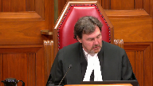
:::

Good morning.

Please be seated.

In the case of Her Majesty the Queen against William Victor Schneider, for the appellant, Her Majesty the Queen, Marity Ainsley QC and Liliane Waibanturakis.

For the respondent, William Victor Schneider, Christopher Nolan, Thomas Arbogast QC, and Catherine Kirkpatrick.

Ms. Ainsley.

**Speaker 1** (00:01:02): Chief Justice, Justices, the Crown is before this Honourable Court today to ask that the Court of Appeals order for a new trial be overturned and the Respondent's conviction for second-degree murder be reinstated.

::: {.column-margin}

:::

The Respondent's brother, Warren, testified at the trial that he heard the Respondent say, in a conversation with his wife, words to the effect of, I did it.

I killed her.

**Justice Brown** (00:01:34): what he said.

That's not what he said.

He said it was his feeling that he was admitting to the missing Japanese student's death.

He doesn't know what was said.

**Speaker 1** (00:01:47): Yes certainly the interpretation of the evidence that was before the trial judge as to what Warren was saying the respondent said on the call is an issue and I do intend to get to that in in further detail.

**Overlapping speakers** (00:02:03): Okay, well, let's not misrepresent the evidence.

**Speaker 1** (00:02:05): is that he, what he's saying is that he heard, he heard his brother say words to the effect of, I did it, I killed her.

::: {.column-margin}
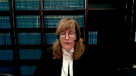
:::

And if we can go to, well, perhaps if I could just summarize a little bit further my overview, and I will definitely go to the evidence of Warren, what he testified to, because of course, that's the main issue in this case.

This is a very fact driven case.

And the trial judge who heard Mr. Schneider testify, who heard Warren testify, saw the manner in which he was giving evidence, very emotional evidence and important evidence vis-a-vis his own brother, held that it was capable of interpretation.

Madam Justice Van Oosten in dissent correctly identified in the Crown submission that the respondent's overheard statement was capable of interpretation by the trier of fact and therefore properly before the jury.

The appellant's position is that the majority was wrong in finding there was no logical relevance.

The gist of the conversation that Warren heard did not need to be verbatim or a complete account of the one side of the conversation.

The dissenting judge in paragraph 78 and further, other reasons identified the context or circumstances that could inform Warren's evidence about what the respondent said to his wife during the telephone.

This was a highly charged emotional time period between the two brothers.

**Justice Jamal** (00:03:53): Ms. Ainslie, isn't the starting point that the paragraph 7 of the trial judge's ruling, having heard the evidence that the voir dire said, or having heard, participated in the voir dire said, it's I did it or I killed her.

::: {.column-margin}
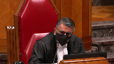
:::

So we start from the premise that it's one of the two, and then meaning is given to that, but it's not, I don't have any idea what was said, it was to the effect of the starting point is paragraph 7 with those two options, and then the specific meaning to be given to it is later elaborated upon.

**Speaker 1** (00:04:22): Yes.

::: {.column-margin}

:::

And in fact, at trial, the the or actually was was dropped even the testimony between both the voir dire and the trial changed.

But certainly I would submit that the crown would submit that it is the words that he said he heard, and his own frankness with respect to the fact that he could not recall the exact words.

That is does not mean that the evidence was not capable of interpretation.

**Overlapping speakers** (00:04:55): on the basis of his feeling?

**Speaker 1** (00:04:56): He heard words and he understood them to mean his brother was accepting responsibility, admitting responsibility for the offense.

::: {.column-margin}
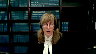
:::

Now again, as noted by the dissent, this is the larger, this is the context, there's a larger context in which those words were said.

**Justice Brown** (00:05:27): Well, before we get to the context, do you see a distinction between his account of what was said and a situation where a witness says, I don't recall what was said exactly, but I do recall the substance of those words, right?

::: {.column-margin}

:::

As distinct from, I don't recall what was said, but my feeling about those words were as follows.

Are these distinct cases or are these the same kinds of cases?

**Speaker 1** (00:06:07): Well, he is identifying words were spoken and he says a number of things.

::: {.column-margin}
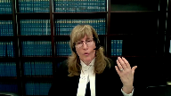
:::

He said he heard, he was there for the entire conversation but did not remember it all.

He said that he recalled the first part very clearly that the telephone call was relating to Ms. Kagawa's the missing student and then he heard in the context of what he was being asked about at this trial, then he heard one other statement and it was, I did it, I killed her.

And then he's questioned further as to whether he could recall the exact words and he frankly acknowledged he could not.

So this is an individual who's testifying with the familiar familiarity with the speaker both as a family member and both because they have been together in this period of time and he has been making other statements.

Recall that they have the conversation the night before where he's asked about, the respondent is asked about the RCMP missing person bulletin.

He told his brother it was true.

He told his brother he knew Ms. Kagawa had been with her and on their last date they had taken medication.

After the respondent said these things he appeared to his brother to be remorsefully sad, glad to get it off his chest.

The next morning, the respondent told his brother he wanted to commit suicide.

He told his brother the body was located at the construction site.

He said it was in a suitcase by necessary implication.

She's obviously deceased.

He never said it was an accident.

He never said he did not know how he died.

The brother heard his his the respondent make statements all to do with his involvement in the death of Ms. Kagawa.

Then he hears his brother make a statement to his wife on the phone which again was a statement regarding responsibility for the death of Ms. Kagawa.

Through the words and conduct of the respondent that day observed by the brother and testified at trial, to which he testified at trial, the respondent was demonstrating culpability for a wrongful act that caused the missing woman's death.

The Crown argued at trial and the jury could readily infer that the respondent was reluctant to fully explain his actions to Ms. Kagawa.

He didn't want to explain them to his father or his wife, necessarily directly, but he was implicitly willing to take responsibility for them.

So this is the collective context in which the jury is given statements made by the respondent.

It's not simply a stranger.

It's not simply a police officer or a sheriff in a van or bail supervisor.

It's not a member of authority overhearing somebody who's in their custody.

It's somebody who's intimately familiar and in an incredibly intense experience with the brother, including him wanting him to be there while he tried to kill himself.

And then he hears a statement on the phone when he's speaking to the wife. I did it.

I killed her.

He made this phone call minutes after an unsuccessful suicide attempt and having revealed the knowledge of where the body lay.

He may not have been able to provide the exact work spoken, exact words spoken, but he was able to provide reliable evidence of the essence of the words, the gist of that.

**Justice Brown** (00:10:28): No he wasn't.

He was able to say that his feeling was that he's responsible, that his brother's saying that he's responsible for her death.

**Speaker 1** (00:10:43): He's describing, and perhaps, why don't we go at this stage, we can go to, in the condensed book, I've exerted Warren Schneider's evidence.

::: {.column-margin}
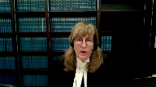
:::

If I could start at tab seven.

These are photographs of the two.

This gives a real picture of this snapshot of this intense circumstance that was happening that day.

And it's a reminder that the trial judge heard this evidence and saw Warren testify.

She felt it was capable of interpretation by the trier of fact.

She being a trier of fact, she saw the manner in which the evidence was delivered, whether there was demeanor or uncertainty or clarity or not, with respect to how witnesses testify.

Having seen Warren testify, she concluded his evidence was capable of interpretation.

Sorry, how did the-

**Justice Brown** (00:11:56): the photographs help us understand the meaning of the statement in the middle of the phone call.

**Speaker 1** (00:12:02): It's trying to bring home that, with respect to the witness, the dynamic of what was occurring during that whole time they were together, including the conversation that was overheard with the wife, including it, is that it was a very emotionally charged moment and, in fact, the brother was testifying about having heard what he knew regarding the respondent's knowledge of the offence.

::: {.column-margin}
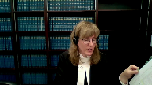
:::

So it's in this larger piece that he then hears the accused make this statement in a conversation, his last conversation with his wife, one would assume, because the respondent is hoping to kill himself again immediately following it.

So this provides, in the Crown submission, just some context and a reminder as well that the trial judge heard this witness and would be able to understand the import of his evidence.

So at tab nine of the condensed book is where we have the transcript excerpts from the voir dire, starting at page 135 of the appellant's record.

At line 18 is where there is first questioning regarding the conversation that he overheard.

At line 20, Warren says that the respondent asks or starts the conversation by saying, did you see the news of the missing Japanese student? Yes.

Answer, and then he said, I did it.

Question, and did he say anything else?

I killed her.

Okay, now what was the length of this call?

Several minutes.

Were you present for the entire call?

I was near, yes.

And then at line 35, 10 feet.

At line 39, I could only hear one side of the conversation, but seemingly a two-way conversation, but I would think he was speaking more than she was.

What tone of voice did he use when he said, I did it, I killed her?

And then he gives an answer with respect to the respondent's voice possibly being impacted by opiates.

And then the next page, line 12.

Okay, and when he said, I did it or I killed her, were those statements either statements or questions?

Answer statements.

Question, okay, now can you remember anything else that was said in the conversation?

Answer, no.

So it's important I would suggest here that he's overhearing the conversation and he is saying what he remembers about what he's being questioned about.

He's being questioned about what he overheard regarding the respondent's statements about Ms. Kagawa.

So this is what he remembers as being relevant to the topic that he's being questioned on.

And then at line 34 on page 136 still, question, did you leave for any parts of the conversation?

Answer, no.

Question, and were you listening to it?

Answer, I could hear it, I was not eavesdropping.

And then at page 138 is where there's cross-examination starting at line 37.

And I'm going to suggest to you also don't know what exact words were spoken by him.

You don't recall that, do you?

Answer, not the full conversation.

No, I'm sorry.

Answer, not the full conversation.

Well sir, you don't even know whether he said I did it.

And there's further questioning at line at page 140, line 38.

Now that's what you said that day.

What did, what did you really hear him say?

Answer, well he said that did you hear the news or whatever on the missing Japanese student?

And the conversation went on for apparently 13 minutes.

But I wasn't, like I said, I wasn't eavesdropping, but he said he did it.

Okay, we'll go on.

That he killed her.

And then later he says, at page 141, line 29, again being questioned about his testimony at the preliminary inquiry.

Answer, I guess I'll have to go back to the page.

That's exactly, I mean that's what I said there.

I did it or I killed her, but meaning that he's responsible for his death, for her death.

So this is, he's being reminded of testimony that he gave at the preliminary inquiry.

Later, later as Justice Brown has already noted at page 143, line 36 is where he's asked, so you don't know the exact words.

He said answer, not word for word, but the message that I got, that I got from that was question, you're feeling about it, answer yes.

And then at line, page 144, line 34, well it is the topic and we're talking about it.

So I mean, we're talking about a missing Japanese student in a suitcase, drugged.

So we were talking about him, in a sense, being responsible for her death.

And then at page 145 is the, at line 32, is your feeling about the impression you got, isn't that really it? Yes.

So to the extent that evidence is, evidence is impacted by cross-examination from a conflicted, as the Crown argued, conflicted witness giving incriminatory evidence.

Yes, there's some, some, some further clarification, but he is hearing words, the exact words, and he's being honest about that.

Then at tab 10 is where we get to the trial evidence.

And the comparison is, is interesting because at this stage, now at this, the judge has heard and made an assessment of logical relevance.

Now this is what the jury hears.

And it is the Crown's submission that this is what this case ought to be decided on, which is what did the jury hear and how were they instructed regarding it.

It's very central to the dissenting reasons which the Crown asked this court to endorse that there was such a strong caution and thorough instructions given to the jury so that they had the tools with which to assess this evidence.

They saw him testify.

They would have sensed whether he was conflicted or not.

They would have sensed whether he was backing off incriminatory portions or not.

This is, that they were there and we were not.

So they saw him.

May I interrupt you there though?

**Justice Martin** (00:19:38): So the caution that was provided by the trial judge was, as you say, quite strong, quite proper, very well done.

::: {.column-margin}
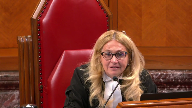
:::

But if the evidence shouldn't have been admitted at all, what is the relevance to the legal determination about admissibility, that there was a well done caution.

**Speaker 1** (00:19:58): Well, certainly, and I've included in the Crown's Factum that it's essentially akin almost to a curative proviso argument, which is if the caution is such that the evidence could never have been misused, and if the concern about admitting it was that it could be misused, then in fact they're all, they're essentially related, which is ultimately in the end, there's no prejudice by the admission of the evidence.

::: {.column-margin}

:::

So, and there are, I've included cases in which the caution essentially was a cure to any concern with respect to the admissibility.

**Justice Rowe** (00:20:41): I'm not sure it's quite as, I'd say, free-form as that.

::: {.column-margin}
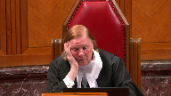
:::

It seems to me that there's a logical sequence to the questions that need to be answered, and sometimes points are relevant to more than one step in the sequence, but that doesn't mean they're less distinct.

The first one is, is the evidence relevant?

Second, is its probative value over-born by its prejudicial effect, such that notwithstanding the fact that it's relevant, it should be excluded?

And then the third step in the sequence, it seems to me, was, is the jury instruction effective to maintain a proper balance between probative value and prejudicial effect?

So that it's really properly assessed by the jury, and I'm not sure that a good instruction at the end of the sequence allows you to skip steps one and two.

**Speaker 1** (00:21:53): The jury instruction is part, is really a part of these steps.

::: {.column-margin}
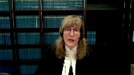
:::

So, for example, Justice Giroux says in paragraph 21 of her ruling, the probative value of the evidence outweighs the prejudicial effect that it might be used improperly.

The prejudicial effect can be ameliorated by a strong caution to the jury about what use can be made of the evidence.

So, again, when one talks about prejudice, is the evidence going to be misused?

How will it be used?

And her assessment of to this balancing exercise is that in this case, there is adequate protection from instruction.

And I would submit, I submit as well that this, again, it's not in dispute, that this is something to which trial judge is given great deference to the trial judge's assessment as to this balancing of probative value of prejudicial effect.

And certainly Justice DeWitt makes that clear in her reasons, that this is something to which deference is accorded.

Because the importance of the role of the trial judge obviously is as gatekeeper.

But part of that job is to assume when the gate is open and the jury is now there, what are they doing with the evidence that they've heard?

And in this case, we have evidence that is capable of interpretation.

The trial judge found it, Justice DeWitt Van Heusen in dissent certainly accepted it.

In fact, defense counsel must have considered it to be capable of interpretation until the very day that Mr. Warren Schneider was going to testify because he never raised any form of pretrial objection to it, despite the evidence being led at the preliminary inquiry.

And he certainly raised objections to other evidence that the Crown was tendering.

So if we have evidence that is capable of interpretation, then the next question is, well, is the jury being properly guided with respect to its use?

And this role, these different roles, the judge as gatekeeper and the jury as fact finder, very much inform the manner in which the law is developed in this regard.

That, and I've set out a number of quotations in the factum with respect to the fact that juries can be trusted to do their job with proper guidance and proper tools.

And in this case, they were given it.

And furthermore, the instructions are also to be considered that this jury was given in light of the submissions of counsel and what the counsel said with respect to this evidence.

So ultimately in the end, and this in the response submission, in the appellant, in the Crown submission, is important that this court is dealing with the record as a whole with respect to this evidence.

And in the end, the concerns of the majority are just not borne out in the Crown submission.

Now to return to the tab 10, which is the actual trial evidence.

And this is the condensed book of the appellant at tab 10, page 170.

Again at line 17.

Warren is saying that he is approximately 10 feet away within earshot.

He was close enough to hear what he said.

Answer, yes.

And then the witness Warren recognizes, well, I only heard the one way conversation at line 37.

What did you hear your brother say?

Did you hear the news about the missing Japanese student?

What else did he say?

Line 41, more was said.

But the conversation goes for up to 13 minutes.

Now halfway through the conversation was when was he said he did it.

He killed her.

Well, I did it.

I killed her.

And that's his answer.

And then at the top of page 171.

And at this point, I want to be clear with respect to that.

The Crown asks, can you say whether they were his exact words or not?

No. Are you able to say that that was the gist of the conversation?

Answer, perhaps.

Question, I'm sorry, perhaps.

And he's asked, what do you mean by perhaps?

I only heard one side of the conversation.

Okay, I'll rephrase that.

That was the gist of the conversation you heard from your brother. Yes.

Can you remember anything else of, no, what was said at the time? No.

So he's being asked, can you remember anything else implicitly about what was said about the missing Japanese student?

And then at page 184 of the appellant's record further under this same tab.

I have at line 43 is a question.

When you left your brother, and this is a very traumatic time for me, a very traumatic time for you, I'm guessing, answer, yes.

So again, emphasizing the seriousness of the interaction that he's having with his brother to the degree to which he's in a position to say what he heard his brother saying.

**Justice Brown** (00:27:41): I wonder if you could make the basis for that link between the trauma and his basis for understanding what he's hearing a little more explicit for me.

::: {.column-margin}
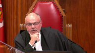
:::

I'm still stuck on, I mean, I assume the trauma point is the same point that you wanted to make in referring us to the photographs, and I'm still struggling to understand how those photographs help us interpret a later statement where we don't know exactly what was said in the middle of a telephone conversation that he didn't listen in on.

So can you take me back?

Is there a photo in particular I need to look at?

How does the trauma relate?

**Speaker 1** (00:28:22): And perhaps I'm not clear about the photos are really included just to give some context to these are the two brothers.

::: {.column-margin}
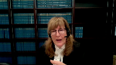
:::

And this is this is what they are involved in this very intense point less than 24 hour period.

**Overlapping speakers** (00:28:42): Right?

**Speaker 1** (00:28:42): and the reason that matters is because he hears his brother and he's in a position to understand what his brother is saying.

::: {.column-margin}
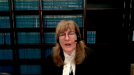
:::

He's in a position to hear the tone and this was certainly one of the points in the Ferris decision that Justice DeWitt Van Oosten distinguished was was noting that in that case one of the concerns was that nobody could give any meaning because it was just an overheard statement by a police officer of somebody he doesn't know, he has no familiarity with, it was incapable of being interpreted as an admission.

So in this case we have an individual who is extremely well-suited, extremely well-suited to give evidence because he has been hearing statements from his brother who he knows over this period of time and then he hears another one during the phone conversation.

The phone conversation started with the fact that he mentions to his wife about the missing Japanese student and then the other thing that Warren testifies he remembers is that he heard his brother say I did it, I killed her.

So I just I see my time is almost up

I've I have directed the court to the the the condensed book and the references there in support of the Crown submission that these mean these words were capable of interpretation because this was not a stranger, this was part of an ongoing contextual interaction between two brothers as very thoroughly set out by Justice Dewitt Van Oosten in her dissenting reasons.

The other tab that I have in one of the other tabs in the condensed books does have the jury charge and I would ask that this court give great weight to the fact that in in that jury charge the jury were given the proper tools to assess this statement, a statement that was provided from someone with intimate knowledge of both the speaker and the circumstances.

**Justice Wagner** (00:31:07): Thank you very much, Mr. Nolan.

**Speaker 2** (00:31:15): Chief Justice, Justices, can you hear me?

**Overlapping speakers** (00:31:21): You too. Am I?

Go ahead.

**Speaker 2** (00:31:22): Thank you.

::: {.column-margin}
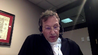
:::

The position of the respondent is that this Honourable Court can and should dismiss this appeal for any of the following reasons.

First, the majority decision correctly decided that whatever the witness WS overheard the accused say was inadmissible because it was logically irrelevant.

The second reason being that whatever the witness WS overheard was also inadmissible because it was legally irrelevant in the sense that its potential prejudicial effect far outweighed its probative value.

A third point is that evidence from the witness WS as to the gist of what he overheard was inadmissible opinion evidence.

And fourthly, the trial judge inadequately responded to a jury question about the difference between murder and manslaughter.

Now, with the time available this morning, we the respondent, we rely upon our factum in relation to that fourth point I just made about the jury question, subject of course to any questions from this court.

I would in terms of my colleague and I's division of labor, I propose to begin by summarizing why the majority decision below correctly concluded that whatever the witness WS overheard was logically and legally irrelevant.

On the third point that I'd mentioned, my colleague Mr. Arbogast, he will outline why the witness WS should not have been permitted to introduce to the jury his opinion about what he overheard and the associated issue around the jury instruction.

In essence, I would like to explain why the majority decision below correctly followed and applied the majority decision in Ferris, which this court upheld.

And my colleague Mr. Arbogast will explain why the evidence that the majority decision ruled inadmissible was inadmissible for reasons independent of Ferris and the Ferris line of cases.

So I really will just...

**Justice Kasirer** (00:33:36): Can I just interrupt you just

::: {.column-margin}
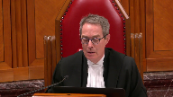
:::

so I understand your four points, Mr. Nolan, that you'd accept the view that the majority decided the matter just on logical relevance, that they didn't say anything to us about legal, I mean, you can draw inferences as to what they might have thought about the speculative character of the evidence or the properly prejudicial effect it might have if it were admitted, but strictly speaking, they only decided it on logical relevance.

Is that correct?

**Speaker 2** (00:34:19): I agree with that entirely, Justice Kessier.

My point simply being is that it's another reason that this court could dismiss the appeal, is my submission, that there is a need for

**Overlapping speakers** (00:34:32): Yeah.

**Speaker 2** (00:34:33): on the issue of legal relevance, but no, the answer to your question is yes.

::: {.column-margin}
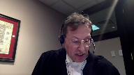
:::

So what I'd like to say then in terms of just briefly on the point of logical irrelevance is that that is exactly what Mr. Justice Gopal in British Columbia disposed the appeal on that issue alone.

His view was that whatever the witness Warren Schneider had overheard was not logically relevant.

It had zero probative value and it was therefore inadmissible and that's precisely where he parted company with Justice DeWitt-Bennett.

**Justice Rowe** (00:35:08): How do you square this with the low threshold for relevance that was set out in ERP?

**Speaker 2** (00:35:16): Okay, then I will go to that.

::: {.column-margin}
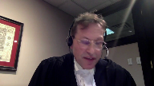
:::

How I respond to that, Justice Roe, is that I believe that in this case in particular, I don't know about others, in a sense, almost a doctrine that kind of seemed to have come up or a threshold of some evidence that came up and absolutely it came up in ARP.

It's what I might submit is the bare minimum for the trial judge to consider actually putting the, putting, say in this case, the overheard utterances to the jury.

What's missing in this case, and it's what I've been trying, it's what the respondent's factum is trying to articulate by drawing this distinction between some evidence and a standard of proof of balanced probabilities, is addressed kind of directly head on in a sense in at least two cases.

And I think because of, because in response to your question, if I may draw this court's attention to a paragraph from the case Evans 1993 from this court, I'd refer to it in the respondent's factum, a different paragraph.

But I think to answer this question very head on, it's important for me to read out one paragraph, which is paragraph 36 of the Evans case to answer this question.

And so I'll read now from Justice Sapinka directly.

Paragraph 36, if there is some evidence to permit the issue to be submitted to the trier of fact, the matter must be considered in two stages.

First, a preliminary determination must be made as to whether on the basis of evidence admissible against the accused, the crown has established on a balance of probabilities that the statement is that of the accused, period.

So he goes on to then say, you can now go past the gatekeeper.

And Evans was a case about the authenticity of a statement.

But in 2008, Justice Rothstein quoted those words from Justice Sapinka that I just read out again, entirely with approval, categorically with approval, and actually made the additional comment.

This is in a case from 2008 called RVHL.

And what he said at paragraph 80 was that that same civil standard on these preliminary questions about the civil standard of a balance of probabilities, he said that they applied to preconditions of admissibility of various types of evidence, such as hearsay.

And he actually mentioned similar fact and he cited BARP among other cases.

In the respondent's fact, and we developed that point to make the point that it also applies to cases such as Mr. Big cases, where the reliability of admissions to Mr. Big officers are presumptively unreliable, if you want to put it that way.

**Justice Moldaver** (00:38:24): Well, listen, isn't that the distinction, though?

::: {.column-margin}
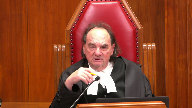
:::

We're not talking about...

If we're talking here about Evans and a party admission, there's nothing that says they're presumptively inadmissible.

You're giving us cases that deal with evidence that this court has held is presumptively inadmissible.

Here, we're starting with something that would be presumptively admissible, and the logical relevance of a party admission can hardly be doubted.

So really, it seems to me that the relevance point, and this is the point Justice Roe, I think, was getting at, is almost a given in a case where you have a party admission.

You're not into what we call the traditional hearsay evidence rules.

You don't have to prove the principled approach to let it in for its truth.

You have a party admission.

Now, whether or not it should be excluded as Justice Sepinca determined in Ferris is another story, but it seems to me that we're talking apples and oranges, even in ARP, which was similar fact evidence, that is presumptively inadmissible.

**Speaker 2** (00:39:40): Justice Moldaver, if I may, with great respect, in the Mr. Big context, that's a, if I understand you correctly, that's a party admission.

::: {.column-margin}

:::

A Mr. Big target is the accused, and he or she is making an admission.

And the concern, if I may, in Hart, was that the circumstances around Mr. Big admissions generally are of dubious reliability, which is why they're considered presumptively unreliable.

The general submission and- Let's stop, let's stop there.

**Justice Moldaver** (00:40:17): for a second.

::: {.column-margin}
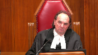
:::

Why would the brother of the accused hear?

Why would we start off?

They had apparently a close, caring relationship.

They've been dealing with this issue for several days.

They're together when one tries to commit suicide.

They obviously care very much for each other.

Why would one presume that the brother would give evidence that would on its face be harmful to his brother in these circumstances?

It doesn't make any sense and I think that's what your friend was getting at when she tried to show us the pictures and the care that these brothers had for each other.

You don't start off by saying, well he had a motive to implicate his brother in a crime that he didn't commit.

**Speaker 2** (00:41:13): No, I agree with that.

I agree with that last point, Justice Moldaver.

My submission isn't, it doesn't touch on the issue, whether they had a motive.

In fact, what the general...

**Justice Moldaver** (00:41:25): logic what story to interrupt again but that's what mister bigs all all about the concern is that the police are giving this person benefits and so on and so forth and answer playing into the fact that the ultimate accused of them the biggest thing in his or her life is let me join the game i want to join the game and we're going to give you all kinds of sweeteners and so on you start off with a major concern about reliability when in fact you are inducing the person to but then i don't disagree with that uh... the

::: {.column-margin}
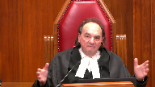
:::

but that's very different than

**Speaker 2** (00:42:03): But what's similar, if I may, what the respondent is submitting generally is similar, and because I can bring in the KGB as well, right, in KGB we have the same concern about a young person who's, again, the accused who's made an admission and has retracted it, so we have a different context completely from Mr. Big, but we still now have the same rule.

::: {.column-margin}
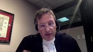
:::

The respondent submission generally about the circumstances, it has to do with the reliability of these statements, it doesn't have to do with motive, there may be one reason or another why a statement might have reliability problems around its circumstances, that's why KGB is different than Mr. Big, and different than Evans, etc.

But in this case what we have is on the fact that we have these uttered, we have these fragmented utterances, or I believe what one case calls severed utterances, and so the argument is, is that whether it's Mr. Big or KGB or Evans, when the Crown is attempting to submit some piece of evidence of dubious reliability, and in this case inherently dubious because there is no surrounding words, it's an overheard one-sided conversation, it's inherently, it has inherent reliability problems, and this general submission is, and that's why I drew from Evans and then the HL case, is that when the Crown is seeking to tender a piece of evidence of that nature for its truth as an admission, or in some cases a confession in which the preliminary standard is the criminal standard, and again that's a reliability concern, the entire whole voir dire process around voluntariness of a confession is the exact same logic I respectfully submit.

The common law says we have a concern about involuntary confessions, so we're going to have a voir dire about them, and the standard of proof of that is that we have a concern

**Justice Côté** (00:44:02): Mr. Narlien, in paragraph 205, the majority says that what is missing in this case, and in Ferris, is any micro context.

::: {.column-margin}
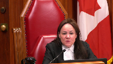
:::

So I'm trying to find in everything which has been written on the law of evidence, where we have to make a distinction between macro context and micro context in order to make a determination of relevance.

Any support in the law of evidence for such a distinction?

Because in saying that, the majority seems to acknowledge that there was a macro context.

But why should we have that distinction between macro and micro context to determine if something is relevant?

**Speaker 2** (00:44:45): Yes.

::: {.column-margin}
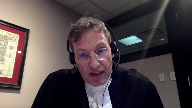
:::

Well, because I think when, if we're to speak generally about macro and micro context, I might agree, Justice Côté, that it's hard to draw a line and certainly hard to draw a bright line in that respect.

But I think when it comes to the uniqueness or the distinctness of statements in particular as a piece of evidence is certainly one that the Crown is presenting to the, wishes to present to the jury as an admission, which is most likely dispositive.

When it comes to statements, I'm submitting that they're a special animal in the sense that especially when you have a fragment, which I believe is what the concern was in the Ferris case, you've got these fragments or severed words out of what Mr. Justice Côté focused in on, and as to Justice Conrad and Ferris, was the fact that what the witness is being asked is to kind of interpolate, okay, or interpret the entire sentence when they don't know what that sentence is.

And that's really how, that's the narrow sense in which Mr. Justice Côté treats micro context.

So I think what I'm trying to say is that perhaps more generally speaking in terms of how the common law is in Canada, that there's maybe no bright line between macro and micro context.

In this kind of linguistic context, if you want to, in this discursive context.

**Justice Rowe** (00:46:12): other than to say there's no bright line, I've never heard of it.

This seems like something they cooked up, which is really, I think, what's behind Justice Cote's comment.

**Speaker 2** (00:46:25): Well, Justice Roe, I'm reluctant, I'm most reluctant to say it's been cooked up.

::: {.column-margin}

:::

It's, in my respectful submission, it's a valid distinction on the specifics of this type of fact pattern where what we have is not, you know, we don't have a kind of a piece of circumstantial evidence in this case.

What we have is an utterance for which, maybe I should come to this point, which for which the true or definitive meaning cannot be ascertained.

Much is made by my learned friend about, you know, and in the dissenting justice and by the trial judge around this standard about something being capable of interpretation.

And the respondent submission throughout has been that a careful read of Ferris, of Justice Conrad's decision of Ferris, shows that what she's really getting at, is she's getting at, is the utterances, are they capable of the, is the witness capable of interpreting the true meaning?

Or there's another expression she uses, that capable of the definitive meaning.

And to get to that involves speculation.

And that's because there is no micro context.

All that Justice Gopal means by the micro context, and he's quite clear about it, is that the witness W.S. did not hear, and admittedly so, any of the words that might have preceded, I did it, if that's even what he overheard, or any of the words that might have

**Justice Brown** (00:47:58): I think the way I read these kind of macro context references is reflective of a different, I guess, field of vision when it comes to what is relevant context in trying to give meaning to the statement.

::: {.column-margin}
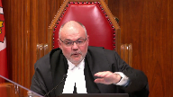
:::

And so the dissenting justice at the Court of Appeal looked further afield, like the Crown does, right?

Look at the photos, look at the trauma, look at this, look at that, that occurred in the previous few hours, whereas the majority was concerned more with the circumstances of the call itself and did not think that looking further was helpful.

That's how I understood it, and is that a fair kind of way of looking at it?

**Speaker 2** (00:48:51): Yes, I agree with that.

::: {.column-margin}
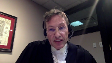
:::

I think one of the things I'm trying to say is one doesn't, Justice Gopal could have made his exact same point as he did without using the word micro context.

In fact, he also used the word macro context and Justice Van Oosten had used the word kind of like, I think the greater context.

So, I don't think he had done anything, you know, untoward or novel in this.

He's just, like I say, he's zoned in on a couple of, key parts of the evidence in question being antecedent and the precedent.

And, you know, we just, his Justice Gopal's reasoning in my mind is to something to the effect that it's very plausible that the accused could have been saying on the phone, they are saying, I did it.

You know, he's been talking to his brother about it.

They are saying, I did it, but I didn't.

They're saying that I killed her, but I didn't.

And we have to remember that the witness WS still actually can't be sure about that.

So, the other point that I was gonna make on that, and then I'll quickly leave off for my colleague, is that the other thing you can't do if we're gonna use the word the greater context, for example, as you suggested, as Justice Van Oosten suggested, is that that greater context cannot be built on inadmissible opinion evidence.

So, that's a real problem in this case, is that part of what's being treated as the macro kind of greater or macro context is actually inadmissible evidence.

That's actually the issue.

And Mr. Justice Gopal is zoned in on that in the later part of his judgment.

So, because he drew, he quoted from the jury instructions, having to do with the admissibility of the opinion evidence.

And then he followed that along and basically said, you cannot build the macro context based on that.

So, that's my submissions on that, because what I'd like to leave my colleague, Mr. Arbogast some time to speak to the opinion aspect and the jury instructions.

But my only submission then before I leave off on that was simply that should this court actually find that the evidence in question was logically relevant, then it's the respondent's position, as I've iterated already, that it was definitely legally irrelevant.

The prejudicial effect of it far outweighed its probative value.

It's not like a piece of circumstantial evidence, Justice Conrad had made that point in Ferris.

The jury was being asked by the crown to treat these fragments as an admission, which would realistically be dispositive of the case.

And their inclination, which was the concern of Justice Conrad and Mr. Justice Gopal, their inclination would be to find that the accused was guilty based on guesswork or speculation.

If I am correct, this is the general logic on which Justice Sapinka upheld Ferris.

Subject to any questions in that respect, I would turn it over to my colleague, Mr. Arbogast.

**Justice Côté** (00:52:12): Thank you.

::: {.column-margin}
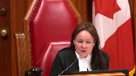
:::

Marlion, I have a question for you, if you'll permit me, Chief Justice.

About the prejudice, what importance should we give, if any, to the fact that other inculpatory statements raising similar prejudice have been properly admitted in this case?

Like, and I mean the statements to the police, the statement to the father. So...

**Overlapping speakers** (00:52:37): Yeah.

**Justice Côté** (00:52:37): Is there any weight to be given to that when we analyze the second branch of the theory test?

**Speaker 2** (00:52:47): If I understand your question correctly, Justice Cote, I think my answer is no.

I just want to make sure I understand your question.

**Overlapping speakers** (00:52:53): Well, the-

**Speaker 2** (00:52:54): The way that I would put it is this, that the prejudice independently, like with this particular evidence, is the type of prejudice kind of in terms of distracting, that kind of both reasoning and the kind of moral prejudice that gets discussed in the case of Andy, this kind of inclination.

::: {.column-margin}

:::

I mean, the way that Justice Goldblum, Justice DeWitt, explained it is this idea of kind of coming backwards, like saying, well, you know, maybe because there's already some incriminatory evidence in the case, maybe that helps Warren interpret or leads Warren to interpret the, whatever he overheard as an admission.

And that's the concern that the jury would do the same thing.

So I don't know that the other statements made by the accused would have any bearing on, if I understand correctly, on the legality of that point.

I think it's an independent concern, if I can put it that way.

**Justice Côté** (00:53:49): Thank you, you understood my question properly.

**Justice Wagner** (00:53:52): Okay, okay.

Thank you, Mr. Nolan.

Mr. Arbogast.

**Speaker 3** (00:53:59): Thank you, Chief Justice, Justices.

::: {.column-margin}
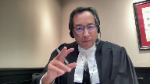
:::

The conundrum in the Crown's case here is that on one hand, the Crown is trying to impute that there were exact words, but there were no exact words here.

And the issue I say is that the evidence from this witness was neither gist nor impression in the legal sense.

It was an opinion.

And the idea that it was an admission was essentially manufactured.

And I'd like to pick up on a point that Justice Brown brought up about this idea of the concept of gist and impression in a broader sense.

And it appears that that idea really applies to cases where there were recollection or a lack of recollection, but that something was actually heard in various cases.

And in this case, it's really important to note that the concept that there were exact words never actually occurred.

And so there are three pillars to this argument.

The first one is that it's important to recognize that there were no actual words heard.

The witness resiled from making that, from giving that evidence.

And yet what we have here, and this is point number two, the actual words were imputed by the trial judge that could be interpreted by the trier of fact.

The third point is that it appears that the concept that it was an opinion was actually troubling the trial judge.

And the Court of Appeal picked up on this.

And to the earlier point that this case was about logical relevance in the Court of Appeal, that is correct.

But the Court of Appeal also had some concerns, this is the majority of the Court of Appeal, about the idea that an opinion was being brought into this case in terms of the jury instructions.

And why was that there?

And so, um...

**Justice Jamal** (00:56:03): Isn't paragraph 16 of the oral ruling on the voir dire finding, though, that it was one of the two?

::: {.column-margin}
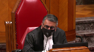
:::

That's the way I read it.

It was one of the two statements.

It wasn't, I don't remember what was said, the gist was of these two statements.

It was rather, it was one of these two statements.

I don't remember the exact words, the gist was as follows.

**Speaker 3** (00:56:27): Yes and I say that's where the problems began in terms of how can it be imputed that those were the exact words when those words were actually resiled from and those words were then sort of created by this idea that yes it was stated by this witness in direct evidence and this is frankly a case that shows that cross-examination is extremely important because cross-examination brought the evidence back to some state where the witness actually stated no I cannot remember the exact words and so how can we then impute that he stated that those exact words or the gist of those words when it wasn't like he stated oh I probably heard something like that

::: {.column-margin}
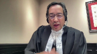
:::

but I can't recall now.

He had a very clear recollection of what happened in that situation where he overheard the phone call and

so what I say and I'd like to take this to a point that Justice Roe brought up about the three steps of relevance probative versus prejudicial value

and then the instruction I say there's actually a predicate step with certain types of evidence that the court has to evaluate and that predicate step is does the evidence in question reach a threshold over which then we engage in a relevance analysis and that is the issue of opinion when you have evidence that has come out as such as in this case it isn't and it appears to be an opinion as opposed to based in actual evidence that's something that's clearly inadmissible in law and that goes to an issue that the court of appeal actually addressed in the reasons and in the reasons at paragraph 180 and this is at page 61 of the appellant's record at paragraph 80 Justice Gopel actually speaks about this he says that the problem that arises from not knowing the exact words is highlighted by the jury charge in this regard the judge told the jury and then I'll go down to sub 86 another witness's opinion as to what Mr. Schneider meant by his words is irrelevant to the question of what he meant it is it is your job and your job alone to decide the meaning of Mr. Schneider's words if you said if you find he said them there can be no finding that Mr. Schneider said those words on the basis of the evidence that was not up for debate here this wasn't the case where you had an issue relating to credibility where it was argued that well maybe he said them and the other side said he didn't say them he clearly resiled and re-

**Justice Martin** (00:59:29): Can I bring you, if you look at the page 887 and the transcript, and I think I know the part that you're talking about here, where in cross-examination, there's a question, what did he actually say, though, the exact words, yes, I don't know the exact words, but that was the conversation.

::: {.column-margin}
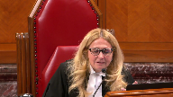
:::

So is that what you're relying upon to say that there was no acknowledgement of the exact words?

Because if it is, I guess what I'm going to ask you is, is this paragraph really saying that, or is it this answer saying as between the two formulations that I've already testified to, the I did it or I killed her, I can't recall the exact words between those two formulations, or I can't recall the exact words in an overall sense, even as to whether he said I did it or I killed her.

**Speaker 3** (01:00:31): I say it's the latter, Justice Martin, in terms of the, and it came out a number of times in the evidence and it's in our, for instance, in the factum, the Respondent's Factum at paragraphs 24 and 25, where even on the Crown's evidence and then in the defense evidence in a number of areas, the witness W.S. states and acknowledges that he cannot remember any exact wording.

::: {.column-margin}
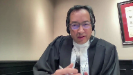
:::

And so it didn't, it wasn't a matter of, I did it or I killed her.

It was all of the wording together.

There was no specificity in those wordings.

And that is why I say that it did not meet the predicate step that this was an opinion.

**Justice Brown** (01:01:15): So when you talk about the opinion, I'm kind of looking I guess pages 144, 145 of the transcript.

::: {.column-margin}
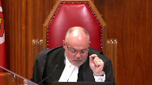
:::

So question or answer, word for word, I don't know the exact words.

Question well, you don't know the words at all, do you?

Answer word for word, no.

Question well, when you say word for word, what do you mean?

So are we getting into the opinion here?

Is this what you're referring to?

In a sense, answer, in a sense it seemed like he was admitting to the missing Japanese student's death and then about nine or ten lines down, there's the section that your friend already referred us to.

It was your feeling about the impression you got.

Isn't that really an answer, yeah, yes.

Is this the opinion section?

Yes, exactly.

**Speaker 3** (01:01:57): That is the opinion.

Thank you, Justice Brown.

**Justice Wagner** (01:02:00): Thank you very much.

Any reply, Miss Hensley?

**Overlapping speakers** (01:02:05): No, thank you.

**Justice Wagner** (01:02:06): I'd like to thank council for their submissions.

The court will take the case under advisement.

Thank you.