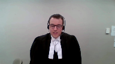

---
title: Attorney General of British Columbia v. Council of Canadians with Disabilities
published-title: Heard
date: 2022-01-12
sidebar: false
---

This transcript was made with automated artificial intelligence models and its accuracy has not been verified. Review the original webcast [here](https://scc-csc.ca/case-dossier/info/webcast-webdiffusion-eng.aspx?cas=['39430']).
---

**Justice Rowe** (00:00:02): The Court.

**Justice Wagner** (00:00:10): Good morning to all.

::: {.column-margin}

:::

In the case of Attorney General of British Columbia against Council of Canadians with Disabilities, for the appellant Attorney General of British Columbia, Mr. Mark Withan and Emily Lapper.

For the respondent, Council of Canadians with Disabilities, Michael A. Feder, QC, Catherine Booth, Connor Belfell, and Kevin Love.

Mr. Withan.

**Speaker 1** (00:00:57): Chief Justice, Justices, this appeal raises the question of whether the British Columbia Court of Appeal unjustifiably relaxed the test for public interest standing and upset the balance that this court struck in Downtown Eastside between accessing and preserving judicial resources and whether this court should in response reaffirm Downtown Eastside or further liberalize public interest standing in accordance with the Court of Appeal's judgment.

::: {.column-margin}

:::

British Columbia's position is that the Court of Appeal's articulation of the test would dramatically expand public interest standing and simply goes too far.

In our submission to find that a chambers judge lacks discretion to deny standing to an organization that seeks to challenge important mental health legislation with no individual co-plaintiff, no adjudicative facts, no committed witnesses, and no history of advocacy for or support from the directly affected individuals whose rights it seeks to litigate based only on an intention that the organization will eventually assemble a sufficiently concrete record for trial.

When there is an ongoing parallel charter challenge brought by three individual plaintiffs that in our respectful submission would transform the balanced multifactorial Downtown Eastside test that properly and rightly guards against immunization from review into a de facto private reference power for organizations to bring increasingly abstract charter claims disconnected from individual rights holders that will generate the equally abstract and at times ill-advised charter analysis that this court has long warned against.

And so I'd like to begin my submissions today with a with a brief introduction to the two main errors that we submit the Court of Appeal committed

and then I hope to follow that with submissions on four discrete issues.

First the legality principle and access to justice, second the importance of individual plaintiffs, third the onus to establish a suitable factual context, and fourth whether the standing test should be relaxed as the Court of Appeal held for comprehensive and systemic charter challenges.

And so we say the Court of Appeal erred first by characterizing CCD's claim as a comprehensive and systemic charter challenge and accepting that such challenges should attract a quote-unquote more relaxed view of the standing test, relaxed scrutiny of the pleadings at the first step and the evidentiary basis for the claim and that's paragraphs 96 and 97 of the Court of Appeal's reasons.

We say this is incorrect and it's inconsistent with Downtown Eastside where this question of a relaxed threshold for systemic claims was argued by the parties and it was not endorsed by this court and even...

**Justice Rowe** (00:03:46): Mr. Whitten, I know you want to roll things out in a logical way.

::: {.column-margin}

:::

I want to raise a point now, and you can address it whenever you like.

I'm not asking you to address it now, but it seems the other thing to me that Downtown Eastside did was to try to ensure that when the rights of individuals are being vindicated, perhaps through the public interest standing mechanism, that they were being pursued and presented in an efficacious way by a group that there was a kind of a union of interests between the group who's seeking standing and the persons who they're seeking to represent.

And one of the things that Downtown Eastside seems to me to be trying to do is to avoid a situation where there's an ill-advised action brought forward, the action is unsuccessful, and then a group which has a legitimate interest is faced with res judicata.

And that, it seems to me, is an additional consideration.

Could I just mention that now?

**Overlapping speakers** (00:05:05): and

**Justice Rowe** (00:05:05): and leave it to you if you wish to address it at some point in your submissions.

**Speaker 1** (00:05:09): Justice Roe and so I will address that in the course of my submissions.

::: {.column-margin}

:::

Just very briefly what I will say is that is one concern raised in Downtown Eastside prejudicing directly affected charter claimants but the the danger is also that the court would be invited into a more abstract theoretical charter analysis that may simply be impoverished and disconnected from the facts on the ground and that's the other side of that coin and certainly alignment of interests between a public interest litigant and directly affected litigants is is a point that is stressed in Downtown Eastside and so I'll just continue with with my introduction to to these two errors.

We say that the court erred by by characterizing CCD's claim as comprehensive and systemic, relaxing the threshold for those claims but even even if this court had endorsed that relaxation in Downtown Eastside, CCD has not brought a comprehensive and systemic charter challenge like in Downtown Eastside.

CCD acknowledges in its factum that it's not advancing a strictly systemic claim.

**Overlapping speakers** (00:06:12): What do you understand a systemic claim to mean?

**Speaker 1** (00:06:15): Yes, Justice Brown, and so maybe what I'll start by saying is that it has been used in a variety of ways in this case, very broad ways, very narrow ways.

::: {.column-margin}

:::

In my submission, in Downtown Eastside, it's crystal clear if you read the factums that what was meant by a systemic or a comprehensive claim was the fact that it was the entire prostitution related criminal regime that was being challenged.

It was very, very broad, and so the court did take into account that one individual being prosecuted might not bring that type of claim that was very broad.

However, this claim is a narrow claim.

This is a single subsection of the Mental Health Act and two carve-outs that are being challenged and it advances inherently individual questions of capacity, whether patients who are declared to be incapable actually have capacity, whether the benefits of treatment are outweighed by the harms.

We say that this is ordinary constitutional litigation that requires individual facts, requires effects and impacts analysis to be through the lens of individuals, and it appears that CCD acknowledges this in its factum.

Now, Justice Brown, just continuing with your question, because it's an important one, because the Court of Appeal places great emphasis on this notion of this being a comprehensive and systemic charter claim that should be entitled to a different standing test.

And in my submission, the Court of Appeal seems to have in mind a different type, yet again a different type of systemic claim, one where individual facts are less important, where it is fine for a litigant to simply advance a generally shared right that might apply, and this is a quote, regardless of the individual factual circumstances that might apply.

And in our submission, that would be a very, very narrow definition of a systemic claim, because the general rule is that charter litigation always requires adjudicative facts, except for in very narrow circumstances where a law is challenged on the basis that it has an unconstitutional purpose.

And certainly this claim that's advancing individual questions around the Mental Health Act, a legislation that's balancing competing rights and interests, can't fit what the Court of Appeal seems to be envisioning as a comprehensive and systemic charter claim.

**Justice Jamal** (00:08:43): Witton because you're referring to the claim and it's always useful to look at the claim.

::: {.column-margin}

:::

What's abstract or lacking in concreteness in paragraphs 32 and following of the amended notice of civil claim which as I understand it is the most recent version which talks in great detail about some of the dangers of forced psychiatric treatment and its impacts because one can have the debate in the abstract it's always useful to look at the pleading.

**Speaker 1** (00:09:11): Yes, Justice Jamal, and so in my submission, paragraphs 32 and onward, they're not particularized by any individual circumstance.

::: {.column-margin}

:::

The very definition of an abstract claim that was adopted by Lauren Saucin in his text is a claim that lacks a grounding in particular facts, and so these are by definition abstract facts.

They are broad categories, and so I do want to say at the outset that I will address the pleadings, I will address the first step of the test, but it can be something of a distraction because the heart of the analysis is not the pleadings, it is whether or not proposing to do charter litigation based on a promise that a record will eventually be assembled is a reasonable and effective way of proceeding when it hasn't been shown that individual plaintiffs are unrealistic.

So I will address that in the course of my submissions.

**Justice Kasirer** (00:10:03): But Mr. Whitten, sorry to cut you short.

::: {.column-margin}

:::

I think the question my colleague asks is a fair one.

And if you look to paragraph 41, the idea that involuntary patience, that's a general circumstance that's shared, as you said earlier, that brings people together beyond the peculiarities of their own facts.

And indeed, you might even make the case that if we had an individual plaintiff whose circumstance was tied to their own affliction, their own mental health issue, they were perhaps subject to some form of psychotropic medication as opposed to electroshock treatment, they wouldn't be the right person to bring the claim.

That there's some virtue in having a general claim around involuntary patients writ large and that the CCD has proper carriage of that.

**Speaker 1** (00:11:08): Yes, Justice Kasir.

::: {.column-margin}

:::

And so in my submission, again, on the pleadings issue, there is this question of whether or not a very broad claim that's not particularized, brought by an organization on behalf of third parties seeking to allege their rights, if simply alleging a very broad category of fact is sufficient.

And the chambers judge said it was not.

And the reason was he said it's not sufficiently particularized to allow the inquiry into the relief side.

In our submission, this is a justifiable application of the principle that a charter pleading that is on behalf of third parties, it's unparticularized, may simply be too general, too broad to sustain a charter cause of action.

That's what the chambers judge found.

We say that's a justifiable application of operation dismantle and the CBA decision from the Court of Appeal.

But I want to be quick to say that if we were wrong, if the chambers judge is wrong on that, well, where does that get CCD in the analysis?

And what it gets is the bare pleading of a charter claim, which is a given in most standing cases.

And that is not a sufficient basis to overturn the chambers judge, because the heart of the chambers judge's analysis is that CCD had not shown why it was unrealistic or impractical for individual plaintiffs to pursue this litigation, whether that be with an institutional anchor co-plaintiff, whether that be by themselves, whether that be with a combination of interveners, however, whatever form that might take.

And more importantly, in the absence of an individual plaintiff, CCD had not met its onus to compensate for that lack of a concrete factual matrix.

It hadn't compensated.

It hadn't shown how it was going to address all of the policy factors that arise.

And so the pleading-

**Justice Brown** (00:13:00): compensation point may be important because because downtown east side as I read it doesn't close the door to the possibility that standing might be granted in the absence of an individual plaintiff what it instead encourages courts to examine is whether the issue will be presented in a sufficiently concrete and well-developed factual setting so it may be not necessarily that a party is required but at least witnesses are required to particularize the claim.

::: {.column-margin}

:::

Do you agree with that?

**Speaker 1** (00:13:35): Yes, I do agree with that, at a minimum, there needs to be witnesses saying, we will lend our adjudicative facts to the charge.

**Justice Brown** (00:13:44): CCD says, and this is the affidavit of Ms. Menard, at the trial of this action, CCD intends to lead evidence from both fact and expert witnesses.

::: {.column-margin}

:::

So what they're, CCD is not saying that this is going to be a hypothetical, that we're going to rely on the end on these abstractions that were pleaded.

CCD says, ultimately at the end of the day, that is at the trial, we will be able to particularize this with the aid of witnesses.

So what do you say to that?

**Speaker 1** (00:14:16): Yes, and in my submission, simply deferring the question of whether or not there's an adequate factual context to some later date essentially defeats the entire standing test.

::: {.column-margin}

:::

High in Zelles, the Church's case, Downtown Eastside, the standing analysis has looked at whether or not there will be a sufficient factual matrix.

And it's never been sufficient for a litigant to simply say, we will eventually meet that standard down the road.

And I want to address this question.

Sure, sure, you look.

**Justice Jamal** (00:14:44): You look at the, you look at the, you address the question in the context of where, what the stage of the case is.

::: {.column-margin}

:::

And if evidence hasn't been tended, you address the issue.

And standing at an early stage of a case may be very different from standing halfway through the trial or at the end of trial.

So that's the first point.

And then the second point I wanted to ask is, if you have evidence of healthcare providers, that this is what we routinely do in administering forced treatment to patients, and they go through the litany in paragraph 41, why do you need a patient if you actually have a healthcare provider saying, this is what we do, you need to be a disaffected healthcare provider?

**Speaker 1** (00:15:24): Yes, Justice Jamal.

::: {.column-margin}

:::

And so adjudicative facts of an individual are a prerequisite for trial litigation except for in exceptional cases.

We're not suggesting that the record would not be further broadened, further contextualized.

However, all of that extra evidence is ultimately designed to shed light on the adjudicative facts.

And that may be useful evidence, but the concern is that the litigation not be divorced from an adjudicative framework, the court not engage in a more abstract or theoretical debate because this court has always said that may lend to ill-advised, impoverished charter analysis.

And so I want to, in order to address this question of the onus, we need to back up and we need to deal with the question of, well, what does an individual plaintiff do for litigation?

And in our submission, what an individual plaintiff does is it satisfies all of the policy concerns that underlie the need for restrictions on standing.

This preference that the court has said in paragraph 37 of Downtown Eastside for individual plaintiffs is not some outdated legal tradition.

It is directly grounded in the policy rationales for standing restrictions, the common law method of rights adjudication.

This court has always said charter rights are best adjudicated in a concrete framework with a real dispute.

And there are real-

**Justice Brown** (00:16:47): Then it seems to me what you're saying, in answer to Justice Jamal, and correct me if I'm if I'm misunderstanding this, this isn't really a case of taking the time through the discovery process, for example, to build up the evidence in the case.

::: {.column-margin}

:::

It's the particularization of the allegations at the outset.

**Speaker 1** (00:17:08): Yes, there needs to be a sufficiently concrete and well-developed context in order for a public interest standing litigant to win standing.

That's part of the test.

And in downtown Eastside, the reason it was standing was one, was because there were dozens of witnesses who are lined up.

There was a directly affected.

**Justice Brown** (00:17:26): How many how many witnesses do how many witnesses would you need?

I mean I think they had about 90 I assume you wouldn't say that well that's the threshold.

What if they what if they had a single witness?

**Speaker 1** (00:17:36): I think that could be sufficient.

I mean, it's always a case-by-case analysis.

There's no reason for 90.

**Justice Karakatsanis** (00:17:42): So can I take you back to the issue which is whether this particular applicant has met the test for public interest standing rather than you know what other individual could bring actions?

::: {.column-margin}

:::

Let's just focus for a moment and I think you've said all we would be left here with is bare pleadings

but I guess I'm coming back to the point that was raised by a number of my colleagues.

Don't we have to look at where we are in the process at a preliminary stage.

Pleadings are meant to plead facts not the evidence material facts and certainly you've been pointed to some quite specific facts.

So isn't there a risk if we take the approach that you're urging us that in fact we'll ignore the admonishment in Downtown Eastside that we should not in assessing the merits of the case do so in other than a preliminary manner.

Otherwise it's you know otherwise we're kind of undermining the whole purpose of having an ability to bring a public interest case.

**Speaker 1** (00:18:57): Justice Caricatsanis, I'd like to move us away if I can from the pleadings question because I take your point about the there can be broad pleadings.

::: {.column-margin}

:::

The broader question is whether or not there is going to be a sufficiently concrete factual matrix to to prove those pleadings.

And in this case...

**Justice Karakatsanis** (00:19:15): But can't we just apply logic to say that you can find witnesses, you can find health care professionals, that the kinds of facts being alleged here are specific?

::: {.column-margin}

:::

And that there's, I mean, was there any cross-examination on the affidavit to suggest this would be difficult to do?

Was there anything to undermine the statements in the affidavit that we will have witnesses who can speak to these specific points?

**Speaker 1** (00:19:46): And Justice Kerikatsanis, so what I will say first is a chambers judge always has discretion to say that the standing issue is premature.

::: {.column-margin}

:::

Both the chambers judge and the Court of Appeal accepted that it was not premature in this case.

This litigation had been ongoing for almost two years by the time that the standing issue came on for summary trial.

And on a summary trial, the evidence, the factual matrix, has been part of the standing analysis since at least Heinzels.

In Heinzels, the lack of facts was fatal, same in churches.

And the fact that there was a proper factual matrix, not the evidence needed to make out the charter breach, but enough to satisfy the court that there will be a proper factual matrix, that is part of the onus that a litigant needs to meet.

And in this case, the reason why there may be some concerns is, well, there isn't a great deal of evidence that CCD is actually in relationship with these individuals.

And CCD has also said they think this can be a challenge that is simply a facial challenge.

They say we'll put together some evidence, but they also say at paragraph 10 of their factum that this is a case where we can just look at the law on its face.

And in our suggestion, that suggests that they have not taken seriously the need for facts, and it only underscores the chamber's judge's concern about whether or not there will be a sufficient factual matrix.

**Justice Moldaver** (00:21:10): Mr. Whitten, it goes a little bit further than that to me, because it seems to me that if you have provisions that on their face, raise serious charter concerns as force treatment does automatically, because it impacts on a person's autonomy and bodily integrity, it seems to me in cases like that, the need for precise factual situations where someone says, I didn't want psychotropic drugs and they have harmed me.

::: {.column-margin}

:::

I wouldn't see any need for harm at all.

The gravamen of the charter breach is just giving, requiring someone to undergo force treatment without giving them a proper opportunity if they're capable of it to consent.

So it seems to me that this whole question of factual matrixes and so on, if not almost a red herring in a case like this is greatly attenuated.

And you add that into the fact that we're at a very early stage and you have in the pleadings, as Justice Jamal and others have pointed out, an undertaking to call witnesses and so on.

It just seems to me that way too much weight is being put on that when I speaking for myself, look at these provisions and say, hey, wait a minute, it looks like there's a problem here.

Just like this court did in AG versus G where people who had been found not criminally liable were deprived of opportunities that other people had.

And so I know Mr. G was a private litigant, but my point simply is this whole notion of factual matrix, it seems to me it gets greatly attenuated when you're dealing with a provision that on its face would appear to be suspect.

**Speaker 1** (00:23:19): And thank you for your question, Justice Moldaver.

::: {.column-margin}

:::

In my submission, this court has said that the general rule is that there have to be adjudicative facts.

Legislative facts shed light on that and contextualize that.

And the exception that this court has recognized is where a law is simply unconstitutional, has an unconstitutional purpose, then legislative facts alone may be sufficient.

In our submission, this is a case that cries out for adjudicative facts.

These are individuals moving through a statutory process.

And at every step of the way, physicians are making notes.

They're recording their capacity assessments, the benefits of treatment.

And so the analysis cannot simply be at a high level theoretical.

It needs to be grounded in individual facts.

Otherwise, there is the concern that the analysis will be disconnected from the facts on the ground and the real benefits that treatment provides to litigants.

These provisions operate in the real-

**Justice Moldaver** (00:24:16): person, if one person is forced to take treatment, that they are capable of saying no to, but they're given it anyways, it seems to me, correct me if I'm wrong, that it's no answer to say, ah, the treatment was good for you.

It worked.

**Speaker 1** (00:24:34): Yes, and so, Justice Moldaver, there's a clear requirement in the regulation that the physicians say that they lack capacity.

::: {.column-margin}

:::

So in our submission, the CCD's theory that people with capacity are routinely denied the ability to make treatment decisions is a misrepresentation of the Act.

**Justice Moldaver** (00:24:54): no opportunity to question that.

I'm sorry and I won't interrupt you again.

That's part of the

**Speaker 1** (00:25:00): little here.

::: {.column-margin}

:::

If they have capacity, if they have capacity to make the treatment decisions, then the treatment needs to be voluntary.

That's the way that the regulation is structured.

And so in my submission, just going back to what is the need for this individual factual matrix, what it does is it satisfies all of the policy concerns that underlie the need for restrictions on standing.

It ensures that there will be adjudicative facts, that the courts will remain focused on individual rights holders, that justifies the use of scarce resources, that the institutional strengths and capacity of the judiciary will be respected.

There won't be an abstract inquiry.

That's what an individual plaintiff does and our point is that when a public interest organization seeks to litigate the Charter rights of third parties without that assurance to the court, there's simply an onus.

There is an onus that they compensate and that's through the Downtown Eastside test and that's where CCD's claim fell short.

**Justice Karakatsanis** (00:25:56): Mr. Whitten, if I can come back to the, actually to the first question Justice Roe asked you, and to the point that's being made by a number of my colleagues, including Justice Moldaver.

::: {.column-margin}

:::

When as a, as a judge, as a trial judge, as an appellate judge, my biggest concern is that an individual who raises a charter challenge will do so in circumstances where they are not able to bring, to bring forward the appropriate evidence to allow the proper charter decision to be made.

That is always a key consideration, particularly in a case where the individual that you're saying needs to, you know, will bring the best adjudicative facts to the table is, is somebody who lacks capacity.

The rights that are being challenged here are the rights of, of people who do not have the capacity, who face particular challenges in bringing forward individualized suits.

Why wouldn't we be able to look at this and say for this specific issue, for this specific challenge, charter challenge, in this context, you have to take a broader view and ask the question, are we going, is there going to be a sufficient basis, individualized or factual basis for the, for the court to make a proper charter ruling?

Isn't that the focus?

I just, your submissions have all been, but there may be individuals who should bring this and that an individual's experience is really the key issue in a case like this.

And I'm having trouble accepting that particular premise.

I'm sorry, it's not really a question, but I thought I should flag for you what's really concerning me about, about your submissions. Yes.

**Speaker 1** (00:27:52): and thank you Justice Kerkatsanis and so in my submission yes there does have to be an individual fact matrix there are different ways that that can be accomplished there are also different ways that public interest organization organizations can participate and fund that litigation so starting at the one end of the spectrum there have been at least a dozen constitutional challenges to mental health regulations involuntary committal provisions brought by individual plaintiffs sometimes with interveners assisting in at least one case with a public interest organization becoming a party once the adjudicative framework has been set and so we're not suggesting that that a single individual needs to marshal the whole record what we are saying is when we are on the other end of the spectrum of public interest litigation and where an organization seeks to litigate charter rights and they don't have a co-plaintiff they haven't identified any witnesses is that there there is an onus a number of policy concerns then immediately arise will will there be a sufficient fact matrix what sort of an inquiry is the court going to be invited into and and and it needs to be more than simply saying there will be evidence if if all that is required is is saying we have a proposed charter claim and we will put together evidence at at a later point all of the emphasis in downtown eastside all of justice Cromwell's emphasis on the need for a concrete fact matrix uh looking if there's specific and factually established complaints a suitable adversarial context all of that essentially gets reduced into a bare procedural requirement to say there there will be evidence we will call directly effective

::: {.column-margin}

:::

**Justice Côté** (00:29:36): Mr. Whitten, I understand that when the lawsuit was filed, there were co-plaintiffs and there were specific facts alleged in the statement of claim.

::: {.column-margin}

:::

So it was amended and the specific facts disappeared, but one of the arguments put forward by CCD is that the substance of the allegations have not changed.

Although we don't have the specifics, they say essentially the substance of those allegations remained the same after the amendment.

So should we not look at the substance of the allegations instead of having detailed specific facts?

**Speaker 1** (00:30:23): Justice Cote, I think your question largely goes to the first step of the analysis, and CCD says that we haven't changed the substance of our claim, it used to be grounded in individuals, now we're alleging more broad categories.

::: {.column-margin}

:::

And that is their argument for why there should still be a justiciable issue raised on the pleadings.

However, the flip side of that point is that the Court of Appeal grounds its analysis on the fact that this is actually a substantially changed action, it's now a comprehensive and systemic challenge.

And that's why the Court of Appeal says there should be a relaxed view of the standing test, we can take a relaxed view of the pleadings.

But yet, as you point out, CCD is saying, we intended to bring this action with individuals, nothing has substantially changed.

And so I think your point actually shows how the Court of Appeal has gone off in the wrong direction, with respect, by seizing on this notion that this is a comprehensive and systemic charter challenge, where an individual fact matrix may be less important.

In our submission, that is a very rare case where individual facts are of less importance.

I think an example, and maybe Justice Moldave, this may go to your point about the importance of adjudicative facts, we would acknowledge that there may be cases where adjudicative facts are of less importance to the impacts and effects analysis that typically needs to be grounded in individual circumstances.

And I think the Vren case is a good example of that.

There was some question in Vren about whether Mr. Vren had standing to challenge all of the provisions of the Human Rights Code or just the one that affected him.

And of course, he had direct standing and the Court said, well, adjudicative facts for all these different provisions is really not going to add anything because it's obvious that gay people have been discriminated against, and it's obvious that precluding them from bringing human rights challenges on that ground is going to exacerbate disadvantage.

And so the Court said that's a scenario where adjudicative facts are going to be less important.

But that is not this case.

And I think CCD acknowledges this in their factum.

These provisions ultimately operate in the real world.

It's a delicate and difficult balancing between the need for treatment.

**Justice Moldaver** (00:32:43): I don't disagree with any of that, Mr. Whitten, but I look at this case at the moment as this.

::: {.column-margin}

:::

There is a serious charter issue, charter challenge before us by a group that it would certainly appear, I mean speaking for myself, that they have a genuine interest in this, despite comments made by the learned trial judge.

And so when I say that steps one and two are met and then we look at the legislation itself and say, hey, wait a minute, this raises some facial concerns that are serious.

I guess what I'm saying is at this stage of the proceedings, the worst that can happen is that if this group is given public interest standing and they get to discoveries and it turns out that they can't find anybody or they don't have any witnesses, well, maybe we end it then.

But why would we end it at this stage?

That's what Justice Jamal sort of started off with.

Why would we end it at this stage when you have two out of three out of three issues that are very strong, it seems to me, and one that is attenuated in the circumstances?

In other words, adjourn, don't deal with the motion at this point.

Keep it in reserve.

It may well be down the road that you will have to close them down and deny them standing.

But what have we really lost in the face of what appears to be a serious charter challenge that affects thousands and thousands of people who are involuntarily committed?

**Speaker 1** (00:34:31): Yes, and Justice Moldaver, as far as I understand the law, once the litigant is granted standing, they have standing.

That issue is not revisited and so there is no notion of provisional standing where the requirements of the test can be met at a later stage.

**Justice Moldaver** (00:34:46): at that you can move to strike the whole case if in fact there's no basis on on what you're saying if after discoveries there's no evidence and you want to say well this is essential because you really don't have a cause of action here there are methods that you can use so

**Speaker 1** (00:35:03): And so the court has said that in order to preserve judicial resources and in order to save judicial resources, this standing issue is appropriately dealt with on a preliminary basis.

::: {.column-margin}

:::

Here, we were two years into the litigation when the standing issue was resolved.

And it's trite law that there is an onus on a defendant in a summary trial to put their best evidentiary foot forward.

There is no respondent's veto where you say.

**Justice Brown** (00:35:34): Again, this is not a question of evidence, it seems to me.

::: {.column-margin}

:::

It's a question of particularity of allegations.

This isn't a summary trial scenario where a plaintiff in a personal injury case because of limitations, concerns, sues.

Defendant moves to strike, plaintiff says, well, I need time to build up a case because my symptoms haven't stabilized.

This is not so much allowing for time to prove the case so much as to make it, isn't it?

To make the, or to allege it.

**Speaker 1** (00:36:07): It's to particularize it, but it's also to demonstrate that there are individuals whose charter rights are potentially affected.

**Overlapping speakers** (00:36:17): Who will-

**Speaker 1** (00:36:18): lend their adjudicative facts and establishing that and if you look at the standing cases that we've we've cited in our in our condensed book you'll see that it is routine that at a standing at a public interest standing summary trial litigants come forward and they say we have these individuals and they will not they

::: {.column-margin}

:::

they do not want to be a plaintiff but they will lend their adjudicative facts they will explain how this legislation impacts them and affects them

**Justice Brown** (00:36:43): That's the that's the root of the issue here right that's where this case turns on is is whether that assurance in the in is in Ms. Menard's affidavit is sufficient to meet the third step of Downtown Eastside.

**Speaker 1** (00:37:00): Yes Justice Brown I would say that is a core issue and in our submission if that is enough that is a dramatic expansion of public interest standing because again recall that how that onus was met in Downtown Eastside was again dozens of witnesses a directly affected litigant who had been convicted multiple times under prostitution related offences and an organization made up of sex workers and Justice Cromwell says I am satisfied that there will be a sufficiently concrete fact matrix it is it

::: {.column-margin}

:::

it's about particularization

but it is also about evidence and if

**Justice Jamal** (00:37:36): Well, there's a difference between how somebody chooses to establish standing and what's required to establish standing, because you say you're applying Downtown Eastside, but I look at what's set out in paragraphs 39 to 42, which are the operative paragraphs here, and we're dealing with public interest standing.

::: {.column-margin}

:::

So, by definition, we're dealing with somebody who doesn't have standing as a right.

The test that you're proposing seems to be, as I hear it, you either, as a public interest litigant, you either have to have a co-plaintiff with standing as a right, or you need to have at the test, as a legal requirement, in order to get standing, somebody who could be, who could have private interest standing as a witness who's willing to give evidence at the standing hearing.

That may be how somebody seeks to establish standing, but I don't see that falling within anywhere within the test enunciated in Downtown Eastside.

**Speaker 1** (00:38:29): Yes and Justice Jamal, we are not putting forward any universal strict requirements for the standing test and I think there are different ways that a litigant might be able to show that there will be a sufficiently concrete and well-developed factual matrix.

::: {.column-margin}

:::

I think the most common one in my submission is to have affidavits from witnesses saying we will not be plaintiffs

but we will be witnesses and that's not ideal to have litigation that's not framed with a plaintiff to facilitate discovery, to facilitate document production.

It's not ideal, it can be more amorphous charter litigation but the court will make do with that in order to preserve the legality principle to make sure that issues do come before the court.

**Justice Rowe** (00:39:12): I wonder, Mr. Whitten, if as a practical matter, and I don't want to be too cynical here, but I do want to be realistic.

::: {.column-margin}

:::

If the British Columbia Court of Appeal approaches to be followed, there's an incentive, is there not, for someone to be first past the post to say, I want to represent this group.

I'm the one who's going to do it.

Oh, and by the way, I want full costs, whether I win or lose.

And if I get the full cost order, then I'll go look for some witnesses and some evidence.

But I've already got my hook in to the case, because I'm the first one who's filed.

**Speaker 1** (00:39:58): Yes, and Alberta has a line for this in their factum.

::: {.column-margin}

:::

They say it's a claim in search of a case.

It's not the way that charter litigation has typically taken place because of course, charter litigation concerns important factual issues and this court has always wanted that assurance that it won't be invited into some sort of inquiry that doesn't look like dispute resolution, that isn't concrete.

That's been the concern this court has articulated in Danson and McKay and many other cases and in our submission, it was not improper, not surprising for the Chambers judge in this case to say you haven't shown why any of these thousands of individual plaintiffs couldn't act if supported as a plaintiff.

You simply haven't shown it on the evidence and you haven't satisfied me that there will be a sufficient factual matrix because all you have done is say that it's your intention to call witnesses.

That has never been enough on the standing test and in our submission, that would push all of the work for the public interest litigant to a later stage.

They can simply defer that and our concern is that that starts to look like a private reference power.

A litigant simply has to say there will be evidence and we would like this legislation reviewed.

We're not saying that public interest standing isn't important.

We're not saying that this test is particularly onerous or impossible to meet.

We're simply saying there is an onus.

The court does need this assurance that these policy concerns that arise when there is an organization whose rights are not impacted but who wants to litigate others rights.

There are policy concerns that arise in that circumstance and there's a test for meeting it

and I think the Good Spirit case out of Saskatchewan is a very useful illustration of some of the pitfalls of public interest litigation.

A case where there was a public school board that essentially approximated the rights of religious minority students and launched the court into what essentially was an abstract debate about funding policy in the guise of charter rights and at the end of a 51-day trial after the standing question was put off multiple times by the trial judge, the court of appeal says standing never should have been granted.

An enormous waste of resources.

So there are real policy concerns that need to be dealt with up front at the standing test because it is and perhaps CCD is their motivations are perhaps unassailable but of course you have to think that this is going to be the test that governs all public interest organizations and there can be organizations that wish to advance their policy goals through the courts using

**Justice Martin** (00:42:42): The east side standing test give us the ability to distinguish between when public interest standing should and shouldn't be given especially when we take into account things in the real world where we know that even if you do have an individual plaintiff that individual plaintiff in a charter case can choose to make their case based on their own personal experience they can do it based on government reports and and government statistics as to who has had the same problem they can do it in a systemic basis they can have expert reports they can choose any which way of doing that so when we look at a private individual and I'd like you to refer to the Chuelli case out of Quebec where this was an individual plaintiff who had but a passing reference or a passing experience with the Quebec health care system but nevertheless could mount their constitutional challenge based on expert opinion based on third-party witnesses and so why should we in this kind of case put the not take into account that what you're talking you you can have a motion for particulars there's different ways in terms of evidence that that you can deal with that and and it just seems to me that we need to look at the whole range here to say not force one particular manner of presenting a case on somebody knowing that individual plaintiffs have a very wide specter of how they can present their case and and I guess I get to the at the end of thinking about this I ask you a very basic question so could this entire case be resolved if the CCD has an individual plaintiff that joins now I mean it seems to me that that might be a little bit of form over substance when we have an affidavit that says that there's going to be concrete evidence of adjudicative facts

::: {.column-margin}

:::

**Speaker 1** (00:44:57): So what I can say, Justice Martin, is that the AGBC did not challenge standing when there were two individual co-plaintiffs.

::: {.column-margin}

:::

We did not launch a preliminary standing application when it was CCD and two individual plaintiffs.

That's a relatively uncontroversial form of public interest litigation where there is the institutional anchor plaintiff that can support, but there is no compromise of the factual matrix because there are the individual co-plaintiffs.

Where it's more concerning is where an organization says, we don't think that we need those individual facts.

And yes, CCD has said, we will put together a record, but they are also maintaining that they can challenge this law on its face.

And that's a very narrow category of constitutional case that can go forward in that way.

And then certainly in the Danson case, that was the argument.

We think this law is unconstitutional on its face.

That's what Mr. Danson said.

And the court said, no, the court cannot be invited into that sort of an inquiry if where it doesn't have the insurance that there's going to be a concrete factual matrix to ground the analysis of individual effects and impacts.

Just a quick word on the Chuli case.

In Chuli, of course, Mr. Chuli was a member, he was someone who participated in the Quebec public health care system.

And so he did have standing, the court did say that he was a member of the Quebec public health care

**Overlapping speakers** (00:46:26): as did any member of the public.

**Speaker 1** (00:46:28): Right, right.

::: {.column-margin}

:::

And so then, and then the court also took into account in Chuli that it was more of a, perhaps more of a broad claim as opposed to resting on individuals.

And that was criticized by Kent Roach in an article that we have cited at tab 19 of our condensed book.

And he, he actually highlights Chuli as, as illustrating the pitfalls of public interest standing.

He said, this is a charter analysis of, of the impacts and effects of this system on individuals that cannot take place at an abstract theoretical.

It needs to be grounded in, in individual circumstances.

And so he was highly critical of the way that the court allowed the charter analysis in that case to rest at a, at a more theoretical and high level place.

So I would, I would commend that article by, by just, or by, by Kent Roach, which is, which is titled Medicare and public health, I believe is what it's called and it's referred to at tab 19.

Now, I do want to go back to the second error that we've alleged, which I have not touched on at all.

And that is the court of appeals modification of the standing test.

And what we say is they upset the balance that this court says is essential between ensuring access to the courts and preserving judicial resources.

And in our submission at paragraph 79 and other paragraphs, what the court of appeal effectively did is it pushed down the scales on the side of this balancing, on the side of granting standing.

The court said that the access to the courts, essentially a grant of standing is the key component of the standing test that gets particular or extra weight in the analysis automatically.

And in so doing, the court demoted all of the other policy factors that this court has long recognized that need to inform the standing analysis, the preservation of judicial resources, the importance of a concrete factual matrix, a preference for individual plaintiffs, the proper role of the courts.

All of those are rendered secondary.

And in our submission, perhaps the easiest way to highlight the problem with this is that every time a litigant seeks public interest standing, they are seeking access.

And so if the court says that access is the predominant factor in the test, it almost makes standing presumptive.

Access and the legality principle are one factor.

They are a factor to be weighed on a case by case basis.

And so this was a position that was urged on the court by the interveners, recognize access and legality as the key components.

And in our submission, it fundamentally changes the public interest standing test.

The Court of Appeal conflated the legality principle in Downtown Eastside, which is concerned rightly with laws being immunized from review.

It conflated that with a general goal of access to the courts and then made that goal of access the key component of the standing test.

So our submission is clear from Downtown Eastside.

The legality principle is not always engaged, doesn't universally favor standing.

The legality principle reflects a more nuanced concern that no law should be immune from challenge.

And so our position, and we set this out in our factum, this is taken from Downtown Eastside at paragraph 50, is that the legality principle accounts for access to justice concerns that arise where individuals from a vulnerable community are unable to act as a plaintiff or where an issue has consistently evaded judicial review.

But when there are individual plaintiffs who are available, when there is a parallel challenge as there is in this case, that alleviates concerns about immunization from review.

And the significance of the legality principle will be diminished as will access to justice concerns.

They don't warrant particular weight in that circumstance.

It has to be a case by case assessment.

And this is my submission crystal clear from Downtown Eastside and also the church's case.

And the same would go for a scenario where there are real concerns about the suitability of an abstract constitutional challenge without an individual plaintiff.

The legality principle, access to justice, they do not override the analysis.

They don't prove.

**Justice Brown** (00:51:10): You keep coming back to individual plaintiff, but I think I have your concession that that's not necessary.

What you need is a presentation of the issue in a sufficiently concrete and well-developed factual setting, which could in theory be established by a single witness.

Is that not correct?

**Overlapping speakers** (00:51:27): i think it could it could in theory be established by a sufficient single witness um that might not

**Justice Brown** (00:51:32): It may be that I'm coming off as pedantic

::: {.column-margin}

:::

but it's an important point because because Chief Justice Hinkson talked about an individual plaintiff and while I may be sympathetic with some of his analysis, I'm not sure that that is consistent with Downtown Eastside and I think I have your concession on that

but I just want to confirm.

**Speaker 1** (00:51:53): In my submission, I think there is reference to individual plaintiff, but the fundamental point was there needed to be an individual fact matrix to ground the charter analysis.

I do not read the chamber's judge's decision as requiring an individual co-plaintiff in every case, and certainly that is not a requirement.

**Overlapping speakers** (00:52:09): There are-

**Speaker 1** (00:52:09): there are examples of public interest litigation where in the in the line of downtown east side where a litigant comes to a standing determination and they say this is how these charter issues are going to be contextualized we do have individuals aligned with us whose rights are at issue they will explain the impacts and the effects you don't have to you don't have to prove the charter breach you have to satisfy the court that there is sufficient alignment and there will be a inadequate fact matrix and and that has been done the administrative detention litigation in bc is an example of that and so

::: {.column-margin}

:::

**Justice Rowe** (00:52:43): Mr. Whitten, very briefly, when I was in law school, which was a very long time ago, professors would come in and they would say, I've got an interesting question for discussion today.

::: {.column-margin}

:::

Let's examine this topic and understand it more fully and develop our comprehension of it.

And I'm wondering whether if you open the door too far, if you make it too easy for public interest litigation to go ahead, you get the courts being used as a kind of a substitute for the classroom.

And so I have an interesting scholarly question I'd like the court to answer.

And I'm wondering whether that's really what courts are for.

**Speaker 1** (00:53:33): that that is a fundamental concern that underlies the need for restrictions on standing.

::: {.column-margin}

:::

There is no shortage of public interest organizations that wish to get involved in litigation.

The concern is that when they do so, that the process of examining these Charter Rights does not devolve into a more theoretical abstract debate.

It can be inconvenient marshalling individual fact witnesses.

Sometimes it is easier to find academics and expert witnesses who will opine on law's effects at a broad level.

But this Court has always said it needs to be, that analysis needs to be in light of educative facts.

Expert witnesses contextualize.

They shed light on the facts.

And yes, so that is a concern.

If that is a concern that this Court has recognized, certainly in the Church's case in Downtown Eastside, if standing is too liberalized, that it can strain the proper role of the Courts.

In Borowski, 1989, this Court said that when the Court is invited to adjudicate important Charter issues without an individual fact matrix, that can, it can become advice giving, legal advice giving, and it can strain the role of the Courts in certain circumstances.

And so just to come back to this question of the rebalancing that we submit that the Court of Appeal engaged in, we say that access to the Courts using judicial resources, it is one half of the equation of the overarching purpose to strike a balance that the standing law does.

And access using judicial resources, it can't be the key component, the driving force of the test if this test is also expected to protect and preserve judicial resources.

And it is.

And this is the point in my submission that Justice Abella makes in the Delta Airlines case at paragraph 62, where she says access to justice demands that Courts and tribunals be encouraged to, not restrained from, developing screening methods to ensure that access to justice will be available to those who need it most in a timely way.

That is why Courts develop standing rules in the first place, and she cites to the Riniac case.

That was a dissenting judgment, Justices Moldaver and Karakatsanis conserved, but it's essentially the same point that was made by unanimous Court in the Church's case where this Court said Courts operate at or beyond full capacity dealing with directly affected litigants.

And so a significant influx of public interest litigation would threaten, threaten the proper operation of the Courts.

That's what this Court said in the Church's case.

**Justice Kasirer** (00:56:17): On this connection between the principle of legality and access to the courts, what's the relevance that we're dealing here with a disadvantaged or marginalized group?

::: {.column-margin}

:::

In Downtown Eastside at paragraph 51, Justice Cromwell made plain that he saw that this was a particular category of circumstance, while it didn't in and of itself amount to a license for all public interest standing to be granted.

It was a factor in measuring the importance of access to the courts.

What's your thoughts on that?

**Speaker 1** (00:57:01): Yes, Justice Casir.

::: {.column-margin}

:::

And so in Downtown Eastside, the court makes it clear that whether or not a proposal by a public interest litigant is going to be reasonable and effective, that third factor, that is conducted in light of the realistic possibility for an individual plaintiff and the assurances that come along with an individual plaintiff.

And so to meet the onus at the third factor, typically a litigant shows that individual plaintiffs are not practical or unrealistic.

That was demonstrated with direct evidence in Downtown Eastside.

The Supreme Court, this court, accepted that no individuals were willing to come forward as plaintiff.

Whereas in this case, despite the fact that there have been over at least a dozen constitutional challenges with individual plaintiffs, CCD simply said it wasn't realistic.

They generalized about this large group of directly effective plaintiffs.

And we say that's simply inappropriate.

If you read some of the cases concerning challenges in voluntary detention, you'll see that there are some very sophisticated individuals who also have mental illnesses who have brought these challenges.

One of the narratives in the McCorkle case, the previous constitutional challenge to the Mental Health Act in BC, was a physician, was a doctor.

And so that is one part of that onus because the analysis is in light of the potential for individuals.

**Justice Brown** (00:58:27): And just on that, I guess we have to be careful to avoid assuming that just because one at some point did not have capacity, that one will never regain capacity.

And in fact, the point of the treatment that's being administered, presumably, is to bring them to a point where they may well have capacity.

**Speaker 1** (00:58:45): Certainly, and I would say that anyone who has been involuntarily detained and has a diagnosed mental illness would have standing.

::: {.column-margin}

:::

They don't need to be in a psychiatric facility to have standing.

I think that would be a very technical, formalistic argument.

In my submission, any of the thousands of people in British Columbia, many of whom are going to be sophisticated, educated.

**Justice Brown** (00:59:08): And bearing in mind though that the issue is not whether they can have standing, the issue is whether they can be a fact witness.

**Speaker 1** (00:59:15): Yes. Yes.

::: {.column-margin}

:::

And that would provide the court with the assurance that it won't be invited into an abstract theoretical debate, that it won't have to entertain arguments, which this court has said courts shouldn't have to entertain arguments about this law is simply unconstitutional on its face.

That gets cut off ahead of time.

That's what Danson says.

Those sort of cases should not even go forward.

The court shouldn't be invited to make those sort of general sweeping pronouncements, which may prove to be incorrect.

They can bring the legitimacy of constitutional review into disrepute.

This court has always cautioned against that sort of exercise.

I can see I have one minute left.

And so what I would like to say is that ultimately, even if we defend the Chief Justice's analysis at the first factor, but even if there was an error at that step, all that that accomplishes for CCD is the bare pleading of a charter issue that does not undermine the chamber's judge's key findings that CCD had not proved that was unrealistic to expect an individual individual plaintiff to participate, that CCD had not demonstrated a sufficiently concrete and well-developed factual matrix.

And if the chamber's judge was right, that CCD's claim was not a reasonable and effective means of bringing the issues to court, then the denial of standing should not have been overturned.

In Downtown Eastside, this court gave a clear direction that the three factors are to be weighed cumulatively.

They are not independently operating tests, but that is essentially what the Court of Appeal did in this case by focusing only on the first factor.

And as a result, they did not take into account the core issues.

I haven't even talked about the parallel claim, but it's dealt with in our factum.

The Court of Appeal overlooked these core dimensions.

Had they considered them, they would have been required to defer to the chamber's judge's finding and to defer to his judgment.

I haven't dealt with remedy and costs.

In our submission, the CCD is seeking not only to have the appeal dismissed, but also to have a different order than either of the courts below granted.

It was incumbent on them to bring a cross appeal if they wanted to vary the Court of Appeal's order, and they should not be permitted to essentially cross appeal in their respondent's factum because we have not had an opportunity to address that.

In terms of the—

**Justice Wagner** (01:01:37): Thank you.

Your time is up.

I'm sorry.

Thank you very much, Mr. Whitten.

Thank you.

So the court will take its morning break, 15 minutes.

**Overlapping speakers** (01:01:49): the

**Justice Wagner** (01:01:49): So we're back, Mr. Michael Thiller.

**Speaker 2** (01:01:57): Chief Justice, Justices, under the analysis prescribed by Downtown Eastside, CCD deserves standing.

::: {.column-margin}

:::

This court should either grant standing to CCD or, at a minimum, confirm the Court of Appeals order remitting the standing question to the trial court for reconsideration.

First, CCD's amended Notice of Civil Claim raises a serious justiciable issue.

For more than five years, CCD has alleged that provisions of the BC Mental Health Act, Healthcare Consent and Care Facility Admission Act, and Representation Agreement Act infringe the Section 7 and Section 15 rights of people living with mental disabilities, and that the infringements can't be saved under Section 1.

**Justice Brown** (01:02:44): Mr. Federer, I've always been curious about that first branch of Downtown Eastside.

I mean, if the issue were serious, but not justiciable, would we ever hear it?

In other words, is justiciability not itself an independent ground to dismiss an action?

**Speaker 2** (01:03:01): Without question.

::: {.column-margin}

:::

So in my submission, Justice Brown, it needs to be both serious and justiciable.

And I say that there's no doubt that CCD's claim is.

Thank you.

The claim is serious, and Justice Moldaver alluded to this earlier in some of his comments, because these provisions deny involuntary patients the ability to give, refuse or revoke consent to treatment, irrespective of their capacity to make treatment decisions for themselves.

And for involuntary patients who lack that capacity, the provisions deny them the right that all other patients enjoy to have decisions about their health care made by a substitute decision maker.

Every academic who has written on this subject agrees that the provisions are unconstitutional or at a minimum constitutionally suspect.

That includes Professor Isabel Grant from UBC, Professor Michelle Lawrence.

**Overlapping speakers** (01:04:01): Fortunately in our country decisions are made by judges, not academics, sir.

**Speaker 2** (01:04:05): Justice Rowe, that goes without saying, and I agree, but the point I'm seeking to make is that if the suggestion is that there's no serious question here, there's no basis for that suggestion.

::: {.column-margin}

:::

There is no case law, there is no scholarship that goes to the point the Attorney General will ultimately have to make that these provisions are constitutional.

To the contrary, everyone who has looked at this from every university in BC, the Law Society, working through the Law Foundation, funding a research paper, comes to the same conclusion, the Mental Health Act is unconstitutional.

Certainly, we can say that the questions are substantial, that they're worthy of the court's consideration, even if ultimately the academic's perspective is rejected by the court.

They're not frivolous or bound to fail.

And the questions are also justiciable.

Determining whether legislation complies with the Charter is the bread and butter of superior courts.

Section 52 of the Constitution Act requires courts to do that work.

There can be absolutely no doubt that the courts have the institutional capacity and legitimacy to adjudicate the constitutionality.

**Justice Côté** (01:05:10): Mr. Feder, the issue is that whether a court can do that in a factual vacuum.

**Speaker 2** (01:05:17): I do not stand here, Justice Cote, and argue for one minute that the Court can or should do it in a factual vacuum.

::: {.column-margin}

:::

That has never been CCD's ambition, and I will not argue that that should be possible.

CCD has said and has intended from moment one to present a robust factual record at trial.

It has described what some of that evidence will be, and it has, through Ms. Bernard, who is an officer of the Court, sworn under oath that that will happen.

Before this standing issue arose, the parties had agreed that there would be a four-week trial.

It was not my intention to stand up at the podium for two weeks and hold forth about reasonable hypotheticals.

My co-counsel in this case are lawyers from the Community Legal Assistance Society.

They have represented individuals detained under the Mental Health Act for the better part of half a century.

I dare say there is no one in the province with greater familiarity with the legislative scheme, the people treated under it, and the people who administer it.

There is no air of reality to the suggestion that Class and McCarthy-Tetro are going to put on a case, or try to put on a case, devoid of the lay and expert witnesses that Ms. Bernard has sworn under oath that we're going to call.

**Justice Rowe** (01:06:41): I want to move.

::: {.column-margin}

:::

So, if I understand you correctly, you've said that because you're a member of a very substantial and well-reputed firm, and you're associated with counsel who are knowledgeable in this area, that contributes to the argument for granting standing.

And if that is the case, is that something which should be taken into account in future?

**Overlapping speakers** (01:07:09): Yeah.

**Speaker 2** (01:07:09): Yes, I think that the assessment of whether the litigation is a reasonable and effective means of teeing up the issue for determination takes into account what's really happening.

::: {.column-margin}

:::

What's really happening is that one of the largest law firms in the country and the public interest organization most familiar with these issues in British Columbia have agreed to represent one of the most significant disability rights organizations in the country, an umbrella organization with membership across the country, including members of Disability Alliance BC, including members of the National Network of Mental Health.

They've all come together to try to present this case that every academic agrees has merit.

And yes, I think the court should absolutely be cognizant of that and should be cognizant above all of Ms. Bernard's sworn evidence as to what's going to happen and the fact that Ms. Bernard was never cross-examined.

**Justice Rowe** (01:08:05): Yes, but there's an implication.

::: {.column-margin}

:::

I don't want to delay you too much, but the implication is in the absence of serious counsel, that's a factor which speaks against granting public interest standing.

Because if it speaks in favor, its absence must speak to the contrary.

**Speaker 2** (01:08:26): I'm not sure I see it quite the same way, Justice Roe, I think it is one way of satisfying the reasonable and effective means factors, the fact that you have counsel who are thoroughly familiar with the area.

::: {.column-margin}

:::

I'm sure in Downtown Eastside it was not lost on the court that sex workers against violence were represented by the late Mr. Arvey and it would have been silly to disregard the fact that Mr. Arvey had agreed to take on that case, but it doesn't mean you need Mr. Arvey to bring a case.

**Justice Rowe** (01:08:54): Yes, but what does it matter if you have somebody from XYZ Law School who has written one of those papers and says, I want to test this.

::: {.column-margin}

:::

I'm not willing to merely put it to my students.

I'm not merely interested in having it published in the law journal.

I now wish to bring this before the courts and have it tested there.

And is that the sort of basis upon which standing should be granted?

**Speaker 2** (01:09:21): No, that's not, that in and of itself is not sufficient.

::: {.column-margin}

:::

I wish to be crystal clear.

The fact that academics agree that the Mental Health Act is unconstitutional isn't controlling of whether it is or isn't, and it doesn't mean that this litigation is a reasonable and effective means of litigating this issue.

What it does do is help confirm that there is a serious justiciable issue.

The fact that CCD is represented by Klass and McCarthy-Tetro helps show it is one consideration that tends to show that this litigation will be a reasonable and effective means.

It isn't necessary, it isn't sufficient, but it's also not something to which the court should blind itself that there are experienced counsel who are well resourced, who are familiar with the relevant witnesses, familiar with the scheme, have real on-the-ground experience, who are prepared to take this case forward.

**Justice Brown** (01:10:17): Where do we get the information from that they're familiar with the relevant witnesses?

The only thing I saw on the record about witnesses is eventually we'll get them.

**Speaker 2** (01:10:26): Well, there's a couple ways of saying, coming at that.

::: {.column-margin}

:::

First of all, Miss Bernard attests to her familiarity with the relevant population, attests to CCD having originally sued with two individuals and the very careful process that CCD undertook before selecting those two individuals.

And the reasonable inference to be drawn from that is that CCD considered its options and had other options.

Number two, I think the court can take judicial notice of class's role in the BC Mental Health Act legislative regime, and even if the court isn't prepared to take judicial notice of that, it comes straight out of the Attorney General's mouth.

And with that, I would ask you please to turn up tab 11 of my condensed book.

This is a pleading filed by the province in the proposed class proceeding to which my friend alluded, and which he says is a better way of litigating the merits than CCD's case.

And I will return to this later in my submissions, but for now, I'd ask you please to turn up page three of the pleading, paragraph 10.

And you will see that one of the ways that the province seeks to defend the legislative scheme is with reference to the ability of an involuntary patient to get a hearing by an independent panel.

And what is an essential part of that process, according to the province?

A patient can request free legal representation at the hearing offered through the Community Legal Assistance Society.

So that the same organization said here, said tacitly to be incompetent to prosecute this case properly, is pleaded by the province in a different case to be essential to the scheme's constitutionality.

Presumably, if it wasn't essential, it wouldn't be pleaded.

**Justice Jamal** (01:12:33): Mr. Fetter, you probably agree that if there were a fact witness in your material that you could point to somebody with personal experience of the scheme, we probably wouldn't be here.

**Speaker 2** (01:12:45): That's fair, but we also probably wouldn't be here hearing these arguments and having a multi-year debate about standing if instead of arguing that Ms. Bernard, an officer of the court, is a liar when she says lay and expert witnesses will be called, if somebody had written a letter and said would you mind identifying who those lay and expert witnesses are.

**Justice Brown** (01:13:02): Well but that's not

::: {.column-margin}

:::

but that's not what she says she says that CCD intends to lead evidence.

I again I don't mean to be pedantic but

but she's not sort of undertaking to the court she's not even swearing that it will provide witnesses it's it it deposes to an intention and and surely that's significant.

**Speaker 2** (01:13:22): I'm not sure that it is and I'll simply say this if I can put that statement into context.

::: {.column-margin}

:::

If we look at the example of D.C. and McLaren, they started off as suitable co-plaintiffs, they were for a while and then they weren't.

There's no trial date set, the litigation at the time the standing application came on had been stalled not because of CCD but because of the province's document production efforts taking a long time.

We don't know when the case will come on for hearing.

Ms. Bernard deposes to the fact that people who are affected by this scheme experience a great number of challenges including cycles of wellness and how wellness and unwellness including poverty including alienation from care providers and family and so on and so forth and in my respectful submission particularly in the absence of a request for that information by way of a phone call, a letter, a case management conference, a request to cross-examine, anything.

It's quite sensible for Ms. Bernard simply to say this is what we intend to do and if it assists this court I am fully prepared and fully instructed to give that undertaking on behalf of CCD here today.

We will call lay and expert witnesses at trial.

I will not stand up and hold forth about reasonable hypotheticals for two weeks.

It's self-evident that was never going to happen.

What were we going to have a four-week trial about?

And if there was a serious genuine concern about CCD's ability to mount the case that Ms. Bernard said it intended to call why wasn't that concern pursued in earnest by the province by means of the tools usually used when one has a concern about about how a case will be presented and whether it will be orderly inadequate.

**Justice Côté** (01:15:21): The burden is on you at this stage to demonstrate that you have public interest here.

::: {.column-margin}

:::

So it is not because you did not receive a letter from the Attorney General that you can say, oh, this should not be concerned.

It was your burden.

The burden is on you at this stage to demonstrate that you have public interest here.

**Speaker 2** (01:15:39): fully agreed, fully attempted to meet that burden, landed up with uncontradicted evidence that lay in expert witnesses would be called a trial.

**Justice Brown** (01:15:48): But the question isn't whether that's contradicted, the question is whether that's sufficient.

::: {.column-margin}

:::

And I mean, if indeed the CCD is confident that it would have that, then I guess the question in the mind of the Chambers judge might well have been, well, why aren't they able to procure those witnesses now and particularize their allegations?

**Speaker 2** (01:16:14): Well, there's no question that the chambers judge was preoccupied with with why DC and Miss McLaren were not plaintiffs any longer, but I will simply say, and this follows on to a question you put to my friend earlier today, Justice Brown, if the problem is one of particulars, and I don't accept that there's a problem of particulars, but it seems to me that that is really what the complaints about CCD's claim being too abstract or hypothetical really reduce to.

::: {.column-margin}

:::

The solution to that is an order for particulars, not the dismissal of the claim.

And the first step in getting an order for particulars under the Supreme Court civil rules is a demand for them.

No, nobody can.

I'm sorry, Justice Brown, you're muted.

**Justice Brown** (01:17:09): I'm sorry, Mr. Frederick, you think after two years I'd have this down pat, but where would the demand for particulars get you if you haven't found, if the issue is, and just for the sake of argument, the lack of a fact witness, and you're asked to particularize in the form of a demand for particulars your allegations and you're not able to answer that demand because of the unavailability of a fact witness, you're back to where you are now, which is an order dismissing the action effectively, which is what he did, what the trial judge did, so

::: {.column-margin}

:::

**Speaker 2** (01:17:47): Correct, but we short-circuited the window in which to give the particulars.

Nobody gave us, nobody said they were concerned by the absence of them and that we should be made to give them and that if we don't the case should be dismissed.

They just showed up, didn't cross-examine Ms. Bernard and said we want the case dismissed.

**Justice Kasirer** (01:18:05): Can I add to that, Mr. Federer, that Ms. Benard was answering paragraphs 35 to 43 of the application to dismiss, which insists upon the absence of a plaintiff.

::: {.column-margin}

:::

That was the focus of the debate, the absence of the plaintiff, which explains many of the comments of the of the first judge, of the Chief Justice.

And the concession earlier, the fact that what we need is a witness is to me not irrelevant, that in some measure the debate was skewed around the departure of the two initial plaintiffs and the absence of their absence thereafter, which the AGBC seems to have reacted against.

We've moved from there, which is, I think I'm speaking for myself, I think a very good thing, and to focus just on the presence of a witness.

It doesn't answer the question that my colleague asks about, you know, where's the name of the witness, but it does go away to explain what happened below.

**Speaker 2** (01:19:11): I agree with that Justice Kasir and one of the challenges CCD faces in in this case is that the Attorney General's argument has very much been an evolving one.

::: {.column-margin}

:::

When we received the Attorney General's factum in this court we were faced with new proposed requirements for standing that had never been argued.

Certainly were not raised in the notice of application and then and then criticized in the Attorney General's factum for not having anticipated them and let evidence to meet them and that's silly.

**Justice Rowe** (01:19:46): Well, it seems to me that all you've said is that we have an affidavit sworn by a lawyer that evidence will be forthcoming and that that is a sufficient basis to meet a very critical component of the third factor in downtown Eastside.

::: {.column-margin}

:::

And of course, that's readily done.

I mean, it's all you have to do is someone says the evidence will be forthcoming.

I'm an officer of the court.

Here's my signature.

That's sufficient?

**Speaker 2** (01:20:24): No, it's not sufficient, but there's, I'll repeat again, it's uncontradicted.

::: {.column-margin}

:::

There were no follow-up questions, there was no concern expressed about the lack of specificity.

There was no good faith attempt to get to the bottom of this, if I may put it that way Justice Roe.

And I don't say that that means that whatever Ms. Bernard says goes, but I come back to the big picture point.

Let's look at this in context.

CCD is experienced in a number of fields, but it's experienced engaging in legal advocacy.

CLASS is thoroughly familiar with the Mental Health Act, the people treated under it, and so forth.

McCarthy-Tetro knows how to litigate complex litigation.

There's a committee of experts familiar with mental health issues who are directing the litigation, including not only Ms. Bernard, who spent her entire career specializing in mental health law, but for example, it includes the Executive Director of the National Network for Mental Health, it includes academics and lawyers specializing in mental health issues, it includes individuals with lived experience with mental health issues and psychiatric treatment.

In the face of all of that, what is the basis for the suggestion that Ms. Bernard's statement of CCD's intent should be doubted?

There's nothing...

**Justice Kasirer** (01:21:48): Mr. Federer, just to follow up on Justice Roe's question, I'm wondering if you could help me by comparing the circumstance of our case to Downtown Eastside on this point.

::: {.column-margin}

:::

If I understand correctly, Downtown Eastside started with an application similar to this one, a motion to dismiss at an early stage.

Is that right?

**Overlapping speakers** (01:22:11): That is right.

**Justice Kasirer** (01:22:12): And the difference between, if it is a difference, is that Downtown Eastside came with another person named in the application, Ms. Kiselback, who was someone who was working as a coordinator for Downtown Eastside, but who had herself experience in the field that was the matter of the, is there a difference here between the circumstance that we're facing?

::: {.column-margin}

:::

Or is Downtown Eastside a case where there was just an absence of, a similar absence in the record?

I'm trying to understand the importance of Ms. Kiselback there and whatever was in the record in Downtown Eastside, allowing Justice Cromwell to say what he said.

**Speaker 2** (01:23:07): So my understanding, Justice Kisselback, was that Ms. Kisselback was a former sex worker and that her case, if she ever had one, was therefore moot.

::: {.column-margin}

:::

She was no longer doing the thing that engaged these laws.

She had done it in the past and was now working as a support person for women in the Downtown Eastside.

My friend spoke of there being a great number of affidavits before the court in Downtown Eastside.

That is true, and those were affidavits of sex workers.

What he omitted to mention is that those affidavits were not sworn for the purposes of the litigation.

**Speaker 2** (01:23:46): as exhibits to an affidavit, but they had actually been sworn for an earlier research paper.

::: {.column-margin}

:::

Nobody went and got 90-plus affidavits to establish a standing, and if that were the requirement, and to Justice Jamal's point, I don't think the fact that that happened there means that it becomes a requirement in every future case, but if it were somehow to become the requirement, I would say that requirement is a bad one.

**Justice Brown** (01:24:12): I think your friend concedes that that's not the requirement.

I should hope so.

Your friend concedes that in theory, a single fact witness particularizing allegations would be enough.

**Speaker 2** (01:24:24): Right.

::: {.column-margin}

:::

And but that, returning to Justice Kasir, your question, I think the only difference is that there was someone who had previously had standing as of right, who was a co plaintiff.

But this, this, I just want to talk for a minute, if I may, about the casualness with which my friend talks about having individual co plaintiffs, and so on.

I don't do a lot of plaintiff work, I expect my my friend does none.

But I have done some and acting for multiple plaintiffs is no fun.

Multiple plaintiffs have to give, they have to retain the same counsel, they can't be separately represented in BC.

And they have to be unanimous in their instructions at all times.

Otherwise, you can't act.

And it is not such an easy thing to say, well, just bring along an individual co plaintiff and have them at your side.

And that way, we'll be assured that that this will be a proper concrete factual record as distinct from the totally hypothetical abstract one that we fear you're going to saddle us with.

It's not that easy.

And there's a reason why DC and Miss McLaren are no longer co plaintiffs as regards the idea, Justice Brown, that that a single individual perhaps should have come come forward and sworn an affidavit saying they were willing to testify.

Believe me, if I had known that it would avoid all of this, we would happily have done that.

But no one asked for that.

No one suggested that that was going to be the difference between a debate on standing and no debate, quite the contrary.

**Justice Brown** (01:26:10): sorry once again I didn't unmute but of course that's not the requirement.

::: {.column-margin}

:::

The requirement is that is or at least the the consideration under the the third factor under Downtown Eastside is whether the issue will be presented in a sufficiently concrete and well-developed factual setting.

So there's no suggestion here that you need sort of a witness with a

you know a will say affidavit but you need particularized allegations I think to address that particular consideration and I just want to signal to you that the difficulty I'm having Mr. Federer if I haven't made it clear already is we're told that those are going to be forthcoming um

but but but is is is that sufficient to succeed on a summary trial on the issue of standing where that's a consideration at present not down the road um

and and I mean and if not the answer of course is not well then CCD can never have standing it's not

it's it's you know it's never come back it's not never come back it's it's well not now um if that's a duck that you have to get in a row in other words if it is then go get that duck in a row.

**Speaker 2** (01:27:36): And Justice Brown, that was CCD's position.

::: {.column-margin}

:::

CCD's position before the Chambers judge, a position he didn't even acknowledge let alone deal with, was that if he wanted more evidence than what CCD had given, evidence going to the nature of mental illness, evidence going to why individuals couldn't be co-plaintiffs, which was to Justice Casirer's point, the point actually being put against CCD was that there needed to be individual co-plaintiffs.

Ms. Bernard addresses that and says, well, if you need that, that's the same evidence we're planning to call at trial, and you shouldn't determine the standing issue now.

We shouldn't litigate this in slices.

The evidence is overlapping, and we should punt the standing question for determination at trial.

And the Chambers judge neglected even to acknowledge the position.

**Justice Rowe** (01:28:27): Mr. Federer, I'm going to say it and leave it alone very quickly.

::: {.column-margin}

:::

When this court in particular speaks, it generally speaks to the broad framework which governs the law for the whole country.

And so I understand your point, which I take on board, that you're a noted up and coming counsel in an outstanding law firm, and you're associated in this litigation with people who are knowledgeable in the area, counsel who are knowledgeable in the area.

I am troubled, however, if I think we would run into difficulty if we say as a general proposition it's okay for someone to sign an affidavit saying don't worry, there'll be evidence later, that's enough.

And you're kind of stuck on that one because maybe it's the cumulative nature of the test.

Maybe in the circumstances of this case, your point is that look, you know, there's enough substance being brought to bear here that that assurance should be sufficient to fulfill the third factor.

But I have to tell you, sitting on its own, it leaves me uneasy.

It leaves me uneasy because the door is too readily opened to persons who may not be well situated to represent the interests of others, which I come back to my earlier point.

One of the real tragedies that can arise through public interest standing is that a matter is brought before the court in a way that does not provide for a proper vindication of the rights of those whose interests are in play.

And then the matter is decided.

You've got res judicata and it's closed off.

And therefore, I'm inclined to great caution to be assured by reference to the Downtown County side test that the guidance that this court gives is that only parties who we can be confident, who individual judges can be confident will effectively carry forward the litigation should be given the designation of a public interest representative.

So I guess I'm sort of saying I'm looking at this from a great distance, whereas you're bringing us down to the specifics of the case, which is fair enough in terms of representing your client.

But I just want to signal to you that I'm concerned about the general guidance as opposed to the particular circumstances of the case.

I'll just leave it at that.

**Speaker 2** (01:31:19): Justice Roe, I detected your unease before you spoke of it directly.

::: {.column-margin}

:::

And I will say the record is what it is, and I have to defend it here today.

But I will also say this.

To the extent this court is minded to give more general guidance about what ought to be adduced to establish that proposed public interest litigation is a reasonable and effective means of litigating, the court should be mindful of what, for example, has to be done in a class action.

Class proceedings, you spoke of res judicata, Justice Roe.

I don't think there's res judicata here.

I think there is stare decisis potentially as an outcome.

But this will not actually bind the rights of directly affected individuals if this litigation proceeds.

They will be potentially stuck with or benefiting from a precedent.

That's not true of class actions.

Class actions absolutely bind their rights.

And we make this point in our factum.

What the courts require from plaintiffs' counsel in those cases is little.

**Speaker 2** (01:32:24): than the most boilerplate imaginable litigation plan with negligible detail about what's going to happen and no real testing of whether that's realistic.

::: {.column-margin}

:::

The standard is very, very, very low and those are cases where the motive is monetary, typically.

It isn't about vindicating the rights of marginalized people, typically.

It's about getting money and those proceedings do result in res judicata and the concern that the plan for litigating them be realistic and effective and so on is a fairly limited one.

I also- Sorry.

**Justice Wagner** (01:33:04): If I can interrupt, I'm sorry, at this time, just to follow up with your answer and the question of my colleague, Justice Roe.

::: {.column-margin}

:::

We all know that there's a problem of access to justice in this country, in every province.

So we don't have enough judicial resources to deal with all the claims, all the cases.

And we know in this case that two of the co-plaintiffs took their own proceedings aside.

I wonder to what extent there's not a problem here if we increase or we promote additional litigation coming from not essentially the victims or the real plaintiffs like Mrs. McLaren was in this case, but third parties, very professional entities that would institute a charter challenge before the courts instead of having only the real plaintiffs having suffered the damages.

And so I wonder to what extent, given the nature of our justice system, we don't increase the problem of access to justice.

**Speaker 2** (01:34:19): Well, I'll say this, first of all, there is an access to justice problem.

::: {.column-margin}

:::

I'm not sure part of it may well be court resources.

Part of it is the expense of counsel and the protracted nature of proceedings and so forth.

So it's but one small part of a problem that is much bigger.

In relation to the floodgates concern that you're raising, Chief Justice, let me respond in a couple of ways.

One, Downtown Eastside clearly changed the law from what it had been before.

There was no floodgates effect, as far as I'm aware.

Now maybe you say because that's because Downtown Eastside got it exactly right

and I have no problem with Downtown Eastside, but I'll simply say that that liberalization when it occurred didn't result in a parade of unmeritorious cases coming forward.

I'll also observe that this preoccupation with the idea that organizations like CCD or the BCCLA or CCF or what have you, are going to suddenly come forward with unmeritorious cases and the courts will be unable to control them.

It sort of overlooks that there are a lot of cases brought by plaintiffs withstanding as of right that are unmeritorious.

Some are academic, some are fully silly, and it turns out the judges in every province find ways to deal with those cases and to dispose of them at an early stage.

Very seldom do they land up plaguing the courts for very long.

And so while I readily accept the concern about conserving scarce judicial resources, I would echo the comments of Justice Cromwell in Downtown Eastside that the blunt instrument of standing isn't, and a dismissal of the claim for want of it, is not the only way of dealing with that concern.

And I would, in response to many of the concerns that my friend raised in his factum, say these are matters for case management.

You want particulars?

Make a demand.

Get an order.

If we don't give them, you can have the case dismissed.

You want witness lists?

Call a case management conference.

Or even before you do that, send me an email.

Which is what happens in complex civil litigation.

Lawyers work together to bring these cases on in an orderly way.

They don't go running off to court saying dismiss my friend's case because his witness swore an affidavit and neglected to give me the witness list that I didn't ask for.

That's not a sensible, efficient way of treating these cases in my submission.

And there's no reason to load so much into the standing analysis in the way that we seem to be doing here.

Judges know how to manage cases.

It's their job.

And there are lots and lots of private interest standing cases that need to be managed.

And they are through motions for summary judgment, motions to strike, orders for particulars, and so on.

**Justice Côté** (01:37:18): Mr. Federer, am I going too far in saying that what you are asking us to do is essentially to permit private references?

You are going too far, Justice Cote.

I mean, a private... Why?

You are going too far.

**Speaker 2** (01:37:32): Because a private reference would mean that CCD could, as of right, state a totally abstract question to the Court of Appeal and require an answer without adducing any record, without showing that it was a serious, justiciable issue, without showing that it had a genuine interest in it, and I suppose the reasonable and effective means to litigate thing goes out the window because you just have the right to present the question.

::: {.column-margin}

:::

It's a nice rhetorical point that sometimes gets made, but I don't really think it's an apt comparison.

The reference power is quite a robust power for the government and not at all analogous to what CCD is seeking to do here.

**Justice Rowe** (01:38:10): Do you see any light between your position and that of the interveners in this regard?

**Speaker 2** (01:38:15): Well, there are a number of interveners, Justice Roe, as you'll appreciate, and they've taken a variety of positions.

::: {.column-margin}

:::

You'll also appreciate further to our earlier exchange that I'm concerned with winning CCD's case.

I don't need to convince you that there should be a reversal of onus or public interest standing as a right or any of those things.

CCD might have a position, which I'm not advancing here today about them, but my position is that Downtown Eastside is good law and that CCD meets the test for standing prescribed by Downtown Eastside.

**Justice Kasirer** (01:38:52): By the same token, Mr. Federer, isn't it best to acknowledge that sometimes, and I'm thinking about the access to justice and the strained court resources problem, that recognizing public interest standing assists access to justice and helps courts manage problems of being overloaded by in particular in respect of these so-called comprehensive systematic challenges where a private litigant might not be inclined to pursue that kind of litigation or be equipped to do it properly.

::: {.column-margin}

:::

And so that, and indeed without producing Downtown Eastside, there's room for that kind of argument that public interest litigants are motivated in different ways than private litigants are.

**Overlapping speakers** (01:39:49): Thank you.

**Justice Kasirer** (01:39:49): and are often equipped to act.

::: {.column-margin}

:::

I'm moved in part by the comment of the Court of Appeal, and this goes back to the evidentiary point.

At paragraph 111, that they felt that the amended notice of civil claim prepared by CCD pleads concrete and material facts insufficient to sustain, to sustain at this very early pre-discovery stage, the litigation, without straining the courts in some unmanageable way.

**Speaker 2** (01:40:26): And Justice Kasir, I agree with both those sentiments.

::: {.column-margin}

:::

As regards the concreteness of what CCD has pleaded, if you haven't already seen it or your colleagues haven't already seen it, I would urge you to take a look at Schedule B to CCD's fact, and it may have been overlooked.

It's reproduced at tab 10 of my condensed book, and it's simply a table comparing the original pleading with CCD's current pleading.

And you'll see that very little has changed except that instead of pleading facts about Ms. McLaren in D.C., we're pleading facts about people like Ms. McLaren in D.C.

And for all of my friends' 55 or 56 pages of briefing and recurrent statements about the need for concrete facts, we haven't heard why the stuff in the left column is good and sufficient and will lead to proper adjudication, and the stuff in the right column will not.

And my submission is that there's no reason to think that there's anything wrong with the right column.

As regards the first part of your question, Justice Kasir, I agree.

I agree with you, and I agree with what Justice Cromwell said in Downtown Eastside about the idea that a public interest litigant will often present issues in a way that is more efficient and more effective than a litigant withstanding as of right, not only because they can bring a challenge that engages multiple parts of a legislative scheme, as here, but also because they may be better resourced, they may have expertise, and if we're talking about people with mental disabilities or mental health issues, they may not experience and be subject to all of the barriers that those people have and experience, poverty, cycles of wellness and unwellness and so forth.

And so while I understand, of course, the common law traditions of the court and the preference for cases brought by individuals with private interest standing, I wouldn't want to be taken to have conceded that those cases are inherently preferable or inherently more efficient, more effective, more reasonable ways of litigating things than cases brought by organizations like CCD.

**Justice Jamal** (01:42:46): Mr. Fedder, could I ask a question going back to the whether there's a rule that you have to have a fact witness.

::: {.column-margin}

:::

I guess what's striking about Justice Cromwell's relatively short, tight judgment is its statement of broad principles applied purposefully without rigidity and taking context into consideration.

I guess one could say that looking at your presentation, your client's presentation here, you did actually try, I guess, initially to provide fact or plaintiffs withstanding as a right as part of the case.

And the where we are today and where the record is today is having regard to where it started.

So this isn't the case where you started from scratch without a fact witness and said, I've got this lawyer who's got an affidavit.

Just trust us.

It's in the context of earlier having tended that evidence.

And one can speculate as to why those individuals may have withdrawn.

But it really, I guess, has to be looked at through the prism of the flexibility that downtown Eastside calls for.

**Speaker 2** (01:43:57): Justice Jamal, I agree completely with that.

::: {.column-margin}

:::

Ms. Bernard's affidavit was responsive to and sensitive to the context in which CCD found itself, which was an application for summary trial on the issue of standing because the individual co-plaintiffs had dropped out.

And I'm not going to read it to you, but I would refer the court to paragraphs 51 to 56 of Ms. Bernard's affidavit, which is at tab eight of my condensed book, where she acknowledges, I'll paraphrase, she says it's theoretically possible for individual plaintiffs who have mental disabilities and who've experienced the scheme to bring and see through a complex constitutional challenge, but it's not realistic to expect them to do so.

And in paraphrasing that, I put emphasis on the idea of not just bringing, but seeing through.

This litigation has been going on for close to five years.

How many more years will it be before it's run through the appeal courts?

And are individuals who have mental disabilities and who have been subject to forced psychiatric treatment going to remain at all times available to instruct counsel?

And she goes on and she explains why that is.

And she says charter litigation is complex, protracted, stressful, it can attract public attention and controversy and so on.

She explains why those challenges are even greater for people with mental disabilities.

She then describes a careful process CCD undertook in choosing to litigate with DC and Louise McLaren and all of the factors that went into that consideration.

And she then concludes by saying the trajectory of the litigation well illustrates her view that it's not reasonable or practical to expect a constitutional challenge to be prosecuted by affected individuals.

And I would add to that, and I would add to that, even if Ms. Barnard is wrong and it is possible and reasonable and practical to expect that, it isn't really probative of the relevant question.

The relevant question is whether CCD's action is a reasonable and effective means of litigating, not whether someone else's action is.

What would need to be shown to say that CCD's action had ceased to be a reasonable and effective means is that the other action was so much better in the way it was going to present the issues that we didn't need to have CCD's action anymore.

So you know this idea that that individuals could sue, of course they can sue.

My friend refers to challenges having been brought over the last 30 years across Canada.

**Overlapping speakers** (01:46:23): Yes!

**Speaker 2** (01:46:24): challenges have been brought.

::: {.column-margin}

:::

Of course challenges have been brought, of course they can be brought, they'll continue to be brought, some will be brought and discontinued, some will be litigated to a conclusion.

We don't have any evidence about whether they were litigated well or badly, more or less efficiently than what CCD proposes to do here.

And that's one of the difficulties that CCD has faced here.

There was absolutely no evidence put in by the Attorney General to suggest that there was some better way of litigating this issue.

There was no evidence originally put in about another case or even the existence of one.

There was no evidence about another organization better than CCD with a more genuine interest if I may put it that way.

There was no evidence of some individual withstanding as of right who intended to sue.

There was no evidence that some individuals had deliberately refrained from suing such that CCD's action might be unwelcome.

And certainly if we focus on the relevant question there was absolutely no evidence that someone else was going to come along and bring a case more effectively and more efficiently than CCD was.

Now my friend referred in the first minute or so of his submissions to the proposed class action of which he led new evidence in the Court of Appeal challenging the Mental Health Act.

I will tell you that there is no evidence, there was no evidence in the Court of Appeal and there's no evidence here today about the stage of that case, how it will be conducted, or why it will be better than CCD's.

There is no suggestion whatsoever that the Attorney General might consent to class certification so that that case could get on more quickly.

And to the contrary what the Attorney General has actually pleaded in that case is that it cannot be determined on its merits

and I wish to show you that.

We looked at this earlier but the province's response to civil claim is tab 11 of the condensed book.

And there are two particular passages to which I wish to draw your attention.

The first is paragraph four at the top of page two where the province denies the criteria for the criteria for certification of this action as a class proceeding pursuant to section four of the Class Proceedings Act can be met.

The province says the criteria cannot be met.

That includes the criterion of preferability.

Under section 4.1d of the Class Proceedings Act a class proceeding must be a preferable procedure for the fair and efficient resolution of the common issues.

It is totally inconsistent with that pleading to come here today and argue that the class action is preferable to this case.

**Justice Côté** (01:49:11): Mr. Federer, this paragraph 4, this allegation in paragraph 4, is it not a standard denial by a defendant who is facing a certification proceeding?

It's not a surprising denial.

**Speaker 2** (01:49:25): It's not a surprising denial.

::: {.column-margin}

:::

I expect that the province, based on what it's done here, will litigate this class action at least as aggressively as it's litigated against CCD.

I don't know whether it's standard or non-standard, boilerplate or non-boilerplate, but it is a pleading and it is the province's position.

The province says the case cannot move forward.

**Overlapping speakers** (01:49:44): But it is up to the Supreme Court to decide, what is up to a court to decide on certification.

**Speaker 2** (01:49:49): Absolutely, but it does not lie in the province's mouth having pleaded what it's pleaded to come to this court today and say that case is a better vehicle for resolution of these issues than this case.

::: {.column-margin}

:::

The province's position in that case is that it's no case at all.

And if it's not just that they say it can't be certified Justice Cote, if you turn over please to page nine and look at paragraph 49 and 50, the province pleads that the plaintiffs claims are limitation barred.

The claims that these plaintiffs want to bring according to the province are prescribed.

And yet, Mr Whitten stands up and says that case is preferable to this one for resolution on the merits. How so?

If it's prescribed?

We don't know.

It can't be.

Those two positions are contradictory.

**Justice Brown** (01:50:43): Of course, the issue isn't which vehicle is better.

The issue is whether the vehicle that CCD proposes is sufficient to satisfy the third factor in downtown Eastside.

And that's why we're here today to talk to you about the third factor in downtown Eastside.

**Speaker 2** (01:50:59): I completely agree, Justice Brown, and my point is only that the class action can only be relevant if it is better.

If it's worse or the same, then I don't think it allows us to say that CCD's action is not reasonable and effective.

That's fair.

I agree with you, Justice Brown, and my point is only that the class action can only be relevant if it is better.

If it's worse or the same, then I don't think it allows us to say that CCD's action is not

**Justice Moldaver** (01:51:15): At the end of the day, it seems to me we're looking to do justice, potentially.

::: {.column-margin}

:::

And you know, I'm hearing now, this one doesn't work, and that one doesn't work, and nothing works.

We have no access to justice to anybody, and we'll have a wonderful justice system.

**Speaker 2** (01:51:33): I agree with that Justice Moldaver.

::: {.column-margin}

:::

I mean, this particular thing, I'll point out that that response to civil claim was not drawn to this court's attention by the Attorney General.

It was filed more than a year ago.

The only reason we know about it is because we went and searched the registry.

So while my friend filed a factum saying that the class proceeding is better, his colleague was pleading in the class proceeding that it was a nullity because of limitations issues.

And in my submission, that's a shell game. Right?

There are real issues here.

Whatever one thinks of the weight to be given to the academics, there are clearly real issues in relation to the statute deserving of some court's consideration someday.

And we need to get on with this, not play games about, oh, that action is better than this one, but that action is no action at all.

**Justice Moldaver** (01:52:19): what's potentially troubling to me in a way, and maybe it's too hypothetical, but I'll say it anyways.

::: {.column-margin}

:::

A patient who was forced to take treatment who was otherwise capable and competent and didn't want to take it could have been rendered incompetent and incapable by virtue of the treatment that he or she received, and yet, and so that they would be impossible for them to bring on an action because they were rendered incompetent by virtue of treatment that was forced on them, and here we are quibbling over, oh, you gotta have someone that will tell you that forced treatment to someone who is capable of consenting is okay.

I mean, it just, I keep coming back to the fact that on its face, this legislation is highly troublesome.

**Speaker 2** (01:53:14): I agree wholeheartedly with that, and I would say it is quibbling, but it's quibbling of long duration.

::: {.column-margin}

:::

We have wasted years debating about standing rather than the merits, and we have depleted precious resources on the part of CCD, on the part of its pro bono council, having this debate.

That brings me in the next three minutes, I hope, to the question of remedy.

The Court of Appeal remitted the standing question back to the chambers judge.

In my submission, if this court dismisses the appeal, it can substitute a different order under Section 45 of the Supreme Court Act and 50 years worth of authorities interpreting Section 45 that are cited in footnote 167 of my factum.

And I'm not going to take you through those authorities, but what I will say is they make abundantly clear that this court, in dismissing an appeal, can very effectively vary the order of the Court of Appeal and may do so in a way that operates clearly to the detriment of the unsuccessful appellant.

**Overlapping speakers** (01:54:17): So no cross appeal would be needed.

**Speaker 2** (01:54:20): Well, Justice Kasir, the cross-appeal question is an interesting one.

::: {.column-margin}

:::

No cross-appeal is needed here because nothing has been put into issue by CCD.

No aspect of the Court of Appeal's order has been put into issue by CCD that the appellant has not himself put into issue.

We're only debating this question of whether, what should be the outcome here on standing.

The Attorney General's position is judgment for the province on standing.

CCD's position is judgment for CCD on standing.

And I will tell you that that reading of section 45 of the Supreme Court Act was not entirely intuitive to me on the words, but when I went and read the cases cited in footnote 167, I'm going to suggest there's no reasonable debate possible.

**Justice Rowe** (01:55:09): Well, I'll have to read them pretty closely, too, because I've been an appeal court judge for a long time.

::: {.column-margin}

:::

And if you want a different order, I'm going to be very simplistic, you got to ask for it.

And that means you've got a cross appeal.

And if you don't ask for it, you don't get it, because you're not eligible to get it.

But I'll read the 100 cases or whatever it is, but, you know, just first principles.

**Speaker 2** (01:55:30): As I said, Justice Roe, it wasn't intuitive to me either, but far be it for me to criticize this Court's jurisprudence and its interpretation of its own constating act.

**Justice Moldaver** (01:55:43): There's to be nothing stopping this court from granting that cross appeal at this stage to do justice, in my understanding.

**Speaker 2** (01:55:52): I agree with that Justice Moldaver and to the extent you need a formal request on the part of CCD, please consider this that request.

::: {.column-margin}

:::

And there's no, there's no prejudice we have the provinces position the provinces has argued at length as to why CCD should should be have its case dismissed for want of standing.

And in the next 45 seconds I will tell you why we should why we should do this.

The standing issue has been the subject of litigation since 2018.

This court is in as good a position as the chambers judge determine the issue.

Remitting the matter will result in months or years, a further delay and depletion of CCD resources, there's every reason to expect that the province if it loses on standing will appeal, and that we will be in in Groundhog Day, arguing once again through multiple levels of court about standing the interest of justice would be very badly served by that.

Clients priorities and resources change lawyers have careers that evolve.

It is not reasonable or fair to expect that CCD and its counsel should remain committed to a further lengthy fight about standing nearly five years after having started the claim.

It goes to a broader point that I would ask this court to keep in mind as it as it decides this case and here's from the interveners tomorrow.

A test for standing that lends itself to this sort of war of attrition will as a practical matter discourage lawyers who act pro bono or low bono from agreeing to prosecute cases for public interest groups, as opposed to individuals.

It is not reasonable to expect that lawyers who appreciate their highly privileged position, who want to give back to their communities, who want to make a difference are going to undertake cases where they need to spend years litigating.

**Justice Rowe** (01:57:39): Then and then and the basis of this submission, I see no light at all between your position and that of the interveners, which is the door is open.

**Speaker 2** (01:57:50): period.

::: {.column-margin}

:::

No Justice Roe I don't say the door should be open I do say this court should be sensitive to to the fact that if the door is shut very closed or if a very long gauntlet is set up in terms of what must be established to get to standing if as the Attorney General proposes this court adopts vague requirements that that can't be satisfied at a practical level or become very difficult to satisfy as a practical level lawyers bright-eyed bushy-tailed young lawyers who want to help are they're just not going to do these cases nobody wants to spend five years litigating standing I don't want to do it Mr Love doesn't want to do it my colleagues here don't want to do it

I didn't sign up for that nobody would sign up for that it's no fun we want to get on with the merits and and I speaking for myself will go and give my time pro bono to individuals rather than to groups if this is what lies in store

and I suggest that's not true only of me

it's true of everyone litigating threshold procedural issues for years and years and years is not an effective and efficient use of pro bono resources subject to any questions those are my submissions on the standing issue and with the remaining time Miss Booth will address the question of cost.

**Justice Wagner** (01:59:04): Thank you.

**Speaker 3** (01:59:29): Chief Justice, Justices, Mr. Fetter spoke to you about the willingness of council and to take on pro bono cases like this and whatever this court makes of that question as it regards the standing issue it is relevant to costs and just to start out our cost submission CCD is is seeking special costs of the appeal and the proceedings below on a full indemnity basis and we say that this is one of the rare cases contemplated by this court in Carter where special costs are warranted.

::: {.column-margin}

:::

CCD didn't set out to litigate standing, CLAS didn't set out to litigate standing, McCarthy's didn't set out to litigate standing.

This has been a four-year detour at enormous expense from the constitutional challenge and it's frankly a small miracle that CCD is even here today.

Many public interest litigants would be ground down and give up.

Many pro bono counsel will not even take on a four-year odyssey on standing and this cases like this are precisely why access to justice is one of the policy objectives underlying costs and is one of the considerations to be taken into account when taking the exceptional step of deviating from the typical cost rules in cases.

**Justice Rowe** (02:00:49): a general rule that you're asking us to accept or are you tying it to the particular circumstances of this case?

::: {.column-margin}

:::

In other words, if someone comes forward and says I want public interest standing, automatically they get an order for full indemnity or is there something particular to the circumstances of this case which warrants it here?

**Speaker 3** (02:01:10): We are not saying that every public interest litigant seeking public interest standing will get special costs.

::: {.column-margin}

:::

It's the specific circumstances of this case.

And we say it meets the rare and exceptional test standards set by this court in Carter.

The public interest standing issue here is truly one of those transcendent issues of broad public importance.

It transcends the interests, not just of this case and the dispute between CCD and the province.

It transcends any single issue or group or legal right.

It is about whether people who are unable to sue will get access to justice by having somebody stew instead.

And we say that that is one of those truly exceptional broad issues of social importance that meet the first factor of the Carter test.

On the second, CCD, we say it readily meets that test.

That test, it's a pro bono not-for-profit or not-for-profit being represented pro bono.

It doesn't seek charter damages in the case.

It has no economic interest in the issues here.

I see my time is up.

So subject to any further questions, those are our submissions.

**Justice Wagner** (02:02:22): Thank you very much, Ms. Booth.

::: {.column-margin}

:::

So I'd like to thank Council for their submissions for the day.

The Court is adjourned until tomorrow morning at 10.30, Ottawa time, when the Court will hear the 22 interveners.

Thank you very much.