---
title: Yasin Mahad Ali v. Her Majesty the Queen
published-title: Heard
date: 2022-01-14
sidebar: false
---

This transcript was made with automated artificial intelligence models and its accuracy has not been verified. Review the original webcast [here](https://scc-csc.ca/case-dossier/info/webcast-webdiffusion-eng.aspx?cas=['39590']).
---

**Justice Côté** (00:00:00): The Court.

**Justice Moldaver** (00:00:18): There we go.

Okay, good morning, everyone.

This is the case of Yasin Mahat Ali versus Her Majesty the Queen.

Mr. Halati for the appellant, Ms. Dionne for the respondent.

Yes, please, Mr. Halati, go ahead.

**Speaker 1** (00:00:37): Thank you.

::: {.column-margin}

:::

It is a pleasure to appear before this Honourable Court.

I am grateful for the Court's attention and for the unique opportunity to see this matter through to completion.

I was the trial counsel for Mr. Ali and am responsible for all the steps taken during his trial.

This matter has now been examined and evaluated for years and by greater legal minds than myself and the transcripts have been parsed, scrutinized, analyzed and dissected.

For that, I am very thankful because this is an issue where we have to get it right.

This case, as the Court obviously understands, is about strip searches and strip searches are, as described at paragraph 89 of R. N. Golden, one of the most extreme exercises of police power.

I suspect that it is only the tendency in law to refrain from use of absolutes in our language – that strip searches were not labeled as the most extreme exercise of police power.

Golden continues at paragraph 90 saying, strip searches are thus inherently humiliating and degrading for detainees regardless of the manner in which they are carried out and for this reason they cannot be carried out simply as a matter of routine policy.

The adjectives used by individuals to describe their experiences of being strip searched give some sense of how a strip search, even one that is carried out in a reasonable manner, can affect detainees – humiliating, degrading, demeaning, upsetting and devastating.

Some commenters have gone so as far as to describe strip searches as visual rape.

Women and minorities in particular may have a real fear of strip searches and may experience such a search as equivalent to a sexual assault.

The psychological effect of strip searches may also be particularly traumatic for individuals who have previously been subject to abuse.

Routine strip searches may also be distasteful and difficult for police officers conducting them.

A strip search is, in some cases, a state-sanctioned warrantless search that is the equivalent to a sexual assault.

This is what must be justified.

Today the court is being asked to decide what matters during a strip search trial.

The respondent's submissions are all that matters for justifying a strip search.

There's an officer to testify that, subjectively, they believe that drugs were hidden in an accused person's body and that the police must, pardon me, and the reasons why he believes there are drugs hidden in the accused body.

Anything and everything else is irrelevant.

The respondent's submissions are that appropriate judicial consideration of the issue of the circumstance where an accused person says, it was wrong that this was done to me, is, quote, from the trial decision.

There were both subjective and objective for the reasons for the police to believe that they could find evidence by way of a strip search, given the totality of the circumstances, the facts outlined in the search warrant, and the accused actions at the scene of the arrest.

The two issues before the court today are, did the trial judge consider the correct test when determining the legality of the strip search, and were there reasonable and probable grounds to believe that Mr. Ali was concealing drugs, not just on his person, but concealing them in a manner to justify the invasiveness of a strip search.

**Justice Côté** (00:04:39): Mr. Khaladi, I understand that you are describing the two issues before the court and I'm not asking you to do it now but I would like to get your views on section 24-2 when it's time in your argument if we come to the conclusion that there was a violation of your client's rights.

::: {.column-margin}
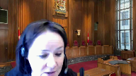
:::

**Speaker 1** (00:04:59): Thank you Justice Cote.

I will address that at the conclusion

but I do have that prepared.

**Justice Brown** (00:05:09): Mr. Lottie, are you still relying on the ground whether the trial judge aired in admitting what you call unreliable hearsay evidence in her assessment for the police grounds?

**Speaker 1** (00:05:20): Thank you Justice Brown.

::: {.column-margin}

:::

I'm with respect to the issue of hearsay I wish to make a clarification the here use of hearsay in this matter is absolutely admissible but it cannot be admissible for any and all purposes.

It's absolutely admissible to show the subjective mind of of Constable Darroch.

But given the circumstances of this trial it should have been limited and very more and as and it should also have been addressed with respect to its reliability and particularly given the objection made which I submit was a properly made objection.

Clarification should have been given to the Council in terms of what the scope of Constable Darroch's evidence could be with respect to hearsay and how it could be used.

Do you accept that reliability is not a question of law? I do.

**Justice Brown** (00:06:34): Okay, then how is this issue properly before the court?

**Justice Moldaver** (00:06:40): Excuse me, just before you answer that, I apologize, but I neglected to say that there is a ceiling order in this matter pursuant to section 487.3 of the Criminal Code.

I apologize for interrupting, but I thought I better get that out there.

**Justice Brown** (00:06:59): So how is that issue probably before the court if it's not a question of law?

**Speaker 1** (00:07:07): Well how that evidence was interpreted is is relevant because this is a situation where subjectively it definitely matters and it is relevant to showing that the police had subjective reasonable and probable grounds to justify the strip search.

::: {.column-margin}

:::

However my submissions are is that it is not rely it is not admissible in terms of the objective evidence or at least was mis-properly used and characterized.

**Justice Brown** (00:07:42): But the question you're putting before us is whether there was sufficiently reliable evidence in the circumstances to justify the strip search, right?

::: {.column-margin}
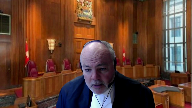
:::

Whether Constable Dorsky's observation created reasonable and probable grounds.

But that reliability question, as you say, is not a question of law.

I'm still not quite understanding how it's properly before us.

**Speaker 1** (00:08:12): One moment.

When we review paragraph 14 of Ali,

**Overlapping speakers** (00:08:29): Court of Appeal decision

**Speaker 1** (00:08:31): Court of Appeal decision, pardon me.

They state the issue on the voir dire was whether the police had reasonable and probable grounds justifying the strip search.

This requires that the police officers subjectively believe that they had such grounds and that there was an objective basis for that belief.

**Justice Brown** (00:08:50): And was that information sufficiently credible to justify reliance on it?

Assuming it was reliable, was it sufficient to objectively support?

**Speaker 1** (00:09:00): So in other words with respect to that framework of viewing a strip search in that manner in that framework all that matters is what the police officer thought and why and furthermore objective facts don't matter with respect to that

::: {.column-margin}

:::

so while hearsay can be used hearsay cannot be the sole reason why a strip search should be justified.

**Overlapping speakers** (00:09:29): Do you have any authority for that proposition?

**Speaker 1** (00:09:32): None more than the fact that when we consider the objective grounds it isn't what an officer thought or what an officer knew it would be what a reasonable person standing in the shoes of an officer's thought of.

So that does allow for.

**Justice Moldaver** (00:09:47): I think what you're getting at if I understand you correctly is that information that the police receive that they choose to act on for example in requesting a strip search must in its own way be reliable for example if you have an informant who has proved unreliable in the past and really has not come up with anything.

::: {.column-margin}
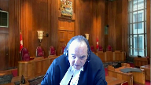
:::

**Overlapping speakers** (00:10:14): that

**Justice Moldaver** (00:10:14): has proven out to suggest that you were relying on credible and reliable evidence in those circumstances, which in order to do a strip search, obviously the case law says no you can't do that.

::: {.column-margin}
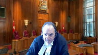
:::

But what you're talking about here is two police officers who apparently had a discussion with each other which you serve and I say this with respect chose not to cross-examine at all on and their evidence was was clear at least Constable Derrick's evidence was clear that they had a discussion and and he was told what he was told and this gave him reason to believe because it was coming from a reliable source ie his colleague it wasn't coming from some stranger or some informant that had proved unreliable

so I think that's where that's the problem with your case

and it's we're mixing apples and oranges here.

**Speaker 1** (00:11:19): Very good.

::: {.column-margin}

:::

Thank you for the clarification and I can I wish to address it with respect to first whether or not the evidence coming from Constable Odorski is reliable or at least because this is a question of also whether the testimony that Constable Durock gave is reliable.

Constable Durock is giving evidence from a case that was five years ago.

He's giving evidence that describes a circumstance where he says that a that Constable Odorski told him every told him certain things but that isn't supported by Constable Odorski's own evidence.

He says well excuse me he was never asked.

**Justice Moldaver** (00:12:05): Well, you were there.

You were counsel.

You could have cross-examined both officers on this.

You chose not to.

**Speaker 1** (00:12:12): to and he was never asked because when he began describing the circumstances considering the considering stuff that he did not witness and when he testified he did not say I heard Constable Odorski says this throughout the time he often says just this is what happened so when it was objected to it was objected to on the basis of hearsay and he was cautioned in the courts and this is at paragraph 25 or pardon me page 25 line 19 line 14 pardon me your honor I'm going to make an objection I think that this is hearsay this is Constable de Rock's observation of what had happened or but from what I understand during the raid he was in the bedroom at the time so he would not would have heard how this happened the court cautioned Constable de Rock saying I think okay

::: {.column-margin}

:::

well maybe you you can clarify where you were in relate and whether or not you saw whatever you're talking about given it's a

and then the court continues because you you made a statement at this point I was just trying to quarterback my team and then I sort of lost you after that so the initial times that Constable de Rock testifies he does not he testifies about Mr. Ali reaching towards his nether regions when he is actually giving evidence about what Constable Odorski says to him he says this is at page 26 this is his actual evidence given what Odorski talked to him and this is not in the course of the narrative this is him saying this is what we talked about 26 line three I had a conversation with Constable Odorski about what he had seen during the arrest of Mr. Rick and that's where he provided me the information about you know the pants being down and him not listening to great verbal directions that was given to Mr. Odorski.

**Justice Brown** (00:14:13): At some point, you'll point to where Justice Veldhuis in her dissent advances this same argument.

::: {.column-margin}
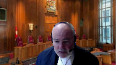
:::

I'm sorry, counsel, I'm still stuck on whether this is properly before us.

And Justice Veldhuis's dissent was really focused on whether the analysis performed by the trial judge was a search incidental to a rest analysis.

**Speaker 1** (00:14:49): Thank you, Justice Brown.

**Justice Brown** (00:15:04): I mean, I don't spend the rest of your time looking.

**Overlapping speakers** (00:15:08): Yes.

**Justice Brown** (00:15:09): I don't think you'll find it, but I just want to signal to you I just see this getting you nowhere because I don't think it's an argument that you're placed to advance here.

**Speaker 1** (00:15:24): Then I will.

**Justice Côté** (00:15:29): if you have paragraph 54 and 56 of the dissenting reasons pertaining to the reliability.

**Overlapping speakers** (00:15:40): That was what I was looking for.

Thank you Justice Cote.

**Justice Côté** (00:15:43): You're welcome.

**Speaker 1** (00:15:49): And we do see again, while there is evidence at paragraph 59 of Justice Valduiz's dissent, while there is evidence that Justice, that Officer Durock subjectively believed that the appellant had secreted drugs on his body, there was no objective evidence to establish reasonable and probable grounds that drugs could be found there.

::: {.column-margin}

:::

So again, this is, this is Justice Valduiz saying the evidence of, the hearsay evidence shows the subjective attitude, but there isn't, but that the hearsay cannot be relied on as objective evidence.

**Justice Moldaver** (00:16:28): When you go to Golden itself, paragraph 111, I'm not even sure that Justice Veldhuis has set out the proper test to meet the reasonable ground standard because if you look at the first line in paragraph 111 of Golden, having so concluded we should note, however, that there was some evidence suggesting the possibility of concealment of narcotics.

::: {.column-margin}
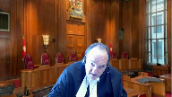
:::

That is how the Supreme Court in Golden framed what it is that the person has to believe.

And so I'm just quoting you from our court and I don't think with great respect that Justice Veldhuis reported that or used that test.

**Speaker 1** (00:17:27): So that would be at paragraph 111 of Golden?

That's correct.

**Overlapping speakers** (00:17:35): Right in the first sentence.

**Speaker 1** (00:17:37): Yes so and this really speaks towards application of this case and in Golden there were absolutely and in Golden

::: {.column-margin}

:::

in fact it was found that there were reasonable and probable grounds for the uh for the strip search

but it was the manner in which the strip search was was um addressed that was the that was the issue in the breach of the Charter rights

**Justice Moldaver** (00:18:01): I agree with you, Mr. Latty, but the thing is this, this is one piece of evidence that you're focusing on, this Constable Derrick's or the officer's evidence.

::: {.column-margin}
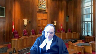
:::

There's all kinds of other evidence.

You've got to look at the totality of the evidence here.

I don't think we have to take it off the table, but quite frankly, speaking for myself, on the whole of the evidence that there was, even if you were to remove Constable Derrick's evidence, there's still enough to meet that test that I just read to you.

**Speaker 1** (00:18:35): and with respect Justice Moldaver that's where I disagree this is a situation

**Overlapping speakers** (00:18:41): where

**Speaker 1** (00:18:41): we have a very very straightforward situation it's almost unique in the sense that if we and I am if that is the case that I agree that that should that the rest of the evidence should be able to if the rest of the evidence apart from the testimony of Constable de Rock justifies the strip search then that wouldn't be an argument but what we have is we have an officer who describes watching mr. Ali from the moment that he went into the apartment to when he was arrested and left and there is evidence that he never took his eyes off him and he describes the entire occasion he doesn't describe any evidence that would be anything that would be significant in terms of him hiding drugs inside his body or really anything that would indicate any sort of concealment or or hiding of circumstances or hiding drugs he basically says that apart from mr. Ali having some difficulty getting down this was a very straightforward and standard situation so when we have an objective or pardon me when we have an individual who watches everything that he that is that occurs during a during a raid that is the evidence that we should rely on and if he said something like

::: {.column-margin}

:::

well I saw him reach towards his pants or I saw him try and hide something in his body or

**Overlapping speakers** (00:20:23): even describes her.

**Speaker 1** (00:20:24): circumstances where that sort of thing could be inferred then that would be the objective grounds.

::: {.column-margin}

:::

So I asked the court to consider to review Constable Odorski's evidence and view whether or not there is those there are those facts that justify the police and the state searching inside Mr. Ali's body.

**Justice Moldaver** (00:20:46): to me you made a tactical decision I'm not faulting you you made a tactical decision to just leave this whole thing uncontradicted

**Speaker 1** (00:20:55): And can I address the the tactical nature of it?

::: {.column-margin}

:::

Because yes that is a part of the situation but why is it more important to ask Constable Odorski what did you say to Constable Darroch as opposed to him testifying this is what I saw, this is what happened.

That was the evidence before the court is what he saw happening and in terms of contrasting that with what Constable Darroch said one I objected to what Constable Darroch said on the basis of hearsay and I was told and Constable Darroch was guided to only relay what he had saw.

So in terms of evidence to prefer I'd submit that clearly if there is if there has to be a choice between

**Overlapping speakers** (00:21:54): This was on this was on the voir dire?

This was on the voir dire.

The Constable Duroch was directed to testify as to only the things he saw?

Well I can read that the...

I mean I'm not I'm not I'm not doubting you. I'm just

yeah

a little surprised at the direction.

**Speaker 1** (00:22:08): and it's the difficulty is is that

::: {.column-margin}

:::

and again I objected on the basis of hearsay this is on page 25 pardon me your honor

I'm going to make an object objection I think this is hearsay this is constable the rocks observations actually if I may back up a little bit earlier miss Constable the rope states page 25 line 10 he was originally directed to the ground and then was handcuffed and was kind of reaching back into his nether regions that's what he says he does not attribute to Constable to Constable Doris keep he just says he was originally directed the ground and handcuffed and kind of reaching back towards his nether regions at that point I objected saying pardon me your honor I'm going to make an objection I think that this is hearsay this is constable the rocks observation of what had happened or what but from what I understand during the raid he was in the bedroom at the time so he would have had heard about how this happened the courts response to this was

I think okay

well maybe you you can clarify where you were in relate and whether or not he saw whatever you're talking about given it's a because you you made a statement at this point I was just trying to quarterback my team and then I sort of lost you after that so after that Constable the rock states one my information of what I saw there was very very limited and of seeing his interactions of his physical and actions of what he was reaching for or anything like that I did not see him reaching into his underwear or anything like that and then goes on to describe his conversation with Constable Odorski as I had previously mentioned I had a conversation with Constable Odorski about what he had seen during the arrest of mr. Rick and that's where he provided me the information about you know the pants being down and not listening to the great verbal direction so when asked to clarify his statements with regards to which were objected as hearsay he then clarifies them as saying I had the conversation with Constable Odorski his pants were down and not listening

**Overlapping speakers** (00:24:13): That makes more sense, thank you.

**Speaker 1** (00:24:15): Not issuing, not any comments about reaching towards the nether regions or anything like that.

::: {.column-margin}

:::

So I am allowed to, I would submit that as Defence Council, I'm allowed to rely on that part of the evidence in terms of what was relayed between Constable Odorski and Constable de Rock.

And quite frankly, that actually does corroborate Constable Odorski's evidence.

There's no major dispute between Constable de Rock relaying this sort of information, his pants were down, he wasn't listening to great verbal directions, and what Constable Odorski says.

So when asked to clarify, when asked to, when separated from giving evidence about the narrative and giving evidence about the overall sense of the thing, he's very liberal and editorializing with his statements.

When he actually describes what he says with Odorski, they're very much on all fours.

And so I'd submit that that's the biggest difference and that's why the hearsay is so necessary because we have to find out what he actually said.

And when we're actually asked about that, it's at that point.

I haven't addressed the first issue at all

and I'm running a little bit low on time.

I'm wondering if the court requires any further elaboration on my fact and with respect to the first issue of the trial, whether the judge applied the correct test when determining the legality of the strip search.

I do have one point that I wish to say at the most and that is when the statements given by the trial judge, they were both subjective and objective for the reasons for the police to believe that they could find evidence by way of strip search given the totality of the circumstances, the facts outlined in the search warrant and the accused actions at the scene of the arrest.

I'd submit this is cherry picking one statement out of the entirety of the decision.

When we look at the decision as a whole, and in particular, read in the context of the jurisprudence that she is citing, it's very clear that she is not citing Golden, but rather is citing Caslake

and she says, to be clear, stated Justice Leroux Debay, this is not a standard of reasonable and probable grounds.

So, Mr. Ali, she's talking about throughout the throughout the issue, talking about search incidental to arrest.

So not only is she not applying the correct test, or at least not citing that the correct test is being applied, she states, to be clear, this is not a standard of reasonable and probable grounds.

Mr. Ali went before the court asking for justice saying that he was searched without reasonable and probable grounds and the trial judge replied, actually, you were searched incidental to arrest.

I am mindful of this court's decision in RNGF, which was really subsequent to my factum.

I do note at paragraph 69, this court states that appellate courts must not finally parse the trial judge's decision, pardon me, the trial judge's reasons in search of error.

I submit to the court that the reverse is also true, that appellate courts must not finally parse the judge's reasons in search of redemption of the of the decision or of the argument.

I also wish to address because I do think that this is an issue that has been brought up at the appeal and at the and at the essentially before the court with which is respect to the other arguments that is found.

Now, there is evidence that Mr. Ali was a drug dealer, but that is not what was asked before the court today.

What was asked was whether or not he was a drug dealer.

What was what was asked was whether or not just Mr. Ali had drugs on his person and not even on his person, but actually in his body that would necessitate a strip search.

And Justice Valduiz does a very good job of describing the nature of the evidence.

But on that topic, one other point is the Court of Appeal at page, I believe, 14 describes the described Mr. Ali's case as following the absence of any direct evidence of him concealing drugs in his person does not preclude the police reasonably inferring that when confronted with the unexpected execution of a search warrant, the appellant would hide his drugs anywhere he could.

That means that if you think he's a drug dealer, even the absence of drugs is the presence of drugs.

**Justice Brown** (00:29:04): Well, they also had confidential source information that he would be in possession of a sizable amount of crack cocaine and that he kept drugs on his person.

**Speaker 1** (00:29:15): but on his person is never defined by a Constable de Roque or by the...

**Overlapping speakers** (00:29:24): by that matter.

Was he cross-examined on it?

**Speaker 1** (00:29:27): Well, he wasn't, but this is on the Crown to prove that there are reasons for that.

::: {.column-margin}

:::

And if they're trying to say he had drugs in him, then that's something that's significant.

But also, on his person is used a couple of times by Constable de Roque when he's actually describing his circumstances of the raid.

He describes that all the people in that would have had drugs, all the people in that apartment would have had drugs on their person.

And also, the sources do not say, they say that he's carrying drugs on him in his pocket.

If it's in his pocket, that's evidence that it isn't inside his body.

**Overlapping speakers** (00:30:12): We have 36 seconds left.

I can't address.

**Speaker 1** (00:30:16): the section 24-2 argument, but basically I would suggest that this has been dealt with by Justice Valduiz.

::: {.column-margin}

:::

This is a strip search, it's the most intimate search that can be dealt with.

Mr. Ali has already served his time and this is a situation where Constable de Roche went in there saying everyone is

strip searched.

This is not simply a mistake in terms of interpreting whether or not there were reasonable grounds.

He was going in there looking to strip search everyone and that is something, that is another reason why these matters, the evidence should be excluded to prevent further abuses such as this.

**Justice Côté** (00:30:50): Just a small favor, would you allow me a question, please?

**Overlapping speakers** (00:30:53): Absolutely.

**Justice Côté** (00:30:54): So, Mr. Aladi, on that you said that your client has service time, so you seem to say that it's not necessary to do a section 24-2 analysis, but there are other orders in this case like the firearms prohibition and the DNA order, so why are you saying that it is a hypothetical exercise to do that analysis if we come to the conclusion that there was a breach?

::: {.column-margin}
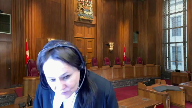
:::

**Speaker 1** (00:31:23): Well, and thank you for the question, Justice Cote.

::: {.column-margin}

:::

With respect to the ancillary orders, what we are considered is, again, strip searches that disproportionately affect minorities.

Mr. Ali was a Black person.

He was the only Black person in the room.

This is something where everyone was told that they could be strip searched in there.

The police were told that everyone was arrestable for possession for the purposes of trafficking.

But only Mr. Ali was arrested.

Only Mr. Ali was searched.

This is not just a routine or trivial or just theoretical breach.

This was a breach that had real-world consequences and it's a breach that is so inherent to the nature of a person's bodily integrity that justifying the inclusion of the evidence in a situation where it was unreasonable to violate his bodily integrity to that extent and it was unreasonable with respect to both how it was justified as well as how it was initially considered and decided upon, does favor exclusion.

It's a very, very significant personal breach of Mr. Ali's bodily integrity and that is a favor that favors inclusion.

The fact that he has already served his sentence is a matter that it is hypothetical.

I am supporting, I am also relying on the court's decision in Golden where the similar step was taken.

It is something, and Justice Carrot Kat Sanis said in Saeed, this is about how we treat people who are accused of crimes.

This was in her dissent.

It matters even when someone does something that is against societal norms, that is against, and that was in fact guilty, but when the actions of the police are such that a person's bodily integrity is violated to such an extent, that is on its balance something that favors exclusion.

The inclusion of the evidence is not worth this matter being strip searched as well as anyone being strip searched or as well as saying the precedent that anyone can be strip searched and even if you don't have reasonable grounds, even if you can't justify the strip search, it's okay to allow the evidence in.

**Justice Moldaver** (00:34:35): All right, thank you very much.

Is that satisfied?

Do you have any follow-up questions, Justice Cote?

**Justice Côté** (00:34:43): No, Justice Moldavar.

Thank you.

**Justice Moldaver** (00:34:45): All right, thank you very much.

Ms. Dionne, please.

**Speaker 2** (00:34:51): Good morning Chief Justices.

::: {.column-margin}
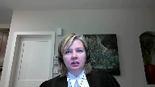
:::

My name is Monique Dionne

and I'm Council for the Crown Respondent.

The appellant was legally arrested during the execution of a warrant.

He was strip searched at the station and found in possession of 65 grams of crack cocaine.

And so the only issue on this appeal is whether the grounds conduct the strip search.

And put plainly, the appeal is about whether Constable Derrick had reasonable grounds to believe that the appellant had concealed drugs on his person.

And if you find that he did not, whether that evidence should be excluded pursuant to Section 24-2 of the Charter.

The strip search in this case was supported by a large constellation of objectively discernible factors, not just the information from Constable Idorski.

**Justice Brown** (00:35:32): Before we get there, are you still, Ms. Dionne, are you still sticking with your pleading that the trial judge applied the proper test here?

**Speaker 2** (00:35:46): We take the position, as did the Alberta Court of Appeal, that she did apply the proper test, although it was poorly articulated.

**Justice Brown** (00:35:54): Why don't we deal with that first?

::: {.column-margin}
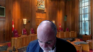
:::

I mean, it seems before we go applying the test, we should know whether she applied the correct test.

So you at paragraph 48 of your factum direct us to a particular passage from the trial reasons that appear at page 46 of the record, page nine of the reasons.

Is that the passage that you're relying on?

**Overlapping speakers** (00:36:18): That's page 46 of my factum.

**Justice Brown** (00:36:20): No, page 46 of the reasons, paragraph 48 of your factum, page 46 of the record, sorry throwing all these numbers around, page 9 of the reasons.

**Speaker 2** (00:36:31): that is what we're relying on and that's what the Alberta Court of Appeal relied on.

::: {.column-margin}
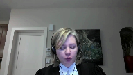
:::

When we look at the test from Goldin, we have to consider the admissions that were made before her and realistically this was the only issue that was before her, whether or not there were subjective and objective grounds to believe that they could find evidence by way of a strip search.

Okay, but let's...

**Justice Brown** (00:36:50): Let's look at this passage, right?

::: {.column-margin}
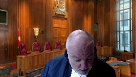
:::

She says they were both subjective and objective, I assume she means bases or something, for the reasons for the police to believe that they could find evidence by way of a strip search.

And what she's really doing here is applying the passage from Justice Leroy Dubay's judgment in Cloutier that talks about the search being truly incidental to the arrest if the justification for the search is to find evidence.

How is that remotely applying Golden?

Especially when you consider that in Golden, the court specifically rejects the test in Cloutier as applying to strip searches.

**Speaker 2** (00:37:33): I take from the reasoning in this statement that she did consider that there were subjective and objective grounds to believe that that this individual had drugs hidden on his person, but I don't think we need to resolve these issues here today.

**Speaker 2** (00:37:47): I don't think so, sir.

::: {.column-margin}
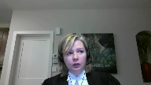
:::

Even if we were to assume that the trial judge applied the wrong test or failed to provide legally sufficient reasons related to the test, this doesn't mean that her conclusion was not the correct one.

And I think consistent with approaches have been taken by other courts of appeal, even if the trial judge applied the wrong standard, this court is entitled to consider the record and decide whether there was a basis to justify the strip search in this case.

And so, notwithstanding her poor articulation or her failure to apply the test, there are

**Overlapping speakers** (00:38:20): So you can see that she may have failed to apply the correct test.

**Speaker 2** (00:38:24): I would concede that her articulation of the test makes it difficult, especially following the quote from Cloutier and Langlois that is provided.

::: {.column-margin}
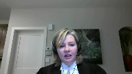
:::

I take the issue that it doesn't matter, sir, because simply there are sufficient grounds.

**Justice Brown** (00:38:43): I accept that, but I accept that that's your point, but I think it would be just much cleaner if the Crown would just concede that the trial judge goofed here and then move on to say, but it really doesn't matter.

**Speaker 2** (00:38:57): I take the position that even coming after the cliche in Langlois, even if it didn't properly articulate the golden test, that she does decide the right thing that needed to be decided in the moment.

And so that is what I hang my hat on for this issue.

**Overlapping speakers** (00:39:13): What?

**Speaker 2** (00:39:13): My broader point is that it simply doesn't matter in the face of the facts of this case.

**Justice Brown** (00:39:19): Got it.

Thank you.

**Justice Moldaver** (00:39:19): At the very least, it seems to me that there's a question mark, but in fairness to the trial judge, there were all kinds of things going on in this trial, all kinds of issues that were red herrings, frankly, and she was trying to address a number of issues.

::: {.column-margin}
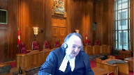
:::

But more importantly, it's clear that she read Golden.

She refers to Golden on several occasions.

And then when she comes to saying what the test is on the evidence, she actually gets it right from Golden.

So I mean, it's ambiguous and maybe more in line with your friend's position that she didn't apply the right test.

But speaking for myself, I'm not prepared at this moment to say that she necessarily got it wrong when she uses the precise words from Golden to say why she's satisfied.

But anyways.

**Speaker 2** (00:40:16): And that's my same point, Mr. Justice Moldaver, is that she does echo those words, even coming after Cloutier and Langlois, as they do.

::: {.column-margin}
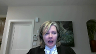
:::

And so even if she makes this finding, as is part of the course of her greater analysis, she does make the finding that is required by the test in Golden.

I guess you're wrong, sir.

**Justice Jamal** (00:40:38): relying on the submissions of council which clearly stated the applicable test so the poor articulation and the reasons if it is that has to be read in light of the submissions of council.

**Speaker 2** (00:40:49): Yes, Mr. Justice Jamal, and that's what this Court said in Regina and REM, that judges are presumed to know the law and the sufficiency of reasons has to be read in the context of the evidence and the arguments at trial.

Certainly, the golden...

**Justice Brown** (00:41:06): If this trial judge knew the law, she wouldn't have cited Kluge because Kluge is specifically excluded by Golden here.

We cannot say that of this trial judge's reasons.

**Speaker 2** (00:41:17): I think that that's a bit of a red herring.

I think that the Cloutier analysis was part of the analysis on the 10b.

One of the difficulties, I think, with the reasoning is that the legal tests to

**Overlapping speakers** (00:41:31): He's knocking about 10B here.

**Speaker 2** (00:41:33): I think what she's talking about is whether or not the strip search was incidental to the initial search and whether or not it needed to happen before or after the access to counsel.

**Justice Moldaver** (00:41:44): I agree.

I thought there was a 10B issue rate.

**Overlapping speakers** (00:41:48): Yeah, but not in the-

**Justice Moldaver** (00:41:49): was being taken that this was not a search incident to arrest and as a result in the circumstances because it was a strip search 10b should have applied I mean there are all kinds of red herrings going on here

**Justice Brown** (00:42:04): It is the passage at the end of that discussion that is being relied on, Ms. Dionne, by the Crown as application of Golden.

::: {.column-margin}
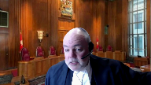
:::

Even though it culminates, you know, it follows a discussion that is specifically excluded by Golden from application in a strip search case.

But anyways, as you point out, it may not matter, right?

Because Golden may be satisfied here.

But I honestly think it's a bit of a stretch to say that the trial judge didn't goof here on the test.

**Speaker 2** (00:42:39): And, Mr. Justice Brown, what I would say is that even though it follows Kluge and Langlois, the only thing she had to come to a conclusion on in the analysis of the strip search is whether or not there were subjective and objective reasons to believe that evidence could be found by way of a strip search, whether or not she did that at the wrong part of her judgment or as part of another analysis, and that's specifically what this paragraph addresses.

::: {.column-margin}
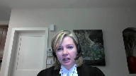
:::

And that's why, even though it's poorly articulated and it doesn't come after a proper analysis of the golden test, we would say that notwithstanding how she got there, she got to the place she needed to be and made the analysis she had to make.

But my greater point is, as you said, that none of this matters where the court is able to make its own assessment of the grounds, which are adequate in this case.

In support of those grounds, which are more than sufficient to uphold the reasonable grounds for a strip search in this case, we have a number of sources of information.

Constable Derrick had source information from two well-known confidential informants, one he'd used 31 times before and another one he'd used 26 times.

They told him that a male matching a rather remarkable description of the appellant would be in possession of a sizable amount of crack cocaine.

He indicated that these individuals kept the cocaine in their pockets and that that was consistent with Constable Derrick's own experience, particularly where drug dealers are in the presence of users.

And I think there's a common sense component to that as well.

Next we have the circumstances of the police entry, which was explosive and chaotic.

And in the words of Derrick, the appellant would have had extremely minimal time to place anything around him or hide things because he was within the line of sight of the officers as soon as they entered.

And then we have the circumstances of the appellant when he was initially encountered by police.

The appellant was arrested and directed to the ground, but he initially didn't comply.

And police observed that by that point, his pants were already pulled partially down.

Adding to this was the usual indicia of drug trafficking, a search of the appellant and his immediate surroundings located a large amount of cash, a scale, and a ringing cell phone, but not the drugs that Constable Derrick had expected to find based on the source information in this case.

And then lastly, Constable Derrick had the information he received from Constable Odorski that the appellant was kind of reaching back in his nether region and the back of his pants, suggesting that something had been hidden.

And I would suggest to this court that these factors taken together support Constable Derrick's inference that the accused secreted drugs on his person during the fast and chaotic warrant execution.

And certainly while this may not be the only inference, maybe the accused had struggled as suggested by the appellant because of the state of his pants, the reasonable and probable grounds test does not require that police eliminate all other reasonable inferences.

The question is, is the inference in this case reasonable with an individual reaching towards the back of his pants who's believed to have a large amount of drugs on his person that he may have concealed something?

And we would suggest that it is.

The factors together support Derrick's belief that the appellant took the drugs that he normally kept in his pockets and hid it somewhere on his body, thus justifying the strip search in this case.

Further, not only is this an available inference, it's the most likely inference.

It's the only one that accounts for all the observations that Derrick makes rather than approaching them piecemeal.

I appreciate that my friend in the dissenting justice took issue with the reliability of the evidence that Constable Derrick testified he received from Constable Dorsky, but it's hard to imagine any evidence that could be more credible than a statement from a police officer concerning events he witnessed only moments before.

The fact that Constable Dorsky didn't recount this conversation is of no moment.

It's clear based on the decision of the trial judge that she accepted the testimony of Constable Derrick.

And in any event, even if this court were to ultimately reject the uncontroverted evidence about what Derrick said, or Dorsky told him, there were still adequate grounds to support the strip search.

The confidential informant information was that Rick had a large amount of drugs in his pocket.

This was corroborated by the fact that when the police busted in in the middle of the night, here was this guy matching the description and exactly where the informant said he would be with a table and pockets full of drug trafficking paraphernalia.

He initially doesn't comply with police directions and his pants are already halfway down.

The inference that he was concealing drugs is still reasonable, even absent the information received from a Dorsky.

And I'd note that the facts in this case are very similar to those in the Ontario Court of Appeal decision in Mueller, where the courts took the position that the absence of drugs where all other factors pointed to their reasonably being found could be considered as one of the grounds for the strip search.

Therefore, we take the position that Constable Derrick had reasonable grounds to strip search the appellant and that the Alberta Court of Appeal in finding that committed no error.

However, if this court were to find that Constable Derrick didn't have grounds to direct a strip search of the appellant, we would urge the court to admit the evidence pursuant to section 24.2 of the Charter.

The breach in this case was a matter of degree.

Constable Derrick turned his mind to the correct legal test and subjectively believed the appellant was hiding drugs on his person.

The trial judge and two appellate court justices agreed, and if this court were to find otherwise, it could hardly be said that this was a serious breach or a systematic pattern of abuse or indifference towards Charter rights.

While the impact on the appellant always favors exclusion, it's medicated in this case by the professional manner in which the strip search was conducted in compliance with this court's directive in Golden.

And lastly, there's a strong societal interest for this real evidence to be admitted at trial.

If a breach is found, the police conduct in this file certainly falls at the less serious end of the spectrum, and on balance, the evidence should be admitted.

Thank you for your attention.

**Justice Moldaver** (00:49:19): Okay, I take it there's no questions.

Thank you very much.

Any reply?

**Speaker 1** (00:49:26): Briefly, Justice Moldaver, I'd like to speak towards my friend's comments about the other evidence of Mr. Ali.

::: {.column-margin}

:::

Firstly, with respect to Mr. Ali's pants being off, I asked Mr. Odorski about this situation at page 57.

Okay, my friend was trying to pin down the nature of his pants being half off.

Were they just saggy pants, do you remember?

And then Constable Odorski replied, I don't remember.

So to characterize his pants as being half off is not an accurate statement, or at least is, the evidence is unclear about the nature of his pants being off.

With respect to, and this is something that the majority speaks about, Constable, and the trial judge speaks about, there are several comments made that Mr. Ali reached towards his nether regions.

None of those comments reflect what actually was said by Constable Duroc, which indicates that he reached to his nether regions while he was handcuffed.

So this was a situation, if we were looking at circumstances where maybe that shows evidence of concealment, this is while Mr. Ali was handcuffed behind his back and already reaching his nether region towards, and presumably already being supervised and watched by Constable Odorski.

In particular, the very first mention of it at page 9 lines 22 and 23, my conversation with Constable Odorski had him handcuffed and kind of reaching around the nether region, the back of his pants.

So that would not, that would be evidence that he wasn't trying to hide something inside his body.

It's evidence that he was reaching into his pants.

So to say that this is a situation where he is relying on the nether regions comment is just, it lacks the context of the entirety of what was said by Constable Odorski, which is that he was handcuffed behind his back and already reaching his nether region towards, and presumably already being supervised and watched by Constable Odorski.

So this is a situation where he was reaching into his pants.

**Overlapping speakers** (00:51:36): Thank you.

**Speaker 1** (00:51:36): Constable de Rock's evidence with regards to that because that is what it was.

::: {.column-margin}

:::

It was evidence at a trial and so the evidence at the trial should be considered.

Finally, I do note that with respect to the trial judge's decision with respect to Golden, this was very much pointed out to her

but she did not ask any questions about it.

She never mentions reasonable and probable grounds in her decision and in her analysis, if we're talking about whether or not the record shows whether or not the judge understood the circumstances, the record shows that I conceded that this search was indicated or this search occurred incidental to arrest.

It was not a live issue before the court that that is something to be considered.

The fact that it was considered despite that should at least rebut the presumption that the trial judge knew or understood the case law that was before the court and understood the law to be applied.

Golden was cited, yes, but when Golden is cited, it's only cited in terms of this happened in Golden.

These facts happened in Golden.

Mr. Golden was strip searched at the scene.

That's not what happened in this case.

It doesn't address the substantial issues of Golden at all.

All right, I think

**Justice Moldaver** (00:52:55): I think that really you're covering ground that you've already covered and I must confess I'm troubled by you

::: {.column-margin}
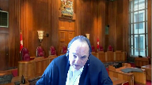
:::

I know we talked about 10b and so on

but you were the one that raised 10b and that's a very funny issue to raise if you're conceding that it's a search incidental to arrest so do you have anything more that you'd like to say we're not re-arguing the case at this point

**Speaker 1** (00:53:17): No with respect to 10b it was an issue it is not an issue before this court but Mr Ali was not provided his his illegal rights at any time this is just it is there there are comments about red herrings um they were legitimate issues to be argued before the court uh the decision was made and it is not a decision to be appealed but the argument for the strip search the argument for the 10b and the ito argument were all valid and should have all received proper consideration

::: {.column-margin}

:::

**Justice Moldaver** (00:53:48): All right, anything further? No.

**Overlapping speakers** (00:53:51): Thank you very much.

**Justice Moldaver** (00:53:52): Thank you very much, Mr. Eladi.

We would ask, we're going to retire now and we would ask council to please remain at our disposal.

Thank you.

**Speaker 1** (00:54:04): the court, la cour.

**Justice Moldaver** (00:54:10): Okay, thank you, council.

::: {.column-margin}
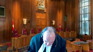
:::

All the members of the court want to thank you both for your very able and thoughtful submissions.

We have been able to reach a decision on this case and I will read the judgment of the majority of the court.

Mr. Alley appeals as of right to this court.

A majority of the Alberta Court of Appeal affirmed his conviction for possession of cocaine for the purpose of trafficking.

They found that the trial judge did not err in determining that the police's strip search of Mr. Alley, incident to his lawful arrest, complied with section 8 of the charter in accordance with the principles governing strip searches set out by this court in R.V. Golden, 2001, SEC 83.

A majority of this court agrees with the conclusion of the majority of the Court of Appeal and would dismiss the appeal.

Where a strip search is conducted as an incident to a person's lawful arrest, there must be reasonable and probable grounds justifying the strip search in addition to reasonable and probable grounds justifying the arrest, see Golden at paragraph 99.

These grounds are met for the strip search where there is some evidence suggesting the possibility of concealment of weapons or other evidence related to the reason for the arrest, see Golden at paragraphs 94 and 111.

Like the majority of the Court of Appeal, we are satisfied that there were reasonable and probable grounds justifying the strip search.

The police had confidential source information that their target was in possession of a large quantity of cocaine and that he kept most of his drugs on his person.

Mr. Alley was found next to a table with drugs other than cocaine and items consistent with drug trafficking included a scale, money and a ringing cell phone.

Mr. Alley's pants were partially down as he was being arrested and one of the officers reported seeing Mr. Alley reaching towards the back of his pants.

Viewed in its totality, this was clearly some evidence suggesting the possibility that Mr. Alley had concealed drugs, particularly cocaine, in and around the area of his buttocks.

We would not give effect to Mr. Alley's argument that a hearsay error arose because the officer who requested the strip search, Constable Derrick, testified that he was told by another officer, Constable Ordorski, that Mr. Alley was reaching towards the back of his pants and Constable Ordorski did not refer to this as a result of his testimony at trial.

Mr. Alley now concedes that Constable Derrick's testimony was not inadmissible hearsay because it was not entered for the truth of its contents.

The question he maintains was whether Constable Derrick could reasonably rely on the information from Constable Ordorski as a factor in deciding whether he had reasonable and probable grounds to request the strip search.

Defence Council chose not to cross-examine either officer about this information.

It stood uncontradicted.

This tactical choice undermines Mr. Alley's submission that it was unreasonable for Constable Derrick to rely on Constable Ordorski's information.

For these reasons, we would dismiss the appeal.

And I would now ask my colleague, Justice Cote, to please present her concurring reasons.

**Justice Côté** (00:58:39): Thank you, Justice Moldaver.

::: {.column-margin}
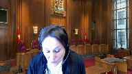
:::

I agree with the majority's disposition of the appeal, but for different reasons.

In my view, the Respondent Crown failed to discharge its burden of establishing the legal basis for the strict search of Mr. Halley, in accordance with the principles set out by this Court in R v. Golden.

As such, I find that Mr. Halley's Section 8 Charter Rights were violated substantially for the reasons of Veldres J.A. at Paragraph 27-61.

However, I part ways with Veldres J.A. with respect to the proper remedy.

Relying on Golden at Paragraph 118 and 119, Mr. Halley argues that this Court should substitute an acquittal because conducting an analysis under Section 24-2 of the Charter would be a mere theoretical exercise.

I disagree.

As in Golden, I acknowledge that Mr. Halley has already served his custodial sentence.

Nevertheless, he remains subject to restrictions to his liberty, including a firearms prohibition and a DNA order.

As such, determining whether the evidence ought to be admitted will have tangible consequences, both for Mr. Halley and for the public.

Moreover, the facts of this case are plainly distinguishable from Golden.

The strict search in Golden was coercive and forceful, conducted in a public area without authorization from a senior officer and may have jeopardized the accused's health and safety.

The search of Mr. Halley has none of these characteristics.

It is undisputed that it was conducted in a reasonable manner.

In my view, it is worthwhile to assess whether admitting evidence obtained as a result of the Charter breach would do further damage to the repute of the justice system.

I further acknowledge that, as the Courts below found no breach of Section 8 in this case, they did not consider whether the evidence should be excluded under Section 24-2.

However, I accept the Crown's submission that the record before this Court is sufficient to determine whether the admission of the evidence would bring the administration of justice into this repute.

Therefore, I see no utility in sending the matter back for redetermination.

In these circumstances, it is open to this Court to conduct its own first-instance Section 24-2 analysis, and I refer to R v. Spencer, 2014, SCC 43, at paragraph 75.

Applying the three lines of inquiry from R v. Grant, 1993, 3 SCR, page 223, I would not exclude the evidence.

First, the seriousness of the police conduct in this case was at the lowest end of the spectrum.

Constable Darroch believed in good faith that he had the requisite grounds to strip-search Mr. Halley.

He relayed his grounds to his superior officer, who authorized the search at the police station.

I see no business to suggest that the police willfully disregarded Mr. Halley's charter rights.

This factor favors admission.

Second, the impact of the strip-search on Mr. Halley's privacy interests, while serious, was somewhat attenuated by the reasonable manner in which it was conducted.

At trial, counsel for Mr. Halley noted the search was, quote, human as possible, given the circumstances, end of quote.

In my view, this factor tips only moderately in favor of exclusion.

The final grant inquiry strongly favors admission.

Mr. Halley was in possession of 65 grams of crack cocaine.

The Crown would have no case without this evidence.

There is a strong societal interest in adjudicating this case on its merits.

On balance, I conclude that excluding the evidence would bring the administration of justice into this dispute.

To be clear, I would emphatically reaffirm the principles arising from Golden and the high threshold the Crown must meet to justify a warrantless strip search.

However, while the Crown failed to meet that threshold in this case, the conduct of the police did not undermine the integrity of the justice system.

Therefore, I would not exclude the evidence, and for the foregoing reasons, I would dismiss the appeal and affirm the conviction.

**Justice Moldaver** (01:04:09): Thank you very much Justice Cote and thank you again both counsel for your helpful and able submissions.

The court is now adjourned till Tuesday January the 18th.

Thank you.