---
title: Her Majesty the Queen v. Marc-André Boulanger
published-title: Heard
date: 2022-02-09
sidebar: false
---

This transcript was made with automated artificial intelligence models and its accuracy has not been verified. Review the original webcast [here](https://scc-csc.ca/case-dossier/info/webcast-webdiffusion-eng.aspx?cas=['39710']).
---

**Speaker 1** (00:00:02): The Court.

**Speaker 2** (00:00:07): Bonjour à tous.

::: {.column-margin}
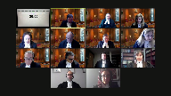
:::

Dans la cause de Sa Majesté la Reine contre Marc-André Boulanger, pour l'appellante Sa Majesté la Reine, maîtres Jason Vosselle Lévesque et maître Jade Coderre, pour l'intimé Marc-André Boulanger, maître Nicolas Saint-Jacques et maître Lida Sarah Nourain.

Maître Lévesque.

**Speaker 3** (00:00:34): Monsieur le juge en chef, mesdames, messieurs les juges, bonjour.

::: {.column-margin}

:::

Comme indiqué dans la vie de comparution, j'aurai le plaisir de m'entretenir avec vous ce matin dans la première question en litige qui concerne l'imputation du délai de 84 jours et ma collègue, Maître Coderre, abordera la seconde question qui concerne l'imputation du délai de 112 jours.

Donc, pour débuter, et bien évidemment si vous avez des questions en cours de route, n'hésitez pas à m'interrompre et il me fera plaisir de répondre à vos questions.

Tout d'abord, la plante aimerait débuter par aborder la question de l'admission, qui a été faite en premier instant dans le présent dossier.

Le premier point que la plante souhaite aborder avec vous ce matin est, en fait, l'admission en question ne comportait pas d'erreur de droit.

Ce qui est important de comprendre, et dans sa requête en arrêt des procédures, ce que l'intimé mentionne et qu'il savait que le temps nécessaire à la préparation des mesures légitimes ne lui était pas imputable.

Il le savait dès le départ.

Par la suite, lorsqu'on arrive à l'admission qui a été faite par l'appartie intimée, il reconnaît que la présentation tardive de sa requête en décaviardage a causé un délai de 84 jours.

Lorsqu'il va aborder le délai entre le 1er mars et le 24 mai 2018, l'intimé va reconnaître que ce délai a été causé par la défense suite à sa demande tardive de décaviarder l'affidavit au soutien du mandat de perquisition.

Et plus important encore, il précise que même si la mesure a été prise légitimement afin de répondre aux accusations, il mentionne que cette demande aurait pu avoir lieu plus tôt dans le processus afin d'éviter des délais additionnels.

Cet aspect-là également qui est important de l'admission qui a été faite dans le dossier.

Donc, elle aurait pu être présentée plus tôt pour éviter des délais additionnels.

Maître Aline.

**Speaker 4** (00:02:27): Je m'excuse de vous interrompre, j'accepte votre invitation.

Est-ce qu'une telle admission ne peut jamais être révisée par le juge?

Est-ce que l'admission au complet lit le juge?

**Speaker 3** (00:02:41): Madame la juge Côté, je vous remercie pour votre question, en fait, elle est très intéressante.

::: {.column-margin}
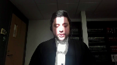
:::

Bien évidemment, la qualification d'un délai demeure une question de droit, et à ce moment-là, les parties ne peuvent pas lier un juge sur une question de droit.

Cependant, en fait, comme même l'intimé le reconnaît, la qualification de délai repose sur des conclusions hautement factuelles.

Ce que je vous soumets ce matin, c'est qu'une partie peut admettre des faits qui, par la suite, seront qualifiées pour déterminer par le juge si un délai doit être imputé ou non à une partie.

Et ce qui est assez intéressant, dans notamment l'arrêt McPherson de la Cour d'appel de l'adverteur, c'était que l'admission qui avait été faite par la poursuite, en fait, il n'y avait pas d'information à l'effet que la poursuite ne comprenait pas la qualification juridique du délai.

Et dans ce cas-là, son admission faisait en sorte que c'était un délai institutionnel parce que, bon, la Cour n'avait pas été en mesure d'accommoder les parties pour entendre le procès plus rapidement.

À l'inverse, dans SAIC, à ce moment-là, c'était la qualification sur des faits non contestés.

**Justice Kasirer** (00:03:45): Maitre Vaucelle-Lévesque, est-ce que entrer dans ce débat en bout de piste est utile, compte tenu du constat du juge Chamberlain, que de toute façon la conclusion du juge de ne pas imputer à la défense la totalité des délais pour cette période-là était carrément erronée?

::: {.column-margin}

:::

Est-ce qu'on n'est pas mieux dans le peu de temps que vous avez de l'aborder de plein fouet?

**Speaker 3** (00:04:15): Tout à fait, monsieur le juge Caséral.

::: {.column-margin}
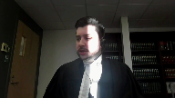
:::

Je suis d'accord avec vous.

L'admission demeure impendante, mais vous avez raison, ce sont les faits du dossier qui sont déterminants et souvent permettés, donc j'ai abordé dès maintenant cette question-ci qui était la partie suivante.

Donc, bien évidemment, l'appartie à la plante souscrit entièrement au motif du juge Chamberlain, minoritaire à la Cour d'appel du Québec, et notamment au motif énoncé au paragraphe 182 à 185 du jugement de l'ONPEL.

Et, très rapidement, je pense utile de référer au paragraphe 184 qui résume de l'avis de la plante pourquoi la conduite de l'intimique constitue une conduite illésutile au sens du paragraphe 31 à 35 de la Récour d'É. Et ce que monsieur le juge Chamberlain va mentionner est qu'en somme, la défense a choisi de procéder par étapes, d'abord les rapports de surveillance, puis la dénonciation, sans aviser le tribunal ni le ministère public avant la fin de la première étape, qu'il en aurait une seconde, ce que je qualifierais la décision de procéder par étapiste dans le présent dossier.

C'est ainsi qu'un exercice somme tous assez simple.

Le décavardage s'est tiré sur plusieurs mois, de novembre 2017 à mai 2018, retardant d'autant le débat sur la contestation du mandat de perquisition.

Donc, ce qu'il mentionne est que cette conduite-là est illégitime et elle a eu un impact sur le moment où la requête en contestation du mandat de perquisition a été entendue.

Merci beaucoup.

**Speaker 4** (00:05:47): à l'évêque, je m'excuse, mais justement sur ce point-là, vous disiez que ça a eu un impact sur le moment où la requête en contestation du mandat de perquisition a pu avoir lieu.

::: {.column-margin}

:::

Mais au paragraphe 104, les juges de la majorité disent que le dossier ne révèle aucune raison de croire que la contestation sur la validité du mandat de perquisition aurait raisonnablement pu avoir lieu avant le 1er mai.

Et c'est la raison pour laquelle les juges majoritaires n'attribuent pas la totalité du délai de 84 jours à la défense parce qu'ils disent que de toute façon, la requête en contestation du mandat, le dossier ne révèle pas que ça aurait pu avoir lieu avant.

Qu'est-ce que vous avez à dire là-dessus?

Est-ce que le dossier révèle quelque chose de contraire à ce que les juges de la majorité disent?

**Speaker 3** (00:06:40): Madame la juge Côté, je vous remercie pour votre question et ça va me faire un grand plaisir de pouvoir y répondre.

::: {.column-margin}
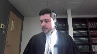
:::

Je dois avancer encore un tout petit peu dans mon plan à ce moment-là, madame la juge.

Avec égard, et vous avez raison, les juges majoritaires soulignent cette question-là dans le jugement dont on appelle.

Avec égard, je n'ai pas la même vision du dossier et ce que je vous soumets ce matin, c'est qu'à l'inverse, le dossier démontre que les deux requêtes en décaliardage auraient non seulement pu, auraient dû être entendues au même moment.

Ce qu'il faut comprendre est que, entre le 8 janvier 2018 et le 13 février 2018, quatre dates d'audition seront offertes, aux parties pour la première requête en décaliardage des rapports de surveillance.

Donc, le 8 janvier 2018, la date avait été d'abord refusée par l'intimé.

Par la suite, la première audition a eu lieu le 17 janvier 2018 pour une durée de 1h30, qui, finalement, par la suite, a été reportée au 25 janvier 2018 pour une durée de 1h, et finalement a été reportée au 13 février 2018 pour une durée de 30 minutes.

Or, il faut comprendre que la requête, en décaliardage de l'annexe jointe au mandat, n'a pris que 12 minutes d'audition.

En fait, 12 minutes pour les pédagogies de part et d'autre, et la décision a été prononcée immédiatement.

Donc, l'ensemble de l'audition de la requête s'est terminée, à mon souvenir, à moins de 30 minutes.

Donc, il paraît manifeste, du point de vue de la plante, que ces deux requêtes-là auraient dû être réglées au même moment.

Et c'est sur le point que je suis, je vous dirais, en désaccord avec la position des juges majoritaires sur cette question.

**Justice Kasirer** (00:08:17): Le point au-delà de l'étapisme, maître Vaucelle-Lévesque, est-ce que le point aussi c'était que selon l'approche de la défense que la requête en décaviardage de la dénonciation au soutien du mandat de perquisition et la requête en contestation du mandat lui-même était liée selon la défense?

::: {.column-margin}

:::

Ce qui expliquait son étapisme, mais ce qui retardait la chose pour autant.

Voyez-vous

ce que je veux dire là.

Elle était d'avis qu'on ne pouvait pas procéder sur la requête en décaviardage de la dénonciation avant d'aller sur la deuxième requête puisqu'elles étaient liées.

Est-ce que je me trompe sur ce point?

**Speaker 3** (00:09:17): Je vous remercie, Monsieur Casirac, encore une fois pour votre question.

::: {.column-margin}
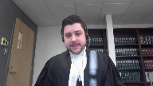
:::

Selon ma compréhension, je ne pense pas qu'il était nécessaire de traiter la requête en décalavardage de l'annexe après la requête en décalavardage des rapports de surveillance.

Les deux auraient dû avoir lieu au même moment.

Pour ce qui est de la question de la requête en contestation du mandat de perquisition, d'une part, il y a un point que j'aurais en fait aimé amener un peu plus tôt, mais je vais y aller dès maintenant.

Vous savez, on est aussi dans un cas où la partie intimée pose des conditions à la fixation de la requête en contestation du mandat.

Donc, le 14 novembre 2017, ce qui va se passer, c'est la plante va indiquer qu'elle a compris de ses conversations avec l'intimée qui sont prêts à fixer le procès.

Et par la suite, il va y avoir deux conditions qui vont être posées par la partie intimée, dont celle de réviser le caviardage des rapports de surveillance.

Par la suite, nous arrivons au 4 décembre, et le 4 décembre 2017, à ce moment-là, le procès où minimalement la requête en contestation devait être fixée, ce qui avait été indiqué à la fin d'audition du 14 novembre 2017.

Or, à ce moment-là, l'intimée va poser une condition, c'est-à-dire de terminer la question du décalavardage des rapports de surveillance.

Finalement, par la suite, nous arrivons au 1er mars.

Il y a encore une fois une nouvelle condition qui est fixée par l'intimée pour fixer la requête.

C'est la question, en fait, d'offrir une vérification au niveau de la fidavite et qu'elle atteint un retour de la part de la plante.

Donc, à trois reprises, l'intimée va poser des conditions à la fixation de la requête en contestation.

C'est important de comprendre, pour revenir un peu plus tôt dans le dossier, dès le 7 décembre 2016, lors de l'ouverture des paquets scellés, l'intimée va obtenir la version caviardé de l'annexe.

Et il va demander, à ce moment-là, un délai de onze semaines pour en prendre connaissance.

Le 24 février 2017, dans quel préliminaire sera fixé, près de neuf mois plus tard.

Donc, qui aura lieu le 14 novembre 2017.

Il n'y a toujours rien qui est souligné par rapport à quelconque problème dans l'annexe jointe au mandat.

Ce n'est que le 1er mars 2018, la première fois qu'on va soulever une problématique reliée à l'annexe, et c'est pour indiquer qu'on veut une vérification.

Et ce n'est que le 20 mars qu'une requête en déclavage de l'annexe sera annoncée.

Et ce n'est que le 20 mars que l'intimée va proposer, à ce moment-là, de fixer les délais pour la production des requêtes et l'audition de la requête en contestation du mandat.

Or, l'autre point également important à se souvenir, dès le 17 janvier 2018, pour reprendre les paroles de la planète pendant l'audition, le ménage a été fait dans les rapports de surveillance.

Il ne reste que deux passages détigieux à ce moment-là, c'est-à-dire l'information inscrite à une heure précise dans l'un des rapports et une autre information caviardée inscrite à une heure précise dans l'autre rapport de surveillance.

On voit également dans les transcriptions que les notes stenographiques de l'enquête préliminaire sont déposées sur la cote R2.

Le 17 janvier 2018, il ne reste très peu d'éléments en litige à ce moment-là.

Et je vous dirais, c'est une conséquence de l'étapiste qu'il y a eu dans le dossier, c'est-à-dire d'attendre qu'une étape se termine complètement avant d'aborder la seconde qui a causé les délais.

Et là, je reviens à l'admission que l'intimé admettait être responsable.

**Speaker 4** (00:12:52): Maitre Lévesque, quand vous dites qu'ils ont demandé le 1er mars 2018 une vérification quant au caviardage des affidavits, est-ce que cette vérification c'était pour que la Couronne confirme si le caviardage de l'affidavit était toujours d'actualité ou autrement dit si certaines parties devaient toujours être caviardées?

::: {.column-margin}
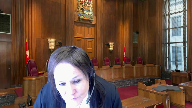
:::

Est-ce que c'était là le but de cette vérification demandée par la défense?

**Speaker 3** (00:13:16): Je vous remercie, quand même, pour votre question, Mme la juge Clôté.

À mon souvenir, le 1er mars, c'était pour vérifier si le caviardage, en fait, concernait une enquête autre.

**Overlapping speakers** (00:13:24): Okay.

**Speaker 3** (00:13:25): qui concernait l'intimité, c'était mon souvenir des transcriptions, je pourrais leur...

**Overlapping speakers** (00:13:29): Okay.

**Speaker 3** (00:13:29): obtenir la mention exacte.

::: {.column-margin}
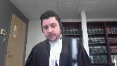
:::

Mais dans l'ensemble des procédures en première instance, c'est la première fois qu'on souligne un problème avec la question du caviardage de l'annexe et c'est ça qui est important dans ce cas-ci.

Vous avez quand même un délai de près de 15 mois à l'ouverture du paquet CD pour que cette question-là soit posée à ce moment-là.

**Speaker 4** (00:13:48): Okay.

**Speaker 3** (00:13:56): Donc, pardonnez-moi, je vais simplement revenir à la question.

**Speaker 2** (00:14:01): En fait, au-delà du 15 mois aussi, Maitre Lévesque, je comprends que la dénonciation était disponible depuis le 7 décembre 2016, puis la requête est présentable le 1er mars 2018.

::: {.column-margin}
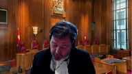
:::

En fait, le 20 mars 2018, on le dénonce le 1er mars.

C'est ça les délèves.

**Speaker 3** (00:14:22): En fait, la première difficulté reliée à l'annexe joint au mandat va être soulignée le 1er mars.

::: {.column-margin}
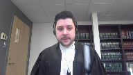
:::

Des délais ne seront fixés que le 20 mars 2018 à ce moment-là.

Vous savez, dans le dossier, entre le 13 février 2018 et le 1er mai 2018, la seule progression du dossier est la question du décarvillardage de l'annexe, c'est-à-dire le temps pour soulever le problème, par la suite, le temps pour demander la vérification, par la suite, le temps pour préparer la requête.

Et même lorsque le juge gestionnaire qui a été très proactif dans le dossier, et je voudrais quand même le dire que l'apprentissage est rendu aussi disponible très rapidement pendant cette période de temps-là, bien, à ce moment-là, même le 3 avril sera refusé par l'intimé parce que la date n'est pas possible, selon ses propos mêmes des transcriptions.

Donc, à ce moment-là, je vous dirais, c'est ce qui blesse par rapport à la conduite de l'intimé dans le dossier.

Ce qu'elle constitue une conduite illégitime au sens de l'arrêt codé.

Et si vous me permettez, je pense que le paragraphe 33 de codé dans ce que c'est devient particulièrement pertinent.

Aussi, elle co-précise au paragraphe 33 que l'avocat de la défense est donc censé faire valoir activement les droits de son client à un procès tenu de façon délai raisonnable, collaborer avec l'avocat du ministère public lorsque cela sera indiqué et utiliser de façon efficace le temps du tribunal avec beaucoup de dégâts, c'est qu'est-ce qui a manqué dans ce que c'est pour la période sous études et pour le délai de 84 jours.

Et encore une fois, on parle du changement de culture qui est dirigé par cette Cour dans l'arrêt de Jordan.

Vous savez, on ne parle pas d'un manquement étique ou bien d'idéontologique, on dit simplement qu'une pratique qui est acceptable avant l'arrêt de Jordan ne l'est plus et je vous soumets que la conduite qui a eu lieu dans ce cas-ci concernant le traitement du dégagardage de l'annexe ne correspond pas au changement de culture.

**Speaker 2** (00:16:21): Ce changement de culture, Maitre Lévesque, s'applique à tout le monde, à tous les acteurs du système de justice.

Alors la défense, la couronne, puis le juge.

Vous allez peut-être en parler tantôt, du juge.

**Speaker 2** (00:16:33): Mais également, le juge doit être proactif dans la gestion de ces dossiers.

**Speaker 3** (00:16:39): Tout à fait, je le reconnais.

::: {.column-margin}
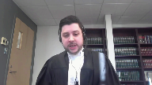
:::

C'est une obligation qui incombe à l'ensemble des participants du système judiciaire.

Mais pour la période sous étude, le point sur lequel je veux mettre l'accent, la poursuite s'est rendue disponible, surtout la période du 14 novembre 2018 au 1er juin 2018.

Ce n'est pas un dossier qui a été abandonné.

La poursuite s'est rendue disponible à des courtes échéances, a accepté d'abréger les délais de signification des requêtes.

Lorsque la procureure principale au dossier n'était pas disponible, d'autres collègues sont venus pour faire l'audition à sa place et poursuivre le dossier.

Donc, il y a une très grande proactivité qui a eu lieu de la part de la plate.

Ce que je vous soumets, pendant cette période qui va du 14 novembre 2017 au 1er juin 2018, également du juge gestionnaire qui même va ouvrir des dates pendant son délibéré.

**Justice Brown** (00:17:35): Il reste à vous seulement 12 ou 13 minutes.

Est-ce que vous allez parler de la période de délai entre le 21 mai et le 10 septembre de 2019?

**Speaker 5** (00:17:47): En fait, monsieur le juge Brown, ce sera ma consoeur Maite Coderre qui va aborder la question d'imputation du deuxième délai.

**Speaker 3** (00:17:57): C'est pas un problème, si vous n'avez plus de questions concernant…

**Speaker 6** (00:18:01): question

::: {.column-margin}

:::

, s'il vous plaît.

Que répondez-vous à l'argument de l'étimé selon lequel la Couronne a eu l'occasion de faire des arguments quant à la qualification de premier délai devant le juge gestionnaire et de répéter ses arguments devant le juge de procès lors de l'audition de la requête de délai des raisonnables parce que vous avez cité des choses dans votre note 70 de votre mémoire et peut-être les cas que vous avez cités sont un peu différents à cause de ça.

**Speaker 3** (00:18:40): Madame la juge Martin, je vous remercie pour votre question.

::: {.column-margin}
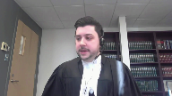
:::

En fait, tout à fait, c'est un aspect qui est également pertinent, qui n'est, je vous dirais, peut-être pas autant déterminant que ceux précédents, mais demeure pertinent pour le dossier.

Et vous savez, ce qu'il faut comprendre est que dès la présentation des requêtes en arrêt des procédures par l'intimé en première instance, cette question-là n'a jamais été litigieuse.

Jamais c'est une question qui, au procès, a été une quelconque indication qui pourrait être remise en question par quelconque des participants au dossier.

Donc, lorsque la plante va brièvement aborder le délai, et là, on parle d'à peine une page de transcription, avec égard, je suis en désaccord avec la prétention de l'intimé à l'effet qu'on a eu d'occasion dans le débat.

Si la plante avait été informée que cette question-là serait litigieuse, je suis persuadé que le débat aurait été différent en première instance à ce moment-là, et les explications aussi auraient pu être différentes.

Et, avec égard, sur ce point-là, si le juge du procès estimait que cette qualification-là était erronée, il aurait dû permettre au parti de préciser le fondement de leur suggestion et, si ça en écarte, expliquer pourquoi l'admission était erronée.

Et, très respectueusement soumis, je ne pense pas que les motivations étaient suffisantes pour expliquer pourquoi le juge n'a pas suivi ce que les partis lui suggéraient.

Et, sur ce point-là, Mme la juge Martin, vous savez, je ne sais pas qui est mieux placé que les partis elles-mêmes pour évaluer l'impact de leur conduite.

Et cet aspect-là est important, d'autant qu'il concerne des événements qui étaient antérieurs à sa nomination ou à le titre de juge du procès.

Donc, si vous n'avez plus d'autres questions pour le premier délai, je vais céder la parole à ma consoeur météodale.

**Speaker 2** (00:20:26): Merci, maître Caudet.

**Speaker 7** (00:20:29): Monsieur le juge en chef, mesdames et messieurs les juges, bonjour.

::: {.column-margin}
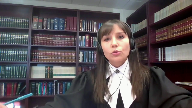
:::

Quant à cette seconde question, vous aurez compris que l'argumentaire de la plante est fondé sur les paragraphe 64 et 65 de l'arrêt Jordan rendu par cette cour.

Ainsi, la défense cause directement un délai si le tribunal et la poursuite est prête à procéder, évidemment sous réserve d'un temps de préparation raisonnable.

Ensemble, évidemment, l'approche préconisée par cette cour s'écarte de l'approche qui prévalait sous l'égide de l'arrêt Godin.

Évidemment, comme le temps de préparation raisonnable fait partie de l'analyse d'un délai imputable à la défense, il va de soi que ça commande parfois une analyse qualitative de ce type de délai.

**Speaker 4** (00:21:16): Maître Coderre

::: {.column-margin}
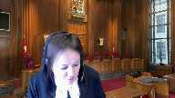
:::

, est-ce que vous faites une différence entre la situation où la défense n'est pas disponible aux dates proposées pour fixer le procès et la situation où la défense n'est pas disponible aux dates proposées pour le report du procès lorsque la défense n'est pas responsable du report?

**Speaker 7** (00:21:43): En fait, merci pour votre question Mme la juge Côté.

::: {.column-margin}
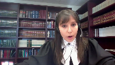
:::

Dans un premier temps, non je ne fais pas distinction et je vous explique pourquoi il me semble que le principe énoncé par cette cour au paragraphe 64-65 est très clair en sens que le délai est imputable à la défense dans la mesure où ce qu'elle est indisponible et ce à l'exception de lorsqu'elle doit bénéficier d'un temps de préparation raisonnable.

Et dans les circonstances de l'espèce, il y a deux volets à ma réponse.

D'une part, et avec égard pour la prétention de l'intimé et des juges majoritaires en appel, je ne suis pas d'avis que la continuation plutôt du procès était due à la poursuite dans les circonstances sous le premier volet.

Et d'autre part, il me semble que le principe est clair et il est évident que la défense n'avait pas à bénéficier d'un temps de préparation raisonnable avant cette date du 10 septembre qui a ultimement été fixée.

Mais qu'est-ce que l'on fait?

**Speaker 4** (00:22:39): Allez-

y, M. Chouch-Cassirère.

**Justice Kasirer** (00:22:39): Mais c'est pour faire suite à votre bonne question, chers collègues.

::: {.column-margin}

:::

Dans le plus grand respect du paragraphe 64 de Jordan, je pense qu'il y a lieu de se pencher sur est-ce que l'avocate de l'intimé en l'espèce était indisponible.

Et dans votre recueil condensé, vous donnez des extraits de l'échange du 9 janvier entre maître roi et la cour et votre collègue de la poursuite.

Mais vous ne donnez pas tous les extraits, malheureusement.

Et vous ne nous donnez pas l'extrait, l'intimé le donne dans son recueil, de l'échange où maître roi dit, c'est vrai, je ne suis pas disponible entre le 21 et le 31 mai.

Mais, et je suis à la page 167 de la transcription, dit-elle, j'ai beaucoup de dates avant puis après.

Je veux dire que j'ai des dates au mois de mai, j'ai des dates tout le mois de juin, dit-elle.

Et plus tard, les deux pages plus loin, elle dit, mais, parlant à la greffière qui prend note de ces délais-là, au fin justement d'une éventuelle requête de Jordan, mais notez aussi, madame, elle s'adresse à la greffière, que j'avais beaucoup de disponibilité en avril, en mai et en juin.

Alors, ma question, c'est que c'est vrai que Jordan nous dit, lorsque l'avocat de la défense n'est pas disponible ou l'avocate de la défense n'est pas disponible, on ne parle pas de faute, mais c'est la défense qui va en écoper.

Ça, j'en conviens.

Mais ici, l'avocate était disponible.

Elle avait concédé en cours d'appel que les dix jours, elle doit, ces dix jours-là devaient être imputées à elle.

Mais pour la période avant et pour la période après, pendant l'été, mais avant le 10 septembre, là on n'a rien.

Le tribunal ne se soucie pas de cette disponibilité-là.

Il me semble que, est-ce que Jordan permettrait, dans ces circonstances-là, un véritable constat des moments précis de l'indisponibilité, puis un partage de la responsabilité pour le délai autrement.

**Speaker 7** (00:25:17): Je vous remercie pour votre question, M. le juge Caziré.

::: {.column-margin}
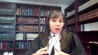
:::

Dans un premier temps, quand vous mentionnez, et votre question est intéressante, sur le partage de responsabilités quant au délai, il est de la prétention de l'attendre que dans un premier temps, il y a un certain partage qui est effectué dans la mesure où est-ce qu'entre le 10 janvier, la fin des premiers deux jours de fixé, ainsi qu'au 21 mai 2019, ce délai-là est évidemment éputable à l'État.

Conséquemment, en fait, considérant que tant le tribunal et la poursuite n'étaient pas disponibles dans ces circonstances-là.

Il y a un autre aspect, par contre, également, qui je pense dans le dossier qui vient, évidemment, là, je pense, et la Plante est d'avis, que l'arrêt de Jordan commande une analyse quand même concrète de ce qui s'est passé dans la situation bien précise.

Et c'est en ce sens-là que la Plante fait beaucoup mention dans son mémoire de la différence qui est due au juge de première instance, qui a eu l'occasion d'analyser la totalité des circonstances dans le présent dossier, mais, outre ça, vous l'avez souligné, l'avocat de l'intimidité en première instance mentionne effectivement qu'elle aurait eu des dates d'une part en avril, quelques dates en mai également en juin.

Par contre, à ce stade-ci, c'est spéculatif dans la mesure où ce qu'on ne sait pas effectivement à quel moment est-ce que celle-ci était disponible.

Donc, au niveau de l'imputation d'un délai, il deviendra effectivement difficile de se prêter à cet exercice-là, d'une part.

D'autre part également, il faut noter que lorsque l'issue de la requête en extrusion de la preuve a été fixée en avril, l'avocat de l'intimidité n'était pas disponible.

Je ne vous dis pas que ça signifie que tout le mois d'avril elle ne l'était pas.

Cela étant dit, encore une fois, j'en reviens au fait que les disponibilités effectives de l'avocat de l'intimidité n'étaient pas précises.

Et en ce sens-là, l'arrêt de cette cour dans KJM, au paragraphe 83, mentionne évidemment, on est au stade de la considération en devenant que le délai net est en deçà du délai de 30 mois ou 18 mois, dépendément des cas.

Mais depuis l'arrêt de Jordan, on attend des intervenants du système judiciaire.

Et bien évidemment, ça implique le juge, bien évidemment, ça implique également la poursuite.

Mais quant à la défense, un effort qui est plus que symbolique quant à noter sa disponibilité et de faire valoir quand il y a une problématique quant au délai.

Mais que d'ailleurs.

**Speaker 4** (00:27:30): Là-dessus, j'aimerais qu'on remonte parce que monsieur le juge, vous venez de parler de la responsabilité de tous les acteurs, monsieur le juge en chef en a parlé tantôt, la défense, la couronne, le juge.

::: {.column-margin}
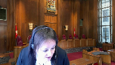
:::

La raison pour laquelle on s'est retrouvé dans la situation dans laquelle on s'est retrouvé en mai, c'est pas un bon matin que la défense a dit comme ça je ne suis pas disponible.

N'est-il pas exact que les partis avaient demandé aux juges dès novembre 2018 d'ajouter une troisième date?

Les partis avaient déjà demandé au juge ça, puis le juge n'a pas voulu.

Alors, est-ce qu'on ne doit pas remonter à ce moment-là pour voir qui est responsable de quoi puis décider comment s'il doit y avoir un partage de responsabilité, comment il doit être attribué.

Le juge savait dès novembre 2018 que deux dates ne seraient pas suffisantes.

La couronne le savait, la défense le savait, vous avez demandé que notre date soit fixée, mais le juge a dit non.

Je remercie correctement.

Comment on compose avec ça?

**Speaker 7** (00:28:27): Je vous remercie Madame la juge pour votre question qui est excellente.

::: {.column-margin}
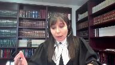
:::

Dans un premier temps, ce qu'il faut noter, c'est qu'effectivement, vous l'avez bien nommé, il y a une troisième date qui est suggérée par les parties.

Il ne faut cependant pas oublier la trame factuelle complète du dossier en ce qui a trait à la tenue des audiences de procès sur le fonds en ce que le 9 janvier 2019, lors de la première date de la tenue du procès, qui s'entend par le voir-dire sur la requête en exclusion de la preuve, à ce moment-là, c'est l'insumé qui demande d'attendre l'issue de la décision sur la requête en exclusion de la preuve, donc conséquemment le repart pour la preuve au fonds en septembre.

Je vous dis ça, pourquoi?

Parce que le moment où est-ce que cette audition-là est terminée, le 10 janvier, et là je parle, je fais référence à la requête en exclusion, il reste une heure trente dans le cadre laquelle la preuve de la poursuite aurait pu être administrée, et pourquoi est-ce que je vous dis ça?

C'est que conséquemment quand on arrive et qu'on est à l'étude de la preuve sur le fonds qui est ultimement faite le 10 septembre 2019, c'est en plein le temps que ça a pris à la poursuite pour administrer cette preuve-là d'une part, donc la submission du ministère public, je m'excuse de l'appeler dans les circonstances, et qu'on aurait amplement eu le temps de compléter la preuve dans ces deux jours-là, n'eût été de la demande de la défense à ce moment-là, d'attendre l'issue, en fait le sort de cette requête en exclusion de la preuve-là, ce qui reflète en fait l'étapiste dont mon collègue a fait mention un peu plus tôt, dont a fait preuve la défense d'une part, et également il faut noter le comportement de la défense dans ces circonstances-là, qui n'a jamais fait des admissions, jamais n'a-t-elle dit à la plante en première instance que la preuve ultimement sur le fonds était complètement admise.

Donc ce que je vous soumets, c'est que le fait de faire en sorte que la défense ne soit pas imputable du délai qui est dû par son individualité, lancerait comme message que la défense ultimement peut profiter de son inaction, en fait, dont elle a fait preuve dans le cadre de ce dossier.

**Justice Kasirer** (00:30:28): mais maître Coderre

::: {.column-margin}
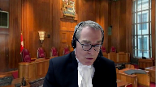
:::

, le juge en chef a dit tout à l'heure que tous les acteurs, et vous l'avez souligné à votre tour, que tous les acteurs ont une responsabilité d'être proactif dans tout ça.

Le tribunal, en choisissant et en insistant sur la date du 10 septembre, est la couronne qui, elle, si le juge n'avait peut-être pas Jordan à l'esprit, vous avez cette responsabilité-là.

Je me demande, juste sincèrement, le 9 janvier, quand l'avocat dit je suis prêt à trouver une autre date, puis ça se reporte au 10 septembre, il me semble que la couronne, le tribunal, en a une responsabilité.

Ils entendent une responsabilité par rapport à ça.

Et donc, une responsabilité entière pour toute la période, parce qu'on vise la période entre le 21 mai et le 10 septembre, que toute cette période soit collée à la défense.

Est-ce que c'est vraiment ça ce que Jordan a à l'esprit au paragraphe 64 que vous citez, que Cody complète en soulignant la responsabilité de tous ces chacuns?

**Speaker 7** (00:31:53): Je vous remercie, monsieur le juge, pour votre question et j'y répondrai brièvement parce que je vois que le temps est terminé, là.

Ce que j'ai à vous dire là-dessus.

**Overlapping speakers** (00:32:00): En fait, là-dessus va être le contenu des questions qu'on vous a posées.

Je vais vous donner cinq minutes pour terminer vos arguments.

**Speaker 7** (00:32:07): Je vous remercie, M. le juge en chef.

::: {.column-margin}
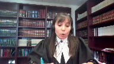
:::

Alors, pour répondre à votre question, effectivement, et je n'irai pas prétendre devant vous que la plante n'avait pas de responsabilité quant au délai, que le juge n'avait pas de responsabilité quant au délai, parce que là n'est pas l'idéologie, en mon sens, et je pense que vous êtes les mieux placés pour me le dire, mais là n'est pas l'idéologie qui était préconisée par Jordan ou le message qui était lancé par cet arrêt-là.

Cela étant dit, dans la mesure où est-ce que la défense dans ce dossier-là, et je reviens au principe de déférence, encore une fois, il y a une limite au pouvoir d'intervention en cours d'appel, cette question-là est éminemment factuelle.

Le juge a considéré l'ensemble de ces éléments-là, et en outre, quant à la question, en fait, du comportement de la défense, elle n'a jamais soulevé.

Effectivement, la poursuite aurait pu le soulever, le juge aurait pu le soulever, mais dans la mesure où est-ce que la défense, si Haman ne fait pas d'admission et qu'au final, sur le fond, tout est admis, il va sans doute, et il émane tant qu'à moi, du bon sens que deux jours de procès nécessairement plus longs à fixer que deux heures, qui ultimement a été nécessaire pour compléter la preuve au fond.

Alors, certainement que si la défense et le juge le notent à bon droit, en mon sens, selon la plante à tout le moins, dans le jugement de première instance, que si les parties, en fait, si l'avocate de l'intimé en première instance avait été en mesure de discuter avec l'avocate de la poursuite qui agissait à ce moment-là, certainement que le deux heures aurait été fixée plus tôt et c'est en ce sens-là que la prétention de la plante est que c'est un délai qui émane directement du comportement de la défense qui, d'une part, a fait preuve d'étapisme en décidant d'attendre l'issue de la requête en excision de la preuve et, d'autre part, n'a jamais fait mention qu'ultimement la preuve au fond, elle était admise.

Le juge de première instance a considéré ces éléments-là qui sont purement factuels et, en ce sens, c'est pourquoi la plante vous soumet et, évidemment, très respectueux.

**Overlapping speakers** (00:34:05): C'est purement factuel, mais la qualification de délai selon le cadre d'analyse de Jordan, c'est une question de fait et une question de droit.

**Speaker 7** (00:34:15): En fait, les délais, et je pense que cette cour a bien répondu à cette question par l'arrêt Yousouf, rendu...

**Overlapping speakers** (00:34:21): Thank you very much.

**Speaker 7** (00:34:21): en 2021

::: {.column-margin}
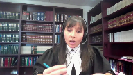
:::

. Alors, les faits qui sont sous-jacents évidemment à commande d'efférence, la qualification qui en résulte est une question de droit, ça va de soi.

Dans la mesure où est-ce que le juge, de première instance, a bien identifié la norme juridique applicable, en mon sens, c'est la question factuelle qui devient davantage importante et c'est à cet égard-là que je vous soumets qu'il devait y avoir d'efférence dans l'appréciation des délais.

Et c'est pourquoi que je mets l'emphase sur le comportement essentiellement de la défense qui a procédé par étapisme et qui a décidé de cacher son jeu ultimement, autant au ministère public qu'au tribunal.

Alors, c'est pourquoi je mets l'emphase sur cet élément-là et sur la déférence, M. le juge Brown.

**Overlapping speakers** (00:35:07): Est-ce que ça complète vos…

**Speaker 7** (00:35:10): En fait, si vous n'avez pas d'autres questions, j'ai fait le tour en ce qui me concerne et je vous remercie infiniment pour votre écoute.

**Speaker 2** (00:35:17): Merci Maître.

Maître Saint-Jacques.

**Speaker 8** (00:35:24): Monsieur le juge en chef, Mesdames les juges, Messieurs les juges, plus de 38 mois ont été nécessaires pour compléter le procès de l'intimé.

::: {.column-margin}
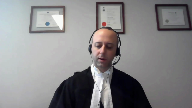
:::

Un procès ne comportant que deux requêtes fondées sur la chape, un procès simple, un procès pourtant parsemé d'attentisme, de multiples changements de stratégie et de décision à la onzième heure par la plante, ce qui a entraîné un dépassement du plafond présumé.

Comme les juges majoritaires de la Cour d'appel le soulignent, le juge pose le bon diagnostic sur cette affaire.

La poursuite n'avait pas de plan, pas de stratégie et cinq procureurs différents se succèdent.

Voilà la toile de fond quant aux deux délais qui se trouvent au cœur du présent pourvoir.

Un premier délai qui a trait premièrement au temps nécessaire pour présenter deux requêtes par la défense qui en soi sont des conduites légitimes de la part de la défense pour répondre aux accusations portées contre elle.

Et d'autre part, un délai qui résulte de l'indisponibilité de sa procureure suite à la continuation du procès.

**Speaker 2** (00:36:25): Maître,

si vous permettez, pourquoi la défense a pris 15 mois pour dénoncer le problème avec le cavirbage?

**Speaker 8** (00:36:31): Alors, sur ce point, M. le juge en chef, j'attire votre attention sur, premièrement, le fait que la responsabilité relativement au caviardage est une responsabilité partagée.

::: {.column-margin}

:::

Alors, selon évidemment la jurisprudence en la matière et notamment la règle aropholie, le ministère public doit savoir que lorsqu'il y aura une contestation au niveau de l'autorisation judiciaire et qu'une portion de l'autorisation judiciaire ou en fait la dénonciation ou la fidavide dans ce cas-ci est caviardée, eh bien cela engendrera un débat relativement à l'application de la sixième étape ou non.

Il y aura nécessairement une question qui se posera éventuellement dans la contestation de la légalité de la perquisition.

Ce que je vous soumets bien respectueusement, c'est qu'il a parti au ministère public de faire des vérifications tout au long du processus relativement au caviardage et déterminer si oui ou non les privilèges s'appliquent toujours afin de justifier le caviardage.

D'autant plus lorsque le caviardage ici est un privilège d'enquête en cours.

Alors évidemment, dans ces cas-là, l'enquête peut changer à travers le temps, peut être modifiée de sorte que c'est un privilège, contrairement par exemple au privilège de l'informateur qui est plus statique.

Dans le cas du privilège de l'enquête en cours, c'est un privilège qui est susceptible d'évoluer dans le temps et donc le ministère public se doit de faire des vérifications au fur et à mesure pour s'assurer justement que le caviardage est toujours d'actualité.

**Speaker 1** (00:38:01): It's incredible.

**Speaker 2** (00:38:01): Là, vous parlez de la responsabilité du ministère public, c'est bien, je suis pas en désaccord avec ce que vous venez de dire d'ailleurs, mais qu'en est-il de la défense?

Est-ce que vous me dites que la défense, dans ces circonstances, n'a aucune obligation d'être proactif?

**Speaker 8** (00:38:16): Non, monsieur le juge en chef, je ne vous soumets pas que la défense n'a aucune obligation d'être proactif.

::: {.column-margin}
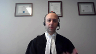
:::

Je pense que dans les circonstances, effectivement, comme nous le reconnaissons dans notre mémoire, la défense aurait pu présenter plus rapidement, on aurait pu soulever plus rapidement la question du caviardage, de la fitavit ou le soutien du mandat de perquisition.

En ce qui concerne les rapports de filature, par contre, c'est une responsabilité qui devait être, en fait, la révision de ces rapports devait être fait par un juge nommé en vertu de 551.1 du Code criminel ou encore le juge du procès.

Alors évidemment, même si la question avait été soulevée avant le mois de novembre 2017, il n'y aurait pas eu de tribunal compétent pour pouvoir adresser la question.

Alors, si vous me permettez, j'aimerais revenir justement pour répondre à votre question et bien contextualiser le déroulement des procédures sur les auditions à partir justement du mois de novembre 2017.

Alors, dès le renvoi à procès le 14 novembre 2017, l'intimé fait preuve de proactivité.

À ce moment, bien qu'elle s'est prête à fixer un procès, la plante n'a pas toujours de liste de témoin pour fixer le procès.

Et la procureure de l'intimé annonce une requête en contestation de la perquisition et sur les motifs d'arrestation.

Alors, si effectivement la question du caviardage avait pu être soulevée avant, l'intimé avait quand même avisé la plante qu'il y aurait une contestation de la perquisition à ce moment dès le mois de novembre 2017 et qu'un enjeu serait quand même d'actualité au niveau de la contestation qui aurait lieu plus tard dans les procédures.

**Speaker 4** (00:39:46): Cet égard-là, maître Saint-Jacques, j'ai posé la question à maître Lévesque.

::: {.column-margin}

:::

La majorité à la Cour d'appel disent de toute façon il y aurait eu une requête en contestation du mandat de perquisition.

La Cour d'appel dit que le dossier ne révèle pas que cette requête-là en contestation de la validité du mandat aurait raisonnablement pu avoir lieu avant le 1er mai.

La majorité semble me dire, écoutez, même si cette question de requête en décaberdage de la dénonciation avait été soulevée auparavant, le dossier ne révèle pas que la requête en contestation du mandat aurait pu être entendue avant.

Qu'est-ce que vous avez à dire là-dessus?

Dites-moi pas juste si ont raison les juges majoritaires, mais est-ce qu'il y avait des ouvertures pour que la requête puisse être entendue auparavant?

Et si oui, combien de temps avant?

**Speaker 8** (00:40:36): Je vous remercie, Madame la juge Côté, pour votre question.

Alors, les paragraphes auxquels vous faites référence sont les paragraphes 102 à 104 de la décennie de la décennie de la décennie de la décennie de la décennie de la décennie de la décennie de la décennie.

**Overlapping speakers** (00:40:44): We.

**Speaker 8** (00:40:44): de la Cour d'appel du Québec

::: {.column-margin}
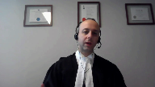
:::

et pour répondre à votre question, je pense qu'il faut regarder justement les auditions à partir du 1er mars 2018 pour bien comprendre le déroulement de ce qui s'ensuit, les ouvertures où il était possible de fixer la requête en révision du caviardage d'une part et également la requête en contestation du mandat de perquisition.

Parce que la position de l'intimé est la suivante, c'est que même si on considère que la requête en révision du caviardage était tardive et qu'on impute les délais à l'intimé, il n'y avait pas raison ici d'imputer les délais relatifs à l'audition de la contestation de la validité du mandat de perquisition parce qu'il s'agissait d'une requête qui devait malgré tout être entendue et qui devait être fixée devant un juge nommé en vertu de l'article 551.1 dans ce cas-ci.

Lorsqu'on regarde l'audition du 20 mars 2018, le privilège de l'enquête en cours est invoqué par la Plante et les dates d'audition des deux requêtes sont fixées à ce moment.

Les deux dates qui sont retenues sont le 1er mai pour la requête en révision du caviardage et la date du 24 mai 2018 pour la requête en contestation du mandat de perquisition.

Mais pour fixer, et ça c'est très important, et je voudrais faire à l'onglet 13 de notre cahier condensé, à la page 63, les lignes 22 et 25.

**Speaker 1** (00:42:06): Bye now.

**Speaker 8** (00:42:06): Pour fixer la requête en révision du caviardage au 1er mai 2018, le juge de gestion d'instance a dû forcer le rôle.

::: {.column-margin}

:::

Il n'était disponible que pour une durée d'une heure.

On comprend également du débat qui a eu lieu le 20 mars 2018 que la contestation du mandat de perquisition prendrait plus de temps.

Il n'est pas vraisemblable à ce moment-là que la requête en contestation du mandat de perquisition ait été entendue dès le 1er mai 2018.

Et au plus tôt, lorsqu'on regarde les transcriptions du 20 mars 2018, au plus tôt, la requête en contestation de la validité du mandat de perquisition aurait été entendue le 9 mai 2018, qui était la première date suggérée par le juge d'instance pour entendre cette requête en contestation du mandat.

Donc, nous nous trouvons le 20 mars 2018 et la première date proposée pour entendre la requête en contestation du mandat de perquisition est le 9 mai 2018.

Alors, ce que l'intimé soumet bien respectueusement à la Cour, c'est que la date, la période entre le 20 mars 2018 et la première date disponible pour entendre la contestation du mandat de perquisition, soit le 9 mai 2018, ne peut pas être imputable à l'intimé, puisqu'il s'agit du délai minimal selon le dossier afin que celui-ci puisse présenter sa requête en contestation du mandat de perquisition.

Alors, si on vient à la conclusion que la requête en révision du caviardage était tardive, on pourrait enlever la période entre le 1er mars au 20 mars 2018, qui est une période de 19 jours, et on pourrait également enlever la période du 9 mai, qui était la première date qui était disponible pour la contestation du mandat de perquisition, donc du 9 mai jusqu'au 24 mai 2018, qui est une période de 15 jours.

Et au total, donc, on pourrait retrancher une période de 34 jours au délai net qui était de 983 jours.

Donc, si on enlève ce 34 jours au 983 jours, nous sommes toujours au-dessus du plafond de 30 mois de l'arrêt de Jordan.

Et dans tous les cas, ce que je vous soumets respectueusement, c'est que afin de déterminer que le délai net passe en dessous du délai du plafond de 30 mois, il faudrait en imputer l'incerté des 84 jours qui ont été nécessaires pour entendre non seulement la requête en révision du caviardage, mais également la requête en contestation du mandat de perquisition, qui constitue une mesure légitime et dont personne n'a fait état en première instance du fait que cette requête-là, elle, elle était tardive dans les faits où elle ne constituait pas une mesure légitime.

**Justice Kasirer** (00:44:42): M. Saint-Jacques, est-ce que je peux vous...

::: {.column-margin}

:::

juste pour que je comprenne l'effet, parce que moi j'ai compris que la défense à l'audience du 20 mars a essayé d'expliquer qu'il y avait un lien entre la requête pour révision, pour réviser le mandat de perquisition, et le caviardage.

Et que donc l'étapisme dont parle le juge Chamberlain, c'est qu'il y a comme c'est une étapisme boule de neige, si on reporte, on fait reporter le tout, plutôt que de s'attaquer à la question du caviardage de la dénonciation dès la première occasion et comme le juge en chef a dit, ça, ça remonte au mois de décembre 2016.

Qu'est-ce que vous avez à dire à cette idée de l'étapisme et du lien entre les deux?

**Speaker 8** (00:45:40): Je vous remercie, Monsieur le juge Cassirard, pour votre question.

::: {.column-margin}
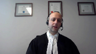
:::

Premièrement, il y a effectivement un lien entre la présentation de la requête en contestation du mandat de perquisition et à la fois la fidavit qui était caviardée, mais également des rapports de filature qui étaient caviardés.

Et si vous regardez la décision notamment du juge Dagenais, qui était le juge d'instance, il est mentionné que les rapports de filature ont été déposés au soutien de la requête en contestation du mandat de perquisition et également évidemment la fidavit au soutien du mandat de perquisition.

Alors, la question du caviardage était intimement liée à la présentation de la contestation du mandat de perquisition et pour reprendre, je parlais tout à l'heure de la règle à la folie, mais si par exemple nous avions reçu un résumé judiciaire de la part de la plante ainsi qu'une indication claire à renoncer à utiliser l'étape 6 de la règle à la folie, eh bien la question du caviardage aurait très bien pu être évitée dans les circonstances, parce que dans la mesure où la plante ne requiert pas de procéder à l'étape 6 de la règle à la folie, eh bien le caviardage, qui ne concernait pas, selon la compréhension qu'on en a aujourd'hui, qui ne concernait pas l'intimé et qui n'avait pas de lien ou même de recoupement avec les autres informations contenues dans la dénonciation, eh bien tout ce débat-là aurait pu être évité dans les circonstances.

Alors, quand je vous mentionne qu'effectivement il y a un lien, c'est que la défense veut savoir de quoi il s'agit.

Lorsqu'elle est informée, elle est informée le 20 mars et ultimement va être informée avec précision par le juge Dagenais lui-même dans le cadre de la décision rejetant la requête en révision du caviardage.

Il va fournir un résumé judiciaire de l'information qui se trouve en dessous du caviardage et à ce moment-là, la défense est en meilleure position pour savoir oui ou non, est-ce qu'il s'agit d'information qui est pertinente à la contestation et l'intimé, la plante ultimement invoquera ne pas vouloir procéder à l'étape 6 de garofolie et que donc finalement tout ce caviardage-là n'est pas utile finalement à la résolution de la détermination de la requête en contestation du mandat de perquisition.

**Justice Kasirer** (00:47:49): Je comprends que la légitimité de votre démarche est incontestable, parlant pour moi, mais c'est la manière, et puis la distinction est faite dans Jordan, la manière dont la défense s'est conduite au regard de sa requête en décaviardage de la dénonciation, c'est là où le bas blesse.

::: {.column-margin}
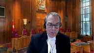
:::

Vous n'avez pas agi avec l'empressement nécessaire, selon le juge Chamberlain, vous avez attendu, vous avez procédé par étapes, et ceci était, ce n'est pas une question de faute, mais ça explique le retard pour une démarche qui était par ailleurs, oui, légitime.

**Speaker 8** (00:48:33): Je vous remercie de votre question, M. le juge Cassirer.

::: {.column-margin}
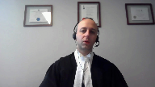
:::

Pour y répondre, je vous soumets bien respectueusement qu'encore une fois, il s'agit d'une responsabilité partagée entre l'intimé et la plan, parce que ça relève également des obligations du ministère public de décaviarder la dénonciation au sujet du mandat de perquisition, d'autant plus lorsqu'il sera, il est informé dès le mois de novembre 2017, qu'il s'agira d'un enjeu à débattre lors de la contestation.

Et je suis bien conscient que la demande aurait peut-être pu être faite avant, effectivement, par la défense, mais même si on vient à la conclusion que la demande était tardive dans les faits, comme je l'indiquais tout à l'heure suite à la question de la juge Côté, dans les faits, les faits, le retard qui a été causé, c'est un retard à la limite qui peut être compris entre le 1er et le 20 mars 2018, et ensuite entre le 9 mai et le 24 mai 2018.

Et au bout de la ligne, même si on retient la position de la plante selon laquelle nous sommes responsables, l'intimé est responsable de la demande de révision du cabardage qui était tardive, mais dans les faits, il devait y avoir malgré tout un délai occasionné pour la présentation de la requête en contestation du mandat de perquisition.

**Speaker 4** (00:49:55): Donc, M. Saint-Jacques, ici, vous dites que ce que vous nous dites essentiellement ce matin, c'est que ce qu'on devrait attribuer à la défense, c'est 34 jours.

::: {.column-margin}

:::

Sur ce premier délai de 84 jours, je l'appelle le délai de 84 jours, alors vous dites qu'on reconnaît que 34 jours relèvent de la défense.

**Overlapping speakers** (00:50:14): C'est exact, Madame Lajusquoté.

**Speaker 4** (00:50:15): Et comment ça se fait que les juges de la Cour d'appel, eux, les juges majoritaires, ils parlent de 28 jours?

**Speaker 8** (00:50:22): Oui, alors pour répondre à votre question

::: {.column-margin}
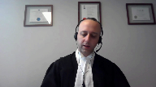
:::

Madame la juge Côté, au paragraphe 104 de la décision de la Cour d'appel, il est écrit «

En d'autres termes, le dossier ne révèle aucune raison de croire que la contestation sur la validité du mandat de perquisition aurait raisonnablement pu avoir lieu avant le 1er mai, date proposée par le tribunal.

Ainsi, même en tenant pour acquis que la requête aurait pu être entendue ce jour-là plutôt que le 28 mai, la responsabilité du délai admise par la défense ne retrancherait que 28 jours et non 84 jours.

» C'est que la Cour d'appel, les juges majoritaires à la Cour d'appel soulignent qu'il aurait peut-être été possible d'entendre la requête en contestation du mandat de perquisition le 1er mai 2018 en remplacement de la requête en révision du caviardage.

**Overlapping speakers** (00:51:05): Okay.

**Speaker 8** (00:51:05): une possibilité,

::: {.column-margin}
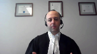
:::

mais lorsqu'on regarde les transcriptions, le juge d'Agenay, le juge d'instance, indique qu'il force le rôle le 1er mai uniquement pour entendre cette requête en révision du caviardage.

Alors ce que je vous soumettais préalablement, c'est que lorsqu'on regarde l'ensemble de la transcription du 20 mars 2018, on peut se rendre compte que la première date réelle à laquelle on aurait pu entendre la requête en contestation du mandat était le 9 mai 2018.

**Overlapping speakers** (00:51:30): Enough me, good.

**Speaker 8** (00:51:31): de la première date suggérée par le juge Dagenais.

**Speaker 4** (00:51:34): OK, merci.

**Speaker 8** (00:51:42): Alors, j'aimerais rapidement également aborder la question de l'admission par la défense, l'admission en droit ou la reconnaissance selon la qualification des délais que la défense ou l'intimé était imputable relativement à cette période de 84 jours.

::: {.column-margin}

:::

Je vous soumets bien respectueusement qu'avec l'examen que je viens de faire avec la Cour, il n'apparaît évident que la qualification en droit par la défense de l'entièreté du délai entre le 1er mars 2018 et le 24 mai 2018 était déficiente et ne reflétait pas la réalité du déroulement de l'instance.

Et le juge de première instance n'était pas lié par cette qualification des délais qui en fait une question de droit, d'autant plus que les explications qui avaient été fournies par l'intimé, eh bien, tournaient beaucoup autour du fait que sa requête en révision du caviardage était tardive.

Mais en aucun temps, l'intimé n'indiquait dans ses explications que la requête en contestation du mandat de perquisition était tardive et constituait une mesure illégitime.

Et même la plante, lorsqu'elle fait des représentations à cet effet, le 10 septembre 2019, et je voudrais faire à l'onglet 16, à la page 64, donc l'essai de mon cahier condensé, les lignes 1 à 25, un peu plus bas, la ligne 21 à 25, il est mentionné que donc un juge de gestion a été nommé, le juge Dagenais, et dès lors on a fixé les auditions pour les requêtes.

Les deux parties ont agi avec célérité.

Là, ce qu'on vous soumet également, c'est ce qui était allégué dans la requête, pour que tout soit entendu le plus rapidement possible.

Donc le dossier a été reporté.

Alors, même de l'avis de la plante, le temps qui a été requis pour fixer l'audition de la requête en contestation de la perquisition, eh bien les parties ont agi avec célérité.

Il n'y a pas d'indication par la plante que cette requête était tardive en soi, à aucun moment.

Par contre, on indique à plusieurs reprises que la requête en révision du caviardage, elle, était tardive.

Alors, je vous soumets bien respectueusement qu'avec ces explications, avec les transcriptions, les tableaux des parties qui résumaient également le déroulement de l'instance, le juge de première instance, eh bien, était en mesure de donner droit ou de ne pas donner droit à la qualification par l'intimé des délais qui étaient occasionnés dans cette période de 84 jours.

**Speaker 2** (00:54:11): Il n'y a pas de l'air pour la Cour d'appel, la majorité, ce que le premier juge Garneau voulait dire.

**Overlapping speakers** (00:54:17): C'est ça.

La juge Cornouane.

**Speaker 2** (00:54:18): avec sa générosité qu'on lui reconnaît tous, nous dit que finalement on peut déterminer le raisonnement implicite du juge de première instance.

Mais quand on lit les motifs de ce juge-là, c'est pas évident.

**Speaker 8** (00:54:36): Monsieur le juge en chef, effectivement, les motifs auraient pu être étoffés ou plus limpides, vous avez bien raison.

::: {.column-margin}

:::

Mais lorsqu'on lit quand même les motifs du juge de première instance, le paragraphe 70 et 74, le paragraphe 70, il discute de la période du 1er mars 2018 au 20 mars 2018 et on peut comprendre qu'il y aurait peut-être une certaine imputation des délais à la défense relativement à cette période.

Mais à la toute fin du paragraphe 74, il indique que le 1er mai 2018, il y a audition de la requête en décaviardage et la requête est rejetée.

Il indique tout de suite après, ce délai n'est pas imputable à la défense.

Alors, de l'opinion du juge de première instance, il y avait minimalement un délai dans cette période de 84 jours qui n'était pas imputable à la défense.

Et ce que je vous soumets bien respectueusement, c'est que s'il y a un raisonnement à en tirer lorsqu'on regarde l'ensemble du dossier et particulièrement le fait que la requête en contestation du mandat de perquisition n'était pas tardive, eh bien que minimalement, ce délai-là que je vous montrais tout à l'heure n'aurait pas dû être imputé à la défense et que c'était l'intention du juge de faire ainsi.

Si vous me permettez, à moins que vous ayez d'autres questions relativement à la première question en litige, j'aborderai la deuxième question en litige qui est la période de 112 jours qui suit la suite du procès.

**Overlapping speakers** (00:56:01): Très bien.

**Speaker 8** (00:56:01): En ce qui concerne cette deuxième période, il a été question tout à l'heure de l'indisponibilité de la procureure de l'intimé.

::: {.column-margin}
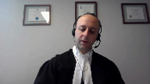
:::

J'aimerais revenir sur les transcriptions qui accompagnent le cahier condensé et plus précisément l'onglet 15 à la page 169 où il est indiqué que l'avocate de l'intimé était disponible en avril, en mai, et on comprend que c'était avant le 21 mai parce qu'elle n'était pas disponible du 21 au 31 mai, et également disponible au mois de juin.

Je vous soumets que ces représentations de la part de l'avocate de l'intimé sont très importantes parce que les dates qui sont offertes ne sont pas des dates où il y aurait eu dépassement du plafond de la red Jordan.

Si effectivement les dates avaient été retenues, les dates proposées par l'avocate de l'intimé, ces dates auraient fait en sorte que le procès se serait tenu en-dessous du plafond de la red Jordan.

Donc, ça indique toute l'intention de la part de la défense et de l'intimé de vouloir subir son procès dans le délai prévu par la red Jordan.

On n'est pas dans une situation ici où la défense suggère des dates après le dépassement du plafond ou est indisponible à beaucoup de dates finalement qui sont proposées par le tribunal.

On a une période précise à laquelle elle n'est pas disponible et indique des dates bien avant.

Donc, si vous lisez la transcription, la raison pour laquelle l'avocate de la défense n'est pas disponible, c'est qu'elle a un autre procès en cours pour un autre client.

Elle indique qu'elle a un procès pour un monsieur Leventis et donc, ça place l'avocate de la défense dans le cas d'une continuation de procès à finalement choisir quel client devrait avoir priorité relativement à son droit prévu à l'article 10B de la Charte et il n'est pas possible rendu dans un cas de continuation de procès d'être remplacé parce que l'analogie qu'on fait, c'est que, essentiellement, lorsqu'une date est refusée par la défense, eh bien, effectivement, c'est un délai qui devrait être imputé à la défense.

Ceci peut être vrai lorsqu'il vient le temps de fixer la date de procès parce que la défense, un avocat peut être remplacé par exemple et il peut y avoir plusieurs choses qu'on peut faire.

Mais ici, on est dans un procès qui est continué et là, on se trouve dans une situation où on doit choisir entre deux clients et on ne peut pas se faire remplacer pour le procès de l'intimé.

Alors, dans ces circonstances, et c'est pour ça qu'on soumet dans notre mémoire qu'il faut adopter une approche qualitative pour s'assurer finalement que les délais qui sont occasionnés sont des délais qui sont directement ou uniquement causés par la défense au sens du paragraphe 63 de l'arrêt de Jordan.

Et d'autant plus, comme la Cour l'a soulevé précédemment, que dans ce cas-ci, les parties avaient indiqué au juge du procès qu'une troisième journée serait nécessaire pour compléter le procès et le juge a tenté finalement de tenir le procès à l'intérieur de deux jours, ce qui n'a pas fonctionné pour diverses raisons et j'y reviendrai par la suite.

Et l'intimé souligne également le fait que la plante précédemment dans ses représentations orales indiquait qu'elle était en mesure de tenir le procès ou elle aurait pu compléter la présentation de sa preuve le 10 janvier.

Mais ceci fait fi du fait que la plante, avant je dirais deux semaines et demi avant la tenue du procès, a indiqué vouloir faire témoigner un expert qui était par ailleurs indisponible sans envoyer un préavis en vertu de l'article 657.3 du code criminel qui doit être envoyé, rappelons-le, dans un délai de 30 jours avant le procès.

Lors de la conférence de gestion au mois de novembre, aucune mention encore une fois de cet expert et lors de la fixation du procès également au mois de juin 2018, et bien, encore une fois, aucune mention de cet expert.

Alors, même si le procès avait pu être tenu, disons, de façon plus complète en date du 10 janvier, dans les faits, la plante n'aurait pas été en mesure de compléter sa preuve puisqu'elle avait décidé à la dernière minute de présenter un témoin expert qui n'était pas disponible dans les faits.

Et l'intimé aurait pu refuser dans les faits de ce procès.

**Justice Kasirer** (01:00:52): Saint-Jacques, est-ce que je peux...

::: {.column-margin}

:::

c'est pas que c'est pas... le temps file.

En vous écoutant, j'entends une logique de blâme, une logique de faute qui est à la base de l'exercice que vous cherchez à faire coller à la poursuite au ministère public, le blâme pour le retard.

Il me semble que la logique, je pense au paragraphe 64 de Jordan, c'est pas une logique de blâme qui est là.

C'est une logique de faire fonctionner le système de justice à l'avantage de tous et que lorsque le tribunal est disponible et lorsque la poursuite est disponible et la défense ne l'est pas, mais le délai est imputé à la défense.

C'est la règle et c'est une règle qui profite autant à la défense qu'à la poursuite dépendant du dossier, pas sur la base de la faute, mais sur la base de cette disponibilité-là.

Alors, est-ce qu'on ne peut pas y voir dans les circonstances de cette affaire?

C'est vrai, les 10 jours en question, ce n'est pas l'ensemble de l'histoire qu'il y a de part et d'autre pour expliquer la responsabilité pour les 112 jours.

Il y a de part et d'autre une responsabilité partagée et que de vous contenter des 10 jours, il me semble que ce n'est pas dans la logique même de Jordan ou de son paragraphe 64.

**Speaker 2** (01:02:32): vous, avant que vous puissiez m'annoncer là-dessus puis je vais vous inviter à le faire, mais juste pour faire suite à la question de mon collègue, le juge Casirère, on parle d'une espèce de blâme que vous faites au niveau de la poursuite et ça représente un peu ce que la majorité de la cour d'appel a fait aussi.

::: {.column-margin}
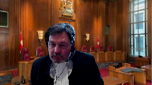
:::

La majorité dit que le ministère public aurait dû avoir un plan de poursuite, par exemple, alors que dans Jordan, il y a deux exceptions qui demandent un plan de poursuite, des dossiers très complexes ou lorsque la mesure transitoire est exceptionnelle.

Alors, c'est un dossier quand même simple qu'on avait ici.

Il y a un accusé, il y a quatre chefs d'accusation, il y a une enquête pour les menaces d'une journée.

C'était assez académique pour la majorité de la cour d'appel de dire, ben là, nous on dit que ça prend un plan de poursuite dans un dossier qui implique un informateur de police.

C'est très théorique et académique.

Au-delà du blâme, alors pour répondre à la question de mon collègue le juge Casirère, est-ce qu'on ne va pas regarder ça dans l'entièreté et pas se fixer sur des mini circonstances qui n'expliquent pas le tout?

**Speaker 8** (01:03:38): Alors, je vous remercie, monsieur le juge Kessirard et ensuite, monsieur le juge en chef pour vos questions.

::: {.column-margin}
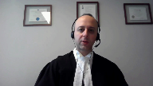
:::

L'idée ici n'est pas de poser un blâme sur la plante et peut-être que je m'exprime mal lorsque je vous fais des représentations, mais ce n'est pas du tout cela, mais de déterminer la cause également des délais.

Parce que dans Jordan, on doit déterminer si la défense, finalement, était uniquement ou directement responsable des délais qui ont été occasionnés.

C'est le principe qui a été rapporté au paragraphe 63 de l'arrêt de Jordan.

Alors, c'est dans ces circonstances-là que je vous invite à regarder le dossier dans son ensemble, effectivement, pour vous démontrer que dans les faits, la défense n'était pas uniquement ou directement responsable des délais qui ont été occasionnés par le fait du rapport du procès.

Alors, la poursuite n'aurait pas pu, par exemple, compléter sa preuve.

C'était une des choses que je vous soumettais tout à l'heure.

Donc, la remise n'était pas à la responsabilité de la défense dans les circonstances.

Je ne veux pas porter blâme sur personne, mais certainement, l'intimité n'était pas responsable de ce rapport-là dans les circonstances.

De sorte que lorsqu'il vient temps de regarder par la suite les disponibilités de l'avocate de la défense, eh bien, il faut avoir ça en tête pour déterminer si oui ou non on peut imputer la période débutant par l'indisponibilité de l'avocate de la défense jusqu'à la suite du procès, à la défense ou à l'intimité dans ce cas -ci.

C'est dans ce sens-là que je vous soumettais qu'il faut regarder l'ensemble des circonstances et notamment le fait, par exemple, qu'il y avait encore de la divulgation de la preuve qui était divulguée quelques jours avant la reprise du procès au 10 septembre 2018.

Alors, encore une fois, dans les circonstances, est-ce que vraiment la plante était prête à procéder?

Est-ce que les choix qu'elle a fait ont entraîné des retards dans le procès qui ne sont pas, dans les circonstances, attribuables à la défense?

C'est dans ce sens-là que les propos ont été tenus, non pas pour trouver un blanc, mais bien pour trouver les raisons du retard pour déterminer si la défense en est responsable et si on devrait lui imputer.

**Speaker 2** (01:05:46): Je suis prêt à vous accorder quelques minutes de plus si vous en avez besoin.

**Speaker 8** (01:05:57): Alors, simplement pour vous dire que dans les faits, l'indisponibilité de la défense a résulté à un délai de 112 jours, mais tout au long des procédures, l'intimé désirait poursuivre son procès en deçà du délai de 30 jours.

::: {.column-margin}

:::

Et dans les faits, même les dates, comme je le rappelais tout à l'heure, ont été proposées pour tenir ce procès à l'intérieur du délai.

Alors, je vous soumets bien respectueusement que l'ensemble des circonstances ne permettaient pas de déduire ce délai de 112 jours dans le délai global de Jordan.

Alors, à moins que vous ayez d'autres questions, Madame, Monsieur le juge en chef, Mesdames les juges et Messieurs les juges, ceci compléterait la présentation.

**Speaker 2** (01:06:39): Merci médecin Jacques, réplique maître Lévesque ou maître Coderre.

**Speaker 3** (01:06:45): Donc

::: {.column-margin}
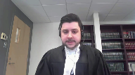
:::

, bonjour Monsieur le Président-Chef.

De mon côté, je n'aurai pas de réplique, je ne vais pas répéter les arguments qui ont été énoncés plus tôt.

Bien évidemment, la plante maintient l'ensemble de ses prétentions.

Et en terminant, sans vouloir être complaisant, je voulais simplement souligner que ce fut un privilège pour moi et ma consort de plaider devant cette cour aujourd'hui.

Je vous remercie.

**Speaker 2** (01:07:04): Merci beaucoup, maître.

Alors, je demanderai aux avocats...

**Justice Kasirer** (01:07:07): Monsieur Jean-Chef, vous me permettez de prolonger le privilège de mettre vos selles vers le fin d'une seconde?

::: {.column-margin}
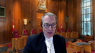
:::

Tout à fait.

C'est peut-être Maître Coderre qui va vouloir répondre là, je ne sais pas, mais par rapport aux 112 jours, il y a cette idée de partage de responsabilité.

Et au-delà d'une idée ferme de winner-takes-all, pour ainsi dire, est-ce qu'il y a une place, selon votre lecture du paragraphe 64 de Jordan, de faire ceci?

**Speaker 7** (01:07:58): Je vous remercie pour votre question.

::: {.column-margin}
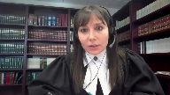
:::

En fait, ma lecture, il y a peut-être des cas où ça s'y prêterait dans les circonstances bien précises et gardant à l'esprit que le principe est que la défense ne peut pas bénéficier de son inaction.

Je suis respectueusement d'avis que ce partage de responsabilité-là a déjà été fait dans la mesure où il y a déjà une partie du délai qui est imputée à l'État.

Du reste, il me semble que le délai résulte exclusivement l'indisponibilité de l'avocat de la défense et, à tout événement, de fixer un point où est-ce que l'avocat de la défense aurait été en première instance disponible.

On n'a pas cette date-là dans les circonstances.

**Justice Kasirer** (01:08:46): Mais vous avez raison de dire qu'on n'a pas hésité d'imputer à l'État une partie du délai pour le dossier dans son ensemble.

::: {.column-margin}

:::

Mais pour les 112 jours par exemple, au-delà des 10 jours concédés par l'intimé, c'est ça ma question.

Est-ce qu'on doit dire à partir du constat de l'indisponibilité technique de l'intimé?

La question est close.

**Speaker 7** (01:09:15): Je vous soumets que oui, l'entièreté du délai, en mon sens, c'est de la prétention de la plante doit être imputée à l'intimé parce que, d'autant plus qu'il n'a pas fait valoir, je vais réitérer un peu les arguments tout à l'heure, c'est que si on avait su qu'au fond le procès était de deux heures, on aurait certainement pu le fixer avant.

::: {.column-margin}
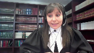
:::

Maintenant, au niveau de la date à laquelle on pourrait arrêter le délai ou est-ce qu'on pourrait faire effectivement computer ce délai-là, malheureusement, en l'espèce, le dossier est muet à cet égard-là.

**Speaker 2** (01:09:46): Très bien.

**Overlapping speakers** (01:09:47): Alors je vous remercie, alors je demanderai aux avocats de...

**Speaker 2** (01:09:49): de demeurer à notre disposition.

**Speaker 1** (01:09:58): The court.

**Speaker 2** (01:10:05): Merci, alors rebonjour à tous, merci pour votre patience et merci également pour vos arguments que vous nous avez soumis.

::: {.column-margin}

:::

La Cour est prête à rendre sa décision et je vais demander au juge Casirer de lire les motifs.

**Justice Kasirer** (01:10:27): Le ministère public se pourvoit à l'encontre d'une décision majoritaire de la Cour d'appel du Québec qui confirme, au profit de l'intimé, un arrêt des procédures ordonnées en raison de la violation du droit constitutionnel de ce dernier d'être jugé dans un délai raisonnable.

::: {.column-margin}

:::

Les juges majoritaires constatent un délai net de 35 mois et 2 jours, 1066 jours,

qui dépassent le plafond fixé dans Jordan 2016, Cour suprême du Canada 27.

L'appel vise à déterminer si deux délais particuliers, une première période de 84 jours et une seconde de 112 jours, doivent être attribués à la défense en raison de sa conduite.

Concernant la période de 84 jours, nous partageons l'avis du juge Chamberlain, dissident en cours d'appel, que le délai entre le 1er mars et le 24 mai 2018 résulte de la conduite illégitime de la défense et, de ce fait, doit être attribué à l'intimé.

Certes, la qualification des délais est une question de droit et le juge de première instance n'était pas lié par l'admission de l'intimé à cet égard.

Toutefois, le juge de première instance ne fournit aucune explication, ne serait-ce qu'implicite, permettant de comprendre pourquoi il rejette l'admission pour cette période, motif du juge Chamberlain, paragraphe 173.

Ayant choisi d'aller à l'encontre de la suggestion des partis et en l'absence des soumissions de leur part sur ce point précis, il était particulièrement important que le juge de première instance fournisse des motifs permettant de comprendre sa décision et pourquoi il a décidé ainsi.

Par ailleurs, comme le laisse entendre le juge d'ici dedans, il ne suffit pas que la démarche de l'intimé soit légitime pour que le délai ne lui soit pas imputable.

En l'espèce, c'est la manière dont la défense s'est conduite au regard de sa requête en décaviardage de la dénonciation qui est illégitime, notamment à cause de la tardivité de la présentation de sa requête.

Ce n'est que 15 mois après s'être fait remettre le document caviardé qu'elle a décidé de présenter sa requête, même s'il est parti débattre depuis plusieurs mois déjà relativement au caviardage d'autres documents.

Dans les circonstances, l'entierté du délai de 84 jours entre le 1er mars et le 24 mai 2018 est imputable à la défense.

La requête en décaviardage de la dénonciation au soutien du mandat de perquisition et la requête en contestation du mandat lui-même étaient intrinsèquement liées puisque, selon les dires de la défense, il n'était pas possible de procéder à l'audition en contestation du mandat sans régler le débat relatif au caviardage.

En retardant le dépôt de la requête en décaviardage, l'intimé retardait nécessairement l'audience en contestation du mandat.

L'intimé doit donc être tenu responsable du délai entre le jour où il a soulevé l'enjeu du décaviardage de la dénonciation, le 1er mars 2018, et le jour où la requête en contestation du mandat a finalement été entendue, le 24 mai 2018.

En ce qui a trait à la deuxième période litigeuse, soit la période de 112 jours entre le 21 mai et le 10 septembre 2019, le moyen d'appel du ministère public doit être rejeté.

Les juges majoritaires avaient raison d'intervenir, car ce délai n'était pas entièrement imputable à l'intimé, malgré l'indisponibilité de son avocate à certaines dates.

Certes, la Cour enseigne dans Jordan que lorsque le tribunal et le ministère public sont prêts à procéder, mais la défense ne l'est pas, le délai qui en découle est imputable à cette dernière.

Toutes les acteurs du système de justice criminelle, y compris la défense, doivent adopter une approche proactive afin de prévenir les délais inutiles en s'attaquant à leurs causes profondes.

Côte d'I, paragraphe 36.

Cela dit, dans certains cas, les circonstances peuvent justifier un partage de la responsabilité pour le délai entre ces acteurs plutôt que l'attribution de l'entièreté du délai à la défense.

En l'espèce, les partis avaient demandé aux juges aussitôt qu'en novembre 2018 d'ajouter une troisième date de procès, en plus des deux dates déjà prévues en janvier 2019.

Leur demande a été refusée.

Lors de la première journée du procès en janvier 2019, il devient clair que les deux dates prévues seront insuffisantes, notamment en raison des changements de stratégie de la poursuite.

Alors qu'ils discutent de dates potentielles pour la continuation du procès et que l'avocate de l'intimé informe le juge et la poursuite de son indisponibilité pour certaines dates en mai 2019, le juge propose une date en septembre 2019, sur laquelle il insiste, sans considérer la possibilité de continuer le procès à une date plus rapprochée où les parties étaient toutes deux disponibles.

Le juge savait donc depuis le mois de novembre 2018 qu'une journée additionnelle serait nécessaire et qu'en janvier 2019, lorsqu'il évaluait les disponibilités potentielles pour la continuation du procès

, la proximité de l'atteinte des plafonds fixés par l'arrêt Jordan devait être prise en compte.

R contre KGK, 2020, CSC 7, paragraphe 61.

Cela dit, ce n'est pas avant le 7 août 2019 que l'intimé fait part à la poursuite de son intention de déposer une requête en vertu de l'article 11D. Ainsi, outre la conduite de l'avocat de la défense et les changements de la stratégie de la poursuite, ce sont les délais institutionnels et le manque d'initiative du tribunal qui fait en sorte qu'aucune autre date n'a été offerte plus tôt.

Motif du juge Cournoyer, paragraphe 148.

Dans les circonstances particulières de cette affaire, nous estimons qu'il est juste et raisonnable de partager la responsabilité pour le délai de 112 jours et d'imputer à la défense jusqu'à la moitié du délai entre le 1er juin 2019, lendemain de la dernière date d'indisponibilité de l'avocat de l'intimé, et le 10 septembre 2019, date réelle de continuation du procès, R contre KGM, 2019, CSC 55, paragraphe 96.

Même en calculant à partir de cette hypothèse, le délai total entre ces deux dates étant de 101 jours, nous lui attribuerons 51 jours, le 1er juin 2019 au 22 juillet 2019.

Il y a aussi lieu d'imputer à l'intimé un délai de 10 jours entre le 21 mai et le 31 mai, suivant la concession qu'il a effectuée en cours d'appel, motif du juge Cournoyer, paragraphe 150, note 83.

Au final, outre la période identifiée par les juges majoritaires en appel, un délai de 84 jours, la période du 1er mars au 24 mai 2018, et un délai de 61 jours, du 21 mai au 31 mai 2019 et du 1er juin au 22 juillet 2019, sont aussi imputables à la défense.

Ceci porte le total de jours attribuables à la défense à 225 jours et le délai net à 950 jours, soit plus de 31 mois.

Le plafond Jordan de 30 mois est donc excédé et le délai est présumé déraisonnable.

Aucune circonstance exceptionnelle n'a été soulevée pour justifier ce dépassement.

Il convient de souligner que l'intimé a été inculpé en juin 2016, proche de la date à laquelle l'arrêt Jordan a été rendu.

On ne s'attend pas à ce qu'une telle situation se reproduise aujourd'hui.

Pour ces motifs, la Cour rejette l'appel, confirme et confirme l'arrêt des procédures ordonnées par le juge de première instance.

**Speaker 2** (01:20:12): Merci beaucoup, merci à tous, bon après-midi.

La cour est à journée à demain matin, 9h30. Merci.