---
title: Her Majesty the Queen v. Mélanie Ste-Marie, et al.
published-title: Heard
date: 2022-02-10
sidebar: false
---

This transcript was made with automated artificial intelligence models and its accuracy has not been verified. Review the original webcast [here](https://scc-csc.ca/case-dossier/info/webcast-webdiffusion-eng.aspx?cas=['39381']).
---

**Speaker 1** (00:00:02): La Cour, the court.

**Justice Wagner** (00:00:06): Merci, bonjour à tous.

::: {.column-margin}
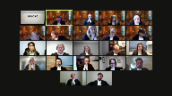
:::

Dans la cause de Sa Majesté la Reine contre Mélanie Sainte-Marie et al.

Pour l'appelant de Sa Majesté la Reine, M. Magali Simon, M. Émilie Robert et M. Geneviève Gravel.

For the intervener, Attorney General of Ontario, Mr. Michael Fawcett.

Pour les intimés, Mélanie Sainte-Marie, Dax, Sainte-Marie et

Richard Felks, M. Marie-Pier Boulay, M. Marie-Ève Landry.

For the respondent, Michèle Sainte-Marie, Sheriff Fauda and Frank Adario.

For the intervener, Criminal Lawyers Association of Ontario, Erin Dann and Danielle Goldblum.

For the intervener, Association québécoise des avocats et avocats de la défense, M. Louis Belleau et M. Antoine Grondin Couture. M. Simon.

**Speaker 2** (00:01:10): Monsieur le juge en chef, mesdames les juges, messieurs les juges, bonjour.

::: {.column-margin}

:::

Comme vous le savez, le rôle du poursuivant public est de servir les intérêts de la justice.

C'est dans cet esprit que je me présente devant vous ce matin.

Tel qu'indiqué dans notre mémoire, la société a progrès massivement démontré une bonne compréhension sur les changements de culture nécessaires à la bonne administration de la justice depuis l'arrêt Jordan.

Mais ici, nous soumettons que le pendule de la Cour d'appel du Québec n'est pas à la bonne place.

Son approche est trop rigide pour être conforme aux intérêts sociétaux que représente le présent dossier.

C'est ce que je veux faire ressortir dans l'heure qui m'est allouée.

En l'espèce, des condamnations importantes tombent en appel alors que si nous faisons, selon nous, le calcul des délais correctement, 42 mois sont attribuables au recours extraordinaire présenté par la défense et à l'indisponibilité de l'avocat de défense, Matt Labelle.

La société ne peut accepter un arrêt des procédures considérant les raisons de ce délai, particulièrement dans un dossier comme le nôtre où les ressources collectives de l'État ont été mobilisées pour faire une enquête d'envergure viable.

En conséquence, nous demandons de déclarer les délais raisonnables en application des mesures transitoires exceptionnelles et de retourner le dossier en cours d'appel pour juger des autres motifs d'appel.

**Justice Côté** (00:02:40): Alors, maître Simon, à cet égard-là, parce que c'est une question que je voulais vous poser, dans votre mémoire, vous demandez d'annuler l'ordonnance d'arrêt des procédures et d'ordonner une nouvelle audition devant la Cour d'appel du Québec.

::: {.column-margin}
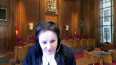
:::

Vous parlez d'une nouvelle audition.

Est-ce que vous parlez d'une nouvelle audition sur la première question, parce que dans votre mémoire, vous nous dites que la Cour d'appel du Québec a pas fait son travail essentiellement sur la première question, ou si vous voulez une nouvelle audition sur les neuf autres moyens de faire?

**Speaker 2** (00:03:11): Je dois admettre, madame la juge, que mes conclusions n'étaient pas claires dans mon mémoire, dans le sens que nous, ce que nous demandons, c'est de se prononcer sur les délais, de les déclarer raisonnables et de retourner le dossier en cours d'appel pour juger des autres motifs pour ne pas préjudicié, préjudicié évidemment les hôpitaux humains qui n'ont pas eu le droit à une audition, à un jugement sur les autres motifs qui sont au nombre de 9.

::: {.column-margin}

:::

Subsidièrement, nous demandons que le tout soit retourné en cours d'appel pour que l'exercice soit fait au complet.

**Justice Côté** (00:03:46): Mais vous devez nous demander ce matin, selon ce que je comprends de votre clarification, que nous fassions l'exercice auquel la Cour d'appel ne s'est pas livrée quant au premier moyen d'appel.

**Speaker 2** (00:03:57): Effectivement

::: {.column-margin}

:::

. D'accord.

Et subsidiairement, si cette Cour juge qu'il est plus approprié de retourner l'ensemble à la Cour d'appel, ça peut être une avenue également.

Compte tenu, comme vous dites, des motifs que nous soulevons dans la présente affaire.

**Justice Côté** (00:04:18): Simon

::: {.column-margin}
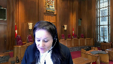
:::

, vous avez parlé

tantôt et je vais vous laisser tout seul après le suivi de votre plan. Peut

-être que vous pouvez répondre à ma question plus tard, mais vous dites ici si on considère tous les recours extraordinaires et les moments d'indisponibilité de la défense, cela représente un délai de 42 mois, ce qui nous laisse quand même un délai de plus de 30 mois attribuables à la couronne.

Alors, vous allez nous parler de ça aussi, comment on doit traiter ça?

Merci beaucoup.

**Speaker 2** (00:04:48): Effectivement

::: {.column-margin}

:::

, ce que nous demandions en cours d'appel,

et on ne change pas de position à ce niveau-là, on a fait le calcul sous-jordain pour voir quel était le dépassement de la Rèche-Jordain pour pouvoir appliquer correctement les mesures transitoires exceptionnelles.

Et dans ce calcul-là, on arrive avec un calcul de 35 mois.

Évidemment, on dépasse le délai de 30 mois de la Rèche-Jordain, mais compte tenu que c'est un dossier qui a été totalement jugé avant la Rèche-Jordain, nous demandons l'application des mesures exceptionnelles, d'une part parce que les parties se sont conformées aux droits tels qu'ils étaient à cette époque-là, et d'autre part, c'est un dossier que nous estimons particulièrement complexe, d'autant plus si nous l'estimons particulièrement complexe, ça répond à la norme du moyennement complexe.

**Overlapping speakers** (00:05:40): Thank you so much for joining us.

**Speaker 2** (00:05:40): Outre les arrêts de cette Cour sur les délais, deux arrêts sont au cœur de nos prétentions, les arrêts Belleville et Tséga.

::: {.column-margin}

:::

Ils tracent selon nous la voie juridique du présent dossier.

À cet égard, nous soumettons trois enjeux devant vous.

Le rôle d'une cour d'appel de se prononcer sur une question de droit valablement soumise et impliquant des admissions soigneusement conçues, l'approche à adopter au niveau des délais tant sous Morin que sous Jordan à l'égard des recours extraordinaires, et finalement, la scission de l'analyse entre la violation et la réparation que l'on retrouve au paragraphe 18 de l'arrêt de la Cour d'appel.

En faisant cette scission, la Cour d'appel met de côté les conclusions du juge sur la gravité de l'infraction et le préjudice, conclusion pourtant décisive de la conclusion finale du premier juge.

Et c'est dans ce sens que nous, nous estimons que les intérêts de la société étaient importants.

Il était important pour le premier juge et que la Cour d'appel n'a pas tenu compte suffisamment des intérêts de la société à cet égard-là. Et c'est…

Maitre Simon, juste une seconde.

**Justice Kasirer** (00:06:48): Pour comprendre ce point-là, le paragraphe 18 du jugement de la Cour d'appel, au fond, vous reconnaissez que le juge d'instance se méprend en évaluant le préjudice subi par les intumés au stade du remède plutôt que d'en tenir compte pour voir s'il y avait une violation dont on se baie.

::: {.column-margin}
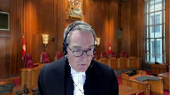
:::

C'est ça votre position et que la Cour d'appel aurait pu faire le constat que, en lisant globalement le jugement du premier juge, que son constat quant au préjudice fait en sorte qu'il n'y avait pas en réalité de violation dont on se baie, sous morin.

Est-ce que c'est ça que je comprends bien, votre point?

**Speaker 2** (00:07:36): Mon point, effectivement, c'est le suivant, M. le juge Carré-Zerrard, c'est de vraiment dire que ces deux conclusions-là n'étaient pas placées à la bonne place selon le schème juridique de Morin et que s'ils avaient été placés à la bonne place, en combinaison avec notre question de droit sur les recours extraordinaires, l'application de la mesure transitoire exceptionnelle pouvait s'appliquer.

::: {.column-margin}

:::

Donc, il n'y aurait pas eu violation constitutionnelle tant sous Morin.

Évidemment, il faut passer la première étape de savoir s'il y a une violation sous Morin et s'il n'y a pas de violation sous Morin lorsqu'on analyse correctement le jugement de première instance.

La deuxième étape est de savoir si les mesures exceptionnelles peuvent s'appliquer et notre prétention est que ces mesures, et ça répond en partie à la question de la juge Côté tout à l'heure, notre prétention est que ces mesures exceptionnelles sont applicables considérant ces conclusions de gravité de l'infraction et de préjudice puisque dans l'arrêt Côté, il a été dit que c'étaient des conclusions sur la mesure transitoire qui sont importantes.

Et j'estime que dans le dossier ici, ils sont particulièrement importants compte tenu de l'ampleur du dossier, compte tenu des ressources qui ont été mobilisées pour faire ce dossier-là et le mener à terme.

Sommairement, le dossier concerne une enquête majeure à l'égard d'un membre influent du crime organisé mettant en lumière le blanchiment d'argent, finissant avec un arrêt des procédures envers ceux qui aident ce blanchiment d'argent sur un fondement selon nous ou sommaire de la Cour d'appel, une absence d'analyses juridiques adéquates de la Cour d'appel.

Nous sommes toujours étonnés de cette décision parce qu'il n'a jamais été soulevé que le dossier comportait des lacunes pour répondre aux questions de droit que nous avions soumises.

À l'audience, le calcul fait dans notre mémoire et reposant sur les admissions

n'était pas remis en cause par la défense.

L'argument principal soulevé par la défense était que sous Jordan, le préjudice n'est plus un élément d'appréciation.

Évidemment, nous en convenons, mais puisque nous étions à l'intérieur des mesures transitoires, nous estimions que cette conclusion du juge était importante autant que la gravité de l'infraction.

Ceci dit, gardant à l'esprit la confiance du public dans l'administration de la justice, quelle est la cause des délais en termes qualitatifs puisque nous sommes en période transitoire?

Pour nous, ce qui saute aux yeux est toute la question du conflit d'intérêts des avocats qui occupent une place importante dans un dossier et ce dans un dossier ayant les attributs d'un dossier complexe.

**Justice Côté** (00:10:18): à cet égard-là,

::: {.column-margin}
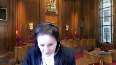
:::

et je comprends qu'il y a eu toute la contestation de la juridiction du juge d'enquête préliminaire quant à savoir s'il pouvait entendre la requête en déclaration d'inabilité, mais comment vous avez annoncé lors de la comparution qu'il y aurait, que vous alliez soulever un conflit d'intérêts et ça a tout de même pris plus de neuf mois, presque dix mois, à déposer la requête en inabilité.

Comment doit-on attribuer qui est responsable de ce délai?

**Speaker 2** (00:10:53): Effectivement.

::: {.column-margin}

:::

Dans notre mémoire, en cours d'appel, nous n'avons jamais demandé que ce délai-là soit inclus dans la subtraction de l'arrêt Jordan.

Donc, on parle vraiment au moment où les recours extraordinaires sont présentés et c'était vraiment la question de droit qu'on voulait faire trancher à ce niveau-là.

Par ailleurs, sur le délai de huit mois, parce que nous on estime à la lumière des admissions qu'il y a un délai de huit mois, il y avait des pourparlers avec la défense.

La défense nous disait qu'il y avait, comme on peut le voir là au niveau des admissions, qu'ils étaient en train d'étudier la question et qu'ils allaient nous revenir avec une position à cet égard-là.

Donc, compte tenu de la bonne relation entre les parties, et c'est important aussi lorsque je vous dis que le DOC a les attributs d'un dossier complexe, lorsqu'on est arrivé à la comparution en donnant cette indication-là au parti, évidemment on arrivait avec un dossier complexe, une preuve volumineuse et très volumineuse.

Donc, pour pouvoir que les parties, les personnes qui sont présentes, notamment Maître Labelle, puissent apprécier convenablement le temps nécessaire pour prendre position sur cette question qui est importante en l'espèce pour les fins de l'administration de la justice, on a donné ce délai raisonnable-là qui était, selon nous, nécessaire selon l'approche moraine à cette époque-là.

Également, à l'intérieur de ce délai-là, il faut bien comprendre aussi qu'il y a eu une renonciation d'un mois et demi de la part de la défense et que lorsqu'on est arrivé au moment de juger, selon nous, le moment important pour juger la requête en inabilité, il y a eu des contestations et pour nous, ces contestations-là défaisaient le plan de poursuite du poursuivant parce qu'on avait prévu un plan pour pouvoir débattre correctement de la question d'inabilité.

Ce qui est important, c'est de le faire le plus rapidement possible et pour nous, le juge qu'on envisageait pour le faire était le juge de l'enquête préliminaire et lorsqu'on est arrivé pour le faire, c'est là que la responsabilité selon nous de la défense arrive et il n'était pas prêt pour ça et il contestait également la compétence du juge et il y a eu des recours extraordinaires.

Tout ça fait en sorte que la responsabilité, selon nous, n'est pas mise à la bonne place, comme je vous le disais en introduction. Maximum.

**Justice Wagner** (00:13:21): Si vous me permettez, en parlant de délai, l'audition à court d'appel

::: {.column-margin}
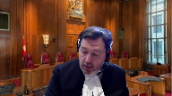
:::

a eu lieu le 14 mai 2019.

La décision de 18 paragraphes a été rendue au mois de septembre 2020.

Avez-vous des raisons?

Est-ce qu'il y a eu des demandes de la part de la Cour d'appel?

Est-ce qu'il y a eu des incidents qui expliquent ces délais quand même assez exceptionnels?

**Speaker 2** (00:13:49): devant la Cour d'appel, pour 18 paragraphes.

::: {.column-margin}

:::

Pour répondre à votre question, non, nous n'avons eu aucune indication de la Cour d'appel qu'il y avait des problématiques dans le dossier ou quoi que ce soit.

On attendait la décision, évidemment, depuis longtemps.

C'était une décision qui était importante pour le ministère public, compte tenu des enjeux, et on était à l'affût de recevoir cette décision-là.

Je comprends que les accusés aussi ont un intérêt à avoir des délais, dans un délai raisonnable, mais nous aussi, dans le dossier, on estimait que, compte tenu de l'ampleur des dossiers, c'était quelque chose d'important à notre égard.

Et on a eu, et j'ai toujours un étonnement, évidemment, personnel, parce que c'est moi qui ai plaidé le dossier à la Cour d'appel, de la décision, puisque pour nous, et pour moi, je parle pour moi principalement, le paragraphe 14, la règle de la Cour d'appel, est toujours difficile de compréhension.

Je ne comprends pas ce qui a échappé en Cour d'appel, compte tenu des enjeux que nous sommetions.

Pour nous, l'aspect des recours extraordinaires, comme je viens de vous le dire, était un enjeu important.

Il sautait aux yeux et il ressortait clairement, clairement des admissions.

Et notre processus, ou notre demande de délai, le calcul était fort raisonnable.

On aurait pu demander plus que l'application des mesures de candidature, parce que les intimés Sainte-Marie n'ont jamais réglé véritablement leur représentation effective par avocat, et c'est ce qui a fait obstacle beaucoup dans le dossier pour l'avancement, l'avancement du dossier.

Mais malgré ça, on était somme toute bon joueur et on voulait appliquer la mesure transitoire.

Et avec la gravité de l'infraction et le préjudice qui avaient été bien décidés, selon nous, par le juge de première instance, ça se faisait aisément.

**Justice Côté** (00:15:46): Merci beaucoup.

**Overlapping speakers** (00:15:48): Allez-

y, ma chérie.

**Justice Côté** (00:15:49): Merci, juge Casiran.

::: {.column-margin}
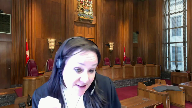
:::

Quand vous dites que vous ne comprenez pas, vous vous êtes encore interloqué avec le paragraphe 14.

C'est à cause du fait que la Cour d'appel se disait incapable de reviser l'analyse du premier juge quant à la raisonnabilité des délais.

C'est ça que vous avez dit, vous n'avez pas compris.

**Speaker 2** (00:16:13): C'est l'ensemble du paragraphe parce que, d'une part, on nous dit que c'était le bon procédé pour pouvoir soulever notre question qui était sur les recours extraordinaires.

::: {.column-margin}

:::

On semble dire oui d'un côté, mais d'un autre côté, on semble un peu ambigu à ce niveau-là.

Donc, sur ce point-là, il demeure une certaine incompréhension parce que nous nous soumettons que c'était la bonne voie juridique à prendre selon nous.

Également, il y a la question des admissions puisque vous retrouvez notre mémoire au volume 5 de nos recueils et nous estimions que nous avions fait un bon travail de compréhension à la lumière de Jordan et de Morin pour bien comprendre le détail des délais, ce qui n'avait pas été fait en première instance, et que c'était sur la base exclusive des admissions qu'on avait fait ce travail-là.

Moi, je n'étais pas la procureure en premier instant.

Je n'avais pas eu accès aux auditions, etc.

Je suis partie des admissions et du dossier d'appel et j'étais en mesure de faire le travail qui s'y retrouve.

Donc, c'est là mon incompréhension.

**Speaker 3** (00:17:27): Bye.

**Justice Wagner** (00:17:27): Excusez-moi, excusez-moi, monsieur.

J'ai juste un commentaire.

Selon, est-ce que c'est la prétention du ministère public que toute la preuve était dans le dossier devant la Cour d'appel?

Et que la Cour d'appel n'avait aucune raison de ne pas faire son travail.

**Speaker 2** (00:17:42): Il manquait des choses à la Cour d'appel au niveau des délais, principalement tout ce qui touchait le préjudice, comme tel les témoignages des accusés sur le préjudice, mais puisque la défense ne contestait pas les conclusions factuelles sur le préjudice, nous estimions que nous, pour notre question à nous, on n'en avait pas besoin.

::: {.column-margin}

:::

La défense estimait simplement que ce n'était plus un élément d'appréciation sous Jordan, mais ne remettait pas en cause les conclusions du juge de premier instant sur le préjudice.

Notre perception à l'époque, et c'est toujours celle-là, c'est que les conclusions sur le préjudice sont toujours valables.

Inaudible.

**Justice Kasirer** (00:18:27): Alors, vous êtes bien chic, chers collègues.

**Justice Kasirer** (00:18:33): Allons-

::: {.column-margin}
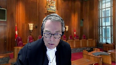
:::

y

, poussons un peu plus loin dans ce paragraphe 14 et abordons la question directement des admissions et leurs valeurs juridiques dans le dossier.

Vous voyez que la Cour d'appel cite le célèbre arrêt Pateras et vous qui plaidez si souvent en Cour d'appel M. Simon, vous connaissez le danger de Pateras, c'est-à-dire arriver en Cour d'appel avec un dossier incomplet.

Quand vous contester des questions factuelles, la Cour d'appel a la tradition, une tradition qui se rapporte à la norme de contrôle, de ne pas aller plus loin dans le dossier.

Et là, on cite Pateras, on cite Beliveau qui est un dossier de 11B où ce même principe a été mis de l'avant, un arrêt ontarien et Rice.

On s'entend que les admissions sous 655, la déclaration commune que vous avez déposée au dossier, ne sont pas des admissions, ne peuvent pas être…

**Speaker 1** (00:19:57): The court.

**Justice Wagner** (00:19:58): Alors, merci, nous revoilà.

::: {.column-margin}
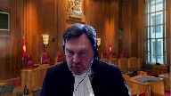
:::

Alors, on vous remercie pour votre patience.

Je vais vous dire que c'est la première fois en deux ans de pandémie qu'un tel incident arrive à la cour.

Alors, mais grâce à notre équipe de professionnels engagés et compétents, on a pu remédier aux problèmes assez rapidement.

Alors, on reprend l'où on était avec la question du juge Cacirère.

**Justice Kasirer** (00:20:27): Merci, M. le jugeant-chef.

Je pense que mes collègues craignent que ce soit ma question confuse qui a fait sauter la baraque.

**Justice Kasirer** (00:20:35): Alors je serais, maximum, je serais, j'espère que je serais moins confus que d'habitude.

**Justice Kasirer** (00:20:45): de ma collègue la juge Côté a évoqué le paragraphe 14 et la portée du principe énoncé dans l'arrêt par terrasse appliqué à l'11B, dans Beliveau et Rice, Alamy, etc.

::: {.column-margin}
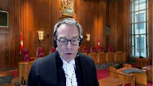
:::

Et ma question c'est quelle est l'importance sur le plan juridique, quelle est la valeur juridique de cette déclaration commune des admissions?

Ce ne sont pas des admissions de droit qui lient le tribunal.

Comment est-ce qu'on doit comprendre votre position par rapport à ce que la Cour d'appel aurait dû entamer dans son analyse?

**Speaker 2** (00:21:31): Merci, M. le juge Caserer.

::: {.column-margin}

:::

Ma réponse sera un petit peu longue parce que je pense que c'est un point important à souligner.

Ce que nous voyons dans le cadre des admissions, c'est que les admissions font la preuve des faits sous-assent qui sont importants pour la détermination des délais.

Évidemment, la qualification des délais revient en droit au juge de première instance et s'il y a erreur de droit, ça revient à la Cour d'appel ou à la Cour suprême de corriger une qualification erronée à l'égard des faits sous-assent qui sont établis dans les admissions.

Également, pour nous, la distinction avec l'arrêt biliaux, elle est importante, c'est que les admissions ont été faites en première instance et c'est sur cette base-là que le juge de première instance a établi son jugement et c'est sur cette base de ces faits-là que le ministère aussi a appuyé ses prétentions.

Donc, de revenir et de recadrer ou redéfinir les faits en cour d'appel ne nous apparaissait pas approprié.

C'est la distinction que nous faisons avec l'arrêt biliaux.

Également, au paragraphe 108 et suivant de l'arrêt biliaux, il est établi que les tableaux comme tel, qui sont ususels en délai, même avant Jordan, ces tableaux-là, ils ont identifié que ceci était peu utile.

La distinction que nous faisons, c'est que les admissions, eux, sont utiles parce qu'ils représentent les auditions qui sont importantes, les faits importants des auditions qui ont été établies sur une longue date et ça évite d'aller chercher des CD d'audiences ou des transcriptions en première instance et c'est la raison d'être.

C'est dans ce but-là que je pense que ça devrait être encouragé par cette cour parce qu'évidemment, on veut abréger les délais et je pense que c'est une belle façon d'abréger les délais.

Par rapport à l'arrêt RICE, au paragraphe 70 de l'arrêt RICE, c'est ce que nous comprenons, qui est attendu des parties, à savoir que de recourir à des moyens plus efficaces pour établir les faits qui soutiennent les prétentions.

Donc, c'est simplement ça, mais pour revenir, je vous disais que j'allais être lent pour revenir également à l'arrêt Beliveau.

L'arrêt Beliveau, si on le regarde dans son ensemble, la Cour a été à mesure d'appliquer, malgré cette supposée faille dans le dossier de Beliveau, a été en mesure d'appliquer correctement la mesure transitoire exceptionnelle dans ce dossier-là.

Des conclusions importantes de droit se retrouvent également dans le raisonnement du juge Gagnon, à savoir toute la question de l'intérêt de la justice à ce que l'affaire soit entendue au fond, fait partie du raisonnement dans Beliveau.

La gravité d'infraction aussi fait partie du raisonnement dans Beliveau ainsi que la complexité de l'affaire.

Donc, ces éléments-là dans l'arrêt Beliveau ont permis à la Cour d'appliquer correctement la mesure transitoire exceptionnelle et c'est ce qu'on demande ici.

**Justice Côté** (00:25:01): Je comprends votre réponse et j'aime votre réponse sur la liste d'admission, mais ma question est précisément quant aux préjudices.

::: {.column-margin}
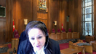
:::

À moins que je fasse erreur, la liste d'admission ne traite pas comme tel du préjudice.

Je comprends que tant devant la Cour d'appel que devant nous aujourd'hui, parce que comme vous avez dit au début, vous nous demandez de faire l'analyse sous morin, l'analyse que la Cour d'appel n'a pas faite, vous vous fondez essentiellement sur la question quant au préjudice sur ce que le juge Garneau a dit à la page 60 du volume 1 du dossier de la planche.

**Speaker 2** (00:25:43): Effectivement

::: {.column-margin}

:::

, madame la juge, on s'en remet aux conclusions du juge Garneau sur la gravité de l'infraction et le préjudice.

Les conclusions factuelles sur le préjudice en cours d'appel n'étaient pas contestées par les intimés.

Et compte tenu que toutes leurs questions de droit à eux étaient autour du préjudice et de dire que ce n'est plus un élément d'appréciation, je pense tout de même qu'il escamote le raisonnement parce qu'on est en mesure transitoire et qu'il leur appartenait au niveau de cette conclusion, qu'ils voulaient remettre en cause, de fournir les éléments nécessaires pour remettre en cause cette conclusion-là du juge de première instance.

**Justice Côté** (00:26:28): Et maintenant, je vais vous laisser aller après.

::: {.column-margin}
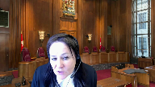
:::

On sait que dans Morin, les lignes directrices, disons pour un dossier semblable entre 14 et 18 mois, donc ici, même si on impute, parlant pour moi-même, toute la responsabilité des recours extraordinaires et appels interlocutoires à la défense, on se retrouve quand même avec un délai de 35 mois.

Alors, cette différence-là entre les lignes directrices de Morin puis le délai de 35 mois, ce que vous nous demandez, c'est de dire essentiellement regarder les conclusions du juge Garneau quant au préjudice, quant à la gravité de l'infraction, et ceci justifie ce dépassement des lignes directrices.

Est-ce que j'ai bien compris votre position?

**Speaker 2** (00:27:11): Effectivement, lorsqu'on le jumelle quand même avec tout ce qui était l'aura au niveau de Morin, les délais inérants, il y avait beaucoup de délais inérants qui étaient acceptés au niveau de la complexité de l'affaire.

::: {.column-margin}

:::

Ici, j'estime qu'on est dans un dossier particulièrement complexe, mais pour les fins de notre argumentaire qu'on a soumis en cours d'appel ici, on veut l'application des mesures transitoires exceptionnelles.

Donc, compte tenu qu'on est dans un dossier moyennement complexe, nous estimons que l'application des mesures transitoires exceptionnelles pouvait s'appliquer puisqu'il y avait nécessairement des délais inérants nécessaires à la facture du dossier dans son ensemble.

On parle ici d'une co-accusation, une accusation conjointe et nécessairement sous Morin, ça crée des délais inérants à faire que le dossier arrive à procès.

L'autre point que je voulais vous soulever sous Morin également, c'est qu'ici au niveau institutionnel, le procès, ou même en cours supérieur, ce n'était pas une faille, parce que sous Morin, on parle des lignes directrices de 12 à 18 mois pour tenir un procès et environ 8 à 12 mois pour tenir une enquête préliminaire.

Donc, dans les circonstances ici, la Cour du Québec n'avait pas de problème institutionnel et pouvait donner accès à ces paramètres-là, là où le babless, comme je vous le soulignais, ça a été la difficulté de rendre ce dossier-là à terme en raison de la problématique de représentativité des avocats de la défense.

**Justice Côté** (00:28:55): Et ma dernière question pour vous

::: {.column-margin}
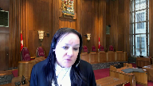
:::

, c'est donc les conclusions du juge Garneau sur le préjudice.

Selon vous, font pencher la balance en faveur de la Couronne, malgré que le juge Garneau a aussi fait attirer des conclusions, puis il a souligné le manque de diligence de la Couronne, et il a dit que ce manque de diligence-là était à l'origine d'une partie des délais excédentaires, n'est-ce pas?

**Speaker 2** (00:29:21): Oui, je pense que pour notre part, la question essentielle dans ce dossier-là était le conflit d'intérêts et ce que nous nous soumettons et les recours extraordinaires qui ont été apportés à ce titre, c'était la problématique à analyser dans le dossier.

::: {.column-margin}

:::

Nous nous soumettons que le juge Garneau a ignoré cette partie-là du raisonnement et que s'il l'avait fait, il aurait bien compris que les fautes qu'il nous adresse, à savoir de ne pas avoir déposé un acte d'accusation directe ou une renonciation à l'enquête préliminaire, ne réglaient pas cette question spécifique-là.

Et nos prétentions, et c'est ce qu'on vous demande également, c'est de dire qu'il y ait une responsabilité au niveau de la défense pour que ces questions-là soient réglées rapidement au début des procédures, parce que le ministère public ne peut pas avancer adéquatement dans un dossier tant qu'on n'a pas des avocats habiles pour prendre des décisions efficaces.

Et selon nous, c'est ce qui ressortait du jugement du juge Chevalier à l'enquête préliminaire.

Il faisait l'état de toutes les étapes où des avocats habiles sont importants dès le début des procédures, et c'était la volonté du ministère public dans cette affaire-là.

Et nous estimons que cette volonté-là, par les conclusions, est escamotée.

Également, au niveau de l'acte d'accusation directe à preuve, lorsqu'on se retrouve devant le juge Marc David, on a tout réglé, là, les questions de l'habilité des avocats lorsqu'on se retrouve devant lui, et on a encore des difficultés.

Imaginez si on n'avait pas réglé cette question-là lorsqu'on se serait retrouvé en Cour supérieure avec un acte d'accusation en direct, les difficultés que cela aurait créées.

Et c'est une décision importante dans l'administration de la justice de savoir si on réopte ou on ne réopte pas, et même cette question-là, malgré qu'on avait réglé cette question-là, était difficile à obtenir en Cour supérieure.

**Justice Côté** (00:31:16): Thank you so much for having me.

**Justice Kasirer** (00:31:17): Merci beaucoup.

**Justice Kasirer** (00:31:19): On vous assombe de questions et Monsieur le juge en chef, si vous me permettez, peut-être dans votre plan de match vous allez répondre à ça plus loin et puis c'est très bien comme ça, mais juste compte tenu de la présence des intervenants et leur intérêt sur la question du remède, j'aurais aimé vous faire préciser l'enjeu pour le dossier comme vous le voyez, à vue donnée, là vous me corrigirez, dans le présent pourvoi, selon votre prétention, vu l'absence de violation d'11B, vous avez vu l'absence de violation d'11B, vous avez

::: {.column-margin}
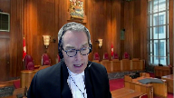
:::

**Justice Kasirer** (00:31:54): selon votre conclusion ultime, la question des remèdes disponibles, question sur laquelle la Cour d'appel s'est attrapée, n'est pas véritablement en jeu ici.

Est-ce que je résume bien votre position?

**Speaker 2** (00:32:12): C'est bien ma position, M. le juge Cazerère, pour une raison fondamentale.

::: {.column-margin}

:::

Nous sommes en période transitoire et sous-marin.

Il était clair que la seule réparation possible était l'arrêt des procédures.

Donc, dans cette optique-là, pour ne pas préjudicié évidemment les intérêts des intimes et en l'espèce, si l'analyse sous-marin est adéquate, ça mérite un arrêt des procédures.

Par ailleurs, nous ne voulons pas entacher l'ouverture de cette question-là.

On a vu le raisonnement du juge Slater dans la décision de Roy qui a été soumis par l'intervenant.

On ne veut pas nuire à des arguments éventuels sur cette question-là, mais ici, ce n'est pas un enjeu. Merci.

Donc, je reviens un peu au plan de plaidoirie que j'avais souligné.

Je vais passer, puisque certaines portions que j'ai déjà répondues dans le cadre des questionnements.

Je voulais quand même souligner, et je l'ai dit beaucoup dans le dossier, mais qu'il y a un niveau de complexité dans l'affaire.

On parle ici d'une affaire que, selon nous, est difficile à mener, puisqu'elle a toutes les attributs énoncés au paragraphe 77 de l'arrêt Jordan.

Malgré ceci, nous pensons que le dossier incorpore, si on regarde vraiment le contexte qui est atébrouable aux poursuivants publics lorsqu'on décide de faire une accusation qui est difficile à mener, nous pensons à la lumière des enseignements d'Auclair, que nous avons répondu aux ententes d'Auclair, à savoir que dès le départ, les accusations sont bien ciblées, parce qu'il faut comprendre que c'est une enquête d'envergure, mais on a choisi de regrouper tout ce qui concernait le groupe Sainte-Mairie, c'est ce qu'on voit dans les accusations, et de s'imiter à ces gens-là, de ne pas aller au-delà, et que notre preuve était déjà articulée pour être bien présentée pour parvenir à procès.

À ce niveau-là, nous soumettons qu'encore une fois, la décision de l'enquête préliminaire du juge Chevalier est importante à ce titre, parce que chacun est en mesure déjà, à cette date, de bien comprendre quel est le rôle de chacun et quelle est la preuve qui est disponible pour aller en termes d'accusation.

Un autre aspect qui nous apparaît important de souligner, c'est le principe fondamental du conflit d'intérêts, qui est avant tout la responsabilité de l'avocat de la défense qui doit l'évaluer.

Donc, on ne veut pas aller dans une recherche particulièrement ici, dans une recherche de blancs, mais on veut avoir une certaine part de responsabilité juste à l'égard de cette question-là.

Malgré ceci, nous convenons que nous avons une responsabilité au niveau des délais lorsque cela se représente et nous estimons que nous l'avons fait valoir rapidement et que la meilleure façon pour régler cette question-là problématique rapidement était de saisir le juge de l'enquête préliminaire pour pouvoir agir.

Et je pense que le but de tenir cette enquête préliminaire-là pour vider cette question-là sert les intérêts de la justice.

Ensuite, il faut bien comprendre la prétention du ministère public.

On ne reproche pas à la défense de contester la requête.

Au contraire, on voulait l'établir, on voulait en débattre.

Ce que nous reprochons dans le dossier, et je le mets entre guillemets parce qu'il n'est pas nécessaire, compte tenu de la position de CEGA que nous voulons adopter, de chercher un blanc pour soustraire les recours extraordinaires, mais ce que nous reprochons ou qu'on estime qu'il y a de la responsabilité de la défense en espèces, c'est la façon qu'ils ont choisi de répondre aux conflits d'intérêts qui sont avant tout leurs responsabilités.

En contestant la juridiction, en présentant des recours extraordinaires, au paragraphe 29 et 31, c'est des conclusions très importantes des admissions ou sur la question précise du conflit d'intérêts, il est annoncé que la défense n'a aucunement le mandat d'aider pour la résolution de cette question-là.

Il est également dit à ce moment-là qu'il estime que notre enquête est prématurée, donc c'est dans ce contexte-là que nous estimons qu'il y avait problématique et que les dépôts de recours extraordinaires devaient être tranchés.

**Justice Brown** (00:37:55): J'ai une question à vous poser, juste pour être clair, tous les autres moyens d'appel qui restent encore jugés, la Cour d'appel a-t-elle reçu des arguments, des plaidoiries orales sur chacun d'eux ou uniquement sur l'article 11B?

**Speaker 2** (00:38:14): uniquement sur l'article.

::: {.column-margin}

:::

Les arguments orales ont été faits sur l'ensemble des moyens d'appel en cours d'appel.

Nous avons débattu, il y avait la cour d'appel a jugé qu'elle n'avait pas besoin de nous entendre sur l'ensemble des moyens d'entrée de jeu lorsqu'on était devant eux.

Il y avait deux questions qui selon eux dans les arguments de la défense étaient importantes, le 11B et l'autre question était tout ce qui touchait l'appréciation de l'écoute électronique, les FAI qui avaient eu lieu dans l'appréciation de l'écoute électronique et les moyens d'appel qui touchaient des intimés.

Même plaid-barrier oral était sur l'ensemble, était reçu par la cour d'appel.

Exactement.

**Justice Brown** (00:38:58): Ok, merci.

**Justice Côté** (00:39:00): Quand vous étiez devant la Cour d'appel, sur la question de 11B, il y a eu des discussions sur votre dossier pas complet, comment ça se fait que votre dossier n'est pas complet, pourriez-vous compléter le dossier?

::: {.column-margin}
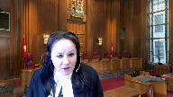
:::

Est-ce que la Cour d'appel, je me souviens d'anciennes années où la Cour d'appel se gênait pas pour souligner qu'un dossier était complet ou pas complet?

**Speaker 2** (00:39:21): Il y a eu, comme je le disais, d'entrée de jeu, c'est d'où notre étonnement, il n'y a eu aucun questionnement à ce niveau-là et j'ai cherché à voir si c'était vraiment le cas.

::: {.column-margin}

:::

Effectivement, il n'y avait pas eu de questionnement sur l'état du dossier et également l'avocat de la défense, Maître Labelle, en cours d'appel, était d'accord avec notre calcul de 35 mois.

Donc, il n'a jamais remis en cause, de quelque façon que ce soit, la façon qu'on était venu établir ce calcul-là, puisque selon notre prétention, on était raisonnable dans la façon de voir les choses et dans la façon d'établir notre 35 mois.

Puis, notamment, on s'appuyait sur l'arrêt Belleville, le paragraphe 201 de l'arrêt de Belleville, pour soustraire les recours extraordinaires.

Donc, c'était vraiment cette portion-là qu'on demandait la soustraction.

Ensuite, on demandait une soustraction au niveau d'un mois, qui était une renonciation explicite.

Et ça, c'est les délais qui sont avant la réoption, c'est comme mon mot.

**Overlapping speakers** (00:40:27): back in.

**Speaker 2** (00:40:28): et ensuite il y avait un an que Maître Labelle n'était pas disponible pour le procès.

::: {.column-margin}

:::

Donc, en tout l'automne de janvier 2015 et de septembre 2015, il y avait un an qui n'était pas disponible.

C'est pourquoi le dossier a été fixé en janvier 2016.

Donc, ce délai-là, évidemment, il ne remettait pas en cause.

**Justice Wagner** (00:40:49): Au certain, maître Simon, cette décision-là de la Cour d'appel ne fera pas partie des plus grands faits d'armes de la Cour d'appel du Québec, en termes d'accès à la justice.

**Speaker 2** (00:41:00): C'est nos prétentions parce que c'est vraiment un dossier d'envergure, c'est vraiment un dossier où on a mobilisé, on voulait être près dès le début des procédures et il faut bien comprendre que nous ne sommes pas Jordan et malgré que nous ne sommes pas Jordan et même lorsque, je vous dirais c'est en 2009, le début des accusations, le dossier Adlabarbe malheureusement, mais nous étions même près au clair.

::: {.column-margin}

:::

Donc même près au clair, nous étions conscients que dans des dossiers d'une grande complexité, on parle ici de personnes associées au crime organisé, monsieur Ouimet, qui a plusieurs dossiers et à la même époque, mais on voulait faire les choses bien dans ce dossier là et ça a été bien ciblé.

Les conséquences malheureuses des délais sont liées, selon nous, à la représentativité des avocats.

Ce n'est pas des blâmés, mais c'est de dire responsabilisez-vous à l'égard de ces délais-là et c'est ce qui nous amène devant vous.

On comprend bien aussi l'arrêt vassel de cette cour.

Lorsqu'il y a nos co-accusations, le ministère public doit être proactif, il ne faut pas laisser faire les choses, etc.

Mais dans notre coffre à outils, il faut que les outils soient adaptés à la problématique et ce que nous voulons faire ressortir, comme je l'ai souligné précédemment, l'acte d'accusation directe et la renonciation n'étaient pas un bon outil pour régler le conflit d'intérêts, puis de pouvoir partir avec des gens habiles et poursuivre pour mener ce dossier à terme.

Évidemment, dans notre coffre à outils et dans un vassel, il y a toute la question de la séparation des accusations ou d'offrir, de séparer certains accusés qui seraient à la remorque de certains autres, mais il faut bien comprendre que les deux seules personnes qui ne sont pas impliquées directement dans la problématique du conflit d'intérêts, c'est M. Normand Ouimet et c'est M. Richard Fels.

Et pour M. Richard Fels, on a peut-être un peu tardivement proposé de le séparer pour les fins de l'enquête préliminaire, etc., mais lui-même n'était pas prêt, donc il regardait passer la parade et, compte tenu de vos enseignements d'Ankodi, je pense qu'il fait partie du groupe.

Il ne voulait pas également se séparer de notre compréhension du groupe Sainte-Marie, parce que ça forme une accusation conjointe de ces quatre personnes-là qui travaillent dans cette industrie-là et je pense qu'il n'était pas de son intention de vouloir se séparer du groupe.

D'ailleurs, en cours d'appel, il n'a soumis, et vous avez son mémoire là dans nos annexes, il n'a soumis aucun argument personnel à lui-même.

Il a dit «

je m'en remets » aux arguments présentés par M. Sainte-Marie.

À l'instar du paragraphe 4 de l'arrêt vaciel, ce que nous demandons à cette cour, c'est de qualifier de manière appropriée les recours extraordinaires.

Je passe maintenant à la deuxième question de mon schéma de prédoirie.

Quelle est l'approche qui devrait être adoptée au niveau des recours extraordinaires, tant sous Morin que sous Jordan?

En premier lieu, il faut souligner que la présente concerne plus spécifiquement la grille d'analyse à l'égard des recours introduits par la défense.

Bien que notre appel porte le jugement du juge Garneau, et c'est important, et les recours extraordinaires visés par ce jugement, je me permets quand même de souligner qu'il y a quatre recours extraordinaires dans le présent dossier.

Ça démontre l'amplitude de ces recours, et je pense que ces recours, on doit revenir aux enseignements d'envoi chiche, à savoir que c'est restreint des recours extraordinaires en droit criminel, et à ce niveau-là, on doit bien appliquer l'arrêt en voie chiche.

La position, l'approche qu'on vous demande d'adopter devant cette cour, c'est d'abord sous Morin de réitérer le paragraphe 201 de l'arrêt Belleville, à savoir que les recours extraordinaires sous Morin étaient des délais imputables à la défense ou inhérents, je dirais plutôt imputables à la défense, puisqu'ils sont présentés par la défense.

Sous Jordan, nous vous demandons d'appliquer les paragraphe 82 et 83 de l'arrêt de Ségar, eu à égard aux recours extraordinaires présentés par la défense lorsqu'ils sont institués de mauvais soin, qu'ils sont futiles, qu'ils sont imputables à la défense, lorsqu'ils sont introduits de bonne foi, il s'agit d'un événement distinct, à moins que le ministère public agisse de mauvaise foi, d'une manière frivole ou d'une manière dilatoire.

Évidemment, il y a les deux options, mais quelle que soit la voie de ces deux options, il doit être tranché, le ministère public n'a pas eu une conduite de mauvaise foi, de manière frivole, une conduite frivole ou dilatoire.

Pourquoi ce positionnement, pourquoi les recours extraordinaires ne devraient pas être comptabilisés dans les plafonds prévus par Jordan?

Bien pour nous, en termes simples, c'est-à-dire parce qu'ils ne sont pas des délais normaux d'un procès.

Donc les différents points de vue que l'on retrouve en jurisprudence et résumé dans Ségar ne démontrent pas, selon nous, une bonne compréhension de ces recours.

Les recours sont restreints parce qu'ils perturbent l'incidence.

Donc en soi, c'est des recours qui ne sont pas anticipables et qui ne devraient pas être inclus dans les plafonds présumés de Jordan de 17 ou de 30 mois.

**Justice Côté** (00:47:25): Mais Simon, à cet égard-là, sur ce que vous nous demandez de faire quant au recours extraordinaire et de décider où ils vont, à moins que je me trompe, la Cour d'appel du Québec ne s'est pas prononcée là-dessus.

::: {.column-margin}
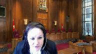
:::

Effectivement.

Alors, c'est comme s'il n'y avait pas eu de débat là-dessus.

**Speaker 2** (00:47:43): Nous, on a demandé de se prononcer sur les recours extraordinaires avec le paragraphe 201 de Belleville, mais effectivement, la Cour d'appel, à l'époque, ça n'avait pas été soumis, n'avait pas le bénéfice de l'arrêt de Séga et l'analyse complète qui a été faite à ce niveau-là.

::: {.column-margin}

:::

Dans l'arrêt Rice également, la Cour d'appel avait dit qu'il reportait cette question-là à un autre moment, de bien voir où se situaient les recours extraordinaires sous Jordan.

Donc, effectivement, ça n'a pas été débattu de cette façon-là, mais je pense qu'ici, c'est une belle occasion de le faire, puisque le dossier permet une bonne appréciation de ces délais-là.

Je pense également que l'arrêt de Séga fait le tour d'horizon pancanadien pour permettre adéquatement qu'on puisse se prononcer sur cette question-là, et selon nous, les raisons de la Cour d'appel de l'Ontario pour lesquelles ils arrivent à la conclusion que ces délais-là ne devraient pas être inclus automatiquement dans les plafonds de 18 ou de 30 mois sont des raisons valables qui devraient être suivies.

À ce titre, à l'onglet 5, nous avons la décision du juge Branton, qui est le recours extraordinaire sur la demande de récusation du juge Garneau en l'espèce.

Je trouve que c'est une belle illustration de comment les recours extraordinaires, et évidemment, ça ne s'applique pas à mes prétentions, mais c'est pour illustrer le bien-fondé de Séga, comment les recours extraordinaires perturbent l'existence et qu'il est difficile de les prévoir ou de les anticiper.

Le recours extraordinaire arrive en plein milieu du procès.

C'est souvent le cas relativement à des demandes de récusation du juge, donc évidemment, ça perturbe l'instance.

On se retrouve alors dans un autre palier juridictionnel avec les enjeux de l'autre palier juridictionnel de disponibilité de juge, de disponibilité de place pour faire droit à entendre la requête, la question de savoir si les notes stenographiques ou non sont nécessaires pour la question.

Ici, le juge Branton, il me dit bien dans sa décision, j'étais disponible.

C'est un concours de circonstances que j'étais disponible.

Ça a pu être réglé rapidement.

On était quand même avec un juge qui connaît bien ces recours-là, il a pu adéquatement répondre à la question du recours extraordinaire sans trop débalancer la tenue du procès, mais malgré tout, si on est très près du plafond de 30 mois, on dépasse.

Donc, c'est la raison pour laquelle nous estimons que s'il n'y a rien d'abusif, il n'y a rien de dilatoire dans la conduite du ministère public lorsque les recours sont présentés, il devrait y avoir une subtraction.

Un dernier point avant de conclure que j'aimerais voir avec vous.

Dans la proposition de Michel Sainte-Marie, nous on ne le voit pas, puisque c'est une accusation conjointe dans le dossier, nous nous estimons que les délais sont attribuables aux trois personnes Sainte-Marie, parce que le conflit d'intérêts initiaux était de vouloir être représenté par le bureau de Maitre-Label, donc ça visait les trois personnes.

D'ailleurs, dès le début des procédures, c'est l'immeuble de Mme Mélanie Sainte-Marie qui faisait office du paiement pour l'ensemble du bureau, donc je ne vois pas de raison de séparer l'analyse pour le cas de M. Michel Sainte-Marie, d'autant plus que tout le long des procédures, il a été côte à côte avec Mélanie et Dax Sainte-Marie dans la présentation des recours, et même devant la Cour supérieure, il disait qu'il suivait alors le schéma ou les demandes de Mélanie et Dax Sainte-Marie.

Donc pour nous, même si c'est une co-accusation ici, c'était des gens qui voulaient avoir une représentation conjointe, selon notre prétention, ils voulaient avoir un dossier conjoint, et puisqu'il fonctionnait de cette façon, de manière côte à côte dans la présentation des recours, et que le but ultime les visait des recours extraordinaires, les visait les trois, donc nous estimons que les recours extraordinaires devraient être tranchés pour les trois.

Et également, comme je l'ai dit pour M. Ferls, puisqu'il suivait la parade, bien c'est la raison pour laquelle nous sommes d'avis que les mesures transitoires exceptionnelles devraient s'appliquer.

**Justice Wagner** (00:53:01): Est-ce que ça termine vos arguments ou vous avez autre chose?

Vous avez encore 8 minutes!

**Speaker 2** (00:53:06): 8 minutes, c'est bien.

::: {.column-margin}

:::

Notre position est que l'arrêt de Ségar est conforme aux intérêts de la justice et que la présente le démon.

Pour conclure, bien que la détermination des délais de l'arrêt Jordan soit qualitatif, il faut sous-morin, c'est fondamentalement qualitatif, il faut éviter de créer une injustice au parti parce qu'ils se sont conformés aux droits qui étaient à l'époque.

Nous, concluant en disant, il est vrai que la défense n'a aucune obligation d'aider la poursuite pour faire la démonstration de leur capacité.

Nous assumons ce rôle, bien évidemment.

Ce que nous soumettons, c'est, lorsqu'il est question du bon déroulement des procédures judiciaires, ils ont une responsabilité et ici elle a été manquante, tout simplement. Merci.

**Justice Wagner** (00:54:02): Merci.

Et j'ajouterais que la responsabilité est partagée également avec les tribunaux et les juges, qui doivent être également attentifs à cette notion d'accès à la justice.

Alors, merci Maître Simon, Mr. Michael Fawcett.

**Speaker 1** (00:54:17): Yes, thank you, Chief Justices.

I want to acknowledge right at the outset that this is a difficult case for us in which to raise our remedy argument.

We appreciate-

**Justice Brown** (00:54:31): So you don't just raise a remedy argument, you raise a Jordan is a problem altogether argument.

::: {.column-margin}
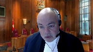
:::

I mean, I know I'm the one who granted you leave to intervene, but when I read your factum, I was sorry that I did.

Your factum points to what you describe as fundamental problems, right?

Jordan lacks nuance or balance.

It gives, and these are your words, gives the guilty a windfall, gives the innocent a brush off, leads to an abdication of justice.

And your factum points to not sort of actual instances of a remedial problem, but to a theoretical problem with Jordan more generally, which is that the Attorney General of Ontario's theoretically ideal framework strikes you as more balanced, whatever that means, than the Jordan framework.

And yet your ideal framework does not even acknowledge what led to Jordan, which was a chronic and systemic indulgence of delay.

Yours is a completely one-sided analysis that does not acknowledge that, which I find ironic given that you identify the Jordan framework, not just the remedy, the framework as being a tilted one-sided assessment.

And I'll just put it out there and you can respond to it because all of this persuades me more than ever that as soon as we take away the Damoclesian sword of a stay as the remedy for a breach of the right to a trial within a reasonable time, that the culture of complacency will, at least in Ontario, settle right back in.

This is to my mind, and I say this with respect, a one-sided misguided submission.

I'm disappointed to see the Chief Law Officer of Ontario making it, and I very much regret having been the one to give him the opportunity to use his allotted time here to do that.

**Speaker 1** (00:56:22): Justice Brown, if my factum left you with the impression that Ontario does not embrace the command of Jordan, that things need to move quickly, more quickly, then I wrote a poor factum.

::: {.column-margin}
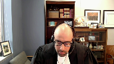
:::

And that's on me.

Because that is not the intention of our argument with respect to the remedy.

The principal problem that we see with the remedy right now is that it is getting in the way of timely criminal justice.

It's that the promise of Jordan remains unfulfilled.

We see Jordan as an important first step.

But cases in Ontario and across this country are continuing to take far too long.

**Justice Brown** (00:57:10): Jordan is entirely predicated on an integrated system of incentives, right?

::: {.column-margin}
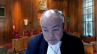
:::

And what you're wanting to do is remove the incentive by lightening the impact of a breach of Section 11B.

So this isn't just that you're like I accept that you want speedy trials too, but you actually call the Jordan framework in this fact of an abdication of justice.

I'm frankly shocked.

**Speaker 1** (00:57:44): I apologize if that's that's what I conveyed.

::: {.column-margin}
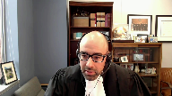
:::

What I was attempting to convey is that a stay of proceedings in certain cases in which there has been no harm to the accused and rather than there being some sort of systematic failing on behalf of the state, we just simply have you know an individual justice system participant who makes a delay-informed, good-faith, takes a good faith approach to the prosecution but at the end of the day delay sometimes happens and they made a mistake.

To stay that case, that's the abdication of justice.

That's the type of case which we should see a trial on the merits.

Again our view is that Jordan is the first step and we embrace it wholeheartedly. Yeah.

**Justice Brown** (00:58:41): It's an application of justice, but you embrace it.

I mean, but for the entire framework, it's fantastic.

**Speaker 1** (00:58:48): Well, what I would say is that we think the stay will always remain on this table, the incentive for government to act expeditiously will always remain on the table.

::: {.column-margin}
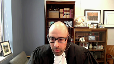
:::

We hope that with a change to the remedy, we could move even faster.

I see that my time is just about up, so subject any questions, those are my submissions.

**Speaker 4** (00:59:10): Thank you very much.

**Justice Wagner** (00:59:13): Maître Boulet.

**Speaker 5** (00:59:19): Monsieur le juge en chef, Mesdames les juges, Messieurs les juges, bonjour.

::: {.column-margin}

:::

Je vais tâcher de faire preuve de la plus grande délicatesse pour aborder le premier sujet, c'est-à-dire le caractère incomplet du dossier.

Je souhaitais vous entretenir sur le caractère incomplet quant au remède qu'on vous invitait à revisiter, c'est-à-dire l'arrêt des procédures et je crois qu'il est à propos dans les circonstances de pass et outre, si ce n'est que de vous dire qu'on vous invitait quand même à revisiter le remède par le biais de l'intervention du Procureur général de l'Ontario et qu'on vous parle de préjudice dans les représentations alors que toute la preuve considérant le préjudice n'est pas amenée devant vous et ne l'a pas été non plus devant la Cour d'appel.

Pour reprendre l'intervention de Mme la juge Côté un petit peu plus tôt en référence avec la preuve de préjudice qui avait été présentée au juge de première instance et comme quoi la plante ici s'en tenait à ce que le juge Garneau avait rapporté de cette preuve de préjudice, eh bien je ne peux me contenter ici que de vous dire que c'est manifestement incomplet.

Dans le cas de M. Felks, pour ne m'en tenir qu'à lui, il a témoigné sur le préjudice, il a produit des pièces, notamment des constats d'infraction etc. et l'ensemble de cela n'est manifestement pas rapporté dans le jugement de première instance.

Le dossier est incomplet ainsi donc pour la question de revester le préjudice, mais c'est encore plus vrai et c'est là que je vais tâcher de faire preuve de délicatesse lorsqu'on parle du caractère incomplet pour trancher justement la question de la qualification des délais.

Dans le mémoire qui vous a été fourni par les intimés, à la note de votre page 14 au paragraphe 22, nous abordons la question des admissions.

Et là je vais le mettre entre guillemets, je vais même faire le signe pour vous dire les admissions puisqu'il n'en est rien.

Ce ne sont pas des admissions, même pas des admissions factuelles et je m'explique.

Déjà dans le mémoire, à la note de votre page 14, nous vous avons soumis l'élément suivant qui appart de la preuve, c'est-à-dire que les admissions, la pièce qui vous a été déposée à la page 158 du volume 6 et qui a été reproduite encore dans l'onglet 6 du condensé, cette pièce n'est pas signée.

Elle prévoit strictement d'ailleurs la signature du procureur de Michel-Saint-Marie.

Or, vous êtes bien au fait qu'il y a plusieurs parties qui ne sont plus représentées par lui et ce n'est pas faute d'avoir essayé de continuer de l'être d'ailleurs.

Ça c'est un premier élément.

L'autre élément, et je trouve que la question est fort pertinente et je crois que c'est vous également Madame la juge Comte qui l'avez amenée dans le contexte où comment on a déposé ce document?

Et bien, ça s'est passé les 27-28-30 janvier 2015 lors de l'audition de la requête en délai.

Ce qu'on vous présente aujourd'hui du côté de La Plante, c'est que ce document a été déposé du consentement des parties.

Ce que je vous dis, c'est que ce document n'a pas été déposé du consentement des parties et je dois même vous dire plus, il n'a même pas été coté ce document-là.

Ce document a été déposé comme un document de travail.

Maître Labelle s'est élevé et a présenté ses propres présentations sur une durée de pas moins de trois jours pour venir expliquer que dans ce document effectivement il s'agissait ni plus ni moins des plaidoiries écrites j'allais dire de la poursuite parce que par ailleurs, Maître Labelle a déposé lui-même un tableau.

Il y avait un tableau qui avait déjà été produit également par La Plante et il a fait plusieurs, plusieurs commentaires sur le fait que ce document qu'on qualifie aujourd'hui d'admission et qu'on va même jusqu'à vous dire dans le mémoire qu'il s'agit d'un exposé conjoint des parties, il n'en est rien, je me répète.

Et donc ce qui a été déposé, je veux souligner d'autres éléments à cet effet-là.

Si vous prenez le volume 6 à la page 150, 151, vous voyez le tableau de la poursuite à ces pages.

Regardez la cote qui apparaît au-haut de ce tableau, I-5.

I-5, c'est exactement ce qu'on vous prétend qui est le document admission.

Or, le document qui porte la cote I-5, c'est plutôt ici le tableau de la poursuite.

Lorsqu'on se rapporte maintenant aux faits qui sont à notre connaissance en première instance lors de l'audition, et là je vous disais que j'allais prendre justement toute la galanterie nécessaire, je comprends que Maître Simon n'était pas en première instance, mais il est évidemment important de rapporter, ne serait-ce qu'en toute équité pour la justice et en toute transparence, le fait que la pièce I-1 était le tableau des délais de la poursuite et la pièce I-5, elle n'est pas reproduite devant vous.

Vous ne l'avez pas.

Le simple procès verbal d'ailleurs aurait certainement permis d'en convenir.

Le procès verbal, ce qu'il rapporte, pas le procès verbal, mais l'audition en fait, ce qui est survenu les 27 et 28 janvier, et même encore une fois le 30, c'est que cette pièce I-5 était constituée en liasse de tableau.

Ça, c'est ce qu'on entend de l'audition, c'est ce qui se passe lors de l'audition sur la requête en délai.

Clairement, la liste des admissions, ce n'est pas un tableau.

Ça déjà, là, on peut en convenir.

Deuxièmement, on vous dit que ce qui était déposé sous I-5, c'était des tableaux, des faits et des procédures qui avaient été préparés à l'attention du juge David.

Vous vous souviendrez, après le dépôt de l'acte d'accusation directe, le juge David a été saisie de l'affaire et a fait une gestion pour mener justement à terme tout ce qui concernait les admissions de fait dans l'objectif de mener le tout à procès.

C'était sous I-5, dans le cadre de l'audition sur la requête en délai déraisonnable, ce sont exactement ces tableaux-là qui ont été déposés et on nomme en liasse.

Alors, ce n'est certainement pas cette pièce.

Aujourd'hui, et je reprends la question et l'intervention du juge Casirer sur ce point, quelles valeurs devons-nous donner à ces admissions?

La plante vous a répondu nécessairement que ce n'était pas plus qu'une admission de fait, mais il faut clairement enlever le terme « admission » même devant cette prétention.

Il faut dire que c'était l'argumentaire de la poursuite sur l'interprétation qu'il fallait donner à ce qui s'était produit aux différentes dates.

Je m'explique sur ce que je viens de vous dire pour être très clair.

Ce document-là en soi est inexact sur ce qui s'est produit à différentes dates.

Maître Labelle, en première instance, quant à l'allégé 13, et là je vais vous dire où est-ce que je suis quand je parle de l'allégé 13, je suis toujours dans le document qu'on qualifie d'admission de fait de la part de la plante.

Vous l'avez encore une fois au volume 6, page 158 ou à l'onglet 6 du condensé.

Pour cet exemple de l'allégé 13, il était question que c'était la dernière remise du consentement de tous.

La poursuite a inscrit ça, la plante a inscrit à l'allégé 13 comme quoi on avait donné un peu un ultimatum aux défendants, aux intimés ici, pour qu'il n'y aurait plus de remise finalement de consentement.

Maître Labelle, dans ses représentations en première instance, a expressément nié cet aspect-là.

Autre chose au niveau de l'allégé désallégé, pardon, 81 est suivant.

Pour ce qui est de rapporter ce qui s'est produit le 25 février 2014.

Autre exemple fort pertinent selon moi, je vous le soumets.

Le 25 février 2014, vous avez ce qui est indiqué évidemment dans la liste des admissions, je le redis entre guillemets.

Je vais vous référer au tableau pour qu'on voit que clairement ce n'est pas conforme avec la prétention même des deux parties sur cette date du 25 février 2014.

Commençons d'abord par le tableau de la plante.

Alors, je suis à la page 155.

**Justice Côté** (01:08:00): Je m'excuse de vous interrompre dans vos exemples juste parce que vous dites que la liste d'admissions, en fait, ce n'est pas des admissions.

**Overlapping speakers** (01:08:07): Je l'appelle comme ça pour pas qu'on s'égare à la magie.

**Justice Côté** (01:08:10): même dans sa décision parle d'une liste d'admission.

::: {.column-margin}
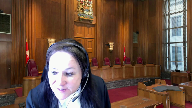
:::

Je fais référence par exemple au paragraphe 15 de la décision de la Cour d'appel où on parle d'une liste d'admission des parties qui décrivent en détail la chronologie de l'instance depuis le dépôt des accusations en 2009.

Est-ce que lors de l'audition orale devant la Cour d'appel, les parties, que ce soit la Couronne ou la Défense, parlaient d'une liste d'admission ou est-ce que quand la Couronne, par exemple, en Cour d'appel aurait dit on a une liste d'admission, est-ce que la Défense s'est levée pour dire un instant on n'a pas d'admission?

Comment ça s'est passé?

**Speaker 5** (01:08:42): Au niveau de la Cour d'appel, je vais évidemment vous faire la réserve que ce n'est pas...

::: {.column-margin}

:::

Merci Madame la juge, je m'excuse pour votre question.

Au niveau de la Cour d'appel, je dois vous dire que ce n'était pas moi qui était la représentante des intimés.

Par contre, j'ai eu la chance évidemment d'écouter l'audition et effectivement, ce document-là n'a pas été présenté comme des admissions des partis.

Pour le remettre en contexte, au niveau de la Cour d'appel, le dossier était en appel par les intimés, alors la plante elle-même n'avait pas porté en appel la question des délais déraisonnables de cette conclusion.

Maître Labelle, ce qu'il a réitéré, qu'il a martelé, c'est que pour lui, la décision du juge, la conclusion du juge quant au caractère déraisonnable des délais était correcte.

Évidemment, on vous propose, et là on proposait du côté de la plante, le fait qu'il était possible de revisiter et on suggérait la liste des admissions comme étant un élément, mais jamais Maître Labelle n'a dit dans l'audition qu'il était d'accord.

Il n'a même pas dit d'ailleurs qu'il était d'accord avec le 35 mois.

Il a réitéré qu'il était d'accord avec la conclusion du juge de première instance quant au caractère déraisonnable des délais.

C'est là où je vous dis qu'un exemple, et pour reprendre en fait, toujours dans votre question Madame la juge côté, sur l'endroit dans le jugement de la Cour d'appel où on réfère à ce document, c'est bel et bien le paragraphe 15 où on va dire «

for the purposes of the motion the trial judge received from the parties a statement of admission that state at length the chronology of the proceedings from the date of the law ».

On dit que ça a été reçu des parties.

Je dois vous dire que ce volet-là a été reçu de l'intimer en Cour d'appel ici la plante parce qu'au contraire Maître Labelle n'a pas déposé ce document-là ni à la Cour d'appel et encore moins en première instance comme étant des admissions.

Je vous le dis là sur la base de connaissances personnelles pour l'avoir écouté. Merci.

**Justice Wagner** (01:10:55): Juste pour faire sur la question de ma collègue, qu'est-ce qu'on fait avec ça?

La juge élée dit oui, c'est un statement of admission.

Qu'est-ce qu'on fait avec ça?

**Speaker 5** (01:11:08): Merci, M. le juge en chef pour votre question.

::: {.column-margin}

:::

En fait, le juge Elie dit cela, mais je vous dirais que pour l'impact sur sa conclusion finale, c'est que le dossier est incomplet.

Et ça, clairement, devant vous, c'est encore plus…

Je veux dire, on prétendait que ça n'avait pas été plaidé justement devant la Cour d'appel, mais devant vous, c'est ardemment plaidé.

D'ailleurs, ce sera certainement même l'ensemble de mes représentations sur ce point.

Le dossier est incomplet.

Et ça, cette conclusion-là du juge Elie, elle est confirmée, je vous la confirme en tout cas, je vous la plaide devant vous.

Pour revenir à l'exemple du 25 février 2014, je reviens au volume 6, à la page 155.

Donc, c'est là où vous avez ce que la plante soumettait en annexe… pas en annexe plutôt, mais c'était ses prétentions quant à ce qui s'était passé aux différentes dates.

Déjà, en faisant la lecture de ce qui est rapporté dans ce tableau, c'est différent de ce qu'on trouve dans la liste des admissions.

Mais ce qui est surtout patent, c'est lorsqu'on prend au volume 3, à la page 69, et là, c'est le tableau de la défense, ici des intimés, qui parle du 25 février 2014.

Et là, vous allez voir tout ce qui a été évacué dans ce document liste des admissions qui est fort pertinent.

Vous voyez dans ce tableau, à la page 69, le ministère public doit compléter sa preuve, sa divulgation de la preuve au plus tard le 31 mars 2014.

Rien de tout cela est dans la liste des admissions.

Le fait que la preuve n'était même pas complète.

Autre point, l'honorable juge David trouve déraisonnable que le ministère public expose afin qu'il y ait consentement à une réoption qu'il doit y avoir des admissions.

Le juge David dit au final qu'on ne peut pas, parce qu'évidemment, les intimés ne pouvaient pas réopter s'ils n'avaient pas le consentement de la poursuite, donc ici de la plante.

Alors, ce qui s'exposait devant le juge David, c'est que si les intimés voulaient avoir une réoption, ils devaient faire des admissions.

Alors, valablement, je vous soumets, le juge David a dit, ce n'est pas comme ça qu'on va chercher des admissions.

Ce n'est pas souvent de la pression de cette nature.

Et d'ailleurs, le juge David s'est repris dans le tableau, va dire que ça ne sert pas les intérêts de la justice d'avoir une telle approche du côté de la plante en première instance.

Et le juge David ajoute qu'il avise le ministère public qu'il ne tolèrera pas de cafouillage dans ce dossier comme ce fut le cas dans un autre.

Ça, ces trois éléments-là, vous ne retrouvez rien de ça dans la liste des admissions.

On n'a pas la transcription, et ça, c'était un autre point majeur quant au caractère incomplet du dossier.

Ce qui est essentiellement un appel, c'est la question de la requête en délai déraisonnable.

Vous avez toute la preuve qui a été entendue dans le cadre du procès de cinq semaines.

Sur l'audition de la requête en délai déraisonnable, rien.

On veut vous présenter finalement oui des tableaux qui entrent, comme je viens de vous le dire, en contradiction avec la liste de faits, de la poursuite, mais on veut finalement amener un cadre très limité pour amener à revisiter la question de la qualification des délais, et ça, ça ne sert certainement pas l'administration de la justice et encore moins l'accès.

**Justice Côté** (01:14:48): j'ai une question pour vous.

::: {.column-margin}
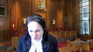
:::

Supposons que le dossier, vous dites que le dossier, vous faites une démonstration que à votre avis le dossier n'était pas complet, mais supposons qu'il avait été complet en cours d'appel.

Selon votre définition de complétude, est-ce que vous êtes d'avis que la cour d'appel aurait pu revoir, parce que la cour d'appel dit nous on est saisi simplement, est-ce qu'il devait y avoir le remède d'arrêt des procédures ou pas.

Mais quand la cour d'appel est saisi d'une telle question, est-ce qu'à votre avis la cour d'appel peut revoir l'analyse des délais faits par le juge?

**Speaker 5** (01:15:22): Merci

::: {.column-margin}

:::

Madame la juge Côté pour votre question puisqu'effectivement ça m'amène à vous dire que oui je conviens que la question de la qualification des délais est une question de droit donc la Cour d'appel aurait pu réviser cette question.

Quant aux faits, évidemment ceux-ci méritaient d'efférence et là ça m'amène à faire un saut complètement ailleurs.

**Justice Côté** (01:15:41): je vais aller plus loin dans ma question.

::: {.column-margin}
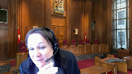
:::

Si vous reconnaissez que la Cour d'appel pouvait revoir la caractérisation des délais ou toute l'analyse relative au délai, et ici la conclusion subsidiaire que Maître Simon a qualifiée subsidiaire ce matin, c'est de retourner le dossier à la Cour d'appel pour qu'elle fasse l'analyse relative au délai à laquelle elle ne s'est pas livrée en disant le dossier est pas complet.

Alors quelle est votre position là-dessus sur cette conclusion subsidiaire de la Couronne?

Merci Mme.

**Speaker 5** (01:16:12): pour cette question supplémentaire, puisque ça m'amène à faire un parallèle avec l'intervention de M. J. Cadirère

::: {.column-margin}

:::

. Lorsque la Plante plaidait sur la référence à la page 81, en fait dans le jugement de la Cour d'appel, la page 81 du volume 2, lorsqu'on réfère aux décisions dans Beliveau, Alamy, Rice, Pateras, je lis bien 1986, sur le fait qu'un dossier doit être complet.

Si le remède que cette Cour devait octroyer à la Plante, c'était de retourner le dossier à la Cour d'appel et lui permettre de mettre son dossier comme complet, ce serait littéralement de dire qu'on s'était mépris finalement sur les enseignements de Pateras et qu'on pouvait finalement se méprendre là-dessus et avoir une deuxième chance.

Je vais utiliser l'expression anglaise que j'aime bien, le second kick at the can.

Donc, on avait une deuxième chance comme à Plante.

On s'est trompé, on n'a pas offert un dossier complet, on a essayé de faire l'appel avec une liste restreinte de représentation et on va avoir une deuxième chance.

Alors oui, la Cour d'appel pouvait faire l'exercice et même pour revenir à votre intervention, M. le juge en chef, plutôt sur le fait qu'il y a eu un long délai dans la section délibérée de la Cour d'appel, j'ai envie de vous dire que si on a lu le procès, on devait chercher justement où est-ce que ça pouvait nous aider à qualifier les délais.

Comme COGECA nous dit qu'on doit présumer que les délais sont raisonnables, il y a une présomption littéralement que le délibéré est raisonnable, j'ai envie de vous dire qu'ils ont tenté l'exercice, les juges de la Cour d'appel, et qui manifestement n'y sont pas arrivés et c'est une conclusion justement factuelle celle-ci où on vous dit que le dossier n'est pas complet.

**Justice Kasirer** (01:17:55): Est-ce que je peux, je vous interrompt, c'est pas poli, mais j'essaie de comprendre votre position parce que je lis votre mémoire et sauf erreur de ma part, à part une note de bas de page au paragraphe 22, la note 14, vous ne présentez pas l'argument sous cet angle-là dans votre mémoire.

::: {.column-margin}

:::

Nous savons que le juge Garneau qui a entendu le dossier en premier instant, c'est-à-dire la requête en arrêt des procédures, avait devant lui entre autres choses R6, le tableau de la qualification des délais de la défense, I1, tableau de la qualification des délais de la poursuite et I5, liste des admissions, outre les jugements du juge chevalier, du juge Champagne et le procès verbal de la Cour d'appel.

Je cherche à situer, comme le juge en chef dit, devant la Cour d'appel qui, il voit, qualifie ça comme l'en-tête de I5, le fait comme une liste des admissions faite sous 655, il me semble que, je dis ça bien amicalement, vous cherchez midi à 14 heures, nous avons une preuve, la preuve qui était devant la Cour d'appel qui venait du tribunal de première instance et là vous vous attaquez à ça parce que la Cour d'appel vous ouvre une porte inopinée pour contester le fondement du dossier, pour contester les déterminations factuelles par le juge.

On lit le jugement de première instance, on a pu critiquer le juge, je n'en sais rien, il fait et manifestement il s'est inspiré de ce document en écrivant ses motifs, on lit paragraphe par paragraphe de son jugement, ça vient.

**Overlapping speakers** (01:20:00): a lot.

**Justice Kasirer** (01:20:00): Et en cours d'appel, vous n'en avez pas fait un plat.

::: {.column-margin}
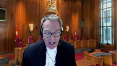
:::

Là, vous arrivez en cours supreme avec une note de bas de page qui se transforme en 20 minutes de plaidoiries que vous faites bien là, je vous critique pas là, comprenez bien.

Mais j'essaie de comprendre votre affaire parce que il me semble que vous êtes mieux de vous attaquer à l'idée qu'il y a une appréciation erronée.

Il y avait de la preuve devant la cour d'appel.

M. Simon ne dit pas que toute la preuve était là.

Elle concède qu'il y avait des éléments de la preuve, mais que c'était suffisant pour la cour d'appel pour trancher et que cette même preuve devant nous, suffisant pour nous de trancher.

Alors voilà le défi qui est le vôtre.

**Speaker 5** (01:20:45): Merci, M. J. Quésirard, pour votre intervention et d'ailleurs pour ajouter à votre premier point, c'est-à-dire le fait que strictement dans une note de bas de page, j'aurais soulevé le caractère incomplet de la preuve.

::: {.column-margin}

:::

Je vais vous référer aux mémoires des intimés.

Au paragraphe 22, donc avant de faire la note de bas de page, je dis que la plante insiste sur l'importance des admissions.

Je ne parle pas de moi, évidemment, je parle de la plante.

En leur attribuant une place et une fonction douteuse.

Il y a une audition sur la requête en délai des raisonnables, c'est-à-dire qu'il y a eu les représentations des parties.

Je ne les ai pas listées comme je le fais aujourd'hui et je vous avoue que moi-même, lorsque j'ai entendu la plante plaider, j'étais fort surprise qu'on rapporte des choses qui étaient inexactes.

Et c'est là que je vous parlais de la délicatesse.

Je continue mon paragraphe 22 et une preuve plus étoffée que le simple dépôt d'admission.

La requête n'a pas été décidée sur dossier.

Il y a eu trois jours d'audition.

Si on voulait, ne serait-ce que, réviser le travail effectué par le juge Garneau, n'aurait-il pas été à propos d'avoir à tout le moins ce qui s'est produit devant lui.

J'ai continué plus loin parce que tous les paragraphes qui suivent concernent encore le caractère incomplet.

Regardez un autre exemple, le paragraphe 25.

La requête pour faire déclarer inhables

les avocats des intimés atteignait ce dernier dans un droit qui dépasse…

Non, pardon, je ne suis pas au bon endroit.

Il y avait… En fait, je dis dans le mémoire que la requête…

Je suis plutôt au paragraphe 19, avant cela.

Je m'excuse.

La requête en inhabilité des avocats, c'est encore le bon sujet, au paragraphe 19 du mémoire, laquelle est l'élément déclenchant de toute une série de procédures visant à conserver le droit pour les intimés d'être représentés par ceux-ci, n'a pas été produite.

Je qualifie plusieurs éléments qui sont manquants, effectivement, et là, ce sont les exemples que je vous donne.

Et aujourd'hui, dans mes représentations orales, évidemment que je vais plus loin considérant les représentations que la partie appelante vous a faites.

Je n'ai pas lu dans le mémoire de la partie appelante que Maître Labelle était d'accord avec le 35 mois et qu'il avait lui-même reconnu qu'il s'agissait d'admission.

Et comme je vous le dis encore une fois, au paragraphe 22, on l'a présenté comme étant des admissions, mais moi-même, dans le mémoire, j'ai remis déjà en doute cette affirmation.

Et là, évidemment, comme je vous ai dit, je dois aller beaucoup plus que dans le doute, je dois aller dans la certitude compte tenu de l'ampleur de ce qui a été avancé.

Je me répète, mais l'audition du 27-28, dès 27-28 et 30 janvier 2015, c'est là que ça se passe de la requête en délai et on n'a même pas la transcription de ce qui s'est produit.

**Justice Côté** (01:23:34): Maître Boulash, j'ai une question pour vous.

::: {.column-margin}
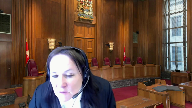
:::

Je m'excuse à nouveau de vous interrompre.

Je reviens à l'audition verbale devant la Cour d'appel.

Je sais que vous n'étiez pas là, mais vous dites que vous avez écouté l'audition.

Est-ce que Maître Labelle, à la Cour d'appel, a dit à un instant, vous ne pouvez pas vous prononcer, vous n'avez pas de dossier complet?

Ou si c'est la Cour d'appel, dans son délibéré, qui a décidé que le dossier n'était pas complet?

**Speaker 5** (01:23:58): En fait, là-dessus, je rejoins les propos de Mme la juge Côté, je rejoins les propos de Mme Simon lorsqu'elle mentionne qu'elle était un peu « surprise » par le paragraphe 14.

::: {.column-margin}

:::

Donc, en ce sens où, effectivement, ce n'est pas l'essence des échanges qui avaient eu lieu à la Cour d'appel, le caractère incomplet, je vous dirais encore, pour faire écho aux propos de M. le juge en chef, au départ, on n'a pas nécessairement rejeté cette idée de le revisiter, mais rapidement, on a dû se rendre compte, et là, je spécule purement en parlant de la position des juges, on a bien dû se rendre compte assez rapidement que c'était incomplet.

Mais je ne prétends pas devant vous que ça a fait l'objet de grande représentation, le caractère incomplet.

Ce que je vous rapporte, en fait, c'est que Mme Labelle maintenait qu'il n'avait pas lui-même porté en appel, en fait, la plante n'avait pas porté en appel la question de la conclusion du juge quant au caractère raisonnable des délais.

Je pourrais vous parler encore, en fait, du fait que le dossier est incomplet, ne serait-ce qu'en vous référant au paragraphe même 32 du mémoire de la plante où elle-même indique que la pièce I-4 n'est pas reproduite.

Alors qu'on plaide devant vous la complexité du dossier et que la pièce I-4 est une pièce maîtresse qui traduit la nature du dossier, puisque dans cette pièce, on retrouve le cahier de procès, le précis des faits, la liste des témoins et l'avis d'écoute électronique.

Et là encore, on veut devant vous faire en sorte que les mesures transitoires s'appliquent en plaidant la cause complexe.

Et ça m'amène donc à ouvrir peut-être cette brèche sur la question de la cause complexe.

**Justice Kasirer** (01:25:37): Juste un dernier, excusez-moi, on vous assomme de questions.

**Overlapping speakers** (01:25:40): Bye-bye!

**Justice Kasirer** (01:25:41): vous avez du talent.

::: {.column-margin}
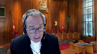
:::

Je fais observer, je fais remarquer que dans le mémoire de Michel Sainte-Marie, donc votre collègue intime, dans son récit des fées, au paragraphe 6 et 7, les notes de bas de page 2, 8, 2, 4 et 8, s'appuient sur le bouton de l'écran.

Vous avez du talent, vous avez du talent, vous avez du talent, vous avez du talent, vous avez du talent, vous avez du talent, vous avez du talent, vous avez du talent, vous avez du talent, vous avez du talent, vous avez du talent, vous avez du talent,

**Justice Kasirer** (01:26:04): So admissions under 655 of the criminal code, the appellant's application record volume six page one.

**Justice Kasirer** (01:26:13): autrement dit que l'autre intime s'appuie sur ces faits que maintenant vous dites que ce n'est pas une admission, les qualifie d'admission et s'en charge pour mener son propre argument alors c'est pour ça que je dis on est on est un peu pris de dépourvu par votre point c'est pas que vous ne le présentez pas bien c'est pas mon propos.

::: {.column-margin}
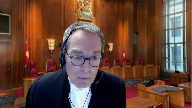
:::

**Speaker 5** (01:26:40): Je vous remercie, M. le juge, pour votre question et même les compliments.

::: {.column-margin}

:::

En fait, je vais peut-être céder cette question à M. Faudin, mais puisque je ne veux pas vous manquer de respect en n'y répondant pas, je vais vous dire que ce document-là n'est pas dépourvu d'un certain intérêt.

Parce que, souvenez-vous, le début de mes représentations était à l'effet que ce document-là a été déposé comme document de travail, une plaidoirie écrite de la poursuite devant le juge de première instance.

Donc, c'est un élément qui renferme quand même des informations et pour lequel l'intimé Michel Sainte-Marie peut certainement s'appuyer finalement en prenant les propos mêmes de la plante pour forger son propre argument.

Sauf que ce que je dis, c'est que c'est un élément du dossier et que ça mène justement à des conclusions qui ne seraient pas conformes à la preuve qui a été présentée.

C'est là le danger.

Et vous l'avez vous-même souligné, M. le juge Casirat, plus tôt, la note de bas de page de la décision de la Cour d'appel sur Beliveau, Alamy et Pateras.

Je le martèle, mais évidemment, quand on arrive comme ça en appel, c'est assez clair que oui, on veut un accès à la justice et que ça peut devenir assez lourd d'avoir à produire plusieurs transcriptions.

Sauf que quand la question comme intimée, parce que la plante ici était intimée en appel, et la seule question qu'elle voulait elle-même introduire en termes, j'allais dire, d'aplante indirectement ou par la bande, c'était celle-là et elle n'a pas produit le dossier pour le faire.

Et pour reprendre les propos de Mme la juge Côté en disant que la Cour d'appel ne se gêne pas effectivement pour qualifier le dossier d'incomplet, bien évidemment, je le répète, mais la plante devant vous était intimée en cour d'appel et voulait avancer donc cette question qui est une question évidemment de droit, la qualification des délais.

Et pour parler de question de fait et revenir à mon point de la cause complexe et des mesures transitoires dans mon 30 secondes, je veux simplement porter à votre attention le fait qu'aujourd'hui encore, on a fait des représentations devant vous, à l'effet que la poursuite, en première instance, la plante ici avait un plan.

Or, il y a une conclusion factuelle fort importante du juge Garneau sur ce point et s'il ne l'a pas dit quatre fois, il ne l'a pas dit, au volume 1, à la page 58, lignes 24 et 25, le juge Garneau dit qu'il n'y en a pas de plan.

Toujours dans le volume 1, à la page suivante, dès la ligne 1, encore des conclusions factuelles à l'effet qu'il n'y avait pas de plan.

Même page, ligne 12 à 17, il l'a dit jusqu'à la page 21 qu'il n'y en avait pas de plan.

Et je peux même faire écho au propos du juge David sur ce point, qui mentionnait effectivement, qui utilisait le terme « cafouillage » parce qu'on tentait finalement d'obtenir des admissions en termes forcés.

**Overlapping speakers** (01:29:51): Je vais vous demander de conclure, maître Boulet.

**Speaker 5** (01:29:52): Je vais conclure, M. le juge en chef, je vous remercie, je n'avais même pas remarqué derrière la lumière rouge.

::: {.column-margin}

:::

Alors, je vais conclure non pas en nécessairement soulevant une autre question que je n'ai pas abordée, mais si ce n'est que de soulever le fait qu'il y a deux actes importants du ministère public et je l'ai mis dans mon recueil condensé, je pense que ça fait déjà le point très clairement, au point 1C, que ça aura pris 1 544 jours pour déposer un acte d'accusation directe et 385 jours pour présenter une requête en inhabilité sur laquelle je ne suis pas revenu, mais qui clairement, si encore une fois il fallait prendre les prétentions pour avérer de la plante, pouvait être manifestement présentée avant si on souhaitait réellement régler cette question.

**Justice Wagner** (01:30:45): Mr. Fodor.

**Speaker 4** (01:30:50): Chief Justice, thank you, Mesdames les Juges, Messieurs les Juges, I propose making my...

**Speaker 6** (01:30:55): arguments today in English, but I welcome questions in French.

::: {.column-margin}
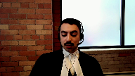
:::

I have three main submissions to present to the court, although I suspect I will be spending less time on the first submission, given Maître Boulet's comprehensive review of the record.

The first is that the appeal should be dismissed because of an unsatisfactory record.

The second is that the time required to adjudicate extraordinary remedies should not be subject to a categorical rule under the exceptional circumstances framework of Jordan.

And the third is that this court should decline to revisit the question of the appropriate remedy for a breach of section 11B of the charter.

Turning to my first argument, the appellant crown comes before this court with an insufficient record to allow for a meaningful review of the trial judge's findings of fact on the section 11B motion.

The crown did not have a sufficient record in the Quebec Court of Appeal, and it does not have a sufficient record here.

The issue the crown brought to the Court of Appeal as a respondent and here could be a question of law, but the evidence underpinning it is insufficient.

As respondent at the Quebec Court of Appeal, the crown failed to marshal the appropriate record to enable the Court of Appeal to engage in a de novo review of the attribution of specific periods of delay.

Despite Justice Healy's reasons for decision at paragraph 14, as this court noted, in which he made clear that the court was, quote, unable to review or determine whether the judge's assessment of the delays in this case was inadequate or mistaken, it comes before this court with no better record.

It is well-known that this court has not been able to review or determine whether the judge's assessment of the delays in this case was inadequate or mistaken.

**Justice Côté** (01:32:44): Mr. Fouda, I have a question for you.

::: {.column-margin}
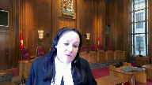
:::

When a court, be it the provincial court, the court of appeal, wants to take a position based on the fact that a file is not complete, is it not a question of fairness to tell the parties or to give an opportunity to the parties to complete the file?

**Speaker 4** (01:33:09): Merci Madame de Jusquoté.

Thank you very much Justice Côté.

**Speaker 6** (01:33:13): for that question.

::: {.column-margin}
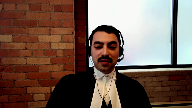
:::

In my respectful submission, the issue of procedural fairness on appeal is better framed in the sense of allowing the parties in our adversarial system, as you noted, Justice Cote, whether it's at the provincial court, the Superior Court, the Court of Appeal, or before this Honourable Court.

Our adversarial system of litigation requires that the parties who seek a particular remedy sustain that request with the appropriate record.

As this court noted in Mian, Regina and Mian from 2014, there are limits to what courts of appeal can do and raise on their own before it begins potentially compromising the appearance of fairness.

We say where the Crown, as respondent on appeal, sought to have findings of fact revisited, it was incumbent upon the Crown to proffer that record before the court, and it was entirely reasonable for the defence to not assist the Crown in perfecting its record.

It is well known in Quebec that the appellate court requires a sufficient record.

This is specifically known in relation to appeals of Section 11B charter decisions.

It requires a record from the court below in order to engage in a review of the correctness of the findings of fact.

The Bellevaux decision is a 2016 decision from the Quebec Court of Appeal, and it would have been well known to the Crown respondent at the Quebec Court of Appeal.

**Justice Rowe** (01:34:47): Are you suggesting there's a different set of rules in this regard for the province of Quebec than for the rest of the country?

**Speaker 6** (01:34:55): there is not, thank you Justice Roe, in fact there is jurisprudence in Quebec, in particular the case of Rice for example, because of long-standing delays that have plagued the production of transcripts in Quebec.

::: {.column-margin}
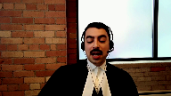
:::

There is a practice, in my respectful submission, to allow the parties to complete the record in a manner that is satisfactory for the court to undertake the task at hand.

In other words, if at an section 11B motion, a trial level motion, the parties are content to file the audio recordings of the proceedings instead of official transcripts, the parties can do that to avoid delays.

If that is relied upon at the trial court by the parties and by the trial judge, and no issue is made with respect to the completeness of the record at the trial level, then at the court of appeal, certainly that record has to be reproduced.

The record doesn't need to be supplemented or made better in any sense, but certainly the record that's before the trial court has to be reproduced before the court of appeal.

So the respondent Michelle Sainte-Marie respectfully submits that at the very least, if the findings of fact were to be revisited by the Quebec court of appeal, the five years worth of audio recordings of court hearings that were before Justice Gatineau ought to have been reproduced before the Quebec court of appeal.

And there has been a lot of debate about whether or not the recording of court hearings should be reproduced before the court of appeal.

And there has been a lot of debate

**Justice Kasirer** (01:36:34): Mr. Faud, I think you've answered, I hope you've answered my colleague's question sufficiently.

::: {.column-margin}
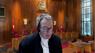
:::

I'm gonna bring you back to the comment that I addressed to your colleague about your own factum, which perhaps was unfair to Maitre Boulet.

Paragraph 13 of the factum, you say, in arguing the Quebec Court of Appeal erred in failing to revisit the findings of fact, the appellant crown relies on the party's admissions under section 655 of the criminal code on the section 11B motion.

This is an unsatisfactory record upon which to reverse the trial judge.

You say elsewhere in your factum, you refer to these admissions for your own account of the facts.

Are you now changing your position that these are not admissions and that they're, this is some, that when you describe them as party's admissions under 655, if you were mistaken at paragraph 13.

**Speaker 6** (01:37:38): Thank you Justice Cazire for your question.

In my respectful submission it is not the label that matters, but rather the substance of the argument that the record was incomplete before.

**Justice Kasirer** (01:37:48): label I'm talking about, it's how you described it.

You described it as the party's admissions under 655.

Now, are you retreating from that?

**Speaker 6** (01:37:59): So, Justice Cazira thank you for that question.

::: {.column-margin}
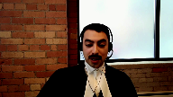
:::

I am not in a position to retreat or to, or in this particular case, to accede to that characterization because in my respectful submission it was the appellant Crown's burden to put before this court the appropriate record.

**Speaker 4** (01:38:19): Have a nice day.

**Justice Wagner** (01:38:19): That was not that question, Mr. Frode.

The question of my colleague is quite clear.

Do you maintain what you wrote in your factum, yes or no?

**Speaker 6** (01:38:28): I am content to rely on my factum.

Whether or not the agreed statement of fact was in fact tendered and marked as an exhibit accepted by the parties is not something that is within my personal knowledge.

**Overlapping speakers** (01:38:45): Mind you, you're in good company.

Justice Healy believes the same thing as you do.

**Speaker 6** (01:38:50): Yes, and I was not present neither at the Court of Appeal nor at the trial, and the point that I make simply is that, well, as a respondent on appeal, in my respectful submission, the respondent was not out of line in terms of repeating the label that the appellant crown had placed on this document.

::: {.column-margin}
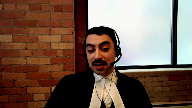
:::

But all along, the respondent Michel Sainte-Marie has taken the position that the record before this court is incomplete, and one of the reasons for which even the admissions of the parties is an incomplete document is because it is not the record of what occurred when that exhibit was deposited before the court, which Maître Boulet is contesting.

Any qualifications on that document would have been important for the trial judge and for the Quebec Court of Appeal to know.

There is at least in one instance in that document a scratched out word and initials.

The document is not signed by either the lawyer for Michel Sainte-Marie or Michel Sainte-Marie.

It doesn't even contemplate that document on its face.

It doesn't even contemplate binding the other parties.

And in my respectful submission, particularly when it comes to the findings of fact that underlie this case and the trial judge's reasons for denying a stay, having nevertheless found a violation of Section 11B, it is imperative to know what those findings of fact were and what the evidence was in support of them.

Justice Garneau held that the absence of prejudice was one of the reasons for which a stay was being denied.

He also held that that prejudice could have been mitigated had the self-represented accused simply hired counsel.

Well, Michel Sainte-Marie was never self-represented.

Michel Sainte-Marie was entirely successful in resisting the Crown's conflict of interest motions.

Mr. Felks was similarly not self-represented, and he testified as to his prejudice.

He testified on the motion.

And so the findings of fact that Justice Garneau relied upon to deny a stay of proceedings for all parties, including Michel Sainte-Marie in our respectful submission, it would have been absolutely crucial for the Crown and imperative for the Crown on appeal to tender those before the Quebec Court of Appeal so an appropriate decision on appeal could have been made.

And Michel Sainte-Marie, please, before this Court, do not revisit the sins of the children upon the father in the sense that the extraordinary remedies that were launched by Mélanie and Dax Sainte-Marie were not launched by Michel Sainte-Marie.

Of course, Michel Sainte-Marie accepts responsibility for the delays that were caused by the initial contesting of the jurisdiction of the preliminary inquiry judge to hear the conflict of interest motion.

But when we are dealing with a multi-accused prosecution in our respectful submission, the finding of fact that the Crown has not urged this Court to revisit is the absence of a plan, global vision for the case, which we say dominates, supersedes, and overlaps with the period of time during which the extraordinary remedies were being litigated in the lower courts.

Recall that it was in 2009 when the Crown noted that there was a potential conflict of interest problem, and it was not until the 9th of December 2013 when a direct indictment was preferred by the Crown.

Had the Crown either preferred a direct indictment early on, had the Crown litigated the conflict of interest motion in the Superior Court early on, many of those extraordinary remedies would have been obviated.

And so when there's an overlap of the period of time during which the extraordinary remedies are being litigated, and a time during which there is a finding of fact that there was no plan or global vision for the case, we say that cannot be defense delay because it is not delay that it's solely attributable to the defense.

It is at most shared delay.

If all of that delay is subtracted from the total delay of 77 months, we are left with a delay of 35 months, candidly over the Jordan ceiling.

And the Crown has admitted, has conceded to this court that there is no evidence underpinning the findings of prejudice before this court.

There is also a full answer on appeal.

How in the absence of any evidence in relation to prejudice, can this court find that the transitional exceptional circumstance should be engaged?

**Justice Côté** (01:43:37): With Mr. Forda on that question of prejudice, Maître Simon said to us that she relies on what Justice Garneau said at page 60 of the appellant's record.

::: {.column-margin}
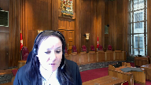
:::

So she says we have those findings and the difference is owed to those findings.

This is essentially what she said on prejudice.

**Speaker 6** (01:43:59): And we are not asked, we as respondents are not asking this court to revisit the findings, the factual findings of prejudice.

::: {.column-margin}
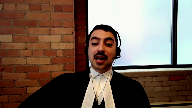
:::

The respondents here and as appellants at the Quebec Court of Appeal were advancing an error of law on the face of the trial judge's decision, namely the consideration of prejudice at the back end after deciding that there was unreasonable delay.

That was an error of law that could be cured without reference to the facts and that is in fact what the Quebec Court of Appeal accepted.

We say rightly so.

In a sense, Justice Garneau's decision was almost prescient in a sense that the first part of his decision, analyzing the unreasonable delay, it was entirely consistent with Jordan.

The second part of his decision, denying the remedy, that is where he fell into error.

Because after finding unreasonable delay, he in effect...

**Justice Kasirer** (01:44:59): Whether he was prescient or not, and he was deciding it under Morin, he was deciding it in 2015.

::: {.column-margin}
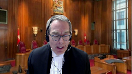
:::

He didn't have any idea of what Jordan was, and he had a duty to take prejudice into account in deciding whether there had been an 11B violation.

And the Crown has conceded that he made an error when he applied it to remedy, but when you read his judgment as a whole, he made, as my colleague said, a factual finding that the prejudice was not associated with the delays, it was associated with.

**Overlapping speakers** (01:45:41): But the...

**Justice Kasirer** (01:45:43): as he said.

::: {.column-margin}
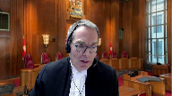
:::

So prescient, I don't see if his prescience is perfectly irrelevant to things.

What's important is, from the perspective of where we are, is whether under the...

**Overlapping speakers** (01:46:01): measure transitoire exceptionnelle, we can take

**Justice Kasirer** (01:46:05): to take this into account.

And in fairness to your colleague, the Crown, she also mentioned, look at.

**Justice Kasirer** (01:46:12): caractère moyennement complexe du dossier.

**Speaker 6** (01:46:16): Thank you Justice Cassirer.

In characterizing Justice Garneau's decision as president, what I'm attempting to do is simply note that his decision finding a breach of section 11B is entirely consistent with Jordan.

It is not.

**Justice Brown** (01:46:32): consistent with Morin and that's the central point that Justice Kazir makes.

It is inconsistent with Morin because he does not appear to understand the legal significance of a finding that there is no prejudice.

**Speaker 6** (01:46:48): Well I would respectfully, thank you very much Justice Brown, I would respectfully submit that the findings of absence of prejudice were particularized findings with respect to certain defendants that could not apply across the board and in any event under the Morin framework a stay was entirely warranted.

::: {.column-margin}
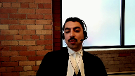
:::

The total delay was 77 months and his findings of fact that in our respectful submission are of significant deference are the the lack of a plan and the lack of global vision for a the prosecution and that that really forecloses the Crown's ability to rely on the transitional exceptional circumstances in our respectful submission because the finding of fact that there was no adequate plan or global vision from the case those are facts that speak directly to whether or not the Crown can rely on the complex case exception under Jordan and the as what this court says I believe in Jordan at paragraph 61 if I may just have a moment

**Justice Kasirer** (01:48:04): I hope you're being fair to Justice Garneau here when you talk about individual prejudice.

This seems to be a new point in your corner, and I just recall to you that he, at page 60 of his judgment, said,

**Justice Kasirer** (01:48:21): et aussi le tribunal tient compte des préjudices individualisés par les différents accusés.

**Justice Kasirer** (01:48:27): So you're running against that finding effect too.

**Speaker 6** (01:48:33): Well, in my respectful submission, that finding of fact, those findings of fact underlying the absence of prejudice would have been necessary for the Crown to put before the Court should it urge the Court to rely on an exceptional circumstance to justify the absence of a stay or the sorry the transitional exception and because specifically the transitional exceptional the transition exceptional circumstances will requires a paragraph 96 of Jordan requires a contextual assessment sensitive to the manner in which the previous framework was applied and the fact that the party's behavior cannot be judged strictly against a standard of which they had no notice for example prejudice and the seriousness of the offense often played a decisive role in whether delay was unreasonable under the previous framework.

::: {.column-margin}
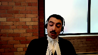
:::

So in the respondent Michel Saint-Marie's submission the analysis of prejudice in order to meet the Crown's burden that a transitional exceptional circumstance applies it was for the Crown to put that evidence before the Quebec Court of Appeal and the Crown did proffer its factum on appeal the on the Quebec at the Quebec Court of Appeal in the record before this Court and they did specifically plead that the transitional exceptional circumstance applied.

I would like to take some time Justices to speak about sort of the the principle my second argument that is that a categorical rule regarding extraordinary remedies should not be adopted the exceptional circumstance framework only applies where the ceiling is is exceeded in our respectful submission there's no evidence that in every case where an extraordinary remedy is launched by a party that that will occur moreover extraordinary remedies are not unforeseeable in criminal litigation and they were not unforeseen in this case under the Jordan framework extraordinary remedies don't fit either exceptional circumstances or discrete events because there are some cases where an extraordinary remedy application will be reasonable and some cases will where it will be meritless the Jordan framework is sufficiently flexible to allow an analysis of case-specific characterization of delays without a general rule modifying the applicability of the ceilings and I take that from this Court's case in KGM further the whole point of Jordan is to give the Crown and the defense an incentive to keep keep the case going and I am sensitive to Mr Chief Justice's comments this morning as well as yesterday that Judges and Courts also play a role in ensuring that the culture of complacency does not persist and in our respectful submission that also applies to delays in superior Courts to have extraordinary remedies heard if there are mechanisms by which extraordinary remedies can be heard with dispatch these are mechanisms that are available to the Courts and to the parties and it appears that in this case the Crown was somewhat dilatory in making use of those remedies in various criminal proceedings rules across the country for example Rule 43 of the Ontario Criminal Proceedings Rules there was Regule 25 of the Quebec Superior Court Rules because of the suspension of proceedings that occurs when extraordinary remedy is launched there is a mechanism to bypass that suspension of the proceedings and allow the proceedings to continue in the Ontario Court of Justice those motions are available to the Crown or to any party that wants to continue the case with dispatch moreover there is the common law extraordinary remedy of procedendo that was in fact developed to respond to dilatory prerogative writs to it is from the Latin ablative to proceed to force the parties to proceed despite a pending extraordinary remedy and the Crown the Crown or the defense can also apply to summarily dismiss

**Justice Moldaver** (01:52:55): great idea when you can't get the first base as to whether the parties are in a conflict or not.

::: {.column-margin}

:::

You know, our justice system is burdened beyond belief as it is.

And here you are, your friend says, look, we tried to narrow the case, we tried to narrow the people involved.

This was a huge big case, huge, you know, organized crime.

We narrowed it down to a few people.

And the defense, for I don't know how long, kept putting the Crown in the impossible position of saying, if we go ahead, and these people are in conflict, we can affect, forget about this case.

And you never did anything to try and resolve this, nothing.

Now you come to this court and say, oh, poor us, you know, we were doing our best, the Crown wasn't doing what it was supposed to.

It seems to me that when the judge below was talking about prejudice, and no prejudice befalling your clients, what he was really saying was, you put up every barrier possible in this case, to obstruct the case proceeding forward without any attempts to conciliate, to work together.

And so how do you come, how dare you come and complain about delay, when that is precisely what it is that you as a group wanted in order that you could try and get the big 11b prize.

I just, I find your submissions just so obviously and transparently, you know, kind of, and I hate to say this, but they bear no relationship to the reality of what went on in this case.

**Speaker 6** (01:54:43): Thank you, Justice Moldaver.

::: {.column-margin}

:::

I would simply respectfully submit that Marc Labelle was not removed as counsel of record for Michel Sainte-Marie.

And throughout the proceedings, both in the Superior Court and at the Quebec Court of Appeal, there was some tolerance to what we would call tagging along by the other Sainte-Maries.

And I would respectfully urge the Court to consider this Court's comments in Vassal, where, as this Court says, in many cases delayed cause by proceeding against multiple co-accused must be accepted as a fact of life, and must be considered in deciding what to do with the case of Michel Sainte-Marie.

**Justice Moldaver** (01:55:22): having written vassal I can tell you that we were talking about a situation where you have a bit player who is being dragged along by other co-accused who are obstructing and delaying and doing all kinds of things and probably in that case I mean the crown should have severed.

::: {.column-margin}
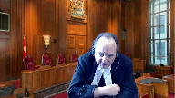
:::

And so let's not talk about vassal here.

Everybody in this case was about on relatively equal par in terms of involvement from what I can understand.

**Speaker 6** (01:55:55): Thank you, Justice Moldaver.

I would respectfully submit that that cannot reasonably be said about Richard Phelks, for example, who had his own separate lawyer.

And as a matter of fact, Richard Phelks is the only lawyer in the United States who has a separate lawyer.

**Justice Moldaver** (01:56:05): who had an opportunity to have his own preliminary hearing and to do his own thing and chose not to.

Thank you.

**Speaker 6** (01:56:12): Well, in my respectful submission, what actually occurred is that the Crown preferred a direct indictment shortly after making that offer to Mr. Felix, and that finding of fact that the Crown should have preferred the direct indictment tout au début, right at the beginning, that is a finding of fact that would have significantly impacted the delay that was caused in this case.

::: {.column-margin}
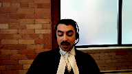
:::

I want to make a few more submissions specifically on the question of extraordinary remedies.

Extraordinary remedies can also be resorted to by third parties.

And so the a priori rule that the appellant proffers does not make sense in this case.

If a third party brings a certiorari or prohibition respecting their subpoena or evidence, the defendant's speedy trial could be delayed.

And if the court cannot accommodate a motion to quash by the defendant for nine months, this speedy trial is still delayed.

He is forced to choose between a faster trial and a less fair trial.

This in my respectful submission makes no sense because he is guaranteed both under the Constitution.

And we propose a case by case analysis where the trial judge would be best placed to assess the reasons for any delay stemming from extraordinary remedies.

And Justice Moldaver, that is precisely what Justice Garneau did in this case when he found it as a finding of fact, and we accept that the contesting of the preliminary inquiry judge's jurisdiction was inutile and non avenue.

It was useless and unwarranted.

And we accept the delay that stems from that.

But in our respectful submission, it is not fair to extrapolate that finding to find that the entire delay from the extraordinary remedies is attributable to the defense in the circumstances of this case.

**Justice Moldaver** (01:57:56): Unless you look at this, as we said in Jordan and later in Cody, look at the manner in which the defense is conducting itself.

::: {.column-margin}
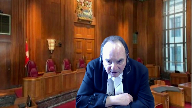
:::

And when one looks at the manner in which the defense is conducting itself here, one comes away with one answer only.

This was a concerted effort on the part of all the parties to obstruct, throw up every barrier possible so that this case would never get to trial.

**Speaker 6** (01:58:24): Thank you Justice Moldaver.

::: {.column-margin}
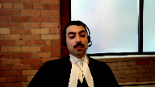
:::

I would respectfully disagree with that characterization.

The person who would have been best placed to make that finding would have been Justice Garneau, who had a case management conference in November, two months prior to the 11B hearing.

Moreover, in our respectful submission, a case-by-case analysis.

As this court holds in Cody, there is deference owed to those highly discretionary findings of fact with respect to the product of the parties.

Any judge?

**Justice Moldaver** (01:58:56): any judge who finds after 77 months that there is no prejudice to the accused is clearly it seems to me the circumstantial evidence is overwhelming and what it says to me is there's no prejudice because you got precisely what it is you were trying to get.

::: {.column-margin}
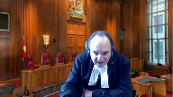
:::

**Speaker 6** (01:59:17): Thank you Justice Moldaver and my respectful submission if it were a circumstantial case the crown asking this court to reverse the stays ought to have proffered the full record on appeal to allow this court to meaningfully assess that but more importantly the findings of fact by the trial judge that there was no plan that there was a lack of vision for the case those are findings that are certainly at least on equal footing as the findings of the absence of prejudice and in those circumstances in my respectful submission the appeal should be dismissed.

::: {.column-margin}
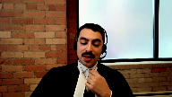
:::

**Justice Moldaver** (01:59:49): You know, I'll just say one more thing.

::: {.column-margin}
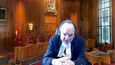
:::

You're putting this case into a category, I've seen your stuff, Au Quoi, Vassal, neither of which have anything to do with this case or this prosecution.

And in fact, I have no doubt that your friend, Ms. Simone, is telling it straight as can be, that the Crown did a lot of preparation here to narrow this down and try and keep it tight, keep it focused, and now you're talking about Au Quoi, where there's hundreds of accused and Vassal, where it's a case where there are multiple accused, about six or five as I recall, where one person is complaining because he had really nothing, just a bit role in it, and yet he's being dragged along by all these other accused who are putting up every barrier to try not to get to trial.

So it just seems to me, everything you're saying sounds good until you actually look at what really happened here.

**Speaker 6** (02:00:50): Thank you, Justice Moldaver.

Mr. Chief Justice, if I might just have a...

**Overlapping speakers** (02:00:53): brief moment to conclude.

I will allow you to conclude, yes please.

**Speaker 6** (02:00:57): Thank you so much Chief Justice.

::: {.column-margin}
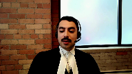
:::

In the respondent Michel Saint-Marie's respectful submission, there's an absence of a satisfactory record.

The extraordinary, the categorical rule urged by the appellant Crown should yield to a case-by-case assessment and this is not the appropriate case in our respectful submission to revisit the rule in Rahi.

Thank you very much.

**Justice Wagner** (02:01:22): Thank you, Mr. Fouda.

Ms. Erin Dan.

**Speaker 7** (02:01:27): Yes, good afternoon and thank you.

::: {.column-margin}
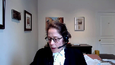
:::

On behalf of the Criminal Lawyers Association, I find myself in the unique position of saying we would not mind if the court completely ignores our submissions.

Our application for intervention was premised on this court accepting the invitation of the Attorney General of Ontario to revisit the question of remedy, but we agree with the appellant, the respondents and the AQAAD that that issue does not arise in the context of this case and it would not be appropriate for the court to revisit Rahi in those circumstances in a sort of legal and factual vacuum.

Our position is that the Attorney General of Ontario in asking the court to revisit Rahi is in fact asking the court to overturn Jordan as well.

And in our submission, that invitation rests on a fundamental misunderstanding of Jordan and what it did and sought to do.

It ignores first that in setting the presumptive ceilings as set out in Jordan, this court took carefully into account the interests not only of the accused but of victims, witnesses and the society in speedy trials on their merits and the integrity or the damage to the integrity of the criminal justice system where trials are unduly delayed.

It also mistakes in our view the doctrinal clarity and the resulting predictability and outcome that Jordan produces with mechanical calculation.

The CLA submits that Jordan clearly does not create a situation of automatic stays beyond a certain number but rather ensures that a violation of 11B is only established where there is an abject failure of the state to meet its constitutional obligation to bring an accused to trial within a reasonable time.

And in that sense, it is entirely consistent with the principles informing when a stay is awarded in abuse of process context, for example, that a stay is the necessary and appropriate remedy where there is a violation of section 11B.

The invitation of the Attorney General invites this court to reinsert the doctrinal and practical problems of Moran simply at a different stage of the proceedings.

It would reintroduce the uncertainty caused by the highly subjective assessment of institutional versus inherent delay, the highly subjective exercise of assessing actual or inferred prejudice, both of which did nothing to serve the interests of the accused nor the public's interest in speedy trials.

It also invites a return to a retroactive approach where what I call the squeaky accused gets the oil, where lawyers for well-heeled accused can posture in set date court and roll the dice to try and win the remedy that they seek to avoid responsibility.

It plucks the accused with the means and the ability to complain most loudly and moves them to the front of the prosecution line.

And the CLA submits that the remedial force of Jordan was that it created incentives for the whole line to move faster.

We accept what this court said in Jordan and says today that all justice system participants have a role to play in efficient trials, but not all justice system participants are positioned to play the same role.

Individual accused, individual defense lawyers can do their best within the existing system to move particular cases forward in an efficient manner, but they can't build more courtrooms, they can't hire more court clerks, and they can't change police or crown policies to make use of diversion programs like the judicial referral program referred to in this court by this court in Zora that would get out the backlog of fail to comply charges that cause no harm.

Those are the type of systemic changes that are required if we are going to solve the stubborn problem of delay.

And not marginalized and self-represented accused, unlike the state, have neither the capacity nor the constitutional obligation to bring themselves promptly to trial.

We eliminate the stay and we would eliminate the incentive for those in a position of power who can make the necessary changes to do so on a systemic level.

Thank you.

**Justice Wagner** (02:06:34): Thank you very much, Ms. Dunn.

Speaking for myself, I can assure you that, speaking for myself, that the Court has no intention to revisit Jordan in the upcoming years.

Maitre Bello.

**Speaker 8** (02:06:50): de l'Ontario

::: {.column-margin}

:::

, de réviser l'arrêt Rayhee

, la première, est d'ordre procédural.

Rayhee est une règle prétorienne qui peut évidemment être révisée, il n'y a pas de doute là-dessus.

Encore faut-il que la démonstration soit faite à l'avocat de la défense, à l'association québécoise des avocats et avocats de la défense, la possibilité de s'adresser à vous aujourd'hui.

Il y a deux raisons pour lesquelles nous vous demandons de refuser l'invitation de Rayhee.

Encore faut-il que la démonstration soit faite de la nécessité de revoir la règle.

Cette démonstration ne peut pas avoir lieu dans un contexte factuel qui est déconnecté de la réalité.

Sans contexte factuel pertinent, le débat est purement théorique, ce qui n'est pas souhaitable parce qu'il est évident que la modification de la règle de Rayhee aurait des conséquences pratiques importantes sur le bon fonctionnement des procédures.

Il n'y a pas de procès ni en cours d'appel connecté sur la réalité du dossier qui concerne le bien fondé de la règle de Rayhee, le caractère approprié d'une mesure alternative à l'arrêt des procédures, les effets possibles sur la bonne administration de la justice, de la révision de l'arrêt Rayhee, le dossier n'est pas mur.

La deuxième raison de décliner l'invitation du procureur général de l'Ontario, c'est qu'il n'existe pas une révision professionnelle ou qu'elle a fait son temps et qu'elle doit être modifiée.

Bien au contraire, notre position est que la jurisprudence récente montre qu'il faut maintenir la règle de la Rayhee si on veut donner une chance à l'arrêt Jordan de produire des effets durables.

Dans Jordan, la Cour a exprimé une conception de la protection de l'article 11B qui dépasse l'intérêt purement personnel de l'accusé.

Cette conception est un cas d'inertie, c'est-à-dire l'inertie de l'arrêt de l'Ontario qui voudrait que les remèdes à la violation de l'article 11B soient adaptés aux préjudices particularisés dont un accusé pourrait faire la démonstration.

Dans Jordan, votre Cour a souligné que le modèle de l'arrêt Morin comportait une part d'imprécision et d'incertitude qui a favorisé le développement d'une culture de la complaisance.

Tout le monde ici sait que c'est un cas d'inertie.

Jordan enseigne que pour décourager l'inertie, il faut adopter des mesures d'application simples qui produisent des effets prévisibles.

Et c'est pour cette raison

que la Cour a posé une définition du délai raisonnable qui comporte des échéances précises dans le temps.

Jordan a créé ainsi un modèle qui impose à l'administration de la justice l'obligation de livrer à la collectivité la compréhension d'un procès dans un délai raisonnable.

Non pas en fonction d'un préjudice personnel que pourrait subir tel ou tel accusé à cause du délai.

C'est une promesse que le système doit tenir dans tous les cas.

Et si Jordan peut fonctionner, ça va être pour une raison bien simple.

Ray, qui est l'épée de Damoclès dont parlait le juge Brown ce matin, ça s'explique de la façon suivante.

Il y a deux questions dans la discussion du remède à la violation de l'arrêt des procédures.

La première question est de l'entrée.

Première question, est-ce qu'il y a une violation du droit d'être jugé dans un délai raisonnable?

Jordan élimine l'imprévisibilité et l'incertitude.

À la sortie de la discussion, il y a une deuxième question.

Quel est le remède à la violation?

Il y a une constante depuis 35 ans dans le débat sur 11B, c'est Ray Hay, qui élimine l'imprévisibilité et l'incertitude.

La deuxième question est, est-ce qu'il y a une violation du droit d'être jugé dans un délai raisonnable?

Jordan élimine l'imprévisibilité et l'incertitude.

À la sortie de la discussion, il y a une constante depuis 35 ans dans le débat sur 11B, c'est Ray Hay, qui élimine l'imprévisibilité et l'incertitude.

La deuxième question est, est-ce qu'il y a une violation du droit d'être jugé dans un délai raisonnable?

Jordan élimine l'imprévisibilité et l'incertitude.

À la sortie de la discussion, il y a une constante depuis 35 ans dans le débat sur 11B, c'est Ray Hay, qui élimine l'imprévisibilité et l'incertitude.

À la sortie de

**Justice Wagner** (02:12:21): Merci Maître Bellot.

Réplique Maître Simon.

**Speaker 2** (02:12:27): Très simplement, en clôture, ce que nous disons c'est que le juge de première instance, malgré ses failles, a balancé l'intérêt de la justice et la Cour d'appel a manqué à ce niveau-là et pour ces raisons, nous demandons l'intervention.

**Justice Kasirer** (02:12:42): Monsieur le juge en chef, est-ce que vous permettez une question à maître Simon?

::: {.column-margin}

:::

Maître Simon, maître Boulet, et dans une moindre mesure maître Faudin, remettent en question la qualification qu'avait fait le juge Healy de la liste d'admission des parties.

Et au point même de dire que ce n'est pas des admissions, c'est un document de travail.

Je voudrais avoir votre son de cloche là-dessus.

**Speaker 2** (02:13:13): sur cette position-là, le document et l'intitulé du document

::: {.column-margin}

:::

, c'est celui produit dans le mémoire des appelants à court d'APL.

Donc, c'est le mémoire produit par les intimés qui a fait l'intitulé, qui a fait la quotation et qui était dans leurs annexes.

Donc, c'est à la lumière de leurs annexes et à la lumière de ce qu'eux-mêmes relevaient.

Quant à ce document-là qui était des annoncés que nous avons fait, c'est nos observations et également dans le mémoire qui a été produit par Michel Sainte-Marie et que tous les autres accusés soulignaient, il n'y avait pas vraiment de remise en cause non plus avec les conclusions du juge de première instance qui s'inspirent de ce document-là sur les étapes procédurales dans leur mémoire qui reproduit le mémoire des appelants.

On retrouve ça dans les premiers paragraphes sur les délais.

Je ne me souviens plus exactement les paragraphes, mais c'est exactement dans cet esprit-là.

Et, point important, ça relate ce qui a été, où était l'entente, c'est que ça relatait les audiences, le contenu des audiences, mais évidemment la qualification comme telle en droit, chacun avait ses arguments, mais les faits qui étaient dans les admissions étaient la reproduction des audiences.

**Justice Côté** (02:14:44): Simon

, je m'excuse, je suis juste à terre.

**Speaker 3** (02:14:46): Spoke excuse me

**Justice Kasirer** (02:14:49): Madame Côté, mais je voulais juste la description du juge Healey, à votre avis, elle est exacte, c'est-à-dire dans la version française de son jugement, liste d'admission des partis.

::: {.column-margin}

:::

Elle est exacte. Elle est.

Ou comme vous avez dit dans votre présentation tout à l'heure, vous avez parlé de déclaration commune des partis, vous vous en tenez à cela.

**Speaker 2** (02:15:14): Exactement.

La définition est exacte et elle s'appuie sur la qualification, même que les appelants faisaient en cours d'appel.

**Speaker 3** (02:15:21): Oui, excusez-moi, Madame la juge côté.

**Justice Côté** (02:15:24): En fait, Mme Simon, qu'on l'appelle admission ou pas, ce document-là, c'est essentiellement une chronologie de ce qui s'est passé, comme vous dites.

::: {.column-margin}

:::

Et je pense qu'au lieu de se chicaner, est-ce qu'on l'appelle admission ou pas, la question est de savoir est-ce que c'était assez complet pour permettre à la Cour d'appel de se prononcer ou de décider comme ils l'ont fait.

Je pense que c'est plus ça parce que, évidemment, quand on lit le document, on voit à telle date qu'il y a eu telle requête, à telle date, c'était plus une chronologie qu'autre chose.

**Speaker 2** (02:15:56): toutes les indications qui avaient lieu à chacune des étapes, les grandes lignes importantes à chacune des étapes.

::: {.column-margin}

:::

Et oui, sous nos prétentions, c'est que c'était suffisant, particulièrement en lien avec la question qu'on demandait à la Cour de se prononcer et qui était en conformité avec le paragraphe 201 de la rébelle ville, à savoir les recours extraordinaires.

C'était suffisant pour répondre à cette question-là.

Alors, ça complète votre réplique.

Oui, merci.

Merci pour votre écoute.

**Justice Wagner** (02:16:32): Merci beaucoup, j'aimerais remercier tous les avocats et les avocates pour leurs arguments.

::: {.column-margin}

:::

Je leur demanderais de rester à notre disposition. Merci.

La Cour, The Court Merci, alors merci à tous les avocates et avocats pour leurs arguments.

La Cour est maintenant prête à rendre sa décision qui sera unanime et j'invite donc le juge Cassirer à lire les motifs.

M. Cassirer, le juge de la Cour, le juge de la Cour, le juge de la Cour, le juge de la Cour, le juge de la Cour, le juge de la Cour, le juge de la Cour, le juge de la Cour, le

**Justice Kasirer** (02:17:09): Merci, Monsieur le jugeant-chef.

::: {.column-margin}

:::

Le ministère public se pourvoit à l'encontre d'un arrêt de la Cour d'appel du Québec qui casse quatre déclarations de culpabilité et ordonne, au profit des intimés, un arrêt des procédures en raison d'une violation de leur droit d'être jugé dans un délai raisonnable.

La plan demande l'annulation de l'arrêt des procédures et le renvoi du dossier à la Cour d'appel afin que cette dernière tranche les neuf moyens d'appel qu'elle a choisi de ne pas aborder, jugeant qu'il serait inutile de le faire dans les circonstances.

Le 14 septembre 2009, les intimés ont été accusés de recyclage de produits de la criminalité, de complot et de gangsterisme.

En 2014 et 2015, ils déposent des requêtes en arrêt des procédures en vertu de l'article 11B et du paragraphe 24.1 de la Charte.

Le 17 septembre 2015, avant que notre Cour ne rende l'arrêt Jordan en 2016, la Cour du Québec rejette la requête estimant que l'arrêt des procédures n'était pas une réparation appropriée.

Ayant conclu à un délai de 77 mois entre les inculpations et la fin projetée du procès, le juge conclut à une violation de l'article 11B de la Charte.

Toutefois, il refuse d'ordonner l'arrêt des procédures au motif que le délai n'a pas porté préjudice aux accusés.

Sur ce point, le juge décide, et je cite, «

Il y a autant de préjudice découlant de l'accusation et non pas du délai déraisonnable » et conclut qu'il existe « un intérêt social, je cite, certain et primordial » à voir les accusés subir leur procès.

Motif de la Cour du Québec dans la mémoire de la planpe volume 1, page 60.

Le jugement de culpabilité est rendu le 22 juin 2016.

De l'avis de la Cour d'appel, le juge n'avait pas d'autre choix que d'ordonner l'arrêt des procédures après avoir constaté une violation de l'article 11B, citant R contre Rahe.

La Cour d'appel refuse de revoir les motifs du juge de première instance quant à la violation de l'article 11B, estimant que le dossier d'appel n'était pas suffisamment complet pour lui permettre de déterminer si l'évaluation des délais par le juge était inadéquate ou erronée.

Devant notre cour, le ministère public reconnaît que le juge de première instance a commis une erreur, mais est d'avis que cette erreur n'était pas déterminante quant au résultat.

Il soutient que la Cour d'appel a erré en ordonnant l'arrêt des procédures en se fondant sur la conclusion erronée et prématurée du juge de première instance que l'article 11B avait été violé.

Avec égard, le juge de première instance…

**Overlapping speakers** (02:20:19): A.R.E.

**Justice Kasirer** (02:20:20): en évaluant le préjudice subi par les accusés au stade du remède plutôt que d'en tenir compte pour déterminer si l'article 11B avait été violé selon les critères applicables à l'époque énoncés dans R.C.Morin 1992, Jugements de cette Cour.

::: {.column-margin}

:::

Toutefois, malgré cette erreur, une analyse fonctionnelle de ces motifs démontre qu'il a tenu compte des facteurs pertinents et qu'il est parvenu à la bonne conclusion, soit le rejet de la requête en arrêt des procédures.

En effet, bien qu'il se soit trompé quant à l'étape de l'analyse où le préjudice devait être pris en compte, son refus d'ordonner l'arrêt des procédures permet néanmoins de conclure que l'article 11B n'a pas été violé selon les critères de l'arrêt Morin.

La Cour d'appel a omis de faire ce constat.

Paragraphes 17 et 18 de l'arrêt de la Cour.

Dans les circonstances, nous sommes tous d'avis que la Cour d'appel avait tort d'ordonner l'arrêt des procédures que le juge a lui-même refusé.

En tout respect, la Cour d'appel a erré en refusant de réexaminer le caractère déraisonnable des délais au motif que le dossier qui lui était présenté était incomplet.

En appel, le ministère public a produit une liste d'admission des parties, déposée par les parties en première instance en vertu de l'article 655 du Code criminel, qui contenait une chronologie détaillée des faits et dont la Cour d'appel n'a aucunement analysé le contenu.

Nous sommes d'avis que la preuve au dossier permettait au juge d'appel de faire cette analyse.

Notons qu'aucune liste d'admission des parties ne faisait partie des dossiers d'appel dans les affaires sur lesquels la Cour d'appel s'est appuyée au paragraphe 14 de ces motifs pour justifier son refus de réexaminer les délais en l'espèce.

Bien qu'un tribunal ne soit pas lié par les admissions de droit, un exposé commun peut se révéler utile en appel et contribuer à réduire les délais qui sont à l'origine de l'atteinte allégée par un accusé, voire, par exemple, Bryant contre l'Arène 2021 QCCA 1807 paragraphe 3.

La preuve au dossier permet de constater que les intimés ont causé directement la majeure partie des délais dont ils se plaignent et ils se sont efforcés de faire dérailler le procès en présentant de multiples demandes, requêtes et appels interlocutoires, infructueux pour la plupart.

Ces délais sont largement, mais pas exclusivement imputables à la défense et doivent être soustraits du délai total.

De plus, les intimés ont causé des délais supplémentaires en insistant pour qu'un certain procureur les représente malgré un conflit d'intérêts évident.

En 2011, le juge d'enquête préliminaire a conclu que Mélanie Edak-Sainte-Marie ne pouvait être représentée par le même avocat.

Par conséquent, ils ont dû se représenter eux-mêmes.

Malgré le conflit d'intérêts, ils ont continué d'insister pour que le procureur de leur père, Michel Sainte-Marie, les représente tous les trois.

Ils ont maintenu cette position pendant plus de deux ans.

Cette ligne de conduite était manifestement intenable.

**Overlapping speakers** (02:23:59): Yeah.

**Justice Kasirer** (02:23:59): causer un retard supplémentaire.

::: {.column-margin}

:::

Notre conclusion est la même en ce qui concerne Richard Phelps.

Bien que le conflit d'intérêts ne le concerne pas directement, il ne s'est jamais montré préoccupé par les délais causés par les co-accusés.

De plus, la poursuite lui a offert à plusieurs reprises de tenir sa propre enquête préliminaire, mais il a toujours refusé.

Larry Jordan nous rappelle le principe.

Applicable en l'espèce selon lequel la défense ne doit pas être autorisée à profiter de sa propre conduite à l'origine du délai ou de ses tactiques dilatoires.

Jordan paragraphe 60 et 63, voir Morin à la page 802, Ascov au page 1227 à 28.

La plante soutient qu'une fois les déductions faites, le délai net s'élève à tout au plus 35 mois.

Les intimés Melanie Sainte-Marie, Dak Sainte-Marie et Richard Phelps réfèrent à ce même calcul dans leur mémoire.

Tenant pour acquis, aux fins de la discussion, que le délai résiduel dépasse le plafond fixé par Larry Jordan, la présomption du caractère déraisonnable peut être renversée au moyen de la mesure transitoire exceptionnelle.

Jordan paragraphe 96 à 97.

La mesure transitoire exceptionnelle peut s'appliquer dans les cas où, et je cite, il est démontré que le temps écoulé est justifié par le fait que les parties se sont raisonnablement conformées aux droits tels qu'il existait à l'époque du jugement sur les délais.

R contre Cody, 2017, Cour suprême, paragraphe 68.

Dans l'arène contre Rice, 2018, QCCA, 1998, paragraphe 202, le juge Vauclair souligne que, à cette fin, le tribunal peut examiner le comportement des accusés.

Et je cite, l'absence d'empressement est un indice du peu de préoccupation de l'accusé à l'égard des délais et peut servir à évaluer le préjudice.

Fin de citation.

Cela rejoint la détermination factuelle du juge de première instance en l'espèce qui constate que le préjudice dont les intimés se plaignent ne découle pas du délai.

Dans les circonstances, en application de la mesure transitoire exceptionnelle désignée dans Jordan, il y a lieu de conclure que l'article 11B de la charte n'a pas été violé et que le juge de première instance avait raison de rejeter la requête pour arrêt des procédures.

Pour ces motifs, nous sommes d'avis d'accueillir l'appel, d'annuler l'arrêt des procédures et de renvoyer l'affaire devant une nouvelle formation de la Cour d'appel du Québec pour l'examen des autres motifs d'appel qui restent en suspens. Merci.

**Justice Wagner** (02:27:14): Merci, M. Gassirère.

Merci à tous.

Bonne fin d'après-midi.

La cour est à journée à lundi matin, 9 h 30.

Au revoir.