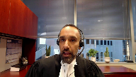

---
title: James Andrew Beaver v. His Majesty the King; Brian John Lambert v. His Majesty the King
published-title: Heard
date: 2022-02-14
sidebar: false
---

This transcript was made with automated artificial intelligence models and its accuracy has not been verified. Review the original webcast [here](https://scc-csc.ca/case-dossier/info/webcast-webdiffusion-eng.aspx?cas=39480).
---

**Justice Rowe** (00:00:01): The court, la cour.

**Justice Wagner** (00:00:07): Good morning to all.

::: {.column-margin}

:::

In the case of James Andrew Beaver against Her Majesty the Queen and between Brian John Lambert against Her Majesty the Queen.

For the appellant James Andrew Beaver, Sarah Rankin and Kelsey Sitar.

For the appellant Brian John Lambert, Jennifer Wooten and Michael Bates.

For the intervener, Canadian Civil Liberties Association, Samara Sector and Rekash Walters.

For the respondent Her Majesty the Queen, Rajbir Dhillon and Andrew Barge.

For the intervener, Attorney General of Ontario, Mabel Lai and Nicholas Haigh.

Ms. Rankin.

**Speaker 1** (00:01:03): Chief Justice, Justices, I appear with Kelsey Sitar for Mr. Beaver.

::: {.column-margin}

:::

I will address the voluntariness issue raised only by Mr. Beaver, and she in Council for Mr. Lambert will then address the Charter issues, common to both appeals.

On voluntariness, it is my submission that upholding the decisions below would effect a change in the law.

Since at least a ver, the law has been that a statement from a suspect is not voluntary unless the Crown establishes the Speaker made a free and meaningful choice to give that statement.

I'll make two points on this issue.

First, that voluntariness requires the Court to assess if the suspect has been given information alerting them to the jeopardy and investigative context that they are in.

The law says this by implication and this Court should state it clearly.

Second, that the approach of the trial judge here failed to identify this requirement or to assess it.

On the first point, the Confessions Rule applies any time police question a suspect.

It is broader than the right to silence and the other bundle of rights triggered by detention.

We know from the law a choice, a voluntary choice must be free and meaningful and that this is more than a negative inquiry.

A free choice clearly captures the factors there must be an absence of, but the positive content of a meaningful choice is less explicit in the law.

**Justice Kasirer** (00:02:33): Can I stop you there?

::: {.column-margin}

:::

The jump to meaningful choice, which is actually was a matter of debate earlier this year and another appeal, which I think your co-council might know about, comes from, as you say, from Hebert.

And I'm just wondering if you see that as just a different way of saying the Oichel test, or is that a change in the law from Oichel?

**Speaker 1** (00:03:06): I don't, I would submit it's not a change in the law, that it reflects free and meaningful, I think there's been a distinction throughout the case law between the fairness interest and the reliability interest, and I think that by the time the law reaches Sing, those two are connected and that the content of both free and meaningful is reflected throughout the case law and throughout the interest in fairness in particular.

::: {.column-margin}

:::

**Justice Kasirer** (00:03:36): Well, that may be the case.

::: {.column-margin}

:::

And certainly for many years, fairness has been a concern under the confessions rule.

But I'm asking you specifically if there's a shift away from the operating mind idea in Oichol.

Because you seem to be, sorry to cut you off, you seem to be sort of taking for granted that we've moved beyond Oichol when, as I say, at least my memory of it, that was a pretty hot topic of debate earlier this year.

**Speaker 1** (00:04:12): Yes, I would say a couple of things.

::: {.column-margin}

:::

The first is if we look at, to make sense of the operating mind requirement, meaningfulness I think is found in that case in Whittle, and the reason I say that is because to make sense of when the court says in Whittle that it is the, it is enough, all that is required is an operating mind.

I think that has to be seen in the context of what Mr. Whittle was asking for the test to become.

The evidence in Whittle was that he not only understood he was a suspect, understood he was in jeopardy, understood he was confessing, he sought the police out, understood the nature of the process, had prior criminal experience.

His complaint in that case was that it was not, his jeopardy was not a priority for him, the consequences were not a priority for him, and the trial judge in that case had considered that as a separate requirement and the court rejected that.

And so I suppose my submission is that prior to, that Oichel's not a change in the law because the sort of robust content of meaningfulness is by implication in the earlier cases and in particular in what was established in Whittle that led the court to say nothing more than this is required.

The foundation was quite robust already in his case.

**Justice Kasirer** (00:05:42): Okay, well, I'll let you get on with things, but and apologize for harping on this.

::: {.column-margin}

:::

We are agreed that in this appeal, Mr. Beaver was detained.

There's no debate as to whether Mr. Beaver was detained, whereas in Tessier, for example, a case you allude to in your argument, there was a debate as to whether Mr. Tessier was detained.

There was a strong argument that while he was in a police room and subject to questioning, that he was not detained, which would you agree that that's a distinction between our case today and Tessier?

**Speaker 1** (00:06:24): that it was debatable in Tessier whether or not he was detained?

I would agree with that.

I'll turn to the sources that I see.

**Justice Rowe** (00:06:39): Just a moment, pardon me.

::: {.column-margin}

:::

This court decided Patterson in 2017, so that's, I don't think it departed from Oichel, but it's a more recent statement from the court, which I understood to carry forward Oichel.

Are you asking us to depart from what we said in Patterson?

**Speaker 1** (00:07:00): I am not.

::: {.column-margin}

:::

My submission is that the foundation required to find Mr. Beaver's statement involuntary is in the law as it stands, and as it has already been stated, and that it is the trial approach in this case that was a departure from that law.

One of the sources that I see... Sorry.

**Justice Kasirer** (00:07:25): Sorry, I'm sorry.

Just to follow up on Justice Roe's question, your argument is, if I understand it, taking what you've just said this morning.

**Overlapping speakers** (00:07:35): Oh.

**Justice Kasirer** (00:07:36): on its face.

::: {.column-margin}

:::

Your argument is that the judge misapprehended the applicable law that wasn't in dispute, and thus it's a problem of misunderstanding the law and misapplying it, given that he did not understand it, but not so much that the law needs to move in order to accommodate his analysis of the facts.

Is that right?

**Speaker 1** (00:08:00): Yes, that's right.

::: {.column-margin}

:::

If a change, it would be to make explicit what is already contained, but that his error was to misunderstand and misapply the law as it already exists.

I think that the central question in Mr. Beaver's case, given he was detained, was whether when he became a suspect in the investigation, he was alerted to that by the conduct of the officers interacting with him, and the trial judge in my submission did not identify that as the essential question or answer it, and the Alberta Court of Appeal failed to review that error.

The confessions rule is broader than the rights on detention, but typically when a suspect is detained, that and the bundle of rights that are triggered will communicate the nature of the particular investigation and the state suspicion of them to them.

It's constitutionally required by section 10a, for example.

In this case, what's unusual is that none of that information existed to be communicated at the time he was detained.

The physical detention at the scene could not communicate the nature of the suspicion or the investigation because there wasn't one at that point.

He starts the interaction with the state as a detained, unsuspected person, and so the essential question was, when he became suspected, was that meaningfully communicated to him?

The court had to be satisfied.

He spoke to police, understanding he was now the target of individualized suspicion, and in my submission, the decision tells us that the trial judge failed to identify that question, and the clearest indication of that is that the trial judge did a voluntariness analysis for the portion of the interaction at the scene when there was absolutely no disagreement that Mr. Beaver was not a target of individualized suspicion.

The evidence was unequivocal.

There was a concern there was a concession by the Crown.

There was no basis to detain him.

He was viewed as a witness at that point, but the trial judge starts his voluntariness analysis by looking at whether that interaction at the scene was voluntary or not, and not only does he conduct a voluntariness analysis of that interaction, he finds the statement was voluntary by implication made with knowledge of his status and of the stakes, and in my submission, as the law, in the law as we know it, it was legally impossible to find an individual made a meaningful choice to speak with police, aware of the stakes, and in particular aware he's the individualized target of suspicion in a particular investigation when there were no stakes, and when officers had not even formed the view that there was a crime, let alone that the men were the target of a particular investigation into a crime, and the only way that that portion of the analysis makes sense to perform is if you have deleted the consideration of that awareness from the analysis entirely.

If you take the question on voluntariness to be solely freedom from interference, the absence of abuse or interference, and both the fact of this analysis and the result that the trial judge reaches tell us in my submission exactly the content of the test that he applied to the second portion of the statement when Detective Hossack becomes involved.

If you recall the introduction to that statement, the opening of it, that portion of the interaction is that Mr. Beaver is told nothing has changed, he's told Detective Hossack just knows they're investigating a death, she's just arrived and she doesn't know anything more, and the effect of all of that is to minimize the nature of the investigation but also to minimize Mr. Beaver as the target of an investigation and her as a participant in that investigation.

He is told that he's under arrest for murder, he reacts with surprise, and then is told what it means to be under arrest.

It just means that he can't leave, and in my submission that was not helpful information in communicating there had been a change in his circumstances that he was now a target, was now at risk, because based on his experience up to that point you can't leave if you're a witness either.

They put you in a locked police car and they take you to headquarters and then they put you in a locked interview room.

So it might in another context alert someone to the fact that they are now in jeopardy, but in his case the effect of the prior facts was that the fact of detention, the fact he can't leave doesn't, and can't communicate anything about the new status of jeopardy, and everything that Detective Hossack says following that actively lulls him into misunderstanding whether a change has happened.

He is literally told it is no different, this is just a new person, gonna read it again.

And none of this is evaluated by the trial judge in relation to the essential question that I say needed to be addressed in this case, which is was Mr. Beaver alerted to the change in his position as against the state, the change in the stakes of speaking, the change in the specificity of the interest in him.

The trial judge's treatment of the caution also tells us that he was not alert to that issue.

Singh tells us that the caution should come ideally when the suspect status crystallizes, and in my submission the reason for that is because it ensures the person understands the right to silence as an accused person, that the failure to speak can't be used as a weapon, and that the state is, so to speak, now looking for weapons.

The trial judge discounts the fact that there was no caution given by Detective Hossack, finds that the one given at the scene was enough, that was understood, and that tells us everything that the trial judge understood about what he thought needed to be established.

The caution given at the scene could not communicate the fact and nature of Mr. Beaver's jeopardy for the same reason that the detention couldn't, there wasn't any.

So whether it alerted him to the right to silence, and I would say the delivery by Constable Husband at the scene makes that debatable, even if so it was incapable of communicating to him as an accused person what the right to silence meant, and that the trial judge could only find that the scene caution was enough to communicate what the suspect needed to know if you don't give significance to the fact of him becoming a suspect, of him becoming the target of state interest.

**Justice Jamal** (00:14:48): Mr Rankin, what do you say to the objection that you're essentially asking for a re-weighing of all the criteria that go into voluntariness?

::: {.column-margin}

:::

You're really, because the trial judge did consider the oical factors, did consider the threat, the absence of threats or promises, the absence of oppression, etc.

And really you're just asking, so 93 and 94 of his reasons effectively consider all the factors and come to the conclusion he came to.

You're prioritizing one factor in the mix and essentially saying we should come to a different conclusion.

**Speaker 1** (00:15:27): Yes, so in my submission, the, it's not a situation where he identified the issue and considered the factors relevant to it.

::: {.column-margin}

:::

It was necessary but not sufficient that the Oichel factors be absent, but the relevant evidence, the context of that, he essentially takes the fact that the police said arrested for murder without examining the context around that, given what has happened up in that, up until that interaction.

And that combined with the fact that he begins the analysis looking at voluntariness in the context of a situation where it's beyond question that the statement could not have been even the target of a voluntary analysis, let alone found to be voluntary, that demonstrates there was a legal error in failing to identify that element of the test as opposed to consider the factors relevant to it.

And so this is a, it's an issue of law.

It's an issue of correctly identifying the test in my submission.

**Justice Rowe** (00:16:31): But if someone is told you're under arrest for murder, I mean, isn't it really obvious at that point that the questions that are going to be posed to you are going to be probing for the purpose of finding evidence relevant to the charge?

::: {.column-margin}

:::

**Speaker 1** (00:16:54): I think it's it would be capable in a different situation of communicating that if it were not for what had already happened and for the way that Detective Hossack answers the next question.

::: {.column-margin}

:::

She says you're under arrest for murder, he reacts with surprise.

What she communicates is that that means he can't leave and in his experience so far that is not a change.

It is not a clue that he is now the target of particular state interest because not being able to leave as far as he is aware is what happens to everyone who is being spoken to by police as witnesses.

It's what happened to him when he was when he had the status of a witness at the scene and so that combined with the repeated refrain of this is just a refresh, I'm new, we'll read it again, same as she did at the scene.

You know there's a reason that the caution is a irrelevant factor it's because it will often happen and communicate nature of the investigation, nature of the suspicion, and the fact of the right to silence and that'll be enough but the unusual unfolding of the events at the scene in this case mean that something else was required and that the context of active actively contributing to misunderstanding by Detective Hossack left him without being on alert to that change in circumstances.

**Justice Brown** (00:18:23): You actually, in a way, understate the case.

::: {.column-margin}

:::

I mean, it's true, Detective Hossack said it means you can't leave, but Detective Hossack went further, reassuring him that nothing had changed from the first time this information read to him, that the information was no different from what Constable Husband had read to him.

**Speaker 1** (00:18:43): Yes, that is exactly right, thank you Justice Brown.

::: {.column-margin}

:::

The, and from the outset, even before he's told, leading into the fact that he's under arrest, is told, he says they read it to me at the scene

and she says I'll read it again.

The whole tone of the interaction is that it is a continuous and similar approach and interest in him as what he has experienced up to that point, and so it was not enough to determine that he, there was not enough there to determine that he was aware that he was now the target of state interest or that that had been communicated to him in any meaningful way.

I would also say that this is evident in the trial judge's reliance on the fact that the initial statements are exculpatory and that the statement gets exculpatory later.

The law has not drawn a distinction between inculpatory or exculpatory statements in voluntariness for at least 50 years since Piché, and in my submission for good reason.

The law recognizes that a naive liar is at risk of harming their interests without knowing the risks.

Voluntariness does not require a speaker to be wise or to actually act in self-preservation, but it does require that the risk be communicated to them and that with that knowledge they make their decisions.

The trial judge says at one point in his analysis he spoke it was voluntary, and why would it not be?

Why would you give an exculpatory, why wouldn't you give an exculpatory statement?

And in my submission this court observed in Grant, paragraph 97 of Grant observes that a person who is detained without a lawyer may make statements based more on a misconceived idea than based on the truth.

Plaha also makes this observation that certainly a person who makes inculpatory statements may lead themselves into further interactions with the police, but a person who's already given exculpatory statements may also repeat that statement, mistakenly believing that it can't harm them.

And on its own the fact that Mr. Beaver gave the statement is neutral.

Inculpatory, exculpatory, that doesn't matter, it doesn't give us the voluntariness answer.

The fact he spoke is the reason that the voir dire is happening, and our commitment to an individual's will that we move about the world presumptively free from an obligation to provide information to police, to provide the contents of our mind, means we start the analysis from a position of skepticism.

The statement must be demonstrated voluntary in the full sense of that word.

**Justice Jamal** (00:21:22): Go ahead, Mr.

**Overlapping speakers** (00:21:24): Justice clear.

Go, you Justice Jamal.

**Justice Jamal** (00:21:26): follow you.

::: {.column-margin}

:::

What do you say though, I mean what you say in the abstract is obviously appealing, but really what happened here is the statement was made when he was showing the video clip from Mr Lambert, so there was no sort of misunderstanding about the nature of the jeopardy, it was that he was caught essentially dead to rights by virtue of the statement of his accomplice.

So that's really the context of this case, rather than somebody not understanding the scope of his jeopardy and having his will overborn, it was somebody holding up under questioning for a long, long time, being told you're under investigation for murder, and then being shown a video clip and saying okay, that's really the context here.

**Speaker 1** (00:22:15): Yes, I mean in my submission that is why the inculpatory-exculpatory distinction was done away with.

::: {.column-margin}

:::

The fact that information sort of trickles out through the course of the day where he's told by officers entering the room, his formality, you're a witness, all of that contributes to the circumstance where that ultimate information is provided.

And it was attacked at trial that the, you know, the evidence of Detective Hossack was that he was not really leaving that room no matter what.

And so I don't, I think I would suggest it's an error for the trial judge to separate out that part of the day and look solely at it without looking at the fact that 10 hours have gone by following an illegal detention before that information is revealed and that it's intimately tied back to what's happened during the course of the day and what's already been provided, which was the target of the Charter arguments at trial.

And I will at this point, subject to questions, turn the remainder of the time over to Ms. Sitar for that issue.

**Justice Kasirer** (00:23:18): I'll just if you'll you'll invite me to you invited me to last question I don't want to impinge upon your time

::: {.column-margin}

:::

but you said earlier you weren't looking for the law to change in respect of confessions

so so you wouldn't endorse if unless I'm mistaken the idea that there should be a positive obligation on the police to advise advise the person who's interrogated as as to what is at stake

**Speaker 1** (00:23:49): I would say that it is required that the information about the fact of individualized suspicion and the nature of the investigation is communicated, that a meaningful choice entails choosing to speak aware of the stakes, sort of writ large, that being that you are in jeopardy of some kind.

::: {.column-margin}

:::

And I'll turn it over to Ms. Sitar.

**Justice Wagner** (00:24:17): Thank you.

**Speaker 2** (00:24:19): Thank you Chief Justice, justices.

::: {.column-margin}

:::

In the appellant submission there are two key principles that must overarch the determination of the charter related grounds.

The first is that the purpose of 24-2 is to facilitate public confidence in the administration of justice by promoting adherence to the rule of law.

Second, to ensure that section 24-2 can accomplish those important goals, the gateway to access is generous and broad.

Contrary to these principles, the appellant's case stands for the proposition that police can insulate their own recklessly unconstitutional conduct from consideration under 24-2 so long as they eventually try to stop actively breaching an individual's charter rights.

The appellant submit that while police officers' efforts to stop a breach from continuing will be part of the totality of the circumstances that must be considered, those efforts cannot be treated as dispositive of the threshold inquiry.

Police should not be able to insulate earlier conduct from remedial consideration by later acting in accordance with their charter obligations.

If eventually constitutional conduct is enough to circumvent the impact of earlier breaches, there is no incentive for state actors to act carefully and lawfully in the first place.

**Justice Rowe** (00:25:43): This sounds to me like an argument for the fruit of the poison tree.

::: {.column-margin}

:::

Once you've taken the fruit of the poison tree, everything afterwards is irremediably tainted and there is no way back, right?

You can never make a fresh start, it seems to me, is what you're saying.

**Speaker 2** (00:26:07): It's the appellant submission just to throw that it's not that there could never be what what the law might properly consider a fresh start.

What our position is that fresh start, terms like curing a breach, they introduce confi

**Overlapping speakers** (00:26:25): fusion.

**Speaker 2** (00:26:25): and a risk of error for trial judges that is really what needs to be addressed, that the fact that police attempt to remedy a breach, depending on how they do that, may or may not be enough in the circumstances of a case.

::: {.column-margin}

:::

The concern with fresh start or curing a breach is that it suggests that just by doing the thing, the bare minimum thing you should have done in the first place, we get to hit a reset button on the entire interaction.

**Justice Brown** (00:26:56): Can I kind of, I want to make a suggestion to you as to what I think, at least the framework that I'm sort of looking at this, and I think it's what you're saying, but it's casting a slightly different spin on it, is look, in MAC, we didn't talk about fresh start, and MAC, what we talked about was whether there is the same transaction or the same course of conduct at work, and that is to be determined retrospectively by considering whether there is a temporal, a contextual, or a causal connection or some combination thereof, and that if we understand fresh start in that way, then I suppose in theory, there's nothing wrong with a fresh start, but it is, I think what you're getting at is it's unhelpful because it kind of puts the mindset more prospectively, that we're just making a clean break and what happened, what matters is what happens going forward.

::: {.column-margin}

:::

Is that a fair kind of spin on what you were saying?

Thank you for your time, and we'll see you next time.

**Speaker 2** (00:28:12): Thank you, Justice Brown.

::: {.column-margin}

:::

Yes, it is.

And to put a bit of a finer point on perhaps part of it, the risk of fresh start as a term in the appellant submission is really that it has a directly causal connotation.

So as has been indicated, we need to be looking at context, temporal connections, all of the available connections.

And so what it can do is lure a trial judge into a false sense of security, where really all it's diving into and considering is that causal piece.

And of course, this Court has said many times, you don't have to have a causal connection to have a remedy or to get through the threshold to 24-2.

**Overlapping speakers** (00:28:55): Oh, I'm sorry.

Go ahead, Justice Brown.

Oh, Mr. Brown, Justice Brown, go ahead.

**Justice Brown** (00:29:00): And is that what you say happened here?

**Speaker 2** (00:29:04): Yes, if we essentially what the appellants say is that this this terminology caused the judge to consider and put all of his attention on the police efforts and treat it in that sort of causal way and what it ended up doing is creating a false dichotomy between the arrest that was directed by Detective Vermette and the need to to broadly examine the totality of the circumstances the entire transaction.

::: {.column-margin}

:::

So instead of looking for those other connections in that entire transaction the trial judge's analysis was either or.

Either the arrest directed by Detective Vermette was lawful and then if it was that would render everything that happened before it no longer part of the same transaction and and that plays out at paragraphs 204 to through right to 215 in the trial judge's judgment but particularly in in sort of 203 to 209 and I'm certainly happy to uh to walk through that I believe there's a copy of the decision in the Lambert condensed book.

And the passage at issue begins at page 41 of that condensed book.

So the first thing we see when we look at the trial judge's reasonings is is a discussion of matchlenco and pinot and and these are are framed when we read carefully as as two options as this dichotomy so you can either have something be part of the same transaction pinot or you can have something that's a fresh start as the trial judge indicates occurred in matchlenco and I would just pause to note that of course in matchlenco the court still went on to consider temporal and contextual and and and so that analysis still happened.

And then if we move to paragraph 206 we see that there's this indication that the statements may be part of the same transaction or whether the arrests following detective Vermette's direction resulted in a fresh start such that charter breaches are cured so I appreciate the respondent points to this paragraph to indicate the analysis happened.

The appellants would point to this paragraph to say this is is a clear indication of this false dichotomy that's created.

**Justice Brown** (00:31:22): Well, even if we take it more generously and saying, well, it's kind of his encapsulation of the test, which he just cited in Mac, I guess the question is, does he really apply it in paragraphs 207, 208?

::: {.column-margin}

:::

Because those are the two paragraphs of analysis.

Those seem to me to be the key paragraphs that precede his conclusion of paragraph 209 that we do have a fresh start.

So let's take a look at the first paragraph of paragraph 209.

**Speaker 2** (00:31:48): Correct.

::: {.column-margin}

:::

And we see sort of in 207, essentially, that there was the words of arrest said and some words said by each of the involved officers.

And so that sort of checks the box.

He's already found, as he notes, I believe at 2011, I believe, he's already found that the arrest directed by Detective Romette was lawful.

So that's a finding that's already been made.

And then ultimately, that arrest is a cure.

It cures the breaches.

And in this sense, throughout 2008-2009, the trial judges treating cure is essentially summarily for a stoppage of the breach, a cessation of the breach.

So there's now been minimum charter compliance in the trial judge's view.

And that then means that it's no longer part of the same transaction.

It can't be.

And I think that's the analytical problem.

**Justice Karakatsanis** (00:32:45): So if I can just understand you in terms of your position on fresh start, it's not that you're saying that it never can be relevant.

::: {.column-margin}

:::

I think what you're saying is that it's not a helpful way to look at what obtained in a manner actually means because it does focus on causal connection.

So you're just asking us to look at obtained in a manner in the way it's always in the way we did so in MAC and in our other jurisprudence and suggesting that the term false start can be very unhelpful because it can take a trial judge in the wrong direction.

**Speaker 2** (00:33:26): I forgot your position, correct?

::: {.column-margin}

:::

That's precisely it.

Thank you, Justice Katsanis.

And essentially that yes, that police may take steps in a particular investigation that may result in a breach no longer being temporally causally or contextually connected to evidence that they ultimately obtain, or perhaps those connections are too remote or too tenuous.

But the appellant's position is that a trial judge still needs to do that analysis.

And that's where fresh start becomes difficult because there needs to be an analysis to find that none of those possible routes are available.

And in a case like the case today, the appellant submit that the police just didn't dispel the implications of those earlier violations.

That's the problem.

And particularly for Mr. Beaver, that's the problem.

And so A, it didn't happen, but B, even if it did, it's all part of the same course of conduct.

It's all a continuing series of events that have led to this individual being both available to be interviewed and being in a room being interviewed.

And so in those circumstances, that analysis needed to happen and it didn't happen.

The Alberta Court of Appeal does a little bit more consideration of this issue at paragraph 26 of its decision.

And does find that there was no causal connection and there was arguably no temporal connection, which-

**Justice Kasirer** (00:34:57): But Ms. Sitar, you really, just to go back to questions asked a moment ago by my colleagues Brown and Kara Katanis, you're not asking for the law to change here.

::: {.column-margin}

:::

You are acknowledging that charter compliant conduct could sever the temporal contextual and causal link between the early breach and the subsequently obtained evidence, which is where our jurisprudence stands.

You're waving a flag over fresh start as maybe a confounding turn of phrase, but it's not legally wrong, right?

Because it doesn't necessarily import a causal analysis, which this court has said in Witwer and other cases that's cited by the judge, which are not.

So you're really, this is, the law was misapplied here, right?

**Speaker 2** (00:35:56): Correct Justice Kessler, that's the that's the appellant's position in that this case provides an opportunity for this court both to provide some clarification which is really just re-emphasizing the obtained in a manner proper threshold and the appellants would encourage this court to disavow a fresh start as terminology not because it could never happen if it's legally and correctly understood but that because it can promote confusion and it can it poses a trap for trial judges that's just not necessary because really if if a judge goes through the proper obtained in a manner analysis and finds that there are no causal contextual or temporal links then the evidence was not obtained in a manner we already have a term for that and introducing fresh start is is just going to make it more potentially confusing for trial judges and i submit that it also assists law enforcement if they know this is what a judge is going to look at if they believe or they suspect that there's been some concern if they are looking at it in the proper way fresh start can also be misleading for them and thinking okay

::: {.column-margin}

:::

well if we do the things now that we should have done before then we're okay

and so i submit that it's it's more helpful to have it just a re-emphasis of what this court has has already said in many many decisions

**Justice Moldaver** (00:37:17): Oh, sorry. Go ahead.

Oh, you can go ahead, Mr. Justice Mulder.

No, no, you go ahead.

**Justice Côté** (00:37:17): Oh, sorry. Go ahead.

::: {.column-margin}

:::

Oh, you can go ahead, Mr. Justice Mulder.

No, no, you go ahead.

Okay, so I just have a question for you, Ms. Sitar.

It's more about the temporal link.

Let's say that in this case, when Detective Vermette realized that something went wrong, instead of giving instructions to arrest the suspects immediately, he would have given instructions to release them from their detention and arrest them in five hours.

Would this make a difference?

**Speaker 2** (00:37:54): I think that would be a fact that then goes into the overall analysis of what the circumstances are.

::: {.column-margin}

:::

And we certainly see Whitmore provides a good example where essentially but for a police officer eventually becoming perhaps a bit frustrated and referencing back to the earlier statement, we may have had no longer any connections between the earlier breaches in that statement.

And so I think there certainly are circumstances where you have a fresh investigator, you make it abundantly clear to this person.

And this court has alluded in past decisions, including RD, that that may well include and probably likely will include some indication of that the things that you said before aren't going to be usable or may not be usable.

You shouldn't be making any decisions right now on the basis of what's happened.

**Justice Moldaver** (00:38:45): Well, that's the old secondary caution.

::: {.column-margin}

:::

I don't know where that's gone these days, but presumably it wasn't given here.

But if I could just take one moment of your time to ask you what you think of your thoughts about the guidelines suggested by the AG Ontario and whether you support, endorse those or not, or some of them or none of them.

**Speaker 2** (00:39:10): It's the appellant's position that in order to keep the generous and broad approach we need for 24-2, it's best to keep these doors and considerations broad.

::: {.column-margin}

:::

The risk of entering rubrics and hard and fast rules is something that this court's talked about before in terms of it may serve to restrict access that shouldn't otherwise be restricted.

Having said that, certainly there's some factors set out that could potentially be of assistance to law enforcement in considering what steps they might take and interestingly, if they are applied on the facts of this case as the appellants did in their reply factum, this is not a fresh start in this case on even those considerations.

**Justice Moldaver** (00:39:58): I'm not suggesting that.

::: {.column-margin}

:::

What I'm getting at is would this be, in your view, helpful guidance?

The list that we get may not apply in all circumstances.

Some of the things may not apply at all.

The question is do you believe this would provide the police with helpful guidance in situations like this?

**Speaker 2** (00:40:20): If it is provided as guidance and suggestions, I think it could be helpful.

The fear is creating a different version of a rule that can become challenging at the trial level if you don't check all the boxes, for example.

**Justice Rowe** (00:40:35): But on the other hand, if you make Delphic pronouncements about causation and temporal connections and contextuality, and you never ever go beyond that, no one knows.

::: {.column-margin}

:::

No one has a roadmap.

And you only find out when you're in front of a judge what the answer is.

And I'm not sure that that's a service to anybody in the system.

**Justice Brown** (00:41:03): I have to say, I mean, the suggestions in paragraph 22 of the AGO's Factum, quite apart from whether the AGO is right to suggest that we throw temporality into contextual because, of course, you know, contextual, I suppose, can absorb everything.

::: {.column-margin}

:::

That's context.

But the bullet points, for example, whether new officers were assigned to the investigation, would that not be useful?

Would that not be sort of a useful bit of guidance for this court to pass along?

I certainly think it can be useful, yes.

Not determinative, but useful. Right.

**Speaker 2** (00:41:45): Precisely.

So that's just around precisely it.

I think it's not determinative, but certainly it provides some useful guidance in what things to consider.

**Justice Moldaver** (00:41:55): Nor would it be determinant of if they didn't change in some cases.

It just depends on what's going on and what's happened and what they're trying to cure shall we say. Right?

Correct Justice Maldivian.

For more UN videos visit www.un.org.uk

**Speaker 2** (00:42:08): and that's really the crux of the appellant's position here is that analysis has to happen.

There has to be that fulsome examination of everything that's gone on, and that's what's missing in this case.

**Justice Brown** (00:42:19): I mean, much like your response to the question about temporality, too, is, well, I guess, whether it's five hours or five minutes, what really matters is what went on in those five hours and five minutes.

**Speaker 2** (00:42:31): correct Justice Brown and it's the appellant's position that for for police um earning their way out of prior charter infringing conduct should be a bit of a challenge that should not be uh

::: {.column-margin}

:::

okay we checked the box of the thing we did before or we should have done and we're done um the sufficiency of their efforts should be assessed against the full context of the breach

that including the purposes of the underlying right that was infringed and looking for have all of the implications of those breaches been dispelled

**Justice Jamal** (00:43:01): You agreed with the AG's guidance, but I mean is it not plausible to say that the focus on what is a distinct investigative process might be too narrow, because investigations and police interactions morph from one process and one investigation to another within seconds, and has that been a separate investigative process?

::: {.column-margin}

:::

So I wonder whether it might be too narrow apart from the issue of temporality which Justice Brown raised.

Essentially what we're trying to do is, what's called guidance, is trying to perhaps exhaustively enumerate what sort of contextual considerations can inform the 2242 analysis, which is inherently indeterminate in terms of predicting all circumstances, which is why it's been stated in the broad terms, broad and generous in purpose of terms, that it has been.

**Speaker 2** (00:43:53): Yes, Justice Jamal, I would agree with all of that, yes.

::: {.column-margin}

:::

So in this case, through the trial judge's erroneous, a fresh start reasoning, the court insulated a significant pattern of breaches that began with Sergeant Lines' direction to detain the appellants under non-existent legislation.

Detective DiMarino testified he would never forget that information when it was later reported to him about the detention and the transport and the booking of the appellants.

It was the most ridiculous thing he'd ever heard as a homicide detective.

And Mr. Tan will provide some submissions regarding the RPG issue, but on behalf of Mr. Beaver, I submit that even if we assume that the arrests directed by Detective Vermette were lawful, and that in effecting it, Detective Hossack did everything right, that could not properly terminate the trial judge's inquiry in this case, given the factual matrix and the series of events.

But additionally problematic here is what Detective Hossack actually did and the appellant submits that she did nothing to actually dispel the implications of those earlier breaches.

Instead of correcting the unconstitutional conduct of others, she expressly linked her interaction back to what had occurred with Constable Husband on scene.

Nothing had changed.

She was just repeating it.

Being arrested just meant he couldn't leave, didn't mean it was gonna be charged.

And she gave those assurances knowing the extent of the earlier breaches, including that that prior chartering caution had been unsatisfactory, and with full knowledge that she was tasked with trying to address those concerns.

And rather than dispelling the implications, Detective Hossack perpetuated the imbalance of power between Mr. Beaver and the state.

And the appellant submission, that's the concern that a fresh start could be found in these circumstances demonstrates why the language is problematic, why there needs to be a refocus on the proper considerations for obtained in a manner.

At minimum, the facts of this case required consideration of 24-2.

It's certainly a case that should have gotten through the gateway.

And in the appellant submission, it should have resulted in the exclusion of the statements.

**Justice Wagner** (00:46:03): Thank you very much, Ms. Jennifer Rutten.

**Speaker 3** (00:46:10): Good morning.

::: {.column-margin}

:::

In listening to the submissions this morning, it's important to keep in context that individual rights and freedoms have constitutional protection by the Charter.

Police powers, investigatory tools do not.

The issues at hand in these appeals must be approached by a race rights-based focus and that's why the jurisprudence to date has provided the generous and purposive approach to both

**Speaker 4** (00:46:45): interpretation of the scope of rights and freedoms guaranteed under the Charter and to the accessibility to remedy under Section 24.2.

::: {.column-margin}

:::

Rights and freedoms have to functionally exist and not merely be on paper.

Rights must mean something and rights must mean something in order to maintain the rule of law and the public confidence in the administration of justice.

The errors in these cases arise from an exclusive focus on the police investigation and not on individual rights and freedoms.

The reasonable probable grounds issue involves focusing on whether or not the urgency created by two hours of breaches of the appellant's Charter rights and nearly every Charter right that can be engaged in an investigation, ignoring that and focusing on needing to have a practical solution to the problem in order for them, the police, to continue on as they had set out to do from the moment of the initial arbitrary detention.

The reasonable probable grounds assessment correctly done must assess and take into consideration the fact that the appellants were unlawfully and arbitrarily detained and must be in circumstances where it's objectively reasonable for the officer to take the position of arrest at that time.

Similarly, the errors in the courts below focus on a fresh start by simply engaging in lawful conduct, lawful conduct being found by the trial judge to be a lawful arrest and providing access to counsel.

There's a lack of consideration of the prior Charter infringing conduct that clearly established temporal, contextual and causal connections to the subsequent evidence.

Turning first to the issue of reasonable and probable grounds for arrest, it's important in this context to be reminded of the factual situation that Detective Vermette found himself in.

These are individuals where the trial judge himself finds and a 17-year experienced sergeant at the scene, Sergeant Lines, testified to not having subjective or objective grounds to believe that an offense had been committed or that the appellants were involved in the offense.

Rather, to maintain control, which is clearly contradictory to the legal principles in COCESH and the basic fundamental rights of every citizen in Canada, to be free from unwarranted state intrusion, he ordered their detention.

They were not merely detained at the scene, they were put in the back of police cruisers, they were transported from the scene to the interrogation centre.

En route, Mr. Lambert was asserting his right to counsel and Detective Taylor failed in his duty to hold off and elicited information from Mr. Lambert regarding what happened.

When arriving at the station, Constable Taylor advised Detective DeMarino, who was the detective who interrogated throughout both before and after the arrest for murder.

Constable Taylor tells Detective DeMarino what Mr. Lambert had told him and then Mr. Lambert continues his confinement and lack of access to the outside world.

He is searched, he is put in cells and then the interrogation starts.

The interrogation is interrupted briefly for the purposes of then affecting arrest and having access to counsel

and then it continues on.

That is the circumstances of this case where Detective DeMarino says that it's the most ridiculous thing that he's ever heard of, a detention under the Medical Examiners Act.

The concept in this case that the police officers, not only Sergeant Lines but then Constable Taylor and Constable Husband, that none of them knew or acted directly contrary to their knowledge that they had no basis to interfere with the appellant's liberties in this case.

**Justice Brown** (00:52:05): Mr. Shamal, you go first this time.

**Justice Jamal** (00:52:05): Mr. Chamal, you go first this time.

::: {.column-margin}

:::

What about the actual arrest, though, and referred to in paragraph 151 of the trial decision and at the direction of Detective Vermette and essentially the suspicious death, the motive and the opportunity and the information that the officers had at that point.

**Speaker 4** (00:52:30): Yes, the officers and, quite frankly, the trial judge treat this as if this was not in the context of the continued detention and so you have a circumstance here where Detective Vermette testifies that he had thought that these people were arrested and then within two minutes he says that he formulated reasonable probable grounds to arrest.

::: {.column-margin}

:::

Noteworthy, he makes absolutely no notes of the grounds for arrest, who he spoke to, what information he consulted.

What is problematic with the trial judge's analysis at paragraph 151 is that there's a lack of consideration to the evidence that pointed away from the reasonable probable grounds.

There's a failure to consider in the circumstances whether it was reasonable for Detective Vermette to not make inquiries with the sergeant as to why these people were not under arrest.

Effectively, Detective Vermette is insulated and deliberately insulating himself by not making those inquiries.

Here is something that happened that is the most ridiculous thing on the face of the earth.

Well, maybe we should find out why the police officers who were on scene and who had better access to information thought that there wasn't grounds to arrest and then when we look at the missing information and that's one of the reasons why in the condensed book of Mr. Lambert is attached the records that Detective Vermette says that he relies upon is because when you look at those records and then you look at his conclusions, it's evident that he is not giving any consideration to information that directly points away from the reasonable grounds.

In particular, I wish to direct this court's attention to tab seven.

And tab seven is Vordia exhibit number 12

and it's essentially a summary of the event chronology.

If we look at page 87 of the condensed book, the information contained in there includes, and I'm skipping, I'm not reading everything, I'm highlighting the parts that the appellant suggests points away from reasonable probable grounds that the complainant who he will know to be Mr. Lambert just got home to discover this.

No weapons seem to be found.

Complainant does not know what happened to male with blood.

Appears fell and hit his head.

And then there's a entry of August 2016 where Mr. the deceased was noted to require EMS assistance because he drank a floor cleaner.

There's male is stiff which then also goes to the timing which then links back to just got home.

And then there is a form 10 which relates to mental health concerns relating to the deceased.

And then at the more lengthy paragraph, it says that it looks, Jim said he, the victim looked like he fell and hit his head and that they both came home not even 10 minutes ago, five minutes ago, don't know what happened.

Pretty angry at us so just left him with the company.

**Justice Kasirer** (00:56:32): Can I stop just because I'm not entirely sure, I guess this picks up on Justice Jamal's question.

::: {.column-margin}

:::

I'm not entirely sure what exactly you're asking us to do because we have the voir dire testimony of detective Vermette.

We have the judge's evaluation of the points that he made that the police information management systems report established a connection between Mr. Bowers, who assaulted Lambert.

There was animosity perceived, there were roommates, there was signs of trauma, motive, and opportunity.

And are you now asking us, and this is my question, to review the finding of fact by the judge here?

Is that what you're asking us to do?

You're saying that there's a, because you're not, I haven't heard you say that there's an error of law.

It's you're asking us to find an error of fact.

Is that right?

**Speaker 4** (00:57:36): No, the error of law that the appellant asserts with respect to this is a failure to consider relevant factors to the issue of reasonable probable grounds.

::: {.column-margin}

:::

The law on reasonable and probable grounds says that you can't, as the police officer, assessing circumstances only look at stuff that points towards in support of your reasonable probable grounds.

The trial judge erred because he failed to assess the assertion and the evidence of Detective Vermette in connection with the law that requires the arresting officer to look at all of the information as well.

The appellant is asserting that it is an error of law in this circumstance not to consider the unreasonableness based on the failure to make reasonable inquiries.

Part of the reasonable and probable grounds assessment does not put an onus on a police officer to go and conduct a full investigation clearly.

However, under these circumstances where there becomes knowledge that the scene officers did not affect an arrest, that it is necessary in those circumstances to evaluate whether or not there's a failure to make reasonable inquiries.

And the failure to make reasonable inquiries as well as the failure to look at the information known to Detective Vermette that points away in conjunction with the failure to take notes which interferes with the ability of the court to properly review are the errors that the trial judge engaged in in his review of the grounds asserted by Vermette.

And you're not saying sorry to interrupt you.

**Justice Kasirer** (00:59:29): You're not saying there's a legal obligation to take notes though, you're not you're not going that far. Are you?

::: {.column-margin}

:::

Or perhaps you are.

You're not saying that the standard that one's used to seeing and cited here, that a common sense practical decision by the arresting officer based on information that they had at the time is wrong.

Are you saying that those two things were errors?

**Speaker 4** (00:59:57): The principles are not wrong in law, but what is required is an assessment of the objective reasonableness.

::: {.column-margin}

:::

And in a circumstance where the police are wanting to maintain control over somebody that has been in their detention unlawfully for the past two hours, in order for that to be objectively reasonable, the police officer needs to take notes in order to, the onus is on the officer or the state, the officer if applying for a warrant, the state on a voir dire to demonstrate reasonable probable grounds.

**Justice Moldaver** (01:00:41): though that you're asking at that point to for us to reassess the trial judge's finding of credibility because what you're really saying here if I understand it is is that officer Vermette this was just a ruse he realized they were in a big problem so he kind of just looked at this and gave it really didn't assess it properly and and came to the inevitable conclusion that he had grounds because he knew they were in trouble the trial judge went nowhere near that and and so that's number one and number two I'll just put this to you it seems to me you are suggesting that if there are potentially two plausible explanations as to one being criminal and the other being an accident or two possible explanations but the evidence in one set goes one way and it's plausible that motive opportunity and suspicious death can lead to reasonable grounds whereas another way of looking at it might lead to a different conclusion that there's no basis to arrest the officer has to make the call if there are two possible ways that this could have happened or plausible ways it will be an unlawful arrest if he goes if he makes the arrest that's what I'm hearing

::: {.column-margin}

:::

**Speaker 4** (01:02:10): I'm not being clear then because with respect to your last question it's not a matter of if there are two plausible options that then that doesn't equate to reasonable probable grounds.

::: {.column-margin}

:::

What the if it is that a police officer needs to consider the whole of the information before them and determine whether or not there's reasonable probable grounds then on the objective assessment and evaluation by the trial judge that has to also be a factor in the reasons for judgment that's not non-existent.

And with respect to the onus to keep notes it's in this circumstance where you have an individual who is being actively detained and you're wanting to execute a lawful arrest that should be to the police officer themselves and to a reviewing court not the same situation as evaluating somebody on the street

and so when the trial judge evaluates this and says oh there's a sense of urgency and how on earth could Detective Vermette be held to such a high standard

well it's exactly in this circumstance that both the police and a reviewing court must proceed in caution.

It's not just to presume that I have the same flexibility as a street officer.

The only urgency created in this circumstance is by the unlawful and charter infringing conduct.

**Justice Brown** (01:03:51): Ms. Rattan, I'm wondering if I can pull you back to Justice Moldaver's first question, because I'm having a bit of difficulty understanding your position too.

::: {.column-margin}

:::

And I'm wondering if maybe I'm missing something, because the way I see this point, right?

Detective Vermette has no notes, right?

There's nothing contemporaneous for all we know he could have been making this up post facto.

That goes not to what you're focusing on, which is the objective reasonable grounds, but whether he subjectively believed that he had grounds for arrest.

And what we can do at this level, I don't know.

Maybe there is something we can do, but what I'm interested in kind of focusing on or hearing from you are the grounds that he did have.

And I wonder if you could clarify something for me, recognizing, as you say, there were things that he may not have accounted for, but what he did have in front of him that he says he accounted for.

He had things that were already known to the prior officers, and they did not see it as forming the grounds necessary for arrest.

He says that he thought that Beaver and Lambert were both under arrest, which was not true, but I'm not sure how that's a ground for arrest.

But the one piece of information, as I understand it, the additional piece of information he has is the information from PIMS that shows a prior altercation between Lambert and the deceased.

Am I right about that?

Is that the sole piece of additional information that he has?

**Speaker 4** (01:05:36): Yes you are correct on that

::: {.column-margin}

:::

and I would say that that's even qualified because the scene investigators as demonstrated by the 911 call summary knew that there was prior animosity and so the this wasn't even a situation where the scene investigators didn't weren't alive to the fact that they were roommates and that there was some troubles earlier on in the week.

Sorry Ms. Rutan I think

**Justice Moldaver** (01:06:03): Just before you go on on that, I think Officer Vermette had something else.

::: {.column-margin}

:::

He had information from the medical officer saying that this was a suspicious death.

There was nothing, the constables on the scene didn't have that.

So I don't know how important it is, but I think in answer to Justice Brown, in fairness, you had to add that in.

**Speaker 4** (01:06:27): The reason that I don't consider that to be a new factor is if you look at the exhibits in the condensed book of Mr. Lambert.

**Justice Moldaver** (01:06:38): Second, I'm sorry, it's not whether you consider it to be, is it?

It's whether it was another factor that Bermette could look at.

You may say it's not enough, you may say it really doesn't add much, but there was another factor, was there not, that the police on scene did not have?

**Speaker 4** (01:06:57): that this was a suspicious death.

**Justice Martin** (01:07:00): And I'd like to ask you that question too in another way.

::: {.column-margin}

:::

I mean I think what Detective Remett says it was his impression it was a suspicious death

and I would like your help with some of the the evidence there because it seems to me that Detective Remett says that at 11 39 he has no grounds to arrest.

That's what he says in cross-examination from Ms. Sitar.

And he never gets precise about when he has information from the medical examiner.

All I can read from the evidence is that

at 12 40 which is subsequent to the arrest that they have a discussion with the medical person and that all that he has is a sudden death from the medical services but that he forms the impression because he was being called out as a homicide unit and that there was a looks like a homicide it was his impression that it was a suspicious death but that that is not directly traceable to anybody telling him that i.e. the medical examiner other than saying there's a man in a pool of blood and we would like the homicide unit to attend.

Do I read the record correctly on the suspicion point?

**Speaker 4** (01:08:36): That's correct.

::: {.column-margin}

:::

And when you go back to paragraph 151 of the trial judgment, it's expressed that in the first bullet point that he had an impression that Mr. Bauer's death was suspicious and that impression was based on the same information that the police officers at scene had.

And this is a circumstance where the grounds that are listed at 151 are insufficient on its face.

And when you're applying the analysis and the legal question being whether or not the evidence meets the reasonable probable grounds threshold, then that becomes the error of law with respect to that assessment.

**Justice Karakatsanis** (01:09:22): Just on that point, coming back to an earlier question, you are focusing on whether it was, there were objectively reasonable grounds for arrest as opposed to what subjective grounds the officer had.

**Speaker 4** (01:09:37): Yes, and if I could go back to Justice Moldaver's question, which addressed is the complaint really about Detective Vermette's credibility.

::: {.column-margin}

:::

The complaint isn't about Detective Vermette's credibility.

It's about the objective assessment of the reasonableness of what he considered what he did in the circumstances and whether or not the factors that he say formed his grounds were sufficient in law to establish reasonable probable grounds.

This is not a circumstance where we're saying that Detective Vermette did not, in his own mind, believe this.

But when you put it into the context, one of the important things for him is that he's a homicide investigator that was called out here and that he was running along presuming that these people were already under arrest for murder.

So it's not hard to understand why the subjective analysis, he was already there, because he was already there based on simply being called out in his role.

But when you assess the actual factors and you look at the factors at paragraph 151 that they are insufficient and that they're particularly insufficient when then you look to the other evidence that or information that the detective had or ought to have had by making the inquiries that were reasonably necessary at the time.

This is a circumstance where the So I was just getting an instruction from the registrar.

Just a moment, please.

This is a situation where the notes are not in the register.

This is a situation where the notes are relevant not to Detective Vermette's credibility, but to the ability for judicial oversight.

And one of the concepts in the Canadian jurisprudence that allows for intrusion on liberty by a warrantless arrest is that it's necessary to have an independent and rigorous judicial scrutiny.

And in these circumstances, and it may not be required for circumstances of different facts, but that in this situation, we need to have the benefit of the notes in order to perform the independent, rigorous judicial scrutiny.

Unless there are other questions with respect to the reasonable scrutiny of the individual, other questions with respect to the reasonable probable grounds issue, I wish to turn to the second ground of appeal, which is the error in failing to find that the evidence was obtained in a manner that infringed the Charter.

This is a circumstance

**Justice Brown** (01:13:08): Before you do that, Mr. Tan, and I realize you're counsel for Mr. Lambert, not Mr. Beaver, but did the PIMS report in any way refer to Mr. Beaver or implicate Mr. Beaver?

**Speaker 4** (01:13:22): The only way in which it did so was in saying Jim said and that there was then a search to see if Mr. Beaver had any record and or results from the police information system which was negative.

::: {.column-margin}

:::

So there's nothing that would positively bring any weight to a factor for his arrest.

**Overlapping speakers** (01:13:52): Okay, thank you.

**Speaker 4** (01:13:53): Thank you.

::: {.column-margin}

:::

You're welcome.

The discussion earlier really narrowed the true focus of this appeal with respect to the obtained in a manner analysis.

The appellant Lambert adopts the same position as the appellant Beaver in this circumstance.

This is an appeal that is arising because the trial judge failed to properly apply the law as it has existed and been supported by the Supreme Court of Canada repeatedly in its judgments.

There is no effort by the appellants in this case to change the law, rather it is an example of how the language of curing particularly can mislead a trial judge and distract a trial judge from what the true analysis that he or she must undertake is.

And when we look at what the trial judge did in this case is treated the concept of fresh start as being equating to cure.

And how do you cure?

Simply by complying with the requirements in the moment.

So looking prospectively, not retrospectively.

And by doing that analysis, he then fails to consider the past charter infringing conduct.

His analysis then is exclusively on the conduct of the police officers and if found to be lawful in that moment, then that cures, it's a fresh start and there's no access to 24 2.

It is that which the appellant is asking this court to reject.

And in rejecting that, it should be rejected this concept of curing.

That really any language of curing is distracting and leading to only emphasizing a potential causal connection and failing to embark in an assessment of the temporal contextual and causal connections which are the true analysis that must be engaged in.

It may be that in any factual circumstance, those connections are effectively severed such that the evidence is not obtained in a manner.

However, the trial judge in this case did not analyze those factors.

There is nothing and no ability for the Crown Respondents to point to where he made an assessment of the temporal connection, the contextual connection, and the causal connection.

And that's emphasized by the fact that those connections are evident on the evidence in this record.

You have a circumstance where...

**Justice Rowe** (01:17:23): I have to say that, I mean, the law is what it is.

::: {.column-margin}

:::

But I understand one can bring some clarity, specificity, you can ascertain time, therefore temporality.

Logically, one can assess whether there is a causal connection.

Did something give rise to something else?

Context is so obscure and so utterly elastic that it can mean anything you want.

And to the extent that one says, ah, well, it wasn't fully contextualized, can't you always say that?

Because unless you recount each and every event and somehow parse it out how it fits together, it's always possible to say, well, he's failed to take into account elements of the context.

**Speaker 4** (01:18:21): The contextual analysis, and just like the temporal and causal, relate to the connections.

::: {.column-margin}

:::

So any assessment of obtained in a manner has to be focused on the connections.

And when we look at contextual in a definition that is beyond what the common law has then created boundaries and guidance for, then yes, contextual can seem overwhelming.

However, when you look at the guidance from the common law and you look at that context is a factor establishing a link, then that concern is actually not there.

What the contextual component allows is for this analysis of that it was part of the same investigation process and that when we're looking at context in this case, it actually becomes quite important because the individual officers are the same.

So you have the officers that are unseen passing along office information to the interrogating officer, the interrogating officer being the same as the one who continues on with the interrogation afterwards.

There is that continuity of approach with minimizing the jeopardy in the questioning that exists both in the police approach before as well as after the arrest.

And that's the contextual environment where context can't be disregarded as being an important aspect of the obtained in a manner analysis.

You have the chain of events and the course of conduct that can link the charter infringing conduct with the subsequently obtained information.

**Justice Kasirer** (01:20:27): Ms. Rutten, just to Justice Roe's point, you wouldn't disagree that the judge stated the law correctly.

::: {.column-margin}

:::

In other words, that he didn't fall into a trap of saying this is a matter of causation, pure causation.

He cites paragraph 201, Manchulenco.

He cites PLAHA at 202 where contextual considerations are to the fore.

He cites Justice Fish in the Whitworth case, paragraph 21, where Justice Fish says it's not all about causation.

He goes on at 205 to say that one must be purposive and contextual.

So he didn't get the law wrong.

You're saying he applied it wrong.

**Speaker 4** (01:21:22): Yes, and he got the, he cited the right cases and he cited what those cases stand for.

::: {.column-margin}

:::

It's that then he concludes, and this is perhaps most evident at paragraph sorry, 203, or sorry, 204, where he's dealing with Manchilenko and Pino, and he says, arguably they're not in conflict.

Well, when properly assessing the law, they are not in conflict because Manchilenko is not suggesting that you get rid of the obtained in a manner assessment of contextual, temporal, and causal.

So absolutely they are not in conflict.

But then he says that they're dealing with different issues, and that's where he's in error.

Fresh Start is not a standalone proposition that takes the place of a temporal, contextual, and causal analysis.

And that's where the trial judge went wrong.

And then when you look at what his analysis is, and particularly at paragraphs 206 to 209, it becomes even more evident that he's treating this as two different analyses.

And that is abundantly clear when you have a circumstance like this, where the connections are evident and obvious.

And so the only way that that then does not become evidence that's obtained in a manner is if you find and apply the law incorrectly, that having a lawful arrest and providing access to counsel then means that you have a Fresh Start and you can go forward.

And that's where analytically the trial judge went awry.

When this court was asking questions with respect to the Attorney General of Ontario's position, and I wish to address that on behalf of Mr. Lambert, the Attorney General of Ontario's position, as I understand it, is suggesting a change in the law.

To that extent, the appellants object to that submission and encourage this court not to engage.

They propose to get rid of a temporal connection.

Again, the appellant asserts that the temporal connection is one of the most important connections, and that's demonstrated when you review the considerations of this court and many other trial and appellate courts throughout Canada.

That would be a good way to look at the broad and purposive approach that must be provided in the access, because, again, reminding ourselves this is merely a gateway.

This is merely opening the door into a fulsome grant analysis.

That when we look at that, having a temporal connection is where that's a true connection.

In the circumstances of the submissions of the Attorney General of Ontario, there's this suggestion that their proposition of getting rid of that and focusing on a specific investigative focus would assist in the trial courts.

The position is that it would make things more complicated.

One of the things that makes obtained in a manner not a live issue in most cases is precisely the temporal connection.

Having this concept of specific investigative focus is a nebulous concept, and it's difficult to define.

It also contrary to focusing on the state infringing conduct, and it again tends to focus a judge on state compliance conduct, which is not the purpose of the gateway analysis.

The position to change the test is objected to.

However, when you look at the list of considerations, and there's a list at paragraph 9, and then there's a list at paragraph 22, the appellant suggests that those are not helpful lists, and not helpful lists to engage in some different obtained in a manner analysis, but these are factors, evidence to look for in considering whether or not those connections exist in the factual circumstances of the given case before them.

So when we look at those factors, we can see that there's a lot of information that's not assigned to the investigation.

That was not the case here.

Detective DiMarino continued, and continued in the same format that he did prior to.

He minimized the change in jeopardy, and they were at the same location as the officer, and he was still armed with the information that he was provided by the officers who affected the unlawful detention.

So when the second aspect of that first point at paragraph 22 is whether they were firewalled from the previous investigators, well clearly that was not the case at all.

Whether the police informed the accused of the charter breach and explained the consequences, this is a concept that's advanced in the factum of the appellants, that in order to be able to meaningfully exercise the right to counsel, that the appellants in this case needed to be informed of their situation, and that they needed to be informed that they were under unlawful detention, and that they needed to be informed of that in order before obtaining legal advice.

That in this case where the trial judge treats the providing access to counsel as being charter compliant, the appellant Lambert asserts that even though he accessed counsel, that there was a missing informational component that was necessary in the circumstances, and so that that even is not charter compliant conduct.

The third point, whether the police provided the opportunity to speak with counsel about the breach and fresh start.

The fourth, if improperly detained, whether the accused was released, and this can become a hot topic in unlawful detentions.

What is the only option of the police to just let somebody go if at the time they know that they have grounds to arrest?

No, that's not the only option.

It is a option, but the other option is to affect the arrest and discontinue the course of the investigation that you started, and that was undergone in contravention of charter infringing conduct.

And so when we look at cases like Witwer, it informs this list and why it's not simply just doing what you could have done at first instance if there wasn't charter breaches.

There has to be additional requirements in order for the police to be able to then have the evidence that's obtained after not even subject to charter scrutiny.

And so again, it's important in this analysis not to unduly constrain the gateway because of a fear that that will then necessarily lead, equate to exclusion.

We still have the Folsom grant analysis that must be engaged, that must be engaged.

And by bringing in factors from the grant analysis to exclude the possibility of judicial consideration of whether or not the evidence would bring the administration of justice into disrepute is contrary to the fundamental purpose of the charter itself, which is to ensure that the public maintains confidence that the courts will uphold the rule of law.

The evidence in this case absolutely erodes that public confidence and the harm that is incurred by having this evidence admitted communicates to the public that liberty interests are meaningless.

Thank you very much.

**Justice Wagner** (01:31:16): Thank you, Ms. Rutan.

Um, Ms. Sector, please.

**Speaker 5** (01:31:22): Good morning, Chief Justices, justices.

::: {.column-margin}

:::

The obtained in a manner analysis is intended to encourage a thorough and meaningful consideration of charter breaches.

The CCLA intervenes to ask the court to keep the status quo.

Do not adjust the broad and propulsive approach in favor of a bright line a priori rule.

The fresh start principle is a distraction.

It's an unnecessary addition to a working analysis.

If charter compliance is an important part of the analysis, we can count on trial judges to appropriately fold that into consideration in their 24 two analysis.

We don't need to handcuff trial judges with a bright line rule.

And I identify three problems with the fresh start rule.

The first is that it takes judicial attention away from the breaches during the interaction with the defendant, and instead asks judges to look at compliance to focus on compliance.

So instead of looking for a common link, a fresh start analysis compels judges to focus on compliant conduct, the judge looks for curing instead of connection.

And this turns judicial attention away from the chain of events and tells judges only to see if there is a break in the chain.

And in doing so this redirects attention to charter compliance as opposed to violations.

And that's a backward way in my submission to look at 24 two.

The purpose of 24 two is not to reward charter compliance.

It's to maintain the reputation of the administration of justice.

And to maintain that reputation of the administration of justice trial judges should be examining links, whether they are contextual, temporal or causal between the evidence and the breach instead of focusing on breaks.

And so those are broad and elastic terms as Justice Roe pointed out, but that is a feature of the obtained in a manner analysis.

It's not a bug.

Second, the bright line rule prioritizes the question of whether the breach tainted the evidence combined with a fresh start analysis.

The question of whether the ended breach tainted the subsequent evidence revives the causation inquiry rejected in strong and Justice Doherty makes this point to the Court of Appeal in Plaha at paragraph 46.

So by focusing on taint, we're trying to show that the breach did not influence the accused.

But since strong the court has not required that kind of causation, that causal connection or influence between the breach and the evidence.

The court did away with that causal connection, because it may be impossible for judges to rule out taint or causation.

At paragraph 48 in strong, Justice Dixon said that the causal requirements like taint create an artificial task, because it will never be possible to say with certainty what would have taken place had a charter violation not occurred.

So the fresh start rule asks whether the police changed their behavior, so that the court cannot say the breach influenced or caused the discovery of the evidence.

But in doing so it narrows the connections, it removes a tool from trial judges analysis to see if there is any common link between the breach and the discovery of the evidence.

And third, the fresh start principle incentivizes unconstitutional conduct.

If law enforcement know that their colleagues can launder their breaches, they may take a constitutional gamble.

Police will be less vigilant about their early interactions with citizens if they know that their colleagues can later clean the slate with judicial approval.

And I know there were some questions about the Attorney General of Ontario's list at paragraph 22.

And I will say that the CCLA would take no issue with the first four considerations, but five and six the nature of the evidence is number five sought that is two case specific to provide further guidance to trial judges.

But more importantly, number six, this concept of a separate investigative process, and the overarching framework of a fresh start remains in that sixth bullet point.

And so the same problem persists with these kind of that bullet being guidance, and the fresh start principle writ large.

And so instead of endorsing the bright line fresh start rule, the court should keep the flexible obtained in a manner approach from Mac, there should be a broad access to what this court called in strong, the more important branch of section 24 to whether admin admission would bring the administration of justice into disrepute.

Thank you.

**Justice Wagner** (01:36:22): Thank you very much.

::: {.column-margin}

:::

The Court will take its morning break, 15 minutes.

Thank you.

The Court. La Cour.

Thank you very much, Mr. Dillon.

We can't hear you, Mr. Dillon.

You are on mute.

**Speaker 6** (01:36:57): Chief Justice, members of the court, the respondent will first address section 24-2, both the obtained in a manner question and the grant analysis.

::: {.column-margin}

:::

My colleague, Mr. Barg, will then address voluntariness and the reasonable grounds for arrest.

In dealing with the obtained in a manner question, on the threshold issue, you should dismiss this ground of appeal because the trial judge reasonably applied the correct test.

He applied the overarching test from Mac.

**Overlapping speakers** (01:37:44): Can you point me directly to where he applies it?

**Speaker 6** (01:37:46): Yes, I can.

::: {.column-margin}

:::

It is in his reasons, beginning at paragraph 192, and he completes it in paragraph 209.

His reasons have to be read in their entire

**Justice Brown** (01:38:17): Yeah, and I've read them in their entirety.

I'm wondering if you can direct me to precisely where he applies the test.

**Speaker 6** (01:38:26): Paragraph 205 of the reasons, he says, it's important for the court to examine the circumstances in which the evidence is collected, which of necessity deals with a purpose of and contextual analysis.

::: {.column-margin}

:::

But there still must be a connection between the breach and the evidence.

He then cites the test in Mac.

He then makes a point of underlining the sentence in Mac that says that evidence will be tainted if the breach and the discovery of the impugned evidence are part of the same transaction or course of conduct.

That phrase from Mac is the ultimate question in the obtained in the manner analysis.

He then goes on after setting out at paragraph 207 what he considers to be the important factors in his analysis.

He then concludes.

OK, well, what?

**Justice Brown** (01:39:31): Before I sort of interrupt, I wanted to know where he applied the test, and I agree with you, he cites the test, cites it correctly, appears to understand the correct elements of it.

Where does he actually apply it?

**Speaker 6** (01:39:47): Well, his application of it, Justice Brown, as I said, comes in the entirety of his analysis and he sums it up in Paragraph 209.

**Justice Brown** (01:39:57): the entirety of the analysis, can you point me to part of it, just a little part where he is applying the test that he has cited in 205 and 206?

Yes, I can.

**Speaker 6** (01:40:07): In paragraph 209, he says that the arrests constituted a fresh start and thus the...

**Justice Brown** (01:40:15): But that's a conclusion.

That's not an application of the test.

Where does he...

**Overlapping speakers** (01:40:21): You

**Justice Brown** (01:40:21): I mean, where does he explain why it is a fresh start?

**Speaker 6** (01:40:31): Trial judge goes through the entire analysis of what a fresh start means.

**Overlapping speakers** (01:40:36): I understand your question.

**Speaker 6** (01:40:37): where? Where?

::: {.column-margin}

:::

When he goes through the Manchilanko test case, and the penal case, and ultimately Mac, he then when he's using the term fresh start, he's using it as a shorthand expression for saying, I have found that in the entire circumstances, there is no connection between the breach and the evidence.

There's no temporal connection, contextual connection.

Where does he say that?

I agree he doesn't use that phrase.

**Justice Brown** (01:41:13): Where, okay, I don't know how to make this plainer.

Where does he apply the test that he cites in 205 and 206?

**Speaker 6** (01:41:25): There is no one paragraph or sentence I can point you to to say that he did that.

And I concede that.

I'm not disagreeing with you on that point.

So what we have is the

**Justice Brown** (01:41:38): test, we have its history, we have the test, and we have a conclusion.

And we have nothing else to permit appellate review.

**Speaker 6** (01:41:49): No, what you have are his factual findings.

::: {.column-margin}

:::

He finds that when the appellants were arrested for murder, they knew exactly what they were being arrested for.

He finds that they had the right to counsel provided to them after their arrest.

He finds that they knew they had the right to silence after the arrest, that Mr. Lambert was explicitly told that.

Mr. Beaver knew that he had the right to silence, and we have him saying that for many hours after the arrest.

The appellants continued to provide the same information they provided before the breach.

**Justice Brown** (01:42:30): Where does he examine the prior breaches to see if there was the required connection between the breach and the subsequent statement?

::: {.column-margin}

:::

That's the language that is used in MACK, the connection between the breach and the subsequent statement.

Where is there any consideration of that?

You're right.

He goes on to what happened prospectively.

He doesn't, except for one point.

He doesn't look retrospectively, and that one point is about the one point that they did right, which is they cautioned Mr. Beaver, which in fact would tend to suggest a connection rather than to undermine it.

Where does he look at the breaches, which is precisely how you apply a significant part of the application of the MACK test.

**Speaker 6** (01:43:23): Well, as I said, Justice Brown, I can't point you to one specific thing, but what I'm saying is that it's implicit when he's saying that there's a fresh start and that the evidence wasn't obtained in that manner.

::: {.column-margin}

:::

He's saying that I find there is no temporal, causal, or contextual connection between the breach and the evidence.

**Justice Brown** (01:43:43): evidence.

::: {.column-margin}

:::

I think it's more I think to the extent he engages in any analysis it suggests that he assumes notwithstanding having cited the test he assumed that the state the slate was wiped clean but he doesn't even consider what was on the slate.

**Speaker 6** (01:44:06): Well, I understand your point, Justice Brown, but in the entirety of the judge's recitation of the law, he's constantly reminding himself that he needs to look at the entire circumstances.

::: {.column-margin}

:::

Three times in his analysis, he sets out that the connection can be contextual, causal, or temporal, or a combination of the three.

He makes a point when he's discussing the Manchelenko test to actually underline that passage in Manchelenko.

Then when he's referring to Mac, he makes a point of underlining the fact that really what this all resolves to is whether or not the breach and the evidence are part of the same transaction.

He then talks about the intervening acts of the police and what follows from them.

And then he says, I find there was a fresh start such that the evidence wasn't tainted by what happened earlier.

And implicit in that is his finding that it's not one transaction.

**Justice Brown** (01:45:18): Well, he makes that finding explicit at paragraph 209.

::: {.column-margin}

:::

My objection is that he goes from the test to the conclusion without really what he had to do was analysis.

I'm sorry, underlining the right part of a passage or the critical part of a passage is not a substitute for an analysis.

I'm sorry, underlining the right part of a passage or the critical part of a passage

**Overlapping speakers** (01:45:39): I take your point, Justice Brown, I don't think I can say anything more.

**Justice Brown** (01:45:43): I think we've beat the horse dead, so I'll let you go on.

**Speaker 6** (01:45:48): Right?

::: {.column-margin}

:::

So there's no disagreement between the parties about whether or not fresh start is a standalone principle of law.

Both parties say that it's not.

And just to make our position entirely clear, we say it simply folds in with the obtained in a manner analysis.

By necessity, a judge has to look at the whole relationship between the whole contact between the police and the appellants in deciding whether or not the evidence was obtained in a manner.

And that's going to, by necessity, consider what the police did wrong, but also what, if anything, the police did right.

Now, in some cases, a judge will find, you know, I appreciate the fact that the police, you know, had this intervening act and they tried to correct their errors, but it just didn't amount to enough of a correction to say that there is insufficient connection between the breach and the

**Overlapping speakers** (01:46:48): the evidence.

**Speaker 6** (01:46:48): And if a judge says that, fair enough, that's that's a that's a finding.

**Overlapping speakers** (01:46:53): FAP

**Speaker 6** (01:46:53): Thank you very much, Dr.

**Justice Karakatsanis** (01:46:54): So what can I ask you then, because I just want to make sure I have your position on the use of fresh start clear.

::: {.column-margin}

:::

If I understand you, what you're saying is that a trial judge's use of fresh start or that kind of a principle doesn't necessarily mean that the analysis is wrong.

But would you agree that it is not necessarily a helpful way of looking at the obtained in a manner and that it it can be, it can import considerations that actually do not line up with the test.

So putting aside the fact that the use of those words doesn't necessarily mean an error, would you agree that it's not a helpful addition to the test?

**Speaker 6** (01:47:41): I think that you're correct, that the term itself may not be helpful.

::: {.column-margin}

:::

I think the concept underlining it is helpful.

And when judges or any human thinks about a concept, they have to give words to their thoughts.

And the fresh start, that term, is simply a shorthand for expressing the idea, well, I need to look at the entire chain of events.

**Overlapping speakers** (01:48:08): Right.

**Justice Karakatsanis** (01:48:08): to see if there was an intervening act.

But the idea is already there.

The idea is already there in our jurisprudence in looking at the entire connection.

**Speaker 6** (01:48:19): Yeah, and if the term fresh start does lead the court or a reasonable observer to think that there's only a causal connection required or that it's a whitewashing of the police's conduct, then clearly the term is not helpful.

::: {.column-margin}

:::

That being said, in this case, I don't think the judge should be criticized for using it because he's using it in the same way that Justice Fish used it in Witwer and the way that Justice Watt used it in the Manchelenko case to say that fresh start is just a shorthand for looking at the entire chain of events.

But if there's a worry that in future cases a judge may not realize that the fresh start term is just a shorthand for reminding yourself to look at the entire chain, then I agree it's not a helpful term and perhaps a dangerous one.

**Justice Martin** (01:49:21): And can we go even a little bit further, which is to say that the cases like Whitware or RD that talk about fresh start.

::: {.column-margin}

:::

They talk about it in a way, but they don't say that there was a fresh start on the facts that allowed a particular legal conclusion to be reached.

It was used as that kind of expression to say, but it wasn't actually part of the ratio or the decision in the case.

**Speaker 6** (01:49:49): I agree with that 100%.

The issue of the fresh start has never been before this court as clearly as this case.

**Justice Jamal** (01:50:01): Mr Dhillon, perhaps another way of building on what Justice Martin just said, fresh start's really a conclusion rather than a reason and as you put it, it's a cluster, a shorthand as a cluster of factors that may indicate a tenuousness or a remoteness of the connection or an indication where there is no, it's not part of the same transaction or it's not causally related or a combination of all those things.

::: {.column-margin}

:::

So it's really, as you said, a shorthand or a cluster of ideas that don't provide reasons but that are a form of conclusion at the end of the day.

But we're still back at the end of the day and it's something that's done in the analysis of, obtained in a manner rather than as a threshold consideration for the threshold condition.

I mean it's done as part of the analysis, not in advance of the analysis.

**Speaker 6** (01:50:52): Absolutely, it's not a substitute for the analysis in any way.

**Justice Brown** (01:51:02): So the analysis, the analysis is quite important that I can't just write it, you know, consign it all to fresh start.

**Speaker 6** (01:51:11): A judge's analysis is important, it's critical, and a judge's reason should be read in their entirety when deciding what the judge's analysis is.

::: {.column-margin}

:::

Now, let's put aside the issue of a fresh start and the use of that term and just deal with the phrase of pain in a manner and ask whether or not the evidence, which are the confessions, and the breach are part of the same transaction.

Now, the appellants are arrested for murder at about 12.30 in the afternoon, given their rights to counsel.

They're both interviewed for about 12 hours.

Mr. Beaver is interviewed for about 13 hours, Mr. Lambert for about 12, or over a period of time.

Towards the end of Mr. Lambert's interview, he begins to make inculpatory statements.

The police then take that to Mr. Beaver, and in between the 12th and 13th hour after his arrest for murder, he begins to adopt inculpatory statements.

So by the time they make their confessions, about 12 hours have passed since they're arrested for murder and provided with their right to counsel.

And during that time, for most of the time, the appellants are simply providing the same information to the police, to the interviewers, that they provided in the 911 call, that they provided to the attending officers at the scene, and that they provided to the officers when they were detained unlawfully.

So in asking whether there is a temporal connection, there is a significant passage of time.

And by the way, I should say that Mr. Lambert says that it was obvious in this case that there was a connection between the breach and the confessions.

When we say that the trial judge was right in finding no connection, we're not saying this was an obvious case, and we disagree with the appellants that this is an obvious case.

This was a difficult case to decide whether the evidence was obtained in a manner.

And deciding whether the evidence was obtained in a manner is governed by the facts.

So there is that 12-hour gap.

And we say, based on that, it was reasonable to find that there is no temporal connection.

We also say that it's reasonable that there was no causal connection.

Remember that there's no actual tainted evidence in this case.

The investigation is tainted.

There's no question about that.

But when the police detain the appellants unlawfully, they don't gather any evidence from the appellants as a result of that.

And when they're interviewing the appellants later on at the police station, they're not referring back to what happened earlier and throwing evidence in the appellant's face.

So we say it's reasonable to find that there is no causal connection.

Then in terms of whether or not there was a contextual connection, again, there is no evidence collected at the time of the breach.

There's no evidence collected from the appellants up to the point that they're arrested.

In fact, there's no real evidence collected from them that we're dealing with until many hours later.

They're provided with their rights to counsel after they're told they're being arrested for murder.

In that circumstance, we say that it's reasonable to find that there was no contextual connection.

Now, had the facts been different, had the police obtained something at the scene and then confronted the appellants with it during the interview, that would have resulted in a different analysis and maybe a different conclusion on the threshold question.

And even on these facts, maybe a different judge would have come to a different conclusion.

The only issue on appeal is whether the trial judge is finding was a reasonable one.

And for the reasons that I've outlined, we say it was a reasonable conclusion for the judge to draw, when it's not a reasonable conclusion.

**Justice Jamal** (01:55:51): But is it fair, Mr. Dhillon, to draw a distinction between Mr. Beaver and Mr. Lambert in respect to the obtained in a manner?

::: {.column-margin}

:::

Because in Mr. Beaver's case, the detective Hossack said it's no different to what Constable Husband read to you.

And of course, Constable Husband said I'm investigatively detaining you for whatever was going on in there.

So at least in Mr. Beaver's case, it seems to me that there is a stronger argument that the evidence was obtained in a manner, arguably not so much in Mr. Lambert's case.

But is that fair to draw that distinction?

**Speaker 6** (01:56:30): Yeah, I take your point that there is that subtle distinction, and my colleague, Mr. Bargh, will talk about this in more detail.

::: {.column-margin}

:::

But I would also say, Justice Jamal, that the trial judge makes a finding of a fact that, despite that language used by Detective Haasek, that Mr. Beaver knew he had the right to silence and knew why the police were interviewing him.

So ultimately, the question isn't whether there is a distinction between the two, but whether the judge is not finding a distinction between the two evinces some type of palpable and overriding error.

And we submit that his factual conclusion was reasonable, that Mr. Beaver knew he was arrested for murder and knew he had the right to silence and knew he had the right to counsel.

And those are the three chief factors which are of more importance than Detective Haasek saying, well, what I'm going to read to you is similar to what was read to you earlier.

I mean, essentially, the charter that she's reading to him is no different than the charter that was read to him earlier.

Different context, but he had just been told now by Detective Haasek that he's being arrested for murder.

Clearly, he knows that because he says, you know, I'm under arrest, and she clarifies with him that that's correct.

He's under arrest for murder.

**Justice Kasirer** (01:58:24): Mr. Dillon, the Court of Appeal recognizes this distinction in part anyway at paragraph four of its reasons, mentioning that when Beaver was arrested, the police did not reread him, the police caution.

::: {.column-margin}

:::

It goes on though to say that the officers who arrested both appellants arguably gave mixed signals about the seriousness of the jeopardy they face.

I'm wondering if there was a kind of a lingering taint from the investigation earlier that continued its work and that it seems to be acknowledged here by the Court of Appeal.

What are your thoughts there?

**Speaker 6** (01:59:10): Um, there, there may in fact have been a, uh, let me answer it this way.

::: {.column-margin}

:::

It's possible to say there may have been a lingering taint.

That's why we say this isn't an obvious case of there being no, uh, no connection.

But the court of appeal also recognized, um, in, in the decision that the trial judge found that despite that mixed signal, Mr. Beaver knew exactly why he was being interviewed.

And so ultimately the court of appeal, although they acknowledge that difference, it's a factual difference, but they agreed with the, with the trial judge and they agree that overall it didn't make a difference because the trial judge's finding was reasonable that Mr. Beaver, despite that, knew why he was there.

**Justice Brown** (02:00:09): But was that the gravamen of the problem that Mr. Beaver didn't know what he was arrested for?

::: {.column-margin}

:::

You're right, he's told why he's arrested for, but it's the downplaying of the peril in which that places him that I think was the gravamen of the problem being suggested by the court of appeal here, that he really did not understand the seriousness of the situation, which can always, of course, be cured with, well, I hesitate to use the word cured, but can be addressed with consulting counsel.

But it's undermined here by the kind of the weird posture taken by the police to downplaying the seriousness of this.

**Speaker 6** (02:01:03): Well, I take your point, but I would point you to paragraph 24 of the Court of Appeals reasons, where they give their summary of how this issue actually resolved, and they're finding that at the end of the day, the trial judge's conclusion, despite that mixed signal or weird tactic, that Mr. Beaver knew exactly what was going on. And

::: {.column-margin}

:::

**Justice Martin** (02:01:32): Can I ask you how we can come to that conclusion so firmly?

::: {.column-margin}

:::

Because Mr. Beaver in the discussion with the detective says, I don't, probably I should have a lawyer, but also goes on, I'm not understanding the severity of it.

That to me in combination with the downplaying of the purpose of the caution and the drawing a parallel between the detention and the arrest, it seems to me that Mr. Beaver is evincing exactly the confusion that maybe should have more of more significance, I don't know.

So how do you address his specific remarks?

**Speaker 6** (02:02:20): So I have a two-part answer to that.

::: {.column-margin}

:::

So the first is that I understand your concern, but again, I go back to what has been said earlier, that maybe another trial judge would have found that that was a sufficient connection.

But the issue was just whether or not it was reasonable.

And the trial judge, just on the plain language used towards Mr. Lambert, I mean, you tell someone they're arrested for murder, it should bring it home to anyone that it's serious.

You tell someone that they have the right to counsel after they're being arrested for murder.

You bring them into an interview room.

You tell them that it's being videotaped and audio taped.

As the interview progresses, the police officer begins to tell the appellant, look, I don't believe what you're saying.

**Overlapping speakers** (02:03:19): saying.

**Speaker 6** (02:03:19): All of that brought, it's reasonable to find that all of that brought home to Mr. Beaver what was happening and that he didn't have any confusion.

::: {.column-margin}

:::

And the second part of the answer is that, you know, the judge only has the evidence that's called in the voir dire to go on.

There's no evidence from Mr. Beaver that he, he was confused by what happened.

**Justice Karakatsanis** (02:03:50): Can I ask you this?

::: {.column-margin}

:::

This is what I'm having trouble with.

You're quite rightly saying we should be, an appellate court needs to be deferential to findings of fact of a trial judge.

My difficulty here is we have a conclusion that's stated in this decision and we don't have an analysis that draws on the facts and instead what we have immediately before the conclusion is a statement that the real issue for the court is whether their arrests following Detective Vermette's direction resulted in a fresh start such that the charter breaches were cured.

Given the difficulties with that as the test that the trial judge says is the issue before them and then the conclusion, what kind of deference?

Isn't there isn't the real issue that the without any kind of analysis the the court can't have confidence that in fact he's applied the proper test and to findings of fact which I mean it's it's hard to think of deference when it's not clear what the analysis was and what the indication is that in fact the wrong legal test may well have been applied.

**Speaker 6** (02:05:12): And I take your point entirely, Justice Garakatsanis, but I temper it with saying that the first quote that you read where the judge kind of sets out this dichotomy, was it a fresh start or was the evidence obtained in a manner?

::: {.column-margin}

:::

What follows after that is his entire setting out of the development of this idea that intervening acts of the police can result in the connection being broken.

And then he concludes by finding that based on the arrest, the provision of counsel, they knew of the right to silence, they just continued in their denials for hours, that it's not part of the same transaction.

**Justice Karakatsanis** (02:05:55): But the only difficulty is when he comes back to his conclusion in 2009, he still uses the words this, you know, constituted a fresh start and the statements were not tainted.

::: {.column-margin}

:::

And I guess that's the difficulty that I'm having.

And I guess that's the issue between the parties here.

**Speaker 6** (02:06:14): Yeah, and so I'll give you my last-ditch attempt to persuade you, Justice Derek Gatsanis.

::: {.column-margin}

:::

If he hadn't gone through that full development of the law, and he had just said, well, I understand there are some cases that talk about there being a fresh start based upon an intervening act.

If he hadn't actually explained that what that means is, you have to look at whether that intervening act severs the connection.

You have to look at how that remedial action affects the contextual, temporal, and causal analysis.

And I would agree with what you're saying.

But it's because he sets out that entire development of the law that when he uses those terms in his conclusion, it's just a shorthand way of explaining that he doesn't find that this is part of the same transaction. Can I?

I guess.

**Justice Karakatsanis** (02:07:12): Sorry, just to wrap that up, I guess what you're saying would make sense if we also accept that 12 hours in continuous custody is not a temporal or contextual analysis and that somehow, unless there was evidence discovered and put to them, there's no connection.

::: {.column-margin}

:::

So if we don't, I think you have to accept both to get where you are.

**Speaker 6** (02:07:37): Yeah and I'm not saying that there only would have been a connection if there had been evidence discovered at this scene.

::: {.column-margin}

:::

I'm acknowledging that this is a difficult case.

I'm just setting that out as possibly one thing that could have changed the analysis.

I'm also acknowledging that a judge on these facts may have come to a different conclusion about the threshold and that there may have been a connection.

I'm just setting that out as possibly one thing that could have changed the analysis.

I'm also acknowledging that a judge on these facts may have come to a different conclusion about the threshold and that there may have come to a different conclusion about the threshold and that there may have been a connection.

I'm just setting that out as possibly one thing that could have changed the analysis.

I'm also acknowledging that a judge on these facts

**Overlapping speakers** (02:08:08): I guess

**Justice Kasirer** (02:08:09): Can I ask, not to flog a dag of horse, but just to ask it a different point, because there is an oddity that you can perhaps explain to me that how can one rely on the pre-arrest right to silence under the improper detention to satisfy the later charter obligation on the one hand, and then argue that there's no contextual nexus between the two on the other?

::: {.column-margin}

:::

How does that work?

**Speaker 6** (02:08:41): Well, even in my colleague, Mr. Barg will talk about this also in his voluntary analysis.

::: {.column-margin}

:::

But even in Singh, this court didn't say that a caution is determinative of whether or not a statement is voluntarily given.

So do the police have to provide the caution more than once?

I mean, he's told at the scene, you don't have to speak to the police.

It's not said to him again, but the judge finds that he knew he didn't have to speak to the police.

**Justice Kasirer** (02:09:25): No, I understand, I mis-expressed myself perhaps.

::: {.column-margin}

:::

I realize that your colleague is going to speak to the law on this, but my point is we're looking, you're arguing about whether or not there's a contextual nexus, and I understand your severance argument, and I'm just noting that oddly the judge actually does reach back to the improper detention to satisfy the later charter obligation on the right to silence.

So in other words, he does reach back across this now severed link.

**Speaker 6** (02:10:06): He does reach back, but he's not just relying on Mr. Beaver being told he didn't have to say anything before the arrest.

::: {.column-margin}

:::

He's also finding, based on the entire circumstances, that Mr. Beaver wants to speak to the police.

He wants to give his exculpatory version, and at every stage, he's continuing to provide this exculpatory version.

**Justice Brown** (02:10:37): question it why would he reach back to something between which the connection has been severed if the connection is indeed severed as he says why is that relevant i mean does it not suggest that in fact there is a connection that he's not exploring as he should

::: {.column-margin}

:::

**Speaker 6** (02:10:58): Well, he's reaching a two-part answer to your question.

::: {.column-margin}

:::

So he's reaching back to something that the police got cracked.

They properly told Mr. Beaver that he didn't have to speak to the police.

But in terms of this concept of reaching back, remember that all the cases say that in deciding whether there is a sufficient connection between the breach and the evidence.

The judge has to look at all of the evidence to determine. Indeed.

So it's permissible when he's making this overall conclusion about whether or not there is a sufficient connection.

**Overlapping speakers** (02:11:49): Thanks for watching!

**Speaker 6** (02:11:49): that he takes the entire circumstances into account what happened before and what happened after and remember that.

**Justice Brown** (02:11:58): and he's only taking the good thing and saying that still has an enduring effect after this supposed severance.

::: {.column-margin}

:::

He doesn't even look at the breaches, but the implicit suggestion we're supposed to gather is

that those, their impact, unlike the caution, magically ceased at the point of the arrest and the caution.

**Speaker 6** (02:12:23): I don't think he went so far as to say that something magically happened at the time of arrest.

::: {.column-margin}

:::

He's just looking at the entire circumstances and he has the authority to decide how much weight he's going to place on certain pieces of evidence and certain factors in deciding whether there is a connection.

**Justice Brown** (02:12:42): but do you see the point?

He says there's no connection between what came before and what came after.

However, I'm gonna reach back and pick out the one thing that they did well and say that that has a subsisting effect.

Nothing else does.

**Speaker 6** (02:12:54): I take your point, but he's not reaching back in the way that you put it.

::: {.column-margin}

:::

Remember, there's no evidence collected at the time of the breach.

So it's not as if there's some tainted evidence.

Now he's going to reach back to something that happened at the time the evidence was tainted.

And he's going to use this this fresh start or some other factor.

He's going to cleanse that evidence and just whitewash it.

**Justice Martin** (02:13:25): But isn't that where Ms. Rankin makes a compelling point which says that normally if you charge someone with murder you could make all those reasonable assessments that you you've put forward to us.

::: {.column-margin}

:::

But if you reach back in this case based on the unlawful detentions and what we're told at the time the context here is different.

The informational context is very different.

So it might not register in the same way because there's a consistency between the breach that happened before and what he says the fresh start is.

So could you address that please?

**Speaker 6** (02:14:05): Well, I don't disagree.

::: {.column-margin}

:::

What I'm just suggesting is that the issue really is their palpable and overriding error in the judge finding that he knew he had the right to silence based on looking at the entire chain of events, which included the caution given when he first detained, and then what took place in terms of him just even after getting that initial right to silence.

He wants to choose.

**Justice Martin** (02:14:33): Is that only a factual finding?

::: {.column-margin}

:::

If the idea is that in law, I don't have to look backwards to understand what the connection was, the contextual connection and manner obtained.

And I just look at what I say as a clear communication.

You can find knowledge after the clear communication, but it's not a finding of fact.

It's based on a misunderstanding perhaps, or a misapplication of the legal principle about what is in the realm of consideration.

**Speaker 6** (02:15:07): Right, so my response to that is that a caution is not a determinative factor in determining whether or not an accused person knows whether they have to speak to the police.

::: {.column-margin}

:::

So if it's not a determining factor on whether or not a statement is voluntary, it shouldn't be such an overriding or a determinative factor in deciding whether there's a connection between the breach and the evidence obtained later.

**Justice Jamal** (02:15:41): isn't it, but isn't that something that really goes to the impact of on the accused charter protected interests and reflecting of the seriousness of the breach?

::: {.column-margin}

:::

I mean what I'm getting at is it can't be relevant under otherwise under both stages of whether there's a connection or whether it's obtained into a manner and also at the 24-2 grant analysis because otherwise we have duplication at the two stages of the test.

So it seems to me it fits more consistently as part of the impact of the breach under 24-2 whether you know why you've been arrested and whether the peril was downplayed or not.

That's where it normally fits.

**Speaker 6** (02:16:23): Yeah, I think I think that's right.

::: {.column-margin}

:::

But the fact that there is some duplication by itself isn't a problem.

I mean, there is some duplication in the obtained in a manner analysis, and, and the grant analysis, because when you're asking what the impact of the breaches were on the accused as part of the grant analysis conceptually, you're also going to be thinking about was the evidence, how was the evidence obtained.

And what's the relationship between the obtaining of the evidence and the breach.

That's why, in many cases, whether there is a causal connection is considered by the judge on the obtained in a manner analysis.

But then when he looks at the, he or she looks at the grant analysis.

It's also a factor for them to consider whether or not there's a causal connection between the breach and the evidence when looking at the impact of the accused.

I've spoken for about 40 minutes and I want to make sure that I leave my colleague with sufficient time so with your permission, chief and members of the court.

I'd like to speak briefly about Ontario's position, and then talk about the grant analysis, and then leave my colleague with enough time to talk about the remaining issues on the position from Ontario.

Thank you.

**Overlapping speakers** (02:17:59): Is

**Speaker 6** (02:17:59): the one area where I think there's a lot of agreement between the appellants and the respondents.

::: {.column-margin}

:::

The whole thrust of the Crown's argument here is that the obtain in a manner should be broad and Ontario's proposition narrows it.

The argument that Ontario is putting forward about the temporal connection and that should be eliminated, this wasn't litigated in the courts below and the Court of Appeal made no comment about it.

I appreciate that it's not a completely new issue because it's part and parcel of the obtain in a manner question, but no parties were actually keyed in on the fact that this court might actually change the causal, contextual, and temporal test.

So as it is, because this wasn't litigated in the Court of Appeal, so now you only have one party, an intervener, asking you to change the test.

Had it been litigated when you granted leave, it would have tipped off a lot of other parties, be the other attorney generals or other defense lawyer associations, that they should also make submissions on whether the temporal analysis should be removed.

They don't have the opportunity to do that.

Now with the factors that Ontario sets out specifically that a trial judge or that this court maybe should give instruction to a trial judge to consider, there's some merit to that argument, but we don't wholeheartedly agree with Ontario's position.

As we've said, and as the appellant says, the fresh start is not a standalone principle of law.

So setting out a list of factors that a trial judge can consider in deciding whether or not there's a fresh start really takes the folks away from the overall obtained in a manner test and deciding whether or not the breach and the evidence are part of the same transaction.

But the factors Ontario lays out are already things that a trial judge can consider, and there's no cry out in the cases, be they trial decisions or appellate decisions, that courts are looking for a list of factors that they need to take into account when interpreting a section of the charter.

This court has already provided a way to interpret that section of charter with what was said in Goldheart and Mapp.

**Overlapping speakers** (02:20:39): And

**Speaker 6** (02:20:39): And it doesn't need to be that section of the charter doesn't need to be attenuated further.

**Justice Moldaver** (02:20:46): Well, the one big difference here is that in most cases the police don't know that there's nothing to say that they know that they breached the charter.

::: {.column-margin}

:::

They find out when it comes to a courtroom.

But here they do know.

So I think that's why the use of the word fresh start, whether it's right or wrong or in between, sort of separates the normal course we see where there has been a breach but no one picked up on it until it got to court.

And a case where the police know full well that there have been serious breaches and now they want to start again.

I mean, we shouldn't get too complex about this, but there may be different factors and probably will be if what you're doing is trying to correct something that you know was wrong.

As opposed to finding out when you're in the courtroom that you did something wrong.

**Speaker 6** (02:21:42): Right, yeah

::: {.column-margin}

:::

and I don't disagree with that and all the things that Ontario lists are already factors that depending on the circumstances a judge can consider.

So I just want to just spend a minute talking about the actual factors and then I'll move to the grant analysis.

And to give you some reasons why this list of factors may actually not be that helpful.

So the first is whether new officers were assigned to the investigation and if so whether they were firewalled from the previous investigators.

Well the two problems with that first of all that's all well and good maybe in big cities like Toronto and Calgary but some attachments are really small and they're not going to have the opportunity to assign new officers and in any event no matter how big the attachment is why should the officers in this case, Detectives Hossick and DeMarino who do the interviews, why should they be firewalled from the previous investigation?

I mean they should know what's happened beforehand so they can conduct an informed interview with the suspects.

The second factor whether the police informed the accused of the charter breach, well yeah

I don't have any criticism of that

but it's just it's already an obvious factor that a trial judge can consider.

**Justice Moldaver** (02:23:08): Just going back to your first one.

::: {.column-margin}

:::

I mean, again, let's use a little common sense.

If they have no knowledge of what has been said before, and they're coming in, or they have been given knowledge of something that is unlawfully obtained, that could taint their so-called fresh start.

And we see it happen in other cases, where after hours of questioning, they actually fall back and say, well, you said this back then.

Like, can we just keep this at a common sense, good level, you know?

Nothing in the Ontario's position says this is absolute.

These are just some suggestions to be taken into account, it seems to me.

And if, in fact, the accused has said, I'm guilty as can be, you know, I did this and so on at the scene, and it turns out that they weren't given their rights properly at all, I would have thought it might be of some importance for a new team to come in, but maybe you disagree.

**Speaker 6** (02:24:15): No, I don't disagree with that at all.

I'm just saying that it's already a factor that can be taken into account depending on the case.

**Justice Rowe** (02:24:28): To pick up on what Justice Moldaver said, I like to give people a bit of a road map because otherwise they just don't know what to do.

::: {.column-margin}

:::

And as he said, you only find out whether there was a breach or what the consequences when you get before a judge and maybe at the appellate level even.

And in the absence of some clarity as to what matters, the courts tend, human nature being what it is, people tend to fall into conclusionary reasoning and then they justify it with ad hocery.

And so good methodology, practical guidance points away from conclusionary reasoning and ad hocery.

But some of the counts who appear before us today seem to love the obscurity.

It attracts them, it doesn't attract me.

**Speaker 6** (02:25:40): And I understand what you're saying.

::: {.column-margin}

:::

I'm only trying to be helpful in suggesting that when we already have a test that tells a gesture, look at the entire chain of events and the causal, contextual, and temporal analysis that it may not be necessary.

But if that's not a helpful suggestion and you think that a list of factors is helpful, I'm not going to.

This is not the hill that I want to die on.

So that being said, I think I can use the rest of my time best by talking about the grant analysis and why, at the end of the day, this evidence should be admitted in any event.

Now, on the first grant factor, there's no dispute that the breaches were serious.

And the trial judge found that this factor overall favored exclusion of the evidence.

Now, I think there's a minor dispute on how serious the breach was in relation to Constable Taylor asking Mr. Lambert what happened on the drive from the police station from the scene.

The judge found that was a breach, but it was not a particularly serious breach.

I mean, overall, the amount of weight that the judge put on that breach alone, I would say, is not too significant given that overall he found that this factor weighed in favor of exclusion.

Now, the other two factors, the impact of the breach on the appellant's rights and society's interest in the adjudication of the case on its merits, these factors we say favored admitting the evidence.

So dealing with, usually the rubber hits the road in this area on the second factor, the impact of the breach on the accused.

So they give their confessions 12 hours after their arrest for murder.

Before their arrest for murder, it's deny, deny, deny.

After the arrest for murder, it's deny, deny, deny for hours until we get to the end, approaching the 12th hour, where they finally make their confessions.

They've been given the right to counsel by this time.

Mr. Lambert has twice called counsel.

Mr. Beaver has chosen not to take advantage of that opportunity.

And as we had the discussion earlier, they both know, at least the trial judge finds, that they both know that they had the right to remain silent.

Mr. Lambert has told that explicitly.

The trial judge finds in the total circumstances, Mr. Beaver knew of that right.

So while the breaches were serious and the detention was reckless, at the end of the day, the impact of those breaches on the appellant's rights were minimal, because they just kept denying the offense for hours until what led them to confess, which was the police providing them with information from the investigation as it unfolded, and then confronting Mr. Beaver with Mr. Lambert's confession.

So their confession does not arise from the breaches.

It just arises from good interviewing by the police.

Now, dealing with the third factor, society's interest in adjudicating the case on its merits, society has an interest in making sure police conduct conforms with the law.

Society also has an interest in seeing that people are held accountable, or that there be trial on its merits to see if people.

**Overlapping speakers** (02:29:47): All right.

**Speaker 6** (02:29:47): are held accountable for their unlawful acts.

::: {.column-margin}

:::

In this case, the evidence that we're dealing with is reliable.

If you agree with us that Mr. Beaver's statement is voluntary, and there's no argument from Mr. Lambert that his statement is involuntary, on its face, that's reliable evidence from the accused.

And in the overall big picture of whether or not the administration of justice would be brought into disrepute by this evidence, those latter two factors overwhelm the seriousness of the breach.

A reasonable person would think, okay, the police made a bad mistake.

We tried to remedy it.

What they did actually did remedy it.

The evidence that we're dealing with is reliable, and it should not be excluded from the case.

Subject to your questions on the grant analysis, that's my submission.

**Justice Wagner** (02:30:53): Thank you very much, Mr. Bargh.

**Speaker 7** (02:31:00): Good morning Chief Justice, Justices or good afternoon I understand for where you're located.

::: {.column-margin}

:::

I'll be addressing first of all the issue with the grounds to arrest and secondly I will make some submissions about the voluntariness of Mr. Beaver's statement.

So the first issue whether Detective Vermette had reasonable probable grounds to arrest the two appellants at the police station I submit is largely a factual question and I'll begin my submissions by trying to emphasize a few facts.

The deceased and the deceased

**Justice Martin** (02:31:36): Excuse me, Mr. Barge, doesn't Shepard say it's a question of law, reviewable on correctness?

**Speaker 7** (02:31:44): Uh, well, it's a very good question.

::: {.column-margin}

:::

And so the way I would analyze this is, Shepherd says there are basically two steps.

The first step is to find the facts, and the second step is to apply the law to the facts.

But in both of these steps, there's some weighing of the evidence that the evaluating judge has to do.

So, in this case, there's a number of factors.

There's not really any disagreement about what facts were before the judge, but the judge had to assess how important these factors were.

And the factors that arguably pointed away from meeting the test, the judge had to assess those and determine if they were important.

And it's that weighing.

Sometimes it does implicate a question of law, which is of course reviewable for correctness, but often the weighing is really, I submit, part of deciding the facts.

**Justice Rowe** (02:32:47): I must say, I'm with Justice Martin.

::: {.column-margin}

:::

I'm finding it very difficult to follow this distinction.

The facts are what happened.

So-and-so was told something at a time.

Then they were transported to the detachment, et cetera, et cetera.

Those are factual findings.

The significance, the weighing exercise, which leads to the conclusion, is the application of the law to the facts as found, which in the criminal context is a question of law.

I mean, you can have another go at it, but it seems to me what happened is facts, the significance in having regard to the legal test is the application of the test.

**Speaker 7** (02:33:40): Well, let me have another go at it and just as I might be wrong about this and I

::: {.column-margin}

:::

and I apologize if I've misunderstood this but let me let me try to explain this with an example.

If you if you think of a drinking and driving case which Shepherd was and if you imagine a situation where the police form the grounds to make a breath demand and arrest somebody for impaired driving and one of the factors that's in dispute in this hypothetical is the person got out of the vehicle and as they were stepping out they they lost their balance a little bit and they had to steady themselves against the car and then so the officer testifies to that and then in cross-examination the it says well the ground was slippery the ground was uneven there was gravel road whatever the case may be and then at the end of the trial or the end of the voir dire the trial judge says well I've considered this evidence about the stumbling but I've decided that it's it's not particularly important in all the circumstances so I don't give it any weight and the other factors aren't sufficient to meet the test so so there were not grounds to make the arrest.

Imagine the trial judge does that and then the crown wants to appeal that finding because the crown says no no that's stumbling that was really important judge you should have given a lot more weight to that is that is that a question of law that should be reviewed for correctness or is that part of the fact finding and and I submit that it's part of the fact finding it's it's not just about what happened

but it's about how important these factors were and that's it's it's hard to sever the legal findings from the factual findings in some ways

and this is why I included the passage from Powison and Nicolson in my condensed book.

Anyway so my submission is that the weighing that the judge had to do here did involve a lot of assessment of the facts and weighing the facts but why don't I just tell you about the facts that I submit are important because whatever form of review you do whatever standard review reply I certainly do submit that the facts did support reasonable public grounds to arrest in this case.

**Justice Côté** (02:36:02): And in doing that, Mr. Bargh, are you going to tell us how the facts available to Detective Vermette differed from the facts available to the police officers on the scene?

**Speaker 7** (02:36:16): Yes, absolutely, because my submission is that Detective Vermette is the person who assembled all the evidence and put all the pieces together as opposed to the other officers who had some pieces but did not have the full picture.

::: {.column-margin}

:::

So the evidence from the scene, the deceased is his 33-year-old male who appears to have died.

He's deceased at the bottom of a flight of stairs.

There's blood bubbling from his mouth when he's rolled over according to the information given to 911.

And there's a medical investigator who attends the scene and this is not a police officer but sort of a parallel medical investigation at the same time as the police investigation is occurring.

That person is examining the scene making a preliminary assessment of what the cause of death may be in this case.

And it's her decision, her assessment that the scene is quote suspicious which actually triggers the homicide investigation.

**Justice Martin** (02:37:26): Okay can you, I need to come in here because I'm very interested in when Detective Vermette says it was my impression that it was suspicious and in your factum you say it is suspicious and Detective Vermette speaks often of this being a suspicious death

::: {.column-margin}

:::

but when I go through and maybe I don't have the full record and all of that but in cross-examination Detective Vermette says I don't know if there's a medical examiner there at 10 36.

I don't know that it's not in the documents the information documents I have in front of me.

He says that on page 393 of his cross he says unless there's a comment maybe

no I don't see a comment on the event chronology

and I guess at the end of the day what I can piece together from what he's saying is that he spoke with Sergeant Chisholm and he thought that somebody had spoken with Sergeant Chisholm and that it was his impression it was suspicious because they were being called out but that there was no as a objective report pre-arrest from a medical examiner directly to him that this was suspicious.

He said he put that together that they were there he relied on their experience they're being called out but to me it makes a difference when we're assessing the objective reasonableness of reasonable grounds not a suspicion as to whether or not you can show me exactly where this this came from.

Did it happen or was it his impression because if it's in his impression of a suspicion under a reasonable ground standard that's an opinion about a suspicion and that may not meet the reasonable probability standard on that particular ground so I would like to be directed to that evidence if it's there.

Now as I said before I know that they say it's a sudden death and whatever but the actual you know if you go to 393 he says it looks like a new homicide fair enough that's fine my impression that it was a suspicious death okay

and then when he gets cross-examined further he can only say at 1240 when they're talking to Mark Cohen that there is more information that's provided there

so if you could fill that gap to me or tell me what else you're thinking about I'd really appreciate it.

**Speaker 7** (02:40:26): Well, okay, so a few points in response.

::: {.column-margin}

:::

So first of all, I completely agree that the word impression isn't particularly compelling, and it doesn't get you very far to say that you have an impression that's something suspicious.

And I also acknowledge my understanding of the record is the same as yours, that there's no direct communication from the scene, the medical investigator, to Detective Vermette directly.

So I agree with those points, but the reason that I submit that this is still an important factor is that, so the medical investigator plays an important role, of course, in investigating the death.

And not every death that occurs in the community calls for an investigation by the homicide unit, but this medical investigator and Detective Vermette testifies, he knows her, she's very experienced and knowledgeable, he testifies that she made the decision to call the homicide unit, indicating the death was suspicious, which she has to know is going to trigger this investigation.

So this is not just her saying, this looks a little suspicious.

This is her making a choice to instigate a legal investigation into a suspicious death.

So Detective Vermette considers this to be a significant to be a significant factor.

And this is the whole reason he's called in, is because she has communicated with the staff sergeant in homicide and said...

**Justice Martin** (02:41:56): fact know she was on the scene because Detective Vermette says that he can't say that she was.

**Speaker 7** (02:42:04): Well, the email from the homicide staff sergeant, I believe that's in the materials.

::: {.column-margin}

:::

It's in my friend's condensed book at tab six, among other places.

The email says, just called from MI Marg Gueren, male found face down in pool of blood at front door of his apartment.

Says the address apparently had altercation with roommates earlier, two on the way to West Winds, which is the name for the place.

**Overlapping speakers** (02:42:39): Which is exactly the information in the 911 call.

**Speaker 7** (02:42:42): Well, part of it is, yes.

And he's well.

**Justice Moldaver** (02:42:46): don't we have to go on and in that part where it says so at line 33

::: {.column-margin}

:::

so the reason I mentioned this is I received this email prior to arriving at West Winds it's a summary of pretty much the phone call that I had received from him at 1036 basically calling me out the reason he's calling me right away is I'm the primary investigator and it's my turn to be the primary investigator for the next homicide so basically calling me out on a suspicious death now it seems to me that we're getting really picky here but when you look at this officers time on the force and his training and the number of homicides he has obviously investigated I mean I think we can take notice of that because he's a prime investigator for homicides he sees this he accepts that he's being called out and the medical officer has has given this information because there is a suspicious death and that's why they're calling in the homicide unit and that's been his experience

so I mean we can sort of you know play with all this as much as we want but in his mind which is what's important he believed that there was evidence of a suspicious death I don't see how we can look at it any other way in part based on his training because this is what happens when there is a suspicious death the medical officers get the homicide team involved right away

**Overlapping speakers** (02:44:25): And so, I agree.

**Justice Brown** (02:44:27): and is the fact of a suspicious death grounds to arrest the roommate?

**Speaker 7** (02:44:32): So the fact of a suspicious death is one piece of evidence.

::: {.column-margin}

:::

It's important, it's not grounds to arrest anybody in particular, but it does give Detective Vermette a reasonable basis to believe that a crime has been committed.

**Justice Martin** (02:44:50): Let me stop you there, because the trial judge finds in terms of constable, excuse me, Sergeant Lyons, that at that point at the scene, the trial judge finds there's no clear nexus and there's not even grounds to suspect that there is a murder or an indictable offense, let alone that these two are involved with it.

::: {.column-margin}

:::

So how do you square that finding of the trial judge in one context with the weight that is trying to be put on this now?

**Speaker 7** (02:45:27): Well, because those officers, to my knowledge, did not speak to the medical investigator at that point.

::: {.column-margin}

:::

So they didn't have her assessment that it was suspicious.

That's important in this context.

And if you had the medical investigator on the stand saying, I didn't have any reason to think this was suspicious when she was at the scene, and then Detective Vermette still wanted to rely on that, then absolutely that would be impossible.

But in this case, the medical investigator is not a witness at the trial, but she is at the scene.

And she communicates to the homicide unit that her assessment isn't suspicious and it calls for, it's not what it seems, in other words.

**Justice Karakatsanis** (02:46:06): But I guess even assuming for a moment that we've got a suspicious death, I mean he's there investigating a homicide, he's been called in to do that, what is it, what are the reasonable and probable grounds to arrest, for the arrest here of the roommates?

::: {.column-margin}

:::

Is it the fact that they're roommates or the fact that there's been a problem in the past?

Is that reasonable and probable grounds?

**Overlapping speakers** (02:46:32): Problem with one of them

**Justice Karakatsanis** (02:46:32): which was initiated by the landlord but let's forget that I'm just trying to I'm trying to make the connection assuming that he I mean he's only there because he thinks somebody somebody's called him in because there's a suspicious death he's arresting two specific individuals on reasonable probable grounds they have to be objectively reasonable and so I guess what are the factors that make these the roommates reasonable you know objectively they should be arrested for murder

::: {.column-margin}

:::

**Speaker 7** (02:47:14): Well, let me let me try to explain that and the points I've made so far I've been trying to indicate that there's an offense has been committed.

::: {.column-margin}

:::

And so that doesn't, of course, justify arresting anybody, unless you can specifically link them to the offense.

So, in this case, the first piece of information that Detective Vermette refers to is the summary of the 911 call that he was angry.

We had an angry altercation last night.

So we left.

That's the first point.

And, you know, police don't have any direct evidence implicating any identifiable person here.

So, this is two hours into the investigation they're asking questions like, who would have had a reason to do this, who would have had an opportunity to be in the townhouse to do this.

And how can we learn more information about those things.

So, there's the altercation with the roommates, which Detective Vermette learns about from the 911 call and from the email as well.

And then there's this, I would suggest extremely important document which is the police report from three days earlier, where, which indicates a physical altercation or confrontation between the deceased, and one of the roommates, one of them.

That's a good, that's an important point.

The reason why I say that it implicates both considering the totality of the facts is that they're clear that they were together.

So Mr Lambert even in the 911 call says we went out together, we stayed at such and such a place.

We came back together we were together when we made the 911 call to say that we found this body.

So, if one of them, there's, there's this.

They're the only people who live there.

And if one of them did something during this period where they're claiming they were out.

They were together, they're, they're telling the same joint story.

I would submit that the grounds that apply to one can properly be applied to both.

**Justice Karakatsanis** (02:49:28): Okay, so just he said he was pretty angry so we left.

The fact that they were roommates, the fact that there had been a problem earlier was the basis on which to charge them both with murder.

**Speaker 7** (02:49:42): It's essentially the motive and the opportunity.

::: {.column-margin}

:::

It's not exclusive opportunity, obviously, because we don't know who else could have been in the townhouse, but we know the only people who lived there were these two, and we don't have any indication of anyone else being there except from these two.

**Justice Brown** (02:50:01): What's the evidence of Mr. Beaver's motive?

**Speaker 7** (02:50:07): The evidence, to talk about a motive, there's a history of violence.

::: {.column-margin}

:::

Landlord and tenants is what the police documents said.

They're the two tenants and the deceased is the landlord.

And so, and so, and so,

and so, and so, and so, and so, and so,

**Justice Martin** (02:50:27): but how does that get us to reasonable grounds?

::: {.column-margin}

:::

I mean even in Cahill we've or Chahill we've said a generalized suspicion is not enough even to meet the reasonable suspicion standard let alone the um sort of the the reasonable credibility based probability that is necessary under 495.

How does that all together come up to anything more than these this may be suspicious uh and uh we need to look into that and that is precisely what a good police force does but whether it's reasonable and probable grounds for arrest has to meet an objective standard as well.

**Speaker 7** (02:51:13): So if you accept that there's a reasonable basis to believe that this was a traumatic death caused by something other than going to fall down the stairs, and if you accept that there's-

Yeah, but if I, I might not accept that because- I understand you, ma'am.

**Justice Martin** (02:51:28): and let's go, I've made my point about if something's objective it has to be in the record it just can't be his impression that she was there saying that

::: {.column-margin}

:::

and we can only take it as high as the record shows.

But something that's very important if you look to what he says at 411 page 251 of the record the cross-examination is that at 1139 when he was talking with Constable Taylor and Constable Husband the question is put to him you don't have grounds you're assuming someone at the scene had grounds and these people were arrested for murder and then he says the following yes prior to reviewing all of this material in totality yeah

and I'm meeting them I don't have grounds I'm relying on hey they've gone to the office I'm assuming it's a murder I don't have that those grounds.

So he's saying that at this particular point in time and his information based even then on what he would have had even had there been a medical examiner saying that he's saying in this passage to me that he knows at 1139 he doesn't have grounds and what does he do after that

well he looks at the information sheet and he looks at the PIMS report and you say that's important but what do we do with that kind of admission?

**Speaker 7** (02:53:02): Well, this is one of those funny issues where it's really hard, I submit, to apply a correctness standard because either the test is met or it's not.

::: {.column-margin}

:::

There's these factors which point to the roommates as having the clearest opportunity, not an exclusive opportunity, but a better opportunity than any other known person.

And there's indication that they have a motive.

There was two days before, or two to three days before the death, there was a physical altercation between one of them and the deceased.

And so the court, the officer concludes, not that there's a prima facie case, but concludes that there are reasonable basis, reasonable probable grounds to believe that these people played a role in this traumatic death.

But he makes that

**Justice Martin** (02:53:57): assessment in two minutes after being told that his assumption that they had been arrested for murder on the scene.

::: {.column-margin}

:::

I mean this is one of the peculiarities in this case is that that even the detective has assumed as well that they've been arrested on reasonable probable grounds on the scene

and then he he says you know and to his credit he said I didn't make the decision in two I made the decision in two minutes it was a curveball I didn't want to slow the process down

but I had considered the things that I had was looking at beforehand

but surely it looks more it looks like it was a quick decision that one would take an objective approach to with a little bit more caution.

**Speaker 7** (02:54:50): Well, it's true that he made a quick decision, but I would argue that it was appropriate because he's realized that these people are in police custody improperly.

::: {.column-margin}

:::

So it's not a situation where he should take time to reflect on what to do.

He has to deal with this situation by either arresting them properly or letting them go immediately, I would suggest.

And he does make a quick decision.

I suggest it was a proper decision, but he shouldn't be criticized for deciding quickly because it was a situation that called for immediate action.

**Justice Jamal** (02:55:27): Well, I guess I was just going to say, I mean, we're sort of doing a bit of a forensic analysis of what happened in the scene, but it really comes down to me, I guess, speaking for myself about whether this is a, in the case law, a scientific or metaphysical exercise, or whether we apply common sense, flexibility and practical everyday experience.

::: {.column-margin}

:::

In the moment, that was what happened.

The question, I guess, if one accepts there's grounds to arrest one of the roommates and there is this, both had had disputes and both were together and both were referred to together, whether there's a ground to exclude one and, you know, people, it may be that the arrest, the basis was wrong.

Maybe that the arrest was wrong at the end of the day, but there's a, certainly a nexus here in applying practical everyday experience, it seems to me that there is a, arguably some basis, a reasonable base, some reasonable basis here.

**Speaker 7** (02:56:24): That is my submission, is that it was a practical consideration of all the circumstances which the officer was required to undertake in the concrete reality of the situation he was in, and he did so.

::: {.column-margin}

:::

And so I submit that there were reasonable probable grounds in this case, and an important factor is the officer's experience and knowledge in assessing whether he had those grounds.

**Justice Karakatsanis** (02:56:52): Given the time.

Can I just ask you, I'm sorry.

You've said that a couple of times now, given in the concrete reality of the situation he was in.

Do we take into account at all that he knew that they'd been unlawfully detained?

Is that part of the concrete reality of the situation he was in?

**Speaker 7** (02:57:11): I would say, I mean, it's part of the reality, but it's not relevant to assessing whether there were grounds to arrest at that time.

::: {.column-margin}

:::

So no is my answer in short.

I'm not sure if I've missed the importance of the question, but my submission is that it's not part of the test.

**Justice Karakatsanis** (02:57:32): Okay, well, no, it's just that a couple of times you said he really didn't have much choice given the context, given the situation they were in, and I wondered to what extent that was part of it.

**Speaker 7** (02:57:43): of it?

::: {.column-margin}

:::

No, I'm sorry.

If I said that, I did not mean to say that he arrested them because he didn't have much choice.

That's not my position whatsoever.

Because he did have a choice, which was to release them.

And that was a choice that I understand he did consider.

But in his assessment of all the circumstances, he believed that there were grounds to arrest them and keep them in custody and interview them.

And I would simply submit, when you think about the balancing that Story talks about between individual rights to liberty and the need for society to be protected from crime, this is a case where a reasonable member of society would expect people who are in these circumstances would be arrested and would be interviewed.

And it's possible, given we're dealing with probabilities, it's a real possibility that they were not involved in the death.

And that would be unfortunate if somebody was arrested on reasonable probable grounds that turned out to be mistaken.

But the test was met under these circumstances.

I just want to briefly comment on if I've been wrong so far in what I've submitted, and you do turn to a 24-2 analysis regarding this arrest that occurred at the police station.

I submit that you should accept the judge's reasoning on this issue, which he found that all three branches... Are we bound by an alternative 24-2 analysis?

You're certainly not bound.

Not at all.

**Justice Brown** (02:59:21): Are we obliged to defer to it at all?

**Overlapping speakers** (02:59:24): Um

**Speaker 7** (02:59:28): It depends.

**Justice Brown** (02:59:28): If we disagree, for example, about a breach, I mean, we've been very clear in the case law that no deference whatsoever is owed to a 24-2 analysis done on the alternative, in the alternative to an erroneous finding of no breach.

So, what about here?

**Speaker 7** (02:59:47): So, if you find, the thing is, the judge, I think the answer I guess I would have to say is that there's no deference on this discrete issue about the grounds to arrest at the scene.

::: {.column-margin}

:::

Because if the judge found that there was no breach that occurred, then whatever weighing he may have done to the factors is sort of artificial because given that he found there wasn't a breach in the first place, whatever, he can't really weigh the seriousness of the breach.

So, I would like to say that that doesn't necessarily apply to the fresh start analysis because the alternative 24-2 analysis after the finding of a fresh start is not a situation where he didn't find a breach.

He found breaches, he just found that they weren't sufficiently connected, so that alternative analysis I submit there should be viewed deferentially because he was assessing it.

**Justice Brown** (03:00:44): What if he actually doesn't look back to the previous breaches and making that determination?

Well of course just because...

What do we do then?

**Speaker 7** (03:00:51): Well, just because you show deference doesn't mean you can still find errors of law, obviously, my colleague addressed these points.

**Justice Brown** (03:00:58): But my point is what if, let's say I don't accept your colleague's submissions on that point, then how does that change things at 24-2, right?

::: {.column-margin}

:::

If he doesn't even consider the prior breaches beforehand, then how does that not, I mean, if we're talking about tainting, does that not taint his 24-2 analysis?

**Speaker 7** (03:01:22): Uh, it, it could.

**Justice Brown** (03:01:29): especially under the second branch.

**Speaker 7** (03:01:33): The issue in the 24-2 analysis is whether there's a connection.

So, he didn't err in finding that there were breaches.

He found the breaches, and he recognized that there were breaches.

**Overlapping speakers** (03:01:46): serious.

**Speaker 7** (03:01:46): So his error wasn't about whether breaches occurred at all.

His error was, if you find an error, was in the strength of the connection between the breaches and the evidence that was obtained.

**Overlapping speakers** (03:01:58): Right.

**Speaker 7** (03:01:58): But that is distinct from the narrow issue I'm talking about at this moment, which is the 24-2 analysis, if there was a breach in terms of the arrest at the police station.

::: {.column-margin}

:::

Because the judge found if that was a breach in his alternative analysis, that it wasn't a particularly serious one.

And just on that point, I suggest that his analysis was correct.

And in addition, if you can go even to the passages on the record that Justice Martin was referring to, by 1235 and 1240, Detective Vermette has learned significant additional information in an actual community call with a medical investigator.

She's learned at this point that there are these emails on the computer screen belonging to the deceased, or sorry, they're not emails, they think they're Facebook messages, but some kind of communications on the screen.

The judge describes this at paragraph 160.

This came to Detective Vermette's attention about 15 to 20 minutes after he instructed these officers to carry out the arrest.

He didn't know this information when he made that assessment.

But if you do get to a 24-2 analysis on this point, then what I would say is, if he fell short of grounds at 1220, when he made the decision, this information by 1240 indisputably did establish grounds at that point.

So 20 minutes of the detention, perhaps it shouldn't have occurred, but the subsequent 11 and a half hours was with proper grounds.

**Justice Moldaver** (03:03:38): It would have been a short reprieve if they'd been let go, that's what you're saying.

They would have been picked up in a matter of minutes thereafter.

Not that that justifies anything, but that's kind of the reality of this.

**Speaker 7** (03:03:50): It's absolutely, it doesn't justify anything, but it's an important fact in this case because even before police knew anything about this case, the two appellants have made the decision to, they've come up with a story that they're going to tell and they've chosen to call police to tell that story.

::: {.column-margin}

:::

And then what happens, the breaches of course are not excusable, but what happens in effect is that they're at the police station telling that story that they always planned to tell.

And that is, I submit, really the ultimate reason why the judge found that the breaches didn't have all that much impact on them.

I have only a couple minutes left literally, so I'll just briefly make submissions about voluntariness.

Simply put, my submission is that the trial judge's findings of fact in this case are sufficient to resolve the question of voluntariness.

He found that Mr. Beaver knew he didn't have to speak with police, that's a finding of fact.

He found that Mr. Beaver knew that what he said could be used in evidence against him.

He found that Mr. Beaver knew why he was being interviewed and he found that Mr. Beaver confessed when he did, not because of anything the police did, but because of his co-accused or co-suspect or co-detainee who had already confessed and he watched a video of that confession.

So all those findings were reasonably available on the record.

My friends do not even allege palpable and overriding error as I understand it.

So even if the judge did make some kind of legal error, which I suggest he didn't, but those findings of fact, you can apply the correct test of those findings of fact and this statement was voluntary.

Justice Martin, you asked a question to one of the other lawyers suggesting that Mr. Beaver is, your words I think were evincing confusion in the interview and you suggest isn't he showing that he's confused, he doesn't understand what's going on and the judge said no, he's pretending that he doesn't understand what's going on, but the judge drew this inference that Mr. Beaver knew all along right from the very beginning exactly what was going on and that's why perhaps that contributed to the obtained in a matter analysis because the judge found that Mr. Beaver right from the beginning was intending to mislead police, that's what he was doing in the 911 call, that's what he was doing when he was transported and he never misunderstood his jeopardy because he knew right from the moment that he realized this person was deceased what his jeopardy actually was and the judge reasonably concluded on the evidence that his statement was voluntary.

So I am out of time but subject to any questions those are my submissions.

**Justice Wagner** (03:06:57): Thank you very much, Mr. Barg.

**Speaker 8** (03:07:04): Thank you Chief Justice.

::: {.column-margin}

:::

The Attorney General of Ontario makes two submissions about the nexus between the breach and the impugned evidence required to meet the obtained in a manner threshold.

First what that nexus is and then what's required to sever it.

In our submission defining what the nexus is is a necessary predicate to defining what can sever it.

With respect to what the nexus is, we say it's fully captured by causality and or context.

Temporality is properly considered or assumed by the latter.

And with what can sever it, we say the causal and or contextual links between the breach and the obtention of evidence can be severed and with respect to a contextual link in particular, we submit what's required is an event that takes the obtention of the evidence outside of the same specific investigative process as the breach.

And under this rubric I want to specifically address concerns that have been raised firstly about whether that construction of the contextual link is unduly narrow and then secondarily whether labeling it what we call the event necessary to sever the link, whether labeling it as a fresh start is a helpful way of looking at it.

But I'll begin by briefly addressing our position on temporality.

Our proposal is a refinement of what this court currently sets forth in its framework.

It's not any dramatic change and it's an answer to a concern raised particularly in the academic commentary we've set out at paragraphs five and six of our factum about where temporality fits into the analysis, not whether it does, but where.

And the two academic commentators in particular, then Professor Pachocko and Professor Sankoff, we commend that language for your consideration.

And we see two reasons primarily why temporality just does not belong at that top level of the analysis with causality and context.

First, unlike causality and context, it's neither sufficient nor necessary.

Causal connection is not necessary, but it's sufficient, so is context.

And also more meaningfully, the contents already subsumed within context.

In Manchilenco, for example, at paragraph 79, Justice Watt takes care to point out that temporality has to involve in what he says more than simply counting up the time that has elapsed between the two events.

**Justice Brown** (03:09:48): When Lord Sumption left the bench, he gave a speech and he gave various examples of judicial speak.

::: {.column-margin}

:::

And one of them was the analysis is contextual.

And he translated that to mean we can do whatever we want.

The point being that if, and I think I'm with Justice Roe on this, if you throw everything in the kitchen sink into contextual, it is amenable to unpredictable outcomes, unpredictable analysis for that matter.

And maybe there is something to taking out a factor, even if a non-determinative factor such as temporality and giving it pride of place since it often will connote a connection just by a.

**Overlapping speakers** (03:10:36): B-

**Justice Brown** (03:10:37): the nature of temporality.

On the other hand, you want to be careful not to give police an opportunity to attenuate temporality by simply just subjecting someone to a 12 hour interview, right, at some point, there's no more temporality.

**Speaker 8** (03:10:52): I'm quite right

and I think the concern from our perspective is that temporality without any of the surrounding circumstances just doesn't add anything meaningfully to whether there's a connection between the evidence and the breach, which ultimately has to be the focus of the analysis.

**Overlapping speakers** (03:11:07): Yeah, but the point is that the point is that contextual is even worse that way.

**Speaker 8** (03:11:11): And that's why we try to add some proposed potential guidance moving forward.

::: {.column-margin}

:::

And I'll move to that now.

Our construction of the same specific investigative process, the language we've taken from or tried to take from the law as it currently is, we find in Plaha same interrogation process.

Boutros from our Court of Appeals speaks of a connection to investigative steps.

Strawn talks to the course of a single transaction, Grant from 1993 from this Court, an integral component in a series of investigative tactics, a total investigatory process, a tactical connection.

And so we say that properly applied, and we take the examples, we set out at paragraph 15 of our factum, properly applied, it is the broad and generous approach that we do not seek to derogate from.

We say that our approach gives full effect to that concern, however you label it.

Thank you very much, Chief Justice.

**Justice Wagner** (03:12:12): Thank you. A reply.

**Speaker 2** (03:12:17): Thank you Chief Justice.

::: {.column-margin}

:::

In response to some of my Crown Colleague submissions and the exchange, I just wanted to provide some references regarding the information that was available to Detective Vermette regarding the medical investigator.

At the time Detective Vermette claimed grounds 1220, he did not have any discussions with the medical investigator.

That discussion came at 1240 after the grounds had been claimed.

As of 1220, what Detective Vermette had was the discussion with his staff sergeant, which resulted in an email with the relatively the same content.

That's in Mr. Lambert's condensed book at tab six.

And within the appellant's joint record at page 207, this is where Detective Vermette indicates that it was his impression he was being called out as a primary on a suspicious death.

In the Crown record at page two, lines 16 to 22 is testimony of Detective Vermette where he indicates he does not know when the medical investigator showed up at the scene.

24 to 27, his testimony was, all I can tell you is when I'm getting communicated by Staff Sergeant Chisholm, is that indication that he's already talked to her.

They've already talked about this particular investigation.

I don't know exactly where she's been, what she's been doing, who she's been talking to and the sources of her information.

So the limited information available to Detective Vermette regarding the investigator is in the email.

With respect to voluntariness, the appellants would note that the law makes plain that voluntariness requires an individual to have information about their jeopardy and their right to remain silent in a way that they would understand.

They need to understand the nature of the investigation, the risks of speaking and the choices between those options and fundamentally that's what Mr. Beaver was lacking in this particular case.

The appellant Smith that just proving or the Crown disproving police misconduct cannot be enough.

It's a rule that's aimed at freedom of will.

If someone makes a statement the Crown wants to rely on, they need to be able to establish beyond a reasonable doubt that they made that knowing that they had the right not to do so.

The other reply submission I would make is with respect to the temporal connection would be on behalf of Mr. Beaver, the submission that the temporal time period that's to be considered there is between the breach and the next step that 12 hours continues throughout that period of time, particularly for Mr. Beaver where there isn't a remedy in our submission of the actual informational concerns and there is a reference back that 12 hours eventually passes should not be sufficient to to terminate what would otherwise be a temporal connection that that temporal connection continues.

Subject to any other questions those would be my submissions and reply.

**Justice Wagner** (03:15:37): Thank you very much, Mr. Bates.

**Speaker 9** (03:15:46): Yes, thank you.

::: {.column-margin}

:::

With respect to the reasonable grounds discussion that's occurred to date, I just want to refer the court to the language that was used in Story by this court, because I think it's important to reference the importance of it.

In the court there, referred to a quote from an English case, Dumbbell v Roberts, I'll just read a portion of it, indicating the police are not called on before acting to have anything like a prima facie case for conviction, but the duty of making such inquiry as the circumstances of the case ought to be indicated to a sensible man is without difficulty presently practicable.

It does rest on them, for to shut your eyes to the obvious is not to act reasonably.

So that's what the appellant Lambert is saying in the circumstance here, where you actually have the Crown's description of the police officers arresting essentially a de facto arrest on the basis of imaginary legislation.

And it goes from imaginary legislation to an act that does exist but doesn't actually have any of the power to do what the police did.

Which then leads me to the other point, is that the ongoing, very detailed discussion that happened with respect to Obtained in a Manor, I'll suggest, turned very strongly towards causal connection.

And it missed the point, just like we're saying is the problem in the trial judge's analysis that's not there.

It went back to my friend Mr. Dillon saying, well there's not a statement that's tainted.

The question is whether or not any kind of fresh start or however you want to analyze it actually went to the connections that existed and then made them come to an end or separated them.

Because this is the threshold test.

This is only whether you're getting in the door to make the argument.

So then when we get further on we hear submissions from Mr. Barg that say, well you can't fault this officer for acting very quickly.

He had to act very quickly.

He found himself in a situation that was untenable.

Arbitrary and prolonged unlawful detention is not allowed.

So he either has to move quickly to an arrest or release them immediately.

But in those circumstances we're prepared to accept that temporality is not an important piece.

That we should reformulate, use the facts of this case to reformulate how we look at a test that actually there's no reason to believe is causing any trouble up to this point.

The temporality is important precisely because as an applicant in the position of Mr. Lambert or Mr. Beaver it's not easy to just point and say this is exactly how there's a connection.

And so in order to ensure that rights are not shut down for analysis prematurely, you include those pieces.

That's why we have...

**Justice Moldaver** (03:18:49): them.

::: {.column-margin}

:::

I'm just trying to understand something here.

What, and it's hypothetical, but you know we talk about temporality, causality, context.

If Detective Vermette had arrested these people and said to them, look everything up till now has been, it's involved a number of violations of your charter rights and we want no part of those.

We want, we seek to separate ourselves from everything that's happened.

So now let me tell you something.

You're charged with murder, okay.

You have the right to retain and instruct counsel.

You have the right to remain silent and you are to ignore.

Take it from us.

There's no impact on anything you've done or said up till now.

Like used to be in the secondary cautions, which by the way I don't know why they weren't, this wasn't a perfect case for a secondary caution and for myself I would add it to the crowns list.

But if, if, if Vermette had done all that and they contacted counsel, would you still be here?

**Overlapping speakers** (03:20:02): Perhaps not.

**Justice Moldaver** (03:20:03): to know what the police, I think we'd all like to know what the police could have done here to break this.

**Overlapping speakers** (03:20:09): they almost literally did nothing.

And that's the point.

No, no, I'm not asking you that.

I gave you a hypothetical. They do.

**Justice Moldaver** (03:20:18): everything.

::: {.column-margin}

:::

They say, forget about everything that's happened.

It's all charter non-compliant.

We're starting again.

You're charged with murder.

Call a lawyer, whatever.

Here's your rights.

And just clean the whole mess up from that point of view.

And the guy calls a lawyer.

I mean, would any of this matter to you?

Or are we just sort of talking in generalities here?

Because the bottom line is you would always say, oh, well, whatever they said really wouldn't have meant much.

**Speaker 9** (03:20:50): No, I think, Justice Moldaver, that is actually precisely the point.

::: {.column-margin}

:::

If they go through and they actually do all of those very specific things you've just been outlining and in a way that allows the trial judge to say, here's what the connections were in terms of temporal, contextual, and causal.

Here are the things that were then done in an attempt to make a fresh start.

And here is why I say those things actually did sever the connection.

And when you have that full analysis, you don't have to call it a fresh start, you've just used the test, you've applied it, as opposed to just simply referencing what the test is, and you've actually made findings about it.

That's very helpful.

**Justice Moldaver** (03:21:37): That's helpful.

You've answered the question, Mr. Bates.

Thank you very much.

**Justice Wagner** (03:21:40): All right, thank you very much.

So the court will take the case under advisement.

I thank you, thank all council for their submissions, and the court is adjourned until tomorrow morning, 9.30.

Thank you.

Bon après-midi à tous.