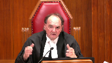

---
title: Kerry Alexander Nahanee v. His Majesty the King
published-title: Heard
date: 2022-03-16
sidebar: false
---

This transcript was made with automated artificial intelligence models and its accuracy has not been verified. Review the original webcast [here](https://scc-csc.ca/case-dossier/info/webcast-webdiffusion-eng.aspx?cas=['39599']).
---

**Justice Rowe** (00:00:02): The court, not cool.

**Justice Wagner** (00:00:24): Good morning.

::: {.column-margin}

:::

Please be seated.

In the case of Carrie Alexander Nahani against Her Majesty the Queen, for the appellant, Carrie Alexander Nahani, Hollis A. Lucky, Michael Subkin, James Nadell, for the intervener, Trial Lawyers Association of British Columbia, Rebecca A. McConchie, Elsa Willey, for the intervener, Saskatchewan Trial Lawyers Association, Inc. and Canadian Council of Criminal Defense Lawyers, Yvonne J. Reutenberg and Thomas Innes, for intervener, Criminal Defense Lawyers Association of Manitoba, David Ireland, Andrew Sinichin, for the intervener, Criminal Lawyers Association of Ontario, R. Craig Bottomley and Arash Giasi, for the intervener, Independent Criminal Defense Advocacy Society, Tony C. Piezana and Kate Odhia, for the respondent, Her Majesty the Queen, Matthew G. Scott, Mila Shah, for the intervener, Director of Public Prosecutions, John Walker, Jessica Lahn, for the intervener, Attorney General of Ontario, Jennifer Epstein and Catherine Baudoin, for the intervener, Attorney General of Alberta, Rajbir Dhillon.

Please note that there is a publication ban in this matter pursuant to sections 486.41 and 486.42 of the Criminal Code.

All is lucky.

**Speaker 1** (00:02:20): Chief Justices, this appeal raises two issues.

::: {.column-margin}

:::

Should the public interest test apply to non-joint submissions where Crown and Defence have reached a resolution agreement and the judge is seeking to depart from that range?

Second, is the sentencing judge required to give notice to Council when intending to depart from a range?

And if so, what are we to do?

By way of brief overview, we say that the public interest test should apply to non-joint submissions resolution agreements reached by Crown and Defence when the judge is seeking to depart from that range.

In such a way, resolution discussions will be promoted, applying the public interest test will encourage Council to enter into resolution agreements short of a joint submission, it will afford the party's increased confidence that their agreements will be protected, and the benefits that this court outlined in Anthony Cook with respect to joint submissions apply justice equally.

The suggestion that applying the public interest test as we proposed will lead to confusion is wrong.

What we propose is a simple, straightforward application of the test to resolution agreements that will promote the administration of justice, ensure fairness, and add no additional burden to the sentencing judge.

In Anthony Cook, Justice Moldaver commented at footnote three that it may be that some that the same considerations that apply to joint submissions may apply to resolution agreements where there is a comparable quid pro quo.

But Justice Moldaver left that question for another day.

We say today is that other day, and this case is a clear example of why the test should be applied as we propose.

We intend to show you why.

Carrying on with the brief overview with respect to ground two, we say a judge is required to give notice when intending on departing from a range proposed by Council.

It reflects common sense and fairness.

The respondent agrees that notice is required, and all the interveners in this case, but for one, also agree that notice is required.

We say the real issue in front of this court today is not whether notice is required, there seems to be agreement, the issue is what happens when notice is not provided.

We say that a lack of notice should result in an appellate court sentencing afresh with no deference to the sentencing judge's sentence.

It's impossible, we say, to speculate where on the range the judge would have sentenced if they had heard submissions, additional submissions from Council.

This court should not endorse a process where an accused is denied significant fundamental fairness.

With respect to the first ground, this court in Anthony Cook outlined the benefits of plea resolutions, and I think it's trite to say that the majority of criminal cases resolve by way of guilty pleas, and these guilty pleas are often the result of resolution discussions between Crown and Defence.

This court in Nixon at paragraph 47 held that, quote, it goes without saying that plea resolutions help to resolve the vast majority of criminal cases in Canada, and in doing so, contribute to a fair and efficient criminal justice system, close quote.

Nixon at this paragraph was referring to plea resolutions generally and not only joint submissions.

In Anthony Cook, in paragraph one, this court held that resolution discussions between Crown and Defence are not only commonplace in the criminal justice system, they are essential, properly conducted, they permit the justice system to function smoothly and efficiently.

Further on, at paragraph 35 of Anthony Cook, this court held, referring to the Martin Report, when plea resolutions are properly conducted, they benefit not only the accused but the Crown, victims, witnesses, and the administration of justice.

As per the Martin Report at page 277, without plea resolutions, the justice system would grind to a halt, and again, the Martin Report is referring to plea resolutions and not restricting themselves to joint submissions.

They actually adapt a definition of plea resolutions, which is, quote, it's at paragraph, page 283 of the Martin Report, a proceeding whereby competent and informed counsel openly discuss the evidence in a criminal prosecution with a view to achieving a disposition which will result in the reasonable advancement of the administration of justice.

What we are proposing, we say, will achieve that result.

I wish to comment on the fact that the court has not yet decided on the date of the appeal, and that the court has not yet decided on the date of the appeal.

I would like to say that the court has not yet decided on the date of the appeal.

The court has not yet decided on the date of the appeal.

The court has not yet

**Justice Moldaver** (00:07:03): Could I just interrupt you for one second?

::: {.column-margin}

:::

You seem to be suggesting that the very, very stringent public interest test that this court set out in Anthony Cook should apply equally, as I understand it, to submissions like the ones in question where the Crown agrees not to go above a certain thing and the defence agrees to something lower and not to go below something.

But one of the big factors in Anthony Cook, I think you'll agree, is the time-saving to the administration of justice, a criminal justice system that is burdened beyond belief as it is, and that was a major factor in this court's decision in Anthony Cook to impose the very stringent test it did.

Now compare that to this case and thousands like this, thousands, every day in Canada like this, where there's no joint submission

but they kind of have an agreement as you won't go higher than this

and I won't go lower than that.

Correct me if I'm wrong, but it looked like the sentencing submissions in this case took about a day.

Now that might not seem very much in terms of an individual case, but if you multiply that by the thousands of cases every day in the criminal justice system that deal with situations just like this, you're going to have a huge burden, extra burden, placed on the justice system that is already overwhelmed.

What do you say to that?

**Speaker 1** (00:08:45): Thank you, Justice Moldaver.

::: {.column-margin}

:::

What I would say is that there is a difference between savings in court time with respect to trial time and a sentencing procedure.

So with respect to a guilty plea as a result of resolution discussions, in this context of the case in front of the court, this case would have been a multi-day, five-day trial.

We had a very young witness.

There would have been appropriate accommodations.

That's not what I'm talking about.

**Justice Moldaver** (00:09:12): about it.

::: {.column-margin}

:::

I accept that.

There's trial saving time if you don't go to trial, clearly.

And that's not my question.

My question is in the context of what is a sentencing proceeding.

A joint submission is usually over in probably half an hour, if that.

A sentencing proceeding that where the parties are at issue and are trying to put their best forward and giving the judge cases and giving them reports and giving them psychiatric reports and all this stuff, ends up being a day long hearing in a court and then a reserve, more judges time spent on it, etcetera.

I mean, it just has a huge impact on the whole system, it seems to me, but...

**Speaker 1** (00:09:58): And yes, Justice Movaver, what I would say is that, and the respondents make this point as well, there's, I submit with respect, there's not a clear line that there's only joint submissions and then there's non-joint submissions.

::: {.column-margin}

:::

There is room, much like this case, where counsel put their heads together, they entered an agreed statement of fact, and as this court will see through the transcript, the agreed statement of fact took time to read out.

But what is of importance is that counsel reached that agreed statement of fact, but it still had to be put into the record.

There was details with respect to both victims in this case.

One of the victims attended court to read out a victim impact statement, and that took more time.

The criminal code, of course, allows that.

There was a Gladue report, and for Indigenous offenders, Gladue reports must be, or Gladue information must be put before the sentencing judge.

And there was a pre-sentence report.

But what we say is that is not because this is what my friends would say is a contested sentencing hearing.

This would have been the nature as well with respect to a joint submission.

The victim still would have been able to read out her victim impact statement.

The agreed statement of facts still would have had to be read into the record.

A Gladue report from legal services still would have been prepared because that is required.

And a pre-sentence report still would have been prepared.

So counsel don't, with joint submissions, walk into the courtroom and say joint submission and sit down and the judge stamps it.

Sometimes the joint submission cases are the messy cases.

They're the cases that are complex.

They're the cases that require Crown and Defence to get together and say, we have to find a way to resolve this.

Sometimes they can be a theft under, and they are straightforward, Justice Moldaver, like you said, and it may be a very brief submission, but sometimes they are the complex cases that do require court time.

But again, I would submit with respect that if this were a true joint submission beyond references to case law, this sentencing hearing would not have been significantly reduced.

But again, in the greater good, it's saving the court time through counsel, putting their heads together.

**Justice Rowe** (00:12:01): You say that, but I have to tell you, that runs exactly counter to my experience, which accords entirely with that of Justice Moldaver.

::: {.column-margin}

:::

When I was trial judge, and someone came in and said, Judge, we've got a joint submission on sentence, I had to listen very carefully to what was said.

But unless some warning bells went off or some lights started to flash, shall we say, I said, right ho, let's go for lunch.

You know, because she's done.

Whereas if I have people coming in and saying, look, Judge, we think you shouldn't impose anything beyond five years, but my friend here thinks two years is a more fit sentence, well then the contest begins.

And it really is quite a different proceeding, it seems to me, and I must say, my experience would accord entirely with Justice Moldaver's.

Joint submissions are dealt with readily, briefly, taking up very little of the court's time, and contested sentencing hearings take up pretty much the same amount of time, even if you've got an agreed range, as opposed to, nothing is agreed about anything, because it's a contest.

Anyway, that's my view.

Thank you.

**Justice Brown** (00:13:23): I wonder if I could build on that before you answer, Councillor, is that the reason that it takes less time is even before Anthony Cook in most cases there was a measure of certainty and that certainty derives from an agreement either as to the number or as to the high end or to the low end.

::: {.column-margin}

:::

But that's not what we have here, of course.

And so I'm wondering here about the future of joint submissions, if we accept your argument, because if an offender can obtain the same degree of certainty that a joint submission gives that offender on the upper end of the sentence while still leaving them free to seek a lower sentence, why ever would an offender ever agree to a joint submission?

**Speaker 1** (00:14:17): Yes and thank you Justice.

::: {.column-margin}

:::

What we would say is that the incentive to enter into a joint submission would still exist because that locks in Crown and Defence and Defence the accused knows walking into the courtroom most likely subject to the public interest test that is the sentence here.

**Justice Brown** (00:14:36): But you're still locking in the crown.

You're just not locking in the defense.

**Speaker 1** (00:14:42): you are but in the sense that the accused doesn't have that certainty so he may view the case as this is worth x amount and crown views the case this is worth y amount

::: {.column-margin}

:::

but they agree on everything else witnesses are saved all the other parts of a trial or a gardener type hearing are avoided at the sentencing hearing but the accused in a non-joint submission doesn't have that certainty of knowing all right shares that i'm getting

but that uncertainty is

**Justice Brown** (00:15:06): But that uncertainty is only in one direction, and in the direction that favors the accused.

**Speaker 1** (00:15:15): Yes, and I would say that this Court's comments in Anthony Cook comment with respect to the certainty for the accused being at a different level than the certainty for the Crown.

::: {.column-margin}

:::

So the Court in Anthony Cook, this Court comments in Anthony Cook that certainty for the Crown is different in that there's not issues of a fundamental fairness and trial fairness, and at paragraph 39 of Anthony Cook, that's when the Court goes into the benefits of joint submissions for the Crown, and the first point that the Court points out is that the certainty of conviction is guaranteed, and that's what I submit is the importance for the Crown, is the certainty of conviction.

The Court then goes on to the second consideration for the Crown being there may be information the accused can apply to give to the Crown for other prosecutions, and then the third, this may save victims from having to testify and witnesses having to come to Court in the administration of justice, but I would say in Anthony Cook the issue of certainty is viewed very differently from the lens of the accused and the lens of the Crown.

So I would submit that there's not going to be the case where a defense and Crown are putting their heads together trying to reach resolution and Crown says, okay, here's what I'll seek, and defense then sneaks into court and undercuts that.

What we propose is that Crown and defense are going to hash this out and they're either going to come to a joint resolution or they're going to come to a resolution agreement, but there's nothing that stops Crown from saying, hey, look, if you're not joining me at four to five, then I'm going to ask for six to seven.

You can ask for what you'd like to, and everything else is agreed to, but parties know what they're doing when they walk into the courtroom.

So I would say, again, the issue of certainty is very different depending on whose lens you're looking at it.

**Justice Kasirer** (00:16:57): Lucky, is the rigor of the negotiation of any consequence?

::: {.column-margin}

:::

I mean, when you arrive at a joint submission, it's fair to assume that the parties made a rigorous, there was some rigorous negotiation to bring the two opposite poles together.

But when they stay far apart, how do we know how rigorous the negotiation was?

And if rigor of the negotiation is part of the, part of the fairness idea, and part of where the public interest is attended to, should we be making inquiries as to how serious the parties negotiated?

Or is it all of a piece?

**Speaker 1** (00:17:44): I would say that that inquiry, thank you, Justice, I would say that that inquiry is not necessary by the trial judge.

::: {.column-margin}

:::

It's up to Council to walk into the court prepared.

Having already reached outside of court, much like they say, okay, we're going to be presenting a joint submission, they will say, okay, we are agreed that this is a resolution agreement.

Yes, defense, yes, Crown, yes.

And they walk in and present that to the Crown, sorry, to the sentencing judge.

Um, so we are not asking the court to perform any kind of analysis of, was this discussion enough to then apply the public interest test?

Was this not enough?

That onus falls on Council to present that to the court.

It may be that if the judge is thinking of exceeding the range, that Council then are given the opportunity to provide some more information as to how they resolve the matter and how they got to their positions, but subject to the judge having any concerns, that's up to Council to confirm prior to entering the courtroom.

And it's not for the judge to take on that additional burden.

**Justice Moldaver** (00:18:44): And maybe things have changed since I was in practice because it's been a long time, but I can hardly remember a case where there wasn't some negotiation that I had with the Crown after a plea of guilty and the question of sentencing.

::: {.column-margin}

:::

And it usually boiled down to, well, we won't ask for more than this, and we can ask for this.

It was the rare, rare case where I ever went into court and said, it's all open.

We don't have to agree on anything.

We're going in open.

Now, if I'm wrong, you tell me.

But I believe, I have to believe that some negotiations go on in virtually every case between the defence and the Crown, and oftentimes, like regularly, they'll come up with this kind of, well, you can ask for that, I can ask for this, and so be it.

I mean, this is so commonplace, it seems to me, and yet you want us to impose a test that is so rigorous that is designed for many reasons, including really serious policy reasons, to sort of bind trial judges because you sat down for a few minutes.

I know in this case, there was seven pages.

You wrote a seven-page letter, the Crown did, I mean, but in most cases, that doesn't happen.

You go in, you negotiate with the Crown.

It may take a month or two or three months before you arrive at a conclusion, but it just seems to me that if we do that, we need a reality check of what goes on in the criminal law before we start saying, if that happens, therefore, the rigorous test in Anthony Cook applies.

Thank you very much.

**Speaker 1** (00:20:43): You

**Speaker 1** (00:20:43): Thank you, Justice Moldaver.

::: {.column-margin}

:::

And what we would say, and this somewhat leads into my next topic, was that joint submissions are a subset of resolution agreements, and this Court recognized that in Anthony Cook.

And what we are saying is resolution agreements sometimes lead to joint submissions, and sometimes you can have just as extensive resolution agreements, just as thorough discussions with Crown hashing it out, and you can't quite get there, but there still is a resolution agreement reached.

**Justice Moldaver** (00:21:19): that brings you to Justice Casir's question.

::: {.column-margin}

:::

The judges have to start weighing now the degree and extent and nature of the negotiations.

We're gonna put all that before the court and have the judge say,

oh this was a real, this was a rigorous negotiation.

No, this was immediate medium-sized negotiation.

This was a baby negotiation.

I mean really.

**Speaker 1** (00:21:42): What I would say Justice Moldaver is that again it falls to Council and we are not asking the judge to do that.

::: {.column-margin}

:::

So we're not asking the judge as part of the sentencing then wades into okay

I'm going to have to balance does this negotiation reach a height that now I apply the public interest test.

What we are proposing is a simple stage step one Crown of Defense outside of court agree much like they would agree this is a joint submission they agree this is a resolution agreement.

They enter into the courtroom and they advise the judge at the outset this guilty plea is as of the result of a resolution agreement.

The judge hears the submissions of Council considers the range and determines the fit sentence within that range.

If the judge is concerned with the range then the judge applies the public interest test to determine if it would be contrary to the public interest.

So again it's it's at the feet of Council to come in and advise the court and the only time that the judge is going to apply the public interest test is in those very rare cases where the judge decides to pass concerns and is considering exceeding the Crown's range much like joint submissions.

Joint submissions aren't aren't normally jumped it's the exception it is not the norm

so it's rare in courts across this country sentencing courts where a judge does jump the joint submission and we submit it the same with the range and case law has recognized that typically the Crown's high end of the range is the worst case scenario an accused can expect.

So we say by applying this public interest test after Council have reached that agreement advise the judge of such at the start of the sentencing hearing it's only going to come to play in very rare cases where the judge notwithstanding the resolution and the plea and all the benefits that come from that is having concerns then the public interest test comes in.

**Justice Martin** (00:23:28): May I ask this question?

::: {.column-margin}

:::

Let's assume for the purpose of your argument that the policy reasons that support a special rule for joint submissions will continue to apply in partial joint submissions like a negotiated guilty plea.

All right, so if we accept all of the underpinnings can be applied, why is the Anthony Cook standard the only way to deal with that?

Why isn't it sufficient if those policy concerns still continue to apply to a guilty plea and a contested sentencing hearing?

Why is it that those things are not met by an obligation for the judge to inform council that the judge may go higher or lower than what it is that's being suggested?

Why is Anthony Cook the answer rather than something that deals with procedural fairness in the setting of a contested sentence?

**Speaker 1** (00:24:34): Thank you, Justice.

::: {.column-margin}

:::

And what we would say is that the public interest test from Anthony Cook protects and considers things that a fitness test or demonstrably unfit test would not.

Such things as a saving of court time, vulnerability of victims, the potential of an accused being able to provide information for another investigation as Justice Roe, as he then was Sid and Scott.

There are other considerations that are not typically sentencing considerations that would come into play when Crown and Defence Council have these resolution discussions where there may be things at play that lead to Crown taking a certain position, knowing with full knowledge that Defence is going to take another position.

But that's why we'd submit the public interest test should apply to these kind of scenarios because the other sentencing tests do not take into consideration those other factors.

**Justice Jamal** (00:25:32): Could I ask you, just to follow up on Justice Brown's question, and Justice Brown sort of highlighted the impact on clients, why would any client agree to a joint submission when they can get the benefits just by contesting sentence?

::: {.column-margin}

:::

What about the professional obligations of lawyers and the incentives on lawyers?

Why would any lawyer, putting aside questions of cost, advise a client to enter into a joint submission?

It would seem to me to be tantamount to professional negligence, putting aside cost, where a client might get a lower sentence if they simply contested sentence.

So, could you address that?

Why would any lawyer advise a client, not this client, obviously, but why would any lawyer advise any client to enter into a joint submission?

**Speaker 1** (00:26:19): Yes, thank you Justice and I would say that again it touches on an issue of certainty for the accused and certainty doesn't have to be an exactness for the accused.

::: {.column-margin}

:::

Certainty can be certainty as to a range that Crown will be locked into.

So I would submit that again a joint submission gives the accused near certainty that that is going to be followed subject to the public interest test.

So if the accused is negotiating and Crown says look we'll do five to six and the accused says well no

no no this is three to four

and they just they can't close that gap then council may advise their accused and likely would advise their sorry their client and say look if we join at five then the public interest test will apply and the judge doesn't have a range that's going to be a joint submission on five.

If we don't then Crown is going to ask for five to six we're going to ask for three to four you could walk away with six.

So client you have to consider the risks of that knowing that you will likely get five if you join the Crown you're risking getting six if you don't.

**Justice Moldaver** (00:27:26): an assumption you make based on our present law, which you're trying to sort of, I think, change now at the moment.

::: {.column-margin}

:::

But let's be realistic.

If the Crown knows after this case that the public interest tests, whether it's a joint submission or a negotiated submission, then you can be sure the Crown would not have gone five to six here.

The Crown could have easily asked for eight to ten years here.

The Crown gave in.

The Crown made a concession here.

And so I just think you are going to effectively maybe cut off your nose to spite your face because you will get Crowns asking for much more than they otherwise would have in terms of the maximum, it seems to me.

**Speaker 1** (00:28:18): Thank you.

::: {.column-margin}

:::

Thank you, Justice Moldaver.

And what I would say is this leads into what happens on the ground between Crown and defense.

So in this case, Crown obviously had information that defense is not privy to with respect to meeting with the victims, trial preparation, and that led them to coming to their conclusion.

And there is reference in their sentencing submissions to the court with respect to the fragility of these witnesses.

And that somewhat leads into what I say, the benefits that this court identified in Anthony Cook apply just as equally to non-joint submissions that are resolution agreements.

None of those benefits tie directly and only exist if there's a joint submission.

So specifically the benefit this court outlined, which in these kinds of cases, sexual assault cases, I would say is a very high benefit, is sparing the victims from having to testify and being retraumatized.

And if I may, it's in our condensed book of authorities.

And if I may just have the court's indulgence for one moment.

It's at tab four, if I may ask the courts to turn to tab four of our condensed book.

This is the proceedings at sentencing and it's page 17 of the transcript.

And it's page 17 of the transcript itself.

So the smaller left-hand top corner.

And it's lines numbers eight through 13.

I'm just going to read from there.

This is the crown submission with respect to a victim EN.

And EN was the case that was initially set for trial and then resolved globally with SR.

So at line eight on page 17, I can advise your honor that she has, or she advised crown that throughout this process, she has routinely attended for counseling and that for her, the trauma resurfaces very easily.

She indicates that she will attend for further counseling as a result of the court process.

This carries the crown makes another reference and it's on page 25 of this same excerpt that's in our condensed book.

It's page 25 lines 42 to 47.

And they are again referring to victim EN.

And starting at line 41, crown takes the position that in this case, given the extreme fragility of the very young witness and the fact that crown, this crown in particular has been engaged with her from the outset of the charge assessment process and with her with detective Riken and with her caseworker and has seen the impact of a potentially imminent trial on this young witness.

And what we submit is this is exactly the kind of case that we want to resolve.

We have a young victim.

We have a vulnerable young mother who has attended routinely for counseling and who the court has advised trauma resurfaces very easily.

These are considerations that the crown take when assessing their case and when they're looking at the benefit to the justice system and the benefit to them, including of course this extremely fragile young witness for resolving this case.

So crown looked at that and decided globally with victim SR that four to six years was the appropriate range.

And in their letter, they indicate this does not have to be a joint submission.

So they are well aware of that fact.

**Justice Karakatsanis** (00:31:55): Can I ask you, because I see your time is running, and if this court were to accept that some of the same considerations apply, as in joint submissions, but they don't rise to the same level, and that instead, perhaps notice where a judge is considering departing from submissions would be an appropriate way to respond to the importance of having some agreement.

::: {.column-margin}

:::

What would flow from a failure to provide the notice?

And it's particularly, I'm particularly interested in your view of where that is, how that would be resolved.

What kind of framework would we be looking, would that be an error in principle that requires the court to determine whether it impacted the sentence, whether it renders it demonstrably unfit, or is a lack of procedural fairness a qualitatively different that leads to another means of analysis?

So I'm particularly interested in that, and I'm hoping you will address it for me.

**Overlapping speakers** (00:33:13): Not necessarily.

**Justice Karakatsanis** (00:33:13): now but I see your time is running so just wanted to alert you to that.

**Speaker 1** (00:33:20): And I don't mind, thank you, Justice Carrick at Santas.

::: {.column-margin}

:::

I don't mind addressing that actually right now.

Well, your question's fresh in my head.

What we would say is that failure of notice cannot be cured by looking at whether or not the sentence would have been impacted if council were afforded an opportunity for further submissions, because we just don't know.

We would ask this court to accept what the Ontario Court of Appeal has repeatedly said since as early as 2011, that this is an error in principle, and you cannot assess, it's impossible to assess where the sentence would have fallen if the judge had heard further submissions.

The Alberta Court of Appeal, about two weeks ago, February 28th, released the Sudhu decision, which we did attach in our condensed book.

And I would submit that the court in Alberta went through a thorough analysis of the existing authorities across Canada, and they concluded that it's a breach of fundamental fairness leading to a breach of section seven of the accused rights.

And they say that an unfair process, a flawed process, in no way can be found to result in a fit sentence, that it's the flawed process and the unfair process itself leading to the section seven breach that leads to a sentencing of fresh, because as the Court of Appeal for Alberta says, how can we say that this flawed process is so inherently unfair to the accused?

It's nevertheless, we're okay to look at it later on and say, well, how would the judge's sentence have gone?

So Alberta says, notwithstanding that, we find that the process would be so flawed and the courts cannot endorse a flawed process.

They also then conclude, even if we were to apply the test that had existed in Alberta prior to this case, which was that, yes, it is an error not to give notice, but that when you look at that error on the appellate level, it allows the appellate courts to look at it, but the question for the appellate court in Alberta had been, had the error impacted sentence.

The Court of Appeal for Alberta now has clarified and changed their position and said, no, even if we were to apply that old test, which we don't agree with, it's impossible to say where the judge's sentence would have fallen without hearing submissions from counsel.

And part of that is, I think what my friend, the Crown underlined, and they did this in the Court of Appeal in British Columbia as well, is that nothing further could have been said on behalf of Mr. Nahaney.

And that narrows the issue too much, because the issue isn't just could defence have said he was born and raised here, here was his background, here was his struggles.

That's not the only additional information that could have been provided to the court if the court had given opportunity.

This would have been a case where Crown counsel bargained for their position of four to six years.

They would have had to support that position.

If the judge gave them a notice, Crown would have then had to support that position.

They may have come back with more case law.

They would have maybe provided the judge with more information as to these vulnerable, fragile victims.

Defence and Crown, as often happens, if something looks like it's going off the rails, could huddle in the hallways of the court and say, look, we have to somehow steer this back on the rails.

There's also the possibility that defence counsel could have said, this isn't going well.

I'm going to join you, Crown.

I'm going to join you in four to six years.

I'm going to make this a joint submission.

And now we have the protection of the public interest test.

So I think the court of appeal in Alberta clearly says, look, this breach of fundamental fairness is so significant.

How can we say the process could uphold the sentence?

And even not withstanding that, much like Ontario, they say it's impossible to know where this would have fallen if the judge had heard further submissions.

**Justice Jamal** (00:37:09): The Alberta Court of Appeal looks at the issue through the prism of fitness.

::: {.column-margin}

:::

You've cited Ruby, Mr. Ruby's text on sentencing at tab 17, which looks at the issue somewhat differently and says it isn't really an issue of fitness, but an issue of, is an issue of Section 7 and procedural fairness.

So it isn't really the fitness or the error in principle affecting the sentence, it is just a more fundamental question of Section 7 and procedural fairness, so it doesn't quite fit within the two branches of La Casse, but it seems to be, so what are you urging?

Are you urging the Alberta Court of Appeal's approach, which focuses on fitness, or are you urging the Section 7 approach, which seems to be a step back from all of that?

**Speaker 1** (00:37:55): I would urge, and if I may just have one moment, thank you, Justice, and what we would say the Alberta Court of Appeal, we would urge the court to follow the Alberta Court of Appeal, and it's really, it's in our condensed book, and from starting at paragraph 43, they say, quoting from Anthony Cook, Anthony Cook has declared that a judge thinking of jumping the crown must give notice.

::: {.column-margin}

:::

This procedure is compelled by section 7 of the Canadian Charter of Rights and Freedoms.

Everyone has the right to liberty and the right not to be deprived thereof, except in accordance with the principles of fundamental justice.

They then say at paragraph 44, this is exactly the same for non-joint submissions.

Fairness requires that.

They then at paragraph 46 say the procedure where the judge does not notify counsel is flawed and cannot be approved.

At paragraph 56, a sentence that is the product of a flawed procedure is not a fit sentence, and at paragraph 57, there's no reason to insist that a joint submission accused gets this fundamental fairness, but a non-joint submission accused does not.

**Justice Brown** (00:39:00): I'm confused now because the court of appeal ties it to fitness, but you're tying it in your factum to an error in principle.

::: {.column-margin}

:::

It's clear from your factum from page 23 on and from that Ontario appellate authority that you cite.

You cite this as an error in principle.

And I would have thought that that's actually the ‑‑ just intuitively it makes more sense to me that if there is, for the sake of argument, we accept that this created a procedural unfairness, that that is in fact the gravamen of the problem, not that the number that resulted was somehow unfit, although I know you argue

that as well, but that it is that the sentence is the product of an error in principle in the form of a failure to give notice. Yes.

**Speaker 1** (00:39:54): And thank you, Justice.

**Justice Karakatsanis** (00:39:54): And thank you, Justice Brett.

Just to add on that, I'm just wondering if an analogy looking at miscarriage of justice in terms of an error that affects the result and a process that is seen, is unfair or is seen to be unfair, whether that's a helpful way of looking at it or not.

**Speaker 1** (00:40:13): I think that is Justice Tarrick at Santas and I think that the Alberta Court of Appeal in my respectful submission somewhat blends the two and Justice Brown you are correct in my factum, pardon me, I was focusing more.

::: {.column-margin}

:::

My argument was that it was an error in principle and that error in principle could not be cured by an appellate court hypothetically saying well we guess this is what the judge could have done.

So my argument in the factum was it's an error in principle that then the only answer as Ontario has held is for a sentencing judge to sentence afresh.

I think Alberta somewhat comments on both.

They do focus again at paragraph 71 of the Sadew decision and of course when I wrote my factum I didn't have the benefit of this case from Alberta which I'll say is a strikingly great case but paragraph 71 of the Alberta decision says a breach of the principles of fundamental fairness is not an error of principle.

It is a breach of section 7 of the Canadian Charter of Rights and Freedoms.

This is an important distinction.

While the commission by the original censor of an error in principle only justifies appellate intervention if the error affected the sentence, this is not the case if the procedural misstep is characterized as a breach of fundamental fairness.

They then go on at paragraph 73 to say even if we applied that appellate intervention is only warranted if it impacted the sentence.

It's impossible to conclude that the additional sentencing submissions would not have caused the judge to impose a different sentence than they did.

So I submit Alberta is focusing on the section 7 breach and just again the issues and as Justice Kara Casantis had questioned, it's again the appearance of fairness because at the end of the day it's this accused this offender who's going to jail and he went to jail for a significantly longer time than Crown and Defence had bargained for be it different bargained positions but without any notice he's sent to jail for two years longer than he had any anticipation for and that at the end of the day is a very very big consideration.

We're sending a human being to jail and he should have a right to respond.

**Justice Côté** (00:42:19): So counsel, you say that the remedy, just to clarify for me, should be a new hearing before a sentencing judge, instead of a determination by a court of appeal of what should be the sentence.

::: {.column-margin}

:::

I just want to know what is the remedy you are asking us.

**Speaker 1** (00:42:39): Thank you, Justice Cote.

With respect to the second ground, the failure to give notice, the remedy I'm asking this court to reach is that the sentence be sent back to the British Columbia Court of Appeal for sentencing afresh, not to the trial judge, the British Columbia Court of Appeal.

**Justice Côté** (00:42:55): Thank you.

**Justice Jamal** (00:42:56): Are you asking for, given you're relying on Section 7, is this a 24-1 remedy then?

Or is it, what's the source of the jurisdiction for the remedy?

**Speaker 1** (00:43:06): Yes, and that, Justice, I can say was not fully canvassed in my, well, wasn't canvassed in my fact, because at the time of writing, my focus, as Justice Brown had asked, was on the fact that we took the position it was an error in principle.

::: {.column-margin}

:::

So I haven't clearly kind of synthesized that out, what the remedy would be, but I think that, thinking that through, of course, it would not be a 20-24-2, so I would say it would have to be a 24-1 remedy, allowing the court to say this was just so unfair that the remedy under 24-1 that we are going to impose, if we find this to be a Section 7 breach, as the Alberta Court of Appeal did, the remedy is for a sentencing afresh.

So either way, if you, if you took the Section 7 breach and said that's fundamentally unfair, denial of the accused's rights leads to a 24-1 relief, and the relief is a sentencing afresh, or you take the principal approach, it's an error in principle, we cannot know where the judge's sentence would have fallen on the spectrum if they, if she heard further submissions, the result is the same, a sentencing afresh at the British Columbia Court of Appeal.

**Justice Rowe** (00:44:12): Yeah, because, I mean, it seems to me this gymnastics is what I'd call it with respect to section seven and 24.1 and all the rest.

::: {.column-margin}

:::

It almost seems like it's getting, trying to get around what's in La Casse.

Because in La Casse, I mean, an error in principle is a basis for an appellate court to inquire into the fitness of the sentence.

And unless there's some indication that the error was the cause of an unfit sentence, there's no basis for the Court of Appeal to substitute its own view over that of the exercise of discretion of the trial judge.

So it seems to me this whole thing about section seven is to try to get around this court's jurisprudence in La Casse, which I must say I'm a little dodgy on because La Casse, it seems to me, remains good law.

In the end, does it really matter which way you go?

Because if the point is that something should have been heard, which wasn't heard, some evidence should have been, or submission should have been put before the trial judge, and the Court of Appeal says, well, tell us what those submissions are.

And we'll tell you what a proper sentence is.

Isn't that an effective remedy?

**Speaker 1** (00:45:55): And yes, thank you, Justice Roe, for the question.

::: {.column-margin}

:::

I would agree that yes, it is.

Because the remedy, either through the Section 7 that Alberta is advocating for, or what Ontario has said for the last 12 years, which is the error in principle, as you just indicated, Justice Roe.

Again, the result is the appellate court, here's the sentencing of fresh, and says,

all right, counsel, tell me more, or make additional submissions to your sentencing positions.

I guess it won't even be that, because it would be a sentencing of fresh.

So the appellate court would say, all right, counsel, begin your sentencing submissions.

Because there's no deference given to the trial judge's sentence, even if that sentence fell within a range, as the Ontario courts of the PO has repeatedly said, there's no deference given.

It's a sentencing of fresh, and the judge just hears it.

The appellate court hears it from scratch.

**Justice Jamal** (00:46:47): Isn't one key difference, Mr. Luckey, whether the Court of Appeal would sentence or examine the sentence imposed from a stance of deference or would sentence afresh?

And that could lead to different results, could it not?

**Speaker 1** (00:47:01): It could yes because I think if there was a position of deference then it really becomes an issue of somewhat fitness then then comes into play but what the Ontario Court of Appeal has said and I would say that that's getting it's getting into a murky area where there's a lot of things combining whereas the cleaner way and the more appropriate way I would say is the appellate court says we don't know where the trial judge would have landed she didn't give counsel an opportunity so we're going to hear this sentencing afresh and just start it afresh with no deference.

::: {.column-margin}

:::

So there would be a difference a difference if deference were given which we say deference should not be given in the Ontario Court of Appeal lines of authority should be followed where no deference is given.

And if I may quickly Chief Justice and Justices I'm just looking at my time and I think this somewhat goes into the questions that have been put to me and to be fair yes we are asking this court to change the law in a significant way but what we say that change will lead to is the more efficient and fair functioning of the justice system and the benefits that this court outlined in Anthony Cook are found at paragraphs 36 to 40 of Anthony Cook's and it sets out the rationale and benefits of joint submissions and why the public interest test is the correct test the benefits again are to the accused the crown witnesses victims administration of justice but we say these exact same benefits with respect to non-joint resolution agreements are also realized and that's why they should be afforded the protection of the public interest test we condense those benefits at paragraph 53 of our factum and I won't ask the court to go there but it is found at paragraph 53 of our factum the first benefit is the crown agrees to recommend a sentence the accused is prepared to accept and enter a guilty plea giving up the significant constitutional right to a trial the second point certainty for the accused as the outcome is increased see guarantee of a conviction that comes with a guilty plea makes resolution desirable to crown for the crown's case may suffer from flaws five the accused may have information or testimony to offer the crown six the crown may consider it best to resolve a particular case for the benefit of victims or witnesses sparing them the quote emotional cost of a trial and I've already brought the courts to the section where I say this crown these two crowns two experienced crowns seriously considered the emotional trauma to these victims guilty pleas offer an opportunity for an accused to begin making amends victims may obtain some comfort from a guilty plea given that it indicates an accused acknowledgement of responsibility and may be an expression of remorse the stress and legal costs associated with trials are minimized guilty please say the justice system precious time resources and expenses which can be channeled into other matters and we submit that these are not exclusive to joint submissions how these are realized is the resolution of matters where we're not having contested gardener hearings we're not having victims having to come to testify to facts that while the accused entered a guilty plea they're saying

but I'm not agreeing that I did a b and c I may have punched the gentleman in the head

but I never made a racist remark so then you have to call evidence if the crown so chooses and it becomes what I would say is a true contested sentencing in this case again we had an agreed statement of facts the only thing that council were not at edam on was with respect to the length of the sentence but both council negotiated their positions and entered into the courtroom knowing what both counts were going to be asking for with respect to these kind of agreements I would say the justice system wants to promote these kind of agreements we want council to reach this level of cooperation we want council to try and resolve these cases with respect to the respondent crown a theme that I would say with respect in their factum is that applying the public interest test as we see fit um is it's too complicated and it's going to be complex but again as I indicated earlier we submit it's a simple four-step process where council reached that that agreement prior to entry into the courtroom advise the judge of that agreement court considers the range just like any other sentencing that's only in those rare exceptions where the court is considering exceeding the range where they then the judge makes that known to the council and council may then have to provide further information to buttress their positions.

**Justice Rowe** (00:51:40): By the way, just very quickly, you keep saying and everybody keeps assuming that it's rare that judges jump the maximum suggested by the crown.

::: {.column-margin}

:::

We had a group of what I'd call jolly jumpers in Newfoundland and they were judges who jumped at the drop of a hat and that's one of the reasons why we had to put in some more clear rules because otherwise this would be a very serious problem.

So there's about 1,000 superior court judges in the country roughly and roughly the same number of provincial court judges among 2,000 people you're going to find a few who jump.

**Speaker 1** (00:52:28): Yes, thank you, Justice Rowley, and your point is well taken.

::: {.column-margin}

:::

I would say that both pre- and post-Anthony Cook courts have recognized that non-joint submissions may and sometimes do have the same characteristics of joint submissions, and there should be some form of protection.

The Manitoba Court of Appeal in Beardy, paragraph 6, commented that, typically, the Crown's range will represent the worst possible outcome for the accused.

The Alberta Court of Appeal in Keogh said it is anticipated that, in most cases, the sentence imposed will fall at the boundaries or within the range of sentences recommended by counsel.

The respondent concedes this point in their factum at paragraph 39.

They concede that, typically, that is the worst case scenario for the accused.

However, the solution that the respondent Crown indicates is that these kind of agreements should have no protection.

There should be no reason for a judge to give notice to what they have to give notice, but they don't have to give any reasons why they exceeded the Crown.

And these, again, agreements should have no protection.

What I would submit a little bit further is, and this kind of goes into my point, that it appears that the respondent agrees that notice needs to be given.

And again, all the interveners but, for one, also agree notice needs to be given.

And courts have already kind of hinted or danced around that issue.

But they've been using different words to say, what does it mean when a judge exceeds the Crown's range?

So in the Wynn decision, RV Wynn, on page 7 of that decision, the court says, referring to an earlier 1994 Ontario Court of Appeal decision, and the Wynn decision is an Ontario Supreme Court, Superior Court decision, quote, I will accept as well the principle that a trial court should not impose a sentence which exceeds that sought by the Crown unless it is valid and compelling.

Those are the words that Wynn uses.

And those are the words that the Ontario Court of Appeal in Therese used.

Now, in the JKF decision, again, from the Ontario Court of Appeal in 2011, they used the wording of the court should not exceed the Crown without a, quote, evidentiary foundation, close quote.

Now, the Alberta Court of Appeal in Burback, it goes a step further at paragraph 14 and says, indeed, a suggested range by the parties may indicate an agreement between counsel akin to a joint submission, and the judge should consider the representations from that view.

What I would submit is that trial courts and appellate courts are recognizing this.

It doesn't sit comfortably.

Judges should really, and they use the words of, should proceed with caution.

The Saskatchewan Court of Appeal says it's fraught with difficulties when a judge is jumping or does jump the range provided by the Crown.

But they're using different words, compelling, cogent reasons, valid reasons.

And what we would submit is that the public interest test will give sentencing judges a concrete and discreet way of applying what they should do if they are thinking of jumping the range provided by a Crown.

Does not assist you.

**Justice Moldaver** (00:55:42): I mean, if we were to come out and say that if a judge, whether giving notice or not giving notice, but if a judge jumps, like the Crown in this case, he or she should be giving clear and cogent reasons for doing so.

::: {.column-margin}

:::

That sets it up for the Court of Appeal, and I mean, Justice Roe was talking about practicalities.

It lets the Court of Appeal know what the problem is, what the judge considers to be the problem with the high end of the Crown's range, and it gives them an opportunity to do a meaningful review.

If the judge just gives brief reasons and doesn't really explain in clear terms why he or she has jumped, then the chances are, I mean, a Court of Appeal might even say these reasons are insufficient, and on that basis, we're finding that there's an error in principle, and we're going to look at this afresh.

So I mean, if we were to say that, that in cases where there's a jump, a judge should give clear and cogent reasons, would that make you feel better?

**Speaker 1** (00:56:58): It would slightly make me feel better but not a hundred percent better.

::: {.column-margin}

:::

And what I would say is is the reason is trial counsel should not be relying on an appellate court to fix errors at the trial level and they should not be setting up their sentencing with an eye in the peripheral to an appellate court.

So and I take your your point Justice Moldaven and I think that is definitely an improvement although my my friend the crown indicates judges well they have to give notice don't need to give any reasons why it's great if they do but it should not be a requirement and I take your point Justice Moldaven I would submit that is an improvement if the the judge is required to give notice and if they're still departing from the range then provide clear and cogent reasons.

But what I would submit is is that again could lead to more appeals whereas the test we are proposing would lead to less appellate cases but also we would have different trial judges across the country struggling with well is there a certain level that I have to reach that to be uncomfortable with the crown position to jump it.

So you may have cases in Newfoundland saying well it's clear and I have to have a clear and cogent reason to jump the crown's range or you have a case in Ontario where they say well I must have an evidentiary burden or evidentiary foundation to jump the crown's range and we're going to have different trial judges applying a different standard where we're saying that the standard applied is going to be a uniform standard where judges know it's the public interest test so on appeal it's going to be if it is appealed the court of appeal is going to know clearly was the public interest test followed.

**Justice Moldaver** (00:58:35): to interrupt, I'm sorry, if we add to that, do we say trial judges should give notice in these circumstances if they feel that they're considering going above, okay?

::: {.column-margin}

:::

And so that'll be a pretty good, you know, sort of, what's it called, injunction, that'll be a pretty good mandatory injunction to have trial judges say, hey, look, I'm thinking of going above, I want to give you notice of that, and if you've got anything else to tell me, tell me.

If you combine that with, if you don't do that, and then it goes to the court of appeal and you haven't given adequate reasons, I would have thought you'd have a lot of protection and a lot of the concerns that you are concerned about would really mostly evaporate.

**Speaker 1** (00:59:36): Yes, thank you, Justice Moldaven, and I think if there, you know, was a requirement that notice must be given and then if the Crown, the judge is still seeking on exceeding the Crown's range, that clear reasons have to be given so there is a record that the Appellate Court can look at, then there would be again a basis for defense on appeal to then point out errors that the judge may have made and would be clear to the Court of Appeal the reasons that the judge found that the Crown's range was not sufficient or in the very, very rare cases that the defense range was too high and they undercut the defense, which really doesn't happen.

::: {.column-margin}

:::

But what I would submit is it kind of circles back to the issue of we're dealing with an accused who's giving up that constitutional right to a trial, has agreed on everything but for a different view on the sentence and I would repeat that those benefits from Anthony Cook and the quid pro quo that Justice Moldaven, you identified it at footnote three, may apply in comparable situations where there's a comparable quid pro quo and here we would say that that quid pro quo is the Crown saying, look, our position, our negotiated position and after resolution discussions, Crown sent this letter, that's what the discussions culminated in, Crown sending this letter and Crown then said, look, as a result of this, four to six if he pleads before trial, seven to nine if he doesn't.

That's the quid, the what that the Crown offers and the response, the what for what the accused says, fine, I will give up my constitutional right to a trial in exchange for knowledge that you are seeking four to six.

That quid pro quo is formed and I would submit then all the benefits that flow from Anthony Cook are there.

And again, just looking at the time, I would submit that we're not saying the public interest test applies to all guilty pleas.

This is up to Council to walk into the courtroom after these negotiations and be at Edom to advise the judge we've reached this resolution discussion and I would say, again, I'm being counted down, but this court, Court in Anthony Cook, in 2016, helped address systemic delays backlogs in the criminal justice system.

In 2016, this court, a few months later, released the Jordan decision, again, addressing the backlog in systemic delays and promoting the, trying to promote the efficiency of the justice system.

We would submit that this allows an opportunity for the court to continue on that line, promoting the efficiency of the justice system and by promoting the tests that we're promoting, asking the court to impose, it's going to increase resolution discussions and it's going to decrease contested sentencing hearings.

Thank you.

**Justice Karakatsanis** (01:02:12): Can I just ask you a quick question about the nature of the order sought?

::: {.column-margin}

:::

You've asked that the appeal be allowed and that this court impose a sentence consistent with Crown and Defence Council's sentencing recommendations.

What do you mean by consistent with Crown and Defence Council's sentencing recommendations?

**Speaker 1** (01:02:34): Thank you, Justice Carrier-Astantis.

::: {.column-margin}

:::

What I'm asking this court to impose is a sentence within the range that council provided.

And in this sentence, we'd submit if the judge had applied the public interest test, as we say should be applied, that a six-year sentence, the top of the crown's range would have been imposed.

And I'm asking this court to impose a sentence of six years.

Thank you.

**Justice Wagner** (01:02:57): Thank you.

**Speaker 2** (01:03:01): Thank you.

::: {.column-margin}

:::

My submissions address the nature of the error that occurs when a sentencing judge fails to give the parties notice of their intent to exceed the sentencing ceiling proposed by the Crown and what remedy is appropriate if this happens.

When the judge fails to give the accused notice in these circumstances, they deny the accused notice of the changed case to meet and the opportunity to be heard.

This is not a mere procedural deficiency or technical error.

It's a failure to give the accused procedural fairness, something that we in Canada recognize as a principle of fundamental justice essential to the rule of law and the legitimacy of the justice system as a whole.

It's an error that deprives the accused of a fair hearing when that hearing will determine his liberty and for that reason it's also a violation of the accused section 7 rights.

And to use the language of you justice care consensus, it's qualitatively different than an error in principle.

In these circumstances the only appropriate remedy is a rehearing.

Fundamental justice demands that not only the end result of a proceeding be fair but that the proceeding itself be fair.

And an approach to remedy which only focuses on the end result and the impact of the breach on that end result fails to remedy the flawed process and therefore fails to achieve fundamental justice.

Now I can't put it any better than Justice Ledain did for the court and cardinal which is at tab three of my condensed book and this was the case where the BC Court of Appeal declined to intervene in a decision that was procedurally unfair on the basis that even if it was unfair it didn't matter to the end result and the end result was correct.

And the court rejected that approach and at the last page of the excerpt there at page 661 the court said I find it necessary to affirm that the denial of a right to a fair hearing must always render a decision invalid whether or not it may appear to a reviewing court that the hearing would likely have resulted in a different decision.

The right to a fair hearing must be regarded as an independent unqualified right which finds its essential justification in the sense of procedural justice which any person affected by an administrative decision is entitled to have.

It is not for a court to deny that right and sense of justice on the basis of speculation as to what the result might have been had there been a hearing.

And this is consistent with a long line of authority from this court saying that a breach of procedural fairness is a breach of natural justice that requires a rehearing as a remedy.

And Justice Jamal you asked about the jurisdiction of the source of the remedy does it have to be under section 24-1 of the charter?

The answer is no because this is also a breach of procedural fairness under the common law and the common law remedy for a breach of procedural fairness is a rehearing.

That's certainly the case in the administrative law context and if it is if that's the case in the admin law context it must be in the criminal law context too where the stakes are even higher both individually and societally.

Inaudible.

**Speaker 2** (01:06:42): That's right, and I don't think it needs to fit into the Locass framework.

::: {.column-margin}

:::

The Locass framework is still good law, it's just the law for errors in principle.

This is a jurisdictional error.

The unfair flawed proceeding renders the sentencing hearing invalid.

It must be done again in order to give the accused a fair process.

Now I think that in the sentencing context where the accused was denied notice at the first instance and has to bring out an appeal already, that rehearing can and should be done by the appeal court.

They're well positioned to do so, they'll have all the evidence and submissions in front of them, they conduct rehearings afresh under the Locass framework in cases of errors and principle that impacted the sentence, so they're equipped to do so, and it's also an economical and efficient way of proceeding.

And when the appeal court conducts a fresh sentencing analysis of fresh hearing, the court restores fairness to the sentencing proceeding.

That approach actually addresses the violation, which is the flawed process, whereas remedies which turn on the accused proving that the sentence was unfit or unfair does not.

And further, as the Ontario Court of Appeal found in Blake Samuels and Mohiaddin, it's impossible to really accurately say whether or not the sentence was impacted by the unavailability of submissions.

I see that I'm out of my time.

Thank you.

**Justice Wagner** (01:08:11): Thank you very much.

Yvonne Rottenberg.

**Speaker 3** (01:08:19): Thank you Mr. Chief Justice.

::: {.column-margin}

:::

The Audia Alterum principle and the right to be heard really has at its core notice because how can an individual properly be heard if they don't know and aren't put on notice of the case to meet.

In an adversarial system the case to meet flows from the adversary for an accused person, that is the crown.

If the court, which is the impartial arbiter in an adversarial system, wants to go beyond the stated case to meet, in this instance what upper end of the sentence is proposed by the crown, they are changing or altering the case to meet.

Now no one is suggesting that the court doesn't... Is it the case to meet or is it the degree of jeopardy?

I mean the sentence is still the same.

**Justice Rowe** (01:09:14): The only question is what is the extent of the range?

I think they're just being a little careless.

**Speaker 3** (01:09:21): Well, I'm trying very hard not to be careless, Mr. Justice, but at a sentencing hearing, the case to meet is the extent of the jeopardy sought by the adversary.

::: {.column-margin}

:::

And no one is suggesting that the court, as the guardian of what is just in terms of a sentence, can't alter that case to meet.

What is being suggested, however, that notice is an important requirement if that altering of the case to meet is going to actually be valid and proper and give the accused the opportunity to be heard.

Now, the crown, as set out in our factum, crown discretion has been treated by this court almost as sacrosanct, and it shouldn't be tread upon lightly by the court.

And the crown has discretion to lay out that case to meet.

If the court chooses to step in and override that exercise of crown discretion, the court should allow both parties to properly address the altering that they are doing.

Can I just interrupt you?

**Justice Kasirer** (01:10:31): What's the relevance of the provision of the Criminal Code 606-1.1 that says that a contested sentencing hearing, the parties are on notice that the decision is in the discretion of the judge who is not legally constrained by the recommendations of the parties.

::: {.column-margin}

:::

**Speaker 3** (01:10:51): Well, that puts individuals on notice that the court will have the overriding say as to what sentence should be imposed, and that's not an issue, nor was it an issue on the joint recommendation type of framework, as discussed in Anthony Cook, where the same section should apply.

::: {.column-margin}

:::

It puts the parties on notice that the court will ultimately be responsible for sentencing, but what it doesn't do is put the parties on notice as to what actually the court's concerns are vis-a-vis the sentence proposed.

Now, the Crown has information that the court doesn't have as to the nature of its evidence, the exigencies of the prosecution, the interests of the individual witnesses or complainants, what went into the formulation of the charges that were being prosecuted, the history of the matter, and all of that goes into, it's synthesized, into the sentencing position put forward by the Crown as to the discussions with defence counsel in terms of a potential resolution.

And that needs to be respected and given its due, and again, we're not saying that the court can't take issue with it, but the court should give notice so that both parties can properly address it.

One of the themes in some of the questions, and my time is marching very fast, but one of the themes in the questions that have been put to appellant's counsel dealt with the efficiencies in the system and how we can best utilize those efficiencies and that this court's ruling in Anthony Cook was geared towards joint recommendations because of their time-saving nature.

But just imagine for a moment, counsel having to go into court and not address the sentencing recommendations that are coming from the Crown, but address what they think might be the court's concerns and address why the maximum sentence as prescribed by the code shouldn't come into play and take the time to address other fanciful considerations that defence counsel on behalf of the accused are left in their own mind to try to shadow box with ghosts as opposed to the sentencing judge setting out what their particular concerns are with what was the stated case to meet as negotiated with the Crown.

**Justice Wagner** (01:13:22): Thank you very much.

**Speaker 4** (01:13:26): Thank you, Mr Chief Justice.

::: {.column-margin}

:::

Good morning to just as the panel.

The reason the Criminal Defence Lawyer Association in Manitoba sought leave to intervene in this appeal is that there are in essence, if not a name, two justice systems in Manitoba.

One that operates in Winnipeg and other urban centres, one that operates on reserve, often in remote and inaccessible Indigenous communities.

The court is well aware that conditions in many of the Indigenous communities, particularly in Manitoba's north, are deplorable.

And the reason I say that is to contextualize what we are going to present here today.

As communities struggle with, like I said, residential schools and the horrors of anti-Indigenous racism and systemic discrimination, we have created high-crime, high-justice intervention environments where guilty pleas are very much the norm.

And it's within this social context, it's a social context of segregation, that the Provincial Court of Manitoba and of course other courts across this country are charged with delivering justice within and for Indigenous communities.

And there's a shadow over all of that, and that shadow over the administration of justice in the north and certainly in all communities, but I would say most acutely in reserve communities, is the chronic and systemic over-incarceration of Indigenous people.

And I say acutely because there are certainly attendant mechanical difficulties with delivering justice in these environments, be they related to weather, time constraints, logistics.

You certainly cannot get to these environments as often as you can in urban centers.

Therefore, there is massive pressure put on dockets and massive pressure put on guilty pleas as a result.

But not simply the mechanics.

There's also an optics piece, and I make this submission in the framework of our current climate of reconciliation, but we have an optics problem with how justice delivery happens in those environments.

And before I get too far down that road, I will make my point.

If the public interest test articulated in Anthony Cook applied to pre-resolutions that were reflecting partial agreements or the Nahanni Circumstances Agreement upon sentencing range, it will provide an accused with public interest protection and certainty without having to join the Crown, necessarily for joint recommendation.

And that sounds like it's very good for the accused, and I think that it is, but we have to see that within the context of how justice actually operates in these environments.

There is a massive differential in powers acknowledged by the courts between the Crown and the accused, that much is obvious.

But many of the due process protections that we have built into our criminal justice system exist as evidentiary trial protections, mostly under the Charter.

They don't exist in the same way in a guilty plea justice system.

They don't exist for 90 percent of the people that are actually moving through this system.

And that is what I want to highlight, and it's my respectful submission, should be in the mind of the court when making these very sort of complicated decisions.

We touched just briefly on question 606, and I just wanted to say that I will not say that section is illusory.

I don't believe that, but it has to be contextualized within real choice environments.

If someone is sitting in jail from an Indigenous community, and not in his own community, because the jails aren't there, and they're told, do you want to go to trial in nine months, you've been denied bail, or do you want to plead out next time the plane flies up to Punghassie, and we're able to do that for time served, we frame that as a choice.

And it's difficult to see that as a choice from the accused's perspective.

And that's my respectful submission on that point.

I notice my time is running away as well.

So in conclusion, I will just simply say that this is an opportunity, if the test is expanded, to offer more protections to Indigenous accused and all accused under the public interest framework.

And subject to any questions that the panel would have, that's my submission.

**Justice Wagner** (01:18:04): Thank you very much, Craig Bottomley.

**Speaker 5** (01:18:10): Thank you Chief Justice.

::: {.column-margin}

:::

Mr. Ghiasi and I are here on behalf of the Criminal Lawyers Association from Ontario and we of course rely on our factum where we hope to provide this Honourable Court with a glimpse of the on-the-ground reality that our clients face and maybe following up on what Mr. Ireland said.

We as defence lawyers in Ontario often walk into negotiations with the Crown on behalf of historically disadvantaged clients and groups with a legal aid certificate in our pocket, with clients who are in custody and desperate to get out.

No one would want to be walking in their shoes and we do not start the negotiations on a level playing field.

There seems to be some concern that the defence or the accused will be reaping some undue benefit if the public interest test or the Anthony Cook dicta is followed, but they start from a disadvantage.

They start in a system with entrenched problems and the Crown holding many of the cards in the negotiations.

In our factum we highlight nine separate areas of problem and difficulty that the accused persons that we represent face.

They're often in pre-trial detention and being offered the choice between a trial or a quick plea.

They're in a process that treats presumptively innocent parties as though they're already being punished with these conditions with strip searches upon arrest and things of this nature.

They're the subject of overcharging where a single delict can lead to a multitude of offences being laid.

One gun relating to seven charges where you have a little bit of a narcotic and some cash in your pocket.

Now it's possession, possession for the purposes, possession of the proceeds of crime, all of which will go away if you plead to the one charge.

There is a downward pressure to plead to keep the system moving and then facing the very real prospect of a lengthy term of incarceration, all of which often existing in the long shadow being cast by a history of racism and colonialism and classism.

And you're often there on behalf of fairly unsophisticated accused persons.

So where you have what seems to a court that may not have this full history being put before them on every single event, what seems to be a superficially, maybe even lenient crown position can be assumed to incorporate many of these factors and should not be inflated then by a jurist who may not know of all of these issues or may not know of some of the weaknesses in the Crown's case or the benefit being had to the Crown.

And in our respectful submission, the court should not, without the proper protection in place, being upwardly adjusting a Crown position that may have taken these things into account.

And if we as Defence Council are able to secure a position from the Crown that we can live with, we then of course have to sell it to our client and say there's going to be some certainty here.

And you can plead on these terms and without offending, unless we really, the position the Crown Attorney, your adversary, has taken offends the public interest, then everything should go according to plan and you don't need to have this anxiety that's going to prevent you from resolving cases and there will be a greater efficiency to be had when this certainty is made out.

And I would simply point out that in 2016 when this court penned Anthony Cook and and you know to dramatically change what was the practice, the sky didn't fall, nothing terrible happened and the system proceeded with greater efficiency.

And when Blake Samuels was passed by our Court of Appeal in Ontario a year ago, again this has had no impact on making things worse by way of efficiency.

And in our respectful submission, as my seconds count down, we say there is of course no downside to the Anthony Cook being provided and a great upside for efficiency and for certainty and for a sense of fundamental fairness in accordance with the underlying purposes of our justice system and the Charter.

And thank you, those are my respectful submissions.

**Justice Wagner** (01:22:49): Thank you very much.

**Speaker 6** (01:22:53): Thank you, Justices.

::: {.column-margin}

:::

Our organization represents approximately 300 defence lawyers in British Columbia.

Our membership appears daily in courts across the province to give effective plea negotiations of the nature contemplated in this appeal.

And it's from that very practical perspective that we offer our submissions today.

When a defence lawyer enters a courtroom for a sentencing hearing, they hold certain basic expectations.

They expect the Crown to honour any pre-existing negotiation and to seek a sentence that they have indicated they believe is appropriate.

They expect the Crown to advance facts and law in support of that position, and they expect to do the same on behalf of their client.

And finally, they expect the sentencing judge to rule within the parameters of the debate as framed by the parties.

This is a convention we adhere to every day in our courts.

Some have called it the principle of party presentation.

Others in a different context, for example, like Justice Cote, refer to this broad concept as a judicial contract.

Defence counsel do not expect, nor does Crown counsel, that the sentencing judge, absent something exceptional or compelling, will interject new issues or considerations that fundamentally alter the parameters of the debate.

It seems to me what's going to happen is this court will be

**Justice Moldaver** (01:24:02): to be fundamentally altered here is the judge's function, which is the function is to impose a proportionate sentence taking into account the seriousness of the crime or crimes and the moral blameworthiness of the accused.

::: {.column-margin}

:::

And what I'm hearing today from everybody is in effect apply the public interest test so that in effect the Crown, when they come in with a joint submission as you're talking about, not a real joint submission, a negotiated one, the trial judge is effectively bound.

The Crown is deciding what's the proportionate sentence and unless the judge is satisfied that it would be so contrary to the public perception and so on to impose that, that'll be the sentence.

And then we just take away the function of the judge completely.

**Speaker 6** (01:24:57): Justice, I thank you for your question and I guess the way I would answer it is by pointing out the opposite conclusion which the respondent crown urges upon you which is that the sentencing judge has completely unfettered discretion to depart from the submission of Crown Council.

::: {.column-margin}

:::

Rendering the submission of Crown Council nothing more than a mere suggestion.

Well, just a moment, sorry.

**Justice Moldaver** (01:25:16): sorry, I thought it was they don't have unfettered discretion.

::: {.column-margin}

:::

In fact, if it's really a joint submission, their discretion is very much fettered and a lot of people feel maybe that we went too far with Anthony Cook.

Now you want us to go even further and say where there's no joint agreement, the same principle should apply.

**Speaker 6** (01:25:37): What I'm saying is that you should reject the Respondent Crown's position that the sentencing judge is allowed to do whatever it sees fit, absent any constraint whatsoever when the Crown has made a submission that is lower than what the judge thinks is appropriate.

::: {.column-margin}

:::

Because what I think would happen if the court endorses that proposition, it would change fundamentally how sentencing hearings take place going forward.

It would create the jolly jumpers that Justice Roe referred to a moment ago.

It would render the Crown's submission nothing more than a suggestion, and that would have to be filtered down to the client when deciding whether or not to resolve something absent a joint submission.

And I say that sort of thing can lead to all sorts of other corollary problems.

One of them is inefficiency.

What you see in a lot of the judgments where sentencing judges have exceeded the submission of Crown counsel is that in giving their reasons, they often will look to other issues that may explain why it is they're departing from the submission of the Crown.

And there are numerous examples before you.

In Baptiste, the sentencing judge raised the prevalence of gun violence.

In Hamilton, the sentencing judge raised the issue of race and gender.

In Coe, it was whether or not this child pornography was private use or not.

What that does, if you can imagine how some of the suggestions would play out in those cases, if notice was given of those issues, and then all of the parties were then asked to comment on a new range of sentence or a new issue to explain that new range of sentence, inefficiency would breed.

And all of a sudden, your one day sentencing hearing turns into a two or three day sentencing hearing because the trial judge has interjected a whole new consideration to justify a whole new sentence.

And that's not the way the issue was framed by the parties.

And we say that's terribly inefficient.

Which leads me to my final point that I'll make in my final 30 seconds, which relates to Justice Martin's question.

Well, why isn't notice simply enough?

And my answer is twofold.

The first relates in part to what some others have said, which is, in the vast majority of cases, these decisions are made quickly, and they're made on the basis of what the Crown has said they will do and what the defense lawyers advise their client they think would happen.

And if you interject a great level of uncertainty by rendering the Crown submission to a mere suggestion that can be departed with with no standard, it will decrease the certainty that clients will have.

And it will necessarily mean that many more people will not plead guilty and will seek a trial.

And the other practical reality, I'll just end with this point, is that many people, as Mr. Reutenberg and Mr. Bottomley explained, will be at the very depths of their desperation at the time this is offered to them.

And the idea that they have to wait another week or two weeks when given notice to address a new issue will be something they're just not simply interested in.

And we'll just take the sentence as imposed by the trial judge.

And likely in most cases, you will not see any meaningful appellant review.

Thank you very much.

**Justice Wagner** (01:28:21): The court will take its morning break.

15 minutes.

Thank you.

**Justice Wagner** (01:29:25): Thank you.

Be seated.

Mr. Scott.

**Speaker 7** (01:29:42): Thank you Chief Justice, Justices.

::: {.column-margin}

:::

I am going to divide my time hopefully roughly evenly between the two issues starting with the issue about whether the public interest test from Anthony Cook should apply here.

We say that it shouldn't.

We say that it should be reserved for the true case of a joint submission and that in light of the the purpose of the Anthony Cook public interest test and in light of the policy considerations that justified it, it's neither necessary nor desirable to apply it at a conventional contested sentencing hearing.

We say there's no basis to apply it here.

This case was not a joint submission nor was it a case where the parties in any way anticipated or contemplated that it would apply or a case where either party let alone both parties came into court and signaled to the sentencing judge that they were ad idem that it should apply on the basis that there was a negotiated resolution short of a joint submission.

In our submission this case is an almost textbook example of the Crown formulating a principled sentencing position for the various possible ways that things might play out based on an assessment of the circumstances, the aggravating mitigating factors, and communicating that to the accused for the purpose of allowing the accused to make an informed decision and then the parties entered into a contested, conventional contested sentencing knowing and accepting the risks of doing that.

The public interest test as articulated in Anthony Cook has a specific purpose.

It was explicitly rationalized as being required to create the possibility of an agreement that the parties can be certain or virtually certain will be accepted and Anthony Cook contrasts that stringent test used in joint the joint submission context with the fitness test used at conventional sentencings and as being necessary to put the focus in a joint submission case on the unique policy considerations that arise and as being necessary to create the possibility of that agreement so that the parties don't prefer to take their chances at a contested sentencing or even a trial.

And my friend's argument depends on the idea that you were wrong to say that a joint submission in a joint submission with a joint submission unique policy considerations arise necessitating a specialized test that operates in that setting only and that you were wrong to think that joint submissions have benefits for the parties and the system going over and above those that come along with any run-of-the-mill guilty plea followed by a conventional contested sentencing.

He says all that's needed is the guilty plea, the guilty plea unlocks all the same things and so the public interest test should be applied to exceeding the crown at any contested sentencing.

I know he talks about a negotiated resolution and the parties coming in and signaling that it should apply because they've they've they want to present the case as a negotiated resolution

but but he considers this case to be an example of circumstances where it should be applied and we say that if this case attracts the Anthony Cook public interest test every guilty plea case will attract it because there's no principle for applying it here that would exclude any other guilty plea case.

I'm going to make five points in response to my friend.

**Justice Martin** (01:33:11): proposition, and I understand it from your factum, but when we're looking at any guilty plea, and you're saying it would apply to any guilty plea case, I start from the proposition that a guilty plea does save time to the system, and it's often the product of negotiation.

::: {.column-margin}

:::

But what I hear or what I understand you saying is that the guilty plea is itself taken into account in sentencing as a mitigating factor, and so it is the benefits of the guilty plea are already taken care of in a normal sentencing hearing.

What I'd like to have an understanding is how that actually operates.

I mean, if we're doing a systems analysis, you know, in terms of trying to understand everything, how serious is the guilty plea as a mitigating factor from the Crown's perspective in what it sets out is its principled sentencing position.

**Speaker 7** (01:34:18): Well I think it can vary and it can vary.

::: {.column-margin}

:::

We know that the mitigating effect of the guilty plea can vary in the circumstances.

You know it's mitigating because it saves the system resources and because it spares the victims having to testify and because it represents an expression of remorse perhaps, perhaps a step towards rehabilitation and each of those factors could be present to a greater or lesser extent in each case and I think the Crown in each case does an assessment of to what extent that is valuable and that's reflected in the Crown's principle sentencing position that it advances and then of course the final decision about how weighty it is for those reasons is up to this is in the discretion of the sentencing judge

but you're exactly right.

Our position is that the law already has a mechanism for encouraging or promoting the sort of I call them generic but important but nevertheless generic and sort of uniform omnipresent benefits of the guilty plea.

**Justice Rowe** (01:35:22): Sometimes, I mean, I never served as crown counsel and only as defence counsel at a very early stage in my career.

::: {.column-margin}

:::

But I'm sure that there's many instances where the crown will look for a guilty plea and be willing to contemplate a fairly lenient sentence because one of the key witnesses may perform very poorly in the box.

Some people are evasive, some people are vague, some people have poor memories and it really would be a risky proposition if you have to go to trial, whereas you get the certainty of the outcome and you're willing to put a little water in your wine for those sort of practical reasons.

**Speaker 7** (01:36:15): Yes, I completely agree.

::: {.column-margin}

:::

And, and the, you know, this case is an example of a valuable guilty plea because the witnesses in this case were fragile, to an extent, and it was worth a lot.

And the Crown stressed that it was worth a lot.

And the judge appreciated that that's reflected in her reasons.

So I agree with those comments.

But, but I would say that, again, the, the law's mechanism for taking those things into account is to treat it as mitigating to some greater or lesser degree on sentence.

And, and that mechanism, mechanism already exists, has always existed, and it's not necessary to apply the public interest test in a contested sentencing to, to acknowledge that and to value that.

So the, the five points that I, that I want to make, and just to outline them now, and I'll come back and elaborate on each one of them a little bit more, is that you weren't wrong to think that guilty pleas in general, that while guilty pleas are beneficial in general to the parties and the system, they're not beneficial in all of the same ways or to the same extent as the guilty plea accompanied by a joint submission, which does come with unique policy considerations, a unique combination and degree of benefits, which is what calls for and justifies the test in that context that focuses on those things.

Second point that I want to make is that transporting that test from that setting where it does that job of maximizing certainty to facilitate agreement over to a setting that's inherently characterized by less certainty and by disagreement, and where a fitness test has always applied, isn't necessary to promote a resolution by guilty plea in general.

And this is what I was just saying, the law already has another mechanism for doing that, which is reflecting guilty pleas as mitigating factors.

Third point that I'll make is that applying the public interest test to one party's sentencing position at a contested sentencing could actually be counterproductive to the purpose of wanting the parties to prefer joint submissions, wanting joint submissions to be preferable to the risks of a contested sentencing or even a trial.

Fourth, I'll argue that simply knowing what the crown sentencing position is going to be on a guilty plea versus what it would be after a trial without the benefit of that mitigating factor doesn't give rise to a quid pro quo or at least not one that ought to attract the Anthony Cook test.

And even where there is a quid pro quo, a more meaningful case specific quid pro quo like the accused has information or testimony to offer and that sets a case apart and results in compromised sentencing position, preserving the public interest test for a true joint submission is still valuable in that context because it encourages the parties to go the rest of the distance and reach agreement in a situation where that would seem to be especially possible and desirable.

And lastly, the fifth point is actually a couple of stray points about negative implications that I suggest could arise if about applying the public interest test in this context in terms of encroaching on the judge's role as the person who is solely responsible for fashioning a fit sentence, a possible negative effect on public competence, applying the of that encroachment and a negative effect on this court and other appellate court's ability to supervise sentencing ranges to the extent that sentences end up being imposed based on the public interest test rather than someone's assessment of the public interest test rather than someone's assessment of fitness.

So that's the broad overview and circling back to my first main point to elaborate now on each of them in turn, a guilty plea followed by a contested conventional sentencing isn't as good as a joint submission for anybody, not for the parties, not for the system.

First of all, for the parties, obviously, I think the main benefit of a joint the main benefit of a joint submission being the virtual guarantee of a sentence that's acceptable to both parties is absent.

As you pointed out in Anthony Cook, typically on a joint submission, the accused can expect to receive a more lenient sentence than you could expect after a contested sentencing, but the Crown also can be certain of an outcome that it sees as an appropriate just sanction in the circumstances.

And the certainty, which is really what both parties want out of a joint submission, is absent at a contested sentencing.

At a contested sentencing, you have both parties risking the possibility of outcomes that they're not prepared to agree to in order to advocate for an outcome that the other party isn't prepared to agree to.

And the Anthony Cook test in my submission is meant to create conditions under which both parties are willing to sacrifice that opportunity to seek a different sentence in order to get a guarantee, basically, you have an outcome that they see that's not necessarily ideal, but as acceptable as long as they can be sure of it.

And they don't get that at a contested sentencing like the one that occurred in this case.

So that's the parties.

For the system, the benefits of a contested sentencing, a guilty plea followed by a contested sentencing are also not as significant.

Yes, guilty plea is always accompanied by some savings of judicial resources, but it's not as significant a savings at a contested sentencing as it is at a joint submission.

As it's been pointed out, at a joint submission, the process takes place almost entirely outside of court using the resources of the parties.

You come into court, usually it's approved without any difficulty and usually ends there.

There's typically no appeal from a joint submission that the judge signs off on.

So finality in that case is achieved immediately in one step.

Whereas at a contested sentencing like this one, more judicial resources are used, systemic resources are relied on, factual disputes may have to be resolved, the hearing itself takes longer.

And then the judge has to engage in that conventional deliberation process him or herself, applying a fitness test and weighing and balancing in light of all of the objectives and principles of sentencing, instead of asking one question of a sentence that's presented as custom made for her consideration.

And then just to give reasons, and then there may well be an appeal.

So I submit that you were right, that a joint submission is better for everybody concerned than a guilty plea followed by a conventional sentencing like the one in this case, and especially when you multiply that up to the scale of the overburdened criminal justice system.

And the public interest test's purpose, its specific purpose, is to sort of, in one stroke, make that joint submission both possible, and preferable to the contested sentencing.

My second...

**Justice Rowe** (01:43:13): And for what it's worth, and I'll make the point quickly, I think sentencing decisions are some of the most difficult for trial judges, because guilt or innocence is ascertaining what has already occurred.

::: {.column-margin}

:::

Sentencing is about what you, the judge, are causing to occur.

And that weighs very heavily.

**Speaker 7** (01:43:36): I would think so and and it's been described by this court as a very delicate, a very subjective process, a very difficult to describe process and it's a job that's been assigned by parliament to one person and this court said several times that it's inherently judicial that difficult task and it's the job of one person alone being the sentencing judge and the um so turning to the second point that I that I want to make just to interrupt you.

::: {.column-margin}

:::

**Justice Moldaver** (01:44:06): one second.

::: {.column-margin}

:::

The job, of course, of the judge under a joint submission is considerably easier than the job of a judge who's faced with not a joint submission and has to make a call.

And one of the beauties of it was in terms of resources, not just...it's not just saving court time, saving of judicial resources too.

I mean, a judge in a case like this, where there's a differential, you know, may take a considerable amount of time going through all the cases of reading, etc., etc., and is not, therefore, in the courtroom hearing other cases.

So we can't ignore that either.

It's just not a saving of court space, in a way.

It's a saving for judicial resources.

**Speaker 7** (01:44:58): Agreed, I agree that that's an important aspect of the policy considerations that justify the public interest test in the specific context of a joint submission and it's another benefit that's missing when the parties engage in a contested conventional sentencing.

::: {.column-margin}

:::

So the second point that I want to make is that, and to some extent we've already talked about this, applying the public interest test isn't necessary to promote resolution by guilty plea in a general way and one way you can see that is to think that, to notice that nobody has ever understood that an Anthony Cook-like test applies that conventional contested sentencing.

It's always been understood that it's the judge who's tasked with and solely responsible for crafting a fit sentence and yet we see that according to statistics that my friend has advanced, maybe 90% of cases, something in the neighborhood of 90% of cases, do end in guilty pleas.

And if as a, you know, and the parties know that you want to meaningfully constrain the judge's discretion, not in an absolute sense, but in a meaningful way by entering the paradigm where the judge isn't himself fashioning the fit sentence, that's only available through a joint submission and the application of the Anthony Cook test.

Outside that paradigm everyone's always understood that it's in the discretion of the court with the assistance of the parties, but ultimately in the discretion of a judge who doesn't have to follow what the parties suggest and everyone knows that.

There's a 606 inquiry to make sure everyone knows that, council knows that, and yet we see that in the vast majority of cases, maybe 90% of cases, there's a guilty plea that ends the matter.

So my friend is asking for what I suggest is a very significant change to the law that manifestly isn't necessary to promote resolution by guilty plea generally.

And I submit that that's important that that's in part because just because of the way the adversarial system tends to work when it's working at its best because of council's role, council's obligation, their expertise, their case specific knowledge, their knowledge of the sentencing authorities in their jurisdiction, they do their jobs in an ideal way.

It usually tends to guide the judge towards something that is reasonable and fit and to assist the court in imposing a sentence in its discretion without error.

But again, when the parties don't present a joint submission, the judge ultimately has no choice but to engage in that delicate, profoundly subjective exercise of determining a dead sentence, which may lead the judge to a different conclusion than what the parties have.

**Justice Martin** (01:47:29): May I just interject here to say that even on a joint submission, the ultimate responsibility of a judge is to impose a fit and proportionate sentence, and while a joint submission may aid in that process, the intellectual and legal analysis that a judge has to do in terms of assessing a joint submission is exactly the same as he or she or they would go to in terms of doing any fit and proportionate sentence.

::: {.column-margin}

:::

It may take less time, but the process is not fundamentally different.

**Speaker 7** (01:48:10): It's certainly true, and I would agree that the responsibility remains with the judge throughout the process.

::: {.column-margin}

:::

But Anthony Cook creates a situation where, when presented with a joint submission, the judge does engage in somewhat of a different analysis because he's required to ask a specific question about the sentence that's proposed rather than engage in that whole weighing and balancing process.

So, the judge is required to ask a specific question about the sentence that's proposed rather than engage in that whole weighing and balancing process.

**Justice Martin** (01:48:34): I disagree.

::: {.column-margin}

:::

I think a hearing judge on a joint submission listens very attentively to what the parties are saying but goes through the analysis and says, is this properly a mitigating factor?

Is this a mitigating factor to this extent?

Is this an aggravating factor?

Do I accept that this is within the parameters of a fit and proportionate sentence?

So I don't think that there is a categorically different responsibility that a trial judge has under a joint submission in terms of doing a fit and appropriate sentence.

And I think we do a disservice to our trial judges who sit and go through the rigour of the sentencing process every time, including with a joint submission.

**Speaker 7** (01:49:21): Thank you.

I accept that.

I suppose I was thinking of the language in Anthony Cook that suggests that perhaps even an unfit or even demonstrably unfit sentence might not be contrary to the public interest.

That's exactly it. Sorry.

**Justice Moldaver** (01:49:32): that's exactly it, it's a very different question for trial judges faced with a joint submission than ones with not a joint submission.

::: {.column-margin}

:::

And if Cook doesn't make that clear, you know, we went through about four possible scenarios and we said the judge is not concerned whether there's a joint submission if it's fit or even if it's demonstrably fit, that's not the question.

The question is would it bring the whole administration of justice into disrepute?

And that is a qualitatively different test than judges face when they have the kind of submissions here, it seems to me.

So to the extent you say that, someone would say that the judge's role is the same, that where there's a joint submission, they only have to determine whether the sentence is fit.

With respect, that fundamentally goes against what this court said in Cook.

**Speaker 7** (01:50:28): With that...

**Justice Martin** (01:50:28): My point wasn't that they don't have another question.

My point is that a judge hearing a joint submission considers all of the factors to understand whether the judgment or the submission is unhinged.

**Speaker 7** (01:50:48): No, no argument for me on that, but I do think that there is a Anthony Cook sets up a different paradigm for assessing what's proposed by the parties in one context, versus an exercise of weighing and balancing and so on by the by the judge now I don't take issue with the fact that the that the sensing judge, even a joint submission has to look at the those various factors in applying the public interest test.

::: {.column-margin}

:::

I don't take issue with that.

There's some case law in British Columbia that suggests that it's not, it's not proper for a judge evaluating a joint submission to consider what a fit sentence might might otherwise be in that in the context of the, of that particular case, but the point of the end cook test is to put front and center the policy considerations that are unique to to joint submissions.

And that's all, that's all I'm getting.

When Anthony Cook talks about the risks of a conventional sentencing versus the certainty of a joint submission.

I submit that one of the risks is that the judge who who's not asking that one that one question would would this proposal be unhinged, but is fashioning a fit sentence.

Himself or herself.

That that process will lead the judge to a different conclusion, because he doesn't have the conclusion presented for evaluation she has a responsibility to engage in that somewhat different or somewhat more elaborate more time consuming more delicate more subjective process.

And yet, it's still the case that there's a degree of certainty available in the system that allows perhaps 90% of cases to end by guilty please.

So, that's, that's really all I'm getting at.

Even when the parties don't like to go into that into that paradigm, the Anthony Cook paradigm.

It's not the case that in the absence of the public interest test applying anywhere else that we just see a total inability or total unpredictability of what's going to be happening.

And I submit that if you add to that process and understanding that judges are required to give notice for exceeding the crown that will contribute to a high degree of certainty or high degree of confidence that's already manifest in the fact that we are able to resolve the vast majority of cases without applying the public interest test contested sentencing.

So, so it's not necessary because the law already has a different mechanism for encouraging resolution generally which is treating guilty plea as mitigating on sentence.

Guilty plea is mitigating on sentence because of those exact generic benefits that always come along with it.

Treating it that way is how the law encourages resolution generally.

And it's not necessary to make a change to that because an applied public interest test because we see that most cases are resolving without it.

And the Anthony Cook test is what sets up an even more desirable type of resolution by making maximum certainty available to the parties in one specific type of resolution.

I would also suggest that applying the public interest test to one party sentencing position at, and this is my third, this is back to my third main point, the elaboration on that.

Applying the public interest test to one party's sentencing position at a contested sentence could actually be counterproductive.

And this was canvas to some extent in the in the call with my, my friend.

Because if you're the accused.

Now your ideal resolution is to make your conditional your guilty plea conditional on the crown agreeing not to seek a sentence above X, and the X effectively now becomes like something akin to a case specific maximum sentence.

And the accused, I submit, would likely always just prefer to advocate for something lower than whatever X is whatever position the crown is agreed to take.

No matter how reasonable or linear that might be, there's just no downside to doing that, because you've already closed off the risk of something worse without having to agree.

And the crown recognizing that might therefore prefer simply to advocate for the sentence that it thinks is really warranted, rather than something that it might find merely acceptable if it could be sure that that would be the outcome.

**Justice Kasirer** (01:55:04): Mr. Scott, could you explain in your factum, paragraph 39, when you speak to the worst-case jeopardy, the worst-case jeopardy, the worst-case jeopardy, the worst-case jeopardy, the worst-case

**Overlapping speakers** (01:55:16): Hmm.

**Justice Kasirer** (01:55:16): You say, speaking of the contested sentencing process and it's, and it's operation that all of this affords the accused some assurance that the Crown's position on sentence represents his possible worst case jeopardy.

::: {.column-margin}

:::

What relevance is that to the way in which we look at the problem?

**Speaker 7** (01:55:38): Well, I think my idea was just that my friends have argued that applying the public interest test would give the accused some certainty, a degree of certainty as to what his worst case jeopardy is going to be.

::: {.column-margin}

:::

And my point is just that the adversarial system does that, does some of that, and it gives the accused a degree of certainty that's commensurate with the accepted risks of engaging in a contested sentencing as opposed to a joint submission.

That's what I'm getting at there.

**Justice Kasirer** (01:56:06): So, but there's no, there's no normative freight to be attached to this worst case comment that you make.

::: {.column-margin}

:::

I mean, as you, as I think I understood you to say elsewhere in the factum that the judge is not, in a contested setting, not relieved of the obligation to consider all of the circumstances and so forth.

So that this is a, this is a, this worst case idea is, it doesn't have any kind of grit to it.

Is that right?

**Speaker 7** (01:56:38): I think that's right, except in practical terms it's valuable to the parties resolving cases, discussing cases, and it's practical to the accused because it does, as I was saying, it does lend some degree of predictability to the process, enough that most cases do resolve.

::: {.column-margin}

:::

I mean, we wouldn't see 90% of cases resolving if in practical terms it was just a total gamble every time, right?

So, and I would add to that that the judge, of course, is obligated to consider the party's submissions or statutory obligation, there's an obvious common sense obligation for the judge to consider the party's submissions, so you have a degree of practical certainty that's commensurate with the risks that you accept when you go into a contested sentencing, that's what I'm getting at.

But I agree there's no, there's not, as you said, normative freight to that, that was not what I was getting at there.

So, I was just saying it could well be that you take, if by taking a certain sentencing position you start to effectively rule out your own ideal outcomes without getting any certainty of an acceptable outcome, the parties will just prefer to leave scope for the judge to impose the sentence that they actually assess as being the proportionate just sanction in the case, as opposed to an acceptable compromise, or a compromise that would be acceptable if you could be sure that that's what was going to happen.

Whereas having the public interest test sort of waiting there in the middle, reserve for joint submissions provides clear encouragement to the parties to reach that agreement, that's what it's designed for, and applying it elsewhere makes it less effective at that, in my submission.

The fourth point that I want to make is that on my friend's view, all that should really be required to engage the public interest test is a guilty plea that's informed by the crown sentencing position.

He talks about a negotiated resolution, but again he considers this case an example of a negotiated resolution that should attract the public interest test, and we simply say that if this case does, all cases do, because this was just the crown formulating a principled sentencing position that reflected the guilty plea as a mitigating factor, so that the accused could decide what to do.

And where there is a more meaningful quid pro quo that sets the case apart, as not being a feature of every case, like an agreement that's not being a feature of every case, like an agreement, for example, to testify or provide information or something that results in a compromise from the principled assessment of what the sentence should be, we still say that keeping the public interest test for joint submissions is preferable because it encourages the parties to reach agreement, and when there is a quid pro quo like that to be had, it would seem to me to be an especially fruitful ground for reaching a joint submission, and you want to make sure the parties know that if they want that certainty on that basis, it's available through a joint submission.

**Justice Moldaver** (01:59:51): Are you going to get to the other areas of this, is that, or are you leaving that for someone else, this whole question of notice, and what it does or doesn't do, and the impacts of it?

**Speaker 7** (02:00:02): I think I should I think I should move to that.

::: {.column-margin}

:::

There were some other points that I wanted to make

but I'd rely on my factum, in particular my factum at paragraphs 48 to 55 regarding encroachment on the role of the sentencing judge and the ability of a public course to supervise sentencing ranges and those considerations that are set out there.

I'll simply rely on my factum.

With respect to the second issue then, the notice issue, we agree that judges should give notice and an opportunity for further submissions before exceeding the Crown or for that matter before undercutting the defence.

It's prudent, it promotes fairness and it promotes overall judicial economy and we agree that it should be done.

And I won't, I'm not going to belabor at length the reasons in favour of doing it

but I will just say that the main thing is that it helps ensure that the sentencing judge has before her all the relevant considerations before exercising her discretion to impose sentence.

Not doing it, conversely, runs the risk that sentence is imposed by a judge who doesn't have all the relevant information.

So notwithstanding that at a contested sentencing, parties know that they have to make the best case for their position.

It is an adversarial process.

You may be directing your submissions mainly what the other party's position is as much as making a positive case for your own.

Maybe there's a collateral consequence that might be triggered by a higher sentence that nobody's thought to mention because it doesn't seem relevant.

Maybe there's some sort of factor in mitigation.

This is the example from the Scott decision, some sort of cooperation that the accused would prefer not to advertise but they would if he had to.

So there are good prudential reasons for doing it.

And it spurs judicial economy because it's comparatively simple.

It may only take a second if neither party has anything else to say, you know, or if it's just actually we're trying to avoid deportation or actually he told us where the drug stash is and we regard that as mitigating, you know, that only takes a minute.

**Justice Côté** (02:02:01): So Mr. Scott, what will happen?

Let's say that we agree with you that the notice should be given by the judge when he or she wants to depart from the maximum proposed by the Crown.

What is the consequence if the judge fails to do so?

**Speaker 7** (02:02:19): Yeah, we say that it should not be regarded as automatically entitling the Court of Appeal to intervene and sentence to fresh.

::: {.column-margin}

:::

So we don't agree with the Alberta Court of Appeal in SIDU, and I don't accept my friend's position that that's what should happen.

We agree that, of course, that giving notice and inviting submissions helps promote fairness.

That's among the reasons to do it.

But we don't accept that when that doesn't occur, the proceedings should automatically or reflexively be regarded as fundamentally unfair, such that it just has to be done over again without any further analysis of impact or prejudice.

**Justice Côté** (02:03:03): on the sentence which was rendered.

How can an accused show that or demonstrate that?

**Overlapping speakers** (02:03:11): I'm sorry, I think I missed the first. OK, so.

**Justice Côté** (02:03:13): Let's say that we agreed that a notice should be given by the judge and the judge did not do it.

::: {.column-margin}

:::

So, and you say, oh, it does not mean that the Court of Appeal would intervene because there should be, there must have been an impact on the sentence.

My point is, how can an accused show or demonstrate that there was or there was an impact on the sentence?

**Speaker 7** (02:03:40): by showing that there was actually something to add to what had already been said, something substantively, some information that wasn't substantively already before the judge.

**Justice Côté** (02:03:50): to add by the accused or by both parties because I assume that when there is a contested sentencing hearing like here and when the Crown says we are suggesting four to six years and if the judge gives a notice that he wants to depart from that, the Crown is not going to sit down and say, oh, we have nothing more to say.

::: {.column-margin}

:::

Am I right to assume that the Crown will try to defend its position?

**Speaker 7** (02:04:17): I think that the Crown's position will reflect its principal assessment of what the sin should be, and it will make its best case for that position, yes.

::: {.column-margin}

:::

But typically, it will be the party complaining about the lack of procedural fairness will, you know, its natural common sense approach to say, well, so what was it that you would have added?

What else was there to say?

And sometimes the answer to that might be, might just be manifest that there wasn't anything else to be said.

**Justice Brown** (02:04:50): I mean, we don't really need to be abstract about this, do we?

::: {.column-margin}

:::

Um, if, if, if we accept kind of the unanimity of the submissions on the point of notice, uh, we would, for the sake of my question to you, we would be telling sentencing judges, they have to give notice if they're considering, uh, going beyond the Crown's proposed range.

And, and, uh, and so this shouldn't come up.

What we're only dealing with is this case.

And, uh, and so, let me just then narrow Justice Cote's question.

What, how could the accused in this case have, uh, be able to make submissions on whether there would have been an effect on the sentence?

**Speaker 7** (02:05:52): Well, I think the obligation is to say when you come to the Court of Appeal and say I should have had an opportunity to address

**Overlapping speakers** (02:05:58): Right.

**Speaker 7** (02:05:59): I should have had an opportunity to make submissions about it.

The suggestion that I'm making is that it's up to the accused to say what they would have added, what they would have said, what could have been submitted that would have needed it.

**Justice Rowe** (02:06:09): Well, although harking back to my comment, which was probably made at the wrong time because it's more relevant to this second issue, I think there would be an obligation on the Crown to say, look, Court of Appeal, we were willing to accept a pretty lenient sentence because our case was a bit shaky.

::: {.column-margin}

:::

And then the Court says, okay, now we understand why you were willing to say, you know, X years as opposed to what would ordinarily be a higher sentence.

That would be something for the Crown to say, right, that really the accused can't credibly speak to that.

**Speaker 7** (02:06:49): No, and I agree with Justice Brown's comment that in the case where notice has been, and there is something for the Crown to say like that, that that will be an opportunity for the Crown to do that.

::: {.column-margin}

:::

And here the Crown did stress the value of the guilty plea, I mean not for the judge, the value of the guilty plea in this case to spare the relatively fragile victims.

I think that was that was put before the judge.

And I do want to address in a slightly more abstract way the idea that that we don't need to look to prejudice because or to impact.

Because in my submission, look at doing that, taking the analysis from that perspective is sort of common sense almost and it makes sense from at least four or five different perspectives.

First of all, if you think about the normal rationale for deference to a sentencing judge, it's based on the judge's institutional advantages relative to the appeal court, including having heard and seen all the evidence and the submissions.

And so if it can be established that there's something substantively new that the judge didn't hear, and I agree that if the Crown had something like that, they would, we would acknowledge that, then, and if that's established, then that rationale, that normal rationale is less applicable, and so deference could be less.

But if that isn't established, it was the case that there was nothing else to be said, then the institutional advantage of the sentencing judge would seem to be unimpaired and that rationale would still apply.

There isn't sentencing though more just about

**Justice Jamal** (02:08:18): about more than just about getting it right.

::: {.column-margin}

:::

Isn't it about the integrity, the process, and the appearance?

When you started your submission, you talked about the information that the judge would have and whether there's any lack of information.

But it's broader than that because presumably, it is also about the integrity.

Procedural fairness isn't just about outcomes, it's about process.

And so how do you deal with, I mean, on the logic of your argument, so long as the judge gets it right at the end of the day in the sentence, there's really no need to have any submissions.

**Speaker 7** (02:08:49): Um, well, I would suggest that looking to the prejudice, asking whether it's prejudice rather than treating it as a sort of automatically invalidating the whole proceeding is actually consistent with how other procedural deficiencies are addressed in, on appeal, at least in the criminal law world, right?

::: {.column-margin}

:::

I've given one example of this in our materials, which is that the accused has a statutory entitlement to address the sentencing judge before sentence is imposed.

The judge is statutorily required to consider what the accused himself has to say.

That's important.

The accused is the concrete person at the heart of all of this, and the parliament has seen fit to give him a chance to speak.

He may want to express himself, but when that doesn't occur, I'm not aware of any appellate court in the country that approaches that by saying, well, you know, who knows what effect it would have had on the sentence if he'd had that opportunity.

It's always a question of whether he can show that that, that procedural failure prejudiced him.

Normally he tells the appeal court, well, here's what I would have said if I'd had the opportunity, and then the appeal court gauges whether that would have affected the judge's decision.

It's not regarded as voiding the whole result of the hearing for fairness reasons.

**Overlapping speakers** (02:10:05): I've been...

**Speaker 7** (02:10:05): I've included one example of that in the condensed book and others in the fact them.

I'm going to ask you to turn those up right now but there are many examples of that.

There are many.

**Justice Karakatsanis** (02:10:13): There are many examples, though, where the failure of procedural fairness or natural justice compromises the decision itself.

::: {.column-margin}

:::

Even in the criminal law process, when we're talking about miscarriage of justice and we're looking at justice needs to be seen to be done and that it's the integrity of the proceedings that are at issue as well, it's not just if I had said something more, I could have gotten a different sentence or if the judge had demonstrated that they were looking at doubling the sentence, I might have sought to withdraw my guilty plea.

It's not just about the impact on the accused, to kind of repeat Justice Jamal's question.

**Speaker 7** (02:11:03): right, it's not just about that, I agree with that, but it's also, you know, if an accused, if someone says, you know, I feel this was unfair to me because I didn't have a chance to address it, and the question is, well, okay, but what were you, what would you have said?

::: {.column-margin}

:::

And the answer is, well, nothing, nothing, I didn't have anything else to say.

It doesn't make sense to me to treat that as an automatic reversal, right?

It may be that there are, it will often be the case that the court of appeal will determine that it was an error that caused prejudice or had an impact, or that the court of appeal won't be able to assess whether it had an impact.

That might be a lot of the time, but if you agree that some of the time it won't be the case, some of the time it'll just be apparent that it's a procedural failure that didn't have an impact, that didn't cause prejudice, then I think it makes sense to take the prejudice-based approach and allow the court of appeal to give a remedy where it makes sense to do that, but to keep an eye on judicial resources and actual prejudice in cases where it doesn't.

Isn't it all relevant?

**Justice Kasirer** (02:12:13): Sorry, sorry to interrupt you, Mr. Scott.

::: {.column-margin}

:::

Is it at all relevant that the, before the appeals court on a fresh evidence motion, that the offender will have the opportunity to speak?

In other words, that being deprived of the right to say anything is not complete.

It, it, it, it, it, it.

**Overlapping speakers** (02:12:39): as

**Justice Kasirer** (02:12:40): as it is in some other circumstances where natural justice is perceived to be done wrong, if you see what I mean.

::: {.column-margin}

:::

So I mean, I'm just trying to think about, practically speaking, what happens.

The accused comes forward to the Court of Appeal with a motion for fresh evidence, and speaks to it.

And thus, in some measure, the procedural irregularity is partially answered anyway.

**Speaker 7** (02:13:18): Yeah, I agree with that.

::: {.column-margin}

:::

It's not perfect.

Obviously, it's not perfect.

Obviously, the best way to do it is at the sentencing hearing.

But that's exactly my point, that there is a forum that's available to an accused to come and say, or to an appellant to come and say, I didn't have this chance to address the court on that issue of concern to the judge.

And I had something to say about it.

And this is what it was.

And this is why it would have made a difference.

I still keep coming back.

**Justice Moldaver** (02:13:47): I still keep coming back to the fact that if the person is not given notice and the judge does not make it clear in his or her reasons, clear and cogent reasons as to why they went above the level, the top level of what the Crown was suggesting.

::: {.column-margin}

:::

If they do give clear and cogent reasons, then the accused is going to know exactly what it is that he or she has to meet in the court of appeal.

If they don't give reasons, clear and cogent reasons, then it seems to me, and I'm just repeating myself, that the court of appeal would say, we have no idea why the judge did this and we're not satisfied that you should have done that or she should have done that and therefore we're going to impose the sentence that the highest sentence that the Crown agreed to.

I don't know, what do you say to all that?

**Speaker 7** (02:14:43): It's not like we're depriving the accused of everything here.

I'm sorry, I missed the very last thing that you said.

**Overlapping speakers** (02:14:52): No, go ahead.

Just go ahead.

I think you know what I'm saying.

**Speaker 7** (02:14:55): So, I would generally agree with that, Justice Moldaver, in a situation where the judge has failed to give notice, so not hopefully in the future cases where notice is being given regularly if in the cases where this is, you know, in the offing, but in a case where the judge has not given notice and departs from the Crown's position or, you know, exceeds the Crown's recommendation and doesn't give reasons explaining why that was necessary and the accused can show that there was something that he had to say about it, then it's a real problem.

::: {.column-margin}

:::

I mean, I completely agree with that.

And that may be an example of a situation where the Court of Appeal has to say, well, I just, we just can't say, we just don't know because of the combination of those things.

So, I agree with that.

We say in our fact in that where notice is given that the judge has this idea that it may be necessary to go above the Crown and for submissions is given that it need not be the case that the judge has to give reasons that are particularly of the form, you know, I'm, quote unquote, departing from the Crown as opposed to reasons that simply explain why the sentence that's being imposed is imposed in the normal way.

So, in other words, where the procedural fairness requirements are satisfied, reasons given of the normal form may in a given case satisfy the REM Shepard sufficiency of reasons test.

But in the scenario that you're describing, I agree, it can be an issue.

So, I just had a couple of other examples of procedural problems that normally do result in our looking to prejudice as opposed to just assuming some unfairness that should automatically be remedied.

I talked about the accused opportunity to speak.

It's also the case that even deficiencies going to whether the plea itself is valid because the judge failed to make the section 606 1.1 inquiries to ensure that the plea is valid.

That's a mandatory inquiry.

But it's not, it doesn't invalidate the proceeding if it's not done.

And we've included, I'm not asking you to turn this up, but we've included a tab 25, the CK decision in our content, tab 25 of our condensed book, which is Justice Pachoko talking about the plea inquiry and the effect of failing to do it.

So in paragraph 92 of that decision, he observes that it's a mandatory inquiry, but that failing to do it doesn't void the proceedings, which is a statutory provision in this case.

**Justice Rowe** (02:17:41): It's interesting because in the submission of one of the interveners, the phrase was used that failure to give an opportunity to counsel for the accused to make submissions by the judge giving notice would lead to a loss of jurisdiction.

::: {.column-margin}

:::

I felt like I had been transported back to criminal procedure in 1975 with Professor Louise Arbour.

Things have changed.

**Speaker 7** (02:18:13): things have changed.

I submit it does not lead to a loss of jurisdiction, and that the normal, the sort of default in criminal law is to look to prejudice, right, and this plea inquiry is...

**Justice Moldaver** (02:18:27): That's actually what the criminal code requires in terms of a conviction, much less a sentence.

In under six months.

**Overlapping speakers** (02:18:33): Thank you.

**Justice Moldaver** (02:18:34): it's 1b4 where there's a procedural irregularity, you will only succeed in the court of appeal if you can show prejudice.

::: {.column-margin}

:::

So I mean, that's a seems to me it's a much higher bar than what we're dealing with even here in terms of just the amount of the sentence.

**Overlapping speakers** (02:18:56): They won't know a return of conviction.

**Justice Moldaver** (02:18:57): that they won't overturn a conviction on the basis of a procedure or regularities.

**Speaker 7** (02:19:05): Well, exactly.

And those curative provisos, both of them, were on my list of examples.

And I'd be repeating myself now if I went there.

But I'd be repeating you, rather, if I went there.

But I'm glad I could.

**Justice Jamal** (02:19:20): Could I come back to Justice Kuzira's question about practically what happens at a sentence appeal when there's been a breach of fairness and also Justice Cote's question about how you establish that it would have impacted the result.

::: {.column-margin}

:::

On your approach, does the Court of Appeal review the sentence where there's been a breach of fairness on a deferential standard or does it sentence afresh?

**Speaker 7** (02:19:47): Well, if the appellant establishes that there was a breach of procedural fairness, not only in the sense that notice wasn't given, but that there was something else to be said, we say that's where the prejudice arises.

::: {.column-margin}

:::

So the accused says, not only was I not given this opportunity, but I had something to say, and here's what it was.

Then the Court of Appeal has to look at whether whatever it was that he would have said would impact the sentence.

And if it would have, then it's the sentencing afresh.

And I would say that if the Court of Appeal can't say that it wouldn't have impacted the sentence, if the Court of Appeal was not in a position to conclude that that new, substantively new information would not have had an impact, then it's the sentencing afresh.

But if the Court of Appeal concludes that either there was no substantively new information, or whatever is proposed as being new would not have made an impact, then the Court of Appeal can only intervene if it's a demonstrably unfit sentence.

That's the approach that I'm suggesting.

So just leaping back to my list of examples, I think that's really been covered, but there are a couple of other ones that I was going to refer to, like involving really important core rights, where even when there's a problem or an alleged problem, the first question you have is

**Justice Moldaver** (02:21:19): have a quick question for you.

::: {.column-margin}

:::

There's a concern here as to how is the accused going to be able to make out the case at the Court of Appeal, but the reality is that the Crown has been jumped on a submission, and the Crown would probably be having egg all over his face where a judge says, your highest point doesn't do it.

You don't get to a proportionate sentence.

What have you got to say?

But my point is that the Crown would be the first one, I think, to step up in the Court of Appeal and say, hey, wait a minute.

Here's the judge's reasons.

Here's the reason he or she jumped.

And I've got an answer for that for the Court of Appeal.

I would have thought as an officer of, as the Crown in its position as a quasi-judicial position, would be obliged to come to the aid of the accused before the Court of Appeal to say precisely that.

**Speaker 7** (02:22:23): And if there is, if there is something like that to be said, I think you can, the court of appeal can rely on the Crown to do that.

::: {.column-margin}

:::

I think that's right.

So the, the other, my last sort of couple of examples of prejudice-based approach, even to really, really critical core rights, like the accused wants to withdraw a guilty plea because he was unaware of legally relevant consequences.

We still, you know, he has to show prejudice in that context, that he would have opted for a trial or put different conditions on his guilty plea.

The right to effective assistance of counsel, right?

Someone comes to the court of appeal saying, I didn't have my right to effective assistance of counsel respected.

The first question the court of appeal asks is, was there any prejudice?

Disclosure, even where there's a disclosure failure, right?

An unfair trial is not assumed.

The appellant has to show prejudice in the sense that there's something that he could realistically have done with that.

So we usually ask whether there's prejudice.

And in this case, this situation, I submit that prejudice is shown when either party says, well, actually there was, there was more, there was more to be said.

But in this case, well, and so, sorry, one last point, it's, it also, this approach also sort of fits with the general approach to fresh evidence on appeal.

It's always the case that when someone comes forward with new information, the court of appeal says, well, could that reasonably be expected to have affected the result?

So, those are all the, those are all my examples, but I just want to, they're meant to just stress that prejudice based approach is typical in criminal law context.

And the last thing I want to say is it's not unfair to the appellant to apply an approach like that, to apply either the usual standard of review, the cost standard of review, or to just look to prejudice if you, if you don't want to consider it a lacoste type error.

So, if you don't want to consider it a lacoste type error, because it allows for a remedy where there was prejudice, and in any case where there was new information that wasn't considered by the judge, and any, anytime that's the case, the court of appeal can sentence, that would have impacted the sentence, the court of appeal can sentence a fresh, but sometimes that won't be the case.

Sometimes there just won't be anything.

And sometimes there might be something that's, the judge didn't consider, but as is contemplated by the lacoste standard of review, sometimes a failure to consider something is not an impactful error that's built right into the standard of review.

So, in those cases it would just be an unnecessary expenditure of judicial resources to repeat the entire sentencing exercise over again in my submission.

And even if you think that there won't be many cases like that, even if you think there will often be prejudice such that the court of appeal has to sentence a fresh, as long as you agree that that's not invariably the case, I submit that the question on appeal should be one of prejudice, so that the court of appeal can sentence a fresh when that's appropriate, but keep a practical eye on judicial resources and actual prejudice.

Here, in this case specifically, the judge, as I set out in our factum, expressed some reservations about the party's proposals, but we accept that she did not tell the parties expressly, you know, I'm considering imposing a sentence that is in excess of the top of the range suggested by the Crown.

She would have, of course, understood on the law in British Columbia at that time that that wasn't required, so you should consider that, I submit, in the nature of an inadvertent error by her.

Applying the prejudice-based approach or the lacoste standard of review type approach as the court of appeal found, my friend has not demonstrated an impact on the sentence because the only information that he's advanced was information that the judge was aware of.

So he applied to introduce fresh evidence, but it only confirmed what the judge had already been told, that one of the two guilty pleas was entered following discussions and that he knew what the Crown was going to be alleging in terms of the facts and knew what the Crown's sentencing position was going to be, and the judge knew that, and my friend doesn't say there's anything more to it than that.

So this is an example of a case where it hasn't been shown that there was anything substantively new to put in front of the sentencing judge that would have impacted the sentence, so we submit that this ground of appeal should not succeed.

I have about two minutes left, but that would conclude my submissions in the absence of further questions from the court.

**Justice Karakatsanis** (02:27:21): Can I ask you, I asked the appellant if they were to succeed what remedy they would be seeking and I'm asking you if the appellant were to succeed what remedy would you be seeking?

**Speaker 7** (02:27:39): if the appellant were to succeed in persuading you that you should either apply the public interest test or a sentence of threat or...

**Justice Karakatsanis** (02:27:47): on the notice issue they've they asked for either a rehearing before the British Columbia Court of Appeal for a fresh sentencing hearing or that this court to impose a sentence of six years.

**Speaker 7** (02:28:03): Well, I personally don't see a reason why this court should send it back to the Court of Appeal to have the whole thing heard again.

I don't see any reason why you wouldn't simply impose sentence in that case, the six-year sentence.

**Justice Wagner** (02:28:16): Thank you very much, Mr. Walker.

**Speaker 8** (02:28:25): Thank you Chief Justice, Justices.

::: {.column-margin}

:::

The Director of Public Prosecution submits that the public interest test should not be applied to contested sentencing hearings and in those cases where a judge determines that a sentence outside of the range proposed by the parties is required, procedural fairness does not mean that the judge must necessarily give formal notice of this possibility.

Principally why we say the public interest test should not apply is because contested sentencing hearings and joint submission sentencings proceed very differently.

In a joint submission case the parties are nearly assured that the judge will impose a sentence unless the sentence proposed is contrary to the public interest and the submissions are focused on that test.

In contrast in a contested sentencing hearing the manner of the way in which it can unfold can be a variety of different ways and they're different than other disputes that require a judge's decision because the role of the judge is to craft a fit and proportionate sentence.

This is a profoundly contextual role to taking into account the principles of sentencing, circumstances of the offender and while having guidance from ranges and starting points is useful they're certainly not binding because individualization of sentence is required.

And I will say this in response to some of the questions.

In terms of the Crown's formulation of a sentence position in a contested sentencing the Crown doesn't know everything.

After the Crown has formulated its position reports can be ordered, those materials can be placed before the before the judge.

The pre-sentence report might demonstrate something the Crown had no knowledge about as opposed to a joint submission case where the parties lay all their cards on the table.

And that can be the reason why the judge rightly jumps the Crown's range.

Crown of Defence understand the judge's role is different in a contested sentencing hearing and as a result they don't focus their their submissions exclusively on the dispute between the parties.

Sentencing judges routinely engage counsel if they're troubled by the submissions and they convey that to the parties.

That's a natural part of the advocacy process and in my submission you do not need to formally mandate a notice requirement when by and large this already occurs.

The extent of procedural fairness required of course depends on context and I'm asking you to consider important context here is that an accused is already warned that it is the judge not counsel who will determine what a fit and proportionate sentence is for the crime.

The guilty plea inquiry mandated by section 606 1.1 of the criminal code requires the judge to be satisfied that the accused is aware of this possibility.

Additionally, Defence Council's ethical obligations require them to advise their client of this.

This is a context which should inform the degree and extent of procedural fairness required.

I also want to point out that providing additional notice can be impractical.

Allowing for further evidence, further submissions will likely unduly prolong sentencing hearings likely leading to adjournments and bifurcated sentencings.

And the usefulness of providing this additional notice in an adversarial context where the parties make submissions aimed at persuading the judge to impose a sentence sought is limited at best we say.

We completely accept it might be good practice for judges to advise that they're having difficulties with sentence proposed but whether and to what extent the notice required is should be left to the individual judge.

**Justice Brown** (02:32:16): trying to understand how this is going to create such a delay.

::: {.column-margin}

:::

I wasn't a trial judge for a long time, but long enough that I actually did conduct a sentencing hearing where I wasn't at all persuaded at the beginning that the crown was in the right range, and I just simply had said, I'm not sure that your numbers aren't too low, and then I heard some more, and that was it.

**Speaker 8** (02:32:41): in the in the course of the dialogue between the parties is that is what I'm referring to that the judge is saying that as the as the matter proceeds but what about the cases where a judge is given volumes of case books multiple reports reserves reads through them and realizes that you know the sentences are not appropriate they've had to notify the parties reconvene court make sure everybody's all available to make additional submissions which ought to have already been made in light of the context of the adversarial system

::: {.column-margin}

:::

**Justice Brown** (02:33:13): Not always.

What about the example that the Newfoundland Court of Appeal gave, Newfoundland and Labrador, I'm sorry, Court of Appeal gave in Scott?

Are you familiar with that example?

**Overlapping speakers** (02:33:24): There are a couple of examples there, so.

**Justice Brown** (02:33:26): I'm thinking of the example of the so-called rat, who might not have wanted it known in public that he had cooperated with the Crown in identifying other people in the trade.

That wouldn't have been put forward at trial.

**Speaker 8** (02:33:41): or if notice was given it would have been put forward either.

So I would say the solution...

Well, we don't know that.

**Justice Brown** (02:33:50): But we don't know that as the Court of Appeals said in that case, then he's got a choice.

He runs a risk, okay, but it's still his risk to run or her risk or their risk.

**Speaker 8** (02:34:06): I would say the simple answer to that problem is arrive at a joint submission.

And the Scott decision was decided before Anthony Cook decided.

I'm out of time. Thank.

**Justice Wagner** (02:34:18): Thanks for watching!

**Overlapping speakers** (02:34:18): Thank you.

**Justice Wagner** (02:34:19): I hope you're out of time.

Thank you very much.

This is Jennifer Epstein.

**Speaker 9** (02:34:25): There's been a lot of discussion today about what happens if a notice requirement is imposed and the sentencing judge still fails to give notice.

::: {.column-margin}

:::

And one of the things to consider is whether that failure to give notice entitles the accused to withdraw his or her guilty plea.

Some of the factums submitted for this case say that it must, and Ontario says that on its own it should not.

So I'm going to address that, but I also hope to set out some of the practical implications of creating the appellant's proposed new category of negotiated pleas.

So I'll start by making the points on withdrawing a guilty plea.

Notice that a judge may exceed the Crown's position should not, on its own, trigger the opportunity for an accused to withdraw his or her plea.

What Ontario is asking this court is that if this court finds there should be a notice requirement and sets out steps to follow, like in Anthony Cook, Ontario asks that the court expand on its comments in Anthony Cook, specifically at step five of the steps that it set out, and that it set out now that to withdraw a guilty plea should only be done in exceptional circumstances, that the trial judge's intention to exceed the Crown's position is not, on its own, a reason to invite an accused to withdraw their plea.

And this would be in line with appellate authority from across the country, which has held that a judge's intention to exceed an agreed upon sentence, even if that sentence is a joint submission, is not sufficient reason to allow an accused to withdraw their plea.

It's also, it makes sense from a policy perspective.

Arguments that the accused should be restored to his original position, gloss over the fact that a guilty plea isn't just an accused's consideration in a bargain, but it's a public acknowledgement that the accused committed the crimes charged.

So inviting the accused to set aside a guilty plea for a reason that has no impact on the plea's factual accuracy erodes the understanding of guilty pleas from a full acknowledgement of responsibility into a conditional acknowledgement of guilty unless I don't like my sentence.

Thank you.

**Overlapping speakers** (02:36:41): Or unless I don't like my judge.

**Speaker 9** (02:36:44): Right, which is, and then we get into the problem that it encourages the practice of judge shopping.

::: {.column-margin}

:::

Plus it overlooks finality, so you have Ontario's position on that.

Turning to negotiated pleas.

So the appellant says that sorting out which pleas belong in this new category would be simple and straightforward, but that doesn't accord with the practical realities.

Looking at sort of the first step, the resolution discussions between parties requiring counsel to first decide whether the sentence is going to be presented as a negotiated resolution adds an additional layer to plea discussions where parties would have to negotiate about the negotiations.

Were the negotiations sufficient to be considered extensive negotiations such that a different sentencing test should apply?

I think one way it was put earlier this morning was how rigorous were they, or how serious were they?

Further, it's inevitable that sometimes the parties are going to disagree on whether or not they've got a negotiated plea, and that introduces into sentencing proceedings litigation about the degree of negotiation, and that is both inefficient and impracticable.

As Justice Muldaver pointed out today, there are thousands of guilty pleas in Canadian courts every day, and requiring that judge to determine how negotiated the plea was in each of those thousand cases would be unworkable, and in terms of judicial resources it adds one more decision a sentencing judge has to make.

The appellant suggestion that the court is not going to be required to probe the resolution discussions underestimates the issues that arise.

So under the appellant's proposed new regime, whether a guilty plea is characterized as a negotiated plea or just a regular plea will make a big difference because that determines the test that's going to apply.

And even when parties agree to consider their plea negotiated, some judges are going to want to confirm that that characterization is correct before applying a standard that's going to fetter their discretion to impose a different sentence.

So in those cases the court is going to have to hear about the nature and the extent of the negotiations and decide their impact on the accused decision to plead guilty.

And there's no clear line to draw between pleas that are sufficiently or rigorously negotiated and pleas that aren't.

The baby negotiations or the medium negotiations, which means that there's uncertainty.

So applying a bright-line approach to the public interest test promotes certainty and efficiency, and it maintains both fairness to the accused and the benefits of the guilty plea proceedings.

**Justice Wagner** (02:39:24): Thank you very much.

**Speaker 10** (02:39:30): Chief Justice, members of the court, Alberta provides submission only on the first question and issue and we say the public interest test should only apply to joint submissions.

::: {.column-margin}

:::

There no doubt will be cases of non-joint submissions when the parties give up a lot to negotiate a guilty plea but still don't have a joint submission.

For example, that might often be the case in sexual assaults with young victims but even in such cases the public interest test should only apply to joint submissions.

A bright line between joint and non-joint submissions upholds vital principles.

The principles that it will uphold were set out in Paronto.

In other cases, there the court observed that sentencing should not be an inflexible predetermined procedure.

Rather, unless the code dictates otherwise, Parliament has expressly vested sentencing judges with a broad discretion to determine the degree and kind of punishment.

That broad discretion is essential to a judge's ability to impose a proportionate sentence.

Now, when there's a joint submission, broad discretion is trumped by the public interest test and rightly so, but outside that narrow exception, discretion should not be undercut for the sake of certainty.

Without a bright line, the balance will tilt towards an inflexible predetermined procedure and away from broad discretion.

We will also have an environment where, as argued by others, judges will have to find out how much reliance DQs put on the Crown's position and the degree of quid pro quo between the parties.

That raises two problems.

First, those issues might be impossible for a judge to determine based on the factors at play.

Second, it prioritizes certainty for the accused over judicial discretion.

Now, it should be noted that even without the public interest test, the parties still have some control over the sentence.

The parties can decide the framework for the sentencing hearing by agreeing on the facts and the charge.

But aside from deciding the sentencing framework, the parties have to accept that unless they have a joint submission, their positions at the end of the day may have little sway on the judge.

Sentencing submissions should be considered like starting points and ranges.

The submissions provide guidance to the judge, to give the judge a place to start their thinking, and the parties help identify factors that will assist the judge in determining what objectives and principles in the code to emphasize.

But just like a starting point or a range, counsel submissions do not relieve the judge from conducting their own analysis to find a proportionate sentence.

In the end, if the judge decides to go outside the party's position, it should be no more of an error than when a judge goes outside a range or a starting point.

And in those cases, when the judge does jump the crown, the worst outcome for the accused should be that though their sentence is more than what the crown asked for, it should be no more of an error than when a judge goes outside the party's position.

**Overlapping speakers** (02:42:50): Thanks for watching!

**Speaker 10** (02:42:50): it's still a proportionate sentence determined by the Code's principles and objectives.

::: {.column-margin}

:::

That's not such a bad outcome, and certainly not such a bad outcome that demands a change in the law.

Lastly, it should be noted that Parliament often amends these sentencing provisions in the Code.

And they can do so here to accord with the Appellant's position if they deem it essential.

Section 718.2 of the Code sets out principles that a court must apply.

It's open to Parliament to amend that section to read as follows.

A court that imposes a sentence should also take into consideration the following principle.

Unless it would bring the administration of justice into disrepute, a judge should not exceed the sentencing submission of the prosecutor.

Alberta's position is that it should be left to Parliament to decide whether such a change in law is required.

Thank you.

**Justice Wagner** (02:43:54): Mr. Lucchi, reply.

**Speaker 1** (02:43:59): Thank you Chief Justice.

::: {.column-margin}

:::

Thank you Justices.

Very briefly, the respondent crown argued that we are somehow saying Anthony Cook was wrong and that's not at all the case.

We say Anthony Cook was right.

This court considered the proper test in the circumstance of Anthony Cook and determined it was the public interest test.

This doesn't mean that the public interest test is limited to joint submissions and footnote three kept that possibility open.

Now the crown agrees that the probable worst case scenario is the crown's range.

That is why 90 percent, that's why the 90 percent number really exists, but there is no standard to enforce the probable worst case scenario that the crown agrees exists and we submit it will not remain at 90 percent if there is no universal standard.

A trial judge should be under some obligation to give weight to the benefits received by the resolution agreement.

With respect to the saving of judicial time, we do agree that on a joint submission if there's not a contesting of the sentence then there is a saving of time in that aspect, but if we don't protect plea agreements then you have more trials and equally long or longer sentencing hearings.

So the system loses something but really gains nothing.

With respect to the court had asked my friend the crown somewhat how they would support their position.

We submit that this underscores the differences in certainty for the crown and the accused.

What we really can have here is the crown negotiates a certain sentencing range.

The accused is prepared to accept that range.

The crown provides the assurance they're not going to go over their four to six years that they provided.

The crown advocates for that position at the sentencing and the accused at the sentencing and now they can sit back and not defend their position at the court of appeal and up until this court asked the the crown what would be an outcome if the appellant is successful they really haven't defended their position here either and again it just underlines the differences for certainty between the crown and the accused.

It's very different and that is why we say there needs to be a universal standard and if it's not the public interest test there needs to be some universal standard that judges can apply to protect resolution agreements reached between Crown and Defence short of joint submissions.

Thank you very much for the opportunity.

**Justice Wagner** (02:46:19): Thank you very much.

So I'd like to thank counsel for their submissions.

The court will take the case under advisement.

The court is adjourned until tomorrow morning, 9.30.

Thank you.