---
title: Transportation Safety Board of Canada v. Kathleen Carroll-Byrne, et al.
published-title: Heard
date: 2022-03-17
sidebar: false
---

This transcript was made with automated artificial intelligence models and its accuracy has not been verified. Review the original webcast [here](https://scc-csc.ca/case-dossier/info/webcast-webdiffusion-eng.aspx?cas=['39661']).
---

**Justice Wagner** (00:00:02): The court, they're cool.

::: {.column-margin}
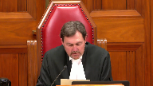
:::

Good morning to all.

Please be seated.

In the case of Transportation Safety Board of Canada against Kathleen Carol Byrne et al.

For the appellant Transportation Safety Board of Canada, Mr. David Taylor, Richard W. Norman, Alissa Holland, for the respondent Air Canada Pilots Association, Christopher C. Rothen, Andrew Montag, Rinald, Adrianne Fanjoy, for the respondent Air Canada John Doe number one and John Doe number two, Clay Hunter, for the respondent Airbus SAS, Christopher Eubard, Emmanuel Poupard, Jesse Hartree, and Brittany Sircois, for the respondents Kathleen Carol Byrne, Asher Adara, and George Leiboy, Jamie Turnback, Raymond Wagner QC, Kate Boyle, for the respondent NAV Canada, Stephen Ronan, and Robert B. Bell, for the respondent Halifax International Airport Authority, Michelle L. Che, Scott R. Campbell, Aaron J. McSorley, for the respondent Attorney General of Canada representing Her Majesty the Queen in right of Canada, John Provart.

Please note there is a publication ban and confidentiality that exists in this matter pursuant to subsection 28-6 of the Canadian Transportation Accident Investigation and Safety Board Act, and rule 8506 of the Nova Scotia Civil Procedure Rules.

Mr. Taylor.

**Speaker 1** (00:02:20): Good morning, Chief Justices, Justices.

::: {.column-margin}

:::

This appeal raises two questions of statutory interpretation related to the protection that Parliament intended to confer to on-board recordings like an airplane's cockpit voice recorder.

First, the analysis the court or coroner must adopt in deciding whether to pierce the CTAISB Act's on-board recording privilege.

And second, the range of tools available to assist a motions judge or coroner in making that determination.

The TSB submits that these questions must be answered in a way that respects Parliament's legislated policy choices in favouring transportation safety.

The Transportation Safety Board of Canada is Parliament's instrument in the federal sphere for unearthing the causes and contributing factors of significant aviation, marine, railway, and pipeline transportation occurrences and accidents and making recommendations so that they do not happen again.

To achieve this mission, Parliament has given the TSB a number of tools and protections.

Primarily, the tools address the TSB's ability to get information, while the protections prevent most other actors with interests arising from transportation occurrences from accessing the fruits of the TSB's work.

This appeal addresses one of those protections.

My submissions this morning will cover three areas.

First, the TSB's purpose and the architecture of the CTAISB Act as that sets the context in which this statutory interpretation required in this case must be conducted.

Second, the test for disclosure of on-board recordings under paragraph 286C of the CTAISB Act, which the TSB says requires the party seeking disclosure to demonstrate exceptional circumstances in the litigation that cannot be overcome with the exercise of reasonable diligence.

Put another way, these exceptional circumstances have to undermine the adversarial process in a way that can't be addressed by ordinary techniques and doctrines.

And finally, whether the procedure in 286B of the CTAISB Act supports the TSB's request to make in-camera submissions in this case.

While my submissions will be in English this morning, the appeal addresses certain questions of bilingual statutory interpretation.

All right, thank you very much.

**Speaker 2** (00:04:38): conséquence

, il me ferait plaisir de répondre à des questions en français dans le cas où cela sera utile.

**Speaker 1** (00:04:46): Turning to the purpose of the TSB and the CTISB Act's architecture, the TSB notes that for over 30 years it has had exclusive jurisdiction over investigations into the causes and contributing factors of all aviation, marine, railway, and pipeline accidents and incidents that fall within the federal sphere.

::: {.column-margin}
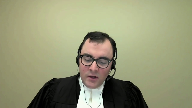
:::

The TSB is not a regulator.

Parliament has tasked it with doing this work entirely outside the context of the federal public administration.

As set out in sections 7, 14, and 15 of the CTISB Act, which are at tab 2 of the TSB's condensed book, the TSB's work takes place on the basis of investigations that produce reports.

These reports identify safety deficiencies and make recommendations to correct them.

In this work, it's important to note that the TSB gets to go first.

No other federal entities get to examine accidents causes and contributing factors when the TSB is on the scene.

And with the exception of the RCMP, the TSB's activities take precedence over non-safety related federal actions related to accidents and incidents.

**Justice Kasirer** (00:06:01): Mr. Taylor, don't you think it's wise to, when you're stating the purpose, to very quickly remind us of the restriction that Section 7 places on the board?

::: {.column-margin}
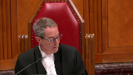
:::

That is to say, it's not the function of the board to assign fault, or determine civil or criminal liability.

Um, that no finding of the board shall be construed as a signing fault, and indeed, findings of the board are not binding.

I mean, surely that's pretty key to what's going on.

**Speaker 1** (00:06:31): here today?

::: {.column-margin}
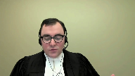
:::

You've anticipated my next submission, Justice Cazenor.

Those restrictions in the TSB's submission have to do with the preservation of the TSB's focus on safety.

And the preservation of the TSB's focus on safety is important because it separates the TSB's work, including the sources of evidence on which that work is based, from any criminal, civil, administrative or disciplinary proceedings that arise in the course of the flow from the transportation occurrence in question.

And so the separation that you're referring to comes from 7.2, subsection 7.2's restriction on the TSB assigning fault or determining civil or criminal liability.

And there's a corresponding restriction in section 7.3 on construing the TSB's findings as assigning such fault.

And subsection 7.4, of course, clarifies that the TSB's findings aren't binding on the parties to any other proceeding.

So that's absolutely a key element of the architecture from the TSB Act.

And that key element is reinforced by the balance of the statutory scheme, which establishes a system of privileges and special evidentiary rules that are enacted in the Act.

Those provisions on the special evidentiary rules and provisions are at tab 4C of our condensed book.

Just by way of summary, the privileges cover results of medical examinations that are compelled by the TSB representations by interested parties on draft TSB reports, on-board recordings, like in this case, witness statements given to the TSB investigators and the identities of individuals reporting transportation occurrences.

**Justice Kasirer** (00:08:11): My point, and sorry, I didn't mean to cut you off.

::: {.column-margin}
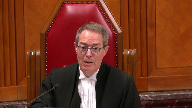
:::

Just to follow up, my point was that here we have right at the core of the act a reminder that we're not dealing with absolutes, so that when you end up pleading the privilege, that the statutory privilege, unlike some other privileges, is not an absolute one, and Parliament had in its mind from the get-go the kind of balancing that Section 28 sends us upon.

**Speaker 1** (00:08:45): Parliament certainly had in its mind that other entities and actors are involved in events following from transportation occurrences, but it also had in its mind the importance of allowing, like I said, the TSB to go first and the importance of ensuring that the TSB has forthright and complete disclosure from the parties.

::: {.column-margin}
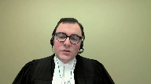
:::

And I'll get to this when we get to the Section 28 test in more detail, but effectively what we see in the lower courts and in the Air France decision is a reweighing of that policy choice by Parliament of the importance of separating the TSB's work including its sources from civil litigation.

And while there is an exception to the privilege, which is where the interests of justice require, the evaluation of that exception doesn't entail reweighting the importance that Parliament has given to the privilege.

It entails considering that privilege, which is a legislated policy choice, against the circumstances of the litigation that come before the Court.

**Justice Côté** (00:09:44): Mr. Taylor, is there a restriction in Section 7.2 of the Act, is there a link between that and another provision of the Act, which is 28.7, where the use of an on-board recording is prohibited in different proceedings, but also in legal proceedings?

::: {.column-margin}
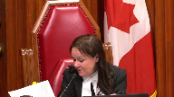
:::

**Speaker 1** (00:10:07): There's a similar concept at Play Justice Côté, but they aren't quite the same, because Section 7-2 addresses the ultimate object of the TSB's investigations, which is a determination of what happened and why, and how to prevent it from happening again.

::: {.column-margin}
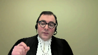
:::

And specifically, Parliament is carving out who is at fault from that.

28-7 has to do with the admissibility of one of the sources of the TSB's evidence, should it be produced in litigation.

That's a protection for the individuals who are involved, whether they're air traffic controllers or pilots, as in this case, or individuals working on the bridge of a ship or in a pipeline control room.

And so 28-7 isn't about the TSB's own activities.

7-2 is really aiming at the TSB's mandate and what job it's doing in writing its reports.

But it's important to clarify that 7-4, that says the findings aren't binding, establishes that in addition to the restriction in 7-2 of the TSB getting into who is at fault, the conclusions the TSB reaches aren't to be taken and applied rotally.

They are effectively a first look, and other processes may reach different outcomes.

But they're also not to be taken as items that can't be used at all, because we know from section 7-3 that the board is not, I'm sorry, from section 7-2 that the board isn't to refrain from fully reporting on the causes and contributing factors merely because fault or liability might be inferred from the board's findings.

So the board's findings clearly have some role to play in the events that will unfold following the report, even if it's contingent.

**Justice Rowe** (00:11:52): Picking up on a couple of questions by my colleague, Justice Casira, what I see, and I think which is consistent with what you've said to us, is that this legislation is intended to provide a very carefully crafted role for the board in accident investigation, but to do so in a manner which is consistent with and does not impair or undercut other functions carried out, for example, by the courts.

::: {.column-margin}
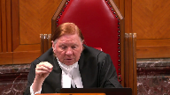
:::

And the only point at which I might take a little bit of issue with you is that you seem to suggest that because the board goes in first, or perhaps I'm hearing something you haven't really said, that there's a hierarchy here, that the interests of the board have to be served and everything else is subordinated to it.

Because I don't see that.

I see this as a scheme which is meant to be consonant among all of the purposes, albeit for practical reasons, the board has to be first on the scene.

**Speaker 1** (00:13:08): Certainly, the reference to the board going first, as you say, it has to do with the way the investigation plays out, but the submission I'd make is there is a certain priority that's being given here to some of the board's activities.

::: {.column-margin}
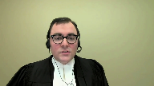
:::

In some cases, the priority is absolute.

So, for instance, in the case of representations on draft reports, those are privileged, and there's no exception.

And those would ordinarily be items that would be relevant to civil litigation flowing in terms of the party's reactions to the Transportation Safety Board report and the comments that they made.

In other cases, like witness statements and onboard recordings, there is an ability for the court to pierce the privilege in appropriate cases.

But where I say the idea of priority comes in is the idea of what is an appropriate case.

And that's fundamentally, and I'm now turning to my submissions on 286C, the error that we see in the courts below is to devalue the importance of the privilege by reweighing Parliament's policy exercise firstly, and secondly, by overstating the requirements of the public interest in the administration of justice.

And that results in a test, which is particularly in the context of a CVR, which is such excellent evidence that leads to a tendency to disclosure, which isn't what Parliament intended in protecting these pieces of evidence.

And the way to consider Parliament's intention in my submission is to return to the start, to what was the status of these onboard recordings of common law, because they existed before the TSB's predecessor, the Aviation Safety Board did.

And we know this because in the Dubin Commission, Justice Dubin considers the common law protection to these CVRs and finds that really it's in the nature of a public interest immunity or the Wigmore Privilege, the four-part case by case test.

And in that situation, he recommended ultimately that there be a statutory privilege that would involve the, and the quote is, weighing the public interest in the administration of justice against the public interest in maintaining confidentiality.

And of course that echoes to a great deal the fourth step of the Wigmore test, but it's not the language that Parliament adopted.

And we have the full text of section 28 under tab five of our condensed book.

And in English, the language adopted was in the circumstances of the case that the public interest in the proper administration of justice outweighs in importance the privilege attached.

And in French, it's dans les circonstances de.

**Speaker 2** (00:15:51): l'espèce, l'intérêt public d'une bonne administration de la justice à prépondérance sur la protection conférée.

**Speaker 1** (00:15:58): So this language is unlike the Wigmore-esque language that Justice Jubin suggested.

::: {.column-margin}
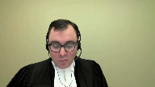
:::

It's language that doesn't contemplate reweighing or reanalysis of the purpose or importance of the CVR's confidentiality.

Its focus instead is on whether the requirements of the proper administration of justice override the privilege.

Indeed, the French version of the statute doesn't use the word importance at all, or any language that evokes the court conducting an exercise to weight or give some kind of weight to the privilege.

It talks about the circumstance de l'espèce, which relates to the intérêt public d'une bonne administration de la justice.

It's about the nature of the case that is before the court and what's required for trial fairness.

And so in this regard, the TSB strongly disagrees with the representative plaintiff's characterization of this test as being a discretionary one.

And that's paragraphs 81 to 91 of their factum.

The court must uphold the privilege that Parliament mandated.

And that's not a privilege that involved re-questioning the basis on which privilege was afforded.

So in considering the –

**Justice Kasirer** (00:17:17): Mr. Taylor, I'm going to ask you, while you're thinking, to go back on your reading of the French text, which you're suggesting it's saying something different.

I do appreciate that words aren't precisely...

It's not literal translation, but you mentioned...

**Overlapping speakers** (00:17:35): les circonstances de...

**Justice Kasirer** (00:17:36): les circonstances de l'espèce apply differently in the French and the English?

How do you see that?

**Speaker 1** (00:17:41): No, the circumstances of the case and the circumstances de l'espace in my submission do the same work.

::: {.column-margin}
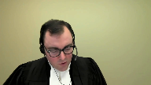
:::

It's more the use of the word importance.

And so the French and the English are a little bit difficult to line up because the French is in a single block as opposed to being broken down in three paragraphs.

But in C, they speak of, concludes in the circumstance of the case that the public interest in the proper administration of justice outweighs in importance the privilege attached.

And so this is the phrase I'm catching on is outweighs in importance.

**Justice Kasirer** (00:18:13): So I guess the real question, you mentioned bilingual interpretation at the front end, is there a discordance here that has an effect in law?

**Speaker 1** (00:18:23): Yeah, the discordance I would submit, and this is the the s'il conclut, which starts about halfway through the paragraph on the French side of the page.

This is under tab five in the TSB's condensed book.

So the discordance here is...

**Speaker 2** (00:18:35): S'il conclut dans les circonstances de l'espace que l'intérêt public d'une bonne administration de la justice a prépondérance sur la protection conférée à l'enregistrement.

**Speaker 1** (00:18:44): And so the exercise that we see in particular, Justice Strathy conduct in the Alphonse case and was adopted by the Chamber's judge in the Court of Appeal in this case is one in which essentially the court arrives to section 28 sub 6C as a blank slate.

::: {.column-margin}
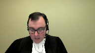
:::

It must decide what is the importance of the proper administration of justice and what is the importance of the privilege.

And then based on the weight it determines to those two factors must conduct a balancing exercise.

And the TSB submission is that we know what the importance of the privilege is.

The importance of the privilege is to protect pilot privacy and to promote the integrity of the TSB's safety investigations.

And we know this because of the process that parliament has gone through in the legislative history but also the broader purpose of the act which is to carve the TSB out from the administration of justice so that it can conduct safety investigations.

And in Canada safety investigations are effectively to be a safe space for those involved.

They are not fault-based.

They should be ones in which individuals participate so that we get at the causes and contributing factors of an occurrence.

So the TSB has full ability to make recommendations to prevent them from happening again.

And so because of that important priority it's not for the court to arrive and say, well, parliament was wrong in the way that it's structured this privilege or in the assumptions that it made.

We had, you know, the respondents point a number of times to justice Dubin and his commentary on what was a reasonable basis or not for establishing the privilege.

And we have that at tab 6B of our condensed book

and I'll just turn it up here.

And so this is in from the aviation safety commissions report

and it's over on the last page of the tab.

And it's the last paragraph before the heading for use in criminal proceedings.

And so justice Dubin says it cannot be assumed that the information provided by a cockpit voice recorder would cease to be available if portions of it are held to be necessary in civil proceedings as a result of a ruling by a judge that the interests of justice require it.

It would be undesirable to create a privilege on the ground that those seeking it would otherwise not obey the law.

And in my submission, this is linked to the wording I had noted earlier, which is highlighted further up the page in which justice Dubin is proposing that what be weighed is the public interest in the administration of justice against the public interest in maintaining confidentiality.

But the wording that parliament has selected is emphasizing that it's the privilege that is the privilege that must be pierced or overridden and not the public interest in confidentiality.

And so there's not a role for the court here in returning to the privilege and reconducting the policy exercise that parliament has done in enacting the legislation.

And that's just to return to the point I was making on the French, the absence of the word importance and the use of the word preponderance is we're really looking at an override provision here.

We're looking at whether the circumstances of the case as they relate to the public interest in the proper administration of justice justify overriding the privilege.

**Justice Kasirer** (00:22:04): Surely preponderance should be matched without ways.

**Speaker 1** (00:22:10): Yes, outweighs and preponderance go together.

::: {.column-margin}
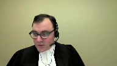
:::

But where I'm going to is this idea of the court needing to conduct for itself an evaluation of the privilege's importance when we know what that importance is from the scheme of the act and the context in which it was enacted.

And so really, that's a submission from the TSB that there is an error in the courts below in re-evaluating the importance of the privilege.

Essentially, it took the importance of the privileges being opened to debate as opposed to a policy choice that was made by parliament.

And the result of this re-weighing exercise, and that's seen at tab 6E of the TSB's condensed book, is a conclusion effectively that the privilege attached to the onboard recording is low, or the value of the privilege attached to the onboard recording is low.

But that analysis that reaches a conclusion that it's unlikely that these feared of circumstances are going to come to pass, it's something that parliament would have had in mind when it enacted this statute.

This enacting exercise happened after Justice Dubin's report, and the parliament selected different words than those that were suggested by Justice Dubin.

**Justice Jamal** (00:23:28): Mr. Taylor, could I see, just to see if I've understood your argument, is it that some of the comments in Air France of Justice Strathes, he then was, and then adopted in this case, some of the comments are related to disclosure in this case and the chilling effect in this case, but some of the comments really go beyond this case and really become matters of general application in any case.

::: {.column-margin}
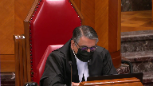
:::

So, for example, paragraph 135 of Justice Strathes' decision, he does talk about having great difficulty accepting disclosure in this case would have a chilling effect and then talks more generally as if pilots generally are responsible and wouldn't curtail their conversations because of the risk of disclosure.

Is that the point?

**Speaker 1** (00:24:20): That's part of the point, Justice Jamal, it's that it's a generic conclusion that's been applied and it's the same generic conclusion that Parliament had before it in the Aviation Safety Commission's report.

::: {.column-margin}
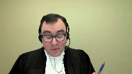
:::

And as I'm planning on turning to in a moment in the 1994 Review Commission's report.

But it goes further than the generic conclusion and it's really it's a disagreement with Parliament's policy choice.

And it's a similar disagreement that we see in the Scottish Lord Advocate case that's cited by the representative plaintiffs in which again it's this view of the unlikelihood of the feared consequence which is the part the pilots making different statements are acting differently in the cockpit, which is going to provide, you know, less safety evidence on the CVR recording.

And, and it's, it's in my submission

it's not consistent with a safety focused approach which is how the TSB is public safety litigate public public safety legislation should be interpreted.

Safety focused approaches are ones that that anticipate or or that anticipate or attempt to identify potential risks that should be mitigated, as opposed to waiting to be convinced, which is the wording that that is used in the courts below is that they're not convinced that the, this is justice, the chambers judge that they're not convinced that the, that the pilots would alter their conduct safety focused approaches see an apprehended risk and then impose mitigate mitigative measures in advance.

So just to pause here on the importance of the CVR is safety evidence.

It's important to note that the CVR is our excellent evidence they are contemporaneous recordings of the events that happened shortly before a transportation occurrence.

Actually, yeah.

**Justice Rowe** (00:26:18): I have to, I think there's a precision that needs to be brought here.

They're excellent recordings of what was said.

What happened is in the data recorder, is it not?

**Speaker 1** (00:26:31): The flight data recorder, that's correct.

::: {.column-margin}
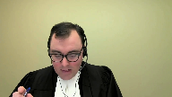
:::

You would have in the CVR indications of sounds in the cockpit, as opposed to not just what was said or communications that came in, but the point at which or the various altitudes which events occurred and the times that they occurred would be in the FDR, which is not a privileged source of evidence.

It's it's evidence that's available to to the parties.

And just just briefly before I return to to my submission on on the importance of the privilege, just the other thing to note is that this this evidence, the CVR, for that matter, the FDR, they only exist because they've been installed for the purpose of helping reconstruct events leading to an aircraft accident.

Litigation related purposes are ancillary to the reason that they exist.

The use that the parties in this case want to put the CVR to, which is to help establish causation in the context of multiple cross claims between defendants, isn't the reason that these CVRs were put in the cockpit in the first place.

**Justice Rowe** (00:27:32): But is that really true?

::: {.column-margin}
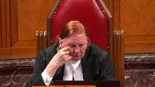
:::

I mean, that comes back to the point I made earlier.

Implicit in what you're saying is that everything here is about the operation of the Transportation Safety Board.

Everything else is subordinate to it.

The only reason we have these devices here is for accident investigation and for recommendations that can assist in avoiding accidents in future.

But is that really accurate?

Are these devices not put in for a variety of purposes, the principal one of which may well be transportation safety and accident investigation?

But they also serve other purposes, which brings me back to my earlier point.

Should not the legislation be read as being consonant with a variety of purposes, albeit providing a proper basis for the Safety Board to carry out its unique role?

**Speaker 1** (00:28:30): I would disagree with that, Justice Roe, because the genesis of the onboard recording is actually these actions outside of legislation in the 1970s.

::: {.column-margin}
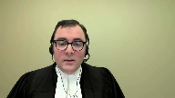
:::

I think Justice Goetze and Hyde Park refers to it as a social contract between the carriers and the pilots.

These devices would be allowed to operate in the cockpit.

But more material to the modern approach, I would say, is the recent changes we saw in the Railway Safety Act having to do with locomotive voice and video recorders.

And in those cases, it's very clear that the presence of those recording instruments in locomotive cabs is safety-related.

We cover this in our factum in some detail, but there are a number of exceptions to, or a number of legislated mechanisms by which they can be used, but they're all for safety-related purposes or finding threats to railway safety.

They don't have to do with civil litigation.

That falls to the kind of exercise in this case about piercing the privilege.

And so it's really outside of the transportation safety context.

It's a superordinate interest with respect to trial fairness.

That is the place where it can be pierced.

And so essentially, it's the availability of this excellent evidence can mitigate a serious problem in another process, as opposed to it being one source among many that are available to the parties.

If it was just to be one source of many available to the parties, we wouldn't have a privilege.

Privilege implies, privilege connotes, that the disclosure is going to be the exception, and it not being part of those other proceedings is the rule.

And just returning to the importance of the privilege in my submission, that Parliament had this view before it in enacting and maintaining the legislation that the privilege was somehow not important.

In 1994, the TSB Act went through review.

It was a mandatory statutory review required when it was enacted.

And one of the comments of the review commission was essentially that the TSB Act's privileges were illusory and of little value, and they recommended doing away with the privileges and replacing them with an alternate regime.

And those comments are at tab 60 of our condensed book.

But nonetheless, Parliament gave further emphasis to the privilege in 1998, when it made amendments flowing from this review exercise, when they further limited the use of CVRs by in 28.7, subsection 28.7, rendering them inadmissible in civil proceedings against certain actors.

And so it's a reinforcement of the privilege as opposed to a departure.

You know, even though there were pretty clear statement from the review commission that they didn't view these privileges as valuable.

So again, it's a decision by Parliament that it's found value in these privileges.

And that's confirmed at tab 6F of our condensed book, we have excerpt from Hansard in which both the government sponsor and the opposition critic for the amending legislation in the House of Commons are indicating specific support for limiting the use of CVRs in civil proceedings.

**Justice Côté** (00:31:40): So, Mr. Taylor, what should be the test according to you, because you disagree with the test in Air France, because you say, I acknowledge that the CVR is highly relevant and reliable evidence, nobody is disputing that, but knowing that, the parliament decided to protect this through the privilege mechanism, so and in Air France, when we read Air France, we see that there was a lot of focus on reliability, relevance and reliability, so what should be the test, because for the weighing exercise, because the parliament left the door open to that exercise, knowing that it is highly relevant and reliable evidence, so what should be the test according to you?

::: {.column-margin}
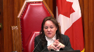
:::

**Speaker 1** (00:32:30): So according to the TSB, the test should be the same longstanding test that's worked with no difficulty for witness statements, and that's that the party seeking disclosure has to show exceptional circumstances in the litigation.

::: {.column-margin}
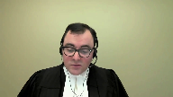
:::

That can't be overcome with the exercise of reasonable diligence, and to try and provide some clarification, these go to trial fairness and to items that the adversarial process can't overcome.

And there's a lot of emphasis when considering the public interest in the administration of justice in the courts below, of effectively the certainty that the CVR would provide.

And at tab 9a of our condensed book we've got a reference to paragraph 67 of the Chamber of Judges decision which is in his concluding paragraphs, and he speaks there of the CVR being able to provide a complete understanding of the flight crews awareness and response to factors that were significant to the decision to land the aircraft and the conditions existing at that time.

And this view echoes Justice Strathy's finding in Alphonse at paragraph 127, where he says there's a public interest in ensuring that the information available to the court in the performance of this important responsibility is as complete and reliable as possible.

And with respect to the courts below and to Justice Strathy as he then was, trial fairness doesn't require a complete understanding of events.

There are many elements of the adversarial process that operate without difficulty in the absence of a complete understanding.

Indeed, the balance of probability standard itself operates in terms of greater likelihoods, as opposed to certainty.

It's important to recall that almost all litigation plays out without a contemporaneous record of the facts.

Our adversarial system provides both parties with a number of tools to prove their case and requires the trier of fact as a neutral decision maker to determine whose version of events is most likely true, and decisions made at trial are fair, even where there is no complete certainty as to the facts.

In this regard, the—

**Justice Côté** (00:34:26): when witnesses do not recall what happened in the cockpit.

::: {.column-margin}
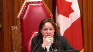
:::

Let's say that there is a discovery and the crew, they don't recall what was said in the cockpit.

Is the balance of probability standard settles the issue or is it an element in favor of disclosure?

**Speaker 1** (00:34:53): So the submission of the TSB on that point is that the frailty of human memory is something that is common to the civil litigation process.

::: {.column-margin}
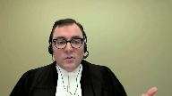
:::

It's something that has to be dealt with by the ordinary tools of the litigation process and these ordinary tools include things like witnesses refreshing their memory, it includes things like the ability to adopt a past recollection recorded, it includes you know preferring the evidence of a witness who does remember or has a greater ability to recall.

These are all things that trial judges have to deal with on an ordinary basis and to contextualize it in this case we've included in our condensed book under tab 11 there's a chart that was prepared by the respondent Airbus in the court below to highlight essentially information from the TSB report that was reflected items that the pilots that couldn't recall in their discovery and what we've done in this tab is to indicate you know that the nature of the ability or the nature of the inability to recall of the pilots and effectively what we see here is we see witnesses doing their best to piece together what had happened.

We see refreshing memory based on the TSB report in some cases adopting what the TSB said in some cases having an incomplete you know recollection of when in the flight something may have happened but remembering a significant point like there was a discussion around the level of fuel or knowing that something had happened but not being certain when and obviously these are just examples that are in the condensed book and there are other instances where in which the pilots don't have a recollection but the submission is that the focus on those gaps without considering their impact on trial fairness because of the essentially position taken or the conclusion reached that what the public interest in the administration of justice requires is certainty is something that led the courts below into error.

There has to be some kind of undermining of the process and that's how it has evolved in the witness statements context under section 30 sub 5 and we have a recent summary of that from the court, the Superior Court in Quebec and that's under a tab that's under tab 10a in our condensed book and in that case the court finds it emphasizes the nature of the exceptional circumstances test and it's paragraph 42 notes

**Speaker 2** (00:37:31): of the year, a certain consensus among the decision-makers who had to look at the demands related to the raising of the privilege, that the one who requires it has the burden of demonstrating exceptional, rare, special or unusual circumstances, or even an impervious incentive to communicate the declaration.

::: {.column-margin}
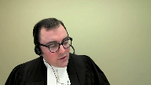
:::

**Speaker 1** (00:37:50): And then moving on, they speak of their memory and those witness statements were available to the pilots without piercing the privilege, as under the TSB regulations, a declarant of a statement can request a copy without piercing the privilege.

::: {.column-margin}
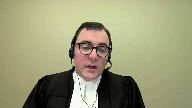
:::

And in that case, the refreshing of the memory would be in our submission equivalent to using litigation privilege notes to prepare for discovery.

And in our submission, the evidence that is under discovery shows an ability of these witnesses to refresh their memories in some cases based on the TSB report.

And we know that the TSB did not play the CVR to these witnesses in the course of working with them in preparing the report, it was interviews that happened shortly after the fact.

That's the privilege of...

**Justice Kasirer** (00:38:37): So, Mr. Taylor, is the privilege over witness statements on all fours with the privilege we're speaking of here, one might have thought it should be stronger in that it requires cooperation from a witness after the accident.

::: {.column-margin}
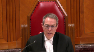
:::

I'm not sure it's a perfect comparison.

**Speaker 1** (00:38:57): Well, the comparison in my submission comes from the fact that the legislation uses identical wording for both piercing provisions.

::: {.column-margin}
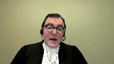
:::

Really, the only material difference between the two in terms of how Parliament has enacted it is the TSB's absence from the process with witness statements.

And as 28 refers specifically to the TSB participating, whereas under Section 30 the TSB doesn't have a right to participate, although certainly it has intervened as a friend of the court in those circumstances.

They're not, they're not.

**Justice Kasirer** (00:39:29): they're not identical, that's, I don't mean to, it strikes me that they're not identical, and even the way in which the act speaks to them, whether you take importance or simply la protection conférée à l'enregistrement, whether it's the same language or not, it's contextualized around the nature of the privilege and its purpose.

::: {.column-margin}
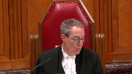
:::

It's not gonna be just this, exactly, for example, for a memory point, exactly the same process.

**Speaker 1** (00:40:02): Well, my submission, Justice Kasserer, has to do with the wording that the Parliament has selected.

::: {.column-margin}
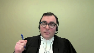
:::

And so it's again, it's in the circumstances.

I'm just at tab 4C of the condensed book.

It's in the circumstances of the case, the public interest in the proper administration of justice outweighs in importance the privilege attached to the statement.

And so they're using the same statutory language is my point.

And in terms of the different differential weight, well, that returns to my earlier submission that the Parliament has selected the importance to go to these statements.

And it's not the role of the court to reweight them through its own interpretation exercise of the importance of these statements.

In both cases, the purpose of the privilege is to protect the integrity of the TSB's safety investigation by keeping its sources separate insofar as is possible without compromising the proper administration of justice from the civil litigation process.

**Justice Rowe** (00:40:59): There is a suggestion in your submissions that you have contrasting an accurate and faithful reading of the legislation, which emanates from the Transportation Safety Board, and a sort of an errant or rogue meaning given to it by the courts.

::: {.column-margin}
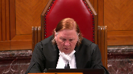
:::

This privileges the Safety Board as an institution to interpret legislation.

I think that really is the role of the courts.

So I think what you need to do as opposed to saying, it's up to you of course, here's the correct basis and here's what the court put forward.

I mean, I think you have to tell us how it is that the court erred.

I mean, you're just asking us to assume that the court erred.

I mean, of course, the interpretation of a statute is a question of law and therefore review and a stand of correctness.

But your submissions almost seem to be calling for us to almost dismiss what has been said out below.

I mean, can you take us to the passages?

Perhaps you've been doing it

and I simply haven't followed it, where here's where the court made its mistake.

**Speaker 1** (00:42:20): So in our submission, the clearest indication of where the courts have gone astray in this, and there's no intention to imply there's any rogue actors in the judicial system, it's more the submission is that parliament has made the choice as to the importance of the privilege as a policy matter, and has made that choice despite other elements in the legislative history suggesting the privileges weren't important.

::: {.column-margin}
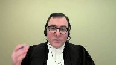
:::

In the face of those suggestions, it maintained the privileges.

But how it plays out in the test, that's in the chamber's judge's decision, it's paragraphs 67 and 68.

And in 67, this is on the side of the, this is a tab 9A of our condensed book.

It's on the inside of the, this is on the side of the administration of justice.

It finds the information is important to having a complete understanding of the crew's awareness and response to factors that were significant to the decision to land the aircraft and the conditions existing at the time.

So the error there in the TSB submission is finding that what is required by the proper administration of justice is a complete understanding.

As I said a few moments ago, the trial fairness and the adversarial process can accommodate and comprehend the weaknesses in witness memory and a lack of certainty as to exactly what happened.

Litigation almost always plays out without contemporaneous events.

**Justice Brown** (00:43:41): Can I, following up on Justice Roe, this is all very helpful, but what would be particularly helpful for me is to understand, is to know your submission about the balancing itself that was performed by the Chamber's judge and in particular what consideration the judge gave to the importance of the privilege, to that side of the balancing.

::: {.column-margin}
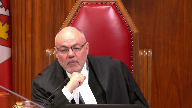
:::

And that was my next submission, Justice Brown, so thank you for pushing it forward.

**Speaker 1** (00:44:15): you

**Overlapping speakers** (00:44:15): I'm sorry.

Pushing me along there.

I'm sorry.

**Speaker 1** (00:44:17): And that's in the next paragraph, paragraph 68 under 9A in our condensed book, and it says, notwithstanding the able arguments, to the contrary, I'm not convinced that the release of the CVR under the very stringent conditions proposed would interfere with aviation safety, damage relations between pilots and their employers, or would impede investigation of aviation accidents.

::: {.column-margin}
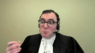
:::

And this is again reflecting the generic conclusion that's been reached that pilots aren't going to modify their conduct in the cockpit.

And so the result of that is that you have an importance of the privilege that is effectively not important.

It's a very low importance, and then a very high importance on the interest in the administration of justice by putting the standard as being towards certainty as to what's happened in the cockpit.

And so that really excuse the nature of the balancing exercise.

And in our submission, a more appropriate test is the test applicable for witness statements, which is the exceptional circumstances test.

It accords with Parliament's broader intention that it is going to be a rare thing, that safety related evidence is going to come and find its way into a civil or a criminal courtroom.

**Justice Jamal** (00:45:23): Mr. Taylor, your exceptional and rare circumstances test was specifically considered by the Court of Appeal in Air France, as you know, in paragraph 20, and rejected because the statutory language doesn't call for exceptional circumstances.

::: {.column-margin}
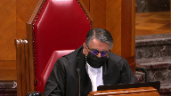
:::

It doesn't talk about it being rare.

It talks about it being a case-by-case balancing.

So, really, you're taking us back to the statutory language, but you're asking us to effectively read an exceptional circumstances or rarity test into the provision.

**Speaker 1** (00:45:52): Well, the exceptional nature in my submission comes from the role of the TSB in this process in which we see, you know, Parliament has done in my submission an exceptional thing.

::: {.column-margin}
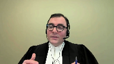
:::

It has created an entity, a federal statutory entity, that it has carved out from the administration of justice.

It has said it has no role to play in assigning fault.

It has created a number of privileges around its work.

It has made its investigators, you know, not competent or compelable witnesses, and it has made its opinions inadmissible in court.

And so, the reading the language in 286C in isolation from the broader scheme of the act, which is really to create a separate environment in which causes and contributing factors are determined and recommendations are made as a result, it's really that broader context where the exceptional circumstances arise from.

And the idea that what we're looking at is something that's putting at stake the public interest in the proper administration of justice, which again, given the adversarial, the nature of the adversarial process is something that something quite significant would have to arise to put in jeopardy.

**Justice Karakatsanis** (00:46:58): Mr. Taylor, can I take you back to the interpretation of Section 28.6.b?

::: {.column-margin}
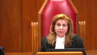
:::

And your position is that the board has a right in all cases to make submissions in camera.

For the policy reasons that you've given, as well as for the scheme of the act, what purpose, what policy purpose would be undermined if that was a matter of discretion for the trial judge?

And I guess I'm thinking about the instance here where the trial judge said he made a finding that he had no difficulty understanding the contents of the privileged information from his own review.

Is there something about the nature of the recordings or the nature of the board that would require the submissions be made even where the judge believes they've understood they don't need assistance in understanding the significance of the tape?

Or is this a case of not knowing what you don't know?

What are your submissions on that?

**Speaker 1** (00:48:11): So, with respect to 286B, your phrasing Justice Kerikatsanis or your statement of, you know, not knowing what you don't know, that's really where the TSB says Parliament's purpose in including, or the proposed interpretation of 286B and including a role for the TSB to make submissions in camera, whether as a matter of right or as a matter of discretion of the judge, it's to assist the judge in their review of the onboard recording.

::: {.column-margin}
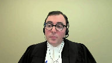
:::

So, you're accepting that?

**Justice Karakatsanis** (00:48:39): It could be discretionary, not mandatory.

I understood your position to be that there was an absolute right in every case to make —

**Speaker 1** (00:48:48): Certainly that is the position of the TSB in terms of the propulsive interpretation of 28-6B. 28-6B exists to effectively pierce the privilege to give the court or the coroner access to the onboard recording and to ensure that the TSB is a participant in the proceedings.

::: {.column-margin}
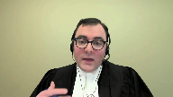
:::

And in our submission, the reason that Parliament has done that is to add value to the court's or coroner's review of the onboard recording.

And the only way that that value fully is given is if the TSB can speak to the contents of the CVR.

And that is where the position that it is something that should happen in, if necessary, in every proceeding.

It may not be, the TSB may not request it in every proceeding.

There's still the ordinary principles of proportionality in litigation that are at play.

But in cases where, like here, the TSB was seeking to essentially provide the court with a coded transcript of the CVR indicating all of the other places or all of the other sources, rather, for the information in the CVR, that's something that can't be done unless the TSB can speak candidly and the TSB can't speak candidly if it has to speak in open court about that point.

**Justice Côté** (00:50:06): Mr. Taylor, on that, I would like to clarify, and some people, some parties are saying that you will change your position from the chamber's judge until here.

So what you want is to be able to be alone in the courtroom with the judge.

**Overlapping speakers** (00:50:23): Correct. Correct.

So effectively, it's a confidential...

**Justice Côté** (00:50:26): want to proceed without giving notice to our friend on the other side, they can get notice, but we want to be alone with the judge in the courtroom to make our submissions.

**Overlapping speakers** (00:50:38): Correct, correct.

So it's it's it.

Apologies.

**Justice Côté** (00:50:40): And is there a way that you can make the submissions, because given the fact that the chamber's judge has listened to the recording, is there a way the board can make its submissions in a meaningful way in referring to, in general, to not the specific content, but to parts of the recording, because the other side will, the person who is requesting production, they will want to respond, and they need to know something in order to respond.

::: {.column-margin}
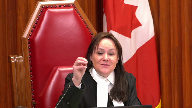
:::

Is there a way for the board to make those submissions in that way?

**Speaker 1** (00:51:13): Justice Cote, it will depend on the facts of the case in situations like this case in which the submissions that the board sought to make were all to do with the alternate sources of information for the evidence on the CVR.

::: {.column-margin}
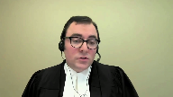
:::

It will be very difficult for the TSB to do that with specificity if it has to do that in open court.

It can point, as it did in this case, it can point to the FDR, it can point to elements in the TSB report, but it's difficult to say, well, when the pilot said at this point, you know,

**Overlapping speakers** (00:51:45): Mm-hmm.

**Speaker 1** (00:51:46): there was a concern about whatever factor might be at play.

::: {.column-margin}

:::

And here is the place you can see that while pointing to the alternate source will unveil the content of the CVR.

And so it's a situation where, for instance, if the issue is that the pilot is deceased, that is something where the issues about the importance of the privilege versus the proper administration of justice don't touch the content of the CVR in the same way.

So it very much depends on the content.

But just to emphasize something you said in one of your questions, Justice Cote, that the TSB submission is not that it would proceed on no notice to the parties or that the court should in some way be contacting the TSB receiving those submissions without the other parties knowing that this is going on.

It's very much more like the two-stage process the court describes in Bassey about informer privilege in which there is a first stage in camera hearing and then a second stage at which there are more broad submissions.

And in our submission, the court's inherent jurisdiction can go to those, can introduce measures that go to the fairness concerns that the parties might note.

There could be, as in Bassey, questions suggested before the hearing, the appointment of amicus to attend the in-camera hearing and make submissions on behalf of those not present.

And then, of course, public submissions after the fact with respect to the test, although those obviously wouldn't have the same level of detail on the content of the CVR as those that would happen behind the back votes.

Now, you view this-

**Justice Rowe** (00:53:14): You've used in camera an ex parte in a way that is almost interchangeable, but they're not interchangeable, are they?

No, no, I agree, Justice, no they aren't.

**Speaker 1** (00:53:25): And this is very much not in our submission.

::: {.column-margin}
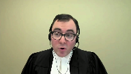
:::

While the word ex parte and in camera have been used interchangeably at different points by different parties in this litigation, the substance here is that it is a portion of the proceeding that would occur without the presence of the other parties.

That portion of the proceeding would be on notice to the other parties.

And so, ex parte proceedings, some are both ex parte and in camera.

Inter partes proceedings may have an in camera portion.

The substance here is really being able to address the content of the procedure.

I'm very grateful if you are in.

**Justice Rowe** (00:54:00): instruction in these matters, but mine was a preferatory comment.

::: {.column-margin}
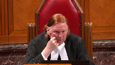
:::

And that is, just to follow up on what Justice Kara Katsanis, I think, posed to you, and that was, is this a matter, whether it's ex parte or not, of the discretion of the judge?

I understood the substance of your answer, and correct me if I'm wrong.

It isn't a question of the discretion of the judge.

It's the discretion of the safety board, because it is their right to appear before the judge ex parte, if they see fit.

So to put it in a nutshell, not the judge's discretion, rather the board's.

**Speaker 1** (00:54:40): We would say it's Parliament's procedure that's been set out in 286B and the procedure may or may not be required, depending on the facts of the case.

::: {.column-margin}
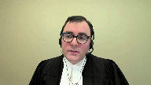
:::

Certainly in the alternative, if the court were to find that 286B is not read that way, it's certainly our submission that as a matter of the court's inherent jurisdiction and control over its own process, if that matter of the court, the coroner's implied jurisdiction, they could receive submissions on that basis.

So no, it's not a unilateral right, the TSB is saying it's created, it's something that's in the statute Parliament has created.

In 286B, Parliament is giving the court access to the in camera, to the CVR to analyze and study in camera, and it's also providing a role for the TSB in the proceedings, and the way that the TSB is able to assist the court fully in understanding the CVR is by being able to make candid submissions which can't be done in the presence of the other parties without piercing the privilege.

Thank you.

**Justice Côté** (00:55:43): You

**Overlapping speakers** (00:55:43): on

**Justice Côté** (00:55:43): to add to your submissions, because you made some submissions before the Chamber's judge, but you say that you could not make meaningful submissions, and I understood you about the existence of other alternatives.

::: {.column-margin}
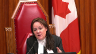
:::

**Speaker 1** (00:56:03): Exactly.

::: {.column-margin}
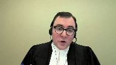
:::

Other sources of evidence and in the particular level of detail of providing a transcript that would be coded to indicate which portions of or which events that have happened in the cockpit either would be confirmed on the FDR in terms of the time that the plane changed, altitudes, etc., or would be found in other elements that the parties could rely on that aren't covered by the privilege in section 28.

**Justice Côté** (00:56:34): And as to the remedy you are asking for, you say that we should return the file to a chamber's judge, but not the same judge.

**Speaker 1** (00:56:46): as the chambers judge in this case has essentially already reached a number of conclusions with respect to the importance of the privilege and the events and circumstances related to the public interest in the administration of justice and so our submission is in a case like this it's appropriate for a fresh look at the CVR and the circumstances.

**Justice Martin** (00:57:05): and Mr. Taylor may I ask you what how would you have us think about the fact that the CVR can be used indirectly to refresh the recollections of the pilots and what that does to the privilege that you're asserting I mean it what that was a key factor for the Court of Appeal in the Air France decision and I wonder what you would say about that.

::: {.column-margin}
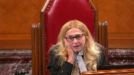
:::

**Speaker 1** (00:57:31): I would say in a case like that, it would be a factor going to the ability of the adversarial process to essentially deal with the frailty of memory that is present in the litigation.

::: {.column-margin}
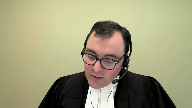
:::

In this case, unlike in Alphonse, the pilots did not require their memory to be refreshed by the CVR, and to my knowledge, the only parties to have listened to the CVR are the TSB investigators and the chambers judge.

So in this case, the less intrusive method of having reference to, for instance, internal notes at Air Canada regarding a safety investigation that occurred after the occurrence, or obtaining under the TSB regulations, the pilot's own statement to the TSB would be less intrusive ways of refreshing their memories to enable them to participate in the process.

One comment I'd like to make on the chambers judge's comments on the ability to understand the CVR, and that that is dispositive in the respondent submissions of this part of the TSB's appeal, is just to emphasize that providing technical assistance was only one element of the submissions the TSB wanted to make.

The other was, as I've mentioned, to provide that coded transcript to show where all of the content of the CVR could be found in other evidence.

And just with respect to the nature of the trial judge's conclusion on his ability to understand, and whether he knew what he didn't know, the conclusions are at tab 14A of our condensed book, and they're quite general, and they don't reflect the complexity of the CVR content which was noted by Justice Strathdee and Air France.

The paragraph 111, that's at tab 14B of our condensed book.

In paragraph 111, Justice Strathdee says the recording although enhanced for the last 30 minutes of the flight is not particularly easy for a layperson to follow.

However, the transcript provides a useful tool for understanding the recording.

The recording and the transcript would be readily comprehensible to an experienced aviation expert or pilot.

And we say those circumstances are at play in this case as well.

And that's evident under tab 14C, we have pages two to six of the TSB's report, which essentially summarized the events of the final half hour or so of flight AC624.

And those are quite technical in nature, the events that are summarized and we know from the submissions in this case that the CVR played some role in the TSB, you know, creating this summary.

And we would even say the respondent NAV Canada summary of the facts in its factum, which are under paragraphs 14D. Again, it's a further indication of the technical nature of what the court was doing, dealing with in this case.

And noting the time that Chief Justice Justice's, I just note that again the TSB asked the court to allow the appeal and restore the protection parliament intended to confer on onboard recordings.

We asked the parliament and not the courts to determine the value of protections provided to the integrity of safety investigations.

We also asked the court to confirm that courts and coroners may receive the benefit of full submissions from the TSB on an onboard recordings content when determining that the privilege should be pierced.

As is noted in our fact in the TSB brought this appeal to defend the important privileges created under the TSB act.

Even the public interest is engaged in the TSB does not have an interest in the underlying class action.

It seeks no costs and asked that no cost be awarded against it.

And I just note that the respondent NAV Canada has asked for costs throughout, but there's no basis for the court to interfere with the lower courts disposition of costs, as the TSB is seeking no cost if it succeeds and the lower courts ordered none.

Subject to any further questions Chief Justice Justice's those are my submissions.

**Justice Wagner** (01:01:14): Thank you very much, Mr. Taylor.

Mr. Christopher Ruthen.

**Speaker 3** (01:01:25): Thank you, Justices.

::: {.column-margin}
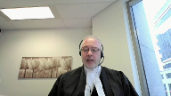
:::

As you know, the issue in this appeal is whether the privilege in the CVR is outweighed by the interests of the administration of justice.

On behalf of the Air Canada Pilot Submission, I have two submissions to make today.

The first concerns privacy and the second concern safety.

In terms of privacy, in discussing the importance of the privilege, all parties to this appeal have acknowledged that the privilege exists in part to protect the privacy interests of the flight crew.

In so doing, however, both the lower courts and most parties have focused on the actual content of the pilots conversation in this case, and whether the pilots were discussing quote unquote personal things.

This narrowly defines the privacy interests behind the privilege.

This too narrow conception of privacy is best exemplified in the motions judges statement that the CVR quote does not contain any private or scandalous material.

With respect, the CVR certainly contains private material.

What the motions judge and other parties to this appeal have done is to restrict privacy as a concept to the disclosure of personal information, touching upon core biographical information.

But privacy is about more than protection against disclosure of core biographical information.

**Justice Rowe** (01:02:46): a privacy interest in what is the rate of our dissent? Yes.

I would like an explanation of that.

**Speaker 3** (01:02:55): Yeah, there are two separate privacy interests in even statements such as that.

::: {.column-margin}
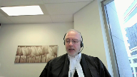
:::

The first is control over personal information.

Personal information, though, is more than and is wider than core biographical information.

And you'll see this, for example, in the DAG decision at paragraph 94, which is at tab three of the condensed book, that personal information includes a wide array of information, including opinions held about the job performance of other people.

And so that, Justice Roe, that statement that you've made is a form of personal information.

But the second and more important privacy interest impacted by even that particular statement is a freedom from surveillance.

That the act of surveillance in itself is privacy invasive.

**Justice Brown** (01:03:49): pilot in a jet.

Of course you're going to be surveilled.

**Overlapping speakers** (01:03:54): I was going to say-

**Justice Brown** (01:03:55): Just take a step.

**Overlapping speakers** (01:03:55): Step.

**Justice Brown** (01:03:56): back and take a look at what's going on.

**Speaker 3** (01:04:00): And justice is, of course, you're going to be supervised.

::: {.column-margin}
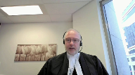
:::

And of course, you're going to be observed, which is true in any workplace.

But there is a material difference between constant surveillance on the one hand and supervision and observation on the other.

In this particular context, in this particular workplace, there is a justification for the surveillance.

And that justification is safety, the justification for the surveillance is for the purpose of investigating safety incidents after the fact and be able to correct in a prospective manner incidents that have occurred during the course of a flight.

**Justice Martin** (01:04:47): May I ask?

::: {.column-margin}

:::

May I interrupt and ask this question?

How do we go about measuring the privacy interest when it's kind of, well, it's required that these CVRs be placed in the aircraft?

So there's a law making the CVR mandatory.

And so does that impact on the privacy of the people that are being caught speaking?

**Speaker 3** (01:05:17): It certainly makes it difficult to use the normal terminology that we use of a reasonable expectation of privacy, that when there's a law that requires surveillance.

::: {.column-margin}

:::

Obviously, in a normal sense, there's going to be no reasonable expectation of privacy in the sense that the surveillance is is unexpected.

But as this court pointed out in Jarvis, the fact that you know that you're in a public place where you know that you could be recorded does not necessarily mean that the recording or surveillance has no impact on your privacy.

So, first, yes, of course it makes a difference in, we can't think about this as a reasonable expectation of privacy in that normal sense.

But second, we have to compare it to this is privileged as well.

The Parliament has said not only are we going to put the cockpit voice recorder in, not only are we going to require this surveillance, but then we are going to privilege it as well.

So when examining the privacy impact, it's not just the fact that pilots, of course, know that they're being surveilled and know that there is surveillance going on, but it's also that they are getting covered in knowing that the surveillance, the product of that surveillance is itself privileged.

And the purpose behind that is, in a sense, to protect the privacy interests of pilots, because this act of surveillance is so privacy invasive in and of itself that it warrants reflection, which Parliament has done in order to protect the privacy interests of pilots, that this surveillance in a way, it is warranted as a result of the safety sensitive nature of this position, but only to that extent.

**Justice Jamal** (01:07:01): How does the application of the sterile cockpit rules impact all of this because it seems to me it's quite an unusual situation.

::: {.column-margin}

:::

You know you're being surveilled.

You know that there are sterile cockpit rules in effect.

So really we're dealing with purely operational matters at this point.

**Speaker 3** (01:07:20): And justice that of course goes back to one of the first points I made, which was that the privacy interests at stake are more than just what I've called core biographical information borrowing from this court's decision in Sherman estate that during the sterile cockpit period the pilots are not supposed to be talking about their core biographical information that's that's sort of personal information, but they're still discussing other things that do have a privacy interest involved in them that meet the definition of personal information in other respects as well.

::: {.column-margin}

:::

And second, I'll say as well that

the, the concerns about or the expression of concerns about the stairwell cockpit.

They're suggesting that in light of the circumstances you should have known better.

And if you have nothing to hide why are you concerned about this, if you actually complied with the sterile cockpit rule, why are you concerned about personal information, because, you know, that sort of suggestion has been used to justify surveillance in other respects that we don't allow.

**Justice Moldaver** (01:08:30): What about the idea...

**Justice Kasirer** (01:08:32): What about the idea that the publication of the report could be as serious if not more serious an invasion of privacy?

::: {.column-margin}

:::

Certainly on these, if we were to extend it beyond the core biographical information, some of that might come up in the report.

What are your thoughts on that?

**Speaker 3** (01:08:52): Well, I guess I'll say first, having read the report, I don't think it did in this case.

::: {.column-margin}

:::

The report, using this specific report as an example, it recorded actions and activities, not necessarily the statements that were made or the verbal statements that were made in the cockpit.

So there's a difference between those two.

**Justice Kasirer** (01:09:16): Well, I'm thinking specific, of course, in this case, but I'm thinking of Justice Strathy's point.

::: {.column-margin}

:::

He makes the point in Air France as a general matter at paragraph 133.

He compares the pilot's general interest in privacy and then asks whether the report, as much as the CVR, is a menace to it.

It's not a menace to it, but it is a menace to it.

**Speaker 3** (01:09:43): And I suppose I'll say the same thing that the report discloses actions and activities, not necessarily the statements made, and that there is a different privacy interest in the actions versus the statements.

::: {.column-margin}

:::

The final point I wanted to make was about safety in this case that this is the privilege in the CVR is not just privacy for privacy sake that it is privacy for safety stake.

And I'd like to remind the court of the evidence of the Transportation Safety Board, who will notice the only participant in this appeal without a stake in the ultimate outcome of the of this litigation, where they have identified through the affidavit report paragraphs 85 through 89, the specific harm that has been occurring as a result of limiting the use of this privilege, or as a result of disclosing the CVR in other contexts in other litigation.

As a final point unrelated to both privacy and safety.

I noted that the plaintiffs proposed rely upon the Scottish decision the Lord advocates case.

I wanted to remind this court that at paragraph 58 of that decision.

The Scottish court said specifically this case will create no precedent, which is why the English courts and various Sussex decisions declined even consider the Lord advocates case, specifically if you look at paragraph 28 of the 2016 version of the Sussex decisions subject 20 questions, those are the association submissions.

**Justice Wagner** (01:11:30): Thank you very much.

::: {.column-margin}

:::

The court will take its morning break.

15 minutes.

The court is adjourned.

**Speaker 4** (01:12:54): Good morning Chief Justice and Justices.

::: {.column-margin}

:::

Let me start with a road map if I may.

I will begin by addressing the procedure for an application for production under Section 28 sub 6 including the board submission that it is entitled to make submissions in the absence of the parties.

I will then address the substantive test for production, what we say it is and why.

My colleague Maitre Poupar will then address the French language version of Section 28 sub 6 and her submissions will be in French

but she is pleased to accept questions in either French or English.

So let me start then with the procedure under Section 28 sub 6.

How does this work?

There are four steps.

The first step is that if the board is not already a party, it is entitled to notice of the application.

However, notably there's nothing in Section 28 that requires the board to intervene and oppose production and so this goes to my friend's submission about the structure of the act and whether there's some primacy afforded to the board itself.

In the context of Section 28 sub 6, the provision implicitly affords for the possibility that there may be applications where the board has absolutely no role at all and does not intervene.

So that's the first step, notice to the board.

Second step is that the judge hearing the application reviews the recording alone.

Just like judges often review materials.

Mr. Harbour?

Yes, Justice.

**Justice Côté** (01:14:39): I just want to go back to your first point when you said that there is no obligation for the board to intervene.

::: {.column-margin}

:::

What about the significance of Section 28.4, where the board shall not knowingly communicate or permit to be communicated to anyone?

It is subject, of course, to subsection 5, but does it add a significance about the obligation of the board to try to protect the privilege?

**Speaker 4** (01:15:12): I say no Justice Cote.

::: {.column-margin}

:::

I think that provision is directed at ensuring that the board in the course of its own investigation is not knowingly disclosing that information but when we look at section 28 sub 6 my simple point is while notice is required there's no obligation for the board in my submission to attend an opposed production in every case.

That's my simple point.

The second step is as I say that the judge here in the application reviews the recording alone just like judges do when they're dealing with solicitor client materials and trying to determine whether those are privileged and whether they're not and so the judge often in those circumstances reviews the privileged or purportedly privileged materials alone before receiving submissions from council.

The third step is that the judge then hears submissions regarding whether the statutory test for production is met and if the board decides to intervene in the application that includes receiving submissions from the board and for reasons that I'll come back to all of those submissions are made in the usual way in inter-parties.

The fourth step

**Justice Karakatsanis** (01:16:25): I just ask you, sorry, would you agree that, and I'm looking at the English version here, sub six, sub B, that the board must be given an opportunity to make submissions?

**Speaker 4** (01:16:42): The board must be given an opportunity to make submissions, Justice Kara Kasanis, but certainly not in private behind closed doors with the judge.

**Overlapping speakers** (01:16:51): Okay, I understand your submissions.

**Speaker 4** (01:16:52): So the fourth step, as I say, is if the judge concludes that the recording should be produced, the judge is also required to consider whether there are any additional restrictions or conditions that are appropriate to try to mitigate the impact on the statutory privilege.

::: {.column-margin}

:::

Can I ask you, sorry, I'm sorry, I'm sorry, I'm sorry, I'm sorry, I'm sorry, I'm sorry,

**Justice Karakatsanis** (01:17:11): I'm sorry to trouble you, but let me just ask you this question.

::: {.column-margin}

:::

Given that the whole purpose of the review of the recording and the receipt of submissions from the board is to determine whether the privilege ought to be pierced, and that is a focus on the contents which are privileged at that point in time, does it not make sense to have the board make submissions in private with respect to privileged information?

**Speaker 4** (01:17:50): No, no, Justice Kerikosanis, I respectfully say that it doesn't make sense and I say that for two reasons which I want to unpack for you.

::: {.column-margin}

:::

The first is there's no jurisdiction for that departure from a fundamental principle of our judicial system, the audio-altern partum principle, and in addition, as I'll come to, there is no practical purpose requiring that.

**Overlapping speakers** (01:18:12): that significant.

**Justice Karakatsanis** (01:18:13): So let me unpack both of those.

Because the implication of saying there's no jurisdiction, you're not suggesting there wouldn't be a discretion.

**Speaker 4** (01:18:22): I'm going to address, so Justice, I'm going to address both the statutory jurisdiction and my friend's submissions in that respect and I'll also touch on inherent jurisdiction which which he's also raised.

::: {.column-margin}

:::

So let me start first with statutory jurisdiction.

Parliament must, as we say in our materials and as this court has confirmed, use clear language to authorize ex-party proceedings and a departure from the audio alterum pardon principle and it's not done so in this case.

The parliaments use the term in camera, it did not use ex-parte.

In camera means in the absence of the public, it has nothing to do with the parties.

And whether the party has notice is also irrelevant.

There are many examples of situations in which ex-party proceedings are on notice and this court's decision in Bassey is an example of that.

So our first...

**Justice Côté** (01:19:15): I'm sorry again to interrupt, but if in camera means in the absence of the public and not in the absence of the parties, and I tend to agree with you on that, does it go as far to say that given the fact that it is clear that the chamber's judge has the right to listen to the recording in camera, that the parties should be present when he listen to the recording in camera?

::: {.column-margin}

:::

**Speaker 4** (01:19:40): No Justice Cote, the public is excluded because of the addition of the words in camera and perhaps that's belt and suspenders but the reason the parties are not able to be there with the judge when he or she reviews the recording is the broader operation of section 28 which establishes a privilege and says that no one is entitled to view the recording unless and until the judge makes a decision that it can be produced under section 28.

::: {.column-margin}

:::

**Overlapping speakers** (01:20:08): It's a-

**Speaker 4** (01:20:09): six.

::: {.column-margin}

:::

So it's the operation of the privilege itself that precludes the parties from being present during that review in my submission justice.

So our submission is that if parliament wanted the board to make ex-party submissions it would have done so expressly just as it does in other portions of this act in section 19 sub 3 and just as it has in other federal statutes such as section 52 of the access to information act.

**Justice Karakatsanis** (01:20:37): I guess I'm still struggling with this because you've said that it's the scheme of the act which imposes the privilege, which is what requires that the hearing be in camera.

::: {.column-margin}

:::

But the board is privy to that privilege.

They have privilege as well.

So I'm just, again, because the whole purpose of the review is to determine whether that privilege ought to be set aside, doesn't the court need to have submissions about the contents, about whether to put aside the privilege, or shouldn't the court at least have the discretion to do so?

It's, you know, your justification is about privilege.

But the board is within that sphere of privilege.

**Speaker 4** (01:21:24): So, Justice Kerkis, my submission, and just to be clear, I say it's Section 28 sub 2 that creates the privilege that precludes the parties as opposed to the act more generally, but my submission is that the judge does not have discretion under Section 28 sub 6.

::: {.column-margin}

:::

So, to the extent that the issue stated for this court was whether Section 28 sub 6 mandates that the board be permitted to make submissions in camera with the judge alone, we say that's incorrect and there's no discretion under the statute, although there may be inherent jurisdiction for the judge, which I'll address now.

And I will come back as well, Justice Kerkis, to I think the practical question you're asking, which is what don't we need?

Is there some reason we need the board to go behind closed doors with the judge in order to properly execute this test and apply this test?

But let me first briefly address the inherent jurisdiction issue raised by my friend.

The issue, as I say, stated in the board's factum for this court is whether the statute, Section 28 sub 6, actually gives and entitles it to making camera submissions outside of the presence of the other parties.

And that's the issue that's been decided by the courts below.

That's the issue on which this court granted leave.

Up until two days ago in delivery of the condensed book, we never heard the board relying on inherent jurisdiction in support of its submission that it should be permitted to make ex-party submissions or submissions alone with the judge.

And if the board had raised that issue of inherent jurisdiction at first instance, it is evident the chambers judge would have declined to exercise it because he expressly concludes that he received evidence and written and oral submissions from the board and he reviewed the CVR recording and he was confident that he had no problem, no difficulty understanding its contents or how it relates to the issues in this case.

And he expressly states that in the event that he has jurisdiction, he does not need to exercise it.

He doesn't need further submissions for the board on the ex-party basis as well.

So, if he had...

**Justice Côté** (01:23:35): I'm coming back to my question.

You agree that the judge at the right to listen to the recording alone.

**Overlapping speakers** (01:23:43): Yes.

**Justice Côté** (01:23:44): because of the fact that it is written in camera in 28.6.

**Speaker 4** (01:23:51): No, no, just to clarify, Justice Côté, we say the review is in the absence of the public because of the words in camera.

::: {.column-margin}

:::

The review is in the absence of the parties by virtue of the operation of Section 28 sub 2, which establishes the privilege.

And so Airbus, for instance, is not entitled to see that recording while the judge reviews it because the judge hasn't yet made a decision about whether to disclose it for purposes of the litigation.

**Justice Côté** (01:24:16): So if the judge has the right in virtue of 28.2 or because of 28.2 to be alone in listening to the recording, what prevents, what is the problem with having the board making its submissions in order to be meaningful when the board has to go to the contents of the submissions?

::: {.column-margin}

:::

As my colleague, Justice Karakatsanis said, what's the problem with that, with the judge doing that alone with the parties, with the board?

And then, so.

**Speaker 4** (01:24:43): And so we say, number one, there's no reason why the board needs to be behind closed doors with the judge.

::: {.column-margin}

:::

The board does not need ex parte submissions to explain what it is, what its role is, what the CVR is, how it's used in its investigations, any specific concerns the board might have about production in this case.

It can even use timestamps to reference the portions of the recording that it is specifically concerned about.

It can answer questions about technical questions that the judge may have.

But the board, and I'll come back to this particular case, the board has not as a general matter permitted or identified any reason why it has to go behind closed doors ex partes.

**Overlapping speakers** (01:25:24): Well.

**Speaker 4** (01:25:25): And there was none identified in this case.

Mr. Mr. Hubbard.

**Justice Kasirer** (01:25:28): Mr. Hubbard, your colleague said, I'm not sure it's right, but he said the in-camera meeting is necessary so that the board could point to other sources.

**Overlapping speakers** (01:25:44): Well, that's-

**Justice Kasirer** (01:25:44): And it wasn't plain to me why that couldn't be done in open court, but that was the reason that he gave.

**Speaker 4** (01:25:50): Yes, and so let me address that submission.

::: {.column-margin}

:::

So the background is the moving parties did an analysis of the discovery evidence of the pilots and an analysis of the board's public investigation report and based on that identified gaps in the evidence which the moving parties said must have come from the CVR in some way.

And the challenge for the board at the courts below was to point to other evidence to show that those gaps, at least the important ones, were filled.

And you don't need to go behind closed doors in order to point to non-privileged evidence, whether it's in the record or elsewhere, that you say addresses those gaps.

So that submission doesn't, respectfully, doesn't make any sense.

And the second issue the board raises is the FDR and there was some discussion about that this morning as well.

The flight data recorder records data, airspeed, direction, information like that.

It does not record the CVR evidence identified by the chamber's judge, such as at paragraph 23 of his reasons, flying officers' perceptions, observations, considerations, and decision-making in electing the land where they did, when they did, and the manner in which they elected to execute the landing central to the action of the plaintiffs.

And at paragraph 29, flying crew's communications relevant and material to the board's determination as to causation.

So there's critical information on the CVR that the chamber's judge concluded is relevant and goes to the issues in this litigation of both liability and causation.

And he found as a fact after reviewing the gaps or the CVR that there were gaps in the other evidence that were important issues in litigation and could not be otherwise filled.

**Justice Côté** (01:27:53): The board says that they did not have the opportunity to present everything you wanted to present it to the the judge Regarding precisely that the other means to get the evidence And they say that in order to make that That presentation meaningful That uh, you could not be there

::: {.column-margin}

:::

Yeah, they are saying that to us so

**Speaker 4** (01:28:14): I know they're saying that Justice Cote, even issues of solicitor-client privilege, which this court has said is a near-absolute privilege, are not always dealt with on an ex-party basis.

**Justice Côté** (01:28:26): Sometimes they are I can tell you that sometimes they are the judge is alone in the home with the lawyer and reading the legal opinion and the other side is not there.

**Speaker 4** (01:28:36): Sometimes they are, but not always the case.

::: {.column-margin}

:::

And we provided examples in our materials of cases where that was not required.

And I'll give you another example, which is under the Access to Information Act, where we're dealing with issues of international intelligence and state secrets.

Even in that instance, ex parte submissions are not automatically required by the statute.

So I say if our normal court processes are sufficient to deal with issues of solicitor-client privilege and near-absolute privilege, state secrets, international intelligence, surely our normal court processes are adequate to deal with the board's reasonable submissions under section 28.

Unless there are any questions, justices, I will turn then to my submissions regarding the test for production under section 28 sub six.

I'll start by addressing exactly what we say the test is, and I want to also address the suggestion in the board's materials that it somehow eviscerates or undermines the privilege itself.

The test is clearly a balancing test.

The court is expressly required to consider and weigh two interests, the public interest in the administration of justice and the importance of the privilege.

And if the first outweighs the second in the circumstances of the specific case, then section 28 sub six mandates of the court shall order production.

So with respect to the first interest, the administration of justice, it is generally focused as we've seen in the cases on the integrity of the fact-finding process.

And the second interest, the importance of the privilege is impacted by the nature of the proceeding.

And so my friend, Mr. Taylor took you to the Dubbin Commission report, which is the origin of this privilege.

And he took you to the section dealing with criminal proceedings.

If he had taken you to the section dealing with civil proceedings like this, you'd see that the primary purpose for the privilege as conceived by the Dubbin Commission was actually protection of privacy.

And he certainly afforded for the possibility that there may be safety issues engaged, but it was primarily one of privacy.

And the criminal and discipline proceedings, the Dubbin Commission report also notes, raise different considerations.

And they do so because of the right against self-incrimination.

And the possibility that if you produce the recording, it may undermine that right.

So importantly, that issue of self-incrimination does not arise in civil proceedings like this case.

And if the pilots had a recollection of all of the operational discussions on the CVR, they would have been obliged during the examination for discovery process to testify to those.

It's upset.

**Justice Brown** (01:31:28): Section, subsection six refers to the importance of the privilege attached to the on-board recording by virtue of this section, and I'm wondering if you could speak to the language of by virtue of this section.

**Speaker 4** (01:31:45): Yes, so you've anticipated my next line, Justice Roe.

::: {.column-margin}

:::

The board talks to you about the importance of the statute itself and the overall goals, and I'm not saying that's irrelevant, but when you're looking at the importance of the privilege, the Parliament does direct us to the importance by virtue of this provision.

And as I say in the context of a civil proceeding, Justice Dubbin and the Dubbin Commission indicated that that was primarily, I apologize, Justice Brown.

That's all right.

In the context of a civil proceeding, that purpose is primarily protection of privacy interests.

And so it's in that context that you should be looking and assessing this.

**Justice Brown** (01:32:31): I'm wondering if there's something in the section where it says by virtue of this section, the section talks about access of the board who requests the recording for the purposes of an investigation.

::: {.column-margin}

:::

So surely an investigation is also part of the purpose.

Well, that's that's.

**Speaker 4** (01:32:49): and we afford, and Justice Dubbin certainly afforded for the possibility that other issues will be engaged.

::: {.column-margin}

:::

And so let me give you some examples of those because it goes to this submission as well about whether the privilege is eviscerated by the tests that we have identified.

And so we say that in this instance, production will be refused if the recording does not contain relevant evidence regarding material issues.

And so for example, if the recording was purely private pilot communications, it would not be produced.

If it was mixed private and operational, then the judge has the ability to redact the private irrelevant portions.

Even if the material is relevant to important issues, it may still be excluded if it's unnecessary because there are other reliable sources of the information.

So for example, if the pilots had a reliable recollection of the important events.

And the Hyde Park case is actually an example of a civil case where the balancing test did not lead to a production of the courting because it was found to be of little evidentiary value and not crucial.

Can I just pull you-

**Justice Brown** (01:34:01): Back to that and I'm sorry I'm interrupting the flow of your submission but you mentioned on grounds that it's unnecessary and necessity seems to me to be something that we ought to be thinking about here.

::: {.column-margin}

:::

I'm looking at paragraph 67 of the chamber's judge's decision where he described gaps in relevant and material facts.

He says this information is important to having a complete understanding which kind of raises two necessity points.

First, can you not fill some of these gaps by inference from physical evidence, from forensic evidence?

And secondly, is completion the standard?

I mean, in how many major casualty events that you've litigated have you known everything that there was to know about what everyone did it every time?

**Speaker 4** (01:34:56): And my submission is that that section or paragraph 67 needs to be read in the context of the entire reasons.

::: {.column-margin}

:::

And I agree that while there's reference there to wouldn't be complete, it's clear from the chamber's judges reasons as a whole that he did not hold that that is the standard that has to be met.

And I agree that's not the standard.

The record does not need to be complete.

It does not need to be certain or perfect.

But the chamber's judge clearly found that there were gaps and not just immaterial gaps, that there are gaps with respect to important issues in the litigation, with respect to the issues of liability and causation.

Well, fortunately.

**Justice Brown** (01:35:38): If we're reading the whole judgment in context, we only have to really read five paragraphs.

::: {.column-margin}

:::

That's what the Court of Appeal thought relevant at paragraph 84.

So I'm wondering if from paragraph 64 through 68, those were the key paragraphs for the Court of Appeal, and I think fairly so, from the chamber's judge's reasons.

Can you point to me where the chamber's judge engaged in an analysis of the importance of the privilege?

**Speaker 4** (01:36:09): Well, Justice, I say this, he certainly engaged in the analysis.

::: {.column-margin}

:::

Number one, he quoted and endorsed the extensive comments from Justice Strathy, which talk at length about the importance of the privilege.

He certainly indicated that he recognized the importance of the privilege was the second factor that he had to balance.

And he considered every single factor raised by the board in respect of the importance of the privilege in the context of this case.

And it's not just the importance of the privilege in the air, it's not just privacy rights in the air or safety concerns in the air.

The board needs to identify a specific safety concern and then there has to be an assessment of whether there's evidence in support of that.

And the chambers judge in this case considered that evidence, the concerns of safety, and concluded that it was speculative and it was outweighed by the other evidence that he preferred, including evidence from an international expert on aviation safety and the former head of the U.S. National Transportation Safety Board.

You see, he relied on air.

**Justice Brown** (01:37:17): Air France, but Air France actually minimizes, not in the specific circumstances of the case, but as in general, privacy as a concern.

::: {.column-margin}

:::

Paragraph 133 of Air France says the privacy concern is generally illusory, generally illusory, because in at least some jurisdictions the CVR transcripts included in the report of the investigating authority and others it's routinely published.

So not only does Air France not consider privacy, it really actually impugns it as a consideration generally.

And yet that's what the chamber's judge relies on here.

**Speaker 4** (01:38:02): The Chambers judge in this case reviewed the CVR and concluded it doesn't engage the issue of privacy in respect of personal communications because it was during normal sterile cockpit conditions and after reviewing the CVR confirmed there are no private communications in this place.

::: {.column-margin}

:::

And with respect to his analysis I need to turn it over to my colleague

but I would just before you turn it over to my colleague.

**Justice Moldaver** (01:38:27): just before you turn it over, it seems to me in paragraph 68 of the trial judge's decision that, albeit that it's pretty conclusory, he clearly indicates that he's very aware of the other side and the reasons for the privilege.

::: {.column-margin}

:::

And he doesn't go into a lot of detail.

He doesn't have to explain them.

He hits the main points and he says, I'm perfectly aware of those, but in these particular circumstances, I'm satisfied in effect that this is critical evidence that is necessary for the proper resolution of this litigation and it goes to the heart of the administration of justice.

That's in a nutshell.

**Speaker 4** (01:39:13): Yes, Justice, and in addition, it's not surprising that he wouldn't spend much time talking about the privacy interests while acknowledging that they're important and part of the assessment, that he wouldn't spend much time talking about the privacy interests in a case where he's reviewed the CVR and concluded that there are no private communications and it's purely operational.

::: {.column-margin}

:::

**Justice Côté** (01:39:34): Is it Airbus' position that they absolutely need that CVR to defend to this lawsuit?

::: {.column-margin}

:::

Because you are a defendant to the lawsuit.

And I don't know where your file is presently.

I presume that many expert reports have been filed and a lot of evidence have been filed on both sides.

I don't know.

But is it your position that without that specific recording, Airbus cannot defend the lawsuit?

I don't know.

**Speaker 4** (01:40:02): Yeah, yes, Justice Cote, and for that I'd refer you to our condensed book where we actually have included the chart of the analysis that I mentioned earlier.

::: {.column-margin}

:::

There are 31 gaps in the evidence that we identified based on our analysis of the discovery transcripts and the CBR, or sorry, the board's report.

And so yes, we do say that is important evidence and that was indeed a factual finding made by the judge in this case, which we respectfully say should be given deference.

**Justice Martin** (01:40:34): I just have a question here to follow up.

::: {.column-margin}

:::

In terms of the criteria of the evidence being necessary, it can be expected that people in your position would say we need this to defend or we need this to pursue.

You've identified 31 gaps in your chart, but won't there always be necessity according to the test that you're proposing?

And what I'm saying here is even if you can't point to gaps and you were very adept at doing it, isn't the next way you would argue this is to say even though the record is full, we can't identify gaps, we need the recording to cross-examine the pilot on what was said, or we need the recording to fairly challenge the pilot's memory that may have been refreshed from a report or whatever.

Isn't there just a constant constellation of arguments that would say it's always necessary to defend or to pursue?

**Speaker 4** (01:41:38): Justice Martin, I say that's answered by the in-camera review of the CVR by the judge and so if in this case the pilots came forward and said we have a recollection of all the important events and they were examined on that and the judge reviewed the CVR and concluded that their evidence with respect to the important matters was consistent with it not undermined it

::: {.column-margin}

:::

I say that would be an instance where the judge would say that the disclosure is not appropriate in this case.

So I do wish then to turn it over to my colleague Maitre Poupar to address the French language version, thank you.

**Overlapping speakers** (01:42:13): Thank you very much.

**Speaker 4** (01:42:14): Thank you.

**Speaker 5** (01:42:26): Monsieur le juge en chef, messieurs et mesdames les juges, je vais maintenant aborder la question de l'interprétation d'une loi bilingue.

::: {.column-margin}

:::

Comme vous le savez, il y a une égalité de statut entre la loi, la version française et la version anglaise d'une loi fédérale, de sorte que ce qui est primordial c'est bien sûr de s'intéresser aux deux versions lorsqu'il est question de cerner le sens commun et l'intention du législateur.

Dans certains arrêts, cette Cour a décidé que le sens commun l'emporte sur les autres règles d'interprétation législatives, par exemple dans l'affaire R contre Mac qui est à l'onglet 12, le juge Bastarache, après avoir fait référence et analysé la version française de la loi en cause dans cette affaire, en est arrivé à conclure qu'il n'était pas nécessaire d'aller vers les autres règles d'interprétation législatives.

Ce qui est d'une importance capitale dans ce dossier

, c'est qu'il n'y a pas les mots «ex-parté» ou en l'absence des parties dans les deux versions de l'article 28.6b de la loi.

Ils sont complètement absents ces termes-là.

On a fait allusion tout à l'heure à la signification de ces termes-là, donc la signification du terme «abiclot» et «ex-parté» sont des termes juridiques qui sont bien connus.

«Abiclot» signifie en l'absence du public et «ex-parté» c'est évidemment la situation où une partie est exclue et privée du droit d'être entendue.

**Justice Côté** (01:44:03): Je suis d'accord avec vous que huit clos signifie en l'absence du public et pas nécessairement en l'absence des partis, mais comment c'est-il alors qu'on prend tous pour acquis que le juge peut écouter l'enregistrement seul alors que dans la version française on dit examine celui-ci à huit clos.

::: {.column-margin}

:::

On pourrait croire que ça veut dire examine celui-ci sans le public, mais avec les partis dans la salle, alors qu'on s'entend tous que ce serait un peu illogique que le juge écoute l'enregistrement à huit clos.

**Speaker 5** (01:44:36): avec les parties dans la salle.

::: {.column-margin}

:::

Absolument.

Et c'est pour ça qu'il faut revenir à la section 28.2 qui explique le privilège.

Et comme vous le dites, Madame la juge Côté, si on ne procédait pas de cette façon-là, là on pourrait dire qu'on ne tient absolument pas compte du privilège.

Mais en considérant 28.2 puis 28.6c tant et aussi longtemps que le juge n'a pas pris la décision de rendre l'enregistrement disponible, c'est nécessaire et implicite qu'il doit absolument l'écouter seul.

**Justice Kasirer** (01:45:08): Maitre Poupart, juste pour situer vos propos, est-ce que votre position ultime, c'est qu'il n'y a pas de discordance entre les deux textes?

::: {.column-margin}

:::

Ou est-ce que c'est, vous dites, bon, il faut donner préséance aux textes qui brillent par sa clarté.

Quelle est ultimement votre position et quand dites-vous du fameux débat sur la virgule qui, dans le texte de langue anglaise?

Parce que le sens de vos propos va changer si vous dites discordance, il y a des règles qui s'appliquent.

Si vous dites qu'il n'y en a pas, il y a d'autres règles qui s'appliquent.

**Speaker 5** (01:45:48): Monsieur le juge Casirer, il n'y a pas de discordance dans les deux versions, dans la mesure où il n'y a pas, dans chacune de ces versions-là, la présence des mots « expartés » et « en l'absence des parties ».

::: {.column-margin}

:::

Alors ça, c'est très clair, il n'y a pas de discordance à ce niveau-là.

C'est comme un argument, si vous voulez, subsidiaire.

Si on prend pour acquis qu'il y a une certaine ambiguïté avec justement la virgule, c'est à ce moment-là qu'on doit aller vers le sens commun.

Et si on regarde le sens commun pour deux raisons, c'est la version française qui doit être favorisée.

C'est un, la version française est claire et non équivoque, et deuxièmement, c'est la version qui est la plus restreinte en ce qui concerne l'atteinte à une règle fondamentale de justice naturelle, qui est la règle au dialtéramme par thème.

Alors donc, mais absolument, vous avez raison

que notre prétention principale, c'est à l'effet que dans la mesure où « expartés » et « en l'absence des parties » n'est pas là, il n'y a pas d'ambiguïté et donc pas de nécessité d'aller rechercher le sens commun.

**Justice Kasirer** (01:47:05): Mme Poupard, juste pour compléter, et merci pour votre réponse.

::: {.column-margin}

:::

Dans votre mémoire, au paragraphe 60, vous évoquez la formulation législative de la loi sur l'aéronautique. Oui.

Où vous dites que la version française, si je vous comprends bien, est identique à celle qui nous intéresse ici, mais la version anglaise ne serait pas la même.

J'essaie de comprendre votre point, parce que si le Parlement a changé la formulation dans une autre loi, ça laisse croire qu'il y a peut-être dans cette loi-ci une différence voulue par le Parlement.

**Speaker 5** (01:47:50): En fait, ce que je vous soumets, c'est que la version française est effectivement identique.

::: {.column-margin}

:::

Dans la version anglaise de l'article 22.8, on a déplacé le terme«

in camera ».

Et pour nous, ce que nous vous soumettons

, c'est que ce déplacement-là, c'est justement pour atteindre le but de la rendre conforme à la version française, qui est la version qui est claire et non équivoque.

Alors, dans deux lois qui sont essentiellement similaires, on peut évidemment présumer que le législateur a voulu avoir une approche similaire.

Et ici, il y a eu cette modification-là dans la loi anglaise pour clarifier la potentielle ambiguïté qui découle de la fameuse virgule.

Et sur ce point-là, qui est un point très important, je vous réfère à l'argument ici bien détaillé au paragraphe 39 du factum du procureur général.

Cette virgule-là provient finalement d'une relique historique suite à une consolidation.

Alors, ça aussi, il faut le garder en tête lorsqu'on interprète la signification de la version anglaise versus la version française.

**Speaker 6** (01:49:06): M. le maire, votre temps est expiré, mais compte tenu de l'enthousiasme de mes collègues vous posez des questions, je vais vous accorder deux minutes si vous en avez besoin.

**Speaker 5** (01:49:18): Certainement.

::: {.column-margin}

:::

Alors donc, je vous ai déjà mentionné, évidemment, la règle de la justice naturelle au dialtérem par thème, ça prend une dérogation claire et je vous soumets que 28-6B n'est pas une dérogation claire, ça c'est une exigence

qui existe depuis toujours et je voudrais faire la décision de cette cour dans Alliance qui est à l'onglet 10.

Par ailleurs, pour ce qui est de la juridiction inhérente, il y en a été question tout à l'heure, ce que je vous soumets c'est qu'on ne rencontre pas le critère des circonstances exceptionnelles et je pense en fait que la décision qui est citée par mon collègue dans l'affaire Ouellet le démontre précisément puisqu'on réfère justement à un témoin qui n'a pas de souvenirs et on est exactement dans cette situation-là.

Puis les exceptions sont quand même des choses, par exemple, comme la preuve va disparaître, il risque d'avoir un dommage, etc.

Je vais donc conclure en vous disant qu'ici, le juge en chambre était bien fondé de conclure qu'il ne fallait pas permettre au bureau de faire des représentations en l'absence des parties.

Il a dit qu'il n'en avait pas besoin, qu'il avait bien compris l'enregistrement, il avait raison de supposer les deux intérêts qui sont en cause dans l'article.

Il a considéré l'ensemble des éléments qui ont été soumis tant par les parties que par le bureau.

Il faut donner déférence à ces conclusions de faits-là et également déférence au poids qui a été donné à chaque facteur et je terminerai en vous disant par ailleurs qu'il y a une ordonnance qui vient protéger cette information-là.

Elle est bien détaillée au paragraphe 33 de notre mémoire et si vous voulez la lire, c'est également inclus comme onglet 12 dans le compendium des demandeurs.

Alors évidemment, nous vous demandons donc de rejeter cet appel.

Je vous remercie.

**Justice Wagner** (01:51:25): Merci, maître.

Jimmy Torntback.

**Speaker 7** (01:52:05): Good morning Chief Justice and Chief Justices.

::: {.column-margin}

:::

Sorry I had a sound problem for a second there.

I represent the plaintiffs, the class of passengers who were injured in this accident and the CVR contains very important evidence that cannot be obtained elsewhere.

So the outcome of the appeal is obviously important to my clients.

This like any aviation accident we say was not caused by a single action or decision but by a combination of factors.

In aircraft accident investigation it's often referred to the Swiss cheese model where you need slices of Swiss cheese to line up and a line to go through all of the holes to cause an accident and if any of those lines if any of those pieces of Swiss cheese move the line can't go through the accident is prevented.

So we have pleaded fault on the part of all the defendants obviously and the evidence that we will get from the CVR is crucial to determining many of those issues.

What I intend to focus on today are Canada's international obligations on the 28-6 subsea balancing test and why production in this case poses no threat to the importance of the privilege.

With respect to Canada's international obligations as a starting point I would say despite the arguments raised by the TSB there is in fact no need to go to international law to determine what tests should be applied below and that is because the balancing test is clear and unambiguous on the wording in the statute but if court does consider the international law it does not support the TSB submission that it requires the application of some higher standard than what has been applied below.

The starting point for that for what the international law does require is Article 5.12 of Annex 13.

The version in evidence in the court below is from 2016.

It was enacted long after Canada enacted the sections we're dealing with in this case and the version that we have has changed over the years in terms of amendments that have been made to Article 5.12 of Annex 13.

There is no evidence that Commissioner Dubbin actually considered the version of Article 5.12 that was in effect at the time he made his recommendations and I've also been unable to find evidence that that specific article was considered by Parliament in enacting or amending the regulations at any time.

Nevertheless if we look at it we will see that it does not impose a higher obligation than in Canada.

The test itself says that the international law the test itself says that a competent authority designated by the state which would be the court under 28.6 sub c determines in accordance with national laws which would be the wording of the test itself that the disclosure of documents or their use outweighs the likely adverse domestic and international impact such action may have on that or any future investigations.

So it's explicitly a balancing test and it is worded slightly differently from our 28.6 from our section 28.6 sub c.

The international standard also applies to a variety of documents including cockpit voice recorders statements taken by investigators other documents collected by investigators during the investigation and so by the by its very wording and by the fact that it applies to very different documents it's clear that it has a flexible approach that is supported by other documents at the international level which confirm that interpretation that there should be a flexible approach to the application of the test that does not impose a particularly high standard.

There have been two sets of guidance referred to by the parties one is attachment e that is referred to by Air Canada Pilots Association in its factum.

That attachment is actually out of date now that has been replaced by appendix 2 neither of which existed at the time the legislation was passed in the 80s.

Finally there is document 10053 which is included some expert excerpts from it in the in our condensed book and a review of that document confirms absolutely that the international community does not impose a particularly high standard for the production of CVRs.

In fact its guidance is consistent with the Air France approach it specifically states that it is not aimed at restricting interested parties access information nor to prevent the administration of justice

so it's really about balance.

The international community also permits the release of CVR transcripts for general access information requests so the international

**Justice Rowe** (01:57:59): You say the international community also permits.

::: {.column-margin}

:::

You seem to suggest that there is a body which is superior to the Parliament of Canada in the making of laws with respect to aeronautics.

That seems to be the implication.

That is a bit different from saying that Canada has entered into certain treaty obligations in that there is a presumption that we will conform in our domestic legislation to those obligations.

**Speaker 7** (01:58:34): I agree, Justice Roe, and I did not mean to suggest that the international community is some sort of greater value than Parliament.

::: {.column-margin}

:::

My point in making these submissions is to counter the TSB's argument that to comply with our international obligations, Canada must impose a higher standard than is imposed by the test.

I would like to refer briefly to the Scottish decision that is in my materials that Council pointed out, says it will not create a precedent.

That is an example of another court applying another balancing test, and that statement that it will not create a precedent, of course, I do not suggest that it does create a precedent in Canada.

It is an example like all the other international decisions, but that statement has to be read in the context in which it was made, which is the justice dealing with the argument that was made in that court that if production was made and investigators were routinely compelled to disclose the contents of the cockpit voice recording, then it would create a precedent where it always happens.

This is at tab three, page 10 of my condensed book, and paragraph 58 in particular, the judge writes, each case will turn on its own facts and circumstances if these tests are met.

It is the duty of the court to order disclosure.

That is the context in which that was made that the judge was acknowledging that it was a balancing test.

Now, the other issue I wanted to deal with today is that production does not actually harm the purposes of the privilege, and that is because there is a lot of work for the privilege to do other than resist production in civil litigation.

The first example is use in criminal cases.

The second is production in disciplinary proceedings.

Third, and I submit this is the most important, it protects pilots from regular eavesdropping by their employers.

And finally, it continues to protect privacy in civil cases, even if it is produced.

With respect to criminal cases, there is of course a principle in the administration of justice that no one should be required to incriminate themselves, and that is something that can be taken into account in applying the balancing test if a CVR were sought in a criminal case.

Similar reasoning would apply to disciplinary proceedings, and that is something that Commissioner Dubbin noted in his recommendations that there would be different factors to consider there than in a civil case.

But most important that I say is the daily protection from employer surveillance, and that's because it doesn't depend on an accident occurring where there is a CVR that is preserved.

That is a very rare circumstance.

I'm only aware of six decisions in Canada where there have been applications for a CVR.

But something that isn't unusual is pilots flying every day with a CVR recording.

And we can see from the evidence that that kind of supervision, that kind of surveillance, is really underlying a lot of the concerns from pilots.

We also see it in the railway industry, that those were the concerns identified to Parliament when changes were being made to introduce recording devices to locomotives and to introduce procedures where employers could use those recording devices, not just in the event of an accident, but for proactive safety.

There's also a continued protection that the privilege provides even when a CVR is disclosed, and that is because the court is required to consider imposing restrictions or conditions that are deemed appropriate in the case.

Such an order was made in this case, and the important provisions are this, that the production only goes to counsel for each party, and then counsel for each party can provide it to their clients, full-time employees of their clients, or their insurers only if in the judgment of the solicitors of the party, disclosure is reasonably necessary for the purposes of advising their clients or advancing their interests in the action.

So some of the concerns that are raised by the Air Canada Pilots Association, for example, that even when CVRs are privileged, if information gets out there, employers could use them against their employees.

That is taken account of in this order, which makes it very unlikely that somebody responsible for discipline would have access to the CVR.

The CVR, of course, must be reviewed as part of the balancing test, and where there are private conversations dealing with things that go to the core of privacy, it's open for a judge to redact those, and we know that in this case there were none of those conversations.

I'd also like to address some of the questions that were asked of the other parties, and one in particular is whether Parliament left it for the court to determine the importance of the privilege, or whether Parliament actually decided the importance of the privilege itself.

I think it's clear that the fact that the same wording is used in the witness statement section and in a CVR section answers that.

In particular, both say that the importance of the privilege attached by virtue of this section, and both of them say in the circumstances of the case.

So the issue is that a judge has to consider how important the privilege is to resolve that question, depending on the facts of the case.

It may vary depending on whether the TSB has published a report, and the TSB does not publish reports on every accident it investigates.

So there may be cases where a CVR exists where the pilot's privacy has not actually been already infringed by virtue of publication of a TSB report that goes to the public, that everyone out there can rely on.

So that is a factor that can be considered in a balancing test.

The issue there then becomes, well, what is the importance of the privilege?

And that is something that Parliament could have addressed, but it chose not to, in that it did leave it to a judge to determine on the facts of the case.

There is no language in the Act saying, for example, the privilege created by this section is important to protect the privacy of pilots.

It is important to ensure that the TSB has continued access to future investigation materials.

And because it's not there, it is clear that it is something for the court to consider on each case.

Unless there are questions from the court, I see that my time is close to expiring.

**Justice Wagner** (02:06:47): Thank you very much, Stephen Rawlin.

**Speaker 8** (02:06:53): Thank you Chief Justice and Justices.

::: {.column-margin}

:::

Justice Cote asked what the test is for production.

It's clear that the test for production is as stated in Section 286C of the Act.

The language of the test makes it clear that it is a balancing test that is applied with consideration of the circumstances of the case.

The suggestion of any threshold factor, such as an exceptional circumstances test or a possibility of a miscarriage of justice test, is not reflected in the language of the statute and is contrary to the balancing nature of the test.

As Justice Jamal has already noted today, the Transportation Safety Board advocated for this type of test in Air France and it was correctly rejected by Justice Strathy and by the Ontario Court of Appeal.

The introduction of such a threshold would tip the scales heavily toward privilege at the expense of the public interest in the proper administration of justice and should not be endorsed by this court.

**Justice Kasirer** (02:08:13): I think one of the concerns, and I take your point, but I don't want you to miss this if you have an opportunity to comment on it.

::: {.column-margin}

:::

One of the concerns is that the application judge relied on Air France heavily, and Air France fails, along this argument, fails to provide appropriate weight, notably to privacy.

And consequently, the balancing that you speak of here is problematic because the judge didn't balance, the judge didn't take into account the privilege properly because in relying on Air France, there was something of a false balancing process.

And if you look at the end of the judgment, the five or six conclusory paragraphs of the application judge's judgment that we don't have enough to rely upon to say that the statutory privilege was taken into account.

So what do you say to that?

**Speaker 8** (02:09:25): First of all, I disagree that the chambers judge bearing in mind that you're

**Justice Brown** (02:09:32): bearing in mind that you're not supposed to get into the merits.

**Justice Kasirer** (02:09:39): It's...

**Overlapping speakers** (02:09:40): I'm sorry.

**Justice Kasirer** (02:09:40): The point is, the question is, was there a misapprehension of the test that you're speaking to by the downplaying of the privacy interest?

I don't believe so, because the wording of the—

**Speaker 8** (02:09:57): the statute is clear that.

**Justice Brown** (02:10:00): By the way, just so you're not inhibited, my apologies, I just realized you are a party.

**Overlapping speakers** (02:10:05): Yeah, yeah, so so so be as

**Justice Brown** (02:10:08): partisan as you feel inclined to.

My apologies.

**Speaker 8** (02:10:11): Thank you.

::: {.column-margin}

:::

No, no problem at all.

The point I was making before is that I don't believe that the Chamber's judge was blindly following the guidance from Justice Strathy in Air France.

I think he applied Air France and took guidance from it because of the similarities to the matter that was before him.

With respect to the evaluation of the privilege, the language in the statute is clear that the importance of the privilege, which it's presumed to be important, is to be evaluated in the circumstances of the case.

And as my friend for the plaintiffs just indicated, there are circumstances where the privilege may not be as important, including in a case like this or in Air France, where the TSB has already released a report that contains information about the pilots, which arguably diminishes the importance of the privacy interests at play.

And I think we also need to account for the fact that the Chamber's judge and Justice Strathy put restrictions on the use of the CVR, which has to be considered in the evaluation of whether the privacy interests are actually impaired.

**Justice Kasirer** (02:11:27): Just to see if I understand your point and thank you for it, assuming that Justice Duncan did make a mistake in relying on the privacy comments in Air France, that mistake, which I understand you don't think it's a mistake, but if it were a mistake, in the consequences of this case, wouldn't have had an impact on the outcome.

::: {.column-margin}

:::

Am I getting your point?

**Speaker 8** (02:11:56): Well I don't think it would have an impact on the outcome.

::: {.column-margin}

:::

It's clear that Justice Duncan considered both parts of the test.

He gave due consideration to the importance of privacy.

The reason why he relied on the comments of Justice Strathy regarding privacy in Air France is because the TSB introduced evidence and made similar arguments in Air France and before Justice Duncan.

And so he simply indicated that I agree with the analysis of Justice Strathy regarding what weight I should give to this information that the TSB has put before me regarding the importance of the privilege.

Thank you.

**Justice Wagner** (02:12:34): Thank you very much.

**Speaker 9** (02:12:42): Good afternoon.

::: {.column-margin}

:::

Good afternoon, Chief Justice and justices.

In the time that I have, and subject to any questions of the court, Halifax International Airport Authority would like to make brief submissions on deference and the findings by Justice Duncan.

It is well established law that a balancing exercise by chambers judge, like here on an interlocutory motion is discretionary and entitled to considerable deference on appeal.

I would like to briefly address some of the findings by Justice Duncan.

First with regards to the evidentiary gaps that TSB argues Justice Duncan gave too much weight to.

It is clear from a review of the hearing transcript that Justice Duncan was alive to this argument by the TSB, because he repeatedly asked Airbus Council, whether the evidentiary gaps being identified were available from other sources, and as an example, I would refer the court to volume two of the record pages 402 to 403.

Justice Duncan also asked TSB Council, what other sources of evidence there were to fill the gaps and TSB made submissions on those points.

As my friends have said Justice Duncan then found there were clear gaps in the evidence, particularly in the pilots discovery evidence, and further found that the CVR was the only way to get that information necessary to answering important questions.

Importantly, prior to making his decision.

Justice Duncan listened to the contents of the CVR.

The appeal court, and this honorable court, do not have that privilege.

It was only after listening to the CVR that Justice Duncan concluded that the CVR was the only way to get the information missing in the evidence.

This conclusion is a conclusion that only the chambers judge could have made.

Secondly, with regards to the alleged chilling effect on the TSB's ability to investigate, and the privacy concerns raised by Air Canada Pilots Association.

I would submit that Justice Duncan did not just adopt Justice Strathy's comments in Air France.

He also considered the evidence before him and held that there was little objective evidence offered in support of these assertions.

And those references to his decision are paragraphs 54 and 60.

Again, this finding that there was little objective evidence of a chilling effect was a discretionary decision by the chambers judge.

And at the risk of repeating some of the comments that my friends have made.

Both the TSB and the Air Canada Pilots Association argue that.

**Justice Brown** (02:16:15): Paragraphs 54 and 60 did you say?

**Overlapping speakers** (02:16:20): Uh, yes, my lord.

So 54 sorry, yes, Justice Brown.

**Justice Brown** (02:16:25): makes me feel like I'm home again.

Paragraph 54 just recites a big long passage from from Société de France.

Yes sorry so then paragraph 60. Right.

**Speaker 9** (02:16:41): is where Justice Duncan makes the comment that there was little objective evidence offered in support of the assertions being made by the TSA.

**Justice Brown** (02:16:53): It's not an assertion about privacy or safety.

::: {.column-margin}

:::

It was in response to an argument that privilege is being eroded by the release.

It wasn't anything about the balancing that was to be done.

It was about how it was being proposed to be done, I suppose.

It doesn't actually go to what had to be considered on the other side.

The assertion that he's referring to isn't that there's a privacy interest or that there's a safety or investigative interest.

It's simply an assertion that the privilege is being eroded.

It doesn't show that he actually considered the other side.

**Speaker 9** (02:17:36): correct and I guess what I would say is that the TSB and Air Canada Pilots Association are arguing that the danger with the privilege being eroded is that there will be a chilling effect and privacy concerns.

::: {.column-margin}

:::

**Justice Brown** (02:17:59): I guess I have to read the judgment more contextually.

**Speaker 9** (02:18:05): And so, if I may just conclude.

::: {.column-margin}

:::

Please do so.

In sum, Justice Duncan reviewed and balanced the evidence on the record before him, including the CVR, and consistent with the statutory tests set forth in Section 28, Sub 6 of the Act, concluded the public interest in the administration of justice, outweighed the importance of the privilege.

Justice Duncan's balancing and accordingly his decision is discretionary entitled to considerable deference.

Those are my submissions.

Thank you very much.

**Justice Wagner** (02:18:43): Mr. John Provart.

**Speaker 10** (02:18:49): Good afternoon, Chief Justice and Justices.

::: {.column-margin}

:::

By way of an overview, I have three main points to make today on behalf of the Attorney General of Canada.

The first point is that the legislative history and evolution outlined in our Factum provides contextual clues and insights into Parliament's purpose in enacting these provisions, as well as what this Court has called indicia of the proper interpretation.

Second point is that for paragraph 286B of the Act, the legislative evolution supports the Court of Appeals interpretation that there's no right for the Board to make in-camera ex parte submissions on disclosure prior to release, and any ambiguity that might remain with respect to the current English text may be readily resolved through principles of bilingual interpretation in the common meaning derived from the clear and narrower French text.

And the third point is with respect to paragraph 286C, and here the legislative evolution and history show no real change in this provision over the past 40 years, despite requests by various stakeholders to limit or otherwise modify the scope for production of on-board recordings.

And this constancy shows the legislative intention to maintain the balance this provision has struck between privilege and disclosure.

And so there are two separate components to the legislative history I'm discussing today as part of the context for interpretation.

Legislative evolution refers to how the formulation of a provision has changed over time.

Legislative history refers to the background material relating to the conception, the preparation, passage of the legislation, and that can include things like reports, analyses of commissions and committees, can also include things like specific legislative proposals or proposed legislative amendments, including by interested parties at the committee stage, which then shed light on the purpose of the legislation.

And that can also include parliamentary silence when parliament refuses to adopt such amendments, and that's what's relevant in this case when we look at 286C.

And that's what I'm going to turn to first.

It's a simpler kind of analysis before getting into the 286B. So as I noted in my overview, the wording of paragraph 286C has not materially changed since its inception in 1979's Bill C-40, which was where we first saw this provision, continues to grant courts the power to order production and discovery of CVRs or on-board recordings as they've now become, when the court or the coroner is satisfied that, quote, in the circumstances of the case that the public interest in the proper administration of justice outweighs in importance the privilege attached to the on-board recordings by virtue of this section, end quote, and it goes on a little bit more.

Now that's the case, notwithstanding the 1998 amendments to section 28-7 that the applicant noted this morning.

The extension of the privilege to various operators in that section did not modify the court's ability to order disclosure in paragraph 286C, which continues to apply notwithstanding anything in the section.

That's in the actual text.

So throughout the legislative history, section 286 and its predecessors have been described as a compromise or a balance between the competing interests of adequate protection to ensure that evidence will be forthcoming and respect for the general principle in favor of public disclosure and access to information.

And we describe this in our factum in some detail.

And in particular, when the current act, the CTA-ISB Act, was before the parliamentary committee in 1989, not all parties were satisfied with the existing privilege provisions.

And we know that the pilots argued, much like they've argued today, that the privilege wasn't strong enough and they wanted an amendment to allow for the representatives to make representation on possible disclosure of the CVRs.

Maritime lawyers, on the other hand, argued for a broader availability of recordings to anyone who made them and to victims of the accident or their heirs, much like the plaintiffs in this case.

So in the end, however, the bill passed with no changes and maintained the balance of the former Canadian Aviation Safety Board Act.

And the maintenance of the existing test for disclosure for nearly 40 years, despite criticism and calls to amend it, as well as other amendments having been adopted, like we've seen in Section 30 for air traffic and air traffic control recordings under Section 29, the maintenance in the face of it strongly suggests a legislative intention to maintain the balance struck.

So we say that in the sense it's analogous to what we saw with respect to the copyright provisions in reference-free broadcasting regulatory policy, CRTC 2010-167, the decision of this court in 2012.

So now I'll turn to paragraph 286B and the board's right to make submissions prior to disclosure by court.

**Justice Kasirer** (02:24:01): go there, just before you go there, the appellant here made an argument based on the presence of the word importance in the English text.

I don't know if you heard that

and I'm wondering if outweighed the meaning of the word importance in the English text.

**Speaker 10** (02:24:15): There's no discussion actually in the legislative history materials of the board's reasonable opportunity to make representations regarding the production of on-board recordings.

::: {.column-margin}

:::

And I wish I could sit down right now and that that would be the end of the story, but of course that's not.

There is something else to look at, which is the legislative evolution.

And the legislative evolution here helps explain the meaning of and current structure of the existing provision.

You can see what the provision relating to disclosure of the CVR looked like when it first came into existence in 1983's Bill C-163 at paragraph 18 of our factum.

And section 26.6 of the Canadian Aviation Safety Board Act was formatted as a long block paragraph.

In fact, it's not even a paragraph, it's one very, very long sentence with many clauses and sub-clauses.

And shortly thereafter, we know that the statutory review commission got to work with the 1985 RSC process and they ended up modifying the text here in a way which was not intended to affect substantive change, but in a way that was permitted by section 6F of the Legislative Revision and Consolidation Act.

And they were allowed to make quote, minor improvements in the language of statutes as may be required to bring out more clearly the intention of Parliament.

And you can see how the SRC, the Statutory Revision Commission, fulfilled its mandate in the RSC version of the provision at page 11 of our factum.

That's page 16 of the PDF.

And what they did is that they broke the block provision of 1983 down into paragraphs to bring out more clearly the intention of Parliament.

And they did that in both English and in French.

And that intention was understood to be that Parliament had specified three things were to occur prior to disclosure of the CVR by a court or a coroner.

And each was given its own paragraph under section 34.1 of the RSC text.

A, the board would be given notice.

B, there would be an in-camera examination of the CVR.

And C, the CASB, the board at the time, would have an opportunity to make representations on production.

So although this provision has obviously now been replaced by section 28.6 of the current Act, the RSC version of this provision remains an important part of the context for reading the current legislation for several reasons.

First, we know that the Review Commission, in the course of reviewing the entire corpus of federal legislation and with no interest beyond minor improvements to bring out more clearly the intention of Parliament, understood Parliament to have intended the in-camera requirement in this provision to apply to the court's review of the CVR and not to the board's right to make submissions.

Second, the RSC version explains the genesis of the current structure, the paragraph formatting in the English text, at least, of section 28.6 of the current Act.

The difference is that the former third clause relating to the board's opportunity to make submissions has now been tacked on to the end of the B paragraph in the current English text.

The wording and the verb usage remain the same, save for the comma, the famous or infamous comma being added after in-camera.

And much has been made of this comma, but the weight to be given to it must be assessed in the full context of what I'm describing here about the legislative history or legislative evolution.

And the third point is that the Standing Committee in 1989, when the new Act was being debated, the submissions that were made at the time by Transport Canada described the privileged provision of the Act as being a continuation of the former provisions in the Canadian Aviation Safety Board Act, just they were becoming multimodal.

So there's no indication of any legislative intent to change or clarify the existing interpretation of these provisions.

So I'm just about done, and my concluding point would be that setting aside ex parte, not being used in conjunction with the board's right to make submissions, the statutory revision commission's understanding remains a compelling one as the clearest and contextual understanding of parliamentary intent for these provisions in English at any rate.

And we have the French text, which my friend, Maître Poupart, described for you earlier.

So those are my submission subjects.

Any questions you might have?

Thank you very much.

**Justice Wagner** (02:28:46): Thank you very much.

Thank you.

Any reply, Mr. Taylor?

**Speaker 1** (02:28:51): Thank you, Chief Justice.

::: {.column-margin}

:::

Just four brief points in reply.

Council for Airbus has suggested that there needs to be a clear and dérogation claire in the legislative wording to enable the board to make in-camera submissions to the motions judge and in this case the entire procedure for this in-camera consideration is not prescribed in section 28.

We don't have a reference for instance to submissions between and among the parties as has happened here.

It's just a reference to a request for production of the CVR and so the question of Parliament's purpose in this procedure falls to be determined on the normal principles of when procedures may be held in camera and we have an excerpt from the Hunter decision from 1991 of the Federal Court of Appeal which notes that common law situations where the confidentiality of a document are at stake is just exactly one of those situations where you may have in-camera submissions.

Secondly, to the Attorney-General of Canada's point just now about the impact of the change in the revision, I'd simply note first this is the first time the submission has been made in this matter.

The Attorney-General didn't participate before the courts below but second and more importantly the actual use of the combination to me is the most or to the TSB is the most clear statement of Parliament's intention.

B addresses how the court will evaluate and understand the CVR.

It's done in camera and it is to be done with the benefit of the board's submissions and the TSB would say it should be the benefit of the board's candid submissions being able to speak to the entire content of the materials.

The third point has to do with the submission that the privilege is not eviscerated and the meaning of the word eviscerate is to remove something of its essential meaning and the essential meaning of a privilege is to keep material out of litigation and the test that we've seen adopted where essentially the administration of justice is conceived as having a robust and complete understanding of the facts notwithstanding the adversarial process not typically given that and the privilege has little importance leads to a test that looks an awful lot like the test for production of third-party records.

Further point to be made is the submission from Airbus in particular that the trial judge has already made a finding as a matter of fact that there were these gaps and we would say that finding is colored and hindered by the chamber's judge's position that what was required was this complete understanding that the standard being applied was too stringent and there was a failure to consider the ordinary mechanisms under the adversarial process and this failure is compounded by the board's inability to make in-camera submissions to point directly to the content of the CVR that could be found in other sources and just on that point I mean I have not heard or been able to understand how the board could make those submissions without revealing the content of the CVR by saying well look here this piece of evidence shows you what's on the CVR at this stage that will reveal the content and pursuant to subsection 28.4 the board is prohibited from doing that unless it's in the interest of transportation safety it's prohibited from revealing the content of the CVR and the very last point I'd make is a technical one sorry.

**Justice Kasirer** (02:32:07): I didn't understand that, if the board could point to other non-privileged sources without going into the details of what's in the on-board recording, why could this not be said in open court?

::: {.column-margin}

:::

**Speaker 1** (02:32:28): So the issue with saying it in open court and doing what the TSB proposed to do in this case, which is to effectively code the CVR for the Chamber's judge to show the Chamber's judge where each other statement could be found, is if it were to be a matter of saying, well, on the CVR, you know, the fact is X about, you know, when did the pilots know that a prior flight had got in and say, well, you'll find this in this other alternate source.

::: {.column-margin}

:::

But, you know, by putting those two things together in the submissions in open court, it reveals the content of the CVR, that that is on the CVR as opposed to in the pilot's witness statement or in a business record obtained.

There's almost like a text message system that goes back and forth between the Air Canada dispatch crew and the aircraft.

And so that's the issue is that the TSB can't delve into the exact contents of the CVR.

And you don't think that the application judge—

**Justice Kasirer** (02:33:22): which could manage that delicate point.

**Speaker 6** (02:33:26): Thank you.

**Speaker 1** (02:33:27): It just as casual it's one example of many, there are there are a number of technical details in this case and that's, you know, for ease of submission that's it's one of the points that comes up and in fact the discovery transcripts are clear despite, you know, Airbus's statement in its chart that the pilots did know that that that that flight had landed and did that did speak to what they what they did in general terms maybe not the specific terms they would have liked.

::: {.column-margin}

:::

Just just one technical clarification that the representative plaintiffs had suggested than a case where the TSB doesn't doesn't investigate, there might not be a role for the TSB to make submissions.

I just wanted to clarify if the TSB has opted not to investigate a transportation occurrence.

It does not come into possession of the CVR, the CVR as as in this case is seized as part of the investigation, and so that the TSB won't retain that that particular piece of evidence if it hasn't conducted investigation.

Subject to any questions those are the TSB submissions in reply.

**Justice Wagner** (02:34:22): Thank you very much.

Thank you, Mr. Taylor.

So, I'd like to thank Council for their submissions.

The Court will take the case under advisement.

The Court is adjourned until tomorrow morning at 9.30 a.m.

**Speaker 6** (02:34:34): Thank you.