---
title: Her Majesty the Queen v. Trent White
published-title: Heard
date: 2022-03-18
sidebar: false
---

This transcript was made with automated artificial intelligence models and its accuracy has not been verified. Review the original webcast [here](https://scc-csc.ca/case-dossier/info/webcast-webdiffusion-eng.aspx?cas=['39785']).
---

**Justice Jamal** (00:00:01): The court, la cool.

**Justice Karakatsanis** (00:00:26): Good morning.

The case of Her Majesty the Queen and Trent White.

Dana Sullivan for the appellant, Her Majesty the Queen.

Jason Edwards for the respondent, Trent White.

Ms. Sullivan.

**Speaker 1** (00:00:48): Thank you.

::: {.column-margin}
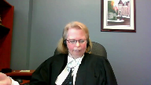
:::

Good morning, Justice Karatsanis and fellow justices.

I apologize in advance for my voice.

Hopefully you can all hear me.

I think we all agree that ethically, councils should consult with their client and get informed instructions before entering an election on their client's behalf.

This appeal is about a very narrow issue, and that is about what should happen if something goes awry and council enters an election without instructions.

Is that alone sufficient to order a new trial, as the majority of the Court of Appeal of Newfoundland and Labrador stated?

Or must prejudice be shown to establish a miscarriage of justice and have a new trial ordered?

In GDB, a seminal case from this court on the ineffective assistance of counsel, this court recognized that ethically there are certain decisions, like the decision to plead guilty or whether to testify, that counsel should ethically get instructions on.

But it didn't mean that a failure to do this would automatically result in a new trial.

Instead, this court stated that it may, in some circumstances, raise questions of procedural fairness and about the reliability of the result that could lead to a miscarriage of justice.

In this case, the majority overturned Mr. White's convictions in order to new trial because a counsel entered an election without informed instructions.

They held this amounted to a miscarriage of justice and stated that unlike where the reliability of the verdict is questioned, where trial fairness is at issue, the accused is not required to establish further prejudice.

They essentially followed the Ontario Court of Appeals decision in Stark that said an election is integral to the court's jurisdiction over the accused and essential to the fairness of the proceedings.

They ordered a new trial.

Justice Hoigan dissent, however, would have dismissed the appeal because she said there was no evidence of prejudice to Mr. White and she held there was no miscarriage of justice in this case because you need to prove prejudice to get a miscarriage of justice and have a new trial and Mr. White simply didn't suffer any prejudice because there was no evidence before the Court of Appeal that Mr. White wanted a trial anywhere other than the provincial court.

He never said he wanted to have a trial in the Superior Court with or without a jury and he never said that he wanted a preliminary inquiry.

He also didn't challenge the reliability of the verdict.

We submit that on the facts of this case, Justice White's decision is the correct one and a new trial should not have been ordered.

We submit that one must prove prejudice to obtain or establish a miscarriage of justice and obtain a new trial.

This court has sent that message in various cases, be it Graveline for the for the Crown to get a overturned and acquittal and get a new trial, in Wong with respect to withdrawal of a guilty plea, Con, Davey, and Eszegar.

We submit that one must prove prejudice to obtain or get a new trial.

This court has sent that message in various cases, be it Graveline for the Crown to get a overturned and acquittal and get a new trial, in Wong with respect to withdrawal of a guilty plea, Con, Davey, and Eszegar.

And the test for a miscarriage of justice where there's a procedural error was established in this court in Con.

Procedural irregularity will constitute a miscarriage of justice.

This court has sent that message in various cases, be it Graveline for the Crown to get a overturned and acquittal and get a new trial, in Wong with respect to withdrawal of a guilty plea, Con, Davey, and Eszegar.

We submit that one must prove prejudice to obtain or get a new trial, in Wong with respect to withdrawal of a guilty plea, Con, Davey, and Eszegar.

Pursuant to this court's decision in Davey at paragraph 74, where no actual prejudice has been demonstrated to declare a miscarriage of justice and order a new trial, the appearance of unfairness must be pronounced, such that it's a serious interference with the community's sense of fair play and decency.

And the appellant in this case is submitting that there was no actual prejudice in this case and there was no appearance of unfairness.

Now there was no actual president, sorry, no actual prejudice to Mr. White in this case for the reasons outlined by Justice Hoeg.

Mr. White never said in his affidavit, and he never said in his testimony before the Court of Appeal, that he would have wanted to have a trial in the Superior Court with or without a jury, and he never said he would have wanted to have his trial, sorry, he never said he would have wanted to have a preliminary hearing.

He never expressed a desire for his retrial to be in a different court.

And we have to remember that by the time this matter got to the Court of Appeal, Mr. White had retained his third lawyer and was fully aware that he had options as to where his trial could be held.

But yet knowing that he had these options, he never gave any evidence to say he wanted his trial to be elsewhere.

So in many ways, this is like the situation that occurred in the Wong case that was before this Court.

There's no evidence of prejudice because the accused never stated he would have acted differently, had he been fully informed of his options.

And in Wong, this Court said Mr. Wong couldn't get a new trial because he never stated in his affidavit that had he been aware of the consequences of his guilty plea, that he would have acted differently.

**Justice Kasirer** (00:07:44): Ms. Sullivan, on that point, and just comparing our case to Stark, you point out at 49 of your factum that in Stark, the appellant testified that his counsel obtained instructions from him.

::: {.column-margin}
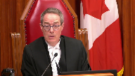
:::

Had his counsel obtained instructions from him, he would have elected to have a preliminary hearing and consequently a trial in Superior Court, which is, I guess, unlike our case.

And I'm wondering if we, looking at Stark, we can turn our minds to paragraph 32, where the Court of Appeal for Ontario recognizes that there are instances other than the one in which the remedy it imagined and one that might fit this case better.

Are you drawing a distinction with Stark?

**Overlapping speakers** (00:08:44): I am drawing it.

Oh, sorry.

**Justice Kasirer** (00:08:46): So I was just

yeah, so are you were drawing a distinction and what what do you make of paragraph 32 of star?

**Speaker 1** (00:08:54): We are drawing a distinction from Stark, and I am just pulling that.

It's in the Respondent's Condensed Book.

Thank you.

**Justice Kasirer** (00:09:05): Uh, tab four.

**Speaker 1** (00:09:11): Yes, and we are distinguishing this case from Stark, and I think this would be a situation where there is no miscarriage of justice because there has been no expression that Mr. White wanted his trial elsewhere, and there needs to be some sort of prejudice to have a new trial ordered, as you said, and Stark expressed that he wished to have a preliminary inquiry, which does create a distinction.

::: {.column-margin}
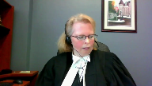
:::

**Justice Kasirer** (00:10:08): Thank you.

**Speaker 1** (00:10:13): And I'll also point out that Stark predates this court's decision and as a Guyer from last year.

::: {.column-margin}
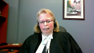
:::

And that creates a distinction from the White case as well.

Because we're submitting, and Stark, one of the issues was that they found the court lacked jurisdiction to hear the proceeding once counsel entered the election without instructions.

But since as a Guyer, we now know that the court did not lack jurisdiction, or at least it did not lack jurisdiction in such a way that that error could not be cured by the proviso.

**Justice Karakatsanis** (00:10:55): Is that a serious issue in this case?

**Speaker 1** (00:10:59): Um, it goes to the prejudice assessment, whether there's any prejudice, I would say, and to the extent that if this court disagrees with me and says that the failure to obtain instructions.

::: {.column-margin}
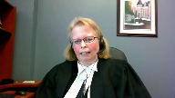
:::

**Justice Karakatsanis** (00:11:17): I'm sorry, I should have been clear.

Is there any issue in this case that the court lost jurisdiction?

Or can there be any such issue, given Pesica?

**Speaker 1** (00:11:28): The majority would have found applying Stark, or at least in the reference to Stark, that the court lost jurisdiction.

::: {.column-margin}
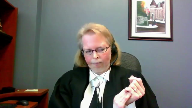
:::

But, as Justice Hoyt pointed out in the dissent, that wouldn't have been the case, as aggravated assault is not a section 469 offense.

It's an indictable offense that the Provincial Court does have jurisdiction over and can hear pursuant to paragraph 48 as a guyer.

And because there was no loss of jurisdiction, I think that plays into the prejudice assessment.

There's no appearance of unfairness in this case.

That would interfere with the community's a sense of their play and decency.

Because, again, the court, we didn't lose jurisdiction over the charge.

The court had jurisdiction to hear the matter.

Hoyt had his trial before an independent and impartial tribunal or court.

**Justice Martin** (00:12:47): And that's where my question is going to ask you about the need for prejudice in this particular context, not in a different context, but when the failure is a failure to inform about an election as to motive trial.

::: {.column-margin}
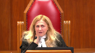
:::

When we're looking for prejudice, what kind of prejudice do you say we would be looking for given that the result of the failure to inform is that there is another type of trial in front of an independent impartial tribunal?

I just have some difficulty getting my mind around the type of prejudice we're talking about here.

**Speaker 1** (00:13:35): I think we would be looking at prejudice that may have affected the ultimate result.

::: {.column-margin}
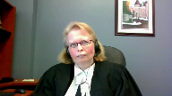
:::

Was there any issue with respect to any bias or any inappropriate behavior or situation within that court?

We don't have that issue here.

And Mr. White in this case, not only did he got his trial before the independent and impartial court, but he also, the trial judge in this case, performed his duty with great care and attention to protect Mr. White's rights.

This was an unusual case and an unusual situation.

**Justice Rowe** (00:14:38): cannot the point be summarized that there is nothing to be said about the conduct of the trial that would indicate that it was in any way improper?

**Speaker 1** (00:14:48): Exactly.

::: {.column-margin}
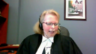
:::

There was nothing improper that occurred during this trial.

Thank you, Justice Roe.

And indeed, the trial judge went, I wouldn't say above and beyond, but was definitely and clearly looking out for the accused and his rights, performed his job with due care and attention.

He reopened the trial after the conviction was entered to allow Mr. White to call a witness whom he had originally wanted to have at the initial trial.

That ultimately didn't assist Mr. White.

The conviction was upheld, but the trial judge definitely acted with due care and attention looking out for Mr. White's rights, received the evidence, considered it, and we can certainly say he received a fair trial.

And in this case, we can't say there's an appearance of unfairness because we can't say he was denied the motive trial he wanted.

We don't know what he wanted.

For all we know, Mr. White may have wanted his trial in the Provincial Court or he may have wanted it elsewhere.

So there's no appearance of unfairness because he didn't get the trial he wanted in that sense.

As Justice Hoek stated in the dissent, counsel prevented an accused, counsel preventing an accused from testifying, or counsel, or sorry, a court, counsel, sorry, counsel preventing an accused from testifying or choosing a motive trial against an accused which is completely different from having no advice on how to choose one's motive trial.

And when you look at all of the circumstances of this particular case, we're submitting there was no miscarriage of justice in this case because there was no actual prejudice to the accused and there was no appearance of unfairness that amounted to a serious interference with the community's sense of fair play and decency.

A reasonable person who looked, would look at all of the circumstances of Mr. White's trial would have perceived it as fair.

And there simply wasn't a miscarriage of justice.

If this court disagrees and says no, the court lacked jurisdiction ab initio as soon as counsel entered an election without instructions, then the curative provisor should be applied and the majority would have erred by not applying it.

Last year in this honorable court, this court rendered a unanimous decision in Asagaya which was found in the condensed book at tab four.

And I know I'm relying on a footnote

and I know it's obiter, but it's an obiter statement from a unanimous court from last year in this honorable court.

And in footnote two, which is found in our the appellant's condensed book tab four, this court stated that under the proviso therefore election errors, example where an accused elects to be tried in the provincial court but mistakenly is tried in the superior court, or where an accused person elects to be tried by a judge and jury and is mistakenly tried by a judge alone, these errors will not automatically lead to a new trial and whether the error can be cured will depend on whether the accused suffered any prejudice.

Again, there's no prejudice in this case, at least that's our submission.

My friend's factum suggests that these election errors can only be cured by the proviso if they're made by the courts, a court clerk or something of that nature.

I would submit that's not the case because no matter who makes the error, the end result is the same.

The accused is denied the ability to have the trial he

or she may have preferred.

And in fact, if we look at the example that was given in the Asagaya case, the example there, there was more prejudice to the accused by the error made because in that case, or in the example I should say, the accused had actually expressed an opinion as to which mode of trial he wanted

and he didn't get that.

So again, it's a bit different here where we have no evidence of what mode of trial the accused would have ultimately liked to have had.

Ultimately, Mr. White was entitled to a fundamentally fair trial, not a procedurally perfect one as stated in Asagaya paragraph 10.

And Mr. White fundamentally got a fair trial.

We submit that the majority should not have overturned Mr. White's conviction and ordered a new trial in this case based on the error made.

We would ask this Honorable Court to grant the appeal for substantially the reasons of Justice Hoegh, the dissenting justice, and either reinstate the convictions or remit the matter back to the Court of Appeal of Newfoundland and Labrador so that the other areas of alleged incompetence can be dealt with.

And unless there are any other questions, those would be the submissions of the appellant.

**Justice Karakatsanis** (00:21:10): Can I just ask you what other outstanding issues there were before the court?

**Speaker 1** (00:21:18): There was a variety, Justice Katsanis.

::: {.column-margin}
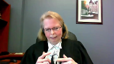
:::

There was one about whether his counsel prepared him adequately to testify.

There was, you know, allegations that his counsel hadn't reviewed disclosure with him.

And those types of issues, the actual application had outlined a number of issues.

Whether those would ultimately be held to be errors at the end of the day remains to be seen.

This claim that his counsel never met with him before the trial seems to have been refuted by his evidence at the Court of Appeal and some other.

He was aware of the disclosure, as Justice Hoag mentioned, because I guess he claimed it.

**Justice Karakatsanis** (00:22:17): at is I'm trying to understand you've asked that the appeal be allowed and the convictions be restored.

::: {.column-margin}
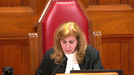
:::

If we agree with you on this ground on what basis could we restore the convictions if there are outstanding grounds of appeal that have not been dealt with?

I'm just trying to understand your the order that you've requested.

**Speaker 1** (00:22:41): Okay, given I guess that there would be other grounds of appeal, it might be better just to remit the matter back to the Court of Appeal to deal with those other grounds.

And that that would be the better order my apologies to the Court.

**Justice Karakatsanis** (00:23:03): Thank you very much, Ms. Sullivan.

Thank you.

Mr. Edwards.

**Speaker 2** (00:23:14): Good morning, Justice.

::: {.column-margin}
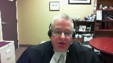
:::

The right of an accused to choose their mode of trial is of fundamental importance in the criminal justice system.

536-2 exists for a reason.

My colleague suggests that 536-2 would be satisfied simply by the fact, or his fundamental principles would be satisfied by the fact that he had a fair trial in a court, that both courts are fair and procedurally efficient, and that whether he had the trial in provincial court or Supreme Court is immaterial, he had a fair trial.

That begs the question, then, if the only issue is that he have a trial, why does the right to have trials in different courts exist?

Why is there a right under 536-2 to elect the mode of trial?

And this is of fundamental importance here.

I agree with my colleague that there are cases where ineffective misdemeanor counsel engages the kind of analysis that she suggests.

You know, if this was an issue where ineffective misdemeanor counsel led to administration, you know, a question to verdict, or made a verdict unreliable, or there is an unfairness, yes, engage in those discussions.

But the issue we have here today is even before that.

It's a root issue.

The right to elect mode of trial rests solely with the accused.

It does not get relayed onto somebody else.

Now, my colleague will point out that, yes, there are limits on the right of election.

For example, if you have a co-accused and they elect up, then you must follow.

There are other restrictions as well.

But those restrictions are specifically set out in the criminal code.

This is not the case here.

The right to elect is not abrogated in the code.

Therefore, there can be no justice for it, or justification for it.

Now, my colleague would suggest that we need to establish a prejudice.

We would suggest no.

We would suggest that if we were alleging that the ineffectiveness of the counsel led to an unreliable verdict and that he was prejudiced, yes, we'd need to establish that.

But it's not enough that justice be done.

It also must seem be done.

And there has to be procedural fairness.

And in this case, he was denied one of his fundamental rights, that being to elect the mode of trial.

OK, may I stop you there?

**Justice Martin** (00:25:59): May I stop you there?

**Overlapping speakers** (00:26:01): I

**Justice Martin** (00:26:02): I understand your point, which is that you don't have to establish prejudice in maybe the same way, but even accepting your principle, what we have here is an instance in which Mr. White has not established prejudice, but he's also not put forward evidence before any of the courts that he would have made a different election and that he would make a different election, even if a new trial was ordered.

::: {.column-margin}
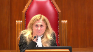
:::

So doesn't that go more to that there's maybe no breach, maybe no impact of a breach, rather than even being in a category of prejudice?

How do we deal with a situation where it's a completely hypothetical breach because we don't have any evidence of a contrary intention and we saw that in Essegier, we saw that in Stark.

**Speaker 2** (00:27:04): With respect, I don't think his desire to have a trial different than the one that I had cures the issue of what we have to address with the loss of the right to elect mode of trial.

I don't think we have to.

**Justice Martin** (00:27:21): But you're assuming, you're putting forward, and I understand your argument, you're putting forward a loss.

::: {.column-margin}
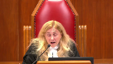
:::

And I'm asking you, in the absence of evidence as to there being an actual loss, aren't we just in the realm of hypotheticals and speculation?

He hasn't come forward to say, I lost something here.

He said, I lost a chance of something here.

He doesn't come forward and say, I really would have preferred a jury trial here.

He says, I lost my option given by the code to elect.

**Speaker 2** (00:27:59): and there's two responses to that.

::: {.column-margin}

:::

Yes, there is some conjecture and speculation we have to engage in, but we don't know what Mr. White would have done given the option of making his election.

We don't know what choice he would have made had counsel properly advised him or if he had been a self-represented individual, he had had the election read to him.

We don't know.

I do not think we need to establish loss.

And the other thing too is, and I know I keep going back to this issue, I do believe that this is one of those issues that are so fundamental that we don't actually need to establish a loss.

Well, you need to establish miscarriage of justice.

**Justice Karakatsanis** (00:28:45): So if you're saying that it doesn't even matter if he would have chosen the same route and if there's a retrial and he chooses the provincial court, what does that say about the appearance of unfairness or miscarriage of justice?

::: {.column-margin}
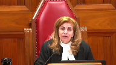
:::

I mean, if we take the test that it would shake public confidence in the administration of justice, isn't there an argument to be made that if a retrial is granted on the basis that he hadn't turned his mind to it, he didn't have a chance to actually consider a choice, but having considered it, he picked the same mode of trial, how would that look to the public in terms of the administration of justice?

**Speaker 2** (00:29:34): If Mr. White was sent back for a new trial and he chose, knowing that there was an election open to him, to proceed by way of provincial court, then he would have been having control over his own defense.

**Justice Karakatsanis** (00:29:52): I guess that was my point though, the issue is not whether he actually had the chance to make the election, the issue is was there a miscarriage of justice?

::: {.column-margin}
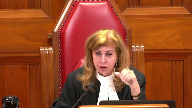
:::

And I think the only way you can make out the ground according to your argument is that even if an accused would have proceeded in exactly the same way, there would be a miscarriage of justice if the accused didn't specifically be the one to make that decision.

**Speaker 2** (00:30:28): Yes.

::: {.column-margin}

:::

The right to direct your own defence is key to our entire criminal justice system.

And if you deny an accused the right to direct their own defence, then many of the provisions that we have established are meaningless.

So, I'm not sure.

**Justice Kasirer** (00:30:47): Sure.

Oh, sorry, did you not?

Well, no, I was just gonna-

**Justice Karakatsanis** (00:30:50): to say then so if there's a co-accused and and it proceeds in a different court then somehow we've denied them their right to a proper defense.

**Speaker 2** (00:31:03): No, because that is specifically spelled out in the code that if you have an accused and they elect up, then you follow up.

There are remedies for that as well.

You can seek severance.

There are other things you could do.

But again, that goes to the ability of an accused to direct their own defense.

**Justice Karakatsanis** (00:31:19): I understand your position, thank you.

**Justice Kasirer** (00:31:21): sorry to have interrupted you.

::: {.column-margin}
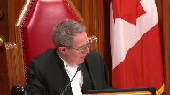
:::

I was going to ask you, Mr. Edwards, what you thought of the argument of your colleague on Esagire in footnote two in paragraph 49 of Esagire.

So it's in her condensed book at tab four on the last page.

**Speaker 2** (00:31:44): Bear with me Justice while I get that out.

I am aware of her argument, I just want to make sure I don't...

**Justice Kasirer** (00:31:54): It's on the last page.

**Speaker 2** (00:32:07): What tab was that again, uh, Justice?

I can actually I can find tab 4.

**Justice Kasirer** (00:32:11): last page

**Speaker 2** (00:32:23): Well, I think that, or we would submit that that can easily be distinguished.

::: {.column-margin}

:::

I understand what my colleague is arguing with that.

However, number one, there is the issue of jurisdiction.

For example, we would suggest that, as I said, spell out, or we spell out in the factum, the provincial courts must have jurisdiction over the charge.

If it's an indictable matter, as it is here, then they can have jurisdiction with the consent of the accused.

Otherwise, they do not.

In the example cited in the footnote, where an accused elects to be tried in the provincial court but is mistakenly tried in the Superior Court, there is no issue with jurisdiction because, of course, the Superior Court has the jurisdiction.

With respect to the issue of whether it's a judge-alone trial or a judge-in-jury trial, it's not a jurisdictional issue because the Superior Court is still the Superior Court, and it does have jurisdiction.

I'm not sure if that answers your question, Justice.

**Justice Kasirer** (00:33:35): Well, I'm not sure either, but I have your answer.

Thanks so much.

**Speaker 2** (00:33:40): Thank you.

::: {.column-margin}
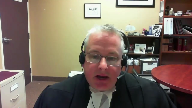
:::

I've actually touched upon several of the issues through the process of the questionings that I wanted to touch upon.

On the issue of jurisdiction, I do believe that is of critical importance in this case.

The curio provision in 686.1b4 allows for procedural errors to be cured where the court has jurisdiction.

In this case, we would suggest that the court did not have jurisdiction because, and I'm gonna draw a distinction now, my colleague pointed out that there is jurisdiction of the person.

We would suggest that, it's a little different here, the issue here is jurisdiction over the offense.

The provincial court would not have had jurisdiction over the offense without the express consent of the accused.

And so we would say that the provincial court did not have jurisdiction.

A court of appeal cannot be in a better position than the trial court, therefore it cannot correct that.

So we would suggest that the curio provisional does not apply.

At one point, and again, I keep returning to the situation.

Yeah, I think you've-

**Justice Rowe** (00:35:22): We've just nullified that branch of the curative proviso, but it's an interesting argument.

**Justice Jamal** (00:35:30): Going back to Stark on this issue of prejudice, do you see any inconsistency between paragraphs 20 and 32 of Stark?

::: {.column-margin}
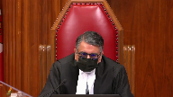
:::

And also, can you give us any assistance on how Stark has been treated by other provincial appellate courts?

Because I note it's been cited 16 times by provincial appeal courts.

Can you give us any guidance about whether that's been...

**Overlapping speakers** (00:35:56): Justice, perhaps you could refer me to those paragraphs again?

**Justice Jamal** (00:35:59): 20 and 32.

**Speaker 2** (00:36:13): Again, 20 is the position that I've put forward to the court in response to the earlier questions.

::: {.column-margin}

:::

I actually, while Stark postulates that there may be situations where there would not constitute a miscarriage of justice, in terms of hypotheticals, I can't think of them, because I do feel that it is so fundamental.

He does not spell out, or Stark does not spell out, what those other cases would be.

So barring what the court had in mind, I'm not sure what comment I can offer on that.

**Justice Kasirer** (00:37:03): Well, how about what your colleague said earlier about Stark being different insofar as the appellant in that case testified that had his counsel obtain instructions from him, he would have elected to have a preliminary hearing.

::: {.column-margin}
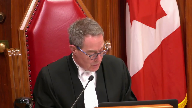
:::

So it's, in that sense, different than our case, and maybe—

**Speaker 2** (00:37:24): Again, I refer back to my previous answer on the issue of, you know, what has he lost?

::: {.column-margin}

:::

He has not testified that he would have made a different decision.

I don't think that's determinative in this case.

Mr. Stark says he would have done something different, but I don't think that's key to the issue at hand.

I think we're looking at some-

**Overlapping speakers** (00:37:45): something more fundamental.

But it is different from the circumstances of this case.

**Speaker 2** (00:37:49): Factually different, yes, but I do not think it impacts the position we're putting forward.

::: {.column-margin}

:::

So with regards to the other Court of Appeals, without going into the sites because I do have a number included, I do believe that again they recognize as Stark did and as our Court of Appeal did and we're putting forward today, there is no need to establish prejudice, to deny all of a person's right to direct their own defense and the loss of an accused under right under 5362 to choose their motor trial is fundamental and that people looking at that would see that as unfair.

So subject to any questions that justices would have.

**Justice Martin** (00:38:58): I do have one.

You said that the provincial court would not have jurisdiction over these particular offenses unless Mr. White consented to trial in the provincial court.

**Overlapping speakers** (00:39:15): I'm wondering. Hmm?

**Justice Martin** (00:39:19): Okay, no, that's fine, so I understand that that's what you've said, but what I don't, what I'm going to ask you is how does that square with the provision, the curative provision in 686?

::: {.column-margin}
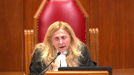
:::

And 1B sub 4 talks about the court having jurisdiction over the class of offence, and I would have thought that the provincial court had jurisdiction over the class of offence in a general sense there, and that it didn't depend on a particular election.

**Speaker 2** (00:40:01): I understand, I understand the question and I understand the point.

We would say though that with respect to the this offence and these offences which are indictable that the election would need to be made.

If there was no need to do that then why would there need to be an election?

**Justice Karakatsanis** (00:40:19): Well, there was an election made here.

::: {.column-margin}
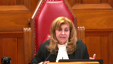
:::

The question is, you're saying, whether it was validly made, but there was an election here that gave the provincial court jurisdiction.

Whether there was a miscarriage of justice in the way the election was made is what you've raised here.

But I'm just not understanding how you're saying that there was just no jurisdiction over this class of offense in this case.

**Speaker 2** (00:40:50): Sorry, I apologize, bit of the lag in the video.

::: {.column-margin}
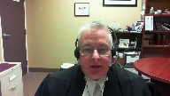
:::

The only person who had the ability to make the election was the accused.

He did not make this election.

The election was made by his counsel without instructions.

The counsel was not the one facing the charges.

He therefore did not have the authority to make that election.

Therefore there was no election.

Thank you.

**Justice Karakatsanis** (00:41:30): Okay.

Well, thank you very much, Mr. Edwards.

Any reply?

**Speaker 1** (00:41:39): No, Madam Justice, thank you.

**Justice Karakatsanis** (00:41:42): All right, I'm going to ask counsel to remain at our disposal.

The court will retire.

**Justice Kasirer** (00:42:33): The court, la cool.

**Justice Karakatsanis** (00:43:01): Well, thank you, Council, for your submissions today.

::: {.column-margin}
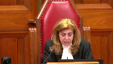
:::

The court has reached a decision.

This appeal, as of right, comes to us based on the dissent of Hohik, J.A., of the Court of Appeal of Newfoundland and Labrador.

For the following reasons, we are all agreed to allow the appeal.

The respondent, Trent White, was charged with several offences following an incident on a fishing vessel off the coast of Labrador in 2017.

The charges included aggravated assault, an offence for which Mr. White had a right to choose between a trial in provincial court, a trial in superior court before a judge alone, and a trial in superior court before a judge and jury.

His trial, Council, told the court that Mr. White was electing for a trial in provincial court.

He was later convicted of assault, aggravated assault, and mischief.

Mr. White appealed, seeking a new trial on the basis of ineffective assistance of Council.

According to him, his trial, Council, had failed to advise him of his choices and had elected for a provincial court trial on his behalf without discussion or instructions.

Mr. White did not indicate, however, that he would have considered a different election or that he would elect differently on a retrial.

A majority of the Court of Appeal of Newfoundland and Labrador accepted Mr. White's uncontradicted evidence, allowed his appeal, and ordered a new trial.

Reasoning that an election is one of the important rights of an accused, the majority concluded that his Council's failure to advise his client or to seek his instructions on the choice undermined trial fairness and resulted in a miscarriage of justice, satisfying the test for ineffective assistance of Council.

Citing the Ontario Court of Appeal's decision in Regina and Stark, 2017, it explained that Mr. White was, quote, not required to establish further prejudice, end quote.

We agree that the right to elect the mode of trial is an important right that should be exercised by the accused, but we do not agree that Mr. White has shown that the circumstances of this case resulted in a miscarriage of justice.

Rather, we agree with Hoag J.A. in dissent that ineffective assistance of Council was not made out.

Ineffective assistance has a performance component and a prejudice component.

For such a claim to succeed, the appellant must establish that, one, Council's acts or omissions constituted incompetence, and two, that a miscarriage of justice resulted.

And the reference is to Regina and GDB, 2000, a case of this Court.

Here, Mr. White failed to state that he would have chosen differently had Council informed him of his right to elect his mode of trial.

Even accepting Mr. White's evidence that there was no discussion or consultation regarding his right of election, it did not rise to a miscarriage of justice in this case.

In GDB, the Court explained that Council's failure to discuss and obtain instructions on fundamental decisions relating to accused's defence, quote, may in some circumstances raise questions of procedural fairness and the reliability of the result leading to a miscarriage of justice.

That's at paragraph 34.

Stark itself recognises this at paragraph 32.

However, the Court has never provided, this Court has never provided, that the loss of those decisions alone warrants a new trial on ineffective assistance grounds.

To the extent that Stark suggests otherwise, it is incorrect.

The accused must, in most cases, demonstrate more than the loss of choice.

Although it did not address ineffective assistance of Council, this Court in Regina and Wong, 2018, explained that to withdraw a guilty plea on the basis that the accused was unaware of legally relevant consequences, an accused must show subjective prejudice.

Subjective prejudice demanded that an accused demonstrate that there was a reasonable possibility that they would have acted differently.

That's at paragraph 6.

The Court was unanimous that a mere failure to exercise an informed choice was insufficient.

In our view, these principles also apply to an accused's election of the mode of trial.

Further, Mr. White's request for a new trial cannot succeed on the basis of an appearance of unfairness.

The standard for establishing a miscarriage of justice on this basis is high.

The defect must be, quote, so serious that it shakes public confidence in the administration of justice end quote.

And that's Regina and Davey, a 2012 decision of this Court, citing Regina and Wolkins, 2005, Nova Scotia Court of Appeal, at paragraph 89.

While the loss of his right to elect was serious, the facts of this appeal do not rise to that standard.

Indeed, if Mr. White's conviction were set aside and he proceeded with the same election on retrial, that could undermine public confidence in the administration of justice.

Finally, even if Mr. White's loss of his election amounted to a procedural error under section 536 sub 2 of the Criminal Code, the Provincial Court retained jurisdiction to hear it since the Court had jurisdiction over the class of offence under section 686 sub 1, sub b, uh, uh, 4.

And that's from, uh, Regina and, uh, Esagire, 2021.

For these reasons, we would allow the appeal in remand to the Court of Appeal to address Mr. White's remaining grounds of appeal, which were not addressed below.

Thank you very much.

The Court is adjourned until Monday morning.