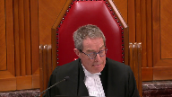

---
title: Her Majesty the Queen v. Craig Pope
published-title: Heard
date: 2022-03-21
sidebar: false
---

This transcript was made with automated artificial intelligence models and its accuracy has not been verified. Review the original webcast [here](https://scc-csc.ca/case-dossier/info/webcast-webdiffusion-eng.aspx?cas=['39817']).
---

**Justice Wagner** (00:00:26): Good morning, please be seated.

::: {.column-margin}

:::

In the case of Her Majesty the Queen against Craig Pope, for the appellant, Her Majesty the Queen, Dana Sullivan, for the respondent, Craig Pope, Mark Grushy.

Ms. Sullivan.

**Speaker 1** (00:00:49): Good morning Chief Justice and fellow justices.

::: {.column-margin}

:::

Today we are asking this court to restore Mr Pope's conviction for second degree murder, based essentially on the dissenting reasons of Justice Goodridge from the Newfoundland and Labrador Court of Appeal.

I'd like to give you a little roadmap of my intended oral argument today.

First, we intend to briefly discuss the context of this case, because context matters when you're looking at jury instructions.

Second, we tend to discuss how the majority of the Court of Appeal erred in law on how they assessed the instructions, and by not considering the position of trial counsel in that assessment.

Then we intend to discuss how the jury was properly instructed on manslaughter as a lesser and included offense to murder in the final instructions, the decision tree.

And then we'll discuss the answer to the jury's question, along with instructions on after the fact conduct evidence.

Excuse me.

So with respect to context, David Jonathan Collins died from an 11 centimeter deep stab wound to the abdomen that severed his abdominal

**Overlapping speakers** (00:02:17): your

**Speaker 1** (00:02:17): At trial, defense called no evidence.

::: {.column-margin}

:::

Mr. Pope did not testify.

The defense tactic taken at trial was that they argued the Crown had not proved that Mr. Pope stabbed Mr. Collins.

Identity was a live issue.

They argued nobody saw him with a knife.

No one saw a stabbing.

And all of this should have left the jury with a reasonable doubt.

They were trying to get Mr. Pope acquitted of all the charges.

And this becomes relevant when you're looking at things like the example of manslaughter that Mr. Pope's counsel wanted to have put to the jury.

Also, Mr. Pope's experienced trial counsel was actively involved in vetting the jury instructions at every stage of the proceedings.

Just for the final instructions and the jury, sorry, and the decision tree alone, the transcript is 73 pages of the pre-charge screening.

And the definition of manslaughter that was used in the instructions and the example of manslaughter that was given to the jury in the answer to the jury's question were recommended by Mr. Pope's experienced trial counsel.

**Overlapping speakers** (00:03:54): Did you think they were helpful?

**Speaker 1** (00:03:55): I think they fit with, thank you Justice Brown, I think they fit with Mr. Pope's defense tactic in the sense that the example of manslaughter that went to the jury didn't involve an act of stabbing and they were trying to argue essentially the inference was that the client didn't stab Mr. Collins.

::: {.column-margin}

:::

So I think they were consistent and we don't, defense counsel has to take instructions from his client.

There's been no incompetence of counsel argument made here.

We don't know, we can't lift the veil of privilege.

So we don't know.

Excuse me for a moment.

**Justice Moldaver** (00:04:38): Your theory was not that this was Mr. Pope hurling himself, or sorry, Mr. Collins hurling himself at Mr. Pope and impaling himself on the night.

::: {.column-margin}

:::

That had nothing to do with your case.

Your case was that Mr. Pope intentionally stabbed the victim.

That's clear.

And that was the unlawful act that the jury was left with, right?

And if in fact they found that, there was only really two possible verdicts left, right, because self-defense wasn't argued or anything.

So two possible verdicts, murder or manslaughter, is that right?

**Overlapping speakers** (00:05:20): Yes, Justice Malloy.

Thank you.

**Justice Moldaver** (00:05:22): So just I'll carry on for a moment and tell you what's troubling me.

::: {.column-margin}

:::

I don't know and you can help me out.

The jury was clearly confused about murder and manslaughter, right?

They asked a question.

The answer to it at the end of the day gives them an example of somebody holding up a knife and the victim lunging at it and impaling himself in that scenario.

What possible basis does that have in terms of relevance to this case, given your theory?

That's what I'm trying to, that's what I'm having trouble with.

I don't know what, how that could possibly have answered their question, if anything that would have confused them and sort of said, oh, well, for manslaughter, you know, it only applies if someone lunges at it and causes the problem themselves or gets impaled, which has nothing to do with your theory.

**Speaker 1** (00:06:20): Thank you, Justice Moldaver.

::: {.column-margin}

:::

It had nothing to do with the Crown's theory as far as the Crown's theory was, it was an act of stabbing that caused unlawful act that caused death.

But it was a way, you know, to get to manslaughter based on defense theory that the client didn't intend or didn't actively stab or didn't intend to stab Mr. Pope.

And it was the example that Mr. Pope's counsel, very experienced trial counsel, wanted to have before the jury.

So, it was an example of unlawful act manslaughter.

And it was helpful in that sense. Also,

But

Ms. Sullivan, sorry, just before

**Justice Kasirer** (00:07:09): Before you finish, it came on the heels of box number four and the question by the jury that they didn't understand the definition of manslaughter.

::: {.column-margin}

:::

And I don't know what you think of box number four.

Your colleague says box number four carries with it an error as to the legal definition of manslaughter.

The jury was unsure.

The jury asks a question.

You're right to say that council came up with the example.

But it seems to me that if there was an error of law, council's proposed example doesn't change the fact there was an error of law, regardless of the position that council took on that point, is that?

**Speaker 1** (00:08:08): There, thank you, Justice Casarero, box number four did not state fully the two intents that were required for second degree murder, but when you look at the decision tree as a whole, and it is found at tab five of the appellant's condensed book at the last page, before the jury would have gotten to box four, they would have had to consider boxes one and two and answered those in a yes.

::: {.column-margin}

:::

And if you answer box one with a yes that Mr. Pope used a weapon to commit an unlawful act, and box two that Craig Pope committed an unlawful act with a weapon and caused Mr. Collins's death, once you have a yes to those two answers, there's only two results, and acquittal is not an option thereafter.

You either find Mr. Pope was guilty of murder because he had the requisite intent, one of them, for second-degree murder, or you find he's guilty of manslaughter.

The two intents that are required to convict someone of second-degree murder were spelled out in boxes 3a and 4a of that decision tree.

**Overlapping speakers** (00:09:53): Can I ask? Mr. Pope.

I'm sorry. Finish.

Please finish.

Sorry about that.

**Speaker 1** (00:09:57): Mr Pope's counsel agreed at the Court of Appeal that the jury was properly instructed on second-degree murder.

::: {.column-margin}

:::

The jury found Mr Pope had the subjective intent for second-degree murder.

So while there was an error in box four because it didn't repeat the instructions in or the intent for second-degree murder in boxes three and four, it you know it couldn't have made a difference to the jury because not only was the intent for murder expressly stated in boxes 3a and 4a, but they were correctly stated throughout the jury instructions from the opening instructions to the final instructions and even at the beginning of the answer to the jury's question.

And the jury didn't have those instructions just given to them orally.

They had them in writing as well.

So in total the jury would have been instructed at least five times, even more if you count that it's in writing and orally in the written, sorry, in the opening and final instructions.

**Overlapping speakers** (00:11:04): It's OK.

**Speaker 1** (00:11:05): have had the correct instructions with respect to the intent for murder and they couldn't, and Voxport couldn't have made a difference.

**Justice Karakatsanis** (00:11:13): Okay, so can I just, I understand your position.

::: {.column-margin}

:::

I think it is that even if the instructions regarding manslaughter were incomplete, let's say, here the jury didn't get there because they were satisfied that the intent for second degree murder was met, and that was correctly described to the jury.

But given that the distinction between second degree and manslaughter rests on intent, and given that there was confusion about intent, I think the position put to you is that confusion on the issue of intent is not just isolated to manslaughter then in this case, it's confusion that arises in the context of both second degree and manslaughter.

I mean, the distinction between the two is the intent, and if there was confusion around what the intent for manslaughter is, how does that not have an impact on the intent for second degree?

That's the position that's being put to you.

**Speaker 1** (00:12:23): Thank you, Justice Karatsanis.

::: {.column-margin}

:::

I think the jury was clearly instructed on the intent for second-degree murder.

The intent for manslaughter, as far as the objective, or the mens rea for manslaughter, as far as the objective foreseeability of bodily harm that's neither trivial nor transient, ultimately was referenced in the answer to the jury's question, when the trial judge explains how the example he gave was manslaughter and not murder.

And when we look at prior decisions from this court, in Houghton and Miljevec, where the default element of manslaughter was not put to the jury, the convictions for murder were upheld because so long as the defense was left, sorry, so long as manslaughter was left to the jury as a lesser and included offense, the jury remained, it had the option to convict on that ground, but chose not to do so because they found the subjective intent for murder.

Thank you, Your Honor.

**Justice Moldaver** (00:13:45): Ms. Sullivan, I'm sorry, we keep coming back, it seems to me, to this first question.

::: {.column-margin}

:::

The trial judge made it very clear that the first issue the jury had to decide, and I'm looking at page 57, I guess, of the charge and 87 of the appeal book, and I'm going to

**Overlapping speakers** (00:14:06): Okay.

**Justice Moldaver** (00:14:06): If you could just turn that up, or I can just read it to you, it just sets out the Crown's theory.

::: {.column-margin}

:::

In order to find Craig Pope assaulted David Johnson Collins with a weapon, you must find the following.

One, that Craig Pope used the weapon to apply force to David Jonathan Collins, and two, that Craig force intentionally applied that force.

Now what does that have to do with great respect to the answer the jury got in terms of murder and manslaughter?

We all know that there will be cases where there is an intent to cause bodily harm, but in the circumstances, you know, it's done impulsively, without much thought at all about the consequences and so on, and I don't see any of that ever put to the jury here. Nothing.

**Speaker 1** (00:15:01): and thank you Justice Valdaver, but it wasn't put to the jury and it wasn't put to the jury as a conscious choice by Defence Council.

It wasn't put as part of their closing submissions.

**Justice Moldaver** (00:15:14): Well, that, sorry, that may well be, but we know that Defence Council, and I'm not faulting the judge particularly here at all, don't misunderstand me, Defence Council did not raise any of this.

::: {.column-margin}

:::

In fact, Defence Council was the one that said this question is fine, the answer to the jury's question is fine.

It doesn't raise any of what we're talking about here, about box four.

You know, so the trial judge was not getting any help from the defence.

I grant you that.

But that does not answer whether there was an error in law and a serious error that rendered the, that we would call reversible error, particularly in the face of the jury's question.

**Speaker 1** (00:16:11): I understand your point, but this was a case where defense council deliberately chose not to pursue that approach to the defense.

::: {.column-margin}

:::

They were focused on trying to disprove the unlawful act, or that Mr. Pope had committed the unlawful act.

And by doing so, I guess one would submit maybe they didn't want to bring a contradictory defense approach to the jury for fear that if the jury thought they had two contradictory offenses or defenses, sorry, both can't be true and they might reject them both and think Mr. Pope had them intent for murder.

Mr. Piercy, who was trial counsel for Mr. Pope, was very experienced and that was the approach he decided to take to the trial.

He got the example he wanted.

**Justice Moldaver** (00:17:18): I'll just ask you one more thing and then I promise no more questions.

::: {.column-margin}

:::

I don't even think the answer that was given in this case is right as a matter of law, even if you're talking about because it doesn't automatically follow that someone that pulls a knife and someone lunges at it and impales themselves, that that's automatically manslaughter. It isn't.

There may have been good cause.

He may have been justified to pull a knife because he was in fear of death or grievous bodily harm himself.

This example doesn't, it raises more questions than answers in my view, but it certainly, it seems to me with respect, does not answer the concern of the jury based on what they've been told.

**Justice Kasirer** (00:18:07): Just to pick up on that, and maybe to echo Justice Karakatsanis' question about the distinction between the second degree murder and the manslaughter, if we fell into a scenario that fit box number four, and box number four is problematic, is it possible that the jury sort of thought, well, manslaughter's not available to me here, so I'm gonna fall back on murder.

::: {.column-margin}

:::

So notwithstanding the correct instruction on second degree murder, the imperfect instruction on manslaughter, which the jury came back to, and which wasn't properly answered by the, with respect by the example, could have had the effect of a conclusion that would have been, well, this doesn't fit manslaughter as it was described to me, so it's gotta be murder.

I guess that's the worry on the distinction between the two.

**Speaker 1** (00:19:28): And thank you, Justice, but I think the only thing I'd have to say with respect to that is the answer did refer to causing bodily harm.

::: {.column-margin}

:::

The answer to the jury's question as part with an objective foreseeability of bodily harm as part of the answer.

And I don't think that the jury would automatically go to manslaughter is only available if there's no intent to cause bodily harm.

You know, they were also instructed on the difference between culpable homicide and non-culpable homicide.

And I think they would have understood that, yeah, so long as it didn't fit within, sorry, so long as the mens rea for second degree murder wasn't appropriate, didn't fit Mr. Pope, or they were satisfied that that mens rea was not met, that they should convict for manslaughter.

**Justice Jamal** (00:20:32): Can I see, Ms. Sullivan, if I understand your argument?

::: {.column-margin}

:::

Because you started by talking about the two contextual facts.

Firstly, the nature of the defense that was advanced, that it hadn't been proved that the accused was the stabber.

And then secondly, the nature of the unlawful act, a stabbing that results in an 11 centimeter wound.

I gather what you're saying is that the nature of the unlawful act, yes, the words that should have been in box four were missing, but it's the nature of the unlawful act is such that the pathway to acquitting or to a finding manslaughter, even though those words were missing, really wasn't there.

And so, yes, the words were missing, but it isn't really a problem at the end of the day.

Is that really what you're saying? Exactly.

**Speaker 1** (00:21:23): You know, the words are missing, but given that, you know, we have the instructions for the proper intents for murder, it's in boxes 3A and 4A.

::: {.column-margin}

:::

Also the mens rea for objective, sorry, the objective mens rea for manslaughter was missing from the instructions, but given we had a stabbing here to the torso, that resulted in an 11 centimeter deep stab wound, you know, you can't stab somebody and not have an objective foreseeability of bodily harm that's neither trivial nor transitory.

**Justice Moldaver** (00:21:59): Is that a proviso answer to Justice Jamal or is that something else?

**Speaker 1** (00:22:08): It may be both.

::: {.column-margin}

:::

I think it explains why the objective fault element for manslaughter was missing from the instructions and it could also work with respect, be appropriate for the provisor as well.

**Justice Moldaver** (00:22:30): So no jury properly instructed here could have convicted of manslaughter.

::: {.column-margin}

:::

There was only one result.

In other words, it's a foregone conclusion.

Regardless of any error, and regardless of the jury's question that they don't understand the difference, it's a foregone conclusion that the nature of the act was such that no jury acting reasonably could have done anything else other than convict of murder.

Is that your position?

**Overlapping speakers** (00:22:59): Uh, no, uh, Justice Moldavar.

**Justice Moldaver** (00:23:02): It's not a proviso argument then, because I didn't hear you objecting to manslaughter being left, not you.

::: {.column-margin}

:::

I didn't hear the Crown objecting to leaving manslaughter.

So if they left it, it must have been open.

And if it was open, they had to get instructed properly.

So if they weren't given the proper instructions, the only basis that you can go back on, it seems to me, is either that the case was so overwhelming or that the heir was harmless.

**Speaker 1** (00:23:46): I guess we'd be suggesting, you know, it was a strong case with respect to who stabbed Mr. Collins, and I guess we were trying to argue that the era was harmless in a sense.

::: {.column-margin}

:::

Manslaughter was definitely available to the jury.

The jury could have convicted Mr. Pope of manslaughter based on, you know, stabbing the accused without intent to kill him or to cause bodily harm that was likely to cause death, but they chose not to do so.

**Justice Rowe** (00:24:19): I guess I'm wondering if the crown not being capable of seeing the future, you didn't know what Randy Pearce, his defense counsel, what his line was gonna be, whether it was gonna be somebody stabbed this guy, but it wasn't my client, or yeah, my client stabbed him, but it was in circumstances which would limit the culpability.

::: {.column-margin}

:::

I mean, you don't know until the trial starts, presumably.

**Speaker 1** (00:24:53): In most cases, yes, Justice Roe, that would be correct.

::: {.column-margin}

:::

And identity was very much a live issue in this trial, as the Crown was calling evidence in relation to fingerprint evidence, DNA evidence, photo lineups, etc.

We would, you know, we would say that the answer to the jury's question was comprehensive.

Again, I've already stated that the example was an example of unlawful men's slaughter, one recommended by counsel.

As we've sort of addressed many of the issues here with respect to the questions, I guess the last issue that my friend would have raised in his factum would have been the instructions on the after the fact conduct evidence flight.

And again, we would submit, of course, a jury has to be properly but not perfectly instructed.

There's no magic words that need to be read.

And in the instructions to the jury on the after the fact conduct evidence of flight, the trial judge essentially told the jury that flight meant nothing because the person could leave the scene for a legitimate reason.

The dissenting judge found that it amounted to a limiting instruction.

But regardless of whether this court finds it was a limiting instruction or whether it was just a caution, in this case, at the end of the day, it shouldn't matter because the appellant's evidence of flight, sorry, sorry, the evidence of flight was a very minor part of the Crown's case.

We didn't rely on it and say it was relevant in relation to proving murder versus manslaughter.

Nor did the trial judge instruct the jury that flight was relevant in relation to the intent for murder versus manslaughter.

The trial judge in his instructions didn't even instruct the jury that the flight was relevant to the identity issue.

So at the end of the day, there's no serious possibility that the instructions on flight could have caused or induced the jury to consider flight as being relevant to the intent for murder.

And as in White, the 2011 decision for the Supreme Court of Canada, there was no error in the after the fact evidence of flight that the curative proviso could not fix.

It would have been trivial or minor and it could be fixed by the proviso.

In this case, Mr. Pope's counsel got the instructions he wanted.

And those instructions, we submit, was for a tactical decision that he made at trial about what defense to bring.

And we submit pursuant to Kalinin that weight should be given to that.

And because of that, that the conviction for manslaughter should be upheld.

And those are essentially, you know, we are relying on our submissions in our written factum.

And we are asking this court to overturn the Court of Appeals order for a new trial and to restore the conviction.

Can I ask a last question?

**Justice Kasirer** (00:28:57): Can I ask a last question?

Sorry, I hear you're about to conclude.

Just to make sure where we're at, you accept that your colleague's submission that there was an inaccurate definition of manslaughter in box four?

**Speaker 1** (00:29:16): Breeding box for alone.

Absolutely.

Okay, there was an inaccurate definition, but when it was right in the context of everything elseI

**Justice Kasirer** (00:29:26): I understand your argument.

Is there another independent, correct definition of manslaughter brought before the jury?

**Speaker 1** (00:29:37): The definition of manslaughter, which is the one that Mr. Pope's counsel chose, as I said in my fact, it wasn't perfect, but when it was considered, but when you considered it in context, the judge made very clear that the distinction between manslaughter and murder lies in the intent of the party that can understand.

::: {.column-margin}

:::

**Justice Kasirer** (00:30:03): but the error in box four wasn't rectified, and the jury comes with its question because the jury was uncertain as to the definition of manslaughter, and with the answer, and indeed with the help of the example that you rightly say was proposed or at least suggested by council, did they get a correct, a corrected definition of manslaughter?

::: {.column-margin}

:::

Because if not, aren't we into the proviso?

**Speaker 1** (00:30:48): I have three seconds.

In the answer, says I'm guilty of manslaughter because he died of an injury he sustained.

I think my timer in it.

**Justice Rowe** (00:30:59): Well, I'm a little confused, but I think it may be possible to provide clarity very quickly.

::: {.column-margin}

:::

From my reading of your factum, it is your position that in the wording of the jury charge, as opposed to the answer to the putting aside for the moment the answer to the question from the jury, putting aside what was in the box four, but in the text that was read out by the judge and it was given to the jury, my understanding of your submission is that the definition of manslaughter was accurately stated there.

Am I correct that that is your position?

**Speaker 1** (00:31:42): Yes, when it comes to distinguishing manslaughter from murder, when it's considered in context, there is an accurate definition of unlawful act manslaughter.

**Justice Wagner** (00:31:52): Thank you very much.

**Speaker 2** (00:32:02): Thank you, Justices.

::: {.column-margin}

:::

I'll just start like my friend did with providing our basic assessment of the case.

We're asking this Court to uphold the Court of Appeals decision in Mr. Pope's matter to order a new trial.

And we are asking so on the basis that it did not err in finding that the, I guess, cumulative impact of the various issues that occurred with the charge, with Box 4, with the answer to the jury's question and so on, could have impacted and confused the jury sufficiently to warrant a new trial.

And we've also raised the issue of the absence of an appropriate and sufficient limiting obstruction with respect to the leaving the scene, the question of flight in the case.

Firstly, with respect to the issue of the definition of manslaughter as it occurs in the various places in this particular trial, Box 4, from the perspective of the respondent, is critical.

And the reason we submit to this Court it is critical is that if the jury was utilizing the decision tree for the very purpose that it was created, and if they reasoned down through those boxes, by the time they got to Box 4, they would have found apparently on the face of the text given to them as jurors that they could not find manslaughter as a verdict if they found an intention to cause bodily harm, which we submit to this Court is a very serious error of law because certainly manslaughter can involve an intention to cause bodily harm.

Given the structure of the decision tree as it was and the fact that the jury asked the very specific and explicit question, looking for a better definition of manslaughter with some examples, the next issue arises with respect to the answer to that question.

**Justice Rowe** (00:34:09): Before you leave the decision tree, as it seems you're about to, I follow your logic perfectly if the jury started at box four and worked back towards box one.

::: {.column-margin}

:::

If they said, ah, is Mr. Pope guilty of manslaughter by virtue of coming within the meaning of four?

Well, no, and then we have to go, is he guilty of murder, which is sort of an odd thing.

But no one starts with box four and works back to box one.

I mean, that would be one of the most absurd things to imagine.

People will start at box one and then proceed as far as they need to along the decision tree until they have made a decision.

And did they not in this instance, frankly, never get to box four because they rendered their verdict from what was in boxes one, two, and three.

**Speaker 2** (00:35:18): Well, Justice, unfortunately, I don't think we can really know that in light of the secrecy of jury deliberations, but our concern that we submit is even if members of the jury and their deliberation process had answered in the negative to one, two and three and found themselves in box four, they may have then found themselves in a situation where it appeared there was no verdict they could render consistent with facts they had found.

::: {.column-margin}

:::

And at that point, there's a risk that they artificially could be pushed back up the chain to box three because manslaughter is not defined as something which is successful.

More and bounce back.

**Justice Rowe** (00:35:55): That's it.

They went down one, two, three, not guilty, went to four, we can't convict them of manslaughter, now we're going to convict them of murder.

**Justice Moldaver** (00:36:04): Question one first, did he intend to stab the deceased?

::: {.column-margin}

:::

If they, the answer to that was no, that he stabbed him with a knife and intended to, then of course you go no further.

So clearly they found that he intended to cause, and I mean anybody would realize bodily harm by stabbing someone.

So that's already there.

If they didn't get past box one, there would have been no question about tell us what the difference between murder and manslaughter is.

They clearly did get past box one.

They obviously found that he intended to cause bodily harm because he intended to stab this, the victim, so that when they get to box four they're told, well you can only find manslaughter if he didn't intend bodily harm.

Well I mean, probably that's why they asked the question, a good question, and it was never answered.

**Speaker 2** (00:37:08): Yes, Justice, we agree and in fact if the court looks at the actual answer to the question which we included in our condensed book we would submit there's a further aggravation of the problem found in the answer in the sense that and this is at tab six of our condensed book and I'm looking at the last page of tab six in describing the manslaughter example going from page 144 over the justice at trial in articulating the definition said, you know, in illustration there was no intention to kill or cause bodily harm that I knew could result in death and could is meaningfully distinct from likely to in a subjective sense result in death and in fact by stating that manslaughter required no intention to cause bodily harm that could result in death that compounds the error as to the elements of manslaughter because certainly manslaughter could involve the application of bodily harm that could result in death so what could have happened is the jurors could have found facts that should have supported the finding of manslaughter yet by virtue of this example in box four in particular have concluded they must it must be murder.

::: {.column-margin}

:::

**Overlapping speakers** (00:38:26): Go ahead and finish, pardon me.

Go ahead and finish, sorry.

**Speaker 2** (00:38:32): That's a major concern for us, because it seems that the answer compounded, particularly, this is just one example, I mean, we would suggest the fact that the example was a pure accidental sort of example, for want of a better way of putting it, but it actually refers to there being no intention to cause bodily harm that Innu could result in death, in respect of which I was reckless.

::: {.column-margin}

:::

So, when I looked at the actual record of the appellant, and specifically the discussions concerning what the example would be, and this is found at record of the appellant volume three of three, tab 26, at page 130, it isn't clear from the court's statement of the example that's going to be put to the jury that it was agreed upon that the statement that I mentioned could result in death and in respect of which I was reckless was going to be added as well.

So, we would suggest that the combination of that statement and the deficiency in box four could have created an artificial situation where facts found that should have been manslaughter were obviously believed to be murdered by the jury.

**Justice Kasirer** (00:39:42): Mr. Grushy, what I was gonna ask you is that when your colleague, when she was asked whether there was an independent definition of manslaughter elsewhere in the instructions, she said that there was, and then she said in the context of the case, and I guess I was looking for whether there was an explicit correct definition of manslaughter that offset the error in box four.

::: {.column-margin}

:::

What's your understanding?

Did the record include such a correct independent definition of manslaughter that offset this error in box four, and compounded, as you suggest, by the question and answer?

**Speaker 2** (00:40:35): Justice, I don't think there is, strictly speaking, a correct independent definition of independence, rather than a correct independent definition of independence rather than a correct independent definition of independence.

**Justice Rowe** (00:40:42): Where is the error in it?

Point us to where the error is.

**Overlapping speakers** (00:40:48): And in particular...

**Justice Rowe** (00:40:48): understand the majority in the Court of Appeal to have said that in the text there was an error.

Now you're telling us there is.

I would be greatly obliged to you if you would point us to the passage where that error is stated.

**Speaker 2** (00:41:06): Well specifically Justice Roe, I would suggest box four is plainly an error with respect to the statement box four.

**Justice Rowe** (00:41:14): I said the text.

Do you have an answer or don't you?

**Speaker 2** (00:41:20): Yes, Justice.

Do you mean the text of the statements to the jury and the answer to the question?

The charge to the jury?

Yes, Justice.

Would the Justice consider the answer to the question a component of the charge?

**Justice Rowe** (00:41:36): other than the box and the answer to the question.

**Speaker 2** (00:41:40): yes justice i would think it was as if the definition of manslaughter was defined by what it wasn't so if it isn't murder it is manslaughter and there didn't appear to be a great deal of detail

**Justice Rowe** (00:41:53): In other words, you cannot point us to a passage which was erroneous in the jury charge, but you say to us we should look to the box for and the answer to the question from the jury.

Is that your position?

**Speaker 2** (00:42:08): Yes, Justice.

You can't point at him.

**Justice Moldaver** (00:42:10): to one because they were never told what the intent for manslaughter is.

That's why you can't find it, which brings us back to the real problem here.

**Justice Côté** (00:42:20): Mr. Grouchy, what should we do with two extracts of the instructions, not the box, the instructions, referred to by the dissenting judge in paragraph 49 and in paragraph 52?

::: {.column-margin}

:::

In paragraph 52, these are the opening instructions.

They were given in the context of distinguishing manslaughter and murder, and in paragraph 49, this is a portion to the jury charge which addressed by exclusion the essential components of manslaughter.

What do you say on that?

Was the dissenting judge totally wrong?

**Speaker 2** (00:43:04): Justice, I think that the dissenting judge was perhaps a bit too expansive in how to correct the problem.

::: {.column-margin}

:::

I know in looking at some of the cases that have been submitted, it seems I would suggest to this court that when the facts in a case are not as open as some of the facts here were insofar as the question of manslaughter or murder is concerned, then this court has found that less precision with the definition of manslaughter is necessary.

But as my friend has pointed out, all the issues were alive in this case.

So specifically, for instance, I'm thinking of a case that appears in my friend's authorities called Young, which was dealing with the question of intoxication, negative intent, as opposed to the issue of foreseeability of harm and the action itself.

I think in a scenario such as this, the definition of manslaughter required more than appears in the original charge.

**Justice Jamal** (00:43:57): Could I take you to paragraph 58 of the written instruction, and perhaps you could tell us whether there's any error there.

It's at page 42 of the paragraph 58.

**Speaker 2** (00:44:12): Just I need to find that in my tabs What page is that Justice?

I'm sorry.

**Justice Jamal** (00:44:28): I have it extracted, but it's page 42.

It seems to be record page 42.

Paragraph.

**Overlapping speakers** (00:44:34): Thank you.

**Justice Jamal** (00:44:34): instruction.

**Speaker 2** (00:44:44): Yes, Justice, and the question was on that paragraph.

**Justice Jamal** (00:44:49): Well, is there an error?

Do you assert an error in that paragraph?

**Speaker 2** (00:44:55): Justice, when I look at that paragraph, to my mind, Justice, to submit to the court, that appears to be the definition of murder, as opposed to manslaughter.

::: {.column-margin}

:::

That's a reference to the knowledge and the necessity for subjective foresight of the likelihood of death as a result of the action.

So it's subjective likelihood as opposed to objective possibility or something could be impossible.

It's likelihood.

So, insofar as murder goes, Justice, with respect to that paragraph, I don't think there's an issue, but manslaughter is not explicitly defined.

**Justice Martin** (00:45:33): May I follow up?

I have two questions for you.

The first is once the jury found that there was an unlawful act of stabbing, do you concede that the mens rea for manslaughter is established?

**Speaker 2** (00:45:53): If the jury found there was an unlawful act of stabbing which caused the death, then yes, she would appear to be an unlawful act manslaughter, but it doesn't deal with the issue of intent, of course, it's the act, certainly.

**Justice Martin** (00:46:05): Right, but once they say that there is an unlawful act, if they get through box one, as it were, and the unlawful act is the stabbing and we have the causation and all the other evidence, you're conceding that that would be, as the Crown has suggested, the mens rea for manslaughter would exist in any event.

::: {.column-margin}

:::

**Speaker 2** (00:46:29): Yes, in justice the issue would be that once the jury had found that it moves down through box four They would be told by the decision tree that that verdict was impossible

**Justice Martin** (00:46:38): Well, we can talk about that in a minute, but okay, so that's the answer to my first question.

::: {.column-margin}

:::

My second question relates to the answer to the question.

And it comes back to the role, I guess, of council in respect of jury charges, and you both cite the relevant authorities, but I'm wondering if there's a difference that we should be taking in terms of what the role of council is, because there's a spectrum of behaviour that happens in the give and take on jury instructions.

One is if, for example, council just understands that the judge is going to give that charge or whatever and kind of just accepts it, or maybe even argues and helps, even though they don't think that that should be left, they still help.

But on the other side of the spectrum, not just the not saying anything, so that's on one side, but then on the other side of the spectrum is the act of engagement by council of putting forward the answer to a question.

Now, I think this stands as a bit of a cautionary tale about the providing of examples, even though requested by juries, but in terms of the answer to the question and the importance that we place on the answers to the questions, what do we do when the spectrum of conduct is that this came from the defence.

This came from the defence maybe wanting to play for a no-stabbing kind of analysis rather than what the intent was on stabbing.

But what do we do with that, that this is in there for the reason that the defence wanted this example put forward and other things.

But my focus is on the answer to the question.

**Speaker 2** (00:48:37): Justice, I would suggest to the court that when any counsel makes a submission that results in a serious error of law on a core issue in a trial, such as the elements of an offense, that I don't think it would be fair or just to say that the error of law, simply because it was produced as a result of the interaction with counsel, would stand.

::: {.column-margin}

:::

I think there's plenty of instances where the issue is more debatable than you would see in this case about whether a particular instruction should happen or about whether a particular summary of evidence should occur and so forth.

But from our perspective, when the issue goes to central concerns such as the elements of manslaughter in a disputed live issue murder trial, I would suggest to this court that the submissions of counsel cannot usurp the role of the trial judge in ensuring that that is correct.

Otherwise, we'd be letting the lawyers overrun the law.

That's my submission.

**Justice Martin** (00:49:40): All right.

::: {.column-margin}

:::

And I understand it's the ultimate responsibility of the trial judge to make sure there is no error of law, but is there an error of law in this question or is the example just potentially confusing because it doesn't address the nub of the issue, which is what's the intent for second degree and what's the intent for manslaughter.

**Speaker 2** (00:50:07): Justice, with respect to the answer to the question found at tab 6 144 and 145, when the justice is articulating what manslaughter is and explaining it to the jury, the justice did say, and this is at page 134, there was no intention to kill or cause bodily harm that I knew could result in death and in respect of which I was reckless.

::: {.column-margin}

:::

We would submit to the court that is an error in law because when the justice says to cause bodily harm that I knew could result in death, the justice is actually potentially describing manslaughter, but the example is not something that allows for that to be the case.

So the definition of manslaughter has been unduly narrowed.

So I think the question itself was the answer, compounded and was an error alone.

Can I take you to per...

**Justice Moldaver** (00:50:58): Paragraph 26 of Justice Welsh's majority reasons, because I think, with respect, she answers the questions put to you by my colleague in that passage that cites Creighton.

::: {.column-margin}

:::

Paragraph 26 of Justice Welsh's reasons, have you got that?

Is it page 170 of the appeal book?

**Speaker 2** (00:51:24): One moment, Justice.

I apologize.

Yes, Justice, one second.

I'm just opening it.

I have a just small favor.

Thank you.

**Justice Moldaver** (00:51:38): All right, so let's just look at it quickly.

::: {.column-margin}

:::

That concern is particularly relevant in respective offences such as manslaughter, which may be committed in a wide variety of circumstances from, quotes, an unintentional killing, well, committing a minor offense, quotes, to, and this is quoting right from Creighton, an unintentional killing where the circumstances indicate an awareness of risk of death just short of what would be required to infer the intent required for murder.

And then go on.

An example too similar to the case at hand may interfere with the jury's independence and one too far removed may be of little value or may result in confusion.

It seems to me that the second aspect of what Chief Justice McLachlan was talking about, an unintentional killing where the circumstances indicate an awareness of risk of death just short of what would be required to infer the intent for murder.

That was never put to this jury, number one.

And number two, the example falls right in the last part of her quote, because the example had nothing to do with this case and it could only lead to confusion.

**Speaker 2** (00:52:54): Yes, Justice, we agree.

::: {.column-margin}

:::

And thank you for the example.

Our concern, of course, is there's a real risk, we submit, that if the jury concluded that there was, in fact, a stabbing, that manslaughter was not open to them, which would be incorrect to a severe degree, because certainly a stabbing could be a manslaughter case.

In fact, in the discussions on the charge, Mr. Piercy, if the court goes back to the appellant's record, actually spoke to the court about that in the charge, showing that that issue was alive in his mind.

So it's not as if there's evidence in the record that the defense abandoned that position.

Instead, it seems they took a general reasonable-doubt argument position.

So I just put that there, because my friend has emphasized the tactical aspect of the scenario, and we don't think and we submit to this court that there doesn't appear to be a logical tactical aspect to this at all.

**Justice Rowe** (00:53:47): I have to tell you that in the context of the facts of this case, I mean, I'm not the trier of fact here, but manslaughter seems to me to be a very unusual verdict.

::: {.column-margin}

:::

This was, for those of us who think in imperial terms rather than metric, this is a four and a half inch wound.

It's four and a half inches and an inch wide.

He must have stuck the knife in right up to the hilt.

And the notion that this was somehow more consistent with causing harm but without any realistic expectation of death as opposed to putting the victim in mortal peril is sort of far-fetched.

**Speaker 2** (00:54:39): Justice on that, I know there's material that was submitted in our response referring to the actual length of the knife that would be required to create that wound.

::: {.column-margin}

:::

But when one considers the chaos that was unfolding in the facts when assessing whether manslaughter was a possible verdict, one could, for instance, and again, no one sees the actual knife, no one sees the stabbing.

It's a confused situation.

But when one visualizes what is possible, a person, for instance, could be stabbing in a certain degree of intensity towards someone who was also moving and striking at them, and that could produce an apparently deeper wound than was intended initially.

So it wouldn't be the fall on situation.

It would be a combination of both.

In the alternative, an individual in that scenario could have stabbed at another part of the body that wouldn't be lethal and missed.

That also would be a manslaughter situation.

This is all, of course, dependent on the chaos of the facts.

If we had clearer evidence, perhaps, as to what precisely happened, that would be different.

But the reality is we would submit to this court, there's a fair bit of breadth with respect to what could have happened, which is exactly what Justice Wells said in the decision about how the scenario itself called for in our respectful submission to the court, a clearer definition of manslaughter.

Justices, on that point, I would like to make a few comments about the second aspect that we raised, which was the failure to provide the limiting instruction on the question of flight.

Our position on that, I think...

Sorry, just before you go there...

**Justice Moldaver** (00:56:21): Just before they go there, what do you say about the cure to proviso applying here?

**Speaker 2** (00:56:27): Justice, I would think that it cannot be said that the error in question was such that the verdict would have been undoubtedly the same.

::: {.column-margin}

:::

In fact, I think it is possible, as previously indicated, that a juror could have concluded that there was an intent to cause bodily harm, that to use the judge's, Justice's language in the question, that could have caused death.

They could have thought that was the case and been confused into thinking that was murder, which means the error could have directly caused the conviction as a matter of logic.

So I don't think it could be said that the error would not have affected the verdict, and certainly there was enough going on in the chaos of that conflict with all the issues inherent in any trial respecting the witnesses and so forth in their testimony that it cannot be said that the Crown's case for murder was overwhelming.

In fact, we would submit to this court that this was a classic case where manslaughter was very much in play, and as a result, I would suggest to this court that it would not be appropriate to apply the curative proviso.

**Justice Rowe** (00:57:28): I must say, I'd have to question your characterization of this as the classic case of manslaughter.

::: {.column-margin}

:::

I mean, this is a classic case of, you gotta prove my client did it.

Classic case of manslaughter is, yes, there was a fight, yes, my client was engaged, but

given the nature of the blow that was inflicted, there was no expectation it would have resulted in death.

That's the classic manslaughter case.

**Speaker 2** (00:57:57): I think that's fair justice.

::: {.column-margin}

:::

A part of where I'm I guess I'm coming from on that would be how the the defense apparently took the position that this was a pure reasonable doubt case from their perspective as opposed to advancing a cogent coherent defense theory but I totally understand what what you mean

Justice Roe so I don't think it's it's classic manslaughter in the very proper sense you characterized it.

I would suggest to the court that it was an active active manslaughter murder case which required a good definition.

Justices with respect to our our point on the failure to provide the limiting instruction respecting flight though that issue does not appear to be in in total analysis as as meaningful in its potential substantive impact as the instruction question that we have been

**Overlapping speakers** (00:58:49): Good.

**Speaker 2** (00:58:49): discussing.

::: {.column-margin}

:::

Nonetheless, it would seem that the court was required to provide a limiting instruction respecting flight insofar as distinguishing between intent and manslaughter, between manslaughter and murder was concerned.

Simply because fleeing cannot represent probative value as to murder versus manslaughter in this context.

And I believe that the court of appeal and dissent agreed with that position, but then indicated that the court's statement that there may have been or there could have been a legitimate reason to flee.

Our submission to this court is that stating there could have been a legitimate reason is not sufficient because, frankly, if you're fleeing from the scene of a killing, because there has been a killing irrespective of the intent level, you don't actually have a legitimate reason to flee, but that doesn't suggest that you are a murderer versus a person who is guilty of manslaughter.

So that that's really the issue.

It shouldn't have been put to the jury.

We would suggest that the issue of whether the flight decision was legitimate was the question.

It should have been more plainly stated that in fact there was no probative value, at least insofar as flight was concerned on the intent question.

We would suggest to this court that that issue considered, which we think is plain, we would suggest to the court that issue in conjunction with the issue with the instruction on manslaughter and its elements put together further aggravate this case and demonstrate that it would be very dangerous not to respect the court of appeals finding given what has happened, because now there are two distinct problems, one of which I would, I think, agree is more severe than the other.

That is to say the definition of manslaughter, but nonetheless, there's another problem with respect to the question of flight.

So now the case has many problems.

And in that context, though, I know Justice Welsh did not have to decide on the issue of the limiting instruction on flight.

We would submit that this court consider it as well on this appeal and in our response.

Just as I know I'm just about to run out of time.

Those are essentially our submissions and barring any questions from the court.

Thank you very much.

Thank you, Justice.

**Justice Wagner** (01:01:00): Mr. Sullivan, reply.

**Speaker 1** (01:01:04): And the only statement I would have in reply is that this was not a classic manslaughter case.

::: {.column-margin}

:::

It was a situation where someone was, there was one stab wound to the abdomen, but it was a situation where the accused didn't call any evidence.

We have no evidence as to what his intent was, whether, as my friend suggested, if it was an intent to stab him somewhere else and accidentally stabbed him in the abdomen, or whether he intended to stab him, but didn't mean to kill him or cause him serious bodily harm.

And there was another, there was another motive to get the money back or what have you.

And, you know, the wound was significant.

It was an 11 centimeter stab wound to the abdomen.

And as, you know, I think the court can take judicial notice, that's where many of our vital organs are.

And the jury was allowed to, you know, infer that the accused of the natural consequences of his actions.

And if that got them to that, Mr. Pope had the subjective intent for murder, you know, that is appropriate.

And manslaughter was defined vis-a-vis murder.

And they just found he had the subjective intent for murder.

Thank you.

**Justice Kasirer** (01:02:17): Ms. Sullivan, in light of the exchange between your colleague and the court on whether there was an independent definition of manslaughter provided for the jury to offset the error in box four, is there one?

::: {.column-margin}

:::

To offset the error.

You answered earlier about, well, in the context.

But I'm not sure if that's the right word.

I'm not sure if that's the right word.

**Overlapping speakers** (01:02:44): I'm sorry.

**Speaker 1** (01:02:44): Is there one that offsets the error in box four?

::: {.column-margin}

:::

In the opening instructions and in the final instructions, manslaughter is defined in relation to the intent for murder and that if he doesn't have the intent for murder, finding, commit the unlawful act that causes death, then it's manslaughter.

So I think it was throughout the instructions.

It wasn't, but it wasn't defined as in the, in the sense of a person could stab a person and cause their death, but not intend to kill them and or cause serious bodily harm and it could still be manslaughter.

They didn't have that portion.

But I don't think that's necessarily required.

**Justice Wagner** (01:03:38): Your reply.

::: {.column-margin}

:::

I guess so.

Thank you.

So I would ask council to remain at our disposal.

The court, the court.

Please be seated.

I would like to thank council for your patience.

The court is ready to render its decision.

The majority of this court made of Justice Moldaver, Justice Karagatsanis, Justice Brown, Justice Jamal and Justice Cassirer would dismiss the appeal essentially for the reasons of the majority of the Court of Appeal.

Whereas myself, Justice Cote, Justice Roe and Justice Martin would allow the appeal essentially for the reasons of Justice Goodrich.

The appeal is therefore dismissed.

Thank you.