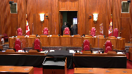
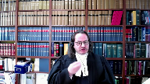
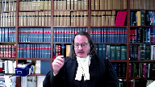
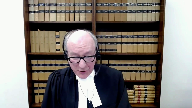
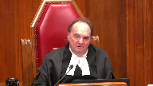
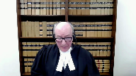
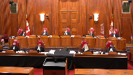
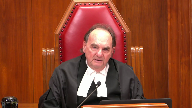

---
title: Attorney General of Quebec, et al. v. Alexandre Bissonnette
published-title: Heard
date: 2022-03-24
sidebar: false
---

This transcript was made with automated artificial intelligence models and its accuracy has not been verified. Review the original webcast [here](https://scc-csc.ca/case-dossier/info/webcast-webdiffusion-eng.aspx?cas=['39544']).
---

**Speaker 1** (00:00:01): Lacour, the court.

**Justice Wagner** (00:00:24): Bonjour

::: {.column-margin}

:::

, veuillez-vous asseoir, s'il vous plaît.

La cause procuréure générale du Québec est à Al, contre Alexandre Bissonnet.

Pour l'appelant procuréure général du Québec, maître Jean-François Paré, maître Sylvain Lebeff, maître Julie Da Silva, maître Stéphanie Quirion-

Quentin.

Pour l'appelant de Sa Majesté la Reine, maître François Godin, maître Olivier T. Raymond.

Pour l'intervenant procuréure générale du Canada, maître Ie-Yun Demers.

Pour l'intervenant ateliers général d'Ontario, Milan Rupic et Katie Daugherty.

Pour l'intervenant ateliers général d'Ontario, Maïka B. Rankin.

Pour les intervenants Toronto Police Association, Canadian Police Association, ETA,

Timothée S.B. Denson, et Marjane Delavare.

Pour l'intervenant Canadian

Association of Chiefs of Police, monsieur Saint-Germain, Jason Fraser.

Pour l'intervenant National Council of Canadian Muslims, Samia Omer, Danielle Cullen.

Pour l'intervenant observatoire des mesures visant la sécurité nationale, maître Stéphane Beaulac.

Pour l'intimé Alexandre Bissonnet, maître Charles-Olivier Gosselin, maître Nicolas Derry.

Pour l'intervenant Association des avocats de la défense de Montréal-Laval-

Longueuil, maître Juliette Vanny.

For the intervener Independent Criminal

Defense

Advocacy Society, Eric Pulsky, and

Alex Tolledy.

For the intervener Queen's Prison Law Clinic, Aaron Dann, and Paul Soka.

For the intervener Canadian Prison Law Association, Simon Boris.

For the intervener Canadian Civil Liberties Association

, Stephanie Di Giuseppe, and Archie Mann.

For the intervener British Columbia Civil Liberties Association, Danielle Rabitaille

, and Carly Peddle.

Maître Paris.

**Speaker 2** (00:02:53): Monsieur le juge en chef, mesdames les juges, messieurs les juges, bon matin.

::: {.column-margin}

:::

Votre court entend aujourd'hui un débat important juridique en matière constitutionnelle et pénale.

Vous aurez à examiner la légalité de la réponse du législateur fédéral à l'iniquité constatée entre la période d'inadmissibilité à la libération conditionnelle octroyée à l'auteur d'un seul meurtre et celle identique octroyée à un meurtrier multiple.

Regarde cette question juridique fondamentale, évidemment il y a eu un drame humain sans précédent vécu par une communauté tout entière par la ville de Québec, une tragédie qui a résonné à travers le Canada.

D'emblée, vous mentionnez mon rôle précis à titre de procureur général du Québec.

Je suis intervenu, nous sommes intervenus pour soutenir la validité constitutionnelle de la disposition 745.51.

La Rêne, la direction des poursuites criminelles et pénales qui m'accompagne et qui me suivra, est représentée par Maître Godin, présentera des arguments sur la détermination de la peine et le quantum qui s'applique à Monsieur Bissonnette.

Je ne ferai aucune représentation sur un quantum ou la détermination de la peine précise à Monsieur Bissonnette.

Je laisserai ces arguments à mon confrère Maître Godin.

L'analyse de cette disposition doit se faire en gardant à l'esprit manifestement en filigrane le fait qu'il s'agit d'une disposition qui sanctionne en termes de gravité objective le pire crime au Canada commis plus d'une fois.

Compte tenu du temps qui m'est octroyé, je concentrerai mes représentations sur trois sujets précis.

D'abord, la portée, les balises et les critères de l'article 745.51 du Code criminel.

Deuxièmement, les objectifs législatifs de la disposition.

Et troisièmement, la conformité de cette disposition en regard des articles 7 et 12 de la Charte.

Maître Paré.

**Justice Brown** (00:04:53): Est-ce que la question des meurtres de deuxième degré, est-ce qu'elle est directement devant nous?

**Speaker 2** (00:05:00): elle n'est pas directement devant vous, considérant le fait que ce soit des meurtres au premier degré qui s'appliquent à M. Bissonnette, mais évidemment, je vous parle de la constitutionnalité de la disposition, ce qui fait en sorte que l'interaction entre les articles 745, incluant son interaction avec la LNAC, va faire partie évidemment des représentations lorsque je vous parlerai de la portée de l'article 745.50.

::: {.column-margin}

:::

**Justice Brown** (00:05:24): Vous allez parler de la portée,

mais est-ce qu'il faut décider cette question?

**Speaker 2** (00:05:32): En fait, il faut décider de la validité de l'article 745.51.

::: {.column-margin}

:::

745.51 réfère bien entendu ici à 745A, mais je pense que pour bien comprendre la portée de la disposition, le pouvoir discrétionnaire qui est octroyé à travers cette disposition-là sur des critères qui sont valides, je pense qu'il faut regarder l'ensemble de la disposition.

Je suis conscient évidemment ici que la disposition s'applique à M. Bissonnette dans le cas de meurtre au premier degré.

Merci beaucoup à vous.

**Justice Côté** (00:06:02): Maitre Paris, vous êtes conscient ici que la disposition s'applique à M. Bissonnette.

Vous devez certainement être au courant de la décision de la Cour d'appel d'Alberta dans l'affaire de Garland, où il y a eu un exercice d'interprétation statutaire de la disposition qui a été fait.

**Overlapping speakers** (00:06:19): Bye.

**Justice Côté** (00:06:20): Et la dissidence d'un juge là-bas est à l'effet que... Je comprends qu'ici, la Cour d'appel le dit au paragraphe 65 de son jugement, que toutes les parties ont convenu avec raison que la disposition s'applique indépendamment du fait que les meurtres multiples ont été commis lors d'une même transaction criminelle ou lors d'événements distincts.

::: {.column-margin}

:::

Mon point n'est pas là.

Mon point, c'est que le texte même de la disposition 745.51 utilise deux temps, comme si, quand les meurtres multiples sont commis, lorsque la personne est condamnée à l'issue d'un procès pour plusieurs meurtres multiples, l'interprétation statutaire du juge dissident en Alberta est à l'effet que cette disposition-là s'appliquerait pas dans un cas comme celui de M. Bissonnette.

Est-ce que vous avez l'intention de nous parler de ça?

**Speaker 2** (00:07:13): Madame la juge Côté, non, je n'ai pas l'intention de vous parler de ça.

::: {.column-margin}

:::

Compte tenu, vous l'avez bien dit dans votre introduction à la question, ici, toutes les parties s'entendent et la Cour a statué que cette disposition s'appliquait dans ces cas-là.

Il s'agit d'une dissidence dans le jugement Garland et pour ce qui est de notre part, notre soumission quant à ça est de suivre évidemment le courant majoritaire dans Garland et que la décision, la disposition s'applique indépendamment de ce que vous m'avez dit précédemment.

745.51 s'applique à ces situations et vous allez voir quand je vais vous expliquer les objectifs législatifs de la disposition.

Pour nous, il est clair en fait que c'est une disposition qui s'applique à tous.

**Justice Côté** (00:07:52): Mais, M. Paris, vous allez nous parler de l'objectif législatif.

::: {.column-margin}

:::

Peut-être que le texte de la disposition ne reflète pas l'objectif législatif, on verra.

Mais ma question aussi va, il y a une décision de notre Cour de 1982 dans l'affaire Skolnick, à l'effet que lorsque deux infractions sont jugées ensemble et qu'une seule condamnation est prononcée pour chacune à l'issue du procès, il faut les considérer comme une seule pour déterminer si une peine plus sévère s'applique à cause d'une condamnation antérieure, suivant ce qui a été énoncé en 1982 dans notre Cour.

La disposition ne s'appliquerait pas à un cas comme celui de M. Bissonnette.

**Speaker 2** (00:08:28): Je vous resumais, et peut-être que mon confrère Matt Godin de la Couronne, évidemment, sur l'interprétation de l'article sera peut-être vous répondre plus amplement, mais ce que je vous dis ici, Mme la juge Côté, c'est que pour nous, il est clair que le jugement de la Cour d'appel et toutes les parties étaient d'accord sur ce point-là, que cette disposition-là s'appliquait à M. Bissonnette.

::: {.column-margin}

:::

Et c'est dans ce contexte-là que je vous présenterai les objectifs législatifs de la disposition et sa validité.

Et vous allez voir lorsque je vous présenterai ce qu'on vous propose comme objectif législatif.

Pour nous, la Cour d'appel a fait une erreur dans ses objectifs législatifs en étant trop restrictive quant aux tueurs incorrigés.

**Justice Wagner** (00:09:04): Alors, M. Paré, avant d'aller là, j'ai une question pour vous. Oui.

::: {.column-margin}

:::

Est-ce que j'ai tort en disant que vous nous demandez d'analyser la disposition, l'égalité, la constitutionnalité de la disposition, selon l'article 7 de la Charte, avant d'aller à l'article 12? Oui.

Oui. Pourquoi?

Parce qu'il y a un rapport à la première vue, là.

**Overlapping speakers** (00:09:26): Ça va.

**Justice Wagner** (00:09:26): de nos enseignements dans Neur, dans Lloyd, dans Wheeling.

**Overlapping speakers** (00:09:31): Bye.

**Speaker 2** (00:09:32): On va à la disposition précise avant d'aller à la disposition générale.

::: {.column-margin}

:::

Et j'en suis tout à fait conscient, M. le juge Wagner, et la différence ici, c'est que ce n'est pas une peine minimale et la disposition, évidemment, on regardera ici la portée de l'article 12 quand tu as la peine cruelle et inusité par nature.

Alors, on n'est pas ici en contexte mandatoire, on est ici et je pense que les arguments que je vais vous soumettre sur 7 sont importants et vont avoir un reflet sur les articles, sur l'article 12.

Après, il faudra considérer évidemment dans l'analyse de l'article 12 que l'article 7 n'est pas de portée excessive.

Parce qu'ici, je pense que le test à effectuer quant aux effets de cette disposition-là sur un accusé à 745.51, bien évidemment, la portée de l'article, il faut prendre pour acquis lorsque l'on analysera les effets sous l'article 12 que cette disposition-là n'est pas de portée excessive.

**Justice Wagner** (00:10:31): Vous êtes d'accord avec moi que si nous considérons que cette disposition viole l'article 12, il ne sera pas nécessaire d'analyser la disposition sous l'article 7.

**Speaker 2** (00:10:44): Je suis absolument d'accord avec vous, monsieur le juge, mais on vous l'a présenté comme ça dans le mémoire, considérant le fait que pour nous, comme la Cour l'avait analysé, la portée, la Cour d'appel a évidemment… et quand vous regardez le jugement de la Cour d'appel, évidemment, les arguments sont interreliés.

::: {.column-margin}

:::

Et pour nous, il était primordial d'abord de vous présenter les arguments sur 7 pour épurer ce sujet et que sur 12, on n'est pas des arguments de portée excessive qui pourrait venir tainter votre analyse sur 12.

C'est la raison pour laquelle on vous l'a présenté comme ça.

**Justice Wagner** (00:11:18): Dernière question sur ce sujet-là.

**Overlapping speakers** (00:11:21): Be on the watch.

**Justice Wagner** (00:11:21): d'autres.

Dans l'éventualité, on viendra à la conclusion qu'effectivement la disposition viole la Charte des droits, notamment l'article 12.

Est-ce que vous êtes d'avis qu'elle ne peut pas être sauvée par l'article 1?

**Speaker 2** (00:11:36): Nous n'avons fait aucune représentation sous l'article 1 du juge et nous ne nous en ferons pas ce matin, ni même sur une réparation potentielle.

**Justice Kasirer** (00:11:46): Mais est-ce que je peux poursuivre sur ce plan-là, M. Paré? Bien sûr.

::: {.column-margin}

:::

Pourquoi vous n'avez pas fait des soumissions sous un?

C'est-à-dire, vous plaidez longuement sur les objectifs de la loi.

Est-ce que… est-ce que votre… on peut déduire de votre silence et que vous concédez… que vous concédez le point sous l'article-là?

**Speaker 2** (00:12:10): Je dirais, Monsieur le juge Casirer, qu'en étant conscient des différences entre le test sous 1 et le test sous 7, dans ce cas-ci, nous avons choisi d'axer nos arguments sur la portée de l'article 7 et de l'article 12 quant à cette disposition-là.

::: {.column-margin}

:::

Évidemment, les arguments sur l'article 7, principalement, peuvent s'entremêler.

Évidemment, il y a un test de balancing à faire avec l'article 7.

C'est un peu du même ressort que l'article.

Je suis conscient également que la Cour suprême a écrit quelques phrases dans les dernières décisions, en particulier celle de Bedford, où ça devient évidemment plus difficile de justifier cet article-là s'il y a une violation à 7.

Ce n'est pas impossible, mais ça devient un peu plus difficile.

C'est un choix qu'on a fait de ne pas le faire.

Alors, je vous réitère les trois sujets que la portée de l'article, les objectifs législatifs et la conformité de cette disposition-là en regard des articles 7 et d'autres.

Pour nous, je voudrais réitérer à la Cour, je pense qu'il est important de comprendre les erreurs de droit que nous avons identifiées dans notre mémoire.

Nous prétendons que la Cour d'appel en fait a assimilé de manière implicite une norme constitutionnelle de l'inadmissibilité à 25 ans.

Tout au long du jugement, c'est en filigrane que la Cour d'appel ici établit implicitement un principe ou une norme constitutionnelle qu'à partir de 25 ans, il doit y avoir une révision de cette peine-là par la Commission des libérations conditionnelles.

Elle élève également le principe de la réhabilitation et de la réinsertion sociale à un niveau tel que c'est comme si elle l'élevait au stade d'un principe constitutionnel.

**Justice Wagner** (00:13:52): À ce niveau-là, mettre son parlant de réhabilitation.

**Overlapping speakers** (00:13:57): Mm-hmm.

**Justice Wagner** (00:13:57): En quoi ce principe de réhabilitation est inclus dans la nouvelle disposition?

::: {.column-margin}

:::

Parce qu'on a dit dans la casse, on a dit que la réhabilitation fait partie de nos valeurs fondamentales en matière de peine.

J'aimerais savoir comment vous rattachez ce principe fondamental-là à une disposition qui empêche à toute fin pratique toute réhabilitation et qui constitue en fait une peine de mort par incarcération.

**Speaker 2** (00:14:25): plusieurs volets à votre question, j'ai mis à tarder un par un.

::: {.column-margin}

:::

D'abord, en ce qui concerne la validité constitutionnelle de 745.51, ne pas oublier ici qu'on regarde la légalité et la validité de la disposition et non pas d'une décision qu'un juge pourrait octroyer dans certains dossiers.

Les critères prévus à 745.51, il faut intégrer le pouvoir discrétionnaire que le juge de première instance a à cette disposition-là sur une disposition qui est ancrée bien valide et bien balisée.

Je vous dis ancrée, valide et bien balisée parce que 745.51, grosso modo, on reprend les mêmes critères qu'à 745.4 et le juge n'est absolument pas empêché de prendre en considération l'ensemble des facteurs de détermination de la peine.

Alors à votre question, monsieur le juge en chef Wagner, sur le fait de savoir si la disposition oblitaire complètement la réhabilitation, je vous dirais que je ne suis pas d'accord parce que l'article 745.51 permet tout à fait à un juge d'exercer un pouvoir discrétionnaire et de tenir en compte la réhabilitation dans les cas qui le permettront.

Et en réalité, ces cas-là, et vous le voyez, je prends l'exemple du procureur général de l'Alberta, le tableau qu'il a dans son mémoire, vous allez voir qu'il y a plein de, il y a beaucoup de causes au Canada où on a décidé de ne tout simplement pas appliquer cette disposition-là, considérant que l'on a pris, dans certains cas, les facteurs de réhabilitation comme étant importants.

**Justice Wagner** (00:15:56): Alors, l'adoption de la législation telle que libellée n'est pas applicable.

::: {.column-margin}

:::

Parce que de condamner quelqu'un à prison à vie, on sait qu'ils sont déjà condamnés à prison à vie, avec l'impossibilité d'obtenir une libération conditionnelle avant 150 ans, à mon sens, à moi, ça veut dire qu'on oublie le critère de réhabilitation.

**Speaker 2** (00:16:18): Évidemment, vous me parlez du 150 ans, Maître Godin vous fera les représentations appropriées sur le fait d'avoir maintenant le mandat de Sainte-Catherine.

**Justice Wagner** (00:16:25): On peut prendre le scénario que vous voulez, mais possiblement, on peut arriver avec des peines aussi, j'utilise le mot « ridicule ».

**Overlapping speakers** (00:16:34): Sachant qu'un être humain n'a pas le droit d'être humain.

**Justice Wagner** (00:16:36): ne peut pas survivre à cette période-là.

Et là, je me demande pourquoi.

Ça sert à quoi?

Est-ce que ça a un sens de donner une peine comme celle-là?

Est-ce que ça n'amène pas le système de rire du système de justice pénale en faisant des sentences comme celle-là?

**Speaker 2** (00:16:52): Permettez-moi de vous répondre par les objectifs législatifs, M. le juge, si vous permettez.

Les objectifs législatifs de cette disposition-là étaient pour nous de mieux réfléter la gravité des sentences et la sévérité accrue des peines pour un meurtrier multiple.

**Overlapping speakers** (00:17:06): Ils ont déjà la prison à vie.

Est-ce qu'il y a une peine plus grave que la prison à perpétuité?

**Speaker 2** (00:17:10): Je vais prendre l'exemple de Shropshire.

::: {.column-margin}

:::

Quand on a voulu jouer sur l'admissibilité à une libération conditionnelle entre 10 et 25 ans, le législateur a comme ressource ce moyen-là, monsieur le juge en chef, de retarder l'admissibilité à une libération conditionnelle.

Il s'agissait d'un mécanisme qui avait déjà été utilisé à l'époque, qui avait déjà été utilisé sur 745.4.

Alors, on a transposé ce mécanisme-là et on a conservé l'interaction entre les articles 745 et les articles 745.4 et 745.51.

En rappelant que cette disposition-là est susceptible d'un appel de plein droit à 675.2.3.

L'objectif législatif de cette disposition-là, évidemment, est de permettre de sévir et de permettre de mieux refléter la gravité.

C'est le mécanisme que le législateur a choisi de prendre et sur une violation à l'article 7, on doit considérer que cet objectif-là est approprié et légitime.

Reste à savoir si cet objectif-là est de porter excessive dans ses effets.

Et sur les objectifs législatifs, si vous me permettez…

**Justice Kasirer** (00:18:23): avant d'aller, pour compléter la réponse à M. le juge en chef,

::: {.column-margin}

:::

ce que la Cour d'appel dit au paragraphe 93, en relevant la même absurdité pour employer le terme de la Cour d'appel, ridicule, absurde, c'est un peu le même combat

, c'est que le tribunal ne doit pas rendre une ordonnance qui ne peut jamais se réaliser.

C'est ça ce qui discrédite l'administration de la justice, c'est de rendre un jugement impossible.

Qu'avez-vous à dire sur ce point?

**Speaker 2** (00:19:02): Je comprends très bien votre question, M. le juge Casirer.

::: {.column-margin}

:::

D'abord, l'ensemble des jugements au Canada que vous avez, par exemple, je me réfère aussi au tableau qui a été fait par le procurant général de l'Alberta.

Aucun juge n'a dépassé 75 ans d'inadmissibilité.

Deuxièmement, la disposition comme telle.

Vous soulevez le fait que la disposition n'est pas de maximum en réalité.

La disposition est tellement ancrée sur des principes que le droit pénal connaît, tellement ancré sur des principes.

En fait, tout l'outil du droit criminel, tous les outils du droit criminel sont prévus à 745.51 pour qu'un juge ne rende pas ses ordonnances absurdes.

La disposition prévoit en réalité d'utiliser l'ensemble des mécanismes prévus au droit criminel pour qu'on ne tombe pas évidemment dans ce genre d'absurdité.

On parle de 118, 143, 168 ans.

On parle de 800 ans, même de 1000 ans dans le jugement de la Cour d'appel.

Ce que j'ai envie de vous dire ici, c'est que ce sont les juges de première instance qui ont la discrétion et ont l'ensemble des outils au corpus législatif du code criminel pour s'assurer que l'ensemble des facteurs soient sous-pesés.

Bien évidemment, dans des cas, et je pense par exemple au cas de M. Saretsky, au cas de M. Garland, où on a des meurtres de sang-froid, on a des enfants démembrés et même qui ont su faire de cannibalisme.

Évidemment, dans ces cas-là, les principes de réhabilitation et de réinsertion feront partie du caractère du contrevenant, seront analysés par un juge et pourront, dans certains cas, être mis de côté.

Et effectivement…

**Justice Wagner** (00:20:47): Qu'est-ce qui manque par rapport à la disposition actuelle, maître?

::: {.column-margin}

:::

Alors, un meurtrier, là, va être, à premier degré, va être condamné à prison à vie, sans possibilité de libération conditionnelle avant 25 ans.

Qu'est-ce qui manque?

Si le détenu en question est un meurtrier sanguinaire, aucune chance de réhabilitation, il n'aura pas sa libération conditionnelle, il va rester, il va mourir en prison.

Par contre, si, d'aventure, cet individu-là, d'une manière ou d'une autre, peut se réhabiliter et démontre, effectivement, à la satisfaction d'une commission de libération conditionnelle, c'est une autre étape, qu'il peut être réhabilité, il va revenir à la société.

Qu'est-ce qui manque qui était nécessaire pour la nouvelle législation?

**Speaker 2** (00:21:34): Je pense, M. le juge en chef, que pour répondre à votre question, je vais, dans mon cahier condensé, en fait, la rainure, récemment rendue par vous, à l'onglet 19, au paragraphe 98, répondre en partie à votre question.

::: {.column-margin}

:::

En fait, c'est… il faut bien comprendre le rôle de tous et chacun ici, et le rôle du juge sur la détermination de la peine versus le rôle de la Commission des libérations conditionnelles est bien différent.

Et vous avez écrit…

cette Cour a écrit, en fait, en 2015, un peu à contrario, mais c'est un argument qui a été amené par le procureur général du Canada sur l'effet que pourrait avoir une possible décision de la Commission des libérations conditionnelles sur une peine minimale.

Et la Cour a pris soin de dire que le procureur général du Canada se méprend sur la fonction de la Commission des libérations conditionnelles, qui est d'assurer la mise en liberté sécuritaire du délinquant dans la collectivité et non de veiller à ce que le délinquant purge une peine proportionnée.

Et cette dernière fonction n'incombe qu'à une seule personne, à savoir le juge qui détermine la peine.

Et évidemment, dans Shropshire, je vous parlais de Shropshire tout à l'heure, vous avez fait un peu…

cette Cour a fait un peu la même analyse en pouvant déférer la libération conditionnelle et c'était un mécanisme qui était valide, en fait, pour dénoncer davantage, mettre l'accent sur les principes de châtiment et de réprobation.

Je fais référence aussi à R contre MCA, où évidemment la Cour suprême a accepté, en fait, que l'on se serve de ce mécanisme-là parce que ça appartient au juge de détermination de la peine ici, de prendre l'ensemble des éléments.

Et, M. le juge Wagner, on pourrait avoir un rapport d'experts où il serait tout à fait clair, on pourrait avoir de la preuve, des témoignages, une historique carcérale, des antécédents judiciaires où il serait tout à fait correct de dire sur la détermination de la peine, au moment où on prononce cette peine-là, qu'en sous-paisant l'ensemble des facteurs, c'est permis à 745.51 de le faire, bien, tout simplement d'avance prononcer le fait que cet individu-là ne pourra pas ressortir.

**Justice Wagner** (00:23:38): que les principes fondamentaux qui reflètent un peu les valeurs de la société canadienne, c'était la dénonciation, la protection du public, mais également la réhabilitation dans l'espoir qu'un individu puisse s'amender et revenir en société.

::: {.column-margin}

:::

C'est une valeur fondamentale.

Et dans certains cas, au niveau de la dénonciation et de la protection, l'individu va être incarcéré à vie.

Il ne peut pas y avoir plus de peine que ça.

On a abolie la peine de mort en 76.

C'est la peine la plus sévère que l'on peut donner.

Et si d'aventure, effectivement, l'individu peut se réhabiliter, bien, ça fait partie de nos principes et nos valeurs fondamentales de lui donner la chance après 25 ans.

Je me demande, qu'est-ce qui manque?

**Speaker 2** (00:24:22): Bien, c'est ce que j'essaie de vous répondre en réalité, monsieur le juge en chef Wagner.

::: {.column-margin}

:::

J'essaie de vous dire en réalité que le législateur ici, le Parlement, avait constaté une iniquité entre ceux qui étaient condamnés pour le meurtre simple et ceux pour le meurtre multiple qui obtenaient, vous me le dites vous-même, obtenaient l'emprisonnement en perpétuité, mais avaient la possibilité, tous et chacun, de demander une révision de cet emprisonnement-là, en fait une libération conditionnelle au bout de 25 années de détention.

Et, vous me parliez là, on a aboli la peine de mort en 76 et le compromis, on a fait un compromis politique évidemment à cette époque entre les abolitionnistes et ceux qui voulaient préserver la peine de mort, c'est un compromis politique, on a mis une ligne à 25 ans.

Évidemment, il n'était pas interdit pour le législateur de vouloir sévir davantage pour des cas comme Garland, Sarecki, Bissonnette et Fontanis.

**Justice Wagner** (00:25:16): déjà à 25 ans, maître, le Canada a la peine la plus sévère au niveau de l'inligibilité.

::: {.column-margin}

:::

Il y a beaucoup de sociétés où la règle de droit prévaut, dans le monde occidental, où c'est 15 ans, 12 ans, 10 ans, 15 ans, 18 ans.

Le Canada, c'est 25 ans.

Vous parlez d'un compromis, c'était probablement le compromis qui a été fait à l'époque de l'abolition de la peine de mort.

C'est déjà très sévère.

**Speaker 2** (00:25:41): Je vous entends, M. le juge Wagner, ce que je veux, le message que je veux vous passer ce matin, il est fort simple.

::: {.column-margin}

:::

Puis je vous entends sur la réhabilitation et je vous entends sur la durée de vie en détention.

Peut-être deux choses.

D'abord, un individu peut passer le reste de sa vie en détention et ça, je pense que le Canada accepte ça.

Prenons par exemple quelqu'un de plus âgé qui reçoit une peine de 25 ans, va passer le reste de sa vie utile en détention.

Prenons un autre exemple.

En fait, vous me parliez du cas de Garland où vous me disiez probablement que la Commission des libérations conditionnelles n'accordera pas cette libération et que cet individu restera sa vie durant en détention.

Et ça non plus, le Canada n'a pas de problème avec ça.

Je vous entends sur la réhabilitation et sur le fait que c'est une valeur canadienne qui est importante.

Vous-même, vous l'avez dit dans la ré-lacasse et j'en suis bien conscient.

Ceci dit, ce n'est pas l'article en soi 745.51 qui offre un pouvoir discrétionnaire.

Évidemment, si la disposition était mandatoire, on serait bien ailleurs.

**Justice Côté** (00:26:44): La disposition n'est pas mandatoire, la disposition prévoit une discrétion du juge, mais supposons que je vous suis, n'assumez rien, mais supposons que la disposition est constitutionnelle et le juge décide dans sa sagesse que la période d'éligibilité à la demande de libération conditionnelle devrait être plus que 25 ans.

::: {.column-margin}

:::

Mais sa discrétion est limitée parce que s'il fait cette détermination que la période d'éligibilité devrait être supérieure à 25 ans, mais que le juge n'est pas prêt à se rendre à 50 ans, qu'est-ce qu'on fait à sa discrétion est extrêmement limitée et le Parlement a décidé que ça va marcher par bloc de 25 ans.

De là les propos du juge en chef, à un moment donné s'il y a un juge qui décide que ça mériterait trois blocs de 25 ans en plus de la période initiale de 25 ans, il y a un problème.

Alors oui, il y a la discrétion, mais la discrétion est extrêmement limitée.

**Speaker 2** (00:27:36): Madame la juge Côté, réponse en deux volets.

::: {.column-margin}

:::

D'abord, sur le pouvoir discrétionnaire, évidemment, c'est ce pouvoir discrétionnaire-là pour qu'il soit, pour qu'il résonne en fait sur la validité constitutionnelle d'une décision, pardon, pour que ce pouvoir discrétionnaire-là résonne par rapport à cette disposition-là.

Il doit bien évidemment être ancré sur des critères de détermination bien concrets et bien précis, ce que la disposition offre.

À votre question, qu'est-ce qu'on fait de la discrétion qui est limitée?

D'abord, les bons de 25 sont les moyens d'en arriver à un objectif.

Ça, c'est un choix du législateur dans sa geste en fait.

**Justice Brown** (00:28:13): Le législateur reconnaît l'existence d'une corrélation entre la vie des victimes et les bondes des périodes d'admissibilité de 25 ans.

**Speaker 2** (00:28:23): Et ça, c'est ce que la Cour d'appel vous propose comme objectif législatif et ce à quoi le procureur général du Québec ici n'est pas tout à fait en accord.

::: {.column-margin}

:::

La Cour d'appel vous propose deux objectifs législatifs qui sont malheureusement, qui prédéterminent malheureusement le sort de l'analyse par la suite.

On vous parle d'abord des tueurs les plus incorrigibles comme objectif législatif et pour ensuite vous parler de chaque vie perdue.

Nous, ce qu'on vous amène comme objectif législatif, c'est davantage ce que le juge Juott a fait dans son jugement.

Je suis à l'onglet 2 en fait, au paragraphe 462 de mon condensé.

Vous allez voir que le juge Juott, en première instance, lui a favorisé la proportionnalité entre la gravité des crimes et le degré de responsabilité, s'assurer de payer un juste dû pour ces crimes-là et de renforcer l'objectif de dénonciation en s'assurant de la protection de la société.

On est très près de cet objectif-là, exception faite du fait que la protection de la société, pour nous, c'est une valeur sociale qui est directrice, qui est macro, en fait, qui est en filigrane de l'ancierté du corpus législatif au code criminel.

Évidemment, lorsqu'on met quelqu'un en détention, bien évidemment, on protège la société par le fait même.

Ceci dit, on l'a exclu de l'objectif législatif et pour nous, c'est clair que l'objectif législatif est de mieux refléter la gravité.

Et pour répondre à votre question, monsieur le juge, bien évidemment, chaque vie perdue sera tenue compte, sera tenue en compte dans cette analyse-là et le fait d'être des bondes 25, si on prenait comme objectif législatif les bondes 25 ans ou, bon, chaque vie perdue qui correspond à un bonde 25 ans, il ferait en sorte, évidemment, de premièrement prédéterminer l'analyse constitutionnelle et la validité à 7 et deuxièmement, c'est comme si on rendait cette disposition-là mandatoire parce qu'à tout coup où je n'associerais pas le nombre de meurtres aux bondes 25, j'irais à l'encontre et j'irais au-delà de mes objectifs législatifs, ce qui fait en sorte que ma prétention est à l'effet que la Cour d'appel, lorsqu'elle a inscrit ces objectifs-là, a évidemment prédéterminé le résultat.

Il est clair pour nous qu'avec ces objectifs-là, la disposition devient constitutionnelle.

**Speaker 2** (00:30:33): les vrais objectifs législatifs étaient évidemment de prendre en compte chaque vie perdue, de prendre en compte les victimes.

::: {.column-margin}

:::

Mais comment on fait ça?

On fait ça en n'étant plus sévère sur la sentence, qui est l'objectif réel, et dans la détermination de la peine, le juge de première instance qui se penchera pourra soupeser l'ensemble des critères qui sont prévus à 745.51 ainsi qu'à 718 pour appliquer ou non cette disposition-là.

C'est dans ce contexte-là bien précis, et là je reviens à Mme la juge Côté, on s'inscrit le juge, s'inscrit le pouvoir discrétionnaire du juge à ce moment-là.

**Justice Kasirer** (00:31:10): Justement, M. Paré

::: {.column-margin}

:::

, je veux poursuivre dans la lignée de la juge côté sur le pouvoir discrétionnaire parce qu'il y a quelque chose que je ne comprends pas.

Je confesse et je voudrais que vous nous expliquiez.

La Cour d'appel relève une espèce de paradoxe par rapport au pouvoir discrétionnaire.

Elle dit, d'une part, 145, que le pouvoir n'est pas suffisamment balisé pour empêcher toute peine excessive, d'une part, et à la fin de son jugement, elle dit, cette même disposition fait défaut parce que le pouvoir discrétionnaire n'est pas suffisamment étendu dans la mesure où le juge ne peut pas couper les bonds de 25 ans comme l'aurait voulu le faire le juge de première instance.

Alors, pour nous qui avons dans la plupart des jugements portant sur la détermination de la peine, je pense aux jugements portant sur les peines minimales, on voit l'exercice du pouvoir discrétionnaire d'une seule façon.

Or, ici, il semble y avoir comme deux têtes au pouvoir discrétionnaire.

Voyez-vous, je voudrais que vous nous expliquiez comment vous envisagez ce pouvoir discrétionnaire et est-ce que, si je vous comprends bien, il doit toujours être exercé de façon constitutionnelle.

C'est un peu en filigrane dans votre mémoire.

**Speaker 2** (00:32:40): Monsieur le juge Casirer, en fait, le paragraphe 745, évidemment, on s'est posé quelques questions sur ce paragraphe-là, comme vous, Monsieur le juge, sur le fait qu'elle n'était pas suffisamment balisée pour empêcher toute portée excessive.

::: {.column-margin}

:::

Parce que comme je viens de vous plaider, pour nous, et je vous le répète, le pouvoir discrétionnaire ici ne tient pas dans le vide tout seul.

Prenons la comparaison avec les peines minimales.

Evidemment, les peines minimales, et vous nous l'avez dit à plusieurs égards, je prends Nur, par exemple, ou Lloyd, où si le juge avait un pouvoir discrétionnaire, évidemment, on ne serait pas là et la disposition serait sauvée à ce moment-là, compte tenu que le juge pourrait déterminer la peine selon les critères de détermination de la peine et faire en sorte que cette peine-là soit juste et proportionnée.

C'est la même chose un peu ici.

C'est pour ça qu'évidemment, avec égard pour la Cour d'appel, pour nous, ce paragraphe-là est erroné.

La disposition, elle est clairement suffisamment balisée.

Elle ne pourrait pas être plus balisée et évidemment, j'exclus le maximum.

Ça, c'est sur les moyens faits, parce que les premières questions que vous m'avez posées étaient sur à quoi ça peut conduire.

Moi, ce que je vous dis, c'est qu'un juge de première instance qui détermine la peine, il a l'ensemble des outils possibles pour le faire, il a l'ensemble des critères, mais ce n'est pas le cas d'une peine minimale du tout.

Il a l'ensemble des critères pour décider s'il applique ou non cette disposition-là.

Alors évidemment, pour nous, c'est bien suffisamment balisé.

La différence, évidemment, et pour la Cour d'appel, c'était qu'il y avait une limite dans les bons de 25 ans, donc cette discrétion-là était appliquée par Bonde 25 en cas de meurtre au premier degré.

Évidemment, en cas de meurtre au deuxième degré, cette discrétion-là s'exécute peut-être un peu plus largement.

Mais ça, on vient à un choix du législateur.

Et si un juge de première instance qui détermine la peine au vu des témoignages, au vu des rapports d'experts et au vu de la preuve qui est amenée devant lui, il est bien clair que le juge, qui n'est pas à l'aise considérant même le principe de totalité de la peine, qui n'est pas à l'aise considérant le caractère du contrevenant, la circonstance entourant l'infraction va pouvoir appliquer ces facteurs de détermination de la peine et peut-être redescendre de 75 à 50 ans ou de 50 ans à 25 ans et ne même pas appliquer cette disposition-là.

**Justice Côté** (00:35:06): supposons que le juge dans son évaluation en tenant compte de tous les facteurs puis je prends pas nécessairement le cas de monsieur Bissonnette, prenez le cas d'une autre personne qui est condamnée alors donc supposons que le juge dit dans mon évaluation des facteurs je trouve que 25 ans pour période d'éligibilité c'est trop tôt, moi je mettrai ça à 35 ans en analysant tous les facteurs.

::: {.column-margin}

:::

Quelle est la solution en ce moment là parce qu'il y en a pas assez pour aller jusqu'à 50, le juge dans sa sagesse dit ça va être 35 ans.

Est-ce que la façon de lire la disposition est à l'effet le juge peut pas dépasser 25 ans.

**Speaker 2** (00:35:42): Votre question, en fait, est la question que M. Jujuette s'est posée en première instance quand il a conclu que...

**Justice Côté** (00:35:48): Mais prenez pour acquis que, je ne vous dis pas que c'est ce que je pense, mais prenez pour acquis dans l'exemple que je vous donne que le juge n'a pas le pouvoir de réécrire la disposition.

**Overlapping speakers** (00:35:57): Je comprends mieux.

**Justice Côté** (00:35:58): Est-ce qu'à ce moment-là, le juge qui dit « Moi, je pense que ça devrait être 35 ans, mais là je suis entre 25 et 50, je ne peux pas réécrire la disposition », est-ce que la solution c'est de dire «

Vous ne pouvez pas dépasser 25 ans »?

**Speaker 2** (00:36:13): Ma réponse va être très claire, Madame la juge Côté.

::: {.column-margin}

:::

Effectivement, elle ne pourrait pas dépasser 25 ans.

Considérant le principe de globalité de la peine et considérant que ce qu'il va faire, le juge, c'est au bénéfice de l'accusé.

Alors évidemment, on ne peut pas reprocher à disposition d'être au bénéfice de l'accusé.

Et c'est la question que le jugeouat s'est posée, il est arrivé justement à 35 ans, lui, il a décidé de récrire la disposition, ce n'est pas devant vous aujourd'hui.

Mais justement, à son paragraphe, je pense que c'est 768 et suivant, bref, il fait ce commentaire que vous me faites, Madame la juge Côté, dans votre question, à savoir qu'est-ce que je fais si je ne suis pas à l'aise avec 50, mais j'aurais donné un peu plus que 25.

Alors, je pense que le juge doit revenir à 25 ans considérant le principe de globalité de la peine et ça, c'est au bénéfice de l'accusé.

**Justice Wagner** (00:37:00): que la disposition est mal ficelée

. Quand un juge est obligé de se poser cette question-là, c'est peut-être que, justement, telle qu'elle existe présentement, la disposition « 25 ans inéligibilité, prison à vie » est suffisante.

**Speaker 2** (00:37:14): Est-ce que cette disposition-là est efficace?

Et dans ces cas-là, ce sera de toute manière au bénéfice.

**Justice Brown** (00:37:22): de l'accusé.

Vous avez mentionné l'article 12.

Quel est le cadre d'analyse pour les peines maximales discrétionnaires?

Le juge Jouot a eu recours au cadre d'analyse de Nour.

Est-ce qu'il avait raison?

**Speaker 2** (00:37:36): non.

::: {.column-margin}

:::

Le juge n'avait pas raison et la Cour d'appel en prend acte et toutes les parties en prennent acte que le cadre d'analyse prévu à NURS sur les peines minimales cadre un peu moins avec une disposition qui ici est discrétionnaire sur l'inanimité de la libération conditionnelle.

Notre soumission sur 12, en fait on regarde la disposition sur 12 si c'est une peine cruelle et inusitée par sa nature.

On a quelques indications en jurisprudence, pas beaucoup.

Indications entre autres, je l'ai à mon onglet 24 de mon condensé dans Smith, ça fait quand même un certain temps où le juge Lamer avait donné certaines indications.

Vous avez une page dans mon condensé, alors c'est en jaune.

Enfin je dois ajouter que certaines peines ou certains traitements seront toujours exagérément disproportionnés et incompatibles avec la dignité humaine, par exemple l'imposition d'un châtiment corporel, la peine de fouet sans égard au nombre de coups, à titre d'exemple de traitement, la lobotomie de certains criminels dangereux ou la castration d'auteurs de crimes sexuels.

**Overlapping speakers** (00:38:44): ou une peine qui empêche la réhabilitation.

À tout coup.

**Speaker 2** (00:38:49): Mais cette peine qui empêchera la réhabilitation, comme vous le dites Monsieur le juge en chef, ce n'est pas la disposition, c'est la sentence du juge.

::: {.column-margin}

:::

Peut-être que la sentence du juge aura manifestement de m'en indiquer, mais la disposition elle, elle n'enlève pas le pouvoir du juge de prendre en compte la réhabilitation.

Et dans certains cas, comme je vous mentionnais, où la gravité de l'infraction est telle et les circonstances du contrevenant sont telles, et le caractère du contrevenant est tel, on pourra mettre de côté cette réhabilitation.

Mais je veux bien être sûr qu'on comprenne notre position ici, la disposition n'enlève pas le pouvoir au juge de prendre en compte.

**Justice Brown** (00:39:34): Alors, la question à décider ici, la question à décider ici n'était pas dans le cas de Maître de premier degré, au moins, pourrait-il exister une circonstance dans laquelle ce pouvoir discussionnaire peut être exercé sans contrevendre l'article 12?

::: {.column-margin}

:::

Est-ce que ce n'est pas la question? Oui.

**Speaker 2** (00:40:04): Absolument, je pense que ce pouvoir, bien, vous l'avez d'abord en jurisprudence, vous avez beaucoup de cas où il y a de la chose jugée sur beaucoup de dossiers, j'en compte 33 ici dans le mémoire du procureur général de l'Alberta.

**Overlapping speakers** (00:40:17): We'll see you next time.

**Speaker 2** (00:40:17): vous avez quand même un certain nombre de dossiers où on est allé au-delà de 25 ans à quelques 75, quelques 50 ans dans des circonstances qui faisaient en sorte que ça ne choquait pas la conscience des Canadiens ici.

::: {.column-margin}

:::

On n'était pas contraire à la dignité humaine d'avance de prononcer une sentence pour un juge de première instance qui avait l'ensemble de la preuve devant lui qui lui permettait de dire d'ores et déjà, je vous le répète, en considérant le caractère du contrevenant, les circonstances de l'infraction, la gravité objective de cette infraction-là, de donner une peine ou de repousser l'inadmissibilité jusqu'à 50 ans.

**Justice Brown** (00:41:00): Acceptez-vous que 50 ans d'inadmissibilité, ça veut dire la même chose qu'emprisonnement en perpétuité, oui.

**Speaker 2** (00:41:14): Absolument, M. le juge, on n'a pas le choix d'accepter cette submission que vous me faites parce que dans certains cas, ça conduira évidemment, dans certains cas précis, avec la preuve précis, avec un juge qui aura déterminé une peine juste et proportionnée, ça conduira dans certains cas, bien évidemment, à de l'emprisonnement sans possibilité de libération conditionnelle, qui serait le même cas, par exemple, qu'un seul meurtre pour, par exemple, un homme de 60 ans qui se retrouverait en détention pour un minimum jusqu'à 85 ans.

::: {.column-margin}

:::

J'aimerais attirer votre attention.

Avant d'attirer, on vous assomme de questions, M. Paré, vous êtes toujours…

**Justice Kasirer** (00:41:51): C'est à votre honneur.

::: {.column-margin}

:::

Vous n'avez pas tout à fait répondu à la question de mon collègue, le juge Brown.

Est-ce que je dois comprendre que le pouvoir discrétionnaire doit être exercé de manière à neutraliser la violation de la Charte que la disposition par ailleurs à sa face même permet?

Est-ce que c'est ça votre point?

Non, ce n'est pas ça mon point.

C'est mon point.

**Speaker 2** (00:42:18): Évidemment, il y a une différence entre une sentence qu'un juge parce que dans l'ensemble du cas de criminels, une sentence pourrait devenir manifestement non-indiquée et telle que pourrait devenir possiblement inconstituable une sentence d'un juge.

::: {.column-margin}

:::

Et si la disposition permet à un juge d'octroyer l'inadmissibilité d'une libération contingente au-delà de 25 ans et dans le cas d'un meurtre au premier degré d'aller jusqu'à 50 et 75, évidemment, dans notre analyse de cette disposition-là, nous prenons pour acquis que le juge octroiera une sentence juste et proportionnée, c'est un tribunal judiciaire qui se sera penché sur la détermination de la peine bien précise quant à un individu et qui rendra une sentence juste et proportionnée.

Et si ce n'est pas le cas, il y a un tribunal d'appel, un appel de plein droit à 675.2.3, si cette sentence-là est non-indiquée, il y aura la possibilité de le faire.

J'aimerais attirer votre attention parce qu'évidemment, le cas…

**Justice Jamal** (00:43:16): Puis-je continuer avec cette question, parce qu'il y a la réhabilitation au niveau d'exercice de discretion, ça c'est une chose.

::: {.column-margin}

:::

Mais la deuxième chose, c'est la peine imposée.

Est-ce qu'il est possible d'exercer la discrétion selon cet article, avec une reconnaissance de la possibilité de réhabilitation?

Ça c'est le problème, la peine ne reconnaît pas la possibilité de réhabilitation.

Parce que même avec une peine de 50 ans, même avec un accusé de 18 ans, effectivement c'est impossible d'avoir la possibilité de libération conditionnelle.

Ça c'est le problème, je crois, dans les questions posées.

**Speaker 2** (00:44:02): La réponse à votre question, d'abord, c'est que je pense qu'ici quand même, et vous avez des passages du juge de la course pire, du jugement, du juge juotte, où je pense qu'à certaines occasions, qui sont peut-être rares, mais à certaines occasions, un individu de 18 ans qui aurait une peine de 50 ans, ça le mènerait à 68 ans.

::: {.column-margin}

:::

Alors évidemment, on n'annule pas complètement, je pense, les chances de réalisation des choses.

**Justice Wagner** (00:44:26): La statistique est la preuve qu'un délinquant en prison décède à un âge moyen de 61 ans.

**Speaker 2** (00:44:32): Je le comprends, je le comprends.

::: {.column-margin}

:::

Sur la réhabilitation, monsieur le juge, je voulais vous amener à Safarzadeh Markali parce que je pense qu'on ne peut pas parler de cette disposition-là et de la constitutionnalité de cette disposition-là sans parler de l'arrêt Safarzadeh Markali qui est à mon onglet 22 de mon cahier condensé, au paragraphe 71.

Votre cours a rendu un arrêt quand même important sur l'analyse constitutionnelle de facteurs de détermination de la peine.

Et vous vous souvenez, le débat là-dedans était de savoir si la proportionnalité de la peine pouvait être un principe de justice fondamentale au sens de cette.

Et votre cours à 71 a écrit la chose suivante, les principes et les objectifs de la détermination d'une peine juste énoncée aux articles 718 et suivant, donc la réhabilitation, y compris le principe fondamental de proportionnalité inscrit à 718, ne bénéficie pas de la protection constitutionnelle.

Ce qui fait en sorte que les législateurs pourraient, dans des cas où ce serait évidemment comme le cas qui nous occupe, écrire une disposition qui ne tasse pas d'emblée la réhabilitation, mais qui permet l'octroi d'un pouvoir discrétionnaire à un juge et qui milite en fait sur le fait de reconnaître une peine juste et proportionnée en soupesant les facteurs de détermination de la peine, comme la réhabilitation ou en la tassant carrément dans d'autres cas plus graves.

Rapidement, je vois que le temps file et qu'il ne me reste qu'une seule minute.

Et je voudrais conclure en vous rappelant la chose suivante.

Je voudrais d'abord vous rappeler qu'on plaide que les Canadiens ne seraient pas choqués d'apprendre qu'en toute objectivité, un juge au stade de détermination de la peine, suite à une analyse balisée, rationalisée, se fondant sur l'ensemble des critères de détermination de la peine, en arriverait à exercer son pouvoir discrétionnaire, de cumuler des périodes d'inadmissibilité et de libération conditionnelle dans des cas patents.

Pour rappeler que la question ici, c'est la légalité de la disposition et non pas la sentence du juge qui permet l'exercice de ce pouvoir discrétionnaire du juge de première instance, ancré sur une disposition qui est valide au regard des facteurs de l'article 745.51, l'ensemble des facteurs de détermination de la peine qui, au vu de la preuve présentée devant lui, le juge rendra une sentence juste et proportionnée

en ayant le pouvoir d'utiliser cette disposition ou non.

Je vous remercie.

**Justice Wagner** (00:47:08): Merci.

Merci, maître.

Maître Godin.

**Speaker 3** (00:47:14): Monsieur le juge en chef, mesdames, messieurs les juges, bonjour.

::: {.column-margin}

:::

Ma plaidoirie part du principe que l'article 745.51 est constitutionnel.

Nous vous soumettons que la période d'invisibilité de 50 ans à la libération conditionnelle est justifiée dans le cas de M. Bissonnet, compte tenu de son caractère, de la nature et des circonstances des crimes qu'il a commis, qui sont les trois critères de l'article 745.51.

On parle de six meurtres au premier degré, le crime le plus grave du Code criminel canadien.

Trois de ces six meurtres-là sont les exécutions à bout portant.

40 tentatives de meurtre, dont quatre enfants, utilisation d'armes à feu, dans un lieu de culte, qui est un lieu de prière et de paix, perpétrés avec sang-froid, détermination, planification.

M. Bissonnet avait 50 balles à sa possession.

Il en a utilisé 48.

Il a rechargé son arme quatre fois.

Il a eu la lucidité de se garder au moins une balle, parce que le plan initial pour M. Bissonnet, c'était de se suicider après avoir fait sa tuerie.

Il a gardé au moins une balle pour se suicider.

C'est un crime qui est planifié de longue date.

M. Bissonnet voulait faire une tuerie, et ce dès 2016, où il s'est présenté dans un centre commercial.

C'est un crime qui est motivé par la haine.

Et alors que M. Bissonnet est détenu, il a menti aux deux psychiatres qu'il a rencontrés, en faisant semblant qu'il entendait des voix.

Et huit mois plus tard, alors qu'il est toujours en détention et qu'il a eu l'opportunité de réfléchir aux gestes qu'il a posés, son seul regret est de ne pas avoir tué plus de gens.

Tout ça avec un risque de récidive pour des crimes violents qualifiés de modérés.

Donc, si M. Bissonnet est remis en liberté et qu'il commet un crime, ce n'est pas un vol, c'est un meurtre.

Alors nous, ce qu'on vous dit, avec beaucoup de respect pour l'opinion contraire, c'est que pour nous, c'est un cas clair de l'application du cumul.

Il n'y a pas d'autre façon de refléter la gravité des gestes posés par M. Bissonnet que de prolonger à 50 ans la période.

**Justice Wagner** (00:49:39): On est tous d'accord qu'il s'agit d'un des crimes les plus horribles auxquels on a été témoin, un crime fondé sur le racisme, sur l'islamophobie, sur la haine, qui va laisser des cicatrices sur toute la société, Québec, Canada, mais qu'on n'avait jamais vues au Québec en tout cas, et ça va laisser des cicatrices pour longtemps.

::: {.column-margin}

:::

Ça, il n'y a aucune question que c'est un crime horrible.

La question dont nous sommes saisis aujourd'hui, évidemment, c'est bien évident que M. Bissonnette mérite la peine maximale prévue par nos législations, qui est la peine de prison à perpétuité, sans possibilité de libération conditionnelle avant 25 ans.

La question, c'est jusqu'à quel point, dans le cadre de nos valeurs fondamentales en matière de système de justice pénale et criminelle, est-ce qu'il y a un moment où nous ne pouvons pas faire ce que nous voulons?

**Overlapping speakers** (00:50:36): un des...

**Justice Wagner** (00:50:36): ingrédients de ces valeurs-là, il y a la dénonciation, il y a la protection, la sécurité, mais il y a également la réhabilitation.

::: {.column-margin}

:::

À quel endroit on se situe au niveau de la réhabilitation si on accumule des périodes d'inégibilité de 25 ans à 25 ans à 25 ans?

**Speaker 3** (00:50:57): Je vous parle du cas précis de M. Bissonnette, c'est une des raisons pour laquelle on vous demande une période de 50 ans aujourd'hui.

::: {.column-margin}

:::

C'est que dans le cas de M. Bissonnette, la réinsertion et la réhabilitation, d'après nous, doivent être secondaires comme objectif.

Les objectifs principaux sont dénonciation, dissuasion, réprobation.

La réhabilitation devient secondaire.

Mais le fait de donner une période de 50 ans à M. Bissonnette permet une forme de réhabilitation parce qu'il aura 67 ans au moment de s'adresser aux libérations conditionnelles.

**Justice Wagner** (00:51:29): est-ce que c'est un peu court comme argument mais le garder dans le sens où on sait selon les statistiques que les délinquants en prison à long terme vont décéder à l'âge moyen c'est 61 ans.

::: {.column-margin}

:::

Puis rendu à 70 ans, les chances de réhabilitation en société, réinsertion sont évidemment décuplées.

Est-ce que c'est pas un peu court comme argument mais quand même une chance de réhabilitation?

**Speaker 3** (00:51:51): Je ne pense pas, parce qu'à partir du moment qu'on accepte dans notre société que les gens qui sont condamnés pour des meurtres au premier degré, à l'âge de 75 ans, puissent mourir en prison.

Selon votre argument, maître, ce monsieur n'est pas un homme.

Il n'est pas un homme.

Il n'est pas un

**Justice Wagner** (00:52:05): il ne sortira jamais de prison.

**Overlapping speakers** (00:52:08): C'est ce que vous disiez effectivement.

**Justice Wagner** (00:52:09): S'avère exact dans 25 ans que c'est un type qui ne peut pas être réhabilité, il ne sortira jamais.

Qu'est-ce que vous demandez de plus, comme peine, à part la peine de mort?

**Speaker 3** (00:52:20): En fait, ce qu'on demande, c'est que les juges envoient les messages.

::: {.column-margin}

:::

Notre droit criminel, c'est un système de valeurs.

Les messages sont envoyés par les juges et pas par les libérations conditionnelles.

Et c'est ce que vous dites à Shropshire au paragraphe 34.

Donc, c'est les juges qui envoient un message.

Et nous, on fait nôtre la citation de l'arrêt-garde.

Nous, on dit ceci.«

The sanction may have features which are particularly beyond reach, but they are not beyond justice.

» Alors, le message de justice, les juges l'envoient.

Mais nous, moi, je ne vous dis pas que Bissonnette ne sera pas réhabilitable.

Bissonnette, c'est un universitaire.

C'est un homme qui a eu le support de sa famille.

Et si en prison, il se prend en main, il y a une possibilité qu'il soit libéré.

Je comprends que c'est à l'âge de 77 ans.

Mais ce que nous avons actuellement comme outil pour refléter la gravité des gestes, dans le Code criminel, il n'y en a pas d'autre.

C'est l'application du cumul.

Et le Code de Bissonnette, évidemment, si c'est constitutionnel, le Code de Bissonnette, pour nous, c'est un cas clair.

Huit mois plus tard, son seul regret, c'est de dire « je n'ai pas tué assez de monde ».

Il y a eu le temps de réfléchir, il y a eu le temps de penser aux gestes qu'il avait posés.

On ne demande pas la peine de mort.

On demande une peine, une période.

En fait, la peine, c'est l'emprisonnement en perpétuité.

Mais la période qu'on vous demande, c'est pour refléter la gravité du crime et c'est pour mettre l'emphase sur les principes de dénonciation de situations de reprobation.

Le principe fondamental en matière d'imposition de peine, c'est 718.1.

C'est la gravité des crimes avec la responsabilité du délinquant, dans le fait que…

**Justice Wagner** (00:53:59): Gaudin, une peine, vous allez être d'accord avec moi qu'une peine va avoir un rôle à jouer si elle a un sens, si elle peut être appliquée, si elle peut être exécutée.

Une peine qui ne peut pas être exécutée n'est-elle pas de nature à discréditer le système de justice pénal et criminel.

**Speaker 3** (00:54:17): Moi, je pense que dans certains cas, il faut complètement enlever le critère de réhabilitation et de réinsertion.

::: {.column-margin}

:::

Et moi, je ne pense pas que d'imposer une période de 50 ans à M. Bissonnette va discréditer le système de justice.

Je vous soumettrais avec beaucoup de respect que ce serait le contraire.

Parce que les victimes de ces crimes-là, les membres de la famille, on leur a expliqué qu'on allait demander un cumul, et ce cumul-là reflète la gravité des infractions.

Alors, les gens qui sont victimes de ces crimes-là s'attendent de la justice à ce qu'elle impose une peine significative.

Je suis d'accord avec vous qu'une période de 50 ans, c'est une peine qui est extrêmement longue, j'en conviens, mais ça a à voir avec la gravité des gestes commis.

Les gestes, le 718.1, gravité des gestes, c'est six meurtres au premier degré, responsabilité du délinquant, elle est totale et complète.

Et quand on regarde ce qu'il a fait avant, pendant et après les crimes, sa responsabilité, elle est complète.

**Overlapping speakers** (00:55:22): Mette-

gadage, mette-gadage.

**Justice Wagner** (00:55:24): Oui.

Excusez-moi, selon vous, selon l'article 12 de la Charte, qu'est-ce qui constituerait une perte cruelle et unusistée?

**Speaker 3** (00:55:34): En fait, moi, je pense qu'avec respect, ce serait au législateur de décider, parce que de ce que je comprends de votre question, c'est le maximum, ça devrait être quoi ou jusqu'où on devrait se rendre.

::: {.column-margin}

:::

Avec respect, je pense que c'est le législateur qui devrait répondre à cette question-là.

Moi, je constate qu'au Canada, actuellement, c'est 75 ans.

Il n'y a pas d'huit cas plus élevés que 75 ans.

Nous, on vous demande 50 ans dans le cas de M. Bissonnette, et pour nous, 50 ans dans le cas de M. Bissonnette, ça ne constitue pas une peine crevelée universitaire.

**Justice Côté** (00:56:08): vous acceptez le fait que l'emprisonnement à vie sans possibilité raisonnable de libération conditionnelle ou l'emprisonnement à vie sans possibilité de libération conditionnelle, sans possibilité de le demander, c'est quelque chose qui n'existe pas en droit canadien.

::: {.column-margin}

:::

**Speaker 3** (00:56:34): Je m'excuse, j'ai...

**Overlapping speakers** (00:56:35): Oui.

**Justice Côté** (00:56:35): Est-ce que vous êtes d'accord avec le principe à l'effet qu'un emprisonnement à vie, sans possibilité de demander une libération conditionnelle, est quelque chose qui n'est pas accepté en droit canadien?

::: {.column-margin}

:::

**Speaker 3** (00:56:57): En fait, je vous répondrais à ça que moi, je ne suis pas d'accord avec cette affirmation-là.

::: {.column-margin}

:::

Je pense qu'il y a certains crimes où on doit éliminer, pas éliminer, mais mettre de côté complètement la réhabilitation.

**Justice Wagner** (00:57:15): la question de ma consoeur.

::: {.column-margin}

:::

Ma consoeur vous a demandé une question à savoir est-ce que, à votre avis, il existe dans le droit criminel canadien une disposition en vertu de laquelle on peut condamner quelqu'un à la prison à vie sans possibilité de réhabilitation ou de libération conditionnelle après 25 ans.

**Speaker 3** (00:57:36): Non, non, effectivement, je suis d'accord avec vous.

**Justice Côté** (00:57:39): Alors, donc, quand vous dites que dans le cas qui nous préoccupe, le fait de pouvoir demander, ça ne veut pas dire que ça va être accordé, mais le fait de pouvoir demander une libération conditionnelle à 77 ans, ça fait en sorte que la peine n'est pas cruelle et une hésité.

::: {.column-margin}

:::

Mais est-ce que vous trouvez que c'est une possibilité réaliste de dire à quelqu'un, vous pourrez le demander après 50 ans?

Est-ce que vous trouvez que ça augmente ses chances de l'avoir, de rester 50 ans en prison avant de pouvoir le demander?

**Speaker 3** (00:58:10): Ça, je ne le sais pas.

::: {.column-margin}

:::

Je pense par contre que le fait de le porter à 50 ans, ça donne un sens pour la justice et nous, c'est comme ça qu'on le voit.

Quel sens?

D'envoyer un message au niveau de refléter la gravité des gestes posés.

La dénonciation?

La dénonciation, la dissuasion, la réprobation.

**Overlapping speakers** (00:58:32): La prison à vie, c'est pas suffisant.

**Speaker 3** (00:58:34): Oui, mais c'est parce que les juges imposent les peines et c'est aux juges de dire, dans notre système de valeurs, ça va être après 50 ans ou après 25 ans.

::: {.column-margin}

:::

C'est eux qui envoient les messages.

Ce n'est pas la libération conditionnelle.

Parce que dans le cas de Bissonnette, si on arrive à 25, il peut sortir à 27, 28 ou pas sortir du tout.

Mais ça, c'est déléguer le rôle du juge aux libérations conditionnelles.

Et nous, ce qu'on vous demande au niveau de notre suggestion, notre suggestion de 50 ans qu'on a fait à la Cour d'appel et qu'on fait devant vous aujourd'hui, ça se retrouve ailleurs au Canada.

Parce qu'actuellement au Canada, il y a quatre cas de 75 ans dans trois provinces différentes, un cas de 70 ans en Ontario, il y a plusieurs cas de 50 ans et il y a un cas de 35 ans au Québec.

Actuellement au Québec, Monsieur Benjamin Hudon-Barbeau a été condamné à 35 ans.

Alors pour nous, il est clair que c'est une période de 50 ans qui devrait être imposée à Monsieur Bissonnette.

Elle est proportionnelle avec l'horreur des crimes qu'il a commis.

Elle est proportionnelle à son degré de culpabilité morale et le fait que plus d'une vie a été volée.

Elle est aussi proportionnelle avec le message ferme que la justice doit envoyer à ceux qui seraient tentés de faire une telle tuerie de masse.

**Justice Côté** (01:00:02): Je vous repose la même question au niveau de l'interprétation statutaire de l'article 745.51.

**Overlapping speakers** (01:00:15): Thank you.

**Justice Côté** (01:00:15): que les mots qu'on retrouve dans l'article semblent vouloir dire qu'il faut d'abord avoir été condamné avant d'un meurtre et ensuite faire l'objet d'une autre condamnation pour que cet article-là entre en ligne de compte.

::: {.column-margin}

:::

Autrement dit, le texte littéral semble vouloir dire que dans un cas comme celui de M. Bissonnette où tous les meurtres ont été commis en même temps mais qu'il a été jugé en une seule fois, la disposition s'appliquerait pas à lui.

Est-ce que vous avez une réponse à ça?

**Speaker 3** (01:00:45): Moi, la réponse que je vais vous donner, c'est qu'elle s'applique à M. Bissonnette que ce soit les cas des tueurs de masse ou les cas de tueurs en série.

::: {.column-margin}

:::

Le but dans les deux cas, c'est de tuer le plus de gens possible.

Prenons le cas de M. Alexandre Bissonnette.

M. Alexandre Bissonnette, lorsque s'est présenté à la mosquée, la première arme qu'il voulait utiliser, elle s'est enrayée.

C'est une carabine semi-automatique.

Si cette arme-là ne s'enraye pas, il peut facilement tuer 50 à 60 personnes.

Et ça aurait été fait dans la même lapse de temps.

On parle à peu près deux minutes.

Donc, nous, ce qu'on vous soumet, c'est que ce soit des meurtriers en série, des meurtriers de masse.

La disposition s'applique et le but de ces gens-là, c'est de tuer le plus de gens possible.

Il faut que la peine qui soit imposée reflète la gravité de ces gestes-là.

Je vous le soumets avec beaucoup de respect et je vous remercie de votre écoute.

Une dernière question.

**Justice Kasirer** (01:01:37): La Cour d'appel soulève le problème pour le juge de la peine, à faire, de connaître les chances qu'un accusé soit réhabilité, je suis au paragraphe 110, soit réhabilité après un laps de temps donné, en disant que déjà c'est les véritables chances à 25 ans, c'est de la spéculation et c'est encore moins possible à 50 ans.

::: {.column-margin}

:::

Alors si vous nous dites ici que 50 ans serait la peine juste et proportionnée, comment le juge d'instance au moment où il décide de la peine peut faire la part des choses?

Je pense au juge d'instance.

**Overlapping speakers** (01:02:29): qui seront ...

**Speaker 2** (01:02:30): STAY ZEAT

**Justice Kasirer** (01:02:30): saisit du problème que vous mettez de l'avant.

::: {.column-margin}

:::

Vous nous dites 50 ici, c'est juste et proportionné, mais on se projette dans le temps tellement loin.

Comment est-ce qu'on peut faire cette analyse?

La Cour d'appel critique ce point de vue.

Qu'est-ce que vous avez à dire?

**Speaker 3** (01:02:49): C'est évident que c'est difficile de faire cette analyse-là.

::: {.column-margin}

:::

Lors des représentations sur la peine, les experts qui se sont prononcés disaient que c'était difficile d'évaluer le risque au-delà de 25 ans.

Par contre, le juge d'instance, ce qu'il a comme avantage, c'est de voir le délinquant devant lui et il peut analyser la situation.

Alexandre Bissonnette, quand il était devant le juge Jouatt, il a 30 ans.

C'est un universitaire, c'est un homme qui a eu le support de ses parents, c'est un homme qui a pris des coupables, c'est un homme qui a exprimé des remords.

Le juge a quand même un bon portrait de l'individu qui est devant lui.

Mais je suis d'accord avec vous que c'est extrêmement difficile de se reporter dans le temps et de dire dans 25, dans 50 ans où on va être à ce moment-là.

**Justice Wagner** (01:03:33): Merci, maître Godin.

**Overlapping speakers** (01:03:35): la cour va prendre ça.

**Justice Wagner** (01:03:36): La cour va prendre sa pause du matin.

::: {.column-margin}

:::

Vous avez deux minutes.

La cour va prendre sa pause du matin.

Vous avez deux minutes.

Merci, veuillez vous asseoir.

Maître Demers.

**Speaker 5** (01:04:50): Monsieur le juge en chef, mesdames, messieurs les juges, je crois que le Canada abordera la question d'abord par les codes d'application de l'article 745.51.

::: {.column-margin}

:::

Je crois que vos préoccupations rejoignent, en fait, nécessitent l'examen de la portée de l'article 745.51, d'abord pour la question temporelle que Mme la juge Pôté vous avez soulevée, mais aussi pour les codes d'application.

À quelle catégorie de meurtrier multiple s'applique l'article 745.51?

Je crois que cet examen-là nous aidera à y voir beaucoup plus clair et à limiter ou circonscrire la portée de la disposition.

Pour ce faire, je commencerai par la section C de mon schéma d'argumentation plutôt que de commencer par la section A ou la section B. Question temporelle.

La version anglaise du paragraphe 745.51 1 laisse effectivement entendre que « The accused has already been convicted of one or other murderous » qui pourrait laisser entendre que la déclaration de culpabilité, la première, celle qui déclenche l'application du cumul, aurait été prononcée avant le procès auquel le cumul est appliqué.

La version française utilise aussi le passé, mais ne précise pas temporellement où se situe la première condamnation pour meurtre.

Les paragraphe 2 et 3 de l'article 745.51 ne nous situent pas non plus, sinon pour déclencher l'application de la disposition à partir de l'entrée en vigueur de l'article 745.51 en 2011.

Maintenant, prenons la conséquence pratique d'une interprétation qui voudrait que l'accusé à qui on applique le cumul doit déjà avoir été condamné pour meurtre.

Cela voudrait dire que le meurtrier qui n'a pas d'antécédent de meurtre, qui pose une bombe dans un centre d'achat et qui tue 50 personnes, ne pourrait jamais être condamné à un cumul.

Mais que le meurtrier qui a commis un meurtre il y a 25 ans, qui a purgé sa peine, qui a demandé sa libération conditionnelle, qui l'a obtenu et qui commet un deuxième meurtre serait potentiellement assujettie au cumul.

La conduite blâmable du premier meurtrier est énormément plus grande que dans le deuxième cas, mais l'objectif législatif qui est de permettre dans les cas appropriés, et ce sont les cas que j'aborderai dans un instant, de permettre dans les cas appropriés de punir plus certainement certains meurtriers multiples ne seraient pas atteints, ou en tout cas seraient atteints uniquement en partie.

**Justice Côté** (01:07:46): Madame la maire, je m'excuse, mais vous nous parlez de 745.51, mais ce même article fait référence à 745.21.

::: {.column-margin}

:::

Ce sont deux dispositions qui ont été adoptées en même temps.

Et 745.21 parle aussi du passé.

Lorsqu'on prévoit que le juge doit demander au jury qui déclare coupable quelqu'un de meurtre quelle devrait être la période d'éligibilité à la libération conditionnelle.

Et à 745.21, on parle d'un accusé déjà reconnu coupable d'un autre meurtre.

Et en anglais, as previously been convicted of murder.

**Speaker 5** (01:08:23): Oui, absolument.

::: {.column-margin}

:::

Les mots utilisés peuvent nous amener dans une certaine direction, mais il faut aussi interpréter les mots utilisés dans l'esprit de ce que le législateur voulait.

Alors, je sais que vous avez consulté les débats parlementaires, et les débats parlementaires ne se limitent pas à l'application du cumul aux meurtriers de masse, en fait aux meurtriers en série, en excluant les meurtriers de masse.

L'objectif du législateur était toujours de permettre le cumul lorsque un accusé est déclaré coupable d'un deuxième meurtre ou d'un deuxième meurtre subséquent, peu importe le moment auquel il a été déclaré coupable du premier meurtre.

Autrement, il y aurait une distorsion importante entre les accusés.

L'interprétation qui suggère une division temporelle comme celle-là fait que l'accusé qui commet deux meurtres à plusieurs années d'écart peut être assujetti à un cumul, mais celui dont la conduite est extrêmement blâmable n'y serait jamais assujetti, à moins d'être condamné à nouveau pour meurtre.

En tenant pour acquis que vous adoptez l'interprétation que je vous suggère.

Maintenant, à quel cas s'applique le cumul?

Je sais que vous avez parlé de réadaptation, de réhabilitation, j'en parlerai, mais la question est importante, mais elle est aussi déterminante.

Il faut prendre le régime législatrice dans son ensemble, il faut prendre les conséquences de l'imposition du cumul pour comprendre les cas auxquels il s'applique.

Si on veut résumer, il s'applique dans les cas qui ne présentent pas, au moment de la détermination de la peine, de possibilités de réadaptation ou de réhabilitation.

Il s'applique aux cas les plus graves parmi les plus graves.

Il est difficile de ne pas convenir que le meurtre est déjà l'infraction la plus importante, il est déjà plus important que le meurtre s'applique aux cas qui sont les plus graves.

Il s'applique aux cas qui sont les plus graves.

Il s'applique aux cas qui sont les plus

**Justice Wagner** (01:12:09): D'où l'argument que c'est de par sa nature même du libelé de la disposition, c'est étonnant et aboutissant, qu'elle viole l'article 12.

**Speaker 5** (01:12:20): En fait c'est le contraire.

Si on applique le cumul à un accusé qui présente une possibilité de réadaptation, l'imposition de la peine est contraire à l'article 12.

**Justice Côté** (01:12:33): Pour vous, le fait

::: {.column-margin}

:::

que... Supposons qu'on dise que cette disposition est contraire à l'article 12, parce qu'en théorie, elle pourrait permettre l'infliction d'une peine cruelle et unisité.

Vous, vous dites, si c'est dans l'abstrait, il faut attendre qu'un juge applique la disposition d'une façon disproportionnée pour qu'on puisse décider de la constitutionnalité de la disposition.

Est-ce que c'est là le point que vous faites?

**Speaker 5** (01:13:00): non, on peut en discuter maintenant.

::: {.column-margin}

:::

Le point que je vous fais, c'est que le pouvoir du questionnaire, du juge du procès, qui doit tenir compte aussi des facteurs de 718 à 718.3, mais qui doit aussi tenir compte que la libération conditionnelle anticipée risque d'être indisponible, que la solimi liberté, les sorties avec ou sans escort risquent d'être indisponibles aussi et que, essentiellement, le seul recours ou la seule porte de sortie de l'accusé sera la prérogative royale de Clémence.

Alors, lorsque toutes ces conditions-là sont réunies, la peine est juste à croiser.

**Justice Wagner** (01:13:33): Je vous interrompe encore.

Comment un juge saisit du dossier pour les fins d'une peine Il peut savoir à l'avance que la personne ne pourra pas être réhabilitée avant 25, 50 ou 75 ans.

**Speaker 5** (01:13:48): C'est un exercice qui est extrêmement difficile, mais c'est un exercice auquel vous avez validé jusqu'à maintenant, et je n'ai pas contesté, l'emprisonnement en perpétuité sans possibilité de libération conditionnelle avant 25 ans et conforme à l'article 12 de la charte.

::: {.column-margin}

:::

L'exercice n'est pas plus facile parce que la période d'une admissibilité est de 25 ans.

Il est tout aussi difficile.

Prédire l'avenir, c'est extrêmement difficile.

Mais lorsque toutes les circonstances, le caractère du délinquant, ses antécédents, l'absence d'antécédents, l'absence de remords, la façon dont les crimes ont été commis et, selon la preuve qui est présentée, l'absence possible de réadaptation dans un avenir de 25 ou de 50 ans est absente, la peine peut être juste et appropriée et ne pas contrevenir à l'article 12.

Parce que par ailleurs, le cumul bon c'est qu'il n'est pas obligatoire, je suis un peu dans la section B, mais aussi le juge du procès, qui est le titulaire du pouvoir discretionnaire, n'est pas obligé de l'imposer

**Justice Wagner** (01:14:57): Si l'avis de réhabilitation est toujours présent encore dans le système, comment le juge saisit de la peine peut savoir à l'avance que dans 25 ou 50 ans, ce type-là ne pourra pas être réhabilité?

**Justice Kasirer** (01:15:10): Et ajoutons avant de répondre Maître Demers, ajoutant la bonne question du jugeant-chef, comment est-ce qu'un tel jugement peut être révisable en appel?

**Speaker 5** (01:15:22): Lorsque tous les indicateurs, preuve d'experts, comportement de l'accusé antécédent de sa vie, du début de sa vie adulte jusqu'au moment de la détermination de la peine, commission des crimes, circonstances de la perprétration

::: {.column-margin}

:::

, je ne donnerai pas de détails sordides, ce n'est pas nécessaire, mais vous pouvez facilement vous imaginer de quoi il s'agit.

Ce qui est important, c'est que l'individu auquel le juge du procès est confronté ne présente pas de possibilité de réadaptation.

C'est possible, ça arrive, mais ce sont en même temps des cas rares.

L'impact limité ou mitigé de la réadaptation nous amène à la proposition première que je vous faisais.

L'article 745.51 vise ou s'applique à un nombre très limité d'accusés.

Ceux qu'on a appelés dans les débats parlementaires les incorrigibles, on pourrait dire plutôt les irrécupérables.

Les juges du procès qui entendent tous les jours des procès criminels, qui sont capables d'évaluer la preuve, qui n'ont pas le choix pour les meurtres au deuxième degré, par exemple, dans une certaine mesure de prédire l'avenir pour imposer une période d'inadmissibilité qui va de 10 à 25 ans, dont la validité a été confirmée dans la RECH-ROP-SHARE, ou une autre période d'inadmissibilité, dans le cas d'autres infractions.

Ils sont déjà outiliés pour procéder à cet exercice-là.

Ce que, dans les cas exceptionnels qui sont visés par l'article 745.51, le Parlement leur demande, c'est est-ce que certains individus ne présentent pas, au moment de la détermination de la peine, de possibilités de réadaptation et que, par ailleurs, la dénonciation prend tellement de place qu'elle devrait primer tous les autres objectifs.

Alors, vous avez un exemple du comté.

**Overlapping speakers** (01:17:39): Je vais vous demander de conclure ce parlant.

**Speaker 5** (01:17:40): vous avez un exemple du contraire à l'onglet B de notre cahier condensé.

::: {.column-margin}

:::

Quatre meurtres, trois au premier degré, commises dans des situations sordides aussi.

Le juge du procès a conclu que dans ce cas-ci, l'atteinte des objectifs n'était pas servie par le cumul et a décidé de ne pas l'appliquer. Merci.

Je vous remercie.

**Justice Wagner** (01:18:02): Mr. Milan Rupic.

**Speaker 6** (01:18:08): Chief Justice, justices, may it please the court.

::: {.column-margin}

:::

The court below in its judgment at paragraph 101 acknowledged that there is no clear support within Canadian jurisprudence for the proposition that section 12 of the Charter prohibits parole ineligibility beyond 25 years.

Nonetheless, the court concluded that extended parole ineligibility may be grossly disproportionate.

In coming to that conclusion, the court largely relied on foreign jurisprudence.

My submissions today focus on the foreign law that the court below relied on in concluding that parole ineligibility beyond 25 years may violate section 12 of the Charter.

My fundamental submission is that the court below misapprehended the relevant European human rights law on which it based its decision.

Properly read, that European human rights jurisprudence permits extended periods of parole ineligibility so long as there is a review mechanism that can permit release in exceptional circumstances.

And to be clear, when one's talking about what's going on in England and Europe, under European law, such a review mechanism can is quite distinct from normal parole procedure, and such a review mechanism can be administered by the executive, again, apart from normal parole administration.

**Justice Jamal** (01:19:35): But before getting into the international instruments, didn't the Court of Appeals cite Lacasse and Chief Justice Wagner's comments at paragraph four?

Isn't that how the debate was framed?

**Speaker 6** (01:19:45): That particular decision all what Chief Justice Wagner said in that decision is that rehabilitation is an important factor in sentencing law, but it is.

::: {.column-margin}

:::

You cannot take that submission in that case and convert it into the proposition that extended periods of parole and eligibility are unconstitutional.

Chief Justice Wagner did not say that he did not imply it and and the bedrock of the court below in terms of coming it to its conclusion was European law.

And, and so I make my point that when again when you turn to European law and how it operates that review mechanism that is permitted under European law is, is, is, and that is very similar and analogous in its operation to the Royal prerogative of mercy in Canada, and, and, and, and accordingly to the extent that European jurisprudence may have persuasive value in assessing the scope of section 12 in the Charter in the context of this appeal.

It weighs in favor of the constitutionality of section 745.51.

The court below in its judgment at paragraph 105 cited and relied on the, the report called the 25th general report of the European Committee for the prevention of torture.

And that report very concisely summarize the judgment of the European Court of Human Rights of the case of winter from that was a case from 2013.

And that judgment and venture considered whether the administration of whole life sentences in England violates article three of the European Convention of Human Rights and section three that prohibits in here in human or degrading treatment or punishment.

And by way of background I note that, although parole in England is not possible for what they call whole life prisoners.

England nonetheless has a review mechanism that permits the release of prisoners on license for exceptional circumstances, and that review is conducted by the Secretary of State under the statutory authority.

However, the court in venture understood that the discretion to release a prisoner under that statutory mechanism was restricted only to compassionate reasons such as poor health, the prisoner he's about to die.

And in that circumstances going to the possible rehabilitation of the prisoner were immaterial.

And, and it in coming to that conclusion the court and venture relied on certain published materials that that refer to the exercise of that review mechanism and those published materials really were focused on on on grounds, engaging the idea of compassion and compassion.

And the court in vitner therefore held that article three did not permit that that that that review mechanism was not consistent with article three of the human condition human rights, and that what article three demands is that there be available a scope of review to consider other relevant factors including rehabilitation but but more broadly, whether they're whether when you're whether you're 25 or 30 years or 35 years into a sentence whether there are legitimate penological reasons still existing for the continued detention of that prisoner, and, and, and it was for that reason that the court in vitner held that the British administration of whole life sentences was contrary to article three and, and, and well, it was on that basis.

**Justice Wagner** (01:23:24): With respect, sir, I'm sorry, with respect, I think your argument is a bit short.

::: {.column-margin}

:::

As much as when we look at the Court of Appeals decision, there are only three or four paragraphs dealing with international law, whereas all the rest deal with what this Court wrote in La Casse, in Neur, all the Canadian jurisprudence.

So the Court of Appeal, in my opinion, speaking for myself, I think that only referred to international law or international decisions, only to support their initial decision based on Canadian law.

**Speaker 6** (01:23:59): Well with with respect it would be my respectful submission that that neither the criminal code nor the jurisprudence of this court has ever taken the the principle of rehabilitation and turned it into a cardinal principle that trumps all others and that it must necessarily be given effect in every case.

**Overlapping speakers** (01:24:17): Honestly, I thought that that's what we wrote in La Casse, but maybe I'm wrong.

**Speaker 6** (01:24:22): Well, Section 718.1 of the Criminal Code states that the fundamental principle of a sentence is that it be proportionate to the gravity of the offence and the degree of responsibility of the offender.

::: {.column-margin}

:::

And it's my submission that under that section and the other cases that Chief Justice just referred to, rehabilitation is an important factor in sentencing, but it is not a trump card, and in an appropriate case, it will give way to the need for denunciation.

And with respect to the cases that fall under 745.51, we are dealing with a population of prisoners that have committed the most malevolent offences that are beyond what normal people will be able to tolerate.

This is a very small category of population of offenders who have committed the most atrocious, the worst kinds of crimes.

My submission here is that all murders and all murderers are not equally culpable.

There is a hierarchy of murders and murderers, and 745.51 is designed to give court discretion to address and properly sentence the worst of the worst, and there is nothing in Canadian jurisprudence that prohibits the imposition of a sentence that effectively extinguishes the possibility of rehabilitation or giving effect to rehabilitation where the needs for denunciation are so acute.

In the world of Canadian criminal justice, this is a very tiny number of cases, and in my respectful submission, Parliament acted reasonably and focused.

It had a reasonable basis to address that provision onto those cases and those offenders.

**Justice Moldaver** (01:26:27): How do we square this with the dangerous offender legislation, when the court gives an indefinite sentence and yet its constitutionality, as I understand it, I may be wrong, but depends on reviews at various points.

::: {.column-margin}

:::

I mean, I've lost you, Mr. Rubick.

**Speaker 6** (01:26:51): No, I, hang on, sorry about that.

**Justice Moldaver** (01:27:05): Okay, you're back.

Okay, I'm back

**Overlapping speakers** (01:27:07): Thank you.

**Justice Moldaver** (01:27:08): I mean, yeah, even with the most dangerous offenders that we sentence to an indefinite period, many of whom will never see the light of day, we still have parole proceedings.

::: {.column-margin}

:::

How does this work?

**Speaker 6** (01:27:27): This is a distinct track of sentencing.

::: {.column-margin}

:::

And in particular, generally speaking, when you're talking about dangerous offenders, they have not committed the offense of murder.

Otherwise, they would be in the sentencing stream of murder and depending on the number of murders they committed, they'd be on track to be sentenced in accordance with 745.51.

So the dangerous offender legislation focuses on future danger.

The provision under 745.51 focuses on the need for there to be a denunciation of past conduct, in particular, multiple murders.

So that's how I think.

**Justice Moldaver** (01:28:16): follow through with that with the murder I thought when it came in in the 25 years the faint hope clause was of some importance in in in accepting that it was acceptable and the first I think that's been taken away hasn't it it has what has been so correct that was

::: {.column-margin}

:::

**Speaker 6** (01:28:37): cited as a factor when this court did its analysis of the constitutionality of the 25-year minimum for first-degree murder.

::: {.column-margin}

:::

And what we're left with in Canada is the Royal Prerogative of Mercy, which was...

**Overlapping speakers** (01:28:58): Didn't we have that even then?

**Speaker 6** (01:29:00): We did.

::: {.column-margin}

:::

And the best summary of the nature of that prerogative, of how it's used, when it's used, can be found in the decision of Justice Campbell in Granada, the Granados-Arana.

Justice Campbell, he exhaustively summarizes the nature of the royal prerogative.

He explains how often it's been used in recent years, and it continues to exist as a meaningful safety valve in cases where, at the time of sentencing, there was a legitimate penological basis to impose a sentence.

And in the case of 745.51, it may be that a 50-year sentence was appropriate at the outset.

But at any point during the currency of such a sentence, there could be an application for royal prerogative of mercy.

And in a case where an injustice has come about for reasons that were not predictable at the time of sentencing, there is a safety valve, and that safety valve has been referred to by this Honourable Court in a number of cases.

**Overlapping speakers** (01:30:22): day.

**Speaker 6** (01:30:22): the intervener's factum in this case. And-

Thank you.

**Justice Wagner** (01:30:27): Mika Renken.

**Speaker 7** (01:30:32): Yes, good morning.

::: {.column-margin}

:::

Thank you, Chief Justice, Justices.

In my time today, I'd like to expand on three points that I make in my factum.

My first point concerns the relationship between Section 745.51 and the previous murder sentencing regime.

In my submission, Section 745.51 has to be considered against the backdrop of the pre-existing sentencing regime.

It has to be viewed as legislation meant to correct a shortcoming, at least as perceived by Parliament in the previous regime, and that shortcoming in the old scheme was that it didn't permit courts to impose sentences that reflected the increased gravity of cases involving multiple murders.

And I suppose in part that that's an attempt to answer your question, Chief Justice Wagner, what was missing under the previous regime.

And under the previous regime, it seems as though the legislation was framed, if not expressly but implicitly, on the basis of cases involving single murders.

And in the parliamentary debates related to the new legislation, 745.51, parliamentarians described the 1976 regime as giving multiple murders a kind of a discount or free pass.

And while this language may seem rhetorical or perhaps a bit unpalatable, there was, I suggest, a principled basis for the criticisms that were levelled against the old scheme.

This court has held in cases like Arkell and Luxton and Paré that there's nothing impermissible or arbitrary about classifying murders as being more or less egregious and then attaching more or less serious penalties to them.

Classifying murders by severity is in itself an expression of the fundamental principle of proportionality.

And what I suggest about 745.51 is it's essentially a way of adding a new classification system for murder based on the number of victims.

And that was something that was missing under the pre-ecl

**Justice Brown** (01:32:34): But if that were the case, Mr. Rankin, wouldn't it then provide a scheme that actually corresponds to the number of murders?

::: {.column-margin}

:::

The trial judge is left with discretion.

I mean, in this case, the trial judge wasn't faced with a scheme that required him to impose 150 years of parole and eligibility to reflect each murder.

It was a scheme that gave him discretion.

So I'm not sure if there's kind of an obvious correlation.

There's not value being ascribed, for example, to each murder.

It's just simply, well, if it's a multiple murder, you can go further so long as it's in increments of 25.

**Speaker 7** (01:33:27): Well, there's a capacity, the opportunity, if I could put it that way, of sentencing judges using the provision in order to give value to individual number to individual victims.

::: {.column-margin}

:::

So it's true that the discretion is circumscribed.

Parliament has, at least with respect to second to first degree murder, has only permitted 25 year blocks, but it's still, in my submission, gives judges the opportunity to give meaningful effect to the number of victims.

**Justice Brown** (01:34:03): I mean, how does one give meaningful effect to the loss of six lives?

I mean, so are we saying that the first life is worth 25 years and the other five are worth five years?

I mean, how does one give meaningful effect to the loss of six lives?

I mean, so are we saying that the first life is worth 25 years and the other five are worth

**Speaker 7** (01:34:16): Well, I'm not I'm not sure that I can answer what amount of time would give meaningful effect, but I can say that under the pre-existing regime that there was no possibility of giving any effect to the number of victims.

::: {.column-margin}

:::

And that was clearly the issue from the perspective of Parliament.

It may be that the means that's chosen through section 745.51 is not the most effective means at achieving that objective of giving value to each individual victim, but it is a means that is capable of doing that.

And so in my in my submission, there is a basis, there is a justification, even if the way in which it's implemented is imperfect.

**Justice Martin** (01:34:56): May I just ask this question, though?

::: {.column-margin}

:::

When Parliament was thinking about how it wanted to cope with the multiple murder situation, it didn't give consecutive life sentences.

It just changed parole ineligibility.

And it seems to me that there's a fundamental philosophical reason is life is life.

I mean, the accused person is sentenced to a life imprisonment.

And so what do we take from that in terms of the method in which this comes forward of being based in parole ineligibility?

**Speaker 7** (01:35:38): Well, it's, of course, impossible to impose multiple life sentences, at least in Canada, and there is jurisprudence that's said in the past, of course, that it's not possible to combine other sentences with a sentence of life imprisonment.

::: {.column-margin}

:::

I think in the context of murder, parole and eligibility, going back to cases like Shropshire, has always been the means that has been used by courts and by Parliament through the Criminal Code to allow sentencing judges to signal the need for denunciation and deterrence with respect to the commission of what is the worst crime in Canadian law.

And it's, I think, self-evident that parole and eligibility is meant to subordinate rehabilitation.

In fact, that's its primary purpose in certain respects.

And so, it is the mechanism that allows that signal, particularly of the more retributive aims of sentencing to be conveyed in the context of the sentencing process.

This brings me to my second point, and that relates to the Court of Appeals' conclusion that parole and eligibility periods exceeding 25 years are inherently unacceptable.

And we agree with what the Court of Appeal had to say with respect to there being a two-track system in Canada under Section 12, one involving methods and the other involving severity.

And so, we also agree with the scholarship, the analysis that's offered by Professor Lisa Kerr and Ben Berger in that regard.

But where we depart from the Court of Appeals and its finding that Section 745.51 should be analyzed on the methods track, the proper focus is on the severity track in this case.

Whipping, torture, castration are all impermissible methods of punishment.

These methods can't be saved by combining them with judicial discretion.

And for example, in Smith, this court held that the lash was unacceptable regardless of the number of lashes that would be imposed, but that's not true of imprisonment.

Imprisonment is an acceptable form of punishment.

It may become unacceptable depending on the length of sentence.

And ultimately, we submit that the real root of the Court of Appeals' complaint in this case was that Section 745.51 resulted or could result in the imposition of excessively lengthy sentences.

And for that reason, it should be evaluated on the ordinary gross disproportionality standard, although as I'll come to in a moment, discretion ultimately stands in the way of any finding of unconstitutionality.

So, turning to that point on discretion, in my submission, the presence of judicial discretion in Section 745.51 is a complete answer to both the Section 7 and Section 12 claims.

The Court of Appeals...

**Justice Brown** (01:38:47): mean that your answer to the question that I posed earlier is that it is possible to impose a sentence of life imprisonment effectively without parole

::: {.column-margin}

:::

because because without infringing section 12

**Speaker 7** (01:39:06): Yes, that is my position, that it's possible to exercise the discretion conferred under 745.51 in cases where it will not violate Section 12.

::: {.column-margin}

:::

And further, that life imprisonment without the possibility of parole is not necessarily a violation of Section 12.

And Maître Perret, in his submissions, referred, for example, to individuals who might be in their late 70s, or in their 70s, who are subject, for example, to a 25-year parole ineligibility period, which in the result is going to lead to them.

**Justice Brown** (01:39:44): But this isn't the same as kind of a lifespan question.

This is more just, you know, by its nature. Yes.

Do you understand the distinction?

I do understand the distinction.

**Speaker 7** (01:39:57): And in my submission, even for individuals who are far younger, there are going to be certain examples of multiple murders, multiple first-degree murders, that are so heinous that a sentence of life imprisonment without the possibility of parole is a permissible sentence.

::: {.column-margin}

:::

**Justice Kasirer** (01:40:18): But the law doesn't say that, right?

The law doesn't say that that's the option for the judge.

The law says by these blocks of 25 years, a judge can't be a judge, a judge can't be a judge.

**Overlapping speakers** (01:40:29): is going to rend-

**Justice Kasirer** (01:40:30): No, no, just let me finish, please.

::: {.column-margin}

:::

I'm referring to a paragraph, paragraph 93 in the judgment of the Court of Appeal, where it says, the court says, by rendering a judgment in blocks of 25 years, the judgment itself is absurd and brings the administration of justice into disrepute.

So it's not as if the parliament provided the option you're speaking to.

It provided this different option, which the Court of Appeal says is, creates the absurdity.

Are you're saying it by parliament saying a 300 year ineligibility period is as if it was entitling a judge to say, what's your point?

It's saying something that the law doesn't say?

**Speaker 7** (01:41:25): that a 300-year eligibility period would be permissible, or that it's permissible under this legislation to impose a sentence for performative reasons, that impose a sentence that's going to far exceed the lifespan of an ordinary individual.

::: {.column-margin}

:::

In situations where it would be absurd to impose, for example, a 100 or 150-year sentence, I submit that a judge ought not to, should not, so an absurd sentence is one that is not permissible under this legislation.

And if a judge were to do it, I would expect that it would be varied on appeal.

And where the increments result in a situation where the sentence would be grossly disproportionate or absurd or irrational, then a sentencing judge has to default to the lower sentence.

Right, it really comes-

**Justice Brown** (01:42:14): it really comes down to whether this can be exercised at all without infringing section 12.

And my submission is it can be, and consequently.

**Speaker 7** (01:42:26): Right.

**Justice Jamal** (01:42:26): Right, but it comes down to that.

::: {.column-margin}

:::

Isn't there a big difference between a period of parole and ineligibility for a 75-year-old versus somebody in their 20s, though?

Because it doesn't affront the principle of rehabilitation, which by its nature takes time, right?

Takes time.

A 75-year-old who gets a period of parole and ineligibility of 25 years, that doesn't do an affront to the principle of rehabilitation.

It's that they are old when they are sentenced and they don't have the time for rehabilitation, where it's very different.

So the example of the elderly person who commits murder seems to me to be totally different and doesn't actually affront the principle of rehabilitation.

It merely recognizes that rehabilitation takes time.

That isn't a constitutional problem.

That's just a recognition that somebody's old.

**Speaker 7** (01:43:16): Well, if I may, I see my time is out, but if I may, very brief.

**Overlapping speakers** (01:43:20): please do so that

**Speaker 7** (01:43:21): Just two parts.

::: {.column-margin}

:::

One, of course, my submission is that the principle of rehabilitation is not a principle of fundamental justice.

It can be subordinated by decisions of Parliament.

The other answer to that is a sentencing judge is not required to impose this.

It's not an automatic consecutive sentence.

Indeed, rehabilitation is a concern that ought to take on more importance than a sentencing judge won't impose a consecutive sentence.

And if you look at the jurisprudence from British Columbia that I've canvassed in my fact, you'll see that it's only been applied one time in this jurisdiction in recognition of the discretion that judges have to avoid that type of consequence.

Thank you very much.

**Justice Wagner** (01:44:06): Mr. Danson.

Thank you, Chief.

**Speaker 8** (01:44:25): I'm sorry, I thought I hit that.

::: {.column-margin}

:::

I wish to address two specific errors made by the Quebec Court of Appeal.

The first error relates to the appropriate remedy in the event that this court agrees with the Quebec Court of Appeal on the constitutional issues and the second error relates to the Court of Appeal's failure to respect Parliament's choice to leave the issue of consecutive periods of parole ineligibility to the discretion of the sentencing judge rather than the parole board.

With respect to the first error, it is simply wrong to say that the dominant and most important characteristic of 74551 was to institute a mandatory mathematical solution by stacking periods of parole ineligibility in segments of 25 years.

Neither section 74521 nor 74551 makes any reference to this mandatory stacking nor does the title of the Act.

The dominant and most important characteristic of 74551 is to allow sentencing judges to impose parole ineligibility periods that are proportionate to the gravity of the offense involving multiple multiple murderers thereby correcting a serious defect in the previous legislative regime that gave offenders a free pass insofar as parole ineligibility for each subsequent murder.

Parliament was well within its constitutional jurisdiction to place a high premium on denunciation and deterrence that reflected the high value Canadians place on human life and the extreme moral blameworthy of these particular offenders.

Parliament had every right to amend this law to reflect an essential truth, namely that an offender convicted of multiple murders was no longer going to be on an equal footing as an offender who committed a single murder.

Only this way could the sentencing judge are able to ensure a sentence that they impose is proportionate, fit and in the public interest.

So clearly if Parliament was faced with a choice between not having 74551 at all or maintaining it by adding words such as maybe increased up to 25 years or an additional amount, Parliament clearly would have chosen the latter as it reflects and achieves the dominant objective of the legislation.

With respect to the second error, Parliament made a very conscious decision and for very good reasons to amend the criminal code to give the sentencing judges this discretion rather than amend the Corrections and Condition of Release Act or leave this discretion to the exclusive jurisdiction of the Parole Board.

Within constitutional boundaries of course this is not a legislative choice that the courts ought to interfere with but that is precisely what the courts did in paragraph, the Quebec Court of Appeal did in paragraph 69 and section 110, paragraph 110 of its decision when it stated that 74551 seeks to prevent the Parole Board from exercising its discretionary power to release offenders on parole when it did no such thing and that trial judges are not in a position to know the likelihood of whether an offender convicted of multiple murders will be rehabilitated in 25 years, which has been questions been raised by the by the court already.

This exposes in my submission three misconceptions.

First, the Parole Board is not a power unto itself, it derives its power exclusively from Parliament and through the CCRA.

The very same Parliament has chosen to give this discretion to sentencing judges not to the Parole Board.

The second misconception is the incorrect assumption that rehabilitation while important is the only let alone the dominant or prevailing principle for offenders convicted of multiple murders.

This is clearly inconsistent with the sentencing principles stated in the code which for these particular offenders prioritizes principles of denounciation, deterrence and moral blame with blameworthiness.

Finally and thirdly this is why we included in our factum excerpts from then Associate Chief Justice Lassage in the Bernardo proceedings and Justice Watt in the Gale proceedings taking into account all governing sentencing principles sentencing judges are far better positioned than the non-lawyer members of the Parole Board to ensure a proportionate and fit sentence.

It is the Parole Board's role to carry out the sentence not to determine it.

Thank you.

Thank you very much.

**Justice Wagner** (01:48:57): Maître Mathieu Saint-Germain.

**Speaker 9** (01:49:03): Thank you Mr. Chief Justice.

::: {.column-margin}

:::

Good morning Justices.

On behalf of the Canadian Association of Chiefs of Police, we'd like to focus our submissions on the true value of this provision as we see it from a police perspective and with a particular focus on public safety and the protection of society.

Now as we know and as this court has recognized in its jurisprudence dating back to Shropshire essentially, parole and eligibility forms an integral part of the sentence and that's worth repeating.

It's part of the punishment, it is Parliament's legitimate pursuit towards the objectives of denunciation and deterrence of serious crime and it is paramount in cases of serious criminality such as multiple murder, the worst crime in our Canadian system and especially in the case at bar with the horrific facts as we know them.

Now when it comes to sentencing first-degree multiple murder as we know, the ability for courts to increase such periods is essentially the only statutory tool available to sentencing judges, allowing them to actually craft the sentence that is responsive to the circumstances of the offense, namely based on the gravity of the offense and the offender's degree of responsibility.

**Justice Brown** (01:50:17): I might agree if they weren't in 25-year increments.

It's rather a crude tool.

**Speaker 9** (01:50:25): Well, Justice Brown, I appreciate this point, but I think at the end of the day in my respectful submission, this really boils down to what was discussed earlier this morning in terms of the full-blown discretion that's afforded by this section.

::: {.column-margin}

:::

This is not just a safety valve in our respectful submission or some type of constitutional residual exemption.

To the Crown's point, if a sentencing judge finds themselves in a situation where 25 is too low and 50 years too high, then pursuant to proper judicial exercise of discretion, that judge is expected to err on the side of 25 years.

And on that basis, and for reasons articulated by the Crown, this saves this section from the constitutional defect.

But I do appreciate that point.

But at the end of the day, for the reasons that the Crown quite ably argued this morning, we do not see this exercise as constitutionally offensive.

In fact, it seems to be perfectly in keeping with proportionality, which as we know is the overarching fundamental principle in our sentencing regime.

Now, in the spirit of public safety, if I can take a brief moment to address the concept of general deterrence as it relates to the operation of Section 0.51 in the context of multiple murder.

And the reason I'd like to do this is because as we know, to this day, there's been some lower courts that have made comments expressing some doubt or skepticism as to the true concrete effectiveness of general deterrence when it comes to multiple murder.

And the skepticism, as we also know, comes almost 30 years after this court's ruling in Shropshire.

The CACP takes the view that general deterrence remains an animated principle in the sentencing equation.

This court has confirmed such in Shropshire, and we see no reason why the rationale of the court in Shropshire should not be equally applicable with the impugn provision.

At the end of the day, we believe that Justice Campbell said it best in Granados Urana, which we find at tab three of our condensed books, paragraph 63 of the ruling, where Justice Campbell essentially recognizes the concrete role that courts must play in discouraging the commission of multiple murder.

So we would respectfully invite the court to clarify, depending on where this ruling ends up on the constitutionally front, to clarify and essentially dispel this misconception that courts can start revisiting the wisdom of Parliament in crafting proper sentencing policy.

And at the end of the day, as the Court of Appeal reiterated and confirmed in Garland, the majority, if the general deterrence, however, it can be argued in terms of its true exact utility, ends up saving a life or has the potential of saving lives.

This, in our humble opinion, justifies Parliament's enactment, subject, of course, to constitutional scrutiny.

Now, I realize that my-

**Justice Martin** (01:53:22): Just to ask you a question here, in terms of parliament's decision to prioritize deterrence and denunciation, what parliament has done here is effectively given a mandatory minimum sentence to first-degree murder, and it's the most severe penalty known to law.

::: {.column-margin}

:::

Why isn't that sufficient to convey the objectives of parliament?

**Speaker 9** (01:53:51): Thank you for the question, Justice Martin.

::: {.column-margin}

:::

I think it boils down to a focus on denunciation and deterrence.

Deterrence and the fact are falling back on the learnings of this court in Shropshire, essentially an escalation in punishment, given the fact that these parole and eligibility periods form an integral part of the sentence.

As far as denunciation goes, again, I think Garland is quite instructive, as well as Clause from the Court of Appeal of Alberta, recognizing that essentially the sentencing process is a reflection of the public's condemnation of serious crime and carries with it a symbolic and declaratory value.

**Justice Martin** (01:54:28): Right.

::: {.column-margin}

:::

It's talking about symbols and declaration in Garland.

But I mean, does the Canadian public really need to understand that everybody appreciates that a multiple murder is a terrible thing and that taking six lives is far worse than taking five or four?

I mean, what is the symbol?

What is the declaration beyond what's necessary to do that when we have consistently in our jurisprudence and in our law recognizes that life is precious and every life is precious?

**Speaker 9** (01:55:04): Yes of course Justice Martin and I think this also goes back to the Chief Justice's comments in terms of well isn't life in prison enough as a sentence and Justice Martin you asked what what possible aim do we have here if not symbolic well I think this was also part of the intent of Parliament and again it's confirmed in Garland that the sentencing process is not exclusively a utilitarian process so it has a symbolic value and otherwise we're backing the alternative of essentially a devaluous symbolic devaluation of the victim's lives which is unacceptable in the system of values in my respectful submission and I see my time is up.

::: {.column-margin}

:::

Thank you very much.

**Justice Wagner** (01:55:48): Thank you.

Ms. Olmer.

**Speaker 10** (01:55:53): Thank you Chief Justice, Justices.

::: {.column-margin}

:::

We represent the National Council of Canadian Muslims.

This case requires us to consider how do we as a society, but more importantly how do, how should courts respond to the most egregious and horrifying of crimes.

Those of hate motivated mass murder perpetuated against an identifiable group or community.

What sentence properly reflects the gravity of the crime of mass murder considering the need for denunciation, deterrence, and society's total repudiation of such odious offenses.

It is so important for this court to get the balance right.

The community most directly affected by this crime, the Muslims of Quebec City, as well as Muslims across this country, are particularly interested in observing how the court's approach to sentencing in a crime like this will account for the fundamental interests of Canadian Muslims to worship without fear.

It is important that the avoidance of cruel and unusual punishment does not result in a sentence quote-unquote discount for those who commit multiple murders, especially where the crime targets an identifiable or vulnerable group.

A sentence of life imprisonment without parole for 25 years creates such a sentence discount and places a single murderer and a mass murderer on an equal footing.

The NCCM takes no position on the constitutionality of Section 75 of the 745.51.

We do submit the following points for the court's consideration.

First, the provisions constitutionality under Section 12 should not be considered in isolation from the facts in this case.

Canadian Muslims have a profound concern about the interplay between justice and incarceration and the need to carefully strike the correct balance.

So courts must consider the totality of the circumstances, the relevant sentencing objectives and principles when assessing gross proportionality for the purposes of Section 12.

The wider context of the issues in this case is crucially important.

This court is well aware that crimes motivated by hate, bias or prejudice, particularly against marginalized or vulnerable groups, have a tremendous impact on victims, their families, their larger community and society as a whole.

Such offenses terrorize the targeted group, stripping them of their sense of security, belonging and self-worth.

In Paramount Lee-Johnston, the Ontario Superior Court noted a rise in hate crimes in 2017 against Muslim, Jewish and Black people.

So at a time when society is experiencing an increase in violent, hate-motivated crimes against marginalized groups, the principles of deterrence and denunciation must be prioritized and play a more important role in the sentencing of offenders who commit mass murders in such contexts.

The use of denunciation and deterrence prevent protects identifiable vulnerable communities from crimes motivated by hate.

While rehabilitation should not be entirely dismissed, we agree it must also not be necessarily be the predominant concern in such cases.

Courts have a duty to actively discourage the commission of mass murder, especially those motivated by hate or prejudice based on religion, race or any other protected characteristic.

Our second point is that while judges must not impose sentences that are excessive, sentences that are too lenient and fail to be proportioned to the interests at stake in the case also risk calling into question the credibility of our justice system.

A sentence for mass murder which stacks one or more periods of parole in eligibility is severe, but that is not inconsistent with Canadian sentencing principles.

Harsher sentences are imposed for more serious offenses.

Mass murder motivated and inspired by hatred of an identifiable group is arguably one of the most serious offenses a person can be convicted of.

Such sentences require a principled sentence that is both fitting and denounces the moral depravity correct characterizing such crimes.

This court may wish to review the analysis in the Queen v. Tyrant which dealt with the Christchurch massacre.

The facts in Tyrant are directly on point to this case as the perpetrator was motivated by an irrational hatred resulting in the mass murder of Muslims at prayer to mosques.

In Judge Mander's ruling the notion of grossly disproportionate punishments was the key to reconciling the tension between a sentence of life imprisonment without parole and the need to avoid a disproportionately severe punishment.

He noted that such a sentence with such a life sentence without parole might be necessary to satisfy the societal requirements for accountability denunciation and turns setting examples of mass of murders with involving terrorism extraordinary sadism of cruelty and mass murder.

Just to conclude absent a discretionary provision that extends periods of parole in eligibility for those who commit multiple murders offenders may elect to kill as many people as possible knowing they're not going to receive a sentence that is any different than if they had committed only a single murder.

Thank you.

**Justice Wagner** (02:01:00): Thank you very much.

**Speaker 11** (02:01:08): Plais à la cour.

::: {.column-margin}

:::

Un seul thème sera abordé, celui de l'interlégalité, c'est-à-dire l'utilisation de la normativité internationale dans l'interprétation de la Charte canadienne.

Dans le jugement en appel, on fait référence à deux choses à cet égard.

Au droit international des droits humains, le DIDH, au paragraphe 105, et aussi au droit pénal international, le DPI, c'est fait au paragraphe 106.

On a recours au traité de Rome, à son article 110, paragraphe 3.

J'y reviendrai.

**Overlapping speakers** (02:01:47): I'll see you next time.

**Speaker 11** (02:01:47): L'utilisation de ces éléments dits pertinents et persuasifs par la Cour d'appel est problématique.

::: {.column-margin}

:::

C'est le but premier de notre intervention aujourd'hui de souligner que ce genre d'exercice où l'on évoque le droit international de façon approximative s'est en porte-à-faux avec la jurisprudence récente de cet Honorable Court.

En effet, surtout depuis l'arrêt Québec Inc.

en 2020, la grille d'analyse en la matière est rendue rigoureuse.

Le premier point fort dans Québec Inc.

, un rappel important, c'est que les normes de droit international ne sont pas obligatoires.

Quand on dit « pertinent et persuasif »

, ça veut dire à la discrétion du tribunal.

En outre, il y a deux précisions formulées par la majorité dans Québec Inc.

quant à la nature des sources internationales, contraignantes ou pas, et de savoir si l'instrument est antérieur ou postérieur à la loi sous-étude.

Ces deux points trouvent application au recours au DIDH, au paragraphe 105 du jugement.

Mais je ne les aborde pas ici, incidentement Maître Milan Roupic, pour le procureur général de l'Ontario, l'a déjà fait.

Et je vous réfère à notre mémoire au paragraphe 17 et 18 à cet égard.

Je veux plutôt utiliser mon temps pour parler du DPI.

Là, non seulement la référence au traité de Rome est approximative, mais en plus, elle induit en erreur.

Au plan processuel, tout d'abord, il y a un problème quand on fait référence au statut de Rome, comme si le traité n'avait pas été transformé en droit interne.

Or, le traité de Rome a sa loi de mise en œuvre.

C'est la loi sur les crimes contre l'humanité et les crimes de guerre, adoptée par le fédéral en 2000.

Ceci étant, l'idée de la Cour d'appel, on la comprend.

C'est de dire que même pour ces crimes internationaux, ces crimes les plus graves, pensons au génocide, la perpétuité, c'est 25 ans d'emprisonnement maximum.

Et après, on doit réexaminer la peine.

Or, avec égard, ce parallèle est trompeur.

De un, le réexamen de la peine en DPI, ce n'est pas la même chose qu'une possibilité de libération conditionnelle.

Incidemment, la Cour d'appel elle-même le souligne lorsqu'elle écrit au paragraphe 68 que la libération conditionnelle ne termine ni ne modifie la peine.

Il ne faut pas, comme le dit l'expression, comparer des pommes et des oranges.

La logique du droit au Canada, à l'article 745.51, y compris quant à sa validité constitutionnelle sous la charte, c'est la logique de la libération conditionnelle.

Ce n'est pas un régime de réexamen des peines comme en DPI.

Deuxièmement, la comparaison séduisante, à première vue, 25 ans maximum, même pour les crimes internationaux, et ensuite réexamen, eh bien, elle s'avère être une mauvaise analogie qui est contraire à l'intention du législateur.

Je m'explique.

Tout d'abord, pour éviter le raccourci méthodologique, contrairement à la Cour d'appel, il faut se référer non pas au traité de Rome, mais plutôt à sa loi de mise en œuvre.

Or, le fédéral a fait un choix clair.

Il a refusé de rendre applicable en droit interne l'article 110 paragraphe 3 du traité de Rome.

Il a plutôt choisi de renvoyer au régime régulier en vertu du Code criminel, donc à son système de libération conditionnelle qui comprend notre disposition, l'article 745.51.

Bref, si on suit la Cour d'appel au paragraphe 106, on permettrait d'utiliser une disposition du traité de Rome qui a pourtant été volontairement non suivi, en fait écartée par le législateur fédéral.

113 ne peut pas être un élément pertinent et persuasif dans le cadre de l'évaluation sous la charte parce que le fédéral a dit non, ce n'est pas ça notre droit.

Pour conclure, la Cour devrait ici corriger le titre en matière d'interlégalité, comme elle l'a fait dans le parti.

C'est le but premier de notre intervention aujourd'hui qui va dans ce sens.

Merci de votre attention.

**Justice Wagner** (02:06:20): Merci.

::: {.column-margin}

:::

La cour va prendre une pause de 20 minutes.

Bonjour, veuillez-vous asseoir.

**Speaker 4** (02:07:43): Monsieur le juge en chef, mesdames et messieurs les juges, bonjour.

::: {.column-margin}

:::

Donc, la position de l'intimé dans le dossier, sur la question constitutionnelle tout d'abord, est que l'article 745.51 emporte des peines exagérément disproportionnées, malgré l'existence d'une discrétion judiciaire, puisque dès qu'elle est utilisée, elle contrecorde dans tous les cas la proportionnalité de la peine ainsi que la réinsertion sociale.

Elle emporte des peines qui déconsidèrent l'administration de la justice, qui vont à l'encontre des fondements de notre système de justice pénale, qui créent des effets bouleversants et déshumanisants pour les contrevenants.

Le régime pour les peines pour meurtre était le même essentiellement de 1976 à 1997.

**Overlapping speakers** (02:08:32): mmm

**Speaker 4** (02:08:32): le législateur en 1997, pour répondre à la question des meurtriers multiples, avait aboli l'admission à la révision judiciaire pour les meurtriers multiples en 1997.

::: {.column-margin}

:::

Donc, depuis 1997, les meurtriers multiples ainsi que les meurtriers qui commettent seulement un meurtre étaient traités distinctement, n'étaient pas sous leur même pied d'égalité.

Il y avait déjà une distinction qui existait entre les meurtriers multiples et les meurtriers simples au niveau du châtiment en droit canadien.

Il n'y a donc plus aucun mécanisme de révision pour s'adapter aux caractéristiques individuelles pour apprendre les mots du juge Lamar dans l'Oxford, lorsqu'il parlait de la révision judiciaire pour aucun meurtrier.

Cette discrétion-là, cette révision-là, faisait partie de la peine, notamment puisque le juge d'instance à ce qu'il condamnait le meurtrier devait l'aviser, qu'il avait le droit à la révision.

Déjà, dans notre système de justice pénale, dans notre système carcéral, il y a des meurtriers, mais il y a aussi d'autres délinquants qui purgent des peines de longue durée.

Et ces peines de longue durée-là font l'objet depuis longtemps d'analyses et de rapports, notamment par rapport aux problèmes de santé physique, psychologique, le nombre de suicides extrêmement élevés, la diminution de l'espérance de vie, l'institutionnalisation, ainsi que les effets de désespoir causés par les peines privant les délinquants d'une perspective de réinsertion sociale.

Une peine à perpétuité sans possibilité de libération conditionnelle compromet déjà, dans de nombreux cas, l'objectif de la réinsertion sociale et déjà dans les plus élevés, dans le monde occidental.

Et lorsque elle a été déterminée de manière un peu pas arbitraire, mais lorsqu'il y a eu le compromis par rapport à la période de 25, qui était la période minimale, comprenant la révision judiciaire, les tenants de la peine de mort avaient tenu les propos suivants par rapport à la qualité de la période d'inadmissibilité de 25 ans, qui était la seule alternative à la corde.

C'est la raison pour laquelle la Cour de la pelle a correctement, selon nous, identifié la période de 25 ans d'inadmissibilité à la libération conditionnelle en le rattachant aux délinquants réhabilités.

L'important ce qu'on...

**Justice Wagner** (02:11:06): qu'est-ce que vous répondez à l'argument de vos collègues qui disent écoutez la peine d'emprisonnement revient aux juges.

::: {.column-margin}

:::

La question de la libération conditionnelle c'est plus le juge qui décide, c'est une commission de libération conditionnelle donc il était loisir pour le parlement de légiférer pour consacrer le tour dans les mains du juge qui peut c'est moi qui parle, mais qui pourrait donner des peines qui peuvent peut-être plaire à la galerie mais qui peuvent également constituer du vôtre ville quand on parle du 150 ans mais qu'est-ce que vous répondez à ça?

**Speaker 4** (02:11:46): Lorsque les juges, en fait ça c'est de jurisprudence constante dans le sentencing canadien, c'est que l'ensemble des principes et objectifs pré-analogiques doivent être pris en considération par le juge d'instance.

::: {.column-margin}

:::

Si on donne une discrétion au juge d'instance de rendre soit une peine X, dans notre cas c'est une peine minimale de 25 ans d'admissibilité dans le cadre d'une peine de prison à perpétuité, et que l'alternative, donc la discrétion qu'on donne au juge d'instance, c'est de 50 ans d'admissibilité contre 40 à tout coût de la réinsertion sociale de tous les délinquants, même ceux qu'on pourrait prétendre qui sont non réhabilitables, notre position c'est qu'on ne peut pas déterminer 50 ans à l'avance qu'une personne sera non réhabilitable.

**Justice Côté** (02:12:31): Gosselin

, est-ce qu'on doit comprendre de votre réponse que la réinsertion sociale doit, dans tous les cas, primer sur la dissuasion, la dénonciation, dans le cas de crime comme ceux qui nous préoccupent aujourd'hui?

**Speaker 4** (02:12:47): Non, puisque la dénonciation de situation est déjà atteinte dans le cadre d'une peine à perpétuité sans possibilité de libération conditionnelle et que la réinsertion sociale est déjà secondaire dans ce type de peine-là.

::: {.column-margin}

:::

Donc lorsqu'on voit encore plus haut qu'on impose dans notre cas des cumules de périodes de 25 ans, on ne fait pas simplement reléguer.

**Justice Wagner** (02:13:09): Est-ce qu'on arrive à ce moment-là dans une autre dimension où on doit parler de vengeance, beaucoup plus que de dénonciation?

**Speaker 4** (02:13:17): Écoutez, la dénonciation, la problématique par rapport à ça, la vengeance, c'est les termes utilisés par le juge Lamère dans MCA.

::: {.column-margin}

:::

Je ne veux pas donner des intentions à des gens comme les victimes de la criminelle de demander vengeance dans le cadre d'une peine, une demande de justice, mais l'idée de justice ne se complait pas dans la dénonciation extrême des crimes.

La problématique avec la dénonciation, l'objectif de la dénonciation, c'est qu'il est incertain.

Son effet, on ne le connaît pas et qu'une peine qui dénoncera un crime, par exemple quatre mois de prison, est-ce que ça va dénoncer nécessairement plus qu'une peine de deux mois ou, pour être certain, pour exprimer une telle dénonciation, et on le reprochait d'ailleurs au juge de première instance, dans notre mémoire vous l'avez, que le juge de première instance a rattaché la dénonciation à l'expression de la révolte de notre société par rapport aux crimes commis par l'intimé.

Là, on n'est plus dans la dénonciation mesurée, on est dans les peines extrêmes qui n'atteignent plus les objectifs pénologiques qui vont à l'encontre des valeurs fondamentales de notre système de justice.

Donc, la réinsertion sociale ne sera pas prioritaire dans le cas d'une peine à vie, ne sera pas prioritaire dans le cas d'une peine à durée indéterminée pour les délinquants dangereux, mais même dans les cas où il y a une preuve hors de tout doute raisonnable, dans le cas d'un délinquant dangereux qui commet des crimes graves, peut-être qu'il n'y a pas commis un meurtre, mais ils ont commis des crimes très, très graves, où on dit, et là je reprends les termes du juge Laforet dans l'IANS, c'est que tout objectif pénologique ne supplantera pas les autres.

Donc, ce qui fait qu'il y a un équilibre, notamment dans les peines à durée indéterminée, c'est qu'on garde une place à la réadaptation, même en ayant une preuve hors de tout doute raisonnable que cette personne-là est irrécuperable et qu'elle pourrait causer la mort d'une autre personne si elle était mise en liberté provisoirement.

**Justice Côté** (02:15:32): Mlle Gosselin, quelle serait votre position sur la constitutionnalité de la disposition si une discrétion était accordée au juge pour excéder la période de 25 ans, mais rien de plus, pas de bloc mandatoire?

::: {.column-margin}

:::

Est-ce que vous estimez que dès qu'une discrétion est conférée au juge pour excéder la période de 25 ans, ça devient automatiquement inconstitutionnel?

**Speaker 4** (02:15:59): La problématique avec cette situation-là, c'est qu'elle n'est pas devant vous aujourd'hui.

::: {.column-margin}

:::

Donc, nous, notre position, c'est que le 25 ans d'admissibilité à la libération conditionnelle est déjà très sévère.

On pourrait peut-être même être vulnérable dans certaines situations étant donné l'abolition de la révision judiciaire.

Donc, ce que… ça se rapproche un peu du remède que le premier juge avait tenté d'élaborer, c'est que passer 25 ans avec tous les problèmes que ça cause pour les délinquants en détention, dépasser cette période-là, on se retrouverait dans des cas où on pourrait déterminer assez facilement que ça éteindrait les perspectives de réinsertion sociale d'un très nombreux cas de délinquants.

Et la problématique aussi, c'est que si on y va d'une certaine manière, de cette façon-là, en disant, bon, bien, il n'y a pas vraiment de maximum, ça va dépendre uniquement de la décression du juge, c'est que ça pourrait laisser place, par exemple, à un cas où un jeune délinquant qui a 22 ans, il a une plus longue espérance de vie, on se dit, bon, bien, on va être en mesure de lui laisser, bon, 38 ans, 38 ans étant donné que son âge, bon, ça va lui donner 60 ans, il y a une perspective de réinsertion sociale à ce moment-là.

Ce que nous, on prétend, c'est que cette perspective-là est factice étant donné les effets d'institut d'analysation importants qui sont bien documentés dans nos pénitentiaires et qu'une personne, même si elle fait tous les programmes, pour des périodes qui dépasseront 25 ans sans nécessairement être en mesure de déterminer une limite, parce qu'il faut avoir quand même une preuve, il faut avoir des faits, mais on se retrouverait très certainement avec une impossibilité dans les faits d'être en mesure de se réinsérer socialement.

Donc, une personne de 22 ans qui rentre en détention sans perspective de réinsertion sociale avant 35 ans, en sachant au surplus que le système carcéral ne priorisera pas cette personne-là lorsqu'elle sera dans un pénitentiaire, étant donné que ça va en ordre de priorité par rapport à la perspective de libération conditionnelle dans le temps.

Donc, si cette personne-là, c'est dans 35 ans, dans combien de temps elle pourra être en mesure de recevoir ses traitements et son aide pour le préparer à sa réinsertion, à être libérée, toujours surveillée?

Mais où est la ligne?

Elle est très difficile à tracer et pour le moment, il y avait un consensus historique traditionnel à 25 ans qui est notamment notre position, qui est confortée par la position internationale.

Est-ce que le législateur pourrait être en mesure de revoir et faire des études de fond avec des rapports, avec des experts et déterminer dans quelle situation on pourrait dépasser 25 ans, quels critères on pourrait déterminer, comment on pourrait gérer ces peines-là?

Ce qu'on vous soumets, c'est qu'actuellement, on n'est pas en mesure de gérer des peines.

**Justice Kasirer** (02:19:26): Si on comprend bien votre point dans le mémoire, c'est que c'est par sa nature, c'est par sa nature que le châtiment prévu par le législateur est cruel et inusité.

::: {.column-margin}

:::

Et je chercherai à comprendre qu'est-ce que ça veut dire ça par sa nature, le châtiment, quand on sait que dans Smith, par exemple, lorsque le juge Lamère parle de la nature du châtiment, il évoque les coups de fouet, il évoque les châtiments corporels qui sont, du point de vue de la nature, de facture différente que celui qui est devant nous.

Comment faites-vous la part des choses quand vous parlez de la nature du châtiment ici?

**Speaker 4** (02:20:14): La nature du châtiment, dans notre cas, c'est bien certain que ce n'est pas un châtiment qu'on pourrait qualifier corporel ou châtiment historique comme ça avait déjà été qualifié par rapport à la peine de mort ou les coups de fouet.

::: {.column-margin}

:::

Là, on parle d'une punition dans un pénitentiel, une privation de liberté, qui est un droit fondamental.

Où est-ce que, selon nous, ça devient inconstitutionnel par nature?

C'est qu'à chaque fois que cette peine-là, on pourrait tenter de dire 50 ans d'inadmissibilité, c'est ce qui est demandé par la poursuite, 50 ans d'inadmissibilité à la libération conditionnelle, selon nous, ça sera toujours exagérément disproportionné.

Et c'est les mots du juge Lamare dans Smith, c'est une peine cruelle par nature, c'est une peine qui sera toujours exagérément disproportionnée et c'est là qu'il fait la nomenclature des châtiments corporels.

Selon nous, on peut utiliser le même cadre d'analyse, c'est-à-dire qu'une peine de 50 ans d'inadmissibilité ou plus sera toujours exagérément disproportionnée.

Comment on fait pour déterminer la proportionnalité de la peine?

Et bien, aussi dans Smith, on parle de quelle peine aurait été appropriée pour punir, réhabiliter, dissuader et protéger la société.

On fait référence à la réhabilitation.

Donc, où est-ce qu'une peine qui laisse aucune place à la réhabilitation?

Cette peine-là ne sera pas applicable en droit canadien, peu importe le délinquant.

Donc, aucune place à la réhabilitation, ce sera une peine qui sera inconstitutionnelle par nature parce qu'elle sera toujours exagérément disproportionnée à ce qui aurait été approprié pour punir, réhabiliter, dissuader et protéger la société.

Et la question de la discrétion aussi, on pourrait utiliser le même argumentaire pour justifier la peine de mort.

C'est-à-dire, lorsqu'on se retrouve à avoir une discrétion à la peine de mort est mandatoire ou non, le juge d'instance pourrait décider de l'imposer ou non.

On pourrait se dire, ah bien, tant donné que la peine de mort n'est pas mandatoire, elle sera appliquée seulement lorsque c'est approprié parce que le délinquant est une personne irrécuperable qui a fait des crimes horribles.

Ce qu'on vous soumet, c'est que c'est une peine qui tourne le dos au délinquant, qui a comme pour effet de faire oublier ce délinquant-là dans un pénitentier.

Et ça, c'est contraire à notre système et nos fondements de justice pénale aussi loin que les rapports fauteux en 1957.

**Justice Côté** (02:22:59): Mme Gosselin

::: {.column-margin}

:::

, j'ai une question pour vous et je veux comprendre votre position.

Est-ce que pour vous, dès qu'il y aurait une discrétion conférée au juge pour excéder la période de 25 ans, c'est de par sa nature, pour utiliser les mots de la Cour d'appel et les votes, dans votre mémoire, est-ce que c'est de par sa nature cruelle et unusité?

**Speaker 4** (02:23:22): peu importe la durée, écoutez, ça serait, on n'est pas en mesure de vous faire cette représentation-là aujourd'hui parce que c'est pas une, la Cour d'appel leur attache aux délinquants réhabilités.

::: {.column-margin}

:::

Donc, le délinquant réhabilité qui n'aurait pas un réel accès à la libération conditionnelle ou à un organisme indépendant de révision de la peine, selon nous, on dépasse la validité pénologique de l'emprisonnement en droit canadien.

Si c'est plus que 25 ans, mais pour une raison X, il y a une révision quelconque par la suite pour s'assurer que l'atteinte des objectifs pénologiques ne serait pas supplantée dans un cas X, peut-être qu'elle serait constitutionnelle cette période-là supplémentaire à 25 ans, mais le délinquant réhabilité, le législateur doit conserver le principe où un délinquant réhabilité, même s'il commet le pire des crimes, le délinquant réhabilité doit conserver un réel accès à la libération conditionnelle après avoir purgé 25 ans de libération conditionnelle.

On a parlé tout à l'heure aussi par rapport à la réinsertion sociale, j'y reviendrai pas, mais il y a un élément aussi sur la comparaison que le système pénal canadien vers qui on pourrait se diriger, parce que dans certaines juridictions, il y a des peines d'échantillement corporel qui sont encore données, des peines à vie sans possibilité de libération conditionnelle, sans aucune révision possible de la peine de mort.

Où est-ce que la société canadienne se situe, je vais vous référer à Gladieux, paragraphe 52, où la Cour est venue mentionner que la société canadienne est un chef de fil mondial en matière de politique sociale progressiste et de droit de la personne.

Les propos du juge en chef dans La Casse et les propos de la juge Martin dans Boudreau par rapport à l'importance de la réinsertion sociale et leur place dans les fondements de notre système de droit pénal et judiciaire prennent leur source aussi par rapport à les valeurs canadiennes au niveau de l'équité sociale.

La disposition contestée aujourd'hui, c'est une discrétion, mais elle menotte les juges d'instance.

On a le choix entre une peine minimale et une peine exagérément disproportionnée dans tous les cas.

Ce n'est pas une véritable discrétion qui pourrait sauver la disposition, on vous soumet qu'elle est exagérément disproportionnée dans tous les cas.

La valeur inhérente de l'être humain ne peut être attachée à sa seule survie étant donné autrement on va déprécier la valeur inhérente de l'être humain.

C'est illusoire de penser qu'un contrevenant peut être en mesure de réintégrer la société comme un citoyen qui est actif et fonctionnel après avoir passé 50 années de sa vie dans un pénitentiel, peu importe les programmes qu'il ferait en détention.

On ne doit pas tourner le dos à même à nos pires délinquants, autrement ça devient inhumain.

Il y a une reconnaissance que la criminalité n'est pas immuable.

On doit être en mesure d'expier nos comportements.

Au niveau de la nature, peut-être pour ajouter un élément aussi, la peine à vie sans possibilité de libération conditionnelle soit clairement sans possibilité de libération conditionnelle ou dans les faits comme dans notre cas où même 50 ans d'inadmissibilité à la libération conditionnelle priverait dans les faits l'intimé de toute possibilité de libération conditionnelle de son vivant, partage des caractéristiques fondamentales avec la peine de capital et les autres châtiments historiques puisque suivant ces peines-là, l'amélioration du caractère est sans importance.

L'article 745.51 permet des peines qui déconsidèrent l'administration de la justice.

Vous l'avez abordé plus tôt aujourd'hui, mais une ordonnance qui ne peut jamais se réaliser est absurde.

On irait à l'encontre de nos principes juridiques.

C'est ironique aussi de voir que la peine maximale dans le cas de l'intimé, c'est 150 ans et que l'espérance de vie moyenne d'un homme au moment de la commission d'infraction est sur 79 ans.

Donc, on a pratiquement une équivalence mathématique entre deux espérances de vie d'un homme au Canada en 2017.

La discrétion donnée par 745.51 au juste d'instant, c'est une tromperie.

Il ne répond pas aux impératifs de proportionnalité.

C'est une discrétion débridée qui déséquilibre le spec des sanctions pénales et risque d'emporter une inflation dans les sanctions judiciaires.

Notamment, lorsqu'on compare la possibilité d'avoir une inadmissibilité de 50 ans dans une peine à perpétuité, lorsqu'on la compare avec la peine pour les pires délinquants, soit les délinquants dangereux, une période d'inadmissibilité de 7 ans en fait, parce qu'elle est révisée aux 7 ans suite à une peine à durée indéterminée, on peut voir qu'il y a une disproportion totale entre ces deux mécanismes-là qui visent essentiellement le même genre de délinquants.

Et ça, je voudrais faire à Lyons qui en faisait mention.

Et la Cour d'appel aussi reprenait cet élément-là.

**Justice Côté** (02:29:29): Je vais vous poser la même question que j'ai posée à vos amis de l'autre côté ce matin.

::: {.column-margin}

:::

Est-ce que vous êtes d'avis que la disposition s'applique à l'exercice d'interprétation statutaire tuerie de masse versus tuerie en série?

Ici, votre client a reçu toutes ces condamnations en même temps.

Est-ce que vous êtes d'avis que la disposition s'applique à lui ou pas?

**Speaker 4** (02:29:58): ce serait séduisant de vous dire que ça s'applique et reprendre vos arguments que vous avez mentionnés tout à l'heure, mais notre position, autant en première instance, on s'était posé la question, parce qu'il y avait aussi une controverse jurisprudentiale à l'époque, même avant la décision Garland, dans le Miller, dans l'Ontario d'ailleurs, avait fait l'objet de l'interprétation législative et on en était venu à la conclusion que, de par le choix de mots, on faisait référence, la version française, selon nous, est plus claire, donc on fait référence beaucoup plus au présent qu'au passé, contrairement à l'article 745B. Il y a une dichotomie, ou un paradoxe, entre le libellé qui est à 745.51 et 745.21, vous l'avez bien identifié.

::: {.column-margin}

:::

Par contre, étant donné que le code criminel doit être interprété dans son ensemble pour atteindre les buts, l'objet, l'objectif et l'intention du législateur, on doit prendre les deux dispositions, selon nous, autant la version anglaise que la version française, 745.21 et 745B, et en dégager l'interprétation qui serait conforme avec le libellé et l'intention du législateur.

Selon nous, le législateur, parce que dans les débats parlementaires aussi, il y a eu des questionnements, le bon choix de mots pour s'assurer que ça englobe le plus de meurtriers multiples possibles, donc autant les meurtriers, les meurtriers d'un étuaire de masse.

**Overlapping speakers** (02:31:41): Woo.

**Speaker 4** (02:31:42): les tueurs insérés, mais aussi les récidivistes.

::: {.column-margin}

:::

On n'est pas dans un cas de récidivistes, mais l'intention du législateur était autant les meurtriers insérés, les tueurs insérés qui vont être arrêtés seulement huit ans après avoir commis six meurtres, par exemple, ou dans notre cas, l'intimé a commis six meurtres au même moment, ou une personne qui a déjà été condamné auparavant se fait condamner une nouvelle fois pour un nouveau meurtre.

Subsequent, l'intention du législateur était d'englober toutes ces possibilités-là.

Au niveau, et vous avez fait référence tout à l'heure à Skolnick, peut-être prendre la balle au bon par rapport à cet élément-là, écoutez, selon nous, Skolnick fait référence à la règle de Koch, qui est une règle de common law, donc le législateur peut y déroger de manière expresse dans le texte de loi.

Selon nous, il déroge à cette situation-là, donc c'est notre position par rapport à l'application de Skolnick.

Et au niveau, peut-être un commentaire au niveau du libellé, le Procureur général du Canada a mis beaucoup d'emphase sur le fait que la disposition s'appliquerait uniquement à toutes sortes de meurtriers, mais les meurtriers n'avaient pas été dégagés par la Cour d'appel.

C'est pas spécifié dans le libellé que 745.51 s'applique uniquement aux délinquants irrécuperables.

C'est libellé de manière très générale, avec les balises comme pour le meurtre au deuxième degré, 745.6, et c'est l'une des raisons pourquoi la Cour d'appel avait déterminé que la portée était excessive.

Un mot sur le droit international.

Écoutez, selon nous, la position du Procureur général de l'Ontario par rapport à son interprétation de la Rev.

Winter et de la Rev.

Hutchinson, selon nous, était renée.

Selon la distinction importante, c'est que la Cour européenne des droits de l'homme mentionne que le 25 ans est un consensus international suite à son analyse dans Winter et en vient à la conclusion qu'une peine sans possibilité de libération conditionnelle avec un réel examen.

Et dans Winter, autant que dans Hutchinson qui est sub-séquent, on ne fait pas nécessairement un grand cas, est-ce que c'est un organisme indépendant ou c'est l'exécutif qui fait cet examen-là.

Par contre, ce qui est venu préciser dans Hutchinson, c'est que l'exécutif, contrairement à la prérogative royale au Canada, lorsque le Secretary of State fait l'examen, il doit prendre en considération l'article 3 de la Convention européenne des droits de l'homme, sa jurisprudence ainsi que l'examen des objectifs pénologiques.

Si vous prenez les critères de la prérogative royale de Clémence, l'atteinte des objectifs pénologiques ne se retrouve pas par rapport aux critères.

**Justice Wagner** (02:35:15): sans rien avoir en fait.

::: {.column-margin}

:::

La prérogative royale est basée sur des motifs humanitaires qui n'ont rien à voir avec les principes de pénalogie.

Alors, l'argument de l'avocat ce matin du procureur général, comme je l'ai mentionné, était un peu court parce qu'il soulignait que le fondement de la décision de la Cour d'appel du Québec était basé sur le droit international, où c'est les traités, alors que la Cour d'appel en parle en deux ou trois paragraphes, simplement pour comparer.

Mais je pense que leur décision de la Cour d'appel du Québec était fondée sur le droit canadien.

Puis de faire un parallèle avec la prérogative royale, c'est mince comme argument.

**Speaker 4** (02:35:58): Peut-être pour compléter et renchérer sur ce que vous venez de mentionner, dans notre recueil condensé, on a ajouté une page, qui est la page 51 du rapport fauteux ou le juge fauteux, qui mentionne que la clémence royale n'a aucun rôle à jouer dans un système carcéral rationnel.

::: {.column-margin}

:::

Au niveau de l'objet de la disposition, parce que selon nous, malgré que c'est surtout dans l'article 7 que la Cour d'appel fait mention, au niveau de l'évaluation de la proportionnalité complète du régime, l'objet de la disposition doit être pris en considération dans les objectifs.

Lorsqu'on vous soumet que la décision de la Cour d'appel par rapport à l'identification de l'objet est correcte en droit, les délinquants incorrigibles et meurtriers les plus dangereux, ceux qui ne devraient jamais être remis en liberté, ça ressort dans chacune des interventions du gouvernement et lors des examens en commission parlementaire.

Il est clair que ça faisait partie de l'objet visé les délinquants incorrigibles.

On a fait grande préoccupation aussi par rapport à l'équilibre entre les victimes d'actes criminels et les meurtriers multiples.

Ce qu'on voue vous pointer aujourd'hui, c'est que l'adéquation d'un chiffre mathématique par rapport à la vie d'une victime, c'est un calcul impossible à faire et on ne peut fonder un système rationnel de détermination de la peine par rapport à octroyer un chiffre à la vie d'une victime, c'est même un peu macabre comme façon de voir le système pénal.

La disposition s'excède parce qu'elle peut s'appliquer absolument à tous les meurtriers multiples, elle va trop loin pour atteindre la protection de la société parce que de toute façon, si après 25 ans le délinquant n'est pas réhabilité, la commission libérale conditionnelle ne le remettra pas en liberté.

Ça crée un déséquilibre aussi en refusant le droit à la réhabilitation du délinquant, ça déséquilibre complètement les spectres de sanctions pénales, notamment par rapport aux droits des victimes, à ne pas avoir à se replonger et être revictimisé dans le processus de libération conditionnelle, ça va beaucoup trop loin que nécessaire pour s'assurer qu'il n'y aura pas une revictimisation inutile.

C'est une solution extrême à une préoccupation du législateur qu'il a lui-même créée en abolissant la révision judiciaire après 15 ans.

Très brièvement par rapport aux remèdes, parce que ça a été abordé par certains intervenants, le moyen lié au cumul des périodes de 25 ans était au cœur de la disposition, ce moyen-là était incontestable et était réfléchi, il y avait même eu une demande de modification de la disposition qui a été refusée par le législateur.

Donc, la solution est l'invalidité et la Cour doit respecter le pouvoir du législateur dans ses limites de son pouvoir judiciaire.

Au niveau de la période d'admissibilité à la libération conditionnelle, écoutez sans nécessairement reprendre les arguments constitutionnels, la conclusion du juge d'instance, le premier juge, qui était la conclusion centrale, c'était qu'il y a 50 ans, l'admissibilité à la libération conditionnelle pour l'intimé était exagérément disproportionnée.

Ce qu'on vous soumet, c'est que c'est exact en droit, notamment parce que ça enfreindrait le principe de totalité, qui est un principe fondamental, qui est une expression du principe de propersonnalité dans le cadre des peines consécutives et ce n'est pas un con.

**Justice Wagner** (02:40:25): Je m'excuse maître Gosselin sur la question du processus d'analyse, quelle est votre position?

::: {.column-margin}

:::

Est-ce que vous êtes d'accord à la faite que l'on puisse analyser la constitutionnalité de cette disposition en vertu de l'article 12 pour commencer?

Si tenter qu'on vienne à la conclusion qu'elle viole l'article 12, on n'a pas besoin d'aller à l'article 7.

Il faut commencer par l'article 7 et finir par 12.

**Speaker 4** (02:40:59): Effectivement

::: {.column-margin}

:::

, je ne suis pas certain de comprendre pourquoi le procureur général vous a soumis ce cadre-là.

Il me semble clair par la jurisprudence que si vous concluez à l'invalidité sous dose, vous n'êtes pas obligé de continuer votre évaluation.

Où est-ce qu'on a peut-être ajouté certains commentaires dans notre mémoire?

La problématique, c'est que si vous arrêtez votre analyse sous dose, une équipe passe sur la question de la peine inconstitutionnelle par nature.

Il y a des éléments dans le test de 7 qui sont mentionnés par la Cour d'appel du Québec qui nous semblent primordiaux d'aborder dans le cadre si jamais, d'aventure, le législateur voulait apporter une autre solution à sa préoccupation, notamment par rapport à l'identification des délinquants, par rapport à l'identification des principes, comment on pourrait baliser cette discrétion-là, cette disposition-là, comment on pourrait la baliser en fonction des principes de sentencing en droit canadien et au regard des valeurs protégées par la Charte.

Donc, si vous en veniez à la conclusion que ça en freine 12, bien certain que selon les précédents de la Cour, vous pourriez arrêter votre analyse, mais la question sous 7 demeure une question importante pour les motifs que je viens de vous mentionner.

Une peine d'admissibilité de 50 ans à l'intimé l'empêcherait de bénéficier des nombreux facteurs atténuants qui ont été correctement reconnus par le juge de première instance.

Ça empêcherait de prendre en compte ses perspectives réelles de réhabilitation, parce que contrairement à d'autres cas,

**Overlapping speakers** (02:43:02): Mmm.

**Speaker 4** (02:43:02): l'évaluation de 745.51 a été faite, il y a une preuve spécifique qui a été présentée par rapport à sa dangerosité, par rapport à son profil psychologique, par rapport à ses perspectives dans l'avenir.

::: {.column-margin}

:::

Donc, bien qu'il est très risqué ou difficile de prévoir 25 ans à l'avance, où est-ce que M. Bissonnette en sera dans son processus de réhabilitation, n'empêche qu'il est en preuve qu'il a un réel potentiel de réhabilitation.

Donc, il n'est pas nécessaire d'ordonner un cumul pour atteindre les objectifs pédagogiques, et les facteurs aggravant et les facteurs atténuants se neutralisent dans le présent cas.

Par la suite, on vous soumet que le juge, de première instance, a analysé les facteurs aggravant en silo en ne prenant pas en compte les caractéristiques particulières de l'intime lorsqu'il a décidé qu'il devait ordonner une période supplémentaire de 25 ans.

Donc, le premier juge, avec égard, selon nous, a extrapolé de la gravité du crime pour qualifier de façon erronée l'intimé, notamment en mentionnant que c'était un fanatique haine, qu'il avait une haine viscérale, une aversion pathologique inextinguible, une haine insondable, une intolérance et le racisme profondément ancrés dans le cœur et dans son esprit, et qu'il avait une vision sectaire.

Alors qu'au regard de l'ensemble de la preuve qui a été présentée au juge de première instance, c'est la preuve qui l'a acceptée.

**Justice Côté** (02:44:36): Je voudrais revenir sur une question.

::: {.column-margin}

:::

Vous allez peut-être trouver que j'ai de la difficulté à comprendre, mais je veux vraiment saisir votre position.

Est-ce que c'est votre position, et ça me vient à l'esprit à nouveau à cause de la discussion quant à l'article 12 et à l'article 7, est-ce que c'est votre position que c'est en soi inconstitutionnel pour le Parlement d'augmenter la période d'inégibilité à une libération conditionnelle à plus de 25 ans?

Est-ce que en soi, le simple fait de faire ça, c'est inconstitutionnel?

Ou c'est plutôt ce à quoi vous dites que c'est inconstitutionnel, c'est la façon dont le Parlement a procédé pour qu'on puisse arriver à une situation où la période de 25 ans est effectivement augmentée?

**Speaker 4** (02:45:26): En soi, une période d'admissibilité de plus de 25 ans pour un délinquant réhabilité est exagérément disproportionnée, va à l'encontre de nos principes pénologiques, est écrasante et est inconsciente à l'incruélinisté.

Inaudible.

**Speaker 4** (02:45:41): Par contre, la façon dont le législateur a légiféré à sa préoccupation dans le cas présent, c'est une solution extrême, donc le cumul de 25 ans pour chacun des meurtres selon nous dissipe tout doute par rapport aux caractères exagérément disproportionnés.

::: {.column-margin}

:::

Je vais peut-être revenir bien clairement par rapport au délinquant réhabilité.

Non, si le législateur veut modifier les règles, il devra prendre en compte la possibilité de réhabilitation au plus tard 25 ans.

Pour revenir à la période d'admissibilité appropriée, si jamais la Cour valida la constitutionnalité de l'article 745.51.

Avec respect pour le juge de première instance, on considère que le juge de première instance a fixé des objectifs inatteignables et inappropriés à la peine qu'il entendait imposer à l'intitulé, notamment en voulant exprimer la révolte que j'ai mentionné tout à l'heure, éradiquer le racisme et la violence, protéger la société en ajoutant des pierres au rempart, ou dissuader tous les délinquants.

On vous soumet que ce n'est non conforme aux objectifs pénologiques.

Ça va à l'encontre de la simple validité fonctionnelle de ces objectifs-là.

Je vais vous référer à la Commission canadienne de détermination de la peine qui a fait une analyse de chacun des objectifs pour en déterminer la validité et les limites aussi dans lesquelles la peine peut contribuer aux différents objectifs pénologiques.

Selon nous, c'est non conforme aux objectifs pénologiques de prétendre aller aussi loin dans l'imposition d'une peine.

Donc, la plante ne démontre aucune erreur par rapport aux facteurs atténuants qui sont appliquables dans le présent dossier.

D'ailleurs, Maître Godin tout à l'heure a nommé plusieurs facteurs atténuants qui pourtant semblaient être contestés dans leur mémoire, notamment par rapport aux remords et aux regrets de l'intimité et de ses perspectives de réhabilitation.

Je vais prendre cela comme étant une admission qu'il est en preuve que M. Pissonnet est un délinquant réhabilitable et qu'il présente des remords sincères et que le juge de première instance a eu raison de le qualifier ainsi.

Ce qu'on vous soumet, c'est que l'intimé doit pouvoir garder une possibilité d'accéder à la libération conditionnelle dans 25 années étant donné ses caractéristiques personnelles, les facteurs atténuants présents au dossier.

Autrement, cela serait excessif, écrasant et contraviendrait à sa dignité humaine.

Cela compléterait les éléments que l'on voulait mettre devant.

**Justice Wagner** (02:48:48): de l'individu en question

::: {.column-margin}

:::

, vous êtes d'accord avec ça?

Tout à fait.

Ou bien c'est constitutionnel ou ce ne l'est pas?

Exactement.

Ou ce ne l'est pas ou ce ne l'est pour tout le monde? Non.

C'est une décision.

**Speaker 4** (02:49:14): Si c'est inconstitutionnel pour une seule personne, c'est inconstitutionnel pour tout le monde, effectivement, ça a été constant dans les précédents de cette cour.

::: {.column-margin}

:::

Je vois qu'il me reste beaucoup de temps.

Je ne sais pas si vous aviez d'autres questions par rapport aux éléments parce qu'on avait préparé différents arguments si jamais c'était allégué par rapport notamment au concept de choc d'inconscience par rapport à l'extradition.

Mais étant donné que ça n'a pas été abordé ce matin et que ça n'a pas vraiment été abordé dans les mémoires non plus, on ne les abordait pas, c'est d'emblée, à moins que vous ayez des questionnements.

Il vous reste 17 minutes et 52 secondes, mais vous n'êtes pas obligé de les prendre.

Non, effectivement, nous ne sommes pas obligés de les prendre si vous me permettez un court instant.

**Justice Wagner** (02:49:59): à une question cependant pour vous.

**Justice Côté** (02:50:03): de laisser 17 minutes comme ça.

::: {.column-margin}

:::

Évidemment, le remède que vous demandez c'est la déclaration d'inconstitutionnalité mais dans un cas comme celui-ci où vous nous faites une démonstration à l'effet que la décision du premier juge de dire que la libération devrait être après 40 ans seulement, est-ce qu'au lieu de est-ce que dans notre droit on doit essayer de voir comment on peut protéger la constitutionnalité d'une disposition et qu'une façon dans le cas de votre client de la protéger ce serait de dire étant donné que le 40 ans n'atteint pas la barre du premier bloc c'est-à-dire jusqu'à 50 ans le remède serait de dire que la période d'admissibilité est 25 ans pas en raison du fait que la disposition est inconstitutionnelle mais parce que la période déterminée par le premier juge ici n'est pas disproportionnée comme vous le disiez.

**Speaker 4** (02:50:57): Je l'interprète un peu en deux temps, votre question à ma juge côté, tout d'abord par rapport aux remèdes, selon nous, les critères de chaque acteur sont encore les critères à être pris en considération lorsque le pouvoir judiciaire veut combler à l'invalidation.

::: {.column-margin}

:::

Donc, je suis d'accord avec vous que le principe, c'est que le pouvoir judiciaire doit tendre vers conserver les dispositions constitutionnelles dans la mesure de l'extent que c'est inconstitutionnel.

Ce que nous, on vous soumet, et la Cour d'appel l'exprime très clairement, c'est que le cumul des périodes de 25 ans était lié, c'était l'intention du législateur, même si c'est une question des moyens, les moyens étaient au cœur de la disposition parce qu'on attachait un nombre d'années fixe, bien clair, à chacune des vies qui étaient les 25 années.

Donc, la Cour, si elle était tentée de revoir le remède et de confirmer le remède en première instance, ce qu'on vous soumet, c'est que la solution reviendrait aux législateurs dans le cadre du respect entre le dialogue entre le législateur et les cours dans le cadre du dialogue constitutionnel.

**Justice Côté** (02:52:30): mais le remède de première instance c'est 40 ans.

::: {.column-margin}

:::

Je ne parle pas de ça.

Si le juge qui exerce judicieusement sa discrétion en vertu de 745.51, en vient la conclusion, oui peut-être que plus que 25 ans serait approprié, mais je ne peux pas me rendre à 50 ans.

Est-ce que le remède de dire ce sera 25 ans, est-ce que ce serait un remède approprié pour éviter de déclarer inconstitutionnelle la disposition?

**Speaker 4** (02:52:57): Dans notre cas, à l'intimé, c'est clair que, par exemple, si le juge de première instance n'avait pas élaboré sur le test de noeud et n'en était pas venu à un 35 à 42 ans qui serait approprié dans le cas de l'intimé selon ses critères, s'il ne se lançait pas dans cette analyse-là, il aurait très bien pu dire non, c'est 25 ans, autrement, 50 ans, c'est exagérément disproportionné ou même ça enfreint le principe de totalité, il aurait pu s'en tenir là.

::: {.column-margin}

:::

Par contre, ce qu'on vous soumet, c'est que le 50 ans donnera toujours des cas inconstitutionnels, peu importe le délinquant.

**Justice Wagner** (02:53:43): Vous avez déjà plaidé que, par sa nature même, la disposition est inconstitutionnelle.

Ça règle aussi, là.

**Speaker 4** (02:53:50): Bien, j'essayais de répondre à la juge Cody.

::: {.column-margin}

:::

Peut-être que ma réponse n'était pas claire, mais effectivement, donc, je ne veux pas reprendre, mais si c'est inconscientiel à chacune, si cette discrétion-là est appliquée et qu'elle devient inconscientielle dans tous les cas, elle ne doit pas être dans le cas de criminel.

Ce ne doit pas être une disposition qui doit survivre.

**Overlapping speakers** (02:54:10): Merci beaucoup.

Ça termine vos présentations.

Est-ce que vous me permettez un court instant avec mon collègue?

16 minutes et 28 secondes.

**Speaker 4** (02:54:17): Donc, on n'est pas obligé de prendre toutes nos minutes comme on n'est pas obligé de prendre toutes nos pages dans les mémoires, donc je pense que ça faisait le tour de notre position.

::: {.column-margin}

:::

Je vous remercie beaucoup pour votre attention. Merci.

Merci.

**Justice Wagner** (02:54:46): Maitre Vanni.

**Speaker 12** (02:54:50): Oui, bonjour,

::: {.column-margin}

:::

bonjour Monsieur le juge en chef, messieurs et mesdames les juges.

Je suis ici pour représenter l'AADM qui soutient que l'article 745.51 est inconstitutionnel en vertu de l'article 12 de la Charte.

Nous vous avons transmis un recueil condensé dans lequel se trouve un plan détaillé de notre argument avec des sources à l'appui.

Je pense que je ne vois pas la cour, mais je vais continuer.

Je vais me limiter à porter à l'attention de la cour deux points particuliers de notre argument.

Premièrement, comme notre collègue vient juste d'en discuter, l'ADM est d'avis qu'il faut s'attarder à l'effet véritable de la disposition contestée pour analyser sa constitutionnalité.

Donc, à première vue, la disposition peut sembler ajouter des années d'incarcération à une peine qui demeure un emprisonnement à perpétuité.

Ce n'est pas le cas quand on s'attarde à son effet véritable.

Dans la quasi-totalité des cas où l'article sera appliqué, son effet véritable sera le même pour tous les contrevenants, peu importe leur âge.

Tous vont se retrouver condamnés à une peine d'incarcération à perpétuité.

Ce n'est plus de l'emprisonnement.

L'application de la disposition a pour effet de changer la nature de la peine.

C'est la position que défend l'ADM.

Premièrement, il faut s'en tenir exclusivement au cas d'application le plus clément de la disposition, le 50 ans, alors que quand on regarde la disposition, une de ses caractéristiques, c'est justement de ne pas avoir de plafond, de pouvoir se rendre jusqu'à 1 000 ans.

Deuxièmement, le raisonnement ne fonctionne que dans certains cas particuliers lorsque le contrevenant est suffisamment jeune.

Troisièmement, comme M. le juge en chef l'a souligné un peu plus tôt, ce raisonnement requiert de tenir pour acquis que l'espérance moyenne de vie des Canadiens, le fameux 80 ans, est valable pour les contrevenants fédéraux, alors que les données semblent plutôt démontrer une espérance de vie réduite pour ces personnes.

Aussi, comme mon collègue vient juste de le... mon confrère vient juste de le mentionner, il y a aussi des effets importants à l'institutionnalisation pendant de nombreuses années.

Donc, pour toutes ces raisons, la conclusion de cette course sur la nature de la disposition ne devrait pas dépendre de son application théorique la plus clémente possible.

Pour le premier point.

Deuxième et dernier point, l'ADM souhaite clarifier rapidement la notion de peine cruelle par nature.

Les peines cruelles par nature ne peuvent jamais être infligées en raison du type de souffrance qu'elles causent.

Prenons l'exemple utilisé par le juge Lamar dans Smith de la peine de coup de fouet.

Peu importe le nombre de coups de fouet, c'est cruel.

Pourtant, trois coups de fouet, ça semble quand même beaucoup moins sévère que dix ans de pénitentiaire.

Mais le Canada ne peut même pas infliger un seul coup de fouet.

La quantité n'est pas en jeu.

C'est vraiment la nature le problème.

Ici, on vous dit, l'ADM vous dit, c'est la même chose.

La peine d'incarcération perpétuelle sans perspective de fin réaliste ne devrait jamais être infligée à un Canadien.

En aucune circonstance, pour la raison que le Canada refuse d'imposer ce type de peine.

Donc, ce n'est pas le fait que certains des détenus vont mourir de cause naturelle en pénitentiaire qui rend la disposition inconstitutionnelle.

Ce n'est pas non plus le nombre total d'années passées derrière les barreaux qui rend la peine inconstitutionnelle.

Ce qui est inconstitutionnel

, c'est que l'État possède dans sa boîte à outils punitifs le pouvoir d'infliger une peine de ce type, une incarcération

pour toujours sans révision.

Cet type de peine a déjà été jugé en obitaire contraire à l'article 12 de la Charte par le juge Laforet dans Lions.

Ce que l'ADM vous demande, l'ADM invite cette Cour à trancher dans le même sens et à conclure qu'une incarcération à durée indéterminée ou perpétuelle sans révision est certainement contraire à l'article 12.

**Overlapping speakers** (02:59:43): Thank you.

**Speaker 12** (02:59:44): soutien de l'argument de l'ADM se retrouve toute dans son recueil condensé.

**Justice Wagner** (02:59:49): Merci, ma'am.

Eric Persky.

**Speaker 1** (02:59:55): Thank you Chief.

::: {.column-margin}

:::

Thank you Chief Justice.

The intervener CDAS submits on this appeal that parole and eligibility periods longer than 25 years amount to grossly disproportionate punishment contrary to section 12 of the Charter.

A life sentence with 25 years of parole and eligibility is itself a significant and weighty sentence.

For multiple murders this sentence that is 25 years of parole and eligibility gives effect to the relevant sentencing principles of denunciation, deterrence and retribution.

At the same time such a sentence does not lose sight of the sentencing principles of rehabilitation, restraint and as well the overarching principle of protecting the public and public safety.

For this for this reason CDAS submits that a sentence of longer ineligibility periods of 25 years does not give effect to the relevant sentencing principles.

Most importantly so-called stacked ineligibility periods of 50, 75 and 100 years precisely what Parliament intended when it enacted 745.51 does not serve or give effect to all relevant sentencing principles and there thus infringes section 12 of the Charter.

**Justice Moldaver** (03:01:26): Can I ask you a question, Mr. Persky, please?

::: {.column-margin}

:::

Someone is convicted of first-degree murder and they're sentenced to life imprisonment without parole for 25 years.

Ten years into their sentence, they're given another first-degree murder.

Can the parole and eligibility be made consecutive or does it have to be concurrent?

**Speaker 1** (03:01:52): I could check that, it sort of centres on some, the rules on consecutive sort of centre on some...

Oh no, I'm sorry, it doesn't...

**Justice Moldaver** (03:02:00): Because you said more than 25 years, I think, is unconstitutional. Right.

So your answer must be it has to be concurrent.

**Speaker 1** (03:02:10): My basic submission here is that anything beyond 25 years is unconstitutional, because

**Justice Moldaver** (03:02:20): because he'd have still 15 left to serve.

**Overlapping speakers** (03:02:23): Right.

**Justice Moldaver** (03:02:24): first, and then to add another 25, that would be 40.

So you would say, can't do it, doesn't matter, we're stuck.

**Speaker 1** (03:02:34): Well, not necessarily suck.

::: {.column-margin}

:::

It would be 25 years of parole and eligibility.

The offender would have to reach his period of ineligibility regardless of whether he was rehabilitated or not of no risk.

And then he would have to persuade the parole board to release him, notwithstanding the fact that he's been convicted of two murders.

Now, it's my ultimate submission that the board in assessing risk and on the ultimate question of release would necessarily look at that in a session where this man can be released or not. Go ahead.

So the board would necessarily consider all that in determining.

So there's no Justice Moldover, there's no free pass or sort of volume discount here because the offender is going to have to show the board and the board is going to is statutory obligated to consider all those factors, each individual offense when and in the degree of responsibility, the offenders, the views of each victim in assessing risk.

So in my submission, there is no sort of free pass in all this.

But when we talk about the 25 year period of ineligibility, these are significant sentences.

And indeed, since Parliament has abolished the faint hope process, and that was a key moderating aspect of the 25 year period ineligibility that's gone now since he and it has been gone since 1997, since multiple murders. Okay,

but what's

**Justice Brown** (03:04:03): What's magic about 25 years then, Mr. Pertsky?

You're saying anything beyond is unconstitutional.

What's magic other than that's the number in the criminal code that Parliament chose?

**Speaker 1** (03:04:14): Well 25 years is a is a is a is a number that is a is a degree of time that parliament has determined based after it abolished capital punishment right and in my submission um the 25 year period it shows after a certain period of time the the the questions of risk are dealt with by the parole board and 25 years in my submission is a is a is a degree of time which fits within as the Quebec court of appeal said in this case fits within the uh within it with an offender's normal lifespan

::: {.column-margin}

:::

so 25 years fits within that and it gives it allows the offender an opportunity to rehabilitate themselves with 25 years but at the same time giving effect to the principles of denunciation deterrence which is why we have the initial ineligibility period.

Thank you very much for their questions those are my submissions.

**Justice Wagner** (03:05:07): Thank you.

Aaron Dunn.

**Speaker 13** (03:05:19): Yes, thank you.

::: {.column-margin}

:::

Good afternoon, Chief Justice, Justices.

It's the position of the Queen's Prison Law Clinic.

We urge the court to adopt the two-track methodology set out in the paper by Professors Kerr and Berger, which we heard from about this morning, and in particular that the court find that the constitutional complaint in this case is best understood as a methods-track complaint.

We argue that the imposition of multiple periods of parole and eligibility does not change the quantum of sentence.

As we heard this morning, every offender who is convicted of murder is sentenced to life in prison, and each offender only has one life to give.

Instead, we argue that by eliminating the possibility of parole, this provision changes the quality of the punishment.

It declares the human life irredeemable at the outset of the sentence, and in doing so denies the offender an essential element of their human dignity.

This type of punishment, we say by its very nature, runs afoul of Section 12, and we ask the court to articulate an appropriate analytical framework for assessing when methods, types of punishment, will fall outside what is permissible.

The focus in these cases is not on what the offender deserves, as it would be in a severity-track case, but rather on what the state is limited in it can do, whether it can impose this type of sentence in any situation.

**Justice Moldaver** (03:07:17): Ms. Stan, I think you would agree that there are first-degree murders and there are first-degree murders.

::: {.column-margin}

:::

The mother who kills four children because she's depressed and in despair and she's been physically and mentally abused by her husband and she just, her life is hopeless, and so she plans to take her children with her and then commit suicide, but she doesn't succeed, is a little bit different than a case like this where you have a multiple murderer who's involved in hate crimes against vulnerable marginalized groups, who shows no remorse, who keeps reloading his gun.

His only remorse is that he didn't kill more and he keeps coming back and actually killing people who are still alive.

I would have thought there's a little bit of a difference between first-degree murders and to me, despite the answer that we got from some of your colleagues, I would have thought there is a basis for Parliament to say, as long as it is proportional in a way, you know what, Judge, you can increase say up to five years for each one to a maximum of X, whether it's 40 years or whatever, that's within your discretion.

Is there something wrong with that?

Is that automatically unconstitutional?

When I've given you two examples, one is a very sympathetic case and the other one is beyond description.

**Speaker 13** (03:08:56): We don't disagree that Parliament is entitled to provide sentencing judges with some manner of better, of giving more proportionate sentences which recognize the different degrees of culpability that various murders may have.

::: {.column-margin}

:::

What we say is they can't choose this method.

The method that they have chosen is unconstitutional.

It may well be that there are some offenses so malignant, some offenders so morally culpable, that no punishment meted out would be proportionate to the wrong done and the harm caused.

But on the methods track, we say that proportionality isn't the question, judicial discretion isn't the question.

The question is, what can the state do without betraying its values and its commitment to human dignity?

And if the punishment is cruel and unusual by its nature, it never lies in the hands of the state to impose, no matter the severity of the offense or the culpability of the offender.

There are solutions to increasing proportionality for multiple murders and for even single murderers who might well have different standards.

But the one that Parliament chose in this case exceeds constitutional bounds and must be found to violate Section 12.

**Justice Jamal** (03:10:19): Ms. Dhan, does your approach, your methods-track approach, result in essentially converting rehabilitation into a principle of fundamental justice?

::: {.column-margin}

:::

I know you're making the argument under Section 12.

You've already said proportionality.

It doesn't do that with proportionality, but does it do that with rehabilitation?

**Speaker 13** (03:10:40): Chief Justice, if I could...

**Overlapping speakers** (03:10:41): Absolutely.

Time to answer.

**Speaker 13** (03:10:43): Thank you.

::: {.column-margin}

:::

I would submit that rehabilitation is a fundamental principle of justice in the sense that any deprivation of liberty by the state must be conducted in accordance with the principles of fundamental justice and in accordance with our fundamental respect for human dignity.

And a sentence such as this one, a death in prison sentence, which declares the person irredeemable despite any efforts or success at atonement or rehabilitation denies that basic human dignity.

And in that sense, yes, rehabilitation is a critical and fundamental principle of sentencing in Canada.

**Justice Wagner** (03:11:35): Thank you very much.

Simon Boris

**Speaker 14** (03:11:41): Thank you.

::: {.column-margin}

:::

Good afternoon Chief Justice, Justices.

The Canadian Prison Law Association's submissions consider the relationship between section 745.51 and the federal correctional and parole systems.

Ultimately the CPLA's position is that 745.51 violates both sections 7 and 12 of the charter.

Turning first to section 12, the CPLA submits that 745.51 is irreconcilable with the rehabilitative purpose of the federal correctional and parole systems.

As set out in section 3b of the Corrections and Conditional Release Act, the CCRA, the purpose of the federal correctional system is to contribute to the maintenance of a just, peaceful, and safe society by assisting in the rehabilitation of offenders and their reintegration into the community as law-abiding citizens.

Similarly, the purpose of conditional release, which can be found in section 100 of the CCRA, is to contribute to the maintenance of a just, peaceful, and safe society by means of decisions on the timing and conditions of release that will best facilitate the rehabilitation of offenders and their reintegration into the community as law-abiding citizens.

There is a notable absence of any limiting language in the CCRA, its regulations, the CCRR, or the correctional services commissioner's directives that creates any class of inmates for whom these purposes are not intended to apply.

But 745.51 de facto creates a class of inmates who may have no hope of ever being reintegrated by the society, regardless of how low risk they may be for reoffending because they will die in prison before they even become eligible for parole.

This, the CPLA submits, is grossly disproportionate, especially when taking into account the practical effects of a sentence of this length, which we outline in our Factum in paragraphs 11 to 19, but which I will not go over in my oral submissions today.

Turning then to section 7, as the Quebec Court of Appeal noted in paragraph 135, there are two objectives to 745.51.

The CPLA submits that 745.51 is overbroad with respect to the first objective, that of protecting society from the most incorrigible killers, because it does not take into account the function of the Parole Board of Canada, which is to ensure that inmates being considered for parole do not present an undue risk to society, and that their release will contribute to the protection of society by facilitating their reintegration.

The paramount consideration for the board is, in fact, the protection of society, section 100.1.

Well, that does

**Justice Brown** (03:14:47): doesn't mean it's over broad, that just means there's someone else other than the court of appeal checking to ensure that this is not ‑‑ the sentence is not imposed or administered in a way that is not restricted to the incorrigible offender.

::: {.column-margin}

:::

The argument that you're faced with in some of these factums is that any excessive sentence, right, that should not have been imposed because this person is not an incorrigible offender can be dealt with by way of an appeal.

That's an argument, for example, that the Muslim lawyers advance.

You are saying, well, it's not over broad, or rather it is over broad because we already have the parole board.

But as I just see it, that's a second layer of protection.

It may mean that the law is unnecessary, but is that over broad?

**Speaker 14** (03:15:51): Thank you Justice Brown.

::: {.column-margin}

:::

I would argue that that it is because the this is the Parole Board is something that's it's already baked the system that the the Parole Board will be the very least the last resort to regulate the return of offenders into society and and ultimately give effect to that important principle of rehabilitation.

**Justice Brown** (03:16:16): Well, so those laws may be superfluous and unnecessary.

I could probably go through the criminal code and identify 60 or 70 that I think are superfluous and unnecessary, but it doesn't make them overbroad.

I mean, I'm just not understanding the argument, and maybe that's my failing.

**Speaker 14** (03:16:33): I think that ultimately the argument about overbread is that this provision 745.51 goes too far in terms of giving the courts the power to impose these sentences when there is simply no need to do so given the function of the parole board.

::: {.column-margin}

:::

I see that my time is up.

I'm happy to continue discussing that if the time is up.

Thank you very much for your time, and I look forward to hearing from you.

**Justice Wagner** (03:17:01): Thank you very much.

**Speaker 15** (03:17:07): Good afternoon.

::: {.column-margin}

:::

On behalf of the CCLA, I submit that Section 745.51 is incongruent with persuasive sources of international and comparative human rights law.

I will make two points in this regard.

First, that the lower court was correct to consider international instruments, and this court should do the same.

And second, that while you can reach this result on the basis of domestic law alone, if you do so, you would be in good company, because the jurisprudence of the Grand Chamber of the European Court of Human Rights, particularly the Vinter decision, offers support and confirmation for that result.

First, I submit that this court must consider international sources which mandate that prisoners are treated with respect for their human dignity, and which affirm the central importance of rehabilitation and reintegration into a just and humane penal system, a value we've recognized in La Casse.

These principles are derived also from persuasive sources, summarized in my written submissions.

Of them, the International Covenant on Civil and Political Rights is particularly important to the analysis under Quebec Inc, because it was ratified pre-charter, and as such, it attracts the presumptive authority conferred by the principle of conformity.

Internationally, the ICCPR has been interpreted as underlying a prohibition against irreducible sentences.

To the extent that this section permits judges to impose sentences that rule out rehabilitation and social reintegration, Canada steps out of line with the goals and values of the ICCPR, and threatens to move away from Chief Justice Dixon's commitment to Canadians that our charter will provide protection at least as great as that afforded by international human rights documents, which we have ratified.

The Rome Statute is interesting here as well.

It has presumptive value by virtue of having been ratified, but it doesn't operate the same way the ICCPR does in this case, not because we haven't adopted it into our domestic jurisprudence, but because we're not looking here at a provision that prescribes an obligation.

Rather, it is useful to us because it represents an international consensus on what constitutes an exemplary sentence for the most heinous crimes, many of which, by their definition, involve mass murder.

Also persuasive are instruments emanating from the Council of Europe.

And that brings me to my second point.

The Vinter decision is useful to this court because it emanates from the Council of Europe, where Canada has enjoyed observer status since 1996, indicating support for the Council's guiding principles.

It's also a legal system which shares Canadian values and theoretical approaches towards human dignity, principles of punishment, and limits on punishment, and also just simply because it's persuasive and well reasoned.

In Vinter, the court interpreted Article III as requiring that life sentences be both de jure and de facto reducible.

There must be both a prospect of release and a possibility of review, because these are essential components of human dignity.

The Vinter court recognizes that even those who commit abhorrent and egregious crimes retain their fundamental humanity and carry within themselves the capacity to change.

Radical transformation may be rare justices, but it is not impossible.

If a person has the capacity for true rehabilitation and we deny them the means, that is revenge.

It is injustice.

When we impose sentences that have no mechanism for release of the rehabilitated prisoner, we have locked a person up and thrown away the key, or Chief Justice, as you eloquently put it earlier, we impose a sentence of death by incarceration.

And we co-opt the most innate and basic human desire, the desire to survive, and turn it into little more than a tool to maintain and prolong suffering.

And I think these ideas speak to your earlier question, Justice Cacere, when you asked, what is it about the nature of the punishment that makes it cruel and reprehensible?

This type of punishment is incompatible with a system designed to entrench the value of human dignity in our society.

Now, I agree with the submissions also made by the respondent today that the Hutchinson decision does not modify these principles from Vinter.

The Hutchinson decision said that clemency may make a sentence de facto reducible if the clemency system provides for release on the basis of rehabilitation.

The English system does.

Canada does not.

And that's clear from the ministerial guidelines, which do not explicitly direct the minister to release people if they have been rehabilitated.

In conclusion, if I may just sum up, the most compelling lesson Vinter teaches us is that striving for rehabilitation is constitutionally required in any community that establishes human dignity as its centrepiece.

Canada is one such country.

Thank you.

**Justice Wagner** (03:22:27): Thank you very much Miss Danielle Rabitaille.

**Speaker 16** (03:22:31): Good afternoon.

::: {.column-margin}

:::

The Noor test for gross disproportionality is ill-suited to the constitutional question presented in this case.

We urge on the court to adopt the test set out by Justice McIntyre and Smith for a cogent three-category test for assessing whether a punishment meets the definition of cruel and unusual under section 12 in the Charter.

In Justice McIntyre's judgment in Smith, a punishment will be cruel and unusual and violate section 12 of the Charter if it has any one or more of the following characteristics.

One, character or duration that outrages the public consciousness.

Two, the punishment goes beyond what is necessary for the achievement of valid social aims.

Or three, the punishment is arbitrarily imposed in the sense that it's applied, it's not applied on a rational basis in accordance with ascertained or ascertainable standards.

We recommend this test to you for its analytical clarity in that any category of sentence, any sentence can be measured against these, as I have termed them, categories of cruelty to determine whether the sentence violates section 12 of the Charter.

I'll use my time to highlight two aspects of the impugn section that we say are offensive against Justice McIntyre's test.

I address the third and the first category, arbitrariness and outrage to the public consciousness.

The discretionary stacking of life sentences is cruel and especially unusual because it is unmoored from the Canadian sentencing principles and therefore it is arbitrary.

The purpose of the legislation is to extinguish even the faintest, most remote hope of release and rehabilitation.

Justice Wagner, your decision in La Casse for the majority set out that rehabilitation was one of the main objectives of the criminal law, that it is a fundamental moral value of Canadian society and that it distinguishes it from other countries and that rehabilitation guides courts in imposing just and appropriate sentence.

The aim of stacked life sentences is to completely frustrate rehabilitation and my friend Mr. Rupic used the word subordinate rehabilitation and in my submission that is completely incorrect, it obliterates it.

The purpose of the impugn section is also to met out a kind of proportionality that accords closer to the barbarism of an eye for an eye and the well settled principles of proportionality known to our sentencing law that encompass principles of rehabilitation, totality, restraint.

The section invites trial judges to engage in a crass math that is not logically connected in any way with ascertained or ascertainable standards of sentencing.

It is this disconnection from rehabilitation and this perversion of proportionality that makes the sentence alien, arbitrary and unusual in the within the meaning of section 12 and it meets the definition of cruelty set out by Justice McIntyre.

Once more the BCCLA submits that the section also meets the first category of cruelty in that by its very nature shocks the conscience of Canadians and I urge you to review the BC Court of Appeal decision in Simmons which will provide some assistance on this question of outrage of the public consciousness.

The court reviews the 20-year history of the Faint Hope Clause in Canada where one quarter of the eligible offenders applied for a faint hope.

They went before juries and over 80% of those applicants were successful in reducing their ineligibility periods before juries.

That is members of the Canadian community who were impaneled to consider the overall fairness of continuing to confine lifetime offenders consistently and for many offenders saw fit to reduce the parole in a ineligibility periods for murderers serving life sentences who had already served 15 years.

**Justice Rowe** (03:27:18): suggesting that one day more than the moment at which a prisoner is rehabilitated is cruel and unusual punishment.

**Speaker 16** (03:27:31): If I have, that's my mistake Justice Roe, that the aspect of the legislation that makes it cruel and unusual is the complete extinguishing of the possibility

::: {.column-margin}

:::

and so it may be the thing that, the mischief of the section is that no matter if the offender is successful or unsuccessful in the end, he will never have the opportunity.

It is extinguished from the outset.

**Overlapping speakers** (03:28:03): Mr. Bittai, Justice Brown has the last question for you.

**Speaker 16** (03:28:08): Thank you.

**Justice Brown** (03:28:09): I'm going to acknowledge with some embarrassment that I haven't read justice McIntyre's reasons in smith for some time and that's because there were four or five different reasons that can comprise the majority in smith.

::: {.column-margin}

:::

Those I've looked at recently but none of them were his.

His was a descent.

So these three categories that you've identified, have they been judicially adopted in any authoritative statements of this court or any other?

**Speaker 16** (03:28:37): They have not, they have not.

::: {.column-margin}

:::

And I urge you to take a look at the decision.

The attractiveness in my submission is that it incorporates this concept of arbitrariness that we find in section seven.

And it, in my submission, falls closer in line to the instinctive, almost gut reactive sentiments expressed by the court in today's hearing and draw us closer to the real problem of this section.

And in addition, I think it provides the opportunity for a clear dialogue with parliament that this court has an opportunity to say, parliament, when you're designing punishment, the problem, the thing that will make it cruel and unusual is if you extinguish the hope or the potential or the possibility of mutilation.

No, I get that, I just.

**Justice Brown** (03:29:35): I just wanted to understand the legal authority.

It doesn't mean it's not something we ought not to consider.

You've answered my question.

Thank you very much.

Thank you.

Thank you very much.

**Justice Wagner** (03:29:46): Maître Paré, réplique.

**Speaker 2** (03:29:49): Monsieur le juge en chef, mesdames les juges, messieurs les juges, merci de me donner l'occasion de faire une réplique.

::: {.column-margin}

:::

Elle sera courte et elle sera en deux points précisément.

Évidemment, les questions de votre cours et les représentations de mes collègues m'ont amené à deux points précis devant vous.

D'abord, je vous parlais ce matin d'une certaine norme ou d'un principe constitutionnel qui associait les intimés.

Une norme de 25 ans et vos questions m'ont amené à me poser la même question et on vous l'amène dans votre mémoire.

Évidemment, il n'y a pas de principe constitutionnel de votre cours ou d'autres cours qui reconnaissent un principe qui constitutionnalise la barre que nous avons mis en 1976 aux chiffres de 25 ans associés à un réexamen pour une libération conditionnelle après un meurtre.

Il me semble, et les questions de Mme la juge Côté à mon confrère de la défense faisaient en sorte que c'est ce qui l'amenait également qu'à partir de 25 ans, au-delà de ça, ça devenait constitutionnel.

La Cour d'appel à son paragraphe 103 l'exprime très clairement.

Elle nous dit qu'il faut écarter l'argument voulant que la protection de l'espoir emporte l'inconstitutionnalité de la disposition.

Il faut préserver le principe voulant qu'un individu réhabilité après 25 ans d'emprisonnement, il doit pouvoir demander une libération conditionnelle.

La Cour d'appel élève ce 25 ans que l'on avait prévu à l'époque en principe ou norme constitutionnelle.

J'associe la même chose avec la réhabilitation.

On en fait également un principe de détermination de la peine que l'on tente d'élever à une norme constitutionnelle.

Pourtant, l'arreste à Farzadet-Marcalli que je vous plaidais ce matin est tout à fait clair sur le fait que les facteurs de détermination de la peine ne sont pas protégés constitutionnellement.

On pourrait dire la même chose avec la dénonciation dans un autre extrême.

Dans certains cas, on tense la dénonciation.

Par exemple, dans les cas d'absolution inconditionnelle, on tase carrément la dénonciation des principes de détermination de la peine.

Ici, ce qu'on tente de faire avec cette norme constitutionnelle de 25 ans ainsi que du principe de réhabilitation, on essaie de les élever à une norme constitutionnelle.

Pourtant, votre cours dans Farzadet-Marcalli avait dit le contraire.

Premier point.

Mon deuxième point en fait, c'est une précision qui résulte des questions aussi à mon confrère par M. Jean-Chef sur pourquoi 7 et 12 et pourquoi 7 avant et 12.

Évidemment, on est conscient du fait que ça change la donne un peu ici.

Je vous l'avais déjà dit ce matin, considérant qu'on n'est pas sur une peine minimale.

Il y a des arguments de portée excessive qui sont amenés à la cour.

Ce que j'essayais de vous dire ce matin, c'est qu'autrement dit, procéder à l'analyse de l'article 12 alors qu'il resterait des préoccupations quant à la portée excessive, en suspens pourrait en fait compromettre l'analyse de l'article 12.

Il y aurait alors un risque des allégations que nous avions faits ou qui avaient été faits sur la portée excessive se retrouvent dans le test de 12 parce qu'ici, évidemment, on a parlé beaucoup d'objectifs législatifs, d'objectifs pénologiques et on a beaucoup parlé des effets de cette disposition-là à l'endroit des individus.

Ce qu'on voulait mettre en garde la cour en fait

, c'est que s'il reste des arguments de portée excessive sur l'analyse de 12, ça pourrait vicier le raisonnement sur l'article 12.

Mais on est bien conscient en fait que habituellement dans le reste des peines minimales, nous avons fait l'inverse.

Mais ici je pense qu'il y a des arguments et même mon confrère de la défense Maître Gosselin vous disait que ces arguments sont un peu interreliés lorsqu'il répondait à une question en ce cas, il y a des arguments de portée excessive qui sont conservés sur l'article 12.

Alors il faudrait minimalement, quand on applique le test de 12, faire attention à ce qu'il n'y ait pas des arguments de portée excessive qui restent en suspens et qui vicieraient l'analyse de l'article 12.

C'étaient mes deux précisions et commentaires.

Merci beaucoup.

**Justice Wagner** (03:34:02): Alors, je veux remercier les avocates, les avocats pour leurs arguments fort appréciés.

La Cour va prendre le dossier en délibéré.

Merci, bonne fin de journée.