---
title: F. v. N.
published-title: Heard
date: 2022-04-12
sidebar: false
---

This transcript was made with automated artificial intelligence models and its accuracy has not been verified. Review the original webcast [here](https://scc-csc.ca/case-dossier/info/webcast-webdiffusion-eng.aspx?cas=['39875']).
---

**Justice Wagner** (00:00:24): Good morning.

::: {.column-margin}
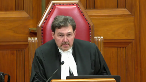
:::

Please be seated.

In the case of F against N, for the appellant F, Farineh El-Jamal, Fadwa K. Iyeya, for the intervener, Office of the Children's Lawyer, Katerina E. Tempesta, and Sheena Scott, for the intervener, Defence for Children, International Canada, Farah Oudani, and Jessica Luscombe, for the intervener, Canadian Council of Muslim Women, Paul Eric Ville, for the respondent N, Brian R. G. Smith, and Lindsay Love Forrester, and Earl A. Cherniak-QC, for the intervener, Attorney General of Ontario, S. T. Garfin, and Ravi Amarnath.

Please note that there is a publication ban in this file pursuant to orders from the courts below.

Farineh El-Jamal.

**Speaker 1** (00:01:49): Chief Justice Wagner, Justices of the Supreme Court of Canada, good morning.

::: {.column-margin}

:::

This appeal is about the application of the best interests of the child principle in cases involving countries that are not signatories of the Hague Convention on the Civil Aspects of International Child Abduction.

It involves striking a balance between the competing purposes of deterring abductions and protecting children from serious harm.

We ask this court to reinforce the best interests of the child that children are paramount when they are the focal point of the analysis.

Today, we are talking about Z, a boisterous five-year-old, and E, a curious two-year-old.

When they arrived in Ontario on June 19, 2020, Z was three and E was still breastfeeding at six months of age, both children having never spent a day or night outside the care of their mother, the appellant.

On December 15, 2020, the trial judge ordered police enforcement to return these children to Dubai with or without their mother, their primary caregiver.

The best interests of these children should matter in an international parenting dispute.

**Justice Rowe** (00:03:03): Is this, are you asking this court, which you seem to be doing, to say that what happens here is a kind of a, the Ontario court takes jurisdiction, carries out a best interest of the child analysis, and you don't even look at the CLRA 23B as to whether serious harm is involved.

::: {.column-margin}
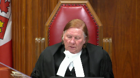
:::

You're just saying go straight at, take jurisdiction, do the best interest of the child, we should disagree with the trial judge and therefore allow the appeal.

That seems to be your position.

**Speaker 1** (00:03:38): Justice Roe, I will disagree with you ever so slightly.

If we start from the premise that serious harm is contrary to the best interest of the child, then it stands to reason that a harm analysis cannot be divorced from a consideration of the best interest of the child.

**Justice Rowe** (00:03:54): You see, that's just playing with words.

All you're saying is take jurisdiction, do the analysis of the best interest of the child.

If you think the best interest of the child is to stay in Canada, there's serious harm.

That's not the way the statute is structured.

**Speaker 1** (00:04:14): Thank you, Justice Roe.

::: {.column-margin}
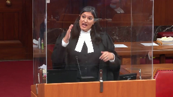
:::

We're not inserting best interests in a new way.

We're assessing harm, which is a statutory requirement.

Not everything, contrary to the best interest of a child, will be serious harm.

That's section 40.

At section 23, serious harm, it stands to reason that if something is harmful to a child, then it's not in their best interest.

At section 40, not everything, contrary to the best interest of a child, will be serious harm.

**Justice Brown** (00:04:40): might be helpful then if you started your analysis or your submissions by talking about serious harm.

I mean that's that's the statutory that's the statutory pathway to us even being able to do anything here to having jurisdiction.

**Speaker 1** (00:04:56): Yes, Justice Brown, and I was absolutely going to go to my serious harm analysis.

::: {.column-margin}
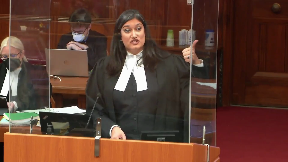
:::

I was just going to finish my roadmap of the introduction of what Ms. Yehia and I will cover, and then I will go straight to that.

The court granted leave on Justice Lauer's dissent, and we, on behalf of the appellant, adopt the reasons and conclusions of Justice Lauer's.

My co-counsel, Fatwa Yehia, and I will divide the submissions to confront the errors of the majority of the Court of Appeal and the trial judge in declining to exercise jurisdiction under Section 23 and ordering the return of the children to the UAE under Section 40 of the Children's Law Reform Act.

I intend to speak for about 30 minutes, and after some brief comments, I intend to cover 1.

Failing to apply the best interests of the child principle to Section 23 and 40 generally.

2. The mismanagement of the harm analysis and the focus primarily on the failure to consider the appellant's precarious residency status and the children's forced, involuntary separation from her as a result.

Ms. Yehia's submissions will focus on 1.

The error of wrongly importing Hague principles as equally applicable to non-Hague cases.

2. The error of finding that the UAE would apply a best interest analysis where there is an automatic allocation of decision-making rights to the father and the failings of the respondent's settlement proposal. And 3.

She'll cover the mismanagement of the return analysis under Section 40.

**Justice Côté** (00:06:29): Justices?

::: {.column-margin}
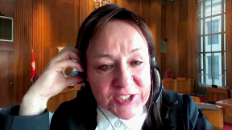
:::

Ms. Jamal, I'm sorry to interrupt you.

I understand that you will also dis...

It is Justice Cote.

Thank you.

I understand that you will also discuss with us Section 40 and the fact that your client made the decision not to request alternative relief when she was asked by the trial judge.

**Speaker 1** (00:06:52): Justice Cote, Ms. Yahia will cover Section 40 in more detail, but let me say this, that the trial judge asked for submissions on one specific question, whether or not the settlement proposal should become part of the order that he was making, and that is predicated on a return.

::: {.column-margin}
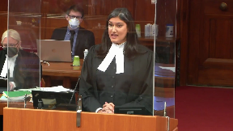
:::

Ms. Yahia will speak about that some more and about the alternatives, and Justice Lauers himself says that it's not incumbent on council to suggest alternatives.

We have provided an alternative, which is that the court could have made an order keeping the children here until the unacceptable contingencies were dealt with, until a mirror order was in place, that the mother would have parenting rights in Dubai, that enforcement was assured, property was purchased in her name, and her residency status was guaranteed, but Ms. Yahia will be covering that in more detail, Justice Cote.

Thank you.

Justices, that Canadian courts should not condone international child abduction is beyond debate, but that is not the only policy at play.

As Justice Weiler said in H.E.N.M.M., where a risk of serious harm exists, the aim of discouraging child abduction must yield to another purpose of the C.L.R.A., namely the best interest of the child.

The legislation itself demonstrates that in certain circumstances, they are acceptable.

Under Section 23 of the C.L.R.A., the serious harm exception, Ontario courts assume jurisdiction in international disputes involving children with Ontario and a non-Hague country.

If there is no serious harm, the courts can still make the interim parenting order or determine the most appropriate place to send a child under Section 40.

Under Section 40, even where Ontario has declined to assume jurisdiction, the court can and should make orders that safeguard the best interest of children and ensure their well-being.

This is not a Hague case.

There are no presumptions.

There's no presumption of return, not of habitual residence, and not that the receiving state will apply best interests.

Today is about non-signatories.

Justice Lowers says the best interest of the child poses a countervailing policy influence against the policy favouring the return of wrongfully retained children.

**Justice Brown** (00:09:18): Well, surely even a non-HEG statutory regime is, like a HEG regime, predicated on the idea that wrongful removal from a child's habitual residence is not in that child's best interest.

::: {.column-margin}
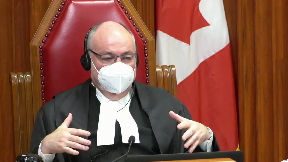
:::

That's surely our starting point.

**Speaker 1** (00:09:38): Justice Brown, that wording does not exist in section 40 and for good reason.

In Haig cases, we have assurances.

**Justice Rowe** (00:09:48): But isn't it implicit in 23, it isn't really the point here, look, if someone has abducted a child, the ordinary course of action is you send the child back to its place of habitual residence for the matter to be dealt with there.

::: {.column-margin}
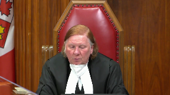
:::

And it's only in the unusual circumstance where there is serious risk of harm to the child that you don't follow that.

I mean, this is a case of child abduction and that brings it, it seems to me, into the operation of 23.

It doesn't throw it into a sort of a free-floating, what's the best interest of the child, unless that you're asking us to sort of sweep aside 23 and just say, well, it doesn't matter, right, it just doesn't matter.

**Speaker 1** (00:10:36): Justice Roe, Justice Brown, I'm not asking you to sweep aside Section 23.

::: {.column-margin}
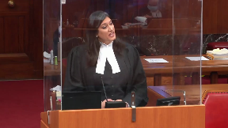
:::

I'm saying that this case is particularly situated right in Section 23.

There is a distinction with Hague cases, Justice Brown.

With Hague cases, we have assurances that there is a best interest of the child are paramount, there is reciprocity.

**Justice Brown** (00:10:56): all that, but the starting point, I mean, the whole reason that we have this statutory regime in Ontario is surely that, presumptively, the removal of children from their habitual residence is not in that child's interest, that can be displaced by a number of items, which includes the one that's at stake here, the serious harm of removing the child from Ontario.

::: {.column-margin}

:::

**Justice Kasirer** (00:11:35): Perhaps another way to make Justice Brown's point is that before you can make the Section 40 Return Order, the Court has to consider whether it can exercise jurisdiction.

**Overlapping speakers** (00:11:53): Yes.

**Justice Kasirer** (00:11:53): So we have to find a jurisdictional base, one of the four jurisdictional bases for a non-Hague signatory country before you get to sec.

::: {.column-margin}
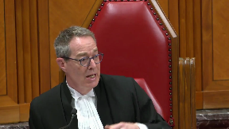
:::

But you do have to do that work.

So it's not habitual residence here because that doesn't work.

It's not the second one that they happen to be in Ontario and there's no concurrent proceedings elsewhere.

You've got a ground jurisdiction in, I suppose it could be parents' patriae, which isn't raised here.

So it's really that, as both my colleagues say, you really have to get there as a jurisdictional point rather than you get there by a best interest point.

I think that's the point.

**Speaker 1** (00:12:45): and that's definitely the case for section 23 in assuming jurisdiction.

::: {.column-margin}
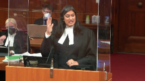
:::

When you get to section 40 that's not a jurisdiction provision and it also doesn't have the habitual residence.

For sure best interest supply there and best interest supply in 23 in determining serious harm.

Let me say two things in response.

One is justice Laskin and Oja Carey states that the objective of discouraging child abduction is secondary to the aim of preventing serious harm to the child.

And back to justice Wilson.

**Justice Wagner** (00:13:19): you, but could you tell me in your own words, describe to me what's the serious harm to the children here?

**Speaker 1** (00:13:26): Your Honour, Justice Lowers puts it in paragraph 292 and it's at paragraph 63 of our factum.

::: {.column-margin}
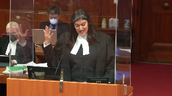
:::

The appellant's inability to remain in the UAE, her involuntary separation from their primary caregiver, the children's risk of psychological harm, the infant's inability to express their views and preferences, the appellant's Canadian citizenship and the children's Canadian citizenship, the economic disparity between the parties, the appellant's financial insecurity and the appellant's disadvantages pursuant to the UAE law, including gender inequality and legal disabilities, which represent a pronounced departure from the Canadian jurisprudence and what we consider best interest.

**Justice Brown** (00:14:06): So, we're going to compare everything by Canadian jurisprudence, I mean, look, I wonder if, I mean, these are all instances of problems that may or may not relate to the serious harm, but Justice Lauer states at paragraph 291, he encapsulates the problem differently than you do.

::: {.column-margin}
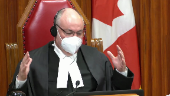
:::

Here's the problem, is the prospect given principally her residential, her precarious residential status in the UAE, the prospect of an indefinite separation of two young children from the person who has always been their primary caregiver, is that not the answer to the Chief Justice's question?

**Speaker 1** (00:14:50): The precarious residency is one of the elements, and Justice Lowers, what he does is a three-pronged approach at Paragraph 292.

::: {.column-margin}
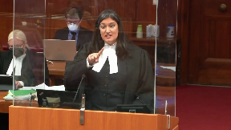
:::

He says it's the precarious residency, the unacceptable contingency of the respondent's proposal, and the automatic allocation under the UAE law, and he sees them as intersecting factors.

**Justice Karakatsanis** (00:15:09): Does that mean that you are saying that if it's just the involuntary separation from the mother that wouldn't be sufficient?

Are you relying on all three?

**Speaker 1** (00:15:23): We're saying that, like we say in our factum, any one of them alone is enough.

**Justice Wagner** (00:15:29): So every time a woman would leave her spouse with young children in a foreign country, that would create harm to the children, according to your reasoning.

**Speaker 1** (00:15:40): No, Justice Wagner, Chief Justice, I apologise, if the Children's Law Reform Act, which starts and ends with children, and if we look at, it's predicated on her being the primary caregiver.

::: {.column-margin}

:::

Justice Lauer says that there is no hard and fast rule on whether or not this would occur in every case.

The fact that she is the primary caregiver, serious harm, we already know from Thompson and Thompson, from Young and Young, from Gordon and Gertz, that severing the relationship between a primary caregiver and a child is serious harm.

**Overlapping speakers** (00:16:21): Yeah, but she created this harm.

**Speaker 1** (00:16:24): She did not, and this is the issue of the legal inability.

::: {.column-margin}
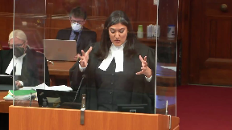
:::

I'd like to turn to the precarious residency point, but before I do, I just wanted to finish some answers that I was giving to the issue of Hague versus non-Hague.

Hague is section 46 of the CLRA, and section 23 and 40 is serious harm.

The test is less stringent than the grave risk of harm under section 20.

I also just want to situate that we're striking a balance between the objectives in section 19, and we should not prioritize the connection to the receiving state or the general aim of deterring abduction as the true focus of a return order.

We submit that the majority's concern is adult-focused and not a child-centered one.

That's not the focus of sections 23 and 40.

It minimizes the best interests of ZNE.

The court's obligation is to the individual child before it.

**Justice Brown** (00:17:15): But what we are trying to convey to you, Ms. Jamal, is before we get to that, we need jurisdiction.

::: {.column-margin}

:::

And what gives us jurisdiction, says you, is the possibility of serious harm to these children should they be removed from Ontario.

So that's the point that we need to grasp first.

**Overlapping speakers** (00:17:43): Yes.

**Speaker 1** (00:17:43): Because because everything else doesn't matter if we don't have jurisdiction under 23 you need jurisdiction.

Under 40 you don't.

But let me talk about that.

**Justice Moldaver** (00:17:52): Excuse me, I want to interrupt for one second because it's not the possibility.

::: {.column-margin}
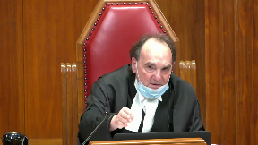
:::

It's the other show on a balance of probabilities.

That's what the section says.

So it's not...

We're not talking a mere possibility.

And as I read Justice Lauer's decision at the relevant paragraph, he says, a risk of serious harm is established if this Court is convinced on a balance of probabilities that this separation will occur.

Now, I don't know where that comes from in the face of findings of fact by the trial judge who accepts the evidence of the expert for the respondent.

And I'm not going to go through all the things the trial judge looks at here, but it seems to me, I come back and maybe this is better left for your colleague, to Justice Cote's point, your client had an opportunity, it seems to me, to respond to these concerns and to get kind of built into a section 40 order, making it contingent on the father coming up with further and better evidence that the agreement will be honored, that a residency will be in place that by itself, I think, would allow her to stay according to the law of Dubai, if she rents it even, if I understand it correctly. Yeah.

Well, see, those are findings made by the trial judge that you're saying no to, so maybe we got to get into how we assess findings based on expert evidence.

**Speaker 1** (00:19:31): Well, so, on the issue of facts and findings of expert evidence, no deference is owed to findings of foreign law.

::: {.column-margin}
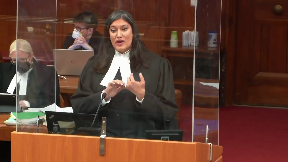
:::

We know that from General Motors, and my friend will expand on that.

No deference is owed when he fails to make a finding that the legislation requires him to make.

No deference is owed when he makes a finding that's unsupported by the evidence.

And so let me turn to this issue of precarious residency, because I appreciate that it's been something that everybody's been asking about.

**Justice Rowe** (00:19:58): What difference is owed to findings of fact and the standard of possible overriding error is what applies.

So that's what the yardstick that I'm going to apply to it.

**Speaker 1** (00:20:10): Justice Roe, the standard is correctness for findings of foreign law.

::: {.column-margin}
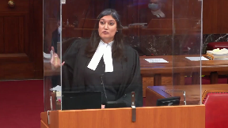
:::

In General Motors, the court is clear that an appellate court can review the same black letter law, the plain reading of the PSL, to evaluate whether or not the expert evidence is sound.

And so we would submit that on the foreign law, it's correctness as with the other errors that I mentioned.

**Justice Côté** (00:20:35): Jamal, at that point you say that the standard is correctness because this is an issue of foreign law, expert evidence on foreign law.

::: {.column-margin}
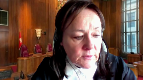
:::

Are you aware of the decision of the Federal Court of Appeal in Hapag Lloyd E.M. Gold Corporation where the Federal Court of Appeal said that the standard should be the ordinary arson standard and that evidence should be considered as any other expert evidence?

**Speaker 1** (00:21:05): Justice Cote, in our leave application, we included the case law across the nation to demonstrate that the evidence of foreign law and the deference to be awarded to it is not consistent across the nation.

::: {.column-margin}
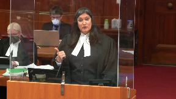
:::

Most provinces have a correctness standard, and we included that in our leave memorandum.

I apologize that it wasn't in the factum before you, but my colleague will be speaking more about the deference specifically to foreign law vis-a-vis the rationale in General Motors.

Maintaining to the precarious residency, the appellant has no ability to live in the UAE under immigration laws.

She and the children are not nationals of the UAE.

They have temporary status as dependents of the respondent.

The respondent is not a UAE national and has temporary status through his employment.

The appellant cannot get a residency permit independently, and that's based on the trial judge's findings.

Maintaining the appellant on the respondent's visa is not possible after divorce.

She can get a one-year divorcee visa, which expired last month in March 2022, and she has no legal ability to stay in the country.

The respondent offered no evidence of his financial ability to purchase a property for the appellant.

That's paragraph 51 of the trial judge's decision.

No evidence that his employer could or would sponsor her after separation.

No evidence that he himself could sponsor her through his employment after separation.

No evidence that he could legally or practically set up a shell company for her.

The trial judge, instead of drawing adverse inferences, draws inferences that are unsupported by the evidence, and making a finding of fact for which there is no evidence is an error of law.

The respondent did not meet the evidentiary burden, let alone the persuasive burden.

The majority, at paragraph 63, endorses the trial judge's error and finds that there were workable solutions to resolve the issue.

The mother has the onus to prove serious harm. She did.

She tendered evidence satisfying her burden.

The fact that there's something to work around means that she tendered evidence.

The pendulum then swings, and the practical burden switches to the respondent to demonstrate that his workable solutions are indeed viable.

He failed to satisfy the onus, and they remain unacceptably contingent.

Ms. Lauer's words.

**Justice Jamal** (00:23:29): Mr Jamal, what role does the fact that the mother and the two children are Canadian citizens have in the analysis beyond the fact that it adds to the precarious residency in the UAE?

::: {.column-margin}
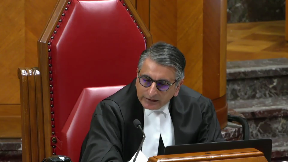
:::

Does it have a role beyond that?

Because as you know, just as Laskin and Ojekeri specifically looked at the role of citizenship and the charter right to mobility of the children, separate and apart from the children's decision that they wanted to come back to Canada from Nigeria, so what role does the citizenship have?

And I understand that the first child was born in Canada and the parents decided to come back to Canada in order to have that child, so I guess what role does citizenship have in all of this?

**Speaker 1** (00:24:08): And both children, Justice Jamal, are Canadian citizens.

::: {.column-margin}
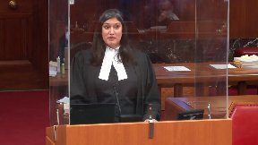
:::

The mother came home every year.

Citizenship is a serious harm factor.

Justice Laskin says that.

He actually mentions four factors, and this trial judge only mentioned the first four.

The fifth factor is citizenship, by Justice Laskin, at paragraph 85 of the decision.

This court, in bailiff, also considered nationality as a factor at paragraph 44.

And Justice Lauer says that the citizenship and residency status of each child and each parent in all of the relevant countries is a relevant factor in the serious harm analysis.

The terms offered by the respondent place the appellant's residency and living arrangements completely in the hands of the respondent.

I know you're getting peppered with questions.

I'm over here.

Sorry, Justice Mulder.

**Justice Moldaver** (00:24:57): to do this to you, but Paragraph 62 of Justice Horgan's, could you turn to Paragraph 62 of Justice Horgan?

::: {.column-margin}
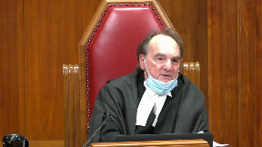
:::

Because I think you said, or maybe you have agreed, that the onus is on your client, not on the respondent to satisfy the balance of probabilities test.

I think you've conceded that, haven't you?

Thank you.

**Overlapping speakers** (00:25:20): Indeed, the mother has the onus to prove serious harm, and she did.

**Justice Moldaver** (00:25:24): So just look at 62 because you responded to me and again maybe I'm getting into your colleagues area, but the trial judge accepted the evidence of Mr. Maid, entitled to, the respondent has agreed to incorporate as undertakers, etc, etc, etc.

::: {.column-margin}
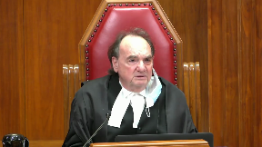
:::

Then he refers to the Bola case at the bottom and then he says the lawyer for your client, the appellant's lawyer, rejected the offer, advised the clerk that his client did not seek further direction from the trial judge.

I don't know how we can fault the trial judge with respect for not sort of incorporating terms that your client was not prepared to argue or ask for even.

It seems to me that your client, and I'm not faulting her, but we're here to determine, you know, an important issue obviously that involves international relations as well.

Your client did not want to play ball.

She wanted all or nothing.

She took an all or nothing approach that I am not going back to that place.

I don't care what the court, I'm not going back to Dubai, period.

So what do we make of that when we're sort of saying, oh the trial judge missed this and he should have done that and he should have done this.

I just find this a little bit of kind of trying to retry or re-characterize this case from what it was really, what really went on, that's all.

**Speaker 1** (00:26:59): Justice Moldaver, on the issue of the submissions, the trial judge sought optional submissions on, and he says clearly, one specific question only.

And that is whether the respondent settlement proposal should be included in the court order.

**Justice Moldaver** (00:27:15): important isn't that isn't that critical because part of that order guarantee the residency it's beyond that

it's not the settlement agreement

**Speaker 1** (00:27:24): The settlement agreement has two fundamental problems.

::: {.column-margin}
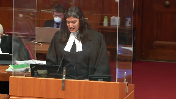
:::

The father remains the guardian, and the UAE law is what's applied, is applicable to the agreement.

It's not viable.

He's been lulled into an idea that it would be viable in Canada and in other countries.

But in the UAE, what they're proposing doesn't exist.

It's not viable.

And my friend will continue to make submissions on that.

In my last couple of minutes, I was just going to speak to the issue about this issue of choice and the idea that she had this choice to go home.

And I've been pointing out that she has a legal inability.

The terms offered by the respondent place her residency and her living arrangements completely in the hands of the respondent.

She's entirely beholden to him.

No visa, no place to live, no family.

And she could be forcibly removed from the UAE at any time.

She has no recourse should he renege or fail to follow through on the agreement, which requires annual reviews, even if you own property.

And he offered, like I said, no evidence.

**Justice Moldaver** (00:28:27): It does come down to the fact that the simple point here, a mother who's been a good mother and the children have always been with her

::: {.column-margin}
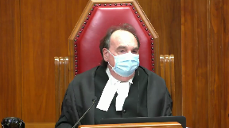
:::

and she's the primary caregiver who decides to abscond with the children to a country like Canada, and automatically Canada affected...

Assuming all other things being equal, there's no way she could ever be sent back to Dubai.

There's nothing that could satisfy it.

Therefore, automatically, the risk of indefinite separation exists and therefore 23 is it.

And we wouldn't have hundreds and hundreds of pages of judgments on this.

It'd be quite simple.

**Speaker 1** (00:29:12): Our primary argument is that there is serious harm in this case.

::: {.column-margin}
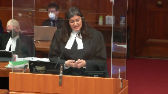
:::

But if the trial judge felt that it didn't rise to the level of harm, then he still needed to put into place an order to deal with all these unacceptable contingencies.

And the idea that this would happen for every case, like you yourself said, Justice Moldaver, Justice Lauer says that's not the case, they've still got to prove evidence.

And here the legal inability to return is a fundamental factor.

He's offered nothing more than proposals.

To this day, there is nothing concrete.

No security, nothing that's been purchased.

And so the likelihood of an involuntary separation stemming from the appellant's legal inability to remain with her young children in the country is high, as is the corresponding severity of harm to the children.

Let me speak to this issue of it being her choice.

**Justice Kasirer** (00:30:02): Can I just—you say your time is running short, and I think you should at least anticipate the argument that the respondent's going to make on the precarious residency point.

::: {.column-margin}
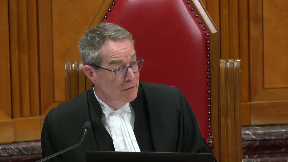
:::

Pointing to—if I've understood the argument correctly—pointing to paragraphs in Justice Lauer's reasons where he says the trial judge did not give due weight to the mother's precarious residency, that there was no practical weight given to this consideration or failed to take into account, your colleagues are going to argue that the failure was—that Justice Lauer is pointing to as one of weighing the evidence.

And they'll point to paragraphs 194 or 196 in the trial judgement where the considerations that you're speaking to were mentioned, and their argument is going to be, well, the dissenting judge just weighed it differently, so how would you answer that?

**Speaker 1** (00:31:07): Justice Pachocko in the stay decision at paragraphs 35 and 39 say it far more eloquently than I do.

::: {.column-margin}
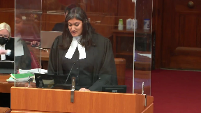
:::

He says, if the decision under appeal does not comport to the legal principles that these questions give rise to, then the importance of deference evaporates, and this issue of weight was dealt with by this court in Gordon and Gertz, and it's at tab 56 of our condensed book where they talk about this issue of weight or insufficient weight not being a rehearing when the underlying principles have been ignored or have been not properly dealt with.

It ignores that Justice Lauer's found legal errors that weren't reversal, and I've already mentioned three as well as those in my introduction.

To suggest, at paragraph 39, Justice Pachocko says there are serious issues to be tried relating to whether those determinations were arrived at based on correct principles, and if the application judge erred in coming to the conclusions, then there's a risk that the mother and children will be separated or that parenting rights to the children will be determined based on gender-based principles or presuppositions rather than the best interests of the children.

If I could just return to the choice question, the idea that Justice Moldaver, I appreciate, is troubling you.

It's not the totality of her answer or the totality of her evidence.

The mother's evidence in chief and cross was definitive.

She cannot return considering her residency status is radically indeterminate.

She's unlikely to be able to stay in the UAE.

The need to rely upon UAE law, even if she gets there, which invariably favours the father, which Ms. Yahia is going to turn to.

The father's ability to hold a grudge, his quote, people who are doing this to me right now are going to pay for it.

The UAE's penal code, which sanctions beatings by husbands on their wives provided the violence leaves no physical marks.

The wife's obligation to remain in the home, it's called the obedience mandate.

Her radical uncertainty of the father's proposal.

**Justice Rowe** (00:33:11): Isn't this what really sits behind all of your submissions?

::: {.column-margin}
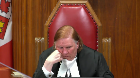
:::

That this court should say that the family law of the United Arab Emirates is an unacceptable basis upon which to have the guardianship of these children decided.

And therefore, we should say we are not willing to send back children to that place.

Isn't that really what sits behind all your arguments?

**Speaker 1** (00:33:45): Justice Roe, we're not here to malign a country, a religion, or a legal system.

::: {.column-margin}

:::

We are not saying that the UAE law is harm in and of itself.

No system of law is.

But the foreign legislation need not duplicate, Justice Cazerer, Ontario's legislation.

What we must consider is the disproportionate effect of the foreign law on the individual in the context of the harm analysis.

If this was a man, if this was a non-Muslim, there are other people who are not impacted by the UAE law in the same way that this mother and these children were.

I'm going to wrap up with a couple of last errors.

The first is direct harm to the children from being separated from the primary caregiver is one level.

Secondarily, harm is a compound equation.

Harm to the mother equals harm to the children.

It's undisputed that the appellant is the children's primary caregiver, and the trial judge called her a powerful force in the lives of these children.

On such a finding, separation from her is profound.

The court in Gordon and Gertz has already determined the importance of preserving the child's relationship with his or her primary caregiver as the most determinative factor of the child's long-term welfare.

As the Court of Appeal said in MacGyver and Richards, we can't make the quantum leap from the observation that a child has a good relationship with a non-custodial parent to a conclusion that the preservation of that relationship is a determinative factor in deciding what's in the child's best interests.

Justice Laferay and Thompson and Thompson disagreed with Justice Twaddle that merely separating children from their primary caregiver should not form part of the serious harm analysis because from a child-centered perspective, harm is harm, and in Oja Carey cited in Paragraph 55, it's irrelevant from once it came.

The trial judge took judicial notice and accepted expert evidence of serious negative effects of separating infants from their primary caregiver.

**Justice Brown** (00:35:40): Just to pull you back to Thompson & Thompson, didn't Thompson & Thompson also say that mere separation from a primary caregiver while undoubtedly harmful does not amount to serious harm?

::: {.column-margin}
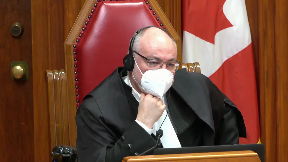
:::

And if you are to prevail today, don't we need to somehow address that?

**Speaker 1** (00:36:01): So let me reconcile Thompson for you, Justice Brown.

::: {.column-margin}
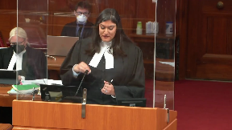
:::

Thompson is a classic case of mother's choice.

It is a Hague case where the country was Scotland, where the law is manifestly favourable to the mother or the primary caregiver.

No legal harm will come to her with the return.

This needs to be contrasted with our case where it's not the mother's choice.

The factors that injure the mother in this case were not present in Thompson.

The trial judge says that the negative effects will include negativity, aggressive behaviours, symptoms of borderline personality disorders, brain development in an infant is impacted, where the loss of consistency with the primary caregiver provides.

He then fails to apply the findings to ZNE and finds that the harm to them is quote unknown.

For Justice Lauers, section 23 of the CLRA specifically requires that courts determine the risk of harm on the evidence that's available and for the trial judge to find that the impact was quote unknown is a palpable and overriding error.

Deference is not owed when a judge declines or fails to make an assessment that the legislation requires.

I will conclude with the paragraph 291 of Justice Lauers before Ms. Yahia joins us.

He states an indefinite separation of two quite young children, one under two years, the other only four, from the parent who has always been their primary caregiver constitutes a risk of serious harm.

This finding can be reached without any expert evidence on the specific impact such a separation is likely to have on ZNE in particular.

A risk of serious harm is established if the court is convinced on a balance of probabilities that the separation will occur.

**Justice Brown** (00:37:42): Before you sit down, Mr. Mell, because that goes exactly to the question that I asked you.

::: {.column-margin}
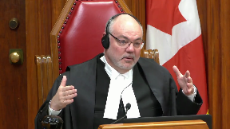
:::

I find that paragraph, at least on first reading, quite compelling.

But we do have Thompson & Thompson, as I say, that says that mere separation from a primary caregiver while undoubtedly harmful does not amount to serious harm.

Your reconciliation of that is to point to, effectively, the lack of legal peril for the mother in the United Kingdom.

But that goes to whether there would be a separation.

So that is distinct from this case, because the problem is that the separation is in fact the product, says Justice Lowers, of Dubai law in the sense of her precarious residential status in the UAE.

I'm not sure if your submission is really speaking to a distinction about serious harm arising from separation so much as whether there would be a separation.

**Speaker 1** (00:38:52): It's both, Justice Brown, and let me disagree with you ever so slightly on the Thompson interpretation.

::: {.column-margin}
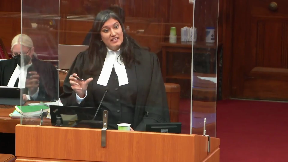
:::

At paragraph 55 of Oja Carey, there's a lovely quote and a citation of both Thompson and Young & Young, where Justice Lafferet disagrees with Justice Twaddle that separation from a primary caregiver in and of itself is harm, because from a child-centered perspective, harm is harm and it's irrelevant from whence it came.

With that, I will leave you with Mr. Here.

**Speaker 2** (00:39:31): Good morning, Chief Justice and Justices of the Supreme Court.

::: {.column-margin}
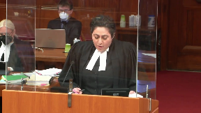
:::

I think I'll start my submissions with first answering the question of Justice Cote with respect to Section 40 and the question about the alternative proposed.

As Ms. Jamal stated, the court had only asked the trial judge, in fact, had only asked about incorporating provisions of the Respondent Settlement Proposal within that actual agreement.

And those settlement proposals related to the parenting provisions directly.

There was no other request made.

And so the Justice Lowers was actually on a panel with Justices Fairburn and Pachocko and Gileadon and Rauda.

And in that case, the Court of Appeal chose to stay the decision and made an interim order keeping the child in Ontario until a further UK court order was made, despite the child residing in the UAE for six years prior.

That suggestion was one that the Court of Appeal came up with independently.

There were no submissions made by the parties with respect to that arrangement.

**Justice Moldaver** (00:40:44): Could we just go to—and you correct me if I'm wrong about this, I may be, but I thought the settlement offer was that the mother would be the primary residential parent, the major decisions would be decided jointly, that the father would purchase a house in Dubai in the mother's name to be held in trust for their children, and that the father would secure a residency visa for the mother.

::: {.column-margin}
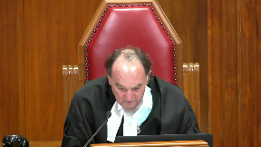
:::

Now, I don't know how this gets translated into, well, it really, there really was no attempt to deal with the residency problem.

I mean, it just, I just don't understand it.

**Speaker 2** (00:41:21): So, the difficulty is, Justice, is that none of those are actually workable solutions, in the sense that the UAE law wouldn't be able to – there's no way that they could be, in fact, incorporated into a court order.

We're talking about – But, but, but, but, but, but, but, but, but, but, but, but, but, but, but, but, but, but, but, but, but, but, but, but, but, but, but, but, but, but, but, but, but, but, but, but,

**Justice Moldaver** (00:41:37): automatically there's no way that a good mother who has been a major caregiver and decides to abduct the children and come to Canada could ever be sent back to the Dubai courts because of this, because you say their family law regime would not allow for any of this to happen, and therefore we must consider this issue, take jurisdiction Canada and deal with the best interests of the children here and make your custody and access order.

::: {.column-margin}
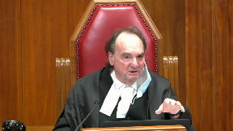
:::

That's the, to me that's just the bottom line of your submissions here.

**Speaker 2** (00:42:13): Justice Moldaver, I'm going to have to politely disagree.

**Overlapping speakers** (00:42:19): You don't have to be so polite.

It's okay.

This is true.

You really don't.

Thank you.

**Speaker 2** (00:42:22): justice.

::: {.column-margin}
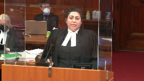
:::

Quite frankly, we suggest that every case be assessed on a case-by-case basis.

So not every single mother coming from the UAE is going to be found to have in a position of harm.

It's not going to necessarily satisfy the harm requirements.

There are exceptions.

In this particular case, this mother's status and her role as primary caregiver and the disabilities under the law impact her.

As Ms. Jamal had said, it's the disproportionate effect of the law on her.

**Justice Côté** (00:42:57): I have a question for you on that and I'm telling you, you have the right to disagree with me.

::: {.column-margin}
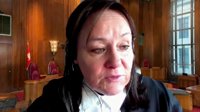
:::

You say that to have incorporated the terms of the settlement offer in an order under Section 40 would not have been possible, but was it not expert evidence accepted by the trial judge that yes, it was possible to enforce such terms in the UAA?

**Speaker 2** (00:43:29): Justice Côté, there was no evidence with respect to the enforceability of the order.

::: {.column-margin}
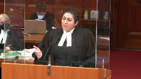
:::

That was the one thing that was lacking.

And there is difficulty with respect to the enforceability insofar as these individuals cannot contract outside of UAE law.

They are Muslims and therefore subject to UAE law.

And so it's very difficult for them to contract terms that are outside of the parameters of UAE law and have it upheld where the settlement proposal itself says that it will abide by UAE law and there is no provision within that settlement agreement which waives the father's guardianship rights.

So the settlement proposal would not be enforceable.

Again, non-Muslims can contract in accordance with the laws of the country in which they were married.

And so these parties were married in Pakistan, they were not married in Canada.

And so a regime which is reflective of Canada's sort of arrangements for parenting would certainly not be enforceable in the UAE.

Where there is ambiguity, the experts said that the UAE will default to its own legislative provisions.

So that's the concern with the enforcement of that particular…

**Justice Jamal** (00:44:43): Did the expert evidence deal with the possibility of dual citizenship under UAE law?

**Overlapping speakers** (00:44:49): It did not, Justice Chameau.

And, okay?

It did not.

**Justice Jamal** (00:44:52): I gather though that that would be a situation where your argument would be very different if the mother had the right to, as a citizen, to live in the UAE and she abducted.

We'd be in a very different situation.

**Speaker 2** (00:45:07): Certainly correct, Justice Jamal, because we're dealing with non-nationals

::: {.column-margin}
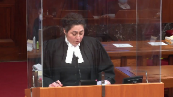
:::

and she is not a citizen.

There are different parts at play here.

With respect to—so let's talk about UAE law then.

I want to contextualize it in the sense that prior to Oja Carey, courts operated under the presumption that foreign law of non-signatory states would comply with the best interest principle.

Since then, that presumption no longer exists.

As Justice Laskin points out in Oja Carey, that we cannot be assured that the best interests of the child will be the paramount consideration in a non-signatory state, such as the UAE.

It is also the reason for greater scrutiny of foreign law in order to ensure that the best interests of children truly prevail.

And that notion was reinforced in Gilead and in ROUDA and MAA and DEME.

So this court has told us in BALIV that even in Hague cases, there are some amount of best interests that must be considered when determining habitual residence under—and even as well under the exception provisions.

In non-Hague cases, we suggest that that imperative is even stronger.

So the respondent tries to distract from the problematic aspects of UAE law and its residency requirements by touting the equality of life and openness of society.

While they may be economically advanced, the UAE has still refused to sign the Hague Convention.

They choose not to subscribe to a leading international instrument.

**Justice Brown** (00:46:36): Well, that's why we're here.

I mean, I'm not sure what weight we can put on that consideration.

Of course, they didn't sign it.

That's why the statute applies.

Correct, Justice.

**Speaker 2** (00:46:47): And what we're saying is is that that gives rise to the scrutiny that we Undertake with respect to their foreign principles and to determine whether or not they are in fact applying best interest principles because Because they're not a signatory.

::: {.column-margin}
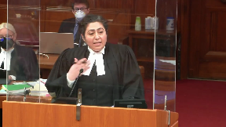
:::

We have assurances with Hague nations that the primary consideration is best interest We don't have that same assurance with non-signatory.

That's certainly true, but that's certainly sorry over here.

Oh, yes, that's her

**Justice Kasirer** (00:47:13): That's certainly true, but section 19, which reminds us for non-Hague countries as well that wrongful abduction is something that should be deterred, applies as well.

How do you square the two of them?

**Speaker 2** (00:47:30): So we suggest, Justice Kessler, that they are competing interests.

::: {.column-margin}
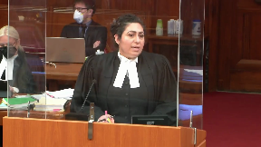
:::

So we have abduction on the one hand and then making sure that children don't suffer serious harm.

And so in those circumstances, it's very clear in HENMM, Justice Weiler says that where the best interests of children are concerned, the abduction becomes secondary to that consideration.

So we have to place the children first in terms of our analysis.

**Justice Kasirer** (00:48:03): But surely it's where there's serious harm that the abduction becomes secondary, not just where best interest is concerned.

::: {.column-margin}

:::

Because otherwise, if it was, wouldn't there be the danger that Canada would become a safe haven, whereby you bring the children to Canada and guarantee yourself a full-blown best interest review, rather than going through the jurisdictional requirement of serious harm?

It seems to me that you're skirting it somewhat.

**Speaker 2** (00:48:35): So, Justice Casaro, we're not attempting to skirt it.

::: {.column-margin}
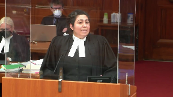
:::

We're not suggesting that parties shouldn't undergo a section 22 analysis where jurisdiction is had, and if it's not there, then the only alternative is section 23.

And we're certainly not saying that the best interest standard should be bottomed out.

We're still concerned with situations that imperil the well-being of children.

So we're suggesting that it must still satisfy the concerns under serious harm.

But in the event that the harm doesn't in fact rise to the level of serious harm, that's where section 40 is invoked.

And it's at that stage that we suggest that the best interest of children have to be considered because the court has broad discretion there and it can make an interim order or alternatively it can send a child to an appropriate place.

And we suggest that the exercise of either.

**Justice Rowe** (00:49:31): But doesn't doesn't that completely undercut the operation of 23?

::: {.column-margin}
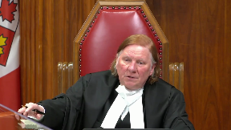
:::

You're saying even if the jurisdictional requirement under section 23 is not met, you just go under section 40 and you get the same result, which is that the Canadian court takes jurisdiction and does a full best interest to the child analysis.

That can't be a proper interpretation of the legislation.

It renders section 23 meaningless.

**Speaker 2** (00:49:56): Justice Roe, I understand your commentary, but the reality is that you have a child that's here in the country, and if they don't fall under serious harm, you still have to do something with them.

::: {.column-margin}
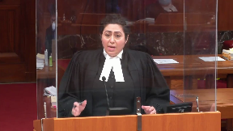
:::

And the legislation under Section 40 says you must send them to an appropriate place.

They must be returned to an appropriate place.

So how is it that one is to understand where that appropriate place is without an appreciation of the best interest of the child?

**Justice Rowe** (00:50:23): I think you have agreed with me, I think you have agreed with me that if you can't get a BOIC under 23 you just say well I'll do it under 40 and you end up with the same result which I think just shreds the statutory scheme.

**Speaker 2** (00:50:40): Justice Roe, we've been granted leave on the basis of best interests and the importance of how that factors in, and we have taken the position that whether it's section 23 or section 40, best interest must be a consideration because serious harm must factor in some of the considerations of a child's best interest, and that's already built into Oja Carey, which Mr. Saskin tells us.

::: {.column-margin}
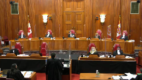
:::

**Justice Moldaver** (00:51:05): I think you can take it as a given, that if there's serious harm to the child, it probably is not in the child's best interest. Correct.

::: {.column-margin}
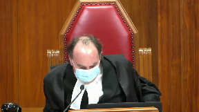
:::

Isn't the give and take here between Hague and this statute, that in Hague, where the convention applies, the grave risk of harm that would expose the child to physical and psychological harm or otherwise place the child in an intolerable situation, that's a very high bar.

The bar is much less, it seems to me.

And that's the concession that's made, and that's what the legislature has built into this.

You don't have to show that kind of harm, but you still have to show serious harm.

And that's why we have a hearing, that's why we have a trial, and that's why the judge has asked to make findings.

**Speaker 2** (00:51:49): That's correct, Justice Moldaver, it's not as stringent a test as it is with Hague Convention cases.

::: {.column-margin}
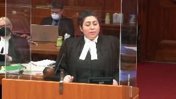
:::

The threshold is lower and we're not suggesting that a party doesn't have to demonstrate serious harm under Section 23.

But once that's completed, we're just saying that it's an analysis that goes hand in hand and Justice Laskin and Oji-Kerry says there are several factors that you consider.

You look at, you know, physical harm, psychological harm, emotional harm, the child's citizenship, whether the parent is planning to go back or not.

And so in those circumstances, Justice, you know, you are considering those factors as part and parcel of a best interest analysis.

Justice Lauer says, does it need to mirror the Section 24 sub-3 analysis of best interests? No,

but they must consider all of the relevant factors.

So again, it's not opening it up to a full-blown best interest test, but it must be something that we have to consider both at 23 and at 40.

**Justice Kasirer** (00:52:54): Do you, oh, I'm so sorry, you go ahead.

**Justice Karakatsanis** (00:52:56): Well, I was just going to ask you to explain how it factors in because we've already done, under section 23, an analysis and concluded, before we get to section 40, that there is no probability of serious harm.

::: {.column-margin}
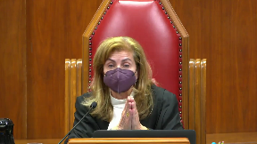
:::

So that's the starting point.

There's no probability of serious harm.

And then we go to section 40 and you say it's not a full-blown, you know, best interest of the child, but it factors in.

How does it factor in?

**Speaker 2** (00:53:29): So, you're looking at the circumstances of the child before you, and we suggest that all of the relevant factors must be considered, so they're relevant to each particular child, which is...

**Justice Karakatsanis** (00:53:38): considered already under section 23 and there has been a conclusion reached I'm not saying in this case whether it was right or wrong but conclusion reached that there was no probability of serious harm so what work is left to do between a free-ranging best interest of the child which would require a particular order and the gap between that and no serious harm I'm just not understanding how you're suggesting that those factors play into section 40 if it's not a full-ranging best interest of the child analysis

::: {.column-margin}

:::

**Speaker 2** (00:54:17): What what Justice Laura's tells us is that you use all of the factors which are relevant to determine how or whether an interim The court in exercising its discretion to either make an interim parenting order Justice carrot gets honest or to determine the appropriate place to send the child so you're

**Justice Karakatsanis** (00:54:34): Your answer I think is about looking at best interests of the child to figure out transitions or conditions or something that would allow the best way in which to get to the return order.

**Speaker 2** (00:54:48): It's not even necessarily a return order.

::: {.column-margin}

:::

The discretion is so broad that a child can actually remain in the country until other conditions are satisfied.

They don't necessarily even have to be sent to the place from which they were taken.

Gilead and Enroute of the children were ordered to be returned to the United Kingdom.

The matter, it doesn't necessarily mean that it has to go back to the place of habitual residence because there are no presumptions under Section 40.

So there's no presumption of return.

And that provision is very clear.

There's nothing in it that says anything about real home, home or a presumption that we have to defer to the foreign legislation what's...

**Justice Kasirer** (00:55:30): But Section 19 does apply to Section 40, right, the Purposes section, and it says that the purpose that should be in the minds of a judge making an order under Section 40 includes the discouragement of the abduction of children as an alternative to the determination of decision-making responsibility by due process.

::: {.column-margin}

:::

So doesn't that inform the decision about how to exercise authority under Section 40?

**Speaker 2** (00:56:01): it informs it but what we're suggesting is that where a child is the focal point of the analysis which is the start and end of section 23 that we have to take into consideration the best interests of the child and that abductions while not necessarily beneficial or being promoted are certainly should be secondary to the interests of that child.

::: {.column-margin}

:::

**Justice Kasirer** (00:56:27): But surely, abduction is not just a question of blaming the abducting parent.

::: {.column-margin}

:::

It's the idea that you're taking a child away from their habitual residence and that that might not be in the child's best interest.

So even a child-centered view that you're embracing, and all power to you, that's the right thing to do, doesn't mean that discouraging abduction should be set to one side in service of best interest.

They're not incompatible concerns.

Do you see what I mean?

**Speaker 2** (00:57:00): I understand that they're not incompatible, Justice, but what we're saying is that we allow for the abductions to take place.

::: {.column-margin}

:::

That's precisely why they're acceptable in certain circumstances.

That's precisely why we have the serious harm exception under 23.

And so, in those circumstances, we have to be careful about that.

**Justice Moldaver** (00:57:22): I'll put your case a little differently and let's, I just like your answer to this.

**Overlapping speakers** (00:57:27): Yes, Justice Moldey.

**Justice Moldaver** (00:57:28): It seems to me that what you're really saying here is if the mother is forced to go back to Dubai, she will be at risk of serious psychological harm because she will have no certainty as to residency and when she might get...

::: {.column-margin}

:::

The father might, you know, pull the plug on things and so on and so forth, and she will be, in effect, at his mercy and she'll have to do his bidding, could cause her serious psychological harm, which would have an impact on the children.

You haven't framed the case that way, but at the moment that's the way I'm seeing it.

**Speaker 2** (00:58:10): Justice Moldavar, we hand-frame the case as harm to the mother, it's a compound equation, harm to the mother is harm to the children, in the sense that she is their primary caregiver, and so that their psychological bond with their mother, the person who has cared for them every single day of their lives, and it's undisputed that she has been what justice, what the trial judge calls a powerful force in the lives of these two children, such that their separation from her, as a result of the disabilities under UAE law, I mean, for her, the UAE law certainly is not going to uphold her parenting rights, in the sense that the guardian is a foregone conclusion, it is his exclusive and individual right to have decision-making authority, there is no circumstances under which a mother is afforded decision-making authority, and Justice Lowers tells us that that's one very important way in which Ontario puts the best interests of children first, so in those circumstances,

::: {.column-margin}

:::

**Justice Moldaver** (00:59:17): Was it fleshed out at the trial that Ms. Humeid's concept of best interests is based on the law of Dubai, and it would not be the same?

::: {.column-margin}

:::

In other words, they wouldn't define best interests the same in Dubai as we do in Canada.

**Speaker 2** (00:59:38): That is correct.

::: {.column-margin}

:::

There is no definition.

In fact, best interest cannot be applied where there is an automatic allocation of parenting rights.

And that's what Justice Lauers concludes.

Because, as I was just saying, the ability of both parents to apply equally for decision making is one way that Ontario puts the best interests of children first.

Otherwise, the mother is, quite frankly, an individual who is a caretaker.

She's relegated to a caretaker or a parent without authority.

**Justice Wagner** (01:00:06): When I read section 19 of the Children's Law Reform Act, one of the purposes is to discourage the abduction of children.

::: {.column-margin}

:::

I don't see any hierarchy between various purposes of the Act, A, B, C and D. So, do you agree that both or every provision must be treated equally?

In other words, to discourage abduction would be as important as, you know, determining the best interests of the child.

**Speaker 2** (01:00:41): Yes, Chief Justice, they are competing interests, it's not, there isn't a hierarchy necessarily, but I think in this particular circumstance we shouldn't be placing the connection to country or the habitual residence, which is what I believe Justice Kessler was asking me about, over the relationship with the individual child and their parents.

::: {.column-margin}

:::

The court's obligation is to the individual child before it and protecting them from serious harm.

Any case involves specific children, not all children, and we cannot sacrifice the best interests of these children at the altar of policy-promoting expedience and deterrence.

A cornerstone of our system is individualized justice and family law.

It's these children today in this courtroom, individualized justice, and certainly the conduct of the removing party shouldn't be taken into consideration.

It's not a factor for consideration under either section 23 or 40.

We ask the court.

**Justice Moldaver** (01:01:35): Yes, just let me stop you again for one minute, I'm sorry, I know your time's basically done, but are you really, it seems to me I'm hearing this that you're saying that to go back to the device she couldn't possibly get, I'll call it a custody and access hearing that would satisfy our notions of what a custody access hearing should take into account in Canada, having regard to the past interests of the child, you're saying it could never happen because their laws would never allow that to happen.

::: {.column-margin}

:::

**Overlapping speakers** (01:02:12): Correct.

**Justice Moldaver** (01:02:12): So therefore, she should never have to go back to a country like Dubai.

**Speaker 2** (01:02:17): That's not what we're saying specifically what we're saying in these particular circumstances given her status as the mother and as a primary caregiver that she would not be in a position to Take on any parenting rights.

::: {.column-margin}

:::

She would not be permitted guardianship.

She would certainly not be able to And she risks losing custody of her children at various junctures if this was the father Justice Moldaver who is standing before you and in the case of dodgy before the court was a father Who was the guardian who had abducted from the UAE the circumstances would be completely different

**Justice Wagner** (01:02:52): Thank you very much.

Oh, there's one last question of Justice Carcassani.

**Justice Karakatsanis** (01:02:59): And what if this was a father who had primary care for children who were too late, who had no residency status, who was dependent upon the mothers for residency?

**Speaker 2** (01:03:14): The circumstances would be different we would we would suggest that in those particular circumstances that the laws may not necessarily prejudice the father, but he may have a risk with regard to student's residency.

**Justice Karakatsanis** (01:03:27): I understand it about the laws apply differently but my question goes to serious harm.

::: {.column-margin}

:::

Would the involuntary separation of a father be sufficient for serious harm in circumstances that for young children for whom he'd had the primary care giving responsibility throughout their young lives? Yes.

**Justice Wagner** (01:03:49): Thank you very much.

**Overlapping speakers** (01:03:50): Thank you, Chief Justice.

Inaudible.

**Speaker 3** (01:03:58): Yes, good morning, Chief Justice and Justices.

::: {.column-margin}

:::

The Office of the Children's Lawyer intervenes in this court to urge an approach to discretionary decision-making under sections 23 and 40 of the Children's Law Reform Act, the CLRA, which is holistic and child-centered, informed by the best interest of the individual child at the fore.

Giving primacy to children's rights, which includes their best interests as a primary consideration, comports with Canada's obligations as a ratifying party to the UN Convention on the Rights of the Child, which it is obliged to implement domestically.

I will refer to it as the CRC going forward.

Specifically, our...

**Justice Rowe** (01:04:39): Has not the legislation incorporated the best interests of the child from beginning to end?

**Speaker 3** (01:04:46): I would suggest that that is how it should be interpreted, given that the best interest of the child is the paramount consideration in determinations in family law matters across Canada.

**Justice Rowe** (01:04:58): Is this not simply a matter of interpreting the legislation as opposed to looking at conventions and broad wording and all of this stuff?

::: {.column-margin}

:::

Isn't this just simply a matter of saying how is this legislation to be properly interpreted and how is it to be applied properly in these circumstances bearing in mind the relevant standard of review?

**Speaker 3** (01:05:21): I think I would say to that Justice Roe that there's a long history of this court relying on the international human rights conventions including the convention on the rights of the child to interpret legislation including in the family law context as well as to guide discretionary decision making.

::: {.column-margin}

:::

So to the extent that the CLRA could be applied in a way that does not take into account the best interests of the child as an overarching consideration, the CRC can assist in informing the interpretation of the legislation.

And that would be obviously Article 3.1 is the section that places best interests of the child as primary in terms of decision making including decisions by courts

but it also informs the other rights of the child.

Article 7, 5, 12, and 9 which are referenced in our condensed book and in our factum.

This doesn't however entail a determination of parenting time or decision making responsibility issues nor does it need to mirror a consideration of the factors under section 24 sub 3 of the CLRA which apply to parenting determinations.

Although any one or more of these factors may be a relevant consideration in a given case, it does however entail an individualized assessment of the circumstances of the child before the court such that the interests of the individual child are not sacrificed for the sake of general deterrence of the evil of child abduction worldwide.

Potentially relevant factors for the court to consider under both sections 23 and 40 are listed at page 2 of our condensed book at paragraph 5 as well as paragraph 15 of our factum and include the incidents of citizenship for Canadian citizen children and that might be the right to remain in and for some children potentially the right to leave Canada as well as the views of the child where they can be reasonably ascertained giving due weight to their views consistent with their evolving maturity.

Factors relevant to the circumstances of a younger child who is unable to express views including that child's important connections and the consequences of the child being separated from their primary caregiver which may include psychological harm and also whether the best interest test in the country of return comports with the best interest standard in Canadian and international human rights law.

As recognized by the dissent at paragraph 305, it needs not duplicate Canadian law but should not derogate from certain fundamental principles regarding children's best interests derived from Canadian and international human rights law.

For example, any gender-based presumption with respect to parenting time and decision-making responsibility deprives the child of an assessment of their unique needs and the opportunity to be cared for by the parent best able to meet those needs.

Having regard to this last factor the UN committee on the rights of the child, the international body, human rights treaty body responsible for monitoring state's compliance and implementation of the convention has indicated in general comment number 14 on the best interests of the child which can be found at page 51 of our condensed book that in decisions regarding parental responsibilities the only criterion shall be what is in the best interest of the particular child.

It is contrary to those interests if the law automatically gives parental responsibility to either or both parents and this court has relied on the general comments of international treaty bodies in a number of decisions which are listed at footnote 6 of our factum.

We also have the concluding observations of international treaty bodies that have expressed concerns about the laws of the UAE with respect to the gender-based presumptions and those are in the concluding observations of the committee on the rights of the child with respect to the United Arab Emirates from 2015 at paragraph 48 which is at page 52 of our condensed book where the committee urges the state party to promptly repeal all provisions of the personal status law that discriminate on the basis of gender and to ensure that mothers and fathers equally share the legal responsibility for their children and that the state party should abolish the concept of male guardianship as a matter of priority and the committee also urges the state party to review its legislation on custody and ensure that the best interests of the child are the paramount consideration in any decision taken in respect and those concerns and recommendations are echoed by the committee on the elimination of discrimination against women in its concluding observations with respect to the UAE in 2015 and those recommendations and concerns are found at page 53 of our condensed book.

An individualized assessment of the circumstances of the child before the court under both sections 23 and 4 comports with the recognition of children as full rights bearers and not merely chattel who may otherwise become collateral damage under a scheme which risks prioritizing return and the reinstatement of parental rights despite potential negative impacts on children.

The UN committee on the rights of the child again in general comment 14 describes the best interests of the child as a three-fold concept substantive interpretive and procedural right which creates an intrinsic obligation for states is directly applicable and can be invoked before a court and in the context of charter interpretation this court has endorsed the approach of treating various sources of international human rights law as relevant and persuasive adopting the views of Chief Justice Dixon in reference regarding Public Service Employee Relations Act of Alberta in the more recent decision of Quebec Attorney General in the numbered company.

The respondent and the Attorney General for Ontario take the position that there is no ambiguity that there's no need to resort to the Convention on the Rights of the Child that is only necessary when there's genuine ambiguity in the legislation to go to Justice Rose Point again.

This is the approach that this court has adopted with respect to the use of charter values as an aid to statutory interpretation and Bell Express view but again designating Bell Express view but again does not reflect the long line of jurisprudence from this and other appellate courts holding that Canada's international human rights obligations and the CRC in particular may inform the contextual approach to statutory interpretation and discretionary decision making and those are the cases of Baker and Kanthasamy and MM and USA, AC and Manitoba, Ontario Children's Ontario Privacy Commissioner, AMRI and KER and MAA and DEME all of which are found in our Factum and Condense book.

Michelle and Graydon in particular in 2020 this court emphasized the importance of looking at a statutory interpretation approach that takes into consideration children's heightened vulnerability and the need to consider the best interests of the child at the heart of any interpretive exercise and that's at paragraph 102 of the Michelle and Graydon decision.

**Overlapping speakers** (01:12:54): Well, those were concurring reasons, those weren't the majority reasons, so this court did not do that.

**Speaker 3** (01:13:00): the front

right so but again there is the other line of cases that I mentioned

**Overlapping speakers** (01:13:10): That's fair.

**Speaker 3** (01:13:10): In many cases, majority decisions where that approach was adopted.

::: {.column-margin}

:::

So with respect to the potentially competing policy objectives of the legislation, there has to be a concern or if there's a competing interest, it's the goal or the outcome that gives larger weight to the interests of the children or what serves the child best that should be looked at.

And that's again according to the convention on the rights of the child.

And it's important to consider these issues because under non-HAGUE matters, some of the exceptions to return that are available under the HAGUE convention are not available explicitly in the legislation.

And those exceptions are the ones that allow a more individualized and best interest approach to a discretion to not order return.

For example, the objections of the child, the child settlement in the country and a failure to return because it may not comport with the fundamental human rights issues or principles of Canada under article 20 of the HAGUE convention.

Thank you very much.

Your time is up.

I'm sorry.

Thank you very much.

**Justice Wagner** (01:14:30): Pharaoh Dhani

**Speaker 4** (01:14:38): Yes, thank you Justices.

::: {.column-margin}

:::

I act for the Defense for International.

In OCL versus BALIV, this honorable court was tasked with determining whether the Hague Convention conflicts with the Convention on the Rights of the Child.

This court determined at that time and for that specific purpose that there was no conflict between the two conventions because both sought to protect the best interest of the child, one by deterring child abduction and promoting prompt resolution of custody disputes and the other by ensuring that decision making focuses on the best interest of the child.

That's at paragraph 34 of OCL versus BALIV.

But when a non-signatory country is involved, the analysis has to be conducted with a fresh lens because there is no assurance that the non-signatory country will apply the best interest analysis.

Canada's obligations under the Convention on the Rights of the Child are heightened and the best interest test cannot just be conflated with an automatic return.

In the Respondent's reply submission to the Defense for Children International's Factum, they raised the fact that the United Arab Emirates has ratified the Convention on the Rights of the Child and they raised the fact that the Convention on the Rights of the Child has not been incorporated into domestic law in Canada.

I'm going to address both of those issues in my very brief submission today.

In terms of the UAE ratifying the Convention on the Rights of the Child, my friend Ms. Tempesta spoke to the comment from the UN Committee on the Convention on the Rights of the Child in response to UAE's compliance report.

It should be noted that the UAE ratified the Convention on the Rights of the Child in 1997 and it has only done two compliance reports since that time and as Ms. Tempesta said, their compliance was determined to be insufficient by the UN Committee on the Convention of the Rights of the Child.

It's demonstrative in my view of the failure to comply with the CRC which is set out in the compliance report.

**Justice Kasirer** (01:16:53): But ultimately, is your position that when a child has been abducted from the UAE to brought to Canada, the child can never be returned to the UAE?

Is that your position?

**Speaker 4** (01:17:07): No, I'm saying that the United Arab Emirates is non-compliant with the CRC, that we can't just overlook that because of Canada's obligations under the CRC.

::: {.column-margin}

:::

And Canada has an obligation to interpret its legislation, contextualizing it in compliance with the CRC.

We are not.

**Justice Brown** (01:17:34): We are not in the business of contextualizing statutory interpretation depending on the particular case.

::: {.column-margin}

:::

Statutory interpretation is at once generally applicable and secondly originalist.

It goes back to the intention of the legislator at the time of the enactment.

How are we to engage, where do we get the authority to contextualize our interpretation depending on the identity of the parties?

**Speaker 4** (01:18:05): I'm not suggesting that you have to interpret it based upon the identity of the party, it's all I'm saying

**Justice Brown** (01:18:12): Well, you're wanting me to interpret it on the basis that one of the parties is non-compliant with the Convention on the Rights of the Child.

I'm saying that the UAE is non-compliant with the Convention on the Rights of the Child.

And we should bear that in mind in our interpretation.

**Speaker 4** (01:18:27): And I'm saying that Canada has an obligation to be compliant.

I'm saying that it is a a binding instrument because we have ratified this international treaty.

**Justice Brown** (01:18:41): And, ergo, we should, we should do what?

**Speaker 4** (01:18:49): I don't think that this court can ignore the fact that the UAE is non-compliant with the CRC given the UN Committee's report.

And I don't think that it can just ignore the fact that the UN Committee has made the decision.

**Justice Brown** (01:19:05): So that's what we can't do, what must we do as a result?

::: {.column-margin}

:::

We must interpret this statute because that's what we're doing and give it application in light of the fact that the UAE is, you say, non-compliant with the Convention on the Rights of the Child.

So that's what we can't do, what must we do as a result?

We must interpret this statute because that's what we're doing and give it application in light of the fact that the UAE is, you say, non-compliant with the Convention on the Rights

**Justice Moldaver** (01:19:24): Doesn't it come down to those...

::: {.column-margin}

:::

Sorry to interrupt, but doesn't it come down to this?

If the other side is relying on the fact that the UAE is part of this treaty or whatever it is, and there's evidence from the governing bodies of this that they're not complying.

In other words, it could be used as a... Not as a sword, but a shield to defend against position being taken by the other side that, hey, they are part of this treaty and therefore, rest assured, everything will be done properly.

**Speaker 4** (01:19:57): correct because part of the analysis under section 40 is to determine whether or not the other jurisdiction is going to apply the best interest of the child and the UN committee is saying that there's a problem here.

Thank you very much.

Thank you.

**Justice Wagner** (01:20:12): Thank you

**Speaker 5** (01:20:15): Rick Beal.

::: {.column-margin}

:::

Thank you, Chief Justice and Justices.

I have the privilege to appear before you today on behalf of the Canadian Council of Muslim Women.

In my limited time in oral submissions, I will make simply one point, and that is that when an Ontario court considers whether a child would suffer serious harm under Section 23 if removed to a foreign jurisdiction, the court should not give any weight to whether a foreign court or legal system purports to use a best interest of the child analysis.

Rather, in my submission, the Ontario court's focus should be on what the likely outcome would be if the child is removed from Ontario and whether that outcome would constitute serious harm as understood under Canadian law.

**Justice Moldaver** (01:21:07): Help me out with this.

Can we ever, in the context of a hearing like this in Canada, look at a country that is part of the Hague Convention and start discrediting their family law child regimes compared to ours?

**Overlapping speakers** (01:21:24): There's like, there's oh!

**Justice Moldaver** (01:21:24): kinds of countries that are part of this.

::: {.column-margin}

:::

I don't pretend to know all of them or many of them, but I can't believe that every one of them is in lockstep with Canada's view of what best interest of the children involves, and that's universal because they signed the Haight Agreement.

**Speaker 5** (01:21:46): So, absolutely Justice Mueller, but two things about that.

::: {.column-margin}

:::

So first, let's not, although the standard is different, Hague cases are not conceptually different from non-Hague cases.

As the court has noted already, under Article 13 of the Hague Convention, a state can refuse to order the return of a child to another jurisdiction where there's a grave risk of harm or the child would be placed in an intolerable situation.

The need for Article 13 of the Hague Convention is a recognition that even among Hague Convention countries, there will be circumstances where their conception of the best interests of the child so fundamentally differs from our own, that we will not allow a child to be removed to that jurisdiction.

There are of course reasons for difference with the Hague Convention because we have bound ourselves to some form of comedy and reciprocity and we have assurances in that regard, but fundamentally, there remains the same outlet in the Hague Convention cases for a child not to be removed to that foreign jurisdiction where there is that grave risk.

Are you overstating?

**Justice Kasirer** (01:22:57): Are you overstating Article 13?

::: {.column-margin}

:::

Surely it's an individualized examination of whether there's psychological or physical harm or whether there's some other intolerable situation.

And not, as Justice Moldaver asked you, a wholesale review of the best interest standard as practiced in that country because it's already a Hague partner.

I'm not sure whether you're inflating the importance of Article 13 and maybe not helping us with the case that we're charged to decide today.

**Speaker 5** (01:23:38): So Justice Casir, I apologize if I'm not being of assistance.

::: {.column-margin}

:::

Perhaps I can try again and hopefully I don't veer into further lack of assistance in this regard.

I completely agree with what you just said, that, of course, it is an individualized look at whether there would be a grave risk of harm or an intolerable situation that results from the removal.

It is a very limited one.

But in my submission, if we knew beyond a shadow of a doubt that in every circumstance where a child was to be removed to a foreign jurisdiction that is a Hague Convention member, we knew and we had absolute knowledge that the way the best interest standard would be implemented would be identical to our own.

There would be no need for the Article 13 carve-out.

The Article 13 carve-out in my submission exists for the same reason, conceptually, that we have Section 23 in the CLRA.

That is when there is such a deviation from what a child, from the best interest of the child, that the child could be exposed to serious harm.

**Justice Rowe** (01:24:52): When I read serious, suffer serious harm, I think about sending a child into a war zone, sending a child into a situation where there's a famine, returning a child to a situation where there's a pattern of abuse or there's a threat of violence.

::: {.column-margin}

:::

Instead, you're asking us to engage in an exercise in comparative law.

**Speaker 5** (01:25:14): Justice Roe, I don't believe I am at all.

If I could just have 10 seconds to answer this question, Chief Justice.

**Overlapping speakers** (01:25:20): Go ahead.

**Speaker 5** (01:25:21): sit down.

::: {.column-margin}

:::

Thank you.

And what I would just say, Justice Roe, to that is we are not asking the court to engage in an exercise of comparative law.

The case law already recognizes that psychological harm can be a factor that gives rise to serious harm.

We merely say that when there is such a substantial deviation from what would be in the child's best interest, that it would give rise to serious harm.

Those are the circumstances in which the court should exercise jurisdiction.

Thank you.

**Justice Wagner** (01:25:50): Thank you very much.

**Speaker 3** (01:26:27): The court! La Cour!

**Justice Wagner** (01:26:51): Thank you.

Please be seated.

Mr. Smith.

**Speaker 6** (01:27:00): and the justices of the court, I will be carrying the majority of the submissions on behalf of the respondent father.

::: {.column-margin}

:::

My partner, Ms. Love-Forrester, who is behind me to my right, will be making a submission dealing with a part of the submission made by the OCL.

I will endeavour to leave some time.

Her submission will be quite brief.

It's on one particular point.

This is an incredibly fact-laden appeal, and it brings into focus the standard of review.

This court has said in Vander Peer that the standard of overriding a palpable error in deference applies even with more force in family law matters because children require finality as that's in their best interest.

In bluntly put, my friends ask for a do-over.

They asked for a do-over at the Court of Appeal and got it from Justice Lauers, and that's what they want you to do, to accept Justice Lauers as substitution of findings of facts, re-weigh the evidence, and come out with a different determination of serious harm.

Respectfully, that's not the role of this court, nor was it the role of Lauers J. There's a number of points that were made by my friends which disregard the evidence, and a very, very important one is the ability to enforce the settlement terms, and it's key to this case.

Justice Lauers said it was unpredictable.

It was uncertain.

It was anything but on the expert evidence, and in our Compendium, sorry, our condensed book at tab 20, we've exerted for you the judge's findings and also then the statements.

Actually, I've referred you to the wrong tab to start off with.

I'll come back to that.

My apologies.

At tab 20 is the agreement which I'm going to take you to, but the findings with the agreement, one second, are at tab 12, and before I take you to them, let's remember how this came about.

We have an 11-day trial, and it's unusual in one of these cases the way it proceeded because often they're just on the basis of affidavit evidence.

This went by way of affidavit evidence plus extended viva voce evidence, written filed reports, and extensive cross-examinations on the experts.

This is a full-blown hearing, and at that full-blown hearing, the experts of both parties on the UA law confirmed that these agreements can be incorporated into orders of the court in Dubai and can be enforced.

In my condensed book at tab 12, you'll see that his honour goes through this, and he concludes at the top of the next page, page 53, unreservedly that he finds that these agreements can be enforced and will be enforced by the court in Dubai.

I'm not sure how my friend comes before you today and says that's in doubt.

It's in doubt in one person's mind.

It's the mother's doubt, but that is not what these cases are about.

It's what the evidence is and what the findings is, and when we get to the issue of causation, the mother continues to raise these issues to create the harm and create the self-engineered or self-engineered harm to cause potential serious harm, and the case law does not allow that.

**Justice Martin** (01:30:41): Just to ask you this question, in terms of, I understand the submission that you're making about whether or not such agreements would be enforceable, but what do we do with the fact that this is just a with prejudice offer?

::: {.column-margin}

:::

It's only an offer.

She has not accepted this offer, so there is in fact no agreement.

**Speaker 6** (01:31:01): So, the answer to that is actually in the proposal as advanced at tab 20, Justice Martin.

::: {.column-margin}

:::

And when you go to tab 20, you'll find a letter at page 82 of the compendium, the condensed book.

And this is the letter that we sent outlining this.

And it's important to note that in the same or the second paragraph of paragraph 49, it said, these terms can be included as an order of in the Ontario Superior Court of Justice as a condition of your client returning.

So, we didn't just put it forward as an order and agreement, it becomes an order of the trial judge that the husband will be required to go to Dubai or be in Dubai, where he is now, and have those terms included as a condition of the return.

It's not just a mere undertaking or promise, it's an actionable order of the court in Ontario.

**Justice Karakatsanis** (01:31:52): I'm sorry, is this a precondition or just something he's agreeing to do once he's back, once the children are back?

**Speaker 6** (01:31:59): It says, and it was specifically worded like this intentionally, Justice Kara Katsanis, to say as a condition of your client returning.

::: {.column-margin}

:::

It was a precondition to her coming back.

And then it goes on to list the various terms, which I'll come back to, and it says in paragraph eight, one of the terms that's to be included is that the terms will be made into a consent order judgment issued by the court in the UAE.

So we've covered off both basis.

The judgment in the UAE has to be taken out, and as a term of the Ontario court order, he has to attend to all of that before the children go back.

So the safeguards that the wife says doesn't exist were specifically put in place to ensure the children's return and to deal with all of her concerns.

And I go into the specific paragraphs back at page 82.

**Justice Kasirer** (01:32:49): So just to complete, over here, sorry, Mr. Smith, to complete Justice Martin's question, why did Justice Hoorigan then recognize the potential risk of the respondent resiling from his commitment, paragraph 70, and then go on to say, well, that's not really a problem here because everything suggests that he's in good faith, and speaking then to the proposed incorporated terms that you do, but there is a recognition that he could resile.

::: {.column-margin}

:::

What are we to make of that?

**Speaker 6** (01:33:22): The issue that arises is that the wife's failure to participate in the process is that the father can't go get the order taken out because it's a consent order in Dubai and she has to sign and be part of the process.

::: {.column-margin}

:::

That statement is made and Herg Hamade, the expert for the husband, said that she's going to have to participate to have the consent order take out.

So what she does, she knows this, so she stands back, she says, aha, if I don't sign the documentation, she can't get the order, then I can put forward my case of serious harm because the separation is caused.

This is completely self-engineered.

It's a bunch of dominoes lined up, so she pushes one and they go around in a circle and they come back to the point where she can't leave because she won't let it happen.

And that cannot be and should not be what the law is in these circumstances.

And in fact, in Ojikeri, I'd say everyone in this room, but in Ojikeri, everybody on the screens and in the room, everybody agrees that Ojikeri sets the test for Section 23.

And under Section 23, one of the considerations is, is the voluntariness of the harm, how is it being caused?

And you look at the action of the taking parent and why she is refusing to return and there's no question that in certain circumstances, there are legitimate reasons not to return.

In this case, there are not, and where there are no legitimate reasons to return or concerns about safety, the children will be taken away, I will be beaten.

There's no such evidence.

The wife's attempts to put that evidence before the court were rejected by the trial judge.

And in those circumstances, Ojikeri and several other cases have said, you give little weight to the position of the mother when she refuses to return.

I'm sorry, I'm going to come back to my-

Sorry, Justice Gallagher-Tennant.

You go ahead.

Thank you very much, Mr. Justice.

**Justice Côté** (01:35:20): Okay, thank you.

::: {.column-margin}

:::

So Mr. Smith, I understand your argument perfectly well with the offer which was not accepted by the mother, but at this stage we are today.

Is there anything we can do with that offer if not accepted by the mother?

Is it essential that she accepts the offer?

**Speaker 6** (01:35:44): The court in Dubai will only impose the terms of joint custody if the mother agrees to them.

She has to participate in the process.

**Overlapping speakers** (01:35:54): Yeah.

**Speaker 6** (01:35:55): I'll come back.

**Justice Karakatsanis** (01:35:58): back to my question then.

I'm looking at the terms of the conditions again.

**Overlapping speakers** (01:36:03): Yes.

**Justice Karakatsanis** (01:36:04): And it strikes me that it's not as clear-cut that these conditions have to be satisfied before she returns.

::: {.column-margin}

:::

I'm thinking about the majority's finding about on this basis, the house, for example, need not be purchased until 90 days after the return.

So I'm just wondering what is it that has to happen before she, as you say, as a condition of your client returning.

But not the children, necessarily.

**Speaker 6** (01:36:34): Thank you, Justice.

::: {.column-margin}

:::

There's actually two parts to this.

When you read the letter, you'll see that he set forward his separation agreement with all the other terms.

And he says in this letter, in addition to those terms, it's these terms that he's putting forward as an additional condition to the return.

But I can tell you, Justice, that these terms remain extent.

They have not been removed.

They have not been withdrawn.

And he is still agreeing to do these things as a precondition to the return, if the clarification is what we're looking for.

So just to go back to the other issues where my friends, and I think it was Ms. Jamal, made a comment that there was no evidence about the ability to maintain a residence in Dubai.

That simply is not borne out by the record and the findings of the trial judge.

He goes through the evidence of Hamade, the husband's expert, and he concludes that there are at least three ways.

One of the ones my friends I think misstated, I'm sure by accident, is that even though the parties get divorced, the husband can still, under the law of Dubai, maintain her on his residency permit.

Under the draft terms that he put forward as a precondition to her returning, he has to ensure that she has that residency permit.

So that can be done through the house, which was the additional proposal through the letter, or he can do it by just simply sponsoring her himself.

At some point, mother will be able to obtain her own independent residency permit, for example, when she works.

However, until that time, his terms in his agreement required him to maintain the permit.

Now, the corollary to that is what happens if later on there's an issue?

And the answer to that is the evidence of the experts, both of which agree that Dubai has a material change in circumstance test just like ours.

If there's an impactful change, was the word they used in their evidence, it's a new issue that's come up.

They have a right to seek to change the terms.

And if they do that, that determination is made on the best interest of the child.

So we stand back and we say, how different is that from here? It's not.

And the law of Dubai provides opportunities to deal with things when they occur in the best interest of the children.

**Justice Moldaver** (01:39:03): So how was that defined though?

How was that defined in Dubai?

**Speaker 6** (01:39:08): The expert evidence, and it was Ms. Shogan's cross-examination, which you'll find at 215, it was all she said was, when I asked her about it, she says, it's in the best interest of the children.

::: {.column-margin}

:::

Is all that matters? Yes.

And that's as far as the definition went in the evidence.

And all I can say to you, Justice Moldaver, about that, is as Madam Justice Abela said in the MacGyver case, when you're looking at custody and access and making determinations of the best interest of the children, you prospect forward, but you can only go so far forward.

And what this court was dealing with now is the return of the children now, and not what's going to happen 10 years down the future, eight years down the future.

But the opportunity for that variation exists.

Now, one of the interesting things about the expert evidence, and my friend says the judge didn't apply a critical look at the expert evidence.

It's quite clear that he did, and he preferred the evidence of Ms. Hamade.

And as he put it, her own expert eviscerated her own case on the enforceability of the agreement, and also on what the law of Dubai is.

And it was not for Justice Lowers to come to a different decision.

There was an ample and complete record of evidence supporting that she could obtain residence, that the agreement is enforceable, and that when she is in Dubai because of this agreement, and the husband's agreed to waiver, there will be no change when a child turns 11.

There will be no change when a child turns 13.

There will be no change when the child marries.

He agrees to waive all those potentially statutorily induced factors.

Moreover, the evidence of both experts was in all three of those circumstances, even at that test under the law of Dubai, a best interest test applies.

How different is that from Ontario or elsewhere in Canada?

**Justice Brown** (01:41:03): Justice Lauer seemed to see it an open question whether the agreement would be enforceable at her instance.

There's a passage in his judgment, I can't remember the paragraph, but was that an open question on the record?

Is it an open question?

**Speaker 6** (01:41:18): No, because when we read Shogun's evidence and you also look back at the report, Exhibit 8 of Hamade, the experts spoke in terms of general terms and did not say that it was variable only at the instance of the father.

::: {.column-margin}

:::

It is variable in the event of a material change in circumstances.

And instead, with respect to Justice Lauer's, he cherry-picked and said it may not be enforceable to the wife.

Well, the evidence is it's enforceable as against or in favour of both of them.

And there's no reason to read anything further into the evidence unless you're trying to obtain a result that's different.

And with respect, that's what Justice Lauer's did through his reasons.

The next issue I wanted to address is my comments that were made.

**Justice Kasirer** (01:42:09): I was listening, but I didn't understand exactly your answer.

::: {.column-margin}

:::

So at 295, Justice Lauer says, the trial judge did not consider whether the father's undertaking would be enforceable in Dubai and made no findings on the recourse available to mother if father were to rescind or fail to fulfill his undertaking, or to later countermand the consent order.

Without such recourse, mother's ability to secure a residency permit would be entirely within father's control.

In short, father has not proven his ability to mitigate mother's precarious residency status.

That's mistaken.

**Speaker 6** (01:42:47): If you unpack it, he's mistaken at about three different levels.

::: {.column-margin}

:::

First of all, he's mistaken about the enforceability of the agreement.

Secondly, he's mistaken about the ability to change the agreement in the future.

He suggests that the father can just do anything.

The evidence of both experts was to change the agreement, there must be a material change in circumstances.

Same test that we have.

And then the third thing he does after that is he says, and there's precarious residents, which completely ignores the trial judge's findings on the ability to obtain the permit.

So all three of those elements of that paragraph are factually not supportable.

Does that assist, Justice?

I wanted to talk about the issue of serious harm.

And Justice Brown's comment about Thompson is, I say, correct.

What happens in Thompson is the court reviews the facts and it says, generally speaking, the removal of children from their primary caregiver is in of itself not serious harm.

Can in other circumstances that removal be serious harm?

It may very well be, but it's a fact-dependent exercise, but it doesn't start off as a threshold point.

Then you need to look at the specific facts of the case and determine whether in the specific facts there will be serious harm.

So Section 23 is an exceptional clause.

It's an exceptional jurisdiction clause.

Justice Kazir, you were pointing out how do we get jurisdiction.

You've got a five- or six-part test under Section 22.

If you don't make it, you don't have jurisdiction.

There's only two other ways to do this.

Section 69, which is parents' patriae, which was leave to appeal and was not granted, and the court below did not accept parents' patriae jurisdiction.

The other is under Section 23. 23 doesn't give this court the opportunity to, or a court, the opportunity to accept jurisdiction over the court if there is, or the children, if there is harm.

There must be serious harm.

There's a fairly recent decision of the divisional court in Ontario called O'Wanahoo, and in it Justice Corbett writing for that court makes clear, it's a rather obvious point, that the word serious modifies the word harm.

And in the decision of Ojekeri, Ojekeri says that normally the removal of the children from the mother is not enough in and of itself.

And this judge did not stop at that, and he went further.

And my friend refers to the judge's decision where the judge said at one point, it was unknown.

I'm just going to take you to that.

It's at page 294.

**Justice Martin** (01:45:47): Can we go back to the test just for a second you say it's serious harm and serious modifies fine

But isn't it risk of serious harm?

That its risk

**Speaker 6** (01:45:58): It's a two-part test, and I say, Justice Martin, that to both of those, the causation issue applies.

::: {.column-margin}

:::

Who's causing the risk and who's causing the harm?

And the instance of this case, both are caused by the mother's actions, one, from removing the children in the first place, and two, by failing to address in any meaningful way any return conditions.

The father has done everything he can to mitigate that risk of it happening and also to mitigate the magnitude of it by providing that she can come and live in Dubai.

She'll have the house in Dubai where they lived until he's able to acquire the new residents, providing financial provision, providing primary residence with the children.

She gets to have the parties made, nanny live with her.

It's pretty hard to understand what more he could have done to ease the transition back to Dubai, but it's all ignored.

So I just wanted to, I wanted to, I'm sorry, I could center myself for a moment.

I know, thank you.

**Justice Jamal** (01:47:13): Mr. Smith, does it really come down to the mother's right to choose the basis upon which, where she lives?

::: {.column-margin}

:::

Because there is a contingency, even if everything in the offer without prejudice letter is enforceable and would be adopted by UAE court.

It ultimately becomes a question of her being dependent upon the terms and conditions proffered by the husband, the former husband, as to where it is she used to live, and how it is she used to live, where it is she used to live.

So it's ultimately your premise about self-engineered harm really sort of takes aim at the woman's ability to choose at the end of the day that in these circumstances, she's essentially forfeited her right to choose because of the terms that are more proffered.

At the end of the day, if you back up from the terms of the without prejudice offer, isn't that what it comes down to?

**Speaker 6** (01:48:12): I think there are two aspects to that, Justice Jamal.

::: {.column-margin}

:::

When you go back and you look at our offer and the terms that we've proposed, we said that the mother could choose some or all of them.

So if she wants to litigate in Dubai whether she can move, then she was entitled to do that.

We were trying to provide a mechanism that provided the comfort that she would be able to return and deal with the issues without repercussions, which she said were going to occur, and we covered all of those off.

The other part of this is a person does not get to pick up their children from a country where they have lived for eight years and decided to have two children and bring them to Ontario to get the upper hand.

And it is a blatant example of forum shopping when she comes here

and she then has the children here and says, there's all of these things wrong with Dubai.

The evidence is clear.

There's nothing wrong with Dubai.

They had an incredible life in Dubai.

But she raises all of this stuff so that she can put herself in a position of saying it's going to be harmful to my children.

If you look at her answer at the end of the day, it was because she was going to be unhappy if she went back.

If that's the test, then Section 23 might as well be redacted and might as well not be in the legislation.

We are the greatest porthole in the country for abducting children because you can come here and be happy.

And that cannot be what the legislature intended.

So I say, Justice Jamal, that while I have some understanding that the mother is entitled to be happy, the mother is not entitled to be happy at the sake of kidnapping children from the home where they grew up and where they've lived.

**Justice Kasirer** (01:50:02): Don't overplay your hand, Mr. Smith.

::: {.column-margin}

:::

They were Canadian citizens.

They were family here.

This wasn't a rogue forum shop where she took the look to Luxembourg because it had some kind of congenial rules on custody.

There was a connection here.

Even in some of the jurisprudence points it to being sufficiently real and substantial to make the connection.

So, I do take your point.

She wasn't necessarily entitled to abduct the children, to avoid—

**Overlapping speakers** (01:50:38): Uh, d-

**Justice Kasirer** (01:50:39): and avoid responsibilities on that basis and their best interest, but there is the fact that they were Canadian citizens, for example.

**Speaker 6** (01:50:47): I agree, Justice Gazir.

::: {.column-margin}

:::

I point out though that if we're interested in more of the status of citizenship and their connection to the country, the child E had never been in the country.

He was a naturalized citizen, still a citizen, and Zed's time here consisted of summer vacations over two years.

This was her third time in Canada.

She was born here, so they have connection, and that's why she came here.

We all know that.

That's where her family is, so I don't mean to say there's no connection, but that connection would have meant something under Section 22.

It doesn't mean anything under Section 23.

It could be a factor if there were a very strong connection and she was going to be leaving behind her grandmother, her best friend, whatever it is, but there's no evidence to that effect here.

That's not serious harm, and there is no evidence of that, so I want to move on to, if I may, to the issue of the statement by my friend about the judge saying that whether these children would suffer any harm was unknown, and you'll find that in the trial judge's reasons in paragraph 294.

It's very, very important about that statement is it's being taken out of context, and in paragraph 294, the judge is summarizing the evidence of the experts.

He is not summarizing all of the evidence, and he makes that clear at the start of it where he says that there's a title.

Mine starts at page 104.

You may be looking at a different print copy, but you'll see above 292 there's a title that says credibility of the experts and related findings of fact arising from the expert evidence, and then he goes on in paragraph 292.

He will analyze the expert evidence at trial, and he comes up with, as he calls them, a short conclusion, and then he goes four key findings on 294, but these are only related to the expert evidence.

He has also considered other evidence about the father's plan of care, where they're going to be living when they return, that the nanny will be with them, that he's also put forward these proposals, and in those paragraphs, he's assessing harm.

He assesses serious harm further into the judgment starting at paragraph 366, and from 366, he goes through all of the evidence, and in particular, he notes in 366, Roman numeral two, that there is circumstantial evidence of harm to these children.

He hasn't ignored it.

He knows it's there, and he goes on to conclude at page 370 that in all of the circumstances and looking at all of the evidence, he is satisfied on the balance of probabilities that there will be no serious harm, so it's convenient with respect to my friends to stop at the prior paragraph and not look at the full analysis where the judge did consider the harm and made the finding that it would not amount to serious harm, and that is exactly what Justice Lowers does, because in his reasons, he stops at the

I think paragraph, or sorry, the unknown paragraph.

He doesn't go on to consider the judge's findings in 366 to 370.

There is an ample.

**Justice Brown** (01:54:21): He does at one point address paragraph 366, Roman numeral 5, and again, I can't direct you to the precise paragraph.

**Overlapping speakers** (01:54:33): I think I.

**Justice Brown** (01:54:33): I think his point was, if I recall, that as he saw it, the precariousness of her residential status in Dubai was not considered and in fact at paragraph Roman numeral 5 he expressly excludes any other considerations as relevant.

**Speaker 6** (01:54:52): Yes, but I'm referring specifically to the...

::: {.column-margin}

:::

Justice Lauers is saying that he didn't consider the effect on these children. Right.

And he says that in the one paragraph that based on the expert evidence, I can't make the determination.

But he goes on in 366 to 370 to say, I've considered the circumstantial evidence and find there's going to be harm, but I find in all the circumstances, it's not serious harm. Okay.

Now, a couple of the Justices made various policy comments about if the test in the bar is so low, everyone's going to come here and say, I'm a primary caregiver.

And that is a significant problem.

And it's dealt with very clearly in Justice Hoorigan's majority decision and also in the Wanahoo case that talked about making us a porthole for child abduction cases.

And that's a very serious consideration.

And when you couple that with the specific stated policy objectives in paragraph 19.1 of the Children's Law Reform Act of discouraging harm abductions, then it all comes together to say that the test of serious harm has a distinct importance in that structure of the legislation.

It is what we refer to in our factum as a safety valve.

If the children need protection, the court will do that, and they will do that by assuming the jurisdiction.

The test is not as high as it is in the convention for reasons which we agree with and have already been discussed.

But it is a higher test than just that the children will be harmed.

It is a serious harm.

Now, with respect to the law of the UEA... All right, yeah, yeah,

yeah, yeah,

yeah,

yeah, yeah,

**Justice Wagner** (01:56:36): if I may interrupt at this time here.

I understand that the residency permit of the wife has expired.

What impact does that have on the...

**Speaker 6** (01:56:52): the answer to that is the husband has agreed that he has to obtain a new residency permit for her.

::: {.column-margin}

:::

That is one of his conditions of the return order.

And there are a number of ways for him to do that.

He will have to still do that.

And I want to be very careful what I say, Chief Justice, because there was a motion for fresh evidence was denied, was brought by the appellants, but I can tell you all of the terms and the conditions he's put forward remain on the table and in effect.

And if this court ordered them, they could order them.

And that's going to segue me into section 40.

I just want to finish up one part on section 23 first.

And that part of it deals with the best interest in Dubai.

So the judge says in his reasons that the expert evidence was and I find that they consider the best interest.

They consider the best interest when a boy turns 11 and when a boy turns 13.

They consider the best interest when there's a material change and they also consider a best interest if the wife remarries.

There's no automatic changes.

The best interest test applies.

I don't know how my friends can do anything different and say there is no evidence.

There is no evidence if you choose not to read the record and if you choose not to read the findings.

But the record is very complete on these issues.

And there is no basis to interfere.

With respect to the use of the CRC in reading these statutes together, it may have some import to say you need to consider the best interest of the children.

But this judge did that.

He looked at all the wide-ranging factors under Oja Carey and he applied the legal principles.

When we get to section 40, just about there now, he did the same thing.

Ms. Love-Forester, as I say, will comment on one issue in particular.

When we turn to section 40, there's an attempt by the interveners and the appellant to elevate section 40's analysis to a full-blown best interest of the child analysis.

Now a couple of problems with that.

It ignores the purposes and intention of section 40.

I won't take you to the paragraphs, but Justice Brown wrote extensively, sorry the other Justice Brown below, wrote extensively on this in the Court of Appeal dealing with the constitutional issues.

And on those constitutional issues, he talked about what the purpose of all of these were and he talks about they work together to ensure that children are returned in the appropriate circumstances i.e. no serious harm to the jurisdiction with which they're most closely connected.

And then what section 40 does is an add-on and it allows the court to put in place such measures and steps to ensure that the children are taken care of.

And how are they taken care of?

In the Thompson case, there's an interesting discussion about imposing a term that the children should remain with the mother for about four months before they were sent back to Scotland.

I think it was Scotland, it's in the UK.

And there was a considerable debate because that case was a Hague case, whether it had to be an automatic return or could they impose some temporary arrangement to transition.

We don't have a problem like that in section 40 because it allows temporary transitionary phases.

I'm going to come to the language of the section itself.

The problem with what happened here with the wife is that she puts in all sorts of evidence at the trial over the course of 11 days.

She doesn't say, and by the way, if I'm going to go back, I need something to transition my children.

She doesn't give the judge any evidentiary foundation to work off of.

At the end of the trial and the end of the evidence, we all asked for some time to prepare written submissions. We did.

75 pages of written submissions from the appellant.

Not one single suggested term that was needed to try to transition these children back if they were allowed to go back.

The trial judge comments in his reasons that he's gone through them, the submissions carefully, and he notes that they've not given me any terms.

You'll find that in paragraph 385.

So what the trial judge does is the right thing.

He says, I'm going to be ordering the children returned, but you haven't told me if you want any terms, and I want you to have the opportunity to come back and ask for terms.

And that paragraph is in paragraph 472 of the judge's reasons.

My friends try to narrow this down and say to the judge, I say that the judge was only allowing them to speak to jurisdiction on the specific return terms that we had put forward.

The judge is offering them the olive branch to put forward and have the opportunity to make submissions about what would be appropriate for the return of these children, including what is in.

And the answer to that was, no, no thank you, we're not interested.

And I say to the court this, that decision was tactical, and it was intended to put the wife in the position before the Ontario Court of Appeal and now to be able to say, I can't return because I don't have terms that will protect me.

And with respect, that can't be permitted in cases like this because it will simply encourage more abduction.

Take a hard line approach, dig your feet in the sand, and guess what's going to happen?

I'm going to win the case.

That's not in the best interest of children.

I wanted to look specifically at section 40.

I just need to get my paper in order.

You'll find a copy of the section in tab four of our condensed book.

Section 40 actually has reference in it to the best interest of the children.

But where that is in section 40 is after the words may do any more one of the following.

And it says it may make such interim parenting orders or contact order as the court considers in the best interest of the child.

Let's think about where we are in these cases.

We're at a point where the court has now determined there's going to be a return order, and the court is thinking how to make an order that best meets the children's needs.

Should they be ordering that the mother will take the children on the plane to the airport?

Should they be ordering that the mother shall have access when she's in Dubai?

Should they be ordering that the father will move out of the home?

All of those conditions and probable returns are driven to what's best for the children.

Would have been really helpful, I would have thought, for the trial judge if somebody would have said what she needed, and they didn't.

Would have also been really helpful for me when I cross-examined the mother to explore why they needed them and whether or not they were reasonable, but no one gave us the opportunity.

Interestingly enough, they've come to this court, and I don't know that they're doing it so directly, but my sense of it is they're still asking for some sort of imposed terms.

There's a sense of that.

There was no such request before the Ontario Court of Appeal.

They held on, put forward no terms, and now we're here, give or take 12, 13 months later, and she still hasn't suggested any terms which might be appropriate.

I asked rhetorically, what is a parent whose children have been abducted supposed to do in these circumstances but offer everything to get them back in, make it into a binding order, when the appellant turns around and buries her head in the sand?

It's an impossible position for the father of these children to be in.

I want to go on with Section 40, where it talks about they can also stay the application.

So they could have stayed the application, which includes the order made, and the language there does not reference the best interest of the child, but what it does say is if it's appropriate.

And in the context of a family law case, what's appropriate?

Again, it's going to require some consideration of the best interest of the children.

We don't say that Section 40 doesn't have some rule, or the best interest of the child doesn't have some rule under Section 40.

What we say is it does not require a full-blown best interest of the child analysis.

And there are two different nomenclatures floating around here, and it's really quite important to see the difference.

There's the best interest principle, that we should do the right thing for children.

Put it in context.

If a child should live with parent A or parent B, it's not whether it's better for the parent, it's better for the child where they're going to live.

The other concept that's floating around here is the best interest of the child test.

And what my friends are really saying is that when you look at Section 40, turn to Section 24.2 of the Children's Law Reform Act, which has a very specific and detailed test when you're determining matters relating to the custody access of the children, and apply that test.

And they say that the judge did not do that, therefore there's an error.

First of all, under Section 40, they didn't ask him to do anything at all.

Secondly, the judge actually did find that in the circumstances of this case, it was in the best interest of these children that they be returned.

He made that finding.

We can also, and I'll show you where it is in our factum, I'll find it in one second.

In our factum, we actually went through the judge's reasons and tied them into all the 24.2 factors.

He did a best interest of the child analysis and determined that they would go back.

He wasn't required to.

So on any application of any test that anybody wants to put forward in this case, there is no basis for appellate interference.

Can I just have your indulgence?

I have to get the paragraph reference.

I think that's important for you.

**Speaker 6** (02:07:51): Come on.

**Justice Rowe** (02:07:59): When I look at, I don't know if you're looking something up, I'll wait.

**Speaker 6** (02:08:04): I just found it.

::: {.column-margin}

:::

Thank you, Justice Rowland.

The best interest findings are made in paragraphs 387, 390, 481 and 482 of the judge's reasons.

And the factum, our factum paragraph 106 footnote 63, it details quite specifically the 24 two factors and where they're considered in the case.

So the test was met.

If the test is elevated as they say it should be, then he's complied with the test.

This isn't relevant to our case.

But I go back to whether the test should be elevated just as a matter of the test for the land.

That's not what this section is about.

And I refer the court to Justice Brown's analysis in his decision.

And he talks about the purposes and why section 40 is in place and its correlation with 23, that this is not a determination of the best interest of the children, but where those interests are to be determined and an assurance that they will be returned there in an environment that is safe and so they can be determined properly.

**Justice Kasirer** (02:09:12): What's the relevance of sexual, sorry, Justice Roe, you were going to ask a question, maybe you want to go ahead?

**Justice Rowe** (02:09:18): No, I mean, I guess what I'm saying is when I read Section 40 in my chambers before I came here, this seemed to be how to operationalize a determination made earlier in the proceedings.

::: {.column-margin}

:::

In other words, if a child is to be returned somewhere, what's going to happen pending the return?

This is a kind of a transitional set of measures.

That's how I read 40 as opposed to the principal decision which was made under earlier provisions.

I'm afraid I'm not being particularly articulate.

**Speaker 6** (02:09:57): I agree with that.

::: {.column-margin}

:::

It is a transitional provision and I think the degree of exactitude of the terms may depend on the circumstances of the case.

So if the court is returning a child to a jurisdiction where there's been some allegations of bad behaviour by the parent, then perhaps the order here should say that that parent must exit the home that they're returning to.

There's all sorts of nuances that could be made to make sure it worked.

In Bola, Harvinson-Young, as she then was, who was sitting in the trial court, her return terms were that the father had to pay for and make arrangements for the children to come back.

That's how simple they were in that term.

They could be much more complex but that's the purpose of section 40, to make it work.

**Justice Kasirer** (02:10:44): But section 19 applies to 40, doesn't it?

**Overlapping speakers** (02:10:49): Get that.

**Justice Kasirer** (02:10:49): And 19A says that these kind of decisions are made, will be determined on the basis of the best interests of the children.

So it's not completely abstracted from...

**Justice Kasirer** (02:11:02): I don't work.

**Overlapping speakers** (02:11:02): I don't think...

**Justice Kasirer** (02:11:03): or confined to 41 on the interim order, it irrigates the whole of the provision, surely.

**Speaker 6** (02:11:14): I agree with you, Justice Kazir, and that's why I said that I think the word appropriate both in the last word in subsection two and in the end of the first sentence in section three, that brings in the best interest in making those sorts of orders.

::: {.column-margin}

:::

There has to be some consideration of how you return these children and do it in the right way.

But I don't think it's more complicated than that.

I'm just going to comment briefly on the positions of the interveners.

As I said when I started out, they're attempting to elevate the test in my submission in both section 40 and in section 23.

They're trying to elevate the principle.

I don't think it needs to be elevated.

Section 23 deals with it sufficiently broadly.

Everyone is putting forward to you a whole bunch of different factors that should be added on to the OJICARY test.

The most important factor in the OJICARY test is that it includes any other factor.

That is critical in a custody and access case that the trial judge is able to take into account any circumstance relating to the children if it goes to serious harm.

I was trying to think of an example, but if you have a child here who is receiving cancer treatment and we have the best cancer care clinic in the world, is it serious harm if the child is returned at a particular point in time?

It may very well be.

That's not one of the OJICARY factors, but it very well could be, so it has to be kept open-ended.

With respect to section 40 and the tests that are being propounded within it, this is not a redo under section 40 to re-argue serious harm in the findings that came out of 23, and nor is it an opportunity for this court to conduct, or a trial court rather, to conduct a section 24 assessment.

That's not the purpose of the legislation.

That effectively concludes my submissions and any questions that the court may have.

**Justice Jamal** (02:13:32): Could I ask you about, Mr. Smith over here?

::: {.column-margin}

:::

Thank you.

And I apologize if you did address this, but paragraph 295 of Justice Lauer's decision, he talks about the enforceability of the father's undertaking in Dubai, and says that the trial judge didn't consider this.

Is that something that you say is addressed in the evidence, or the trial judge addressed?

**Speaker 6** (02:14:01): Um, just give me one moment, Justice Jamal.

::: {.column-margin}

:::

It's clearly something that he addressed because he makes a finding specifically

and he says that the order can be turned into an order in the court in Dubai and it will be enforceable and he says unreservedly.

And he makes that statement after hearing from the evidence of both the mother's expert and the father's expert.

It's a finding of fact based on the expert's evidence.

And I'm sorry to do this to the court but Mr. Justice Jamal reminded me of one thing that I forgot to cover.

You asked about citizenship, Justice Jamal.

Citizenship is a factor to be considered.

It's a question of degree in every one of these cases.

There was a constitutional challenge in this matter where they tried to strike sections and the judge did a complete analysis of the effect on the children, the constitutional issues.

So he was live to the issue of the citizenship and it was considered in his determination.

And the other issue is, and I apologize to Justice Cote for this.

You were asking about the expert evidence.

I'm not sure where I look

but I'll just look straight ahead.

They raised, my friends raised in their motion for leave to appeal a challenge of the law with respect to expert evidence.

Leave to appeal was denied.

They did not get leave to appeal on that issue and they are raising it here today.

We filed a factum on that very issue and it deals with expert evidence.

And it's only if there's ambiguity with the expert's evidence that the court may look to correct but there is no ambiguity with respect to these expert's evidence.

At the end of the cross-examination, as the trial judge put it, there was very little difference at all between the experts.

**Justice Côté** (02:16:04): On that, since I asked my question, Mr. Smith, I'm on the screen, I read paragraph 64 of the majority reasons, and in the minds of the majority, there was no doubt about that.

::: {.column-margin}

:::

They said, based on the testimony of Ms. Ahmad, the trial judge, found that an agreement between the parties could be incorporated into an order of a Dubai court and would be enforceable by the court.

**Speaker 6** (02:16:32): Yes. Agreed.

That's what, that was, uh, Justice Horgan in saying that has properly, uh, referred to, uh, the evidence of the experts.

**Justice Moldaver** (02:16:43): Just while you're there, I just am interested, it may not matter much, but what do you say the standard is in terms of dealing with expert evidence?

::: {.column-margin}

:::

Normally we think of, from a foreign country, experts, it's finding a fact.

But apparently there's some contradictory jurisprudence out there on this.

**Speaker 6** (02:17:05): This is a little bit at, I'm on my feet and moving on my feet because this is actually dealt with in our leave material, Justice Moldaver, but my recollection, and it's fairly clear, is that where there is no significant inconsistency between experts, it is a matter of fact for the judge to determine, and if there is some significant error of principle, it may be a matter of some discretion, but there is no error of principle in this evidence.

::: {.column-margin}

:::

Any other questions from the court before I take my seat?

**Overlapping speakers** (02:17:41): Thank you very much.

**Speaker 6** (02:17:41): Thank you very much.

**Speaker 7** (02:18:04): Chief Justice, Justices, I'm going to speak to the submissions of the OCL on the defense for children as to gender inequality and Dubai's purported non-compliance with the CRC.

::: {.column-margin}

:::

We agree that potential gender inequalities in foreign law and or the application of foreign law is a relevant factor that a judge may consider in a particular case.

But in this instance, as Mr. Smith has taken the court through, the judge did consider that factor, specifically on the record before him, he considered the evidence of the experts and made findings as how to the legislated presumption would impact the appellant's decision-making ability should she choose to return to Dubai.

And he considered the respondent's proposed terms, which included his waiver of that legislated presumption.

And the trial judge accepted the evidence that those proposed terms were enforceable and binding in the UAE, and as Mr. Smith was referring to the findings earlier, the findings on the trial judge with respect to the enforceability and binding nature of a separation agreement are found at tab 17 of our condensed book.

And the trial judge's consideration of this issue and his findings are summarized at tabs 13 and 16 of our condensed book.

And that takes me specifically to the OCL's submission regarding the 2015 report of the United Nations Committee on the Rights of the Child and the concluding observations of the UAE.

I have four submissions on this report.

First, the report was not in evidence at trial.

It was not filed by the appellant, and so it was not put to either expert witness or seen by the trial judge, and it should be given no weight by this court as evidence.

Second, the report is outdated.

If it had been put in evidence at trial by the appellant, then we would have led evidence to assist the judge in giving the report its proper weight.

What evidence is in the record, as Mr. Smith has taken the court through, was that there were amendments to the PCL since the making of that report in 2019 and in 2020 with respect to the obedience law that was referred earlier, that's been repealed.

The findings on that can be found in the report of Diana Hamade at the appellant's condensed book, tab 21.

Further, in 2018, three years following the release of this report, the Dubai Court of Appeal issued its first judgment granting shared custody to divorced parents.

Third, the report is incomplete.

It does not consider the fact that notwithstanding the legislated presumption in the PSL, parents may enter into agreements for joint parenting that can address the concerns that are expressly stated in this report.

These are agreements that will be enforced by the UAE courts, and such a joint agreement was offered by the respondent, which the trial judge considered and considered to be significant as Mr. Smith has taken you through.

Finally, the report is irrelevant, because in this case, the trial judge concluded that even absent an agreement between the parties on the evidence before him, the appellant would not be deprived of decision-making role with respect to these children by a UAE court.

So in summary, the report should not be considered at all.

It is outdated and incomplete, and it is irrelevant in light of the evidence and

the findings of the trial judge.

Subject to any questions, those are our submissions.

**Justice Wagner** (02:21:31): Thank you very much, Mr. Garfin.

**Speaker 8** (02:21:38): Good morning, Chief Justice and Justices.

::: {.column-margin}

:::

On behalf of the Attorney General of Ontario, I have two submissions this morning.

First, the legislative scheme as a whole serves the best interests of the child, starting from the premise that a timely return order is in the best interests of the child, and including the serious harm consideration focused on the specific child.

Second, I would like to explain why the serious harm threshold is necessary to the protection of the best interests of the child.

Starting with the text of the CLRA itself, we have a summary at tab 2.2 of our condensed book, which sets out excerpts from the particular provisions in the CLRA.

I want to start at the bottom of that page, which is section 19, the purposes of part three, which guide the interpretation of section 23 and section 40.

The relevant purposes, and I appreciate that the Justices are alive to this, but I do want to spend a bit of time on section 19 sub A just to unpack its application.

Section 19 A is to ensure that applications to the courts respecting decision-making responsibility, parenting time, contact, and guardianship with respect to children will be determined on the basis of the best interests of the children.

These terms, parenting time, decision-making responsibility, are defined terms in section 18 of the CLRA.

Other purposes also include to have parenting determinations made in the place to which the child has a closer connection, barring exceptional circumstances, and C, to deter child abductions.

All of these purposes serve the best interests of the child collectively.

In the Court of Appeal for Ontario's decision in Oja Carey, an excerpt of which is at tab 2.2 of our condensed book, paragraphs 13 to 17 of that decision, the court found that the return order mechanism in section 40 starts from the premise that the child's best interests are aligned with their timely return to the other jurisdiction.

And this is so as to mitigate the harmful effects of abduction, that is the separation of the child from the left behind parent, and the impact on the child of being uprooted to a new place.

The focus on this is again on the child's experience of the move to a new place.

It also supports decision-making in the place to which the child has a closer connection, which provides access to the decision-maker to the best evidence about the circumstances of the child's life.

Of course, there is a safety valve in the legislation, which is that unless if there are exceptional circumstances, then it's appropriate for an Ontario court to exercise jurisdiction to make parenting orders.

A serious harm to the child is such an exceptional circumstance.

Turning to look at the text of paragraph of section 40, this is unlike the Hague Convention, not a mandatory order.

So that is even absent serious harm, there is no requirement that the child be returned.

However, section 40 does not by itself provide a basis to exercise jurisdiction.

I think a number of the justices were alive to this issue this morning, and as noted by Justice Roe, it provides the court with remedial options to address the findings that are made in the court's jurisdiction analysis undertaken under sections 22 and 23.

Justice Cassirer noted earlier that there must be a basis upon which the Ontario court could exercise jurisdiction and noted again, as summarized in the OJC decision by the Court of Appeal, that there are four bases upon which an Ontario court or Canadian court may exercise jurisdiction.

The section 22 sub 1a, which is habitual residence, is based on the jurisdiction of the court of appeal.

The section 22 sub 1a, which is habitual residence of the child, if the child is habitually resident here.

Section 22 1b, if there's a closer connection of the child to the jurisdiction, and those are conjunctive factors, whether the court determines on a balance of probabilities that there is serious harm if the child is returned.

And of course section 69, which is the exercise of the parent's patriae jurisdiction.

Turning to our second submission, the serious harm assessment threshold is necessary to protect the best interests of the child and should not be diluted.

All of the parties and interveners this morning have agreed that section 23 is an individualized assessment of any relevant best interests factors that might establish that the child would suffer serious harm if returned.

This may include the child's views under section 64 of the CLRA, physical or emotional harm to the child, the child's loss of contact with a parent who cannot return to another place, and whether the best interest of the child's test is applied in the foreign jurisdiction.

However, the serious harm assessment is not a broad-based comparison of the child's life in the two places as would be undertaken to decide parenting time and decision making responsibility under section 24-3.

Whether or not that broad-based best interest test is read into section 23 or is a residual power as the appellant suggests in section 40.

If a broad-based best interest test were used as the threshold for an Ontario court to exercise jurisdiction, it would undermine the CLRA's objectives to deter child abduction and have parenting orders made in the jurisdiction with the closest connection to the child.

It would dilute the serious harm threshold by equating a minor harm, such as changing schools with a serious harm, such as exposure to family violence.

And it would increase and prolong litigation by expanding the court's inquiry into all facets of the child's circumstances, including those not relevant to the preliminary jurisdiction question.

And this is contrary to the importance of timely decision making for children as found by this court in BALOV.

The excerpt of paragraph 27 of that case is at tab 4.1 of our condensed book.

Justice Horrigan in the court below, excerpted at tab 5 of our condensed book, paragraph 79 of that decision, stated that the test in section 23 must not be reduced to a means for Ontario courts to prefer this province's system of justice over those of foreign jurisdictions under the guise of child safety.

And in fact, again, it's been acknowledged by all of the parties and interveners this morning that whether the foreign jurisdiction uses a best interest of the child test is a highly relevant consideration to risk of harm, but it's not a hard and fast rule.

I think all of the parties before you today have acknowledged that it's a case-by-case analysis and not a categorical approach.

**Justice Kasirer** (02:29:15): Ms. Garfin, would you agree with Justice Laskin when he says that the serious harm test is less stringent than the parallel test under the Hague Convention and that's because the Hague signatories have already committed to best interest?

::: {.column-margin}

:::

And how does that help us sort out where best interest fits in in a non-Hague setting?

**Speaker 8** (02:29:44): Yes, Justice Kessler, the Attorney General agrees with that proposition.

::: {.column-margin}

:::

The best interest fits in, even the premise of a timely return is premised on the child's best interest of being returned to the place where they had stability and where they resided before having been removed.

But the legislation includes Section 23, which requires, if there's a request to exercise jurisdiction, requires the court to consider whether there's a serious harm to that child if returned, and the court may consider any best interests of the child factors that may go to that consideration, including perhaps the legal regime in the foreign jurisdiction.

**Justice Martin** (02:30:29): In the test that you cite in your factum and in your argument today, you're talking about there would be serious harm.

Isn't it a risk of serious harm?

**Speaker 8** (02:30:42): Yes, the legislation says where the court is satisfied that the child would, on a balance of probabilities, suffer serious harm.

::: {.column-margin}

:::

So as Justice Laskin said in Oja Carey, there has to be a consideration of the likelihood of the risk and the severity of the risk.

The test that we propose, the focus on the serious harm test, is also consistent with this court's analysis and finding that the best interest of the child principle is itself very contextual.

And the UN Committee on the Rights of the Child Comment 14 from 2013, which is cited by the Office of the Children's Lawyer and the DCI interveners, also recognizes that the best interest is a dynamic concept that requires an assessment appropriate to the specific context.

And this was recognized in the court below by both the majority and the dissent of the Court of Appeal, which agreed with the application of the best interest of the child test on a return order that it is informed by the Section 19 policy objectives and is different from the full-scale test.

**Justice Wagner** (02:31:57): Any reply, Mr. Bell?

**Overlapping speakers** (02:32:08): Thank you very much.

**Speaker 9** (02:32:08): Chief Justice, we have a few comments.

First, with respect to my friend, Mr. Smith's comments about reweighing of this matter.

We'll take you to Gorty.

**Speaker 2** (02:32:17): Gordon and Gertz, that every discretionary decision is indeed reversible where the court misdirects it.

**Overlapping speakers** (02:32:23): itself

or came to a decision that is clearly wrong.

**Speaker 2** (02:32:27): where the court gave low where the lower court gave no or insufficient weight to relevant considerations or too much weight to irrelevant considerations and that if where a trial judge failed to give sufficient weight and the court this court has jurisdiction to review that decision.

**Speaker 9** (02:32:44): and should it find the conclusions unsupported on the evidence, vary it accordingly.

**Justice Rowe** (02:32:50): And that, it seems to me, is the general test for the standard of review for the exercise of discretion.

**Speaker 2** (02:32:57): Yes, Justice Roe, that is with respect to findings of, with respect to discretion and findings of fact.

::: {.column-margin}

:::

But this is a discretionary decision in the sense that he's looking at the factors and what we're suggesting is that he gave improper weight to important factors.

And when I say important factors, the trial judge called this mother, and I directly quote, a powerful force in the lives of these children.

And yet, for some reason, that didn't get sufficient weight when weighed against all of the other considerations of this child being removed from her care.

So that's just a small example about the improper weight that was given in the exercise of discretion.

I wanted to speak to Section 40 and the requirements under Section 40.

In MAA versus DEME at paragraph 71, Section 40 does not require return of a child to their habitual residence absent an engagement of the harm exception.

The presumption of return is a Hague concept, and it is not found in Section 40.

There's broad discretion with respect to that.

So I wanted to raise that particular issue.

With respect to the offer, Justices, it's just a proposal.

It hasn't been done yet.

And Justice Bonato says that in MAA and DEME at paragraph 58 that promises by a former spouse and speculation about enforceability of a foreign court order offers little assurance.

So at this point, credibility was equated with a promise to complete.

And in fact, the agreement that was in place has not yet been completed.

It's an offer that my friend says is still on the table.

And if it were so viable, it has yet to be done.

**Justice Brown** (02:34:46): Well, that follows from the fact, I mean it may follow from more, but it follows from the fact that you're not agreeing to it.

**Speaker 2** (02:34:54): We can't agree to it, and I was going to speak to that point.

::: {.column-margin}

:::

There is a Mayor Ruman article that appears at tab 25 of our compendium, or condensed book, rather, and that Mayor Ruman article notifies that individuals who can contract and enter into these proposals are non-Muslims.

If you are Muslim, you are subject to the laws of the UAE.

And so, and it's not only that, but it's the laws in which the parties were married.

And these parties were not married in Canada, they were married in Pakistan.

**Justice Brown** (02:35:25): presented to us as a condition precedent.

::: {.column-margin}

:::

I mean there are certain terms that that would require your your colleagues return or your clients return within 90 days then the residents will be will be provided but

but these are apart from that presented as conditions precedent to her returning.

I understand that Justice Brown.

In fact we've been invited to incorporate them as terms of our word.

**Speaker 2** (02:35:51): I believe that the situation with respect to the the problem with this is that they're indeed not enforceable So at the end of the day, it's a condition precedent, but how can she go on that condition?

::: {.column-margin}

:::

I mean when there was no evidence that he can actually purchase the property We have to remember that there was no financial evidence that was proffered by the father and that was a finding of the trial judge He notes it in his decision The evidence was that he could not sponsor her after they were divorced and there's no way that his employer could continue to do that Nor any other party could he cannot do it after she her divorcee visa completes the shell company is a fraudulent scheme and although my friend says that a Material change provision is in is in place and it's similar to Canada that provision cannot be enacted after one year So they have to wait one year and if a change requires Intervention sooner she has no recourse So really what we're looking at is what Justice Martin was talking about was the risk of harm.

What happens here?

It's a forward-looking exercise not a retrospective one based on the likelihood and severity and we can't look at their past agreements to to demonstrate that they're in fact going to be Individuals that agree in the future.

So those are the concerns that I had there in terms of paragraph 366 that was mentioned by my friend

**Overlapping speakers** (02:37:13): I'm sorry, Chief Justice, can I clear back something?

::: {.column-margin}

:::

What was a fraudulent scheme?

The Shell company, Justice Breyer.

There was a finding of this?

The evidence was that it couldn't happen.

Was there a finding about this?

It's a don't ask, don't tell policy.

That was the evidence before the judge.

Was there a finding about this?

**Speaker 2** (02:37:33): Not specifically, Justice, but it wasn't that you could engage in the company itself.

**Justice Wagner** (02:37:43): All right.

Thank you very much.

Your time is up.

So I thank all the attorneys for your submissions.

The court will take the case on their advisement.

Thank you.