---
title: Andre Aaron Gerrard v. Her Majesty the Queen
published-title: Heard
date: 2022-04-19
sidebar: false
---

This transcript was made with automated artificial intelligence models and its accuracy has not been verified. Review the original webcast [here](https://scc-csc.ca/case-dossier/info/webcast-webdiffusion-eng.aspx?cas=['39874']).
---

**Justice Rowe** (00:00:02): The court, the court.

::: {.column-margin}
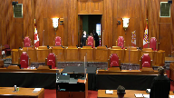
:::

Thank you.

**Justice Moldaver** (00:00:30): Yes, good morning, everyone, and welcome back to the courtroom.

::: {.column-margin}
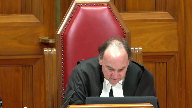
:::

Delightful to see counsel in the courtroom as opposed to on that big screen at the back.

Today's case is the matter of Andre Aaron-Gerard versus Her Majesty the Queen.

Jonathan T. Hughes for the appellant.

Good morning.

Jennifer A. McClellan, QC, and Mark Scott, QC, for the respondent, Her Majesty the Queen.

Yes, please, Mr. Hughes.

**Speaker 1** (00:01:09): Before I begin, I understand the direction was that we're able to remove our mask when making submissions.

::: {.column-margin}
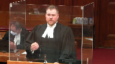
:::

I would like to ask your permission to be able to do that.

This appeal centers around the issues of proper application of the test in wd as well as the elements that can be used in making findings of credibility.

Many of the cases that the respondent relies on also address the issue of sufficiency of reasons, but as you'll see in my submissions, I'm not saying that the trial judge's reasons in this case were insufficient.

I think they painted a very clear road map of where this judge made her findings.

But to borrow the analogy from Laboucan, if her reasons were the road map of how she came to these findings, I think they had also revealed that she made a number of unauthorized stops along the way.

The two matters that are before the court this morning somewhat blend into each other, so I intend to deal with them a bit simultaneously, but I think it makes the most sense to lead off with the issue of the assessment of credibility.

The majority of the court of appeal in Nova Scotia found a distinction between this case and the decision in cook which dealt with similar issues.

I submit to this court that the distinction is a distinction without a difference.

I certainly appreciate that in this case it was a specific defense theory that the complainant was either lying or fabricating or exaggerating and that the trial judge was required to address those in her reasons.

Where I part from the majority of the court of appeal and agree with Justice Brison in dissent is what use can be exactly made of that.

I agree with Justice Brison and effectively within the framework of justice from kiss that along the spectrum of finding of credibility, effectively these interior issues or these secondary issues move the needle no farther than the neutral point.

They can't be used to bolster a complainant's credibility which is what I say that the trial judge unfortunately did here.

This is also a bit distinct from the related case of mhl that the respondent cites in their fact and which also deals with effectively the same issues.

When you actually look at the language of the decision, it's almost identical to that in this case.

However, in mhl the majority of the Nova Scotia court of appeal found in that case the judge didn't automatically make the jump from assessing the credibility to guilt which I say that she did here.

I say that for a number of reasons that throughout her decision when you look at it in the totality as much as she had the correct road map, she correctly stated wd, she correctly reminded herself that evidence can't be considered in isolation.

When you actually look at where she goes with this is right off the bat she says what can I assess to find credibility in this evidence.

The first thing she goes to is lack of animosity between the complainant and the appellant.

She then a few paragraphs later says that her explanation of her statements to the police were plausible.

She continues beyond that and says she has no motive to lie or that there's no evidence before her that the complainant has a motive to lie and finally she comes to this issue of the lack of embellishment.

All of these things were identified by justice Pachaco in kiss as things that cannot move the credibility scale into the positive.

They are things that can be used to determine whether a witness is incredible if there's evidence that there is a motive to lie or that there is evidence of fabrication or that there is animosity between them.

Justice Pachaco even goes so far to say standing up to a vigorous cross-examination can't be used again to move the needle past the neutral.

Again I think it's clear from the trial judge's decision in this case that she in fact does that.

She makes these positive findings of credibility.

So when you get through her decision she ultimately comes to this conclusion that because and you can see this very clearly, it's at tab 2 page 11 of my condensed book where she gets into this of her decision where she clearly says that the complainant is so sufficiently reliable that effectively the defendant cannot raise a reasonable doubt.

And again we get into this blending of the issues.

She uses these make weights as justice Pachaco says to make these positive findings of credibility on behalf of the complainant and then she turns around at the end and says well, I find her evidence to be reliable.

I find her to be a credible witness.

I then turn to see if there is reasonable doubt in the defence as evidence.

That's where I say she gets into this second error of assessing the complainant's evidence first using these make weights as justice Pachaco and the court in alisela identify and saying.

**Justice Rowe** (00:06:26): Are you saying that, just to be clear, are you saying that considering the evidence of the complainant first is a problem, or is it that the manner in which it was assessed is the problem, or both?

**Speaker 1** (00:06:42): I would say it's the manner in which it's assessed.

::: {.column-margin}
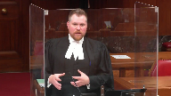
:::

So in dealing with some of the cases like Veridon and some of the other cases that deal with the order in which it appears in the judge's decision, I think that that is a little bit of a red herring.

Because as I understand it, and certainly there are members on this panel who are present for Veridon, Justice Karygiannis writing the decision for it, what I understand that to be is that dealing with that in that order in terms of which a judge brings the findings of fact doesn't necessarily mean that there was a shifting of the burden.

So there's no issue in terms of how the judge lays out her findings in terms of the decision.

The issue here is that it's not just that she outlines her findings with regards to the complainant before she outlines her findings in regards to the respondent in this case.

I think it's that she actually makes the finding that the complainant is credible before she turns to the defendant to say, well, can his evidence raise a reasonable doubt?

And again, that comes a bit from the CLY decision as well.

**Justice Kasirer** (00:07:50): Mr. Hughes, if just to pick up on my colleague's point, so if you look at the reasons given, if you look at page 42, for example, the judge not only is mindful of the fact that she shouldn't come down with a final decision on Ms. Day's evidence because it came first, but that it also shouldn't be done in isolation.

::: {.column-margin}
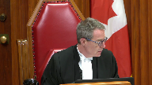
:::

So line 13, regarding Ms. Day's evidence, no conclusion as to its credibility, reliability, believability, or its acceptance can be made until all of the evidence has been considered and it has been tested against all the evidence.

Not only did she state the law properly, she reminded herself of the pitfalls that you quite rightly point to that could undermine a finding of credibility and didn't fall into them according to your colleagues on the other side, what's your answer to that?

**Speaker 1** (00:08:58): Well, thank you, justice.

::: {.column-margin}
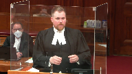
:::

Where I submit that she goes wrong is that's what I meant earlier when I said that she had the correct road map.

She outlined all of these proper issues.

But when you look at her reasons as a whole, you can see that she makes these findings.

And as much as she says that she didn't make the finding of credibility for the complainant in isolation, when you look at the bulk of the rest of her reasons, it's clear that it seems that she actually did, that she goes through and says, well, why do I find her credible?

And we see this right at the outset of her decision once she delves into this by saying, well, how can I find, you know, what can I assess to determine whether this complainant is credible?

Defence counsel at trial attempted to bring a number of issues in terms of her reliability or credibility.

What can I do?

First, there is no animosity.

So even though she is correctly saying that it can't be considered in isolation, she says in her decision, I find no reasonable doubt in the evidence of the complainant.

She also says I find her to be reliable, but that doesn't end the matter.

I then turn to see if the defence can or the evidence of the defendant or some of the other witnesses can raise a reasonable doubt.

I think when you look at that, I think that that reveals what her true analysis was, and I think that that's very revealing in terms of how she got there.

So notwithstanding the correct recitation of the law, and a couple of reminders that it has to be considered as a whole, I think when you look into the decision and you read it as a whole, I think it's clear that she in fact does something quite differently, and this is exactly what Justice Bryson picked up on in the dissent.

I think he phrased it as best as could be in saying what the judge said she did and what she did were in fact two different things.

**Justice Moldaver** (00:10:58): I guess I go back to the days as a trial judge and I have to confess that I quite regularly would say the witness gave his or her evidence in a straightforward manner.

::: {.column-margin}
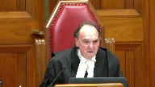
:::

There was no embellishment.

There was no sort of, you know, attempts to move away from the questions as opposed to answering in a straightforward manner.

I guess that was all, that wasn't all wrong.

I will stand by it today.

The really issue is how much weight you can put on it and whether you can use it as a make weight or just look at it as a factor in your overall assessment of credibility.

You would not, I don't think, suggest that if a trial judge found that the witness was embellishing their evidence and that they were argumentative and that they weren't straightforward and so on, that the trial judge could not take that into account in rejecting, as a factor in rejecting their credibility.

You wouldn't say that, would you?

**Overlapping speakers** (00:12:01): No, absolutely not, Justice Moldaver.

**Justice Moldaver** (00:12:03): So, I just find this whole thing so kind of almost esoteric.

::: {.column-margin}
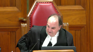
:::

Trial judges have enough trouble explaining why they believe someone and why they don't, or why they have a reasonable doubt or don't, without getting so, I'll call it, Talmudic about the whole thing.

I mean, so dancing on heads of pins and stuff.

It just doesn't work that way.

**Speaker 1** (00:12:28): Well, I don't think it's necessarily that fine, Justice Moldavar.

::: {.column-margin}
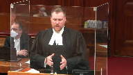
:::

I think Justice Pichaco and the court in Alasayla address that very issue right on the head.

Certainly Justice Pichaco addresses the trial judge in that case's use of the words the preponderance of probabilities in terms of assessing credibility.

But Justice Pichaco then goes on at paragraphs 52, 53, 54 in saying that as much as these are things that can be considered in the total matrix of the assessment of credibility, these extra make weights can't then move the needle into the positive.

So you can look at it and you can say the defence has raised the theory that this witness is fabricating or lying.

I make no finding of that.

There's no evidence before me that this witness is embellishing or lying or has not withstood a vigorous cross-examination.

But where I think Justice Pichaco and the court in Alasayla get it right is saying those are factors to consider in terms of the assessment of credibility, but they can't move you into buttressing a witness's credibility.

**Justice Moldaver** (00:13:36): prior and prior consistent statements, we've been through this, this is not new stuff.

::: {.column-margin}
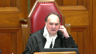
:::

We've been through all this before.

And, and so, I mean, I think if that's what you're saying, that, you know, a prior consistent statement is admissible sometimes as a defense, as opposed to a, as a shield as opposed to a sword.

If that's what you're saying, I don't think probably anybody is arguing with you.

But when your client takes a position, when your client raises motive, when your client puts his whole, puts all his eggs in the motive basket, in effect.

Surely the, and I'm, there, obviously there's no obligation on your client to prove motive or anything like it, but surely the trial judge has the right to assess that and give reasons for rejecting it, otherwise what are trial judges for?

**Speaker 1** (00:14:34): Absolutely.

::: {.column-margin}
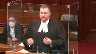
:::

That's what I meant earlier when I said that there is that distinction between this case and the case in cook where the Court of Appeal found differently.

In this case the majority obviously says that the what was impermissible in cook was permissible in this case.

I agree in so far that the trial judge in this case was required to address the defence theory of fabrication.

She was required to touch on it and her reasons.

Where I say that she fell into error and I agree with Justice Brison is saying that she then used these in the exact way that Justice Pichaco cautioned us against to say, well, these things make her more credible because I find that she didn't have a motive to lie, that she wasn't embellishing, that she didn't have animosity towards the defendant.

**Justice Karakatsanis** (00:15:23): Mr. Hughes, I guess reading, looking at the reasons, she, she discusses the evidence in quite a bit of detail.

::: {.column-margin}
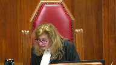
:::

She talks about how it, um, she talks about all the positive indicia of credibility and then she talks, then she specifically says that Mr. Hutchison, counsel for, for, um, the accused certainly challenged her accuracy and memory.

She then goes on to deal with, uh, lack of animosity about the plausibility and she says there's no evidence before me that she was motivated to lie or made previous false claims.

Again, answering the submissions of counsel.

She then, she then goes on to say Mr. Hutchison suggested a number of inconsistencies and lack of independent evidence.

And again, she, why, I'm just having trouble with the idea that she used it as make weight.

There were, she talked about the evidence, she made certain observations about the quality of the evidence.

She makes a point of saying these were the submissions that were made by the defense to undermine her credibility and essentially at the end of the day says, well, I don't accept any of them.

I'm not, I just am not following why you say where in the judgment is it clear that she is, does it suggest that she is using them as a make weight, as a positive for, to make a positive finding of credibility.

**Speaker 1** (00:16:55): So when we look at the judge's decision toward the end, when she gets into summarizing, because the order that she deals with is obviously dealing with how she makes findings for the complainant first and then she deals with the findings that she makes in terms of the defendant in this case, the issue is that when we get past that, she says that she rejects the defendant's evidence, not because it's inherently incredible or anything like that.

::: {.column-margin}

:::

She gets to this point and says, I find that the complainant in this case is so significantly reliable that anything that the defence has said cannot possibly raise a reasonable doubt.

**Justice Karakatsanis** (00:17:36): Isn't that a different, isn't that a different submission?

::: {.column-margin}
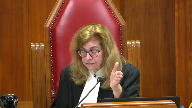
:::

It's one thing to say that he improperly used motive and so on as a make-wait, and it's a different submission to say she did not adequately consider the evidence of the of the accused, but they're two separate submissions.

Rather they don't need to be, but in this case I think they have to be given the reasons.

**Speaker 1** (00:18:01): There are.

It wasn't my intention to suggest in submission that she gave improper weight to that, because as we can see through the various cases, she

**Overlapping speakers** (00:18:09): Okay.

**Speaker 1** (00:18:10): myself and my friends that you can find the rejection of a defendant's evidence in the acceptance of a complainant's evidence.

::: {.column-margin}
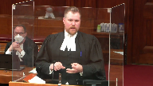
:::

There's no issue with that.

But where I was going with that is that immediately following that paragraph where she says that she rejects the defendant's evidence, she gets she then goes on to say I don't say this simply because he denied it.

I say this because the complainant's evidence is so reliable and I say that she's so reliable because of the manner in which she disclosed, the fact that there's no animosity, the fact that there's no motive to lie.

So that to me is very revealing of how she gets there.

So that shows to me that she did in fact use those as make weights because she's saying that this complainant is so reliable because she didn't have a motive to lie, because she didn't embellish it, because she was reluctant to make a report to the police or testify.

Those are where I think it's the clearest that she in fact has been using these as make weights to say that the complainant was more credible.

**Justice Karakatsanis** (00:19:15): I guess the difficulty I'm having is that we can't just look at sentences in isolation.

::: {.column-margin}
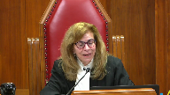
:::

We have to look at the reasons as a whole and how she in fact treated those different submissions and how she analyzed the testimony and I don't think we can just look at one sentence or two sentences and say that that shows she made an error of law where she clearly understood what the law was.

So that's the difficulty I'm having, if that's a fair reading of the reasons as a whole.

**Speaker 1** (00:19:49): I certainly appreciate that, but that's why I say when you actually do look at the reasons as a whole, because she goes through a summary of the evidence and she does an excellent job of giving a very clear and concise summary of the evidence that she's heard, but when you go through that, when she starts at page 106 of her reasons, that's when she starts getting into saying, well, the defence has raised this issue of credibility of reliability of accuracy, how do I find credibility in this case?

::: {.column-margin}
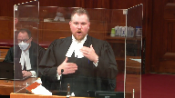
:::

And the first thing that she goes to, she says how do I find reliability in this evidence?

The first thing she goes to is that there's no animosity or there's no apparent animosity between the complainant.

When you look at the paragraphs that proceed that, effectively all of the substantive analysis that she makes of the complainant's evidence are these impugned paragraphs where she says there's no animosity, she was reluctant to call the police, I don't find that there's evidence of motive to lie.

That's looking at it as a total.

When you look at the actual portion of her decision that deals with the substantive issue of how she assesses the credibility, all of the things that she really relies on, she doesn't go into what Justice Pichaco says, the preponderance of probabilities and what in the experience of a reasonable person would seem more likely, she uses these weights to buttress the credibility of the complainant saying that these are the reasons why she is so substantively credible and reliable.

**Justice Rowe** (00:21:21): If a complainant or any witness' testimony is challenged very strongly on a certain issue, and the witness, in this case the complainant, stands up well, right?

::: {.column-margin}
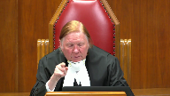
:::

There's a concerted effort to undermine the credibility or reliability of the testimony, and the witness just does a great job.

Can't you refer to that?

Isn't that sort of part of how you assess whether you're inclined to believe that person?

**Speaker 1** (00:22:02): Absolutely.

::: {.column-margin}
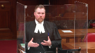
:::

On that note, I disagree with the way that the B.C. Court of Appeal and Swain phrased these latest cases in saying that it creates some ambiguity.

With respect, I don't think that there is ambiguity because the case law has been clear as my friends indicated in their factum.

Credibility and these issues have always been something that can factor into the total assessment of credibility and withstanding a vigorous cross-examination is something that can factor into that.

But again, as Justice Pichaco said, that's not something that necessarily moves that needle into the positive.

And just as Justice Moldaver was saying earlier, this is effectively the same thing as a prior consistent statement.

Just because a person says the same story over and over again doesn't change it when presented with a vigorous cross-examination doesn't necessarily give it the hallmark that it's absolutely true.

So I think that there's a danger in doing that, and as my friends are proposing at paragraphs 109 and 110 of their factum, saying that there could be this principle that withstanding a vigorous cross-examination on a contextual basis, obviously, but withstanding a vigorous cross-examination or findings that there's no motive to lie could be used to bolster credibility, respectfully I think that that's a little bit dangerous because of the exact reasons why we have the general prohibition against prior consistent statements.

The court in Alasala and Justice Pichaco quite rightly say that simply because it's repeated doesn't necessarily give us an indicator that it's true.

**Justice Moldaver** (00:23:38): So often, though, in credibility matters, we look at negative things.

::: {.column-margin}
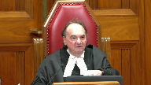
:::

We put it in the negative.

We say, the witness didn't embellish.

The witness stood up in cross-examination.

Despite a vigorous cross-examination, no inconsistencies were exposed.

That kind of thing.

We almost...

And so, therefore, these are indicia that we can look to to decide, overall, can we trust this witness?

Can we believe this witness?

Can we act on their evidence and be satisfied beyond a reasonable doubt?

Just, again, I come back to just kind of the way we assess credibility.

And I don't think you're asking us to reassess all that.

**Speaker 1** (00:24:28): No, I certainly am not justice Moldaver but a phrase that a very learned colleague put to me when discussing this case said absence of evidence is not evidence of absence.

::: {.column-margin}
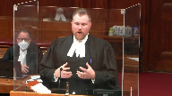
:::

So that's the caution that I have with this is that when we have things like absence of evidence to fabricate or to embellish or absence of evidence of a hostile animus or things like that, that can help and assist a trial judge in making a finding that the witness is not incredible.

But I don't think that that's quite the same and that's exactly what at paragraph 12 to 16 the court in Alasala says can't then be used to say well because there's this absence then that necessarily makes the witness more credible.

**Justice Karakatsanis** (00:25:13): Thank you so much for having me.

**Justice Moldaver** (00:25:14): Where do we go then?

::: {.column-margin}
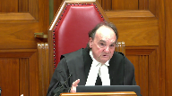
:::

I mean if I'm hearing you correctly that unless there's some sort of confirmation of the witnesses testimony by Independent third parties we can never rely on them because you will always be looking at them from a certain perspective of You know there's an absence of motive here despite the fact that the defense puts all its eggs in that basket

Oh, but I can't use that to assess her to to bolster her credibility I don't even know if I can assess it to consider her credibility, but but where do we stop with this?

I mean It just it really makes no sense to me at the end of the day we size up a witness we look at them We listen to their evidence.

We weigh it against the other evidence and we come to our Our best you know view of the whole thing based on all kinds of factors

**Speaker 1** (00:26:12): Well, and that's exactly what I'm saying is that it is something to be considered, but these additional make weights as Justice Pashacko identifies them can't then just be used to enhance it because then you have a situation like we have in this case where it appears that the substantial portion of the assessment of credibility are for these issues outside of it.

::: {.column-margin}
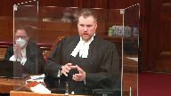
:::

**Justice Karakatsanis** (00:26:33): I'm sorry.

::: {.column-margin}
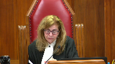
:::

I'm just going to bring you back to what she actually says.

After having identified all of the submissions that Defence made with respect to the credibility, she concludes, and I'm looking at page 40, bottom of 43 of the record and top of 44, 111 of her reasons.

Her plausible explanations for not reporting to the police, her lack of embellishment, her reluctance to testify about other matters involving him, all diminish the reasonableness of any inference that she is lying about these offences.

Is that appropriate or not?

**Speaker 1** (00:27:14): That's appropriate in determining that there's no evidence before her for a motive to fabricate.

::: {.column-margin}
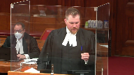
:::

But when we look further, when we look at page 46 of the record, she says it's the circumstances surrounding her disclosure, the contents of the disclosure and the manner in which she related the disclosure that gives me the confidence and reliability of her evidence.

She goes on and says that it's effectively because she has all of these other elements.

**Justice Kasirer** (00:27:44): She ends.

Oh, I'm so sorry.

You go ahead.

**Justice Karakatsanis** (00:27:48): read that sentence at the bottom of 46 in light of what I just read to you?

You can't just read it on its own.

**Justice Kasirer** (00:27:55): And page 48, just to finish my colleague's point, when the judge speaks of the level of confidence that she feels in respect of Ms. Day's testimony, she takes care to say right in the penultimate paragraph of her reasons at page 48, that level of confidence is not reached upon hearing Ms. Day's evidence, but only after considering her evidence in light of all the other evidence at the trial, including the evidence of Mr. Girard.

::: {.column-margin}
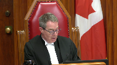
:::

Sounds like she's got it.

**Speaker 1** (00:28:28): But I would actually suggest that that paragraph is internally inconsistent because right before she says the level of confidence is not reached upon hearing Ms. Day's evidence, she says the failure of Mr. Gerrard's evidence to raise reasonable doubt is not because he denied the allegations, the level of confidence and reliability of Ms. Day's testimony is sufficiently great that when Mr. Gerrard's evidence contradicted Ms. Day's, it cannot be accepted as raising reasonable doubt.

::: {.column-margin}
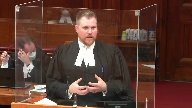
:::

And I see that I only have about two minutes left.

So the reason why I say that this blends into it, when you look at, again, at the totality of her reasons at pages 6, 7, 9, and 13 at tab 2 of my condensed book are all examples of where she says effectively that she accepts the evidence of the complainant and then turns to the defendant to see if it raises a reasonable doubt.

And the reason why these two grounds effectively feed off each other like this is because we have this almost vicious circle of her saying, well, because there's no animus and because there's no motive to lie, therefore, she is very credible.

And she is very credible.

So I therefore find that her evidence is so reliable that I cannot accept any evidence from the defense.

So this is where we say that she fell into error.

And these are the errors identified in lake and repeated again in emw from the Nova Scotia Court of Appeal in saying that effectively the defense has been marginalized here.

It's not even that it's been rejected.

She has used these improper make weights to make findings of credibility for the complainant that has bolstered her to be so sufficiently great that when Mr. Gerrard's evidence is compared to it, even though she finds that it's not inherently incredible or that it's not particularly unreasonable, because it is not nearly as credible as the complainant's, it can't raise a reasonable doubt.

So I think looking at it as a whole, going right from about page 108 where she gets into this issue and saying, well, first, how do I assess this credibility and go through it?

Notwithstanding the proper recitation of the law.

And that's, again, kind of tying it all back in saying the analogy from Laboucan, she had the right road map.

She recited the law properly.

She reminded herself of the things that a judge should remind herself of.

But unfortunately when she got, when the rubber hit the road, she made a number of improper stops along the way at all of these issues in terms of finding the complainant so inherently credible and reliable that when she came to look at the evidence as a whole, she just simply said that the defendant could not raise a reasonable doubt because she was so in fact credible.

Thank you.

I see I'm just about out of time.

Thank you.

**Justice Moldaver** (00:31:11): All right.

Thank you very much, Mr. Hughes.

Ms. McCormick, please.

**Speaker 2** (00:31:54): Justices, all three judges of the Nova Scotia Court of Appeal agreed that the trial judge correctly stated the law.

::: {.column-margin}
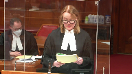
:::

The majority also agreed that she had applied the law correctly, and they cite her repeated statements that she had considered the evidence of both main witnesses in the context of the whole of the evidence.

And justices, this morning, many of those quotations from the trial judge have been put to my friend.

The dissenting judge with respect simply did not believe the trial judge when she says repeatedly that this is how she approached her task of assessing credibility and of determining whether she had a reasonable doubt on this evidence.

That is apparent from the dissenting judge, and this is found at page four of the respondent's condensed book.

He quotes from the trial judge.

He says at paragraph 88, this reversal of the burden appears in the judge's decision when she says, the failure of Mr. Gerrard's evidence to raise a reasonable doubt is not because he denied the allegations.

The level of confidence and the reliability of Ms. Day's testimony is sufficiently great that when Mr. Gerrard's evidence contradicted Ms. Day's, it cannot be accepted as raising a reasonable doubt.

That level of confidence is not reached upon hearing Ms. Day's evidence but only after considering her evidence in light of all the other evidence at the trial, including the evidence of Mr. Gerrard.

The dissenting judge goes on.

The second emphasized passage is incorrect.

The judge had already decided that Ms. Day's evidence was reliable and raised no reasonable doubt.

That premature conclusion cannot be later retrieved by a formulaic reference to all the other evidence.

Well, incorrect is not the word that we would submit should be used there.

There's nothing incorrect about what the trial judge has said.

It is with respect simply that the dissenting judge does not take the trial judge at her word when she says she did all of these things.

He simply does not believe her.

And that is why I've included in the condensed book the excerpt from this court in O'Brien.

O'Brien, paragraph 17, just lower on that page.

Trial judges are entitled to have their reasons reviewed based on what they say, not on the speculative imagination of reviewing courts.

Then it goes on at paragraph 18.

The trial judge was entitled to be taken at his word.

There was nothing in the approach to suggest a subconscious subversion of his articulated thoughts.

And the crown would submit there's nothing here either.

As well, I've included the presumption from G.F., from this court recently, in which this court stated credibility findings must be assessed in light of the presumption of the correct application of the law.

**Justice Moldaver** (00:35:22): Just to interrupt for a second because I go back to the dissenting opinion here, and I think you took us to, what was it, paragraph 79 at page 127.

::: {.column-margin}
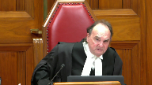
:::

The judge used these negatives to conclude that Mr. Day's evidence was reliable.

And it seems to me that that, with great respect, is a wrong way to characterize what she did.

She used the negatives as factors to consider, none of which are conclusive, but taken cumulatively and measured against the evidence of the accused and witnesses in general, particularly those supporting him.

She finds the complaint to be credible.

And I mean, if that is wrong, if that is an error, then, you know, we've been making mistakes for a very long time in assessing credibility.

**Speaker 2** (00:36:27): Yes, that's the position of the respondent, exactly.

::: {.column-margin}
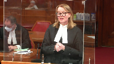
:::

And these aren't negative credibility findings as it's put that way.

I think as it's argued by my friend is that there's an absence of credibility detractors that are made to be used as a make weight for credibility.

But as we've said in our materials, our factum, the trial judge, just as you said earlier today Justice Moldaver, if she says there's a lack of embellishment, she's criticized for that, that apparently she can only use that to show why the witness was not incredible.

And that the Nova Scotia Court of Appeal worked within the confines of KISS, they worked within the confines of Aliasolay to say that that was fine.

She did adhere to that law.

She used these to find she wasn't incredible.

But to follow through with KISS and to say that we can use this to find someone's not incredible, but we can't use it to find that they are credible, that's not in keeping with what this court has said in Gagnon.

That's not in keeping with the idea that there are these various impressions that all intermingle, that can all influence a trial judge and why they're approaching this difficult task of why they make the assessments of credibility they do.

And it can't simply be that if we state it in the negative as opposed to stating it in the positive, that invalidates everything.

**Justice Karakatsanis** (00:38:06): Can I, can I ask you, let me tell you what's troubling me.

::: {.column-margin}
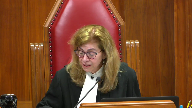
:::

There is a very thorough discussion of the credibility of the complainant, and there is a description of the accused's testimony.

But when I look at the analysis of the accused's credibility, or the accused's evidence, I'm left with one paragraph on page 46.

It is a very minimal analysis of his evidence.

I'd like to hear you on why in this context that's sufficient.

**Speaker 2** (00:38:44): Thank you.

::: {.column-margin}
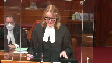
:::

I think it is sufficient, but I think there's also a bit more than that in there when we look at how she's analyzed his evidence.

And part of this is that the trial judge uses a similar framework to that which was used by the defense in eliciting the testimony from Mr. Gerrard.

So Mr. Gerrard is giving what's sometimes called a simple denial or a bare denial.

So as part of eliciting that from him, the defense lawyer will say, well, here is the allegation that Ms. Day said about the incident where the Mercedes was damaged, or here's the incident that she described of what happened in the grape leaves when she suffered the terrible beating.

What's your response to that?

And this framework that we see that the defense used to elicit her testimony then appears in the trial judge's reasons as well.

And she puts that evidence in her decision the same way.

You see her saying about this incident, about that incident, and then giving his response.

And she does that as well with the arguments made by the defense.

So we see all of that.

But when you look at what she highlighted also and what she took from the evidence of Mr. Gerrard, I think it's important.

In addition to summarizing at length his testimony and analyzing his content, which we see earlier on in her decision, and I would say that's at pages 32 through to 36, she correctly notes that the defense evidence consisted of denials and attacks on Ms. Day's credibility.

We see that from pages 35 through 36.

She referenced how the other defense evidence, the evidence of Theo Gerrard and Ms. DeVoe, was neutralized on cross-examination.

And that's from pages 36 through to 37 of the decision of the trial judge.

And I'm using here the numbering that's at the top, so I hope that's not confusing.

She addressed the live issues advanced by the defense that Ms. Day had a motive to lie without requiring the defense to prove it or making it determinative of credibility.

That's found at pages 40 through 43.

Then she detailed the specific admissions that were made by Mr. Gerrard.

And I think that's important as well.

That's pages 44 through 45.

And when she's discussing those admissions, she mentions specifically many of the things he says.

When he says that he admits that yes, throughout the relationship, she had said that he was controlling.

This isn't the first time he's heard that.

He uses the line that seems to have infected the trial judge, and it's fairly clear why.

I acted as a father and a grown man in my household when he was talking about being controlling.

He admitted he accused her of infidelity.

In regard to the makeup question, you know, the incident where he asks her to pull over to the side of the road and send him a picture to prove she's not wearing makeup.

He says, yeah, it's possible I said that.

He admits that the son and the daughter were a problem.

He puts it as challenged our home.

Admitted upset.

He admitted that he was upset that the son, her son from her previous marriage was dating the niece.

He admitted he had a temper.

He admitted he cursed and called her names.

He admitted that he and the daughter had both dropped phones and that he had tossed a phone.

He admitted that he had seen bruises on her, which is contrary to his own evidence from Ms. DeVoe, although he's attributed it to lobster pots.

And he admitted calling her over 100 times, very many times, and described that as needless and more than necessary.

So when the trial judge gets into this evidence here, I think that while it's certainly expressed in the paragraph that you mentioned, Justice Karygiannis, we also see that she's highlighting in her decision all of these various admissions that he has made in his evidence that are so important and would go both to his credibility and to her credibility.

And I don't think there's a requirement that she has to be more explicit than that.

That's all there.

And then she comes to the conclusion after that, that where Mr. Gerrard's evidence was contradicted by other witnesses' evidence, that she accepted that of the other witnesses in particular, she believes, she states, Ms. Day beyond a reasonable doubt.

And she is allowed to do that.

And I think, and I would submit, Justice Karygiannis, that when looked at in the totality and looked at in the context of the whole, it is quite clear, as she says, that where the evidence of Mr. Gerrard contradicted the evidence of Ms. Day, that on a considered review of all of that evidence, it simply was insufficient to raise a reasonable doubt.

So I hope that does that address your question?

Thank you.

So I've touched on this in response to that question, but we would also agree with the majority of the Court of Appeal who found that the decision was responsive to the cases presented.

The majority of the Court of Appeal found at paragraph 52 that it was a proper analysis of the way the argument and the evidence unfolded.

Now, my friend put more focus today on the lack of animosity, that right after the trial judge is discussing the reliability of the decision, she's mentioning lack of animosity.

But it was also responsive in that regard.

And I won't take you to it right now because it's not in the condensed book, but maybe for if you have the opportunity.

In the appellant's record, at tab 47, page 55, and it says on that page, Ms. Mills' submission, that was the Crown Attorney, it's not, it's actually Mr. Hutchinson, who was the defense lawyer at trial.

And he's talking about the evidence of Ms. Day, and he says at line 11, page 55 of tab 47, there was certainly a great deal of disdain upon her part towards Mr. Gerrard.

And certainly that's a lens through which the court now has to consider her evidence.

So yet again, the trial judge is responding there to something that was put to her by defense counsel, and now she's being criticized for it.

In the same way, the decision was responsive about the issue of motive to lie.

Motive to lie was described by the Nova Scotia Court of Appeal as the burning issue raised by the defense in this appeal.

This was apparent in both the way it was presented by the defense and in the evidence of Mr. Gerrard.

And I would take the court now to our condensed book at tab 7.

In regard to a question or an objection, sorry, on a brown and done basis, defense counsel Mr. Hutchinson, and this is tab 7, page 30 states to the court, that they were put to the complainant, your honour, in cross-examination, that there was a derogatory comment made by Mr. Gerrard towards the daughter, which in turn then permeated back to Lisa Day, and it was suggested to her on cross-examination that that was foundation of the complaint to the police.

So in that excerpt at page 30 of the condensed book, the defense counsel at trial is referring to this allegation of motive to lie as the very foundation of the charges that are before the court.

The trial judge says, okay, you can put the question to him.

And he says, and a derogatory comment was made by yourself.

Answer, yes, I made, I told her a derogatory comment that I had heard about her mother.

And it went right back to her mother, and within 24 hours the police were at my door with a list of charges.

So that's what I've referred to in my materials as the specific motive to lie.

But there's also this more general evidence that throughout the course of their relationship, Ms. Day was threatening to take Mr. Gerrard's daughter away from him, that she was threatening to take him to court, and there's this suggestion that this is now the acts of a vindictive woman who's acting on her long-festering threat to ruin Mr. Gerrard's life.

We see this in the next page, 31 from the evidence. Line 13.

It went cold turkey.

She would throw things in my face where maybe I should have you charged, and I could put you to court.

I would go leave the house.

I would go to my camp.

I had a camp.

And one time she actually called the police on me there.

They went back.

She tried to say I was back there.

I was going to commit suicide because I had a firearm with me because it was partridge season.

Then on the next page of the condensed book, 32, this is another example from the direct examination.

If she didn't get her way well, it would be she could take my daughter.

She could do what she wants.

That's at lines 9 and 10.

The next page, page 33 of the condensed book, now we're into the cross-examination, and Mr. Gerrard is still giving this evidence of what is the central theory of the defense.

And this is in regard to the Mercedes incident at line 9.

No, she accused me of that because again, like I said, we were arguing, and she'd just throw anything out there.

She just, I'll take you to court and you won't see your kid.

And look, she can say what she wants, like she just says stuff.

She just says stuff?

When she gets mad, yeah.

When she gets mad?

And so when I got mad sometimes, I would say things, yeah.

Then the next page, he returns in his cross-examination to the incident of the camp where he says she called the police on him with no basis to say she was concerned he would commit suicide.

At line 17, he says, and she accused me of something then.

I don't know what it was.

So the majority is certainly correct when they say this was a burning issue that the trial judge was required to deal with.

It's just as Moldaver said today, the defense had put all their eggs in this basket.

It was the central theory of the defense.

Motive July was squarely before the court, and it had to be addressed.

The majority distinguished this case from Cook, and the dissent relies on that.

But as the majority said, they aren't similar cases.

In Cook, the crown had conceded that the motive to lie had been misused, and there's not a great deal of discussion therefore about how it was problematic in Cook.

And also in Cook, they noted, in the distinguishing book, the majority noted that neutral factors in that case, such as a lack of embellishment, had been used to bolster insupportable credibility findings.

So in Cook, the credibility findings were insupportable.

There is nothing insupportable about the credibility findings made in this case.

The court then looked at Swain, a decision of the British Columbia Court of Appeal, which described Cook and two other cases it mentions as causing some ambiguity in the law.

And that's just found in our condensed book, page 37.

Notwithstanding some recent ambiguity in the case law, rvcook, rvas, rvsh, and this is the majority there at page 37 quoting from Swain, it has been held that a truer fact is entitled to consider an absence of evidence of motive to fabricate when assessing a complainant's credibility.

And the key thing is just don't fall into certain traps.

And the Nova Scotia Court of Appeal agreed with the British Columbia Court of Appeal and Swain and noted that those risks were that you treat the evidence as entirely determinative of the credibility of the complainant, that you equate no evidence of a motive to lie with no actual motive to lie, or that you require the defense to prove that there was no motive to lie.

And the Nova Scotia Court of Appeal concludes at paragraph 65 found on page 40 of our condensed book that none of those risks were encountered in this case.

She did not make it entirely dispositive of her credibility findings.

She did not switch the burden to Mr. Gerrard.

And she made it quite clear that she was unwilling to draw the inference from the evidence, not saying that there was absolutely no motive to lie.

And my friend seems to be relying on proximity of sentences in this decision.

Well, she talks about motive to lie, and then she mentions that she doesn't find any reasonable doubt in the evidence of Ms. Day.

But that's not how we read a decision.

We don't say because this sentence is proximate to that sentence.

There's no therefore.

She never says I find I'm unwilling to draw the inference, therefore I find her credible.

It's quite clear throughout all of her decision why she is finding her credible, and it is not solely on the basis there was no motive to lie.

**Justice Moldaver** (00:53:42): A fair comment to say that embellishment or exaggeration can be a factor in assessing an issue of motive.

::: {.column-margin}
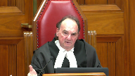
:::

In other words, does kind of the way human beings react and do things, if someone is exaggerating, if someone is embellishing, and the issue is did they have a motive to lie?

I would have thought it is fair game to look at that.

It doesn't necessarily mean you're going to be satisfied that they are lying, but surely they are factors that, as I say, human experience suggests one goes with the other, or can go with the other.

**Speaker 2** (00:54:27): It certainly does and as the majority found and they worked within the confines of kiss and they found look she only considers lack of embellishment in regard to whether or not I'm finding a motive to lie and when you see where she's considering lack of embellishments it's discussed within to lie but certainly that's entirely relevant to this defense that was put forward of motive to lie.

::: {.column-margin}
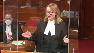
:::

To say she lacked embellishment of course that's relevant.

One would expect if she is acting on this threat that she's made for years that she's going to be going in there

and she's going to be delighted to finally be testifying against Mr. Gerrard as opposed to hesitant.

**Overlapping speakers** (00:55:08): It depends on how clever you are.

**Speaker 2** (00:55:12): Well, it would certainly be, I think, you know, you'd be playing quite a long game if you went from initially just going to the police because you want information and you make an anonymous complaint.

::: {.column-margin}
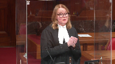
:::

And then the next time you go to the police, you just want a peace bond.

So you only give a certain amount.

You don't give as detailed a statement because you just want him to leave you alone.

And then the next time you go to the police, it's only because another witness has been interviewed.

And as a result, you've been called back in.

And in that statement, you give more evidence, a more fulsome statement.

So certainly in regard to the reliance on the reporting to the police, I think that's why that's so relevant.

You know, you'd be playing a very long game if you were planning to do all of that to put in motion your lie about Mr. Gerard.

But that also has an incredible ring of truth to it.

So to say maybe that that can only go to why you're finding her incredible as opposed to why you're finding her credible, this is why I say that's an artificial distinction.

It also has that ring of truth because you hear in the evidence how they've struggled over the years to form a family.

They've had a child through surrogacy.

They've moved to various different places, but then they eventually build their home.

And his father is across the road and his brother's down the hill.

That's his home.

That's his place.

She is going to be blowing up her life that she has struggled so hard for that they both testified they work towards when she's giving this statement about him in the domestic abuse.

And she testified as the trial judge noted that she was scared.

She was worried if he took she took if he got his guns, had his guns taken away, the reaction he'd have to that because he was a hunter.

And she was also scared he had made these threats to kill her to kill her son.

And I think she puts it in the evidence.

I didn't want to find out.

I didn't want to find out if he'd act on that.

So if she is lacking embellishment in her testimony, if she is so say the judge had put it this way.

She testified clearly.

She was careful in her answers.

She was straightforward.

She was forthright.

There would be no problem with that.

It can't be the law that because it's stated in the negative as a lack of embellishment that that's somehow a make weight for credibility. It's not.

And again, I bring this court back to Gagnon, the complex intermingling of impressions.

So while you're considering motive to lie and you're looking at her evidence, you're going to make conclusions about her credibility.

That's only natural.

And that's what was done here.

And those were proper considerations, either as the Nova Scotia Court of Appeal majority considered them in the confines created by kiss, which wasn't binding of course on the Nova Scotia Court of Appeal.

It's a decision of the Ontario Court of Appeal.

But whether you work within those confines or whether this court takes this opportunity to say no, those artificial distinctions, they don't keep and they're not in the spirit of Gagnon.

In her decision that Judge Whelan says I have considered the evidence of Mr. Gerard in the context of the evidence of the whole.

I have considered the evidence of Ms. Day in the context of the evidence of the whole.

I made no conclusion about the reliability or the credibility or the believability of her evidence until such time as I considered it within the context of the whole of the evidence.

Those multiple examples that have been read to my friend today and that we've seen throughout the decision make it clear that the burden of proof was never switched to Mr. Gerard.

He was never required to prove everything.

And furthermore, believing the complainant beyond a reasonable doubt does not equate to picking a side.

It's not the same thing as saying I prefer her evidence and therefore as a necessary corollary, and this was a bit discussed in Van Deventer, the case relied on by my friend from Saskatchewan Court of Appeal, as a necessary corollary I must find him to be guilty.

That's different.

She didn't do that.

She goes through and synthesizes all of the evidence that is before her and makes a determination on the basis of that that she believes the complainant beyond a reasonable doubt.

And she relies on Jora, but I've included in our condensed book, JJRD and DR from the Ontario Court of Appeal and the British Columbia Court of Appeal in Redden, found at page 21 of our book of authorities, where they say that a court does not assess the evidence of the accused in isolation.

There will be cases where the defence is rejected based on a considered and reasoned acceptance beyond a reasonable doubt of the truth of conflicting credible evidence.

This does not mean that the trial judge is erroneously chosen between competing narratives, simply preferring one to the other.

To do so would constitute reversible error.

Rather, it represents a finding that the testimony of the accused cannot stand in light of the cogency of other evidence.

That's simply what happened here.

After synthesizing all the evidence, looking at it all, she believed in his day beyond a reasonable doubt, which she was entirely entitled to do.

**Justice Moldaver** (01:01:24): Perfect timing, Ms. McClellan.

**Overlapping speakers** (01:01:26): Thank you.

**Justice Moldaver** (01:01:26): thank you so much.

Mr. Hughes, do you have any reply?

**Justice Rowe** (01:01:34): Sure.

**Speaker 1** (01:01:38): The issue that I wanted to raise in reply is I think we're losing the distinction between proof of an absence of motive to lie and absence of evidence of a motive to lie.

::: {.column-margin}
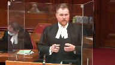
:::

And I apologize that the name of the case cited by my friend is escaping me, but early in the decision the court makes a very clear distinction saying that proof of an absence of evidence of motive to fabricate is something that a trial judge can use to bolster credibility.

So an actual finding that there is no motive to lie or to fabricate is something that a trial judge can use to bolster credibility and no issue is taken with that.

That court then goes on to say, however, absence of evidence of a motive to fabricate is just one thing that can be taken into consideration in the factual matrix and the constellation of considerations in determining that.

And I think that that's one thing that we're just kind of losing sight from here because it seems to me that we're equating the absence of evidence of a motive to fabricate with proof that there is no motive to fabricate.

**Justice Karakatsanis** (01:02:43): I mean, if we accept that the first is stronger, obviously, than the second, you're not disputing, are you, that they're both factors?

One's one weaker than the other?

Certainly, I think that's a good question, and certainly, I think that's a good question, and certainly, I think that's a good question, and certainly, I think that's a good question, and certainly, I think that's a good question, and certainly, I think that's a good question, and certainly, I think that's a good question, and certainly, I think that's a good question, and certainly, I think that's a good question, and certainly, I think that's a good question, and certainly, I think that's a good question, and certainly, I think that's a good question, and certainly, I think that's a good question, and certainly, I think that's a good question, and certainly, I think that's a good question,

**Speaker 1** (01:02:55): I would absolutely agree that they are both factors but I agree with Justin Pichaco in saying that effectively the latter can only move the needle so far it can't then go into the positive.

Effectively it stays in the negative column.

**Overlapping speakers** (01:03:09): But why do you say it has to stay in the negative column?

**Speaker 1** (01:03:13): Well, that comes back to that phrase that absence of evidence is not evidence of absence.

::: {.column-margin}
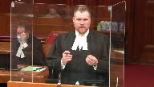
:::

So if we have a trial judge saying that there's no evidence before hers, that there's a motive to lie, that's something that can say there's no negative detractor here, but a simple absence of evidence of a motive to lie isn't then something that a judge can turn around and say, well, because there's no evidence of a motive to lie before me, that therefore makes this witness more credible.

So I think that's the distinction, and that's why if there is an actual positive finding that there's no motive to fabricate, then that would be acceptable in saying because I find as a fact that there is no motive to lie or there's no motive to fabricate, that then moves into the positive column.

I hope does that answer your question, Justice Karygiannis?

That's really all I wanted to say in terms of reply because I think that that's a distinction that's important here.

Thank you very much.

**Justice Moldaver** (01:04:15): Thank you very much for your submissions.

The court is going to retire and we would ask council to remain in the court.

Thank you.

**Justice Karakatsanis** (01:05:11): Thank you.

**Justice Moldaver** (01:05:17): Well, let me begin by thanking both counsel for your very able and helpful submissions.

::: {.column-margin}
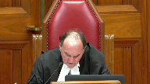
:::

The court is grateful to both of you.

We have been able to resolve the decision and I will deliver the judgment for the court.

Mr. Gerrard appeals his 13 domestic violence related convictions to this court as of right based upon a dissenting opinion at the Nova Scotia Court of Appeal.

A majority of the Court of Appeal rejected his submissions that the trial judge erred both in her application of RVWD and her assessment of the complainant's credibility.

We would dismiss the appeal.

On the first issue, the trial judge instructed herself correctly on the WD test and its application.

It is immaterial that the trial judge assessed the complainant's credibility before the accused.

This does not automatically demonstrate that she reversed the burden of proof, RVWD.

Rather, the trial judge's reasons demonstrate that she did not evaluate the complainant's evidence in isolation, but properly tested it against the evidence of other witnesses, including the accused, and offered cogent reasons for finding that the complainant's evidence was credible without improperly marginalizing that of Mr. Gerrard or any of the other witnesses.

Trial judge's reasons must be read generously as a whole and with the presumption that the judge knows the law, RVGF, we see no reason to interfere with her analysis.

On the second issue, we do not accept Mr. Gerrard's submission that the trial judge made improper credibility findings about the complainant regarding lack of motive to lie, lack of embellishment, and reluctance to report to the police and testify.

The judge properly considered each of these factors in assessing the complainant's credibility as a direct response to Mr. Gerrard's Defense Act trial, namely that the complainant had long threatened to report him to the police and finally followed through with this threat by fabricating allegations because he made a derogatory comment about her to her daughter.

Put another way, he alleged that she had a motive to lie and was in fact lying.

Credibility findings are owed significant deference on appeal, GF.

The trial judge's reasons were responsive to live issues at trial raised by Mr. Gerrard and reveal no error justifying intervention.

Two of these factors warrant a few additional comments.

Lack of evidence of a complainant's motive to lie may be relevant in assessing credibility, particularly where the suggestion is raised by the defense, RV Sterling, RV Ignacio.

Absence of evidence of motive to lie or the existence of evidence disproving a particular motive to lie is a common sense factor that suggests a witness may be more truthful because they do not have reason to lie.

That said, when considering this factor, trial judges must be alive to two risks.

One, the absence of evidence that the complainant has a motive to lie, that is that there is no evidence either way, cannot be equated with evidence disproving a particular motive to lie, that is evidence establishes that the motive does not exist, as the latter requires evidence and is therefore a stronger indication of credibility.

Neither is conclusive in a credibility analysis.

And two, the burden of proof cannot be reversed by requiring the accused to demonstrate that the complainant has a motive to lie or explain why a complainant has made the allegations, RV Swain.

Lack of embellishment may also be relevant in assessing a complainant's credibility and often arises in response to suggestions that the complainant has a motive to lie.

But unlike absence of evidence of a motive to lie or the existence of evidence disproving a particular, it may however be considered as a factor in assessing whether or not the witness had a motive to lie.

For these reasons, we would dismiss the appeal.

Thank you very much.