---
title: Her Majesty the Queen v. Anthony Raul Alas
published-title: Heard
date: 2022-04-21
sidebar: false
---

This transcript was made with automated artificial intelligence models and its accuracy has not been verified. Review the original webcast [here](https://scc-csc.ca/case-dossier/info/webcast-webdiffusion-eng.aspx?cas=['39654']).
---

**Justice Wagner** (00:00:03): The court, Nakul.

::: {.column-margin}
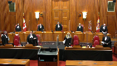
:::

Good morning.

Be seated.

The case of Her Majesty the Queen against Antony Roll-Allis for the appellant, Her Majesty the Queen, Kevin Rollock, G. Karen Papadopoulos, for the respondent, Antony Roll-Allis, Mr. John Rosen.

Mr. Rollock.

**Speaker 1** (00:00:54): Thank you.

::: {.column-margin}
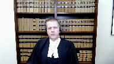
:::

We're here today because the majority of the Court of Appeal found that the trial judge erred by putting the respondent's case to the jury just the way he wanted.

We say, like Justice McPherson in dissent, everyone at trial got it right.

There was no air of reality to provocation.

The trial judge was duty-bound to keep it from the jury.

To give you a roadmap for my submissions, I have four main points.

One, the trial judge correctly found that provocation had no air of reality.

Two, defense counsel's position at trial confirms there is no air of reality.

Three, the trial judge's decision deserves some deference.

And four, even if provocation should have been put to the jury, no substantial wrong or miscarriage of justice resulted in the circumstances of this case.

On the first point, the trial judge properly exercised his gatekeeper role in keeping provocation from the jury, because the absence of suddenness deprived the objective and subjective elements of an air of reality.

**Justice Wagner** (00:02:18): So, Mr. Raulog, I have a question for you.

::: {.column-margin}
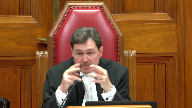
:::

In which circumstances, and I know that you will elaborate on that later on, and then you can take your time, but I just want to put that question to you right now.

In which circumstances a judge should follow the suggestions or submissions of the attorneys, and specifically the defense attorneys, who doesn't want to open the provocation defense, but there is some evidence of provocation, that could lead to open the defense as such.

Are there any circumstances in which the trial judge would be well-founded, would be right, not to open the defense?

**Speaker 1** (00:03:09): Well thank you for that question.

::: {.column-margin}
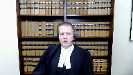
:::

I'm glad you raised it at the outset.

We would say that in circumstances where there's a credible argument to be made that the error of reality test is not met, in those circumstances trial judges should give primacy to the considered positions of counsel.

And the benefit of that approach is that take for example provocation.

It obviously only arises in murder trials.

Long hard-fought trials generally.

So giving some primacy to the defense position when they say they'll want an alternative defense left would help bring some certainty to the trial judge's role.

And it would result it would reduce the risk of an unnecessary retrial for example or it would also allow the trial judge to sort of have some more concrete guidance and apply the error of reality test.

Which is perhaps easy to say in principle but difficult to apply in practice.

**Justice Kasirer** (00:04:11): Mr. Rollick, can I just follow up on that question and, and add to it what Justice McPherson mentions in paragraph 84, where, speaking about second-guessing Defence Council's explicit choice, he notes, um, it would inject a dangerous element of confusion and even conflict into the appellant's defence.

::: {.column-margin}
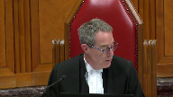
:::

I'm wondering what the relevance of that is, just generally speaking, and then in this case, in particular, given that the respondent contests that, that position.

**Speaker 1** (00:04:50): So the relevance in this particular case is that the reasons identified by Justice McPherson support defense counsel's exercise of tactical decision making and point to considerations that were no doubt on counsel's mind when he took the position that provocation didn't have an air of reality.

::: {.column-margin}
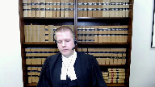
:::

And to the Chief Justice's question, that's part of the reason why we should in close calls give primacy to the defense position because they're best placed to assess on the ground the impact that putting an alternative defense might have in the concrete circumstances of a particular case.

So for example here a jury instruction on provocation might well have elevated a compromised verdict of manslaughter and here the defense was going for an outright acquittal.

So I say that these types of considerations are what animate defense counsel's decision making on a daily basis and those types of concerns in this case only reinforce the reasonableness of defense counsel's considered position that provocation had no air of reality.

With respect to the trial judge's decision here there's really three sub points I want to emphasize.

First the deceased conduct was not sudden and unexpected.

Taking the defense case at its highest the deceased who was unarmed and outnumbered three to one either raised his fist or lunged towards one of the women in the respondents group.

That alleged provocation could not surprise the respondent as he knew about the deceased's earlier physical aggression towards Patricia Isaacs.

That was why he went outside and braced his knife in the first place anticipating a confrontation and the confrontation that resulted was predictable.

The deceased didn't pull out a weapon he behaved consistently with his earlier known aggression.

It was the respondent's conduct stabbing the deceased that was sudden and unexpected.

Look no further than the immediate reaction of his fiancée the person he said he was protecting.

The respondent told police she was freaking out

oh my god what did you do what did you do.

He replied I just did what I had to do.

The focus at trial was on whether the alleged provocation was sufficiently sudden and unexpected to cause the respondent to subjectively lose self-control.

Everyone agreed that it was not but suddenness is not exclusively a subjective consideration.

It also impacts on the objective element.

How could provocation that is not sudden and unexpected deprive an ordinary person of the power of self-control?

The answer at least in this case is that it could not.

The second point is that the respondent deliberately anticipated and deliberately responded to the deceased's conduct.

There was nothing in the respondent's police statement he didn't testify suggesting he lost self-control in the moment.

To the contrary the respondent described tracking the deceased in the bar waiting for and engaging him outside anticipating aggression giving him a knowing look to communicate if you do anything I would jump on you readying his knife in his hand before the deceased made any move moving that knife from his pant to jacket pocket and getting a good grip on it and finally deliberately stabbing the deceased admittedly aiming for his chest as soon as he raised his fist.

That series of decisions in my submission is the antithesis of a provocation defense.

Finally the unchallenged cooling off period between the two incidents rendered provocation unavailable.

This cooling off period prevents the respondent from relying on the first incident that he said caused him to shake as provocation and to the extent you consider the first incident as relevant background it undercuts provocation by showing that the respondent knew that the deceased was physically aggressive beforehand.

So the question comes down to this is a fist going up sufficient to cause a loss of self-control?

In answering yes the majority set the societal standard for the ordinary person far too low.

Although no two cases are exactly alike compare another decision of the Ontario Court of Appeal called Stubbs.

There the court held that the deceased act of raising his fist and saying there's the fucking goof was insufficient to deprive an ordinary person of the power of self-control.

Each case obviously turns on its own facts but that's a useful comparator and helps illustrate the point I'm trying to make here.

**Justice Jamal** (00:10:31): Mr. Rawlett, as I'm listening to you, really, you're making a case, the case you're making is that there's no possible basis for an air of reality, for an air of reality of provocation and yet you say, in close calls, we must give primacy to the defense position.

::: {.column-margin}
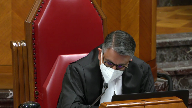
:::

I gather, is what you're saying that in this case, the defense position's kind of irrelevant because there was no air of reality, whatever the defense position was?

Because I'm trying to reconcile those two.

I'm trying to reconcile those two.

**Speaker 1** (00:10:59): Thank you for clarifying.

::: {.column-margin}
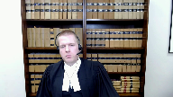
:::

That's exactly what I'm saying.

We don't even need to get to the defense position because in our submission this was not a close case.

This was a case where the trial judge simply got it right without reference to defense counsel's position and in our submission defense counsel's position simply confirms the correctness of that ruling.

So Justice McPherson pointed out in dissent if we're talking about the defense position here for purposes of appellate review the position taken by counsel at trial assists an appellate court in determining whether defense properly arises on the evidence and for good reason.

To conduct the appeal without any regard for the conduct of the trial would risk as Justice Doherty put it in Kimberly making a mockery of the process.

Yet here the majority of the majority of the Court of Appeal never considered defense counsel's position in determining air of reality.

For his part the respondent seemingly recognizing counsel's the importance of counsel's position to the air of reality analysis tries to undercut it based on three words spoken during the pre-charge conference.

There is however no compelling reason to second-guess defense counsel.

I say that for three reasons.

First a fair reading of the impugned exchange shows that the focus and purpose of defense counsel submissions was on the evidence showing an absence of suddenness not the legal effect of provocation.

His slip of the tongue regarding vitiating the mens rea for murder was obviously understood by everyone in the room as exactly that.

An inadvertent slip on a non-issue.

Second and relatedly the respondent now concedes that defense counsel was not incompetent and did not provide an effective assistance to counsel.

In other words the strong presumption of counsel competence reinforces this slip of the tongue reading.

Finally and I've touched on this already before defense counsel's decision was not just supported by a presumption of competence but by real tactical considerations.

So at the end of the day the respondent can't have it both ways.

He can't say his counsel was competent and effective but ask you disregard entirely his position that provocation had no air of reality based on the provocation had no air of reality based on three words in the transcript.

Defense counsel's position was considered reasonable and supported by tactical considerations.

The majority should have considered it in determining whether provocation properly arose on this evidence at this trial.

And just moving on to my third point it hit so much as Jamal pointed out to me as well which is this deference point.

We say you don't even need to get here because the trial judge's decision was in our submission the correct one he got it right.

But what I do want to point out is any attack on defense counsel's position is further undercut by the fact that both the trial crown and the trial judge also thought it had no air of reality.

So we accept that the question of whether a defense properly arises on the evidence or has an air of reality is a question of law reviewable on a correctness standard but a trial judge's task is no easy one.

This court has recognized that trial judges must tread a fine line prohibited from weighing the substantive merits of defense but required to determine the field of factual inferences that could reasonably be drawn from the evidence.

We say that the trial judge's decision to keep provocation from the jury deserves some deference. Why?

Because he had a front row seat at this trial.

He was best placed to determine the field of factual inferences that could reasonably be drawn.

And what does some deference mean?

It means that we should not conduct appeals as though there was no trial.

Finally, even if this court concludes that there was an air of reality of provocation, despite defense counsel's position, no substantial wrong or miscarriage of justice resulted in this case.

Now let me acknowledge at the outset the proviso likely won't apply in most cases where a defense with an air of reality is kept from the jury.

But there will be rare cases like this one where the proviso is safely applied because the error is harmless in context.

Here I emphasize three things.

One, this wasn't the case where the defense wanted provocation put to the jury.

This was a case where the defense didn't even think it properly arose on the evidence, suggesting any air of reality was marginal at best.

Two, provocation would have undermined the respondent's credibility given his claim he was purposefully defending his fiance and her friend.

And three, consequently would have diluted his primary defense, which depended on his previous defense.

And finally, this was a case where the defense had undermined his credibility and undermined his only shot at an outright acquittal.

I can do no better than quote what the Ontario Court of Appeal said in Laverte, citing this court's decision in Leary.

It is not in the interest of justice that an accused be given a chance to rethink his defense and appeal where his first trial was fair and free of substantial wrong or miscarriage of justice.

Approaching that issue somewhat differently, had the trial judge charged the jury on provocation in the circumstances of this case, that undoubtedly would have formed the respondent's first ground of appeal against conviction.

So I end where I began.

The respondent got the trial he wanted.

There was no air of reality to provocation as everyone recognized the trial.

On the respondent's own evidence, he anticipated, prepared for, and armed himself for a risk.

A predictable altercation materialized, and he immediately and deliberately stabbed the deceased six times in response.

On these facts, the trial judge was duty bound to keep provocation from the jury.

Subject to any questions, those will be my submissions.

**Justice Wagner** (00:18:07): Thank you very much, Mr. Rosen.

**Speaker 2** (00:18:17): Yes, thank you, Chief Justice.

::: {.column-margin}
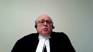
:::

Let me begin by saying this in answer to my friend's position.

The reason that we have an error of reality test is because we don't want jurors to speculate just because somebody said she consented or I was provoked or I was acting in self-defense.

We want to have some substance on the record.

But at the same time, where there's an abundance of evidence that raises the fact that the accused does act on a provocative act, which is what happened in this case, we want the jury to have the tools in order to assess all of the evidence from every perspective because it fosters greater confidence in the result because we know that they've looked at it from every angle.

And what happened in this case is not a harmless error.

It was a serious error.

It was an error that may have started with defense counsel's misconception of the law, but it ended with my client's conviction for murder without a jury considering whether or not that could be ameliorated because of legal provocation.

And in my respectful submission, the proviso certainly doesn't apply.

The second point I want to make is in response to the questions raised by members of the court.

When does the position of defense counsel bind the trial judge and prevent a defense being put even where there's some evidence that would support it?

Well, it is clear that where there's a particular position put forward for strategic reasons, that would be one thing.

But when the position put forward is due to a mistake in law, that a misunderstanding of the law and a misunderstanding of the factual analysis, then the trial judge has an obligation to step in and make sure just as in the case of Quinton that I cited, there was a real waiver of that position.

Now, when does that happen?

**Justice Kasirer** (00:20:39): Yes, sorry.

::: {.column-margin}
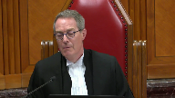
:::

If the trial judge had opened provocation and it had compromised Defence Council's effort to secure an acquittal on the basis of a self-defence argument, compromised it two ways, in law because it would have been, if provocation was relied upon, it would have been a manslaughter conviction, and on the facts because it might have undermined the, sorry, the respondent's credibility, the accused's credibility as to whether he was acting in self-defence.

So what's the trial judge to do there?

**Speaker 2** (00:21:21): But you see, that begs the question with the greatest of respect, because provocation and self-defense are closely aligned.

::: {.column-margin}
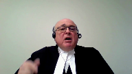
:::

A person may react to a provocative act with the intention of merely defending himself or a third party, but if they do it in rage and without time to contemplate and do it excessively so that their conduct is unreasonable, then the jury will find that they've committed a murder, and the question then is, do we ameliorate the murder based on the provocation?

So they go hand in hand, which is precisely the point that Justice Pachaco put in in Land.

Now in this particular case, this was not as Justice McPherson says, oh look at how strong the argument was on self-defense.

That's pretty disingenuous with the greatest of respect, when in fact provocation wasn't going to be put.

Rather, look at what the words are of the defense counsel.

Defense counsel right at the outset said, here are my positions.

The identity is not an issue, self-defense is an issue, intent is an issue, and provocation is an issue.

I mean, you know, I'm struggling with the provocation side, and then we find out why he's struggling with the provocation side, but he put all three to the judge.

So this wasn't a case where somebody stood up and said, look this is an identity case, and even if there's evidence of provocation, I don't want you to put it because it detracts from the focus on identity.

That's not that case at all, nor is it, anyway, those are the sorts of cases where you make that tactical decision.

But in this particular case, with the greatest of respect, it was all wrapped up in the same thing, which is his reaction to some big guy who's drunk, and who's had this belligerency all evening, getting ready, and actually moving a fist to punch out one of the women that he's with, which is clearly a provocative act.

Now you can start off by saying, I'm moving to defend, but when you defend using a knife as opposed to a push or a punch, a jury might say that's unreasonable, but they may also say you were legally provoked, as did the court of appeal identify it in their reasons.

So in my respectful submission, the position taken by the appellant in this case, as the position taken by Justice McPherson in the dissent, clearly is not reflective of what actually happened in this case.

In this particular case, you have an accused, the respondent, who, yes, he admittedly gets angry when he hears about the belligerency of the deceased, but he wants to hit him with a pool cue, not with the knife in his pocket, he doesn't resort to that.

And when he goes out, he doesn't go out because he's tracking the deceased, he goes out because he's been asked to come out for defensive purposes, as the majority puts it, out of fear.

And when the three of them are standing there, the two women and the respondent, they say, in the evidence, that they thought he would walk by, they weren't waiting to confront him, and there's absolutely no evidence that there was an initiated confrontation by any of those three.

The initiated confrontation came from the belligerent deceased, as he had been all that night.

And what did he do?

He went right to one of the women, and he said, to one of the women.

Now, at that point, the accused, who had his hand on his knife, didn't do anything, he showed remarkable restraint.

And as the argument continued, the accused's girlfriend steps in and begins arguing, and the finger pointing and so forth, and again, he shows remarkable restraint, and doesn't get involved.

And in the midst of that, when the bartender tries to come out, and the deceased is pushing the door to prevent her, the accused and one of the other women go to the door and open the door so the bartender could come out.

And that shows considerable restraint.

This was not, as my friend alleges, that they were waiting to confront and attack this guy for previous insults.

They're hoping he'll move on.

And then when they get out, and the argument continues, and there's the finger pointing, and the girlfriend's grabbing, and she's pushing him away, he still doesn't get involved.

When he gets involved, and what enrages him is the fact that this big guy is about to punch one of these women in the face, or her head, or whatever.

What would an ordinary person do?

Would an ordinary person just stand by and wait?

No, of course not.

An ordinary person would have stepped in.

This accused stepped in.

He did it, unfortunately, with excessive force.

And so he was denied self-defense, but he did it in the heat of the moment, on sudden provocation, and without time to think about it.

He reacted.

As the majority of the Court of Appeal said, if you look at what they refer to as the, just bear with me, as they call it a plausible scenario, which I prefer, with the greatest of respect, to use Justice Pachako's words, which is a coherent narrative, that he went out because he feared a confrontation, that he was there for a safety precaution, that the violent altercation was not a foregone conclusion, nor was his own participation in it, and that the other parties could have left, the deceased could have left and walked on, but instead commenced the confrontation.

That the confrontation was between the deceased and the girlfriend, Ms. Descoteau, and that the appellant did not start the confrontation.

There's no evidence that he started it at all.

That he resorted, he did not resort to violence until the deceased made a threatening gesture.

And it was difficult to see how he acted as an instigator and wholly unprepared for a threatening act of the deceased.

And Justice Tulloch says, I'm not convinced of that.

And he cites Kearney, which is a decision from this court, paragraphs 44 to 46, and Land at paragraph 62.

And he answers, he answers their same arguments that they made in the Court of Appeal.

He answers them again in this court.

They say, oh, wow, they say, well, you know, the appellant's anticipation of a conflict, case after case after case, where an appellant even provokes an argument, it's still entitled to provocation.

Whether an appellant or a party arms themselves in the midst of an argument or anticipation of an argument or anticipation of some sort of confrontation.

It's a contextual, it's a contextual analysis that needs to be done, which was not done in this case.

And on the other hand, if you look at what Justice McPherson said about the facts, talk about rewriting the evidentiary record.

He says, first, there was a clear and fairly lengthy period between the interaction inside and the subsequent action outside.

Well, that's only background, that has nothing to do with what went on out in the parking lot.

He said, second, a bit later, when they're outside, the deceased and the appellant left the bar at around the same time and joined them.

Excuse me, they didn't go out together like buddies to join the three, the two women.

The accused went out there because they was asked to go out there for defensive purpose, because they didn't know whether this guy was going to keep walking or not.

And when the deceased walked out, he walked out in a belligerent state and went right to one of the women to start an argument.

And then he says, well, the deceased was rude towards women, but didn't verbally threaten them.

Well, I beg to differ.

If you're yelling and screaming at some women and talking about pushing one of them, I didn't hit her, I pushed her.

And if you put your finger up, I'm going to break your finger.

That's not just being rude.

And he goes on in paragraph 76, and he says the deceased did not have physical contact.

Well, what were you supposed to do?

It's an assault just to raise your fist with the intention of hitting somebody.

Were you supposed to wait until damage was done?

Of course not.

But Justice McPherson said, well, there's no physical contact.

And then he says, well, he transfers the knife to his pants, which I agree he's doing it.

And he says he did so, even though the confrontation between the deceased and the woman was verbal and was not displaying a weapon.

He doesn't talk about anticipation.

He's not talking about what's on the accused mind, as Justice Tullock did.

And he goes on to say, and fifth, he admitted to police.

No, he didn't admit to police.

He told the police exactly what happened.

And what happened was when he saw the fist form, that's when he reacted without time to think or cool down.

And sixth, he said the appellant continued to stab.

That's somehow a factor against the appellant.

Well, no, it's not actually.

Continued to stab shows the rage with which the, sorry, the respondent is acting.

You know, I mean, it would be interesting if he just went and hit him once and then stepped back. No,

but that's not what happened.

The girlfriend thought they were in a fight and the fight was caused because he was about to punch one of the women.

**Justice Moldaver** (00:33:09): Well, you know, it's interesting, Mr. Rosen, I'm listening to your concern.

::: {.column-margin}
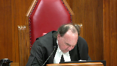
:::

I was afraid for the safety and well-being of the women. Yeah.

And now you're saying, oh, well, you know, he acted in rage.

His defense was, I was acting out of fear, as Justice Casir said to you.

Now you're telling us he was acting out of rage.

And by the way, just by the way while we're on this, because you were putting this in the context of proviso, the trial judge couldn't have given a stronger rolled-up charge on lack of intent, which included provocation by words and all the other things.

You just look at what the trial judge said in his charge.

He's talking now about the difference between intent for murder and, if it's not manslaughter.

If you're satisfied beyond a reasonable doubt when you cause Mr. Kaleef's death, Anthony Alas was not acting in defense of another.

In deciding whether Anthony Kaleef had either stayed of mind to make the unlawful killing murder, you must consider the evidence of Anthony Alas's anger, fear, excitement, instinctive reaction, provoking words, just let me finish, okay?

Provoking words of conduct and consistency of Mr. Kaleef's with a frenzied attack.

You couldn't probably get a better charge on what you are concerned your client was deprived of by the trial judge not leaving the very kind of particular defense of provocation as the criminal code defines it.

And yet this jury came back with murder.

And so they didn't have a doubt on any of this.

Now, really we know that provocation, as you know, allows for a defense where you have the intent to kill, right? Right.

Right, okay.

Right, that's the whole point.

No, no, no, but that's not the point.

You got what you wanted here.

You got a charge that couldn't have been better.

And the jury.

**Speaker 2** (00:35:30): Yeah, except for one thing, the jury came back and they were bothered.

::: {.column-margin}
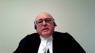
:::

They wanted to know about this issue of intent.

They asked questions about the issue of intent.

They were asking questions with one eye blinded.

Because had they known that it wasn't just an issue of intent, but that even if you found intent, that the rage that the trial judge put to them would ameliorate the murder back down to Mansfield.

I don't know.

**Justice Moldaver** (00:35:58): I don't know how you get to provocation though, when the jury has all this, and they don't come back with manslaughter, how are they going to come back differently on the jury?

**Speaker 2** (00:36:10): on murder because they find that he acted in rage, but he has the intent to kill, period.

::: {.column-margin}
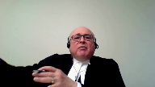
:::

Okay, so in other words, once they find the intent to kill, the rage and everything has nothing to do with this.

And that's wrong in law because it's after you find murder that you then consider why he did it in terms of the four elements of provocation.

**Overlapping speakers** (00:36:40): You don't consider it before you get the murder.

I understand.

**Speaker 2** (00:36:43): respect.

::: {.column-margin}
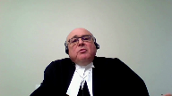
:::

I understand that. Yeah

and so

and so the jury wasn't given the tools to say okay even if we found the intent even if we found that he acted impulsively in that

but he still had the intent because he stabbed him so many times.

Now let's see why he did that.

**Justice Moldaver** (00:37:03): Now you have to get into the technical defense of provocation and the technical defense of provocation on anybody's, everybody was saying it doesn't exist here because there was no acting on the sudden. Yeah.

::: {.column-margin}
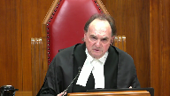
:::

Which is the very thing that the trial judge left to the jury in terms of the manslaughter.

**Speaker 2** (00:37:22): Well, with respect, Justice Moldaver, the whole idea about the suddenness, nobody ever focused on the fact that the punch was made and that he reacted to the punch.

::: {.column-margin}
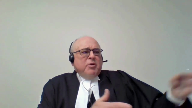
:::

Everybody's talking about, well, was there a transactional connection between what went on in the bar and the cooling off period?

And a few minutes later, there's this argument out in the parking lot.

In other words, what he found out in the bar that made him so angry had somehow a connection to what happened in the parking lot.

No one ever said, wait a minute, why did he do what he did?

He did it because the guy was gonna punch one of the women.

**Justice Moldaver** (00:38:06): had a burning rage that continued on from what happened in the bar he calmed down granted in the sense that he didn't go after him with the pool cue

but he had this inner rage inside him right then and there

**Overlapping speakers** (00:38:22): Okay, NFE.

**Justice Moldaver** (00:38:23): He was on outside to protect the women.

All he had to do was say, let's get out of here, he's coming out.

We can go back to the bar after he gets here.

**Speaker 2** (00:38:30): there.

::: {.column-margin}
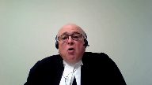
:::

I agree completely, but he stood there and they got into the argument.

He didn't act at all during the argument.

And I went through each step along the way. He did.

That rage never came to the forefront.

**Justice Moldaver** (00:38:49): What are you up to, man, or something, and gave him a look on his own evidence on what he said to the police was a look which was, if you go further, I'm going to jump you.

What is that all about?

Is that acting on the side?

In other words,

**Speaker 2** (00:39:03): I'm going to get into a fight with you if you go if you if you go further if you don't move on.

He didn't say

oh and I'm gonna jump you and stab you.

He wasn't talking about that.

Remember he said I carry that knife for self-defense purposes.

**Justice Martin** (00:39:21): Can we go to the exchange with Mr. McGregor under your tab 12?

::: {.column-margin}
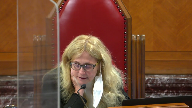
:::

Mr. McGregor says, so defence counsel is saying that he thinks provocation should not be left because of the moving of the knife.

**Overlapping speakers** (00:39:41): Mm-hmm

**Justice Martin** (00:39:41): from the client's pocket.

**Overlapping speakers** (00:39:43): Right?

**Justice Martin** (00:39:44): of my pajamas up to the pocket in my hood

::: {.column-margin}
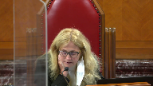
:::

in preparation of something that's about to happen.

I'm on page 1077.

And then this is a submission that's made by council.

To me, this demonstrates a mind consciously aware of something that may occur such that it's not a shock, that it's not on the sudden. So, um,

**Speaker 2** (00:40:06): But that's, and I agree, Justice Martin, I agree completely, except that he goes on to say, it's not a shock under the necessary legal test.

::: {.column-margin}
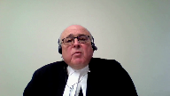
:::

And the legal test that he's thinking of is that the shock has to be such as to vitiate the intent for murder.

That's the whole problem here.

On the, he begins his analysis and says at page 1076, he says, after talking about being notified and so forth, he says there's a cooling off period.

It's insufficient to proceed because he's aware of a potential assault. So what?

And or a violent altercation has a cooling off period and then, and then it doesn't reach on the sudden to establish provocation such that it shocks the mind, allowing the mens rea to be vitiated.

That's the legal test that he is operating under.

And unlike what Justice McPherson said, that he was pressing the judge not to put the defense.

If you look later, he ends off his submissions by saying, unless your honour sees something differently.

And if the trial judge had said to him, look, defense counsel, it isn't a question of whether it shocks the mind in order to vitiate mens rea.

It's whether or not having had the mens rea, you acted on the sudden out of rage and that's where you're at.

Now, do you really not want me to leave that to the jury?

And he said, no, I don't want you to leave it because it undermines my defensive self-defense.

Then I'm with you.

I concede that.

But where, but where there's a clear mistake on the record and the trial judge doesn't fix it

and it's compounded by the crown's analysis, which is at page 1079, where the crown says under the same tab, he says, you're looking at three distinct actions is about line 20, all different.

And that may ultimately have led to the stabbing, the sudden provocation and sudden response.

Looking at the cases, we're talking about firing on an unprepared mind.

When that happens, he does not have an unprepared mind because he already has his hand on the knife. So what?

Other cases, the knife is in the hand and they're coming right at the accused.

Look at Bazzizi.

He stabs an unarmed man who's dropped his knife.

Or Gill where they go out and he goes to the trunk of the car and gets a knife and comes back into the affray.

That's not correct because they're all operating on, on the basis that if.

**Justice Moldaver** (00:42:56): You haven't raised ineffective assistance to council.

::: {.column-margin}

:::

I would have thought based on your submission that if council did not know that the defense of provocation could reduce murder to manslaughter even though there was the intent to kill, I would have thought that would be the first ground of appeal.

You don't raise that.

You don't suggest that he was ineffective.

And so I have to assume he did know the difference and what provocation can do and it was a slip or something.

**Speaker 2** (00:43:34): Well, with respect, it wasn't a slip.

It was, it was just a mistake.

Lawyers make mistakes all the time.

It's not a mistake.

They make mistakes when they make mistakes when they make mistakes when they make mistakes when they make mistakes when they make mistakes when they make mistakes when they make mistakes when they make mistakes when they make mistakes when they make

**Justice Moldaver** (00:43:47): if you don't know that provocation can reduce murder to manslaughter even though you had the requisite intent.

That's not a mistake.

**Speaker 2** (00:43:55): Right, but it's no, it is a mistake, it's a mistake that you make in front of the arbiter of the law, the trial judge.

::: {.column-margin}
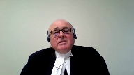
:::

It's a mistake that the trial judge endorses.

And the crown does too.

Because they're all operating on the assumption that it has to vitiate intent. Look.

**Overlapping speakers** (00:44:19): You're telling me that Justice Trotter didn't know the difference?

Is that what you're saying?

**Speaker 2** (00:44:26): I don't know I'm not saying he didn't know the difference.

::: {.column-margin}
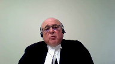
:::

I'm saying that he had counsel in front of him, who were putting a submission to him and it just, he missed it.

He didn't hear that, or if he did he it didn't register.

Whatever happened the point is, I.

What I'm saying is that the defense counsel was not ineffective in the courtroom, the defense counsel just made a mistake, and all the court had to do was step back and ask and clarify, and the court didn't.

I'm not saying Justice Trotter was ineffective people make mistakes.

And unfortunately in this particular case, this accused didn't get a fair trial and got convicted of murder, without any consideration of whether it should be ameliorated down to manslaughter.

And that's the kind of, you know, one of the questions that was asked earlier about when, when does a judge, not put a defense and so forth.

Well, it has to be clear on the record there has to be a valid waiver if it's the waiver is not informed as the Court of Appeal in Ontario said in Quinton if the waiver isn't informed, then it's not a waiver.

If the position taken is not informed, then it's not a valid position.

So, subject to any questions the court has I see I'm just out of time.

Thank you very much.

**Justice Wagner** (00:45:56): Thank you very much.

Any reply, Mr. Warrick?

**Overlapping speakers** (00:46:03): No, thank you, Chief Justice.

**Justice Wagner** (00:46:04): Thank you very much.

::: {.column-margin}
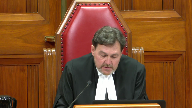
:::

I would ask the attorneys to remain at our disposal.

The court is adjourned.

The question is whether there was an air of reality to the defense of provocation, such that the trial judge erred in failing to put the defense to the jury.

This offense predated the amendment to the provocation provision, which applies to offenses committed on or after July 17, 2015.

We find no error in the trial judge's determination that there was no air of reality to the defense of provocation.

The standard of review for whether there is an air of reality to the defense of provocation is correctness.

The key issue here is whether there is sufficient evidential basis as to the fourth requirement element of the provocation defense that the accused acted on the sudden.

Taking the evidence at its highest for the accused, for present purposes, the subjective element of the test for provocation has not been met.

The accused did not react on the sudden before there was time for his passion to cool.

It is beyond the range of reasonable inferences to say that Mr. Alas' reaction to the deceased making a punching, lunging motion at the woman was on the sudden.

Rather, it was the culmination of an altercation that Mr. Alas both instigated and anticipated.

As he indicated in his statement to the police, A, Mr. Alas was aware that the deceased had an altercation with his friend earlier in the evening, during which the deceased closed a door on her head.

Mr. Alas was so upset about the deceased's conduct that he wanted to hit the deceased in the head with a pool cue.

He cooled down and did not take this course of action.

When his fiancé and friend went outside to smoke, he told them that he would follow if he saw the deceased go outside as well.

Quote, if I see this guy get up and come out, I'm coming.

I'll be right behind him. Unquote.

Mr. Alas observed the deceased preparing to leave the bar.

In anticipation, he went outside to join the two women.

When the deceased came out of the bar, he looked at Mr. Alas' friend.

In response to this look, Mr. Alas responded, unquote, what the fuck is wrong with you?

Do you have a problem? Unquote.

A verbal altercation ensued involving Mr. Alas, the deceased, and the two women.

During the verbal altercation, Mr. Alas retrieved a knife from his pants pocket and moved it to his jacket pocket just in case.

With the knife gripped in his hand, he stared at the deceased.

At his police interview, Mr. Alas said that he stared at the deceased in this way in order to, I quote, let him know like if you do anything, I would jump on you. Unquote.

When Mr. Alas saw the deceased making a fist directed at the woman, he immediately jumped in and stabbed him in the throat, although he said that he wanted to stab him in his chest.

He stabbed the deceased five more times after that.

Accordingly, the appeal is allowed and the conviction is restored.

Thank you.