---
title: Jacob Charles Badger v. Her Majesty the Queen
published-title: Heard
date: 2022-05-16
sidebar: false
---

This transcript was made with automated artificial intelligence models and its accuracy has not been verified. Review the original webcast [here](https://scc-csc.ca/case-dossier/info/webcast-webdiffusion-eng.aspx?cas=['39844']).
---

**Justice Brown** (00:00:03): They're cool.

**Justice Moldaver** (00:00:21): Good morning, everyone.

::: {.column-margin}
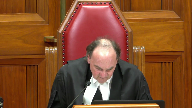
:::

This is the matter of Joseph Charles Badger versus Her Majesty the Queen, Thomas Hines and Zachary Carter for the appellant, and Grace Heshen-David for the respondent.

Yes, Mr. Hines.

**Speaker 1** (00:00:49): Thank you Justice Moldaver and good morning justices.

::: {.column-margin}
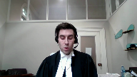
:::

This appeal is about eyewitness identification evidence.

What makes this case a little unusual in our submission is that the identification evidence at issue were out of court statements, spontaneous utterances from the complainant who at trial had said he didn't know who attacked him.

That issue for you today is whether the majority of the Saskatchewan Court of Appeal was correct in holding that the trial judge did not fail to properly evaluate the reliability of the identification evidence in this case.

In our submission and substantially for the reasons of the dissenting Justice, Justice Kalmikoff at the Court of Appeal, we respectfully submit today that the trial judge did not analyze the identification evidence in this case to the extent required by law.

I propose to make three brief arguments for you today about why the trial judge's analysis was lacking and the majority of the Court of Appeal was wrong not to interfere.

But before I do that, I want to make two things clear at the outset.

First, we need to make sure first, we appreciate the evidence of familiarity between Mr. Badger and the complainant in this case.

We understand that was part of the record.

What we're going to disagree about at the end of the day is the extent of that familiarity and whether it completely removed the need to conduct an analysis of the reliability of the identification evidence under the traditional framework.

Second, we also recognize that the trial judge analyzed the evidence of the complainant's intoxication and how that could affect the reliability of his spontaneous utterances.

What we go on to say is that that's not a proxy for an assessment of the reliability of the identification evidence either.

**Justice Brown** (00:03:01): But it was the focus of the submissions on reliability, was it not?

**Speaker 1** (00:03:06): It was the focus, but in my submission, it wasn't the only argument.

It was definitely the focus.

I agree with that.

**Justice Brown** (00:03:14): the argument, I don't really see other sort of indicia of reliability being advanced in any kind of sort of substantial way.

It really was all about intoxication, intoxication, intoxication.

**Speaker 1** (00:03:32): That's the bulk of the argument.

::: {.column-margin}
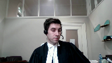
:::

I would respectfully point you, Justice Brown, to pages 164 and 165 of the record, the closing arguments that you'd find at pages 133 and 132 of the trial transcripts, that starting from about lines 32 on pages T332, you've got trial counsel flagging, this is a case about identity evidence, there's no sworn evidence about that, and then it goes on to briefly at page T333, lines 6 to 7, the court needs to be very cautious about identity evidence.

**Justice Brown** (00:04:36): Right, and then we hear all about, well, Shannon raised the most sober person, and then in the next paragraph, and then the next paragraph is, you know, Badger is very drunk, what falls from that, and then the following paragraph didn't give any indication.

::: {.column-margin}
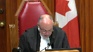
:::

Believe me, Mr. Badger said he did not know people where he was too drunk.

You're right, there's a general statement about reliability, but the particularization of it is, as far as I can tell, entirely, if not almost entirely, focused on intoxication.

**Speaker 1** (00:05:07): Yeah, and that's fair.

::: {.column-margin}
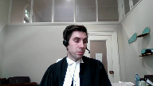
:::

And that's why I raised it at the outset to say that was trial counsel's the focus of the argument.

And my response is to you, Justice Brown, that it's still put out there by trial counsel that identification is an issue.

Identification evidence is as trial counsel put it.

The court needs to be very cautious about it.

So while trial counsel went on to spend the submissions focused on intoxication, I say it's not totally abandoned in terms of an argument about the traditional concerns about identification evidence and the dangers of it, such that.

**Justice Moldaver** (00:05:50): Just before you go on, though, the Court of Appeal majority judgment, of course, paragraph 74, picks up on what Justice Brown just said, or Justice Brown picks up on what they said.

::: {.column-margin}
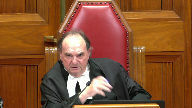
:::

It's not surprising that the trial judge's reliability analysis focused on his level of intoxication, etc.

That was the main argument raised by the defense.

And then, I don't think we can get around this so easy, because when the Crown gave its argument at trial, and now before this Court on appeal, but the Crown took a very different approach and said, look at the circumstantial evidence, look at this piece, look at that piece, look at this one, look at that one, and said, in effect, each one individually can't be given too much, necessarily too much weight, but when you look at the body of evidence, it all goes to support the issue that the identification was that of Mr. Badger, and it was accurate.

Now, I don't see in the reply by the defense at trial, correct me if I'm wrong, there might have been a little tiny bit about all this, the whole theory of the Crown at trial, but virtually nothing.

So, I guess this is a long way to say, can we really fault the trial judge for focusing on drunkenness as he did, when in fact that was the focus?

**Speaker 1** (00:07:24): Well, that's our argument today, that despite arguments from trial counsel and the narrowing of the issue, we do submit the trial judge should have gone on to conduct a more fulsome analysis of identification evidence because of the well-known dangers associated with identification evidence.

::: {.column-margin}
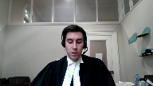
:::

And so, again, I appreciate at the outset that that's the framing of the argument, but in our submission, we'll make three points today about why the trial judge's analysis here was lacking.

Just in a nutshell, where I'd propose to be going would be firstly that recognition evidence is just a form of identification evidence and is subject to the same concerns, that the record didn't provide an adequate evidential basis to evaluate the complainant's bare recognition evidence.

And thirdly, that the external evidence from the complainant ought to have been explicitly considered.

So, on our first point, we say that recognition evidence is just one type of identification evidence, eyewitness identification evidence.

It's not different from eyewitness identification evidence.

It's subject to the same frailties and the same risks.

And those risks are well-known that an honest but convincing witness can simply be mistaken about the identification.

So, in these circumstances where you had these two out of court statements that trial counsel argued were unreliable, the concern was for us that the eyewitness identification evidence is an unreliable form of opinion evidence and that triers of fact can place undue weight on those statements.

In this case, we say that still arises even with the evidence of recognition that the familiarity or the level of familiarity between Mr. Badger and the complainant didn't provide a sufficient basis to not discuss the dangers of eyewitness identification evidence.

**Justice Moldaver** (00:09:43): Well, we know that the complainant was kind of, according to the trial judge, not telling at all, shall we say, a very reluctant witness.

::: {.column-margin}
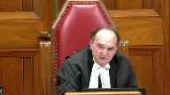
:::

One thing we do know is that your client, Mr. Badger, was wearing the same clothes when he came back on his own evidence that he was wearing when he left no more than ten minutes earlier, in around ten minutes is when the allegation is that the people arrive at the door.

And it just so happens that Mr. Badger claims that he couldn't have been there because he was with a man and a woman.

And lo and behold, who shows up at the door, masked, not the woman, but two men.

Now, you know, you can look at this picture, you can look at things like that, and the fact that Mr. Badger shows up in the yard shortly afterwards, after this is all said and done, the trial judge found that he had opportunity, which again goes to identification.

I mean, it seems to me you've got to look at the package here.

Not only the package, but sort of what it was that the trial judge was asked to focus on and did focus on.

**Speaker 1** (00:11:06): I appreciate that, Justice Moldaver.

::: {.column-margin}
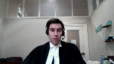
:::

What I'd suggest is that the trial judge did do that to some extent that is reflected more in his analysis on, say, the gunshot residue evidence, but that once he discarded or gave no weight to the gunshot residue evidence, there's nothing sort of beyond that.

The trial judge wasn't relying on, well, he mentions the coming and going, but he's not flagging, say, the clothing that was being worn.

And in our submission, the circumstances that we had at issue here were particularly concerning because they didn't lend themselves well to reliable conditions for observation.

And so that's our concern about the assessment that the trial judge did and we say didn't do about the spontaneous utterances.

**Justice Karakatsanis** (00:12:13): I think it would help me if you could just recap what are the circumstances that you rely on to suggest that the eyewitness identification was not reliable.

**Speaker 1** (00:12:28): So this is a case, Justice Kyrkestanis, where we're relying on the evidence where you had two intruders who were completely masked.

::: {.column-margin}
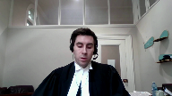
:::

You had a shotgun that was brandished at the complainant at close range.

There is no evidence that the intruders said anything.

You had a, based on my assessment of the record, a brief encounter at the doorway between the assailant and the complainant.

And in my submission, that would undoubtedly had created a pressure-filled, highly stressful situation in which any person in the complainant's shoes would be placed in an extremely difficult situation to make an accurate observation for identification purposes.

So those are the same stressors that make eyewitness identification evidence unreliable so that even though you had evidence that Mr. Badger and the complainant were known to each other, we say that didn't remove the need for a close analysis of the reliability of the eyewitness identification evidence.

And in that respect, we're relying on a line of case law from the Ontario Court of Appeal, in particular the decision of Miller from 1998 that we cite at paragraph 52 of our factum for the proposition that recognition evidence can require the same caution from triers of fact, usually depending on their circumstances.

And in the circumstances of the identification evidence here, you had something fairly comparable to Miller in my submission, where in Miller you had no face masks apparently, a very brief interaction of a robbery from an individual who said that they knew the assailant fairly and reasonably well.

And despite that, because of the other evidence, there was still a need for extra consideration and caution from the identification evidence.

So, thank you very much for your time, and I look forward to hearing from you in the next session, and I look forward to hearing from you in the next session, and I look forward to hearing from you in the next session, and I look forward to hearing from you in the next session, and I look forward to hearing from you in the next session, and I look forward to hearing from you in the next session, and I look forward to hearing from you in the next session, and I look forward to hearing from you in the next session, and I look forward to hearing from you in the next session, and I look forward to hearing from you in the next session, and I look forward to hearing from you in the next session, and I look forward to hearing from you in the next session, and I look forward to hearing from you in the next session, and I look forward to hearing from you in the next session, and I look forward to hearing from you in the next session, and I look forward to hearing from you in the next session

**Justice Côté** (00:14:51): And what about the argument that the Crown is making about, it's part of the circumstantial evidence, the timing and where the accused was when he was arrested.

::: {.column-margin}
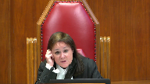
:::

He was still in the vicinity of their house.

Should we not take this into consideration too?

Was the trial judge justified to take this into consideration with the other circumstances?

**Speaker 1** (00:15:18): Yes, I have to concede it was appropriately available to be considered.

::: {.column-margin}
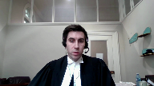
:::

The trial judge did consider it as part of his analysis.

That was one of the two sort of pieces of evidence that he found to be compelling, the first being the spontaneous utterances and the second being the coming and going from the residence.

So we have to concede that that evidence was there.

It was something the trial judge did and could consider, but it remains our position that there were other factors that the trial judge ought to have considered here that bore on the reliability of the spontaneous utterances. Yes.

So just to summarize our first point, the familiarity between Mr. Badger and the complainant didn't remove the need for further inquiry into the reliability of the spontaneous utterances.

And in my submission, respectfully, the majority of the Court of Appeal was wrong to discount those concerns just on the basis of familiarity.

Briefly, on our second point, we say the record didn't provide an adequate evidential basis to evaluate the complainant's bare recognition evidence.

And basically, we're asserting that there is no evidence about how or why the complainant had formed the opinion that Mr. Badger was one of the intruders.

We say this is a concern because the spontaneous utterances that identified Mr. Badger as one of the assailants are effectively opinion evidence, and those opinions required close examination because of the absence of an evidential basis for them directly.

What I mean by that is to say that if an opinion is only as good as the facts upon which it's based here because we had out-of-court statements, there was a lack or a dearth of evidence that went towards the basis for those statements, and they stood on their own out of context.

There was really no answer to the important question in our view, what exactly did the complainant recognize about the assailant that allowed him to conclude that it was Mr. Badger?

And I don't think it's something that's sufficient to just say, well, black clothing and Mr. Badger was said to be wearing similar clothing at the time that he was arrested because the complainant isn't saying that himself.

We also suggest that there ought to be consideration to the complainant's mother, who also had a brief opportunity to observe the masked individuals as they were bursting into the house, but that she had to have no idea about who those individuals were.

So because we have spontaneous utterances, because they're contradicted by the complainant's evidence at trial, they stood on their own as what we'd say were conclusory opinions about identification.

They were what we'd say were bare recognition evidence.

They had no descriptors, no real identifying features, no explanation as to how or why the complainant had come to the conclusion that he did.

And so we say the majority of the court of appeal therefore applied the wrong analytical approach to assessing those spontaneous utterances, effectively determining, as the Crown suggests here, that the complainant must have seen something that allowed him to conclude one of the intruders was Mr. Badger, without a sufficient basis to actually say that.

And our submission is that that analysis effectively puts the cart before the horse, that it's wrong to reason backwards from the utterances are reliable to therefore the complainant must have seen something he recognized, and instead the appropriate analysis would have been to reason from the other direction that is there any anything in the basis for recognition here or is it just bare recognition evidence?

We say the basis for the identification opinion had to be carefully scrutinized in the circumstances and that the majority of the court of appeal therefore erred by reasoning backwards instead of conducting an appropriate inquiry into the evidential basis for the opinion.

So just briefly turning to our third argument, we say that there ought to have been explicit consideration given to the complainant's mother's evidence both as it related to an inconsistent statement and to the potential for tainting.

These points arise out of the same evidence about the statements the complainant was said to have made shortly around the time that the police and EMS services were attending where the complainant is said to be saying something to the effect of where's Jake?

How come he didn't come help me? Sorry.

**Justice Moldaver** (00:20:32): you about that briefly if I can because a lot of weight is put on this, you know, where was Jake at the time.

::: {.column-margin}
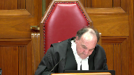
:::

Can you go to T50 of the transcript, please? 11, or the transcript at trial.

I think it's page 145 of the record.

I'm looking at line 9. Yep.

Okay, this is Ms. Shannon Ray giving evidence.

What happened next once the police and the ambulance got there?

So first of all, we're beyond, we're at the police and the ambulance.

Long before, of course, the 911 call goes forward and of course the trial judge noted this in argument that there's no way that could be tainted because there was no talk about Mr. Badger up to that point, but leaving that aside, let's listen to her evidence.

When they got there, everybody was just freaked out.

They're all flipping out and then Jody mentioned, where the hell, where the hell was Jake?

How come he didn't come help me and I said Jake is not here and he goes, well where the F is Jake?

And I go, just listen to this, he just left through the side door right before the people, not.

Now on nobody's version of the evidence, could that have occurred?

And yet here we are putting a lot of sort of eggs in the basket of this so-called what the complainant said to his mother when she's about as mixed up, it seems to me, as anybody in this piece.

And as I say, the trial judge addressed this in closing argument when he said, how do you account for what occurred in the 9-1-1 call?

There was no tainting there.

So it's a long longer question, but you seem to place a lot of weight on this and

and I see it quite frankly as a something that, you know, the evidence on it is so shaky I don't know that you'd give any weight to it.

**Speaker 1** (00:22:42): Well, I disagree with you on that, Justice Moldaver.

::: {.column-margin}
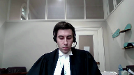
:::

Just to say that it was something that was discussed in closing argument about how it could potentially impact the 911 call and the trial judge recognized that it could not.

But it was still, I'd suggest, evidence that merited explicit consideration, whether it's because the complainant's mother was herself mistaken about something or whether it was the complainant himself who was not as certain as might be said in the 911 call because there's this evidence about, you know, where is he?

How come he's not here to help me?

Which would be odd evidence to give after being attacked and recognizing your attacker as that person to say, how come they didn't then stop and help me?

So the fact that it's not mentioned at all by the trial judge in his reasons, I think raises that concern about whether he's simply discounting the mother's evidence entirely.

I don't think that's a fair reading of the trial judge's reasons or whether the mother's evidence is unreliable or further in our argument about whether there's this inconsistent statement about identification that should have been addressed.

So there's a number of components there.

Our short answer to you, Justice Moldaver, is that the trial judge was required to address it in some fashion if he was going to be saying these things that you're suggesting in your question.

The second part that we flagged that the trial judge didn't address, although he addressed the potential for tainting in respect to the 911 call, there was the potential for tainting in our submission about the second spontaneous utterances that arose after this statement.

So we'd say again that the mother's evidence, given that it raised the potential to place Mr. Badger's name in the complainant's mind, there should have been some consideration given to that in the trial judge's reasons, but the potential that statement had for the bearing of the reliability on the spontaneous utterance going into the EMS vehicle.

So just to summarize our third point here, the complainant's mother's evidence we say was relevant to the issue of identification.

It merited explicit comment by the trial judge.

The trial judge didn't address it.

We say the majority of the Court of Appeal was wrong in seeing no issue with this just on the basis of the exchange with defense counsel on closing argument.

So to summarize our argument, in conclusion, we say the combined effect of these failures on the part of the trial judge raised a legal issue.

We say that presumption of correct application can't save the day here.

Despite the framing of argument, identification was first and foremost part of this case, that the reliability of the spontaneous utterances was a significant issue in this case and the trial judge ought to have more fulsomely addressed the reliability of the identification evidence even as a form of recognition evidence.

So we say the majority of the Court of Appeal was wrong to decline to intervene on this ground and given the dangers of eyewitness identification evidence and the risk that evidence carries, the complainant's spontaneous utterances required special scrutiny in this case.

So we're asking this court to allow Mr. Badger's appeal on this ground in order of new trial.

**Justice Moldaver** (00:26:51): All right, does that complete your submissions?

**Overlapping speakers** (00:26:55): It does.

**Justice Moldaver** (00:26:55): All right.

Well, thank you very much, Mr. Hines.

We'll hear from Ms. Hesch and David, please.

**Speaker 2** (00:27:05): Good morning, Justices of the Supreme Court of Canada.

::: {.column-margin}
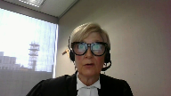
:::

In Saskatchewan's opinion, this is a hearsay case and the appellant is appealing on a very narrow issue.

He is trying to turn a hearsay case involving a reluctant witness into an identification case with evidence given by a well-meaning but mistaken witness.

He states his conviction is unsafe because there was not enough evidence going to the issue of identity.

The majority of the Saskatchewan Court of Appeal were correct in finding that the reliability review on the part of the trial judge was robust and the admission of the utterances into the trial proper provided evidence of identity that was corroborated by significant circumstantial evidence.

The bulk of my submissions today are going to focus basically on what I've provided you in tab one of the condensed book, that is the outline of Saskatchewan's argument.

The respondent submits that on the facts of this case, an instruction going to the frailties of eyewitness evidence is simply not necessary on the facts.

In fact, it's impractical.

The spontaneous utterances were properly admitted during the voir dire and the abundance of circumstantial evidence that followed in the trial proper confirmed the ultimate reliability of those utterances and secured this conviction.

Let's first examine the totality of the evidence going to identity in this case.

When analyzing the proximity of time and place leading to opportunity on the part of the appellant, it is important to focus on the timeline which can be gleaned from the record.

And Saskatchewan has taken some effort to try and reveal this through the contents of the condensed book.

Tab two of the condensed book contains excerpts from the transcript.

Roughly ten minutes before the shooting, the appellant had been in the house.

He had been watching TV with the complainant's mother and sister.

The complainant was in another bedroom of the house with his girlfriend, but he was just a few feet away.

Paragraph ten of the trial judge's voir dire ruling noted that the appellant had been focused on his cell phone just before he suddenly announced that he had to leave.

Tab three of the condensed book contains the evidence of Shannon Ray, the complainant's mother, and she testified that only a few minutes later, possibly five, the knock came to the front door of her house.

The next important point in the timeline was the first spontaneous utterance which the trial judge put roughly at 3.23 a.m. and this occurred during the course of the 911 call.

So it was all transcribed and recorded.

The trial judge put the second utterance at 3.45 a.m.

We review this timeline because sometime before 3.45 a.m.

police constable Manz found the appellant at the south side of the house.

The appellant was in distress.

Tab two, and actually it's page four of the condensed book, has the evidence of police constable Manz on this point and Saskatchewan submits this evidence is important because constable Manz puts the sighting of the appellant as early as 3.30 in the morning, just seven minutes after the shooting.

He called the appellant over, he noticed the appellant was crying or had been crying, he noticed what looked like blood on his running shoes, and he arrested the appellant for a weapons offense.

Once again, this evidence puts the appellant at the side of the house as early as seven minutes after the shooting.

The second spontaneous utterance occurred at 3.45, just 20 minutes after the shooting, as the appellant was being escorted by the police, passed the complainant in the ambulance.

The timeline contains crucial evidence of opportunity and proximity, and the trial judge made those findings in paragraphs 33 and 35 of the trial, and Saskatchewan has provided that in tab five of the condensed book.

**Justice Karakatsanis** (00:31:13): I'm sorry to interrupt because I don't think anybody's saying that the trial judge didn't consider circumstantial evidence or that his finding of admissibility about the spontaneous statements was incorrect.

::: {.column-margin}

:::

The argument here I think is a very specific one, which is simply whether the judge considered the reliability of the eyewitness identification evidence.

What counsel puts to you are just a number of factors which he says the trial judge should have considered.

They're significant enough that they ought to have been mentioned.

We're talking about the fact that it was a brief opportunity, that it was silence, it was in a brief stressful circumstance, that there were no details at all either about the characteristics of the person or about the circumstances in which the observation was made, that the mother had briefly observed the individuals and didn't recognize them, and that of course that statement that we were just taken to where Jody asks, where is Jake?

Why didn't he help me?

Where is he?

Those are the factors that are put to you to say they went to the frailties of identification evidence, and that is something that the trial judge ought to have addressed and didn't.

I'd like to hear you on that.

I accept that there is a body of circumstantial evidence, and I don't think that anybody's disputing that.

**Speaker 2** (00:33:01): Thank you, Justice Kara Katsanis.

::: {.column-margin}
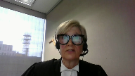
:::

Yes, I will continue on because I do want to address the issue of the masking because I think that's crucial up front and centre.

And I will say that the evidence at the trial was that the attackers were masked.

And in fact, Sharon, Shannon Ray testified that they were masked to the eyeballs.

And Saskatchewan submits that one thing our experience with the pandemic has made abundantly clear is that if you know someone and they are masked and if you've just seen them a few minutes earlier in the day, it's likely that you could recognise them.

**Justice Karakatsanis** (00:33:35): giving testimony, you're giving testimony to the wrong person.

I have trouble recognizing people who are masked, but don't give testimony, please, on that point.

**Speaker 2** (00:33:44): All right.

::: {.column-margin}
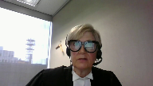
:::

How about the fact that the complainant and the appellant fought over a loaded firearm?

So Saskatchewan submits that there's a good chance that the identity of the attacker was revealed in the course of that struggle.

Further, the complainant and the appellant, they knew each other and the appellant had been at the same house in the early morning hours just before the attack and the complainant addressed his attackers during the course of the struggle.

We have that evidence from Shannon Ray and he demeaned them.

He called them little bitches and he called them that for bringing a gun to the fight.

So why is that important?

Because there's no names, absolutely not.

But there's, there's a, it's telling.

Saskatchewan submits that that comment is telling because there's an agreement or there's an admission of a fight in existence.

And so there's something going on that we don't know about that would lead to knowledge on the part of the complainant.

Now, court's indulgence.

Now, also Saskatchewan submits to this court that we cannot forget that the trial judge had rejected the appellant's alibi and while this is by no means evidence that goes to identity, it needs to be mentioned as Justice Moldaver has already pointed out.

The evidence of the appellant differed significantly from his original statement to the police because in his evidence on the stand, he stated he met up with two people, a man and a woman, Belinda Stanley and Charles Weypan and he testified that these two people accompanied him back to his house where they had a visit.

But both the complainant and the complainant's mother testified that three people came to the door during the early morning hours and tab three of the condensed book contains this excerpt from the trial.

The original statement given to the police upon the appellant's arrest just involved the appellant going straight home.

So the inconsistencies in the appellant's evidence led to a rejection of the alibi but the fact remains that when he took the stand to defend himself, he made it admission that he met up with two people, a man and a woman and this does fit the description of the number and sex of the individuals who came to the door that morning.

Mr. Weypan had...

**Justice Moldaver** (00:36:04): Mr. Whoppen had been at the house earlier.

That's right.

I understand that, right?

**Overlapping speakers** (00:36:10): one other question I have.

**Justice Moldaver** (00:36:11): As I understand it, the mother, Shannon, made a lot of money at the casino that night.

Is there any evidence?

Do you know how much it was?

**Speaker 2** (00:36:20): No, Justice Moldaver.

I don't believe there was any evidence on the record, but she had been successful.

You're absolutely right.

**Justice Moldaver** (00:36:26): And there's no evidence, I take it, that the appellant would have known that when she came home that she'd had a very successful night at the casino.

**Speaker 2** (00:36:37): There's no evidence of that.

::: {.column-margin}
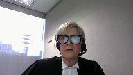
:::

There's no evidence that the appellant and his friend Brandy, who was Shannon Ray's daughter, and Shannon Ray were all together in one room watching television just before he left.

But you're correct, there's no evidence on the record that he would have known that.

And that, of course, had there been, that would have gone to motive, but no, there's no evidence of that.

At the end of the day, this was not an eyewitness identification case involving evidence of a fleeting glance.

This case involved an entirely different fact situation.

This case involved a reluctant witness who was not being forthright with the court.

Tab five of the condensed book contains the quote from the Queen and BKG, where this court noted that central to the reliability determination in a fact situation like the one before you now, the trial judge has an ability to observe the complainant and to ascertain his demeanor while testifying.

The trial judge had the complainant before him, which assisted in his assessment of the complainant's credibility.

As the majority of the Saskatchewan Court of Appeal pointed out in paragraph 35 of their ruling, and again, that's in tab five of the condensed book, many of the reliability concerns in an eyewitness identification review are similar to the review required by the traditional hearsay exception.

Now, the trial judge conducted a thorough examination of the reliability factors in connection with the spontaneous utterances.

The respondent has provided all of the conclusions at tab eight, all of the trial judge's conclusion at tab eight of the condensed book.

At the voir dire phase, counsel for the appellant was solely concerned with the issue of intoxication.

The test provided for in the Queen and Rattan and its progeny allows for a focused review of the utterances in order to guard against the possibility of mistake, misrepresentation, motive to lie, and falsification.

This test provides for an assurance of reliability.

The requirement of contemporary entity mandates that the overwhelming events still predominate the mind of the declarant.

The traditional test also requires that the trier fact review the facts to ensure that there is little possibility of concoction or fabrication.

Where the spontaneity of the statement is clear and the danger of fabrication is remote, the evidence should be received.

The respondent has provided the tests set out by the trial judge in tab seven of the condensed book and his conclusions in tab eight.

Having admitted the utterances into the trial as evidence and on the basis of the circumstantial evidence already spoken of this morning, the trial judge convicted the appellant and the majority of the court of appeal found the conviction to be on solid ground.

Now in tab 12 of the condensed book, the respondent has included paragraphs 74 to 76 of the majority of the Saskatchewan court of appeals decision.

These three paragraphs addressed the pink elephant in the room, the complainant's question to his mother right after the first spontaneous utterance, where the hell was Jake?

How come he didn't come to help me?

The majority noted that the trial judge was aware of this piece of evidence and in fact, defense counsel discussed the issue with the trial judge in her closing submissions.

Making use of the timeline once again, this comment occurred after the first spontaneous utterance.

Tab 11 of the condensed book provides the excerpts from the transcript showing this fact.

It must be remembered that this comment on the part of the complainant occurred shortly after he had been shot and as he was being treated for his wounds by the emergency response team, he was losing blood.

The trial judge did not believe this comment to be of significant probative value.

The trial judge was aware of this evidence.

He questioned appellant's counsel about it in closing submissions.

He asked counsel when the comment arose in the timeline and it was clear from the record that the trial judge was aware that the comment arose after the first spontaneous utterance and prior to the second.

The respondent submits that the trial judge did not believe that this piece of evidence had great value and as such, he did not need to explain the inconsistency in his reasons.

A trier of fact can accept all, some or none of a witness's evidence.

And this piece of evidence came not from the complainant in his testimony at trial, but from the complainant's mother.

The transcript excerpt was reproduced by the majority of the Saskatchewan Court of Appeal in their ruling and it's provided in tab 12 of the condensed book on pages 21 and 22.

The trier of fact is in a unique position to see and hear the evidence of the witnesses.

Findings of credibility may be made with regard to other evidence in the case and may require some reference to contradictory evidence.

What is required is that the reasons show the trial judge had seized the substance of the issues.

In this trial, the trial judge had concerns with the credibility of not only the complainant, but the appellant as well.

When it came to where the hell was Jake comment, the trial judge was not required to enter into a detailed account of this piece of evidence since he had obviously decided it was of little probative value and similar to the inconsistencies in the evidence of the sexual assault victim in the Queen and MER, which is provided in tab 12 of the condensed book.

Now at the commencement of these submissions, the respondent submitted that the central issue in this case is the admissibility of hearsay because of a witness that was less than forthright.

It's not eyewitness identification evidence.

By the time of the trial, the complainant claimed that he had no memory of the shooting.

He could remember events in great detail up to the point of the knock on the front door of his house just prior to the shooting.

But after that, he testified he was either too drunk to remember or he had no money or both, or memory or both.

The trial judge found it odd that the complainant could remember in exact detail just the number of drinks he'd had that evening and how much he'd had to smoke, but he could remember nothing after he opened the front door of 1936 Winnipeg Street.

The trial judge found the complainant to be reluctant and this was a finding effect on his part.

And Saskatchewan submits it is one of the central findings of this case.

Tab 10 of the condensed book provides the trial judge's rulings on that very issue, both from the voir dire and in the trial proper.

The importance of this finding simply escapes the appellant.

The suggestion of witness contamination or mistake, which are important considerations in eyewitness identification cases, those considerations are not relevant on the facts of this case.

This was not a case where a well-meaning but mistaken witness provided identification evidence after a one second fleeting glance.

When the trial judge found the complainant to be reluctant, this was to say that the complainant knew the identity of his attacker, but he was reluctant or would not do so, would not commit that evidence to the record.

The complainant was not cooperative and identification in this case has to come through the spontaneous utterances and the circumstantial evidence at the end of the trial.

Hence the resort to hearsay and the traditional exception to the hearsay rule.

Tab 13 of the condensed book provides an excerpt from the trial record, which suggests it was impossible for the complainant to have been subject to identification contamination.

To begin with, the first utterance was spontaneous and not the result of a leading question.

Second, when the family was showing the police the Facebook page of the appellant, they were all in the Northwest bedroom of the home.

The appellant was being treated by the emergency response team in the Northeast bedroom.

In essence, the complainant was always isolated from the rest of the family when the family discussed Jake from State Farm with the police and the respondent, when the police and the respondent were together.

Excuse me.

Respondent asked the rhetorical question, how could the complainant contaminate himself?

Now, since adopting the principled approach to hearsay, this court has confirmed the continuing relevance of the traditional exceptions to the hearsay rule.

The respondent has provided this court's instruction in the Queen and Star at tab six of the condensed book.

At trial, the common law exception was never challenged and it has never been argued that this is one of those rare cases alluded to in Star where the appellant has indicated from the beginning that the traditional exception analysis does not provide a sufficient guarantee of reliability such that the principled exception must apply.

In fact, at trial, the main thrust of the appellant's argument against the reliability of the utterances was the issue of the complainant's intoxication and that ruling on the part of the trial judge has never been challenged.

The appellant has not found fault with any aspects of the trial judge's ruling under the traditional exception to the hearsay rule.

He is simply requesting that this court modify the rule in this case to include a further requirement, a self-instruction on the frailty of eyewitness identification evidence.

Further, the appellant does not specify whether this instruction should occur at the threshold admissibility for deer phase or at the end of the trial.

Ms. David?

**Justice Karakatsanis** (00:46:51): Can you help me?

::: {.column-margin}

:::

I'm still struggling to understand why the fact that this is hearsay and that it was admitted as hearsay, why that would in any way alleviate the necessity to be satisfied that the identification evidence, which is admitted as hearsay evidence, still has to be not just sincere, but it also has to be reliable.

So I'm just struggling to understand why the fact that it's hearsay changes the need to be satisfied about the reliability of the identification evidence.

Whether it's hearsay or not.

**Speaker 2** (00:47:38): Sorry, I'm not saying for a second that because it's hearsay that we shouldn't be concerned about its reliability, that is certainly not what Saskatchewan is submitting.

::: {.column-margin}

:::

What we are submitting is we're in a situation where it had to be hearsay because the witness was reluctant and in a perfect case where we could have further identification such as the words were spoken, a timbre of voice was ascertained, the clothing was detailed.

That would be wonderful in a perfect situation, but we all know that in criminal law we don't have perfect situation and we don't have perfect facts and we take our cases as we get them.

So in this particular case, what the respondent is saying is that what we had was a difficult witness, we had his utterances and then we have to go to the reliability of the circumstantial evidence and all told the trial judge felt that it was reliable.

**Justice Brown** (00:48:37): I guess ultimately the question is whether it was all told and that's the issue, right?

**Speaker 2** (00:48:41): Your friend is putting forward to you that it wasn't all told, it was some told.

::: {.column-margin}
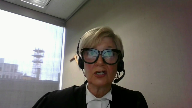
:::

That's correct, Justice Brown.

That's exactly right.

Now, my closing paragraph.

The respondent submits this proposed modification that he is requesting is illogical and unnecessary.

This was not an eyewitness identification case, and as such, this further requirement as requested by the appellant adds a layer of scrutiny that only serves to muddy any legal analysis that must be performed, and Saskatchewan humbly refers you to the wording of the majority of Saskatchewan Court of Appeal who are of this same opinion.

So, thank you for your kind attention and consideration, and the respondent, the province of Saskatchewan requests that you dismiss this appeal.

**Justice Moldaver** (00:49:39): Is there any reply, Mr. Hines?

**Overlapping speakers** (00:49:43): No, no reply.

Thank you.

**Justice Moldaver** (00:49:44): All right, thank you.

The court will rise now and I would ask counsel to maintain, to remain available to us.

Okay, thank you.

**Speaker 1** (00:50:46): Thank you.

**Justice Moldaver** (00:50:51): First, I want to thank Council very much for their submissions.

::: {.column-margin}
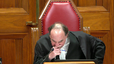
:::

We have been able to resolve this matter, and I will give the reasons of the court.

A majority of the court would dismiss the appeal, substantially for the reasons of the majority of the Saskatchewan Court of Appeal.

Justices Kerikatsanis and Martin would allow the appeal, substantially for the reasons of the dissenting judge of the Court of Appeal.

Thank you very much.