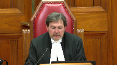
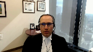
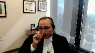
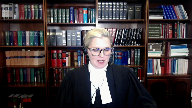
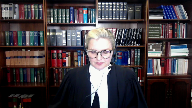
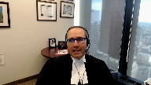
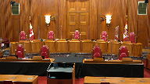
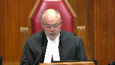

---
title: Syed Adeel Safdar v. Her Majesty the Queen
published-title: Heard
date: 2022-05-18
sidebar: false
---

This transcript was made with automated artificial intelligence models and its accuracy has not been verified. Review the original webcast [here](https://scc-csc.ca/case-dossier/info/webcast-webdiffusion-eng.aspx?cas=['39629']).
---

**Justice Wagner** (00:00:03): The court, let go.

::: {.column-margin}

:::

Thank you, be seated.

Good morning, everybody.

In the case of Syed Adil Safdar against her majesty, Her Majesty the Queen, for the appellant Syed Adil Safdar, Mr. Nader R. Hassan and Caitlin Milne, or Milne, I'm sorry, for the respondent Her Majesty the Queen, Tracy Koslowski.

Please note that Justice Martin participates also in this hearing.

Mr. Hassan.

**Speaker 1** (00:00:56): Thank you, Chief Justice, justices.

**Speaker 2** (00:01:00): This is an unusual case, one that is unlikely to repeat.

::: {.column-margin}

:::

The defendants here did not set out for an 11-B stay.

All three of them fought for an acquittal, as is their right, and two of them eventually were acquitted.

But despite doing everything they could to move this case along, delay upon delay racked up mid-trial.

Eventually, the defendants deemed it necessary to bring an 11-B stay application, which they brought before the trial was over.

The trial judge, Justice Goodman, who had the benefit of watching this trial unfold during the course of a calendar year, granted the 11-B stay.

The crown appealed, and during the appeal period, this court decided KGK, which had the effect of reducing net total delay.

The Ontario Court of Appeal granted the crown appeal on that basis, and that basis alone, holding that net delay was 29.25 months rather than 32 months.

We say, among other things, that this was an error.

I'll be making three submissions on why the Ontario Court of Appeal erred in granting the crown appeal from the 11-B stay.

Now, given the limited time today, I'm going to go in a different order from our factum, but I will follow the order of the submissions set out in our condensed book, if you have that handy, justices.

The argument outline is at tab one of the condensed book or page five, if you're following in the PDF document.

So the points I want to make today, justices, in this order are, first, there are several discrete errors that the trial judge made in calculating delay, which the Ontario Court of Appeal failed to correct.

And correcting any of these errors will result in a net delay over the 30-month ceiling, regardless of what this court does in relation to the KGK correction.

Second, even if we are wrong and the Ontario Court of Appeal is right in that we are a hair or a shade under 30-month ceiling, this is a clear case where the defense has discharged in our submission its onus of establishing an under-the-ceiling delay.

And third, time permitting, I do want to address the KGK correction.

The Court of Appeal's correction to net delay based on this court's decision in KGK was excessive.

While it was appropriate, given KGK to take some time off from net delay, the Ontario Court of Appeal erred in taking too much time off.

I'll turn now to our first submission.

And I just want to say at the outset, Justices, that the trial judge's assessment of the 11B record and the 11B analysis, for the most part, was sound.

And contrary to a suggestion made by the Ontario Court of Appeal, we don't challenge the trial judge's underlying factual findings.

For the most part, those findings are unassailable.

However, the trial judge made three, we say, three legal errors in characterizing certain time periods, which while limited in the grand scheme of things, do have a material impact here.

And the first error we say is that the trial judge erred in subtracting the entire May 8, 2017, to September 18, 2017 period, and characterizing that entire period as defense waiver.

May 8, 2017 was the first trial date offered, a trial of six weeks commencing May 8.

The next available, which defense were not available for, that is granted.

The next available trial dates were in September 2017.

And the trial judge subtracted that entire period, 4.3 months, as defense waiver.

But there wasn't defense waiver.

This court has repeatedly said that waiver, while it can be explicit or implicit, must be clear and unequivocal.

It must be done deliberately.

Now, the defense accepted that it was unavailable on these initially offered dates and bears responsibility for part of that time period, but not the whole time period.

And that has been our position throughout justices.

**Justice Brown** (00:06:28): Mr. Hassan, is there anything on the record that tells us whether defense counsel could have been ready at any time before September 2017?

**Speaker 2** (00:06:38): Justice Brown, unfortunately the record isn't great on that, and I want to be candid about that.

**Justice Brown** (00:06:46): I just wanted to make sure because that's how I sort of read it as well, but I might have been missing something

Yeah, it's your point.

That's not the end of the analysis.

I understand

**Speaker 2** (00:06:56): But I, and I thank you for for pointing that out justice Brown and I think, in hindsight, we could have been better about making that clear on the record.

::: {.column-margin}

:::

Having said that I think it's common ground is between all the parties.

And it's it was not an issue in the courts below that the court was not available from for for trial dates commencing in June, July, August, that is until September, and our position is not withstanding the fact that we didn't pepper the record with the dates that we were available within that period, given that the Jordan framework says that defense delay is delay solely caused by the defense.

Then our position is that this is a mix of institutional delay and defense delay here and that's how it should be.

It should be treated.

Just to be just to make the point that there wasn't a waiver in front of of justice Goodman tab 12 of our condensed book which is page 354 if you have it there.

This may be where the confusion came from

but I think when you look at the language it's also clear that we weren't waving that period at the bottom of the page.

The first available trial dates were offered were May, June, the next available six week block that were offered were September, October, there were no earlier dates.

Post June prior to September being offered.

However, I've included that entire four month period in for the purposes of our calculation in the event that the crown is successful in persuading you that the entire four month block ought to accrue to the defense.

So there there's so there's no waiver there.

There's an acknowledgement that the defense should be responsible for the defense.

There's an acknowledgement that the defense should be responsible for some, but not all of that period and then a further argument in the alternative that even if you attribute the whole period to the defense, we're still over the ceiling and what the defense was simply trying to do there was to explain the position of at least 4.3 months and trying to be fair to the law.

And to be fair to the law because back in in 2018 the law was probably less clear than it is today about how you figure out quantum of defense delay when the defense is unavailable for the initial block but the court doesn't have availability in further until much further down the road.

I do think that the law is clear today and that we're on firm ground in arguing that the defense bears responsibility for some but not all of that 4.3 month period.

So our position is that defense is responsible for that initial six week period, but the remaining 78 days between the May and September trial dates ought not to accrue to the defense.

And I think that is entirely consistent with this court's recent decision in Boulanger.

In that case, as you'll recall, there was a need to schedule additional trial dates, defense was unavailable until June 1 2019.

But the date that the court made available was June 10 2019 and the court held that defense unavailability until June one should not mean that the entire period.

From June one to September 10 should accrue to the defense and the court in that case took a contextual approach based on the specific procedural history of that case and held that it would be fair and reasonable to a portion responsibility equally to defense delay and and institutional delay for that period.

So for that period between June and September, the court halved the period and applied half of that to defense delayed.

So our view is simply that that in a contextual approach here is similarly warranted.

The court's decision in that case would be ought to be chalked up to institutional delay and in our respectful submission.

The Court of Appeal doesn't really deal with this issue.

In a bear too short paragraphs, paragraphs 44 to 45 of that decision, without engaging in this analysis, and simply saying it was open to the trial judge to conclude that the defense had waived that that this period would had been waived by the defense or caused by the defense, but doesn't say how or why.

And of course defense waiver and defense cause delay are two different things.

So we submit that that failure to engage and the failure to deal with this issue was in fact an error by the Ontario Court of Appeal and that this court should conduct that analysis afresh.

The next error that I would like to address justices is perhaps even even more straightforward.

It deals with this court, sorry this not this court, Justice Goodman's analysis of the discrete exceptional circumstances and having found a net delay over the ceiling, Justice Goodman went on to to conduct an analysis to determine whether any of the discrete exceptional circumstances invoked by the crown were warranted.

And what Justice Goodman did was he deducted under the discrete exceptional circumstances framework, two months, the months of from January 15 2018 to March 26 2018.

As a result of Crown Council's illness during that period.

There are two aspects to that delay during that period.

Number one is the delay as a result of the crowns illness, leading to the loss of the four scheduled trial dates during the week of January 15.

The second aspect of the delay is the delay as a result of limitations in court resources the period from January 22 to March 26 when the trial resumed.

Now that first period of delay attributable to crown illness the one the last one week of hearing time.

That's directly related to the discrete exceptional circumstance and it's appropriately deducted from net delay.

The second period of delay, however, was not caused by Crown Council's illness, and was solely a function of the courts institutional scheduling limitations and curiously, Justice Goodman does acknowledge this in his reasons, and I would take this if you may to paragraph 144 of Justice Goodman's reasons it's, it's also page 55 of the condensed book, which is the Justice Goodman's decision on the 11 be application, and he writes, there were no additional court time.

There was no additional court time available and institutional delay after the week of January 15 meant the next scheduled trial date was not until March 26 2018.

But despite this finding a fact he goes on to subtract that entire two month period.

If it's institutional delay, as he seems to acknowledge, then it's not delay caused by the discrete exceptional circumstance.

Moreover, it's, it's not merely institutional delay it's institutional delay that was going to happen anyways.

The next two weeks were set back in October, and we're going to be needed regardless of whether or not Crown Council had fallen ill during the week of January 15, even if he had remained, and we had sat that entire week.

We still have been put over to March 26.

So, the, the discrete event really had no impact on the matter, going over to March 26, it is not appropriate in our respectful submission to treat a period of delay that would have occurred anyway, because of institutional delay as defense delay and I would, I would suggest that this situation that I'm describing now is highly analogous to what occurred in this court's decision in in Cody in Cody the court deducted time for a discrete exceptional circumstance.

The arrival of new McNeil disclosure that couldn't have been predicted that interrupted the trial and that new McNeil disclosure caused an adjournment of five months, but in undertaking the discrete exceptional circumstances analysis.

This, this court only deducted two months, because this court reason that two months was the time that would have been required to respond to and prepare in light of the new McNeil disclosure, and the other three months that had caused that delay were were only limitations on the court system and I don't want to take you to the passage but the relevant sections in Cody, in which this is discussed our paragraphs 54 and 55 of this honorable courts decision.

And the same approach out to apply here, the time to respond to Mr. Levy's illness was one week.

And the rest of that time is institutional delay.

And again, the Court of Appeal doesn't really deal with this argument at all except in a holy conclusory fashion at paragraph 54 of its decision where the court simply says it was open to the trial judge to deduct two months, and we say that this was an error.

And again, even if this is the only argument that this court were to give effect to the restoring those two months would again put the delay back over the Jordan ceiling.

The next significant error that I do want to briefly discuss is the inaccurate the inaccurate trial time estimate.

The trial judge deducted four whole months on account of the discrete exceptional circumstance of the trial going longer than was expected.

It was originally set for six weeks already a very long time but it ended up going several weeks more with the delay spread out over nearly a full calendar year and the trial judge treated that delay as a discrete exceptional circumstance and deducted four months from that delay and we say that was an error.

Now I acknowledge that the Supreme Court in Jordan has specifically addressed discrete exceptional circumstance of inaccurate trial estimates and acknowledge that at paragraph 73 that this could be a discrete exceptional circumstance but it was not necessarily so.

And at paragraph 74 this court said that the focus should be on whether the crown made reasonable efforts to respond and conclude the trial and under the ceiling and any portion of the delay that the crown and system could reasonably have mitigated may not be subtracted.

And I would note that in Jordan itself.

There was an inaccurate trial estimate with respect to the preliminary inquiry and this court didn't deduct any time from that delay on account of that inaccurate trial estimate because it held that there was more that the crown and the system could have done to mitigate that delay.

Now, in rejecting our submission on this point at the Court of Appeal the Court of Appeal says, really says that the both parties dispute the trial judges factual findings regarding the rules of each side and prolonging or streamlining the trial.

And that's not true at all.

Never has been, we accept all of the trial judges findings of fact on this point.

We say the logical implication of the trial judges findings is that deducting four months is excessive and unreasonable.

And that's it's the characterization and the four month deduction that that we find problematic and that's for two reasons justices.

Firstly, only a small portion of the delay is attributable to the inaccurate time estimate the original time estimate was six weeks.

The trial ended up taking 45 days, which is 15 days more than what was estimated But it was 15 additional days spread out over a full calendar year.

So the vast majority of that time was a function of the court's inability to offer earlier dates after those initial October dates had expired.

We were over to January, then we're over to March, then we're over to June, then July, then August, then October, with a few days scattered throughout.

So that's one reason that the most of the long time period is a function of institutional limitations.

And second, and importantly, this is not a situation where the Crown did what it could to minimize that delay.

To the contrary, and consistent with the trial judges findings, the Crown's approach in this case tended to exacerbate the delay.

And I'm not asking this court to make new factual findings in that respect.

I'm asking this court to rely on the trial judges findings of fact in that regard.

The operative paragraphs are paragraphs 176 to 181 of Justice Goodman's decision.

That's page 56 of the PDF.

In the condensed book.

Paragraph 176, the trial judge says, there were occasions where I questioned in my own mind, how some of the evidence deduced by the prosecution was material to the live issues.

And that the trial judges, that the Crown's approach at trial which evolved eliciting evidence on minutia or items of questionable relevance resulted in excessive or superfluous testimony at trial that tended to elongate these proceedings.

He goes on to contrast the actions of the Crown in that case with those of the defense and goes on to conclude at paragraph 181 that it was the defense that bore a disproportionate burden in trying to move the case forward.

This is not a conclusion that a trial judge makes lightly and the trial judge was there every day for that trial, we saw what was going on, and he knew that the defense wasn't playing for delay.

He knew that the to the contrary that the defense wanted to get things moving along the defense wanted an acquittal and they wanted an efficient proceeding.

And just as Goodman's comments were well founded it was based on the record and we set out in our fact them and I'm not going to take you through them now, all of the various things that Crown Council had done that tended to elongate the proceedings, and all of the things also that the defense did to streamline proceedings, including making a lot of concessions which did away with a number of Crown witnesses and conceding voluntariness not bringing a single pretrial application prior to trial.

In light of those factual findings that Justice Goodman made our view is that it just doesn't make sense to deduct four months on account of the trial going longer than it should have gone.

Given that the delay is a function of its limitations on institutional resources and the conduct of a party, other than the defense, which had the effect of elongating the proceedings.

And by the record, one cannot claim that the delay was unavoidable or unforeseeable, or that crown, the crown did everything that it could, or everything that it reasonably could to attempt to mitigate that delay and the trial judge doesn't really engage in that analysis, despite his factual findings and we say that is an error and an error that the, the Court of Appeal failed to correct.

The last point I want to make here justices before I sit down is, is that the trial judge didn't address under the ceiling delay, having found an over the ceiling delay, so the Ontario Court of Appeal had to consider it.

The Court held we didn't meet make that threshold.

Jordan says that where the delay falls below the presumptive ceiling, we must show that the defense took meaningful steps to demonstrate a sustained effort to expedite proceedings, and that the case took markedly longer than it should have.

The appeal's reasons at paragraph 66 suggests, though the court doesn't quite say it explicitly but suggests based on the trial judges factual findings that the defense could establish the meaningful steps prong of the test, but that we hadn't satisfied the court on the, the markedly longer prong of the test.

That analysis is that paragraph 68 which I would ask the court to consider a paragraph 104, sorry page 104, paragraph 68, page 104 of the condensed book paragraph 68 of Justice Goodman's decisions.

What Justice Feldman on behalf of the court says is that the, that the, the, we fail on the first requirement that the trial took markedly longer than it should have.

This was a difficult case of alleged very serious domestic abuse involving three defendants in the significant medical dispute that required voluminous disclosure of medical records was supposed to take six weeks to try but took another three weeks and circumstances, where the initial number of witnesses was significantly reduced.

I just like to break that down for a moment.

This was a difficult case involving allegedly serious domestic abuse.

These features even if true do not suggest why it should take as long as it did.

And recall that Jordan says that the seriousness or gravity of an offense cannot be relied upon to justify delay.

The fact that there are three defendants.

Yes, there were three defendants but the offenses were relatively straightforward.

The allegations weren't complicated.

They were acts of violence.

Moreover, one of the three defendants was was self represented and didn't say anything at all during the trial for the other two the two sets of counsel conducted a joint defense and there was very little duplication of efforts.

There was significant medical dispute that required voluminous disclosure of medical records that that's true that there was significant disclosure.

But the most significant tranche of disclosure was provided to the defense.

After the trial had begun the medical records of the complainant that were provided prior to trial were 200 pages long.

After the trial had begun, we received the completed medical records of nearly 2000 pages, as the the trial judge and in the 11 be decision sets out, and indeed that was the most significant tranche of disclosure that we received at all.

During this trial.

Justice is that this was a more complex case than most domestic assault trials, but this trial was 45 days long and that's a very long time, many complex fraud trials begin and end in less time than that many project cases begin and end in many in a shorter time than that.

And again, this wasn't just 45 days, it was 45 days spread out over a full calendar year.

Justices I see that my time has has come to an end.

With respect to the KGK submission, I would propose to rely on my fact them, barring any questions, those are my submissions.

**Justice Wagner** (00:30:30): Thank you very much.

**Speaker 3** (00:30:36): Good morning, Justices and Chief Justice.

::: {.column-margin}

:::

If you please the court, I'll be referencing the Crown's condensed book in making my submissions this morning.

And I would begin with where my friend ended, with respect to KGK and this court's recent decision in JF.

And I firstly take the position that applying this court's recent decision in JF, that the appellant ought not be permitted any further consideration as to trial delay, as he did not bring the application until after the trial was over.

And the JF decision is exerted at tab five of the Crown's compendium.

And in it, this court emphasized the obligation to bring an application with diligence once the delay issue crystallizes.

And I make reference to paragraph three of the decision, which indicates, quote, an accused who believes their right to be tried within a reasonable time has been infringed must act diligently and apply for a remedy before their trial is held.

However, an accused may exceptionally, in some circumstances, be justified in bringing such an application late.

The court goes on to note that lateness in raising delay is contrary to the proper administration of justice, because it's wasteful of judicial resources.

And I'm paraphrasing, but that sitting on a claim does not allow the Crown to attempt to proactively take measures to mitigate against that delay.

There is a duty in this regard.

And I quote, it is generally recognized that an accused who raises unreasonableness of delay post-trial is not acting in a timely manner.

It is also confirmed that even where the issue arises mid-trial, the accused still must be proactive in bringing the claim.

And I note as well, significantly, this court's endorsement of Justice Arbor's holding in Rabah, that while not dispositive of whether there has been waiver, that to bring an application after the trial is over will, quote, generally be fatal to any claim that may arise under section 11B of the Charter.

And so I would propose that JF ought to be read in the following way, that firstly, where inaction in pursuing the application that is bringing it late, but before the trial's end, has caused some delay, that that delay is attributable to defense cause delay and a deduction ought to be made.

However, where an application is brought post-trial, and that is after the evidence and argument on the trial proper is complete and as defined in this court's decision in KGK, that some exceptional circumstance must be present before an accused can pursue the application.

And on a review of the record in the instant case, in my submission, there were no exceptional circumstances such that the appellant should now be permitted to continue to pursue a stay, though he did not bring the application with diligence before the end of the trial.

And I would turn to the record now.

Again, the excerpted portions of the record included in the condensed book.

I begin at tab 8, and there is excerpted the passages from October 31 of 2017, which was the last day of the six weeks originally set for trial.

And at this stage, continuation dates, that is two weeks in January, are being confirmed.

And counsel for the accused at trial are asked whether section 11B is at issue, given the need for further dates.

And this discussion that goes as follows.

And I begin at page 64 at line 25 of the condensed book.

The court inquires, is there a section 11B issue here?

I'm putting it squarely to counsel.

And counsel for the appellant at trial indicates, realistically, I don't believe so, Your Honor.

We requested a lengthy adjournment to get to September.

And I'll put a pin in that, but this is responsive to this waiver issue in my submission.

He indicates, we're responsible for that.

I haven't done the calculations, but I don't think that 11B is a live issue.

And co-counsel agrees with that sentiment.

And then if you turn to the next tab, tab nine, this is where the first set of continuation dates, the two weeks in January, begins.

Except that we know that from October, one counsel has advised, that is counsel for the appellant at trial has advised, he can only accept the January weeks for four days each.

He can't sit on the Fridays.

And in the first week of January, the Crown is ill.

And half days are lost on the 8th and the 9th for that reason.

Then on the 11th, the appellant takes ill and seeks an adjournment to the following week.

And so that full day of time is lost.

And then it's on January 15th that another Crown attends and advises the court that the Crown remains ill and cannot return for the rest of the week.

And that is when the 11B issue crystallizes for the defense.

Defense, I'm turning to pages 67 and 68.

And counsel for the defense at trial indicates now that section 11B has come into play.

It's indicated that section 11B is the elephant in the room, given that there have been tentative dates set for July 30th and potentially for November.

And so in that instance, the delay issue has crystallized.

The anticipated end of trial is known.

And nothing is done.

**Justice Martin** (00:37:11): May I just ask this question and interrupt?

::: {.column-margin}

:::

When you pointed us to the statement made by Mr. Paquette about we're responsible to the delay to September and that 11 be not being an issue at that point in time, that was made well before the Boulanger decision was ever rendered and I wonder, you know, it gives me some pause to think that there's been the requisite defense waiver in those circumstances through the statement that you put forward and Mr. Hassan is saying that really only six weeks of that is attributable according to current jurisprudence.

Will you address that for me, please?

**Speaker 3** (00:38:00): Yes, I can.

::: {.column-margin}

:::

What I would do is turn to the record in that regard firstly, and then secondly I'll indicate why Boulanger is distinguishable on these facts.

But if you turn instead, that was one of the remarks that indicate that there had been some waiver.

But if you turn to tab 13 of the Crown's Compendium or condensed book rather.

This is on November 18th of 2016 and I'm on page 116 of that material.

Now November 18th, 2016 is two or three days following the judicial pretrial.

And on record there's a discussion as to setting trial dates.

And this is what occurred on record.

I start at the beginning of 116.

The court says this is going over.

I'm a little concerned about the timelines here given the Jordan principles that we're all well aware of.

This is September 23rd, October, now November.

Mr. Norman, what is your position?

And this is the Crown response.

He indicates yes, the Crown would be prepared to set a trial date anytime.

The case is going to end up being reassigned from the Crown who originally did the preliminary inquiry.

So we can make a Crown available for any scheduled dates.

I understand that there was a difficulty as between the three Council for the Defence in scheduling dates.

So they can't accept the May dates, that's clear.

And Council for the Appellant at trial says September dates or earlier dates were offered and there was ongoing discussion about whether or not the original dates can be accepted or excuse me, it be a September date with a waiver.

So that's still a work in progress.

Additionally, at tab 11, this is referencing June 29th of 2018.

This is nearing the end of trial.

And Council has advised the court, and this is near the end of trial, but advised the court that section 11B is no longer a problem.

And he also indicates at page 90, I'm beginning at about line 12 of that page, page 90 of tab 11.

He indicates, I don't think the 11B issue, the Jordan calculation of 30 months crystallizes until sometime, I haven't done the exact counting of days, but sometime in March or April, because six months arguably is attributable to the Defence.

There were earlier trial dates available for a six week block earlier in the end of 2017.

So again, that waiver is acknowledged.

And in my submission, it ought not be that when at the time of setting trial dates, that when at the time of setting trial dates, that if the Defence holds out that they're going to waive the delay in favor of trial dates that are further out, that later on in submissions on an 11B application, that they ought to be able to renege with respect to that.

The Crown at that stage is relying on that waiver.

In my submission, had there been some indication that the Defence was waiving only some portion of that, or that it was some kind of equivocal waiver, the Crown would then be in a position to make an application with respect to whether or not council ought to remain on record, for example, because that tension arises between right to council of choice and getting a trial within a reasonable time.

The Crown could have taken those steps, except it relied on the waiver right from the outset when the trial dates were set.

My second point with respect to Boulanger, it's a different scenario.

In Boulanger, there were several factors that contributed to what was purported to be the Defence cause delay.

So some of that delay was directly caused by the Defence.

Some of it was caused by a change in strategy that the Crown undertook, for example.

And so for those reasons, those two or three factors that contributed to the need for more dates were parsed out as between those factors.

Having said that, there's nothing in Boulanger that indicates if there's some waiver from one date to the other that specifically acknowledged that we can go back later and pull from that what we might guess was institutional delay, in particular where the record is totally silent in that regard.

I turn back then to tab nine, and it was where I had indicated that it's January 15th where a Crown attends and advises that the Crown has taken ill.

And this is where Council for the Defence at trial, both Council indicate delay is a problem now.

Section 11B is the elephant in the room and the anticipated end of trial is known at this stage.

So in my submission, this is where the obligation to bring an application arises.

And I note that at tab 10 on February 9th, when the Crown returns from having been ill, he immediately set about mitigating the delay that arose from the illness.

He sought out earlier dates in light of what Council had indicated in January and received April 3rd and two weeks, April 16th and 23rd, for the continuation of the trial.

As well, June 25th was offered.

The Crown, I acknowledge, could not accept June 11th.

The Crown in writing to the trial coordinator indicated, I'm available anytime except not that June 11th date.

That's acknowledged.

And the defence is not available for any of the April weeks, but the June 25th week is accepted.

And so I go through all of that so that it's clear where the delay issue crystallized.

And I note that nothing is done to pursue the application following that.

And it's not until mid-July toward the very near end of trial that Defence Council indicate and confirm that there will even be an application and they seek a date for that.

And in fact, I turn back to tab 11, and this is on June 29th, 2018.

Here the defence holds out to the court that section 11B is not an issue anymore.

And what has occurred at this stage is that a Brown and Dunn issue arose toward the end of trial.

The judge made a ruling in the Crown's favour with respect to that, but found that the only remedy the Crown could undertake would be to recall witnesses in response to that.

And the Crown here indicates on record it's going to decline to do that, given what the defence had already indicated about delay back in January.

And I reference pages 86 and 90 through 91 with that regard, but it's very clear in my submission that what the defence is indicating here is that so long as those witnesses can come before the end of January, 11B is no problem.

It's not at issue anymore.

He acknowledges as well at page 91 that the delay issue did crystallize mid trial, and that's important in my submission.

I turn then to tab 12, the following tab in the condensed book.

And this is the July 30, 2018 transcript.

We're in the last week of trial at this stage.

And closing submissions have begun on the trial.

At page 95, beginning at about line 2627 of that transcript, the court indicates just a couple of housekeeping matters.

We might as well deal with this at the outset.

I was contacted during my break by the trial coordinator indicating that a further date is required for a potential 11B application.

And that date has been scheduled for August 31st.

Is council intending to bring an 11B application?

And the response is yes, your time is up.

So now the defence has advised that indeed an application for a stay for delay will be pursued.

And a date will be set now beyond the end of trial because the trial ended on August 7th.

Turning the page to page 97 of the compendium, the crown interrupts toward the end of that day at about line 20 and indicates before we adjourn for the day, although council did notify me two days earlier that he was bringing the section 11B.

And he mentioned in January about this as well.

The difficulty was that the following date would be 30 days in advance of that application.

But no application record had been filed.

The crown had received nothing.

And council advises that when he requested dates for the motion, he got an earlier date than he had anticipated.

And that the transcripts had been ordered at this stage.

And then the defence waves the delay to what becomes the new section 11B date.

That is August 31st to October 9th to hear the application.

And again, in the meantime, closing submissions on the trial proper continue on July 31st through to August 7th.

And I would note significantly that the August 8th date had to be vacated rather than be used because the defence was not prepared with respect to its application.

So it could have been heard in advance of the end of the trial.

And so having reviewed that in the crown submission, the appellant should not be permitted now to continue to pursue this delay issue in my submission.

There was no diligence in pursuing a stay for trial delay.

And it was waited until after the trial had completed to bring the application.

And what should be also fatal in my submission is that not only was the application not pursued with diligence, but the court and the crown were advised that section 11B was no longer at issue as late as the last week of the trial.

And so in my submission, there was nothing exceptional such that this lack of diligence ought to be excused.

Mid-January, the delay issue crystallized, but that a motion would be pursued was not even conveyed until mid-July.

And an application record was not filed until the end of August, nearly eight months from when the delay issue arose and three or four weeks after the trial as it's defined in KGK was already over.

And so I'd ask that the appeal be dismissed on this basis.

Alternative to that position, the decision in KGK makes clear the scope of the application of the ceilings in Jordan.

Post-trial applications are plainly excluded, and that's exerted at tab five and paragraph 33 of the decision, which is to say applications brought beyond the end of evidence and argument on the trial proper are not included in the ceiling count.

And so according to the Ontario Court of Appeal, correctly held that the time required to argue and litigate that motion should not have been included in the calculation of net delay in the instant case.

In the further alternative, and if my interpretation of this court's decision in JF is incorrect, because the appellant was not diligent bringing the application, any delay arising from the late application was defense-cause delay and properly deducted at any rate.

And a again, this flows from this Honourable Court's decisions in Cody and from JF.

I emphasize, again, that the needs for dates beyond the end of trial arose due to defense inaction.

I note again that the August 8th date was vacated unused at the end of trial.

And I do submit that had the application been pursued when the issue arose, it would have been heard before trial's end.

So whether defense caused or simply excluded from the count as post-trial delay, the Court of Appeal made no error in deducting that time.

I've addressed the waiver issue.

I'll turn next to what, how the continuation dates ought to have been attributed under the Jordan framework.

And in my submission, the need for continuation dates was defense-cause delay.

And all of the delay that followed the end of the dates originally set for trial ought to have been deducted.

I'd like to address at the outset my friend's submissions with respect to the trial judge's finding that the Crown waited in on minutiae and so forth, and that tended to elongate proceedings.

I know that the judge said the Crown took too long in examining the witnesses, but in actual fact, there are really no instances where the defense did not require an equal number of days in examination as the Crown did with respect to each witness.

And so in my submission, that was, criticism was unfair and the record does not bear it out.

Indeed, there were instances where the judge was critical of the verbosity of the defense's findings.

And so in my submission, I'm critical of the verbosity of the defense.

And I've not included it, but I'd ask you to look to October 26, 2017, for example, where the judge became frustrated with the defense in that regard.

And I note as well that at paragraph 60 of the Reasons for Judgment, that Justice Goodman notes that, quote, extensive details about the principal parties and the surrounding events were presented by both the Crown and the defense.

Secondly, this was an instance where an educated person remained in a situation of purportedly grave danger for well over a year.

And part of the defense was that such a person would leave if what she was saying was occurring was the truth.

And so in my submission, details were required.

Expert evidence was required to answer that, and the Crown waded into that evidence and called that evidence.

And it was also advanced that the complainant was ill, had a history of illness, and had caused all of the injuries that she had suffered to herself.

And so it was unfair in my submission for the trial judge to point to the Crown's exploration of the complainant's history and the history as between the parties as minutia of questionable relevance.

It was highly relevant evidence and so relevant in my submission that the trial judge reviewed it in detail over the course of 150-plus page trial decision.

Thirdly, while the Crown is required to take reasonable steps to mitigate delay once it arises, it is not required to gut its case in service of expediency in my submission.

I note that the Crown estimated what time it needed for its case and it completed its case with days to spare and notwithstanding that four days were lost on the front end at the outset of the trial.

I return then to my initial submission which was that the need for continuation dates was defense-caused.

In my submission and the law is clear, a judicial pre-trial cannot be perfunctory.

The law requires that all of the parties meaningfully participate with respect to that.

And here, counsel for the appellant, there were three accused at trial, gave no indication, none but a defense would be called until nearing the end of the six weeks originally set for trial.

For one accused that was indicated on October 16th, for the other that was confirmed on October 25th during the last week of the Crown's evidence and indeed the last day of the Crown's evidence.

The pre-trial form was left blank in this regard and the defense simply acquiesced to the Crown's estimate for its own case when those dates were set because in their submission on the 11B application because they intended on allowing hospital records to go in on consent without the need to call those witnesses.

And in my submission that the trial judge found that other conduct of the defense throughout the trial such as making concessions or accepting continuation dates amounted to some counterbalance to the failure to meaningfully participate at the judicial pre-trial stage was not a factual determination as the Ontario Court of Appeal found, it was a legal one.

The issue was not, rather the issue was how the delay arising from the need for continuation dates was to be attributed and whether in failing to factor in time required for a potential defense and leaving the judicial pre-trial form blank in this regard, the defense acted in line with its obligations arising from Jordan and from Cody.

And to the extent that it is advanced that the four-week estimate the defense at trial acquiesced to at the time with the prospect of making some further concessions amounted to an estimate in which the defense also must have included the requisite time which turned out to be 15 days for a potential defense in my respectful submission this is not borne out by the record at all and I would turn to that now.

I begin with consideration of the form 17 of the judicial pre-trial form at tab 14.

And I'm mindful of the time

so I'll just note the following most of the admissions and concessions the defense made for trial was already canvassed and included in this form firstly.

Significantly at item 40 the crown indicated it would call 18 to 20 witnesses and estimates four to six weeks for its case and again the form is left blank as to the defense estimate.

I would submit that in particular because there would be an interpreter required and with this number of anticipated witnesses and given that the defense could not have been surprised at the length of the crown's evidence and what that would cover having been there through the preliminary hearing the potential for a defense could not possibly have been contemplated and factored into the time for trial.

And this is especially so having regard to I look at page 126 of the form because there it's noted that the crown intends to call four experts.

That two of them will be challenged and the crown estimates that one of them will require a ward year of three to five days in length plus a further day for argument.

Turning then to the first day of trial where these concessions have been made with respect to the hospital records and some photographs I turn to tab 15 at page 132.

Again this is in court on the first day of trial the estimate is still four to six weeks for the crown's case.

The crown now indicates he has eight to ten witnesses to call four of whom are experts two of whom the defense is opposing.

He notes that at the preliminary hearing the complainant alone required four days in chief and nearly five in cross and that this time there will be an interpreter present so it will likely take even longer for all of that evidence to be heard.

And this is when the defense indicates that the hospital records will go on in consent on consent and that's what reduce the witness list.

And then at the outset of the trial five days come off the schedule at the request of the defense two of them one for a meeting the trial judge has and two with respect to religious observance for the crown recently reassigned to the case.

So I asked the court to query where the complainant alone is set to take at least 10 days and this is known at right at the outset.

The crown will have another eight or nine witnesses four four or five days are lost off the top there's an interpreter four expert witnesses one that'll require a week alone in time three accused two counsel and one unrepresented accused how it could have been that the trial estimate included any consideration of a possible defense with or without concessions.

I close briefly by referring to the decision of Justice Pachocko as he then was at tab 19 of the materials and he indicates there in a footnote I'm sure that there will be cases where the defense will be held responsible for delay arising from poor time estimates.

Defense counsel in this jurisdiction have been known for example to avoid including time for defense evidence in the estimate either because they're not sure they'll be calling a defense or feel no obligation to disclose whether they will call a defense until a case to meet has been presented.

It is true that defense counsel cannot be forced to disclose their strategy but failing to include the potential defense case in the estimated trial time is a recipe for delay.

In my view where the defense chooses not to include a realistic estimate for a potential defense case and where such evidence is called leading to the need for further trial time the time awaiting continuation is defense delay and so I propose that this is instructive.

I ask the court to adopt that reasoning.

I'm mindful of the time and would rely on the remainder of my written submissions with respect to the remaining grounds.

Thank you.

**Justice Wagner** (01:00:37): Thank you, Ms. Koslowski.

Any reply, Mr. Hassan?

**Speaker 1** (01:00:43): Uh, yes, Chief Justice, and I'll do my very best to be brief, with the greatest of respect.

**Speaker 2** (01:00:50): My friend is not being fair to the record.

::: {.column-margin}

:::

Crown says we slept on our rights, we didn't.

The issue in this case is we wanted to use Jordan, not as a sword, but to encourage good Crown behavior.

We made our concerns known in January about concerns about delay.

Ultimately, we got instructions in July of 2018 to bring an 11-B application, which we prepared in a reasonably practicable way.

With respect to the October date, my friend took you to the transcript of October 25th, when the defense said Jordan was not an issue at that time.

Context matters.

That was at a time, October 25th, when three additional weeks had been set, two weeks in January and a week in March.

If the trial, in fact, had ended then, there would be no 11-B application.

But moving forward to January, after a lot of time, in our view, had been wasted, and then we were going to lose one of the weeks in January, it was at that time, January 18, that we put on the record our concerns about delay.

We didn't bring a delay application at that time.

This is not what our clients had wanted.

Moreover, it's not clear that the delay would have crystallized at the next date, which was going to be March 26th, because we didn't even know at that point when the end date would be, given the way things had been going.

With respect to the November 18 transcript, November 18, 2016 transcript that my friend took you to, it's important, again, to read that transcript in context.

Mr. Paquette is not saying he waives any amount of time.

He says at the outset that there have been discussions about trial dates, and we ask that the matter return on December 9th, so that we can put on the record the trial dates.

The passage my friend took you to was a discussion that had occurred as between counsel, setting out what the various positions had been.

But there is no waiver at that time, and indeed, one must read that transcript with the return date transcript, which is December 18.

And at that time, when the trial dates are actually set, there is no discussion whatsoever about any waiver.

With respect to my friend's suggestion that we should have brought the 11B application sooner, again, originally, our clients didn't wanna bring one.

They wanted an acquittal, as is their right, and they shouldn't have to pick between the two.

And so our instructions were to plow through and do what we could to finish this trial, because their rights were being prejudiced.

But when we got those instructions in July, we notified the Crown and we sought dates.

The Crown insisted on 30 days advanced service of the entire 11B application, which just wasn't possible to meet an October 30th hearing date, because in this jurisdiction, you can't get same day transcripts.

And as a result, we then waived the time until October 9th, so that transcripts could be ordered and prepared and brought.

This notion that we were not candid with the court and the Crown about calling a case is just not true.

Defense is under no obligation to say that it will be calling case, but we were very candid throughout.

And as early as October, both sets of defense counsel indicated on the record that a defense case would be called.

The notion that we did not participate in the trial estimate is just an utter fabrication.

The defense did take part in the JPT, regardless of what the form says.

And indeed, on the first day of trial, Crown counsel indicates to the judge and give some sense of what the discussions were on the September 18th transcript at the outset.

Mr. Levy says, I think it will go six weeks.

Four to six weeks was the estimates at the judicial pre-trial.

Mr. Paquette thought four weeks, I thought six.

So we saw it off and said four to six, revealing the nature of the discussions about the trial estimate that was had.

Barring any questions, justices, those are my submissions.

**Justice Wagner** (01:05:42): Thank you very much.

::: {.column-margin}

:::

I would ask Council to remain at our disposal.

Thank you.

The Court is called.

Thank you.

Be seated.

So I thank Council for their submissions.

The Court is ready to release its decision.

**Justice Brown** (01:06:51): Thank you Chief Justice.

::: {.column-margin}

:::

The appellant Syed Adil Safdar was tried for offenses related to the abuse of his wife.

At the conclusion of evidence and submissions he applied for a stay based on a breach of a section 11b charter right to be tried within a reasonable time.

The trial judge heard the application while preparing his decision on the trial proper and reserved that decision and granted the stay.

In his reasons for ordering a stay he also advised that he had completed his reserve trial decision which remained under seal pending the outcome of any appeal from his stay order.

The Crown appealed the stay order arguing that on the authority of this court's decision in R and KGK which was not available to the trial judge.

The trial judge had erred by including as part of total delay the period from the end of the evidence and argument to the release of the stay decision.

Absent that error the total delay fell under 30 months.

The Court of Appeal for Ontario agreed set aside the stay order and referred the matter back to the trial judge to release his decision on the trial proper.

Mr. Safdar now appeals the Court of Appeal's decision to this court.

We agree with the Court of Appeal that KGK is dispositive of the central issue in this appeal.

For the purposes of determining whether total delay exceeded the Jordan presumptive ceiling the time between the conclusion of evidence and argument and the bringing of the section 11b application in this case should not have been counted KGK and R and JF.

Nor in our view and despite Mr. Hassan's able submissions before us has Mr. Safdar established that the total delay of 29.25 months was markedly longer than reasonable delay in the broader context of the trial taking into account the length of time taken for the application the moderate complexity of the case and other institutional factors that he raises.

We also agree with the Court of Appeal's disposition of the other issues raised by Mr. Safdar in this appeal substantially for the reasons it gives.

The appeal is dismissed.

**Justice Wagner** (01:08:55): Thank you very much.

The court is adjourned until tomorrow morning at 9.30.

Thank you.