---
title: Corporal C.R. McGregor v. His Majesty the King
published-title: Heard
date: 2022-05-19
sidebar: false
---

This transcript was made with automated artificial intelligence models and its accuracy has not been verified. Review the original webcast [here](https://scc-csc.ca/case-dossier/info/webcast-webdiffusion-eng.aspx?cas=['39543']).
---

**Justice Wagner** (00:00:02): Good morning, everybody.

::: {.column-margin}
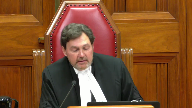
:::

Please be seated.

In the case of Corporal C.R. McGregor against Her Majesty the Queen for the Appellant Corporal C.R. McGregor, Diana Mansour, and Mark Litourneau.

For the intervener, British Columbia Civil Liberties Association, Mr. Gibb-Vanert and Dahlia Choebar.

For the intervener, Canadian Civil Liberties Association, Lee West and Solomon Friedman.

For the intervener, Canadian Constitution Foundation, Jesse Artery and Akshay Aurora.

For the intervener, David Asper Centre for Constitutional Rights, Mr. Gerald Chan, Alexandra Hein.

For the respondent, Her Majesty the Queen, Patrice Germain and Natasha A. Thiessen and Chevy Walsh.

For the intervener, Attorney General of Ontario, Gavin MacDonald and Stephanie A. Lewis, please be advised that there is a publication ban and sealing order in this file from the standing martial court pursuant to Section 179 of the National Defence Act and Section 486-4 of the Criminal Code.

But before we start, avant de commencer l'épidorie ce matin, je tiens à souligner qu'il s'agit aujourd'hui de la dernière participation du juge

Moldaver aux audiences de la Cour suprême du Canada.

As Chief Justice, I wish to take this opportunity on behalf of my colleagues and all Canadians to thank Justice Moldaver for his many years of devoted service to this Court and the administration of justice.

He has served Canada and Canadians with distinction and dedication, leaving an indelible mark on Canada's legal system and its criminal law system in particular.

His colleagues and I have benefited from his wisdom, warmth and wit.

And Canadians have benefited from his unwavering commitment to fair and just results.

This is Justice Moldaver's 630th hearing on the Supreme Court.

Over the last 11 years, he has written more than 100 judgments, decisions that are, regardless of the subject matter, easy to read and accessible to just about anybody.

Indeed, he has always written his judgments with a focus on clarity in an effort to make them more understandable to Canadians.

As a fellow judge, what I have most admired about Justice Moldaver is his enduring commitment to preserving Canadians' confidence in their justice system.

His clear and concise style of communicating extends to how he questions lawyers in the courtroom.

He poses questions in an approachable style that clarifies complicated issues for the parties and members of the public watching from home or in the courtroom.

Justice Moldaver came to this Court with a reputation as a hard-working judge on Ontario's Court of Appeal and as a trial judge before that.

In total, he has served for 32 years as a trial, appeal and Supreme Court judge.

Throughout he has applied the law fairly, pragmatically and, as I have mentioned, clearly.

And whether as a lawyer or a judge, he has always exemplified collegiality, compassion and courage.

He has been gracious and respectful to everyone, and I know the Court staff will also miss him.

Justice Moldaver's time at the Supreme Court has been a continuation of a long and remarkable career.

He started out in 1973 under G. Arthur Martin and later worked alongside Eddie Greenspan and Alan Gold, to name but a few.

He became a partner of the firm a mere two years later – that must be a record time – but he was a formidable criminal defence lawyer.

After practising for only 17 years, he was appointed as a trial judge in 1990, an appeal court judge in 1995 and a member of this Court in 2011.

Along the way, he became one of this country's most respected judges.

Despite all the hours he has spent in the courtroom or at his desk writing judgments, he has always made time for the broader legal community.

Over the years, he judged moot court competitions and instructed many continuing legal education programs.

He also delivered speeches on wrongful convictions, jury instructions and, as he so aptly put it, the art of judging.

But my favourite was entitled The Perry Mason Myth – Law is a Noble Profession.

He said when he graduated from law school, he suffered from that Perry Mason myth – the fictional American criminal defence lawyer who had the talent for causing witnesses to faint and jurors to cry.

Justice Moldaver said, and I quote, Perry enjoyed the public fame and notoriety of a rock star and was literally rolling in dough and I could hardly wait to be like Perry.

Instead, Justice Moldaver quickly learned that the profession is not about fame or money but about helping people and that, in the end, made him feel good.

But undoubtedly, his greatest joy has been his family and many of them are with us today.

I want to extend my and my colleagues' gratitude to Justice Moldaver's wife, Ricky, his daughters Shannon and Jessica, his grandchildren and extended family.

They have generously shared Justice Moldaver with us for all these years.

Being a judge is a great privilege but it is also a very, very demanding job where judges sometimes miss out on family plans and special events.

Our thanks again to each of you.

In closing, I would like to return to something Justice Moldaver said at his swearing-in ceremony in 2011.

In paraphrasing the late Justice Brennan, he told his new colleagues that he was not expecting to distinguish himself on the court but to benefit by association.

Yet in the years since, he has distinguished himself and it is we who have benefited by association.

Thank you so much, Mike.

Justice Moldaver, mon cher Mike, the floor is now yours.

**Justice Moldaver** (00:09:00): Well, I haven't broken down yet, but could happen.

::: {.column-margin}
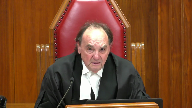
:::

Thank you, Chief Justice, for your kind and overly generous remarks.

You have now held the high office of Chief Justice for about four and a half years.

And I have to say, in all sincerity, Chief, I've never heard you speak so well.

**Overlapping speakers** (00:09:24): Thank you.

**Justice Moldaver** (00:09:24): When you came to the court in 2012, I had been here exactly one year and I kind of thought of you as the baby brother I never had.

::: {.column-margin}
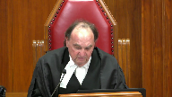
:::

And come to think of it, the resemblance is really quite uncanny, but it's been a joy and privilege for me to grow up with you, Chief.

I'm now about 11, you're almost 10, and as I see it, the only thing that differentiates us at this point is that I'm still a puny judge and you're Chief Justice of Canada.

I can't tell you, Chief, how happy I am that one of us made it.

And made it you have.

Over the years that you have been Chief Justice, you have led the court with vision, courage, and great distinction.

Among the many goals that you have set for yourself, the one that stands out for me is the effort you have made and continue to make in bringing the court to the people.

You have opened up the doors and windows of this magnificent edifice and this venerable institution and you've let the sun shine in.

And you've done so, not so that the members of the public could see us in the splendor of our red robes or to pay homage to us in recognition of the high office that we hold.

Not at all.

You did it because you recognized that fundamentally we are here to serve the people of this great country.

We are here to preserve and protect a justice system that is premised on the supremacy of the rule of law, a justice system that prides itself on an independent judiciary and open courtrooms, a justice system that is accessible to all who are in need of and seek its protection, and vitally, a justice system that is founded on the belief that we are all equal before and under the law and that every human being is entitled to be treated fairly with respect and dignity.

For that and so much more, Chief Justice, you are owed a great debt of gratitude.

And I know my colleagues join with me in wishing you good health and happiness and many, many more productive and rewarding years on the court.

To my colleagues, I wish the same for each and every one of you.

It has been an honour and privilege to work with you and an even greater honour and privilege to call you my friends, especially when you concurred with me and gave me the fifth vote I needed for a majority.

Not quite so much when you were led astray and went the other way.

The truth is, ladies and gentlemen, that I have never before worked with such a dedicated group of people, people who care so much, people who spend their every waking moment, often between the hours of 1 a.m. and 5 a.m., pacing the floor on those sleepless nights that we all know only too well, trying our best to do what is right and just, not only for the litigants appearing before us, but more generally for the people of Canada as a whole.

This can and does at times lead to animated and spirited discussions, which can at times leave some of us feeling a bit raw.

But when the dust settles and the new day dawns, we all come away knowing that our strong feelings are born not out of contempt or disdain, rather they are born out of the care we bring to our work, religiously, day in and day out.

And that is as it should be.

So I say thank you, dear colleagues, for everything.

You're going to be very much missed.

I also want to say a special word of thanks to the many devoted men and women who look after the day-to-day workings of the court, and who ensure that the judges receive the assistance they need to carry out the demands of their office.

In many ways, you are the backbone of the court, and you carry out your duties with a degree of excellence and professionalism, the likes of which I have never before seen.

Time does not permit me to name names, but I do wish to recognize the members of my chambers and to offer my profuse thanks to them.

My judicial assistants over this past year, Jean-Vivien Denis, Hélène Seurot, and Sylvie Henri.

My judicial attendant, the legendary Joe Botello, and my devoted law clerks in alphabetical order, Rachel Chan, Curtis Doyle, Julia Kirby, and Jocelyn Rimple.

Thank you one and all.

I couldn't have done this without you.

And finally, I want to say a heartfelt thanks to my family members who have come to the court today to be with me on my final sitting day.

My two wonderful daughters, Shannon and Jessica, are here.

Both are lawyers, and they are more than happy to tell me when I get something right.

And when they think I got it wrong, they have learned not to say a word.

As you might imagine, over the past 11 years, there have been a rather large number of very short calls.

Shannon is here with her husband Daniel and their two brilliant and handsome boys, Ethan and Jackson.

And it's okay, actually, Daniel, you're brilliant and handsome too.

At my swearing-in ceremony in 2011, Ethan and Jax could hardly see over the table.

Now both of them have to reach down to pat the top of their Zadie Mike's head.

Two quick comments about my daughters, Shannon and Jess.

Shannon, on May 15, 1990, I was sworn in as a judge of the High Court of Justice for Ontario.

You were there.

You turned 18 that day.

That was 32 years ago.

I'll leave it to others to figure out how old you turned this past Sunday, May 15, but I wanted to give you a very belated happy return, Shannon.

And to Jess, I found the note you gave me when Justice Kara Katsanis and I were sworn in publicly as judges of this court on November 14, 2011.

It reads, good luck, Dad, never stop working hard, you have me to support.

Lots of love, Jess.

I'll certainly keep that in mind, Jess, as I begin the next chapter of my life.

There goes my retirement.

And Ricky's wonderful daughter, Hila, is here with her handsome and brilliant husband, Rudy, and their two beautiful children, Isabel and Nathan.

I love it when the kids come over to our home for sleepovers on the weekend.

We have a lot of fun, and they have a way of making me realize that there is a life beyond the court, one full of fun and games and laughter and Dairy Queen blizzards and craft dinners served with French fries and pizza.

No disrespect, Chief Justice, but I can hardly wait.

Finally, to my dear wife, Ricky, who has put up with me through thick and thin, Ricky, you've always been there to support me, to advise me, to calm me down, and to tell me to get back to sleep at 3.30 in the morning whenever I woke up tossing and turning, worrying about this case or that.

If you had a dollar for every time that happened over the past 11 years, I wouldn't have to start the next phase of my life looking for a job.

Thank you for being the sun on my face and the wind at my back all these many years.

Most assuredly, I couldn't have done any of this without you.

Well, Chief, I don't see it, but I kind of think the red light is on, so I will end by saying that it is with humility and a deep sense of gratitude that I commence my final sitting day as a judge of the Supreme Court of Canada.

I never expected to be here, but I've come to learn over the years that life takes you where it will.

I have done my best to serve the people of this great country to the best of my ability.

I hope I have contributed in some small measure to preserve and protect our justice system, a system that in many respects is the envy of the civilized world.

I leave it to my colleagues and future members of the court to carry on the tradition of excellence that marks this court, remembering always that the institution is and always will be greater than the sum of its individual parts.

Thank you, Chief Justice, for allowing me to express my thanks to all who have made possible this very special day in my life.

Thank you.

**Speaker 1** (00:21:02): May I just be so bold as to say on behalf of the Crown, my Crown colleagues, my defence colleagues, it is an honour to appear before you at your last hearing and thank you for your service to our country.

**Justice Wagner** (00:21:17): Thank you very much.

I just want to make sure that the message is there also, that our colleague Justice Martin participates at the hearing virtually.

She's there on the screen.

Thank you very much, Justice Mentour.

**Speaker 2** (00:21:59): Chief Justice if I may before I begin just to echo my my colleagues comments justice Moldaver Congratulations well-deserved retirement, and I just want to say on behalf of all of us Thank you for your contributions to the legal community and to all of us Thank you good morning justices I'm speaking on behalf of corporal McGregor the appellant in this matter this case is about the Charter rights of corporal McGregor as well as all military members whether inside or outside of Canada and more particularly it is about the application of the Canadian Charter to a Canadian investigation of a Canadian military member and Canadian citizen

::: {.column-margin}
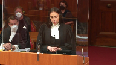
:::

our members serving Canada whether inside or outside of Canada ought to have their Charter rights guaranteed when investigated by Canadian military police for Canadian criminal offenses the portability of the military justice system allows Canadian criminal law to apply to our military members when they are serving anywhere in the world and with it so should the Charter apply the matter before the court is a request to allow the appeal and have conviction set aside acquittal substituted or a new trial ordered in support of our position we will we will be making three main submissions to this court today if I may direct you to the outline of oral argument contained in the condensed book this will provide a map for our submissions today we will be demonstrating first that the Charter applies to the actions of the military police when they search the appellant's residence because the National Defense Act and permissible international rules establish Canada's enforcement jurisdiction

second we will discuss that the Charter applies to the actions of the Canadian military police because the United States of America cooperated with and consented to Canada's enforcement jurisdiction and time permitting justices third that the Canadian military police violated the appellant's section 8 Charter rights by searching through his electronic devices on scene without a specific warrant contrary to the Queen and voo and justices it's safe to say that our appeal rises and falls on the point that the Charter applies to the actions of the military police and prior to delving into the heap exceptions we need to provide some very brief but crucial context to this case the code of service discipline which is part part and parcel to the National Defense Act is the basis of the military justice system the military justice system has criminal jurisdiction over the appellant by virtue of the National Defense Act which permits members to be investigated arrested charged tried and incarcerated anywhere in the world this jurisdiction is necessary to maintain discipline efficiency and morale within the Canadian Armed Forces for example section 130 sub 1 sub B of the National Defense Act gives the military police the reach to charge a member for an offense committed outside of Canada and to put that member on trial by way of courts martial anywhere in the world and recent examples of that have been in Afghanistan and in Germany so the National Defense Act establishes jurisdiction over these individuals and criminal criminal and disciplinary jurisdiction over these individuals and follows them everywhere in the world so just to emphasize the point so members are liable for every offense under the Canadian Criminal Code

so we're not just discussing military service offenses we're talking about the Canadian Criminal Code anywhere in the world even the moon to be dramatic so they are the only group of Canadians who are subject to this jurisdictional reach by Canada and we have to remind ourselves that it is a duty to serve it is a legal obligation so by virtue of their employment they are subjected to this extra territorial reach by Canada as is and that's what makes this case very unique and unlike any facts that this court had faced in the Queen and Hape

so when we talk about this case we really are talking about the application of the Canadian Charter to a Canadian investigation of a Canadian military member alleged to have committed a Canadian offense criminal code offense our members serving in Canada ought to have their Charter rights guaranteed when investigated by military police for Canadian criminal offenses given that they're always liable to Canadian criminal jurisdiction.

**Justice Brown** (00:26:51): I notice that you haven't referred us yet to the actual text of Section 32 of the Charter.

Will you be getting to that at some point?

**Speaker 2** (00:27:00): Yes, and I can get to that in brief, Justice Brown.

::: {.column-margin}
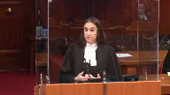
:::

So the idea of section 32 is that it merely establishes that ‑‑

I'll get to this here.

So section 32 provides us with the basis in which the charter applies.

And I think it's well established by this court in the Queen and Hape and I don't think that this is a point of contention with the respondent that section 32 allows for the possibility of the charter to apply outside of Canada.

And because of that, the Queen and Hape ‑‑ in the Queen and Hape this court provided parameters to help guide us in terms of determining whether the charter applies outside of Canada in a given circumstance.

And that's what led to the two exceptions that were provided and that is the permissible rule exception which is the idea that there are permissible international laws that permit Canada's enforcement jurisdiction as well as consent.

So is there consent by that host nation that permits Canada to enforce its jurisdiction in that territory?

**Justice Brown** (00:28:03): a preliminary point

::: {.column-margin}
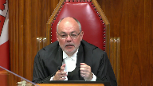
:::

and that's whether this falls ‑‑ whether what is being challenged here was the action of the government of Canada taken within the authority of parliament.

That's the language of section 32.

I understand the investigation may have been conducted under the authority of parliament but that's ‑‑

you're not challenging the investigation.

You're challenging the issuance of a warrant, the search and seizure that followed from it.

Were ‑‑ are those matters which you're challenging matters within the authority of parliament?

**Speaker 2** (00:28:43): It's the appellant's respectful submission that they are, because the National Defence Act is Canadian prescriptive law.

It allows for prescriptive jurisdiction outside of Canada.

That is within the authority of Parliament.

**Justice Brown** (00:28:58): you

**Overlapping speakers** (00:28:58): Thank you.

**Justice Brown** (00:28:59): to issue a warrant to conduct the search and seizure on the authority of, I mean, under whose authority was this search and seizure conducted?

**Speaker 2** (00:29:10): Well, it's our respectful submission that it was conducted under the authority of Canada.

So you didn't need a warrant, they didn't need a warrant from the Virginia courts then?

You did need a warrant.

**Justice Brown** (00:29:19): Yeah, of course, okay, so

and and the search was conducted under the authority of what?

Under the Canadian Authority and that's essentially not so they didn't need the warrant.

They did need the warrant okay, so the search was conducted under the authority of the warrant.

**Speaker 2** (00:29:34): Respectfully, Justice Brown, the appellant's position is that the warrant and what goes above the warrant was the authorization of Canada.

::: {.column-margin}
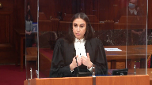
:::

In order to understand the position.

Canada authorized the warrant? Correct.

Really? Correct.

Can I see that warrant?

I want to see where it says under the authority of Canada.

I'll explain.

Take me right to it.

**Justice Brown** (00:29:58): Show me this warrant and you tell me where it says on that warrant it's issued under the Authority of Canada.

**Speaker 2** (00:30:05): So Justice Brown, it's not the warrant in and of itself, it's the letter from the embassy that provides the waiver of immunity.

::: {.column-margin}
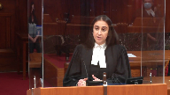
:::

Because our position is that without that waiver of immunity, without the authorization of Canada by virtue of the Vienna Convention, which is the convention in which both the United States and Canada have consented to be party to, without that authorization from Canadian authorities, the warrant could never be issued.

**Overlapping speakers** (00:30:27): Right, but could the search have been conducted without the warrant? No.

**Speaker 2** (00:30:33): Justice Brown and that's where the NATO SOFA brings us into play.

::: {.column-margin}
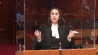
:::

So the idea is and the appellant's position is that permissible international rule exception applies because the NATO SOFA and the Vienna Convention provides the Canadian military police with the authorization to enforce their jurisdiction.

So the warrant in and of itself is subject to the authorization of Canada first and it's part and parcel.

**Justice Rowe** (00:31:01): would allow the Canadian military police to act on a base, but this is a private residence, and so how does the Status of Forces Agreement authorize the Government of Canada, or the officials of the Government of Canada, to carry out this search?

::: {.column-margin}
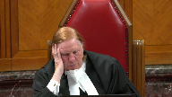
:::

**Speaker 2** (00:31:25): Thank you, Justice Rose.

::: {.column-margin}

:::

So that is what brings us essentially and that's the basis of our first submission.

It's the idea that the national defense act in conjunction with the NATO sofa and Vienna convention is what establishes that jurisdiction over the investigation and the search because the NATO sofa provides the mechanism for the military police to require that the U.S. Authorities assist.

So just to provide some background, the Vienna convention so we know the national defense act at this point subjects the individual to Canadian criminal jurisdiction.

Now the Vienna convention is part and parcel to this position because it forms the basis of his diplomatic immunity.

So it identifies the privileges and protections that the diplomats and in this case the appellant benefit from while abroad.

And article 31 sub 1 specifies that the appellant, his property and his residents are protected from the jurisdiction of the United States which includes protections against search and seizures.

And article 31 sub 4 clearly states that the diplomatic immunity that protects the individual from U.S. jurisdiction it doesn't exempt him from Canadian jurisdiction.

So accordingly that maintains the Canadian jurisdiction over this individual.

And that is an authority that can only be waived by Canadian authority.

And that's where the NATO sofa comes into play at this point.

**Justice Rowe** (00:32:51): challenging the waiver of the partial waiver of the diplomatic immunity or are you challenging the conduct of the search because the the waiver of immunity facilitated the search

::: {.column-margin}
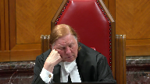
:::

but it didn't authorize the search and and that's really picking up in the point that Justice Brown made.

**Speaker 2** (00:33:23): Thank you, Justice Rose.

::: {.column-margin}
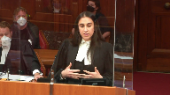
:::

So the appellant's respectful position is that we're challenging the conduct of the search.

So when we talk about the enforcement jurisdiction, we're talking about investigative jurisdiction.

So what the NATO SOFA does, it maintains Canadian jurisdiction over any conduct that the appellant is alleged to have committed and it maintains that jurisdiction and provides the Canadian military police with a mechanism to obtain evidence.

**Justice Brown** (00:33:53): You're challenging the conduct of the search.

::: {.column-margin}
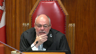
:::

You're challenging the search and the seizure.

I mean, I don't – I mean, this conduct is a fuzzy word that kind of allows you to get the Canadian officials into this, but it's the search that is the thing, surely, and the seizure.

That's the problem.

And so it's not – I mean, the question of whether Canadian forces had the jurisdiction to investigate, to me, doesn't answer.

It just actually begs the question.

Jurisdiction to do what?

Did they have jurisdiction to authorize the search and the seizure?

They didn't.

They had jurisdiction to obtain it.

But your – but the charter is quite clear on this.

You have to be acting within the authority of parliament.

Whatever you're challenging has to have occurred within the authority of parliament, and that was a search that was issued under the authority of the laws of the Commonwealth of Virginia.

**Speaker 2** (00:34:56): Thank you, Justice Brown.

::: {.column-margin}
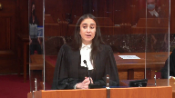
:::

So, respectfully, our position is we're not attempting to apply the Charter to the actions of the U.S. authorities.

We're not attempting to apply the Charter to the state of Virginia warrant.

What we're trying to apply the Charter and what we're asking this court to apply the Charter to is the conduct of the Canadian military police when they executed the search.

**Justice Côté** (00:35:15): Mr. Mansour, I'm sorry to interrupt, so to take you there, so you say you don't want to apply the charter to the state of Virginia, but what I try to find in your factum, what should the Canadian investigators, what should they have done in order to respect according to your perspective, from your perspective, their obligations?

::: {.column-margin}
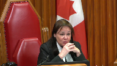
:::

You recognize that Canada could not issue the search warrant?

You agree with that?

That is correct.

So what was the proper method from your perspective for the investigators to get evidence from your client's residence in the States?

**Speaker 2** (00:35:55): Thank you.

::: {.column-margin}
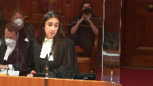
:::

So essentially the idea is it's not with respect to the authorization that's being challenged.

It's respect to the manner in which the search was conducted.

So yes, the warrant provided the military police with a mechanism to get in to the residents and to conduct the search.

But when we look at the waiver that was provided by the Canadian embassy, that waiver was with respect to the residents, so his person.

And our position just in brief with respect to the section 8 is the idea that the authorization for the search of the specific devices on scene was not provided by the Canadian embassy because they maintained the inviolability of the individual.

And based on the queen and vu, that is what we're basing our position in, there has to be clear express authorization to search devices while on scene.

And the Canadian military police, their actions reflect their knowledge of that because when they seized the items, they did do a search on scene and that is essentially what we're challenging.

And then they took those devices back to Canada and obtained an additional warrant based on what they located while they did that search on scene and obtained that separate authorization to search the devices.

So that's essentially what we're challenging.

So we're not attempting to subject the U.S. authorities or the state of Virginia to charter standards.

We're merely attempting to apply the charter to the actions of the Canadian military police.

And it's our position that by virtue of the NATO sofa, the NATO sofa establishes criminal jurisdiction over the individual with the consent of the United States.

So it says us, Canada, we have criminal jurisdiction over this individual.

And the it's evident that it was understood that because when you're dealing with international law, jurisdiction is complicated.

It's not unilateral.

There are states that can have concurrent claims to jurisdiction.

The purpose of the NATO sofa is to deconflict that jurisdiction when it comes to Canadian military members.

But inevitably when it comes to a search cooperation with a local authority is going to be inevitable.

And if we try to apply this idea of a unilateral authority or a unilateral requirement to Canadian state actors, then respectfully it renders section 8 outside of Canada pragmatically meaningless.

Because then we can't find a situation absent parliament filling in this gap in the legislation, we can't find a mechanism to do that.

So what the NATO sofa does is that it doesn't have the authority to do that.

**Justice Rowe** (00:38:29): Is that actually accurate because when evidence is presented in a Canadian court, can it not be challenged under 11D or an alternative under Section 7 if it was obtained in a manner which was, shall we say, entirely offensive to Canadian views of fair trial?

::: {.column-margin}
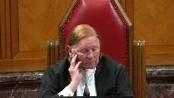
:::

For example, they just smash down the door without a warrant and just grab everything in sight.

I mean, just thuggery.

I mean, it is not the remedy for an accused person to say that that evidence should be excluded at the trial under 11D and Section 7.

And so your client is not without a remedy, it seems to me.

**Speaker 2** (00:39:22): Yes, there is a remedy but the standard is different than the standard that's applied to section 24.2 and respectfully that's putting the carpet before the horse because we're of the position that the charter ought to apply and that this court already provided a mechanism to allow it to apply.

::: {.column-margin}
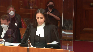
:::

And that was established in the Queen and Hape.

Now this idea of the warrant, the U.S. Warrant being determinative of whether the actions of the military members or the military police ought to be subjected to the charter from our respectful position is a red herring because it doesn't account for the authorization and the Canadian umbrella or legal umbrella which superseded that warrant.

**Justice Jamal** (00:40:05): Could I ask, in practical terms, what should have been done then?

::: {.column-margin}
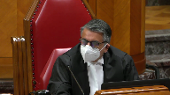
:::

Is it your position that the CFNIS officials, knowing that they required specific authorization of a VU warrant, should have gone to their U.S. counterparts and said, thank you very much for the warrant, but we need something much more particular in order to use this evidence in Canada, and therefore the U.S. investigators should have gone to the Virginia judge and asked for a more specific warrant?

Is that really what it comes down to, that that was the problem in this case?

**Speaker 2** (00:40:39): Respectfully, thank you, justice Jamal.

::: {.column-margin}
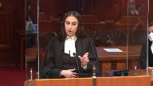
:::

So there's two essentially options.

And respectfully our position is that the charter ought to apply just and whether there was a breach or not is a secondary question.

But with respect to how the CFNIS or the military police ought to have handled the matter is that they could have requested that particular authorization from the Canadian embassy but they did not.

And that's clear in the documentation that they provided to the embassy.

They were strictly seeking a warrant for the residents.

Alternatively they could have seized the devices which they ultimately did, take them back to Canada and obtain that specific authorization.

Again, which they ultimately did.

But not without searching those devices while on scene.

So those are alternatives that could have been taken.

But again, that proceeds after the fact.

We're of the position that the charter ought to apply.

Because despite the U.S. Warrant, the authority that oversaw the U.S. Warrant was Canadian, because.

**Justice Côté** (00:41:39): So we should not give any weight to the fact that in the search warrant there is the authorization to seize the property, the objects, et cetera, et cetera, and to analyze.

::: {.column-margin}
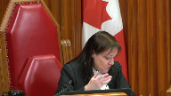
:::

And the analysis of the seized items.

So we should not ‑‑ it means nothing in your position.

Thank you, Justice.

**Speaker 2** (00:42:02): This is cote.

::: {.column-margin}
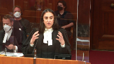
:::

Respectfully, that, you know, had we been dealing with U.S. Authorities who conducted the search, we'd be dealing with a different question.

But because the search was exclusively conducted by the Canadian military police, that that warrant and their authorization was limited by the authorization provided by the Canadian embassy.

So yes, for example, the warrant could have provided authorization to search for a, b, and c.

But if the Canadian embassy, the embassy that has the authorization and has the jurisdiction over this individual and his residents, if they only provided authorization for a, then it does not necessarily matter that the U.S. Warrant provided authorization for b and c because the waiver of immunity was specific to a, which is the search of the residents.

So again, had this been a situation in which U.S. Authorities were conducting the search, we'd be having a different conversation.

But there was a clear demarcation of duties because all parties involved were of the understanding that this was a Canadian investigation and that Canadians had jurisdiction and that the Canadian Authorities were merely…

**Justice Rowe** (00:43:11): But doesn't that fly in the face of exactly what the Americans said?

::: {.column-margin}
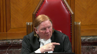
:::

Didn't the American authorities, and I would say the Virginia authorities, not the national government authorities, said, look, okay, you've waived immunity or inviolability about the residents.

We're not going in there unless we have a basis under our law.

We need to talk to this complainant.

We have to see whether they're under an American law.

There's some basis for us to go and seek this warrant.

Now it may be an offense under your law, but it has to be an offense under our law as well.

There has to be a basis under the law of the commonwealth of Virginia to make this entry and to make this search.

So yeah, we'll kind of work side by side with you, but we the Virginia authorities are acting under our own jurisdiction and not, you know, sort of as flunkies for the Canadians and certainly not for the Canadian embassy.

**Speaker 2** (00:44:16): Thank you.

::: {.column-margin}
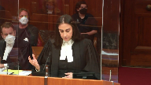
:::

Respectfully, it's the appellant's position that the U.S. authorities were aware of their role.

So pursuant to the NATO SOFA, which is an agreement that they are also party too, they are required to assist Canada in the exercise of its investigative or enforcement jurisdiction over the individual in a criminal offence.

So article 7, section 6a provides Canada with a mechanism in the execution of their own investigation to obtain evidence.

And the U.S. authorities respectfully were operating under the understanding that it was their obligation to do so and to assist Canada in the exercise of that duty.

And the way that the search unfolded from our respectful position clearly identifies that the parties were aware of what their role was.

You had sergeant partridge, he's a Canadian military police.

He's the lead investigator.

He's the one that determines how the case progresses, what steps are to be taken.

And the U.S. authorities weren't even advised of the investigation until their assistance was needed pursuant to the NATO SOFA.

So the NATO SOFA still maintains that Canadian jurisdiction over the investigation.

So while the U.S. authorities were assisting, at the end of the day, they understood that that investigation or that jurisdiction belonged to Canada.

And that's evident in the way that the search unfolded.

They obtained the warrant for the purpose of the investigation.

They breached the door, secured the premises, stood back, and then the military police entered and conducted the search.

And I think it's very clear when we look at the correspondence that was sent to the Canadian embassy by the military police when requesting that waiver that they were of the position and they were of the understanding based on their conversations with the U.S. authorities that it was their investigation.

And the purpose of that warrant was strictly to provide the Canadian military police with a mechanism to get inside.

**Justice Brown** (00:46:13): Authority to get inside, with authority, that's the word, right, and that's the word that section 32 uses.

**Overlapping speakers** (00:46:23): Thank you, Justice Brown.

**Justice Brown** (00:46:24): I accept they had investigative jurisdiction, they obviously had investigative jurisdiction, but that's not what the Charter sets out as the basis for its application.

**Justice Kasirer** (00:46:34): Maybe I could pick up on Justice Brown's question.

::: {.column-margin}
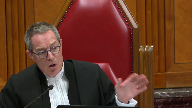
:::

You seem to be assuming not only that section 32 applies to people, makes no reference to place, and thus it's an open door here, but that HAPE applies to this circumstance.

And it's something in reading your factum, Ms. Mansour, that I didn't get.

So maybe you could help me with this.

At various points in the factum, you insist upon the fact that legally and factually, this is not HAPE.

This is visiting military personnel, and there's a logic that applies to the application of the potential extraterritorial application of Canadian law that's specific to military personnel, visiting military personnel, that's not foursquare with what the civilian context of HAPE.

And I'm wondering what impact that has on the structure of your argument, because it seems to me that beyond the issue of whether CFNIS is a state actor, that if there's an exception to the principle of sovereignty that would justify the application of the charter to the CFNIS's extraterritorial activity, it would operate differently for military personnel than civilian personnel, where one of the concerns in HAPE, as I understood it, was that Canadian law applied abroad would risk breaching foreign sovereignty, whereas the concern is not the same where military personnel are involved.

**Speaker 2** (00:48:25): Thank you.

::: {.column-margin}
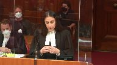
:::

So essentially our position is in fact the idea that HAPE does apply.

When we look at the facts of this case, yes, they're unique from the facts that were presented in HAPE but the exceptions that were outlined still apply.

The unfortunate part is that because HAPE was dealing with a foreign investigation, not necessarily Canadian military investigation and it was a situation in which Turks and Caicos authorities were in charge of the investigation, they made it clear they were in charge of the investigation, they executed the search.

The court didn't have an opportunity to canvass the breadth of the exception.

But our position is essentially that HAPE does apply and the permissible rule exception does apply.

Because the test is and I think this is where the court martial appeal court aired is that they lost focus of the test because they were focusing on the existence of the U.S. warrant.

Because the test asks would applying the charter to the actions of the Canadian military police, so the Canadian state actors cause or result in an objectionable interference or extra territorial effect on the sovereignty of the United States.

And our position is respectfully based on the facts it would not because of the fact that it was understood that it was understood by the military authorities that it was their investigation, it was understood by their U.S. counterparts that this was a Canadian investigation and they were doing their part pursuant to the NATO SOFA to assist.

So would applying the charter to the actions of the military police result in an objectionable extra territorial effect on the sovereignty of the United States, our respectful position is that it would not.

And if the charter would not.

**Justice Martin** (00:50:10): you there and ask you is that really the test that HAPE set down or is that the test out of Cook that is in a questionable jurisprudential position after HAPE?

**Speaker 2** (00:50:24): Thank you.

::: {.column-margin}

:::

I think from our respectful position, HAPE solidified the test and confirmed the fact that if the Charter were to apply outside of Canada, it could only do so under two exceptions.

**Overlapping speakers** (00:50:42): Oh, yes.

**Speaker 2** (00:50:43): I thought ‑‑

::: {.column-margin}
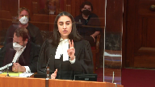
:::

I'm so sorry, Justice Martin.

Our position essentially is that ‑‑ is that in HAPE it solidified the test.

It had indicated that ‑‑ and this court indicated that there are two situations in which the charter can and will apply outside of Canada.

And that's a, if there's a permissible international rule that permits in Canada's enforcement jurisdiction and does not result in an objectionable extra territorial effect or whether there's consent by the host nation, that allows for the enforcement of Canadian jurisdiction again.

**Justice Brown** (00:51:18): didn't he project the extra the objectionable effect check test when you're relating the permissible rule of international law exception with the objectionable extraterritorial effect test

::: {.column-margin}
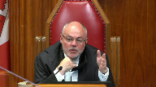
:::

but but I think justice Martin is on to something I think I don't think that tape

but what do I

**Speaker 2** (00:51:50): brief indulgence dislocating the quote so at at paragraph one

::: {.column-margin}
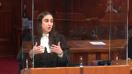
:::

oh five it talks about the court provides some guidance and it talks about dictating what procedures are to be followed in a criminal investigation to another authority and that's subjecting Canadian authority onto another state and that is what causes the issue and it talks about how criminal investigations can implicate enforcement jurisdiction and pursuant to the principles of international law which is what all of this is grounded in.

It's grounded in customary international law and that's something that HAPE understood and with respect to customary international law it's the idea that every state has the right to its own sovereignty and the right to be protected from an interference or objectionable interference from another state's sovereignty or another state's sovereignty.

**Justice Brown** (00:53:05): But let's look at paragraph, oh sorry, go ahead, Justice Warren.

**Justice Martin** (00:53:05): But let's look at paragraph, oh sorry, go ahead, Justice Warren.

**Overlapping speakers** (00:53:08): Oh, sorry.

**Justice Martin** (00:53:09): At some point, I'd like you to comment on the analysis that's put forward in the British Columbia Civil Liberties Factor, because a lot of your argument seems to be premised on this enforcement jurisdiction.

::: {.column-margin}
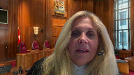
:::

And as I understand the position that's being taken there, which is that that is not the only way or even the better way to be viewing this when what we have is a Canadian accused in a Canadian trial in a Canadian court charged with Canadian offences.

And that really what we're talking about here is just state activity, which has an extraterritorial component, but we should be in a conflict of laws comparison rather than this notion of sovereignty and extraterritorial effect.

**Speaker 2** (00:54:02): Thank you.

::: {.column-margin}
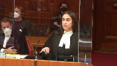
:::

So essentially with respect to that position, enforcement jurisdiction encompasses investigative jurisdiction and that's why we're using that term.

And with respect to the conflict of law, in this particular case, we have permissible international rules and that's why from our respectful position, the HAPE analysis is the appropriate analysis.

The NATO sofa and the Vienna convention are in place to deconflict this idea of jurisdiction and to make it clear between both parties who has jurisdiction including investigative jurisdiction and criminal jurisdiction over these individuals.

So it's our respectful position that the HAPE test and the HAPE analysis is applicable and that this case fits within that analysis, both when we talk about consent or when we talk about permissible international law.

**Justice Brown** (00:54:57): Can I just pull you back to my earlier question?

::: {.column-margin}
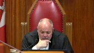
:::

I'm looking at paragraph 93 of HAPE.

And about halfway down, beginning with in my view, in my view there's little logic in an approach that first determines that the activity falls under section 32.1 and then questions at a second stage whether the charter nonetheless ought to apply because of some objectionable extraterritorial effect.

Rather the extraterritorial implications of applying the charter are in my view central to the question where the activity in question falls under section 32.1 in the first place.

The inquiry begins and ends with section 32.1 of the charter.

That seems to be in tension with what you're submitting to us.

Unless I'm not understanding you clearly and that's possible.

**Speaker 2** (00:55:47): So, thank you, Justice Brown.

::: {.column-margin}
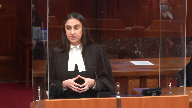
:::

So this idea about an objectionable extraterritorial effect, that is rooted in customary international law.

And that is a premise that Canada must respect.

And the premise of the customary international law is this idea that Canada cannot interfere with another state's sovereignty.

And there's a reference, another reference if we're looking for the term of impermissible.

**Overlapping speakers** (00:56:16): So is that paragraph wrong they decided? Sorry?

Is that paragraph wrong they decided?

**Speaker 2** (00:56:21): No, Justice Brown.

We're just looking at it through the context of Canada's

**Overlapping speakers** (00:56:26): I just have to look at it through a different lens than Justice Labelle looked at it through.

**Speaker 2** (00:56:29): No, Justice Brown, if I could direct your attention to paragraph 148 as well of HAPE.

**Overlapping speakers** (00:56:37): Okay.

**Speaker 2** (00:56:38): So essentially I think it's saying the same thing but just in different ways and it talks about cooperation and it notes that it tells us nothing about whether impermissible extra territorial effects will occur.

::: {.column-margin}
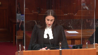
:::

An objectionable extra territorial effect does not result from the mere fact of cooperation.

So it's this term that keeps resurfacing and respectfully it's because it's a customary international law that Canada is obliged to abide by.

**Overlapping speakers** (00:57:02): Sorry, sorry, that's not in the majority reasons. Sorry?

Paragraph 128 of hape? Yes.

That's Justice Bastarach's reason.

**Speaker 2** (00:57:13): Yes, Justice Brown.

::: {.column-margin}
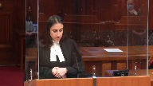
:::

So the reason I'm directing your attention to that is because it uses that same buzz word.

But the concept in hate deals with the same analysis.

And it's whether applying the charter outside of Canada would cause some sort of effect that would be impermissible.

And that's why these permissible international rule and consent exceptions were created.

Because the idea is to subject another territory to Canada's jurisdiction without those would violate customary international law.

And again, customary international law is what deals with this idea of an objectionable extra territorial effect.

So we can just use a different phrase.

But it's the idea that Canada can apply its jurisdiction outside of Canada so long as it does not interfere, we'll use that term, with the sovereignty of the host nation.

And again, that's a principle of customary international law that Canada is obliged to abide by.

And the court goes into the analysis and goes into discussion about customary international law earlier on in its decision beginning at around paragraph 35.

So it's our position that whether we use that term or we use, let's say, interference or objectionable interference, we're arriving at the same conclusion.

Is there permissible international law that allows us to apply the charter to actions of Canadian state actors only?

Again, we're not seeking to subject the charter to the U.S. state actors or the state of Virginia.

Is there a permissible international rule that allows us to apply the charter to the actions of the Canadian military members or Canadian military police investigating our Canadian military members in this case?

And the principle of sovereignty, Justice Brown, if it also assists, the court goes into that discussion around paragraph 41.

And if I may, with respect to the analysis, when we look at whether we can apply the charter to the actions of the Canadian military members in this particular case, or we'll call them Canadian state actors, if the charter were not to apply to a case like this, a case where we have a clear demarcation of duties between states, a case where we have permissible legislation in place for the purpose of identifying Canada's enforcement and investigative jurisdiction over this individual, if the charter were not to apply to this case, then in what case could section 8 apply extraterritorially?

We'd be hard pressed to find that type of example.

And respectfully, that type of interpretation, that narrow interpretation of the permissible rule exception renders that section of the charter meaningless outside of Canada.

And that cannot be what was envisioned.

The court in Haight was dealing with a section 8.

Yes, it did not have the facts to address the exceptions, so it didn't have to go into those exceptions, but had it had the position been that the charter can apply outside of Canada when it comes to a section 8, respectfully, it's our position that the court would have said as much.

But it can. It can.

And that's why those exceptions were created.

And this is particularly a case that falls squarely within that exception.

And thus the charter ought to apply.

And if this court is having difficulty with the permissible rule, sorry.

**Justice Moldaver** (01:00:52): I'm sorry, I'm just having trouble going back, I want to go back to the beginning here, because somebody needed a warrant to get into this place, and Virginia didn't say, okay, you get a Canadian warrant, that'll be just fine, and you can apply charter law, and so on and so forth.

::: {.column-margin}
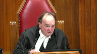
:::

And they didn't say that, they said, that is our bailiwick, we're going to do that.

I'm having real trouble getting my head around how Canada, complying with the charter, could get a warrant, they can't force Virginia to do that, surely, unless Virginia somehow consents.

So the only warrant that they could get that you say would comply with VU is a Canadian warrant.

But they don't have any authority to exercise that warrant down there.

So where I'm having trouble here, really, is seeing how this kind of plays out.

We know Virginia was not interested in prosecuting.

We know that they were prepared to cooperate with the Canadian authorities, and indeed, probably, say to the Canadian authorities, you take charge, this is your investigation, but you need our help, and we will give you our help under the treaty, but that help means us getting a warrant that complies with our law in Virginia, because we're dealing with property here.

And so I can understand it if you said, you know, really they ceded control of this investigation to the Canadian authorities, as far as they could, because they're not interested in prosecuting, but there were still steps that were required.

And so they got the warrant, you say it doesn't comply with VU, others might say yes, it does, because the issuing justice included both search and seizure, but let's assume it didn't.

Then surely if that's the case, Canada, I mean, what are they supposed to do if you're going to say that they're in a catch-22?

We can't get the warrant that would be constitutional in Canada.

They're not going to give it to us.

The only warrant they're going to give to us is one that wouldn't be constitutional in Canada, and if that's the case, I'm still staying with you for the moment, but it seems to me then there has to be a margin of appreciation applied, and say, you know, what did this warrant, what did Virginia do in effect that was so terrible that would cause us to be really concerned about letting that evidence that was seized into evidence in Canada?

That's a very long question, but I'm just having trouble putting the pieces together.

**Speaker 2** (01:03:42): Thank you.

::: {.column-margin}
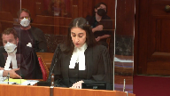
:::

So our position is that Virginia in and of themselves did nothing wrong.

So we're not trying to subject the charter to the state of Virginia.

And respectfully it's our position it's not that the U.S. Authorities said we're not interested, you take him.

It's our position that the NATO sofa, so it's an agreement that both the U.S. And Canada consented to and it's agreement that deconflicts jurisdiction and makes it clear who has jurisdiction over who.

And the NATO sofa section article 7, section 1a provides Canada with primary as well as 3a, provides Canada with primary jurisdiction over the individual for committing offense and certain offenses.

And one of those offenses as outlined in the NATO sofa is if there's an alleged offense committed against another military member which is what we had in this case.

So it's not that Virginia essentially said, eh, we don't want him, you take him.

It's that the NATO sofa and that agreement which they prescribed to mandates that Canada had primary jurisdiction over him.

**Justice Moldaver** (01:04:42): that I'm with you on all that but you still can't answer the question where and how does Canada get a warrant and from whom that would comply with our Constitution that's what I'm there's a disconnect here yes

**Speaker 2** (01:04:56): Thank you, Justice Moldaver.

::: {.column-margin}
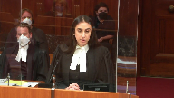
:::

This was interestingly the issue that arose at the standing court martial level.

And you know, military judge Peltier, he acknowledged the reasoning was flawed in the sense that, you know, he could not apply the charter from his perspective because of this inability to get a warrant.

And it's this gap in legislation which is what's causing the concern.

So respectfully that's not for the appellant to answer what type of mechanism.

There is no mechanism currently in place.

Could parliament create one?

Theoretically, yes.

Would it be ideal? Yes.

One that perhaps complies with international legal obligations or NATO sofas that are in place? Yes.

But is it necessary?

No. Not in the facts of this particular case.

Because we have the Vienna convention, because we have the NATO sofa, they fill in the gap and they provide Canada with the mechanism to obtain that evidence.

So section article 7, section 6a provides Canada with that mechanism and mandates the U.S. to assist Canada in their jurisdiction.

**Justice Brown** (01:05:58): Using mechanisms with authority again, aren't we?

::: {.column-margin}
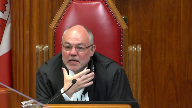
:::

I mean, yes, they can obtain a mechanism, but under whose authority?

Look, I don't mean to belabor this, but it is the text of section 32.

It doesn't say by whose mechanism or at whose instigation or whose action.

You talk a lot about action.

It's authority.

And I'm sorry, Mr. Mayor, you're aligning that point.

I still don't understand your theory of the case for why forces investigators were not were acting within the authority of parliament.

**Overlapping speakers** (01:06:38): Mm-hmm.

**Justice Brown** (01:06:39): under that search and seizure, because that parliament didn't authorize that search and seizure.

**Speaker 2** (01:06:46): Thank you Justice Brown.

Respectfully, it's the appellant's position that Parliament did authorize a search and see sure and that's by

**Overlapping speakers** (01:06:52): Well then show me in the warrant where that's the case.

**Speaker 2** (01:06:54): not the warrant, what we're referring to Justice Brown is the overarching authority that provided that jurisdiction provided the authority to the warrant because the Vienna Convention Section or Article 31 sub 1 provides.

**Overlapping speakers** (01:07:09): They have jurisdiction over the investigation over the person, I get this, right?

**Speaker 2** (01:07:13): So that could only be waived.

So gaining entry into the appellant's residence, the issuing of that warrant could only be provided with Canadian authorization.

So yes, we have the warrant down here, but what supersedes that is the Canadian authorization.

**Justice Brown** (01:07:27): It's kind of like saying just a run-of-the-mill search and seizure of a home is authorized by a prosecutor because the prosecutor has to sign off on the application for the warrant.

**Speaker 2** (01:07:39): Respectfully Justice Brown I think it's bigger than that because we're dealing with an embassy We're dealing with international agreements that Canada was obliged to adhere to and that provided the basis for Jurisdiction over that individual it provided a basis for the protection from us Jurisdiction and Canada can choose to waive it in full in part in this case they chose to waive it in a very narrow exception and that was strictly for the search of the residents and Again had this been a situation where u.s. Authorities conducted the search we'd be having a different discussion

::: {.column-margin}
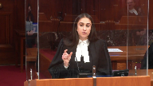
:::

But it was very clear there was a clear demarcation of duties

So when we look at the warrant we have to look at the authorization that existed above that and that was Canadian authorization that the military police went and sought out themselves and they sought that Authorization and they were the ones that executed that search so the Charter ought to be applied to their action

**Justice Karakatsanis** (01:08:30): And so, Ms. Mansour, let's assume for a moment that we agreed with you that the Charter applied.

::: {.column-margin}
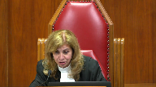
:::

Let's just assume that for the purposes of the next point, I think, and the next hurdle that you would have to deal with.

Assuming that it applied to the investigative conduct of the Canadian actor, in what way are you arguing that the search was unreasonable?

And I would ask you specifically to address the submissions made by your friends that, in fact, the warrant itself includes the electronic devices as well.

**Speaker 2** (01:09:14): Thank you.

::: {.column-margin}
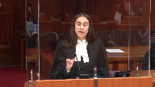
:::

So essentially that leads us back to that same reasoning.

It's the idea that this warrant existed, yes, and like I had indicated before, as an example, if the warrant provided the authority for abnc, if the Canadian authorization above that, that waived that immunity in a very particular way to not provide that authority, then despite what was written in the warrant, the authorization for the search was limited to what Canada authorized.

And in this particular case, we're indicating that the search was not authorized by law because it went beyond what was necessary.

So when we look at the queen and vu, particularly at paragraph 47.

**Justice Karakatsanis** (01:09:54): Saying that is it because you need to have two separate warrants?

I'm just trying to, how did it go beyond what was necessary?

**Speaker 2** (01:10:03): Thank you.

So essentially the idea is that in our position is that the authorization provided by the Canadian embassy was limited to the search of the individual's residence.

It didn't go beyond that

and we know you are.

**Justice Côté** (01:10:18): the view that it does not include what is found in the residence because when I read the letter, the diplomatic note, it says that to waive the immunity regarding the private residence as well as its papers, correspondence and property.

::: {.column-margin}
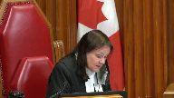
:::

So you think that it is not broad enough to cover electronic devices referred to in the warrant?

**Speaker 2** (01:10:47): Yes, that is our position.

::: {.column-margin}
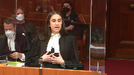
:::

Because according to the queen in view, you know, electronic devices, they're different.

They're not filing cabinets.

They're different receptacles and they require specific authorization in order and a clear explicit authorization in order to search those devices because they can't contain such personal and vast information.

So when we say that the search was not authorized by law and it went beyond what was provided, it's that the Canadian embassy only provided authorization to search the residents.

So that's the tangible products, not the search of the devices in particular.

**Justice Brown** (01:11:25): Advices don't come within property because the warrant also included property for the purposes of the investigation.

**Speaker 2** (01:11:33): Thank you, Justice Brown.

::: {.column-margin}
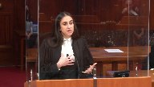
:::

In terms of the authorization provided by the Canadian embassy, it was limited to those tangible things.

And we know from this court's decision in the Queen and Vue that you need separate authorization to search the device.

And respectfully, the actions of the military police demonstrate that they were aware of this requirement because when they went back to Canada, they obtained that specific authorization to search the devices.

But this was after they had already searched the devices on scene.

And that's what the issue was.

**Justice Kasirer** (01:12:01): that the language papers correspondence and property in the diplomatic note reflects the language in the Vienna Convention that this is diplomatic language and the context to which it applies plainly extends to electronic devices otherwise the search would have been without really without purpose I mean it in other words to give that sense to property you really aren't you proposing and sort of an unreasonable interpretation of that word

::: {.column-margin}
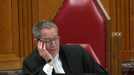
:::

**Speaker 2** (01:12:40): Thank you.

::: {.column-margin}
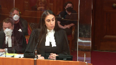
:::

It's our position that we're not because the military police are the ones that made the request for the waiver of immunity and the partial waiver of immunity.

They were aware of the obligation to obtain a separate warrant.

Again, that was clear by their actions and their conduct and what they did after the fact.

So had they wanted the search of the devices to be conducted on scene, that was something that they could have requested from the embassy.

The embassy was merely responding to the request that was provided by the military police.

And when we look at the language that's in the correspondence that was provided by the military police, they're merely requesting the search of the residents.

They don't make reference to the fact that they are intending to search the devices while on scene.

So yes, had this been any other situation and this was just maybe political jargon going back and forth, that may have been the case, but in this particular case, this is legislation.

The Canadian embassy, they're the ones that hold the immunity that the diplomat and the appellant benefited from.

And the military police were the ones conducting the investigation.

They determined how the investigation progressed and they could have sought that authorization, but they didn't.

And that's where the problem lies.

And that's why in our respectful submission, the search was not authorized by law in that sense.

And if I could return, I see my time is going down and I just wanted to return to our second submission, if I may, with respect to the consent exception.

So I know that the permissible rule exception is a contentious exception.

So I want to ensure that you understand from our perspective, from the appellant's respectful submission that even if the permissible rule exception were not to apply in Hape, the consent exception undoubtedly applies in this case because based on the facts of this case, the indicia of consent both explicit by way of international law and implicit by the conduct of the U.S. authorities that there was consent for the enforcement of Canadian law and the U.S. government's commitment to the U.S. government's commitment to the

**Overlapping speakers** (01:14:45): Who gave who gave the consent who gave who gave the consent specifically the u.s. authorities who are the u.s. authorities that you're referring to

**Speaker 2** (01:14:54): Thank you, Justice Brown.

::: {.column-margin}
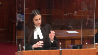
:::

So this is twofold.

In terms of the government of the United States, there are parties to the agreement.

Let's talk about the legislative consent.

That provides explicit consent to the enforcement of Canadian jurisdiction in their territory.

They are signatories to both the Vienna convention and the NATO sofa.

The Vienna convention establishes the inviolability that the appellant benefited from while on U.S. soil.

As well as his residents and his person.

The U.S. at the relevant time, again, was a signatory.

This is something that they consented to.

This was something that wasn't contentious in the lower court's decision.

I know military judge Pelletier understands that preposition.

Additionally, the NATO sofa, article 7, sections 1a, 3a and 6a stipulate that the military police, the Canadian authorities had jurisdiction over this individual in the investigation.

So by way of explicit consent, we have the U.S. authorities.

And then also by complicit consent with respect to conduct.

This was a Canadian-led investigation.

It's plain and simple.

Sergeant partridge was the lead investigator.

At no point did the U.S. Attempt to search jurisdiction over the appellant or the investigation.

The U.S. State Department was made aware of the actions of the military police while in their territory.

There's no evidence to suggest that they chose to interfere.

The U.S. authorities agreed to assist.

Sorry, who are those U.S. authorities?

The Alexandria Police Department.

Those are not U.S.

**Justice Brown** (01:16:29): authorities.

Those are state authorities.

Does that matter?

**Overlapping speakers** (01:16:34): respectfully from our respectful position.

**Justice Brown** (01:16:36): Can a municipal police force operating under the law of Virginia be taken as implicitly consenting on behalf of the government of the United States?

**Speaker 2** (01:16:48): Thank you, Justice Brown.

Respectfully, yes, and particularly when the U.S. State Department is advised of what's occurring.

**Justice Brown** (01:16:54): Put aside the U.S. State Department, can a municipal police officer acting under the authority of state law, state that is the state of Virginia, like subnational law, be taken as implicitly consenting on behalf of the government of the United States?

**Speaker 2** (01:17:09): Thank you, Justice Brown.

U.S. State Department aside, it's our respectful submission that this idea, and I know my friend has included that in the material, this idea of high-level state consent is not required.

**Overlapping speakers** (01:17:22): I'm not even saying high level, they're not even the same government.

**Speaker 2** (01:17:25): Thank you, Justice Brown.

::: {.column-margin}
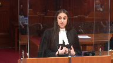
:::

It's our respectful submission that the Alexandria police department represented the U.S. Authorities.

And when we talk about the NATO sofa, the NATO sofa mandates cooperation between states.

So when the Alexandria police are the ones responding to that, it's our position that they are the ones providing their implicit consent by way of their conduct.

And respectfully in hate, it doesn't state that, you know, this high level government authority is required.

So it's our respectful submission that that is sufficient.

But again, in this particular case, the U.S. State Department was aware of the actions of the U.S.

**Justice Brown** (01:18:01): Provincial Fishery Officer investigating a fisheries offense on a non-tidal body of water in British Columbia and helping U.S. authorities in that regard for whatever reason can be taken as having implicitly consented on behalf of the Government of Canada.

::: {.column-margin}
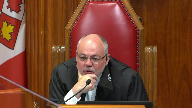
:::

**Speaker 2** (01:18:21): Thank you.

Respectfully, Justice Brown, our position is that it may, but that's not the issue essentially we're dealing with.

**Justice Brown** (01:18:27): don't get that.

::: {.column-margin}

:::

I just want to signal to you that to me is cuckoo.

The idea that someone from a different government can be taken as consenting on behalf of another government to me I might as well be taken as consenting on behalf of Germany.

It's Virginia and the government of the United States are not the same government.

**Speaker 2** (01:18:47): It's our position that the U.S. Authorities and the subset of that U.S. Authority, so whether it's the state of Palestine.

Subset of U.S. Authorities.

But all part of the U.S. Authorities.

It's the national ‑‑

it's like there's a bias.

It's like there's a bias.

**Justice Brown** (01:19:02): going on here, right?

It's just the vibe of the thing, right?

It's not the United States, but it's Virginia, but there are Americans too, and have, you know, let me point to SOFA, and there's stuff there, but, but, but, anyways.

**Speaker 2** (01:19:17): Respectfully Justice Brown.

It's our position that they still are police authority and Again, the US State Department was made aware of that

**Overlapping speakers** (01:19:25): Aside from that? Yes.

Aside from that?

**Speaker 2** (01:19:28): And there was consultation with the U.S. State Department between the Alexandria of the sorry the Alexandria Police Department and the state of Virginia because they were made aware of this fact that it's our position that that explicit and implicit consent is available and again consent can come in different forms and conduct can reflect consent and in this particular case it's our respectful submission that it does the U.S. State Department made no attempt to interfere why because they knew that this investigation was subject to Canadian jurisdiction and the actions of the U.S. Authorities and the Alexandria Police Department reflected that they obtained the warrant to assist the military police they breached the door secured the premises stepped aside and said Canada do your thing and the Canadian military police executed that search at no attempt did it did the Alexandria Police Department attempt to interfere at no point did they attempt to maintain control over the evidence at no point did they attempt to engage in the search they understood that this was a Canadian investigation pursuant to their obligations under the NATO sofa and when those items were seized they maintained they were maintained in Canadian military police possession and taken back to Canada so it's our respectful submission that the consent exception applies and thus the Charter ought to apply and I see that my time is running out if I may conclude so we have to remember that this is a case about the appellant this is a Canadian citizen subject to a Canadian investigation for a Canadian criminal offense and he provided this opportunity for us to apply the Charter to the actions of Canadian state actors outside of Canada and respectfully when we have a situation where we have permissible legislation that is applicable and clearly identifies investigative jurisdiction between parties and it the Charter does not apply in this particular context then in what case could it possibly apply rendering the Charter pragmatically meaningless outside of Canada and that's the concern and with respect to military members the portability portability of the military justice system allows Canadian criminal law to follow our members like corporal McGregor outside of Canada and apply that Canadian criminal law to them and they can be serving anywhere in the world and they're still subject to that Canadian reach and that Canadian prescriptive and adjudicative jurisdiction as well as enforcement jurisdiction so with that the Charter should apply and it's our position that both exceptions in the hate test are satisfied in this particular case the Vienna Convention and the NATO SOFA are permissible international rules that necessitate the application of the Charter as well as the consent exception the consent exception does apply and the Charter must apply therefore to the actions of the military police again we're not subjecting this we're not attempting to suggest that it applies to the state of Virginia only to the actions of the military police and it would not interfere with customary international law to apply that Charter standard to our actors subject to any questions those are submissions thank you very much

::: {.column-margin}

:::

**Justice Wagner** (01:22:31): Thank you very much, Mr. Vannert.

::: {.column-margin}

:::

I will ask Mr. Vannert.

**Speaker 3** (01:23:12): Chief Justice, shall I begin?

**Justice Wagner** (01:23:14): Yes, go ahead, please.

Yeah, we cannot hear you, Mr. Lannert.

I couldn't hear you.

Can you hear me now?

Now we can hear you.

**Speaker 3** (01:23:31): Yes.

::: {.column-margin}

:::

All right, I'll begin then.

Thank you.

Thank you, Chief Justice.

Chief Justice, Justice Brown directed us to a key passage in HAPE at paragraph 93, where the majority said that the extraterritorial implications of applying the Charter are central to the question whether the activity in question falls under section 32.1.

That was indeed the ratio in HAPE, and the majority concluded that Charter scrutiny of the conduct of Canadian officials working abroad involves an extraterritorial application of Canadian law contrary to international law.

But that's not so.

It is not.

**Justice Rowe** (01:24:11): So you're going to say flat out, head on collision, that Hape was dead wrong, and you're going to put us right.

**Speaker 3** (01:24:18): I'm going to say that at the heart of HAPE is an international law error, and it was caused, as Justice Binney tells us in his reasons, by the fact that there were no submissions on the international law question before the court.

::: {.column-margin}

:::

The court had no help at all about this.

The court was trying to get international law right, but it hit the post.

And so if we correct that, the confusion in my respectful submission that comes from the HAPE analysis can be cleared up.

And the correction is this.

It is not contrary to either international law or international comity for a Canadian court and a Canadian criminal trial taking place here to permit a criminally accused person to invoke his rights under the Canadian Charter.

And that is so even when the Canadian state conduct that's being complained of took place in a foreign country.

There's simply nothing extraterritorial going on in such a judicial proceeding. Why?

Because it happens here.

Now, the HAPE court was right to note that under international law, states generally may not exercise coercive power outside their borders without the consent of a foreign state.

But that principle is simply not engaged when Canadian judges decide constitutional claims concerning the conduct of Canadian state officials.

Again, even when those officials were exercising their functions outside the country.

The judiciary is not an expeditionary force.

It doesn't coerce anyone beyond our frontiers.

The predicament in HAPE is not about a conflict between Canadian law and international law, even though the majority thought so.

It's a conflict between domestic criminal laws and procedures and foreign criminal laws and procedures.

Canadian officials, when they go abroad, must comply with the host state's laws and procedures, and they're going to be different from ours.

But the conduct of those officials must ultimately be judged in our country.

**Overlapping speakers** (01:26:18): for you.

**Speaker 3** (01:26:18): against Canadian constitutional standards.

::: {.column-margin}

:::

And the Court in Hape was right that a rigid application of our own constitutional standards to those foreign investigations is just impossible.

And Justice Moldavar suggested that there's gonna be a need for a margin of appreciation.

That's what motivates the Court in Hape and they're right about that.

But the way to meet that concern, the way to avoid parochialism and not be the ugly Canadian insisting on our procedures and our laws being followed, when we say we need two warrants and you say you only need one and all that, the way to avoid all of that is not by disentitling criminally accused persons to access charter protection.

It's to be done through remedial discretion.

That is to say that when an accused person challenges Canadian participation in some foreign investigation or proceeding, the Court should first determine whether the official's conduct infringed or denied some charter, right?

And then if so, do as section 24 says, consider an appropriate and just remedy in the circumstances.

And that inquiry should be informed by international comedy considerations, the considerations that the Hape Court was rightly motivated by.

But the Hape Court puts those into section 32 and effectively dis-applies parts of the charter.

And I say that the proper place for those considerations is at the remedial stage.

In some cases, the difference between Canadian and foreign standards is going to be minor.

And comedy is gonna call for exactly what Justice Moldaver said and what international human rights law speaks about, which is a margin of appreciation in favor of the foreign approach.

But there could be other cases where the gap between what's permissible abroad and what Canadian constitutional law expects of our officials is going to be so great that the Court has to grant relief.

And that too is consistent with Hape.

The Hape Court rightly said, international comedy ends where fundamental human rights violations begin.

**Justice Martin** (01:28:18): Excuse me, Chief Justice, if I may ask a question, how is what you're proposing consistent with the wording of section 32?

**Speaker 3** (01:28:26): it's consistent with section 32 because the charter applies federally and provincially.

::: {.column-margin}

:::

There's no place in which the charter does not apply.

It applies federally and provincially to all government actors at either level of our government.

And that, it is a full coverage there.

There's no breaks in it.

And the difficulty with the hate decision in my submission is that it creates a break.

It creates a gap where there was not intended to be one under section 32.

**Justice Wagner** (01:28:58): Thank you very much.

**Speaker 4** (01:29:06): Chief Justice, Justices, the text of Section 32 is clear, as is this Court's jurisprudence in Slate Communications and McKinney, that the conduct of government officials falls within the authority of Parliament and is subject to the Charter.

::: {.column-margin}

:::

Justice Brown, to address your concerns, if we look actually to paragraph 94, just below the paragraph you identified earlier, the majority wrote the fact that a state actor is involved is not in itself sufficient.

The activity in question must also fall within the matters within the authority of Parliament.

With respect, this is wrong under international law.

As a matter of fact and of law, this finding is incorrect.

Canadian legislation can and does authorize the extraterritorial enforcement of Canadian law, and Parliament has passed legislation allowing such conduct under the National Defense Act, under the Canadian Intelligence Services Act, under the Communications Security Establishment Act.

This conduct may violate international law and foreign law if it's done without host state consent, but that doesn't mean it falls outside the authority of Parliament.

The Canadian Armed Forces, for example, can and has deployed abroad without consent of a foreign state.

In Kosovo in 1999, in Afghanistan in 2001, the CAF conducted its operations abroad without consent of the local governments.

**Overlapping speakers** (01:30:32): And extensively in Germany in World War II, for example.

**Speaker 4** (01:30:37): And certainly those deployments fall under the authority of Parliament, but per the majorities raising in Hape, CAF members deployed in Afghanistan in those early months were not protected by the Charter because Canada didn't have the Taliban's consent.

::: {.column-margin}

:::

Similarly, had the CAF deployed ground forces to Syria to fight ISIS, Hape tells us that the Charter would not govern the actions of the CAF nor protect CAF members without Canada first obtaining the consent of the Assad regime.

This gap is unnecessary because it was created by a flaw in the majorities raising in Hape.

All this court needs to find to rectify that gap is to reach a straightforward conclusion that when Canadian federal officials are authorized by Parliament to exercise Canada's jurisdiction in a foreign state, they fall within the authority of Parliament.

Now, this finding is not only common sense, it is consistent with international law, namely the rules of attribution under the law of state responsibility.

Under customary international law, state responsibility will attribute the actions of Canadian government officials to the Government of Canada in almost every instance.

In other words, their actions fall within the authority of Parliament regardless of where they occur.

Whether that conduct is attributable to state and as such under a state's authority has nothing to do with whether that conduct was lawful under international law.

More importantly, the principles of jurisdiction permit the extension of Canadian rules and obligations on Canadian officials anywhere in the world and the adjudication of that conduct in Canadian courts.

This is the real issue.

Finally, no international court has ever suggested that the principles of jurisdiction or sovereignty make it impermissible for a court to place additional rules and obligations on its government officials when they operate abroad and then adjudicate whether or not they were made out in their own courts.

The ICCPR interpreted by both the International Court of Justice and the UN Human Rights Committee have found that a state's human rights obligations can apply extraterritorially.

The same has been found by the European Court of Human Rights and several foreign courts including the UK Supreme Court.

In each instance, they have found that their state's human rights obligations travelled with their government officials abroad.

If international law did not permit this, how could these courts who are also obligated to interpret their human rights instruments and their obligations in line with international law have come to the same conclusion?

The problem is with HAPE and the HAPE finding that matters fall outside the authority of parliament if they violate international law.

That's not the test.

Moreover, the consent exception articulated in HAPE strips Canada of its sovereign right to constrain the actions of its officials.

It gives foreign states a veto over the application of the Canadian constitution.

Again, there is no basis for giving Assad or the Taliban this veto power under international law.

Thank you for your time, and thank you for your time, and thank you for your time, and thank you for your time, and thank you for your time, and thank you for your time, and

**Justice Wagner** (01:34:06): Thank you very much.

**Speaker 5** (01:34:12): Good morning, Chief Justice.

::: {.column-margin}

:::

Can you hear me? Yes.

Yes.

Good morning, Chief Justice, Justices.

The Canadian Constitution Foundation intervenes in this appeal to make two points.

First, that the actions of Canadian officials abroad should be subject to scrutiny for constitutional compliance.

And second, that the concerns that are expressed in this Court's jurisprudence on the extraterritorial application of the Charter can be accounted for in assessing Charter compliance, as Justice Basterasch explained in his concurring reasons in Hape.

And this goes to a point that Justice Moldava raised earlier in the margin of appreciation that we raise in our factum.

Now, we say that this area of law should be aligned with the text and structure of the Constitution, and my friends have already addressed the textual argument and the points raised by Justice Brown this morning.

But I would add that Justice Basterasch addresses this at paragraph 161 of his concurring reasons and says that if this does not fall within the authority of Parliament, then the officers at issue would have no jurisdiction whatsoever to conduct an investigation abroad.

They would have no jurisdiction to be there in the first place.

Secondly, we would say that if that was the case, if this did not fall within the authority of Parliament, then the Cotter cases would have to be revisited.

And we say that that should not be the case.

And the ECHR, the European Court of Human Rights, rejected this argument or considered the argument and rejected it in the Al-Skhani case.

And this goes to our third point in our factum, which is the Commonwealth jurisprudence that we cite helps show that contrary to the holding in HAPE, there is no rule of international law that prevents a state like Canada from applying its law to its own officials.

And what we would add to that is that the ICCPR and the interpretation that's offered by the UN Human Rights Committee, which predates the adoption of the Charter and so provides relevant context to interpreting the meaning of Section 32, suggests that Canada is in fact obliged to apply the Charter abroad.

More importantly, the Court has created an exception to the bar in HAPE for violations of international law and fundamental human rights.

Yet we know that the Charter is the means by which Canada implemented its international human rights law obligations in 1982.

And we say that choice should be respected.

Now, to the point raised by Justice Jamal and Justice Moldaver, the test that we're proposing, we say that you can account for the circumstances like this in assessing Charter compliance, sometimes within the right itself, as is the case here with Section 8 or pursuant to Section 1.

We're asking the Court to adopt a three-part test to determine whether the conduct of Canadian officials abroad is consistent with the Charter.

First, are they acting pursuant to valid laws or procedures?

Second, if so, is their conduct substantively different from the principles emanating from the Charter?

And three, if so, is a substantive difference reasonable or justified in the circumstances?

Now, in our factum, we outline our proposed test in some detail, but I'd say that the thrust of our position is that the conduct of Canadian officials abroad will only be inconsistent with the Charter in exceptional cases.

Specifically, we're asking the Court to adopt the shock-the-conscience standard from its extradition and deportation case law when undertaking the third step of our proposed framework.

We do this for practical reasons, because this is a framework that Canadian courts know well, but also because it conveys the idea that only gross human rights violations will justify the intervention of courts.

This assures citizens that their fundamental rights will be respected while giving the executive some room to maneuver abroad.

And we say in our factum that, in fact, courts routinely assess state conduct for compliance with rights and freedoms in pluralistic contexts.

This Court, for example, has adopted a similar approach in order to account for Canada's federal structure and accommodate the civil law tradition and culture.

And the European Court of Human Rights has done the same thing.

So in this case, we're asking the Court to look to democracies generally in establishing the relevant consensus when determining whether the conduct of Canadian officials abroad is reasonable or justified.

Now, in our factum, yes.

I see a mic, nope.

In our factum, we briefly address how each of these steps can be undertaken, and there's debate between the parties at each of these steps, and we leave that to you.

But we note as well that the military judge here did apply Justice Basterasch's framework in the alternative, and so we'd submit that to the Court as well for its attention.

In sum, this Court's extradition and deportation case law shows that Canadian courts already have the tools to deal with cases like these.

We ask the Court to say so clearly and to reaffirm the importance of the rule of law in a free and democratic society.

**Justice Wagner** (01:39:25): Thank you very much.

Thank you.

Mr. Gerald Chen.

**Speaker 6** (01:39:31): Thank you Chief Justice and Justices.

::: {.column-margin}

:::

On behalf of the David Asper Center for Constitutional Rights, I echo much of what my friend from the BCCLA said in his submissions, but I want to approach that issue through the lens of the trial fairness exception that HAPE articulated in the subsequent case law that is interpreted.

Under HAPE, even where you don't have the foreign states consent, even where Canada doesn't have the foreign states consent, a Canadian court can scrutinize the manner in which Canadian state actors have obtained evidence abroad and grant a charter remedy, such as exclusion under 24-2.

In doing so, however, HAPE limits the Canadian court to looking at two specific provisions of the charter, section 7 and 11d, insofar as they relate to trial fairness.

And the question is whether there is a principal basis to limit the analysis to these two specific provisions, and we say there is not.

As the Court Martial Appeals Court pointed out in this case and its reasons below, paragraph 57, sections 8 to 14, the other legal rights in the charter, are illustrative, are merely illustrative or specific manifestations of the rights in section 7, and indeed this court recognized that all the way back in 1984 in the motor vehicle reference.

Now HAPE says you can distinguish between sections 7 and 11d on the one hand from the other charter rights, the other legal rights, because sections 7 and 11d merely call for an ex post facto review of Canadian state conduct rather than an ex ante prescription of what the Canadian state actors can do abroad.

But even if you leave aside for the moment whether that distinction matters for jurisdiction, that distinction, I would submit, has proven to be unworkable.

And if you look to the Court Martial Appeals Court's analysis in this case, when they applied the trial fairness exception, so first they say the charter doesn't apply under HAPE, they then get to the trial fairness exception and what they do is they look at whether the search was authorized by a warrant, whether it expressly authorized the search of computers, whether it was executed in a reasonable manner, and in any event whether the evidence should be excluded under 24-2 pursuant to the three grant factors.

That's a classic section 8, 24-2 analysis and is not very different from simply applying section 8 from the outset.

**Justice Rowe** (01:41:50): Well, you know, it seems to me you're making a devastating argument that there is no problem here, that there's an adequate remedy for an accused, and it seems you've cut the ground up from under two feet.

**Speaker 6** (01:42:03): Well, with respect, Justice Rowe, I would go in the other direction.

::: {.column-margin}

:::

What I would say is if you accept that sections 7 and 11D can be applied to provide a remedy for the actions of Canadian state actors abroad in a Canadian courtroom, there's no principle basis to stop there and to not examine the actions of Canadian state actors abroad under the principles of the Charter and the provisions of the Charter that are well known to Canadian state actors, namely sections 8 to 14, and the other Charter rights, there's no principle basis to distinguish between those two, because in either scenario...

**Justice Rowe** (01:42:42): matter of pure logic you've told us, which I think is a dubious proposition, that what's in 8 and 14 is entirely encompassed in 7, and therefore if you have the protection of 7, you have the protection of 8 through 14.

That's what you've told us.

**Speaker 6** (01:42:57): Well, let me first address the premise of your question, Justice Roy, I would respectfully challenge the notion that it's a dubious proposition because what this court said, going all the way back to the motor vehicle reference, but in any event, this court can add value by clarifying the law in this respect, by clarifying that the Charter can apply to the actions of Canadian state actors abroad, not simply trial fairness, which in and of itself is not a particularly clear notion.

::: {.column-margin}

:::

And we see that from the way the Court Marshall's Appeal Court applied that analysis in this case.

Frankly, we see that from the arguments being put forward to you by the Attorney General of Ontario and the respondent in this case as to what trial fairness should mean.

**Justice Moldaver** (01:43:41): practically.

::: {.column-margin}

:::

I'm sorry to interrupt you, but I'm trying to understand this practically.

If the foreign state says, forget about search warrants, we don't bother with them over here, what is it that you want?

We'll go down and break the door of the home, open at night, and we'll have no warrant, no nothing, and we'll seize whatever it is you want, doesn't matter, you can take it.

Now, what is the state actor from Canada supposed to do?

I'm trying to understand where this goes, because almost certainly, when that evidence comes back to Canada, it would be the kind of situation where it seems to me the court would throw it out on the basis that it would just bring the administration of justice into utter disrepute if we relied on evidence of that nature.

That's totally foreign to the values we have.

But I'm trying to understand what can they do?

What are they supposed to do?

Or is your point and all the point of the interveners here just to say, hey, it does apply.

They've got it wrong.

It does apply to state actors.

But I'm trying to look at what practically this means.

And sorry, you're over the time.

**Speaker 6** (01:44:54): I'll try to answer your question, Chief Justice, if I may, as briefly as I can.

::: {.column-margin}

:::

Go ahead, please.

All we are saying – we are saying that Cape got it wrong as far as the Charter should apply, Section 8 should apply in that scenario, but of course we agree with our colleagues that there is a margin of appreciation there, and not just at the remedial stage, but Section 8 in and of itself doesn't mandate specific procedures such as a warrant in every case.

What Section 8 does is call for a reasonable search and seizure.

You can build a margin of appreciation into that, and it would be both more principled and practical and coherent to do so by applying Section 8 rather than relying on an amorphous notion of trial fairness.

Thank you, Chief Justice.

Thank you, Mr. Chen.

**Justice Wagner** (01:45:35): The court will take its morning break, 15 minutes.

::: {.column-margin}

:::

Please be seated.

**Speaker 7** (01:46:56): Chief Justice, Justices, I'll be sharing our time with Colonel Natasha Thiessen, about our time, so around 30 minutes each.

::: {.column-margin}

:::

My colleague will expand on this further, but the core issue in this case is simple to resolve.

Section 8 of the charter did not apply to the search of the appellant's residence in the United States, because Virginia state law under which it was conducted is not within the authority of parliament or a provincial legislature.

This was correctly assessed by the military judge in the court-martial appeal court.

As a result, we invite this court to dismiss this appeal.

But since the appellant and several interveners make bold claims about gaps in the protection afforded to our Canadian Armed Forces members, or CAF members, when they are abroad, I will first explain the military context of our deployments and why there is no gap.

It's important for us as respondent here, but also as representative of the military prosecution service for this court to understand this, and also for the CAF members who will read your decision to also know this.

To do so, I'll provide our central thoughts about this case, the main points we want to leave you with today.

I'll talk about Canada's obligation to maintain discipline over its forces abroad at all time.

I will talk about the code of service discipline.

And finally, I will address the NATO SOFA, which is short for North Atlantic Treaty Organization Status of Forces Agreement.

Then Colonel Tissin will explain how this case is a straightforward obligation of hate, and describe to you why the charter did not and could not apply to the search of the appellant's residence in the United States.

She will finally explain why this is not the proper case to revisit hate, as some of the interveners would want this court to do.

Now, these are the two points we want to emphasize today.

First, CAF members are protected by the charter when the code of service discipline is enforced by our military investigators or prosecutors, and this anywhere in the world.

The only exception to this principle is in the rare occasion where our laws can't be enforced under international law for a specific investigative step.

Therefore, the protection of the charter cannot find application.

This will become clear in our submissions.

Second, the framework established in hate is sound in principle, effective in practice, and works well with the military justice system, as this case demonstrates, and as my colleague will explain to you.

It provides guidance to our CAF investigators in these occasional situations where they need to seek assistance from foreign authorities.

At paragraph 105 of hate, this court says that the enforcement of a Canadian criminal legislation in another country can only take place with consent from that foreign state or by the application of another rule of international law.

One of these circumstances will always apply to our military justice system when our troops operate outside Canada.

There is never any gap.

If there is no state from which to obtain consent, then the military justice system operates independently.

Any state that deploys or projects its forces abroad has the obligation under international law to maintain control over those forces and to ensure their internal discipline at all time.

As we explained in our material, this principle can be traced back to the concept of the law of the flag, as it is described in the 1812 Schooner Exchange US case, which concerned the question of jurisdiction over an imperial French warship visiting the United States.

**Justice Martin** (01:51:30): Can I interrupt you right now to ask the question then, understanding all of those principles and that the Charter generally will travel with the troops under the law of the flag.

::: {.column-margin}

:::

It seems to me that it's a very small step to say that the Charter should apply to this instance because Corporal McGregor by the happenstance didn't live on the base and lived in a different kind of living arrangement.

So it just seems to me that all the principles that you're bringing here sort of suggest that there is a gap and what's the problem with filling it with the comparable situation that would apply to any other member of the CAF.

**Speaker 7** (01:52:20): Thank you, Justin Martin.

::: {.column-margin}

:::

I would say the following is that there is no gap in the sense that if ever there is no consent, our military justice system will apply completely and therefore Canadian law will be enforced and therefore the charter protections that accompanies these laws, especially when we talk about criminal law, will be in place and the protection will be afforded.

**Justice Martin** (01:52:44): Is my assumption correct, which is that if Corporal McGregor had been living on a base, the Charter would have applied just in a straight-up fashion here?

**Speaker 7** (01:52:55): You are correct and as a matter of fact, this is where I was going is that when there is a consent, first of all, when our troops deploy with the consent of a nation, we maintain our jurisdiction and when there is consent, we get into an agreement akin to the NATO SOFA or whether it's the NATO SOFA or any kind of status of forces as a punctual agreement and where we will concede some jurisdiction with that host nation is when we trust the legal system of that host nation and when we do so, then it is open as part of the agreement for that host nation to prescribe when the jurisdiction, the concurrent jurisdiction will interact and where as in this case, where if outside of a base, for instance, the territorial reach of the code of service discipline ceases and in these cases, HAPE provides the framework to answer the question as to who should authorize what.

::: {.column-margin}

:::

**Justice Karakatsanis** (01:54:01): But, I'm sorry, I'm coming back to the gap because the argument over here, because the argument is that the issuance of the warrant was not within the authority of Canada.

::: {.column-margin}

:::

The issuance of the warrant was a local, the authority of a foreign state.

So if that is so, why, I mean, I'm looking at section 32 and I'm reading language which is very broad, all state actors in respect of all matters within the authority of parliament.

And my question to you then is why does the issuance of a warrant at that level of particularity, why is it that we're examining whether that is within the authority of parliament when what we're really talking about here is a charter right against unreasonable search and seizure by a Canadian state actor.

And the issuance of a warrant is just one component of determining whether the Canadian actor's actions were reasonable.

So I'm just having a great deal of difficulty understanding the underlying premise that section 32 is not looked at broadly but looked at actually examined in the context of a particular warrant which was the means by which they got in the door.

And why, in fact, we need to have a gap when our charter is flexible enough to take into consideration when someone has to act when a Canadian actor needs the assistance or authority of a foreign state and that would...it's flexible enough to recognize and respect the jurisdiction of foreign authorities.

So that's a long question

but I guess what I'm doing is questioning the underlying basic principles of your arguments.

**Speaker 7** (01:56:01): I understand your question.

::: {.column-margin}

:::

I'll say the following.

I think a lot of the interveners, and my colleague will add to this, but a lot of the interveners make a mistake when they say, and perhaps this is the source of a question, when they say if we can apply section 7 and 11d here in Canada, then it means we could apply section 8.

I think the assumption that allows them to say this is that section 8 does not have an effect on the ground at the time of investigation.

But it does.

The effect of any standard, even if we go back to the words of section 8 that just talks about reasonableness, the effect of any standard that will be assigned to that section 8 criteria, even if it's a tentative definition that would apply abroad, would have an impact on the ground at the time of the investigation.

And that would have an extra effect, especially in the case of section 8 where we talk about a search and seizure of a residence, which is a very high sovereignty action.

**Justice Karakatsanis** (01:57:12): Okay.

So the effect you're saying is just because it's on the territory.

It's in no way inconsistent with their authority.

It's in no way disrespectful.

But you're saying the fact that it happens in that residence, no matter what, the Charter can't apply.

**Speaker 7** (01:57:30): It can't apply because, first of all, section 32 as alluded by your colleague Justice Brown, the action here is not the global investigation or the status of investigator of those conducted investigation, which could go to make.

**Justice Karakatsanis** (01:57:47): I mean, why?

Why do we have to take it down to the level of granularity that it's the warrant that's at issue here?

Well, because...

**Speaker 7** (01:57:54): Because the action in this very case is the search and seizure.

::: {.column-margin}

:::

And while their conduct in general or what I mean is their status as investigators could go to defining them as actors of the state, so the first problem, but the specific conduct in this case and to which relate the words of section 8 is the search and seizure.

And this is not within the authority of parliament.

The thing is as some interveners try to say is they try to say let's redefine section 32, sorry if I said 32, redefine it without considering the interpretation presumption of compliance with international law.

That is all good if you work on the assumption that section 8 doesn't have any impact on the ground.

But if it does, because it does, it will influence how investigators operate outside Canada.

**Justice Côté** (01:58:49): So, Mr. Germain, so to follow up on that, you say that the search in Oran was not within the authority of Parliament.

::: {.column-margin}

:::

I understand that it was issued by the law of the state, but the Canadian state actors who were there, when they were doing the triage in the residence, they were acting under what authority?

I mean, the Canadian investigator, they were not working for the state of Virginia.

Well, they were working under their authorities, correct?

Under the Virginia state authority, you say?

**Speaker 7** (01:59:27): Yes, under the legal umbrella of the state of Virginia.

**Justice Karakatsanis** (01:59:31): Are they not acting under the authority of both, the warrant and their obligations as a Canadian state act?

**Speaker 7** (01:59:38): Yes, and I think that you're correct, assistant, that would mean that they need the first threshold of they are actors of Canada.

::: {.column-margin}

:::

There's no doubt about that.

But then their action when they enter that door and throughout the search is all under the legal umbrella of the state of Virginia warrant which if I may add included a provision to search the devices itself which is akin to the requirement.

I understand that.

**Justice Karakatsanis** (02:00:04): But what you're asking us to say is that that investigator, when he was actually conducting the search in the premises, was not acting in respect of a matter within the authority of Parliament.

::: {.column-margin}

:::

His investigation of that particular crime, doing a search of those premises, which was, yes, authorized by the warrant, but also authorized by his various duties and responsibilities.

You're asking us to just say that there was a gap there.

**Speaker 7** (02:00:37): But it depends what you mean by gap.

There was no enforcement possible.

So it goes back to many justices' question.

What would have been the option?

There was no alternative.

**Justice Karakatsanis** (02:00:50): Why are we talking about enforcement coercion?

He was conducting a search, and his conduct, in any event, at this time, was a threat to the police.

**Overlapping speakers** (02:00:57): I think you have my point.

**Justice Brown** (02:00:59): I wonder if it might be helpful in thinking this through and going back to your point about well, the impugned action was the search and the seizure.

::: {.column-margin}

:::

Might your answer to my colleague Justice Karakatsanis be different if the challenge was actually to the obtaining of the warrant on whatever grounds?

I don't know Section 15.

I hear Section 7 is marvelous and encompasses all kinds of things.

We don't need 8 to 14 of the charter.

But if there's some other challenge, basis for a challenge to say the obtaining of the warrant, would your answer to my colleague be different?

Would that not fall within the language of 32 then?

**Speaker 7** (02:01:41): Well, it could very well, and my colleague...

**Justice Karakatsanis** (02:01:46): at what the nature of the challenge was.

The challenge was to the obtaining of the warrant.

**Justice Brown** (02:01:51): Well, the challenge is to the admission of evidence obtained under a search and seizure.

**Speaker 7** (02:01:54): Yes, and my colleague will talk more about this, because in this case, there is consent, and I will explain shortly how this consent interacts with that specific investigation.

::: {.column-margin}

:::

My colleague will explain shortly that actually the consent by the NATO SOFA included all the investigative steps all the way to the search, and therefore, in these cases, there was an enforcement of the code of service discipline directly by consent, and all the way after the search, and that's why, for instance, the applicant was arrested and given his right in the United States, his 10B rights, because the charter applied to that arrest, the CFNS investigators had enforcement power because of the consent of the NATO SOFA, and they did this, but in the very window of the search, obtaining the search warrant and conducting the search was prescriptively restricted in the NATO SOFA, so the same instrument that provided consent from the United States to conduct that investigation prescribed that in these very circumstances, the investigators would need to have recourse to United States authorities.

**Justice Rowe** (02:03:05): Okay, I'm going to insert this here because I can't think of when the right point to insert it is, but I do want to make the point.

::: {.column-margin}

:::

Is this not, is there not an element of confusion which has crept into the analysis here, at least the submissions, because on the one hand, Corporal McGregor is a member of the Canadian Forces and therefore his presence in the United States is governed to some degree by the SOFA, but he's also the military attaché, isn't he?

And therefore it is by virtue of being the military attaché that he has diplomatic immunity, not by virtue of being a member of the Forces. Correct.

And so, and so the lift, the waving of the immunity in a sense didn't matter that he was a member of the Forces, it was because of his diplomatic status.

So I'm not sure that this kind of plays into your analysis, but in the submissions until now, the two seem to have been, how can I put it, the relationship between the two has not been maintained with any clarity.

And so I just mention it now because there's two lines of authority here, there's two sets of things happening because he's in a sense got two hats, he's Canadian Forces, but he's also a diplomat.

I'll leave it at that.

**Speaker 7** (02:04:26): I understand your question and it goes back to Justice Brown's comments.

::: {.column-margin}

:::

Vienna convention and the protection is not an authority of any kind.

It was in this case something that applied just because he happened to be also part of the diplomatic mission to the United States, but it is in this case something that needed to be removed just to allow the United States to provide this cooperation needed by the CFNIS and actually that is mandated in the NATO sofa that says both the receiving and sending state will cooperate with each other to ensure the execution of the jurisdiction of each party.

So we needed to lift this immunity to allow this.

And in no sense did that warrant or that diplomatic note needed any kind of language akin to a warrant of that nature.

**Justice Martin** (02:05:23): But your friends that make a very simple point, which is that the CFNIS and Corporal McGregor are on U.S. soil by authority of Parliament.

How do you address that?

**Speaker 7** (02:05:38): Yes, they are.

::: {.column-margin}

:::

And also enforcing the code of service discipline which is embedded in the national defense act with the consent of the United States as a permissive rule.

In this case when this is enforced the protection of the charter accompanies that all the way until that consent ceases and the consent ceases when it's about a territorial enforcement outside a base or camp when there is no agreement with the United States to occupy such base or camp with units or formation specifically.

When a member is outside such area living in a private house in the local communities the consent we just said existed ceases to exist.

After the search that consent starts again.

**Justice Kasirer** (02:06:36): Can you explain to me, can you explain to me you drew a distinction earlier between the arrest and the search?

How does that distinction play out here, assuming that the arrest is made off the base?

**Speaker 7** (02:06:49): How does that yes for sure so as it was a load alluded to by my friend the National Defense Act does have You know a prescriptive international reach

::: {.column-margin}

:::

but it also has an enforcement reach outside Canada and It includes that the military police can arrest CAF members anywhere in the world courts martial can take place anywhere in the world and the the even the Canadian military commander can issue a warrant for the search of a CAF members private residence and quarters in a foreign state so long as the this quarter is under the control of the Canadian Armed Forces and Everything I just described there was consented to by the United States to be exercised in their territory and Charter would apply to all these let's say enforcement powers

But that last one.

I just mentioned the search of a CAF private Private quarters in the foreign state it needs to be under the control of the cat the Canadian Armed Forces For this warrant to be issued which happened to match one of the condition in the NATO sofa that says that you can police your camp if you are in a unit or a formation which means somewhat of a large and autonomous group that you occupy a base or camp which means you know obviously a delimited or a identifiable area and that this occupation of the camp Be approved by an agreement with the receiving state okay

**Justice Rowe** (02:08:29): So okay, there's a Canadian forces member at NORAD and, you know, let's say this is a male and has a girlfriend or something in town and part of the time when he can get away he lives with his girlfriend which is fair enough and he gets into this, you know, really bad bar fight and he ends up sort of at the girlfriend's house and the Canadian forces can't just burst down the door, they have to go presumably to Boulder, I guess it is in Colorado, wherever NORAD is and say, look, you know, our guy is in there

::: {.column-margin}

:::

but we can't get at him, you've got to help us with this, isn't there sort of a parallel there?

**Speaker 7** (02:09:13): That's exactly it, that is exactly it.

**Justice Moldaver** (02:09:18): Could I ask you this, could I ask you this, upon the arrest, are you saying that the Canadian authorities would give this person their 10A and 10B rights? Yes.

**Speaker 7** (02:09:30): And this is what is different from, and thank you, Justice Mulder, for this question, this is what differs from other cases from, for instance, an investigation that our CMP would conduct abroad.

::: {.column-margin}

:::

In our case, even if authority was required by the United States to enforce, to execute the search and warrants, the enforcement jurisdiction over the member of the CAF never ceased throughout that process.

There's never any gap of the enforcement jurisdiction of our investigators over this CAF person, the person itself, not necessarily his residence.

So that's why.

**Justice Moldaver** (02:10:10): the United States wanted to arrest him?

What of Virginia?

What if he'd done this to an American citizen?

**Speaker 7** (02:10:16): Well, if that would have happened, then my friend was correct that a discussion would have ensued with our authority to see, okay, there's jurisdiction, let's say our soldier assaults a civilian in the United States, an American.

::: {.column-margin}

:::

In this case, this provides clearly that the primary jurisdiction is to the United States because he assaulted someone in the United States as opposed to if he would assault or commit any other crime against a member of our forces, then we have primary jurisdiction.

**Justice Moldaver** (02:10:49): In this case though, if it was, just take this exact case, he's a Natasha, I think Justice Roe said, so he's got diplomatic immunity.

::: {.column-margin}

:::

So United States has jurisdiction, they want to prosecute and they say, Canada, we need you to get rid of the property restriction and to allow us to arrest them on a criminal offense, right?

And what if Canada says, no, we want them.

**Speaker 7** (02:11:17): Well, in this case, the Vienna Convention would take over.

::: {.column-margin}

:::

What would take over?

Well, Canada would decide at that point.

And that's why we say that in this context, the Vienna Convention came to play because of the point Justice Roe just mentioned.

And my answer just with your question, ignore that portion.

If we bring back the Vienna Convention in the equation, for sure that would be another layer of discussion that would be independent of the pure enforcement jurisdiction in the sense that if at that point it would no matter be a primary or secondary, there would be at that point an immunity if the United States would want to do anything, and then it would become a diplomatic discussion.

**Justice Martin** (02:12:04): So you're drawing the distinction between the person and the property.

::: {.column-margin}

:::

And I guess I'm just so if Corporal McGregor was there when the search and seizure was being conducted and an officer, I just did something to him physically, he would have a charter right on that.

But because it was to property, i.e. a seizure, you're saying it's outside the charter application. Yeah.

**Speaker 7** (02:12:33): Yes, I probably should have used the territorial enforcement jurisdiction as opposed to use the property, but yes.

**Justice Martin** (02:12:41): but there would be territorial enforcement jurisdiction over his person if he had been beaten, for example, during an arrest or during the execution of the warrant.

**Speaker 7** (02:12:53): Yes, Justin.

**Justice Rowe** (02:12:53): Hang on now.

::: {.column-margin}

:::

If the Canadian Forces, NIS, the provost, had gone in and punched this guy out, I mean, they'd be in trouble with the American authorities.

They're operating inside somebody else's jurisdiction.

There is no extra territoriality in the sense of you can go in and do what you want.

The waiver was for a very limited purpose, and the Americans couldn't have arrested the guy because he was still covered by diplomatic immunity.

I mean, this is the overlayer that sort of complicates things.

**Speaker 7** (02:13:37): Correct.

::: {.column-margin}

:::

And just to be clear, when they were operating under during the totality of the search they were working under the umbrella, legal umbrella of the Virginia state.

If an investigator at that point was to hit corporal McGregor as was alluded to, of course any statement after that, you know, would be in question but more importantly as was just said, at that point it would be our jurisdiction to criminally prosecute for assault.

And in this case, while you're right, he would have been committed a crime in the United States, our NATO would say wait a minute, in this case a CAF member which is our investigator assaulting another CAF member which was the accused or the subject at that time, Canada's primary jurisdiction to complete the.

**Justice Martin** (02:14:24): Right, but there'd be no question that Corporal McGregor would be able to assert a Charter right in the context of whatever happens in a Canadian court.

**Speaker 7** (02:14:35): Definitely.

::: {.column-margin}

:::

And if mainly in this case could go to section 7 and 11d.

Or again, if we're talking about an assault, then it's more it's not necessarily the charter of the subject but more the prosecution of the perpetrator that would be into play.

I just want to add here because a lot of the interveners or at least one of them mentioned this about this point from the Taliban would have been required.

It's important for me to explain this quickly before I pass the microphone to my colleague.

When Canada deploys its forces abroad, one of two things will happen.

Either our troops are deployed in a friendly country or at least a recognized state for training or assistance of any kind in which case Canada as I explained will seek consent from the state for the enforcement of its jurisdiction over our troops.

That was the case for our involvement in Afghanistan after 2001.

Where we sought exclusive jurisdiction over our troops as a precondition to our presence in the country.

There was no sharing of concurrent jurisdiction with the Afghan authorities even after the Taliban had departed.

Alternatively when our mission is one of intervention following a U.N. Security Council resolution or the invocation of any U.N. charter provisions that would allow us or our forces to enter in another country without that country's permission as was the case in Afghanistan in 2001, our initial involvement, then our jurisdiction over our forces is complete.

There is no state to seek consent from and to share jurisdiction with.

In these cases it is not consent but Canada's obligation to maintain control over its forces that becomes the permissive international rule that not only allows our criminal and disciplinary law to apply abroad, it mandates it.

With such enforcement comes the charter protections.

Although when there is consent, then there is a discussion as to how both jurisdictions will take place as we talked about in this case the NATO sofa.

**Justice Moldaver** (02:16:56): Let me ask you this question.

::: {.column-margin}

:::

Maybe it's a very dumb question, but to the extent that they have the warrant from Virginia, let's assume for the moment that it does not comply with VU.

It's an assumption, but let's assume it.

How do you deal with that?

Why would the Canadian authorities then have to get involved in looking at things on the property?

Should they be saying, you can do this, U.S. authorities, because that's in your warrant, your jurisdiction, but we shouldn't be doing that, so I'm not going to take part in that.

Now, is that feasible or is that crazy?

I don't know what this is, because if they're bound by the charter, then theoretically, if they have an option, they should not be breaching the charter.

**Speaker 7** (02:17:52): I would agree and this is why this case is a dangerous one to revisit because the similarities between the American system and the Canadian system are so clear that it would seem so easy to say well, just let it apply.

::: {.column-margin}

:::

It's the same thing.

We read the same results, section 711d or section 8, it's the same thing.

There is a big difference and to go to your question Justice Moldaver, if the section 711d test, the trial fairness would simply require that the Canadian authorities in good faith respect the laws of the land where they operate.

That would be in most cases sufficient to prove fairness and therefore any issue of what we could do on the ground or not is prescribed by the law of that foreign state.

**Justice Karakatsanis** (02:18:47): I'm still unsure how you're distinguishing between jurisdiction over the person and jurisdiction over the person's property.

Can you help me with that?

**Speaker 7** (02:18:57): Yes, and this is why I try to, thank you, Justice, I try to not use the word property, but really territorial enforcement.

::: {.column-margin}

:::

So when we talk about the prescriptive power of Parliament to legiferate about, for instance, Canadian abroad, there's no issue with that, because there's no enforcement per se.

So that law follows the person.

But each time we try to say that Canada would want to, whether it's in the law or not, to enforce whatever is prescribed in the law on that Canadian person, there will be a territorial element.

Canada cannot enforce.

And if there wasn't such NATO SOFA that would allow by consent for our investigator to autonomously conduct that investigation in the United States, then there would be no discussion between the member and the territoriality.

In the case of an RCMP investigator, for instance, there's no difference.

He cannot go abroad to arrest, he cannot go abroad even to investigate, even though that could be done in a subtle way, but he cannot go abroad to investigate and even less to search a property.

**Justice Karakatsanis** (02:20:12): I guess, but once they've got jurisdiction to investigate the person and they have the computer in their hands, I'm just not understanding why you're talking about that as being enforcement.

**Overlapping speakers** (02:20:25): In this case, it comes.

**Justice Karakatsanis** (02:20:26): back to my question, which is why the distinction between over the person and over the property.

::: {.column-margin}

:::

I know you'd rather talk about the ability to get in the door, but he's in the door.

He's in the door under the warrant and he's got the computer in his hand under the warrant and now the computer is being opened.

**Speaker 7** (02:20:45): Yes, my colleague will discuss more about that but in this case there's a very clear answer is that the NATO sofa which was the consent to begin with specifically explicitly excluded that portion.

::: {.column-margin}

:::

So the search and seizure because of its location, the NATO sofa said the cooperation will be necessary here.

And the illegal umbrella

and we know this from Terry paragraph 19.

Once there is this cooperation because Canada does not have the independent enforcement mechanism to achieve their aim, when there is such cooperation it's under the umbrella of that receiving state.

And as I mentioned, the NATO sofa imposes on members of the NATO sofa to cooperate with each other.

This brings us to the current case.

And all this framework and perhaps some of your questions will be answered at that point.

All this framework apply to the search of the evidence residents.

So we'll turn to my colleague.

Thank you.

**Speaker 1** (02:22:15): Chief Justice, justices, one of the things that I should probably start off with is the NATO sofa and this, what we're talking about as a seamless transition.

::: {.column-margin}

:::

A seamless transition of enforcement jurisdiction from sending state, Canada, to the receiving state, the U.S., and back again under the umbrella of the sofa to cover the spectrum of enforcement actions needed to ensure that a commander of a military force abroad is able to maintain discipline.

And all the while, CAF members are protected by the charter when the code of service discipline is enforced by Canadian military authorities.

And this anywhere in the world.

The sofa provides a narrow and targeted consent by the receiving state for the code of service discipline and by extension the charter to apply.

This kind of narrow, targeted consent is in harmony with international law as derived from the lotus case which was cited at HAPE and with HAPE itself.

This consent is also discussed by the B.C. court of appeal in tan as a high level state to state consent.

In this case, the consent provided for in the sofa did not cover the investigative step of the search.

It fell outside the provisions of the sofa which enable the CFNIS to enforce and it fell within the sofa provisions of law enforcement cooperation.

This is this seamless transition where there is cooperation between friendly states within the NATO construct to ensure that enforcement jurisdiction is exercised concurrently and harmoniously.

And of course cooperation couldn't itself trigger the application of the charter to use justice Labelle's words from HAPE.

There is no magic in the words cooperative investigation.

And further, the subjective views of the CFNIS or the U.S. police could equally not trigger the application of the charter.

It may be useful to look again at sovereignty as it relates to the Virginia search.

Sovereignty requires that a state's laws govern on its territory.

The doctrine of sovereignty includes the territoriality of criminal law and the exclusive right of the state to administer criminal justice.

One of the high points of this sovereignty is the state's monopoly on why, when and how force may be lawfully used on its territory.

The search of a residence is a classic example of coercive force that is restricted to the territorial state.

In this case, the state of Virginia had the exclusive sovereign right to prescribe why, when and how a residence in Virginia may be searched by police.

This law and only this law governs the preauthorization of the search, the manner of the search, what may be seized and any post search judicial reporting process.

The coercive act of physical search and seizure on its own territory can be said to be at the core of the foreign state sovereignty.

Thus, when Canadian police conduct an investigation in Virginia under the sofa in partnership with local investigators, the Virginia laws of search and seizure must govern the search of the residence in that jurisdiction absent consent or exceptionally the applicability of another permissive rule of international law.

**Justice Martin** (02:26:24): But as I take it, nobody's arguing the proposition that the local authority gets to conduct the search and seizure according to local law.

::: {.column-margin}

:::

It's a very different question to say when back in a Canadian court faced by a Canadian criminal charge whether or not that the accused can plead a charter right that attaches to investigative steps that were just done outside the country.

**Speaker 1** (02:26:55): Well, I think in that respect, Justice Martin, um, we move to trial fairness.

::: {.column-margin}

:::

If there remains concerns in a particular military prosecution about how foreign laws compare with those of Canada, HAPE again has the answer.

This case is in fact a straightforward application of HAPE, despite its unique military context.

It is in fact, if I can digress for a minute, this, it is this context, um, which is in fact the rare and exceptional example of extraterritorial application.

Where there was no example given in HAPE, we are the example.

The military justice system is the example.

As I said, HAPE again has the answer to the trial fairness issue.

Um, the approach in HAPE ensures that evidence gathered abroad does not result in an unfair trial in Canada.

Common law fairness protections continue to apply to evidence gathered abroad.

These protections include the requirement to prove voluntariness of a statement, the exclusion of evidence that's more prejudicial than probative, and the availability of entrapment or abuse of process defences for investigative steps on foreign soil.

**Justice Martin** (02:28:15): Those are sections, the 7 and 11 that HAPE expressly includes, but this is a Section 8 case in terms of how it's been framed and phrased.

::: {.column-margin}

:::

And so are you saying that Section 7 then and the trial fairness is broad enough to deal with search and seizure issues, or are you saying that search and seizure issues fall outside?

And then I'll have a follow-up question.

**Speaker 1** (02:28:41): The section 7 and 11d rights, while not technically encompassing every charter right, provides the trial judge with a broad discretion to ensure that evidence at trial would only be admitted if it does not render the trial unfair.

::: {.column-margin}

:::

I think it's important to look at the admission of evidence versus section 8 as we know in a domestic context.

In a joint or cooperative investigation it's unrealistic to suggest that charter section 8 standards be imposed on Canadian investigators without interfering with their foreign partners.

These partner police agencies work together.

A constraint on one necessarily impacts the other.

If Canadian investigators in a cooperative investigation as this was are required to follow section 8 standards, this in my submission compels foreign police to follow section 8 standards as well.

**Justice Martin** (02:29:49): I don't think that's that's the case the the local authorities will use their their their powers but what what I'm asking is that if we're coming back and using hate and using trial fairness it seems to me that's a proxy a covert tool it's it's creating a notion that's only partially representative of the charter rights that could be at issue and in fact are said to be at issue in this case and why wouldn't we go directly to the charter itself and do a comparative conflict of laws analysis saying that as we go through the assessment under section 8 of whether there's a breach and certainly when we go through an assessment of whether there's been a serious infringement we would take exactly those considerations into account at that stage of the analysis rather than an amorphous idea of trial fairness.

::: {.column-margin}

:::

**Speaker 1** (02:30:47): I think the difficulty, Justice Martin, is that section 8 has been interpreted in a domestic context.

::: {.column-margin}

:::

We have domestic case law, we have tests about domestically seized evidence.

These do not neatly get transposed into the extra territorial context.

And so it is an uncomfortable cut and paste, which I would suggest is not wise.

Perhaps the—

**Overlapping speakers** (02:31:15): Any more uncomfortable than 11D?

**Speaker 1** (02:31:18): Bye!

**Overlapping speakers** (02:31:18): Heh.

**Speaker 1** (02:31:19): I would suggest that if this court is looking to give greater guidance on trial fairness then that should be the notion that the court should focus on.

::: {.column-margin}

:::

I think the use of section 8 as a guide has limits.

I think to bring us back to this particular case under the NATO sofa, there is harm in applying the charter to this case.

Specifically to the extraterritorial enforcement.

This would offend the concept of cooperation and do violence to the law of visiting forces.

This is a serious problem in the consent paradigm in which the CAF operates routinely and throughout the world.

**Justice Rowe** (02:32:13): Now I'm going to just shoehorn in another one, it's as good a time as any.

::: {.column-margin}

:::

When this court, not the Hape court, this court, rendered its decision in Hape, when Justice Lebel referred to those two exceptions to limits on extramural application, he referred to consent.

And you've used the word cooperation.

Consent in terms of the Virginia state authorities, does not consent in the international law context have something different, have a different meaning than a sort of an ad hoc arrangement where we'll work with you on this one today.

Is not consent the taking of a formal step that has a legally binding effect?

Is not SOFA the consent?

Oh indeed.

And what is done by the Virginia authorities is in a sense giving effect to it, but it's the practical application, it's the cooperation to which the commitment has been made in SOFA.

But the consent isn't what the Virginia authorities say, the Virginia authorities say the consent which is relevant for international law is the actions of the United States of America to enter into a treaty for the status of Canadian forces in the United States.

And so the generic meaning of consent and the technical meaning of consent are also another thing which kind of floats around and causes confusion here.

And I noted you've always used the two words quite carefully.

**Speaker 1** (02:33:58): Thank you for making my argument so ably, Justice Roe.

::: {.column-margin}

:::

Indeed consent is this high level state to state consent as discussed in tan.

In this case I'm talking about a cooperative investigation because we have the umbrella of consent as evidenced by the NATO sofa at the treaty level.

The sofa mandates cooperation to ensure that our military can discipline its troops.

And so where our military authorities cannot enforce because they must yield to the territorial jurisdiction of the NATO state in which we are, in this case in the U.S., is mandated to ensure that we don't have an enforcement gap.

So we don't have the case where a CAF member is acting with impunity.

But we do want to...

**Justice Martin** (02:35:00): just go back to that notion of consent and I understand that Justice Bennet in TAN said that

::: {.column-margin}

:::

but if we go back to HAPE in my reading the majority did not really put a lot of content into the concept of consent and if we're looking at what consent means I'm not sure that the majority and and Justice Bennet in TAN are actually in tandem and if we look at consent doesn't Justice Basterasch go to the extent to saying the mere fact of the people being on foreign soil may in a cooperative police investigation be tantamount to consent?

**Speaker 1** (02:35:44): I would suggest that any cooperative investigation is insufficient to ground consent.

::: {.column-margin}

:::

The consent that is necessary in order to respect international law needs to be at this high state to state level.

We have been talking about the sofa.

This is the example we come back to again and again because it is high level state to state.

I think justice McLaughlin said 11 years ago in Terry the practice of cooperation between police of different countries does not make the law of one country applicable to the other.

I think the cooperation is a red herring if one is looking at consent.

It helps one understand why there was the need for consent because of the provisions of the sofa.

We come back to the seamless transition from the CFNIS enforcement to the need for the Alexandria police enforcement and then back to the CFNIS.

But certainly that cooperation in my view is not indicative of consent.

It cannot be under international law in my submission.

**Justice Brown** (02:37:12): Can I ask you something I've been struggling with since I was reading all the cases prior to Hapen, in particular Cook.

::: {.column-margin}

:::

So you're saying the charter doesn't apply because the authority to access the residents was governed by U.S. law and as you know from my earlier interventions, I'm sensitive to that argument.

So why did the charter apply in Cook?

Because wasn't access to the detention centre and the actual detention of the accused in Cook, wasn't that the product of domestic U.S., I can't remember the state, law as well.

**Speaker 1** (02:37:57): And I think that since it was not a Section 8 case, it can be looked at through a different lens.

**Justice Brown** (02:38:19): I find Cook quite puzzling, generally, but this kind of leaps out.

I think you're in good company, Justice Brown.

**Speaker 1** (02:38:25): So I think here we're looking at something that wasn't the coercive search and seizure as we have in this case.

::: {.column-margin}

:::

We have an interview in the U.S.

And arguably a nationality based test.

So I think it's the nationality versus territoriality tension that is different than in this case.

But I think if I can speak plainly, I think the hape construct is a better one in that it is it takes into account in my view a greater respect for the international laws under which we need to govern ourselves.

And again, coming back to this particular case, I think hape is a more useful lens through which to examine the facts in this case than Cook.

So I unreservedly prefer hape over Cook as I think Justice Labelle did as well.

Well, clearly.

**Justice Rowe** (02:39:42): Some of us don't like lenses but we're okay with analytical frameworks.

**Speaker 1** (02:39:49): Um...

Inaudible.

**Speaker 1** (02:40:36): Yes.

::: {.column-margin}

:::

Yes, Justice Kamal.

And I think the consent here is immediate.

We obviously didn't occur to the Hague court as an example of that consent.

And of course the military justice system has been operating for many, many decades.

But I come back to my point that this is in fact a classic example of that consent.

And I think it is useful to look at these, this fact pattern in order to perhaps provide a little, a slightly richer contextual framework to HAPE here.

But I should, looking at my time, address the elephant in the room.

If this court wishes to revisit HAPE for any reason, as most of the interveners are inviting this court to do, this is not the proper case to do so.

First, the record is insufficient to allow for proper analysis.

Reconsidering HAPE's framework was not part of the court martial or the appellate challenges in this case, nor is it part of the appellant submissions before the court today.

As a result, this court does not have the benefit of the holistic assessment of lower courts.

The interveners wish for this court to decide well beyond the courts below, what the courts below and the parties have advanced.

Finally, this case, as I have mentioned many times, is very fact specific.

It is in the military context.

And this main issue is concerned with a physical search and seizure in a private residence in a cooperative investigation between Canadian military police and foreign police outside Canada.

The court should focus on this key issue, which is important and complex enough in its own right.

The court should not be diverted by the injection of other extraneous issues, which do not arise on the facts of this case and only serve to complicate and cloud the analysis.

The scenarios raised by the interveners, CSIS, R.C.M.P. are interesting, but they do not arise on the facts of McGregor.

They were not considered by the courts below.

They deeply implicate government agencies that are not party to the appeal and are unable to represent their own disparate interests and offer the court their institutional expertise.

**Justice Jamal** (02:43:23): Can we really avoid dealing with HAPE, though, because, at least implicitly, because we do have to deal with the consent exception and the idea of whether the appropriate framework is international law as proposed by Justice LaBelle or just a broader reading of Section 32 as proposed by Justice Bass-Krash or some other version?

::: {.column-margin}

:::

Isn't that sort of necessarily implicated when we start getting into whether consent applies or not?

**Speaker 1** (02:43:49): I would suggest, Justice Kamala, that HAPE could be dealt with with a light touch.

::: {.column-margin}

:::

I think it is an important enough framework for Canadian actors abroad that clarification would be welcome, but wholesale revamping would be problematic.

**Justice Kasirer** (02:44:20): Ms. Teeson, just to follow up on justice Jamal's comment, what about justice's question that she asked the appellant?

::: {.column-margin}

:::

Let's assume that the charter applies here.

You devote little attention to the section 8 breach in your written authorities, but your position there is that section 8 wasn't breached? Indeed.

Section 8 was not breached.

Maybe the light touch is not to touch at all.

**Speaker 1** (02:44:57): Well, the light touch, perhaps, is to deal with clarification of the consent exception.

Is there an exception to the consent exception?

**Justice Brown** (02:45:11): Is there a problem?

Is there, I mean, has this been an issue? No.

I mean, do you have mayors of Mayberry purporting to consent on behalf of the government of the United States?

**Speaker 1** (02:45:21): No, happily I'm not aware of any, Justice Brown, but the discussion in HAPE is light on guidance about consent and the only other case that I'm aware of is the B.C. Court of Appeal case in Tan, which is useful, but doesn't rise to the level of this court, of course.

::: {.column-margin}

:::

**Justice Rowe** (02:45:42): The city of, uh, municipality of Vancouver, I think, purports to carry on its own foreign policy, but that's maybe an anomaly.

**Speaker 1** (02:45:53): Let me conclude by saying,

**Justice Moldaver** (02:45:56): and i just ask you this

::: {.column-margin}

:::

yes it wasn't necessary let's assume the virginia police force said yes we've got this one says we can sees and search the canadians say please don't do that because that may run afoul of our charter and they say okay that's fine was just take the items and will make a return and then one i mean you know clearly there may not be a law an equal law under virginia law that says now you can apply for another warrant but really what the canadians wanted was to get their hands on this to get it back to canada is that making any sense?

**Speaker 1** (02:46:38): I think just as moldaver, the larger question would be what's the harm of applying the charter in this case?

::: {.column-margin}

:::

And the answer is it would, as I mentioned before, it would offend the concept of cooperation and do violence to the law of visiting forces.

Here we're acting under the sofa and the United States has entered into a treaty saying you may go thus far but no further.

And by asking the Alexandria police to tweak their warrant to do this, which is not their practice, not their law, that offends their territoriality which is a breach of the sofa.

Thank you very much.

Thank you very much Chief Justice.

**Justice Wagner** (02:47:29): Thank you, Mr. Speaker.

**Speaker 8** (02:47:43): Pardon me, Chief Justice, Justices.

::: {.column-margin}

:::

I'm now unmuted.

More and more, for myriad reasons, Canadian civilian police are engaging in cooperative cross-border investigations dealing with a wide variety of crimes.

These investigations are essential to effective criminal enforcement both within Canada and outside our borders.

They are dynamic, volatile, and complex.

Ontario's position is that the law that applies to them should be none of these things.

This Court cannot lose sight of the fact that our investigating agencies need realistic and workable guidelines going forward as to how the Charter affects cross-border investigations.

What they need and what Canadian society demands is a structure that at one and the same time ensures the protection of fundamental rights while allowing for effective transnational criminal investigations.

Ontario's position is that the HAPE framework accomplishes this dual purpose by providing a workable framework for police to guide police while ensuring that fair trial rights remain assiduously protected.

**Justice Karakatsanis** (02:48:58): I'm just going to ask you, in terms of providing a realistic and workable guidelines to police who are involved in investigations and enforcements abroad, wouldn't it be more practical and realistic to ask them to comply with the charter rights with which they're familiar rather than international human rights?

::: {.column-margin}

:::

**Speaker 8** (02:49:19): The difficulty there, Justice Kekatsanis, is that when they're operating abroad, they're also dealing with the law of the land in which they're operating.

::: {.column-margin}

:::

And so to require them to, at one and the same time, abide by charter rights that have been developed in a domestic context, while also ensuring that they are abiding by the law of the jurisdiction in which they're operating, would, in my submission, place a very difficult burden on police.

And the reality is that it would hamper the effectiveness of their investigations abroad.

**Justice Karakatsanis** (02:50:05): I'm sorry to have taken you off course.

I was actually referring to the HAPE exception for international human rights and I thought it would be an easier framework for police to be guided by the Charter, but I've taken you off course.

I apologize.

**Speaker 8** (02:50:22): No, that's all right.

::: {.column-margin}

:::

I want to ensure that I haven't answered your question though, Justice Kerkenspanis. Go ahead.

Thank you.

The reality is that the consent exception outlined in HAPE will rarely apply.

The fact of the matter is that in the vast majority of cooperative investigations involving Canadian police abroad, the procedural structure for the investigation will necessarily be furnished by the host state in accordance with the host state's law.

As the HAPE court recognized correctly in my submission, Canadian authorities cannot simply insist on ad hoc procedures in foreign jurisdictions in order to fulfill procedural expectations that have been developed in Canada in a domestic Canadian law context.

The complexities inherent in the section 8 analysis highlight why Canadian police cannot insist on the strict application of our own domestic procedures and that's made clear in HAPE and HAPE discusses the unique problems raised by the extraterritorial application of section 8 in particular.

The section's protection against unreasonable search and seizure is necessarily contextual and is not easily inalienable to the great vagaries inherent in international investigations.

The strict application of section 8 to searches in foreign jurisdictions would require investigators to determine one, whether the target has a reasonable expectation of privacy in the subject matter of the search and two, the relative privacy interest in the subject matter of the search and these questions would have to be answered not only according to our own procedures but also in the specific context of the variety of laws and procedures that govern the particular state in which the investigators are operating.

It's Ontario's position that officers on the ground cannot be expected to harmonize different rules as they go and where there is a conflict they cannot be expected to walk away from their obligations to investigate.

To ensure efficient investigations that remain protective of fundamental rights the police require clear workable guidelines when working in the very different context of extra judicial investigations and it's Ontario's position that HAPE provides a framework that accomplishes these goals while also protecting fundamental rights under the Charter.

Thank you very much.

I see my time is up. Yes.

**Justice Wagner** (02:53:03): Thank you.

A reply, Ms. Menzou.

**Speaker 2** (02:53:20): questions that arose to my friend about the harm in applying the charter to the actions of the military police and with our respectful submission there is no harm to the authorities of the u.s. to apply the charter to the actions of our state actors that is the intention and was the intention with respect to hate and it renders us in compliance with customary international law however there is a harm in not applying the charter to the actions of the military members as it sends this message to our members of our forces who serve our country every day that they're vulnerable by virtue of their employment those are submissions thank you to justice

::: {.column-margin}

:::

**Justice Wagner** (02:54:00): So I'd like to thank counsel for all your submissions.

The court will take the case under advisement.

Thank you very much.