---
title: Janick Murray-Hall v. Attorney General of Quebec
published-title: Heard
date: 2022-09-15
sidebar: false
---

This transcript was made with automated artificial intelligence models and its accuracy has not been verified. Review the original webcast [here](https://scc-csc.ca/case-dossier/info/webcast-webdiffusion-eng.aspx?cas=['39906']).
---

**Speaker 1** (00:00:31): That's cool, that's cool.

**Justice Wagner** (00:00:57): Merci, veuillez vous asseoir.

::: {.column-margin}
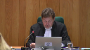
:::

Bonjour à toutes et à tous.

Bienvenue à la

Cour suprême du Canada, qui siège à

Québec cette semaine.

Good morning and thank you for attending the Supreme Court of Canada's sitting in Quebec City.

We are very happy to be here today.

Ce n'est que la deuxième fois que

la Cour se déplace à l'extérieur d'Ottawa pour entendre des causes ailleurs au pays.

La première fois, c'était à

Winnipeg en 2019.

Les juges et le personnel de la Cour sont ravis de se trouver dans la plus belle ville patrimoniale d'Amérique du Nord.

Nous sommes tous et tous touchés par la chaleureuse hospitalité de votre communauté.

Entendre des causes à l'extérieur d'Ottawa est une initiative inspirée par les principes d'accès à la justice et de publicité des débats.

Cette visite est l'occasion de vous faire connaître notre travail, nos activités et notre rôle dans la démocratie canadienne.

So far this week, all nine of us traveled across the region to speak with high school students.

And yesterday, hundreds of people joined us at the Musée de la civilisation to ask us about the work we do and how we do it.

Tomorrow, we will end our week by meeting with law students at l'Université Laval.

La Cour suprême est la juridiction d'appel de dernier ressort du Canada.

Elle tranche certains des différents juridiques les plus importants et les plus complexes du pays.

Ce faisant, la Cour clarifie le droit pour l'ensemble de la population et fait ainsi en sorte qu'il soit appliqué de manière égale et équitable partout au pays.

Voilà pourquoi il est important que les gens comprennent comment et pourquoi la

Cour rend ses décisions.

Après tout, il est difficile d'avoir confiance en quelque chose que l'on ne comprend pas.

C'est pour cette raison que la Cour suprême crée des occasions afin que les gens puissent voir ce qu'elle fait et comment elle le fait.

Et tout comme vous êtes en mesure de le faire ici aujourd'hui, il vous est possible d'assister à des audiences partout ailleurs au Québec.

En effet, tous les tribunaux canadiens sont ouverts, impartiaux et indépendants.

Cela contribue en quelque sorte à faire de notre pays une superpuissance démocratique.

Je voudrais dire une dernière chose avant que nous commençons l'audience d'aujourd'hui.

En mon nom et au nom de mes collègues, je tiens à exprimer nos plus sincères et chaleureux remerciements à la juge en chef du Québec, Mme Manon Savard, ainsi qu'à la juge en chef associée de la Cour supérieure du Québec, Mme Catherine Larosa, et à la juge en chef de la Cour du Québec, Mme Lucie Rondeau.

Les audiences et nos activités de la semaine sont possibles grâce à leur appui enthousiaste et inestimable.

Maintenant, commençons.

Dans la cause, Janik Murray-Hall contre le Procureur général du Québec.

Pour l'appelant, Janik Murray-Hall, Maître Maxime Guérin, Maître Christian Sarelis, For the intervener, Canadian Association for Progress in Justice, Maître Olga Retko, Maître Ryan D.W. Delziel-Casey, For the intervener, Cannabis Amnesty, Ren Becaules, Anna-Maria Enanyar, For the intervener, Cannabis Council of Canada and Quebec Cannabis Industry Association, Adam Goldenberg, and Holly Calmeyer, Pour l'insuit, Procureur général du Québec, Maître Patricia Blair, Maître Frédéric Perrault, For the intervener, Attorney-General of Ontario, Hira Evans, and S. Zachary Green, For the intervener, Attorney-General of Manitoba, Catherine Hart, and Deborah Carlson, For the intervener, Attorney-General of British Columbia, Jonathan Penner, and Robert Dany, For the intervener, Attorney-General for Saskatchewan, Thomas Irvin Casey, and Noah Wernikowski,

For the intervener, Attorney-General of Alberta, David N. Kamau, and Nathaniel Gartke, For the intervener, Canadian Cancer Society, Mr. Robert Cunningham, and Fadi Tobin.

**Speaker 2** (00:06:12): Monsieur le juge en chef, mesdames les juges, messieurs les juges, alors on est ici dans un conflit constitutionnel et avant de rentrer dans la matière qui nous occupe, c'est-à-dire le droit constitutionnel, je veux remettre un peu en phase le contexte d'adoption de la loi sur le cannabis au niveau fédéral et la loi encadrant le cannabis au niveau provincial.

::: {.column-margin}
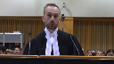
:::

Bien entendu, je vais référer à la loi fédérale et à la loi provinciale dans mes plaidoiries.

L'entrée de jeu au niveau de la loi fédérale, je tiens à souligner parce qu'on a une décision de la Cour d'appel qui souligne bien des passages de la loi fédérale et de la loi provinciale et je pense qu'il apparaît important dans le cadre de ce débat-ci de centrer la loi sur le cannabis au niveau fédéral dans ce qu'elle fait et de centrer ce que fait la loi provinciale en termes de législation.

L'entrée de jeu dans la loi fédérale, on voit trois sources de cannabis légal.

Il faut lire la loi dans son entier pour comprendre.

Il faut l'analyser puis il faut réaliser, je crois, puis je vous soumets en tout respect, il faut réaliser qu'il y a trois sources de cannabis légal, c'est-à-dire le cannabis à des fins médicales par auto-culture, c'est-à-dire avec prescription médicale et droit de pousse obtenu auprès de Santé Canada.

Ensuite de ça, on a le cannabis commercial et médical produit par les producteurs autorisés sous le chapeau de Santé Canada, toujours au niveau fédéral.

Et ensuite, on a l'autoproduction de quatre plans de cannabis à domicile.

Je vous dis que ces trois sources-là sont légales parce qu'on parle de cannabis licite dans la loi fédérale.

Et je crois qu'il est extrêmement important de s'y attarder parce que dans la Cour d'appel, on semble mettre de côté dans cette décision-là, en tout respect bien entendu, on semble mettre de côté l'existence de ce droit de culture-là ou à tout le moins de l'existence de cette décriminalisation du droit de culture et l'existence de cette source de cannabis légale parce que si on se rattache à l'article 7C de la loi fédérale, on parle des sources de cannabis licite dans la loi.

**Justice Côté** (00:08:16): M. Gréin, je m'excuse de vous interrompre, mais vous nous parlez des sources de cannabis illicites, mais est-ce que vous nous parlerez également de la définition de cannabis illicite qu'on retrouve à la loi fédérale?

Absolument.

Je prévois qu'une loi provinciale peut rendre illicite.

**Speaker 2** (00:08:32): Absolument.

::: {.column-margin}

:::

Il y a bien entendu la théorie du double aspect qu'on va aborder éventuellement aussi.

Mais effectivement, il y a le cannabis qui est illicite au niveau de la loi fédérale et ce cannabis-là est un cannabis qui est produit par les criminels, donc qui est criminalisé.

Ça, c'est une sorte de cannabis illicite.

On a ensuite le cannabis illicite qui pourrait être produit à la maison, mais qu'on a détenu plus de cinq plans, donc ce serait du cannabis qui est considéré illicite.

Et on aurait aussi le cannabis qui est en dehors du réseau de production commercial qui se trouve à être du cannabis produit, encore une fois, probablement par les groupes criminalisés.

Et ça me permet justement cette question-là de rentrer un peu dans l'intention des deux lois, la loi fédérale et la loi provinciale.

Du côté de la loi fédérale, les objectifs de la loi se retrouvent aux articles introductifs, notamment l'article 7 qui m'apparaît extrêmement important dans la cause devant nous.

Dans cet article-là et dans ces articles-là, en fait, on vient établir quelles sont les bases de la légalisation du cannabis au Canada.

Puis il ne faut pas oublier qu'avant de rentrer dans ce sujet vif-là, il ne faut pas oublier que la légalisation du Canada, elle ne date pas de 2018, elle date du début des années 2000 et des fins des années 90 au niveau médical-thérapeutique.

Il faut savoir que des Canadiens et des Canadiennes, incluant des Québécois, qui font pousser du cannabis légal au Canada depuis une vingtaine d'années déjà, ça existe.

Et ça existe au point où la ministre Petitpas Taylor, dans les débats à la Chambre des communes, a souligné l'existence de ce régime médical-là en disant qu'il fallait arrimer les deux régimes, donc le nouveau régime de légalisation du cannabis récréatif, et arrimer le régime pour qu'il soit cohérent avec celui du régime médical.

Donc, dans ces articles introductifs-là, on a un objectif de santé publique, on a un objectif, je vous parle toujours de la loi fédérale bien entendu, on a un objectif de santé publique, on a un objectif pour contrer la criminalité, puis on a aussi un objectif qu'on peut trouver sous-jacent mais qui est quand même là, c'est l'objectif de diminuer l'impact de la légalisation du cannabis sur le système de justice, donc de faire en sorte qu'on rend les justiciables moins criminels et qu'on les poursuit moins en cours, et donc qu'on vise la décriminalisation, la dépénalisation de certains citoyens, et des justiciables en général.

Donc, quand on analyse l'intention fédérale, et ensuite on rentre dans la loi provinciale et on regarde l'intention, ou à tout le moins les objectifs de cette loi-là, on se rend compte que les objectifs sont très très proches, sont très très similaires, on a au fédéral un objectif de santé publique, on le trouve aussi en matière provinciale, on a cet objectif-là aussi de protéger la santé publique, j'en ai oublié un peu qui est sous-jacent à la protection de la santé publique, mais on a la protection de la jeunesse aussi, on veut sortir le cannabis des mains des jeunes et des adolescents, des jeunes adultes, donc nécessairement ça se retrouve aussi dans la loi provinciale et l'accent est beaucoup plus proche.

**Justice Wagner** (00:11:20): Mais il ne faut pas oublier non plus la volonté de contrôler également le marché et s'assurer qu'il y ait un marché rationnel, et donc ça fait partie quand même de l'objectif de l'opération de l'économie, c'est-à-dire de l'économie de l'économie de l'économie

**Speaker 2** (00:11:31): provinciale.

::: {.column-margin}
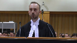
:::

Absolument, qui se retrouve lui aussi dans la loi fédérale considérant qu'elle contrôle tout ce qui est la production au niveau commercial du cannabis avec les permis de Santé Canada, etc.

Donc on a ces objectifs-là qui sont présents dans les deux lois, puis qui, à prime abord, ça rime quand même assez très bien.

Je veux dire, au niveau fédéral et au niveau provincial, on vise les mêmes objectifs.

Par contre, là où est-ce qu'on a des différences, c'est le sujet devant nous, c'est notamment en matière de culture du cannabis à domicile.

Et on vous soumet d'entrée de jeu que le Québec a le droit de légiférer sur une panoplie de sujets en lien avec la loi sur le cannabis.

Elle peut restreindre le régime de la loi sur le cannabis parce qu'il existe et on vous le soumet et on l'admet d'entrée de jeu.

Il existe un double aspect sur certaines questions dans cette très grande loi-là.

Il ne faut pas oublier que l'adoption du régime sur la légalisation du cannabis au fédéral a un impact sur le droit criminel, sur le droit civil, sur la propriété, sur une panoplie de domaines qui relèvent d'une part du fédéral mais aussi du provincial.

Et on en est tout à fait conscient.

Là où est-ce qu'il y a un choc des idées, c'est entre la rédaction provinciale en matière d'interdiction de culture et la rédaction fédérale qui décriminalise le droit à la culture.

Et plus loin que ça encore, on doit rentrer dans l'intention et on va en faire l'analyse du législateur autant au niveau fédéral que provincial dans ce dossier-là.

C'est extrêmement important de s'attarder, je crois, au contexte législatif, pas seulement à la preuve intrinsèque mais vraiment aller au niveau de la preuve extrinsèque et de rentrer dans l'intention des législateurs au moment de l'adoption de cette loi.

**Justice Kasirer** (00:13:03): Maître

::: {.column-margin}
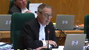
:::

, vous allez faire la part des choses, éventuellement, la nuance à faire, si une nuance il y a, entre la compétence en matière fédérale...

La compétence fédérale en matière de droit criminel qui se rattache à une interdiction, et qui... La loi fédérale qui semble conférer des droits positifs.

Est-ce que tout ça tombe sur un même chapiteau?

Est-ce que l'analyse se fait de la même manière?

Est-ce que la compétence fédérale à 91-27 va au-delà de l'interdiction, le champ classique, pour permettre au fédéral de conférer des droits?

Parce que c'est l'essentiel de votre argument, me semble-t-il.

**Speaker 2** (00:13:50): C'est pas nécessairement l'essentiel, mais c'en est une bonne partie, effectivement, mais oui, il y a une distinction à faire et oui, il faut analyser ça de deux façons différentes et le cas en espèces et les premières décisions sont intéressantes à ce sujet-là parce que la décision de la Cour supérieure s'attarde vraiment à l'analyse du caractère véritable.

::: {.column-margin}

:::

Donc, on rentre dans le vif du sujet de l'analyse du caractère véritable et la Cour supérieure arrête un peu son analyse-là en se disant que la rédaction est tellement proche, le conflit entre les deux législatures et la réaction de la législature provinciale.

On arrête un peu la réflexion-là en Cour supérieure et on croit effectivement qu'il y a, à notre sens, apparence que le caractère véritable s'inscrit dans le champ de compétence de droit criminel pour la simple et bonne raison, en fait, pour plusieurs bonnes raisons selon nous, mais bien entendu, une des raisons principales consiste au verbatim le texte écrit des articles quand on les compare entre eux, donc quand on compare la rédaction provinciale versus la rédaction fédérale, il y a ça, mais il y a aussi en arrière le fait qu'on a une interdiction qui est absolue au niveau provincial et tout ça, en notre sens, fait en sorte qu'on tombe dans l'objet de droit criminel et il ne faut pas oublier que dans la preuve extrinsèque, il y a tout ce conflit-là de réaction de la part du provincial à l'effet qu'il faut contrer ce que le fédéral nous impose.

Pour reprendre les propos de la ministre Charlebois à l'époque, et petit aparté, je suis conscient qu'il ne faut pas donner un poids surréaliste et trop pesant au propos des ministres, mais je crois que dans le cas qui nous occupe, considérant la rédaction, considérant l'interdiction absolue, considérant le passé criminel du cannabis et tout ce contexte-là, je pense qu'il faut quand même leur donner un poids qui est assez important à ces débats-là et à ces réflexions-là entre ministres, entre élus à ce sujet-là.

Donc, la ministre Petitpote et l'un, dans ce cadre-là, ce qu'elle venait de nous dire, c'est que, grosso modo, les provinces, en fait, le fédéral souligne que c'est un moyen, la légalisation, de permettre, en fait, de pousser quatre plans de cannabis à domicile.

Ce sont des moyens qui nous permettent d'éliminer le cannabis illicite puis de le contrôler, ce cannabis illicite-là, et d'éviter qu'il se retrouve dans les mains des criminels.

Et donc, au niveau criminel, à notre sens, on tombe vraiment dans le caractère véritable du champ exclusif du Parlement fédéral de droit criminel, ceci.

**Justice Côté** (00:16:14): Maitre Guerin, dans l'analyse du caractère véritable, est-ce qu'il suffit simplement de dire que les introductions provinciales visant à réprimer la possession et la culture, est-ce qu'il suffit de se limiter à ça?

::: {.column-margin}
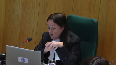
:::

Lorsqu'on analyse le caractère véritable, il faut aller plus loin et regarder si ces mesures sont intimement liées à la mise en œuvre de la loi provinciale.

**Speaker 2** (00:16:34): Absolument.

::: {.column-margin}
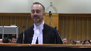
:::

Ceci étant, je crois que considérant la clarté de la rédaction et la similitude entre les deux textes, on aurait pu arrêter cela.

Mais bien entendu, c'est un peu court de faire cet exercice-là, si on peut le mettre comme ça.

C'est ce que la Cour d'appel nous dit aussi.

C'est court de faire cet exercice-là.

On devrait rentrer dans l'intention véritable de la loi provinciale, son objectif final, son objectif global.

Donc, on doit procéder une analyse globale et c'est là qu'on peut ouvrir la théorie des doubles aspects et on va y venir notamment.

Mais effectivement, il peut y avoir toutes ces questions-là qui peuvent en découler et on va en traiter et on va se lancer directement dans le sujet.

Oui, il y a un empêtement en notre sens parce qu'on tombe dans le droit fédéral, on tombe dans le droit criminel.

Est-ce que cet empêtement-là est grave?

Je crois que comme nous sommes dans un champ de compétences qui est quand même assez large, on doit se poser une question assez stricte sur le niveau de gravité de cet empêtement dans le droit fédéral-là ou dans l'exclusivité fédérale.

Il faut quand même faire une analyse complète et stricte de la gravité de cet empêtement-là.

On n'aurait pas tout ce débat-là aujourd'hui si on n'avait pas devant nous une interdiction absolue. Disons

-nous-là d'entrée de jeu si ce n'était pas une interdiction.

**Justice Brown** (00:17:47): Partie de cette analyse complète pour la Cour d'appel était les modifications de la loi sur la société des alcus du Québec.

::: {.column-margin}
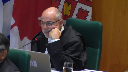
:::

Vous critiquez la Cour d'appel pour avoir mis trop d'emphase sur cette preuve extrinsique. Pourquoi?

**Speaker 2** (00:18:07): Oui, M. le juge Brown, effectivement, on est critique à ce niveau-là,

::: {.column-margin}
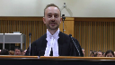
:::

puis je vais vous ramener à notre introduction dans ce débat-ci.

Notre introduction était à l'effet qu'on a trois sources de cannabis légales.

En notre sens, le fait que la Cour d'appel se soit basée sur le monopole de distribution et de vente de cannabis pour justifier la loi au complet, je pense que c'est passé à côté de l'objectif de la loi fédérale qui, est venu dire que les sources de cannabis licites font partie intégrante d'un approvisionnement à cannabis licite et contrôlé au Canada.

Et la Cour d'appel nous dit, oui, mais le droit de culture, lui, la qualité, on n'a pas vraiment le contrôle.

Effectivement, on n'a pas vraiment le contrôle.

Par contre, il faut se rappeler que ça fait 20 ans qu'il y a des Canadiens et des Canadiennes qui font pousser du cannabis à domicile.

Ça fait depuis des millénaires, j'exagère à peine, qu'on fait pousser des tomates à domicile, puis je ne connais pas grand monde qui s'intoxique volontairement dans ce qu'ils mettent dans ces tomates à faire pousser.

Donc, quand on nous parle de qualité du cannabis, il y a toute cette question-là qu'on critique, puis on critique surtout le fait que la justification pour la Cour d'appel, c'est l'existence d'un monopole, puis que si on permet la culture à domicile, bien on va faire une brèche dans ce monopole-là.

Nous, ce qu'on dit, c'est qu'au fédéral, ce qu'on nous a dit, c'est que le cannabis licite, il n'y a pas juste du cannabis licite produit par des producteurs autorisés, il y a du cannabis licite produit par les gens qui en font à domicile, puis ce cannabis-là, il est licite.

Il y a plusieurs sources de cannabis illicite, comme on l'a dit tout à l'heure, mais le cannabis produit à domicile, au sens de la loi fédérale, est un cannabis qui est licite.

Donc, nous, la Cour d'appel a erré un peu en utilisant ce critère-là.

**Speaker 3** (00:19:43): Oui, mais votre argument semble supposer que le Parlement aurait créé un droit autonome.

::: {.column-margin}
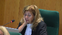
:::

Or, cette Cour, je pense, dans les arrêts Rothmans et renvois relatifs à la loi sur la procréation assistée, a statué que le pouvoir criminel ne peut pas créer de droit autonome.

Alors, si un tel droit existe, de quel chef de compétences découle-t-il?

**Speaker 2** (00:20:18): En fait, effectivement, et on le reconnaît d'entrée de jeu, on ne peut pas créer nécessairement un droit positif avec du droit criminel en décriminalisant des gestes, mais on ne crée pas nécessairement du droit positif ou des droits qui sont positifs pour les citoyens et les citoyennes.

::: {.column-margin}
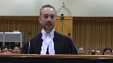
:::

Par contre, si le fédéral n'était pas venu nous dire à 7C de la loi qu'on doit encourager le cannabis licite, là je mets ça dans mes propres mots bien entendu, mais si on n'avait pas cette indication-là claire à l'effet que le cannabis licite, il y a une certaine définition qui s'infère de la loi.

Si on n'avait pas ça clairement dans la loi fédérale, j'abondrais dans votre sens.

Par contre, ici, en tout respect, je pense qu'en raison de cet article-là et de ses sources de cannabis légales-là, on s'écarte un peu de tout cela, puis ça fait en sorte que le cannabis licite prend sa source dans le droit criminel actuellement parce qu'on a décriminalisé la possession de quatre plans à domicile.

Donc le droit qu'on crée en faisant la gymnastique de l'article 7C

émane du droit criminel,

mais je pense qu'il ne faut pas s'attarder seulement aux caractères véritables de ces articles-là.

Oui, selon nous, selon nos prétentions, leurs caractères véritables, en raison notamment de l'interdiction absolue, sont de nature criminelle, par contre, si on va plus loin et qu'on se rend jusqu'à la preuve extrinsèque, qui d'ailleurs n'a pas été analysée de manière très très longue par la Cour d'appel, à notre avis, bien entendu, si on se rend dans cette analyse-là, puis qu'on pousse la question jusqu'au fond, puis qu'on regarde qu'est-ce que les ministres, qu'est-ce que nos élus ont discuté, qu'est-ce que le législateur a discuté autour de la légalisation, et on est chanceux dans ce cas-ci, c'est des débats qui sont riches et bien documentés.

Quand on analyse ces débats-là, à notre avis, on doit tirer la conclusion qu'il y a une opposition entre la position fédérale et la position provinciale, particulièrement sur ces articles-là, 5 et 10 de la loi québécoise, qui sont le reflet de l'intention provinciale de pouvoir interdire la culture du cannabis à domicile.

**Speaker 4** (00:22:12): Je voudrais poser une question.

::: {.column-margin}
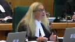
:::

L'accord d'appel mention au paragraphe 60 de ces motifs que les amendes allant entre 250 et 750 sont bien différentes de la peine d'emprisonnement prévue à la loi de la cannabis, le code criminel ou le LRDS.

Pensez-vous que la loi provinciale peut effectivement relever de la compétence le droit criminel alors que la structure et les pénalités sont si différentes d'autres lois de droit criminels?

**Speaker 2** (00:22:50): Absolument, madame la juge.

::: {.column-margin}

:::

J'adore cette question parce que c'est un point, je pense, qui est extrêmement important dans la qualification au niveau du droit criminel.

Est-ce, et je pose la question, je réponds un peu par une question à votre question, mais je me pose la question, est-ce que le fait qu'un Canadien au 17 octobre 2018 se lève le matin, sauf au Québec et au Manitoba, est-ce que le fait qu'il se lève le matin et que maintenant il a le droit de planter des graines de cannabis et qu'il n'en sera pas pénalisé d'une manière criminelle ou pénale, est-ce que ça le libère du droit criminel?

La réponse me semble être oui.

**Overlapping speakers** (00:23:23): Alors c'est un droit, c'est un droit de planter qui a été conféré.

**Speaker 2** (00:23:27): Selon nous, oui, en raison de l'article 7C, en raison de la gymnastique de l'article 7C, mais je ne vous dis pas que ça s'applique, mutatisme, mutandise, dans n'importe quelle cause.

::: {.column-margin}

:::

Au contraire, c'est très spécifique à la loi sur le cannabis, en considérant l'article 7C et les sources légales licites de cannabis, comme on l'utilise au fédéral.

**Overlapping speakers** (00:23:48): des ministres.

**Speaker 2** (00:23:49): à votre question, Madame la juge.

::: {.column-margin}
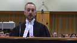
:::

On a donc le droit criminel qui est évacué pour une partie de la population, puis les citoyens du Québec se retrouvent dans une situation où ce n'est pas le droit nécessairement criminel qui s'applique, mais ils ont quand même une conséquence à ce qui vient d'être décriminalisé.

Donc, pour nous, les deux sujets se juxtaposent et deviennent du droit criminel, notamment en raison de la rédaction, notamment en raison des sanctions qui viennent avec, notamment en raison de l'objectif de la loi fédérale qui est de désengorger le système de justice au Canada, notamment avec les infractions en lien avec le cannabis.

Puis c'est ce que viennent nous dire les ministres dans le débat, c'est qu'on veut faire en sorte que les citoyens qui respectent autrement la loi ne soient pas judiciarisés et on a décidé de décriminaliser pour judiciariser de moins en moins de personnes en lien avec cette question-là qui est le cannabis.

**Justice Kasirer** (00:24:38): Les déclarations de ministres au Parlement ne peuvent pas changer quand même la constitution.

::: {.column-margin}
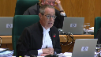
:::

Est-ce que je peux vous ramener à votre appréciation du caractère véritable de la loi québécoise, des dispositions attaquées dans la loi québécoise en jeu?

Et peut-être que vous pouvez préciser votre pensée au-delà de votre affirmation qu'il y a une simple interdiction absolue et que ça règle le problème.

Est-ce qu'il ne faut pas entrer un peu plus loin dans le débat, voir quels sont les objectifs du législateur québécois, quels sont les effets de la loi?

Il me semble que vous allez un peu vite sur l'appréciation du caractère véritable.

Il me semble que la loi québécoise annonce deux objectifs, la prévention et réduction des méfaits du cannabis, protéger la santé et sécurité de la population, y compris les jeunes, notamment les jeunes, d'une part, et la création de la SQDC qui est dotée d'un monopole sur la vente du cannabis sur le territoire du Québec en vue – et voilà le lien à faire entre les deux objectifs – d'assurer la qualité du produit et de faire en sorte que les jeunes en bas de 21 ans n'achètent pas le produit, que le contrôle se fait.

C'est une réglementation qui est beaucoup plus nuancée que la simple affirmation de l'interdiction absolue que vous relevez d'une lecture un peu – je dis ça bien amicalement – un peu désincarnée des articles 5 et 10.

**Speaker 2** (00:26:30): Effectivement, je suis content qu'il me reste quand même beaucoup de temps pour discuter de cette matière-là parce que c'est une matière qui est lourde, longue et dont l'appréciation est bien guidée par la jurisprudence, mais en même temps, il faut y aller au cas par cas.

::: {.column-margin}
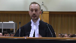
:::

Ce qui est intéressant dans le cas qui nous occupe, c'est qu'on peut faire le parallèle entre deux intentions.

Si on rentre dans l'analyse du caractère véritable, bon, on a une rédaction de droit criminel, je prends ça pour acquis, je vous soumets avec forte conviction qu'on devrait prendre ça pour acquis.

Maintenant, on ne doit pas s'arrêter seulement à ça, effectivement.

On doit aller beaucoup plus loin que ça.

On doit aller vérifier à quel point c'est suffisamment intégré dans la loi.

Parlant de cette loi-là, si on rentre dans le caractère véritable des articles 5 et 10 et qu'on les juxtapose aux finalités de cette loi-là de manière globale, on se rend compte effectivement qu'il y a un intérêt pour protéger la jeunesse.

Bon, protéger la jeunesse en interdisant la culture du cannabis à domicile.

Je ne remets pas en doute les choix du législateur à ce niveau-là.

Bien entendu, la sagesse des lois n'est pas à remettre en question ni les méthodes prises.

Par contre, on oublie peut-être facilement au Québec, la Cour d'appel est muette là-dessus, qu'on a un passé de 20 ans en matière de cannabis, de culture de cannabis à domicile et, à ma connaissance générale, les accidents liés avec les enfants et le cannabis cultivé à domicile sont limités.

Ce que le Québec aurait pu faire, bien entendu, c'est dire cultiver à domicile et maintenant quand vous passez à l'étape du séchage, parce qu'il y a personne qui en parle dans ces deux décisions-là, mais il ne demeure pas moins qu'une cocotte de cannabis fraîche sur un plan, c'est tel que tel.

Il y a une expertise P1 au dossier original qui n'a pas été retenue, je vous le soumets effectivement, mais elle est quand même au dossier et qui vient établir qu'il faut quand même manger pour un enfant une grande quantité de cannabis frais avant d'en ressentir des effets qui sont, disons

-le, moyens.

Donc, il y a ça à prendre en considération.

Oui, parfait, on veut protéger les jeunes.

La loi fédérale aussi cherche à protéger les jeunes.

La loi fédérale veut qu'on sorte le cannabis des mains des jeunes.

On a des articles qui concernent la possession de cannabis par les jeunes et les adolescents, 16 ans et plus, 16 ans et moins, il y a certaines distinctions.

Au provincial, on n'a pas pris, j'ai l'impression, avec respect pour la Cour d'appel, qu'on n'a pas pris en considération que le fait de faire la culture du cannabis à domicile, ça peut répondre à ces objectifs-là.

Si on n'était pas d'accord, et c'est ce qu'on voit dans les débats, c'est qu'on n'était pas d'accord avec la position fédérale, certes, la province peut être en désaccord, mais de là à les interdire, frustrer l'intention fédérale en mettant une interdiction, encore une fois, qui est absolue, avec l'aveu même des législateurs, des élus qui ont représenté le législateur dans ce débat-là en disant carrément que c'est en réaction, si on veut, à la loi fédérale.

On dit carrément, la ministre Charlebois nous dit carrément que ce n'est pas à Québec que ça s'est pris cette décision-là.

Il faut en tirer certaines inférences.

Bon, oui, parfait, on essaie de contrôler l'accès au cannabis pour les jeunes.

Oui, c'est un volet, c'est un volet qui est couvert par les deux lois.

Ensuite de ça, on a la santé publique.

**Justice Kasirer** (00:29:27): Vous allez m'excuser, parce que j'ai du mal à vous suivre, vous passez des commentaires portant sur la validité de la loi et son caractère véritable à la frustration d'objets ou d'objectifs qui me semble être une analyse qui se fait sous la rubrique du caractère opérant de la loi et de la preponderance fédérale.

::: {.column-margin}
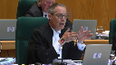
:::

Là, je vous ramène, est-ce que la loi est valide?

Parce que la loi, vous pouvez mener un argument, vous ne le faites pas, mais vous pouvez faire la part des choses, dire, bon, la loi québécoise est valide, mais elle porte atteinte aux objectifs de la loi fédérale de telle sorte qu'en vertu du deuxième volet de la preponderance, elle est inopérante.

Et à l'honneur de la Cour d'appel, elle a fait la part des choses.

Moi, j'ai du mal à vous suivre, parce que il me semble que vos arguments touchent aux deux en même temps.

**Speaker 2** (00:30:32): Je ne pourrais pas mieux établir notre position que ce que vous venez de faire.

::: {.column-margin}
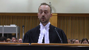
:::

Je fais bien vos mots, Monsieur le juge.

Écoutez, oui, on reconnaît que la loi provinciale, dans son ensemble, elle a un objectif valide, puis elle est valide, la loi provinciale, dans son ensemble, par contre.

Et c'est là qu'on en vient, effectivement, je passe un peu du début à la fin, mais quand on regarde l'intention, si on va dans la prépondérance fédérale, si on va à l'extrême de tout ça, il y a un conflit dans les intentions.

Mais oui, les deux lois cherchent des objectifs qui se ressemblent.

La loi provinciale a des objectifs qui sont valides.

Est-ce que, par contre,

et c'est là que notre débat se situe, est-ce qu'on est dans un objet de droit criminel en matière d'interdiction de culture de cannabis à domicile?

On vous soumet que oui, pour une panoplie de raisons qu'on vous soumet en tout respect, bien entendu.

Et oui, la Cour d'appel a fait ce départage, si on veut, mais on pense qu'elle n'a pas été si loin que ça dans le départage, et on pense qu'elle est viciée dans son départage, notamment en se basant sur le monopole de la SQDC et en affirmant que l'interdiction de la culture du cannabis à domicile, ça ne contrôle pas la consommation.

Moi, je vous dis que les deux vont de pair, que consommation et culture de cannabis vont de pair, considérant l'article 7C de la loi fédérale.

**Justice Brown** (00:31:48): est-ce qu'on peut vraiment dire qu'il y a un conflit d'objectifs quand l'article 2 de la loi fédérale s'inclut la définition de cannabis illicite est évident

::: {.column-margin}

:::

il est évident que le parlement entendait que certains types de cannabis autrement licite soit rendu illicite par réglementation provinciale est ce qu'on peut dire qu'il y a vraiment un conflit d'objectifs

**Speaker 2** (00:32:23): Je pense sincèrement que oui, pour la simple et bonne raison que quand on analyse la loi fédérale en son entier versus la loi provinciale, il y a une stigmatisation du cannabis qui se fait entre les deux régimes.

::: {.column-margin}
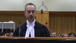
:::

Je vous soumets ça en tout respect pour le législateur québécois, mais je pense qu'on essaye à quelque part dans la loi provinciale de stigmatiser quelque chose, c'est-à-dire la consommation de cannabis, la possession du cannabis aussi, alors que l'objectif de la loi fédérale est beaucoup plus élargie.

On a vraiment un objectif pour sortir le justiciable du système de justice en lien avec le cannabis.

On dirait qu'au Québec, dans sa loi, on va un peu plus de manière réprobante, et je pense que ça dépasse l'objectif de la loi fédérale, qui est de permettre les sources, les sites de cannabis à domicile, notamment celui à domicile en fait.

Donc je pense que si on s'attarde à ces deux régimes-là, on peut voir un peu un aspect de saper les valeurs morales au niveau de la loi provinciale à mon humble avis, et c'est ce que la Cour supérieure a conclu dans son analyse aussi.

Et quand on prend notamment au niveau du chapitre de l'opérant, si on prend les débats législatifs, et je pense qu'il faut les prendre en considération ici de manière quand même relativement forte, il faut leur donner le poids qu'ils doivent avoir bien entendu à vertu de la jurisprudence canadienne, mais il faut quand même faire attention de leur donner un certain poids et les propos de la ministre qui était responsable de tout ça sont clairs et limpides, d'autant plus si on prend en considération que ça fait suite à une tentative d'amendement de la part du Sénat.

S'il n'y avait pas eu cette historique-là, effectivement je soumets que notre argument serait beaucoup amoindri, par contre ici on a cette historique-là en arrière de nous qui vient montrer que le législateur avait une intention qui était assez claire au niveau fédéral et celui au niveau provincial est arrivé avec un objectif qui est clair lui aussi, qui est de contrer ce que le fédéral a fait.

Donc il faut absolument rentrer dans cette analyse-là pour cerner le fond de la question.

**Justice Wagner** (00:34:19): Je m'excuse, maître, mais on n'arrivera peut-être jamais à avoir un consensus sur les objets des deux lois.

::: {.column-margin}
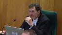
:::

Mais est-ce que vraiment l'objectif de la loi provinciale, c'est de contrer l'objectif de la loi fédérale?

La loi fédérale, vous dites que c'est pour enlever le trafic de cannabis, la culture du cannabis, entre les mains du milieu criminel.

La loi provinciale vise simplement à contrôler, un, la distribution, mais deux, également la protection de la santé des plus jeunes.

En quoi c'est contradictoire?

**Overlapping speakers** (00:34:51): D'accord.

**Justice Wagner** (00:34:51): Le provincial ne veut pas ramener ça dans le domaine du milieu criminel.

**Speaker 2** (00:34:56): Effectivement, monsieur le juge en chef, l'objectif qui semble se dégager de la loi provinciale n'est pas bien entendu de ramener les gens dans le domaine criminel.

::: {.column-margin}
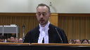
:::

Par contre, je vous soumets, puisque c'est un argument un peu subsidiaire qu'on avait dans notre mémoire, je vous soumets que la législation québécoise fait en sorte que le consommateur de cannabis au Québec est obligé d'aller dans le marché noir actuellement.

Parce qu'on interdit la vente dans un monopole, et je sais que ce n'est pas le débat qui est ici, mais ça vous donne un peu le cadre général de cette loi-là sur le cannabis.

On fait en sorte que le consommateur moyen de cannabis au Québec, pour les produits qui sont en haut de 30% de THC, on est obligé d'aller dans le marché noir au Québec.

Il ne faut pas se leurrer, on est obligé de faire ça parce que la SQDC ne distribue pas ces produits-là.

Ça, c'est une source de cannabis légale auquel on n'a pas accès en plus au Québec.

Je vous soumets qu'on n'a pas accès à l'autre source de cannabis légale qui est la production de cannabis légale chez soi.

Est-ce que d'interdire la production de cannabis légal chez soi répond à cet objectif-là d'éloigner le marché criminel du cannabis?

Moi, je vous soumets qu'au contraire, ça ne fait en sorte que le renforcer en raison de tout l'aspect réprobatif ou stigmatisant de la loi provinciale au niveau du cannabis au Québec.

Il faut bien comprendre que le cannabis, on passe d'une criminalisation totale, donc c'était réprobé de faire pousser du cannabis à des fins récréatives, d'en vendre aux jeunes dans la rue, d'approcher les jeunes avec ça.

Puis là, on légalise le cannabis, puis on leur dit, on leur renforce cet objectif-là, on dit qu'on veut sortir le marché criminel, on veut créer un marché légal qui, oui, en partie, est envoyé vers le provincial au niveau de la réalisation de ce marché-là.

Mais est-ce que d'interdire complètement, de manière absolue, la culture de cannabis à domicile alors que dans la loi fédérale, on vient nous dire que c'est une source de cannabis licite?

Si on fait ça, bien, on coupe encore une fois l'accès à du cannabis qui est licite et donc on ne remplit pas vraiment un objectif de santé publique, de protection et de déloger le marché criminel du cannabis parce qu'on oblige les gens, au final, à aller dans ce marché-là, dans le marché illégal du cannabis.

Je soumets ça en tout respect pour le législateur québécois, mais je pense qu'on nuit à l'objectif de la légalisation du cannabis en faisant ça.

**Justice Kasirer** (00:37:00): Vous pensez que la loi québécoise est mauvaise, soit, ce n'est pas l'enjeu ici, du tout l'enjeu ici.

::: {.column-margin}

:::

Non, on n'est pas ici pour juger de la sagesse de la politique législative.

On est ici pour juger de la constitutionnalité de la loi.

Encore une fois, parlant pour moi, vous m'éloignez du regard que je dois porter comme juge sur la loi.

C'est une bonne loi, je n'en sais rien, ce n'est pas de mes affaires.

Mais est-ce que la loi est valide, ça c'est ma responsabilité à moi. Donc

moi je préfère que vous vous cantonnez sur ce que c'est valide.

Alors là j'ai même mal à vous suivre.

Vous dites la loi dans son ensemble elle est valide, vous avez dit ça tantôt.

Mais que les dispositions particulières ne le sont pas, c'est ça votre position?

Absolument.

**Speaker 2** (00:37:58): absolument.

::: {.column-margin}
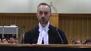
:::

Banque canadienne de l'Ouest, General Motors, qualifions.

Je vous soumets que suite à notre qualification, on en vient un objet de droit criminel.

On est convaincus dans notre position qu'il s'agit d'un objet de droit criminel en raison des effets réprobateurs.

Si on va plus loin dans l'analyse, là, je ressors un peu du cadre, mais il y a un effet réprobateur dans la loi, puis la question a été soulevée tantôt.

On tombe avec des étiquettes, là, en bon français.

Donc, on passe d'une sanction criminelle à un billet d'infraction.

Il y a un monde de différences entre faire de la prison et recevoir une amende.

Puis, d'entrée de jeu, de toute façon, la production de cannabis n'est pas nécessairement avec des peines de prison.

Là, il y avait des amendes et d'autres choses avant de se rendre à la peine de prison.

Mais revenons à la qualification.

On est dans un objet de droit criminel.

Il nous apparaît qu'en raison de l'interdiction absolue, on tombe dans l'objet de droit criminel.

Si on avait été plus loin que ça, moins loin que ça, en fait, puis qu'on avait été more stringent on the law, comme on le reprend dans la jurisprudence canadienne, on n'aurait pas de problème avec ça.

Par contre, on vous soumet que, un peu comme on a dans la RES-Prétec, c'est que dès qu'on tombe dans l'absolu, bien là, on tombe dans l'absolu.

On interdit complètement une activité qui, en vertu de la loi fédérale, est qui peut être considérée une loi militante au niveau provincial.

**Justice Kasirer** (00:39:18): argument qui a été retenu par la première juge a été rejeté par la cour d'appel.

::: {.column-margin}

:::

La cour d'appel qui a dit que c'est là, bien sûr on se targue sur les dispositions attaquées quand on passe à l'analyse de la validité d'une loi attaquée, mais qu'il faut lire la loi dans son ensemble.

Alors pensez-vous que la cour d'appel s'est méprise sur son analyse des dispositions attaquées sur ce plan-là.

**Overlapping speakers** (00:39:47): Sur ce plan là.

**Justice Kasirer** (00:39:48): Vous venez de dire que la loi dans son ensemble est bonne, mais est-ce que vous ne faites pas l'erreur, dont parle la Cour d'appel, de faire une analyse en vase clos des dispositions en question?

**Speaker 2** (00:40:02): Oui et non.

::: {.column-margin}
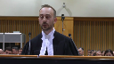
:::

Oui, d'entrée de jeu, si on s'arrête à cet argument-là, comme ça a été fait en cours supérieur, effectivement, on le ferait en vase clos.

Par contre, quand on analyse la loi provinciale au complet et les objectifs qu'elle cherche, il ne faut quand même pas oublier que la loi fédérale, en arrière de ça, un peu comme nous l'enseigne «

Law Society of British

Columbia »,

que la loi fédérale est l'établitante, en un certain sens, pour la loi provinciale, parce que sans la loi fédérale, on demeure dans le domaine criminel, donc le provincial ne peut pas l'échiffrer en matière de cannabis.

La loi fédérale étant habitante, bien, l'intention entre les deux lois ne peut pas s'entrechoquer.

Si il y a un choc entre l'intention des deux lois ou l'objectif final des deux lois, oui, il y a un objectif global et oui, l'objectif global de la loi provinciale peut sembler valide.

Par contre, le fond de la détermination de la validité de ces deux articles de loi-là, qui sont les articles 5 et 10, si on prend le choc des intentions qu'on rend dans la preuve de la prépondérance fédérale et qu'on va dans le double aspect, toujours en matière d'opération, si on rentre là-dedans, bien, effectivement, on va rapidement voir qu'il y a un choc d'idées très, très fort entre le fédéral et le provincial.

**Justice Côté** (00:41:09): ça me ramène à la définition de cannabis illicite à l'article 2 de la loi fédérale.

::: {.column-margin}
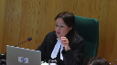
:::

Alors, vous en avez ici contre l'interdiction provinciale de cultiver le cannabis à domicile.

Or, quand je regarde la définition de la loi fédérale, et je prends juste les mots qui s'appliquent à cette interdiction que vous contestez, c'est du cannabis qui a été produit, donc cultivé, par une personne qui est visée, soit par une interdiction prévue par la loi fédérale, ou une interdiction prévue par une loi provinciale.

Alors, donc, quand je regarde la définition de cannabis illicite, eh, peut-être que je suis dans l'erreur, mais il me semble que la loi fédérale contemple, prévoit, qu'une province puisse adopter une interdiction de produire du cannabis.

Est-ce que je lis mal, ou…

**Speaker 2** (00:41:59): Non, je vous soumets que vous lisez très bien. Merci.

::: {.column-margin}
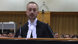
:::

Vous lisez très bien.

Écoutez, à ce sujet-là, ce que le Québec aurait pu faire et déclarer comme cannabis illicite, c'est du cannabis produit par des gens de moins de 21 ans, entre 18 et 21 ans.

Parce qu'en interdisant de manière absolue, on nuit à l'intention du législateur fédéral.

Donc, oui, on pourrait avoir du cannabis illicite qui est du cannabis illicite produit par des personnes entre 0 et 21 ans au Québec.

Ça, ça pourrait être considéré du cannabis illicite en vertu de la loi provinciale et donc l'article 2 de la loi fédérale.

Mais je vous soumets que l'interdiction absolue nuit à l'objectif de la loi fédérale et donc, par conséquent, qu'on tombe en plus dans un champ de droit de compétence fédérale et que, ce faisant, bien, ces deux articles-là sont nul et non repérants.

**Justice Wagner** (00:42:45): Est-ce que nous aurions raison

::: {.column-margin}
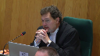
:::

de croire que même la loi fédérale, dont l'objectif, selon vous, était d'enlever le trafic, la culture, le trafic du cannabis entre les mains du milieu criminel, la loi fédérale n'a pas tenu compte de l'aspect santé, et un peu comme l'objectif, un des objectifs de la loi provinciale.

Est-ce que vous me dites que la loi fédérale n'a aucun souci où on n'a pas mentionné ou discuté la question de la santé du cannabis, peu importe la question de la légalité?

**Speaker 2** (00:43:17): M. le juge en chef, j'adore cette question-là, parce que oui, effectivement, c'est deux objectifs très similaires entre la Loi fédérale et la Loi provinciale, autant que la Loi fédérale.

**Overlapping speakers** (00:43:25): No, no.

**Speaker 2** (00:43:25): Non contradictoire.

::: {.column-margin}

:::

Non contradictoire, en plus.

Effectivement, la loi fédérale est très claire à la fait qu'il y a un objectif de santé publique.

Le meilleur exemple, c'est ce qui apparaît sur les paquets de cannabis vendus en succursial partout au Canada, les avertissements au niveau de la santé, toutes ces choses-là.

Effectivement, il y a un objectif de santé publique à la grandeur de la loi fédérale et autant au niveau provincial.

Ceci étant, il ne demeure pas moins que le fédéral et quand on se rabat sur Hansard, sur nos fameux débats parlementaires, bien, dans l'objectif de la loi fédérale, la culture de cannabis licite à domicile, parce que pour eux, c'est une source licite de cannabis, fait partie de l'objectif parce qu'on veut rendre le cannabis licite accessible aux citoyens du Canada, incluant, je le crois, le Manitoba et le Québec.

Et en faisant ça, bien, avec l'objectif de santé publique, de la loi provinciale qui, elle, se dit, bien, il faut aller encore plus serré, puis elle avait le droit à la loi provinciale d'aller de manière beaucoup plus serrée envers la théorie des doubles d'aspects.

Elle avait le droit à la cour... Pardon.

**Speaker 3** (00:44:23): Nous, mais le Québec a créé une source licite encore plus disponible avec le régime ici.

Alors où est la frustration de l'objet fédéral?

**Speaker 2** (00:44:38): Écoutez, je vous soumets, au tout respect, que je ne suis pas d'accord avec le fait que le monopole de la SQDC crée plus d'accessibilité au cannabis.

::: {.column-margin}
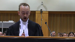
:::

C'est une source licite.

Oui, c'est une source licite, absolument ça, absolument c'est une source licite, c'est une des sources licites que le fédéral voulait mettre entre les mains des Canadiens et des Canadiennes.

Moi, je vous soumets que ce n'est pas suffisant de permettre, dans un objectif de santé publique, de sortir les gens du système de justice pénale et criminel canadien dans un objectif de décriminaliser ces gens-là, je ne pense pas que ce soit suffisant et que ce soit justifié d'aller interdire, pour une notion de santé publique, d'aller interdire la culture du cannabis à domicile quand on a une intention aussi claire au niveau fédéral.

Il m'apparaît absolument important de rentrer donc dans l'analyse, donc la qualification « prenons

pour acquis que c'est fait

» quand on classe ça et qu'on se met à regarder la classification de ces articles-là au niveau des champs de compétences, bon ben, rentrons dans le vif du sujet, est-ce que, selon General Motors, est-ce que c'est suffisamment intégré, est-ce que c'était comme l'enseigne un peu la Cour supérieure dans son jugement, est-ce que c'était absolument nécessaire d'aller interdire complètement la culture du cannabis à domicile?

À mon humble avis, et c'est l'avis de la ministre provinciale et de d'autres ministres provinciaux et d'autres élus, pardon, fédéraux, tous des élus fédéraux, ministres fédéraux, pardonnez-moi, il y a beaucoup de gens qui sont venus à la barre dans les débats, qui sont venus affirmer que l'intention du législateur fédéral en matière de culture de cannabis à domicile était importante pour la réalisation des objectifs, la légalisation du cannabis en général.

Puis, n'oublions pas encore une fois que la loi provinciale, étabilitée par la loi fédérale, «

Law Society of British

Columbia 2001

» de votre Cour, il m'apparaît clair qu'il faut vérifier l'intention entre ces deux lois-là, puis il m'apparaît clair aussi que les articles 5 et 10 ne servent pas l'absolue nécessité de l'objectif de santé publique.

Merci beaucoup.

**Justice Jamal** (00:46:37): Est-ce que la Cour peut tirer des conclusions de l'absence du Procureur général du Canada de ce débat?

::: {.column-margin}
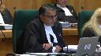
:::

Vous avez présenté une plaidoirie approfondie sur l'objectif pour défendre l'objectif de la loi fédérale, mais le Procureur général du Canada n'est pas ici pour défendre cet objectif.

Est-ce que la Cour peut tirer des conclusions de cette absence?

**Speaker 2** (00:47:04): Monsieur le juge, je vous soumets que non, en les circonstances, la clarté des débats et l'impide « hand side » est très, très complète à ce niveau-là.

::: {.column-margin}
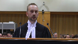
:::

Les débats sont plus que complets.

Je ne veux pas rentrer dans un argument politique, puis ce n'est pas le cas de cette Cour et de mes plaidoiries, mais je pense que le fédéral, dans un esprit, et on le soumet, il y a un esprit collaboratif, il y a un esprit coopératif dans le droit fédéral canadien, et dans cet esprit-là, je pense qu'il souhaite laisser la parole aux provinces seulement.

Je ne pense pas que la Cour doit inférer quoi que ce soit sur cette intention-là.

**Justice Jamal** (00:47:37): Mais ce n'est pas une proposition politique, comme vous le savez très bien.

::: {.column-margin}
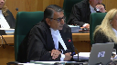
:::

La jurisprudence de la Cour a exprimé la proposition que la Cour devrait être soigneuse avant de déterminer une loi inapparent, étant donné l'absence du procureur régional du Canada.

Alors c'est ça que je vous présente.

Est-ce que la jurisprudence de la Cour nous enseigne quelque chose dans ce contexte?

**Speaker 2** (00:48:05): Effectivement, M. le juge, la jurisprudence de la Cour nous enseigne que l'on doit tirer certaines inférences à ce niveau-là, mais oui, on a des inférences à tirer, mais je ne pense pas qu'il faudrait tirer une inférence absolue qui remplace le cadre des débats, le contexte législatif intrinsèque et extrinsèque à l'adoption de ces lois-là.

::: {.column-margin}
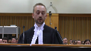
:::

On n'a pas eu de changement de gouvernement depuis, donc j'ose croire que le procureur général, s'il réussit, il nous dirait pas mal la même affaire que ce qu'il y a dans les débats, mais je vous soumets ça bien entendu en manière très pathétique.

**Justice Wagner** (00:48:39): ça peut être un indice parce que, normalement, un procureur général qui soit d'une province soudaine du gouvernement fédéral va être porté à défendre sa loi.

**Justice O'Bonsawin** (00:48:50): Mais tantôt, vous avez répondu à une question de ma consorte au sujet du fait que les Québécoises et Québécois pourront acheter le cannabis par l'entremise de la SQDC, puis votre réplique était bien non, pas vraiment, parce que le marché de 30 % de THC doit aller au marché noir, mais est-ce que ce n'est pas lié à la question de santé, qui est l'objectif primaire de la législation provinciale?

::: {.column-margin}
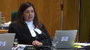
:::

**Speaker 2** (00:49:18): Oui, ça peut être effectivement rattaché avec l'objectif de santé publique de la loi provinciale.

::: {.column-margin}
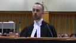
:::

On n'est pas ici pour remettre en cause la sagesse de ces décisions-là.

Je vous soumets en tout respect que c'est très contradictoire, par contre, l'existence de ces interdictions-là, considérant qu'on veut légaliser le cannabis au Canada et qu'on veut le décriminaliser et qu'on veut sortir les gens, au final, du marché noir.

On veut vraiment les attirer vers un marché légal.

Au Québec, on a créé la SQDC en se disant, bien, en ayant un monopole, on n'aura pas de compétition, on va avoir qu'un seul endroit où l'expérience va être la même ou à tout le moins, il va être similaire.

On a décidé de faire ça au Québec avec les moyens qu'on a choisis.

Par contre, je vous soumets en tout respect que ça ne remplit pas l'entièreté des objectifs de santé publique qui ont été énoncés dans le cadre de l'adoption de la loi.

Dans la preuve au dossier, vous avez les rapports de Santé Canada, notamment, et les rapports d'instituts fédéraux quant à la légalisation du cannabis.

Il apparaît clair, notamment, qu'on doit permettre et qu'il doit avoir dans la loi fédérale lors de son adoption l'ouverture à pouvoir avoir plus de produits éventuellement, ce qui a été fait d'ailleurs dans les années passées.

On est parti du cannabis séché, des huiles, puis là on est rendu avec des produits beaucoup plus concentrés.

Bref, on a accès à pas mal la même chose qu'on avait accès sur le marché noir.

Et oui, c'est un objectif de santé publique.

Par contre, je soumets que cet objectif de santé publique-là n'est pas nécessairement peut-être valide du taigard aux objectifs de santé publique de la loi fédérale, considérant que ça oblige le consommateur québécois, le citoyen québécois ordinaire, à devoir s'approvisionner dans le marché noir quand on parle de certains produits du cannabis.

Et je ne voudrais pas rentrer dans la preuve médico-légale qui a été soumise dans le cas de tout ça.

Par contre, il faut savoir que c'est une décision de la direction de la santé publique au Québec et c'est une directive qui est en place par la santé publique du Québec.

Est-ce que ça veut dire que c'est la santé publique le dit que nécessairement au niveau constitutionnel, ça tient la route?

Je vous soumets que non.

Je vous soumets qu'on peut remplir un objectif de santé publique, mais aller trop loin dans ces droits constitutionnels en tant que province et législateur provincial.

**Justice Kasirer** (00:51:28): Allez-

y, allez-

y.

**Justice Côté** (00:51:28): J'ai juste une question hypothétique pour vous.

Supposons que la loi provinciale avait permis la culture d'un plan de cannabis, une plante de cannabis, au lieu de quatre, qu'est-ce qu'elle serait?

**Speaker 2** (00:51:41): Je ne serais pas là aujourd'hui.

::: {.column-margin}
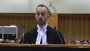
:::

Très honnêtement, on ne serait pas là aujourd'hui, la position de la plan ne serait pas la même parce qu'on n'aurait pas une interdiction absolue qui fait en sorte qu'on peut se conformer, on peut jouir du droit fédéral et de l'intention fédérale en même temps qu'on jouit de la protection de santé publique du provincial si on cultive une seule et unique plante de calamité.

**Justice Côté** (00:52:01): Ça ne va pas à l'encontre de votre argument parce que votre argument était à l'effet que la loi fédérale permettait la culture de quatre plans.

**Overlapping speakers** (00:52:10): And I'll pass it on to the next speaker.

**Justice Côté** (00:52:10): Est-ce que la loi fédérale permet la culture de quatre plants ou ne fait que décriminaliser la culture de plantes et canadaises?

**Speaker 2** (00:52:18): D'abord, elle décriminalise le droit de faire de la culture de cannabis à domicile.

::: {.column-margin}

:::

D'autre part, elle permet, en notre sens, la culture du cannabis à domicile.

Le nombre de plantes n'est que criminel, mais si on ne légifère pas et qu'on ne rend pas... qu'on n'adopte pas une loi more stringent, plus restrictive ou restreignante, tant qu'on ne fait pas ça, bien, c'est l'intention fédérale qui demeure.

Alors, j'ai du mal à dire que c'est un peu comme ça, mais oui, on peut restreindre...

**Justice Kasirer** (00:52:43): J'ai du mal encore à comprendre exactement votre position.

::: {.column-margin}
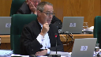
:::

Allons-y pour le caractère opérant de la loi québécoise.

La loi fédérale décriminalise, mais le Parlement n'a pas accordé un droit positif de cultiver quatre plans à domicile à des fins personnelles.

Est-ce que sur le plan opérationnel, il y a un conflit?

S'il n'y a pas de conflit, est-ce que votre souci, votre débat, ça se déplace vers la deuxième branche de la prépondérance, c'est-à-dire le conflit d'objectifs, le conflict of purpose?

C'est-à-dire que le Parlement n'a pas accordé un droit positif de cultiver quatre plans à domicile.

**Overlapping speakers** (00:53:37): Est-ce que vous ...

**Justice Kasirer** (00:53:37): Vous acceptez qu'il n'y a pas de conflit opérationnel, que le Parlement n'a pas accordé un droit positif de cultiver quatre plans à des fins personnelles à domicile?

**Speaker 2** (00:53:48): Moi, je vous soumets qu'en vertu de l'article 7C, on a, en raison de la gymnastique que je vous ai expliqué tantôt des sources de cannabis licite, moi je vous dis qu'en vertu de 7C, M. le juge, on a créé ce droit positif-là pour les Canadiens de faire la culture du cannabis à domicile.

::: {.column-margin}
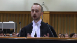
:::

Pas le nombre de plantes, de s'approvisionner, d'encourager un système où il y a du cannabis licite et parmi ce cannabis licite-là, on a le cannabis qui pousse à domicile.

**Justice Kasirer** (00:54:13): Il y a un conflit opérationnel.

Je vous le soumets, oui. D'accord.

Et pour ce qui est du conflit d'objectifs, vous y voyez un conflit d'objectifs aussi?

**Speaker 2** (00:54:24): on plie d'objectifs aussi, oui on remplit des objectifs de santé publique, oui on remplit des objectifs de protection de la jeunesse, oui on tente de remplir des objectifs pour sortir le marché criminel, mais dans un des objectifs de la loi fédérale, c'est de faire en sorte qu'on ait le plus de sources de cannabis licite, donc le cannabis à domicile, et dans un des objectifs de la loi provinciale, c'est qu'on ait le moins de cannabis licite à domicile possible.

::: {.column-margin}
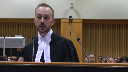
:::

Et on l'interdit de manière absolue.

Et pour reprendre la question de Mme la juge Côté, effectivement, si on était à un seul plan, on ne serait pas en interdiction absolue, je ne verrais pas nécessairement de conflit entre les deux lois au niveau de l'après-pendant.

**Justice Côté** (00:55:04): Si vous avez le droit de cultiver quatre plantes de cannabis, vous nous dîtes « Ah

::: {.column-margin}
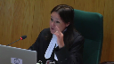
:::

, si on avait le droit d'en cultiver seulement une, selon la loi provinciale, on ne serait pas ici. »

Je pense que pour être logique avec votre argument, vous devriez être ici quand même.

Parce que si vous prétendez que vous avez le droit d'en cultiver quatre et que la loi provinciale vous dit « Non, votre droit sera d'en cultiver une »

, vous devriez quand même me contester.

Si vous avez un droit, si vous avez un droit, si la loi fédérale établit le droit.

**Speaker 2** (00:55:33): Absolument.

::: {.column-margin}
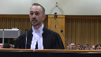
:::

Si vous retenez qu'on établit un droit en vertu de 7C, absolument, j'abonde en votre sens, mais subsidiairement, en prenant pour acquis que vous ne preniez pas ce postulat-là pour acquis au niveau de la décision de la Cour, si on ne prend pas ce postulat-là, bien effectivement, si on avait le droit à un seul plan, on serait ici aussi.

Mais moi, je vous soumets que, dans un premier temps, je vous soumets 7C, les quatre plans, et je vous soumets dans un deuxième temps que la loi provinciale n'a le droit au final que d'aller restreindre de manière « more stringent », ça ne veut pas dire d'interdire de manière absolue.

Moi, je vous soumets ça en deux temps, si on veut.

**Justice Kasirer** (00:56:09): Yes.

**Justice Rowe** (00:56:09): Est-ce que c'est dans la compétence fédérale d'établir un droit positif de cultiver le cannabis?

Est-ce que c'est inclus dans la compétence criminelle?

Peut-être que c'est agriculture?

**Speaker 2** (00:56:26): Absolument.

::: {.column-margin}
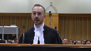
:::

Mais oui, il y a une interdiction d'agriculture.

Il y avait une interdiction d'agriculture au niveau criminel précédemment, puis ça fait partie de tout le contexte législatif.

Il ne faut pas oublier les presque 100 dernières années où est-ce que le cannabis a été criminel.

Et du jour au lendemain, on décriminalise après 20 ans d'expérience dans le domaine médical où les gens font pousser du cannabis chez eux, à domicile, et je le répète, il y a personne qui s'empoisonne de manière volontaire dans les jours normaux.

Donc, moi, le critère de la qualité de la Cour d'appel, j'ai beaucoup de difficultés, mais bref, oui, c'était criminel avant de faire la culture dans cet agriculteur.

**Justice Brown** (00:57:04): Je pensais que le droit criminel est utilisé à prohiber une conduite, pas de permettre une conduite.

**Speaker 2** (00:57:16): Absolument.

Absolument, ça là-dessus.

Effectivement, le droit criminel ne crée pas de droit positif de culture par contre, c'est-à-dire que le droit criminel ne crée pas de droit, c'est-à-dire que le droit criminel ne crée pas de droit, c'est-à-dire que le droit criminel ne crée pas de droit, c'est-à-dire que le droit criminel ne crée pas de droit, c'est-à-dire que le droit criminel ne crée pas de droit, c'est-à-dire que le droit criminel ne crée pas de droit, c'est-à-dire que le droit criminel ne crée pas de droit, c'est-à-dire que le droit criminel ne crée pas de droit, c'est-à-dire que le droit criminel ne crée pas de droit, c'est-à-dire que le droit criminel ne crée pas de droit, c'est-à-dire que le droit criminel ne crée pas de droit, c'est-à-dire que le

**Overlapping speakers** (00:57:22): Mais vous parlez de droit toujours, mais...

**Speaker 2** (00:57:24): C'est parce que je vous soumets très respectueusement l'article 7C qui fait en sorte qu'on ait une source de cannabis licite.

::: {.column-margin}
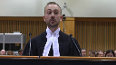
:::

C'est pour ça que pour nous, la position de la plan, c'est que le droit criminel est rendu positif en raison de 7C de la loi et de l'objectif de la loi fédérale qui est de rendre le cannabis licite, accessible et dans le cannabis licite, en bon, je me réfère que y'a de ces cannabis.

Est-ce qu'un objectif peut donner la juridiction à un niveau de gouvernement, du Parlement?

Pardonnez-moi, j'ai mal compris le début de la question.

**Justice Brown** (00:57:52): évidemment.

Votre réponse est que le Parlement a cet objectif, mais un objectif ne peut pas conférer une juridiction sur le Parlement.

C'est la Constitution qui le fait.

**Speaker 2** (00:58:09): Absolument.

::: {.column-margin}
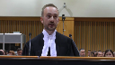
:::

En matière de droit criminel, je vous soumets que le caractère véritable de ces articles-là relève du droit criminel.

Je vous soumets ça d'entrée de jeu.

Si on va plus loin dans l'argument, il y a la théorie des doubles aspects, il y a la théorie de la prépondérance fédérale.

Je crois qu'on échoue à répondre à toutes ces théories-là.

Si on prend celle du double aspect, en partant dans le double aspect, oui, on a le droit d'aller légiférer, mais on n'a pas le droit d'aller légiférer contre l'intention fédérale, on n'a pas le droit d'aller légiférer.

**Justice Brown** (00:58:39): J'ai une question à vous poser.

Est-ce qu'il est possible d'obéir, pour un citoyen, d'obéir la loi fédérale et la loi provinciale ici?

**Speaker 2** (00:58:48): Oui, absolument. Merci.

**Justice Kasirer** (00:58:52): Votre gymnastique, en suivant les réponses que vous avez données à M. Rowe et à M. Brown, est-ce qu'il y a lieu pour nous, si on accède à votre argument, est-ce qu'il va falloir qu'on mette de côté la jurisprudence de notre cours?

::: {.column-margin}
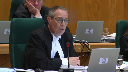
:::

Évoquez tout à l'heure Rothman's procréation assistée, qui explique pourquoi la compétence fédérale est essentiellement prohibitive.

Parce que si c'est le cas, c'est majeur ce que vous demandez à la Cour.

Et ça a des conséquences bien au-delà du cannabis.

Ça veut dire que pour l'exercice des pouvoirs provinciaux, on doit se méfier de la compétence fédérale qui pourrait à la toute limite, en raison de ces droits positifs qu'on pourrait créer, limiter de façon importante la portée de l'article 92 de la Constitution.

**Speaker 2** (00:59:52): Absolument, je suis tout à fait d'accord avec vous, monsieur le juge, si on a cette approche-là, elle est beaucoup trop stricte, elle est beaucoup trop radicale par rapport au fédéralisme coopératif, notamment.

::: {.column-margin}

:::

Par contre, ce que je vous soumets, c'est qu'il y a beaucoup plus que ce simple argument-là dans nos plaidoiries, dans tout ce qui est relatif à la légalisation du cannabis au Canada. Il y a beaucoup plus que ça pour la simple et bonne raison que dans la théorie des doubles aspects, des pouvoirs accessoires, on est très conscient qu'on peut légiférer à deux niveaux et que le provincial peut, encore une fois, se rendre more stringent ou plus restreignant sur la loi.

Ça, on en est absolument conscient et on ne pense pas que tout ça doit s'arrêter là en termes d'analyse.

On pense que l'analyse doit être poussée à un niveau coopératif et qu'on doit l'analyser dans un niveau coopératif au sein de la fédération et que, en ayant...

Si on n'avait pas tous les débats, au final, entre les élus, si on n'avait pas ça, si on n'avait pas l'historique du Sénat qui revient et que son amendement est refusé, si on n'avait pas les propos des ministres québécois et des élus québécois à l'effet qu'ils sont un peu, pardonnez-moi l'expression, mais frustrés par l'intention du législateur fédéral, si on n'avait pas tout ça, on n'aurait pas la même profondeur des débats.

Par contre, dans le cas à l'espèce, on a tous ces arguments-là qui viennent, à notre sens, tarir la nature de l'empiétement et de l'objectif de la loi provinciale.

Je pense que l'empiétement est grave de la part du législateur québécois parce qu'il fait une interdiction absolue qui, pour nous, s'apparente en plus dans sa rédaction à du droit criminel et qui nous pousse à conclure qu'il s'agit de droit criminel.

Je pense que, même si on n'a pas un droit positif à la culture de domicile, si on prend ce postulat au niveau de la loi fédérale, même si je vous soumets 7C de la loi fédérale, si on prend ce postulat-là, mais quand même, on est plus criminalisé au niveau fédéral, mais on est repénalisé au niveau provincial.

Il y a un conflit entre les deux.

Oui, on est capable d'obéir aux deux lois.

Par contre, le provincial a été trop loin, il a trop légiféré dans, à notre humble avis, il a trop été contraignant avec les citoyens québécois versus que la loi fédérale.

Ça lui permet de faire, considérant surtout l'article 7C, le fait qu'on a décriminalisé ces actions-là, de faire la culture du cannabis à domicile.

Pour nous, ça nous apparaît assez clair qu'il y a un conflit entre les deux et que, par conséquent, quand on rentre vraiment dans la prépondérance fédérale et qu'il y a un intervenant qui va en faire sa plaidoirie au complet, quand on rentre dans tout ça puis qu'on prend tout ce contexte-là, tout ce bagage-là en arrière, ça permet, à notre humble avis, encore une fois, puis je vous le soumets avec forte conviction, ça permet d'en venir à la conclusion que ce qu'on a devant nous, c'est du droit criminel et que c'est un empêtement beaucoup trop réel de la part du provincial sur ce que le fédéral avait l'intention de permettre lors de la légalisation.

Donc c'est ça, si je vous résume l'argument en une phrase avec beaucoup de virgules, voici notre argument principal, c'est que l'accumulation de tout ça fait en sorte que ça confirme qu'on est dans un objet criminel puis qu'on va trop loin au niveau de l'empêtement.

**Justice Kasirer** (01:02:52): Est-ce que vous accepteriez l'idée que l'objectif qui est pertinent à l'analyse sous la prépondérance, l'objectif fédéral, doit être un objectif valide?

::: {.column-margin}
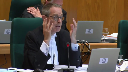
:::

C'est-à-dire, ce n'est pas juste un objectif annoncé, une intention législative annoncée, en reprenant l'idée de M. Brown.

L'objectif doit être valide.

Il ne suffit pas tout simplement de dire qu'il faut que cet objectif soit valide en application de l'article 91-27.

Et s'il n'est pas valide, par exemple, Rothman cité par la Cour d'appel, procréation assistée citée par la Cour d'appel, on n'a pas à s'en soucier pour ce qui est de l'analyse de la prépondérance.

**Speaker 2** (01:03:45): Je vous soumets que, oui, on doit s'en soucier et on doit se soucier de tout ce qui est global dans la loi et la Cour d'appel le fait, je vous soumets qu'elle se base sur le mauvais objectif qui est la protection du monopole de la SQDC, mais le fédéral le fait aussi dans sa loi.

::: {.column-margin}
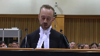
:::

Elle met un objectif en lien avec la culture du cannabis, elle interdit de le faire dans des commerces, dans des locaux commerciaux, elle interdit de le faire sous l'égide d'une société, donc on ne peut pas être une société puis faire la culture du cannabis et en plus elle encadre que ça doit être fait dans le domicile et c'est un par domicile, mais c'est une fois quatre plans par domicile où à tout le moins la culture dans un domicile, et puis ça ne compte pas au niveau d'individus, ça compte au niveau du domicile.

Donc le fédéral s'encadre lui-même dans ce droit-là, donc il encadre le droit, il encadre cette décriminalisation-là, je pense que ça milite encore plus en faveur de notre interprétation de 7C qui constitue du cannabis licite, parce que le fédéral l'encadre, il ne fait pas juste dire je le décriminalise, il dit aussi que tu dois le faire à la maison puis tu ne peux pas le faire au nombre d'adultes, tu dois le faire au nombre de domiciles et tu ne dois pas le faire aussi quand tu es une société, et fais-le à domicile, fais-le pas quand tu as moins de 18 ans, etc.

Donc je pense que tout ce contexte législatif-là, il faut sortir de juste la rédaction dans cet argument-là pour sortir puis aller vérifier l'entièreté de ce qui est légiféré au niveau de la culture dans la loi fédérale, moi je pense que ça va beaucoup plus loin, puis je vous le soumets humblement, que ça va beaucoup plus loin que seulement décriminaliser, on l'encadre quand même, donc on fait du droit positif.

En guise de conclusion, je crois que je n'ai pas besoin de résumer où notre argumentaire se situe, vous avez vu, on pense que c'est du droit criminel, mais on va beaucoup plus loin que ça, on vide l'ensemble des arguments à notre humble avis pour faire en sorte que la Cour puisse retenir que c'est au provincial, on a dépassé notre compétence, on a empiété sur le droit fédéral de droit criminel, puis on va aller démontrer ça avec tous les arguments au niveau des débats, les débats des communes, les débats provinciaux, la réaction du provincial, il ne faut surtout pas l'oublier, il y a une réaction au niveau provincial et il y a un caractère absolu dans cette interdiction-là, et en guise de finale conclusion concernant les dépens, écoutez, on vous demanderait de nous accorder les dépens dans toutes les instances à l'exception, puis ça apparaît dans la mémoire de ma consoeur du procureur général à l'exception de demande en prolongation de délai, donc on est prêt à assumer les frais.

Merci Maître.

**Justice Wagner** (01:06:18): Thank you very much.

**Speaker 5** (01:06:39): Can a province recriminalize something that Parliament has expressly decriminalized?

::: {.column-margin}
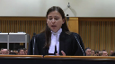
:::

There's no question here that in the Cannabis Act, Parliament has decriminalized the possession and cultivation in the domicile of four or fewer cannabis plants.

It's done so by removing cannabis from the list of substances subject to a total ban in the Controlled Drugs and Substances Act and then creating a tailored prohibition or tailored prohibitions in sections 8 and 12 of the Cannabis Act on possession and cultivation of more than four plants.

But through sections 5 and 10 of Quebec's Cannabis Regulation Act, we say Quebec has effectively recriminalized these same activities.

Well, the word effectively seems to be an important word here.

It is, because it's a word that's been around for a long time, and it's a word that's been around for a long time.

It's a word that's been around for a long time, and it's a word that's been around for a long time.

**Justice Brown** (01:07:23): Because it is not the province that has, as you call it, recriminalized it.

::: {.column-margin}
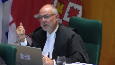
:::

It is, it is, it is, it remains criminal by operation of the federal act which includes within the definition and clearly contemplates within the definition provincial regulation.

**Speaker 5** (01:07:44): That's exactly right, so of course you're referring to the definition of illicit cannabis.

**Overlapping speakers** (01:07:47): Right.

**Speaker 5** (01:07:47): Madame Justice Côté read to you earlier, it's absolutely correct that because of the definition of illicit cannabis, when a province forbids certain forms of

**Overlapping speakers** (01:07:55): Possession because of Parliament's definition of illicit cannabis certainly

**Speaker 5** (01:07:59): But that is one of the legal effects that flows from a provincial prohibition.

It's the creation of a regulatory prohibition in the provincial law.

But at the same time, because of the definition of illicit cannabis,

**Overlapping speakers** (01:08:10): Parliament criminalizes.

**Speaker 5** (01:08:13): Absolutely.

But that is an effect that flows from the provincial prohibition.

So we say when you're looking at all of the effects of the provincial law, you have to take into account the effects that derive from the interaction of the provincial and the federal statutes.

**Justice Brown** (01:08:27): So the constitutionality of provincial regulation is dependent upon parliament's exercise of discretion to contemplate within a definition the possibility of provincial regulation.

**Speaker 5** (01:08:41): So we say that the operability of Quebec's regulations or Quebec's prohibitions does depend on whether all of their effects are consistent with Parliament's purpose.

::: {.column-margin}
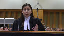
:::

And I recognize that yes, Parliament has contemplated some degree of provincial prohibitions that result in the creation of criminal prohibitions.

But at the same time, what we say is crucial is that in passing the cannabis act, Parliament also intended for at least some acts in relation to cannabis to no longer be subject to criminal prohibition.

**Overlapping speakers** (01:09:12): If only Parliament had said that. Pardon?

If only Parliament had made that clear in the statute.

**Speaker 5** (01:09:18): Well, the Court of Appeal did conclude that at the very least, Parliament's objective in only prohibiting the possession and cultivation of more than four plants was to reduce the burden related to cannabis in the criminal justice system.

::: {.column-margin}
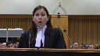
:::

At the very least, that's one of the objectives that that tailored provision serves.

**Overlapping speakers** (01:09:36): It's not an effect of the federal law that you're talking about?

**Speaker 5** (01:09:40): Well, it's an effect that flows from the interaction of the federal and provincial laws, and of course,

**Overlapping speakers** (01:09:45): Well, what does that mean?

**Speaker 5** (01:09:46): It means that when a province passes a prohibition, you have to look at every consequence of that prohibition, including how the interaction of any laws that operate together simultaneously.

::: {.column-margin}
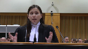
:::

You can't ignore that one of the impacts of the provincial prohibition is the creation of a federal criminal prohibition.

That's something that exists, that's something that's part of the context, and we say that's something that the court has to take into account.

Because if Parliament itself extracted certain activities from the realm of the criminal law to reduce the burden of the justice system, the reimposition of criminal consequences on those very same activities undermines a means that Parliament has chosen to achieve its objective.

**Justice Brown** (01:10:25): except the reimposition is by the very same parliament whose objectives you say are being frustrated.

The source of their frustration is parliament's own law.

**Speaker 5** (01:10:35): Well, I think that, you know, to add a little bit of nuance here, I think that we have to reconcile Section 2 and the bans on illicit cannabis with the objective Parliament has of reducing the burden on the criminal justice system.

::: {.column-margin}
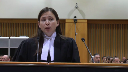
:::

Because by virtue of that objective, some activities in relation to cannabis, Parliament deemed that they should no longer be subject to criminal liability and, of course, decriminalization.

Except that, you know, I think that, you know, to add a little bit of nuance here, I think that we have to reconcile Section 2 and the bans on illicit cannabis with the objective Parliament has of reducing the burden on the criminal justice system.

Because by virtue of that objective, some activities in relation to cannabis, Parliament deemed that they should no longer be subject to criminal liability and, of course, decriminalization.

Except that, you know, I think that, you know, to add a little bit of nuance here, I think that we have to reconcile Section 2 and the bans on illicit cannabis with the objective Parliament has of reducing the burden on the criminal justice system.

Because by virtue of that objective, some activities in relation to cannabis, Parliament deemed that they should no longer be subject to criminal liability and, of course, decriminalization.

Except that.

**Justice Brown** (01:10:56): to where the province regulates it.

Then parliament said it can be subject to criminal liability again.

I mean this this is sophistry.

**Speaker 5** (01:11:03): I don't agree with you, Justice Brown, because I think that where you can determine that provision was tailored specifically by Parliament to exclude criminal liability for certain acts, there, in order to read Section 2 consistently with the tailoring, I think that it's quite open to say that there is a problem when a province reimposes criminal liability on those very same acts.

::: {.column-margin}
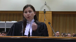
:::

**Overlapping speakers** (01:11:24): No, the province is not reimposing criminal, we're going around in circles.

**Speaker 5** (01:11:29): I understand that you don't agree with our submissions, but that is our position, is that we have to take into account the impact of both the provincial legislation and the interaction of the provincial and federal legislation.

::: {.column-margin}

:::

Now in Maloney, this Court's majority found that Parliament's aim of frustrating financial rehabilitation of a bankrupt, excuse me, furthering financial rehabilitation was frustrated when a province adopted legislation that effectively undermined the means that Parliament chose to achieve its aims.

So that's a case of frustration.

And we say that when a province passes a law whose effect results in the recriminalization of activities that Parliament explicitly decided to decriminalize, that too is a frustration of Parliament's purpose.

**Justice Wagner** (01:12:10): Thank you.

**Speaker 6** (01:12:28): Good morning, Chief Justices, Justices.

::: {.column-margin}

:::

Cannabis amnesty intervenes in this appeal with a modest proposal.

When evaluating the policy purpose of federal legislation, it may be appropriate to look beyond the specific legislative provisions at issue and to consider ancillary legislation as well. Why?

Because the legislature sometimes pursues federal policy through more than one legislative act.

And this is especially true where the legislature sets out to effect substantial changes to the law.

We submit that the failure to consider ancillary legislation may lead the court to interpret federal purpose in an unduly narrow manner, an impoverished manner, distorting the frustration analysis required by this court's jurisprudence in Maloney and Canadian Western Bank.

When should the paramount analysis consider subsequent or ancillary legislation?

We say that that is guided by the factors set out in paragraph 18 of our factum.

They include whether or not there's clear language linking multiple pieces of legislation evincing a unified federal purpose.

They include subject matter and timing.

Is the subject matter the same?

Has it been passed in a, pardon me, temporally proximate manner?

As well, is the government the same?

Is this, or the multiple pieces of legislation, components of an organized effort to effect a federal purpose which is legible and can be articulated when comparing it to the federal, or rather the provincial purpose?

**Justice Rowe** (01:14:08): Now, I'm reaching back a long ways, but once upon a time, I was the procedural advisor to the Speaker of the Newfoundland Legislature.

::: {.column-margin}

:::

And one of the things that ministers or any member when bringing forward legislation was compelled to do, was called upon to do, was to include in a single bill all of the amendments which were necessary to give rise to the purpose.

So one bill might amend several pieces of legislation.

You weren't supposed to do it piecemeal, because what you were supposed to do was to put before the House the whole package of measures to give effect to the policy.

I'm not sure there's a strict rule about this, but ordinarily, this is not done in a fragmentary way.

**Speaker 6** (01:14:56): Bless you.

::: {.column-margin}

:::

Justice Roe, thank you for that observation, and I agree that in most cases, and in many cases, I would say that a single legislative act of the federal parliament will include changes to whatever pieces of legislation it requires in order to affect the purpose of that act.

However, this is a good example, and of course, we are in a slightly awkward position because the record is developed as it is for an appellate court.

It doesn't include all of the Hansard and other legislative debates for the related legislation, which we have identified in our factum.

So that would include Bill C-46, Bill C-93, which deals with the enhanced access to record suspensions or pardons.

So I accept your proposition, Justice Roe.

The point here is that for whatever reason, this same government, this same parliament, within a year of passing the Cannabis Act, has passed multiple other pieces of legislation, which we say evinces the proper federal purpose that falls within a recognized head of power for the federal government to use its criminal law jurisdiction to affect how Canadians, have access to cannabis legally on a recreational basis, but also how the federal criminal justice system is burdened by simple cannabis offenses, including possession of plants for growing at home.

And one of the questions that was asked earlier by Justice Brown and then in a related way by Justice Kasirer was essentially, aren't we really talking about the federal government having invited the provinces into providing their own regulations at the provincial level?

And we agree with that.

But we say that that was evidence of a federal government exercising cooperative federalism. Well,

**Justice Brown** (01:16:59): Well, whatever that means.

::: {.column-margin}

:::

I've got a question for you.

Yes, please.

Isn't the necessary implication of your submission that when Parliament decides to decriminalize a certain conduct, let's say drunk driving, and isn't the implication that the provinces can't then regulate that conduct, in fact, prohibit that conduct by making, for example, sobriety a condition of holding a driver's license?

Isn't that the natural upshot?

**Speaker 6** (01:17:37): I'll just answer your question then my time is up, but I would say no and the reason is this If there has been a valid exercise of federal jurisdiction That Permits a certain kind of conduct for the purposes which are articulated in the cannabis act or in a similar piece of federal legislation There will always be areas Where we're almost always I should say shouldn't be a declaratory there there will always be areas where the provinces need to adjust or implement or regulate how that federal purpose lives at the provincial level and We say that yes that there are going to be Valid ways for that regulation to be articulated, but when the provincial approach is to completely reverse the federal approach

::: {.column-margin}

:::

**Overlapping speakers** (01:18:27): Right, by effectively banning drunk driving.

**Speaker 6** (01:18:31): Or an example would be, in this case for example, if the province had said, not only can you not grow cannabis at home...

No, you got away from my example.

Right, but the point here is that if there's an absolute ban, for example...

**Overlapping speakers** (01:18:46): Yeah, so an absolute ban on drunk driving.

If you drive drunk, you can't drive.

Problems to say that. Correct.

Are you saying that that's just?

**Speaker 6** (01:18:53): not possible.

Well I'm saying that that's a different regime that the provinces could regulate unless there was a valid criminal law purpose that has been articulated in the same way and with the same fulsomeness that has been articulated around the cannabis legislation.

**Justice Wagner** (01:19:11): MODERATOR Thank you.

**Justice Martin** (01:19:15): In your factum, you speak of the ancillary and subsequent legislation should be considered, but you limit your analysis to Parliament.

::: {.column-margin}

:::

And I'm wondering if the same approach, generous approach, should be applied to the provincial legislation, both to its ancillary and subsequent legislation as well.

**Speaker 6** (01:19:36): Thank you, Justice Martin.

::: {.column-margin}

:::

I think so, but I think I would say that to do it in the manner that a Paramountcy analysis is meant to proceed, that the first thing that we do at the second stage of the Paramountcy analysis is to try to understand what the federal purpose is so that we can understand whether or not there has been a frustration of that purpose by the provincial legislation.

And so the reason I draw that distinction is that as I read the cases on a federal Paramountcy analysis and particularly on that second step, it's the federal purpose which is the primary inquiry and then there is the question of whether the operation of the provincial act frustrates that purpose.

Thank you.

Thank you very much.

**Justice Wagner** (01:20:24): Thank you very much, Mr. Goldenberg.

**Speaker 7** (01:20:38): Good morning, Chief Justice, Justices.

::: {.column-margin}

:::

I have a condensed book, excuse me, which should be provided to you.

I'm not going to take you through it.

But in it, we've compiled elements of the record that speak to the legislative history of the federal law at issue here, to which we say you ought to have regard in determining what it is the Cannabis Act actually does or doesn't do.

And this is responsive to the questions that were put to my friend, Maître Guerin, concerning whether Parliament did indeed impose some kind of positive entitlement to cultivate cannabis at home, or whether the federal criminal law power is limited to prohibiting certain conduct, it cannot allow or permit or authorize such conduct.

The proposition that I am here to advance is that a provincial cannabis restriction will be inoperative as a matter of federal paramountcy if it prohibits an activity that Parliament intended to permit or allow.

The first subsidiary proposition to that is that Parliament can't have such an intention in the exercise of its criminal law power. Cases-

**Justice Kasirer** (01:21:36): Mr. Goldenberg, you might not know the Quebec expression check-te-clack, but that was pretty quick work there between prohibition and rights.

Wouldn't you just say, if I heard you correctly, that Parliament can create a positive right?

**Speaker 7** (01:21:53): So, we could spend a long time debating the nomenclature, Justice Kazir.

::: {.column-margin}

:::

What I can tell you is that if you look in the legislative record, there are numerous clear statements, including on recorded divisions of the House of Commons, in response to a proposed amendment by the Senate to the Cannabis Act, in which the House of Commons says, a majority of the House of Commons says, in enacting this legislation, that it intends to permit or allow individuals to cultivate cannabis at home.

Direct to provincial regulation, but not provincial prohibition.

**Justice Jamal** (01:22:24): What about the wording of the law, Mr. Goldenberg?

::: {.column-margin}

:::

It is prohibited.

The second proposition about the reach of the criminal law power may be the nail in the coffin, but the first point surely is the wording of the provision, and the provision talks about – provisions talk about prohibitions, and what won't be – won't result in criminal – they don't talk about criminal prosecution, they don't talk about rights.

So it may be that loosely when you refer to ministerial statements, they might loosely and colloquially refer to the ability to cultivate, but really what we have is the reach of what will be criminally prosecuted and what won't be.

**Speaker 7** (01:23:06): So you are correct in justice Jamal in identifying the offense creating prohibitions in the statute

::: {.column-margin}

:::

But the cannabis act doesn't just include those provisions It also includes provisions that amend for example schedule two of the controlled drugs and substances act Parliament did not just create prohibitions here against a blank or neutral backdrop Which is the case in for example the Rothman Spence and Hedges case where Parliament imposed restrictions Against a backdrop where such restrictions did not previously exist The fact that this conduct was criminal before and the act that we're talking about here doesn't just create the end result that you Are describing in the statutory text But affected that result by repealing provisions of other statutes has to be taken into account in the statutory Interpretation exercise you look at the text and the context that is at issue and you also look at the legislative history

And so in this case Not withstanding what section two well not even not withstanding what section two says of the cannabis act is what it says But that intention that the intention of Parliament Which is stated in the recorded division of the House of Commons in response to the Senate amendment in the statements of ministers

**Speaker 3** (01:24:13): The statements can't create jurisdiction.

It can't create authority if the Constitution doesn't provide it.

So I would focus on what the law says.

**Speaker 7** (01:24:24): Indeed, and this is where we get to the nub of the issue and back to, frankly, Justice Jamal's question about the absence of the Attorney General of Canada in this proceeding.

::: {.column-margin}

:::

It has never been squarely put in issue in this proceeding.

The argument has not been squarely advanced by the Attorney General of Quebec that the federal law in this case is invalid.

That argument has not squarely been advanced.

I would suggest to you that if it had been, the Attorney General of Canada would be here.

But that argument has not been made.

And if you accept my proposition that interpreting the Federal Cannabis Act in light of its text, its context, and its legislative history, including the debates, including the recorded division that's included in our condensed book, if you agree with me that the intent of this provision in the Federal Cannabis Act is to allow or permit cultivation of some amount of cannabis up to four plants at home, if that's the purpose, if that's the interpretation of the federal law, then you can only uphold the provincial restriction under the Paramount Cancellation Analysis if you conclude that that federal law is invalid, if you in effect read it down in a proceeding in which that argument has never been squarely put in issue, in which the validity of the federal law has never been squarely challenged, and in which as a consequence, the Attorney General of Canada is not a participant.

But Mr. Goldenberg, the—

**Justice Kasirer** (01:25:43): If the position is whether the federal legislation is valid or not is not before the court, the question is provincial law is valid and thus we move to operability and the position of your friends on the other side is there's no operational conflict and there's no conflict of purpose which for with a valid federal purpose that would undo which would undo things under paramountcy, they don't need to contest the validity of the federal.

::: {.column-margin}

:::

**Speaker 7** (01:26:17): legislation so I say I'm out of time Chief Justice

**Speaker 7** (01:26:20): The answer, Justice Kazir, in my submission is that there are two uses that can be made of the limits of the federal criminal law power in a case such as this.

::: {.column-margin}

:::

The first use is the one to which you're referring, and this is the use that has been made of the federal criminal law power's limits in this case to date, which is to determine what Parliament actually intended to do.

The presumption, as it's stated in Maloney, that Parliament does not intend to step on the toes of the provinces and create conflicts with areas of provincial jurisdiction and with provincial laws.

In other words, using the limits of the federal criminal law power to discern the intention of Parliament.

But that presumption, like any meaningful presumption, is rebuttable, and I say it is rebutted in this case on the statutory interpretation exercise that the Court is obliged to take part in.

So if that is correct, then you move to the second potential use of the limit of the criminal law power, which is to determine whether the federal enactment is valid or not, whether Parliament could constitutionally give effect to its intention, discerned from the text, context, and legislative history of the statute.

And it's that second use of the criminal law power, the limits of the criminal law power, that's never been put in play on the Attorney General's side of the case, and that's why I submit that is the best inference that I submit the Court can draw from the absence of the Attorney General of Canada.

**Justice Wagner** (01:27:36): La cour va prendre sa pause du matin.

15 minutes.

**Justice O'Bonsawin** (01:28:18): That's good, that's good.

**Justice Wagner** (01:28:42): Merci, veuillez vous asseoir.

Je vous remercie de votre attention et je vous souhaite une bonne soirée.

**Speaker 8** (01:28:56): Bonjour

::: {.column-margin}

:::

Monsieur le jugeant-chef, mesdames et messieurs les juges de la Cour suprême, bonjour.

Évidemment, le procureur général du Québec est ici devant vous aujourd'hui pour soutenir que les articles 5 et 10 de la loi encadrant le cannabis qui interdisent la possession et la culture de quatre plantes de cannabis à domicile à des fins personnelles au Québec sont constitutionnelles.

À notre avis, c'est à bon droit que la Cour d'appel du Québec a conclu, et ce en appliquant les plus récents enseignements de cette Cour en matière de partage des compétences législatives, dis-je bien, que ces interdictions sont non seulement valides et opérantes.

Alors, d'une part, elles sont valides, petit résumé du jugement de la Cour d'appel, puisqu'elles font partie des nombreuses mesures que la loi encadrant le cannabis a mises en place afin de protéger la santé et la sécurité de la population contre les méfaits du cannabis, surtout celles des jeunes.

Le cœur de ce régime, sa pierre angulaire, est la création du régime d'approvisionnement exclusif et sécuritaire qu'est la SQDC, la Société québécoise du cannabis.

Plus particulièrement, l'interdiction de possession et de culture personnelle de quatre plantes de cannabis à domicile vise l'objectif de santé et de sécurité de la loi encadrant le cannabis en dirigeant le consommateur qui désire consommer du cannabis licite vers ce régime d'approvisionnement exclusif et sécuritaire.

Mme Blair, votre collègue, a beaucoup insisté sur l'interdiction absolue.

**Justice Kasirer** (01:30:27): Je me suis demandé, en lisant votre mémoire, comment expliquez-vous le fait que la production du vin et de la bière à domicile n'est pas interdite au Québec, malgré le monopole de la Société des alcools du Québec?

::: {.column-margin}

:::

Est-ce qu'il y a une petite incohérence là, interdiction totale pour le cannabis, mais interdiction légère pour la bière?

**Speaker 8** (01:30:57): Il y a plusieurs éléments de réponse à votre interrogation

::: {.column-margin}

:::

, je crois.

Premièrement, je crois qu'il est important de préciser que l'alcool et le cannabis sont des substances évidemment très différentes.

Rappelons-nous que le cannabis était tout de même considéré comme une drogue psychotrope criminalisée depuis plus de 96 ans au Canada.

Ce qui n'est pas le cas de l'alcool.

Maintenant qu'on a dit ça, c'est important aussi de remettre en contexte le fait que la mission de la SQDC est très différente de celle de la SACU que nous connaissons au Canada et de l'alcool du Québec.

Parce qu'il y a une mission distinctive qui vise à vendre un cannabis licite dont la qualité et les caractéristiques seront contrôlées mais sans en promouvoir la consommation et sans en tirer profit.

C'est important d'enlever le caractère de l'europe de caractère économique de ce fameux monopole.

Maintenant qu'on a dit ça, effectivement, je ne suis pas historienne, mais je crois que historiquement, il y eut aussi des lois interdisant l'alcool au Canada.

C'est-à-dire que l'alcool est une partie des lois interdisant l'alcool au Canada.

Je ne voudrais pas m'aventurer sur ce sujet qui diverge un peu, mais je comprends le sens de votre question.

Dans le fond, c'est qu'effectivement, il n'y a pas d'interdiction totale de fabriquer son vin ou sa bière à domicile, mais pour nous, le parallèle est très différent.

Ce que j'allais vous dire avant que vous me posiez votre question, c'est que l'approche qui a été choisie ici, l'approche du législateur québécois, elle est très particulière.

On a pris acte, oui, de la décriminalisation du cannabis partiellement par le législateur fédéral dans le cadre de l'exercice de sa compétence en droit criminel, mais ce que le Québec a décidé, après avoir consulté un forum d'experts durant l'été 2017 ainsi que fait des consultations publiques, c'est d'user du principe de précaution.

Alors, ce que le ministère de la santé me dit ici, c'est qu'on a décidé un peu d'éviter de répéter les erreurs du passé, notamment en matière de lutte au tabagisme.

Alors, et comme c'est écrit dans les débats, je pense que ça transparaît clairement, ce que le ministère de la santé a décidé, c'est d'éviter de répéter les recommandations des experts et de commencer par un cadre plus restrictif d'encadrement de l'accessibilité de la substance, puisque la substance est nouvelle.

Parce que comme c'était criminalisé avant, on dispose de peu d'informations sur ces risques pour la santé.

Alors, c'est dans une approche de principe de précaution, carrément, c'est dit dans les débats, qu'on a décidé de commencer par interdire, oui, complètement la culture, mais pourquoi?

Le lien logique et cohérent entre cette interdiction-là, c'est directement interdit.

C'est-à-dire que la culture, directement, et c'est admis de tous, je crois, et répété par la Cour d'appel, c'est que l'effet, c'est de diriger le consommateur vers cette source qui est non seulement licite, mais aussi sécuritaire qu'est la SQDC.

**Justice Côté** (01:33:34): M. Leclerc, votre confrère Maître Guérin semble dire, et c'est mes mots, que tout ça, c'est de la foudre aux yeux, que finalement, ce que la province a fait, c'est, elle a poursuivi un objet déguisé de droits criminels parce qu'elle n'était pas du tout contente de la position adoptée par le fédéral.

**Speaker 8** (01:33:51): Le point principal depuis le départ de l'appelant est celui-ci, Madame la juge Côté, c'est de dire que le législateur provincial, je m'excuse, avait un agenda caché et qu'il voulait en fait réinterdire ou recriminaliser ce que le fédéral avait décriminalisé.

::: {.column-margin}

:::

Alors, à notre avis, cette affirmation est inexacte et ne s'appuie pas sur la preuve.

Alors, d'une part, je peux tout de suite répliquer à cet argument, c'est que premièrement, un des moyens de l'appelant, si je me rappelle bien à cet égard, c'est de dire que le timing ou l'adoption simultanée des lois mène à penser que l'une visait à remplacer l'autre.

À ce à quoi nous répondons que, bien au contraire, c'est la manifestation la plus intéressante d'un effort de collaboration entre le gouvernement fédéral et provincial.

D'ailleurs, effort de manifestation et de collaboration qui a caractérisé du début à la fin les échanges entre les deux paliers gouvernementaux, puisque comme vous l'avez très bien compris, je crois, le fédéral, dans le cadre de l'exercice de sa compétence en droit criminel, peut criminaliser et décriminaliser des actes, mais ne peut permettre positivement ou autoriser des pratiques.

Alors, ce qui laisse la place à l'encadrement de tous les volets et tous les autres aspects de la vie des citoyens canadiens en lien avec le cannabis.

Donc, collaboration reconnue dès le départ, la réponse logique à ça, le timing ou le caractère simultané d'adoption des deux lois, non seulement ce n'est pas un indice de mauvaise foi ou de vouloir combler, c'est la plus belle manifestation de fédéralisme coopératif qu'on pouvait avoir.

**Justice Côté** (01:35:20): qu'on soit d'accord que le but de la loi fédérale n'a été, l'effet de la loi fédérale n'a été que décriminalisé.

Absolument.

Parce que votre collègue parle de l'article 7C depuis, il l'a parlé plusieurs fois.

**Speaker 8** (01:35:31): Oui, j'aimerais juste conclure sur l'objet déguisé parce que je vous ai parlé du caractère simultané, mais je vais peut-être répondre aussi à votre question en même temps.

::: {.column-margin}

:::

C'est qu'un autre argument qui refait surface tout le temps dans les propos de la plan, c'est que c'est une interdiction absolue.

Avec Agor, en droit, c'est inexact de prétendre que de par le simple fait qu'il s'agit d'une interdiction absolue, on tombe automatiquement dans le champ du droit criminel.

Une province peut tout à fait, et votre cours regorge d'exemples jurisprudentiels, où des interdictions provinciales totales ont été reconnues valides dans la mesure où elle vise un objet valide de droit provincial, c'est-à-dire ici la protection de la santé.

J'en reviendrai.

J'aimerais aussi vous parler non seulement de l'adoption simultanée, mais du caractère absolu qui n'est pas un argument déterminant pour conclure un caractère déguisé.

J'aimerais aussi vous parler des fameux extraits des débats.

Alors, on en fait grand cas depuis ce matin, les fameux débats.

Qu'en est-il?

Comme votre cours l'a écrit encore récemment, je crois, les débats sont certainement utiles pour nous permettre d'interpréter les lois, leurs objets, leurs caractères véritables.

Mais attention, il faut faire preuve de prudence, puisqu'il s'agit là peut-être des propos ou des intentions des députés, mais non de ceux du législateur.

Et j'ai tendance à penser que la source première d'interprétation devrait toujours être le texte de loi.

Maintenant qu'on a dit ça, le fait qu'une ministre responsable d'un projet de loi dise qu'elle réagit, qu'elle prend acte d'une nouvelle approche fédérale et qu'elle va justement emboîter le pas et encadrer avec une loi provinciale.

Avec Agar, je ne crois pas que c'est là non plus une preuve de mauvaise foi ou d'intention déguisée.

Au contraire, on réagit ensemble.

Justin Trudeau a dit dans un de ses discours qu'il nous avait donné le temps aux provinces d'encadrer, de venir englober tous les aspects qui ressortaient de nos compétences provinciales, vu cette décriminalisation-là.

Alors, je ne pense pas qu'on peut dire que Mme Charlebois n'était pas d'accord.

Elle n'a pas dit ça.

Ce n'est pas écrit nulle part.

La planète aurait dû, pardon, vous le démontrer, et ce n'est pas le cas.

Il ne faut pas prêter des intentions.

Là, il n'y en a pas.

Alors, au niveau des déclarations, je pense qu'il faut faire attention.

Vous me posiez la question, pardon, tout à l'heure, Mme la juge Côté.

**Overlapping speakers** (01:37:46): Mon frère dit, oh, ça fait plus que décriminaliser.

L'article 7 a créé un droit.

**Speaker 8** (01:37:51): Exactement.

::: {.column-margin}

:::

Alors, peut-être que j'ai une approche un petit peu plus cartésienne du partage des compétences que d'autres, mais ici, moi je pense que lorsqu'on a démonté l'argument de caractère déguisé, et qu'on en vient au fait que notre loi provinciale a un caractère véritable de droit provincial, c'est-à-dire qu'il vise à protéger la santé publique, on passe à l'analyse de la doctrine de la prépondérance, et il faut, pour aller vérifier, pardon, s'il y a un conflit d'application ou d'intention ici en l'espèce, voir si, comme vous le dites, l'appelant a raison de prétendre que la loi fédérale permet ou autorise la culture de quatre plans de cannabis à domicile.

Notre prétention, c'est à l'effet que non.

Non seulement ce n'est pas écrit dans la loi, mais ce n'est pas vraiment ce que le législateur fédéral voulait faire, et dans un troisième temps, plus subsidiairement, et je crois que la Cour l'a compris, si tel était le cas, au conditionnel, cela ne serait pas une intention fédérale valide, ça ne serait pas l'exercice valide, pardon, de sa compétence en droit criminel sous 91-27.

Peut-être dans d'autres champs de compétences, on a abordé l'agriculture tantôt, mais ce n'est pas le cas ici.

Le droit criminel, de par sa nature prohibitive, ne sert habituellement qu'à interdire des actes et non à en permettre positivement.

**Justice Kasirer** (01:39:14): Au-delà, M. Blair, de ce point,

::: {.column-margin}

:::

et c'est bien noté ce que vous venez de dire, il y a des auteurs de doctrine qui proposent que la lecture du deuxième volet de la prépondérance, le volet portant sur l'objectif, il faut redouter le potentiel de ça par rapport à l'exercice de la compétence fédérale.

Qu'est-ce que vous avez à dire sur cette position-là?

**Speaker 8** (01:39:39): Alors, ce qu'on prétend, c'est que si on veut aller voir l'intention, j'aurais le goût de dire, globale ou plus macro du législateur fédéral et non que les objectifs qui sont énumérés à l'article C, je ne sais pas si j'ai saisi bien votre question, mais c'est d'aller voir le contexte dans lequel la loi fédérale a été adoptée.

::: {.column-margin}

:::

Comme j'ai cru l'entendre dans certaines questions de la Cour tantôt, l'objectif à la base était de décriminaliser certains comportements en lien avec le cannabis parce que le constat que le législateur faisait depuis quelques années d'ailleurs, c'était qu'il y a un très haut taux de consommation de cannabis au Canada et que, malheureusement, l'approche de répression totale criminelle ne fonctionne pas.

Donc, l'idée du législateur fédéral, si je l'ai bien comprise, c'était de décriminaliser certains comportements pour diminuer l'intervention des organisations criminelles, des activités illicites en lien avec la vente, la possession et la consommation de cannabis.

D'où la décriminalisation partielle de certains comportements comme la possession simple dans la loi fédérale.

Alors, l'intention fédérale, c'est non seulement de diminuer les activités illicites, mais ça va aussi avec protéger la santé, surtout celle des jeunes, puisque le constat, c'est un peu une logique, c'est que si l'approvisionnement de cannabis provient d'organisations criminelles, on peut penser que celles-ci ne se soucient guère de la santé de leurs consommateurs.

Alors, le raisonnement est le suivant.

Donc, dans le grand cadre législatif fédéral, là, qui ne va pas jusqu'aux objectifs énumérés précisément à l'article 7C, je pense ne sont pas déjoués ou entravés par les interdictions provinciales de culture à domicile.

Et c'est ce qu'on vous écrit dans notre mémoire, à notre avis, bien au contraire.

Alors, non seulement c'était à l'appelant de vous démontrer une intention claire du fédéral, ce qui n'est pas fait ici, mais c'était aussi de vous démontrer qu'il y avait un conflit, que les articles 5 et 10 qui interdisent la culture à domicile entravent ou frustrent ces objectifs-là.

Excusez-moi.

Alors, tant qu'à regarder l'article 7, à proprement parler, ou The Great Picture, je pense sincèrement qu'il n'y a pas de preuve que les articles 5 et 10 qui interdisent la culture à domicile de cannabis déjouent, que ce soit l'intention générale sous-jacente ou les objectifs précis de la loi.

Alors, qu'on fasse l'analyse sur les deux tableaux, je pense que la conclusion est la même, il n'y a pas de conflit d'objets.

Alors, comme je l'ai dit ici, à notre avis, si je reviens au niveau de l'analyse du caractère véritable, au niveau de l'objet véritable des articles 5 et 10, comme la Cour d'appel l'a noté, il n'est pas approprié ici d'effectuer une analyse en vase clos de ces articles.

Je crois que la Cour a bien vu que, comme dans Bandki-Katla, il fallait faire une analyse dans le contexte et qu'ici, ça ne servait à rien d'isoler les articles 5 et 10.

Au contraire, c'est ce qui permet de les mettre dans l'analyse du cadre de la loi au complet, de comprendre la dynamique.

Je crois que c'est M. Jolin Barrette, dans les débats cités d'ailleurs par la Cour d'appel dans le jugement dont on appelle, qui explique très bien ce lien logique et cohérent.

Alors, on n'est pas dans un cas comme dans l'affaire Morgan-Tallor où il n'y avait pas de lien logique et cohérent qui avait été démontré entre la mesure prise et l'objectif visé.

On n'est pas aussi non plus dans un cas comme dans Morgan-Tallor où il n'y avait pas de preuve de crainte réelle et fondée qui justifiait qu'on mette cette mesure en place.

Alors, comme la Cour le sait, elle n'est pas ici pour juger de l'opportunité ou de l'efficacité des mesures, mais est-ce qu'il y avait une base qui nous permettait de mettre cette interdiction en place?

Bien, c'est logique aussi, c'est du gros bon sens rendu là.

Si on interdit aux gens de cultiver le cannabis à domicile, bien l'idée du législateur, son choix, c'est que son plan plutôt, c'est que c'est perçu comme étant le moyen pour permettre d'assurer la réalisation de la mission efficace de la SQDC, qui, je le rappelle, est d'approvisionner le consommateur avec un cannabis de qualité dont la teneur et les caractéristiques sont surveillées, contrôlées, pardon, mais aussi de restreindre l'accès aux personnes de moins de 21 ans, de s'assurer que les emballages, l'étiquetage sont sécuritaires, sont au clair.

Et, surtout, je vous rappelle que les fonds, les profits qui découlent des activités de la SQDC sont versés à un fonds de recherche en matière de prévention des méfaits du cannabis.

Alors, toutes ces mesures-là, qui sont dans la loi, incluant la mise en place du régime de la SQDC, veillent le même objectif qui est celui de protéger la santé et la sécurité.

Et, je fais un pas de plus pour aller parler d'opérabilité, comme vous l'avez dit, il s'agit là, ultimement, du même objectif que le législateur fédéral.

Alors, difficile pour nous de voir là un conflit d'intentions.

Peut-être que j'aimerais aussi parler, peut-être, de l'interprétation qui peut être faite de certaines déclarations dans les débats provinciaux.

Il y avait la question du caractère simultané, mais je tenais aussi à vous parler de, peut-être, un caractère de réprobation, de désapprobation, d'un comportement qui est de nature à sapper les valeurs morales.

Ce qui avait été retenu par la juge de premier instant, c'est qu'il y a un argument qui est encore plaidé par la plan.

Alors, pour nous, on ne peut pas voir, comme la plan vous l'a dit tout à l'heure, que l'objectif de la loi provinciale était de recriminaliser la culture, la consommation ou la possession de cannabis, le tout étant vu globalement.

Puisque le législateur provincial n'attache pas à l'interdiction de culture ce qu'on appelle les stigmates de la criminalité.

Je pense que la Cour d'appel avait raison quand elle écrit que des amendes de 250 $ ne sont pas de la nature des stigmates de la criminalité, donc de l'emprisonnement qui était prévu auparavant.

Donc oui, il y a une interdiction totale d'un comportement qui était autrefois criminalisé, mais cela ne dit pas tout.

Ce n'est pas suffisant pour conclure à un objet divisé de droit criminel.

Et non seulement le législateur provincial ne veut pas stigmatiser la consommation de cannabis.

Je vous invite à réfléchir au fait que c'est l'État qui le fournit aux consommateurs.

Alors l'État a créé une société d'État qui vise à approvisionner le consommateur qui désire consommer du cannabis.

Alors non seulement l'État ne veut pas punir ou stigmatiser ce consommateur-là, il veut le protéger.

Alors c'est un peu comme dans Schneider, le parallèle est peut-être inégal, j'en conviens, mais ici l'État dit aux citoyens, vous êtes libres de consommer, de posséder du cannabis, c'est nous qui allons vous le fournir.

Parce que non seulement il sera licite, mais il sera d'une teneur, d'une qualité de contrôler.

**Justice Kasirer** (01:46:49): Pouvez-vous m'expliquer, Mme Blair, que la disposition n'est pas en vigueur de la loi encadrant le cannabis, l'article 22, qui est adopté en même temps que tout le reste.

::: {.column-margin}

:::

Donc, si on cherche à cerner l'objectif de la loi, et ce qui me chicote, là, c'est la contravention qui va jusqu'à 500 000 $.

Alors, on n'est pas dans les 250 $ dont vous parlez tout à l'heure.

**Speaker 8** (01:47:17): Premièrement, c'est intéressant que vous me posiez la question, parce que ce que j'ai compris des explications du ministère à ce sujet, sur l'article 22, c'est qu'il n'est effectivement toujours pas en vigueur.

::: {.column-margin}

:::

Parce que, comme à plusieurs autres endroits dans la loi québécoise et dans la loi fédérale, vice versa, intéressant de noter que l'une renvoie à l'autre mutuellement.

Et ce que je crois savoir ici, c'est que les règles de production de cannabis, donc l'approbation d'un producteur autorisé, se fait selon les règles de la loi fédérale à l'article 12.

Alors, pour le moment, effectivement, ce n'est pas en vigueur, M. le juge.

Mais 23 est en vigueur, n'est-ce pas, que le transport, ça peut aller à 500 000.

Oui, effectivement.

**Justice Kasirer** (01:48:02): C'est salé pour un mixage de métaphores.

**Overlapping speakers** (01:48:08): C'est salé.

J'aurais le goût de vous répondre qu'on ne parle pas du citoyen qui cultive le cannabis à domicile.

**Justice Kasirer** (01:48:14): C'est vrai mais quand vous parlez de la lecture globale de la loi, je suis à la lettre alors j'ai lu toute la loi et voilà ce que je retrouve.

**Speaker 8** (01:48:22): Pour conclure sur l'objet, quand même, ça serait important de répéter que la Cour d'appel n'a pas zéré en droit et en fait lorsqu'elle a conclu que ni la preuve intrinsèque ni la preuve extrinsèque, qui en passant elle a analysé pendant la moitié du jugement, donc ce n'est pas une très courte analyse sommaire, elle a conclu que l'objet manifeste est réel.

::: {.column-margin}

:::

Le but véritablement recherché par les interdictions prévues aux articles 5 et 10, c'était véritablement de protéger la santé et la sécurité en dirigeant le consommateur vers la source d'approvisionnement sécuritaire qui est la SQDC, mais aussi en évitant la banalisation de la plante.

Et cet objet-là est confirmé à notre avis par ses effets, c'est-à-dire que les effets rejoignent l'objet recherché en ce que les interdictions, en réalité, sont de nature à diriger le consommateur vers la SQDC.

Il n'y a pas de preuve scientifique de ça, mais je m'avancerai à dire qu'en toute logique, si monsieur et madame Tout-le-Monde désirent consommer du cannabis, je ne dirais pas que c'est facile, mais du moins il est peut-être plus aisé de se diriger vers ce magasin spécialisé et d'obtenir un produit dont la probité est garantie, donc peut-être que c'est plus intéressant, mais cela étant dit, l'efficacité de l'effet n'a pas à être démontré.

Puis, ça mène à réfléchir aussi au fait que pour le moment, effectivement, la culture de quatre plants de cannabis est interdite au Québec, mais n'oublions pas que dans les débats, il a été dit à plusieurs reprises que c'était en vertu du principe de précaution.

Alors, on fait l'inverse qu'avec la lutte au tabagisme, on commence par être très restreint, quitte à assouplir les mesures éventuellement peut-être de permettre la culture d'un plant de cannabis à domicile, mais pour faire cela, il va falloir aux trois ans consulter le rapport de mise en œuvre de la loi encadrant un cannabis pour aller voir si les comportements sociaux en réaction à cette nouvelle approche canadienne de décriminalisation permettent de faire confiance aux citoyens qu'il saura protéger peut-être de façon plus autonome sa santé et sa sécurité en lien avec sa consommation.

Donc, à notre avis, l'objet et l'effet confirment que le caractère véritable des articles 5 et 10 est véritablement dans la compétence, se rattache véritablement à la compétence provinciale en matière de santé.

On a parlé du double aspect beaucoup du côté de la plan, mais à notre avis, il n'y a pas d'erreur qui a été démontrée dans le jugement de la Cour d'appel quant à l'application du double aspect.

Alors, dans la mesure où les lois provinciales, la loi provinciale est si valide, elle peut parfaitement cohabiter ou être appliquée concurrement avec une autre loi fédérale qui, elle aussi, est valide.

Alors, le législateur fédéral choisit, désirait viser la protection de la santé des Canadiens en utilisant sa compétence en matière de droits criminels pour réprimer les activités criminelles en lien avec le cannabis et le Québec pouvait tout à fait aussi de façon concurrente protéger la même matière, mais d'une façon différente.

**Justice Kasirer** (01:51:32): Si je devais vous demander, c'est quoi de dire avec précision, c'est quoi le sujet qui a deux aspects?

::: {.column-margin}

:::

C'est quoi?

Comment vous...

La protection de la santé publique contre les méfaits du cannabis.

Alors donc, c'est ça le sujet?

La matière, oui.

Vu de la perspective fédérale et de la perspective provinciale, il y a deux...

**Speaker 8** (01:51:53): Parce que vous savez, comme moi, que la santé n'est pas un chef de compétences énumérées dans la Constitution

::: {.column-margin}

:::

. C'est plutôt une matière ou un domaine où les deux paliers gouvernementaux peuvent intervenir, notamment en vertu de la doctrine du double aspect, comme vous le savez aussi.

Et le sujet, si on peut, ou la matière, je pense qu'on peut la préciser un petit peu plus que dire la santé publique.

Je pense qu'on est à l'aise de dire qu'il s'agit véritablement ici de la protection de la santé et de la sécurité publique contre les méfaits du cannabis.

Parce que les deux paliers partagent vraisemblablement cet objectif-là.

Donc leur intervention sur cette matière se veut dans la même proportion, mais avec des moyens qui sont dans leur champ de compétences législatives respectifs, dis-je bien.

Au niveau de l'opérabilité, j'aimerais aussi rappeler peut-être que le fardeau de la plan est tout de même élevé.

Il y a une présomption que le législateur voulait agir dans son champ de compétences d'une part, mais aussi qu'il ne voulait pas nécessairement contredire.

Et à plus forte raison ici, vu l'exercice de collaboration dont je vous ai parlé tout à l'heure, il nous semble évident que l'un et l'autre des paliers ne voulaient pas se nuire et surtout pas se contredire dans leur approche relative au cannabis.

La coopération des deux paliers gouvernementaux ici est dans le but de poursuivre le bien commun, comme vous l'avez déjà écrit dans certaines décisions.

Puis c'est un peu comme en matière de lutte au tabagisme aussi.

Chacun intervient dans son cadre de compétences pour atteindre ultimement un même objet.

Mais avec des moyens différents.

Le fardeau de la plan était lourd et, le cas échéant, j'invite la Cour s'il y avait conflit, à le définir de façon restrictive et à favoriser, dans la mesure du possible, si tel est le cas, une interprétation harmonieuse des lois afin qu'elles puissent s'appliquer concurrement.

Au niveau du conflit d'application, je constate que le jugement de la Cour d'appel concluait, tout comme nous, qu'il était parfaitement possible de respecter à la fois la loi fédérale et la loi provinciale.

Donc il n'y a vraisemblablement pas de conflit.

Et je pense que c'était admis par la plan aussi, d'ailleurs, devant la Cour d'appel.

Là où il y a un éléphant dans la pièce, c'était au niveau du conflit d'intention.

Mais je pense qu'on peut désamorcer facilement cette fausse croyance que le Québec interdit ce que le fédéral a permis en étant rigoureux en droit et en allant lire les arrêts de cette Cour qui sont très clairs.

On a parlé de l'arrêt Rotmans, mais on a parlé aussi du renvoi sur la loi sur la procuration assistée qui sont, à notre avis, très clairs à l'effet que l'exercice de la compétence fédérale en droit criminel ne se fait habituellement que par l'entremise d'interdictions et non de permissions ou d'autorisations positives.

Donc dans la mesure où, pour le fédéral, il n'était pas possible de permettre la culture personnelle de quatre plantes à domicile et que ce n'était d'ailleurs pas tout à fait de son intention, si on va voir un petit peu plus loin tout à l'heure, il n'y a pas de conflit d'intention ici possible entre les articles 5 et 10 qui interdisent la culture de quatre plantes à domicile et cette loi fédérale.

L'article 7C, vous m'avez posé la question, j'y arrive.

Alors l'article 7C, on a dit, dans la loi, il n'y a aucune disposition qui prévoit ou qui autorise la culture de quatre plantes de cannabis à domicile à des fins personnelles.

Je pense que c'est très clair.

Ce que l'article 7C, il faut le lire attentivement, dit, c'est permettre la production licite.

Permettre la production licite, on ne parle pas de quatre plantes de cannabis, on ne parle pas de culture à domicile et on ne parle pas à des fins personnelles.

Permettre la production licite, ça peut vouloir dire bien des choses beaucoup plus englobantes que l'interprétation très stricte et très limitée et même non conforme au vocabulaire utilisé dans la loi que propose la plan.

Permettre la production licite, ça peut être intéressant pour interpréter cette expression-là, d'aller lire l'article 2 de la loi fédérale qui définit la production, ce qui inclut tout type de production.

Alors à notre avis, même si on suit la ligne de pensée de la plan qui prétend que l'intention c'était de permettre une production licite et que cela signifiait automatiquement la culture, c'est pas supporté par le texte, c'est pas supporté par le texte cette interprétation-là.

Il n'est pas écrit nulle part que la production de cannabis, de quatre plantes, pardon, à des fins personnelles, à domicile est permise dans cette loi.

Et 7C ne veut pas dire cela.

7C, ça veut dire permettre la production licite afin de limiter l'exercice d'activités illicites qui sont liées au cannabis.

Alors encore une fois, je vous soumets que les articles 5 et 10 qui interdisent la culture de quatre plantes de cannabis à des fins personnelles à domicile ne contredisent certainement pas cet objectif, cette intention-là parce que dans le fond, qu'est-ce que font les articles 5 et 10?

C'est de diriger le consommateur vers l'approvisionnement de la SQDC qui lui-même s'approvisionne auprès de producteurs autorisés qui vendent du cannabis licite.

Alors les articles 5 et 10, et par inférence le régime de la SQDC, ne contredisent pas cet objectif du législateur fédéral.

Ils y participent.

Je pense qu'on devrait discuter aussi des articles 8 et 12.

Alors comme vous l'avez déjà noté, il s'agit d'interdictions criminelles.

C'est intéressant de noter que les articles 8 et 12 sont toujours dans une section 1 de la loi fédérale qui traite des interdictions criminelles.

Et donc, que font ces articles?

Au sens propre, au sens strict, ils interdisent la culture de plus de quatre plantes à des fins personnelles dans une maison d'habitation.

Un des intervenants aussi a plaidé qu'une loi permissive pouvait être source de conflits dans la mesure où elle créait des droits positifs.

Alors vous aurez compris que notre position est à l'effet que cette exception-là, au fait que normalement une loi permissive n'entre pas en conflit avec une loi provinciale plus restrictive, ne s'applique pas en l'espèce, puisque comme on vient de le dire à de nombreuses reprises, le caractère essentiellement prohibitif du droit criminel génère le fait qu'il ne s'agit généralement que d'interdictions et non de permissions.

On ne créerait pas de droit positif, comme par exemple dans des arrêts où la Cour a conclu que le fédéral voulait véritablement, par exemple, donner ou octroyer la permission à des non-avocats de représenter comme dans manga, par exemple.

Et on n'était pas en matière de droit criminel ici, alors c'est important de faire la nuance dans le propos de cet intervenant.

Au niveau des débats fédéraux, peut-être un petit mot encore une fois, j'appliquerais la même mise en garde de prudence que j'ai faite à l'égard des débats provinciaux.

Ici, effectivement, il y a des déclarations qui, à notre avis, n'auraient peut-être pas dû être faites à l'effet que la loi fédérale visait à permettre la culture personnelle de quatre plantes à domicile.

Alors, d'une part, ce sont des déclarations qui ne cadrent pas, qui ne sont pas conformes à un véritable exercice valide de la compétence du fédéral en matière de droit criminel au sens de l'article 91-27.

Et je vous soumettrais au surplus qu'il n'y avait pas seulement des déclarations qui allaient dans le sens qu'il fallait permettre.

Il y a eu de longs débats sur ce sujet-là et je crois que les deux camps étaient fortement opposés sur le sujet au niveau fédéral, je tiens à le préciser.

Et c'est de là qu'est venue l'histoire du fameux amendement qui a été proposé par M. Fournier pour le Québec et dont la plan a fait grand cas devant les instances inférieures.

C'est important pour nous de venir préciser que l'intervention de M. Fournier venait à recadrer, expliquer les limites des compétences respectives du palier fédéral et du palier provincial pour conclure que, selon lui, il n'y avait pas de conflit possible ici pour les raisons que le procureur général vous soutient.

Et qu'il est allé faire cette intervention-là dans le fond dans le but de clarifier ce qui avait été dit, mais aussi pour éviter de nombreuses contestations judiciaires qui allaient peut-être en découler.

Merci beaucoup.

**Justice Kasirer** (02:00:24): Un des intervenants, je ne sais pas s'il vous reproche, mais il souligne que le Québec ne conteste pas la constitutionnalité de la loi fédérale et quelle est la conséquence de cette prise de position-là?

Qu'avez-vous à dire à votre collègue?

**Speaker 8** (02:00:41): Un peu la même chose que j'ai compris de votre réponse tout à l'heure, de votre question, M. le juge Casirer, tantôt, si je vous permette, c'est que c'est évident que, pour nous, on n'avait pas besoin de contester la validité de la loi fédérale d'aucune sorte.

::: {.column-margin}

:::

Notre proposition, c'est de dire, vous l'avez très bien compris, un, le caractère véritable de nos dispositions se rattache à une compétence provinciale, donc elles sont valides, et deux, il n'y a pas de conflit ni d'application ni d'intention en l'espèce avec la loi fédérale, donc elles sont opérantes.

Là, s'arrête l'exercice que le procureur général du Québec a à faire pour défendre la validité et l'opérabilité de ces dispositions qui sont en litige.

Ici, je ne pense pas, avec égard, que ce soit le rôle du procureur général du Québec d'en plus venir contester la validité de la loi fédérale.

Par contre, notre proposition est la suivante.

Le fédéral ne pouvait pas permettre positivement, autoriser positivement, la culture de quatre plantes à domicile à des fins personnelles dans le cadre de l'exercice de sa compétence en droit criminel, et si c'était là, puisque la planpe-lède était exact, eh bien, ça serait là un exercice invalide de la compétence fédérale en droit criminel.

Peut-être que le procureur Génésie, si ça avait été écrit dans la loi fédérale, permet de cultiver. Peut

-être que le procureur général du Québec serait ici assis de l'autre côté, mais ce n'est pas le cas

. Alors, pour moi, c'est très important de clarifier ça, de répondre à votre question de tout à l'heure et de maintenant, c'est de dire que nous n'avions pas à contester, parce qu'à notre avis, peu importe mon opinion sur la validité de la loi fédérale actuelle, ce n'est pas pertinent à l'analyse du caractère vertable.

Vous l'avez dit tantôt, c'est important, on fait l'exercice cartésien, quel est l'objet, quel est l'effet, quel est le caractère vertable, se rattache-t-il, c'est ça l'analyse du caractère vertable.

Puis après ça, quand on veut vérifier si c'est un conflit, bien encore faut-il que quelqu'un nous démontre c'était quoi la véritable intention fédérale ici en l'espèce.

Je ne pense pas qu'il ait été démontré que c'était de permettre la culture de quatre plantes à domicile et comme vous l'avez noté, le principal intéressé qui aurait pu nous renseigner sur le sujet n'est pas présent pour venir l'expliquer à la Cour ici aujourd'hui.

Alors, faute de plus d'éclaircissement, notre prétention est à l'effet que, à l'article 7 et dans les débats fédéraux, on peut comprendre que l'objectif ultime du législateur fédéral est le même que le législateur provincial.

Dans le fond, c'est de protéger la santé et la sécurité de la population, surtout celle des jeunes contre les méfaits du cannabis dans le cadre de la nouvelle approche canadienne de décriminalisation de certains gestes en lien avec le cannabis.

Peut-être un dernier mot sur le fait que la plan plaide que les articles 5 et 10 seraient de nature à frustrer ou entraver l'objectif de réduire le fardeau sur le système de justice pénale.

Je pense qu'on en a parlé tantôt, mais j'aimerais quand même préciser qu'il n'y a aucune preuve qui a été déposée au dossier à ce sujet.

Alors, à notre avis, c'est insuffisant pour vous permettre de conclure le quotient qu'il y aurait une telle entrave.

Sinon, on sera lié au motif de la Cour d'appel qui a conclu que, dans un hôpital, ce n'était pas probant et que, même au contraire, en toute logique, on pouvait penser que les articles 5 et 10 étaient de nature à rejoindre les objectifs fédéraux annoncés à l'article 7.

Et si vous les prenez un à un durant votre délibéré, à mon avis, vous allez être fort convaincus que d'interdire la culture à domicile dans le but de diriger le consommateur à la source licite d'approvisionnement sécuritaire qu'est la SQDC, on protège la santé des jeunes, on restreint l'accès au cannabis, on informe la population sur les risques que ça comporte, notamment.

Alors, en conclusion sur le caractère opérant des articles 5 et 10, j'aimerais vous rappeler que l'appelant avait un lourd fardeau de preuve pour démontrer un caractère déguisé de la loi provinciale et que ce fardeau n'a pas été rencontré.

C'est un lourd fardeau.

Il aurait fallu que la conclusion inévitable de la lecture de la preuve intrinsèque et extrinsèque confirme que le législateur voulait en fait atteindre un autre objectif que celui qu'il a dénoncé.

C'est un lourd fardeau dont il ne s'est pas acquitté.

Dans un deuxième temps, il avait aussi le fardeau de vous démontrer l'existence de conflit d'application ou d'intention.

Alors, fardeau de démontrer conflit d'application est absolument pas rencontré parce qu'il a admis qu'il était tout à fait possible de respecter les deux lois en même temps en ne cultivant pas de plantes de cannabis à domicile.

Deuxièmement, au niveau du conflit d'intention, son fardeau n'est pas non plus rencontré puisqu'il n'a pas réussi à démontrer dans un premier temps une intention claire du législateur fédéral de permettre spécifiquement la culture de quatre plantes de cannabis à domicile à des fins personnelles.

Non seulement n'a-t-il pas démontré cette attention claire, mais même le cochin n'a pas démontré non plus que nos articles 5 et 10 qui interdisent la culture frustraient les véritables objectifs qui sont dénoncés dans la loi ou dans les débats.

Cela étant dit, j'aimerais inviter la Cour à suivre les enseignements qui ont été édictés dans Saskatchewan Contenermere Lake Logging.

À chaque fois qu'on peut légitimement interpréter une loi fédérale de manière à ce qu'elle n'entre pas en conflit avec une loi provinciale, il faut appliquer cette interprétation de préférence à tout autre qui entraînerait un conflit.

À notre avis, ici, les régimes juridiques fédéral et provincial sont complémentaires, coordonnés et représentent à ce titre un arrangement coopératif respectueux du partage des compétences législatives en matière de prévention, protection des méfaits liés au cannabis.

Puisqu'il n'y a pas de preuve de conflit, il n'y a pas de preuve d'objet déguisé, je vous demanderais de rejeter l'appel et de déclarer les articles 5 et 10 de la loi encadrant le cannabis non seulement valide mais opérant, le tout avec frais devant toutes les instances. Merci.

**Justice Rowe** (02:07:03): Madame, le procureur général demande dépense devant toutes les instances, mais

...

**Overlapping speakers** (02:07:12): Monsieur Murray Hall est un citoyen.

**Justice Rowe** (02:07:15): qui s'est présenté devant les cours pour revendiquer ses droits.

::: {.column-margin}

:::

Votre demande pour dépenses semble, à mon avis, dure.

Avez-vous quelque chose à répondre?

**Speaker 8** (02:07:39): J'entends votre préoccupation, monsieur le juge.

::: {.column-margin}

:::

À notre avis, effectivement, il pourrait y avoir renonciation aux frais si c'était la lecture de la Cour que la contestation qui est devant vous aujourd'hui devait se rendre jusqu'à vous aujourd'hui.

Je ne pourrais m'avancer davantage.

**Justice Kasirer** (02:08:08): Et renonciation, qu'est-ce que vous voulez dire?

Vous voulez dire plutôt à l'ARF?

**Overlapping speakers** (02:08:14): Je pense que c'est...

**Speaker 8** (02:08:15): Je vais laisser ça à la discrétion de la Cour.

::: {.column-margin}

:::

Si, évidemment, la Cour conclut qu'on avait à se rendre ici aujourd'hui pour clarifier la situation, je pense que ça va de soi.

À notre avis, si vous prenez lecture de nos arguments, vous comprendrez qu'à notre avis, il était clair dès le départ que comme le fédéral ne peut permettre un tel de cultiver la culture, de cultiver la plante de cannabis à domicile, pardon, pour nous, c'était clair qu'il n'y avait pas de conflit.

Mais ça étant dit, effectivement, je laisse à l'appréciation de la Cour et j'entends bien le propos du juge Lowe à ce sujet.

Il reste quand même que c'est un dossier d'intérêts publics.

**Justice Kasirer** (02:08:15): Laissez ça à la discrétion.

**Justice Wagner** (02:08:54): You

**Overlapping speakers** (02:08:54): C'est un, euh...

**Justice Wagner** (02:08:55): au-delà du dossier personnel d'une des parties impliquées.

**Speaker 8** (02:08:59): Je suis d'accord avec vous, je comprends que ça peut avoir des conséquences dans de nombreux domaines et je suis parfaitement d'accord avec vous.

**Justice Wagner** (02:09:08): Alors on va suspendre une dizaine de minutes pour permettre aux intervenants de se brancher avec nous.

::: {.column-margin}

:::

Alors la Cour prend une pause de 10 minutes.

La Cour prend une pause de 10 minutes. Merci.

Errol Evans.

On ne peut pas vous entendre pour un moment.

C'est beaucoup mieux.

**Speaker 9** (02:10:44): I will try to speak up as much as I can.

**Overlapping speakers** (02:10:45): All right, now we hear you.

**Speaker 9** (02:10:47): Thank you.

::: {.column-margin}

:::

Excellent.

Thank you very much.

Ontario's intervention in this case is focused on Paramountcy and in keeping with this morning's focus, the scope of the criminal law power.

Ontario makes two submissions.

First, the impugn provisions of Quebec's cannabis regulation act should not be found inoperative under the Paramountcy doctrine.

And second, this appeal has potential implications for a wide range of provincial legislation.

There is no conflict between sections 5 and 10 of Quebec's cannabis regulation act and the federal cannabis act.

Provincial laws may validly prohibit conduct that the federal parliament declines to prohibit.

And in doing so, the provinces cause neither an operational conflict nor frustration of a federal purpose.

The federal cannabis act, as we've been discussing, is enacted pursuant to parliament's criminal law power.

Understanding the scope and the nature of that power, we say is crucial to this appeal.

**Justice Wagner** (02:11:52): I would remind you that, of course, as intervener you cannot argue on the merit of the case, of this case.

You can argue about the principles of law as you know.

Thank you.

**Speaker 9** (02:12:06): Thank you Chief Justice, that's absolutely that is my intention to argue about the principles.

::: {.column-margin}

:::

I'll continue by saying that this court has repeatedly confirmed that the criminal law power is a prohibitory power and we would say it's equally important for this appeal to understand what the criminal law power is not.

It is not a power to create freestanding rights or positive entitlements.

This court's 2005 Rothman's decision articulates these principles.

I'm going to read from it very briefly at paragraph 19, quote, as the criminal law power is essentially prohibitory in character, provisions enacted pursuant to it do not ordinarily create freestanding rights that limit the ability of provinces to legislate in this area more strictly than Parliament, unquote.

This description of the criminal law power from Rothman's is consistent with prior and subsequent jurisprudence from this court.

Though Rothman's dealt with the promotion of tobacco products, it is still analogous to the constitutional issues here.

In fact, it is Ontario's submission that Rothman's provides an answer to the constitutional issues here.

In Rothman's, the federal act prohibited some, but not all conduct promoting tobacco products by carving out some limited circumstances in which the promotion of those products was not prohibited.

Saskatchewan's legislation, however, it went further and it prohibited any advertising display or promotion of tobacco products in any premises that could be entered by someone under 18.

This court found that the federal legislation concerning the promotion of tobacco products was enacted under the criminal law power.

And as a result, the legislation had a limited reach in that it could validly prohibit conduct, but it could not grant a right to engage in it.

Furthermore, this court in Rothman's rejected the argument that by enacting the federal tobacco act, Parliament had occupied the field and intended for only its legislation to apply in that area.

This court said that the express language that would demonstrate such an intention did not appear in the federal act and that such a finding would be contrary to this court's long standing and restrained approach in relation to paramount questions.

With respect to this case, Ontario says that the same analysis applies.

Because criminal law is prohibitory in nature, Parliament's choice in the Cannabis Act not to prohibit certain conduct, here the cultivation of up to four plants, cannot be said to create a positive entitlement to engage in that conduct that wasn't prohibited.

As in Rothman's, the argument that Parliament has occupied the field of cannabis regulation ought to be rejected.

Even if Parliament could occupy the field using its criminal law power, which is denied, the Cannabis Act does not contain the express statutory language to demonstrate such an intention.

On the contrary, and as was the case in SprayTec, and as I would note was pointed out by I believe Justices Brown and Corte, with respect to the definition of illicit cannabis in the federal act, the Cannabis Act actually does the exact opposite.

It expressly contemplates concurrent provincial regulation.

**Justice Brown** (02:15:36): Well, not concurrent, not concurrent, they're regulating different aspects of the same matter.

**Speaker 9** (02:15:46): Certainly, Justice Brown.

My submissions are premised on the premise that there is a double aspect and so

**Overlapping speakers** (02:15:54): We'll be right back.

**Speaker 9** (02:15:54): misspoke there I apologize but what what is being what is

**Overlapping speakers** (02:15:58): Because concurrent jurisdiction is a different thing.

**Speaker 9** (02:16:01): Absolutely.

::: {.column-margin}

:::

The provinces are regulating from the perspective of their provincial competencies, but this is recognized in the federal act, is my point.

So, in particular, this court has noted that the essentially prohibitory character of the criminal law has important implications for the paramountcy analysis.

And applying those principles in this case, there is no inconsistency between the provincial and federal laws, and paramountcy is thus not engaged.

The impugn provisions in relation to home cultivation of cannabis cannot be said to frustrate the purpose of the more permissive federal regime, because the federal act cannot, and therefore in our submission does not, establish a right to grow up to four cannabis plants.

**Overlapping speakers** (02:16:56): said somewhat differently.

**Speaker 9** (02:16:56): under its criminal law power, Parliament can choose to prohibit certain conduct and to not prohibit other conduct.

::: {.column-margin}

:::

Here, the choice that was made was to not prohibit growing four plants or less.

But having made that choice, Parliament cannot prevent the provinces from further regulating the home cultivation of cannabis, again, from the perspective of their provincial areas of competency.

But this includes through a prohibition.

**Justice Rowe** (02:17:25): As fortune would have it, there are only two areas of concurrent jurisdiction under the division of powers.

One of them is agriculture.

**Speaker 9** (02:17:37): Thank you for that observation Justice Roe.

::: {.column-margin}

:::

I would say that the approach and the principles that I'm discussing here, I want to note they've been confirmed by this court on multiple occasions.

So I'll return again to Rothmans as an example.

Saskatchewan's legislation in that case was unanimously upheld.

The court reasoned there that because the federal legislation enacted pursuant to the criminal law power did not create an entitlement to promote tobacco products, more restrictive provincial legislation did not conflict with or frustrate the purpose of the federal act.

And a final point before I move on from paramountcy.

I'll note that the fact that cannabis was recently decriminalized does not change the paramountcy analysis.

Several of the interveners seem to make reference to the recent change in the legal status of cannabis and it's our respectful submission that this is a red herring.

There is no principled basis to distinguish the regulation of cannabis from the numerous other subject matters which may be regulated in both their provincial and federal aspects.

So to conclude on the issue of paramountcy, Ontario submits that provincial laws may validly prohibit conduct that the federal parliament has declined to prohibit.

Our second submission is that there are in fact numerous provincial laws which prohibit conduct that is left unprohibited by the federal criminal law over the same subject matter and therefore allowing this appeal could call into question the validity of a significant body of provincial jurisdiction.

The industry coalition notes that only Quebec and Manitoba expressly prohibit cultivation in circumstances not prohibited under the cannabis act.

This they say demonstrates that finding the impugn provisions inoperable, inoperative excuse me, would not disrupt cannabis regulation in the vast majority of the country and that because the regulation of cannabis is somehow unique the application of paramountcy in these circumstances would not impact provincial legislative authority in other contexts.

And Ontario respectfully disagrees with this submission.

As I stated there's no principal reason to distinguish this case in others from others in which this court has upheld more restrictive provincial legislation solely because this case is about cannabis.

It is the simple reality that provincial laws frequently prohibit conduct that is not subject to a criminal prohibition and driving offences are the ubiquitous example of this.

Justice Brown used a hypothetical overdriving example earlier.

The same dynamic I want to know exists in Ontario's legislation in areas such as liquor licensing and securities regulation.

The Attorney General of British Columbia notes that in that province laws in relation to yes driving but also tobacco and vaping products and trespass are structured in the same way where there are additional prohibitions.

Thus if the appellant and the intervener supporting him are correct that the province cannot prohibit conduct left unprohibited by federal criminal law then a significant body of provincial jurisdiction including in well-established areas of provincial competency could be rendered inoperative.

**Justice Wagner** (02:21:02): Thank you very much.

Thank you.

Thank you very much.

**Speaker 10** (02:21:11): Chief Justice, Justices, the Attorney General of Manitoba intervenes in support of the arguments made by the respondent and wishes to emphasize three points.

::: {.column-margin}

:::

First, Manitoba has enacted a similar regulatory regime to Quebec that prohibits the residential cultivation of cannabis.

Under this regime, like in Quebec, consumers can legally obtain non-medical cannabis only from regulated stores.

Manitoba's decision to make non-medical cannabis available only through retail stores advances similar public health and safety objectives as the Quebec regime.

It prevents young persons from accessing cannabis, it ensures quality control, and it promotes responsible consumption.

This ban on home cultivation is intended to preserve the effectiveness of this regime.

It acts to remove access to an unregulated source of cannabis and directs consumers to regulated retail environments where the cannabis must be sold from federally licensed producers and where point of sale information is available.

Manitoba submits that the purpose of this prohibition on home cultivation is clearly not to punish personal possession or consumption of cannabis as immoral or harmful.

Rather, the ban supports a provincial regime that provides adult consumers with regulated access to cannabis.

The other two points that I wish to make today relate to frustration of purpose.

First, the jurisprudence is clear that unless the Cannabis Act provides for a positive entitlement to home cultivation, the prohibition on home cultivation will not frustrate a federal purpose.

As the Attorney General of Quebec has pointed out, where federal legislation merely permits an activity or course of conduct and provincial legislation imposes a more restrictive standard, this does not amount to frustration of purpose.

We've had many submissions today about how the criminal law power is essentially prohibitory in nature and as such does not ordinarily create positive rights and the implications that this has for paramounts so I will leave it at that.

**Justice Jamal** (02:23:25): reach that conclusion, would you agree that one can reach that conclusion simply on the interpretation of the law without getting into a debate about what criminal law, how far criminal law can go or how far it can't go?

One can simply interpret the law and decide whether it confers a right or not.

**Speaker 10** (02:23:44): Yes, Justice Jamal, I would agree wholeheartedly with that.

::: {.column-margin}

:::

In fact, that ties me to my last point.

I think you can look at the Cannabis Act itself and see that it does not confer a positive entitlement to home cultivation.

And that provides you an answer to frustration of purpose.

Because when we look at the text of the Federal Cannabis Act, we see that there is nothing there that convinces an intention to positively allow home cultivation.

As this court noted in Cahill, extrinsic evidence is not more important than the legislative text.

Statements made during debates cannot override the specific text of an enactment.

And so where it's very clear that the criminal prohibition does not get us to that positive right or entitlement.

And I would also say that in fact, if you read the prohibition that way, it leads you to these incongruities in the act with other similarly worded provisions.

So for example, the prohibition on young persons possessing five or less grams of cannabis, which is at 8-1C of the act, no one disputes that this prohibition does not confer a positive right on young persons to possess less than five grams of cannabis and that provinces can impose a complete prohibition on possession of cannabis and consumption of cannabis by youth.

But the appellant is saying that these two provisions, although they're very similarly phrased and that they set out a criminal standard, the appellant's arguing that this prohibition should be read in a completely different way as positively authorizing possession of four plants or less.

And my last point just relates to another sort of interpretive issue with relation to the argument that was raised about how the provinces can restrict home cultivation to one plant, but they can't ban it entirely.

And that is also found nowhere in the text of the Cannabis Act.

According to the appellant's theory, parliament positively allows what it does not prohibit, namely the cultivation of four plants or less.

But if this is true, how can the act authorize only one plant rather than four?

And so this argument results in significant uncertainty for the provinces regarding what restrictions can be imposed.

Can we impose a single plant or do we have to impose four plants based on the text of the act?

So to conclude, Manitoba and Quebec chose to prohibit home cultivation with the intention of making cannabis available only through regulated stores.

The criminal standards in the Cannabis Act permit the provinces to have the flexibility to impose more restrictive standards tailored to local conditions.

There is nothing in the text of the Cannabis Act that would support an intention to positively authorize home cultivation.

Subject to any questions, those are my submissions.

**Justice Wagner** (02:26:52): MODERATOR Thank you very much.

**Speaker 11** (02:27:00): Thank you Chief Justice, Justices.

::: {.column-margin}

:::

The Attorney General's British Columbia submissions this morning will focus on the question of Paramountcy.

The British Columbia Legislature as with legislatures in other provinces has enacted an extensive regulatory regime in response to Parliament's enactment of the Cannabis Act.

That regulatory regime is not only compatible with the Cannabis Act, it is anticipated and invited by the express terms of the Cannabis Act itself.

What's an issue on this appeal is one discrete aspect of Quebec's legislative regime.

In my submission, focusing on that discrete aspect ignores the implications of the appellant's argument for all of the other components not only of that regime but the cannabis regulatory regimes in all provinces.

Further in my submission, that focus ignores the implications of his argument for a host of other provincial regulatory regimes that overlap or interact with federal criminal law.

Parliament's criminal law jurisdiction under section 9127 has the potential to overtake large swaths of provincial jurisdiction unless it is tightly limited.

When it enacts criminal law, Parliament is free to exempt behavior from criminal sanctions but beyond that all it can do is what it has effectively done here invite the provinces to cooperate and to coordinate their responses to the federal legislation but in line with their local priorities as the legislatures see them.

As Justice Brown noted earlier, Parliament's criminal law jurisdiction does not and cannot expand based on what members of Parliament or others in the federal government may from time to time articulate as Parliament's intention.

Nor can those kinds of comments convert otherwise valid provincial legislation into unconstitutional encroachment on federal criminal law jurisdiction.

In my submission, there has been no principal basis identified that would distinguish the regulation of cannabis from any of the other areas in which provincial regulation coexists with federal criminal law.

And further in my submission, nor has any principal basis been identified to distinguish the home growing of cannabis from the many other ways in which provinces have regulated cannabis more strictly than Parliament has done in the Cannabis Act.

In my submission, I would ask this court to confirm emphatically that Parliament cannot authorize activities relying on its substantive criminal law power but can only prohibit them.

And subject any questions from the court, those are my submissions.

**Justice Wagner** (02:30:02): Thank you very much.

Mr. Thompson Irvine.

**Speaker 12** (02:30:12): Thank you Chief Justice and good morning to the court.

::: {.column-margin}

:::

I'm not planning on taking my full 10 minutes because it seems to me that most of the points have already been made by my friends for the Attorney General.

You'll have seen from our brief that we did spend a fair bit of time on the validity of the provincial legislation.

The reason we did that is because it's our understanding which was confirmed today that the appellant is challenging the legislation.

This is not simply a paramount case.

I just want to say that listening to my friends with all due respect it's almost as if they take the position that there is some residual federal jurisdiction over cannabis regulation because of the lengthy period of criminalization and that that cannot be ignored and we take a completely different point of view from our perspective as a province.

We say that the up until the decriminalization by a decision by parliament provinces could regulate cannabis but there was no point because the extensive criminalization provisions meant that there was no activity that it was open to provincial jurisdiction to regulate.

However once the federal parliament chose to decriminalize it opened up areas for provincial jurisdiction under well-established heads of power notably 92-16 our health jurisdiction and 92-13 property and civil rights regulation of commerce and I also want to emphasize and I think we did in our brief but 92-15 is the province's power to create prohibitions and offense and offenses with fines.

So the mere fact that the province has created a prohibition doesn't make it criminal.

The fact that there are fines doesn't make it criminal.

If the province did those in isolation it might well be criminal but it hasn't.

The Quebec for the reasons explained very eloquently by my colleague for Quebec has a choice to adopt a policy a standard where there would be a provincial monopoly on sales.

That's a choice that the province can make and if it wants to impose a prohibition as part of that monopoly that's well within its established authority.

So we really think that the learned trial judge erred substantively on focusing so heavily on the prohibition and with all due respect we submit that the appellant's position does not properly take into account the fact that once something is under provincial jurisdiction provinces can impose fines provinces can impose prohibitions provinces can create monopolies.

We've you'll have seen from our brief that we've have relied heavily on the example of alcohol regulation because that is such a well-established area and it is very similar.

Now the question was asked why is it and why is Quebec taking a more strict approach to alcohol to cannabis and to alcohol.

Well first off that's a policy decision once it's accepted that there is a provincial jurisdiction it's a policy decision for the province to make as to exactly what approach to take but again my friend from Quebec gave a very strong answer she explained that this is uncharted territories we don't have a lot of information about the effect of cannabis therefore it makes sense to take a restricted approach to begin and we'll see what happens as we go along and that is very similar to how prohibition happened in Saskatchewan liquor prohibition and the history of prohibition in Saskatchewan is very similar to that so which is one of the reasons we decided to use that as our example

so the fact that the province has chosen to create a provincial monopoly with a prohibition on anybody else that's within its jurisdiction and it is not a criminal law matter and in response to the appellant submission well it doesn't allow for more than 30 percent that's exactly the kind of health regulation that our province is allowed to make just as the provinces are allowed to say if they're going to put a limit on the rate of the proportion of alcohol in a liquor that is being sold in the province that's the kind of regulatory power that the province has and saying that for health reasons with this substance that we don't have a lot of scientific evidence about we're going to say put a 30 limitation on it that doesn't mean that you're frustrating the purpose of the federal statute that means that you're exercising your provincial jurisdiction so we say very clearly that this statute is clearly within provincial jurisdiction and does not intrude on the federal criminal law jurisdiction the fact of a prohibition and fines does not make it a criminal matter turning to the frustration of the federal purpose i would like to address that my friends have quoted the rothman's case council the court may have noticed i'm familiar with it

but we have cited in paragraph 52 of our brief paragraphs 18 and 19 of rothman's and that is this strongest possible statement that the federal criminal law power cannot be used to create freestanding rights so when when the parliament has passed a prohibition that doesn't mean that something that isn't caught by the prohibition you now have a right to do

and i fully agree with justice jamal's comment well can't that the paramount issue be decided solely on the basis of statutory interpretation we say yes because if you look at sections 8 and 12 of the cannabis act it's a prohibition on having more than four plans that's it

it doesn't say and you have a right to create and keep plants less than that so just as a matter of statutory interpretation the cannabis act does not create any sort of a right it just says if you have more than four plants you're committing a criminal offense and that is significant for the paramount analysis because the very first stage of the permanency analysis is to give an interpretation to the criminal code provision that is consistent avoids a conflict if at all possible and we say that you just look at sections uh 8 and 12 the prohibitions in there that's all they are prohibitions they don't create any freestanding right

they don't suggest any freestanding right

and therefore there isn't a paramount c issue here even and just starting from the perspective of statutory interpretation if you do get into the paramount argument we think there's not an operational conflict operational conflict and if you do get into the paramount argument on a policy basis then we would say that parliament and parliamentarians may have very broad policy goals when they're passing a statute but that doesn't mean that's the purpose of an impugn provision of the federal statute when it comes up in a paramount analysis the broad policy goals parliament may say that if we do this we hope it will have these policy effects that doesn't mean that that turns into the purpose of the particular provision of the statute and here as i said our view is that 8 and 12 the purpose of those provisions is to create a prohibition and nothing more so and as part of that it's not open to parliament to try to immunize a prevent an area of regulation from provincial jurisdiction without passing a statute itself that tries to do it and then it might be subject to a constitutional challenge again as my friend from bc from anna kebec very eloquently explained but we don't think there is anything like that in this case parliament has not tried to immunize a substance from provincial regulation rather it has said we are restricting what we're doing and that in turn gives the provinces more scope to act because parliament is recognizing that provincial regulation may be a better way to approach it we would comment that our our law isn't as strict as quebec's but we do have the difference in age

so the there is a different interpretation or somebody who is 18 can't have four plants or less in regardless of the provision

so it's not the case that this only affects ontario and or quebec and manitoba it affects saskatchewan as well the analysis of this case our final point is as we discussed in our factum the attorney general for canada has not intervened when arguments are being made at this level in this court that a federal statute is being frustrated you would think that that might attract the attention of the federal attorney general the attorney

**Justice Rowe** (02:39:10): General of Canada is a politician and politicians send out their servants when it is convenient to them.

**Speaker 12** (02:39:17): that's correct Justice Rowe I don't disagree but we have point we have cited the provision of the Department of Justice Act the Minister of Justice Attorney General has a statutory duty with respect to the enforcement of provincial laws or federal laws

::: {.column-margin}

:::

so I think it's not binding on this court

but we we adopt these arguments made by a chief former Chief Justice Dixon in the two cases I've cited to you where it is a factor that we submit this court can take into account so

and I would just like to one one final point Chief Justice if I may I would just say it has been an honor to be the first King's Council to address this court in over 70 years

and I believe my colleague Mr. Dale on the other side of the file shares that view thank you very much.

**Justice Wagner** (02:40:14): Thank you.

David Kamel.

**Speaker 13** (02:40:21): Thank you.

::: {.column-margin}

:::

The other AGs have already dealt extensively with issues of pith and substance, paramount C. viris, the application of Rothmans in this case, and the point that the AG, the federal AG, is not intervening in these proceedings.

As a result, my submissions today are going to be very brief and perhaps more high level.

Alberta's reading in this case in support of a robust construal of provincial legislative jurisdiction and as stated in our factum, in support of the proposition that the federal criminal law power cannot be construed in a manner that enables the creation of intractable issues at the local level.

In this case, we submit that it cannot be correct that federal permissiveness with respect to personal cultivation of cannabis creates substantive rights that preclude provincial regulation for valid provincial purposes.

If decriminalization of cannabis leads to any local issues that fall within provincial legislative competence, provinces must have the ability to legislate in order to address those issues.

While the decriminalization of cannabis is an important social and political issue, we submit that this appeal presents narrow constitutional issues that are not particularly complex or unique when they're distilled down to their essence.

What is perhaps unique is that we have a non-federal appellant in supporting interveners arguing for an expansion of the criminal law power in a manner that not only is not only contrary to principles of federalism, but which opens the door to federal overreach under the auspices of the federal criminal law power.

This is perhaps an unintended consequence of the positions they are taking on the narrow issues before the court today.

The issues before the court in these proceedings have previously been decided in the body of case law that's been presented by the respondents and supporting intervening HEs.

As already argued by my colleagues, the principles governing this case were developed within the context tobacco, alcohol, impaired driving, firearms, and gambling litigation.

The decriminalization of cannabis does not raise novel issues and it does not require this court to deviate from established principles.

Alberta's position in these proceedings is very simple, but I hope it's not simplistic.

Cannabis is a subject matter having both federal and provincial aspects.

The criminal law is prohibitory only and does not create substantive rights.

Therefore, federal permission to cultivate cannabis for personal use can be prohibited for valid provincial purposes and this does not engage paramountcy.

It does not engage paramountcy because as stated by this court in Maloney, dual compliance is always possible and provincial prohibitions can only frustrate federal purpose where legislation grants positive entitlements.

And we submit more broadly that paramountcy is never engaged in a case where a province prohibits what is merely permitted under the federal criminal law power because the criminal law is prohibitory only.

In our submission, the only issue for this court to determine in these proceedings is whether the respondent has demonstrated a valid provincial purpose.

We say they have and that the court of appeal correctly assess the pith and substance of the impugn legislation.

And this ends the matter without engaging doctrines of paramountcy or ancillary powers.

**Justice Rowe** (02:44:34): But is it not as a matter of logical necessity and sound methodology the case that as soon as you say you have a double aspect, then you have to turn your mind to whether paramountcy operates?

::: {.column-margin}

:::

I mean you may say it does not, but I mean as soon as you've got double aspect the issue of paramountcy arises and has to be dealt with it seems to me.

**Speaker 13** (02:44:59): Well, I agree with you, sir, from the point of perhaps analytical completeness, however, the Court of Appeal decision ends on the point that because the criminal law power is prohibitory only, this suggests that a provincial legislation, valid provincial legislation will not trigger paramountcy when it comes up against a permissive federal criminal law.

::: {.column-margin}

:::

**Justice Jamal** (02:45:34): Mr. Kamal, you, in your remarks just a few moments ago, characterized the subject of the law that is the basis for the double aspect at a somewhat higher level of generality than one of the earlier speakers.

::: {.column-margin}

:::

You spoke about the regulation of cannabis.

The earlier speaker spoke about the regulation of the health and safety aspects of cannabis.

What is the appropriate level of generality in terms of addressing the appropriate double aspect here?

**Speaker 13** (02:46:04): Well, cannabis, the regulation of cannabis is for the purposes of public health and safety and the suppression of crime.

::: {.column-margin}

:::

So perhaps I spoke out of turn or the comments I've made before were loosely made then.

Just returning to the point of the necessity for the paramount analysis.

We submit that it was not necessary for the Court of Appeal or this court to engage in the paramount analysis because the analysis can end when a valid provincial purpose is found.

Again, this is because a valid provincial law can always prohibit that which is merely permitted under the federal criminal law without triggering paramount.

That principle comes from Maloney.

**Justice Kasirer** (02:47:05): But isn't it true, Mr. Kamal, that for the purposes, as you said in answer to Justice Roe of methodological completeness, to explain the point that a permissive argument under the guise of 9127 doesn't trigger paramountcy, you can show that there's no operational conflict and you can show that there's no conflict of purpose.

::: {.column-margin}

:::

In other words, rather than simply saying as an abstract and unexplained point, well, it's not triggered, you can explain why it's not triggered.

**Speaker 13** (02:47:47): Yes sir, I can agree with your characterization there

::: {.column-margin}

:::

and I believe the fundamental principle explains the analysis in that way in that if the province if provinces can validly prohibit what is merely permitted under federal law that would be the governing principle but this obviously does not preclude the court from conducting the paramount analysis just to ensure that the principle has been properly applied.

With respect to the issue of viries, the appellants and supporting intervenors put a lot of emphasis upon the similarity of federal and provincial legislative provisions while simultaneously disregarding the extent of provincial jurisdiction to deal with local issues.

As stated by this court in the Godwin case, the jurisprudence makes clear that our provincial statute will not invade the federal power over criminal law merely because its purpose is to target conduct that is also captured by the criminal code.

It is trite law provinces have jurisdiction under sections 92, 13, 15 and 16 of the constitution act to address issues of public health and safety and the suppression of crime.

**Justice Brown** (02:49:19): It's well, why why why list them all what is 92 13 not sufficient

**Overlapping speakers** (02:49:27): It would be sufficient, sir.

Why, why would you?

**Justice Brown** (02:49:28): you water it down by depending on other provincial heads of power?

**Speaker 13** (02:49:34): Just as a demonstration serve of the breadth of this and of course 90 to 30 13 is has historically being given an extremely broad interpretation by this court We submit that contrary to some of the submissions made by the appellants and they're supporting interveners today that Consideration of that this this court has upheld legislation On the basis that moral considerations Enter into the decision process at the local level It's it is hard to see how the regulation of cannabis would not involve consideration of moral issues given that legislators Legislatures represent the views of the citizenry.

::: {.column-margin}

:::

Thank you very much.

I'm sorry your time is up

**Justice Wagner** (02:50:31): Thank you, sir.

Robert Cunningham.

**Speaker 1** (02:50:42): Good afternoon, Chief Justice, justices.

::: {.column-margin}

:::

The Canadian Cancer Society supports the Quebec legislative provisions as being fully constitutionally valid and operative.

The purpose of both the federal and provincial cannabis legislation is health.

There are many health effects from cannabis.

As the Pallant mentioned, the package warnings contain many details of this required by Health Canada regulations.

I have a series of submissions.

The first is that on paramountly and frustration of legislative purpose, it's a very high bar.

As this court has recognized, because of cooperative federalism, paramountly should be applied with restraint.

Federalism allows provinces to take different approaches, to experiment, to build on federal legislation, and to provide examples for others to follow, and we've seen that in public health.

Second, as this court has recognized, if there are alternative constructions to federal legislation, the construction allowing continued validity of provincial legislation should be adopted.

Third, and we've heard this, but there's implications for many other types of laws.

Provinces have public health laws in tobacco, alcohol, many other areas that if the appellant arguments are accepted, there be very significant implications.

Even for cannabis, what about the minimum age that 11 provinces and territories have of 19 higher than 18, or Quebec age 21, or going further in terms of provincial advertising restrictions for cannabis, or maximum THC level?

There'd be questions.

Fourth, tobacco, given the nature of the product, provides a very good parallel for cannabis in terms of provincial regulation.

We've seen this court recognize many times that there's jurisdiction both federally and provincially for tobacco legislation.

Many, many provincial laws are more restrictive than federal legislation for tobacco, some going back more than 100 years in terms of provincial sales to minors ages being higher than federally.

Yet courts consistently for tobacco legislation have rejected paramountly arguments when they've arisen in Rothmans, but appellate courts as well across the country.

Fifth, not only is there no frustration of a legislative purpose, but the Quebec ban on home growing actually advances at least five of the stated purposes in section 7 of the federal cannabis act.

For example, youth access, and the Canadian Medical Association, which before parliament opposed home growing, cited this because if it's in the home it's more accessible to youth.

Home growing cannabis is untaxed, therefore less expensive, and then in that manner makes cannabis more accessible because it's less expensive.

G, 7G, cannabis at home has no package warnings, there's no package, therefore that affects the objective of increasing the public awareness of the health risks.

One of the objectives, and we've heard about this, is with respect to illicit trade.

Before parliament, the Canadian Association of Chiefs of Police was against home growing.

They said it was going to increase illicit activities.

People who grow at home can easily supply to somebody who's not in the home.

So, and keep in mind that this was hotly debated before parliament, there were different views, but it's legitimate for a province to determine that home growing increases illicit trade.

The other objectives that are advanced are with respect to ensuring that there is a quality controlled supply.

Homegrown cannabis is not subject to THC limits, and also protecting young persons and others from inducements.

When you have cannabis at home, it's a de facto promotion, it's right there.

Normally we do not allow youth to be in cannabis stores or to be cannabis to be visible from outside the store, so that's kind of a counter principle when you can have it right in your backyard or inside your home.

Separate to any questions you have, those are my submissions.

**Justice Wagner** (02:55:12): Alors, réplique, avant de procéder à mettre, je vais simplement faire une mise au point.

::: {.column-margin}

:::

Il semble y avoir un malentendu sur les interventions, et je le dis pour les fins des futures auditions de la Cour qui vont reprendre au mois d'octobre.

Alors, les intervenants ne doivent pas se prononcer sur l'issue ou sur le mérite du dossier qui fait l'objet de l'audition.

Les partis, les avocats des partis peuvent plaider le mérite, mais les intervenants doivent apporter à la Cour une perspective différente, sans pour autant plaider le mérite du dossier.

Il semble qu'il y a plusieurs avocats qui n'ont pas encore saisi la nature et le propos d'une intervention, et peut-être que cela amènera la Cour à regarder les critères dorénavant si la situation ne change pas. Réplique.

**Speaker 2** (02:56:06): Je vais faire du pouce sur les derniers propos de Maître Connaigham.

::: {.column-margin}

:::

Très rapidement, Maître Connaigham nous parlait de la possibilité de divertir du cannabis provenant de la culture de la domicile sur le marché criminel.

Ça m'ouvre une question à laquelle je vous avouerais ne pas avoir réfléchi avant à ce moment et je vous l'assumais.

La loi fédérale permet à tout individu d'échanger 30 grammes de cannabis, de se donner entre adultes 30 grammes de cannabis provenant d'une source licite.

Si je me suis au Québec, j'ai fait pousser du cannabis à domicile, je suis dans l'illégalité vis-à-vis de la loi provinciale et si j'échange ou je donne ce cannabis-là, mon maximum de 30 grammes de cannabis à un autre adulte du Québec, est-ce que je, de un, est-ce qu'en tant que cultivateur qui donne ce cannabis-là, est-ce que je donne du cannabis qui est considéré illicite aux yeux de la loi fédérale ou est-ce qu'il est considéré illicite parce que je l'ai fait pousser et que j'avais moins de quatre plans.

Je vous soumets cette question-là qui m'apparaît quand même assez importante.

De l'autre côté, la personne qui reçoit le 30 grammes de cannabis, est-ce qu'il se retrouve maintenant en possession d'un 30 grammes de cannabis qui est considéré illicite aux yeux de la loi fédérale?

Je vous soumets que non, mais je vous invite à y réfléchir.

Je vous invite aussi, dans votre délibéré, à prendre tous les articles de loi initiaux, donc pré-légalisation et les comparer avec les articles de loi post-légalisation qui incluent la loi fédérale et la loi provinciale.

De simplement faire cet exercice-là d'entrée de jeu et de voir la nature de la rédaction provinciale versus la rédaction fédérale.

Dans un autre ordre d'idées, on nous dit qu'on a fait du coopératif, du fédéralisme coopératif, pardon, lors de l'adoption de la loi provinciale, donc on a fait qu'avec concomitance dans l'adoption de la loi, ces choses-là.

Quand j'entends la position des intervenants et de la procureure générale, j'ai l'impression qu'on a une espèce de stigmate envers le fédéral à l'effet que le fédéral fait du coopératisme, du fédéralisme, pardon, à un sens.

Je crois que ça doit venir des deux sens, le fédéralisme coopératif, et j'ai l'impression qu'au niveau de l'intention des divers parlements, il y a peut-être des chocs d'idées au niveau de la coopération dans le fédéralisme.

Je reviens sur le point souligné par M. le juge Casirer lors des plaidoiries de ma consoeur, la procureure générale, à l'effet qu'il reste peut-être des sanctions contre le cannabis qui peuvent être considérées extrêmement élevées ou stigmatisantes.

Je vous soumets que c'est un extrêmement bon point.

On parle seulement à l'article 23 de transport de cannabis, et on a une amende qui part de 5 000 et qui peut se rendre jusqu'à 500 000 $.

Ça m'apparaît assez important de le souligner.

Et je vous soumets aussi que l'aspect du double aspect et encore une fois de la coopération, ça va dans les deux sens.

Je ne pense pas qu'on puisse frustrer l'intention d'un parlement pour réaliser ses objectifs.

C'est ce que je vous soumets avec tout le respect.

Et enfin, un dernier point, j'ose croire qu'il est de connaissance judiciaire, mais je vous le soumets et c'est très récent.

Ma consoeur nous dit que le but de la SQDC, ce n'est pas d'engager des profits, c'est de… on nous parle presque d'un organisme à but non lucratif, mais 12 septembre 2022, on nous annonçait que les recettes de la SQDC sont de 20,5 millions au net.

C'est le chèque qui va directement dans les coffres québécois.

Donc, il y a quand même un aspect de lucre là-dedans.

Il ne faut pas se leurrer, ça demeure quand même tout à fait commercial la distribution du cannabis sur le territoire.

**Justice Kasirer** (02:59:36): Est-ce que c'est possible que votre collègue a fait référence à la disposition de la loi qui prévoit que les recettes sont réinvesties pour... Oui, tout à fait.

Alors, c'est pas une vache à lait pour qui que ce soit, là.

**Speaker 2** (02:59:51): Effectivement,

mais je soumets quand même qu'il demeure un aspect de commercialité dans tout ça, de lucre.

Donc, merci pour votre attention.

Merci Maître.

**Justice Wagner** (03:00:00): Alors, ça met fin à l'audition de cette cause.

::: {.column-margin}

:::

Ça met fin également à l'audition des causes de la Cour suprême dans cette belle ville de Québec.

La Cour va prendre ce dossier en délibéré et rendra son jugement dans les meilleurs délais.

Et je remercie les avocats et avocates pour leurs arguments qu'ils ont présentés à la Cour aujourd'hui.

Alors, la Cour est à journée au mardi 4 octobre, 9h30. Merci.