---
title: Corporation of the City of Greater Sudbury v. Ministry of the Attorney General (Ministry of Labour, Training and Skills Development)
published-title: Heard
date: 2022-10-12
sidebar: false
---

This transcript was made with automated artificial intelligence models and its accuracy has not been verified. Review the original webcast [here](https://scc-csc.ca/case-dossier/info/webcast-webdiffusion-eng.aspx?cas=['39754']).
---

**Speaker 1** (00:00:03): The court, la cool.

**Justice Wagner** (00:00:25): Good morning, please be seated.

::: {.column-margin}
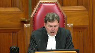
:::

The case of cooperation of the City of Greater Sudbury against Ministry of the Attorney General, Ministry of Labour, Training and Skills Development.

For the appellant, Corporation of the City of Greater Sudbury, Ryan J. Conlon and Jeremy D. Schwartz.

For the intervener, Regional Municipality of York et al, Jonathan C. Lysus, Zane M. Naki and John Carlo Mastrangelo.

For the intervener, Retail Council of Canada, Kevin McNeil, Jean-Simon Schoenholtz.

For the respondent, Ministry of the Attorney General, David McCaskill and Giuseppe Ferrero and William Robinson.

For the intervener, Workers' Compensation Board of British Columbia, Ben Parkin and Joanna Goosen.

Mr. Conlon.

**Speaker 2** (00:01:46): Thank you, chief justice and justices.

::: {.column-margin}
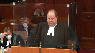
:::

I appear on behalf of the corporation of the City of Greater Sudbury with respect to what we say is a significant issue.

It has been the law in Ontario for literally decades that there are two separate and frankly diametrically opposed legal constructions for subcontractors under occupational health and safety law in Ontario.

Owners who are contracting for any type of work other than what is defined as a construction project under the occupational health and safety act has been held pursuant to the virtual, pursuant to the well-known decision of the Ontario court of appeal in Regina v. Whitson as being the virtual insurer for health and safety and required to take specific steps to ensure that occupational health and safety regulations are complied with as they pertain to subcontracting.

The legislature has chosen to implement an entirely different system of subcontracting in the context of a construction project.

And that is the ability of an owner as defined under health and safety legislation who has very limited enumerated obligations.

**Overlapping speakers** (00:03:06): in the app.

**Speaker 2** (00:03:07): act to contract to a third party known as a constructor who then has overall responsibility for the project.

::: {.column-margin}
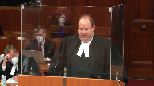
:::

If I could take you to tab one of our condensed book, you will see a passage that has been cited by courts in Ontario and across the country multiple times.

**Justice Brown** (00:03:36): Thank you.

**Speaker 2** (00:03:43): You'll see in the side bar passage that the construction is the party on a construction project who enjoys and can exercise the greatest degree of control over the entire project and all working upon it in relation to ensuring compliance with prescribed safety methods and procedures.

::: {.column-margin}
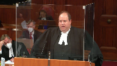
:::

Plans and organizes the project, has control over what contractors and subcontractors will be committed to work and continue working upon it.

He controls the project, decides he will undertake it and decides how it will be planned.

He goes on to basically say that the constructor is the party that's in control of the construction projects and makes all operational decisions with respect to the construction work.

There has been a litany of cases that we've cited in our factum where the identity of who the constructor is has been litigated in the province of Ontario and elsewhere where across the country similar legal structures are in place for construction contracting.

And in those cases the question comes down to a simple control test.

Who on the ground on a construction project is actually controlling the project?

If there's some mischief where there's a concern that perhaps the person that's identified themselves as the constructor is in fact not the party controlling the project, the court isn't bound by contractual documents.

The court is bound by the evidence at trial as to who the actual party is who's in control of the construction project.

A key provision of the occupational health and safety act to which is referred extensively by all parties including the interveners in this matter is section 1 sub 3.

And you'll find section 1 sub 3 in our contents book but essentially what it says is an owner like the City of Sudbury does not become the constructor by engaging personnel either directly in hired employees or subcontracted employees on the site strictly for the purposes of monitoring quality control.

The issue of the actions of the quality control inspectors who without doubt were on site at various points for the City of Greater Sudbury was the subject of extensive argument, evidence, and litigation at trial.

**Justice Côté** (00:06:15): I'm not sure if you can hear me.

::: {.column-margin}
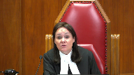
:::

One of the arguments presented by your friend on the other side is that that limitation at 1.3, to the effect that an owner does not become a constructor because it decided to hire inspectors, we don't have the same limitation regarding an employer.

We don't treat an owner does not become an

**Speaker 2** (00:06:39): My response to that is as follows.

::: {.column-margin}
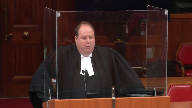
:::

I don't think it's necessary.

Quite frankly, my client is an employer.

It is clearly the employer of the quality inspectors that's on the site and it does have obligations for those employees.

So it's not like it's not an employer.

The question becomes is it an employer and does it have employer obligations as described in Regina v. Whitson for the construction workers for the workers employed by the contractor or those subcontracted by the constructor.

So I think that to insert the word employer in section 1.3 would cause some confusion and perhaps eliminate the real responsibility that my client clearly does have for its own employees that were on the site.

But it must be remembered that what the logical leap the court of appeal took in its decision was to take the undisputed fact that my client employed quality inspectors and then import liability to my client for the actus reus of offences involving an employee of the constructor interpaving and the specific deluxe.

They didn't explain how its responsibility for its own employees made it all of a sudden responsible for the entire project.

As the trial judge correctly found, Regina v. Whitson demands specific employer due diligence when there's employer obligations.

If my client were to have employer obligations for the workers that are on that project, that would require it as the crown submitted to the court of appeal as you'll see that extract in our contents book to take specific measures.

I think that it.

**Justice Jamal** (00:08:20): Perhaps you might be being a little unfair to the Court of Appeal because I think it wasn't a finding of Responsibility for the entire project it is simply a matter of prima facie liability with with with a due diligence defense It isn't saying you are absolutely liable by virtue of sending one quality control inspector into harm's way it is Saying that given the purposes of the act as public welfare legislation that prima facie There is liability subject to due diligence.

::: {.column-margin}
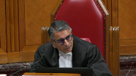
:::

Isn't that really the fairer way of characterizing what the Court of Appeal said?

**Speaker 2** (00:08:57): You are correct that that is what the court of appeals said but I think respectfully our submission on that point is that the defense of due diligence is illusory.

::: {.column-margin}
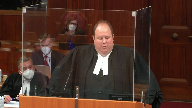
:::

Simply stated that if my client were to be liable for very specific health and safety violations literally a failing to have a signaler at a specific moment in time when a road grader was reversing, if you follow what the crown suggests would happen they would have to have taken specific measures to prevent that.

What jumps to my mind having litigated dozens of these cases is specific measures would be having supervision and control of the project, knowing what's going to happen when, authorizing what's going to happen when, appointing a supervisor, making sure that that signaler is properly trained.

These are all things that are the responsibility of the constructor.

**Justice Brown** (00:09:45): But even if being a constructor requires control, why does that mean that being an employer over here?

Sorry, this away.

**Overlapping speakers** (00:09:53): Sorry.

**Justice Brown** (00:09:54): Why does that require that an employer have control?

Because, I mean, after all, the definition of constructor is different.

It speaks to a person who undertakes a project, which suggests, at least to me, control.

And there's no such language in the definition of employer.

**Speaker 2** (00:10:09): There may be no such language, Justice Brown, but I think in terms of being able to achieve due diligence

::: {.column-margin}
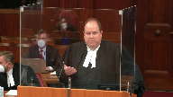
:::

and I think it may be of some assistance just to take a look at tab seven of our convinced book and the language from WSIN.

So this is the language from the court of appeal which describes what an employer's due diligence obligation is when dealing with subcontractors.

An employer is obliged by section 14.1 which is the operative section at the time to ensure that the measures and prescribes prescribed by the regulations are carried out in the workplace.

The relevant definition of insure in the shorter Oxford English dictionary third edition is make certain.

It puts an employer in the virtual position of an insurer.

**Justice Brown** (00:11:00): Is that defining the scope of the duty or but for the absence of a due diligence defence?

**Speaker 2** (00:11:06): This is defining what a due diligence defense is.

At this point, you have to ensure you have to.

**Overlapping speakers** (00:11:13): Can you can you show me where it says that?

**Speaker 2** (00:11:15): Well, I think it's just

**Justice Brown** (00:11:22): It looks to me like they're just defining the ‑‑ they're interpreting the language that states the duty but that would be subject to a due diligence.

::: {.column-margin}
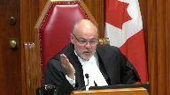
:::

Otherwise it would be section 7 problem.

You have to have a due diligence defence even if the duty and especially if the duty is phrased in the language of ensure.

Otherwise it's an absolute liability offence.

I take it we're agreed this isn't an absolute liability offence.

**Speaker 2** (00:11:47): No, we are in agreement with Justice Brown.

::: {.column-margin}
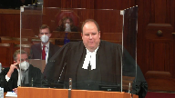
:::

Let's look at how an occupational health and safety offence breaks down.

Assuming you have responsibilities as an employer, the act is established by the mere absence of a signaler.

When the court is talking about making certain, they're talking about what you do from a due diligence perspective is a very, very high standard.

It's not, you're right, it's not absolute liability.

**Justice Brown** (00:12:15): I'm not sure that's what they're doing here.

::: {.column-margin}
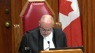
:::

I don't see that in the text that you've taken us to.

There's no reference to the content of the defence, the burden that rests on the employer to make out the defence.

I think they're interpreting and they expressly state that this is a principle of interpretation.

They're interpreting the language that states the duty.

But surely that's then subject to the defence.

But if I'm wrong, you can point me to the part that shows me I'm wrong.

**Justice Rowe** (00:12:46): But I would associate myself with the comments of my brothers Jamal and Brown that the Court of Appeal has said that if you have any employees there, you're responsible for everything that goes wrong, everything done by anyone at any point in the project unless you can make out due diligence.

::: {.column-margin}
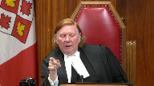
:::

And let me give you an example which is a little different from the particulars here.

You send in a quality control inspector to make sure that the concrete that's being poured in a foundation is being properly framed out and that it's of a certain quality because you don't want it to deteriorate and so you gotta tear down the building because the foundation is inadequate.

And so the inspector, quality control inspector comes on day one when they're pouring concrete.

Day two, they're not pouring concrete but the constructor is digging a trench for the purposes of putting in the framing.

There's a cave in and one of the employees of the constructor is buried.

Now, what the Court of Appeal is saying is the owner is liable.

That's how I read the Court of Appeal decision.

The owner is liable for the cave-in when it was the employee of the constructor and the quality control guy had nothing.

He wasn't concerned about the excavation.

He wanted to see whether the concrete was good concrete but that's what the Court of Appeal says.

And so everybody, it seems to me, is responsible in law for everything unless somehow you can hire a bunch of lawyers, go off the court at considerable expense and defend yourself saying I had nothing to do with this.

**Speaker 2** (00:14:47): Well, I mean, I think that I agree that justice wrote that that is the court of appeal is saying that you're responsible for everything and it takes me back to really the heart of our argument if that was the case.

::: {.column-margin}

:::

I mean, leaving aside how one wants to read wisdom or not read wisdom, due diligence is a high standard.

The crown itself said that to the court of appeal and at trial that our client was obliged to take specific steps to prevent the delix in this case which using your example with the trench would mean that my client would have been obliged to hire a trench expert or a supervisor to supervise the digging of the trench and to address what hazards might be there.

For example, there may not be a trench box or other such situation.

My client were responsible for doing that under the control test for becoming the constructor, they become the constructor because remember the definition of constructor is undertaking all or part of a project.

The second you undertake part of a project that makes my client become the constructor and become ‑‑ it means the entire legislative structure around the decision that was made by the legislature to carve out an exception for construction and construction contracts.

**Justice Côté** (00:16:00): I have a question for you

and I don't know the answer

so it's not a cross-examination.

So in the legislation we have a specific definition for the project and we have a specific definition for the workplace.

**Overlapping speakers** (00:16:15): Yes.

**Justice Côté** (00:16:16): And if you look at the duties of constructor under section 23, they are always talking about the project.

::: {.column-margin}

:::

If you look at the definition, the scope of the duties of employers at section 25, they are not talking about the project.

They are talking about the workplace.

Is there any argument to be drawn from that?

I mean, is the workplace equivalent to project or the other way around?

**Speaker 2** (00:16:46): Well, I mean, I think that I have to fairly concede that a project is a workplace.

::: {.column-margin}
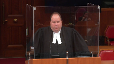
:::

But that being said, I think that there is an argument to be made that the legislature has specifically framed the issue of project and denotes that a constructor is responsible for a project doesn't note that an employer is responsible for a project.

So as a matter of statutory interpretation, the specific outweighs the general.

So from my perspective, there's certainly an intention of a legislative drafting of saying that there's one party that's responsible solely for the scope of what that project is.

And part of the process for first commencing a construction project in Ontario, including this one, is to file a notice of project that's legally required where the constructor not only identifies themselves but they identify the geographic scope of what the project is.

The project is redoing the water sewers and water mains on spark street.

That's how specific it has to be.

So there is clearly, I think there is some merit to the point that the employee, that there's no specific obligation spelled out for an employer on a project that's not undertaking construction work.

**Justice Kasirer** (00:17:55): Can we get specific ‑‑ you're not disputing the interpretation of the term employer by the court of appeal.

You're accepting that.

Your quibble is with 25‑1C, is that right?

**Speaker 2** (00:18:09): My quibble is this.

I'm not disputing that my client has employer obligations for its own employees.

Yes, I'm disputing whether or not my client is responsible for enforcement of the prescribed regulations on a construction project.

**Justice Kasirer** (00:18:25): But you're not saying that the city is not an employer.

**Overlapping speakers** (00:18:30): Under section.

**Justice Kasirer** (00:18:30): Right under section 1.1 and under Whitson.

::: {.column-margin}
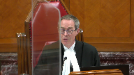
:::

So the court of appeal was right on that.

You'll concede that.

So your problem is what the scope of the duties are for the employer.

And what about the long-standing theory in Ontario law of overlapping responsibilities, the idea that in order to achieve the purpose of the act, which is to protect workers, we're going to create this system where one entity can wear different hats, where there may be overlapping responsibilities.

And this is a way to achieve protection of workers, which is the overarching concern of the Ontario legislature, not to the point of imposing absolute liability.

There's a path out.

The path out is in section 66 with due diligence.

I want to just get really focused on where the problem is and where you're asking us to read into the statute, because I think that's what you're asking us to do.

**Speaker 2** (00:19:34): Respectfully, I don't think I am.

::: {.column-margin}
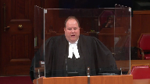
:::

I think what I'm specifically saying is I understand your comments about the belt and braces of health and safety.

Courts have addressed that in Enbridge and other such cases.

What you have not seen and what the crown has not pointed to is a single case ever in the last 50 years where an owner who contracted out to a third party constructor properly did so has been fined or convicted for an offence involving construction workers.

I'm going to submit there's a reason for that.

**Overlapping speakers** (00:20:06): Maybe the reason is that...

**Justice Karakatsanis** (00:20:07): this way, please.

::: {.column-margin}
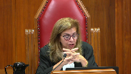
:::

I understand that your position is that if you put 251c, that you shall an employer shall ensure that the measures and procedures prescribed are carried out and a high standard for due diligence that requires a city to ensure that the person is posted on the intersection, that that's not workable.

I understand that is your position.

But if that is the problem, and I'm really trying to solve where the emphasis lies here, is the problem in saying that you're responsible for every single detail and a high bar for due diligence?

Or could it be solved by saying that ensuring that the procedures prescribed are carried out could be a matter of ensuring that you've got a constructor in place who is doing, who is required to carry out all of the responsibilities to ensure they're there?

What I'm trying to get at is I understand your point that making you responsible for every specific requirement in the regulations is not realistic for a city who sends in a safety instructor.

But you accept you're an employer, you accept you can't put your safety or quality control inspector in harm's way.

So you've got some responsibilities.

Is the issue how you describe shall ensure or can it be in what is it that would establish reasonable precautions in the circumstances?

**Speaker 2** (00:21:49): I can't leave ‑‑ do you care?

::: {.column-margin}
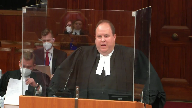
:::

Let me answer that as best as I can, justice.

The reality is there may very well be an argument that there is a different standard for due diligence for a owner who sends in a quality control inspector and doesn't control construction work.

Unfortunately the reality is how due diligence has generally been interpreted is that it's a hands‑on high ‑‑

it's a hands‑on high burden.

There's just no practical advantage when this court directs ‑‑

**Justice Karakatsanis** (00:22:19): reasonable what's reasonably appropriate dependent on the context and of all you're doing is sending in your quality safety control employee that would have a different standard of what's reasonably required than if you're actually undertaking work on the ground

**Speaker 2** (00:22:37): hand?

::: {.column-margin}
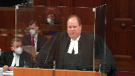
:::

I think that I agree that this court has repeatedly said when interpreting legislation that it's text, context and purpose that one should bear in mind.

But I think that by having the text of a system where you have a situation where you can contract out to a third party to suddenly when it's entirely based on a control concept to then suddenly suggest that simply by sending in one quality control inspector that triggers a massive set of duties at the actus rea stage.

Inaudible.

**Speaker 2** (00:24:05): Just to be clear, I'm not suggesting that the city does not have employer obligations for its own employees.

::: {.column-margin}
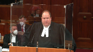
:::

If an accident happened to a city employee on a construction site or anyone else they could be potentially liable for the violations and it may very well be that the due diligence defense as you described being what we properly contracted out to a third party constructor and therefore and the usual other factors that the city employee was properly trained in hazards and the right to refuse unsafe other factors that go into assessing due diligence in any health and safety prosecution.

**Justice O'Bonsawin** (00:24:40): Isn't your answer to your right, but isn't your answer you don't even get to due diligence because when you look at the scheme, you're looking at the definition employer, you're looking at how their duties are noted in the regulation, you look at the act they meet their obligation so therefore you don't, isn't the answer you just don't even get to due diligence because you're looking at the quality control person is there for the specific purpose, there's a purpose under the act under one three

::: {.column-margin}
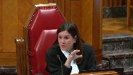
:::

so I just want to make sure I'm understanding your argument.

For me it makes sense that you don't even get to due diligence.

What do you say about that?

**Speaker 2** (00:25:18): I say that's what I say applies in the context of the pattern in the case before the court.

::: {.column-margin}
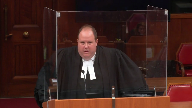
:::

I could say that it may very well be that in the context of a ‑‑ and again this is something that would have to be litigated.

I think there may be an argument that there are some due diligence obligations with respect to your own employees when they're on the site.

**Justice O'Bonsawin** (00:25:40): And what about West Fraser mills, paragraph 41 that talks about how you have to interpret the provision in a way and the reality of how the statutory scheme operates on the ground?

Is that relevant here, how it operates on the ground?

**Speaker 2** (00:25:56): I think and I think there are three cases that stand for that proposition one of them is West Fraser Fraser Mills the other is Canada Post, the third is Blue Mountain.

**Justice Brown** (00:26:05): Canada, come on, Canada post, there's actually a provision, you say at paragraph 39 of your factum this court upheld the appeals officers ruling that despite the wording on the face of the statute the requirement to inspect the workplace did not apply to locations that Canada post did not control.

::: {.column-margin}
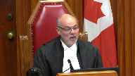
:::

Surely it wasn't despite the wording of the statute, it was because of the wording of the statute, right, which provided that every employer shall in respect of every workplace controlled by, controlled by the employer.

So control was expressly written in as a condition, right, which takes me back to justice's question aren't you really urging us to read control in.

**Speaker 2** (00:26:48): Well, I mean, I think what it's fair to say is I think there are two competing interpretations as there was in Canada post.

There was a dissent from this court case which expressly the dissent came to the opposite conclusion as the majority basis of the wording of that statute.

**Overlapping speakers** (00:27:00): and so.

**Speaker 2** (00:27:01): So, well, my point is that I think that like Canada Post, there are two competing theories.

**Justice Brown** (00:27:07): and there was a majority that relied on the express wording of the statute.

**Speaker 2** (00:27:12): All right.

::: {.column-margin}
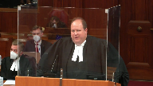
:::

Perhaps a better example than Canada post is in reference to justice O'Connor's question in relation to blue mountain.

That's a very clear example.

Blue mountain was a case where the question was there was a distinct wording in the legislation, the employer shall report an injury to any person to the ministry of labour.

And the question was did that include every person who broke their leg at a ski hill in Collingwood on any given weekend.

And the court of appeal acknowledged that textually speaking you could read it that way.

They specifically chose not to use the word worker they used the word person.

But that broad and sweeping interpretations of public welfare legislation can be narrowed.

And this is an example of where the legislature has set up a very, very specific really contracts driven sole example of where when a project construction project owner is contracting out as to what a project owner can do and what it can't.

And what it can't do is take any hands on role in construction whatsoever if it undertakes part of a project it owns liability for the whole thing.

I mean, take the example, it just simply means that perhaps a homeowner who is conducting a renovation shows up on their renovation site now all of a sudden does that make them the constructor.

**Justice Rowe** (00:28:27): Then there's an interesting question as to whether my homeowner's policy is going to cover any liability I have and whether they're going to, I'm able to call upon them for the duty to defend or whether I'm going to be hiring Gowling and Henderson at $500 an hour to go into this stew of litigation on due diligence for something that's being done to my own house.

::: {.column-margin}

:::

**Speaker 2** (00:28:56): Well, justice, it's my understanding from the lawyer who practices as defence council in the area that the standard homeowner policy and insurance in general doesn't typically cover regulatory offences.

**Justice Kasirer** (00:29:06): So I have two questions about the relationship between 251c and the due diligence test.

::: {.column-margin}
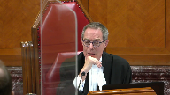
:::

The first is how does an employer know what their obligations are if there's going to be some notional control idea read into the statute, how in advance are they to know where those obligations lie and secondly, isn't it fairer to workers that the burden of showing no due diligence should be on the employer who knows has the informational advantage over the worker as to the precautions that it could have taken in the circumstances, for example, choosing a reasonable constructor with whom to work.

**Speaker 2** (00:29:57): Well, I mean, I think that the answer to the question is I think worker safety becomes more endangered the second an employer starts becoming of the view and the presence of the interveners today is a suggestion there's certainly widespread concern on this issue that they have that they have potential liability.

::: {.column-margin}
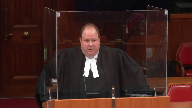
:::

I guess ship can only have one captain.

That's the whole concept of the constructor.

Construction is typically but not always a multi-employer workplace.

By having the city or any other entity suddenly become concerned with due diligence and the owners on the site, who is actually in charge?

That's the whole concept of the constructor system.

Someone has got to be in charge and it's got to be the person on the ground regardless of what the contract says.

That's how worker safety is protected.

Not having an ill-equipped city.

**Justice Brown** (00:30:45): isn't who's in charge.

I mean, again, you're kind of reading this in.

The question is who is liable.

So you're kind of, it just simply begs the question.

**Speaker 2** (00:30:57): Well, I think one of the answers to that question is legislative intent.

There is a list of duties for project owners in the occupational health and safety act and one of them doesn't address this issue.

If the legislature had intended for owners to have that obligation, they could make that obligation explicit, they didn't.

**Justice Martin** (00:31:14): May I ask whether taking ‑‑ you say the city takes control of part of the project by sending in an inspector?

**Speaker 2** (00:31:24): I don't.

::: {.column-margin}
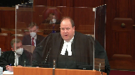
:::

Just to be clear, I'm not suggesting that a city takes control of part of a project by sending in an inspector.

I think the finding of the trial court and what the dispute at trial when the crown alleged the city was the constructor for this project was whether or not the city had taken effective control over it or not.

Our position at trial and here and the findings in fact aren't subject to review is that the finding was the city was acting as quality control and did not take over part of the project not withstanding the crown's trial submissions to the.

**Justice O'Bonsawin** (00:31:52): Because weren't the facts that the ‑‑ to your right, weren't the facts that the quality control person was really the person who was ensuring that the provisions of the contract between the parties was met, not necessarily your typical inspector role, right?

**Speaker 2** (00:32:08): That's absolutely right.

::: {.column-margin}
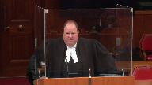
:::

They weren't acting in the role of a ministry of labour inspector.

They were the police officer of health and safety.

They were the ones issuing orders and recommending charges.

They're basically going back to justice rose example with the concrete.

That's what they were.

The city has a contract and they are entitled to ensure the taxpayers are getting what they paid for.

That was their primary job.

**Justice Martin** (00:32:27): Follow-up on that is the contract that exists then between who you say are the owners in the city does contain a compliance with law provisions basically in the tender that they will comply with all regulations.

**Overlapping speakers** (00:32:44): Yes, that's true.

**Justice Martin** (00:32:45): Right.

So if the city is sending someone in to make sure they're complying with all regulations and it's not, where does that lead?

**Speaker 2** (00:32:57): I think where it leads is that a commercial contract gives and we know that those contracts as we know from the our standard form contracts generally speaking and it's really up to the city if they're sending in a quality control inspector for them to focus on what they deem to be quality control.

::: {.column-margin}
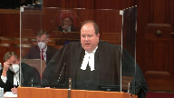
:::

That contractual provision is for the benefit of the city and there's certainly no question that the city identified some safety concerns quite appropriately and raised them appropriately as a prudent owner would.

But at the end of the day because they have a right, because they have the constructor promise to comply with the law doesn't turn the city into the ministry of labour.

They don't even have the power to charge anyone.

**Justice Côté** (00:33:41): Usually the city, when they have those quality control people, it is they send them before making their progressive payments on the contract.

They want to make sure that everything by that date has been completed and then they authorize the payment.

Usually the practice is that.

**Speaker 2** (00:33:58): Yes, I would agree with that, Justice Cote.

::: {.column-margin}
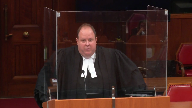
:::

In fact, the evidence at trial in this case and on every other construction project that I've seen, there's what's called change orders.

There's change every day and there's a cost associated with those change orders and the constructor is not going to undertake those changes unless they're guaranteed the city is going to pay them for them.

Yeah, so that is primarily in reality how that works on the ground. I agree.

**Justice Rowe** (00:34:18): When the other reality is coming back to my building of a foundation uh...

::: {.column-margin}
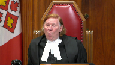
:::

you've got uh... the uh... construction the constructor who brings in prefab forms for the pouring of the concrete and in comes the quality control inspector from the owner and says hang on now I've never seen prefab forms everything is is purpose built and and the constructor says man you're behind the times this is how we save money this is how we get efficient go away your only job is is is to say whether this thing is in the right shape and it has the right physical characteristics in accordance with the spec sheet

and and i mean like whose it comes back to i

just i guess justice cote's point the if you stand in the quality control inspector it's not to tell him how to do the job it's to tell him have you achieved the specifications under the contract because otherwise we're not sending you the half million dollars

**Speaker 2** (00:35:20): Yeah, I think that's right.

And then the kind of things that you're describing, if there's a dispute, that's what commercial lawyers deal with in commercial court.

Dealing with what the contract said or didn't say about what was promised with respect to the forms.

Sure, that's the ‑‑ that's their primary job.

This is the public's money being spent.

These inspectors are making sure the public is getting what the public bargained for.

**Justice Brown** (00:35:37): Can I pull you back to your statement that due diligence requires, I'm trying to make a fair encapsulation, a totally hands-on approach by the employer.

Is that a fair summary of what you described earlier?

**Overlapping speakers** (00:35:53): It is.

**Justice Brown** (00:35:54): So I'm looking at Sault Ste.

::: {.column-margin}
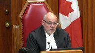
:::

Marie where justice Dixon as he then was wrote that due diligence places upon the accused the burden of showing as a defence that he did not have control or otherwise could not have prevented the impairment.

So that seems like fairly authoritative statement that suggests that in fact due diligence that is precisely what due diligence allows for is to show that you did not have control.

**Speaker 2** (00:36:29): Well, I just think respectfully that the majority of occupational health and safety clause, and looks at Enbridge, for example, who wasn't present at the, well, maybe they need to.

**Overlapping speakers** (00:36:39): maybe they need reminding.

Is Sue St. Marie still good law?

**Speaker 2** (00:36:42): My understanding is, Justice Brown, it is.

::: {.column-margin}
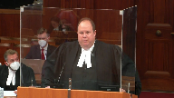
:::

We can say that from sitting in this court, but how it's interpreted realistically on the ground and we heard about the belt and braces approach to health and safety is that the obligations of an employer are broad and sweeping and this case is no, you know, having my client liable for reversing.

**Justice Brown** (00:37:05): Obligations are broad and sweeping and they're subject to a due diligence defense.

Again we agree that this isn't an absolute liability offense but you seem to be treating it as if it were one because it requires a totally hands-on approach.

**Speaker 2** (00:37:18): Well, I mean, I think that respectfully, we may just not be at it on this point, I'm maybe not going to convince you of it, but my respectful submission is the way due diligence has been historically interpreted in health and safety cases is to have a hands-on role.

::: {.column-margin}
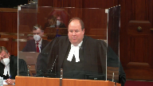
:::

That is the very submission the crown prosecutor has made in this case.

I'm not making it up.

**Justice Brown** (00:37:44): Well, but that they're wrong is something we can say.

::: {.column-margin}
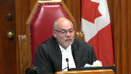
:::

We can say what we said, I mean, you know, as you say, it's authoritative.

Sault Ste.

Marie provides that due diligence allows for a defence that the employer did not have control.

Those are the words of Sault Ste. Marie.

Does that not solve the problem for greater Sudbury?

**Speaker 2** (00:38:11): I don't think it does because I think that frankly the situation that we find ourselves in is if the second that we start creating some notion of an obligation of a homeowner, a municipality, a large employer, a small employer, I mean, the constructor concept is an all or nothing concept.

::: {.column-margin}
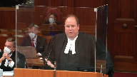
:::

The second that there starts being some speculation as to what the exact nature of the duties are, we get into justice rose example of paying gowlings to figure that out 10 years from now as to what those obligations are.

**Justice Kasirer** (00:38:43): Because we're in the employer, we're in the employer definition and the first branch of the employer definition as the Court of Appeals said.

::: {.column-margin}
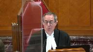
:::

I want to take you to 251c and I want you to tell me what it says and where you get these ideas of sphere of operation or sphere of control and how you propose that the Supreme Court interprets this provision in a way that's consonant with our modern approach to because you're, to listen to you, it sounds like you're arguing against text and against purpose

and I see that, you know, where is it that you get these extra words into the text of 251c?

**Speaker 2** (00:39:32): Well, 251c of course requires that the measures and procedures prescribed by legislation that an employer is required to insure those.

::: {.column-margin}
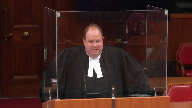
:::

What I'm suggesting to you justice is that in the broader context of how this statute works when there's a specific party identified who is responsible for the project and there's an obligation of my client to take a hands off role that the context and purpose of this legislation which I submit in the construction context is to allow an owner to contract out to an expert who is best equipped to insure who is best equipped to insure compliance.

Reading this to say they have the full of 400 provisions of the Constructor Regulation.

Inaudible.

**Speaker 2** (00:41:05): I guess my only answer to that point is that I am asking the court to read section 251c in the context of the broader legislation that for my client or any other client to try to figure out exactly what due diligence means in the circumstances where they have this additional requirement for a hands off, completely hands off approach is unworkable.

::: {.column-margin}

:::

It's contrary to the intention of the statute that one party is responsible.

**Overlapping speakers** (00:41:36): or did you mean hands-on approach well what I mean hands-off

**Speaker 2** (00:41:41): Hands off a hands-on approach to put the put so the reality is the system is set up in such a way So that the party who's responsible for the site is punished.

That's what happened here.

Interpaying was fined $200,000 for its violation in this instance.

**Overlapping speakers** (00:41:57): But I-

**Justice Martin** (00:41:57): I guess I come back to the idea that you said that the construction project needs one captain, but doesn't the legislature here say that the employers can have two protectors?

**Speaker 2** (00:42:09): I think that those comments need to be read in the context of a non-construction site where there is no ability as the, I mean, I guess the best example I can take you to is the grant force products case.

::: {.column-margin}
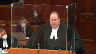
:::

In grant force products, the defendant, industrial employer challenged the constitutionality of the definition of employer on the basis that the employer, that the industrial employer couldn't assign responsibility for health and safety compliance to a third-party subcontract.

Ultimately the trial court justice found there was no constitutional violation.

It wasn't overly broad.

There wasn't an argument from the crown that said that the entire case is moot because the owner has employer obligations anyway.

They defended it on the merits.

That whole argument could have been dismissed in two lines if the crown's theory here is correct.

In grant force products, the case was addressed on the merits.

There's no suggestion that the entire premise of the charter challenge was fundamentally flawed on its face.

**Justice Karakatsanis** (00:43:14): Still trying to understand your position here.

::: {.column-margin}
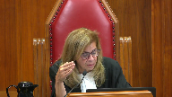
:::

I understand that you're accepting that the city is the employer of the safety inspector and that the city has responsibilities, I'm assuming under 251c to make sure that the safety or quality control inspector is protected.

What do you say that 251c actually, what obligations does it impose on the city?

When you look at the words and just tell me what you say it means, you said interpret it in the context of the scheme

but I'm not sure what interpretation you're actually proposing.

**Speaker 2** (00:43:54): I'm proposing that the city as an employer is responsible for and could be held liable for violations of prescribed regulations relating to their own employees. I am not.

**Justice Karakatsanis** (00:44:10): carried out in the workplace but only as they I'm just looking at the language an employer shall ensure that the measures and procedures prescribed are carried out in the workplace and you're saying only those that could potentially impact the quality control inspector

::: {.column-margin}
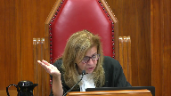
:::

**Speaker 2** (00:44:31): What I'm saying is if there was a violation that was associated with the quality control inspector, then I then say there is at least an obligation subject to a due diligence defense of the city being responsible.

**Justice Karakatsanis** (00:44:43): So only the measures and procedures that relate to, I'm just, I understand where you want us to get to, I just don't understand how.

**Speaker 2** (00:44:52): Well, I mean, I guess how is what I'm asking the court to do is not just simply take a purely textual reading of the definition of employer in isolation.

::: {.column-margin}
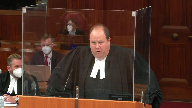
:::

I'm asking the court to consider that there is a broader system of subcontracting that relates to control.

And when you ‑‑ it is a far more ‑‑ it makes far more sense from an interpretation perspective to have the responsibility for safety in the hands of an expert and not be concerned about sort of some vague or uncertain standard that is not enumerated in the statute for project owners.

**Justice Kasirer** (00:45:30): This question is very serious.

::: {.column-margin}
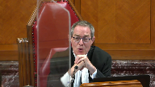
:::

We spend all our time interpreting statutes and you just haven't given us one clear basis for understanding your reading of 251c.

And not only that, fully four pages of your factum devoted to Canada post is in my respectful view not useful to us because you're saying as you say in paragraph 40 it was determined that control over the workplace was necessary for the obligation to apply and as Justice Brown pointed out that's because the majority in the case read the statute.

So what are we supposed to do and how are we supposed to do it?

Because you can't just sort of say only their own employees or some kind of sweeping reference to context and then leave us with the figure out how you get it into the statute.

Why not rely on what the statute says and section 66 which will allow you to make constructor control arguments at the back end where you as the city having known the obligations you've contracted with the contractors will be in a position to say well, we took all reasonable measures to avoid this kind of accident.

**Speaker 2** (00:46:53): It doesn't make sense and again maybe Canada post isn't the best example perhaps blue mountain is.

::: {.column-margin}
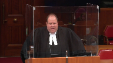
:::

It doesn't make the best sense when one looks at the broader context of how this particular statute works.

Basically to have a system where the legislature has specifically said you have to take a hands off rule if you contract out to a third party.

Inaudible.

**Overlapping speakers** (00:47:22): Yeah.

Inaudible.

**Speaker 2** (00:47:37): I don't think I would take much from that, I think at the end of the day it's a subject to be considered.

**Overlapping speakers** (00:47:43): Well, other than it being the statutory language that we're asked to interpret.

**Speaker 2** (00:47:47): No, I understand what you're saying, justice Jamal, but I think again that when you're interpreting which legislation is prescribed and how it should apply, I think you need to look at the broad.

**Justice Brown** (00:48:04): Yeah, the broader context.

::: {.column-margin}
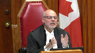
:::

We've heard that in response to Justice Katsanis, we've heard it in response to Justice Kazir and now in response to Justice Jamal.

What interpretation of 25.1c are you urging on us?

Not what is the character of that interpretation, what is the interpretation?

What should we pretend it says?

**Speaker 2** (00:48:26): I'm suggesting that you interpret it in such a way that prescribed regulation should only apply where it's appropriate.

**Overlapping speakers** (00:48:33): Not in such a way.

What is the interpretation?

**Speaker 2** (00:48:36): The interpretation is that the construction project regulations should not apply to an owner who is subcontracted out to a third party and is not performing construction work on a project.

**Justice Brown** (00:48:51): You

**Overlapping speakers** (00:48:51): just to find.

**Justice Brown** (00:48:52): and tweak.

**Justice Rowe** (00:48:56): My colleagues are commendable in their textualist approach.

::: {.column-margin}
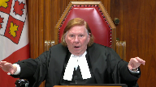
:::

It's a watchword for the future.

When I read, by the way, drafting in the pass of voice is simply bad drafting

but I digress.

In 25.1c, an employer shall ensure that the measures and procedures prescribed are carried out in the workplace.

Then I look at the duties of the employer and I look at the duties of the constructor.

A constructor shall ensure that B, no, A, the measures and procedures prescribed by this act and the regulations are carried out in the project.

So the operative wording for the constructor is the measures and procedures prescribed by this act and the regulations are carried out on the project, the operative wording in 25.1c for employer is the measures and procedures prescribed are carried out in the workplace.

That looks to be using slightly different words to say the same thing.

And that seems to be the basis upon which the court of appeal and perhaps some of the questions here posed to you presume that in fact rather than being overlapping, the employer and constructor obligations are coextensive which makes the difference between the employer and the constructor collapse and become meaningless.

And is that not the problem?

With interpreting 25.1c as equivalent to 23.1a, it makes nonsense of the definition and the statutory structure which tries to draw a distinction between the responsibilities of the constructor and the employer.

In other words, the court of appeal has collapsed the two into one which makes no statutory sense.

**Speaker 2** (00:51:24): That's in essence what I'm trying to say, Justice Roe.

**Justice Côté** (00:51:32): I have a question for you, council.

::: {.column-margin}

:::

Let's say that instead of the lady who died, let's say that it would have been one of the quality control inspector, exactly for the same reason, because there was no signaler when the operator was doing the work and there was no fence.

So instead of a third party who is injured would have been one of those quality control inspector.

What would be your position regarding the possibility of the city to be charged?

**Speaker 2** (00:52:04): Well, I mean, I've acknowledged that the city is an employer of its own workers.

It may be in that circumstance the type of due diligence argument that we're hearing about may become more relevant because they do have obligations for their own people.

That would be my position.

**Justice Martin** (00:52:19): But as I kind of hear your suggestions, aren't you saying that in terms of the employer control should be read in to section 1.1 and then when if you're saying that, how does that apply in does that only apply that employers are different employers vis-a-vis different persons in all cases or just in construction cases, I'm kind of getting a little lost here.

::: {.column-margin}
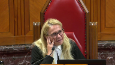
:::

**Speaker 2** (00:52:49): I think that the argument is that it applies only in construction cases because it's only in the context of construction that the constructor concept applies the difference in language between workplace and project that justice row referenced applies.

::: {.column-margin}

:::

Outside the context of construction these as grant forest products clearly says there is no application of the concept of constructor at all.

It's the employer who subcontracts for workers is full on responsible for them.

**Justice Brown** (00:53:18): So do we have two understandings then of a duty prescribed in statute depending on the context?

**Speaker 2** (00:53:25): Uh, yeah, I think that that's precisely so.

**Overlapping speakers** (00:53:30): Can a statute mean two different things at the same time?

**Speaker 2** (00:53:34): I think it can mean

but I don't think it is it can mean two different things in two different contexts.

The legislature has chosen explicitly to set up a different type of subcontractor.

**Justice Brown** (00:53:43): You see, I would have thought your answer would be, well, we're just applying it in different ways depending on the context, but your claim is quite a bold one, that the statute can actually, that parliament or in this case the Ontario legislature actually expressed itself in two different ways in one set of words and which set of, which way applies depends on as you call it the context.

::: {.column-margin}
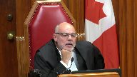
:::

That's a remarkable submission.

Do you have any authority for that?

**Speaker 2** (00:54:10): I don't.

::: {.column-margin}
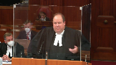
:::

I think that my primary submission is that there has been a different system set up for constructors and the type of interpretation being urged on the crown renders the distinction between employer and constructor and the well established system described by Justice Pupor at the superior court is completely undermined by that interpretation.

**Justice Jamal** (00:54:32): Q. You said that your position is sort of supported by authority and long practice.

::: {.column-margin}
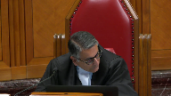
:::

Could you give us any authority for the interpretation that you've urged on 25-1C, that it is to be read down, in effect, by virtue of 23-1?

Because if this is well established in the jurisprudence, presumably there's some authority for the proposition.

**Speaker 2** (00:54:54): Well, I think there is certainly authority and I'm happy to take you to it is that a tab five of our condensed book.

::: {.column-margin}

:::

And this is the grant forest product, aforementioned grant forest products case again.

It's not specifically referring to section 21c but this is justice Pellanger referring to the concept of a different system for construction.

It reads as follows.

In my view the answer to the submissions relating to confusion is given by counsel for the defendant herself in a report she co-authored and provided to the court.

It is worth adding a final note that confusion continues to exist regarding whether a corporation that contracts for services should take a hands on due diligence or hands off approach to the employees of a contractor.

The legal answer to this question is absolutely clear his emphasis.

A corporation falling under the extended definition of employer can never properly take a hands off approach either by ignoring the situation or crafting non-contractable terms making the subcontractor responsible for performing work in compliance with the OHSA and regulations.

The only situation in which contracting away is potentially available is a situation where construction as opposed to work generally regarded as non-construction services and where an owner is seeking to contract will be responsibility to as a general contractor for the work.

The matter of contracting for construction projects.

**Justice Brown** (00:56:11): So can I pull you back to paragraph 54 of that decision? Sure.

::: {.column-margin}

:::

Three lines down.

Surely the requirement to demonstrate due diligence and owner-contractor relationships varies in accordance with such factors as the relative experience, expertise and competence of the contracting parties to name but a few.

In some cases it may be satisfied by proof of the exercise of reasonable care and meaningful effort in the selection of the contractor.

So I'm confused that you present this case as an example of having to have a hands-on approach in order to establish due diligence.

**Speaker 2** (00:56:48): I present this case as an answer to the question as to whether I could point to any authority that showed the recognition of a hands off approach and two distinct approaches to construction contracting is something that I've been working on for a long time, and I think it's a good

**Overlapping speakers** (00:57:00): So what do you say about that passage in paragraph 54?

**Speaker 2** (00:57:03): What I say about that is it makes complete and total sense in the context of a situation where an owner can't contract out of liability.

::: {.column-margin}

:::

There's no control factor right in, there's no constructor role.

So in that specific circumstance it makes eminent sense that due diligence would be a flexible concept.

When you're dealing with this entire system that's been built for decades around contracting to a constructor, I think this is just where it falls down.

It just does not make any practical sense.

**Justice O'Bonsawin** (00:57:38): But doesn't the answer find itself in blue mountain about not leading to an absurdity because basically by the mere fact that you have a quality control person there automatically would make them liable?

Isn't that the answer?

**Speaker 2** (00:57:53): And that's one of our, as you'll see in our factum, that's one of our submissions.

That it would be an absurdity to just simply having all these responsibilities simply by having a quality control inspector show up and if they didn't all of a sudden they have no such responsibilities at all, which of course isn't worth it.

**Justice Karakatsanis** (00:58:08): So I understand that your objection to 251c is that it requires a hands-on responsibility for ensuring that every employee on the site is enforcing every safety measure.

::: {.column-margin}

:::

But when I look at section 231b, which is the constructor's obligation in addition to ensuring all the measures and procedures prescribed are carried out, they have the additional responsibility that an employer does not have to make sure that b, every employer and every worker performing work on the project complies with this act and regulations.

Is that more hands-on?

Does that inform in any way the responsibilities of the employer under 251c?

**Speaker 2** (00:58:59): I guess our answer to that is twofold.

::: {.column-margin}

:::

If an employer started exercising due diligence they basically stand in the shoes of the constructor and pick up those obligations.

I think what's telling in this case is my client was charged with the exact same offences as constructor and as employer.

In this particular case it was a distinction without a difference.

They were charged with offences that did not involve their employees.

**Overlapping speakers** (00:59:24): So it is relevant to the interpretation of 25-1C.

**Speaker 2** (00:59:28): I think it's only relevant to the extent that it shows the sweeping obligations that an employer trying to exercise due diligence over a construction project would be liable for.

So that's as far as to the extent that I say it's relevant.

**Justice Kasirer** (00:59:41): I don't know how illogical it is if the court of appeal said we're dealing with employer and at the first branch of the definition of employer and we're not going to speak to constructor.

::: {.column-margin}

:::

They were very explicit about that.

I'm wondering about the other duties of the employer in section 25.

Are we also to read in caveats to those that the legislature has?

For example, 251E says that an employer shall ensure that a building structure or any part thereof or any other part of the workplace, whether temporary or permanent, is capable of supporting any loads that may be applied to it.

There's a sweeping responsibility for an employer.

Would you read that down as well?

Or should we wait until due diligence for that one?

**Speaker 2** (01:00:37): I don't think we should wait for due diligence to that one, but I think that

**Justice Kasirer** (01:00:42): I don't know but should we read in something to 251e or are you proposing in the same way that we read in something to 251c?

I mean why stop at 251c?

Why don't we just amend the whole act while we're at it?

**Speaker 2** (01:00:57): Well, I mean, I think respectfully 2151c and 251e are getting at different things and that's assuming for a moment that the actual owner has control over that issue.

::: {.column-margin}

:::

I think that's an issue that relates not to the construction work but to the actual site itself.

There may very well be a different interpretation.

That is a completely different issue than whether there's a reversing signal or a completely different issue, whether there's a safe...

**Justice Kasirer** (01:01:22): Of course it's a different ‑‑

I'm asking you whether the same interpretive approach that you're proposing to us for 251c applies to the range of obligations and duties imposed not on an owner but on an employer.

**Speaker 2** (01:01:40): It's possible it's possible it may not those just aren't the facts that were engaged in so my

**Justice Kasirer** (01:01:44): question is why not count on section 66 to do the work like the legislature imagined it to do the work and so that both for 251c and 251e the employer can say well, I took all reasonable precautions to avoid this accident in the circumstances and it would be unfair to make me liable.

::: {.column-margin}

:::

The blue mountain point earlier is not, we've got to be careful.

Our case is not about liability.

Our case, you are not liable at the end of the day when the court of appeal sends the matter back to the appeal judge to have the due diligence matter reviewed.

You're not liable.

**Speaker 2** (01:02:32): Well, I mean, I guess and I appreciate that my time is up

::: {.column-margin}

:::

but I will answer the question.

My answer is just back to the Honestman's statement.

This is contemplated by imposing liability on my client results in an absurdity and basically eliminates the constructor issue and a whole bunch of needless legal expense.

**Justice Wagner** (01:02:57): All right.

Thank you very much.

**Speaker 3** (01:03:23): Thank you Chief Justice and Justices, am I coming through?

**Overlapping speakers** (01:03:27): Yes, thank you.

**Speaker 3** (01:03:28): The, the regional municipalities offer for submissions for this court's assistance.

::: {.column-margin}

:::

The first one is this.

The legislature has recognized that modern construction projects are unique workplaces because of their diversity complexity and scale.

And my time doesn't permit, but I would ask the court to please recognize the recognition of this important factor in the definitions of the statute of construction constructor and project and the limitations in section 1.3.

As well as the scope and extent of the 399 provisions in Ontario regulation to 1391.

The significance of these facts and the concern of the municipalities in this case is that the essence of the crown position and some of the debate from this morning is that to use the language in paragraph 58 of Ontario's factum paragraph 58, the presence, the presence of an inspector on a job site, on a project to use the language of the statute makes the employer of that inspector, the municipality, the city, and importantly a town, village or township and employer of the entire project.

So it's one thing to talk about repairing a main or a pothole or the street, but think about a different kind of project, 13 kilometers of a light rail system in Ottawa with 12 stations.

And I respectfully submit it cannot be the intention of the statute that if the city sends a quality assurance inspector to Rideau station to check that 13 park lights were installed because that's what taxpayers paid for, the city cannot become an employer across the entire 13 kilometers of track, tunnel, electrification, substations.

It creates, and the answer is not in the due diligence defense, it creates a liability and a responsibility that is untenable.

The next point I want to give

**Overlapping speakers** (01:06:26): Why is the answer not in the due diligence defense?

**Speaker 3** (01:06:29): because the concern, Justice Brown, is how this statute affixes and apportions responsibility and liability.

::: {.column-margin}

:::

And I respectfully submit it is an extravagant proposition to say that an owner, a municipality, a city, or town becomes an employer of every person on a project, as that word is used in the statute, because they attend for the limited section 1.3 purpose of quality assurance.

And this is a Blue Mountain problem.

You are creating a duty that cannot be discharged.

Before we ever get to the defense,

**Justice Brown** (01:07:12): But I'm not asking you about the creation of the duty, I'm asking you why is the answer not in the due diligence defence.

**Speaker 3** (01:07:18): Well, I say because we're dealing with the construction of the statute to first affix a responsibility that the due diligence applies to.

::: {.column-margin}

:::

And I say this statute 23, when you read 23 and 25 together, as Justice Roe summarized, each one giving meaning, the legislative intent is that constructors on projects have a different scope of responsibility.

And to get to the due now in the due diligence bucket, that due diligence burden could never be discharged.

So if a quality assurance inspector is checking pot lights or murals in a station, and there's an electrification fatality on the station on the track five kilometers away, it makes no sense in my respectful submission to say that that means the city has to answer for it by due diligence.

Why do you say?

**Justice Karakatsanis** (01:08:15): Why do you say this the city would then be the employer of the entire project?

**Speaker 3** (01:08:21): Well, that's the implication of the crown position, Justice Karakatsanis.

::: {.column-margin}

:::

If you look at my friend's factum in paragraph 58, they say that the presence of an inspector on a job site creates, using the construct of overlapping responsibilities, an employer obligation.

And there is no authority that stands for that proposition, no authority.

Structform doesn't say that, Enbridge doesn't say that, UConn doesn't say that.

The mere presence of a quality control inspector cannot make his or her employer the employer of every other trade and person on the job site.

That's not the way the statute works.

That renders the distinction between a constructor in 23 and 25 entirely meaningless.

And it renders section 1.3 meaningless.

**Justice Wagner** (01:09:19): Thank you very much, your time is up, thank you.

**Speaker 1** (01:09:24): Thank you.

::: {.column-margin}

:::

I would like to address three points from the court and leave you with a hypothetical for your consideration, which in my submission touches on the point of why not just leave it to the due diligence defense.

Justice Brown pointed out that there is no specific language in the definition of employer requiring control.

And to be clear, we do say and we ask that you read in a knowledge and control requirement and Rizzo and Rizzo Shoes and West Fraser Mills address this and provide you the path forward.

Rizzo and Rizzo Shoes, the statutory language, the clear plain statutory language said workers terminated by a bankruptcy do not get termination pay.

This was because by operation of law, the termination was not quote unquote by an employer, the operative words of the statute.

However, the court interpreted the words by an employer to include an action that was not taken by an employer, but rather.

**Justice Kasirer** (01:10:39): Mr. McNeil, just to be plain, so you're making an argument that is not the argument of the appellant.

::: {.column-margin}

:::

You're seeking to expand the definition of employer and would you leave 25-1C as it is?

I mean, are these two options the court has to go one route or the other?

We can amend one provision of the act or amend the other.

**Speaker 1** (01:11:03): The two provisions, of course, take colour from each other.

::: {.column-margin}

:::

So, and we are submitting that the definition of employer must be nuanced and factually influenced and that the burden of proving who is an employer in a specific context should be on the Crown.

So, and I am going to address 25.1c momentarily and Justice Jamal's question about that.

But as I was saying for RITSO, the court found that the words by an employer could be read in a way to include an action that in fact was not by an employer.

And in West Fraser Mills, the definition in the BC statute there of an employer also did not have a knowledge and control requirement.

However, at the end of the day that was the determinant of consideration in West Fraser Mills.

And you see that at paragraphs 31, 35 and 45 of that decision.

Employer status in that case turned on the fact that the employer had sufficient knowledge and control over the workplace to an end.

**Justice Brown** (01:12:17): If Wes Fraser was decided applying British Columbia's statutory patent on reasonableness standard of review, ultimately it didn't endorse the tribunal's interpretation so much as to say it didn't stink to high heaven.

::: {.column-margin}

:::

The language that the court said was the tribunal's decision or interpretation was not openly clearly and evidently unreasonable so as to border on the absurd.

I've never really understood decisions based on patent on reasonableness having much precedential value outside of the specific statutory context of that statute.

**Speaker 1** (01:12:53): It is a path that is open to you and I won't go further as there are a few other points I wish to address.

::: {.column-margin}

:::

Justice Jamal asked about the interplay between section 25 1c and 23 1b and to that point we would submit that whether there's case law authority in the lower courts on that or not as a matter of statutory interpretation we address this in our factament paragraphs 8 to 18 we point out that 23 1b expressly gives overall responsibility of the workplace to the constructor and we submit that that subsection must colour the definition of employer and the duties of an employer under 25 1c.

Justice Kazir asked about the theory of overlapping responsibilities which of course exists but we say that in any case there ought to be a nuanced and fact-based assessment of who the true employer is and the crown should have to prove that and Justice Kazir also asked is it not fairer to workers to put the burden on the employer who knows on the employer who knows and that is precisely our point.

Now as to the consistency of what we ask with the act's purpose we submit that there is no case in the in the lower courts that says that the purpose of this act is unlimited worker protection rather the the cases speak of minimum protections and reasonable protections and they also talk about the need for there to be a just interpretation of that legislation.

If you would indulge me 30 seconds to give you a hypothetical we pointed out in our motion to intervene that the Retail Council of Canada has over 30 or 50,000 members of employers with five or fewer employees and these small employers engaged in construction projects to modify their shops to keep customers safe from COVID-19.

Imagine this hypothetical a small retailer who owns its shop hires a small constructor to install physical distancing materials that is a construction project under the act.

The construction company assigns a sole worker and gives him an ungrounded and unguarded electric saw to work with that violates several sections of the construction regulation.

The small retailer has a cashier watching the worker accidentally severs a number of his fingers with the unguarded saw and on these facts and on the the court of appeals interpretation the small shopkeeper would be an employer and would be subject to considerable fines and legal fees and it is cold comfort to that type of employer to say you have a due diligence defense.

**Overlapping speakers** (01:15:39): the practical reality.

May I have 10 seconds?

And I promise I will.

10 seconds.

**Speaker 1** (01:15:43): It costs more to defend these due diligence cases than the fines so you simply have small employers pleading out 40,000, 50,000, 80,000 and in my submission that is not justice and that is not the intention of this statute.

**Justice Wagner** (01:15:58): The Court will take its morning break, 15 minutes.

::: {.column-margin}

:::

The Court will take its morning break.

The Court will take its morning break, 15 minutes.

**Speaker 4** (01:17:09): Justices, the death of Cecile Paquette was as predictable as it was preventable.

::: {.column-margin}

:::

Despite the fact that this event occurred in plain sight on property it owned and was the direct result of violations of which it was aware and did nothing to remedy, the appellant claimed it bore no responsibility because it did not control the project and was therefore not an employer as defined.

This irrespective of the fact that it had workers of its own on the project at all times, not only is this position factually unsustainable, it is legally incorrect.

**Justice Rowe** (01:17:49): What would you say to the hypothetical that was put to us about the rail line and somebody inspecting the pot lights and there's an electrocution five kilometres away?

According to your position, the municipality is liable there as well.

**Speaker 4** (01:18:07): The municipality justice row owns the premises.

They own the project.

They have an overarching duty to ensure that the premises they own onto which they invite employers is a safe workplace.

**Justice Brown** (01:18:18): Well, would the track five kilometers away be the same workplace as Rideau Station?

**Speaker 4** (01:18:24): It might not be.

::: {.column-margin}

:::

There's different ways of defining a project under the legislation.

A project, something as extensive, for example, something for extensive example as a subway remediation or a subway building project could have several individual projects within it with several different constructors.

That's well-recognized and that's well-recognized.

**Overlapping speakers** (01:18:43): Okay, so it's half a kilometer away not five kilometers away

**Speaker 4** (01:18:46): It's the same deal.

It might depend on the nature of the work being done to define it as a different project.

As I say, whether it's five kilometres or fifty kilometres, it could still be a different project within the same overall construction.

**Justice Karakatsanis** (01:19:01): Does it make a difference that 25.1c talks about the workplace, not the project?

**Speaker 4** (01:19:07): Yes, it does.

::: {.column-margin}

:::

It makes a difference in this sense as well.

There are two separate categories of workplaces, shall we say.

A project is one and one only.

There are others.

There are farms, there are diving projects, there are industrial facilities.

Those are all workplaces.

A project is an element of a workplace and that only.

It bears recognition of this point as well.

The definition of employer that the appellant seeks to alter quite frankly is of universal application.

It is not unique to construction.

The definition of constructor is unique to construction.

So in attempting to alter the definition of employer to fit its needs on a construction project only, what the appellant seeks to do is alter it for any and all other workplaces, be they industrial, mining, farming, diving, etc.

All the different sectors that are covered by the Occupational Health and Safety Act.

**Justice O'Bonsawin** (01:20:05): But you talk about the nature of the work.

It depends in response to justice, you said it depends on the nature of the work.

Well, then isn't that interactive and the nexus, well, it depends on the duties?

The duties, yes, the duties, yes, the duties

**Speaker 4** (01:20:19): The duties are universal.

::: {.column-margin}

:::

It's not the same thing.

The duties apply to an employer.

The duties apply to a constructor on a project and not a project only.

You can break a large concern into several projects with several constructors and each one would have their own duty of responsibility to the overall project.

We run into very, very murky territory when we start suggesting that conflating employer and constructor is one and the same thing.

The appellant's argument seems to conflate the two as if they were one and the same thing.

**Justice Rowe** (01:20:56): No, sir, I put to you what your argument does.

Your argument leads exactly to that consequence.

And that is the problem with your argument.

**Speaker 4** (01:21:05): Let me answer it this way, justice roll, because I wrestled with this problem.

::: {.column-margin}

:::

I anticipate it coming.

And I have to deal with it.

The duties in section 23 are different.

Those are the constructor duties than the duties in section 25.

Under section 23, section 23a and particularly section 23b, a constructor has a much broader overarching duty.

But I would go a step farther than just that.

If you look at regulation 213.91, that is the construction regulation, there are a large, large number of duties that are imposed within that regulation only on constructors.

And they're set out with some precision and clarity in appendix b of volume 2 of my friend's materials, his record.

That signifies in my respectful submission a clear intent on the part of the legislature to suggest there are much greater duties on an employer on a project, sorry, on a constructor on a project, I mean to say, than on an employer on a project or an employer in any other workplace.

213.91 is unique in that sense that it applies only to construction projects.

The definition of constructor can only apply to construction projects.

**Justice Côté** (01:22:16): Mr. McCaskill, your argument is essentially based on a literal reading of the legislation, of the provision of the definition of employer.

::: {.column-margin}

:::

What do you do with what we said so many times about the modern approach to statutory interpretation and what the court said in West Fraser about the way we should proceed and not to be stick to the words only but to look at the entire scheme?

**Speaker 4** (01:22:45): With great respect, Madame Justice, I don't believe that my position is a pure strict literal interpretation.

::: {.column-margin}

:::

I believe my interpretation is in keeping with the overall goals of the legislation.

The goal of the legislation, this is well established, the goal of health and safety legislation not just in Ontario but province wide as endorsed quite frankly in both Canada post and west Fraser mills is a broad liberal interpretation not a narrow technical interpretation.

**Justice Côté** (01:23:12): Yeah, but even if it is a broad interpretation, and everybody acknowledges that, in Blue Mountain, the court said yes, a broad and large interpretation, but not limitless.

What do you say on that?

**Speaker 4** (01:23:23): Well, I don't say that the interpretation that we're suggesting is limitless.

::: {.column-margin}

:::

That's the difference.

I understand blue mountain.

I was losing counsel in blue mountain.

I know the position of the court quite succinctly in that particular case.

And if I may be permitted just a moment to talk about that case, quite frankly it was a case that should never have gone as far as it did because the interpretation that we were promoting in that particular case was at odds with common sense.

I recognize that now in hindsight.

I recognize the error of my ways shall we say in that particular case.

The limitless interpretation that they speak of in blue mountain is not the limitless interpretation of employer that we seek here.

And the solace I take in that submission is quite frankly section 66, the due diligence defense that is available to employers and as justice brown pointed out from sue st. Marie considers as well the element of control and by virtue of that knowledge as well.

**Justice Côté** (01:24:16): But before going to the due diligence difference, don't you think that you have to establish that an obligation was on the person who is charged, who is accused?

**Overlapping speakers** (01:24:24): Yes, absolutely, you have to...

**Justice Côté** (01:24:25): So, how come we should not take into account in the, in assessing the scope of the duties of the employer, the element of control?

Why should we forget this?

**Speaker 4** (01:24:35): Well, because, I mean, the simplest answer is because the legislature didn't intend that either.

::: {.column-margin}

:::

And the answer to that, the answer to my point on that is that in the predecessor legislation, the Industrial Safety Act, the concept of control was front and centre in the definition of employer.

It is conspicuously absent in the definition of employer that we see in the Occupational Health and Safety Act, the immediate successor to that piece of legislation.

Clearly, the legislature had a chance and took a strong look at the concept of control and said, no, we don't want that because that limits employer obligations to an extent that's impermissible given the goals of the legislation.

**Justice Jamal** (01:25:13): Mr. McCaskill, on the issue of the purpose of interpretation, which my colleague put to you, I take it that your answer beyond what you said is the idea that the purpose of the act is to impose overlapping responsibilities on different players and to ensure the regime is most protective of workers.

::: {.column-margin}

:::

And that's, in effect, why your interpretation is consistent with the purpose of the act.

The other sort of question I had for you is, is part of the issue of what's going on in the debate that you're participating in really the fact that we've got, in effect, an interlocutory, not legally interlocutory, but in effect a split decision.

We've got sort of an issue of prima facie liability before us where the other part of the case is missing.

Is that really what's going on here?

**Speaker 4** (01:26:02): That is a point that I probably would have addressed in the fuller factum.

It was addressed to some extent in our leave factum.

But the point is absolutely correct.

We may well be back here again in a couple years' time, depending on what happens with due diligence, and depending on what Ontario

**Justice Rowe** (01:26:20): I put to you that the prospect of your being back here is extremely remote because they'll cop a plea.

::: {.column-margin}

:::

They'll say it's easier to pay up and put this behind us than go into this black hole of litigation.

And even if Sudbury says, no, no, no, we've got enough resources, the small retailer, he's going to fold.

He or she is going to fold like that.

They're not going to run up a hundred thousand dollar bill in litigation when they can put this behind them for twenty five grand.

And that's a big problem.

**Speaker 4** (01:26:59): Well, with great respect, justice roe, the city of Sudbury has dragged us into this deep hole and here we are.

::: {.column-margin}

:::

I don't think that's a remote possibility in this particular case.

But to get back to your example, in the unlikely prospect that charges are laid in such a circumstance, due diligence is available.

I know you're going to say that's not a satisfactory answer because they're already deeply in.

There are other safeguards along the way, not the least of which is prosecutorial discretion.

I don't want to go too far down that road because I know this court's view of it.

**Justice Rowe** (01:27:29): I'm glad you brought it up because I want to explore that.

::: {.column-margin}

:::

This is a license in your interpretation to charge everybody in sight or nobody or a but not b and maybe c.

This grants a kind of unlimited discretion that is repugnant to the law.

I cannot conceive of the legislature ever conferring this kind of discretion on bureaucrats to basically choose who is going to be fingered for this and someone else walks and there's no recourse.

**Speaker 4** (01:28:06): Well, the recourse first of all is due diligence I think at the end of the day but secondly, Mr. Justice Roe, I suspect you could take virtually any criminal code section or regulatory statute and find an interpretation that would lead to an absurd set of charges being laid.

::: {.column-margin}

:::

And these things don't happen with the great regularity that my friend predicts.

The spectral menace that pervades the appellant's factum and those of the interveners is of the poor homeowner or the small store owner who might find themselves drawn into this morass as you put it.

And there simply is no evidence that that happens on a regular basis.

There's simply no jurisprudence that suggests this is a regularly occurring issue that needs to be addressed.

It is a phantom menace that they've dredged up because in statutory interpretation the principle is not to take the most extreme example at one end and then use that as a condition of one's understanding of the legislation.

It's to look at the more logical reasoning and see which best accords with the goals of the legislation.

In fairness to your colleagues, the homeowner example, the homeowner example, the homeowner

**Justice Kasirer** (01:29:14): It does need to be addressed in the sense that conceptually what you're offering up as the basis for this prima facie liability that would open the door to a debate over due diligence could conceivably apply to an individual homeowner.

::: {.column-margin}

:::

What's your answer, what's your answer to that?

**Speaker 4** (01:29:34): Well, I think with great respect, I did try to answer that

::: {.column-margin}

:::

but I'll see if I can be more particular.

It's not a reasonable prospect quite frankly although it's available.

We don't see a history of this.

The appellants have said, well, look what, this could happen, this could happen.

But they've shown us no examples of this happening.

**Justice Brown** (01:29:56): Sorry?

Does the Act apply to residential work?

**Speaker 4** (01:29:58): to a limited extent yes okay

a homeowner can be a constructor in limited circumstances a homeowner undertaking work on his own behalf is not covered by the idea

**Justice Brown** (01:30:08): Section 3 sub 1 says the act does not apply to work performed by the owner or occupant or a servant of the owner or occupant In Roboto private residence in the land.

Yeah, and I I wish they'd use different language. Yeah

**Speaker 4** (01:30:20): I mean, that takes us back almost to antiquated common law terms, what master servant relationship.

::: {.column-margin}

:::

I wish that the legislature had been more precise in the way they drafted that.

But that is a partial escape hatch for the homeowner but the bigger and better escape hatch is this, that it would be a cold day it would seem to me that charges would be laid in such an absurd circumstance.

Now, that doesn't mean they couldn't be laid.

It means they probably wouldn't be laid and as we say, you can get to concepts of both investigatory or prosecutorial discretion as a way out of that.

Now I appreciate this court has said in the past that prosecutorial discretion is not an escape hatch for unjust legislation.

I'm not trying to argue that it is.

But I'm saying that there are way stations along the way that prevent the absurd situations that are contemplated by the appellants from taking place.

**Justice Côté** (01:31:11): your interpretation.

So you say that here the owner, the city, entered into a contract with the constructor.

**Overlapping speakers** (01:31:18): Yes.

**Justice Côté** (01:31:18): And you say that the city became an employer because it are the quality control inspectors.

**Overlapping speakers** (01:31:24): This is your position.

So let's go to 23.1b about the duties of constructor.

**Justice Côté** (01:31:31): Constructors shall ensure on a project undertaken by the constructor that every employer and every worker performing work on the project complies with this act.

**Overlapping speakers** (01:31:47): Yes.

**Justice Côté** (01:31:47): Is it your position that the constructor in this case is suddenly becoming the supervisor of the employer, the city?

**Overlapping speakers** (01:31:56): The-

**Justice Côté** (01:31:56): Is it your position that the person who gave the contract, who signed the contract with the constructor, who in your theory became an employer because of the quality control people, is supervised by the constructor in the definition of duties in 23-1B?

**Speaker 4** (01:32:14): Yes, the constructor always has an overarching duty in a case.

**Overlapping speakers** (01:32:19): to control the owner here well it could be to control the owner now i say that's not the facts of this case quite frank it is because you said that the owner became suddenly an employer

**Speaker 4** (01:32:29): Well, yes, the owner became an employer for two reasons in this particular case, Madame Justice.

::: {.column-margin}

:::

First of all, because it had its own workers on site.

And we must remember that those workers were equally vulnerable and susceptible to the failures in the workplace that created the unsafe circumstances that led to Ms. Paquette's death.

Second point is they became an employer because they retained the workers of another employer, another distinct entity.

In this particular case that was both interpaving and the Sudbury regional police.

So, yes, of course they were an employer.

Now, the constructor on any construction project, whether it's this one or any other, has the overarching duty to ensure that employers continue to comply with the legislation and make sure they don't cause violations.

Now, what makes this case particularly unique and distinct is in the contract there is a specific term between the City of Sudbury and interpaving that says that interpaving must follow and comply with the terms of the Occupational Health and Safety Act and that failure to do so could result in penalties and enforcement essentially by the City of Sudbury.

And recall as well that on September 15th, just a few days before this event happened, the City of Sudbury's inspectors, the quality control inspectors were so concerned about the way the work was being conducted in an unsafe fashion that they shut down the project in its entirety until the situation was remedied.

Now, that quite frankly is the action of a constructor that there can be no greater expression of control over a project it would seem to me than shutting it down in its entirety because of safety concerns.

So I think in looking at these terms we have to consider the context of this particular case in the factual matrix that surrounds us.

**Justice Rowe** (01:34:14): But your propositions of law that you have put to us, it seems to me, would lead prima facie to liability on Sudbury even if its inspectors had not seen arguably unsafe conditions.

::: {.column-margin}

:::

Simply by virtue of their presence there.

Because it seems to me that what you're speaking about now, they saw things that should have alerted them.

What goes to the extent of the duty, it goes to the ability to make out the due diligence of defence.

**Speaker 4** (01:34:50): Well, they did more than just see things.

They directed Interpaving to do something about it, and Interpaving didn't do anything.

**Justice Rowe** (01:34:56): That's that's the factual answer.

::: {.column-margin}

:::

I'm saying to as a matter of the structure of your argument and the propositions of law Yes, you would get to the same prima facie liability Even if they had seen nothing It seems to me And and just to finish it to be clear sir

Your point they saw something and therefore they were Clearly liable Doesn't relate to the extent of the duty it it relates to the ability to make out on a credible basis On a credible basis due diligence

**Speaker 4** (01:35:37): Well, I would take this back one step, justice rowan, say that as an owner, they always have an obligation to ensure a safe workplace exists.

::: {.column-margin}

:::

And let me give you a couple of hypothetical examples.

Let's say for the sake of argument that we've got a fellow who owns a factory.

And that factory produces toxic chemicals, toxic hazardous chemicals.

And he hires an electrician to come in to do some electrical work.

Now, he's got no knowledge of electrical work.

He's got no expertise in directing that electrician.

But he has an obligation nevertheless to ensure that electrician similar to any of his own employees and workers is protected from potential exposure to those hazardous or toxic chemicals.

That's the position the City of Sudbury is in.

It has control over the workplace to the extent that bear in mind in this particular case the City of Sudbury controlled access both pedestrian and vehicular to the workplace.

They controlled the hiring of the Sudbury police which were there for traffic control.

They controlled the terms of the contract including payment and including ensuring that interpaving followed the occupational health and safety acts regulation.

So to simply say that they had no responsibility if they didn't know is to absolve them for their ignorance at the end of the day.

And I don't think that's a tenable position

and I don't think that can be in accordance with the overall goals of the legislation.

**Justice Rowe** (01:37:01): I take that to be yes, in the sense that even if they hadn't seen anything, they would still be prima facie liable, as a matter of your interpretation of the statute.

**Speaker 4** (01:37:11): prima facie liable but certainly in that particular case able to take advantage of the due diligence defense and in my respectful submission with great success at the end of the day.

**Justice Brown** (01:37:23): What sorts of arguments do you over here?

Further to further to your.

**Overlapping speakers** (01:37:28): left yes

oh I'm sorry justice Brown pardon me

**Justice Brown** (01:37:32): What sorts of arguments, just in the abstract, can employers advance under a due diligence defence?

**Speaker 4** (01:37:41): Well, the due diligence defence contains two elements, two basic elements, and I think these are well understood.

::: {.column-margin}

:::

The first is an objectively reasonable but mistaken belief in a set of facts that, if true, would render the alleged violation or omission on their part harmless.

So to put that in perspective or in context, they could argue, for example, that while we thought that we had hired a reputable constructor in this particular case, their reputation was pristine, we'd seen their work in the past, we assumed that they would do everything properly and we were objectively

**Overlapping speakers** (01:38:11): reasonable. Okay

so Karen hiring the constructor.

That's that's one. Okay.

**Speaker 4** (01:38:15): Okay, the other is all reasonable precaution and All reasonable precautions could fall under that as well That is that we hired someone the best thing we could do the most appropriate thing we could do in this particular case was hire someone Whom we knew was going to ensure that the project was run smoothly and safely

::: {.column-margin}

:::

**Overlapping speakers** (01:38:34): Justice Dixon and Sue St. Marie also spoke of control.

**Speaker 4** (01:38:37): Yes, yes, and that's the third element.

You raised that with my friend in his argument, and that being that if we had no control, we're in effect, no knowledge, that certainly becomes an element guiding us towards a more successful due diligence defense.

That's a good exercise.

**Overlapping speakers** (01:38:49): supervising supervision.

**Speaker 4** (01:38:50): Well, exercising supervision now as an employer brings you, well, let me take a step back.

::: {.column-margin}

:::

Do you mean exercising supervision over the project as a whole or over their own workers or in a more broad and general sense?

Over the workplace.

If they're exercising supervision over the workplace, they become the constructor.

Right, okay.

And I think that's the simple answer to that.

The constructor at the end of the day is the party that supervises all the lesser employers, but that does not relieve those employers of their own obligations.

The whole concept of the occupational health and safety act was to eliminate, and I go back to west Fraser, the phrase silos of responsibility.

We go back historically to about 1974 when government of Ontario identified that there was some doubt as to the effectiveness of health and safety in the province.

That's the hand mission and that's in our materials.

It looked to identify, it was specifically directed towards mining but it became the template for the occupational health and safety act when all was said and done.

The primary concern identified by the commission was that divided jurisdictions made it unclear where the initiative necessary to deal with health and safety concerns was to be taken.

In order to avoid unnecessary harm and risk to workers in the workplace irrespective of what the workplace was, the commission directed or at least advised and the legislature took up the advice and said, look, we cannot have these separate silos of responsibility where people are allowed to evade their duties by pointing the finger elsewhere.

And legislatively that's sound, but more to the point in the jurisprudence that's followed, that has been an unbroken path through the court of appeal.

The inability to contract out of responsibilities as an employer, the fact that there is overlapping responsibility, the fact that more eyes or the concept that the more eyes on the workplace, the less likely workplace violations are to be missed.

**Justice Martin** (01:40:48): Can I bring you back then, I mean, after that explanation to what I heard as your definition of an employee or is whether you have your safety inspectors there or basically you've retained a constructor.

::: {.column-margin}

:::

And if it's the latter.

**Overlapping speakers** (01:41:08): Yes.

**Justice Martin** (01:41:09): Won't it always won't the owner always be an employer if they have retained a constructor?

Yes they can be.

They can very well.

Not that they can be but that they will be.

**Speaker 4** (01:41:20): They will be, yes.

::: {.column-margin}

:::

That's the design of the legislation is that when you contract for the services of workers of another entity, you fit the second branch of the definition of employer.

And the legislature intended that, again, to make sure that there's overlapping realms of responsibility.

The belt and braces approach, I know that's a bit of a hackneyed phrase, but the concept that when we have more eyes on the project, we have more people taking note of health and safety issues, we are more likely to ensure worker safety is best protected.

**Justice Martin** (01:41:51): So it's not the happenstance or the absurdity of having an inspector there that that's

but it's the status of being the owner who brings constructors onto the site.

**Speaker 4** (01:42:04): Yes, and that's the point I tried to make earlier, that is as an owner, as the owner of a premises, you have an obligation to ensure that when you invite workers on to your premises to perform work, you provide them with a safe work place.

::: {.column-margin}

:::

You can't simply bring them on and let them run amok without any provision of making sure your work place is safe.

I can go back and give you another hypothetical of the homeowner example.

The homeowner invites somebody in the house, an electrician, a plumber, but the homeowner has a dangerous dog running loose in the place.

Well, he has an obligation to ensure that dangerous dog doesn't go after the plumber or the electrician.

He has an obligation in a broader sense to ensure a safe work place is provided.

Now, that's a micro example of what I'm talking about.

The back row example is this, the City of Sudbury having a large and sophisticated work force, having quality and control inspectors who are knowledgeable in their field who have an obligation on top of that to enforce the provisions of the legislation.

Cannot say yes, but it was someone else's responsibility to ensure that Ms. Paquette was not wrong.

**Justice Rowe** (01:43:05): Yeah, I'm going to give you an example, which is a personal example.

::: {.column-margin}

:::

Raccoons got in the attic.

You don't want raccoons in your attic.

Certainly not.

And they did what animals do.

They made a mess.

So I had to get people who went up there in hazmat suits and clean the place up.

Cost rather a few dollars.

I have a general contractor who I sometimes ask to do larger projects.

I have a lot of confidence in him.

I said, before I send these guys five figures, cleaned out the attic, go up and have a look and see whether they've done a good job. Okay.

Boom.

I'm an employer. Yes.

Am I not?

**Overlapping speakers** (01:43:57): Yes.

**Justice Rowe** (01:43:58): I'm on the hook for every prima facie liable, I may be able to make out due diligence, but I'm now an employer with all the obligation to make sure that everybody did everything up there even though it's completely beyond my capacity to control or my knowledge.

::: {.column-margin}

:::

Is this in any way sensible?

And I take it your answer is, well, we'd never charge you, Mr. Rowe.

Well, maybe you would, maybe you wouldn't.

And don't worry, you can make out your due diligence.

And, you know, the guys down at gowlings, my former partners, they're 500 bucks an hour.

You can afford that.

**Speaker 4** (01:44:40): Well, that's not the simple answer I'd give you because I wouldn't want to have to afford that either.

::: {.column-margin}

:::

It sort of begs the question in this sense with respect, what obligations are you responsible for?

Are you responsible to make sure that they wore their hazmat suits when they went up there?

I'd say yes, you are because you know what's up there and that's your premises.

Are you responsible to ensure that the rafters were safe and they didn't fall through and break their necks falling two floors?

Yes, you are.

It's your premises.

You're responsible for the safety of the premises you own when you send workers into it.

In that sense, yes.

Now, if the question is did they, I don't know, somehow do their job unsafely as opposed to the premises that you sent them into being unsafe and I can't contemplate that circumstance but perhaps there is one, then the answer would fall back, no, that's their direct employer's responsibility.

In other words, the electrician that I told you about earlier who goes into the factory, his employer is responsible to make sure that he's got appropriate insulating gloves and that he's properly trained and that he locks out the equipment before he starts doing electrical work.

That wouldn't necessarily fall on the factory owner.

That would be elsewhere because the problem becomes when we start back to silos of responsibility saying that there's only one entity responsible for safety.

There may be multiple entities responsible for safety.

You may be responsible.

If you sent those raccoon remediation people up into your attic and the rafters give way because you've got rotten roofing, you may very well be responsible in that circumstance.

**Justice Côté** (01:46:09): Thank you.

**Justice Karakatsanis** (01:46:11): Well, I think what you've been hearing is a concern about imposing obligations that are just impossible to fulfill.

::: {.column-margin}

:::

And so the option seems to be that you can look at the definition of the obligations in such a way that acknowledges that reality or you can look at a due diligence defense that acknowledges that when it's impossible to perform obligations that you look at things like control and so on.

That's the issue that has been raised over and over again really is where is that concern best accommodated in a way that's consistent with the words, the scheme and the purpose of the act.

So I'd like to know what you think the content is of the due diligence defense.

And I'm looking at the trial judge's reasons in particular.

And the trial judge goes through a number of factors to indicate that the city did, took a lot of precautions to ensure that all of the obligations were met.

What are your submissions in that respect?

Does the due diligence permit that kind of analysis?

**Speaker 4** (01:47:27): Well, I have two submissions.

::: {.column-margin}

:::

The first is more practical and the second is more legal.

The practical submission that I have is this.

It's quite anomalous in my respectful view for the trial judge to have said the city had no control, but then go through a laundry list of elements of things they did to fulfill due diligence that suggests that clearly they had a great deal of control.

I don't think you can have it both ways.

That's not the answer to your question.

The answer to your question is this.

Due diligence must be specific to the offences alleged.

In other words, it's one thing for the trial judge to say, well, they had due diligence because they told people to put up signs or they liaised with traffic control or they talked with local businesses about the obstructions to their business and things like that.

What they needed to show for due diligence, and if I get there in the superior court, what I will argue is their due diligence had to be with respect to failing to provide a signaler and failing to provide a barricade fence and nothing more.

**Justice Karakatsanis** (01:48:20): How does that address the point that I just raised?

Having a signaler there may have been impossible for the city.

**Overlapping speakers** (01:48:29): You're saying no.

**Justice Karakatsanis** (01:48:30): No, they're responsible to make sure that every single obligation in the regulation itself, every single one of those specific measures is implemented.

**Speaker 4** (01:48:43): So long as they're aware and they have the ability to do so, yes, in this particular case, they had that ability as evidenced by their actions on September 15th.

::: {.column-margin}

:::

That inspector, Inspector Temelini on that day, could have done exactly what he did on September 15th with Mr. Hinton, which was shut the project down because it was being operated unsafely.

They had that ability, quite frankly.

They chose not to utilize it that day.

**Justice Côté** (01:49:05): So, do you know why we have in the Act two definitions, one for project and the other one for workplace?

**Speaker 4** (01:49:14): Yes, because a workplace a project can be a project is a workplace a project is a workplace a workplace is any place where workers work that's in the definition section in and of itself a project is unique to construction and construction only just like the definition of constructor is unique to construction and construction only the legislature clearly intended however a more expansive definition of both workplace and employer by making them universal applying across all sectors and through all regulation constructor and project apply only to regulation 213 91.

::: {.column-margin}

:::

**Justice Côté** (01:49:47): Yeah, but in section 25, the duties of employers are in the workplace as opposed to 23, it is in the project.

**Overlapping speakers** (01:49:58): That's right.

**Justice Côté** (01:49:59): So, don't you think that if it was the intent of the legislator to make the employer responsible of the same obligations and the constructor of the word project could have been employed in Section 25?

**Speaker 4** (01:50:13): Well I go back to my my earlier point Justice Cote, section 25 relates to employer duties.

::: {.column-margin}

:::

Employer duties transcend all sectors farming, diving, mining, industrial and construction.

Constructor duties are unique only to construction projects and a project definition is only unique to the construction regulation itself.

So by using a more expansive definition in section 25 using the term workplace, that coincides with the definition of employer in section 1 which applies across all workplaces and that is across all sectors.

**Justice Kasirer** (01:50:48): And the Act sometimes uses both of them in juxtaposition.

29, for example, the owner of a workplace that is not a project, shall.

And then there's a series of.

**Speaker 4** (01:50:59): Yes, sections 29 and 30 are the owner obligations sections and there's a set of obligations for an owner of what is not a project and there's a set of obligations for an owner of what is a project and there's a separate set of obligations for an owner of a mine site.

::: {.column-margin}

:::

So the legislature has been very, very particular in setting out who has what obligations but the overarching definition of employer means it applies across all sectors.

It is not restricted to construction.

Constructor is.

A constructor can only be present on a construction project and a project can only be in construction.

Employer transcends all.

Employer is the definition that forms the basis of almost the entirety of responsibilities under the occupational health and safety act as a whole.

**Justice Brown** (01:51:44): And consonant with the sweeping definition of employer I suppose is the sweeping quality of the expression that the legislature gave to the duties.

::: {.column-margin}

:::

I'm following up a little bit on or pulling you back to Justice Karakatsanis' question which is...

**Overlapping speakers** (01:52:02): Where is...

**Justice Brown** (01:52:02): You know, where do the factual nuances of a particular case get channeled analytically?

::: {.column-margin}

:::

Is it into refinement of the sweeping statement of the duties or is it into the factual inquiry into due diligence defence?

Is it fair to say that in fact the legislative intent is manifest by the sweeping quality of those duties?

Those duties are phrased in absolute terms but for the defence.

These would be absolute liability offences which of course you can't have without a due diligence defence.

Even if the act didn't have it, they'd have to have it anyways.

And from that, I wonder if the purpose really was and you see this in Whitson, for example, which where the court of appeal acknowledges that the object of the legislative proposals was to achieve safety in the workplace.

And the way they did it was to create duties that will often overlap and bring everyone to the table.

And then impose a burden on the employer of making out a due diligence defence.

**Speaker 4** (01:53:18): That's I think that's a fair interpretation of the legislature's intent justice proud employers exist in every sector and I don't mean to start giving evidence

::: {.column-margin}

:::

But anecdotally I can say that the vast majority of charges under the occupational health and safety act relate to employers Because employers are found in every sector you have employers in mines you have employers in factories You have employers in construction and the two other minor sectors.

We've talked about diving and farming The legislature intended the employer to be the principal party responsible for the protection of the health and safety of workers Because they have the greatest degree of control over workers their workers directly and their workers indirectly And that's what the two branches of the definition talk about that is workers directly employed by the party identified and workers Subcontracted are employed by

and so I think the overarching duty on employers Extends across all sectors because employers exist in all sectors constructors exist only in the construction sector But constructors have extensive duties within that narrow sector to To do what the appellant asks that is to take a run at the definition of employer and modify it would be to modify it For all sectors it cannot be modified uniquely to construction because it is unique.

It's not unique to construction It is of universal application, and I think there's where my friend's argument runs into a brick wall

**Justice Rowe** (01:54:41): Well, his argument is, as I understand it, in two portions, it might be said to be in the alternative, although I did not hear him to say that, that one can look to the definition of employer or one can say I'm not going to focus on the definition of employer, I'm going to focus on the extent of the duties in 21, 251C.

::: {.column-margin}

:::

Yeah.

So in one form of the argument, you're right.

I think logically that if you change it for one purpose, if you interpret the definition of employer narrowly, then it ripples through the whole act and it has consequences far beyond the construction situation.

**Speaker 4** (01:55:31): Yes, that's exactly so.

::: {.column-margin}

:::

And that's why I say that, you know, the legislature's clear intent was to make the employer the primary guarantor of worker safety across all sectors.

There's no constructor in a mine site.

There's no constructor in a factory.

The employer holds sway overall at that sector.

It's only in the unique construction sector that you can have someone else sitting above the employer.

Now, that doesn't prevent the employer and the constructor from being one and the same.

They certainly can be and in many circumstances they are.

In this particular case the record is quite clear.

We took the position quite frankly that the City of Sudbury was both constructor and employer.

And that's legally permissible and happens with great regularity.

The trial judge disagreed with us on that point and that was a question of mixed fact and law so we're not here to debate that today obviously.

But there's no question that your correct justice role that if you tinker with the definition of employer for the purposes limited to construction sites only unfortunately you've sent as you put it quite aptly a ripple effect right through all sectors.

Either that or the prospect becomes that if you somehow are able to craft a narrower definition of employer for the purpose of construction sites in my respectful view what you've done is limited or reduced the protection of workers in that sector by limiting the effectiveness of the employer obligation or reducing the effectiveness of it.

And I don't think that can possibly be an appropriate outcome that is to have greater or lesser degrees of protection depending on the nature of the work being done by the worker.

**Justice Jamal** (01:57:06): Mr. McCaskill, could I take you back to justice's question because I think it really sort of becomes the nub of the appeal and due diligence is always understood as you said in relation to the duty that's imposed by law.

::: {.column-margin}

:::

And therefore all that the due diligence defense asks is a demonstration on a balance of probabilities of reasonable precautions having regard to the duty imposed.

So if the duty, that's where the work is done.

So this notion of taking reasonable precautions having regard to the duty imposed and that is going to become a factual inquiry.

You listed some examples of how the due diligence could be met.

It may be met in other instances by the employer, the owner, simply saying show me your plan.

What is your plan constructor to look after these obligations to ensure it is a safe workplace.

It could be terms in the contract.

But it's going to become a factual inquiry as to what is reasonable precautions having regard to the duty imposed.

Is that a fair statement?

**Speaker 4** (01:58:08): In every case.

::: {.column-margin}

:::

In every case it must be a factual inquiry.

Due diligence has its legal components which are immutable and well established and quite a number of cases and there's no real question about what due diligence means legally.

What due diligence means factually is unique to every particular case.

As you point out, it could be as simple as saying we hired the right people and we turned over control to them, not our fault if they didn't do their job because we couldn't do anything about it.

We took the reasonable precaution that we could take and by the way the second branch might come into play, that is we had an objectively reasonable belief that they were going to do this and it's not our fault.

Our belief was objectively reasonable but sadly mistaken.

**Justice Karakatsanis** (01:58:48): Isn't that what the trial judge found in this case?

But I asked you about the findings and you said no, it doesn't speak to the actual obligation here.

**Overlapping speakers** (01:59:00): Isn't that-

**Justice Karakatsanis** (01:59:01): Isn't that what the trial judge found?

That they did take the steps, they'd worked with this contractor before, they imposed the obligations.

I think that's what the trial judge found.

**Speaker 4** (01:59:10): I'm going to take the position as I say if I get back there that that on the facts of this case was simply inadequate to satisfy due diligence.

::: {.column-margin}

:::

They had to do more.

They had to show to get to the real facts of this case.

They had to show that they either a, had a mistaken but reasonable belief that a signaler was there.

They certainly can't show that because their own inspector told the operator that particular morning get a signaler here or b, they took all reasonable steps to get a signaler there and simply saying you don't have a signaler to get one is not all reasonable steps particularly when they had at their disposal the ability that they demonstrated earlier to shut the entire project down as necessary.

**Justice Kasirer** (01:59:48): Can I ask a technical question of following up on my colleagues questions about due diligence, can you can you explain to me?

::: {.column-margin}

:::

25 to H Which says without limiting the strict duty imposed by subsection one which would include see yes

An employer shall take every precaution reasonable in the circumstances for the protection of the worker. Yeah,

so how does that?

That rule which speaks directly to the employers duties Interact with section 66.

All right, so

**Speaker 4** (02:00:26): 252h is a very interesting section.

::: {.column-margin}

:::

We colloquially refer to it as the basket clause.

It's designed to catch those violations that could not possibly be and have been considered by the legislature in advance.

So an analogy I like to use with justices of the peace and trial courts is simply this.

The highway traffic act contains no provision that says you shall not drive down the road eating a bowl of hot soup.

But surely if you did so and had an accident you would be guilty of something.

Well, you got careless driving which is the basket clause.

252h serves the same function.

That is it is a section that says we couldn't possibly have dreamed up anything as absurd as the factual circumstances that you guys fell into.

But surely you should have known better.

Surely it was reasonable in those circumstances not to have done this or taken precautions to ensure that that didn't happen.

Now to get to your precise question, 252h and 66 may be seen as a bit antagonistic in the sense that if you're charged with and there's a prima facie case that you didn't take all reasonable precautions you're pretty hard pressed to advance the defence that we took all reasonable precautions.

You may still, however, take advantage of the second branch.

That is we had an objectively reasonable mistaken belief in a certain set of facts.

So 252h does not foreclose due diligence.

It only forecloses one branch of the defence but it doesn't shut it down in its entirety.

**Justice Kasirer** (02:01:54): The exercise that the Court of Appeal sends it back to the appeal court, the exercise that the appeal court is going to do, can you describe that, how you see that exercise playing out under the terms of the act and in respect of the findings of that?

::: {.column-margin}

:::

I'm just, because one of the things I'm concerned about is that if we give high level guidance about due diligence that we might trench upon the work that's to be done in the second leg of what Justice Jamal described as a sort of near interlocutory proceeding.

**Speaker 4** (02:02:28): Yes.

::: {.column-margin}

:::

What we'll argue, it's of course our appeal at that level because if we go back to the superior court, we're appealing the trial judge's finding of due diligence.

The superior court didn't touch it in their ruling.

They shut us down on the branch of control.

I would argue to get specific that what the city failed to do was take any precaution whatsoever to ensure that a signalman or a barricade fence was up and could not have been under any mistaken belief objectively that either there was a signaler or there was a barricade fence and that the due diligence defence must be specific and precise in relation to the offences charged.

That's the simplicity of my argument.

I think the legal aspects of due diligence are well understood and in saying that, this may be a good opportunity unless there's further questions for me to pass the baton to my colleague Mr. Ferraro.

I have a question.

Ah, then I'm not done yet.

**Justice Martin** (02:03:17): You said something earlier that's been playing in my mind and maybe I misheard what you said.

**Overlapping speakers** (02:03:23): Okay.

**Justice Martin** (02:03:23): That you said that the owner would be responsible for having the signaler.

::: {.column-margin}

:::

But the constructor would be responsible for the safety training of particular employees.

Did I get that right?

Because let me tell you where I'm going with that. Sure.

I don't understand.

Some people are inviting a differentiation on the obligations that may arise under section 25 or section 23.

And it seems to me that your example may give exactly, have built in exactly what you say can't be done in the sweeping statements that are in 23 and 25.

So I see a bit of a contradiction if I've interpreted your example correctly.

**Speaker 4** (02:04:10): No, I think maybe I spoke poorly and I didn't phrase it as elegantly as I could have.

::: {.column-margin}

:::

On a workplace, in a construction project particularly as we're dealing with here, the error that in my respectful view the appellant falls into is trying to suggest that only one party can be responsible for health and safety.

All parties who have an obligation legally defined have an obligation to ensure health and safety.

That can be an owner.

That certainly is an employer and it certainly is a constructor.

If an owner converts itself to being an employer as we say happened in this particular case, then it has those responsibilities but it has the responsibilities as an employer as defined not as an owner.

The owner definitions are limited by sections 29 and 30 particularly.

But the employer definitions are those in sections 25 and 26.

So an owner does not become a unique entity in the workplace unless it fulfills or fails to fulfill the duties under 29 and 30.

Once an owner becomes an employer, now it's under sections 25 and 26 that its duties start to apply.

**Justice Martin** (02:05:13): But can you parse the obligations of an employer and a constructor based on their different levels of control?

**Speaker 4** (02:05:23): Yes, I think that's absolutely correct.

::: {.column-margin}

:::

And that's why, for example, section 23b particularly exists.

And that's why all those various sections in regulation 213.91, that is those various 60-odd sections that you relate uniquely and only to constructors exist.

The legislature clearly intended that when you've got a project and when you've got constructor, that constructor obligation exceeds by a considerable amount the obligations of an employer.

And that's what 213.91 addresses.

And my friend, as I say, was helpful enough to put those all in appendix b, volume 2 of his book.

**Justice Rowe** (02:06:01): record.

That arises, if I understand you, not from any inherent limitation as to what's in 251c, but rather what is in the regulations.

That's right.

**Speaker 4** (02:06:17): Yes, that's exactly correct.

Thank you, justices.

I think I will allow my colleague to have a bit of fun as well.

**Speaker 5** (02:06:41): The point I'd like to address is the one that we've been playing with often this morning.

::: {.column-margin}

:::

That is the issue of due diligence and how it relates specifically with respect to the occupational health and safety act and in particular with respect to public welfare legislation which I think we all agree here the occupational health and safety act is.

As Mr. McCaskill pointed out the fundamental premise of the act when it was first envisioned after the hand commission report was to do away with these notions of divided jurisdictions.

As we know from the city of Sault Ste.

Marie the shift of public welfare legislation was one from individual interests to the protection of public interests and societal interests and in this particular case the protection of workers in particular.

So the notion of due diligence has built within it the granularity that's necessary to ensure that although an individual may be foisted with the responsibilities under the occupational health and safety act because they meet a particular role as defined they are not automatically foisted with the liability because they have the ability to raise the due diligence defense.

And the reason I say that the due diligence defense grants that level of granularity is that it takes into as justice brown noted issues of control in terms of how the work takes place or what was done in terms of the work that's taking place.

It also takes into consideration issues such as knowledge, for example, the London excavators case in the crowns material and in the compendium that we provided before sets out that in that particular case the issue was an excavator, an employer on a project that was run by a constructor had struck an underground vault.

The employer in the excavator did not know what was in that underground vault and asked the constructor for the information is it safe to proceed.

And the constructor gave the green light saying yes, it's safe to proceed.

In that particular case the court of appeal found that it could not have been safe in those circumstances given an intervening event that gave rise to new knowledge to the employer that there was something there that no one really knew about.

However, the court did opine that had the information come from an objectively reasonable source such as the owner of the utility in question the due diligence defense may have been made out in terms of the mistake of fact issue because it would have been someone with knowledge passing on that information to the employer to say that it was safe to do so.

And this is why we say that in terms of due diligence defense it does provide that level of granularity necessary to address issues of the sophistication of the particular person that may be foisted with responsibility under the occupational health and safety act.

To Justice Roy's concern surrounding the homeowner, for example, a homeowner that does their due diligence and hires a reputable contractor, one who provides them with a plan as to how the work is being played out, one that provides them information that the work is going to be carried out by trained workers, by workers that know how to perform the work in question that will likely need a due diligence defense in a particular circumstance.

However, that same homeowner who simply picks up a number off a telephone pole on an advertisement and calls someone up to do their work on their home may not.

And the reason I say that it's of no consequence whether or not we're dealing with a sophisticated employer or an unsophisticated employer is that what we know from a regulatory legislation, particularly public welfare offenses, is that these obligations are imposed on anyone that employs someone to do work and carry out an occupation.

That's why they have to apply across the board.

If we begin to distinguish between sophisticated and unsophisticated employers, that creates a level of insecurity in terms of how we could ever possibly police the act in question.

**Justice Brown** (02:10:30): Grant Forest Products speaks of relative experience, expertise and competence of the contracting parties.

Is that the same thing as sophistication?

**Speaker 5** (02:10:41): Well, in terms of the contract that's being hired, so the sophistication of the contractor being hired to pass on, potentially that responsibility to meet the level of due diligence in that case, Justice Brown, I believe that would be an accurate assessment in relation to that, yes.

**Justice Brown** (02:10:56): As between in sort of apportioning liability as between a contractor and an owner would that be a basis perhaps to excuse an owner on a due diligence basis?

**Overlapping speakers** (02:11:06): on the due diligence basis, yes.

**Justice Brown** (02:11:07): Okay.

**Justice Rowe** (02:11:11): So coming back to the attic, which people seem to have found interesting, if my renovations to my house lead the structure weak, and so when they walk across the rafters they fall through, somebody's hurt because they drop eight feet.

::: {.column-margin}

:::

Yeah, I think that I think I've created a hazardous situation.

I think I was the one who should know about the structural integrity of my house.

But if the workers fail to utilize properly the respirators, I mean, I haven't got a clue.

I haven't got a clue what's going on.

I've no way to control that.

And your answer to me is don't worry, we probably, probably won't charge you.

And if you do, you'll probably beat the rep.

So it's okay.

But, you know, that's probably a hundred grand later.

**Speaker 5** (02:12:24): Yes, and I appreciate that, but again, the point that we have in terms specifically with respect to the occupational health and safety act is that once a homeowner brings someone into their home for the purpose of carrying on work, their home becomes a workplace as covered by the occupational health and safety act.

::: {.column-margin}

:::

So the concern there again is not the individual interests of keeping the homeowner free from liability, but it becomes the public interest of ensuring the safety of the workers.

**Justice Rowe** (02:12:53): I know your time is limited.

::: {.column-margin}

:::

I confuse things because I got into owner versus employer.

In my original example, I had someone go up and check, and therefore I became an employer because I had someone go up and see whether they've done a good job.

And I understand the – I'm probably caught as an owner.

The question is whether I should be caught as an employer.

**Speaker 5** (02:13:17): And in terms of the definitions as they are, I would submit that, yes, you would be caught as an employer if you have hired that person to come in to carry out work on your property.

::: {.column-margin}

:::

And again, the purpose of the act is as Justice Brown pointed out in terms of that limited exception where homeowners carrying on work on their own so they sort of do it yourself for a situation where the act does not appear to apply.

When workers are engaged and workers are being paid and the economy is in question and the safety of the workers are in question, the act applies in those circumstances.

The only other point I want to address is one that was raised by the interveners on behalf of the retail council, this notion of importing control and knowledge into the definition of employer.

And there what it appears they wish to do is import this notion of a fence into a strict liability statute which does not exist in the occupational health and safety act.

That is one that I think is not on all fours.

Sault Ste.

Marie was clear in terms of what is required to create a fence under a regulatory statute and that is not the circumstances here.

But beyond that, again, the issue of knowledge and control does fit very nicely into the notion of the due diligence defense so it does get covered off in that particular circumstance.

So there is that notion built in.

So subject to any questions, those are my solutions.

**Justice Wagner** (02:14:48): Thank you very much.

**Speaker 6** (02:15:00): Thank you Chief Justice, Justices.

::: {.column-margin}

:::

Our concern here is with the analytical approach taken to resolve this case.

Some case law, including the trial decision and the appeal decision in this case, in our submission, conflates the definition of the relevant workplace party, here the employer, with the application of the charging section, as we call it here, Section 251c, to the party in the circumstances of the case.

The trial court, for example, said Sudbury was not an employer and therefore not liable.

The appeal court said Sudbury is an employer and they said that that disposed of the appeal.

On the contrary, in our submission, we say each of these elements must be considered separately to avoid unintended consequences and we set out a four-part approach at Paragraph 2 of our Factum.

We say that first the court should determine if the accused meets the definition of the party charged.

So, for example, Section 23 talks about constructors, Section 25 talks about employers.

There's a question whether the party meets the definition of the party charged.

Secondly, whether the charging section actually applies in the circumstances of the case.

Thirdly, whether the charging section was actually breached in the circumstances of the case and in our submission that involves a consideration of the regulations.

Here, under 251c, the question is whether the measures prescribed were carried out.

And then finally, the fourth piece is due diligence.

And we submit that when answering these questions, the broad and purposive approach set out by this court in West Fraser Mills should be applied to the interpretation of the legislation, avoiding silos of responsibility.

I would also note that in West Fraser...

What do we do with the question of the interpretation of the legislation?

**Justice Brown** (02:17:00): with the language in Wes Fraser and it appears at several points in the judgment stressing, stressing control.

**Speaker 6** (02:17:10): Well yes Justice Brown, I would say that Wes Fraser deals with a very different legislative scheme than the one here and I'm not making submissions on the merits of how 25-1c would apply in this case.

::: {.column-margin}

:::

I would adopt Mr. McCaskill's submissions for the AG on that.

But my point in relation to Wes Fraser that I'd certainly like to emphasize is that both the majority and dissenting justices in that case considered the question of whether the charging section applied separately from the question of whether Wes Fraser-Mills met the definition of employer and we say that's the correct approach.

In our submission the outcome of the appeal should not depend on whether the city is an employer or not, it should depend on whether 25-1c of the Act applies to the city in the circumstances of the case.

We agree with the submissions that were made earlier that the problem otherwise is unintended consequences because an employer has various responsibilities and rights under the occupational health and safety legislation has wider implications than simply whether 25-1c applies to them.

For example, there are prohibitions on employers making reprisals against workers under section 50 sub 1 of the Act and that would apply to all employers.

We say that limiting the definition of employer to exclude somebody based on a control question would be wrong in the sense that it would have the unintended consequence of removing them also from that obligation under section 50.

In terms of Wes Fraser again, we say that the court there set out the proper approach to be followed in dealing with the actual question of whether the charging section applies to a particular employer.

The majority of the court emphasized a broad and purposive approach in finding that the charging section did apply in the circumstances of the case.

Of course, the dissenting justices found that the charging section should not apply in the particular circumstances there involving the penalty section of the BC Act.

But both the majority and the dissenting reasons clearly separated out the two questions about the definition of employer and then the application of the charging section.

This case involves a complex consideration of course of how section 1 sub 1 of the Ontario Act being the definition of constructor applies and interacts with section 1 3 being the limitation saying an owner does not become a constructor by virtue only of the fact that they've engaged a professional to oversee quality control at a project and how that interacts with the charging section 25 1c.

But again, we take no position on that issue but we say that is the issue to be resolved, not the question of whether Sudbury is an employer.

Sudbury has conceded of course that they are an employer and to in my submission that's obvious.

The last point that I would like to make is that in our submission the due diligence defense should be separated out clearly from the question of whether the charging section applies to the party.

Some of the case law has conflated that as well in suggesting that if the party doesn't have an ability to control the situation they're not an employer and we would say that again is the wrong approach.

The due diligence defense should be separated out and considered at the end of the analysis.

Thank you very much.

**Justice Wagner** (02:20:51): Thank you.

Any reply, Mr Conlon?

**Speaker 2** (02:20:58): Yes, chief justice, just briefly.

::: {.column-margin}

:::

My friend had made the point about the term in the city of Sudbury's contract regarding the compliance with law clause and identified that as a unique provision.

It's our submission that's not a unique provision.

We can see from the factum submitted by the regions that the CCDC standard contract language typically complains a compliance with law clause including amongst other things occupational health and safety issues.

Second issue by way of reply, you heard my friend outline his position on what the obligations of the city of greater Sudbury were from a due diligence perspective which we can anticipate hearing if this matter appeal is remitted to the superior court.

And Mr. McCaskill has indicated that our client is obliged to prove that it took specific steps to ensure that there wasn't a signaler.

Our client was advised it was required to prove that it took specific steps to ensure that it was a signaler.

In response to one of the questions from the court, Mr. McCaskill said that if Sudbury started supervising the job, it became the constructor.

Respectfully following the due diligence position taken by the crown, there is simply no question that our client would be the constructor.

In order to take specific steps to prevent a signaler from running over a worker, surely supervision is an element of it, planning when the work is taking place is an element.

It's a level of control that would render the definition of constructor meaningless.

It would essentially mean that any party that if the crown is right, it has the effect of almost turning it into an absolute liability offense or simply getting rid of the constructor provision altogether.

**Justice Rowe** (02:22:47): Well, it seems there's sort of an implicit logic in the ministry's view of the legislation.

If some liability is good, more is always better.

**Speaker 2** (02:22:59): Well, I think that perhaps that maybe that is, but more liability results in the issue you yourself were talking about, Justice Rowe, that all of a sudden you are now responsible for determining whether what type of safety equipment a raccoon removal team is required to have.

::: {.column-margin}

:::

I mean, maybe they are required to wear hazmat suits.

Maybe they're not.

The legislature doesn't address that issue.

That would be the general duty clause.

And maybe you know better than I.

But frankly, you become, once you start directing what safety equipment people are using and verifying it, you all of a sudden are taking a step towards becoming the constructor and certainly if you're treated as the employer and something happens to one of these people because they weren't wearing the white hazmat suit, you're $100,000 later in trying to prove your innocence if you're successful at all.

Subject to any questions, those are the submissions of the city in reply.

Thank you very much.

Thank you.

**Justice Wagner** (02:23:49): Thank you, all counsel, for your submissions.

The court will take the case under advisement.

Thank you.