---
title: His Majesty the King v. Walker McColman
published-title: Heard
date: 2022-11-01
sidebar: false
---

This transcript was made with automated artificial intelligence models and its accuracy has not been verified. Review the original webcast [here](https://scc-csc.ca/case-dossier/info/webcast-webdiffusion-eng.aspx?cas=['39826']).
---

**Justice Wagner** (00:00:25): Thank you.

::: {.column-margin}
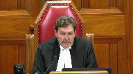
:::

Please be seated.

Good morning to all.

In the case of His Majesty the King against Walker-McClellan, for the appellant, His Majesty the King, David Michael Garg, pour l'intervenant directeur des poursuites criminelles et pénales du Québec, maître Julien Nadeau et maître Lina Thériault, for the respondent, Walker-McClellan, Donald Orazietti, QC, and Anthony Orazietti, for the intervener, Canadian Civil Liberties Association, maître Bruce W. Johnston, and maître Lex Gill. Mr. Garg.

**Speaker 1** (00:01:26): Thank you, chief justice.

::: {.column-margin}
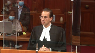
:::

Justices, good morning.

This case is about the statutory interpretation of a provision in Ontario's highway traffic act.

The hta is public welfare legislation.

Its purpose is to protect people who use the roads of the province.

And to give effect to this purpose, courts must interpret the provisions of the hta generously.

The specific provision at issue in this case.

**Justice Brown** (00:01:58): Well, let's talk about that because the provision's purpose isn't merely regulatory, it enables the investigation and prosecution of criminal code offences, so might not this generous interpretation have to be moderated by a restrictive aspect of it as well.

::: {.column-margin}
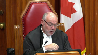
:::

**Speaker 1** (00:02:18): In my submission, Justice Brown, the short answer is no, and I'll elaborate to answer your question.

::: {.column-margin}
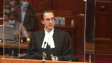
:::

First of all, the HTA as a whole, including related provisions, has been repeatedly recognized as public welfare legislation, including by the House of Representatives.

**Overlapping speakers** (00:02:37): I agree it's public welfare legislation, but that doesn't answer my question.

**Speaker 1** (00:02:42): Okay.

::: {.column-margin}
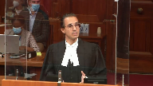
:::

And the second point that I wish to make then is this court in Orbanski was also dealing with similar legislative powers, regulatory powers within Manitoba's version of the Highway Traffic Act, specifically in Orbanski it was the general stopping power which would be akin to section 216 of Ontario's HTA.

And I've included Orbanski at tab 7 of the condensed book and I will certainly go to it later in my submissions, but I would submit that in reviewing the majority's decision in Orbanski in very similar circumstances to this case, there wasn't a restrictive interpretation was not provided to the provision in that case.

And the third point that I would make is it's undeniable that there is some interlocking element between section 48 sub 1 of the HTA and related criminal code provisions.

I appreciate that.

But that doesn't mean in my respectful submission that a restrictive penal power type interpretation should be given to section 48 sub 1.

I mean, for one, there are situations where a stop conducted under 48 sub 1 never leaves the regulatory domain.

If someone's blood alcohol concentration doesn't exceed the criminal limit but it's somewhere in between, it never leaves the regulatory domain in terms of sanctions and processes and so on and so forth.

Relatedly, if it does leave the regulatory domain and enter the criminal law later on, well, there are additional protections at that point.

**Justice Brown** (00:04:17): But just to be clear, I'm not saying that a restrictive interpretation has to be applied, rather that your purposive interpretation, which at least going by your factum seems rather muscular, has to be moderated in light of the prosecutorial dimension of this.

::: {.column-margin}
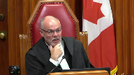
:::

**Justice Kasirer** (00:04:36): Maybe you should address exactly what, on the strength of Justice Brown's point, exactly what Justice Tulloch says about the point that you're making, where he says he acknowledges the remedial character of the legislation.

::: {.column-margin}
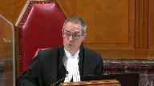
:::

He acknowledges the public welfare character of the legislation.

But he says that that doesn't entitle the court to read, does not have the power to read into the HTA police powers the legislature has not seen fit to provide.

**Justice Kasirer** (00:05:08): I think that kind of calls the question that my colleague's asking.

**Speaker 1** (00:05:12): So the short answer is I agree absolutely that generous interpretation does not mean reading in police powers.

::: {.column-margin}
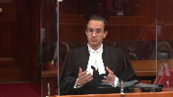
:::

And as I will address in the balance of my submissions, the proposed interpretation by the crown today does not involve reading in police powers.

Rather section 64 of the legislation act which justice was referring to specifically says that courts must give provisions a fair large and liberal interpretation so as best to support the obtainment of its objects.

And in my submission as I will develop in my time today that the interpretation advanced by the crown does just that without reading in powers that don't exist.

**Justice Martin** (00:05:58): Are you reading in the power that suggests that a police officer can say I meant to stop them rather than actually physically require?

**Overlapping speakers** (00:06:07): Thank you very much.

**Speaker 1** (00:06:07): ordering them to stop by starting an objective process of intervention?

::: {.column-margin}
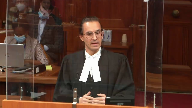
:::

Respectfully no, Justice Martin.

It's not reading that in in the sense that and we'll turn to the text now in order to answer your question, but in order to answer your question, Justice Martin, I think it is important to take a step back first of all and consider any given sobriety check, the stopping process can be broken down into three components and you've alluded to two of them already.

The first is that the officer decides to check a driver's sobriety.

The second is that the officer communicates that decision by signaling for the driver to stop such as they're activating their lights and siren and through the officer completes the stop.

**Justice Côté** (00:06:53): Mr. Garg, in doing that, in breaking in three components, as you say, the sobriety check, you seem to, because you say, first, the officer decides to stop.

::: {.column-margin}
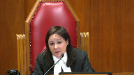
:::

Second, he communicates the decision, and then he completes the stop.

But in saying that, you are, I think, forgetting the meaning of the word require that we find in section 48.

Require means something like to communicate.

So how can you say that section 48 is limited to the first component?

I mean to form the intent.

**Speaker 1** (00:07:28): So, the first answer that I want to give to your question, Justice Cote, is that if we look at section 48.1, I agree that that phrase may require, is essential and in my submission that is what anchors the crown's interpretation of the provision in this case.

**Justice Côté** (00:07:43): Do you agree that mere requirement means something more than an officer forming an intent?

**Speaker 1** (00:07:49): Uh, I-I-I disagree, respectfully.

**Justice Brown** (00:07:52): Well how is that propose of interpretation?

::: {.column-margin}
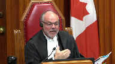
:::

I mean, propose of interpretation surely has to speak to the purpose.

The purpose is to get this driver to stop.

Ergo, require must connote communication.

I would have thought even just as a purely textual matter require connotes communication.

**Speaker 1** (00:08:11): so to the first part of your question justice brown i would submit that the purpose is broader than simply getting the driver to stop the purpose of section 48 is to deter impaired driving which is simply which is broader than just um getting someone to stop and then in the to the second

**Justice Brown** (00:08:27): that the purpose of this section is to get the driver to stop?

**Speaker 1** (00:08:32): I don't see right. Yes that

**Overlapping speakers** (00:08:37): Okay.

So we want the driver to stop.

No, no, no, sorry, Justice Brown, I disagree that the purpose of section 48.

Oh, so the purpose is the driver can pull up on a driveway or something like that.

**Speaker 1** (00:08:46): No, the purpose of section 48.1 is to equip police officers with the power, yes, to conduct random-

**Justice Brown** (00:08:54): require the driver of a motor vehicle to stop.

::: {.column-margin}
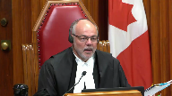
:::

Let's not read stuff in.

To require the driver of a motor vehicle to stop, that's the purpose of the section is to give the police officer the tool, the legal tool to require the driver to stop.

And how do we require a driver to stop?

We tell them to stop.

This nonsense, frankly, about oh, it's just the intention, it's the forming the intention.

How does the driver know to stop if the police officers merely form the intention without communicating?

**Speaker 1** (00:09:29): it.

::: {.column-margin}
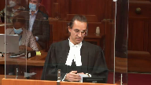
:::

Because section 48.1 does need to be read in context of section 216.

And Justice Cote, I believe it was the second part of your question that I wish to continue responding to is that section 216 is clear in terms of when the driver must stop.

The second part of section 216, and I should back up to say that I've included in the condensed book at tab 2 the relevant statutory provisions of the HTA, it's page 4 of the PDF if you're following along.

But in any event, 216 has unequivocal language of when it does matter if the officer signalled their decision.

And to use the most common way that an officer is going to signal their decision, it's using their lights and sirens.

So I'll use that colloquially.

**Justice Côté** (00:10:16): 16 also uses may require.

::: {.column-margin}
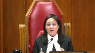
:::

Because you say that in your hotline that this section 48 is limited to the officer forming an intent.

My point is just to say but section 48 says more than that.

It says it does not say an officer may decide to stop a motor vehicle.

It does not say that.

It says it may require.

Require means that you have to say something to somebody else, to communicate something.

**Speaker 1** (00:10:48): In my respectful submission, the communication of that decision would bring in the second part of section 216 and that's why I said, Justice Brown, the two provisions need to be read together.

::: {.column-margin}
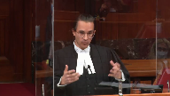
:::

If an officer were to form the decision to stop the driver sobriety under section 48 sub 1, there's no obligations at that point on the driver.

It's only if the officer then communicates that decision by turning on their lights and siren that 216 would come into play.

With the first part of just.

**Justice Rowe** (00:11:18): just a very small factual point.

::: {.column-margin}
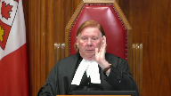
:::

216, I think, it seems to me, only comes into play when the signal has been made by the officer and the driver is aware of it.

In other words, driver is moving along, very long distance back, on goes the lights.

The driver doesn't see it.

He just turns into his own driveway.

He's not refusing to stop because he wasn't aware.

So it's signal plus awareness of the signal, I think.

**Speaker 1** (00:12:00): I agree with that Justice Roe and it's part of the reason that I submit in a proposed contextual analysis of section 48.1 that the section 48.1 power itself should not be tethered to when the officer turns on their lights and siren.

::: {.column-margin}
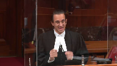
:::

For example, section 48.1 does not say a police officer readily identifiable as such may signal or request a. No,

but it says.

**Justice Brown** (00:12:26): It says may require, it says may require.

::: {.column-margin}
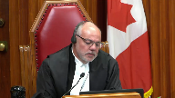
:::

And if I require something, it's not just a mental exercise, it connotes communication.

You say well they have to form the intent, obviously the police aren't going to act involuntarily.

They have to form the intent, I agree.

But the word require, just as a purely textual matter, connotes communication, does it not?

**Speaker 1** (00:12:52): On a pure textual reading, that interpretation is certainly available, if not compelling.

**Justice Brown** (00:12:57): And the purpose of the section, again, just going by the section, is to require the driver of the motor vehicle to stop.

::: {.column-margin}
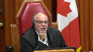
:::

So, ergo, the driver must know that he's being asked to stop, that he's under a duty to stop. Is it no?

Respectfully, Justice Brown, that's— But the word require should actually be read as may intend.

**Speaker 1** (00:13:18): It's it's reading section 48 in conjunction with text section 216 the Legislature

**Justice Brown** (00:13:24): The wording of section 48 should really read, under your interpretation, may intend the driver of a motor vehicle to stop.

Doesn't it come down to that?

Isn't that your submission?

**Speaker 1** (00:13:36): In my submission that would be both not giving justice to how this court in Orbanski interpreted road safety legislation, and similarly.

**Overlapping speakers** (00:13:50): Tell me where in Urbanski the court read require as intend.

No, it wasn't...

Of course it didn't.

**Speaker 1** (00:13:56): It wasn't as specific as that, Justice Brown, but if we look at what happened in that case, just to provide a bit of the context, since I am relying heavily on it, it's at tab 7 of the condensed book, principally paragraphs 43 and 45, at issue in that case was the general stopping power, so akin to 216 of Manitoba's Highway Traffic Act.

::: {.column-margin}
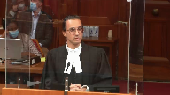
:::

And the question was whether within section 216 an officer could check for sobriety, because the provision was entirely silent on that, and the provision didn't enumerate anything that an officer could do when conducting that sobriety check.

And this court ultimately held that implicit within section 216, or the version of 216, was the ability for the officer to ask questions about the driver's sobriety, have you had anything to drink tonight, perform sobriety tasks, including asking the driver to try and walk in a straight line, heel to toe, recite the alphabet, follow a finger in front of their eyes, and the reason I'm providing this detail, Justice Brown, is that it shows how courts, including this court, has interpreted contextually and purposefully road safety legislation, because it's, as this court recognized in Orbanski, it is not, it is impossible, it's not practical for legislatures to predict and legislate for every permutation of an encounter between the police and the driver.

And it's for that reason, at paragraph 45 of Orbanski, the majority held, the scope of justifiable police conduct will not always be defined by express wording found in a statute.

And so, just to put a bow on my

**Justice Brown** (00:15:37): If that supports an expansive reading, I accept.

You're actually advocating a narrow reading.

You're just saying police have to intend.

They don't have to actually communicate the intention.

You're actually confining the police power here.

**Speaker 1** (00:15:55): to invoke the power under section 48 one that's right my submission is that they've invoked the power when they form that decision they then would then proceed in most cases to communicate that decision

**Overlapping speakers** (00:16:07): What do you mean in most cases?

**Speaker 1** (00:16:08): Well, there might be situations where they don't need to communicate their decision to the

**Overlapping speakers** (00:16:14): Because the person knows that they're required to stop.

**Speaker 1** (00:16:17): No, because the driver may have stopped on their own or some other reason that the driver may have stopped on their own or some other reason that the driver may have stopped on

**Overlapping speakers** (00:16:22): about a flat tire or something ran out of gas or just pulled over to the side of the road because they were going to as people do. Yeah.

**Speaker 1** (00:16:29): Visit the store on they parked on the shoulder and for whatever reason

**Justice Kasirer** (00:16:35): Is your point that 216, as the heading suggests, is a provision that deals with the power for the police officer to stop vehicles and it has an offense for the failure to stop?

::: {.column-margin}
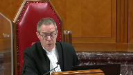
:::

Whereas 48 has to do with determining whether to make a demand, which is the heading that statute uses.

And you're drawing a distinction.

I think the point is that the language suggests that there's an overlap here.

I think that's really the problem that we're struggling with here.

**Speaker 1** (00:17:11): But I agree that there is an overlap in the sense that the two provisions should be read together and often what will happen if it is the case of a 48.1 sobriety check, if this court were to follow the crown's interpretation, is that the officer invokes the power under 48.1 when they've made the decision to stop a driver on the highway to check their sobriety and then some point thereafter, normally shortly thereafter, communicate that decision by turning on their lights and siren, that would bring in the context of section 216.

::: {.column-margin}
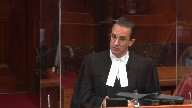
:::

**Justice Brown** (00:17:42): How is this not self-defeating?

::: {.column-margin}
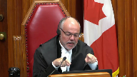
:::

I mean, if require in section 48 means intent, then just by intending a stop, the power of 216 is triggered, as I understand it, and that power mandates communication of intent as a precondition of the duty to stop.

**Speaker 1** (00:18:06): Yes, I agree with what you just said there, Justice Brown, that the duty on the driver to stop would not arise until the officer communicates that decision.

::: {.column-margin}
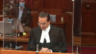
:::

Justice Rowe, as you alluded to earlier, there would be no liability on a driver to stop simply because an officer has formed a decision to stop the driver, of course.

And it's in that manner that the two provisions need to be read together.

And I've already made the point that there is, in 216, part of what we see is that the legislature knew full well how to use explicit language that goes to the issue of an officer communicating their decision for the driver to stop.

They used language like when signaled or requested to stop, so they knew how to say that.

I didn't write that into section 48.

**Overlapping speakers** (00:18:52): They know how to say in ten, too, but they didn't.

They said require.

**Speaker 1** (00:18:56): Right.

::: {.column-margin}
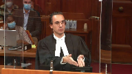
:::

But section 48.1 is when the police can invoke their power.

It's the preconditions to section 48.1 must exist at the time that the officer makes the decision to stop the driver.

So they must be readily identifiable.

It must be to stop a driver who's operating a motor vehicle on the highway.

It must be for the purpose of a sobriety check.

So there's still much importance within section 48.1 that governs the police conduct and tells them when they can invoke the power.

Section 216 then tells the driver what they must do if and when the officer communicates their decision.

**Justice Côté** (00:19:36): That does not say he may decide to stop the vehicle.

::: {.column-margin}
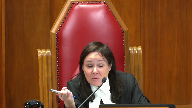
:::

It says he may require the driver.

So there is somebody who is supposed to interact here.

He may require the driver.

So he cannot just say, oh, I'm going to decide to stop the vehicle and then I will go to 216.

It starts at section 48.

**Speaker 1** (00:20:02): It starts at section 48.

::: {.column-margin}
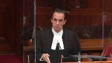
:::

There ultimately will be a presumably an interaction between the police and the driver. I agree.

But in my respectful submission, finding that the power is only invoked once the officer communicates their decision, it's bringing in language that isn't there from 216, it's in my respectful submission an overly restrictive interpretation that doesn't include the context of this being road safety legislation.

Perhaps I'll move to that now.

**Justice Rowe** (00:20:38): Just before you go on, it seems to me that this case on its facts discloses a very narrow range of circumstances where the police form the intention to make a stop, but then take no action.

::: {.column-margin}
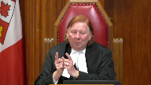
:::

And then the driver moves off the highway.

My guess, and I think it's a pretty fair guess, I think, is that once the police say, we're going to stop that guy, ordinarily, there's a very, very short period before they begin the pursuit.

They don't sort of say, what are we going to have for lunch, or try a new station on the radio.

They get on with the job.

That's what policemen do.

So the time between forming the intention and beginning the pursuit is fleeting.

And we're in this unusual, factual situation of dealing with that fleeting circumstance, it seems to me.

The more usual circumstances, they say, OK, we're going to pursue this guy.

We're going to stop him.

And if he's aware of the siren and the lights, he's caught by 2161.

But what happens for that perhaps slightly longer situation where the police begin the pursuit, they may or may not have the lights on.

But they've actually started the pursuit, and then the guy turns off the road.

And this is all a set up for, what about hot pursuit?

**Speaker 1** (00:22:23): Right.

::: {.column-margin}
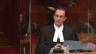
:::

So to answer your question, Justice Roe, I agree that it's less common, this type of fact scenario is less common than one where the stop occurs entirely on the highway or the officer turns on the lights and sirens very shortly after or almost immediately after they form the decision to stop a driver.

But I wouldn't want to leave you with the impression that it's necessarily rare.

I have included at tab 19 of the condensed book other situations in which this fact scenario has arisen in Ontario, it's exhibited from my factum, mainly to just show that while this situation may not be common, I wouldn't necessarily classify it as rare.

But then to answer the question that you posed at the end about hot pursuit, that being a common law doctrine could apply in situations where, I mean, hot pursuit typically involves the, requires the officer to already have reasonable grounds to believe that the person has committed an offence, if they're now fleeing them because they're not responding to the lights and sirens, I agree hot pursuit would probably apply at that point in time, but that's a different fact scenario and it's the common law as opposed to the statute.

One of the points that I wanted to continue in is, is again going back to Urbanski.

**Justice Karakatsanis** (00:23:42): Can I just ask you, sorry, over here, I'm just looking at 48 and 216-1 and why doesn't it just make sense to look at them in a complimentary way where section 48 sets out the police power which is to require a driver to stop in those circumstances and section 216-1 says when it becomes an offence for the driver who is asked to stop not to come to a stop.

::: {.column-margin}
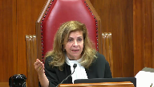
:::

Why doesn't that make sense?

**Speaker 1** (00:24:13): Because I go back to this court held at paragraph 45, any enforcement scheme must allow sufficient flexibility to be effective.

::: {.column-margin}
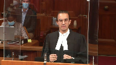
:::

The reason I go to that quote is to make the following argument that tethering the invocation of section 48.1 to when the officer turns on their lights and sirens is not only impractical but it raises potentially public safety concerns that would undermine the purpose of the HTA.

The HTA's intention, its purpose is to promote public safety.

There's a few illustrations in the case law that show that if officers are required to essentially marry their decision to stop a driver by immediately activating their lights and sirens, would put them in a situation where they may even have to act in a manner that's unsafe.

And I want to give some examples of that.

**Justice Karakatsanis** (00:25:06): So your argument, I think, is that if you just looked at the sections, it makes sense, but there's this added policy purpose that requires something more to be read into paragraph 38.

**Speaker 1** (00:25:19): That is a large part of my submissions.

::: {.column-margin}
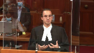
:::

I acknowledge that the interpretation advanced by the crown if you just read 48.1 is not the interpretation that jumps off the page

but I have made my submissions on why it is an available interpretation and why there are additional ambiguities in 48.1 that compel the reasoning process to look at other considerations as well.

**Justice Côté** (00:25:43): Mr. Gar, speaking of other considerations, if you're right in your interpretation, you say that the authority under section 48.1 is triggered as soon as the police officer forms an intent.

::: {.column-margin}
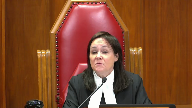
:::

How can an accused cross-examine a police officer in order to test the lawfulness of the exercise of the power?

I'm trying to find how to cross-examine a police officer.

**Speaker 1** (00:26:10): Absolutely.

::: {.column-margin}
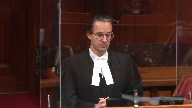
:::

And Justice Cote, your question reminds me of what you wrote in Fleming.

That's a common law case, but the question is the same.

Would this power be evasive of judicial supervision?

In my respectful submission, no.

Allow me to elaborate.

First of all, section 48.1 litigation is common in our courts.

Speaking for Ontario and the Ontario court of justice, it's frequent litigation.

It's not something that rarely comes before the courts.

In fact, it's something that commonly comes before the courts.

And through that, courts and for that matter, defence counsel have developed effective forensic tools to test an officer's evidence.

It's not as simple as saying, well, the officer said they decided to stop the driver at point x.

We must accept that. No.

And I've included in the condensed book some examples at tab 15 of the various analytical tools that we see from decisions across this country, trial level decisions, appellate decisions that show how the courts are well equipped to test an officer's evidence on this point.

And for example, I mean, just to start with, it's not as though the crown's interpretation today of section 48.1 in terms of when an officer can follow the driver off the highway somehow brings the officer's decision more into the litigation than it would be in any other section 48.1 stop.

In other words, if a stop occurred entirely on the highway, the courts would still have to assess the officer's evidence about their decision.

What was the purpose of the stop, for example?

That would still be something that courts have to grapple with.

And that's part of the reason they've formed these skills.

I'll just give an example.

If an officer testifies as to what their intention was to conduct a random sobriety check on the highway, well, then courts are going to ask, well, what were your duties that day?

Were you in the duties of enforcing road safety legislation or was it something else that you were doing that day?

And if you say it was road safety legislation that you were enforcing, including sobriety checks, did you stop anyone else before you stopped this driver in question or did you stop other people if your shift continued that day?

Third would be you say your purpose was a random sobriety check.

Were your actions as soon as you stopped the driver consistent with that purpose?

Was the first words out of your mouth, good evening, I'm conducting a sobriety check, have you had anything to drink tonight or did you start asking questions that had nothing to do with sobriety or looking at the back seat or whatever the case may be?

What are you doing in the neighbourhood?

Things of that nature would suggest that officer did not form the intention to conduct a random sobriety check.

**Speaker 1** (00:28:53): Fourth, just two quick more examples to continue the chain because I wanted justice to provide assurance that our courts are well equipped to deal with these issues.

::: {.column-margin}
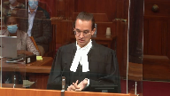
:::

The fourth would be did the officer do anything to increase the transparency of the encounter?

If the jurisdiction allows it or has it, did they activate in car camera or body camera?

Did they radio in the sobriety check?

And fifth is how our courts have provided more robust tools for judges and counsel to deal with issues of racial profiling?

Is there anything about the stop that corresponds with the phenomenon of racial profiling?

So these are just some examples and they're not ones that I just came up with, rather they're ones that if we look in the case law, courts have identified as practical tools to analyze that evidence.

**Justice Brown** (00:29:41): So your your submission it seems to me that all is that's required is uncommunicated intent is is based on the idea that police have to Have the power to go off highway to promote public safety.

::: {.column-margin}
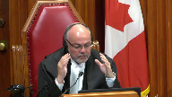
:::

Is that a fair?

Fair kind of encapsulation

**Speaker 1** (00:30:01): in defined circumstances. Right.

So it's certainly not if they only ever see somebody off the highway on private property.

**Justice Brown** (00:30:08): No, but where they've gone on, where they were on the highway and they've gone off, public safety requires the police to be able to stop them just on the basis of uncommunicated intent.

That's how we have to read section 48.

**Overlapping speakers** (00:30:22): that the power is invoked?

Right, the power is invoked.

**Justice Brown** (00:30:24): Okay.

::: {.column-margin}
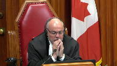
:::

Why is that?

I mean, this is a random suspicionless stop.

Why do the police have to be able to pursue someone off a highway at all?

Just go find someone else to stop on the highway.

**Overlapping speakers** (00:30:44): Okay.

**Justice Brown** (00:30:44): Why do we need to go so far as you're suggesting we need to go?

**Speaker 1** (00:30:51): Because practical interpretation is the law as

**Justice Brown** (00:30:58): No, I have your point that you're saying this interpretation is defensible, but you may have sensed a bit of skepticism about whether that's right, but I'd also like to know whether it's necessary.

**Speaker 1** (00:31:13): Sure.

::: {.column-margin}
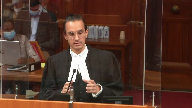
:::

The best way for me to answer your question, Justice Brown, is to provide some examples that illustrate why it is necessary.

And to be clear before I even get into it, it's not just situations where a driver is seeking to evade a sobriety check.

That's a different question.

There is a difference.

There is a difference. There is

**Overlapping speakers** (00:31:33): Evasion is a different story.

**Speaker 1** (00:31:34): Evasion is a different story and I'll come back to that and that's my point is that it's not simply about circumstances of Evasion

::: {.column-margin}
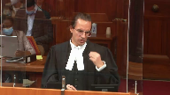
:::

so I mentioned earlier that if the power under section 48 one was only triggered when an officer turns on their lights and sirens That would cause public safety issues and that's part of my response to you justice Brown on why it's necessary

So for example, I provided the decision of Aureus.

It's at tab nine of the condensed book. You

**Justice Brown** (00:32:00): No, but that's not my question, I'm sorry.

::: {.column-margin}
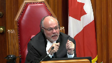
:::

Maybe I wasn't clear, right?

But I'm wondering why do police need to be able to pursue a person off highway under section 48 at all?

Because it's a random, suspicionless stop, right?

If the person is pulled off the highway, just go find someone else to stop.

**Speaker 1** (00:32:25): In my submission, that interpretation of 48.1 would undermine the purpose of deterring impaired driving on the highway.

So the purpose ultimately remains to deter impaired driving on the highway. Right.

And although

**Overlapping speakers** (00:32:41): And how is that purpose not served by finding someone on a highway?

**Speaker 1** (00:32:44): because it would mean that drivers who have consumed alcohol or drugs before they get behind the wheel would know that if they see a police officer off in the horizon or in the rearview mirror all they need to do to avoid any chance of having their sobriety checked is steer off the highway onto any be it one of the residential driveways that line residential streets or a parking lot that lines commercial roadways and they would be completely immune from the sobriety check.

::: {.column-margin}
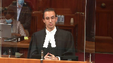
:::

**Overlapping speakers** (00:33:10): Unless, of course, the police intent's been communicated.

**Speaker 1** (00:33:14): But there could be situations where they're far away, there could be multiple cars in between, whatever the case may be.

The officer hasn't even necessarily observed the fact that there's a motor vehicle and so they haven't had an opportunity to activate their lights and sirens.

**Overlapping speakers** (00:33:28): Well, if they haven't observed the motor vehicle, they haven't formed the intent.

**Speaker 1** (00:33:31): Right, but my point is we're looking now from the driver's perspective.

::: {.column-margin}
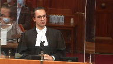
:::

We're talking about why is it necessary?

What's the reason to give the interpretation as advanced by the Crown today?

And one of those reasons is to ensure that drivers don't think that they have control over whether or not they can avoid a random sobriety check.

**Justice Rowe** (00:33:49): reason?

::: {.column-margin}
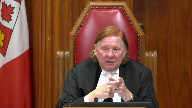
:::

This brings us back to evasion.

I hope you're going to get to it, because let's say, because I'm trying to think in concrete terms.

My colleagues are much more elevated in their analysis.

So Mr. X, driving along, sees a police vehicle approaching in the opposite direction, applies the brakes, full speed, full ability, turns into a driveway, has no connection with the house.

It's just, I mean, it's transparent, and I'm getting off the road.

Does it matter?

**Speaker 1** (00:34:26): your hypothetical justice roe is exactly the type of situations that must be contemplated when interpreting section 48 sub 1.

::: {.column-margin}
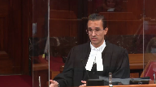
:::

There would be no basis on what you've just described justice roe for the officer to pursue on the basis of hot pursuit or reasonable suspicion.

The mere fact of turning off of a highway into somebody's into a driveway doesn't give the officer any basis to check to conduct a check at that point in terms of reasonable suspicion.

**Overlapping speakers** (00:34:58): And I want to thank all of you for being here today.

**Speaker 1** (00:34:58): want to go back to this issue of control.

::: {.column-margin}
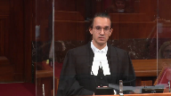
:::

Part of the reason, the main reason that sobriety checks deter impaired driving is that the driver enjoys no control over whether or not they will be stopped.

This court made that clear in La Dussere as one of the reasons, accepted reasons that random sobriety checks deter impaired driving.

In completing, this is getting back to your question, Justice Brown, completing a sobriety check on private property in defined circumstances maintains that system of deterrence.

And I've already given the example, otherwise drivers who have consumed alcohol or drugs would be well advised

anytime they see, they think they see, for that matter.

**Overlapping speakers** (00:35:41): matter.

So would following them into the house afterwards.

There are limits on the section 48.1 power. Further.

It sounds like it's quite purposive and contextual.

**Speaker 1** (00:35:51): Proposive, contextual, but we also consider other aspects of our law.

So for instance, if the person is inside their house, this court has recognized the special enhanced protections that are afforded to within somebody's dwelling house.

So section 495 of the criminal code.

**Justice Brown** (00:36:08): we also in Lee recognized that interest in a backyard, apparently not the front yard.

**Speaker 1** (00:36:14): Well, there's a difference between, it's not just that it's a front yard or back yard, it's that it's a driveway at a point in time when it's being used as such for the license and regulated activity of driving a motor vehicle, having just been on the public highway.

::: {.column-margin}
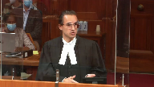
:::

I agree, Justice Brown, that if someone was only on their driveway and they were using it as a place to socialize or hang out with friends, that would be a completely different situation.

**Justice Brown** (00:36:38): I'm just going to come back to my earlier question, isn't it fair to say that you are urging us to read section 48 sub 1 as if the word require was substituted by the word intend?

**Speaker 1** (00:36:51): Respectfully, on a complete statutory interpretation analysis, including the text, the context, the purpose, relevant legal norms— But that first thing, the text— May require— Let's just come back to the—

**Justice Brown** (00:37:00): the text, may require you are urging us to read as may form an intent or may intend.

**Speaker 1** (00:37:08): No, when the officer may require, when the officer can invoke the power, when they may require a stop to occur.

**Justice Jamal** (00:37:18): Mr. Garg, could I ask you another question going back to the text of the statute of which you've – the Court of Appeal majority referred to the fact that there were two definitions of driver in – one in the general provision, the opening provision, 1.8, and then there's a section specific definition that was brought into effect in 2009, and they don't really address that in any depth.

::: {.column-margin}
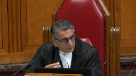
:::

You cite the Superior Court's decision in the DAI in 2019, and since then there's been – I think since after you filed your factum has been the Superior Court's decision in Droog.

And they highlight that the section specific definition, which is targeted at the issue of random stops, doesn't have the limitation of on the highway.

It refers to care and control of the vehicle.

When I think of that, I think of somebody who's drunk, sleeping in their car, and, you know, to wear off the effect of the alcohol.

And Justice – as you know, Justice Campbell said that the policy of this makes sense because impaired drivers can be just as dangerous to members of the public in private parking lots as they are on public streets and highways.

I note that the Court of Appeal didn't consider – didn't cite the DAI.

And there is Droog after McCollman doesn't cite McCollman.

So there seems to be a body of authority, at least at the Superior Court level, that does give meaning to this section specific definition, which avoids the need to get into the sort of, if I may say so respectfully, metaphysics that you're speaking about in terms of giving effect to the intention.

Can you explain to me why isn't that just a complete answer to this case?

**Speaker 1** (00:39:00): So I agree justice Jamal that there is justice Campbell's interpretation that would obviate some of this.

::: {.column-margin}
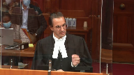
:::

However, we're talking about boundary cases right now.

In other words, where something started on the highway and that's why it's the important effect of deterring impaired driving on the highway.

If we were to only look at the section 48 sub 18 definition, respectfully an interpretation that it obviates any need for connection to the highway, that the officers could simply see someone on private property, entirely on private property and thus be able to enter that private property and check the driver's sobriety risks overshooting what is ultimately the purpose of the highway traffic act in section 48 sub 1 which is to deter impaired driving on the highway.

Inaudible.

**Speaker 1** (00:40:18): I cite nidai because I want to bring it to this court's attention because it is potentially relevant to the issues to be deciding today but I do also indicate in the factum that I'm not relying on nidai and how it interprets section 48 sub 18 as part of my statutory interpretation argument.

**Justice Kasirer** (00:40:35): Is it relevant on this very point that my colleague raises that in the definition of driver in 1.1, driver means, whereas in 4818, driver includes.

::: {.column-margin}
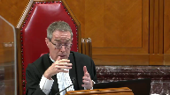
:::

So it sounds like it's an expansive rather than something that occupies the field.

I'm interested, I happen to have the French text of the Ontario legislation in front of me and it's even more precise.

Conducteur s'étend en outre, in addition.

How were those two read together?

**Speaker 1** (00:41:16): Essentially they need to be read together.

::: {.column-margin}
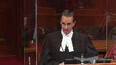
:::

It's not as though the section 48 sub 18 definition of driver wipes out, if you will, the section 1 definition of driver.

I have given a path in my factum on how to read those together because the section 1 definition includes the location limitation of a highway, the section 48 definition does not.

One interpretation is that if under 48 the highway limitation was meant to remain it would have been included.

That's the available interpretation but in my submission reading them together means that you still have to apply the section 1 definition.

**Justice Brown** (00:41:55): Right, so the 4818 driver was meant to capture drivers who have recently exited their vehicle but will have care and control of it nonetheless on a highway.

::: {.column-margin}

:::

Is that a fair?

It's fair. Okay.

**Justice Martin** (00:42:15): and so can I also. Go ahead.

**Justice Côté** (00:42:20): Mr. Gard, in section 1.1, it says that there could be regulations adopted by the lieutenants gouverneur en conseil to say that it applies to a specified place or class of place that is not a highway.

::: {.column-margin}

:::

Are you aware of any such regulations in connection with section 48 which will limit, which would designate place I ways when they are not I ways, essentially?

**Speaker 1** (00:42:49): Right.

::: {.column-margin}

:::

No, I'm not aware of any regulations in that regard, but that would change the entire scope of the power.

Because what I'm advocating for today is those defined circumstances where the interaction or the driver is on the highway, defined circumstances when the police can follow off the highway to complete the sobriety check.

Using 1.1 to say, well, all of these places aren't even highways anymore would go much further than what I'm advancing today, it would potentially give the power to police to enter private property.

**Overlapping speakers** (00:43:23): without any highway connection whatsoever.

Without any regulation of that nature.

**Speaker 1** (00:43:27): There's no regulations in that regard and respectfully for good reason because that would go well beyond what's intended by the provision and the HTA.

**Justice Kasirer** (00:43:36): What's the relevance on the facts of the shared driveway issue here?

**Speaker 1** (00:43:41): It provides an illustration of the fact that there's a variety of circumstances in which these types of stops may occur.

::: {.column-margin}

:::

And while we understand that the desire to give heightened privacy protections to one's own private property, there's simply no evidence in this case that the officer was aware that that was the case.

And that comes a bit more into the grant analysis to be succinct.

But I was giving examples or I still like to give some examples where of why it would be inappropriate to tether the invocation of 48 sub 1 to when the officer turns on their lights and sirens.

And an example would be in that case the officer was behind the driver at an intersection and he formed the decision to stop that driver to check their sobriety.

But they were at an intersection and the officer concluded it would be unsafe for him to activate his lights and sirens at that time.

So he wanted to wait until they were at a safer location to turn on the lights and sirens and it just so happened that the driver turned into a gas station and that's when the officer followed behind and turned on his lights and sirens.

It's an example of how reading 48 as requiring the officer to turn on their lights and sirens to even invoke the power would undermine the purpose of the HTA to promote public safety.

And other examples can be contemplated.

Inaudible.

**Speaker 1** (00:45:21): Right.

::: {.column-margin}

:::

Lights or siren.

I'm using them as lights and siren but it could be lights or siren, I agree.

Officers should be afforded some latitude in making the decision on when they will turn on their lights and sirens, especially if they have reason to believe that doing so, delaying the lights and sirens is the safer course of action.

There could be a situation where the shoulder is particularly narrow where they are right now.

They don't want that driver to stop at that point in time because it wouldn't be safe for either the police or the driver.

But they know it's going to widen a little bit further down the road and so that's when they are going to turn on their lights and siren, for example.

And there is the case I provided also by Justice Campbell, I believe, where the officer's evidence was I didn't want to turn on the lights and siren right away because he was by himself.

They were in an isolated neighbourhood or area.

It was dark but he knew that if he turned on his lights and siren a minute down the road, they would have it to stop in a more well-lit area and these are the types of things that

**Justice Brown** (00:46:22): One of the things that they'd presumably keep in mind is that this is a suspicionless stop.

::: {.column-margin}

:::

The stakes are very low.

It's not like they have reasonable suspicion.

They can always find someone else.

Now, I mean, I have your submission, your a priori submission, you know, no evidence suggesting that, well, there's a concern that somebody would just drive off because they're worried that they're about to be pulled over.

But one of the considerations, presumably, that police will exercise at that example of the intersection is, well, I have no reason to pull this person over anyways, other than I have the power to do it if I require it.

**Speaker 1** (00:47:01): and my submission, the stakes aren't low.

::: {.column-margin}

:::

The reason the system works, yes, there will be situations where they don't stop that person, they're going to stop somebody else.

It might not seem like that big of a deal, but the system as a whole would become compromised if we start injecting into the driver some control, even limited control to avoid a sobriety check.

As this court recognized in La Luz Sir, for instance, even the fixed ride stops, this was back in 1990, the court recognized that they become known.

People can know where they are and seek to avoid them, and that's all the more true today with apps like Waze and things like that.

**Justice Rowe** (00:47:37): Are these truly random stops?

::: {.column-margin}

:::

I mean, you may not have the grounds, the reasonable suspicion or whatever to make a stop which is authorized on that basis, but I would be astonished, I would be astonished if the police said, ah, there's the church ladies leaving from the parking lot after their usual tea, let's stop them.

As opposed to driving by with all these guys in the super big pickups, you know, on Biff's country bunker on a Friday night.

And well, maybe we'll stop some of these guys.

You know, it's not really entirely random, I don't think in reality.

**Speaker 1** (00:48:28): So the two things I want to say in response to that, Justice Roe, the first would be if it's a question of whether the police officer actually has oblique motives, that's obviously something that needs to be dealt with in the trial process.

::: {.column-margin}

:::

But when I say random, like I appreciate there might be circumstances that explain why the officer decided to stop drivers at this point in their shift as opposed to Sunday 11 a.m. after church.

That's still random, right?

When I say random, I mean absence of reasonable suspicion.

There might be some reason.

The officer might say, well, there's a reason I decided to stop this driver.

But based on how we've defined in the section 9 jurisprudence, that stop would still be random if the officer doesn't have reasonable suspicion.

**Justice Kasirer** (00:49:12): Sorry.

**Justice Jamal** (00:49:12): Sorry, go ahead, you go ahead.

::: {.column-margin}

:::

Could I just pursue my colleague, Justice Kazira's question to you and just make it, because I didn't think you answered it.

The evidence, as I understand from Officer Lobsinger, is that the shared driveway, the adjoining property was a store selling pot chips and cigarettes.

So that's where we, and clearly, if the accused had been stopped at the original store, there's no question it would have been authorized, the stop would have been authorized.

So what I don't understand is why this isn't a driveway intended for or used by the general public for the passage of vehicles, because this is actually a store used for cigarettes, to sell pop and cigarettes.

Why isn't this, on the uncontradicted evidence of Officer Lobsinger, why isn't this a highway under that definition?

And I think that's what Justice Kazira was...

**Speaker 1** (00:50:10): Short answer is that would simplify things greatly, but based on how the Ontario Court of Appeal has defined highway under section 1 sub 1, private driveways, even if they include some measure of access to the public, such as parking lots and gas stations and driveways such as this one which provides some access to a commercial establishment, do not qualify as a highway because they're not intended for or used by the general public for the passage of vehicles.

::: {.column-margin}

:::

And that's the definition of highway that was applied in this case and that's the short answer to my to your question, Justice.

It isn't in.

**Justice Kasirer** (00:50:55): fairness to the question isn't it that there is an expectation notwithstanding the shared driveway there may be an expectation of privacy when you pull into what you think if you it's the only way to get into your driveway to get to your house that you have an expectation of privacy that you might not have if it was only a public access into a public parking lot or into into a convenience store or what have you

::: {.column-margin}

:::

**Speaker 1** (00:51:22): Right.

And I submit that in section 24.2 analysis, not statutory interpretation analysis.

Any of which, do you have anything to tell us about?

**Justice Brown** (00:51:30): Can I just...

Oh, sorry.

**Justice Kasirer** (00:51:30): 24-2? Sorry.

::: {.column-margin}

:::

I apologize, Justice.

I may have been out of turn.

So just if I understand your point and your answer to Justice Jamal, you're not relying on this argument at the section 9 analysis.

It's later under section 24.

In particular the fact that the officer, yes. Okay.

All right.

That's helpful.

**Speaker 1** (00:51:53): I will get to section 24-2 but I want to use a bit more of my time to continue the statutory interpretation point.

::: {.column-margin}

:::

I have a couple points I'd like to make.

I just want to make it clear that the proposed interpretation does not expand police powers.

There's some of that language in my friend's factum.

This is about the scope of the police power under section 48-1.

No new class of people would be stopped under the crown's interpretation.

The stop is still being made in relation to only drivers.

It's made in relation to someone who is driving a vehicle on the highway.

In a practical sense there's no expansion of police powers because the interpretation being advanced by the crown has been recognized as the law in Ontario since at least 2002 in the Calder decision.

All the courts, trial courts, appellate courts that have interpreted 48-1 in the manner advanced by the crown appreciated that they could not use statutory interpretation as a vehicle to expand police powers.

The second point that I want to make before 24-2 is we talked a bit about the safeguards in place to control the use of this power, Justice Cote, when I ran through the ways that courts test the evidence.

I've mentioned the geographical limitation that it still has to be made in relation to a driver operating a motor vehicle on the highway.

As well there's a temporal limitation as well because what on the crown's interpretation the officer invokes the power when they make the decision to stop the driver

and then it continues through.

It's a continuing power through to when they communicate that decision and the driver stops.

If that's the case, a driver can only, sorry, the police can only stay within the confines of a continuing authority if it's one continuous transaction.

In that sense this court's jurisprudence on hot pursuit is helpful to use that type of language.

The officer has to stay, has to be reasonably diligent on a case-by-case basis.

We talked about other limitations, where do they come from?

Justice Brown, you asked about the inside of somebody's home.

Well, in section 495 of the criminal code that's what authorizes a police officer to arrest somebody without a warrant.

It doesn't have any geographic limitations within it.

It doesn't say they cannot make recourse to this power within somebody's home but this court recognizes it's necessary to add that to section 495 that officers cannot use a warrantless arrest power within someone's home.

The reason I'm providing that is to show that the limitations on 48.1 aren't just coming from sort of anywhere to improve the interpretation but they're drawn from the deep body of this court's jurisprudence.

And finally on the statutory interpretation issue that in this situation the driver did have some connection or he had a connection to the private property on issue because it was a shared driveway that also provided egress to where he was living.

But it needs to be said that often and if we especially look at the cases that I've cited where this has come up in Ontario and Quebec, often the driver will have no connection to the private property in question from the moment they leave where they were to ultimately where they're getting if it is their home.

For most of that time if they were pulled over and stopped on private property they'd often have no connection to that private property.

**Justice Kasirer** (00:55:09): with different statutory definitions, right.

::: {.column-margin}

:::

The definition of drivers not of the Ontario statute is not the same as in Quebec.

I mean, you make some contextual allusions to other provincial legislation, but surely we're confined, as the Court of Appeal of Ontario said, Justice Doherty said, we're confined to the definitions chosen by the statute here.

**Speaker 1** (00:55:34): Yes, yes, the statute of interpretation should focus on the Ontario legislation, absolutely, which takes me to section 24.2 in the time I have remaining.

::: {.column-margin}

:::

In my respectful submission, if the stop was unauthorized such that there was a section 9 breach, then the evidence of the respondent's acute impairment and elevated blood alcohol concentration should be admitted under section 24.2.

And I submit that all three grant factors pull in favour of admission, albeit to different degrees.

So starting with the first grant factor, in my submission, it strongly favours admission of the evidence and that the label good faith does apply in this case.

In other words, the police acted in good faith because they subjectively, reasonably and non-negligently believe that the HTA authorized the sobriety check in this case.

And based on the law at the time, the officer was correct.

On all of the reported decisions from Ontario on the facts of this case, in other words, where the officer forms the decision on the highway to stop the driver's sobriety, that's a key crucial component.

In all of the cases that have that fact, I believe there's four or five of them have found that the officer is authorized to follow the driver off the highway to complete the sobriety check.

And that is good faith and that pulls strongly in favour of admission.

**Justice Côté** (00:57:00): But, Mr. Garg, on that, at paragraph 84 of the decision, the majority of the Court of Appeal acknowledged that, the majority said they were not prepared to find that the police acted in bad faith, so they did not dispute the good faith of the police officer.

::: {.column-margin}

:::

But they say that their conduct in this case was brazen in the sense that they pursued the respondent onto his own private property when they did not have the statutory power, nor the common law power to do so.

So, should we, every time that there is good faith on the part of the police officer, say, oh, it does not matter, because they were in good faith, this factor meditates in favor of admitting the evidence?

**Speaker 1** (00:57:48): Well, I would go further than what the majority held.

::: {.column-margin}

:::

They made a finding of no bad faith.

In my respectful submission, that doesn't go far enough.

And we need to in this regard, Justice Horgan's decision on 24.2 is more accurate, that they acted in good faith, not just in absence of bad faith, but acted in good faith, relying on the law as it was at the time of the stop.

And that if there's a finding of good faith, that does pull strongly in favour of admitting the evidence under the first grant factor.

And the mistake was also understandable.

And this is where other jurisdictions are helpful that have interpreted similar road safety legislation, courts in Quebec, the Saskatchewan Court of Appeal, that if this officer got it wrong, respectfully so have a lot of other trial judges, appeal judges, the entire Saskatchewan Court of Appeal, the Justice Horgan, and that needs to be considered into whether the officer's mistake, if he made one, was understandable.

And still under the first grant factor, I would highlight based on this court's decision in Tim, paragraph 89, that like in Tim, there was no flagrant disregard for charter rights.

And in that sense, Justice Cote, I respectfully submit that the majority's use of the word brazen was unfair to the officers.

They acted on what they understood the law to be at the time.

That understanding was itself understandable.

And there was no flagrant disregard for charter rights.

They respected the respondent's charter rights throughout.

The subsequent arrest and demand were made on requisite grounds under section 8 and 9, and they immediately informed them of his rights to counsel under section 10b.

So that's the first grant factor.

The second grant factor also favors admission of the evidence, albeit less so, because this is when we do now consider, while it did, the stop did occur on the respondent's private property, and this court has recognized that an incursion on one's own property will indeed be sharper than if it occurred in public.

However, the specific facts of this case attenuate any expectation that the respondent would have had in this moment of being...

**Justice Brown** (00:59:56): I would think that then that would translate into a submission, not that the second branch supports admission of the evidence, but that it only slightly weighs against it.

**Speaker 1** (01:00:07): And that's a, I don't necessarily disagree with that characterization other than to say that we do need to consider that the respondent's expectations of being left alone at the moment he was stopped were attenuated, and it's important to not look at...

**Justice Brown** (01:00:24): I have your submission, but I just think it's not right to say that that supports inclusion.

To the extent it does anything, it leans slightly against.

**Speaker 1** (01:00:35): There's a matter of degree but it certainly doesn't weigh in favour of exclusion and doesn't weigh so strongly.

::: {.column-margin}

:::

My submission remains it favours admission but less strongly than the first grant factor because if he had been stopped entirely on the highway, the courts have recognized that incursion would have been limited and minimal and so to take that if the stop had occurred at this point in time, literally one or two seconds later, a few metres later, that stop goes from minimal to a significant incursion simply parses what happened here into unrealistic segments and of course the fact that it's driving, it's a licensed and regulated activity as well.

**Overlapping speakers** (01:01:13): So maybe quickly on the third factor because your time is up.

**Speaker 1** (01:01:17): Yes, and then the third factor is again it favors admission of the evidence.

The evidence was reliable.

It was obtained through non-intrusive means.

I'm talking about the breast samples and it was significant to the Crown's case.

**Justice Wagner** (01:01:33): Hey, hey, hey, hey, hey, hey, hey, hey, hey, hey, hey, hey, hey, hey, hey.

**Justice Rowe** (01:01:34): I understand your submission to be that in the 24-2 analysis, it really doesn't matter whether the individual turned into their own driveway or they turned into a stranger's driveway.

::: {.column-margin}

:::

In other words, being on your own property just doesn't matter, or have I misunderstood you?

**Speaker 1** (01:01:54): Under 24-2 grant factor, it would matter.

**Justice Wagner** (01:02:00): Yep, I'm just gonna say that.

**Justice Kasirer** (01:02:01): Sorry to ask a last question.

::: {.column-margin}

:::

You haven't mentioned circumstances of visible minorities in your pleading.

And I note that even in grant paragraph 154, there's dicta that says a growing body of evidence and opinion suggests that visible minorities and marginalized individuals are at a particular risk from unjustified low visibility police interventions in their lives.

What relevance are we to to give to this consideration, in our case?

**Speaker 1** (01:02:39): Well, under section 24.2, there's no evidence or indication that the respondent himself is a person of colour or a visible minority.

::: {.column-margin}

:::

I appreciate that the stop occurred on the Thessalon First Nation, but there's no evidence or indication that the respondent himself is indigenous to the extent that that informs the section 24.2 analysis.

And then in terms of the statutory interpretation analysis, it matters, because of course the stops will occur in situations where a person is marginalized or vulnerable or a person of colour, and that's why in my part of my submission where I said that the interpretation balances individual liberty with the collective good, the ability for courts to test this power, to test an officer's evidence, and the impact that that would have on cases that don't come before the courts is part of how it respects the reality that people of colour are at greater risk of police stops.

**Justice O'Bonsawin** (01:03:41): I just want to correct you though when someone stopped on a reserve where his parents reside to be a householder on that reserve you have to be a member of the band

so I think what you stated is incorrect on that point.

**Speaker 1** (01:03:54): And, respectfully, Justice, I think that the evidence is a bit more, is a bit less clear in that regard without getting into all the law on when somebody who is not indigenous or not a member of a bank can live on a reserve that his biological father had moved in with his new wife, I believe it was, and that was the extent of the evidence that his father was not indigenous, and it may very well be that his stepmother is, I take your point, Justice Obonso, but there's just no evidence.

::: {.column-margin}

:::

That's my point.

There's no evidence or indication in this record that the respondent himself is indigenous or that the police stop was motivated by untoward or oblique motives.

**Justice Wagner** (01:04:46): Your time is up.

Thank you.

**Speaker 2** (01:04:53): Bonjour.

::: {.column-margin}

:::

Alors monsieur le juge en chef, mesdames et messieurs les juges, bonjour.

Le directeur des poursuis criminels et pénals a été fortement interpellé par l'enjeu soulevé dans la présente affaire puisqu'il y a une parenté évidente entre les régimes ontariens et québécois en matière de contrôle de sobriété.

Et je me permets d'ouvrir ici une parenthèse.

Le DPCP est tout à fait conscient que la Cour spérieure du Québec vient tout juste d'invalider l'article 636 du Code de la Sécurité routière dans l'affaire Louamba, qui est d'ailleurs invoqué par l'autre partie intervenante.

Il s'avère donc pertinent de rappeler que notre intervention d'aujourd'hui vise à exposer la perspective québécoise sur un enjeu bien spécifique qui est au cas présent pour vous, soit la possibilité de compléter un contrôle de sobriété légitime à l'extérieur d'un chemin public.

Évidemment, maître.

**Justice Wagner** (01:05:41): Vous savez que, même si vous ne pouvez pas vous prononcer sur le mérite du dossier ici, mais vous savez qu'on est saisi d'une interprétation statutaire.

::: {.column-margin}

:::

Donc, un article 48.1 est suivant d'une loi de l'Ontario, donc qui répond à des critères bien précis.

Évidemment, d'autres législations, comme le cas de la sécurité routière du Québec, par exemple, n'ont pas la même définition de conducteur, par exemple, je pense.

Donc, en soi, est-ce que ça n'apporte aucun résultat ultime?

**Speaker 2** (01:06:10): Dans les faits, le champ d'application de la sécurité routière en principe est sur les chemins publics, sauf dans certains cas sur certains terrains privés.

::: {.column-margin}

:::

Donc, dans les faits, oui, ça pourrait avoir une incidence parce que le contrôle de sobriété au Québec fondé sur 636 devrait en principe aussi être mené sur un chemin public.

Par ailleurs, j'allais justement vous dire que l'enjeu qui est soulevé dans le présent dossier, soit l'interception à l'extérieur d'un chemin public, n'est pas traité dans l'Oamba et cet enjeu-là présente un intérêt qui transcende la portée de l'Oamba qui est d'ailleurs susceptible d'appel.

Donc, on continue effectivement de considérer que cette décision-là pour l'instant n'a pas une pertinence directe dans le présent dossier et que l'éclairage de cette cour dans mes communes sera tout à fait pertinent pour

**Justice Kasirer** (01:06:54): le point du juge en chef est plus important, je crois que la différence de taille entre 636 de la loi québécoise puis la loi ontarienne, la définition de conducteur est telle que la loi québécoise puis l'interprétation que lui donnent les tribunaux du Québec ne jette pas de lumière sur la question précise qui est devant nous.

::: {.column-margin}

:::

**Speaker 2** (01:07:23): Merci, Monsieur le juge Caserard.

::: {.column-margin}

:::

En fait, nous estimons que oui, dans la mesure où si un contrôle de sobriété habilité par 636 doit en principe être réalisé sur un chemin public, mais on est dans la même réalité que pour la législation ontarienne.

Et d'ailleurs, à l'époque de Hobski et la Douceur, la disposition ontarienne était le paragraphe 189 A1 du Code de la route de l'Ontario qui a par la suite essayé de s'aider en deux dispositions, donc une qui concerne les contrôles de sobriété et l'autre les interceptions générales.

Mais à l'époque, les dispositions ontariennes et québécoises étaient tout à fait similaires et dans ce souci, la Cour d'appel du Québec a importé les conclusions de la Douceur au Québec.

Alors, dans ce cas-ci, l'interprétation de la Cour d'appel, il faut souligner que ça ne se rattache pas exclusivement au caractère privé du lieu de l'interception et d'ailleurs l'enjeu qui concerne aujourd'hui la détention arbitraire et non la garantie prévue à l'articuite de la Charte.

Pour la Cour d'appel, une intervention policière légitime devient systématiquement arbitraire dès que le véhicule ciblé franchit la démarcation de la voie publique et ce, sans égard au contexte.

Donc, un véhicule quitte la voie publique pour s'engager sur un stationnement tout aussi public ou un chemin privé ouvert à la circulation publique, le policier devrait en principe mettre un terme à son intervention et ce, qu'il s'agisse d'une interception au hasard ou d'une interception se fondant sur des motifs précis, car le régime de l'Ontario, tout comme celui du Québec, ne fait pas distinction à cet égard.

Selon nous, cette interprétation est très restrictive, très littérale et contrecorde l'objectif législatif.

Donc, si l'on s'inspire des enseignements de cette Cour dans Orbanski, la décision de la Cour d'appel

soulève les enjeux suivants.

Comment est-il possible de donner une importance aussi grande à l'interprétation littérale alors que cette Cour nous enseigne que la portée de la conduite justifiable des policiers ne sera pas toujours explicitement définie dans un texte de loi?

Et comment un régime de l'application de la loi peut-il être efficace s'il ne permet aucune souplesse quant au lieu d'interception?

Et comment la souplesse prônée dans Orbanski peut-elle justifier une suspension du droit à l'avocat et une potentielle auto-incrimination, mais ne pourrait pas permettre à un policier de compléter une intervention légitimement initiée à quelques pieds?

**Justice Wagner** (01:09:27): le législateur a décidé d'être pris ici puis de donner une définition restrictive de la notion de conducteur, n'est-ce pas là l'intention du législateur?

Sinon, il aurait pu laisser une définition très large de conducteur ou de personne sans le limiter à la présence sur une autoroute.

**Speaker 2** (01:09:42): Effectivement, là-dessus, je vous ramène à la distinction entre l'acquisition du pouvoir et sa mise en œuvre, et c'est là le nœud de notre intervention.

::: {.column-margin}

:::

Donc, à notre sens, le pouvoir est acquis au moment, effectivement, où le véhicule circule sur le chemin public, mais dans la mise en œuvre du policier, on devrait faire preuve d'une certaine souplesse, parce qu'il y a plein de circonstances dans lesquelles un policier pourrait, de façon tout à fait raisonnable, retarder une interception, par exemple pour des motifs de sécurité ou encore pour faire certaines constatations pertinentes à l'intervention qui va s'ensuivre.

Et donc, dans ces cas-là, on ne pense pas qu'un policier devrait être empêché de continuer son interception sous prétexte qu'un véhicule, entre-temps, s'est engagé sur une propriété privée.

**Justice Côté** (01:10:20): il faudrait quand même vous parler toujours de compléter son interception mais pour pouvoir compléter son interception il a fallu qu'il la commence à quelque part alors il a fallu qu'à un moment donné il dise au conducteur je veux vous intercepter alors vous trouvez pas que cet aspect de communiquer l'intention du policier est absolument essentiel

::: {.column-margin}

:::

**Speaker 2** (01:10:44): Merci

::: {.column-margin}

:::

Madame la juge Côté.

Dans les faits, on a un policier qui va porter son attention sur un conducteur et je rappelle encore une fois qu'on ne parle pas seulement de contrôles aléatoires sans motifs.

C'est la même disposition qui autorise les interceptions pour des motifs réels.

Donc, on a un policier qui porte son attention sur un véhicule et en fonction des circonstances, par exemple, on est au milieu du pont Champlain à Montréal, il peut avoir des raisons tout à fait légitimes de retarder l'interception.

Donc, il y a trop de circulation, il y a absence d'accueillement, ce n'est pas le bon moment pour faire une interception et ce n'est définitivement pas le bon moment en fonction des pratiques policières pour ouvrir les gyrophares ou même ouvrir la sirène.

Et donc, le policier agit lui en fonction des principes qui lui sont enseignés de façon tout à fait raisonnable et choisi, par exemple, pour des motifs de sécurité, de retarder légèrement l'interception.

Est-ce qu'il devrait être privé de terminer son intervention qui est légitime sous prétexte qu'il a voulu assurer la sécurité d'une personne, qu'il a voulu agir avec diligence en prenant connaissance des informations disponibles?

Et on parle ici d'un conducteur qui va en principe être intercepté à proximité d'un chemin public dans un continuum de façon diligente, de façon raisonnable.

Donc, c'est un conducteur qui pouvait faire le budget d'un contrôle aléatoire et pour une question de quelques minutes, quelques pieds, le policier ne pourrait pas mener à bien son intervention auprès d'un conducteur.

Oui, je m'excuse.

Parce que votre temps est expiré.

Je vais vous laisser finir votre phrase.

Non, ça va bien.

En principe, vous avez bien compris

, je pense, notre position.

Donc, le pouvoir est acquis au moment où les prérequis fixés par la loi sont satisfaits et on ne croit pas qu'il s'évapore instantanément dès que le véhicule franchit une démarcation somme toute abstraite de l'emprise du chemin public.

Donc, je vous remercie pour votre attention et je vous souhaite une très belle fin de journée.

**Justice Wagner** (01:12:23): Thank you, Maët, and you too.

**Speaker 3** (01:13:16): Record! Let's go!

**Justice Wagner** (01:13:37): Merci, veuillez vous asseoir.

Mr. Oral-Ziepti.

**Speaker 4** (01:13:47): Thank you.

::: {.column-margin}

:::

I had anticipated and being very brief, basically just relying on the decision of the majority justice Tulloch in the court of appeal which I submit is a very thorough and well reasoned judgment.

I believe it covers all the issues.

It deals with the issue of the definition of highway.

It refers to the authorities defining highway.

There's a 24 2 analysis which I submit is quite convincing.

I find myself more or less doing some counter punching here in some of the points which the crown has raised in his excellent submissions.

First of all, the question of the section 48 itself, I want to read from paragraph 30 of the crown's factum.

So it says legislative debate in 209 on amendments to the highway traffic act demonstrate how section 48 supports the overall system to control impaired driving.

The parliamentary assistant to the minister of transport explained that the legislation would quote take a tougher approach to dealing with drivers who continue to get behind the wheel of a car when they are impaired, unquote.

Then the minister of transportation added that the legislation would give quote our police services the tools they need to keep Ontario safe.

My question is where does it say they can follow vehicles on to private property?

If that's what they had meant to do, why didn't they put it in the legislation?

How does it lie in the crown's mouth to come to this court and ask you to put it in the legislation?

I respectfully submit that based on the specific dialogue from the Ontario legislature, they had no intention and they knew for whatever reason, political or otherwise, institutional or otherwise, that it wouldn't pass muster.

So it's not clear.

**Justice Wagner** (01:16:39): I'm sure you would agree with me that if the facts would have been maybe different, like the police would have intercepted or tried to intercept the driver on the highway, then the police could have gone on private property.

::: {.column-margin}

:::

Absolutely.

**Speaker 4** (01:16:58): Absolutely, Mr. Justice.

No, there's no question.

I'm not quarreling with that aspect.

I'm quarreling with the fact that I have that MacColman is on.

He's driven onto his own private property.

I agree with what you've said.

**Justice Wagner** (01:17:15): But my point is that there will not be any more wording in the provision, but the police could still go to the private property.

Yes, I agree with that.

**Speaker 4** (01:17:24): I agree with that.

::: {.column-margin}

:::

But I think the point is that it looked like there was an opportunity here to legislate this kind of change, but it wasn't done.

And I also could point out that this case now is going on 2016, I believe, March 2016.

So we're over six years and I don't know how amendments to the Highway Traffic Act work, but I suppose if somebody was really concerned about this power for police, there might have been changes to the Highway Traffic Act as it stands.

But I'll leave that with the court.

The other point that was raised by Justice Kote with respect to oversight by the court, I believe, on testimony of a police officer who says I formed the intention.

And how does the court supervise that?

And I enjoyed my friend's remarks when he gave Defence Council credit to some extent for being able to cross examine and to lead other evidence and the police officer could then be challenged on whether he had actually formed the intention.

I thought that was a very nice representation on his part.

But the fact of the matter is that even though cross examination may be the greatest engine for discovering the truth, it doesn't always discover the truth.

And the fact is, you have to picture, it's an Ontario provincial court, a police officer walks to the witness stand, he's in full dress uniform, he swears very smartly to tell the truth.

His evidence is from an educated man, most of them have university degrees, and very convincing.

In this case, I ask the officer whether he had any note, any reference to going to stop, like once they regroup and fill in their notes at the detachment, whether there was any reference at all to doing that.

And the answer is no.

There's any explanation about why this vehicle was stopped.

It was sitting out in front of a confectionary store and it looked like it was about to leave.

I'm not sure how that provokes police officers' curiosity, but that's what his evidence was.

There was another officer with him.

She might have been able to testify to the fact that not for its truth, but for the fact that it was said that he intended to stop that vehicle.

Now, none of that happened in cross examination.

And of course, his evidence was accepted.

So there is, I think, merit to the suggestion that's put in at paragraph 75 of the judgment of Justice Tulloch where he states, I note as well that the proposed police power would be difficult to review.

The random nature of the stops means that the power to detain, quote, would generally not result in laying of charges.

And the effect on individuals would often have no form of challenging the legality of the detention.

And he quotes from Fleming.

Further, since the valid exercise of proposed police power depends entirely on whether in the officer's own mind the officer intended to stop the vehicle before it pulled off to the highway, judicial oversight on this power could prove challenging.

And I think that's absolutely true.

**Justice Martin** (01:22:10): May I just follow up on that point in terms of Constable Lobsinger's testimony?

::: {.column-margin}

:::

He said that he had formed the intent and then the Crown has said that the law was uncertain at the time or at least, excuse me, that wasn't your argument.

Your argument was the law was certain at the time that allowed him to go on private property.

Did you cross-examine him about his understanding of the law?

Because there's certain general statements where he says I had the legal authority under section 48 but was there specific cross-examination about the private property aspect?

Unfortunately, I dropped the ball.

**Speaker 4** (01:22:55): on that one.

I definitely could have gone further and whether those were departmental instructions or where did he get that notion, yes, I concede.

I completely defaulted on that one.

Okay, but.

**Justice Martin** (01:23:09): because we only got part of the transcript and I wondered if that was on the other parts or not.

Thank you.

**Speaker 4** (01:23:15): To the other point with respect to my friend's argument, had to deal with the notion of someone seeking sanctuary and being able to avoid the police and I'd like to borrow from Mr. Bruce Johnston of the Canadian Civil Liberties Association because I think he captures the point very well.

::: {.column-margin}

:::

Page 27 of his brief he refers to the sanctuary argument that Mr. Johnston does.

He says this argument that is regarding sanctuary relies on an untested hypothesis to the effect that individual drivers are fully informed regarding the scope of police power, have the foresight to strategically evade police pursuit and otherwise diligently follow the rules of the road without attracting reasonable suspicion.

**Justice Rowe** (01:24:45): You know, I got to say, that's just highfalutin' talk, in my view.

::: {.column-margin}

:::

I'm sorry?

I'm saying to you, that's very highfalutin' talk for what seems to me a very simple situation where somebody, being aware they're intoxicated, sees a police car coming from the other direction and immediately turns off the road.

You don't have to have knowledge of criminal law, you just see the police coming and you say, I'm getting off the road.

It's not complicated.

**Speaker 4** (01:25:20): No, I, I agree with what you said, Justice Roe.

::: {.column-margin}

:::

I, I think the point here is, though, is for a number of people who have been drinking, there may be, this may be an overstatement, that is the sanctuary retreat.

And, but I, I don't hang the whole, my whole argument on that, but I do think there is something to the notion that people are so sophisticated that that would, that would happen.

There's no doubt people do try to evade police when they are in a difficult situation.

There's absolutely no question about that.

I'll move on.

**Justice Jamal** (01:26:11): perhaps the best that can be said that if that were the case that it's an issue for the legislature but I don't think to Justice Roe's point it's an unreasonable proposition to say that it's going to lead to unintended consequences of people who are intoxicated right getting off on the basis of a gap in the law but if there is a gap it's for the legislature I guess is the best you could say.

::: {.column-margin}

:::

**Speaker 4** (01:26:38): The question of how many people would really say on a vote you would like the police to have this additional power, who would really say you welcome this additional power?

::: {.column-margin}

:::

And I kind of wrestle with this point because supposedly it's to make roads safer.

But there's really no evidence that it does that.

There's very little evidence that the Lata sewer roving stops do that.

And we have the decision from the superior court of Quebec from last week that seems to say after four weeks of trial and hearing evidence that, well, I'll read the paragraph at paragraph 691, the tribunal concludes that the common law rule which allows in all legality the police to intercept the driver of a motor vehicle without any real reason or suspicion for the sole purpose of carrying out checks cannot be justified in a free and democratic society.

That's a very interesting decision.

**Justice Wagner** (01:28:11): And that's a very interesting decision that may be brought to us eventually, I don't know.

But I think that in this case, we're dealing with statutory interpretation to start with.

And that's, I think that's where I think your argument should focus, no?

**Speaker 4** (01:28:29): Thank you.

::: {.column-margin}

:::

The I think the point, though, if I may, chief justice, is that but for Ladd and Sir, the roving random stop would not take place in the first place.

So I think to some extent it is connected to what happened here because this was part of a random roving stop.

Only it didn't take place on the roadway, it took place on private property.

**Justice Rowe** (01:29:06): Did you place Laducer in issue?

::: {.column-margin}

:::

Did you bring a charter challenge?

Or is this something you've just thrown in, you know, en passant?

In other words, are you presenting to us a new issue?

And if so, on what basis?

**Speaker 4** (01:29:26): No, I don't believe I'm presenting a new issue.

::: {.column-margin}

:::

That was raised right at trial.

The section 9 issue was raised right at trial.

I'm simply talking historically in the chain link.

That's all I'm talking about.

It seemed to me to be relevant.

How did we get here in terms of roving stops which is police officers was engaged in on that night.

Inarticulable cause and making a random stop and extending it on to private property.

So I thought there was some connection.

But if that's not apparent, then if that's incorrect, I'll move on.

**Overlapping speakers** (01:30:11): uh...

**Speaker 4** (01:30:11): The Section 24.2 issue, I submit is, well, the decision from Justice Horgan defines he says that this was a minor breach called

::: {.column-margin}

:::

**Overlapping speakers** (01:30:50): I think inadvertently.

**Speaker 4** (01:30:51): certain.

::: {.column-margin}

:::

And he says, well, it's nothing like somebody kicking in a door.

Well, that may be true, and it's nothing like somebody using physical force either.

But I don't think our law requires for this.

**Justice Wagner** (01:31:16): But I think that you might have a more difficult case on 24-2 in the sense that I understand that the question of the good faith is very important in this case, because apparently the evidence was that the police officers were in good faith and that the law existing at that time was at the best confusing, and that the officers might have been well-founded to decide that the law would justify, would allow them to intercept.

::: {.column-margin}

:::

So in that context, don't you think that the first criteria of grant should be looked at according to the good faith in the circumstances?

Well, I don't think that the first criteria of grant should be looked at according to the good faith in the circumstances.

I think that the first criteria of grant should be looked at according to the good faith in the circumstances.

**Speaker 4** (01:32:06): Well, my respectful submission, if you read all of the officer's testimony and you read the number of questions where he didn't know an answer, didn't have a note, if you look at his remarks with respect to what his authority was, it certainly was pretty adamant in his mind that he had unquestioned authority when he said, do you have, what's your authority for going onto the property?

::: {.column-margin}

:::

And he says section 48 and he's asked if section 48 applies to property and he says, sure it does.

And there is no even question of that right to do that.

And this is where, and this is where I suggest when I asked who was in favor of this, this is where I suggest the economic, social, the all those dynamics of the class of people that you're dealing with come into play.

And I would say the very same thing that this was on the First Nations reserve, it was on a gravel road, a sparsely populated area, and he saw this person late at night and decided to stop him.

There's no evidence of any bias or prejudice in this case.

But by inference, I mean, this is.

**Justice Wagner** (01:33:46): Nobody said that in their judgments, whether it be first instance or Court of Appeal.

**Speaker 4** (01:33:52): Well, the facts are there.

This was on a reserve.

This was on a First Nations reserve.

I mean, I don't know how you can avoid that.

And this would have to be, you could almost take judicial notice, you know, we're not dealing with some some high-class.

**Justice Wagner** (01:34:09): At the time, at the time, all the reported decisions, legal decisions, supported the officer's belief.

**Speaker 4** (01:34:18): Well, I doubt that he had any idea of these other cases.

If you want to ascribe that knowledge to him, I think that that's a bit of a reach.

Is that another inference?

I'm sorry?

**Overlapping speakers** (01:34:35): Is that another inference that we should make, that he didn't know about it?

**Speaker 4** (01:34:39): Well, I don't know how a police officer would be aware of a superior court decision in Ontario or of Anderson or any of those cases.

**Overlapping speakers** (01:34:50): They don't know about the law in Ontario.

**Speaker 4** (01:34:53): I wish, I'm sorry.

**Justice Wagner** (01:34:58): said the police officers in Ontario don't know the law.

**Speaker 4** (01:35:03): Well, I'm sure they know the law to some extent, but I doubt that this officer was, you know, he didn't say, well, I'm relying on a Saskatchewan case or I'm relying on some other case.

::: {.column-margin}

:::

I think it's a little unrealistic to take this fact situation out of its real context.

We, you just have to look at the geography and the area where this took place.

And I believe that Justice Tillich got it right when he said this was brazen and that the police officer was acting in an aggressive manner.

Inaudible.

**Speaker 4** (01:36:31): I would, but I don't know how that impacts the officer at the time of the incident, that the law was changed by the Court of Appeal subsequently.

Justice, we're- Justice-

Oh, I'm sorry.

**Justice Brown** (01:36:46): Go ahead.

Do you want? Sure.

**Justice Kasirer** (01:36:49): No, you, Justice Hoorigan at paragraph 177 of his opinion, he acknowledges that police officers cannot ignore charter rights, but he says, and it strikes me as a sensible comment, but I'd like your thoughts on it, they are also not expected to weigh debatable constitutional niceties in the context of a dynamic interaction with members of the public.

::: {.column-margin}

:::

In this case, if the officers could have stopped time and inquired of a constitutional expert whether they had the authority to continue the traffic stop, they may have received an answer.

What do you make of that?

I mean, the degree of uncertainty here was such that-

**Speaker 4** (01:37:29): I mean, I think that's all speculation.

::: {.column-margin}

:::

I mean, I don't think there's any question.

This officer, you're dealing with very much of a back water kind of suburb or rural area hamlet and, you know, the police officers I would say are probably less sophisticated than your Toronto metropolitan Ottawa police officers and I would really doubt that this officer had any question.

**Justice Brown** (01:37:58): Well, as someone who comes from over here, as someone who spent the first 18 years of his life in a backwater, as you call it, in my experience, police officers in those communities don't really act any more or less sophisticated, whatever that means, than in an urban area.

::: {.column-margin}

:::

In fact, you'll recall in the decision in Lee, we were dealing with urban police officers, the very force that you mentioned.

**Overlapping speakers** (01:38:30): Mm-hmm.

**Justice Brown** (01:38:30): So, but let me put this to you, I'd be shocked if police officers weren't in fact trained in the fundamentals of what they can and cannot do.

::: {.column-margin}

:::

Absolutely. Right?

But you're saying it's speculation to consider that they would have known.

**Speaker 4** (01:38:57): No, I'm saying it's speculation he would have known the specifics of the law.

I'm not saying that he wasn't instructed.

He may very well, that may have been forced policy, I wouldn't be at least a bit surprised.

They would say, well, let's take a chance.

We don't know.

**Justice Brown** (01:39:12): So now who's speculating?

I'm sorry?

So now who's speculating?

**Speaker 4** (01:39:18): I'm not sure.

::: {.column-margin}

:::

I think it is, if you look at the entire cross-examination of this officer, I think it is out of context to suggest that he was aware of these other cases or he had training in these other cases.

He may have been told, he may have been instructed, but...

**Overlapping speakers** (01:39:52): How does

**Speaker 4** (01:39:52): has had impact this incident on the night in question.

I mean, frankly.

Well, what.

I mean, frankly.

**Justice Brown** (01:39:58): Well the point that has been put to you is that it impacts the grant analysis.

**Speaker 4** (01:40:05): Impacts the grant analysis, but then if you accept if you accept Just justice Analysis this was a brazen act by the police officer, so You know I I?

::: {.column-margin}

:::

I suggest that that's an accurate description.

Okay, I have that the the Great analysis and let I don't

**Justice Kasirer** (01:40:43): I think you can let that drop quite as easily as that.

::: {.column-margin}

:::

If there was legal uncertainty, how can it be brazen in the same sort of way police conduct?

If it's just not plain what they were doing, how is it brazen that they were seeking to expand police powers by what they were doing?

I think that's the ‑‑ I mean, that's on the first prong of grant, that's what we have to contend with.

It's not clear to me where you're at on this one, apart from saying that you think it's brazen but that it might also be uncertain.

Where are you at?

**Speaker 4** (01:41:24): Okay, I mean, maybe you have to go back and look at the whole cross-examination.

This officer denied knowing this kid.

This officer denied being involved in an incident with him three years earlier.

He denied that this young man was charged.

He denied a whole incident that ended up being litigated.

**Overlapping speakers** (01:41:41): Three years, sir.

**Speaker 4** (01:41:42): earlier.

::: {.column-margin}

:::

And then all of a sudden he remembers it.

And, you know, to suggest he was, you know, wasn't afraid to cut corners and that he was acting in good faith, to me, looking at the entire cross-examination, you know, that doesn't stack up.

I mean, his evidence is, I would suggest, the trial judge is very generous to him, but I think if you look at it and read through all the questions where he didn't even have notes on the impairment, he didn't have notes on a number of points that he testified to.

I mean, it was like he was making it up as he went.

That's the impression I get when I read his cross-examination.

So I certainly would suggest that Justice Tullock's characterization is accurate.

**Justice Martin** (01:42:43): When Justice Tulloch at paragraph 84 and 85 of the judgment, I think that's where we are in this discussion, he doesn't say the officers were brazen in all respects or were almost in bad faith because they were brazen.

::: {.column-margin}

:::

He ties it to specific things.

He says brazen in the sense that they pursued the respondent on to his private property when they had neither the statutory nor common law authority to do so.

And maybe the brazen conduct is defined in that sense that given that there was no authority in his view to do that, that is serious conduct, but it doesn't necessarily go to the good faith aspect.

And I see him in 85 talking a little bit more about the lack of clarity on this point and trying to explore when there is lack of clarity, do officers use caution or when they should be cautious and he's saying here that they don't have free license to assume they have authority especially in a high risk area like private property.

So I'm not sure he's saying that they were bad faith brazen.

I think maybe he was saying that their activities were in fact serious because they lacked lawful authority.

**Speaker 4** (01:44:03): And isn't that exactly what was said in the decision by justice which was the trespassing on private property by the police officers who thought they could do that in order to gain information to prepare a search warrant and they did prepare the search warrant and justice found that that was a breach section 8 and his famous saying was that if the police didn't know they should have known and in either case it's a violation and constitutes a breach and the exclusion of the evidence.

::: {.column-margin}

:::

That paragraph from justice Kokish I think fits this situation exactly.

How can the police just say well you know we believe the highway traffic tax is pretty clear it doesn't talk about residents there's no amendment to the highway traffic

but we think we can go on private property.

**Overlapping speakers** (01:45:08): And I think.

**Speaker 4** (01:45:09): I think it's, I think it's fine to see all of somebody else's private property.

**Justice Wagner** (01:45:13): That's what he says, you know, during the cross-examination, the officer says, you know, we just, and I'm quoting him, we just have an authority under the Highway Traffic Act to stop vehicles to check for sobriety.

::: {.column-margin}

:::

That's his statement.

So he says, according to my understanding, my knowledge of the law, we have the right to stop the vehicles.

So where's the bad faith in that?

And where's the bad faith in that?

**Speaker 4** (01:45:39): Well, where does that come from?

He doesn't have any authority under the Highway Traffic Act on a simple reading of it.

That's just a practice that's-

**Overlapping speakers** (01:45:47): That's why you're here today, we'll decide that.

**Speaker 4** (01:45:51): Well, as I say, you have to look at his entire evidence, look at the cross-examination of the collateral incidents, which I think shed a lot of light on his state of mind.

**Justice Kasirer** (01:46:06): So you disagree with us, Justice Tulloch, then?

Over here, over here.

Justice Tulloch says he's not prepared to find that the police acted in bad faith, but you disagree with that.

**Overlapping speakers** (01:46:19): Well, I guess it's irrelevant if I agree or disagree.

No, it's not irrelevant, because if-

**Justice Kasirer** (01:46:23): Sorry, because I'm still having trouble understanding your position.

**Overlapping speakers** (01:46:29): because you're-

**Justice Kasirer** (01:46:29): You're arguing, you seem to be arguing bad faith and using that as the motor to following up on Justice Martin's question, the motor for the brazen character of their conduct, whereas it's not plain that even the majority of the Court of Appeal has adopted that view and certainly the minority has a reverse view.

::: {.column-margin}

:::

**Speaker 4** (01:46:53): Well, if you accept the fact that the law did not allow him to go into private property, and if you accept the fact that he knew he was following a young man on this reserve, and if you accept the fact that he pulled into the driveway and turned the lights on when he got to the driveway in the property, I don't know how that amounts to anything but bad faith.

::: {.column-margin}

:::

My respectful submission, this isn't motivated by a bona fide belief that he needs to stop this vehicle for purposes of Highway Traffic Act.

I mean, he denied that it had anything to do with the earlier incident, and the judge accepted that.

But I think, again, that was—

**Justice Brown** (01:47:50): This is a random check.

He doesn't need a bona fide belief in anything.

I'm sorry?

Over here. Sorry.

This is a random check.

He doesn't need a bona fide belief in anything.

**Speaker 4** (01:48:01): It's a random check, but not on private property.

I mean, it's a random check on the roadway that he doesn't complete on the roadway.

**Justice Brown** (01:48:11): Well, he doesn't even initiate it.

Maybe that's the problem, but I don't see anything in the statute says he has to complete it on the roadway.

That he has to require it on the roadway.

**Justice Karakatsanis** (01:48:24): I ask you this on the seriousness of the impact of the breach, does it make a difference that this was a private driveway both to a residence but also a driveway to a commercial establishment?

::: {.column-margin}

:::

Does that factor in at all, and how, into the second part of it?

**Speaker 4** (01:48:48): I don't see what difference it makes.

::: {.column-margin}

:::

I noted that justice Oregon refers to it as a shared driveway ten times in his judgment and three times in one paragraph but escapes me what the point of it being a shared driveway.

It was as the trial judge described it, his judgment at paragraph 58 that he pulled into the driveway of the private residence of his parents.

That's the way he characterized it.

I don't know what point, what turns on the fact that there was a confectionary store there.

**Justice Brown** (01:49:28): Well, I think in fairness to him, the issue, and he may be right or he may be wrong, but

the issue that that speaks to is the degree of the expectation of privacy.

I understand that. Right.

I understand that.

And I think it may be useful to hear from him.

**Speaker 4** (01:49:44): I understand that, but I think that's a red herring.

::: {.column-margin}

:::

I mean, it was dark, the store wasn't open, it wasn't being used as a commercial establishment at that point, anybody could see that.

I think it's really a red herring to say,

oh yeah, well at midnight, you know, everything's black and you pull into, you live there and upstairs or at the back, but you know, it's a shared driveway, it's a commercial establishment, so maybe the police do have a right to go in there.

I mean, you know, if that's the argument, then I throw in the white flag.

**Justice Brown** (01:50:15): Well, I mean, maybe you're right, but it seems to me whether the store is open or closed doesn't matter.

::: {.column-margin}

:::

It's a shared access that includes access to a parking lot as opposed to a commercial parking lot as opposed to a driveway.

I mean, maybe the submission is it doesn't make a hill of beans of a difference, but I'd like to know that because it's not as obvious as you're suggesting.

**Speaker 4** (01:50:45): Well, I mean, I would have thought that the fact that he was pulling into a driveway where he lived, although it also was a driveway that was used by, I suppose, patrons of the confectionary store, you know, the trial judge didn't seem to have any issue with that not being a street or not being a public access or some place to which the public had invitation at that point.

::: {.column-margin}

:::

So that's the best I can say on it.

The quote from justice Doherty on the highway might be helpful here.

He describes the highway and he identifies the limits of it.

This is in justice Tullock's judgment at paragraph 33.

And he says the phrase intended for or used by the general public for the passage of vehicles limits the meaning of highway.

If a vehicle is being driven on property to which a general public does not have access or if that access is for a limited purpose other than passage such as a parking lot, the property will not fall within the meaning of highway.

Most privately owned parking lots are not highways as defined by the highway traffic act.

It is accepted that the parking lot or the respondent allegedly struck the car parked vehicle does not fall within the meaning of highway traffic.

I don't know if that's assistance but seeing that this yard where he pulled into was I would submit private a private driveway.

If the court accepts that it was a private driveway and if the court accepts that there was a trespass and if the court accepts that he was detained and he

**Overlapping speakers** (01:53:21): Do we have to accept there's a trespass or can we just say there's a breach of Section 9?

**Speaker 4** (01:53:25): Sure. Sure.

::: {.column-margin}

:::

Then I would submit that most people subjected to this kind of treatment would find this a pretty serious matter.

And I don't think it could be trivialized by saying it was inadvertent or it was minimal.

I mean, it seems to me that Justice Horgan doesn't want to ascribe even the slightest, slightest bit of responsibility to the police.

And to me, that's an important giveaway.

Because if you don't at least concede some misconduct here and going into private property, not ensuring that they were within their rights to do that, and following somebody, I would say a younger person, maybe a vulnerable person, if you don't accept some responsibility for the police and then say, well, but it doesn't weigh it all out in the balance and it doesn't amount to serious enough to breach it.

But when he's saying it's minimal and it essentially doesn't matter, that's what he's saying.

I think that undercuts the reality of what took place here.

And then I think it's telling when you say, well, you know, he didn't kick in a door.

What does that mean?

We have to have something where there's actual physical violence before we have a breach?

That's not the law.

So it seems to me that just some of the comments that are made in the dissenting judgment are they're over the top.

I don't believe I have anything further to add.

If the court has any other questions for me, otherwise I'll close my submissions.

**Justice Wagner** (01:56:00): Thank you very much, thank you Mr. Johnston

**Speaker 3** (01:56:14): the mental tenant of the rule of law that the police are only entitled to interfere with the liberty and property of a citizen to the extent authorized by law.

::: {.column-margin}

:::

Not all societies make this choice and we're lucky, I would submit, to live in one that does.

The paradigm that more police power equates more security is false and it's dangerous to our liberties.

Any expansion of police power must be legislated and it must be carefully scrutinized under the Charter.

We would submit to you that it is very clear that there is an expansion of police power that's being suggested here, otherwise there is nothing to interpret.

The proposed power does not exist until the interpretation is accepted and it is a very significant departure from previous interpretation.

The statute, a legislator sometimes must allow for inferences to be made within the powers that are that are legislated, but it's fairly easy we would submit to draw the line at the highway, which is what was done here, and to draw the line at the police being required to do something in order to signal their intention to make a stop.

The case in Nadeau-Saint is based on two premises.

**Justice Rowe** (01:57:45): Well, before we go any further, is the issue here the interpretation of 48-1 or its constitutionality?

::: {.column-margin}

:::

Because la Ducere is about its constitutionality, and that is not an issue properly before the court, and I do not think it is one that you can properly place before the court as an intervener.

**Speaker 3** (01:58:10): We completely agree, and Mr. Justice wrote, this is a case of statutory interpretation in Ontario.

::: {.column-margin}

:::

And to go to the Chief Justice's point, it is clear that the constitutional debate in the Luamba case is not before this court.

However, it is relevant to this case in three ways.

First of all, because it undermines the position of the Director of the Pursuites Penales et Civiles Penales.

Secondly, because it gives a weight to the point raised by Justice Kasir, that the consequences, which we would submit is important from the intervener's perspective of a decision in this case, could be far beyond the simple interpretation of the act.

So, and the third point is that this court might, in rendering its decision in this case, make some statement that would have an impact on the powers to random stop that are included in La Dussa.

Well, what you've said...

**Justice Rowe** (01:59:16): What you've said is exactly what I said you're not supposed to do, you've asked this court to make comments in the interpretation of 48-1 to the effect that LaDue, sir, is no longer good law.

And I put to you, sir, that is not for you to put before this court.

**Speaker 3** (01:59:34): I probably didn't express myself properly, Mr. Justice Roe.

I was asking the court not to make any comments on the constitutionality of Lejsa in this case.

**Justice Côté** (01:59:43): I have a question for you.

::: {.column-margin}

:::

I know that your time is running quite fast.

It is on a different issue.

It is about the issue of exclusion or admission of evidence that you discuss in your factum.

And it seems to me that there is a contradiction between paragraph five and paragraph eight of your factum.

Maybe I'm wrong, but in paragraph eight you say that when evidence is obtained without any statutory authority and in clear violation of the charter, you say that it should only rarely be admitted.

There is a word missing there.

**Speaker 3** (02:00:21): Justice Kote, indeed.

The negation was omitted and it should have been a negative.

**Justice Côté** (02:00:28): So you should not be admitted because in paragraph 5 you say that it is only in extremely rare circumstance that it should be excluded.

So I want to know, so what is your position?

**Speaker 3** (02:00:42): our position on that is it's not for us to take a position on the merits of the 24-2 argument but in our submission a case such as this one is somewhat similar to Lee and we would submit that the expectation of privacy of Mr. McCollman would at least be equivalent to that of Mr. Lee who was in the neighbor's backyard.

::: {.column-margin}

:::

So in that case when the police is really interpreting or pushing a new interpretation of the law we don't believe that that should be encouraged because it's it is a situation in which such an encouragement could lead to further actions by police or prosecutors to push the interpretation.

**Overlapping speakers** (02:01:33): OK.

**Speaker 3** (02:01:36): I note that my time is finished, but...

::: {.column-margin}

:::

Your time is up, so maybe one minute.

Thank you.

If this power is expanded, it will lead, we will submit to more racial profiling and more intrusive racial profiling.

And for that reason, we ask you not to expand this power.

Expand this power, thank you very much.

**Justice Wagner** (02:02:03): Thank you.

**Speaker 1** (02:02:09): four brief points to make.

::: {.column-margin}

:::

First, Justice Martin, to a question that you raised, I do just want to make it clear that the record does have transcripts of all the evidence of the examinations in chief and cross-examination.

That is before you in the appellant's record.

Second, it's a brief point, but there was a passage that my friend referred to in Justice Dix's decision.

I just wish to highlight that that portion is dealing with what was then a proposed common law power, which is not before the court in this case.

Third, that there's no indication that the officer constable lobsinger thought that the 48-1 power would apply entirely on private property.

Chief Justice, you gave a reference to passage in the record.

I just wish to add to that, which bears on this issue.

It's in the condensed book, tab 10, page 35, or page 173 of the appellant's record, that the highway connection remained vital and he understood that.

And that's why the good faith description is appropriate.

And finally, just to briefly comment on the Luamba decision, although I do think it's clear to this court that this case, McCollman, is not a constitutional challenge.

There was no NCQ brought, although one could have been brought, certainly after the trial judge rendered his statutory interpretation analysis.

So it's not just that la douceur is not bad law, but we take it at full force.

And to the extent that my submissions have relied on passages from la douceur, including the importance of the absence of control to the deterrent effect of random sobriety checks, reading at page 1284 of the la douceur decision, we must take those in full force.

This case is obviously about statutory interpretation.

And if it's in my submission, it makes sense to give it that propulsive, broad, generous, liberal interpretation that I've been submitting, because that then sets out the stakes.

And if there is an NCQ that later comes before this court, and it may happen sooner rather than later in light of Luamba, then the stakes are fully set and constitutionality concerns can be dealt with at that point in time.

**Justice Kasirer** (02:04:26): on a narrow technical, the imprudence of citing a superior court case in another province that declares of no effect a provision of the highway, because that's what justice did, he declared the provision that you allude to in your factum.

::: {.column-margin}

:::

So I guess the consequence of your position is you are no longer relying on the analogy that you made to the Quebec legislation because the Quebec legislation has been declared inoperative.

So in fairness to take your position to the full extent, we should be cautious about citing your paragraph 76, for example, where you invite us to look carefully at Quebec as an analogous basis of sustaining your position.

**Speaker 1** (02:05:23): If memory serves, I spent most of my time referring to the Quebec jurisprudence to help further support that the officer was in good faith, acting in good faith.

::: {.column-margin}

:::

So Quebec decisions that were alive and well, if you will, at the time that the officer made the stop, it's for that main reason that I referred to them in my factum.

Thank you.

Merci beaucoup.

**Justice Wagner** (02:05:46): Thank you all for all your submissions.

The court will take the case under advisement.

Thank you.